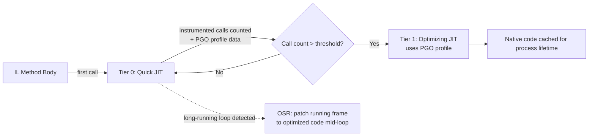
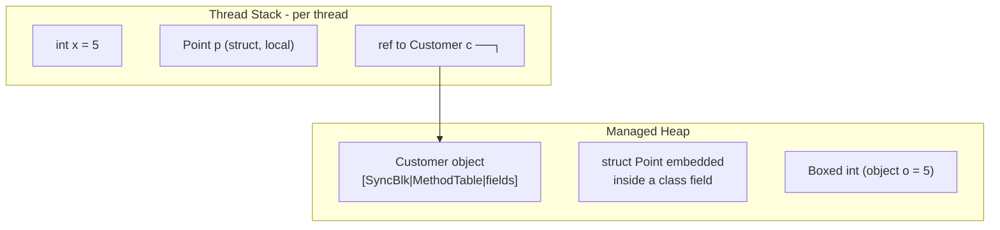
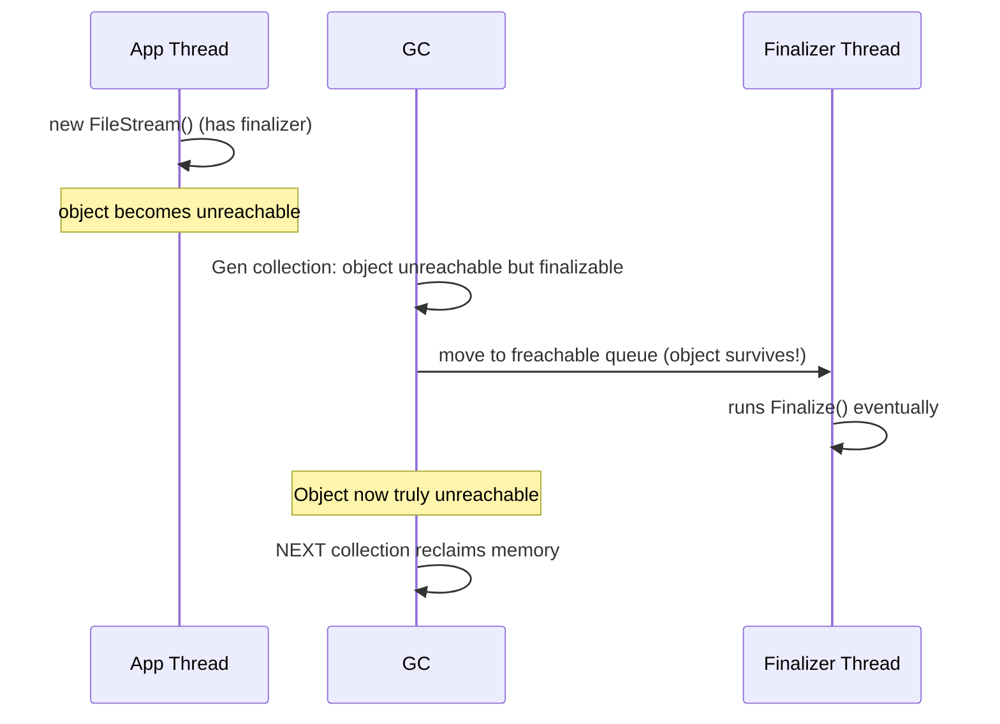
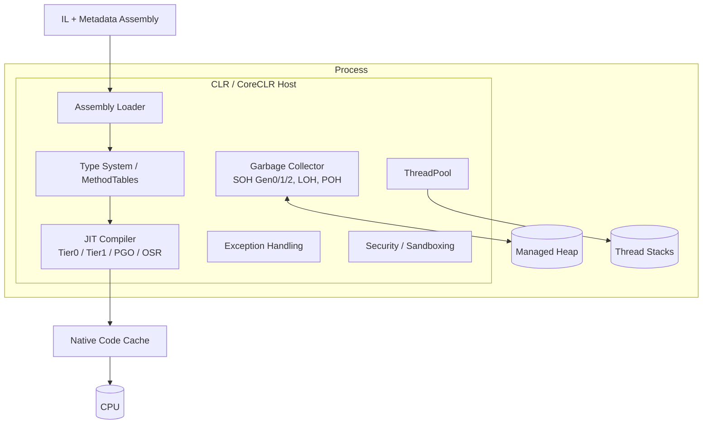
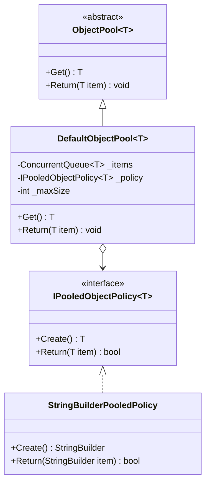
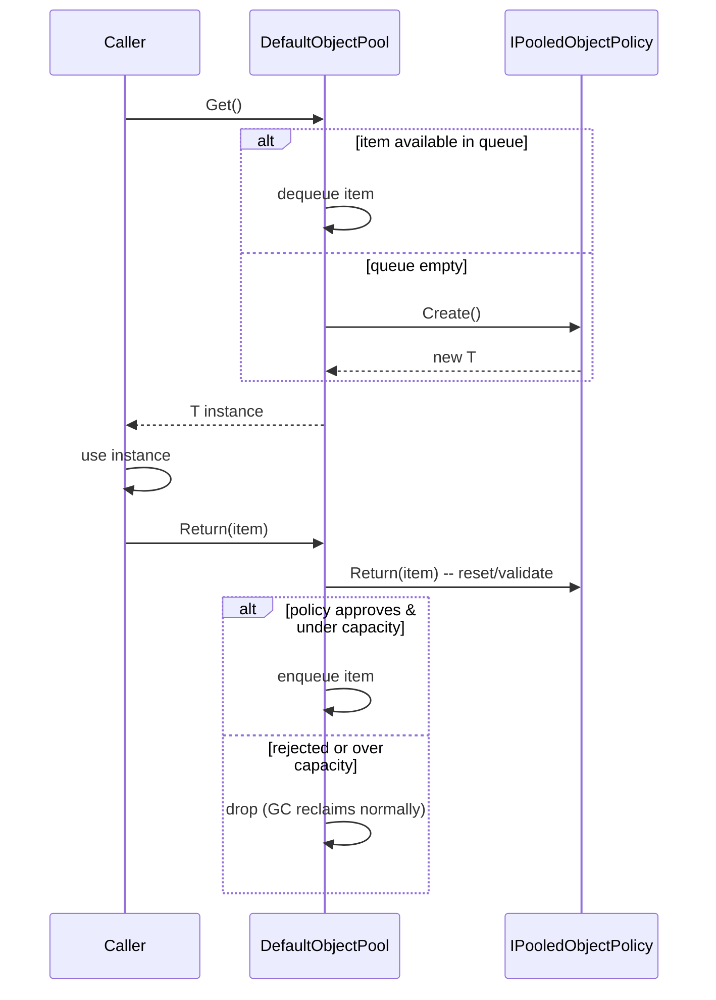

# Module 1 — C# Advanced: CLR, JIT, Garbage Collector & Memory Management

> Domain: C# | Level: Beginner → Expert | Prerequisite: none (assumes 10+ YOE baseline)
> Companion modules to revisit later: `Async/Await Internals`, `Span<T>/Memory<T> & Low-Allocation Code`, `Generics & Variance`

---

## 1. Fundamentals

### What is the CLR?
The **Common Language Runtime (CLR)** is the managed execution engine of .NET. When you compile C#, the compiler (`Roslyn`) does **not** produce native machine code — it produces **IL (Intermediate Language / MSIL)** plus metadata, packaged into an assembly (DLL/EXE). The CLR is the program that:

1. Loads assemblies and reads IL + metadata.
2. **JIT-compiles** IL into native machine code, method-by-method, on first call.
3. Manages memory automatically via the **Garbage Collector (GC)**.
4. Enforces type safety, security boundaries, and exception handling.
5. Provides services: threading (via the OS + CLR thread pool), reflection, interop (P/Invoke, COM), assembly loading, and structured exception handling (SEH-based).

### Why does it exist?
Before managed runtimes, C/C++ developers manually managed memory (`malloc`/`free`, `new`/`delete`) — a massive source of bugs (use-after-free, double-free, buffer overruns, memory leaks). The CLR trades a small amount of raw performance and determinism for:
- **Memory safety** (no dangling pointers, automatic reclamation).
- **Type safety** (no arbitrary pointer casting without explicit `unsafe`).
- **Portability** — IL is CPU-agnostic; the JIT targets x64, x86, ARM64, etc. (this is *how* .NET is cross-platform via CoreCLR).
- **Productivity** — automatic memory management removes an entire bug class from day-to-day development.

### When does this matter?
Every single C# program uses the CLR — you cannot opt out. But **understanding it deeply matters most when**:
- Diagnosing production incidents: high CPU, GC pauses, memory leaks, OOM.
- Writing high-throughput/low-latency code (trading systems, real-time APIs, game servers).
- Making architecture decisions: server vs workstation GC, container memory limits, object pooling strategies.
- Interviewing for Staff/Principal roles — this is the #1 "separates seniors from principals" topic in C# interviews because it requires connecting language semantics → runtime behavior → OS behavior.

### How does it work (30,000-ft view)?

```
 C# Source (.cs)
      │  Roslyn compiler (csc)
      ▼
 IL + Metadata (.dll/.exe)   ──── this is what gets shipped
      │  Assembly Loader (CLR)
      ▼
 Loaded into AppDomain/AssemblyLoadContext
      │  JIT Compiler (on first call per method)
      ▼
 Native machine code (cached in memory for process lifetime)
      │  CPU executes
      ▼
 Objects allocated on Managed Heap ── GC reclaims unreachable ones
```

Key mental model for interviews: **"IL is compiled twice."** Once ahead-of-time by Roslyn (C# → IL, this is what NuGet ships), and once at runtime by the JIT (IL → native), unless you use AOT compilation (NativeAOT, ReadyToRun) to shift work earlier.

---

## 2. Deep Dive

### 2.1 CLR Execution Pipeline in Detail

1. **Assembly loading**: The CLR's loader reads the PE (Portable Executable) header, finds the CLR metadata header, and loads type metadata lazily. Types are NOT fully loaded until first use (lazy type loading via `MethodTable` construction).
2. **Method invocation & stubs**: Every method starts with a *pre-JIT stub* in its `MethodTable` slot. First call → stub triggers JIT → native code address is patched into the slot → subsequent calls jump straight to native code. This is why the **first call to any method is slower** ("JIT warm-up").
3. **Type system internals**: Every object on the heap has an **object header** (in x64: 8 bytes **SyncBlockIndex** + 8 bytes **MethodTable pointer** = 16 bytes overhead per object before your fields even start). The `MethodTable` holds the vtable for virtual dispatch, type info, and static fields.

### 2.2 JIT Compiler Internals

.NET (Core 3.0+, and every version through .NET 8/9) uses **Tiered Compilation** by default:

- **Tier 0 (Quick JIT)**: Compiles fast, with minimal optimization, no loop optimization, so the app starts responding quickly. Includes on-stub-entry **call counting**.
- **Tier 1 (Optimized/Full JIT)**: After a method is called ~30 times (default threshold), it's re-JIT'd with full optimizations: inlining, loop cloning, devirtualization, register allocation, vectorization.
- **Tier 1 with PGO (Dynamic Profile-Guided Optimization, .NET 8+ default on)**: Tier 0 instruments branches/types actually seen at runtime (e.g., which concrete type flows through an interface call), then Tier 1 recompiles using *actual* runtime profile data — enabling aggressive **speculative devirtualization** and inlining that static analysis couldn't safely do.
- **OSR (On-Stack Replacement, .NET 7+)**: Long-running loops inside a Tier-0 method can be upgraded to optimized code *mid-execution*, without waiting for the method to return and be re-called. Solves the classic "hot loop in Main() never gets optimized" problem.
- **ReadyToRun (R2R)**: Precompiles IL to native at publish time (`dotnet publish -p:PublishReadyToRun=true`) so the JIT can skip Tier-0 compilation for those methods at startup — trades disk size and (slightly) peak-throughput for faster startup. Framework assemblies ship as R2R.
- **NativeAOT**: No JIT at all at runtime — fully native binary, no CLR loading step, smallest/fastest startup, but no runtime codegen (no `System.Reflection.Emit`, limited reflection, no dynamic loading).



**Interview-critical fact**: JIT'd code is **not persisted** — every process start re-JITs (unless R2R/AOT). This is why serverless/Lambda cold starts are painful for .NET without AOT.

### 2.3 Memory Layout — Stack vs Heap

- **Stack**: Per-thread, LIFO, fixed size (default 1MB on Windows), stores value-type locals, method call frames, return addresses. Extremely fast (pointer bump), automatically reclaimed when a frame pops. **`stackalloc`** lets you explicitly allocate on the stack.
- **Managed Heap**: Where reference types (`class`, arrays, delegates, closures, boxed value types, strings) live. Divided into generations for GC efficiency (see §2.4).

**Value types vs reference types — the actual rule** (commonly mis-stated): *"Value types are NOT always on the stack."* A value type lives wherever its **container** lives:
- Local variable/parameter of value type → stack (if not captured by a closure/iterator, and JIT doesn't otherwise need to move it to heap).
- Value type as a field of a class → lives on the heap, embedded inline in the containing object.
- Value type boxed (assigned to `object`/interface) → heap-allocated wrapper.
- Value type captured by a lambda closure or used in an `async` method → heap (part of the compiler-generated closure/state machine class).



### 2.4 Garbage Collector Internals — the deepest interview area

**Generational hypothesis**: most objects die young. .NET GC exploits this with 3 generations on the **SOH (Small Object Heap)**:

- **Gen 0**: Newly allocated objects. Small (few hundred KB–few MB), collected very frequently, very fast (usually <1ms).
- **Gen 1**: Survivors of one Gen 0 collection. Acts as a buffer between short-lived and long-lived.
- **Gen 2**: Long-lived objects (caches, singletons, static references). Collecting Gen 2 is expensive — it also implies collecting Gen 0/1 and, for a **full/blocking GC**, walking the whole graph.
- **LOH (Large Object Heap)**: Objects ≥ 85,000 bytes (arrays, big strings) go directly here. LOH is **not compacted by default** (fragmentation risk) — collected only during Gen 2 GCs. You can opt into compaction via `GCSettings.LargeObjectHeapCompactionMode`.
- **POH (Pinned Object Heap, .NET 5+)**: Objects pinned for interop (`fixed`, `GCHandle.Alloc(..., GCHandleType.Pinned)`) go here so pinning doesn't fragment/block compaction of the regular SOH.

**Allocation**: A bump-pointer allocator on Gen 0 — allocation is just incrementing a pointer (as fast as `stackalloc` in the common case) until the Gen 0 budget is exhausted, which triggers a collection.

**Collection algorithm**: Mark-and-Compact (aka Mark-Sweep-Compact):
1. **Mark**: Starting from *roots* (static fields, thread stacks, CPU registers, GC handles, finalization queue) walk the object graph, marking everything reachable.
2. **Sweep/Plan**: Determine which unreached objects can be reclaimed.
3. **Compact**: Slide surviving objects together to eliminate fragmentation and restore a fast bump-pointer allocation state. (Gen 2 compaction is more expensive and not always done every collection.)
4. **Update references**: Every root and every reference field pointing to a moved object must be updated — this is why GC needs to briefly suspend threads (or use write-barrier tricks for background GC).

**GC Modes** (huge interview topic):
| Mode | Use case | Behavior |
|---|---|---|
| **Workstation GC** | Client apps, desktop, low core-count | Single heap, optimized for low latency over throughput |
| **Server GC** | ASP.NET Core, high-throughput backend services | One heap + one dedicated GC thread **per core**, optimized for throughput, higher memory use |
| **Concurrent/Background GC** (default on) | Both modes | Gen 2 marking happens concurrently with app threads running ("background GC") to reduce pause times |
| **Sustained Low Latency (SustainedLowLatency)** | Trading systems, real-time | Avoids full blocking Gen 2 GCs as much as possible |
| **DATAS (Dynamic Adaptation To Application Sizes, .NET 8+)** | Server GC in containers | Dynamically scales heap count/size instead of always using core-count heaps — huge win for many small containerized services that used to over-provision memory |

**Write barriers & the Card Table**: When a Gen 2 object is mutated to point to a Gen 0/1 object, the GC needs to know (since it doesn't re-scan all of Gen 2 during a Gen 0 collection). The JIT emits a **write barrier** after every reference-field assignment that marks a byte in the **card table** corresponding to that memory region "dirty." Gen 0 collections then only need to scan dirty cards in Gen 2 as extra roots, instead of the whole Gen 2 heap. This is why "storing a reference to a young object inside an old, hot object" is a subtle performance cost — not free, though usually tiny.

**Finalization**: `~Finalizer` objects aren't collected immediately when unreachable — they're moved to a **freachable queue**, processed by a dedicated **finalizer thread**, and only actually reclaimed on the *next* GC after their finalizer runs. This means finalizable objects survive at least one extra GC generation-bump — a classic hidden cost. This is exactly why `IDisposable` + `Dispose()` (deterministic cleanup) is preferred, with finalizers only as a safety net for unmanaged resources.



### 2.5 Threading Model
- The CLR **ThreadPool** is a managed pool of worker threads used by `Task`, `async`/`await` continuations, timers, and I/O completion ports. It uses a **hill-climbing algorithm** to adjust thread count and has a "starvation avoidance" heuristic that injects new threads slowly (roughly 1/sec) if all threads are busy — a classic cause of the **thread pool starvation** production incident (see §14).
- GC in Server mode uses dedicated GC threads *pinned* to logical cores, separate from the ThreadPool.
- JIT compilation itself can occur on a background thread with tiered compilation (`TieredCompilation` + `TC_QuickJitForLoops`), so Tier 0→Tier 1 promotion doesn't block the calling thread.

### 2.6 Hidden Costs Checklist (what Principal Engineers are expected to know cold)
- Boxing a value type: heap allocation + copy, every single time.
- `params object[]` overloads box every value-type argument.
- Closures over loop variables/locals allocate a compiler-generated class on the heap.
- `async` methods compile to a state machine **struct or class** — if any `await` isn't hit synchronously, it's often promoted to heap (class) allocation.
- LINQ over value-type collections (`IEnumerable<T>` via `yield`) allocates iterator state machines + boxes the enumerator if used via non-generic interfaces.
- String concatenation in a loop: O(n²) copies; use `StringBuilder`.
- `virtual`/interface calls prevent inlining unless devirtualized by PGO.
- Object header overhead: 16 bytes/object (x64) — matters a lot when you have millions of small objects.

---

## 3. Visual Architecture

### CLR High-Level Component Diagram



### GC Heap Layout (ASCII)

```
Small Object Heap (SOH)                         Large Object Heap (LOH)     Pinned Object Heap (POH)
┌───────────┬───────────┬─────────────────┐     ┌────────────────────┐     ┌──────────────────┐
│  Gen 0    │  Gen 1     │     Gen 2       │     │ Objects >= 85,000B │     │ fixed()/GCHandle  │
│ (nursery) │ (buffer)   │ (long-lived)    │     │ not compacted by   │     │ .Pinned objects   │
│ freq. GC  │ occasional │ rare, expensive │     │ default            │     │                   │
└───────────┴───────────┴─────────────────┘     └────────────────────┘     └──────────────────┘
   ~fast <1ms    ~1-10ms      ~10-100ms+                                     never moved
```

---

## 4. Production Example

### Scenario: High-throughput Order Processing API (ASP.NET Core, .NET 8, Kubernetes)

**Problem**: A payments API serving ~8,000 req/s across 12 pods started showing p99 latency spikes of 400–800ms every ~15 seconds, correlated with CPU sawtooth patterns in Grafana.

**Investigation**:
- `dotnet-counters` showed `Gen 2 GC Count`, `% Time in GC` spiking to 25%+ during the latency spikes.
- `dotnet-gcdump` + `dotnet-trace` revealed large numbers of `byte[]` arrays >85KB from a JSON deserialization path using `MemoryStream` buffering full request/response bodies — landing on the **LOH**, fragmenting it, forcing frequent Gen 2/full GCs.
- Root cause: a middleware buffered the entire response into a `MemoryStream` for audit logging before writing to the client, for every request, and payloads were often 100–200KB (over the 85K LOH threshold).

**Architecture fix**:
- Replaced `MemoryStream` buffering with `RecyclableMemoryStreamManager` (Microsoft's pooled stream implementation) to reuse LOH-sized buffers instead of allocating new ones per-request.
- Switched Kestrel/ASP.NET Core to **Server GC** with **DATAS** enabled (`DOTNET_GCHeapHardLimit` tuned to the pod's memory `limits`, `GCHeapCount` left to DATAS) instead of static heap-count-per-core (which had over-provisioned memory across 12 pods with 4 vCPU requests each).
- Added `Server.MaxRequestBodySize` guard + streamed audit logging asynchronously instead of buffering.

**Trade-offs**: Pooling buffers reduces GC pressure but risks holding memory longer than strictly needed (pool doesn't shrink instantly) — accepted because pod memory limits were set with headroom, and it's a net win over LOH fragmentation and stop-the-world pauses.

**Lessons learned**:
1. Any per-request allocation ≥ 85KB is a red flag — assume LOH and design around pooling (`ArrayPool<byte>`, `RecyclableMemoryStreamManager`).
2. `% Time in GC` above ~10-15% sustained is an actionable signal, not noise.
3. Server GC's default "heap count = core count" is wrong for many small pods — DATAS (.NET 8+) or explicit `GCHeapCount` tuning is mandatory in Kubernetes.
4. Buffering entire payloads "just for logging" is an anti-pattern that principal-level review should catch before merge.

---

## 5. Best Practices

- **Use `Server GC` for backend services, `Workstation GC` for desktop/CLI tools.** Why: Server GC parallelizes collection across cores for throughput; Workstation minimizes latency/footprint for single-user apps. Don't flip this — Server GC on a desktop app wastes memory (one heap per core) for no benefit.
- **Enable Concurrent (Background) GC** (default) unless you have a very specific reason to disable it (rare embedded/real-time scenarios) — it dramatically cuts pause times for Gen 2 collections.
- **Pool large/frequent allocations**: `ArrayPool<T>.Shared`, `ObjectPool<T>` (Microsoft.Extensions.ObjectPool), ASP.NET Core's built-in buffer pooling. Use when allocation rate is provably a bottleneck (measure first!) — don't pool everything reflexively, pooling adds complexity and can leak state between reuses if not reset correctly.
- **Use `Span<T>`/`Memory<T>`/`ReadOnlySpan<T>`** for parsing/slicing without allocating substrings/subarrays. Use when writing hot-path parsing code (e.g., custom protocol parsers); avoid over-using in ordinary CRUD code where clarity matters more than micro-optimization.
- **Set container memory limits AND `DOTNET_GCHeapHardLimit`/`DOTNET_gcServer` explicitly** in Kubernetes — never rely on defaults detecting cgroup limits correctly across all K8s/cloud-provider quirks; verify with `dotnet-counters`.
- **Prefer `IDisposable` + `using` over finalizers.** Only add a finalizer when directly holding an unmanaged handle, and always pair it with the Dispose pattern (`GC.SuppressFinalize`) so the fast path avoids finalization overhead entirely.
- **Use ReadyToRun/NativeAOT for latency-sensitive cold-start scenarios** (Lambda, Azure Functions, CLI tools) — don't bother for long-running services where steady-state throughput matters more than startup.

---

## 6. Anti-patterns

- **Calling `GC.Collect()` manually in app code.** Why it fails: forces a full blocking Gen 2 collection, undoing generational optimization; almost always makes things *worse* under load. Fix: trust the GC; if you must (e.g., after a huge one-time batch job frees gigabytes), use `GC.Collect(2, GCCollectionMode.Optimized, blocking:false)` sparingly and only with measurement proving it helps.
- **Catching `OutOfMemoryException` and continuing.** Why it fails: OOM often leaves the process in a corrupted/unpredictable state; recovery is rarely safe. Fix: let the process crash/restart (in K8s, let the liveness probe restart the pod) and fix the root allocation cause.
- **Excessive boxing via non-generic collections (`ArrayList`, `Hashtable`) or `object`-typed APIs.** Fix: use generic collections (`List<T>`, `Dictionary<K,V>`) exclusively in modern code.
- **String concatenation in loops (`s += x`).** Why it fails: each `+=` allocates a brand-new string (strings are immutable) — O(n²) total allocation/copy. Fix: `StringBuilder`, or `string.Create`/`string.Join` for known patterns.
- **Large object graphs pinned via long-lived static caches with no eviction.** Why it fails: promotes everything to Gen 2, grows the working set indefinitely — a "logical" (not literal) memory leak. Fix: bounded caches (`MemoryCache` with size limits, LRU eviction, or `Microsoft.Extensions.Caching` with expiration).
- **Ignoring `IDisposable` on `DbContext`/`HttpClient`-like objects.** Fix: `using`/`await using`, or DI-managed lifetimes (scoped/singleton as appropriate — note: don't `new HttpClient()` per request either, use `IHttpClientFactory` — a different but related resource-lifetime anti-pattern).
- **Assuming struct = "always cheap, always stack, always fast."** Large structs copied by value repeatedly (passed by value into multiple method calls, stored in arrays/collections) can be *slower* than a class reference due to copy costs. Fix: pass large structs by `in`/`ref readonly`; benchmark before assuming.

---

---

---

---

## 10. Interview Questions

### Basic (10)

1. **Q: What is the difference between IL and native code, and who produces each?**
   **A:** IL (Intermediate Language) is produced by the C# compiler (Roslyn) at build time — it's CPU-agnostic bytecode + metadata. Native machine code is produced by the JIT compiler at runtime (or ahead-of-time via R2R/NativeAOT), and is CPU-architecture-specific.
   **Why correct:** Demonstrates understanding of the two-stage compilation model fundamental to managed runtimes.
   **Common mistake:** Saying "C# compiles directly to machine code" — conflates AOT languages with managed runtimes.
   **Follow-ups:** "What's in the metadata besides IL?" (type info, attributes, references) / "What is ReadyToRun?"

2. **Q: What are the CLR's generations, and why do they exist?**
   **A:** Gen 0, 1, 2 on the SOH, based on the generational hypothesis that most objects die young. Gen 0 is collected most often and cheaply; promotions to Gen 1/2 happen for survivors, reducing how often expensive full scans are needed.
   **Why correct:** Shows understanding of *why*, not just naming generations.
   **Common mistake:** Reciting generations without explaining the hypothesis behind them.
   **Follow-ups:** "What's the LOH threshold?" (85,000 bytes) / "Is LOH compacted?"

3. **Q: What's the difference between a value type and a reference type?**
   **A:** Value types (`struct`, primitives, enums) hold their data directly and are copied by value on assignment/passing; reference types (`class`, arrays, delegates, strings) hold a reference to heap-allocated data, copied by reference.
   **Why correct:** Core C# semantics question.
   **Common mistake:** "Value types are always on the stack" — false; depends on the container (see §2.3).
   **Follow-ups:** "When is a struct heap-allocated?"

4. **Q: What is boxing and why is it expensive?**
   **A:** Boxing wraps a value type in a heap-allocated object so it can be treated as `object`/interface. It costs a heap allocation + a field copy, and later GC pressure to reclaim it.
   **Follow-ups:** "How do generics avoid boxing?" (JIT generates specialized native code per value-type instantiation, no boxing needed).

5. **Q: What triggers a garbage collection?**
   **A:** Gen 0 budget exhaustion (most common), explicit `GC.Collect()`, low memory notification from the OS, or `AppDomain` unload.
   **Follow-ups:** "What are GC roots?"

6. **Q: What is a GC root?**
   **A:** A starting reference the GC uses to determine reachability: static fields, local variables/parameters on thread stacks, CPU registers, GC handles (`GCHandle`), and the finalization queue.

7. **Q: What's the difference between Server GC and Workstation GC?**
   **A:** Server GC uses one heap + GC thread per core for throughput (backend services); Workstation GC uses a single heap optimized for low-latency, low-footprint (desktop/CLI).

8. **Q: What is `IDisposable` for, and how does it relate to the GC?**
   **A:** It provides deterministic release of unmanaged resources (file handles, sockets, DB connections) that the GC cannot know how to release on its own timeline; `Dispose()` should be called explicitly (via `using`) rather than relying on the GC/finalizer.

9. **Q: What is a memory leak in a garbage-collected language, and how is it possible?**
   **A:** Not classic "forgot to free" — it's *unintentionally keeping a reference alive* (static caches without eviction, subscribed event handlers never unsubscribed, captured closures in long-lived callbacks) so the GC (correctly) never reclaims it because it's technically still reachable.

10. **Q: What's the difference between Debug and Release build in terms of JIT?**
    **A:** Release builds allow full JIT optimizations (inlining, etc.); Debug builds disable many optimizations and add extra padding/no-op instructions to keep debugging (stepping, variable inspection) reliable. Always benchmark/profile Release builds.

### Intermediate (10)

1. **Q: Explain Tiered Compilation and why it exists.**
   **A:** Tier 0 (Quick JIT) compiles fast with minimal optimization to reduce startup latency; methods called frequently (~30 calls default) are recompiled as Tier 1 with full optimizations. Balances startup time against steady-state throughput. Follow-up: "What is OSR and what problem does it solve?" (upgrading a long-running Tier-0 loop mid-execution without waiting for method re-entry).

2. **Q: Why can Gen 2 collections be expensive, and how does Background/Concurrent GC help?**
   **A:** Gen 2 holds long-lived objects and requires walking a potentially large object graph; Background GC does the marking phase concurrently with running app threads (using write barriers/card tables to track mutations), only briefly pausing for the final compaction-related work, cutting pause time significantly vs a fully blocking Gen 2 GC.

3. **Q: What is a write barrier and why does the GC need it?**
   **A:** A small piece of code the JIT inserts after every reference-field write that marks the containing memory region "dirty" in the card table, so a Gen 0/1 collection knows which Gen 2 objects might now point to young objects, without rescanning all of Gen 2.

4. **Q: What's the difference between `Dispose()` and a finalizer, and why do finalizable objects survive longer?**
   **A:** `Dispose()` is deterministic, caller-invoked. A finalizer runs on a separate finalizer thread *after* the GC first determines the object unreachable — the object is resurrected onto the freachable queue and only reclaimed on the *next* collection, meaning finalizable objects effectively survive one extra GC cycle if not disposed properly. Always call `GC.SuppressFinalize(this)` in `Dispose()` to skip this cost.

5. **Q: How does `async`/`await` interact with GC and allocations?**
   **A:** An `async` method is compiled into a state machine (struct by default in modern C#, promoted to a class/heap allocation once it needs to survive an actual asynchronous suspension point). Each `await` that doesn't complete synchronously can involve continuation delegate allocation, especially when capturing context (`SynchronizationContext`/`ExecutionContext`) — this is why `ValueTask` and `ConfigureAwait(false)` matter in hot paths.

6. **Q: What's the LOH, why isn't it compacted by default, and what problem does that cause?**
   **A:** Objects ≥ 85,000 bytes. Compaction (moving objects) is expensive for large objects, so historically LOH wasn't compacted at all, leading to fragmentation (free gaps too small for new large allocations, causing the heap to grow even with "enough" total free memory). `GCSettings.LargeObjectHeapCompactionMode = CompactOnce` allows opting into one-time compaction.

7. **Q: What is `Span<T>` and how does it avoid allocations?**
   **A:** A ref-struct (stack-only) type providing a type-safe, memory-safe view over contiguous memory (array, stack, native memory) without copying — enables slicing/parsing (`Substring`-like operations) with zero heap allocation, at the cost of being restricted from use in async methods, iterators, or as a class field (because it can point to stack memory that would become invalid).

8. **Q: Explain the card table.**
   **A:** A bitmap-like structure where each bit/byte represents a range of heap memory; write barriers set bits when a reference in that range is mutated. Younger-generation collections scan only "dirty" card ranges in older generations as additional roots, avoiding an O(heap size) scan on every Gen 0 GC.

9. **Q: What is thread pool starvation and how does it relate to the CLR?**
   **A:** When all managed thread pool worker threads are blocked (typically due to synchronous blocking calls like `.Result`/`.Wait()` on async work, or long CPU-bound work), new work queues up; the pool's growth heuristic only injects new threads slowly (~1/sec), causing cascading latency. Fix: avoid sync-over-async, use `await`, size the pool deliberately only as a last resort (`ThreadPool.SetMinThreads`).

10. **Q: What's the practical difference between `struct` performance benefits and pitfalls?**
    **A:** Benefits: no heap allocation/GC pressure for short-lived small values, better cache locality in arrays. Pitfalls: large structs copied by value on every parameter pass/return/array-index-access can be *slower* than a reference; mutable structs stored in collections are a classic bug source (mutating a copy, not the original) — pass with `in`/`ref readonly` for large read-only structs.

### Advanced (10)

1. **Q: Walk through exactly what happens, at the runtime level, when a Gen 0 GC occurs during a background GC in progress on Gen 2.**
   **A:** Background GC concurrently marking Gen 2 doesn't block ephemeral (Gen 0/1) collections — .NET supports a Gen 0/1 "foreground" collection to run *during* a background Gen 2 collection (with brief synchronization), because ephemeral collections are cheap and latency-critical; the background Gen 2 marking pauses briefly, lets the foreground ephemeral GC complete, then resumes. This nested behavior is what makes Background GC genuinely low-pause under real production load rather than just "concurrent in name."

2. **Q: How does PGO (Profile-Guided Optimization) enable speculative devirtualization, and what happens if the profile is wrong?**
   **A:** Tier 0 code is instrumented to record which concrete type actually flows through an interface/virtual call site at runtime. Tier 1 recompilation can then emit a direct call with a type-check guard ("if type == X, call directly; else fall back to virtual dispatch") — turning an indirect call into a branch-predictable direct call, enabling inlining. If the runtime profile was atypical (e.g., first few calls were an unusual type), the guard simply falls back to normal virtual dispatch — correctness is never at risk, only the optimization opportunity is missed.

3. **Q: Explain the relationship between `ExecutionContext`, `SynchronizationContext`, and allocations in async code.**
   **A:** Every `await` captures `ExecutionContext` (for `AsyncLocal`, security context propagation) by default, which can involve a small allocation if it has changed since the last capture. `SynchronizationContext.Current` (e.g., ASP.NET Framework's or WPF's) is also captured to marshal the continuation back to the right thread — `ConfigureAwait(false)` skips this capture in library code, saving both the marshaling cost and avoiding potential deadlocks from sync-over-async on a captured context.

4. **Q: Why does `Server GC` combined with small containers cause OOMKills in Kubernetes, and how does DATAS fix it?**
   **A:** Server GC historically allocates heap count = logical processor count, each with its own Gen 0 budget sized for throughput — in a container with a CPU *limit* but the runtime seeing the host's full core count (or over-provisioned request/limit ratios), this multiplies committed memory far beyond the container's memory limit, causing OOMKill. DATAS (.NET 8+) makes Server GC dynamically size heap count/segment sizes based on actual application memory behavior rather than blindly using core count, dramatically reducing baseline memory footprint for many small container replicas.

5. **Q: What's the actual object header layout on x64, and why does it matter for memory-dense workloads?**
   **A:** 8 bytes SyncBlockIndex (used for `lock`/`Monitor`, hashcode caching, some COM interop state) + 8 bytes MethodTable pointer = 16 bytes fixed overhead per object, before alignment padding. For workloads with millions of tiny objects (e.g., a huge `List<SmallClass>`), this overhead can dominate actual data size — motivating a switch to `struct`-based/array-of-struct layouts, or `Span<T>`-based flat buffers.

6. **Q: Explain how NativeAOT changes the GC/JIT story, and its trade-offs.**
   **A:** NativeAOT compiles everything to native code ahead of time — no JIT at runtime, no tiered compilation, so it starts with "Tier 1"-equivalent code immediately, but loses PGO's runtime-profile-based speculative optimization (must rely on static analysis or AOT-time training data), loses most `Reflection.Emit`/dynamic codegen capability, and requires trimming (dead-code elimination) which can break reflection-heavy libraries unless properly annotated. GC itself remains largely the same (still generational, same SOH/LOH/POH structure).

7. **Q: How would you diagnose a "memory leak" versus "high but stable Gen 2 usage" in production, and what tools would you use?**
   **A:** Take two `dotnet-gcdump` snapshots under load separated by time/traffic cycles; diff object counts by type — if a specific type's count grows monotonically across cycles (not just proportional to load), that's a leak (find GC roots keeping it alive via the dump's reference-graph view). If Gen 2 is high but *stable* across cycles (grows then plateaus), that's likely a legitimately-sized cache/singleton set, not a leak — validate with `dotnet-counters` over a longer window and correlate with request volume.

8. **Q: What is the difference in how `Task`-returning `async` methods vs `IAsyncEnumerable` state machines allocate, and why would you choose `ValueTask`?**
   **A:** A standard `Task<T>`-returning method allocates a `Task<T>` object even when the result is available synchronously (unless pooled/cached, e.g. `Task.FromResult` for common values); `ValueTask<T>` avoids that allocation in the synchronous-completion path by wrapping either the result directly or a pooled `IValueTaskSource`, at the cost of `ValueTask` having stricter usage rules (can't be awaited twice, can't use `.Result` casually) — appropriate for hot-path APIs where synchronous completion is common (e.g., cache-hit paths).

9. **Q: What GC-related settings would you tune differently between a latency-sensitive trading API and a batch ETL job, and why?**
   **A:** Trading API: Workstation or Server+Concurrent GC, `SustainedLowLatency` mode during critical windows, avoid LOH churn, possibly `GCLatencyMode.SustainedLowLatency`, pre-warm/pre-JIT via ReadyToRun, pin critical buffers via `POH` to avoid pinning-induced fragmentation. Batch ETL: Server GC for throughput, allow full blocking Gen 2 GCs (latency irrelevant), potentially raise `GCHeapHardLimitPercent` since the job owns the whole machine/container, and explicitly `GC.Collect()` between discrete batch phases *if* profiling shows it helps reclaim before the next batch's peak.

10. **Q: Explain exactly why a `struct` implementing an interface and used via that interface type causes boxing, and what generic constraints can avoid it.**
    **A:** Assigning a struct to an interface-typed variable requires boxing because the interface reference must point to heap data with a MethodTable (structs otherwise have no vtable). Using a generic method with a `where T : IMyInterface` constraint instead of typing the parameter as `IMyInterface` lets the JIT generate a specialized native code path per concrete value type (via generic specialization for value types, unlike reference types which share one instantiation) — calling interface members directly on the unboxed struct with no heap allocation, at the cost of code-size growth (one JIT'd method per value-type instantiation).

### Expert (10)

1. **Q: Design the GC configuration and memory strategy for a multi-tenant SaaS platform running thousands of small ASP.NET Core pods (0.5 vCPU / 512MB limit each) in Kubernetes, versus a monolithic high-throughput matching engine on dedicated 32-core bare metal. Justify every choice.**
   **A:** *Small pods*: Server GC with DATAS enabled (or Workstation+Concurrent if DATAS unavailable/older runtime) to avoid the classic "heap-count = core-count" over-commit; explicit `DOTNET_GCHeapHardLimit` set just under the container memory limit (leaving headroom for non-GC-heap memory: thread stacks, native allocations, JIT code cache); aggressive `ArrayPool`/buffer pooling since even small per-request allocations matter at this density; readiness/liveness probe timeouts tuned above expected p99.9 GC pause. *Matching engine*: Server GC without artificial heap limits (own the whole machine), `SustainedLowLatency` during market-hours critical windows, heavy use of pre-allocated/pooled buffers and possibly `stackalloc`/`Span<T>` to avoid GC involvement entirely on the hottest path, ReadyToRun or even NativeAOT to eliminate JIT warm-up variance at process start (matters at market open), pinned buffers isolated to POH to avoid fragmenting SOH.

2. **Q: A production incident shows p99 latency spikes exactly every 45 seconds, precisely correlated with Gen 2 collections, but `% Time in GC` overall is only 3%. Why might this still be a real problem worth fixing, and how would you approach it?**
   **A:** Average `% Time in GC` hides tail latency — a rare but long stop-the-world (or background-GC's brief final blocking phase) can single-handedly blow p99/p99.9 SLA even at low average overhead. Approach: capture ETW/`dotnet-trace` events specifically around GC pause spans (`GC/SuspendEEStart`, `GC/RestartEEStop` events) to measure actual suspension duration; check whether it's genuinely GC-induced pause or a GC-adjacent effect (e.g., a large number of finalizable objects delaying thread resumption, or a huge object graph requiring long mark phase). Fixes: reduce Gen 2 promotion rate (root-cause: what's being promoted that shouldn't be — often an accidental long-lived reference), consider pre-emptive scheduled `GC.Collect(2, Optimized)` during known-idle windows (e.g., between traffic waves) to control *when* the expensive collection happens rather than letting it happen at an inconvenient moment, or move to a lower-latency GC mode.

3. **Q: Explain precisely how the JIT's escape analysis (or lack thereof) affects whether a `struct` local ends up stack- or heap-allocated in real .NET (not a hypothetical language), and what practical guidance follows.**
   **A:** The .NET JIT (as of .NET 8/9) does **not** do general heap-elision/escape-analysis for reference types the way, e.g., some JVMs attempt — but for **value types**, if a struct local's address is never taken in a way that escapes the method (not passed by `ref` to something outside, not stored into a field, not boxed, not captured by a closure/iterator/async state machine), it stays a stack-resident value with no heap involvement at all; the compiler and JIT together determine this at compile-time/JIT-time based on those escape rules, not a runtime dataflow analysis. Practical guidance: keep structs as pure local values, avoid boxing/capturing them, and don't assume "escape analysis will save my `class` allocation" — for reference types, the only way to avoid heap allocation is not to allocate a `class` instance in the first place (use a `struct`/`readonly struct`, `Span<T>`, or pooling).

4. **Q: How would you reason about whether to enable `GCHeapHardLimit` vs relying on cgroup memory-limit auto-detection, in a shared Kubernetes node with unpredictable neighbor workloads?**
   **A:** Auto-detection reads the cgroup limit at process start and sizes the GC heap budget accordingly — generally reliable on modern .NET/K8s, but brittle if the limit changes at runtime (VPA resizing) or if cgroup v1 vs v2 detection quirks exist on older node images. Explicit `GCHeapHardLimit`/`GCHeapHardLimitPercent` gives deterministic, auditable behavior independent of platform quirks, at the cost of needing to keep it in sync manually if K8s resource requests/limits change (config drift risk). Recommendation for shared/noisy nodes: explicit hard limit set slightly below the container limit (e.g., 80-85%) as a deliberate safety margin against non-GC-heap memory growth (native allocations, thread stacks) — treat GC heap limit as one deliberately-managed budget line, not an emergent property of cgroup detection.

5. **Q: A team proposes disabling Server GC and Concurrent GC entirely, setting `GCLatencyMode.Batch`, to squeeze 15% more throughput out of a batch reporting service. Evaluate this from a Principal Engineer's perspective.**
   **A:** Technically plausible — batch mode disables background GC and permits fully blocking collections, which can reduce total GC overhead for a workload with no latency SLA and no concurrent user-facing traffic on that process. Principal-level evaluation: confirm the service genuinely has zero latency-sensitive callers (including internal health checks/orchestration that might time out during long blocking pauses), confirm it's an isolated process (not sharing a pod/host with latency-sensitive services where a multi-second blocking GC could starve CPU from neighbors), and require the change be justified with BenchmarkDotNet/production A-B measurement, not the claimed 15% alone — throughput-vs-latency trade-offs must be validated under representative load, and the decision documented (ADR) since it's a non-default, surprising configuration a future engineer needs context for.

6. **Q: Explain how `AsyncLocal<T>` interacts with `ExecutionContext` flow and GC, and a scenario where its misuse causes a memory leak.**
   **A:** `AsyncLocal<T>` values are stored in an immutable `ExecutionContext` snapshot that's captured/flowed across `await` boundaries and thread-pool work items; each `.Value` set creates a new immutable context node. Misuse scenario: storing a large object (e.g., a request-scoped cache or a big dictionary) in an `AsyncLocal` at the *start* of a long-lived ambient context (e.g., set once at app startup instead of per-request) causes every subsequent async flow branching from that root context to keep referencing it — effectively a leak because the reference chain keeps a large object rooted far longer than intended, invisible in typical single-object heap dumps since it looks "reachable via ExecutionContext," not via a suspicious static field.

7. **Q: Compare the actual runtime behavior differences between `Task.Run(...).Result` deadlocking on a UI/ASP.NET (classic) `SynchronizationContext` vs the same code on ASP.NET Core, and explain precisely why one deadlocks and the other doesn't (usually).**
   **A:** Classic ASP.NET (Framework) and WPF/WinForms install a `SynchronizationContext` that marshals continuations back to a single captured context (UI thread / one-thread-at-a-time request context); blocking that thread with `.Result`/`.Wait()` while the awaited continuation is *also* queued to run on that same captured context creates a deadlock (continuation can never run because the only thread allowed to run it is blocked waiting for it). ASP.NET Core has **no such `SynchronizationContext`** by default — continuations resume on an arbitrary thread-pool thread, so `.Result` blocking usually doesn't deadlock, but it still causes thread-pool starvation risk under load (blocks a pool thread while waiting), which is a related but distinct problem from the classic deadlock.

8. **Q: How does the CLR's card table granularity create a trade-off, and what would changing that granularity (hypothetically) cost/save?**
   **A:** Coarser granularity (one card covers a larger memory range) means fewer write-barrier-checked bits to set/scan, cheaper writes, but a dirty card forces scanning its *entire* range for cross-generational pointers during ephemeral GCs, even if only a tiny part of that range actually changed — over-scanning cost. Finer granularity reduces false-positive scan work per ephemeral GC but increases the per-write-barrier bookkeeping cost and card table memory overhead. The real CLR picks a fixed, tuned granularity as an engineering trade-off between write-barrier overhead (paid on every reference write, extremely frequent) and ephemeral-GC scan overhead (paid periodically) — illustrating a general Principal-level pattern: **fixed-cost-per-operation vs periodic-batch-cost trade-offs** recur throughout systems design (this is the same shape of trade-off as index-write-cost vs query-scan-cost in databases).

9. **Q: You must choose between NativeAOT and standard JIT+ReadyToRun for a new fleet of Azure Functions (Consumption plan). Walk through the full decision.**
   **A:** Consumption plan bills per execution + has meaningful cold-start sensitivity since instances scale to zero. NativeAOT eliminates JIT entirely (fastest possible cold start, smallest memory footprint, no warm-up latency curve) but restricts reflection-heavy features (some DI container internals, dynamic serialization patterns) requiring trimming-safe code and functions-runtime NativeAOT support maturity for the specific bindings used. ReadyToRun keeps full JIT/reflection capability (safer for complex DI/serialization-heavy code, dynamic plugin loading) while still improving cold start over pure JIT, at a smaller (but real) startup win vs NativeAOT and a larger deployed artifact. Decision: if the functions are simple, binding-light, reflection-light (e.g., pure HTTP-trigger logic with source-generated JSON serialization) → NativeAOT for maximum cold-start win; if they're binding-heavy/DI-heavy/using libraries not yet trim-safe → ReadyToRun now, with NativeAOT tracked as a future migration once ecosystem support catches up.

10. **Q: As a Principal Engineer, how would you structure an org-wide guideline document on GC/memory tuning so that teams don't cargo-cult "just enable Server GC everywhere" or "just call GC.Collect() when memory looks high"?**
    **A:** Structure as a decision tree tied to *measured* symptoms, not defaults: (1) mandate `dotnet-counters`/APM (Application Insights, Datadog .NET APM) GC metrics be part of every service's standard dashboard before any tuning conversation happens; (2) require any GC-mode or heap-limit change to cite specific counter evidence (`% Time in GC`, `Gen 2 collections/sec`, `Allocation Rate`) and a BenchmarkDotNet or load-test before/after comparison in the PR/ADR; (3) explicitly blocklist `GC.Collect()` in application code review except with a documented, reviewed exception (e.g., known one-time bulk-free points); (4) provide two or three pre-vetted "profiles" (small-container-service, high-throughput-server, latency-critical) as copy-paste `runtimeconfig.json` starting points instead of letting every team rediscover settings from scratch; (5) require container memory-limit and GC-heap-limit changes to go through the same review gate as any other capacity-planning change, since they have direct cost/incident-risk implications. This turns tribal knowledge into a repeatable, auditable process — the actual job of a Principal Engineer's "architecture governance" function.

---

## 11. Coding Exercises

### Easy — Detect boxing in a code snippet & fix it
**Problem**: Given this method, identify and eliminate the boxing allocation.
```csharp
void PrintAll(object[] items) // called with PrintAll(new object[]{1,2,3})
{
    foreach (var item in items) Console.WriteLine(item);
}
```
**Solution**:
```csharp
void PrintAll<T>(T[] items)
{
    foreach (var item in items) Console.WriteLine(item);
}
// call: PrintAll(new int[]{1,2,3}); // no boxing, JIT specializes for int
```
**Time complexity**: O(n) either way. **Space**: Original boxes each `int` → n heap allocations; generic version → 0 heap allocations for the array elements.
**Optimized**: Already optimal; for `IEnumerable<T>` sources use `Span<T>`-based iteration if data is contiguous, to also avoid enumerator allocation.

### Medium — Implement a bounded object pool (mimic `ObjectPool<T>`)
**Problem**: Implement a thread-safe pool of reusable `StringBuilder` instances, capped at N, to reduce GC pressure in a hot logging path.
```csharp
public sealed class SimpleObjectPool<T> where T : class
{
    private readonly ConcurrentBag<T> _items = new();
    private readonly Func<T> _factory;
    private readonly int _maxSize;
    private int _count;

    public SimpleObjectPool(Func<T> factory, int maxSize)
    {
        _factory = factory;
        _maxSize = maxSize;
    }

    public T Rent() => _items.TryTake(out var item) ? item : _factory();

    public void Return(T item)
    {
        if (Interlocked.Increment(ref _count) <= _maxSize)
            _items.Add(item);
        else
            Interlocked.Decrement(ref _count);
    }
}
```
**Time complexity**: O(1) amortized rent/return (ConcurrentBag uses thread-local lists). **Space**: O(maxSize) steady-state.
**Optimized**: Use `Microsoft.Extensions.ObjectPool.DefaultObjectPool<T>` in production (battle-tested, includes `IResettable` support) rather than hand-rolling — this exercise is for understanding the mechanism.

### Hard — Diagnose and fix a Gen 2/LOH-heavy allocation pattern
**Problem**: This method is called per-request in a hot API and is suspected of causing LOH fragmentation. Fix it.
```csharp
public byte[] SerializeAndCompress(MyDto dto)
{
    using var ms = new MemoryStream(); // grows internal buffer via doubling, can exceed 85K
    JsonSerializer.Serialize(ms, dto);
    return Compress(ms.ToArray()); // ToArray() = another full copy allocation
}
```
**Solution**:
```csharp
public async Task WriteCompressedAsync(MyDto dto, Stream destination, RecyclableMemoryStreamManager mgr)
{
    using var ms = mgr.GetStream(); // pooled, reused buffers, avoids ad-hoc LOH allocations
    await JsonSerializer.SerializeAsync(ms, dto);
    ms.Position = 0;
    using var gzip = new GZipStream(destination, CompressionLevel.Fastest, leaveOpen: true);
    await ms.CopyToAsync(gzip); // streams directly, no intermediate byte[] copy at all
}
```
**Time complexity**: Same O(n) in payload size. **Space**: Original: up to 2–3x payload size in transient allocations (`MemoryStream` internal buffer growth + `ToArray()` copy + compressed output array), frequently landing on LOH. Optimized: pooled buffer reuse via `RecyclableMemoryStreamManager` + streaming compression avoids the extra full-array copies and LOH churn entirely.
**Optimized further**: If payload sizes are highly variable and often small, consider `ArrayPool<byte>.Shared.Rent`/`Return` directly for the rare cases where you truly need a `byte[]`, sized to actual need via `RecyclableMemoryStream.GetBuffer()`/`TryGetBuffer()`.

### Expert — Implement a low-allocation ring buffer log sink using `Span<T>` and pre-allocated arrays
**Problem**: Implement a fixed-capacity, allocation-free (post-warm-up) circular buffer that stores fixed-width log entries and can be scanned without allocating.
```csharp
public sealed class RingLogBuffer
{
    private readonly byte[] _buffer;      // single pre-allocated backing array
    private readonly int _entrySize;
    private readonly int _capacity;
    private int _writeIndex;
    private int _count;
    private readonly object _lock = new();

    public RingLogBuffer(int entrySize, int capacity)
    {
        _entrySize = entrySize;
        _capacity = capacity;
        _buffer = new byte[entrySize * capacity]; // one allocation, ever
    }

    public void Write(ReadOnlySpan<byte> entry)
    {
        if (entry.Length > _entrySize) throw new ArgumentException("entry too large");
        lock (_lock)
        {
            var offset = _writeIndex * _entrySize;
            var dest = _buffer.AsSpan(offset, _entrySize);
            dest.Clear();
            entry.CopyTo(dest);
            _writeIndex = (_writeIndex + 1) % _capacity;
            _count = Math.Min(_count + 1, _capacity);
        }
    }

    // Caller-provided callback avoids allocating an IEnumerable/array on every scan
    public void ScanNewestFirst(SpanAction<byte> onEntry)
    {
        lock (_lock)
        {
            for (int i = 0; i < _count; i++)
            {
                int idx = (_writeIndex - 1 - i + _capacity) % _capacity;
                onEntry(_buffer.AsSpan(idx * _entrySize, _entrySize));
            }
        }
    }
}
public delegate void SpanAction<T>(Span<T> span);
```
**Time complexity**: O(1) write, O(n) full scan (n = current count). **Space**: O(entrySize × capacity), allocated exactly once — steady-state zero GC allocation for both write and scan paths (no boxing, no per-call array/iterator allocation).
**Discussion points for interview**: Why `Span<byte>` instead of `byte[]` in the API (avoids forcing callers to allocate/copy); why a single backing array beats an array-of-arrays (cache locality + one GC-tracked object instead of `capacity` objects); the lock is a simplification — a lock-free SPSC ring buffer (`Interlocked` CAS on indices) would be the natural "make it even better" follow-up for a truly single-producer/single-consumer scenario.

---

## 12. System Design

*(Applied narrowly here — full System Design gets its own dedicated module later. This shows how GC/memory reasoning feeds a design decision.)*

**Scenario**: Design the memory/runtime configuration strategy for a **real-time bidding (RTB) ad service** requiring p99 < 10ms, 50,000 req/s per node.

- **Functional**: Accept bid request → score against in-memory model/cache → return bid response within strict SLA.
- **Non-functional**: p99 < 10ms (GC pauses are a direct SLA threat), high throughput, horizontally scalable, must degrade gracefully (drop/timeout bids rather than violate SLA).
- **Architecture**: Stateless .NET services behind a load balancer; hot data (pricing models, targeting rules) held in-process as read-only, pre-built immutable structures (avoid mutation → avoid write barriers/card-table churn on hot objects); Server GC with `SustainedLowLatency`, tuned `GCHeapHardLimit`; `ArrayPool`/object pooling for per-request scratch buffers; ReadyToRun compiled to avoid JIT warm-up cost at deploy/scale-out time (critical since RTB traffic can burst instantly on new pod start).
- **Database/Caching**: Reference/model data pulled from Redis on a slow refresh cycle into new immutable snapshots (swap-in via a single reference update, old snapshot naturally GC'd once unreferenced) rather than mutating shared in-process state under load.
- **Messaging**: Async, fire-and-forget telemetry/logging (never block the bid-response hot path on I/O) — logs batched and flushed off the hot path to avoid triggering LOH allocations mid-request.
- **Scaling**: Horizontal (stateless pods), each independently GC-tuned; canary new pods with a synthetic warm-up traffic ramp to avoid serving live SLA-bound traffic during JIT/Tier-1 promotion warm-up.
- **Failure handling**: Circuit breaker + strict per-request timeout budget that accounts for expected p99.9 GC pause as part of the budget, not on top of it.
- **Monitoring**: `dotnet-counters`/APM GC dashboards as a first-class SLA input, alerting directly on `% Time in GC` and Gen 2 frequency, not just on end-to-end latency (so GC-caused regressions are caught before they threaten SLA).
- **Trade-offs**: Immutable snapshot-swap model data costs 2x memory during refresh (old + new both briefly alive) — accepted because refresh is infrequent and predictable, versus the alternative (in-place mutation) which risks partial-update races and unpredictable write-barrier/lock overhead on the hottest read path in the system.

---

## 13. Low-Level Design

**Scenario**: Design a small, thread-safe, generic **object pool with reset-on-return** (the actual shape of `Microsoft.Extensions.ObjectPool`), demonstrating SOLID + concurrency reasoning.

### Class Diagram


### Sequence Diagram — Rent/Return under contention


### Design Patterns applied
- **Strategy pattern** (`IPooledObjectPolicy<T>`) — decouples *how to create/reset* an object from the pool's *storage/concurrency* mechanics.
- **Template-ish extensibility**: `ObjectPool<T>` abstract base allows swapping implementations (e.g., a `NoOpObjectPool<T>` for testing that always creates new instances, no pooling — Liskov-substitutable).

### SOLID
- **S**: `DefaultObjectPool<T>` only manages storage/concurrency; policy owns creation/reset logic.
- **O**: New object types supported by writing a new `IPooledObjectPolicy<T>`, no change to the pool class.
- **L**: Any `IPooledObjectPolicy<T>` implementation must honor the `Return` contract (return `true` only if the object is truly safe to reuse) — violating this (e.g., always returning `true` without resetting) breaks correctness for all consumers.
- **I**: `IPooledObjectPolicy<T>` is a minimal 2-method interface — no fat interface forcing unrelated methods.
- **D**: `DefaultObjectPool<T>` depends on the `IPooledObjectPolicy<T>` abstraction, not a concrete policy.

### Extensibility & Thread Safety
- `ConcurrentQueue<T>` gives lock-free multi-producer/multi-consumer semantics for rent/return.
- Capacity tracked via `Interlocked` counter (as in the coding exercise above) to bound memory without a broad lock.
- Extensible to a **per-core striped pool** (like `Microsoft.Extensions.ObjectPool`'s actual fast-path design: one fixed "fast slot" per pool instance plus a shared bag) to reduce contention further under heavy multi-core load — worth mentioning in an interview as the "next level" optimization.

---

## 14. Production Debugging

### Incident: GC pauses causing p99 latency spikes (Gen 2 / Background GC)
- **Symptoms**: Periodic latency spikes, CPU sawtooth, correlates with `Gen 2 GC Count` in `dotnet-counters`.
- **Investigation**: `dotnet-trace collect --providers Microsoft-Windows-DotNETRuntime` → analyze in PerfView/speedscope for `GC/SuspendEEStart`–`GC/RestartEEStop` spans; `dotnet-counters monitor --process-id <pid>` live for `% Time in GC`, `Gen 2 Size`.
- **Tools**: `dotnet-counters`, `dotnet-trace`, `dotnet-gcdump`, PerfView (Windows), `dotnet-dump` for post-mortem heap analysis.
- **Root cause (typical)**: Unbounded/oversized caches promoted to Gen 2, or LOH churn from oversized buffers (see §4).
- **Fix**: Bound caches, pool large buffers, tune GC mode/heap limits, add SLA-aware liveness probe timeouts.
- **Prevention**: GC counters as first-class dashboard/alerting; load-test with production-representative payload sizes before ship.

### Incident: Memory leak (steadily growing working set, eventual OOMKill)
- **Symptoms**: RSS grows monotonically over days/weeks, never plateaus, eventually OOMKilled and restarted (masking the leak as "occasional restarts").
- **Investigation**: Two `dotnet-gcdump` snapshots hours apart under similar load; diff by type count; follow the dump's "paths to root" for the top growing type.
- **Tools**: `dotnet-gcdump collect`, `dotnet-gcdump report`/analyze in a GC heap viewer (e.g., `PerfView`, Visual Studio's Diagnostic Tools, JetBrains dotMemory).
- **Root cause (typical)**: Static event handler subscriptions never unsubscribed (classic "lapsed listener" leak — the publisher indirectly keeps every subscriber alive forever), or an `AsyncLocal`/`ThreadStatic` accidentally rooting large objects.
- **Fix**: Unsubscribe in `Dispose()`; use `WeakReference`/weak event patterns for long-lived publisher → short-lived subscriber relationships; audit static/singleton fields for anything collection-like without bounds.
- **Prevention**: Static analysis rule (Roslyn analyzer) flagging `+=` event subscriptions in classes implementing `IDisposable` without a corresponding `-=` in `Dispose`.

### Incident: Thread pool starvation (cascading latency under load)
- **Symptoms**: Latency degrades non-linearly as load increases; `ThreadPool Queue Length` counter climbs; CPU is *not* maxed (threads are blocked, not computing).
- **Investigation**: `dotnet-counters` → `ThreadPool Thread Count`, `ThreadPool Queue Length`, `ThreadPool Completed Work Item Count` rate; `dotnet-dump analyze` → `clrthreads`/`dumpstack` to find threads blocked in `.Wait()`/`.Result`.
- **Root cause (typical)**: Sync-over-async (`.Result`/`.Wait()` on async APIs) inside a hot path, blocking pool threads that are also needed to run the very continuations being waited on.
- **Fix**: `async` all the way down; if a sync boundary is unavoidable (e.g., legacy sync interface), isolate it to a dedicated thread, not the shared pool.
- **Prevention**: Analyzer rules banning `.Result`/`.Wait()` in library/app code except in explicitly reviewed entry points (e.g., `Main`).

### Incident: High CPU dominated by JIT / re-JIT churn
- **Symptoms**: CPU spike concentrated right after deploys/scale-out events, settling after a minute or two.
- **Investigation**: `dotnet-trace` CPU sampling shows time in `clrjit.dll`/JIT-related frames during the spike window.
- **Root cause**: Cold-start JIT warm-up (Tier 0 → Tier 1 promotion) happening simultaneously across many methods right as a new pod starts taking live traffic.
- **Fix**: ReadyToRun publish to precompile hot framework/app code; synthetic warm-up traffic before adding a new pod to the live load balancer pool; consider NativeAOT if reflection/DI usage allows.
- **Prevention**: Include a warm-up phase in the deployment pipeline/readiness probe, not just "process started."

---

## 15. Architecture Decision

**Decision**: Choosing a GC/runtime strategy for a new containerized .NET 8 microservice fleet.

| Option | Advantages | Disadvantages | Cost | Complexity | Maintainability | Performance | Scalability | Ops Overhead |
|---|---|---|---|---|---|---|---|---|
| **A. Server GC + DATAS (default-ish, .NET 8+)** | Good throughput, memory-adaptive, minimal manual tuning | Slightly less predictable than fixed limits on very noisy neighbors | Low | Low | High | High (throughput) | High | Low |
| **B. Server GC + explicit `GCHeapHardLimit`/`GCHeapCount`** | Fully deterministic, auditable, best for capacity planning | Requires manual re-tuning if pod sizing changes | Medium (engineering time) | Medium | Medium (config drift risk) | High | High | Medium |
| **C. Workstation + Concurrent GC** | Lower memory footprint per pod, simpler mental model | Lower throughput ceiling under high core counts | Low | Low | High | Medium | Medium | Low |
| **D. NativeAOT** | Fastest cold start, smallest footprint, no JIT warm-up variance | Reflection/trimming constraints, newer/less battle-tested for complex DI-heavy apps | Medium-High (migration effort) | High initially | Medium (until ecosystem matures) | High (steady-state) + best cold-start | High | Medium (new tooling/debugging patterns) |

**Recommendation**: **Option A (Server GC + DATAS)** as the fleet-wide default for standard ASP.NET Core services on .NET 8+, with **Option B** as an explicit override for services with unusual, well-understood memory profiles (e.g., known large in-memory caches), and **Option D (NativeAOT)** tracked as a forward-looking migration for latency/cold-start-sensitive services (Functions, Lambda) once the team validates trimming compatibility. Rationale: DATAS directly solves the historical "Server GC over-commits memory in small containers" problem with near-zero manual tuning, matching the "low ops overhead, high maintainability" bar expected for a fleet of many services maintained by rotating teams — deterministic manual tuning (Option B) is reserved for the minority of services where its precision is actually needed, not applied blanket-wide (avoiding unnecessary maintainability cost).

---

## 16. Enterprise Case Study

**Inspired by**: Large-scale .NET backend services at companies like **Stack Overflow**, **Bing**, and **Azure** itself (all public case studies/talks on .NET GC tuning at scale).

- **Architecture**: High-traffic web tier (Stack Overflow historically ran a small number of very powerful servers, not thousands of small pods) — a useful contrast to the Kubernetes-many-small-pods model: fewer, larger processes mean Server GC's per-core heap model is a *natural* fit with no DATAS-style small-container correction needed.
- **Challenges**: At extreme scale, even "rare" full/blocking GCs matter — publicly discussed techniques include minimizing allocations aggressively in hot paths (heavy use of caching pre-rendered content, avoiding LINQ/closures in the hottest code, careful string handling) rather than relying purely on GC tuning — i.e., **the cheapest GC pause is the one that never has to happen because you allocated less**.
- **Scaling lesson**: There's no universal "right" GC config — it's a function of deployment topology (few large machines vs many small containers), which is exactly why DATAS (many-small-container problem) shipped years *after* Server GC's original core-count-based design (few-large-machine assumption) — the runtime itself had to evolve as the industry's deployment shape shifted from big boxes to Kubernetes-style density.
- **Lesson for principal engineers**: Runtime defaults encode assumptions about *how* you deploy. Never adopt a default blindly — understand what deployment shape it was designed for, and verify your shape matches (or override it, as with DATAS vs pre-DATAS Server GC in containers).

---

## 17. Principal Engineer Perspective

- **Business impact**: GC/memory tuning decisions translate directly into cloud cost (over-provisioned memory limits from Server GC's naive heap-count-per-core model literally cost real money at fleet scale) and customer-facing SLA risk (p99 latency from GC pauses). A Principal Engineer frames these conversations in dollars and SLA risk, not just "this is more correct."
- **Engineering trade-offs**: Every GC/memory decision is throughput-vs-latency-vs-memory — there is no free lunch. The job is picking the right point on that triangle *per workload*, not applying one config everywhere.
- **Technical leadership**: Push teams toward measurement-driven tuning (counters, BenchmarkDotNet, load tests) over folklore ("just call GC.Collect()", "just enable Server GC"). Build shared tooling/dashboards so every team doesn't reinvent GC diagnostics from scratch.
- **Cross-team communication**: Translate "we changed `GCHeapHardLimitPercent`" into terms SRE/infra/finance stakeholders care about: pod density per node, cost per replica, incident-risk reduction.
- **Architecture governance**: Require ADRs for non-default runtime configuration; require GC counters on every service dashboard as a release-readiness gate, not an afterthought added during an incident.
- **Cost optimization**: DATAS-style memory-adaptive defaults directly reduce over-provisioning — a Principal Engineer proactively evaluates runtime upgrades (.NET N → N+1) for exactly this kind of "free" cost win, not just for new language features.
- **Risk analysis**: A "15% throughput win" from an aggressive GC mode change is only a win if it doesn't introduce tail-latency or OOM risk under peak/adversarial load — always demand worst-case, not just average-case, evidence.
- **Long-term maintainability**: Non-default settings need documentation (why, and the measured evidence that justified it) so a future engineer doesn't "helpfully" revert a deliberate, hard-won tuning decision during an unrelated cleanup.

---

## 18. Revision

### Key Takeaways
- IL is JIT-compiled at runtime (Tier 0 → Tier 1, with PGO/OSR in modern .NET); R2R/NativeAOT shift this work earlier.
- Generational GC (Gen 0/1/2 + LOH + POH) exploits "most objects die young"; write barriers + card tables make ephemeral collections cheap even with a large Gen 2.
- Value vs reference type placement depends on the *container*, not a blanket "structs=stack" rule.
- Boxing, closures, async state machines, and LINQ are common hidden-allocation sources.
- Server GC = throughput (per-core heaps); Workstation = latency/footprint; DATAS (.NET 8+) fixes Server GC's container over-commit problem.
- `IDisposable`/`using` for determinism; finalizers are a costly safety net, not a primary cleanup mechanism.
- Diagnosis toolchain: `dotnet-counters` (live metrics), `dotnet-trace` (ETW timeline), `dotnet-gcdump` (heap snapshots/diffs), `dotnet-dump` (post-mortem).

### Interview Cheatsheet
- LOH threshold: **85,000 bytes**.
- Object header (x64): **16 bytes** (SyncBlockIndex + MethodTable ptr).
- Default Tier 0→1 promotion threshold: **~30 calls**.
- Thread pool growth heuristic: **~1 thread/sec** when starved.
- Server GC = 1 heap + GC thread **per core**; DATAS makes this adaptive (.NET 8+).

### Things Interviewers Love
- Connecting language feature → IL/runtime behavior → OS/hardware effect (full stack reasoning).
- Citing specific counters/tools, not just "I'd profile it."
- Acknowledging trade-offs explicitly instead of presenting one "correct" answer.

### Things Interviewers Hate
- "Structs are always on the stack, always fast."
- "Just call `GC.Collect()`" as a fix.
- Reciting generations without explaining *why* they exist (the hypothesis).
- Treating GC tuning as a one-size-fits-all default rather than workload-dependent.

### Common Traps
- Confusing AppDomain-era isolation model with modern `AssemblyLoadContext`/container-based isolation.
- Assuming `ValueTask` is always strictly better than `Task` (it has stricter usage rules — misuse is a real bug source).
- Assuming Concurrent/Background GC means "fully non-blocking" (it still has brief blocking phases).

### Revision Notes
Re-read §2.4 (GC internals) and the Expert interview Q&A block before any Staff/Principal loop — this is the single highest-density section for "separates senior from principal" signal in C#/.NET interviews.

---

**Next**: Type "Next" to proceed to Module 2 (topic to be selected from `01-CSharp` — e.g., Async/Await Internals, or move to `02-DotNet-AspNetCore`).
