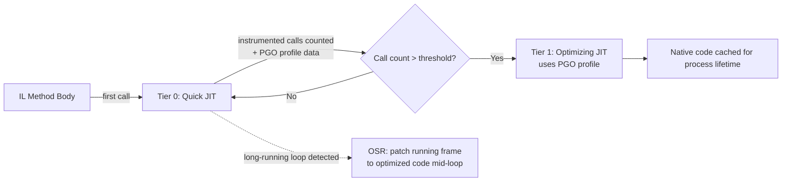
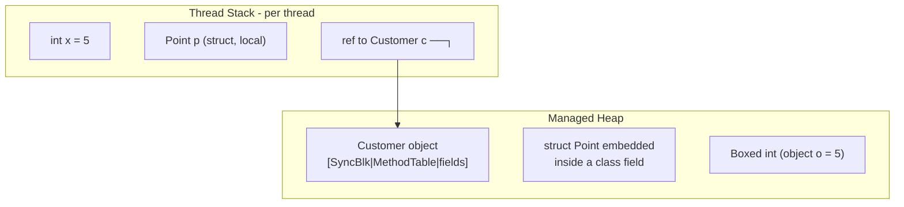
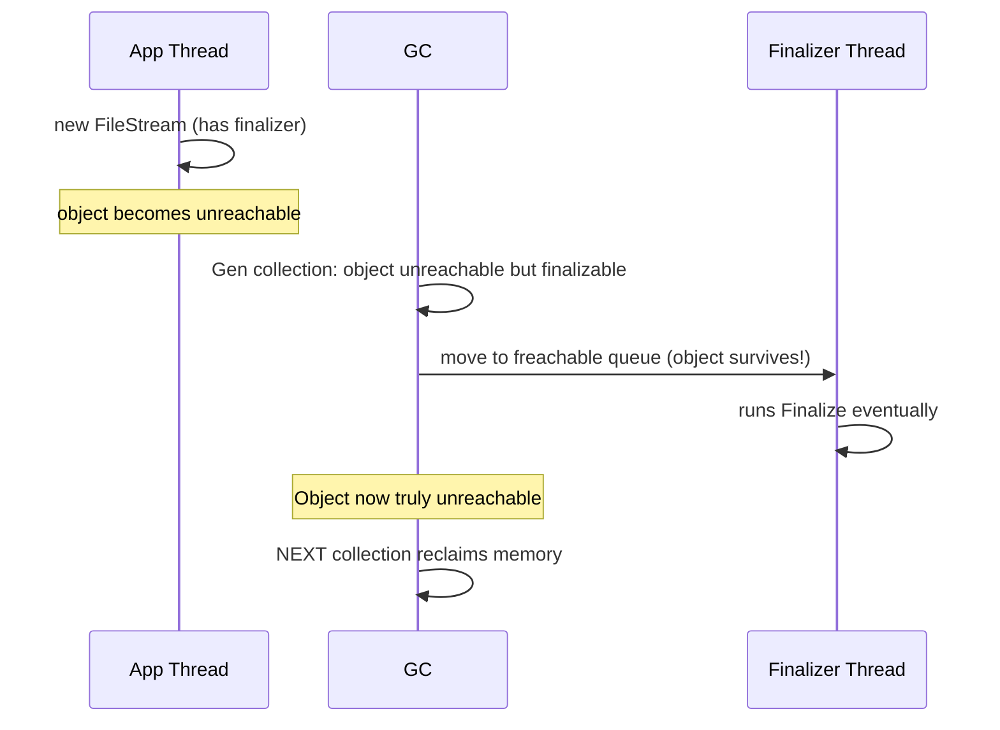
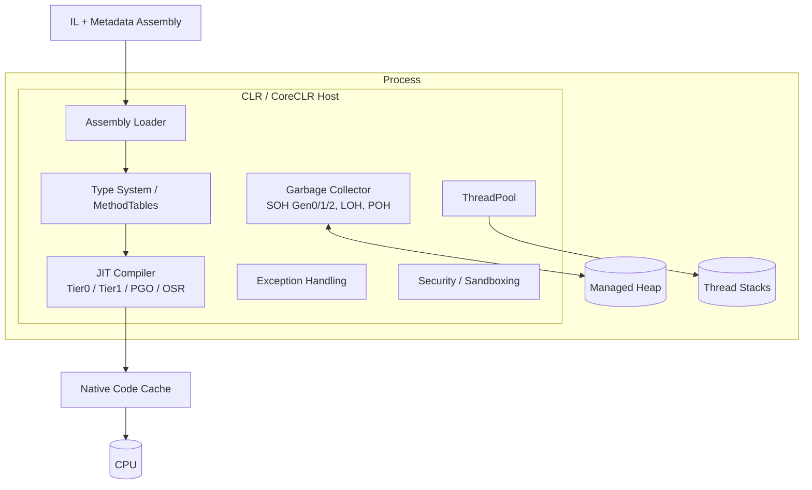
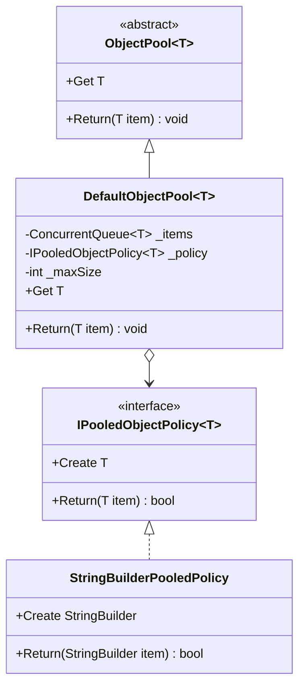
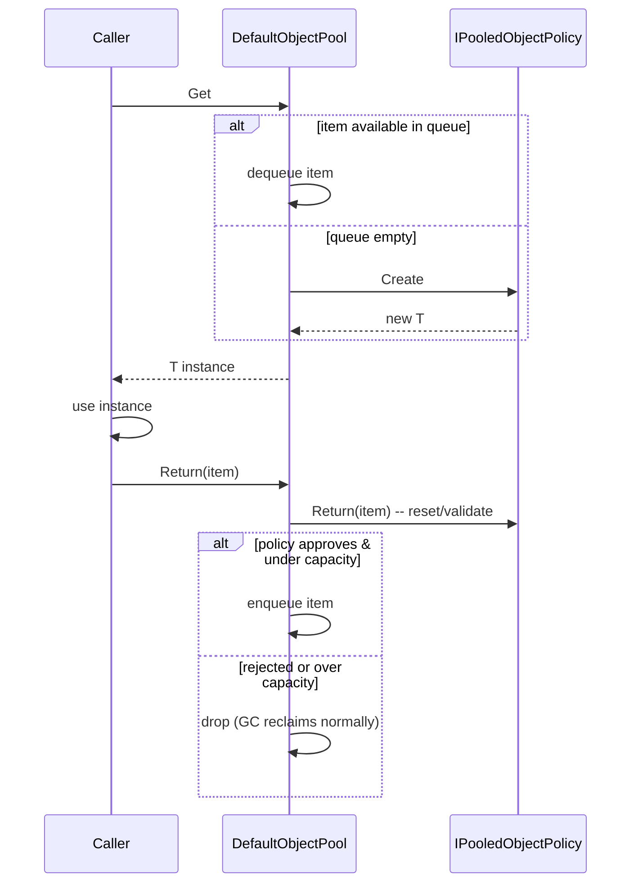

# Module 1 — C# Advanced: CLR, JIT, Garbage Collector & Memory Management

> Domain: C# | Level: Beginner → Expert | Prerequisite: none (assumes 10+ YOE baseline)
> Companion modules to revisit later: `Async/Await Internals`, `Span<T>/Memory<T> & Low-Allocation Code`, `Generics & Variance`

---

## 1. Topic Description

### Definition

The **Common Language Runtime (CLR)** is .NET's managed execution engine. It loads assemblies containing **IL** (an intermediate, CPU-agnostic instruction set) plus metadata, compiles each method to native code on first call via the **JIT**, and manages object lifetime automatically through a **tracing generational garbage collector**. "Memory management" in .NET therefore means understanding three interacting systems: how the JIT produces the code that allocates, how the managed heap is physically organised, and how the collector decides when to suspend your threads to reclaim space.

### Core sub-concepts

- **Two-stage compilation** — Roslyn (C# → IL) and the JIT (IL → native); pre-JIT stubs and `MethodTable` slot patching.
- **Tiered compilation, OSR, ReadyToRun, NativeAOT** — the spectrum of when compilation happens and what it costs at startup versus steady state.
- **Managed heap layout** — gen0 / gen1 / gen2, the ephemeral segment, the **Large Object Heap** (≥ 85,000 bytes) and the **Pinned Object Heap**.
- **Generational hypothesis and promotion** — why collection cost is proportional to *survivors*, not garbage; premature promotion.
- **Roots and reachability** — stack slots, registers, statics, GC handles, the finalization queue; `!gcroot`-style root-path analysis.
- **Mark–sweep–compact** — thread suspension at safe points, relocation, reference fixup; why the LOH is swept but not compacted by default.
- **Write barriers and the card table** — the cost of storing a reference into an older-generation object.
- **GC modes** — Workstation vs Server, background/concurrent GC, DATAS, and `GCHeapHardLimit` / container awareness.
- **Finalization** — the single finalizer thread, the freachable queue, `IDisposable`, `GC.SuppressFinalize`.
- **Pinning and fragmentation** — `fixed`, `GCHandle`, async I/O buffers; heap growth with a flat live set.
- **Working set vs committed vs live set** — why process RSS and managed heap size differ.

### Where it fits

This is the substrate every other C# topic sits on. Allocation-shaping tools (`Span<T>`, pooling), async state machines, closures and LINQ pipelines are all just different ways of feeding or starving the allocator, so their performance claims only make sense against this model. Upward, it determines container sizing, autoscaling behaviour, latency-budget feasibility and the deployment options (JIT vs AOT) available to a service.

### Why it matters at scale

Getting it wrong shows up as P99 latency cliffs from stop-the-world gen2 pauses, pods `OOMKilled` while the managed heap looks small, memory that climbs until a nightly restart, and throughput that collapses well before CPU saturates. At fleet scale it is also a direct cost line: a service running at 60% memory because of buffer churn frequently runs at 35% after the allocation is fixed, which is a real reduction in instance size or count.

### Common pitfalls / anti-patterns

- **Treating "value types live on the stack" as a design rule** — it is an implementation detail; a `struct` field of a class is on the heap, so the expected allocation saving never materialises.
- **Calling `GC.Collect()` to fix a memory symptom** — it forces a full blocking collection and discards the collector's tuning heuristics, usually worsening the exact pause problem it was added to fix.
- **Leaving Server GC's heap-per-core default inside a CPU-limited container** — N heaps sized against the host's core count in a 512 MB pod produces an OOM with a mostly-empty heap.
- **Diagnosing fragmentation as a leak** — live bytes are flat while committed bytes grow; adding "leak fixes" changes nothing because the problem is LOH or pinning-induced holes.
- **Pooling small, short-lived objects** — converts the collector's cheapest case (dying in gen0) into its most expensive (surviving into gen2), adding write-barrier and card-scanning cost for no gain.
- **A finalizer that blocks** — there is one finalizer thread running serially, so a single blocking finalizer roots every finalizable object behind it and grows memory with no allocation bug present.

> Scope note: allocation-avoidance APIs (`Span<T>`, `Memory<T>`, `stackalloc`, `ArrayPool<T>`) belong to `03-Span-Memory-Low-Allocation`; async state-machine allocation to `02-Async-Await-Internals`; closure allocation to `04-Delegates-Events-Closures`; generic instantiation and code sharing to `06-Generics-Variance`.

---

## 2. Beginner (10 Q&A)


**Q1. Walk me through what happens between `csc` compiling your code and the CPU executing an instruction.**
**A:** Roslyn compiles C# to IL plus metadata in a PE assembly — that is what NuGet ships, and it is CPU-agnostic. At runtime the CLR loads the assembly, builds a `MethodTable` per type, and points every method slot at a pre-JIT stub. The first call to a method hits that stub, the JIT compiles that method's IL to native code for the actual CPU, and the slot is patched so later calls jump straight to native code. So IL is compiled twice — once ahead of time by the compiler, once per method at runtime — which is why the first call to anything is slower, and why startup performance and steady-state performance are genuinely separate problems.
*Follow-up: Where does ReadyToRun fit into that pipeline, and why doesn't it eliminate the JIT entirely?*

**Q2. Someone says "value types go on the stack, reference types go on the heap." Correct them.**
**A:** That is a rule of thumb about typical locals, not a specification. A value type lives wherever its storage lives: a `struct` field inside a class lives on the heap with its owner, a `struct` captured by a closure or held across an `await` ends up on the heap, and a boxed value type is on the heap by definition. The specification only says a value type's value is copied on assignment; the stack/heap split is a CLR implementation detail that the JIT is free to change. It matters because engineers who believe the myth reach for `struct` expecting zero allocation and get none of the benefit when the struct is a field of a heap object.
*Follow-up: Given a `struct` containing a reference-type field, where does each part live, and what does that mean for the collector's scanning cost?*

**Q3. What actually makes an object eligible for collection?**
**A:** Unreachability from any root — not going out of scope, not being set to `null`, not being disposed. Roots are the stack slots and registers of live frames, static fields, GC handles (including pinned, weak and dependent handles), and the finalization queue. If the collector cannot reach an object by walking references from those roots, its memory is reclaimable. The practical consequence is that one forgotten root — a static dictionary, an event subscription, a captured `this` — keeps the entire object graph beneath it alive no matter how carefully you null out fields.
*Follow-up: In a Release build, can an object be collected while a method that declared it is still executing?*

**Q4. Why is a gen0 collection cheap, and what does that tell you about how to write allocating code?**
**A:** Gen0 is a small contiguous region, and the collector's cost is proportional to the *survivors*, not the garbage — dead objects cost nothing to reclaim because collection marks and compacts survivors and then resets the allocation pointer. The generational hypothesis is that most objects die young, so a gen0 sweep typically survives a few percent of what was allocated. The implication is the opposite of most people's instinct: allocating many short-lived objects is comparatively cheap, while allocating objects that *survive* — caches, buffers held across an await, anything promoted — is what actually costs. Optimising away allocations that were dying in gen0 anyway is usually wasted engineering.
*Follow-up: What is "premature promotion," and what does it do to your gen2 collection rate?*

**Q5. What is the Large Object Heap and why does it get separate treatment?**
**A:** Allocations of 85,000 bytes or more go to the LOH, which is collected only as part of a gen2 collection and, by default, is swept rather than compacted because relocating large blocks is expensive. Memory is therefore reclaimed but the free space is left as holes, so a workload repeatedly allocating differently-sized large buffers fragments the LOH and grows the process working set even while live bytes stay flat. You can opt into compaction via `GCSettings.LargeObjectHeapCompactionMode`, but that is a stop-the-world defragmentation, not something to leave enabled. This is precisely why large-buffer workloads want pooled, fixed-size buffers rather than a fresh allocation per request.
*Follow-up: Your LOH is 3 GB with 400 MB live. Before reaching for compaction, what would you change in the application?*

**Q6. Describe what the collector actually does during a collection.**
**A:** It suspends managed threads at safe points, marks by walking the object graph from roots, then plans the collection: reclaim dead space and, in the compacting generations, relocate survivors and fix up every reference to them. Compaction is what keeps allocation a pointer bump instead of a free-list search — and it is also why references must be rewritten and why pinning hurts. Survivors are promoted to the next generation. Background GC lets most gen2 marking run concurrently with application threads, so the stop-the-world portion is far shorter than a blocking gen2, but it is never zero.
*Follow-up: What is a safe point, and what happens if a thread sits in a tight loop that contains none?*

**Q7. `IDisposable` and finalizers both sound like "cleanup." What is each actually for?**
**A:** `IDisposable` is deterministic release of *non-memory* resources — file handles, sockets, DB connections, native allocations — at a moment you choose, usually via `using`. A finalizer is the collector's non-deterministic safety net for when someone forgot to dispose; it runs on a dedicated finalizer thread at an unpredictable time after collection. Neither frees managed memory: `Dispose` does not deallocate, and the object is still collected normally. The correct pattern is `Dispose` for the deterministic path, a finalizer only when the type directly owns unmanaged resources, and `GC.SuppressFinalize(this)` inside `Dispose` so the object stops paying the finalization tax.
*Follow-up: Why does adding a finalizer make an object more expensive even when it is always disposed correctly?*

**Q8. What is a GC root, and why does that definition matter more than "scope"?**
**A:** A root is any reference the collector treats as unconditionally live: static fields, live stack frames and registers, GC handles, and objects queued for finalization. Everything else is live only transitively. This matters because almost no real .NET "memory leak" is a leak in the C++ sense — nothing is unreclaimable — it is an unintended root holding a graph alive. Framing diagnosis as "find the root path" rather than "find the leak" is what makes dump analysis tractable, because `!gcroot` answers exactly that question and nothing else does.
*Follow-up: How do weak references change this picture, and where would you legitimately use one?*

**Q9. Workstation GC vs Server GC — what is the real difference, and what does each optimise for?**
**A:** Workstation GC uses a single heap and collects on the allocating thread, optimising for low pause and low memory on a machine shared with other applications. Server GC creates a heap and dedicated GC thread per core and collects in parallel — much higher allocation throughput, at the cost of substantially more memory and CPU consumed in bursts. Server GC is the ASP.NET Core default because throughput is the goal, but it interacts badly with small containers: N heaps sized for N cores inside a 512 MB pod is a common route to an OOM with a mostly-empty heap. The choice belongs per workload, not per organisation.
*Follow-up: You run Server GC in a pod limited to 1 CPU and 512 MB. What specifically goes wrong, and what would you configure instead?*

**Q10. Ops reports the process using 4 GB but your profiler shows a 900 MB managed heap. Explain the gap.**
**A:** Managed heap size is only one component of working set. The rest is native: JIT code heaps and loader heaps, thread stacks (1 MB reserved each by default, so a thread-pool explosion shows up here), native buffers from libraries and drivers, memory-mapped assemblies, and memory the GC has freed logically but retained as committed segments for reuse. Fragmentation widens the gap further, since committed pages stay committed even when the live set shrinks. The first diagnostic move is therefore to establish whether you are chasing managed bytes, native bytes, or retained-but-unused committed bytes — the three have completely different fixes.
*Follow-up: Which counters or tools would you use to split those three apart on Linux, and in what order?*

---

## 3. Intermediate (10 Q&A)


**Q1. A service's memory climbs over 48 hours and is "fixed" by a nightly restart. How do you separate a real retention leak from fragmentation from an oversized cache?**
**A:** Take two heap snapshots hours apart under steady load and diff them — a retention leak shows a type whose instance count grows monotonically with a consistent root path, which `!gcroot` or a snapshot diff will name outright. Fragmentation shows the opposite signature: live bytes flat, committed heap growing, free space scattered between survivors, usually concentrated in the LOH. An unbounded cache looks like a leak but its root path terminates in something you deliberately wrote, and growth tracks distinct keys rather than request count. The classic mistake is opening the profiler's "largest objects" view, which tells you what is big — not what is retained unintentionally, which is a different question.
*Follow-up: The diff shows a million strings rooted in a `ConcurrentDictionary`. How do you decide whether that is a bug or a correct cache with the wrong eviction policy?*

**Q2. Gen2 collections have gone from once a minute to once every three seconds after a release. What causes that, and what do you look at?**
**A:** Almost always premature promotion: objects that used to die in gen0 now survive it, get promoted, and accumulate until gen2 pressure forces full collections. Typical causes are a new cache or buffer held slightly too long, an object graph now reachable from a longer-lived scope — changing a DI registration from scoped to singleton does this instantly — or an increase in allocation *size* pushing objects onto the LOH, which is gen2 by definition. I would compare gen0/gen1/gen2 collection counts and promoted bytes across the release boundary rather than looking at total memory, because the ratio between generations is the signal and the total is noise.
*Follow-up: How exactly does a scoped-to-singleton change produce this, and how would you catch that class of change in code review?*

**Q3. Why can storing a reference into a long-lived object cost more than storing one into a freshly-allocated object?**
**A:** Writing a reference field goes through a write barrier so the runtime can record that an older-generation object now points into a younger one — that is the card table. Without it, every gen0 collection would have to scan all of gen2 looking for cross-generational references; with it, only dirtied cards are scanned. The cost is a small extra store per reference write plus the scanning cost of a graph that constantly re-points from gen2 into gen0. In practice this is why a large mutable long-lived structure whose values are continuously replaced with newly-allocated objects can inflate gen0 pause times even though gen0 itself is small.
*Follow-up: How does this change your thinking about a large `Dictionary<string, T>` refreshed in place versus rebuilt and swapped atomically?*

**Q4. After every deploy, P99 latency is bad for 60–90 seconds and then settles. What is happening, and what are the options?**
**A:** That is JIT warm-up interacting with tiered compilation: methods start at tier 0, which compiles quickly but produces slow code, and are only recompiled at tier 1 after roughly thirty calls plus a background delay, with OSR promoting long-running loops separately. Combine that with cold caches and cold connection pools and the first thousand requests are literally executing different machine code from steady state. The options, in escalating order: keep the instance out of the load balancer until a readiness warm-up completes; enable ReadyToRun so first-call code quality is far better; tune the tiering knobs; or move to NativeAOT if the workload justifies it. The wrong "fix" is slowing the rollout, which hides the symptom rather than removing it.
*Follow-up: ReadyToRun improves startup but can be slower at steady state than fully-tiered JIT. Why, and does that change your recommendation?*

**Q5. Is there ever a legitimate reason to call `GC.Collect()` in production?**
**A:** Rarely, and every legitimate case is "I know something the collector cannot." A batch process that has just finished a phase, dropped hundreds of megabytes of graph, and is entering a long quiet period is one; a benchmark harness establishing a clean baseline is another; a deliberate one-shot LOH compaction during a maintenance window is a third. What makes them legitimate is that they sit outside the request path and are followed by a period where a pause costs nothing. Inside request handling it is always wrong: it forces a full blocking collection and discards the tuning heuristics the collector built up, typically worsening the exact symptom it was added to fix.
*Follow-up: If you do call it deliberately, which overload arguments would you pass, and why does `GC.WaitForPendingFinalizers` usually need to follow?*

**Q6. Memory is growing and a dump shows tens of thousands of objects on the finalization queue. What do you conclude?**
**A:** The finalizer thread is blocked or falling behind. There is one finalizer thread and it runs finalizers serially, so a single finalizer that blocks — on a lock, on a network call, on a `Dispose` that waits — stalls every finalizable object behind it permanently. Those objects are all rooted by the queue, along with everything they reference, so memory grows with no bug in your allocation code at all. Diagnosis is to read the finalizer thread's stack in the dump; the fix is to make finalizers do nothing but release unmanaged handles, and to ensure `Dispose` is actually called so `SuppressFinalize` keeps objects off the queue in the first place.
*Follow-up: Why does a finalizable object survive at least two collections even when it becomes unreachable immediately?*

**Q7. Where does pinning come from in a typical service, and what damage does it do?**
**A:** From `fixed` blocks, `GCHandle.Alloc(..., Pinned)`, and — most often invisibly — buffers handed to P/Invoke, sockets and file I/O for the duration of an async operation. A pinned object cannot be relocated, so the compacting collector must work around it and leave holes; one long-lived pin in the middle of the ephemeral segment does damage far out of proportion to its size. The signature is heap size growing while live bytes stay stable, with fragmentation concentrated in gen0/gen1. The modern mitigation is the Pinned Object Heap for deliberately-pinned buffers, plus pooling long-lived I/O buffers so you pin a small fixed set once instead of a fresh object per request.
*Follow-up: How would you confirm pinning is the cause rather than ordinary fragmentation, working only from a dump?*

**Q8. Name the two most common real-world causes of unintended retention in a .NET service, and how you'd prove each in a dump.**
**A:** Static or singleton collections that only ever grow, and event subscriptions where the publisher outlives the subscriber — subscribing to a long-lived singleton's event from a per-request object roots that object and its whole graph forever. Both survive code review because the offending line looks entirely ordinary. In a dump I would run `!dumpheap -stat` to find the type with an implausible instance count, take a few addresses, and run `!gcroot`, which names the static field or the delegate's invocation list directly. The generalisable lesson is that the root path, not the object, identifies the bug.
*Follow-up: What patterns eliminate the event-handler case structurally, rather than relying on people remembering to unsubscribe?*

**Q9. A pod is `OOMKilled` but the dump shows only a 300 MB managed heap against a 1 GB limit. What is your hypothesis?**
**A:** The limit applies to the container's total RSS, not the managed heap, so the killer is native memory or committed-but-unused pages. The usual suspects are Server GC committing per-core heaps sized against the host's core count rather than the cgroup limit, thread stacks from an exploded thread pool, native memory from a library (compression, crypto, ML runtimes, database drivers), or LOH fragmentation inflating committed pages. I would compare RSS against GC committed bytes over time, then verify the runtime is honouring the cgroup limit and consider setting `GCHeapHardLimit` explicitly. "The heap is small, so it isn't memory" is the trap this question exists to catch.
*Follow-up: How does the runtime decide its heap budget inside a container, and what would you set for a 1 GB, 2-core pod?*

**Q10. Someone proposes object pooling to reduce GC pressure. When does it genuinely help, and how does it backfire?**
**A:** It helps when objects are large or expensive to construct and the alternative is repeated LOH allocation — big buffers, parsers, connections. It backfires for small short-lived objects, because you take something that was dying free in gen0 and make it survive indefinitely in gen2, adding write-barrier traffic and card scanning while removing the collector's cheapest case entirely. Pools also introduce their own bug class: objects returned while still referenced, state leaking between tenants (a real security issue in multi-tenant systems), and unbounded pools that become the leak they were meant to prevent. My rule is to pool only what is measurably expensive, always bound the pool, and always clear state on return.
*Follow-up: `ArrayPool<T>.Shared` versus a custom pool — what would push you to write your own?*

---

## 4. Expert / Architect (10 Q&A)


**Q1. You own a pricing service with a hard 5 ms P99 and GC pauses are blowing it. How do you choose between tuning the collector, eliminating allocation, and changing the architecture?**
**A:** First measure the pause *distribution* and attribute it — a P99 destroyed by occasional 50 ms blocking gen2s is a different problem from one eroded by frequent 1 ms gen0s, and they have opposite fixes. Tuning (background GC, heap count, conserve-memory settings) can buy an order of magnitude on the tail and costs almost nothing to try, so it goes first. Eliminating hot-path allocation is the durable fix but is expensive engineering that only pays if profiling proves the path is allocation-dominated. Architecture — sharding so each process holds a smaller heap, or moving the latency-critical path off the managed heap — comes last, and I would reach for it specifically when the *live set* is the problem, because gen2 pause scales with live objects to trace rather than with allocation rate.
*Follow-up: You choose to shard. How do you size each shard's heap, and what does that decision do to fleet cost?*

**Q2. How would you set GC configuration policy across a fleet of a hundred .NET services?**
**A:** Not uniformly — I would publish a default plus a documented rule for deviating, rather than a single mandate. The default for request-serving services is Server GC with background collection and an explicit heap hard limit derived from the container limit; the default for sidecars, jobs and CLI tools is Workstation GC, because heap-per-core on a tiny container is pure waste. Deviation requires evidence — a measured pause problem or an unusual live-set-to-allocation ratio — recorded in an ADR so the reasoning survives the engineer. I would also evaluate DATAS for services with variable load, since it adapts heap count dynamically instead of committing per-core heaps up front, but roll it out per service tier with measurement rather than as a fleet-wide flag flip, because it trades some throughput for a better memory profile.
*Follow-up: Who owns that policy — the platform team or each service team — and what stops it from rotting within a year?*

**Q3. Make the organisational case for or against NativeAOT across your service estate.**
**A:** NativeAOT removes JIT and tiering entirely: startup drops to milliseconds, footprint falls substantially, and the artefact carries no runtime dependency — genuinely transformative for serverless, CLI tools and anything that scales to zero. The costs are structural rather than incremental: no runtime code generation, so reflection-heavy serialisation, dynamic proxies, EF Core's query pipeline and most interception-based DI and AOP either break or require source-generator replacements; diagnostics change; cross-compilation complicates the build. So my position is per workload — adopt where startup dominates cost, and treat migrating a large reflection-heavy service as a multi-quarter project justified by measured numbers, not by a benchmark chart. The real organisational risk is a half-finished migration that leaves two build models to maintain indefinitely.
*Follow-up: For a function-style workload where startup dominates, what would you measure to prove NativeAOT actually paid for itself?*

**Q4. Finance wants a 30% cut in fleet memory. How do you approach it without causing an incident?**
**A:** Memory limits interact with the collector nonlinearly: the GC expands its budget to fill available space, so a service that "uses 3 GB" may run perfectly at 1.5 GB with a higher collection rate and slightly more CPU. The method is to establish each service's actual live set — not working set — under peak load, set a heap hard limit above it with headroom, and observe the trade as collection frequency and CPU rise while memory falls. I would do this per service tier behind a canary with explicit rollback triggers on pause-time and CPU SLOs, never as a global limit change. The point to communicate upward is that this converts a memory cost into a CPU cost, so the saving is only real where CPU headroom exists.
*Follow-up: Which services would you exclude from this exercise up front, and on what evidence?*

**Q5. You are migrating a large .NET Framework service to .NET 8. Which runtime-level behaviour changes would you plan for specifically?**
**A:** GC and JIT behaviour differ enough to invalidate existing tuning: default settings change, segment sizing differs, background GC behaves differently, and configuration moves from `app.config`'s `gcServer` to `runtimeconfig.json` and environment variables — silently losing an old setting is a classic migration surprise. Tiered compilation is on by default, so warm-up profiles change even where steady state improves. The JIT is significantly better at inlining, devirtualisation and struct promotion, which means genuine throughput gains but also that micro-optimisations written against the old JIT may now be pessimisations. I would shadow production traffic in a parallel run and compare GC counters and full latency distributions rather than averages, treating every existing performance hack as a hypothesis to re-verify.
*Follow-up: The migration improves throughput by 30% but P99 gets worse. What is your first hypothesis?*

**Q6. In a multi-tenant service, one tenant's heavy requests cause GC pauses that hurt every tenant. How do you address that architecturally?**
**A:** This is a blast-radius problem, not a GC problem — the collector is process-wide, so in-process controls (rate limits, quotas, separate schedulers) reduce the rate but cannot stop one allocation burst from triggering a collection that stops every tenant's threads. The durable answers are process- or pod-level isolation: cell-based partitioning where a tenant maps to a cell, or dedicated capacity for the heaviest tenants, so the pause radius equals the isolation boundary. In-process mitigations remain worthwhile as defence in depth — bounding per-request allocation, streaming large payloads rather than buffering, rejecting oversized requests at the edge. I would frame the decision to stakeholders explicitly as choosing a blast radius and paying for it in infrastructure, because that is the actual trade being made.
*Follow-up: How do you decide which tenants justify dedicated cells, and what stops that list from growing forever?*

**Q7. How do you prevent allocation and memory regressions across many teams, rather than discovering them in production?**
**A:** Detection must be automated and owned, because no review process catches allocation regressions reliably. Concretely: BenchmarkDotNet with `MemoryDiagnoser` on genuinely hot paths, run in CI against a committed baseline with a failure threshold on allocated-bytes-per-operation; GC counters exported from every service with alerts on rate-of-change rather than absolute values; and load tests that assert on memory trajectory rather than peak. The organisational half matters more than the tooling — the gates belong in the shared pipeline template so teams inherit them by default, and alerts must page the owning team rather than a central performance group, or that group becomes the bottleneck for everyone else's regressions.
*Follow-up: Microbenchmark gates are notoriously noisy in CI. What keeps them from being disabled within a quarter?*

**Q8. What GC telemetry would you standardise across every service, and what would you actually alert on?**
**A:** Emit gen0/gen1/gen2 collection counts, pause-duration distribution, allocation rate, promoted bytes, committed versus live bytes, LOH size, and time-in-GC percentage — as rates and distributions, since absolute memory is the least informative of them. I would alert on gen2 collection *rate* rising, on P99 pause exceeding the service's share of its latency budget, and on committed-versus-live divergence, which is the fragmentation signature. I would deliberately not alert on working set crossing a threshold, because that fires constantly on healthy services and trains people to ignore the channel. The value of standardising is cross-service comparability during an incident: when latency degrades you want "is this GC?" answered in seconds from a shared dashboard, not by attaching a profiler.
*Follow-up: A service reports 8% time-in-GC. Is that a problem? What else do you need to know before answering?*

**Q9. When would you conclude that a component should not use the managed heap at all?**
**A:** When the live set is both large and long-lived, because gen2 pause cost scales with the number of live objects to trace — a 40 GB in-memory index of small objects is pathological for any tracing collector regardless of tuning. The alternatives are off-heap storage in native memory or memory-mapped files behind a thin managed accessor, restructuring the data as large arrays of value types (few objects, many bytes, cheap to trace), or moving it out of process into a purpose-built store. I would try the value-type-array restructuring first because it keeps the code managed and safe while cutting object count by orders of magnitude, and treat true off-heap storage as a last resort since it reintroduces manual lifetime management and the exact bug class the CLR exists to eliminate.
*Follow-up: You go off-heap anyway. What safety mechanisms would you insist on before that ships?*

**Q10. A runtime patch upgrade correlates with a production latency regression. How do you handle it, and how do you de-risk runtime upgrades generally?**
**A:** Establish attribution before accepting the correlation — "it started after the upgrade" frequently turns out to be a coincident config or traffic change, so I would compare GC counters, tiering behaviour and latency distributions across versions on identical traffic. Runtime upgrades do legitimately change JIT codegen and GC heuristics, so a genuine regression is plausible and worth reducing to a minimal reproduction to take upstream. Structurally I de-risk by pinning runtime versions explicitly in images, staging upgrades through a canary tier with performance gates instead of letting them ride along with OS patching, and keeping a rollback path that does not require a rebuild. The governance point is that the runtime is a production-impacting dependency and deserves the same change-management rigour as any library — in a regulated environment that is an audit requirement, not a preference.
*Follow-up: Your canary tier shows no regression but production does. What differs, and how would you make the canary representative?*

---

## 5. Reference Material

> Retained from the original module: deep-dive internals, diagrams, production examples, exercises, system/low-level design, debugging walkthroughs and the Principal Engineer perspective.

### 1. Fundamentals

#### What is the CLR?
The **Common Language Runtime (CLR)** is the managed execution engine of.NET. When you compile C#, the compiler (`Roslyn`) does **not** produce native machine code — it produces **IL (Intermediate Language / MSIL)** plus metadata, packaged into an assembly (DLL/EXE). The CLR is the program that:

1. Loads assemblies and reads IL + metadata.
2. **JIT-compiles** IL into native machine code, method-by-method, on first call.
3. Manages memory automatically via the **Garbage Collector (GC)**.
4. Enforces type safety, security boundaries, and exception handling.
5. Provides services: threading (via the OS + CLR thread pool), reflection, interop (P/Invoke, COM), assembly loading, and structured exception handling (SEH-based).

#### Why does it exist?
Before managed runtimes, C/C++ developers manually managed memory (`malloc`/`free`, `new`/`delete`) — a massive source of bugs (use-after-free, double-free, buffer overruns, memory leaks). The CLR trades a small amount of raw performance and determinism for:
- **Memory safety** (no dangling pointers, automatic reclamation).
- **Type safety** (no arbitrary pointer casting without explicit `unsafe`).
- **Portability** — IL is CPU-agnostic; the JIT targets x64, x86, ARM64, etc. (this is *how*.NET is cross-platform via CoreCLR).
- **Productivity** — automatic memory management removes an entire bug class from day-to-day development.

#### When does this matter?
Every single C# program uses the CLR — you cannot opt out. But **understanding it deeply matters most when**:
- Diagnosing production incidents: high CPU, GC pauses, memory leaks, OOM.
- Writing high-throughput/low-latency code (trading systems, real-time APIs, game servers).
- Making architecture decisions: server vs workstation GC, container memory limits, object pooling strategies.
- Interviewing for Staff/Principal roles — this is the #1 "separates seniors from principals" topic in C# interviews because it requires connecting language semantics → runtime behavior → OS behavior.

#### How does it work (30,000-ft view)?

```
 C# Source (.cs)
 │ Roslyn compiler (csc)
 ▼
 IL + Metadata (.dll/.exe) ──── this is what gets shipped
 │ Assembly Loader (CLR)
 ▼
 Loaded into AppDomain/AssemblyLoadContext
 │ JIT Compiler (on first call per method)
 ▼
 Native machine code (cached in memory for process lifetime)
 │ CPU executes
 ▼
 Objects allocated on Managed Heap ── GC reclaims unreachable ones
```

Key mental model for interviews: **"IL is compiled twice."** Once ahead-of-time by Roslyn (C# → IL, this is what NuGet ships), and once at runtime by the JIT (IL → native), unless you use AOT compilation (NativeAOT, ReadyToRun) to shift work earlier.

### 2. Deep Dive

#### 2.1 CLR Execution Pipeline in Detail

1. **Assembly loading**: The CLR's loader reads the PE (Portable Executable) header, finds the CLR metadata header, and loads type metadata lazily. Types are NOT fully loaded until first use (lazy type loading via `MethodTable` construction).
2. **Method invocation & stubs**: Every method starts with a *pre-JIT stub* in its `MethodTable` slot. First call → stub triggers JIT → native code address is patched into the slot → subsequent calls jump straight to native code. This is why the **first call to any method is slower** ("JIT warm-up").
3. **Type system internals**: Every object on the heap has an **object header** (in x64: 8 bytes **SyncBlockIndex** + 8 bytes **MethodTable pointer** = 16 bytes overhead per object before your fields even start). The `MethodTable` holds the vtable for virtual dispatch, type info, and static fields.

#### 2.2 JIT Compiler Internals

.NET (Core 3.0+, and every version through.NET 8/9) uses **Tiered Compilation** by default:

- **Tier 0 (Quick JIT)**: Compiles fast, with minimal optimization, no loop optimization, so the app starts responding quickly. Includes on-stub-entry **call counting**.
- **Tier 1 (Optimized/Full JIT)**: After a method is called ~30 times (default threshold), it's re-JIT'd with full optimizations: inlining, loop cloning, devirtualization, register allocation, vectorization.
- **Tier 1 with PGO (Dynamic Profile-Guided Optimization,.NET 8+ default on)**: Tier 0 instruments branches/types actually seen at runtime (e.g., which concrete type flows through an interface call), then Tier 1 recompiles using *actual* runtime profile data — enabling aggressive **speculative devirtualization** and inlining that static analysis couldn't safely do.
- **OSR (On-Stack Replacement,.NET 7+)**: Long-running loops inside a Tier-0 method can be upgraded to optimized code *mid-execution*, without waiting for the method to return and be re-called. Solves the classic "hot loop in Main never gets optimized" problem.
- **ReadyToRun (R2R)**: Precompiles IL to native at publish time (`dotnet publish -p:PublishReadyToRun=true`) so the JIT can skip Tier-0 compilation for those methods at startup — trades disk size and (slightly) peak-throughput for faster startup. Framework assemblies ship as R2R.
- **NativeAOT**: No JIT at all at runtime — fully native binary, no CLR loading step, smallest/fastest startup, but no runtime codegen (no `System.Reflection.Emit`, limited reflection, no dynamic loading).


```mermaid
flowchart LR
 A[IL Method Body] -->|first call| B[Tier 0: Quick JIT]
 B -->|instrumented calls counted<br/>+ PGO profile data| C{Call count > threshold?}
 C -->|No| B
 C -->|Yes| D[Tier 1: Optimizing JIT<br/>uses PGO profile]
 D --> E[Native code cached for process lifetime]
 B -.->|long-running loop detected| F[OSR: patch running frame<br/>to optimized code mid-loop]
```

**Interview-critical fact**: JIT'd code is **not persisted** — every process start re-JITs (unless R2R/AOT). This is why serverless/Lambda cold starts are painful for.NET without AOT.

#### 2.3 Memory Layout — Stack vs Heap

- **Stack**: Per-thread, LIFO, fixed size (default 1MB on Windows), stores value-type locals, method call frames, return addresses. Extremely fast (pointer bump), automatically reclaimed when a frame pops. **`stackalloc`** lets you explicitly allocate on the stack.
- **Managed Heap**: Where reference types (`class`, arrays, delegates, closures, boxed value types, strings) live. Divided into generations for GC efficiency.

**Value types vs reference types — the actual rule** (commonly mis-stated): *"Value types are NOT always on the stack."* A value type lives wherever its **container** lives:
- Local variable/parameter of value type → stack (if not captured by a closure/iterator, and JIT doesn't otherwise need to move it to heap).
- Value type as a field of a class → lives on the heap, embedded inline in the containing object.
- Value type boxed (assigned to `object`/interface) → heap-allocated wrapper.
- Value type captured by a lambda closure or used in an `async` method → heap (part of the compiler-generated closure/state machine class).


```mermaid
graph TD
 subgraph Stack [Thread Stack - per thread]
 S1["int x = 5"]
 S2["Point p (struct, local)"]
 S3["ref to Customer c ──┐"]
 end
 subgraph Heap [Managed Heap]
 H1["Customer object<br/>[SyncBlk|MethodTable|fields]"]
 H2["struct Point embedded<br/>inside a class field"]
 H3["Boxed int (object o = 5)"]
 end
 S3 --> H1
```

#### 2.4 Garbage Collector Internals — the deepest interview area

**Generational hypothesis**: most objects die young..NET GC exploits this with 3 generations on the **SOH (Small Object Heap)**:

- **Gen 0**: Newly allocated objects. Small (few hundred KB–few MB), collected very frequently, very fast (usually <1ms).
- **Gen 1**: Survivors of one Gen 0 collection. Acts as a buffer between short-lived and long-lived.
- **Gen 2**: Long-lived objects (caches, singletons, static references). Collecting Gen 2 is expensive — it also implies collecting Gen 0/1 and, for a **full/blocking GC**, walking the whole graph.
- **LOH (Large Object Heap)**: Objects ≥ 85,000 bytes (arrays, big strings) go directly here. LOH is **not compacted by default** (fragmentation risk) — collected only during Gen 2 GCs. You can opt into compaction via `GCSettings.LargeObjectHeapCompactionMode`.
- **POH (Pinned Object Heap,.NET 5+)**: Objects pinned for interop (`fixed`, `GCHandle.Alloc(..., GCHandleType.Pinned)`) go here so pinning doesn't fragment/block compaction of the regular SOH.

**Allocation**: A bump-pointer allocator on Gen 0 — allocation is just incrementing a pointer (as fast as `stackalloc` in the common case) until the Gen 0 budget is exhausted, which triggers a collection.

**Collection algorithm**: Mark-and-Compact (aka Mark-Sweep-Compact):
1. **Mark**: Starting from *roots* (static fields, thread stacks, CPU registers, GC handles, finalization queue) walk the object graph, marking everything reachable.
2. **Sweep/Plan**: Determine which unreached objects can be reclaimed.
3. **Compact**: Slide surviving objects together to eliminate fragmentation and restore a fast bump-pointer allocation state. (Gen 2 compaction is more expensive and not always done every collection.)
4. **Update references**: Every root and every reference field pointing to a moved object must be updated — this is why GC needs to briefly suspend threads (or use write-barrier tricks for background GC).

**GC Modes** (huge interview topic):
| Mode | Use case | Behavior |
|---|---|---|
| **Workstation GC** | Client apps, desktop, low core-count | Single heap, optimized for low latency over throughput |
| **Server GC** | ASP.NET Core, high-throughput backend services | One heap + one dedicated GC thread **per core**, optimized for throughput, higher memory use |
| **Concurrent/Background GC** (default on) | Both modes | Gen 2 marking happens concurrently with app threads running ("background GC") to reduce pause times |
| **Sustained Low Latency (SustainedLowLatency)** | Trading systems, real-time | Avoids full blocking Gen 2 GCs as much as possible |
| **DATAS (Dynamic Adaptation To Application Sizes,.NET 8+)** | Server GC in containers | Dynamically scales heap count/size instead of always using core-count heaps — huge win for many small containerized services that used to over-provision memory |

**Write barriers & the Card Table**: When a Gen 2 object is mutated to point to a Gen 0/1 object, the GC needs to know (since it doesn't re-scan all of Gen 2 during a Gen 0 collection). The JIT emits a **write barrier** after every reference-field assignment that marks a byte in the **card table** corresponding to that memory region "dirty." Gen 0 collections then only need to scan dirty cards in Gen 2 as extra roots, instead of the whole Gen 2 heap. This is why "storing a reference to a young object inside an old, hot object" is a subtle performance cost — not free, though usually tiny.

**Finalization**: `~Finalizer` objects aren't collected immediately when unreachable — they're moved to a **freachable queue**, processed by a dedicated **finalizer thread**, and only actually reclaimed on the *next* GC after their finalizer runs. This means finalizable objects survive at least one extra GC generation-bump — a classic hidden cost. This is exactly why `IDisposable` + `Dispose` (deterministic cleanup) is preferred, with finalizers only as a safety net for unmanaged resources.


```mermaid
sequenceDiagram
 participant App as App Thread
 participant GC as GC
 participant Fin as Finalizer Thread
 App->>App: new FileStream (has finalizer)
 Note over App: object becomes unreachable
 GC->>GC: Gen collection: object unreachable but finalizable
 GC->>Fin: move to freachable queue (object survives!)
 Fin->>Fin: runs Finalize eventually
 Note over GC: Object now truly unreachable
 GC->>GC: NEXT collection reclaims memory
```

#### 2.5 Threading Model
- The CLR **ThreadPool** is a managed pool of worker threads used by `Task`, `async`/`await` continuations, timers, and I/O completion ports. It uses a **hill-climbing algorithm** to adjust thread count and has a "starvation avoidance" heuristic that injects new threads slowly (roughly 1/sec) if all threads are busy — a classic cause of the **thread pool starvation** production incident.
- GC in Server mode uses dedicated GC threads *pinned* to logical cores, separate from the ThreadPool.
- JIT compilation itself can occur on a background thread with tiered compilation (`TieredCompilation` + `TC_QuickJitForLoops`), so Tier 0→Tier 1 promotion doesn't block the calling thread.

#### 2.6 Hidden Costs Checklist (what Principal Engineers are expected to know cold)
- Boxing a value type: heap allocation + copy, every single time.
- `params object[]` overloads box every value-type argument.
- Closures over loop variables/locals allocate a compiler-generated class on the heap.
- `async` methods compile to a state machine **struct or class** — if any `await` isn't hit synchronously, it's often promoted to heap (class) allocation.
- LINQ over value-type collections (`IEnumerable<T>` via `yield`) allocates iterator state machines + boxes the enumerator if used via non-generic interfaces.
- String concatenation in a loop: O(n²) copies; use `StringBuilder`.
- `virtual`/interface calls prevent inlining unless devirtualized by PGO.
- Object header overhead: 16 bytes/object (x64) — matters a lot when you have millions of small objects.

### 3. Visual Architecture

#### CLR High-Level Component Diagram


```mermaid
graph TB
 subgraph Process
 subgraph CLR["CLR / CoreCLR Host"]
 Loader[Assembly Loader]
 TypeSys[Type System / MethodTables]
 JIT[JIT Compiler<br/>Tier0 / Tier1 / PGO / OSR]
 GC[Garbage Collector<br/>SOH Gen0/1/2, LOH, POH]
 TP[ThreadPool]
 EH[Exception Handling]
 Sec[Security / Sandboxing]
 end
 Heap[(Managed Heap)]
 Stacks[(Thread Stacks)]
 end
 IL[IL + Metadata Assembly] --> Loader
 Loader --> TypeSys --> JIT
 JIT --> Native[Native Code Cache]
 Native --> CPU[(CPU)]
 GC <--> Heap
 TP --> Stacks
```

#### GC Heap Layout (ASCII)

```
Small Object Heap (SOH)                        Large Object Heap (LOH)  Pinned Object Heap (POH)
┌───────────┬────────────┬─────────────────┐   ┌────────────────────┐   ┌────────────────────┐
│ Gen 0     │ Gen 1      │ Gen 2           │   │ Objects >= 85,000B │   │ fixed / GCHandle   │
│ (nursery) │ (buffer)   │ (long-lived)    │   │ not compacted by   │   │ .Pinned objects    │
│ freq. GC  │ occasional │ rare, expensive │   │ default            │   │                    │
└───────────┴────────────┴─────────────────┘   └────────────────────┘   └────────────────────┘
 ~fast <1ms   ~1-10ms      ~10-100ms+                                      never moved
```

### 4. Production Example

#### Scenario: High-throughput Order Processing API (ASP.NET Core,.NET 8, Kubernetes)

**Problem**: A payments API serving ~8,000 req/s across 12 pods started showing p99 latency spikes of 400–800ms every ~15 seconds, correlated with CPU sawtooth patterns in Grafana.

**Investigation**:
- `dotnet-counters` showed `Gen 2 GC Count`, `% Time in GC` spiking to 25%+ during the latency spikes.
- `dotnet-gcdump` + `dotnet-trace` revealed large numbers of `byte[]` arrays >85KB from a JSON deserialization path using `MemoryStream` buffering full request/response bodies — landing on the **LOH**, fragmenting it, forcing frequent Gen 2/full GCs.
- Root cause: a middleware buffered the entire response into a `MemoryStream` for audit logging before writing to the client, for every request, and payloads were often 100–200KB (over the 85K LOH threshold).

**Architecture fix**:
- Replaced `MemoryStream` buffering with `RecyclableMemoryStreamManager` (Microsoft's pooled stream implementation) to reuse LOH-sized buffers instead of allocating new ones per-request.
- Switched Kestrel/ASP.NET Core to **Server GC** with **DATAS** enabled (`DOTNET_GCHeapHardLimit` tuned to the pod's memory `limits`, `GCHeapCount` left to DATAS) instead of static heap-count-per-core (which had over-provisioned memory across 12 pods with 4 vCPU requests each).
- Added `Server.MaxRequestBodySize` guard + streamed audit logging asynchronously instead of buffering.

**Trade-offs**: Pooling buffers reduces GC pressure but risks holding memory longer than strictly needed (pool doesn't shrink instantly) — accepted because pod memory limits were set with headroom, and it's a net win over LOH fragmentation and stop-the-world pauses.

**Lessons learned**:
1. Any per-request allocation ≥ 85KB is a red flag — assume LOH and design around pooling (`ArrayPool<byte>`, `RecyclableMemoryStreamManager`).
2. `% Time in GC` above ~10-15% sustained is an actionable signal, not noise.
3. Server GC's default "heap count = core count" is wrong for many small pods — DATAS (.NET 8+) or explicit `GCHeapCount` tuning is mandatory in Kubernetes.
4. Buffering entire payloads "just for logging" is an anti-pattern that principal-level review should catch before merge.

### 11. Coding Exercises

#### Easy — Detect boxing in a code snippet & fix it
**Problem**: Given this method, identify and eliminate the boxing allocation.
```csharp
void PrintAll(object[] items) // called with PrintAll(new object[]{1,2,3})
{
    foreach (var item in items) Console.WriteLine(item);
}
```
**Solution**:
```csharp
void PrintAll<T>(T[] items)
{
    foreach (var item in items) Console.WriteLine(item);
}
// call: PrintAll(new int[]{1,2,3}); // no boxing, JIT specializes for int
```
**Time complexity**: O(n) either way. **Space**: Original boxes each `int` → n heap allocations; generic version → 0 heap allocations for the array elements.
**Optimized**: Already optimal; for `IEnumerable<T>` sources use `Span<T>`-based iteration if data is contiguous, to also avoid enumerator allocation.

#### Medium — Implement a bounded object pool (mimic `ObjectPool<T>`)
**Problem**: Implement a thread-safe pool of reusable `StringBuilder` instances, capped at N, to reduce GC pressure in a hot logging path.
```csharp
public sealed class SimpleObjectPool<T> where T: class
{
    private readonly ConcurrentBag<T> _items = new;
    private readonly Func<T> _factory;
    private readonly int _maxSize;
    private int _count;

    public SimpleObjectPool(Func<T> factory, int maxSize)
    {
        _factory = factory;
        _maxSize = maxSize;
    }

    public T Rent => _items.TryTake(out var item)? item: _factory;

    public void Return(T item)
    {
        if (Interlocked.Increment(ref _count) <= _maxSize)
            _items.Add(item);
        else
            Interlocked.Decrement(ref _count);
    }
}
```
**Time complexity**: O(1) amortized rent/return (ConcurrentBag uses thread-local lists). **Space**: O(maxSize) steady-state.
**Optimized**: Use `Microsoft.Extensions.ObjectPool.DefaultObjectPool<T>` in production (battle-tested, includes `IResettable` support) rather than hand-rolling — this exercise is for understanding the mechanism.

#### Hard — Diagnose and fix a Gen 2/LOH-heavy allocation pattern
**Problem**: This method is called per-request in a hot API and is suspected of causing LOH fragmentation. Fix it.
```csharp
public byte[] SerializeAndCompress(MyDto dto)
{
    using var ms = new MemoryStream; // grows internal buffer via doubling, can exceed 85K
    JsonSerializer.Serialize(ms, dto);
    return Compress(ms.ToArray); // ToArray = another full copy allocation
}
```
**Solution**:
```csharp
public async Task WriteCompressedAsync(MyDto dto, Stream destination, RecyclableMemoryStreamManager mgr)
{
    using var ms = mgr.GetStream; // pooled, reused buffers, avoids ad-hoc LOH allocations
    await JsonSerializer.SerializeAsync(ms, dto);
    ms.Position = 0;
    using var gzip = new GZipStream(destination, CompressionLevel.Fastest, leaveOpen: true);
    await ms.CopyToAsync(gzip); // streams directly, no intermediate byte[] copy at all
}
```
**Time complexity**: Same O(n) in payload size. **Space**: Original: up to 2–3x payload size in transient allocations (`MemoryStream` internal buffer growth + `ToArray` copy + compressed output array), frequently landing on LOH. Optimized: pooled buffer reuse via `RecyclableMemoryStreamManager` + streaming compression avoids the extra full-array copies and LOH churn entirely.
**Optimized further**: If payload sizes are highly variable and often small, consider `ArrayPool<byte>.Shared.Rent`/`Return` directly for the rare cases where you truly need a `byte[]`, sized to actual need via `RecyclableMemoryStream.GetBuffer`/`TryGetBuffer`.

#### Expert — Implement a low-allocation ring buffer log sink using `Span<T>` and pre-allocated arrays
**Problem**: Implement a fixed-capacity, allocation-free (post-warm-up) circular buffer that stores fixed-width log entries and can be scanned without allocating.
```csharp
public sealed class RingLogBuffer
{
    private readonly byte[] _buffer; // single pre-allocated backing array
    private readonly int _entrySize;
    private readonly int _capacity;
    private int _writeIndex;
    private int _count;
    private readonly object _lock = new;

    public RingLogBuffer(int entrySize, int capacity)
    {
        _entrySize = entrySize;
        _capacity = capacity;
        _buffer = new byte[entrySize * capacity]; // one allocation, ever
    }

    public void Write(ReadOnlySpan<byte> entry)
    {
        if (entry.Length > _entrySize) throw new ArgumentException("entry too large");
        lock (_lock)
        {
            var offset = _writeIndex * _entrySize;
            var dest = _buffer.AsSpan(offset, _entrySize);
            dest.Clear;
            entry.CopyTo(dest);
            _writeIndex = (_writeIndex + 1) % _capacity;
            _count = Math.Min(_count + 1, _capacity);
        }
    }

    // Caller-provided callback avoids allocating an IEnumerable/array on every scan
    public void ScanNewestFirst(SpanAction<byte> onEntry)
    {
        lock (_lock)
        {
            for (int i = 0; i < _count; i++)
            {
                int idx = (_writeIndex - 1 - i + _capacity) % _capacity;
                onEntry(_buffer.AsSpan(idx * _entrySize, _entrySize));
            }
        }
    }
}
public delegate void SpanAction<T>(Span<T> span);
```
**Time complexity**: O(1) write, O(n) full scan (n = current count). **Space**: O(entrySize × capacity), allocated exactly once — steady-state zero GC allocation for both write and scan paths (no boxing, no per-call array/iterator allocation).
**Discussion points for interview**: Why `Span<byte>` instead of `byte[]` in the API (avoids forcing callers to allocate/copy); why a single backing array beats an array-of-arrays (cache locality + one GC-tracked object instead of `capacity` objects); the lock is a simplification — a lock-free SPSC ring buffer (`Interlocked` CAS on indices) would be the natural "make it even better" follow-up for a truly single-producer/single-consumer scenario.

### 12. System Design

*(Applied narrowly here — full System Design gets its own dedicated module later. This shows how GC/memory reasoning feeds a design decision.)*

**Scenario**: Design the memory/runtime configuration strategy for a **real-time bidding (RTB) ad service** requiring p99 < 10ms, 50,000 req/s per node.

- **Functional**: Accept bid request → score against in-memory model/cache → return bid response within strict SLA.
- **Non-functional**: p99 < 10ms (GC pauses are a direct SLA threat), high throughput, horizontally scalable, must degrade gracefully (drop/timeout bids rather than violate SLA).
- **Architecture**: Stateless.NET services behind a load balancer; hot data (pricing models, targeting rules) held in-process as read-only, pre-built immutable structures (avoid mutation → avoid write barriers/card-table churn on hot objects); Server GC with `SustainedLowLatency`, tuned `GCHeapHardLimit`; `ArrayPool`/object pooling for per-request scratch buffers; ReadyToRun compiled to avoid JIT warm-up cost at deploy/scale-out time (critical since RTB traffic can burst instantly on new pod start).
- **Database/Caching**: Reference/model data pulled from Redis on a slow refresh cycle into new immutable snapshots (swap-in via a single reference update, old snapshot naturally GC'd once unreferenced) rather than mutating shared in-process state under load.
- **Messaging**: Async, fire-and-forget telemetry/logging (never block the bid-response hot path on I/O) — logs batched and flushed off the hot path to avoid triggering LOH allocations mid-request.
- **Scaling**: Horizontal (stateless pods), each independently GC-tuned; canary new pods with a synthetic warm-up traffic ramp to avoid serving live SLA-bound traffic during JIT/Tier-1 promotion warm-up.
- **Failure handling**: Circuit breaker + strict per-request timeout budget that accounts for expected p99.9 GC pause as part of the budget, not on top of it.
- **Monitoring**: `dotnet-counters`/APM GC dashboards as a first-class SLA input, alerting directly on `% Time in GC` and Gen 2 frequency, not just on end-to-end latency (so GC-caused regressions are caught before they threaten SLA).
- **Trade-offs**: Immutable snapshot-swap model data costs 2x memory during refresh (old + new both briefly alive) — accepted because refresh is infrequent and predictable, versus the alternative (in-place mutation) which risks partial-update races and unpredictable write-barrier/lock overhead on the hottest read path in the system.

### 13. Low-Level Design

**Scenario**: Design a small, thread-safe, generic **object pool with reset-on-return** (the actual shape of `Microsoft.Extensions.ObjectPool`), demonstrating SOLID + concurrency reasoning.

#### Class Diagram

```mermaid
classDiagram
 class ObjectPool~T~ {
 <<abstract>>
 +Get T
 +Return(T item) void
 }
 class DefaultObjectPool~T~ {
 -ConcurrentQueue~T~ _items
 -IPooledObjectPolicy~T~ _policy
 -int _maxSize
 +Get T
 +Return(T item) void
 }
 class IPooledObjectPolicy~T~ {
 <<interface>>
 +Create T
 +Return(T item) bool
 }
 class StringBuilderPooledPolicy {
 +Create StringBuilder
 +Return(StringBuilder item) bool
 }
 ObjectPool~T~ <|-- DefaultObjectPool~T~
 DefaultObjectPool~T~ o--> IPooledObjectPolicy~T~
 IPooledObjectPolicy~T~ <|.. StringBuilderPooledPolicy
```

#### Sequence Diagram — Rent/Return under contention

```mermaid
sequenceDiagram
 participant Caller
 participant Pool as DefaultObjectPool
 participant Policy as IPooledObjectPolicy
 Caller->>Pool: Get
 alt item available in queue
 Pool->>Pool: dequeue item
 else queue empty
 Pool->>Policy: Create
 Policy-->>Pool: new T
 end
 Pool-->>Caller: T instance
 Caller->>Caller: use instance
 Caller->>Pool: Return(item)
 Pool->>Policy: Return(item) -- reset/validate
 alt policy approves & under capacity
 Pool->>Pool: enqueue item
 else rejected or over capacity
 Pool->>Pool: drop (GC reclaims normally)
 end
```

#### Design Patterns applied
- **Strategy pattern** (`IPooledObjectPolicy<T>`) — decouples *how to create/reset* an object from the pool's *storage/concurrency* mechanics.
- **Template-ish extensibility**: `ObjectPool<T>` abstract base allows swapping implementations (e.g., a `NoOpObjectPool<T>` for testing that always creates new instances, no pooling — Liskov-substitutable).

#### SOLID
- **S**: `DefaultObjectPool<T>` only manages storage/concurrency; policy owns creation/reset logic.
- **O**: New object types supported by writing a new `IPooledObjectPolicy<T>`, no change to the pool class.
- **L**: Any `IPooledObjectPolicy<T>` implementation must honor the `Return` contract (return `true` only if the object is truly safe to reuse) — violating this (e.g., always returning `true` without resetting) breaks correctness for all consumers.
- **I**: `IPooledObjectPolicy<T>` is a minimal 2-method interface — no fat interface forcing unrelated methods.
- **D**: `DefaultObjectPool<T>` depends on the `IPooledObjectPolicy<T>` abstraction, not a concrete policy.

#### Extensibility & Thread Safety
- `ConcurrentQueue<T>` gives lock-free multi-producer/multi-consumer semantics for rent/return.
- Capacity tracked via `Interlocked` counter (as in the coding exercise above) to bound memory without a broad lock.
- Extensible to a **per-core striped pool** (like `Microsoft.Extensions.ObjectPool`'s actual fast-path design: one fixed "fast slot" per pool instance plus a shared bag) to reduce contention further under heavy multi-core load — worth mentioning in an interview as the "next level" optimization.

### 14. Production Debugging

#### Incident: GC pauses causing p99 latency spikes (Gen 2 / Background GC)
- **Symptoms**: Periodic latency spikes, CPU sawtooth, correlates with `Gen 2 GC Count` in `dotnet-counters`.
- **Investigation**: `dotnet-trace collect --providers Microsoft-Windows-DotNETRuntime` → analyze in PerfView/speedscope for `GC/SuspendEEStart`–`GC/RestartEEStop` spans; `dotnet-counters monitor --process-id <pid>` live for `% Time in GC`, `Gen 2 Size`.
- **Tools**: `dotnet-counters`, `dotnet-trace`, `dotnet-gcdump`, PerfView (Windows), `dotnet-dump` for post-mortem heap analysis.
- **Root cause (typical)**: Unbounded/oversized caches promoted to Gen 2, or LOH churn from oversized buffers.
- **Fix**: Bound caches, pool large buffers, tune GC mode/heap limits, add SLA-aware liveness probe timeouts.
- **Prevention**: GC counters as first-class dashboard/alerting; load-test with production-representative payload sizes before ship.

#### Incident: Memory leak (steadily growing working set, eventual OOMKill)
- **Symptoms**: RSS grows monotonically over days/weeks, never plateaus, eventually OOMKilled and restarted (masking the leak as "occasional restarts").
- **Investigation**: Two `dotnet-gcdump` snapshots hours apart under similar load; diff by type count; follow the dump's "paths to root" for the top growing type.
- **Tools**: `dotnet-gcdump collect`, `dotnet-gcdump report`/analyze in a GC heap viewer (e.g., `PerfView`, Visual Studio's Diagnostic Tools, JetBrains dotMemory).
- **Root cause (typical)**: Static event handler subscriptions never unsubscribed (classic "lapsed listener" leak — the publisher indirectly keeps every subscriber alive forever), or an `AsyncLocal`/`ThreadStatic` accidentally rooting large objects.
- **Fix**: Unsubscribe in `Dispose`; use `WeakReference`/weak event patterns for long-lived publisher → short-lived subscriber relationships; audit static/singleton fields for anything collection-like without bounds.
- **Prevention**: Static analysis rule (Roslyn analyzer) flagging `+=` event subscriptions in classes implementing `IDisposable` without a corresponding `-=` in `Dispose`.

#### Incident: Thread pool starvation (cascading latency under load)
- **Symptoms**: Latency degrades non-linearly as load increases; `ThreadPool Queue Length` counter climbs; CPU is *not* maxed (threads are blocked, not computing).
- **Investigation**: `dotnet-counters` → `ThreadPool Thread Count`, `ThreadPool Queue Length`, `ThreadPool Completed Work Item Count` rate; `dotnet-dump analyze` → `clrthreads`/`dumpstack` to find threads blocked in `.Wait`/`.Result`.
- **Root cause (typical)**: Sync-over-async (`.Result`/`.Wait` on async APIs) inside a hot path, blocking pool threads that are also needed to run the very continuations being waited on.
- **Fix**: `async` all the way down; if a sync boundary is unavoidable (e.g., legacy sync interface), isolate it to a dedicated thread, not the shared pool.
- **Prevention**: Analyzer rules banning `.Result`/`.Wait` in library/app code except in explicitly reviewed entry points (e.g., `Main`).

#### Incident: High CPU dominated by JIT / re-JIT churn
- **Symptoms**: CPU spike concentrated right after deploys/scale-out events, settling after a minute or two.
- **Investigation**: `dotnet-trace` CPU sampling shows time in `clrjit.dll`/JIT-related frames during the spike window.
- **Root cause**: Cold-start JIT warm-up (Tier 0 → Tier 1 promotion) happening simultaneously across many methods right as a new pod starts taking live traffic.
- **Fix**: ReadyToRun publish to precompile hot framework/app code; synthetic warm-up traffic before adding a new pod to the live load balancer pool; consider NativeAOT if reflection/DI usage allows.
- **Prevention**: Include a warm-up phase in the deployment pipeline/readiness probe, not just "process started."

### 15. Architecture Decision

**Decision**: Choosing a GC/runtime strategy for a new containerized.NET 8 microservice fleet.

| Option | Advantages | Disadvantages | Cost | Complexity | Maintainability | Performance | Scalability | Ops Overhead |
|---|---|---|---|---|---|---|---|---|
| **A. Server GC + DATAS (default-ish,.NET 8+)** | Good throughput, memory-adaptive, minimal manual tuning | Slightly less predictable than fixed limits on very noisy neighbors | Low | Low | High | High (throughput) | High | Low |
| **B. Server GC + explicit `GCHeapHardLimit`/`GCHeapCount`** | Fully deterministic, auditable, best for capacity planning | Requires manual re-tuning if pod sizing changes | Medium (engineering time) | Medium | Medium (config drift risk) | High | High | Medium |
| **C. Workstation + Concurrent GC** | Lower memory footprint per pod, simpler mental model | Lower throughput ceiling under high core counts | Low | Low | High | Medium | Medium | Low |
| **D. NativeAOT** | Fastest cold start, smallest footprint, no JIT warm-up variance | Reflection/trimming constraints, newer/less battle-tested for complex DI-heavy apps | Medium-High (migration effort) | High initially | Medium (until ecosystem matures) | High (steady-state) + best cold-start | High | Medium (new tooling/debugging patterns) |

**Recommendation**: **Option A (Server GC + DATAS)** as the fleet-wide default for standard ASP.NET Core services on.NET 8+, with **Option B** as an explicit override for services with unusual, well-understood memory profiles (e.g., known large in-memory caches), and **Option D (NativeAOT)** tracked as a forward-looking migration for latency/cold-start-sensitive services (Functions, Lambda) once the team validates trimming compatibility. Rationale: DATAS directly solves the historical "Server GC over-commits memory in small containers" problem with near-zero manual tuning, matching the "low ops overhead, high maintainability" bar expected for a fleet of many services maintained by rotating teams — deterministic manual tuning (Option B) is reserved for the minority of services where its precision is actually needed, not applied blanket-wide (avoiding unnecessary maintainability cost).

### 16. Enterprise Case Study

**Inspired by**: Large-scale.NET backend services at companies like **Stack Overflow**, **Bing**, and **Azure** itself (all public case studies/talks on.NET GC tuning at scale).

- **Architecture**: High-traffic web tier (Stack Overflow historically ran a small number of very powerful servers, not thousands of small pods) — a useful contrast to the Kubernetes-many-small-pods model: fewer, larger processes mean Server GC's per-core heap model is a *natural* fit with no DATAS-style small-container correction needed.
- **Challenges**: At extreme scale, even "rare" full/blocking GCs matter — publicly discussed techniques include minimizing allocations aggressively in hot paths (heavy use of caching pre-rendered content, avoiding LINQ/closures in the hottest code, careful string handling) rather than relying purely on GC tuning — i.e., **the cheapest GC pause is the one that never has to happen because you allocated less**.
- **Scaling lesson**: There's no universal "right" GC config — it's a function of deployment topology (few large machines vs many small containers), which is exactly why DATAS (many-small-container problem) shipped years *after* Server GC's original core-count-based design (few-large-machine assumption) — the runtime itself had to evolve as the industry's deployment shape shifted from big boxes to Kubernetes-style density.
- **Lesson for principal engineers**: Runtime defaults encode assumptions about *how* you deploy. Never adopt a default blindly — understand what deployment shape it was designed for, and verify your shape matches (or override it, as with DATAS vs pre-DATAS Server GC in containers).

### 17. Principal Engineer Perspective

- **Business impact**: GC/memory tuning decisions translate directly into cloud cost (over-provisioned memory limits from Server GC's naive heap-count-per-core model literally cost real money at fleet scale) and customer-facing SLA risk (p99 latency from GC pauses). A Principal Engineer frames these conversations in dollars and SLA risk, not just "this is more correct."
- **Engineering trade-offs**: Every GC/memory decision is throughput-vs-latency-vs-memory — there is no free lunch. The job is picking the right point on that triangle *per workload*, not applying one config everywhere.
- **Technical leadership**: Push teams toward measurement-driven tuning (counters, BenchmarkDotNet, load tests) over folklore ("just call GC.Collect", "just enable Server GC"). Build shared tooling/dashboards so every team doesn't reinvent GC diagnostics from scratch.
- **Cross-team communication**: Translate "we changed `GCHeapHardLimitPercent`" into terms SRE/infra/finance stakeholders care about: pod density per node, cost per replica, incident-risk reduction.
- **Architecture governance**: Require ADRs for non-default runtime configuration; require GC counters on every service dashboard as a release-readiness gate, not an afterthought added during an incident.
- **Cost optimization**: DATAS-style memory-adaptive defaults directly reduce over-provisioning — a Principal Engineer proactively evaluates runtime upgrades (.NET N → N+1) for exactly this kind of "free" cost win, not just for new language features.
- **Risk analysis**: A "15% throughput win" from an aggressive GC mode change is only a win if it doesn't introduce tail-latency or OOM risk under peak/adversarial load — always demand worst-case, not just average-case, evidence.
- **Long-term maintainability**: Non-default settings need documentation (why, and the measured evidence that justified it) so a future engineer doesn't "helpfully" revert a deliberate, hard-won tuning decision during an unrelated cleanup.

### 18. Revision

#### Key Takeaways
- IL is JIT-compiled at runtime (Tier 0 → Tier 1, with PGO/OSR in modern.NET); R2R/NativeAOT shift this work earlier.
- Generational GC (Gen 0/1/2 + LOH + POH) exploits "most objects die young"; write barriers + card tables make ephemeral collections cheap even with a large Gen 2.
- Value vs reference type placement depends on the *container*, not a blanket "structs=stack" rule.
- Boxing, closures, async state machines, and LINQ are common hidden-allocation sources.
- Server GC = throughput (per-core heaps); Workstation = latency/footprint; DATAS (.NET 8+) fixes Server GC's container over-commit problem.
- `IDisposable`/`using` for determinism; finalizers are a costly safety net, not a primary cleanup mechanism.
- Diagnosis toolchain: `dotnet-counters` (live metrics), `dotnet-trace` (ETW timeline), `dotnet-gcdump` (heap snapshots/diffs), `dotnet-dump` (post-mortem).

#### Interview Cheatsheet
- LOH threshold: **85,000 bytes**.
- Object header (x64): **16 bytes** (SyncBlockIndex + MethodTable ptr).
- Default Tier 0→1 promotion threshold: **~30 calls**.
- Thread pool growth heuristic: **~1 thread/sec** when starved.
- Server GC = 1 heap + GC thread **per core**; DATAS makes this adaptive (.NET 8+).

#### Things Interviewers Love
- Connecting language feature → IL/runtime behavior → OS/hardware effect (full stack reasoning).
- Citing specific counters/tools, not just "I'd profile it."
- Acknowledging trade-offs explicitly instead of presenting one "correct" answer.

#### Things Interviewers Hate
- "Structs are always on the stack, always fast."
- "Just call `GC.Collect`" as a fix.
- Reciting generations without explaining *why* they exist (the hypothesis).
- Treating GC tuning as a one-size-fits-all default rather than workload-dependent.

#### Common Traps
- Confusing AppDomain-era isolation model with modern `AssemblyLoadContext`/container-based isolation.
- Assuming `ValueTask` is always strictly better than `Task` (it has stricter usage rules — misuse is a real bug source).
- Assuming Concurrent/Background GC means "fully non-blocking" (it still has brief blocking phases).

#### Revision Notes
Re-read (GC internals) and the Expert interview Q&A block before any Staff/Principal loop — this is the single highest-density section for "separates senior from principal" signal in C#/.NET interviews.

---

**Next**: Type "Next" to proceed to Module 2 (topic to be selected from `01-CSharp` — e.g., Async/Await Internals, or move to `02-DotNet-AspNetCore`).
