# C# — Complete Interview Prep (All Topics, One File)

> Domain: C# | Level: Beginner → Expert | Prerequisite: none (assumes 10+ YOE baseline)
> **Quick-prep edition** (consolidated 2026-10-03). This one file replaces the 13 former C# modules. The full originals are in git: `git show ebb2d5c:01-CSharp/<file>.md`
> Each topic has: **Key concepts → Code example → Most common interview questions with answers.**

| # | Topic | # | Topic |
|---|---|---|---|
| 1 | Language fundamentals & type system | 10 | Records, pattern matching & immutability |
| 2 | OOP in C# | 11 | Exceptions |
| 3 | CLR, JIT, GC & memory | 12 | Collections & BCL |
| 4 | async/await & Tasks | 13 | Disposal & nullable reference types |
| 5 | Threading & concurrency | 14 | Reflection, attributes & source generators |
| 6 | Span, Memory & low allocation | 15 | Strings, encoding & globalization |
| 7 | Delegates, events, lambdas & closures | 16 | C# version features (7 → 14), C# 12 in detail |
| 8 | LINQ | 17 | Top 40 rapid-fire questions |
| 9 | Generics & variance | 18 | Mistakes checklist |

---

## 1. Language Fundamentals & Type System

**Key concepts**
- **Value types** (`int`, `decimal`, `bool`, `DateTime`, `struct`, `enum`) hold data and are **copied** on assignment. **Reference types** (`class`, `string`, arrays, delegates, `record`) hold a reference; assignment copies the reference.
- `string` is a reference type but **immutable** and compares by value with `==`.
- **`const`** = compile-time constant, baked into calling assemblies (changing it requires recompiling consumers). **`readonly`** = set once at runtime (in the constructor). **`static readonly`** for runtime-computed shared values.
- **Parameter modifiers:** `ref` (must be initialized; callee can change it), `out` (callee must assign it), `in` (read-only reference), `params` (variable arguments). Optional and named arguments.
- **Nullable value types:** `int?` = `Nullable<int>` (`HasValue`, `Value`, `??`, `?.`, `??=`).
- **`var`** = compile-time type inference (still statically typed). **`dynamic`** = runtime binding, no compile-time checks.
- **Equality:** `==` (operator; reference equality for classes unless overloaded), `Equals` (virtual; value equality for structs/records), `ReferenceEquals` (always identity).
- **Numeric types:** use **`decimal` for money** (base-10, exact); `double` for science (binary, rounding errors). `checked` throws on overflow; the default is `unchecked` (wraps around).
- **Enums:** `[Flags]` for bit combinations; validate with `Enum.IsDefined` (any int can be cast to an enum).
- **Tuples:** `(int Id, string Name)` = `ValueTuple` (a mutable struct), good for local multi-returns; prefer records for public APIs.
- **Boxing:** value type → `object`/interface allocates on the heap.

```csharp
const double Pi = 3.14159;                       // compile-time
static readonly DateTime StartedAt = DateTime.UtcNow; // runtime, once

void Swap(ref int a, ref int b) => (a, b) = (b, a);
bool TryDivide(int x, int y, out int result) { result = y == 0 ? 0 : x / y; return y != 0; }
int Sum(params int[] xs) => xs.Sum();
void Send(string to, string subject = "(none)", bool urgent = false) { }
Send("a@b.com", urgent: true);                   // named + optional

int? qty = null;  int safe = qty ?? 0;  qty ??= 5;

decimal price = 0.1m + 0.2m;   // 0.3 exactly
double  bad   = 0.1 + 0.2;     // 0.30000000000000004

[Flags] enum Perm { None = 0, Read = 1, Write = 2, Delete = 4 }
var p = Perm.Read | Perm.Write;  bool canWrite = p.HasFlag(Perm.Write);

(int Id, string Name) GetUser() => (1, "Ana");
var (id, name) = GetUser();                      // deconstruction

checked { int x = int.MaxValue; x++; }           // OverflowException
```

**Common interview questions**

**Q1. Value type vs reference type?**
Value types contain their data and are copied on assignment; reference types contain a reference to a heap object, so two variables can point to the same object. Placement (stack/heap) depends on where the variable lives, not on the type kind.

**Q2. `const` vs `readonly` vs `static readonly`?**
`const` is fixed at compile time and copied into every assembly that uses it — changing it without recompiling consumers leaves them with the old value. `readonly` is assigned at runtime in the declaration or constructor. Use `static readonly` for shared runtime values (and for "constants" in public libraries).

**Q3. `ref` vs `out` vs `in`?**
`ref`: the caller must initialize it; the method may read and change it. `out`: the method must assign it before returning (the `TryParse` pattern). `in`: passed by reference but read-only — used to avoid copying large structs (only with `readonly struct`, or you get defensive copies).

**Q4. Why `decimal` for money?**
`double` is binary floating point and can't represent 0.1 exactly, so sums drift. `decimal` is base-10 with 28–29 significant digits — exact for currency arithmetic. It's slower, but correctness matters more. Alternatively, store integer minor units (cents).

**Q5. `==` vs `Equals` vs `ReferenceEquals`?**
For classes, `==` is reference equality unless overloaded (`string` overloads it). `Equals` is virtual and can be overridden for value semantics (records do this automatically). `ReferenceEquals` is always identity. If you override `Equals`, also override `GetHashCode` (and usually `==`).

**Q6. `var` vs `dynamic` vs `object`?**
`var` is just inference — the type is fixed at compile time. `object` is the static base type, requiring casts. `dynamic` defers member binding to runtime: no IntelliSense or compile checks, slower, and errors become `RuntimeBinderException`. Use `dynamic` only for COM/interop or truly dynamic data.

**Q7. What is boxing and how do you avoid it?**
Converting a value type to `object` or an interface allocates a heap copy; unboxing copies it back. Avoid with generics (`List<int>` instead of `ArrayList`), generic interfaces like `IEquatable<T>`, and not passing structs as `object`.

**Q8. Is `string` a value type?**
No — it's an immutable reference type that *behaves* like a value: `==` compares contents, and every "modification" creates a new string.

---

## 2. OOP in C#

**Key concepts**
- **Access modifiers:** `public`, `private` (default for members), `protected`, `internal` (default for top-level types — same assembly), `protected internal` (derived classes **or** same assembly), `private protected` (derived classes **and** same assembly), `file` (C# 11, same file).
- **Abstract class vs interface:** an abstract class can have state, constructors and implemented members, and supports single inheritance. An interface is a contract; a class can implement many. Since C# 8 interfaces can have **default implementations**, and since C# 11 **static abstract members**.
- **Polymorphism:** `virtual` + `override` = runtime dispatch. **`new`** *hides* a member (static dispatch based on the variable's type — usually a smell). `sealed` stops further overriding/inheritance.
- **Static class:** no instances; for helpers and extension methods. **Static constructor:** runs once, thread-safe, before first use.
- **Extension methods:** static methods in a static class with `this T` → look like instance methods (how LINQ works).
- **Properties** (get/set/init, auto-properties, computed), **indexers**, **operator overloading**, **implicit/explicit conversions**.
- **Constructor chaining:** `: this(...)` and `: base(...)`. Object/collection initializers.
- **`partial`** classes and methods (used by source generators). **Nested types.**
- **Composition over inheritance:** prefer injecting collaborators over deep hierarchies.
- **Explicit interface implementation:** for name clashes or hiding members.

```csharp
public abstract class Account(string id)                  // primary constructor (C# 12)
{
    public string Id { get; } = id;
    public decimal Balance { get; protected set; }
    public abstract decimal MonthlyFee { get; }            // must override
    public virtual void Deposit(decimal amt)
    {
        if (amt <= 0) throw new ArgumentOutOfRangeException(nameof(amt));
        Balance += amt;
    }
}

public sealed class SavingsAccount(string id) : Account(id)
{
    public override decimal MonthlyFee => 0m;
    public override void Deposit(decimal amt) { base.Deposit(amt); /* add interest rules */ }
}

public interface INotifier
{
    Task SendAsync(string msg);
    Task SendUrgentAsync(string msg) => SendAsync("[URGENT] " + msg);   // default implementation (C# 8)
}

public static class MoneyExtensions
{
    public static string ToCurrency(this decimal amount, string ccy) => $"{amount:N2} {ccy}";
}
var text = 125.5m.ToCurrency("USD");

public readonly struct Money(decimal amount, string ccy)
{
    public decimal Amount { get; } = amount;
    public string Currency { get; } = ccy;
    public static Money operator +(Money a, Money b) =>
        a.Currency == b.Currency ? new(a.Amount + b.Amount, a.Currency)
                                 : throw new InvalidOperationException("Currency mismatch");
}

// virtual vs new
class Base { public virtual string A() => "Base.A"; public string B() => "Base.B"; }
class Derived : Base { public override string A() => "Derived.A"; public new string B() => "Derived.B"; }
Base x = new Derived();
Console.WriteLine(x.A()); // Derived.A  (polymorphic)
Console.WriteLine(x.B()); // Base.B     (hidden, static dispatch)
```

**Common interview questions**

**Q1. Abstract class or interface?**
Interface for a capability or contract that unrelated types can implement (`IPaymentGateway`), especially across assemblies and for DI and testing. Abstract class when related types share state and implementation and you want to enforce a template (Template Method). Default interface methods narrow the gap but can't hold instance state.

**Q2. `override` vs `new`?**
`override` replaces a virtual member, so the call resolves at runtime on the object's actual type. `new` hides the base member; which one runs depends on the *variable's* compile-time type — a source of surprising bugs.

**Q3. What is `sealed`, and why seal by default?**
A sealed class can't be inherited (a sealed override can't be overridden further). It prevents unintended extension, lets the JIT devirtualize calls, and keeps your public API safe to change. Many teams seal classes by default.

**Q4. `protected internal` vs `private protected`?**
`protected internal` = accessible from derived classes **OR** anywhere in the same assembly (wider). `private protected` = derived classes **AND** in the same assembly (narrower).

**Q5. How do extension methods work? Limitations?**
The compiler rewrites `x.Method()` into `StaticClass.Method(x)`. They can't access private members, can't override instance methods (instance methods win), and resolve statically. Good for fluent APIs and adding behaviour to types you don't own.

**Q6. What does a static constructor guarantee?**
It runs exactly once per type, thread-safe, before the first instance is created or a static member is accessed. If it throws, the type is unusable for the process lifetime (`TypeInitializationException`).

**Q7. Explain the four pillars with a C# example.**
Encapsulation: `Balance` has a protected setter, changed only through `Deposit`. Abstraction: `Account` exposes `MonthlyFee` without the details. Inheritance: `SavingsAccount : Account`. Polymorphism: `account.Deposit()` runs the subclass override.

**Q8. Composition vs inheritance?**
Inheritance is an "is-a" relationship with tight coupling — base-class changes ripple down (fragile base class). Composition is "has-a": build behaviour by injecting collaborators (strategy, decorator). It's more flexible and testable. Use inheritance only for true, stable is-a hierarchies.

**Q9. Can an interface have fields or constructors?**
No instance fields or constructors. It can have static fields and members, default method implementations (C# 8), and static abstract/virtual members (C# 11).

---

## 3. CLR, JIT, GC & Memory

**Key concepts**
- C# → Roslyn → **IL + metadata** → **JIT** → native code, per method on first call.
- **Tiered JIT:** Tier 0 (fast compile) → Tier 1 (optimized, Dynamic PGO) after ~30 calls. **OSR** optimizes long loops mid-run. **ReadyToRun** = precompiled for startup. **NativeAOT** = no JIT, millisecond startup, no `Reflection.Emit`.
- **Heap:** Gen0 → Gen1 → Gen2; **LOH** for objects **≥ 85,000 bytes** (collected with Gen2, not compacted by default); **POH** for pinned objects.
- **GC cost scales with survivors, not garbage.** Allocation = a pointer bump.
- **Roots:** stack/registers, statics, GC handles, finalization queue.
- **Write barrier + card table:** let Gen0 GCs avoid scanning all of Gen2.
- **Modes:** Server GC (one heap per core, throughput, ASP.NET Core default) vs Workstation; background GC; **DATAS** (.NET 8) for containers; `GCHeapHardLimit`.
- **Finalizers:** a single thread; objects survive an extra GC; use `IDisposable`/`SafeHandle`.
- **Process memory ≠ managed heap** (JIT code, thread stacks, native memory, fragmentation).
- Tools: `dotnet-counters`, `dotnet-trace`, `dotnet-gcdump`, `dotnet-dump`.

```csharp
// LOH churn → pool big buffers
byte[] buf = ArrayPool<byte>.Shared.Rent(100_000);
try { /* use buf */ } finally { ArrayPool<byte>.Shared.Return(buf); }

// Where does a struct live?
struct Point { public int X, Y; }
class Player { public Point Pos; }      // Pos lives on the heap, inside Player
void M() { Point p = new(); }           // p lives on the stack

// GC info
Console.WriteLine(GC.CollectionCount(0));
Console.WriteLine(GC.GetGCMemoryInfo().HeapSizeBytes);
```

**Common interview questions**

**Q1. How does the .NET GC work?**
A generational, tracing, mark-and-compact collector. It suspends threads, marks everything reachable from roots, compacts survivors, and promotes them to the next generation. Most objects die in Gen0, which is cheap because only survivors are touched. Background GC marks Gen2 concurrently to reduce pauses.

**Q2. What is the LOH and why does it matter?**
Objects ≥ 85,000 bytes go straight to the Large Object Heap. It's collected only with Gen2 and not compacted by default, so per-request large buffers cause frequent Gen2 GCs and fragmentation. Pool them (`ArrayPool`, `RecyclableMemoryStream`).

**Q3. Does setting a variable to `null` free memory?**
Not directly. An object becomes collectable when no root references it; the JIT already knows when a local is dead. Real leaks come from forgotten roots: static collections, event subscriptions, caches.

**Q4. Memory keeps growing until a restart. How do you investigate?**
Take two `dotnet-gcdump` snapshots hours apart and diff by type count. A leak shows a growing type with a stable root path. Fragmentation shows flat live bytes but growing committed memory (LOH, pinning). Check the finalizer thread if the finalization queue is huge.

**Q5. A pod is OOMKilled at 1 GB with a 300 MB heap. Why?**
The container limit counts all process memory: Server GC heaps sized for host cores, thread stacks, native libraries, and committed-but-free segments. Use DATAS or `GCHeapHardLimit`, and compare RSS with GC committed bytes.

**Q6. Server vs Workstation GC?**
Server: a heap and GC thread per core, higher throughput, more memory — the default for ASP.NET Core. Workstation: one heap, smaller footprint — for desktop apps, sidecars and small jobs. In small containers, Server GC needs DATAS or a heap limit.

**Q7. Why is `GC.Collect()` usually wrong?**
It forces a blocking full collection, promotes objects early, and disrupts the GC's self-tuning. It's only legitimate off the request path (a batch job going idle, benchmarks).

**Q8. ReadyToRun vs NativeAOT?**
R2R precompiles but keeps the JIT (hot methods still re-JIT to Tier 1) — faster startup, full compatibility. NativeAOT removes the JIT and runtime codegen — the fastest startup and smallest memory, but reflection-heavy code needs source generators.

**Q9. What are the hidden allocations in C#?**
Boxing, closures (display classes), lambdas capturing state, async state machines that suspend, LINQ iterators and delegates, `params` arrays, string concatenation, and `foreach` over an interface (a boxed enumerator).

---

## 4. async/await & Tasks

**Key concepts**
- The compiler turns an `async` method into a **state machine**. `await` on an incomplete task **registers a continuation and returns** — the thread goes back to the pool. Pending I/O uses no thread.
- Async = **scalability/throughput**, not speed for one request. **Parallelism** (`Task.Run`, `Parallel`) is a different thing.
- **Sync-over-async** (`.Result`, `.Wait()`, `GetAwaiter().GetResult()`): deadlock where there's a `SynchronizationContext` (UI, classic ASP.NET); **thread-pool starvation** in ASP.NET Core.
- **`ConfigureAwait(false)`**: don't resume on the captured SynchronizationContext — use in libraries. It **doesn't** stop `ExecutionContext` (`AsyncLocal`, culture, `Activity`) from flowing.
- **`Task` vs `ValueTask`:** `ValueTask` only for hot paths that usually complete synchronously; await it **once**.
- **`async void`** only for event handlers (exceptions crash the process).
- **Composition:** `Task.WhenAll` (await throws the first exception; all are in `.Exception`), `Task.WhenAny` (cancel the losers), `.WaitAsync(timeout)`.
- **Cancellation:** pass `CancellationToken` everywhere; `CancellationTokenSource.CancelAfter`; linked tokens.
- **`TaskCompletionSource`** with `RunContinuationsAsynchronously`.
- **`IAsyncEnumerable<T>`** + `await foreach`; **`Channel<T>`** (bounded) for producer/consumer.

```csharp
// BAD: sync-over-async
public IActionResult Get() => Ok(_svc.GetAsync().Result);

// GOOD: async all the way, concurrent independent calls, cancellation, timeout
public async Task<IActionResult> Get(CancellationToken ct)
{
    var priceTask = _pricing.GetAsync("AAPL", ct);
    var stockTask = _inventory.GetAsync("AAPL", ct);
    await Task.WhenAll(priceTask, stockTask).WaitAsync(TimeSpan.FromSeconds(2), ct);
    return Ok(new { price = await priceTask, stock = await stockTask });
}

// Async stream
public async IAsyncEnumerable<Trade> StreamTrades([EnumeratorCancellation] CancellationToken ct = default)
{
    await foreach (var row in _db.Trades.AsAsyncEnumerable().WithCancellation(ct))
        yield return row;
}

// Wrap a callback API
Task<string> ReadAsync(LegacyReader r)
{
    var tcs = new TaskCompletionSource<string>(TaskCreationOptions.RunContinuationsAsynchronously);
    r.OnDone += s => tcs.TrySetResult(s);
    r.OnError += e => tcs.TrySetException(e);
    r.Begin();
    return tcs.Task;
}

// Bounded producer/consumer
var channel = Channel.CreateBounded<Order>(new BoundedChannelOptions(1_000) { FullMode = BoundedChannelFullMode.Wait });
await channel.Writer.WriteAsync(order, ct);
await foreach (var o in channel.Reader.ReadAllAsync(ct)) await ProcessAsync(o, ct);
```

**Common interview questions**

**Q1. What happens when you `await`?**
If the awaited task is complete, execution continues synchronously. Otherwise the state machine saves its locals, registers `MoveNext` as a continuation, and returns an incomplete task to the caller; the thread is freed. When the operation completes, a pool thread (or the captured context) resumes the method.

**Q2. Why does `.Result` deadlock in WPF or classic ASP.NET but not ASP.NET Core?**
Those hosts have a SynchronizationContext that runs continuations on one specific thread; `.Result` blocks that thread, so the continuation can never run. ASP.NET Core has no context, so there's no deadlock — but the blocked thread causes **starvation** under load.

**Q3. API latency rises on every endpoint, CPU is low, thread count climbs. Diagnosis?**
Thread-pool starvation caused by blocking calls. Confirm with `dotnet-counters` (`threadpool-queue-length` rising) and a dump showing threads in `Task.Wait`. Fix the blocking code; `ThreadPool.SetMinThreads` is only a temporary band-aid.

**Q4. When should you use `ConfigureAwait(false)`?**
In library code, to avoid capturing a UI or legacy context and the deadlocks that can cause. It's unnecessary in ASP.NET Core app code. It doesn't affect `AsyncLocal` or trace propagation.

**Q5. `Task.Run` in ASP.NET Core — good or bad?**
Bad around I/O (a thread hop for nothing) and pointless for "freeing" the request thread (it uses the same pool). Fine for genuinely CPU-bound work in UI apps, or for deliberately parallel CPU work.

**Q6. `Task` vs `ValueTask`?**
`Task` is the safe default: it can be awaited many times and stored. `ValueTask` avoids an allocation when the result is usually available synchronously, but it must be awaited exactly once and never stored; call `.AsTask()` if you need flexibility.

**Q7. How do you run 100 HTTP calls concurrently without overwhelming the server?**
`Parallel.ForEachAsync` with `MaxDegreeOfParallelism`, or a `SemaphoreSlim` limiting concurrent `Task.WhenAll` work, plus timeouts and cancellation.

**Q8. Why is `async void` dangerous?**
The caller can't await it or catch its exceptions; an unhandled exception goes to the SynchronizationContext or thread pool and usually crashes the process. Only use it for event handlers, with a try/catch inside.

**Q9. How do you cancel a long-running operation?**
Accept a `CancellationToken`, pass it to every async call, call `ct.ThrowIfCancellationRequested()` in CPU loops, and let `OperationCanceledException` propagate (don't treat it as an error). Combine with timeouts using `CancelAfter` or linked token sources.

**Q10. Does async make code faster?**
Not for one request — it adds small overhead. It makes the *system* handle far more concurrent requests with the same threads, which shows up under load.

---

## 5. Threading & Concurrency

**Key concepts**
- Thread (OS thread, ~1 MB stack) vs **thread pool** vs **Task** (a unit of work scheduled on the pool).
- **Race conditions:** check-then-act, read-modify-write (`count++` is not atomic), lost updates.
- **Memory model:** without synchronization, reads can be cached or reordered (ARM64 exposes bugs that x64 hides). Use `lock`, `Interlocked`, `Volatile`.
- **`lock`** (Monitor) on a **private readonly object**; .NET 9 adds the `System.Threading.Lock` type. Can't `await` inside a lock → **`SemaphoreSlim(1,1)`**.
- **`Interlocked`**: `Increment`, `Add`, `Exchange`, `CompareExchange` (CAS).
- Other primitives: `ReaderWriterLockSlim`, `Mutex` (cross-process), `SemaphoreSlim`, `ManualResetEventSlim`, `CountdownEvent`, `Barrier`.
- **Deadlock** (circular wait → consistent lock ordering), **livelock**, **starvation**, **lock convoy**.
- **Concurrent collections:** `ConcurrentDictionary` (`GetOrAdd`'s factory may run multiple times), `ConcurrentQueue`, `BlockingCollection`, `Channel<T>`.
- **`Lazy<T>`** for thread-safe lazy initialization.
- **Data parallelism:** `Parallel.For/ForEach` (CPU), `Parallel.ForEachAsync` (I/O), PLINQ.
- **Thread-local state:** `[ThreadStatic]`/`ThreadLocal<T>` don't flow across `await` → `AsyncLocal<T>`.
- **False sharing:** adjacent per-thread counters on one cache line.

```csharp
// Race and fix
int counter = 0;
Parallel.For(0, 1000, _ => counter++);                  // WRONG: lost updates
Parallel.For(0, 1000, _ => Interlocked.Increment(ref counter)); // correct

// lock on a private object
private readonly object _sync = new();
private decimal _balance;
public void Withdraw(decimal amt)
{
    lock (_sync)
    {
        if (_balance < amt) throw new InvalidOperationException("Insufficient funds");
        _balance -= amt;                                // check + act atomically
    }
}

// Async-compatible lock
private readonly SemaphoreSlim _gate = new(1, 1);
public async Task RefreshTokenAsync(CancellationToken ct)
{
    await _gate.WaitAsync(ct);
    try { _token = await _auth.GetTokenAsync(ct); }
    finally { _gate.Release(); }
}

// GetOrAdd + Lazy so the expensive factory runs once
private readonly ConcurrentDictionary<string, Lazy<Task<FxRate>>> _rates = new();
public Task<FxRate> GetRate(string pair) =>
    _rates.GetOrAdd(pair, p => new Lazy<Task<FxRate>>(() => LoadRateAsync(p))).Value;

// Lock-free CAS update
static void AddMax(ref int target, int value)
{
    int current;
    do { current = target; if (value <= current) return; }
    while (Interlocked.CompareExchange(ref target, value, current) != current);
}
```

**Common interview questions**

**Q1. Thread vs Task?**
A thread is an OS resource with its own stack. A Task is a promise of a result, usually scheduled on the shared thread pool, and composable with `await`, `WhenAll` and continuations. Prefer Tasks; create dedicated threads only for long-running blocking work (`TaskCreationOptions.LongRunning`).

**Q2. What's a race condition? Give an example and a fix.**
The result depends on timing between threads. `count++` from several threads loses updates because read-modify-write isn't atomic. Fix: `Interlocked.Increment`, or a `lock` around the whole check-and-act sequence.

**Q3. How do deadlocks happen and how do you prevent them?**
Thread A holds lock 1 and waits for lock 2; thread B holds 2 and waits for 1. Prevent with a consistent global lock order, short critical sections, no calls to external code while holding a lock, `Monitor.TryEnter` with a timeout, and no sync-over-async.

**Q4. Why not `lock(this)` or `lock("key")`?**
Those objects are publicly reachable (strings are interned), so unrelated code can lock on the same object and deadlock you. Lock on a private readonly object.

**Q5. How do you lock in async code?**
`lock` can't contain `await`. Use `SemaphoreSlim(1,1)` with `WaitAsync`, releasing in `finally`.

**Q6. Is `ConcurrentDictionary` fully thread-safe?**
Individual operations are, but compound logic (`if (!ContainsKey) Add`) isn't — use `TryAdd`, `GetOrAdd` or `AddOrUpdate`. `GetOrAdd`'s factory can run several times concurrently; wrap expensive or side-effecting work in `Lazy<T>`.

**Q7. What does `volatile` do?**
It ensures reads and writes aren't cached in registers or reordered across it (acquire/release semantics), so a flag written by one thread is seen by another. It does **not** make `x++` atomic. Prefer `Volatile.Read/Write`, `Interlocked` or locks.

**Q8. `Parallel.ForEach` vs `Task.WhenAll`?**
`Parallel.ForEach` partitions CPU-bound work across cores. `Task.WhenAll` (or `Parallel.ForEachAsync`) runs I/O-bound async operations concurrently. Using `Parallel.ForEach` for I/O blocks pool threads.

**Q9. `ThreadLocal` vs `AsyncLocal`?**
`ThreadLocal`/`[ThreadStatic]` is per physical thread — after `await` you may be on a different thread and see the wrong value. `AsyncLocal` flows with the logical async call chain.

---

## 6. Span, Memory & Low Allocation

**Key concepts**
- **`Span<T>`/`ReadOnlySpan<T>`** = a view (reference + length) over contiguous memory (array, stack, string, native). Zero-copy slicing. It's a **`ref struct`**: no class fields, no boxing, no lambda capture, **can't cross `await`/`yield`**.
- **`Memory<T>`** = heap-storable; call `.Span` for synchronous work. `IMemoryOwner<T>` expresses ownership.
- **`stackalloc`** only with a **small constant bound** (untrusted size → stack overflow → process crash).
- **`ArrayPool<T>`:** `Rent(n)` returns **at least** n elements; return in `finally`; clear sensitive data; never use a buffer after returning it.
- **`readonly struct` + `in`** avoids copies; `in` on a non-readonly struct causes defensive copies.
- **`System.IO.Pipelines`** + `ReadOnlySequence<T>` for high-throughput parsing (Kestrel uses this).
- **UTF-8 APIs:** `Utf8Formatter`, `TryFormat`, `u8` literals, `string.Create`, `SearchValues<T>`.
- Always measure with BenchmarkDotNet `[MemoryDiagnoser]`; optimize hot paths only.

```csharp
// Parse without allocating substrings
static (string Ccy, decimal Amount) Parse(ReadOnlySpan<char> s)      // "USD:125.50"
{
    int i = s.IndexOf(':');
    return (s[..i].ToString(), decimal.Parse(s[(i + 1)..], CultureInfo.InvariantCulture));
}

// Safe stackalloc/pool pattern
static void Process(int size)
{
    const int StackLimit = 256;
    byte[]? rented = null;
    Span<byte> buffer = size <= StackLimit
        ? stackalloc byte[StackLimit]
        : (rented = ArrayPool<byte>.Shared.Rent(size));
    try { buffer = buffer[..size]; /* work */ }
    finally { if (rented is not null) ArrayPool<byte>.Shared.Return(rented, clearArray: true); }
}

// Format into a span, no string allocation
Span<char> dest = stackalloc char[32];
if (123.45m.TryFormat(dest, out int written, "F2", CultureInfo.InvariantCulture))
    Console.Out.Write(dest[..written]);
```

**Common interview questions**

**Q1. What is `Span<T>` and why does it exist?**
A stack-only view over memory that lets you slice and process arrays, strings and stack or native memory without copying or allocating, with bounds checks. Used for parsers, serializers, and to cut GC pressure on hot paths.

**Q2. Why can't `Span<T>` be used in async methods or as a class field?**
It's a `ref struct` that may point to stack memory. Async locals move to a heap state machine, and class fields live on the heap — both could outlive the stack frame. Use `Memory<T>` instead.

**Q3. `Span<T>` vs `Memory<T>`?**
`Span` is stack-only and the fastest; `Memory` can be stored, passed across `await`, and captured in lambdas — convert to `Span` when doing the actual work.

**Q4. What can go wrong with `ArrayPool`?**
Forgetting to return a buffer (leak), using it after returning it (another request sees your data — a security issue in multi-tenant systems), trusting `array.Length` (it can be larger than requested), and not clearing sensitive data.

**Q5. Why is `stackalloc` with a user-supplied length dangerous?**
A large value overflows the stack, and `StackOverflowException` can't be caught — the process dies. Always cap it with a constant and fall back to `ArrayPool`.

**Q6. Should we rewrite our service with spans everywhere?**
No. Profile first; apply spans only to proven hot paths (parsing, serialization). Spans make code harder to read and maintain — a 3× gain on 1% of request time is not worth it.

---

## 7. Delegates, Events, Lambdas & Closures

**Key concepts**
- **Delegate** = a type-safe function reference (target + method). Built-ins: `Action<...>` (no return), `Func<..., TResult>`, `Predicate<T>`.
- **Multicast:** `+=` combines handlers; invoking returns the **last** result; one throwing handler stops the rest.
- **`event`** = a delegate that outsiders can only `+=`/`-=` (they can't invoke or overwrite it). Standard signature: `EventHandler<TEventArgs>`.
- **Lambdas** compile to methods; **closures** capture **variables (not values)** in a heap "display class".
- **Loop capture:** `foreach` creates a new variable per iteration (C# 5+); a `for` loop shares one variable.
- **Memory leak:** the publisher holds references to subscribers → unsubscribe (`-=`) in `Dispose`, use weak events, or avoid long-lived publishers.
- `-=` with a *new* lambda removes nothing (different instance).
- **`static` lambdas** (C# 9) can't capture → no hidden allocations.
- Alternatives to events: callbacks, `IObservable<T>` (Rx), a mediator, channels.

```csharp
Func<decimal, decimal> addTax = amt => amt * 1.2m;
Action<string> log = Console.WriteLine;
Predicate<int> isEven = n => n % 2 == 0;

// Event pattern
public class OrderBook
{
    public event EventHandler<TradeEventArgs>? TradeExecuted;
    protected virtual void OnTrade(TradeEventArgs e) => TradeExecuted?.Invoke(this, e); // thread-safe snapshot
}
public record TradeEventArgs(string Symbol, decimal Price);

// Raising safely so one bad handler doesn't stop the others
foreach (EventHandler<TradeEventArgs> h in (TradeExecuted?.GetInvocationList() ?? []).Cast<EventHandler<TradeEventArgs>>())
{
    try { h(this, args); } catch (Exception ex) { _log.LogError(ex, "Handler failed"); }
}

// Closure capture
var actions = new List<Action>();
for (int i = 0; i < 3; i++) actions.Add(() => Console.Write(i));      // 3 3 3
for (int i = 0; i < 3; i++) { int copy = i; actions.Add(() => Console.Write(copy)); } // 0 1 2

// Unsubscribe correctly
EventHandler<TradeEventArgs> handler = (s, e) => Console.WriteLine(e.Price);
book.TradeExecuted += handler;
book.TradeExecuted -= handler;           // works: same instance
```

**Common interview questions**

**Q1. Delegate vs event?**
A delegate is a type holding method references. An event wraps a delegate field so external code can only subscribe or unsubscribe — it can't invoke the event or wipe out other subscribers with `=`.

**Q2. `Func` vs `Action` vs `Predicate`?**
`Func` returns a value (the last type parameter), `Action` returns void, `Predicate<T>` is `Func<T,bool>` (older APIs).

**Q3. What is a closure and what's the classic bug?**
A lambda that captures outer variables; the compiler hoists them into a heap object shared by reference. In a `for` loop, all lambdas share one `i` and see its final value. Copy it into a local inside the loop (or use `foreach`).

**Q4. How do events cause memory leaks?**
The publisher's invocation list references each subscriber. If a long-lived publisher (a static or singleton) has short-lived subscribers that never unsubscribe, they're never collected. Unsubscribe in `Dispose`, or use weak references.

**Q5. What happens if one event handler throws?**
The remaining handlers in the multicast list don't run, and the exception propagates to the raiser. Iterate `GetInvocationList()` with try/catch per handler when isolation matters.

**Q6. Why can't you unsubscribe with `-= () => Foo()`?**
Each lambda expression creates a new delegate instance (or a different one), so removal finds no match. Store the delegate in a variable or use a named method.

**Q7. How do you make event raising thread-safe?**
`Handler?.Invoke(...)` copies the delegate reference first, avoiding a null race; delegates are immutable, so `+=`/`-=` replace them atomically (field-like events use `Interlocked.CompareExchange`).

---

## 8. LINQ

**Key concepts**
- **Deferred execution:** most operators build a pipeline that runs when enumerated (`foreach`, `ToList`, `Count`, `First`…). **Enumerating twice runs it twice** (including DB queries).
- **Streaming** (`Where`, `Select`, `Take`, `Skip`) vs **buffering** (`OrderBy`, `GroupBy`, `Distinct`, `Reverse`, `ToList`).
- **`IEnumerable<T>`** = in-memory delegates (LINQ to Objects). **`IQueryable<T>`** = expression trees translated by a provider (EF Core → SQL). `AsEnumerable()` / `ToList()` switch to client-side evaluation.
- **Element operators:** `First` (throws if empty), `FirstOrDefault`, `Single` (throws if not exactly one — enforces uniqueness), `SingleOrDefault`, `Last`, `ElementAt`.
- `Any()` short-circuits; `Count() > 0` may scan everything.
- **Joins:** `Join`, `GroupJoin` (left join with `DefaultIfEmpty`), `SelectMany` (flatten). **Set ops:** `Distinct`, `Union`, `Intersect`, `Except`, `DistinctBy`/`MaxBy`/`Chunk` (.NET 6+).
- **`yield return`** builds iterators (validation runs lazily → use a wrapper for eager checks).
- **Query syntax** compiles to method syntax.
- Allocations: one iterator and delegate per operator, plus closures. Avoid LINQ in ultra-hot loops if profiling says so.

```csharp
var orders = new List<Order> { /* ... */ };

// Filtering, projection, ordering, paging
var top = orders.Where(o => o.Status == "Paid")
                .OrderByDescending(o => o.Total)
                .Select(o => new { o.Id, o.Total })
                .Take(10)
                .ToList();                                   // executes here

// Grouping + aggregation
var byCustomer = orders.GroupBy(o => o.CustomerId)
    .Select(g => new { CustomerId = g.Key, Count = g.Count(), Revenue = g.Sum(o => o.Total) });

// Left join
var report = from c in customers
             join o in orders on c.Id equals o.CustomerId into co
             from o in co.DefaultIfEmpty()
             select new { c.Name, OrderId = o?.Id };

// Flatten
var allLines = orders.SelectMany(o => o.Lines);

// .NET 6+ helpers
var biggest = orders.MaxBy(o => o.Total);
var batches = orders.Chunk(100);
var unique  = orders.DistinctBy(o => o.CustomerId);

// Deferred-execution trap
IEnumerable<Order> paid = orders.Where(o => o.Status == "Paid");
orders.Add(new Order { Status = "Paid" });
Console.WriteLine(paid.Count());                           // includes the new one

// Custom operator with eager validation
public static IEnumerable<T> WhereNotNull<T>(this IEnumerable<T?> src) where T : class
{
    ArgumentNullException.ThrowIfNull(src);
    return Iterate(src);
    static IEnumerable<T> Iterate(IEnumerable<T?> s) { foreach (var x in s) if (x is not null) yield return x; }
}
```

**Common interview questions**

**Q1. What is deferred execution?**
The query is a recipe; it runs only when enumerated, and every enumeration runs it again against the current data. Materialize with `ToList()` when you need a stable snapshot or will enumerate it several times.

**Q2. `IEnumerable` vs `IQueryable`?**
`IEnumerable` executes C# delegates in memory. `IQueryable` holds expression trees that a provider translates (e.g., to SQL), so filters run in the database. Calling `AsEnumerable()` or `ToList()` too early pulls every row into memory.

**Q3. `First` vs `FirstOrDefault` vs `Single`?**
`First` takes the first match and throws if there's none. `FirstOrDefault` returns default instead. `Single` throws if there are zero **or more than one** — use it when uniqueness is an invariant (lookup by unique key). In SQL, `Single` fetches `TOP 2` to check.

**Q4. `Any()` vs `Count() > 0`?**
`Any()` stops at the first element (`EXISTS` in SQL); `Count()` enumerates everything (`COUNT(*)`). Use `Any()`.

**Q5. Streaming vs buffering operators — why does it matter?**
Streaming operators yield items one at a time (low memory, quick first result). Buffering ones (`OrderBy`, `GroupBy`) must read the whole source first — on huge or infinite sequences they cost memory or never finish.

**Q6. How do you do a left join in LINQ?**
`GroupJoin` + `SelectMany` + `DefaultIfEmpty()` (query syntax: `join ... into g from x in g.DefaultIfEmpty()`). .NET 10 adds a `LeftJoin` operator.

**Q7. Should a repository return `IQueryable`?**
Usually not: it leaks the persistence technology, lets callers build untranslatable queries, and may be enumerated after the DbContext is disposed. Return materialized lists or specific query methods.

**Q8. How does `yield return` work?**
The compiler builds an iterator state machine; each `MoveNext()` runs the code to the next `yield`. Nothing runs until enumeration — including argument validation, so validate in a non-iterator wrapper.

---

## 9. Generics & Variance

**Key concepts**
- Generics give type safety and code reuse without boxing. .NET generics are **reified** (the type is known at runtime), unlike Java's type erasure.
- JIT: each **value-type** instantiation gets its own native code; **reference types** share one implementation.
- **Constraints:** `where T : class | struct | new() | notnull | unmanaged | BaseClass | IInterface`, and `allows ref struct` (C# 13).
- **Variance** (interfaces and delegates only, reference types only):
  - **Covariance `out T`** — T only returned: `IEnumerable<string>` → `IEnumerable<object>`.
  - **Contravariance `in T`** — T only consumed: `Action<object>` → `Action<string>`, `IComparer<in T>`.
  - **Invariant:** `List<T>`, `IList<T>` (T is both input and output).
- **Array covariance is unsafe** (`object[] a = new string[1]; a[0] = 1;` → runtime exception).
- **`default(T)`**, **generic methods** with type inference, **static abstract interface members** → generic math (`INumber<T>`).
- **Open generics** in DI: `typeof(IRepository<>)`.

```csharp
public interface IRepository<T> where T : class, IEntity
{
    Task<T?> GetAsync(Guid id, CancellationToken ct);
    Task AddAsync(T entity, CancellationToken ct);
}

public static T Max<T>(T a, T b) where T : IComparable<T> => a.CompareTo(b) >= 0 ? a : b;
int m = Max(3, 7);                                // inferred, no boxing

// Variance
IEnumerable<string> names = ["a", "b"];
IEnumerable<object> objects = names;              // covariance (out)
Action<object> printAny = o => Console.WriteLine(o);
Action<string> printString = printAny;            // contravariance (in)

public interface IProducer<out T> { T Produce(); }
public interface IConsumer<in T>  { void Consume(T item); }

// Generic math (C# 11)
static T SumAll<T>(IEnumerable<T> values) where T : INumber<T>
{
    T total = T.Zero;
    foreach (var v in values) total += v;
    return total;
}
decimal d = SumAll([1.5m, 2.5m]);                 // 4.0
```

**Common interview questions**

**Q1. Why use generics?**
Compile-time type safety, no casts, no boxing for value types, and one reusable implementation (collections, repositories, `Result<T>`).

**Q2. Explain covariance and contravariance.**
Covariance (`out`) lets you use a more derived type where a base type is expected for *outputs*: `IEnumerable<string>` as `IEnumerable<object>`. Contravariance (`in`) lets you use a more general type for *inputs*: an `IComparer<object>` can compare strings. It's only safe in one direction, which is why `List<T>` is invariant.

**Q3. Why can't `List<string>` be assigned to `List<object>`?**
You could then add an `int` through the `List<object>` reference into a list of strings. `IEnumerable<object>` works because it's read-only (covariant).

**Q4. Why isn't `IEnumerable<int>` covariant to `IEnumerable<object>`?**
Variance only works for reference types; turning ints into objects needs boxing each element, which a reference conversion can't do.

**Q5. What do constraints give you?**
Members you can call on `T` (an interface constraint lets you call `CompareTo`), `new T()` with `new()`, null checks with `class`, and better codegen (struct + interface constraint avoids boxing). Adding a constraint to a public API later is a breaking change.

**Q6. How do C# generics differ from Java and C++?**
Java erases types at runtime (no `typeof(T)`, boxing for primitives). C++ templates generate code at compile time per type. C# reifies generics at runtime: real type information, specialized code for value types, and shared code for reference types.

**Q7. What are static abstract interface members?**
Interfaces can require static members (operators, `Zero`, `Parse`), enabling generic algorithms over numbers (`INumber<T>`) and factory patterns without reflection.

---

## 10. Records, Pattern Matching & Immutability

**Key concepts**
- **`record` (class):** reference type with **value equality**, `ToString`, `Deconstruct`, and `with` cloning. **`record struct`**, **`readonly record struct`** for value types.
- **`with` is a shallow copy** — nested mutable objects are shared.
- **`init`** = settable only during initialization; **`required`** (C# 11) = must be set. `init` doesn't make a `List<T>` immutable.
- **Records for:** DTOs, value objects, events, messages. **Not for:** EF entities (identity-based, mutable, change-tracked).
- A record containing a collection compares that collection **by reference** → custom `Equals`, or `ImmutableArray` with care.
- **Immutable collections:** `ImmutableList`, `ImmutableArray` (builder for bulk creation), `FrozenDictionary`. `IReadOnlyList` is only a read-only *view*.
- **Patterns:** type, constant, relational (`> 5`), logical (`and`/`or`/`not`), property (`{ Status: "Paid" }`), positional, `var`, list/slice (`[1, .., var last]`), `is not null`.
- **`switch` expressions** with exhaustiveness checking; avoid a catch-all `_` for closed hierarchies so new cases cause warnings.

```csharp
public record Money(decimal Amount, string Currency);
public readonly record struct Point(int X, int Y);

public record Customer
{
    public required string Id { get; init; }
    public required string Name { get; init; }
    public ImmutableList<string> Tags { get; init; } = [];
}

var m1 = new Money(10, "USD");
var m2 = new Money(10, "USD");
Console.WriteLine(m1 == m2);                       // True (value equality)
var m3 = m1 with { Amount = 20 };                  // non-destructive mutation
var (amount, ccy) = m3;                            // deconstruct

// Pattern matching
string Classify(object o) => o switch
{
    null                               => "null",
    int n when n < 0                   => "negative int",
    int and (0 or 1)                   => "zero/one",
    Money { Currency: "USD", Amount: > 1_000 } => "large USD",
    Money(var a, _) when a == 0        => "zero money",
    string { Length: 0 }               => "empty string",
    int[] and [var first, .., var last] => $"array {first}..{last}",
    _                                  => "other"
};

if (payment is { Status: PaymentStatus.Failed, RetryCount: < 3 } p) Retry(p);

// Closed hierarchy, exhaustive switch
public abstract record PaymentResult;
public sealed record Approved(string AuthCode) : PaymentResult;
public sealed record Declined(string Reason) : PaymentResult;
string Describe(PaymentResult r) => r switch
{
    Approved a => $"OK {a.AuthCode}",
    Declined d => $"Declined: {d.Reason}",
    _ => throw new UnreachableException()
};
```

**Common interview questions**

**Q1. Record vs class vs struct?**
A class has identity and reference equality — use it for entities and services. A record has value equality and immutability helpers — use it for DTOs, value objects and events. A struct is a value type (copied) — use it for small, short-lived values; `readonly record struct` is great for small value objects like `Money` or `Point`.

**Q2. Is a record immutable?**
Positional records get `init`-only properties, so they're shallowly immutable — but properties can be declared mutable, and referenced objects (lists) can still change. `with` copies references, not deep contents.

**Q3. Why not use records as EF Core entities?**
Entities have identity: two rows with equal values are still different entities. Value equality breaks change tracking, `HashSet` membership and navigation fix-up, and `with` creates untracked copies.

**Q4. What does `with` actually do?**
It calls a compiler-generated copy constructor (memberwise shallow copy), then applies the `init` assignments.

**Q5. What's new in pattern matching across recent C# versions?**
C# 7 type patterns; C# 8 property, positional and `switch` expressions; C# 9 relational and logical (`and`, `or`, `not`); C# 10 extended property patterns (`{ Address.City: "X" }`); C# 11 list and slice patterns.

**Q6. `IReadOnlyList<T>` vs `ImmutableList<T>`?**
`IReadOnlyList` just hides the mutating methods — the underlying list can still change through another reference. `ImmutableList` guarantees no one can change it; "modifications" return new instances. `ImmutableArray` has fast reads but copies on every change (use a builder for bulk construction).

**Q7. Why avoid the `_` discard arm in a switch over a closed hierarchy?**
It silences the compiler's exhaustiveness warning, so when someone adds a new subtype it silently falls into the default branch instead of failing to compile or warning.

---

## 11. Exceptions

**Key concepts**
- **`throw;`** preserves the stack trace; **`throw ex;`** resets it. Wrap with an inner exception: `throw new PaymentException("context", ex)`.
- **Exception filters** `catch (X ex) when (cond)` run *before* unwinding (good for logging and conditional handling).
- **`finally`** always runs — except on process kill, `StackOverflowException` or `Environment.FailFast`.
- **Cost:** try blocks are free; *throwing* is expensive (stack capture). Don't use exceptions for control flow → `TryParse`, result types, validation responses.
- **Don't catch** `OutOfMemoryException` or `StackOverflowException`; treat `OperationCanceledException` as cancellation, not an error.
- **`AggregateException`** (from `.Wait()`/`.Result`, `Parallel`); `await` unwraps the first exception.
- **`ExceptionDispatchInfo.Capture(ex).Throw()`** rethrows on another thread with the original stack.
- **Custom exceptions:** a few meaningful types, structured properties, sealed; inherit from `Exception`.
- **Boundaries:** translate exceptions centrally (middleware → ProblemDetails); never leak stack traces; log once.
- **Retry:** only transient failures, and only on idempotent operations.

```csharp
public sealed class InsufficientFundsException(string accountId, decimal shortfall)
    : Exception($"Account {accountId} is short by {shortfall}")
{
    public string AccountId { get; } = accountId;
    public decimal Shortfall { get; } = shortfall;
}

try
{
    await _gateway.ChargeAsync(request, ct);
}
catch (HttpRequestException ex) when (ex.StatusCode == HttpStatusCode.ServiceUnavailable)
{
    _log.LogWarning(ex, "Gateway unavailable for {PaymentId}", request.Id);
    throw new PaymentTransientException(request.Id, ex);          // wrap, keep inner
}
catch (OperationCanceledException) when (ct.IsCancellationRequested)
{
    throw;                                                         // cancellation, not failure
}

// Result type instead of exceptions for expected failures
public readonly record struct Result<T>(T? Value, string? Error)
{
    public bool IsSuccess => Error is null;
    public static Result<T> Ok(T v) => new(v, null);
    public static Result<T> Fail(string e) => new(default, e);
}

if (!decimal.TryParse(input, CultureInfo.InvariantCulture, out var amount))
    return Result<decimal>.Fail("Invalid amount");
```

**Common interview questions**

**Q1. `throw` vs `throw ex`?**
`throw;` rethrows the same exception with its original stack trace. `throw ex;` restarts the stack trace at that line, losing where the error actually happened.

**Q2. When should you create custom exceptions?**
When callers need to catch and handle a specific condition differently (`InsufficientFundsException` → 422), or you need structured data on it. Don't build deep taxonomies nobody catches.

**Q3. What are exception filters good for?**
Catching only under certain conditions (`when (ex.StatusCode == 503)`) without unwinding the stack, and logging (`when (Log(ex))` returning false) while keeping the original stack for the real handler.

**Q4. Exceptions vs result types?**
Exceptions for unexpected, exceptional failures (DB down, bugs). Result types or validation for expected outcomes (invalid input, insufficient funds in a hot path) — they're cheaper and make the outcome explicit in the signature.

**Q5. What's wrong with `catch (Exception) { log; }` and continuing?**
It hides failures: the caller thinks it succeeded and corrupt or partial state spreads. Catch only what you can handle; otherwise let it bubble to a boundary that logs once and returns an error.

**Q6. How are exceptions handled with async and `Task.WhenAll`?**
The exception is stored on the Task and rethrown at `await` with its original stack. With `WhenAll`, `await` throws the first one; inspect `task.Exception.InnerExceptions` for all. `.Result`/`.Wait()` wrap them in `AggregateException`.

**Q7. Does `finally` always run?**
For normal returns, exceptions and `break`/`continue`, yes. Not if the process is killed, on `StackOverflowException`, or on `Environment.FailFast` — so never rely on `finally` for cross-process guarantees (use leases and timeouts).

**Q8. How do you return errors from an API?**
Global exception handling (`UseExceptionHandler` + `IExceptionHandler`) maps exceptions to RFC 9457 ProblemDetails with the right status code and a trace ID. Never expose stack traces or SQL.

---

## 12. Collections & BCL

| Type | Lookup | Add/Insert | Notes |
|---|---|---|---|
| `T[]` | O(1) by index | fixed size | fastest, contiguous |
| `List<T>` | O(1) index, O(n) `Contains` | O(1) amortized append, O(n) insert | grows by doubling → pre-size |
| `Dictionary<K,V>` | O(1) average | O(1) average | needs good `GetHashCode`; order not guaranteed |
| `HashSet<T>` | O(1) | O(1) | uniqueness, set operations |
| `SortedDictionary<K,V>` | O(log n) | O(log n) | red-black tree |
| `SortedList<K,V>` | O(log n) | O(n) | arrays, less memory |
| `Queue<T>` / `Stack<T>` | O(1) peek | O(1) | FIFO / LIFO |
| `PriorityQueue<T,P>` (.NET 6) | O(1) peek | O(log n) | heap |
| `LinkedList<T>` | O(n) | O(1) at a known node | poor cache locality; rarely best |
| `ConcurrentDictionary` | O(1) | O(1) | thread-safe |
| `ImmutableArray/List` | fast / O(log n) | copy / O(log n) | thread-safe by immutability |
| `FrozenDictionary/Set` (.NET 8) | fastest | build once | read-heavy lookup tables |

**Key concepts**
- **Interfaces:** `IEnumerable<T>` (iterate), `ICollection<T>` (count/add), `IList<T>` (index), `IReadOnlyList<T>`, `IDictionary`, `ISet`. Expose the narrowest one that communicates intent.
- **`Equals`/`GetHashCode` contract:** equal objects must have equal hashes; don't mutate fields that affect the hash while the object is a key.
- **O(n²) traps:** `List.Contains` inside a loop → use a `HashSet`; `string +=` in a loop.
- Modifying a collection during `foreach` → `InvalidOperationException`.
- **Pre-size** when the count is known (`new List<T>(n)`, `new Dictionary<K,V>(n)`).
- Use **`StringComparer.OrdinalIgnoreCase`** for string keys.
- `List`/`Dictionary` are **not** thread-safe, even with one writer.

```csharp
// O(n*m) → O(n+m)
var blocked = new HashSet<string>(blockedIds, StringComparer.OrdinalIgnoreCase);
var allowed = payments.Where(p => !blocked.Contains(p.AccountId)).ToList();

// Group into a dictionary
Dictionary<string, List<Trade>> bySymbol = trades
    .GroupBy(t => t.Symbol)
    .ToDictionary(g => g.Key, g => g.ToList());

// TryGetValue (one lookup) instead of ContainsKey + indexer (two)
if (prices.TryGetValue("AAPL", out var px)) Console.WriteLine(px);

// Update-or-add with CollectionsMarshal (no double lookup)
ref int count = ref CollectionsMarshal.GetValueRefOrAddDefault(counts, "AAPL", out _);
count++;

// Priority queue (min-heap)
var pq = new PriorityQueue<string, int>();
pq.Enqueue("low", 5); pq.Enqueue("urgent", 1);
Console.WriteLine(pq.Dequeue());                  // urgent

// Proper key type
public readonly record struct AccountKey(string Bank, string Number);   // value equality + hash
```

**Common interview questions**

**Q1. How does `Dictionary` work internally?**
An array of buckets plus an array of entries. The key's `GetHashCode` picks a bucket, collisions are chained, and `Equals` confirms the match. It resizes (to roughly double, a prime size) when full. Lookups are O(1) average, O(n) worst case with bad hashes.

**Q2. Why must you override `GetHashCode` when overriding `Equals`?**
Hash-based collections find the bucket by hash first. Two "equal" objects with different hashes land in different buckets, so `Contains` and lookups fail.

**Q3. `List<T>` vs `LinkedList<T>`?**
`List` is a contiguous array — cache-friendly, O(1) indexing, amortized O(1) append. `LinkedList` gives O(1) insertion at a known node, but every node is a separate allocation with poor locality. `List` wins in practice almost always.

**Q4. `IEnumerable` vs `ICollection` vs `IList` vs `IReadOnlyList` — what should a method return?**
Return what callers need and what you can honour: `IReadOnlyList<T>` for a materialized, indexable result; `IEnumerable<T>` for streaming or lazy data (document whether it's re-enumerable); avoid returning mutable `List<T>` from a public API.

**Q5. How do you remove items while iterating?**
Use `list.RemoveAll(predicate)`, iterate backwards with a `for` loop, or build a new list. `foreach` + `Remove` throws.

**Q6. What is `FrozenDictionary`?**
A .NET 8 dictionary optimized at creation time for very fast reads on data that never changes (configuration, lookup tables). Construction is slower.

**Q7. `SortedDictionary` vs `SortedList`?**
Both keep keys sorted. `SortedDictionary` is a tree (O(log n) inserts). `SortedList` uses arrays (O(n) inserts, less memory, faster indexed access) — better when it's built once and read often.

---

## 13. Disposal & Nullable Reference Types

**Key concepts**
- The **GC frees memory**; **`Dispose` releases other resources** (connections, file handles, sockets, timers, subscriptions).
- `using` statement or declaration → `Dispose` in a hidden `finally`. **`await using`** for `IAsyncDisposable` (flushing, network cleanup).
- **Dispose pattern:** `Dispose()` + `Dispose(bool disposing)` + `GC.SuppressFinalize(this)` — only when there's a finalizer. Prefer **`SafeHandle`** over writing finalizers.
- `Dispose` must be **idempotent** and must **not throw**.
- **Ownership:** whoever creates it disposes it. The DI container disposes what it creates (but not `AddSingleton(instance)`).
- Classic leaks: `new HttpClient()` per call (sockets), undisposed `CancellationTokenSource`/registrations, timers, event subscriptions.
- **Nullable reference types (NRT):** `string` (not null) vs `string?` (maybe null); compiler flow analysis gives warnings. The `!` operator is an unchecked "trust me".
- **Attributes:** `[NotNullWhen(true)]`, `[MaybeNull]`, `[NotNull]`, `[MemberNotNull]`, `[AllowNull]`.
- NRT is compile-time only: deserialization, EF and reflection can still produce nulls → validate at boundaries.
- **Migration:** enable per project or file (`#nullable enable`), treat warnings as errors for new code.

```csharp
// using declaration + async disposal
await using var conn = new SqlConnection(cs);
await conn.OpenAsync(ct);
using var cts = CancellationTokenSource.CreateLinkedTokenSource(ct);
cts.CancelAfter(TimeSpan.FromSeconds(5));

// Proper IDisposable for a class wrapping disposables (no finalizer needed)
public sealed class ReportWriter : IDisposable
{
    private readonly StreamWriter _writer;
    private bool _disposed;
    public ReportWriter(string path) => _writer = new StreamWriter(path);
    public void Write(string line)
    {
        ObjectDisposedException.ThrowIf(_disposed, this);
        _writer.WriteLine(line);
    }
    public void Dispose()
    {
        if (_disposed) return;
        _writer.Dispose();
        _disposed = true;
    }
}

// Nullable reference types
#nullable enable
public string GetDisplayName(Customer? c) => c?.Name ?? "Unknown";

public bool TryFind(int id, [NotNullWhen(true)] out Customer? customer)
{
    customer = _db.Customers.Find(id);
    return customer is not null;
}
if (TryFind(42, out var cust)) Console.WriteLine(cust.Name);   // no warning: compiler knows it's non-null

ArgumentNullException.ThrowIfNull(request);
ArgumentException.ThrowIfNullOrWhiteSpace(request.AccountId);
```

**Common interview questions**

**Q1. Dispose vs finalizer?**
`Dispose` is deterministic cleanup called by your code (`using`). A finalizer is a non-deterministic safety net run by the GC's finalizer thread for unmanaged resources — it makes objects live longer. Implement a finalizer only for raw native handles, and preferably use `SafeHandle` instead.

**Q2. Does `Dispose` free memory?**
No. It releases resources; the object's memory is reclaimed later by the GC once it's unreachable.

**Q3. What is `IAsyncDisposable` for?**
Cleanup that needs I/O (flushing buffers, closing network streams, committing) without blocking a thread. Use `await using`.

**Q4. Who should dispose an injected dependency?**
Not the consumer — the container that created it does, at the end of its scope. Disposing an injected object breaks other users of it.

**Q5. What do nullable reference types actually guarantee?**
Nothing at runtime — they're compile-time annotations plus flow analysis warnings. Deserializers, ORMs, reflection and unannotated libraries can still give you nulls, so validate inputs at boundaries.

**Q6. When is the `!` (null-forgiving) operator acceptable?**
Rarely: when you know something the compiler can't (e.g., after a framework guarantees initialization). Overuse turns warnings into runtime `NullReferenceException`s. Prefer attributes like `[MemberNotNull]` or restructuring.

**Q7. How do you introduce NRT into a large legacy codebase?**
Enable it project by project (or `#nullable enable` per file), start with leaf and shared libraries, annotate public APIs first, fail the build on new warnings in migrated projects, and track the remaining warning count.

---

## 14. Reflection, Attributes & Source Generators

**Key concepts**
- **Reflection** inspects metadata at runtime (`Type`, `PropertyInfo`, `MethodInfo`). Lookups allocate and `Invoke` is **orders of magnitude slower** than a direct call → **cache** results and compile them to delegates (`Expression.Compile`, `CreateDelegate`).
- **Attributes** are metadata only — they do nothing until some code reads them (`[Required]` works because the validator reads it).
- `typeof(T)` (compile-time type) vs `obj.GetType()` (runtime type).
- **`Activator.CreateInstance`, `MakeGenericType`, `Reflection.Emit`, assembly scanning** → slow startup, and they break **trimming/NativeAOT**.
- **Source generators** (`IIncrementalGenerator`) generate code at compile time: fast, AOT-safe, debuggable. Built-ins: `System.Text.Json` (`JsonSerializerContext`), `[LoggerMessage]`, `[GeneratedRegex]`, `[LibraryImport]`, configuration binding, minimal API request delegates.
- **Roslyn analyzers** enforce rules at build time (e.g., ban `.Result`).
- **`dynamic`** = runtime binding via the DLR; avoid in business logic.
- **`AssemblyLoadContext`** (collectible) for plugins.
- Preference order: plain code → generics → source generators → cached reflection/expression trees → `Emit`.

```csharp
// Custom attribute + reading it
[AttributeUsage(AttributeTargets.Property)]
public sealed class SensitiveAttribute : Attribute { }

public record Card([property: Sensitive] string Number, string Holder);

static string Mask(object o) => string.Join(", ",
    o.GetType().GetProperties().Select(p =>
        $"{p.Name}={(p.IsDefined(typeof(SensitiveAttribute)) ? "****" : p.GetValue(o))}"));

// Cache a compiled getter (fast) instead of PropertyInfo.GetValue each call
static class Getter<T>
{
    private static readonly ConcurrentDictionary<string, Func<T, object?>> Cache = new();
    public static Func<T, object?> For(string name) => Cache.GetOrAdd(name, n =>
    {
        var p = Expression.Parameter(typeof(T));
        return Expression.Lambda<Func<T, object?>>(Expression.Convert(Expression.Property(p, n), typeof(object)), p).Compile();
    });
}

// Source generators (AOT-friendly)
[JsonSerializable(typeof(Order))]
internal partial class AppJsonContext : JsonSerializerContext { }
string json = JsonSerializer.Serialize(order, AppJsonContext.Default.Order);

public static partial class Log
{
    [LoggerMessage(EventId = 1001, Level = LogLevel.Information, Message = "Payment {PaymentId} settled")]
    public static partial void PaymentSettled(ILogger logger, Guid paymentId);
}

public static partial class Validators
{
    [GeneratedRegex(@"^[A-Z]{2}\d{2}[A-Z0-9]{11,30}$")]
    public static partial Regex Iban();
}
```

**Common interview questions**

**Q1. Why is reflection slow, and how do you speed it up?**
Every lookup searches metadata and allocates; `Invoke` adds argument boxing, validation and security checks. Cache `PropertyInfo`/`MethodInfo` once, convert them to compiled delegates, or replace reflection with source generators.

**Q2. What are attributes, and do they "do" anything?**
They're declarative metadata stored in the assembly. They do nothing unless a framework or your code reads them via reflection or a source generator.

**Q3. What are source generators, and why do they matter for NativeAOT?**
Compiler plugins that inspect your code and emit new C# during the build. They replace runtime reflection and dynamic code generation (which AOT and trimming can't support) with plain, statically analyzable code — and they're faster at startup.

**Q4. `typeof` vs `GetType()` vs `is`?**
`typeof(X)` is the compile-time type object. `obj.GetType()` is the exact runtime type. `obj is X` checks compatibility, including derived types and interfaces.

**Q5. When is `dynamic` legitimate?**
COM/Office interop, interacting with dynamic languages, or rare truly schema-less scenarios. It isn't a substitute for interfaces or generics.

**Q6. How would you build a plugin system?**
Define contracts in a shared assembly, load plugins into a collectible `AssemblyLoadContext` (for isolation and unloading), discover them via an attribute or interface scan at startup (cached), and version the contract carefully.

---

## 15. Strings, Encoding & Globalization

**Key concepts**
- Strings are **immutable UTF-16**; `Length` counts UTF-16 code units (emoji and some scripts count as 2). Use `StringInfo` for user-perceived characters.
- Concatenating in a loop is O(n²) → `StringBuilder`, `string.Join`, `string.Create`. Small fixed concatenations with `+` or interpolation are fine.
- **Interning:** literals are interned; `string.Intern` on runtime data is a permanent leak.
- **Comparison:** `==` is ordinal, but `StartsWith`, `EndsWith`, `IndexOf(string)`, `Compare` and `OrderBy` default to the **current culture**. For identifiers, keys and protocol values use `StringComparison.Ordinal` / `OrdinalIgnoreCase`.
- **`ToLower()`/`ToUpper()` for comparison** is a bug (Turkish `I` → `ı`) and allocates.
- Parse and format machine data with **`CultureInfo.InvariantCulture`**; show users their culture. Use ISO-8601 dates.
- **Unicode normalization** (NFC) before comparing or deduplicating user input.
- **Encoding:** UTF-8 everywhere; `new UTF8Encoding(false)` (no BOM); `Encoding.UTF8.GetString` silently replaces invalid bytes. Database byte limits ≠ character counts.
- **Interpolated string handlers** let loggers and `StringBuilder.Append($"...")` avoid formatting when unused.
- `InvariantGlobalization` mode in containers changes culture behaviour (no ICU).

```csharp
// Correct comparisons
bool same = string.Equals(a, b, StringComparison.OrdinalIgnoreCase);
bool isApi = path.StartsWith("/api", StringComparison.Ordinal);
var dict = new Dictionary<string, int>(StringComparer.OrdinalIgnoreCase);

// Culture-safe parsing/formatting
decimal amt = decimal.Parse("1234.56", NumberStyles.Number, CultureInfo.InvariantCulture);
string csv = amt.ToString(CultureInfo.InvariantCulture);        // "1234.56" everywhere
string ui  = amt.ToString("C", new CultureInfo("de-DE"));       // "1.234,56 €"
DateTimeOffset ts = DateTimeOffset.Parse("2026-10-03T10:15:00Z", CultureInfo.InvariantCulture);

// Building strings
var sb = new StringBuilder(capacity: 1024);
foreach (var t in trades) sb.Append(t.Id).Append(',').Append(t.Price).AppendLine();
string joined = string.Join(",", ids);

// Unicode
string nfc = input.Normalize(NormalizationForm.FormC);
int userChars = new StringInfo("👍🏽ok").LengthInTextElements;   // 3, while Length is 6

// UTF-8 literal and raw string literal (C# 11)
ReadOnlySpan<byte> header = "Idempotency-Key"u8;
string json = """
    { "id": 1, "currency": "USD" }
    """;
```

**Common interview questions**

**Q1. Why are strings immutable, and what does that mean for performance?**
Immutability makes them thread-safe, safe as dictionary keys, and internable. But every modification allocates a new string, so loops of `+=` are O(n²) → use `StringBuilder`.

**Q2. `StringBuilder` vs concatenation vs interpolation?**
For a few pieces, `+` or interpolation (the compiler uses `string.Concat` or efficient handlers). For loops or unknown counts, `StringBuilder`. For joining collections, `string.Join`.

**Q3. Why is `ToLower()` a bad way to compare strings?**
It's culture-sensitive (the Turkish-I problem breaks logins and lookups) and allocates new strings. Use `string.Equals(a, b, StringComparison.OrdinalIgnoreCase)`.

**Q4. Ordinal vs culture-sensitive comparison — when?**
Ordinal (byte/char-wise, fast, predictable) for identifiers, keys, file paths, headers and protocol tokens. Culture-sensitive for sorting and displaying text to humans.

**Q5. A decimal parses correctly on a dev machine but wrongly in a container. Why?**
Different current culture (`1,5` vs `1.5`) or invariant-globalization mode. Always parse machine data with `CultureInfo.InvariantCulture`.

**Q6. What is string interning?**
A runtime pool so identical literal strings share one instance. `string.Intern` adds runtime strings permanently (never collected) — don't use it for user data.

**Q7. Why might `string.Length` be wrong for validation?**
It counts UTF-16 code units, not visible characters, and not bytes. Emoji count as 2+; a UTF-8 database column limited in bytes can reject a string that passed a `Length` check.

---

## 16. C# Version Features (7 → 14), C# 12 in Detail

| Version (.NET) | Headline features |
|---|---|
| **C# 7.x** (Framework/Core 2) | tuples, deconstruction, `out var`, local functions, pattern matching (`is`), `ref` returns, `Span<T>` support, `in` parameters |
| **C# 8** (.NET Core 3) | **nullable reference types**, async streams, `switch` expressions, default interface methods, ranges `^1`/`..`, `using` declarations, `??=` |
| **C# 9** (.NET 5) | **records**, `init`, top-level statements, relational/logical patterns, target-typed `new()`, static lambdas |
| **C# 10** (.NET 6) | global usings, file-scoped namespaces, `record struct`, extended property patterns, const interpolated strings |
| **C# 11** (.NET 7) | **`required` members**, raw string literals `"""`, list patterns, generic math (static abstract members), `file` types, UTF-8 `u8` literals |
| **C# 12** (.NET 8) | **primary constructors** for classes, **collection expressions**, default lambda params, alias any type, inline arrays, `ref readonly` params, `[Experimental]` |
| **C# 13** (.NET 9) | `params` collections, new `Lock` type, `\e` escape, `^` in object initializers, `ref`/`unsafe` in iterators and async, `allows ref struct`, partial properties |
| **C# 14** (.NET 10) | extension members (`extension` blocks, extension properties), `field` keyword, null-conditional assignment `a?.B = x`, implicit span conversions, `nameof(List<>)`, partial constructors/events, user-defined compound assignment |

**C# 12 examples**
```csharp
// 1. Primary constructors (classes/structs) — parameters are captured, not properties
public class PaymentService(IPaymentGateway gateway, ILogger<PaymentService> logger)
{
    public async Task PayAsync(Payment p, CancellationToken ct)
    {
        logger.LogInformation("Paying {Id}", p.Id);
        await gateway.ChargeAsync(p, ct);
    }
}

// 2. Collection expressions + spread
int[] a = [1, 2, 3];
List<int> b = [..a, 4, 5];
ReadOnlySpan<string> empty = [];

// 3. Default lambda parameters
var greet = (string name = "guest") => $"Hello {name}";
greet();                                   // "Hello guest"

// 4. Alias any type
using Point = (int X, int Y);
using Amounts = System.Collections.Generic.List<decimal>;
Point origin = (0, 0);

// 5. Inline arrays (fixed-size buffer in a struct)
[System.Runtime.CompilerServices.InlineArray(8)]
public struct Buffer8 { private int _element0; }
var buf = new Buffer8(); buf[0] = 42;

// 6. ref readonly parameters
static double Length(ref readonly Vector3 v) => Math.Sqrt(v.X * v.X + v.Y * v.Y + v.Z * v.Z);

// 7. Experimental APIs
[System.Diagnostics.CodeAnalysis.Experimental("PAY001")]
public void NewSettlementApi() { }         // callers get an error unless they suppress PAY001
```

**C# 13/14 examples**
```csharp
// C# 13: params collections + Lock
void LogAll(params ReadOnlySpan<string> messages) { foreach (var m in messages) Console.WriteLine(m); }
private readonly Lock _lock = new();
lock (_lock) { /* uses Lock.EnterScope(), faster than Monitor */ }

// C# 14: field keyword, null-conditional assignment, extension members
public string Name { get => field; set => field = value?.Trim() ?? throw new ArgumentNullException(nameof(value)); }
customer?.Address = newAddress;            // assigns only if customer is not null

public static class MoneyExt
{
    extension(decimal amount)
    {
        public bool IsPositive => amount > 0;                 // extension property
        public string AsUsd() => amount.ToString("C", CultureInfo.GetCultureInfo("en-US"));
    }
}
```

**Common interview questions**

**Q1. What are primary constructors and what's the trap?**
Constructor parameters declared on the class itself (C# 12) and available throughout the body — less DI boilerplate. In classes (unlike records) they aren't properties and aren't readonly; they're captured into hidden mutable fields. Assign to a `readonly` field if immutability matters.

**Q2. What are collection expressions?**
`[1, 2, 3]` and spread `[..a, ..b]` syntax that works for arrays, lists, spans and any type with a collection builder — one uniform, allocation-optimized syntax.

**Q3. Which recent features matter most for production code?**
Nullable reference types (fewer NREs), records and `required` (safer models), pattern matching (clearer logic), primary constructors and collection expressions (less boilerplate), and generic math and spans (performance).

---

## 17. Top 40 Rapid-Fire Questions

1. **Value vs reference type?** Copy of data vs copy of a reference.
2. **Struct on the stack?** Only as an uncaptured local; it's on the heap inside a class.
3. **Boxing?** Value → object = heap allocation.
4. **`const` vs `readonly`?** Compile-time (baked in) vs runtime, set once.
5. **`ref`/`out`/`in`?** Read-write / must assign / read-only by reference.
6. **`decimal` vs `double`?** Exact base-10 for money vs binary floating point.
7. **`==` vs `Equals`?** Operator (reference for classes) vs virtual value equality.
8. **Abstract class vs interface?** Shared state and implementation vs a contract; multiple interfaces.
9. **`override` vs `new`?** Runtime polymorphism vs member hiding.
10. **`sealed`?** No inheritance; enables devirtualization.
11. **Extension method?** A static method called with instance syntax.
12. **Static constructor?** Runs once, thread-safe, before first use.
13. **GC generations?** Gen0/1/2 + LOH (≥ 85 KB) + POH.
14. **Why is Gen0 cheap?** Cost is proportional to survivors.
15. **`Dispose` vs finalizer?** Deterministic vs a GC-driven safety net.
16. **`using`?** `Dispose` in a `finally`; `await using` for async.
17. **What does `await` do?** Registers a continuation, frees the thread.
18. **Sync-over-async?** Deadlock (SyncContext) or starvation (ASP.NET Core).
19. **`ConfigureAwait(false)`?** Libraries; doesn't stop AsyncLocal.
20. **`Task` vs `ValueTask`?** Default vs sync-mostly hot path, awaited once.
21. **`async void`?** Event handlers only.
22. **Thread-safe counter?** `Interlocked.Increment`.
23. **Lock with await?** `SemaphoreSlim.WaitAsync`.
24. **`GetOrAdd` gotcha?** The factory may run more than once → `Lazy<T>`.
25. **Deadlock prevention?** Consistent lock order, short locks, no sync-over-async.
26. **`Span<T>`?** A zero-copy stack-only view; can't cross await.
27. **Delegate vs event?** Function reference vs restricted subscription.
28. **Closure bug?** A `for` loop variable captured by reference.
29. **Event leak?** Publisher holds the subscriber → unsubscribe.
30. **Deferred execution?** The query runs on enumeration — every time.
31. **`IEnumerable` vs `IQueryable`?** In-memory vs translated expression tree.
32. **`First` vs `Single`?** First match vs exactly one (enforces uniqueness).
33. **`Any()` vs `Count()`?** Short-circuit vs full count.
34. **Covariance/contravariance?** `out` (outputs) / `in` (inputs).
35. **Record?** Value equality, `with`, deconstruct; DTOs and value objects.
36. **`throw` vs `throw ex`?** Preserve vs reset the stack trace.
37. **`Equals` without `GetHashCode`?** Breaks dictionaries and sets.
38. **Reflection performance?** Cache it, compile delegates, or use source generators.
39. **String comparison?** Ordinal/OrdinalIgnoreCase for keys; never `ToLower()`.
40. **C# 12 headline features?** Primary constructors, collection expressions, default lambda params, alias any type, inline arrays.

**Principal-level questions to prepare**
- *How do you enforce async and threading correctness across 30 teams?* Analyzers in the shared build (ban `.Result`/`async void`, CS4014 as an error), a suppression baseline for legacy code, thread-pool metrics on standard dashboards, and real incident write-ups to explain the *why*.
- *Should we adopt NativeAOT?* For serverless, CLI tools and scale-to-zero, yes. For large reflection-heavy services, only with measured benefit and a planned source-generator migration.
- *Finance wants 30% less memory across the fleet?* Measure each service's live set, set heap limits with headroom, roll out per tier behind canaries with rollback triggers on GC pause time and CPU — and explain that it trades memory for CPU.
- *A team wants spans and pooling everywhere for performance?* Profile first; contain low-level code to proven hot paths behind clean APIs; add BenchmarkDotNet gates; protect readability as the scarcer resource.

---

## 18. Mistakes Checklist (say why each is wrong)
- [ ] `double` for money · `==` on reference types expecting value equality · `const` in public libraries
- [ ] `new` hiding instead of `override` · deep inheritance instead of composition · unsealed classes by default
- [ ] `GC.Collect()` as a fix · new ≥ 85 KB buffers per request · pooling tiny objects · finalizers on managed-only classes
- [ ] `.Result`/`.Wait()` · `async void` · `Task.Run` around I/O · unused `CancellationToken` · unbounded channels
- [ ] `lock(this)` · `await` inside a lock · check-then-act on concurrent collections · `count++` across threads
- [ ] `stackalloc` sized by user input · using a pooled buffer after `Return`
- [ ] closure over a `for` variable · `-=` with a new lambda · never unsubscribing events
- [ ] enumerating a query twice · `Count() > 0` · repository returning `IQueryable` · early `ToList()`
- [ ] records as EF entities · `with` as a deep copy · `_` catch-all hiding new cases
- [ ] `throw ex;` · swallowing exceptions · exceptions for validation · treating cancellation as an error
- [ ] `Equals` without `GetHashCode` · mutable dictionary keys · `List.Contains` in a loop · `LinkedList` "for speed"
- [ ] `new HttpClient()` per call · disposing injected services · `!` to silence nullability warnings
- [ ] uncached reflection on hot paths · assembly scanning blocking AOT · `dynamic` instead of interfaces
- [ ] `ToLower()` comparisons · parsing without `InvariantCulture` · `string +=` in loops · `string.Intern` on user data

---

## Architecture Diagrams (preserved from the original modules)

> All 41 Mermaid/ASCII diagrams from the original `01-CSharp/` files, kept verbatim and grouped by source module. Originals: `git show ebb2d5c:01-CSharp/<file>.md`.

### Module 1 — C# Advanced: CLR, JIT, Garbage Collector & Memory Management
*Source: `01-CLR-JIT-GC-Memory-Management.md`*

**How does it work (30,000-ft view)?**

```text
 C# Source (.cs)
 │ Roslyn compiler (csc)
 ▼
 IL + Metadata (.dll/.exe) ──── this is what gets shipped
 │ Assembly Loader (CLR)
 ▼
 Loaded into AppDomain/AssemblyLoadContext
 │ JIT Compiler (on first call per method)
 ▼
 Native machine code (cached in memory for process lifetime)
 │ CPU executes
 ▼
 Objects allocated on Managed Heap ── GC reclaims unreachable ones
```

**2.2 JIT Compiler Internals**

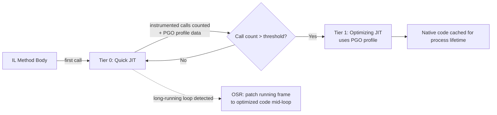

**2.3 Memory Layout — Stack vs Heap**

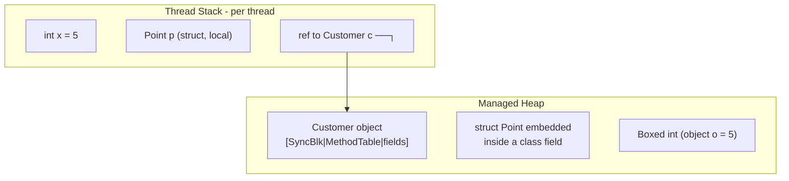

**2.4 Garbage Collector Internals — the deepest interview area**

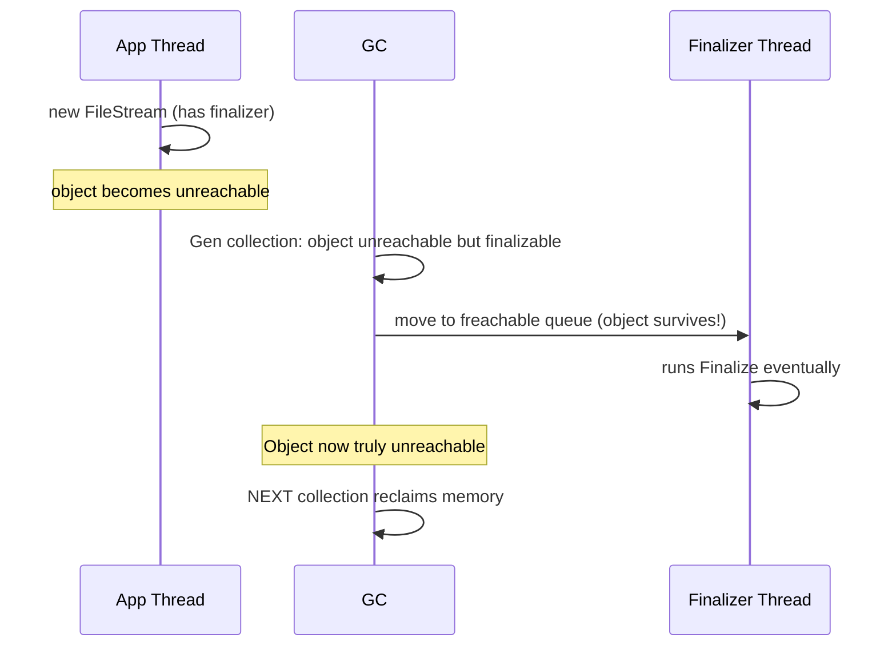

**CLR High-Level Component Diagram**

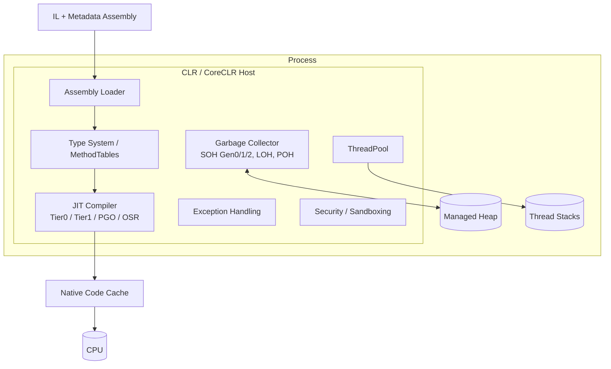

**GC Heap Layout (ASCII)**

```text
Small Object Heap (SOH)                        Large Object Heap (LOH)  Pinned Object Heap (POH)
┌───────────┬────────────┬─────────────────┐   ┌────────────────────┐   ┌────────────────────┐
│ Gen 0     │ Gen 1      │ Gen 2           │   │ Objects >= 85,000B │   │ fixed / GCHandle   │
│ (nursery) │ (buffer)   │ (long-lived)    │   │ not compacted by   │   │ .Pinned objects    │
│ freq. GC  │ occasional │ rare, expensive │   │ default            │   │                    │
└───────────┴────────────┴─────────────────┘   └────────────────────┘   └────────────────────┘
 ~fast <1ms   ~1-10ms      ~10-100ms+                                      never moved
```

**Class Diagram**

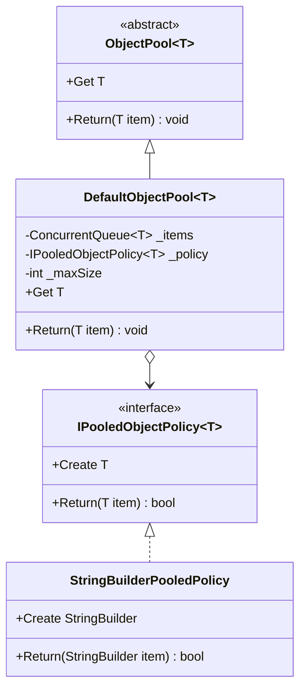

**Sequence Diagram — Rent/Return under contention**

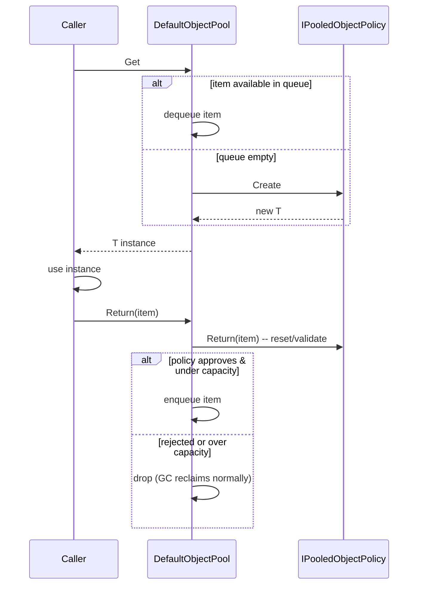

### Module 2 — C# Advanced: Async/Await, Task, and Threading Internals
*Source: `02-Async-Await-Internals.md`*

**2.8 Threading model tie-back**

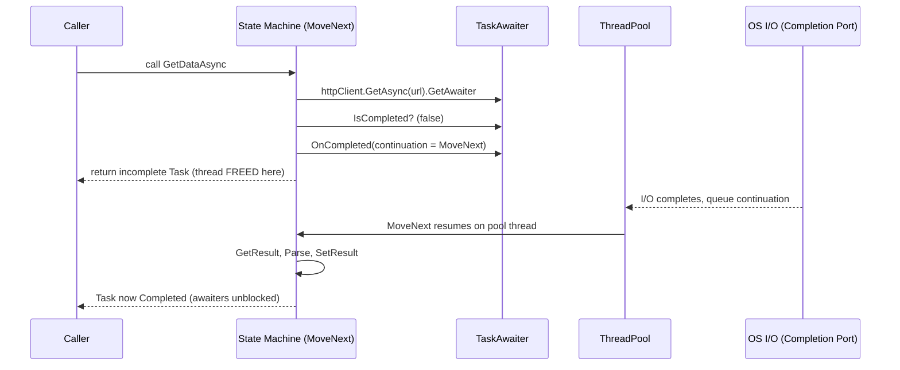

**Async Call Composition**

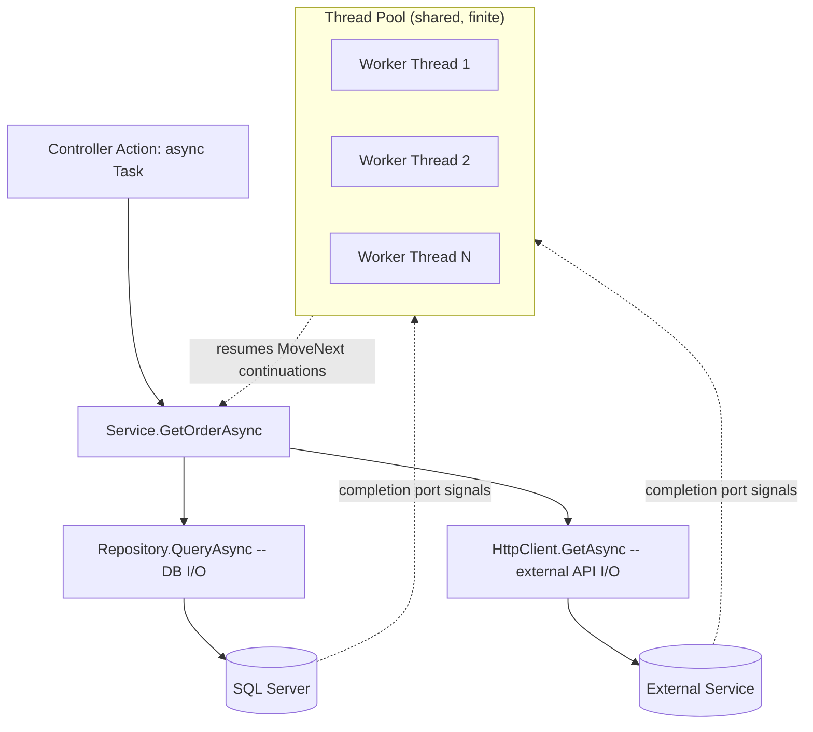

**State Machine Lifecycle (ASCII)**

```text
 Method call
 │
 ▼
 ┌─────────────────────┐ IsCompleted==true (sync path) ┌──────────────────┐
 │ MoveNext state=-1 │ ─────────────────────────────────▶│ SetResult; done │ <- may never allocate
 └─────────────────────┘ └──────────────────┘
 │ IsCompleted==false
 ▼
 ┌─────────────────────┐
 │ box state machine │ <- heap allocation happens HERE, only on the truly-async path
 │ register continuation│
 │ RETURN to caller │
 └─────────────────────┘
 │ (later, on completion)
 ▼
 ┌─────────────────────┐
 │ MoveNext resumes │
 │ state=0 -> goto label │
 │ SetResult / throw │
 └─────────────────────┘
```

**Class Diagram**

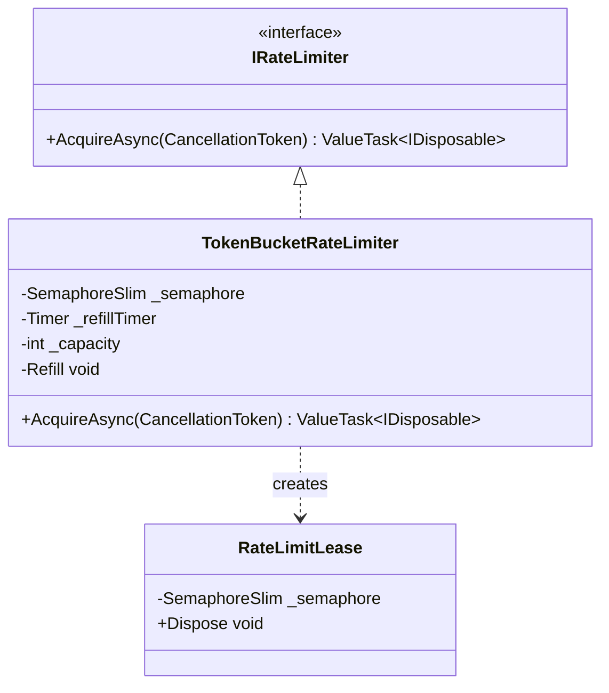

**Sequence Diagram — Acquire under contention**

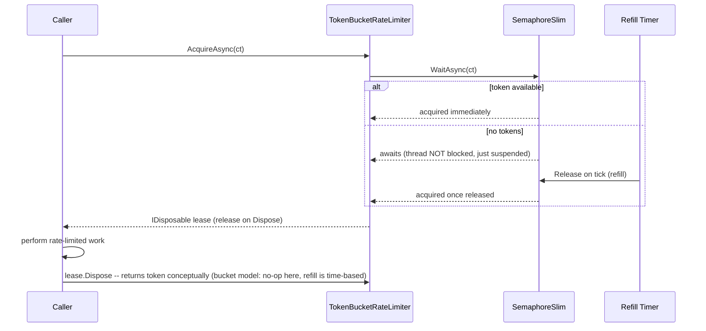

### Module 3 — C# Advanced: `Span<T>`, `Memory<T>` & Low-Allocation Code Patterns
*Source: `03-Span-Memory-Low-Allocation.md`*

**2.6 `Span<T>` and the JIT — Zero-Cost Abstraction, Mostly**

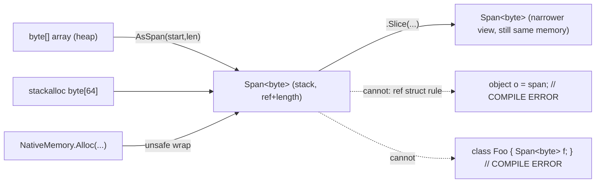

**Memory View Hierarchy (ASCII)**

```text
               ┌───────────────────────────────────────────┐
               │ Underlying Memory                         │
               │ (array on heap | stackalloc | native buf) │
               └───────────────────────────────────────────┘
                      ▲                ▲               ▲
               view (no copy)   view (no copy)   view (no copy)
                      │                │               │
        ┌────────────────┐  ┌──────────────────┐  ┌────────────────┐
        │ Span<T>        │  │ ReadOnlySpan<T>  │  │ Memory<T>      │
        │ (stack only)   │  │ (stack only)     │  │ (heap-safe,    │
        │ mutable        │  │ read-only        │  │ field/await-   │
        │                │  │                  │  │ safe)          │
        └────────────────┘  └──────────────────┘  └───────┬────────┘
                                                          │ .Span
                                                          ▼
                                                  ┌──────────────────────┐
                                                  │ Span<T> materialized │
                                                  │ right before use     │
                                                  └──────────────────────┘
```

**Data Flow — Zero-Allocation Request Parsing (Kestrel-style)**

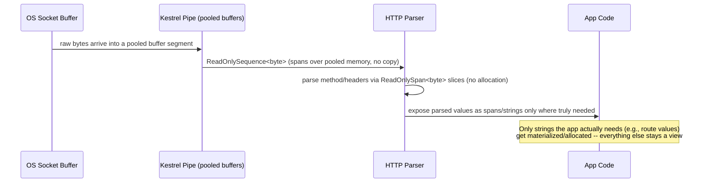

**Class Diagram**

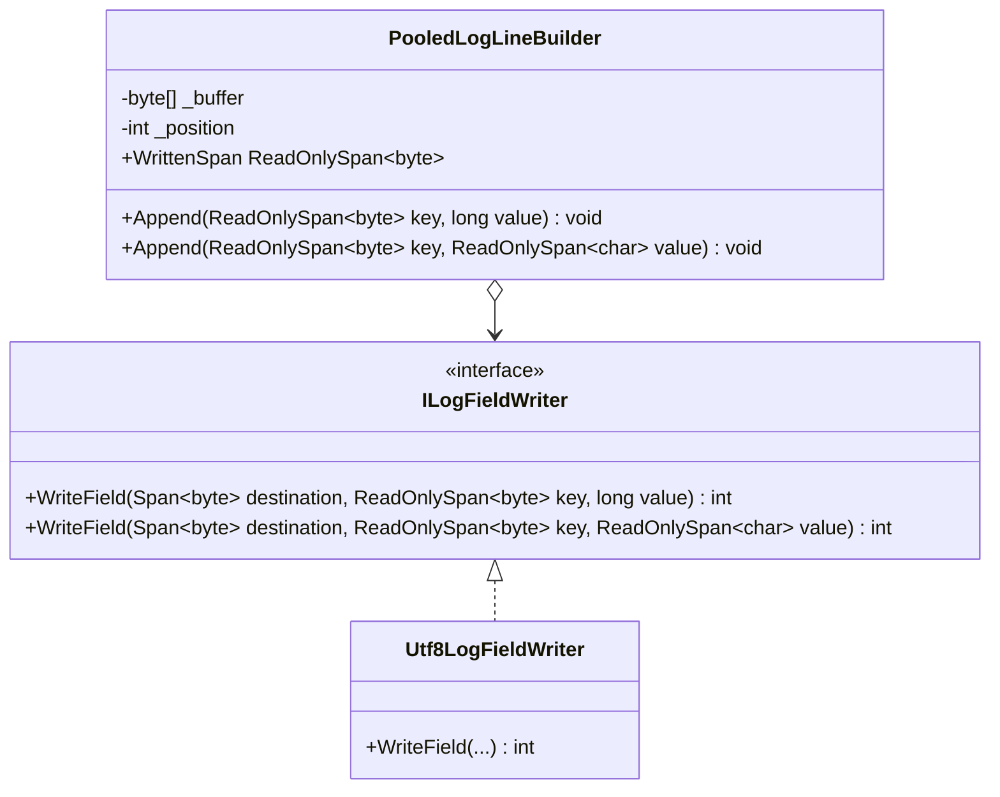

**Sequence Diagram**

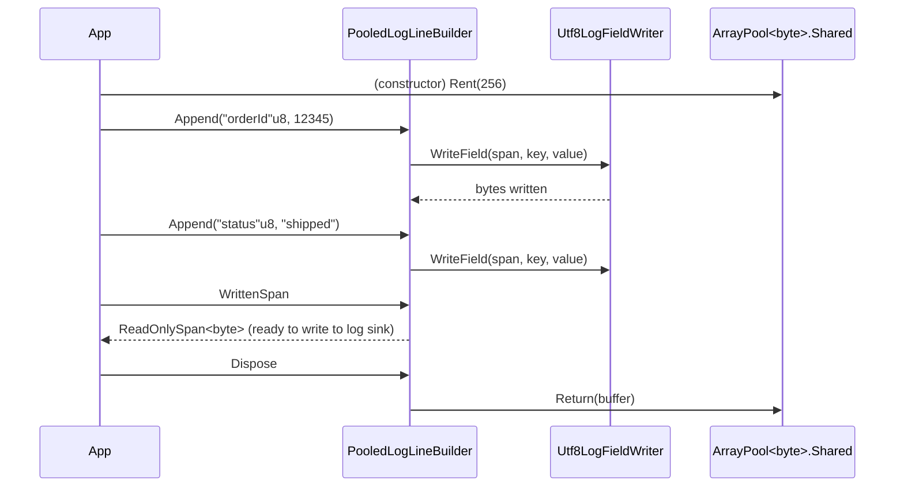

### Module 4 — C# Advanced: Delegates, Events, Closures & Multicast Internals
*Source: `04-Delegates-Events-Closures.md`*

**2.2 Multicast Delegates — the `+=` Mechanism**

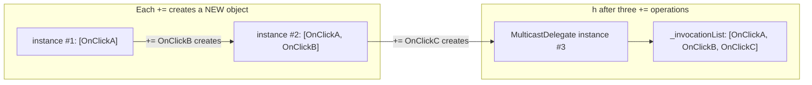

**2.7 Weak Event Pattern**

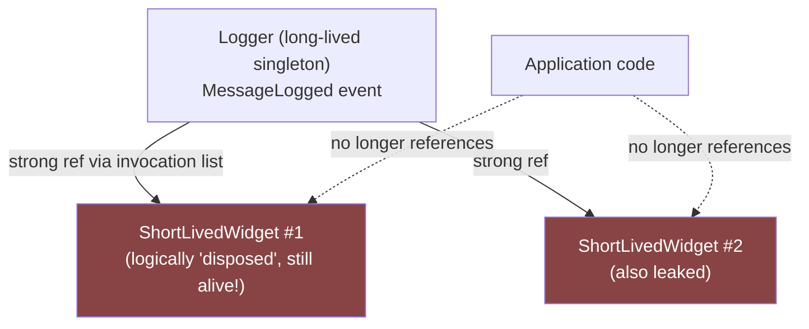

**Delegate Type Hierarchy**

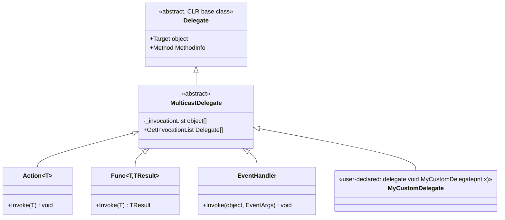

**Closure Capture Data Flow (ASCII)**

```text
Method scope:
 int threshold = 10; ┌─────────────────────┐
 Action a = => { │ DisplayClass (heap) │
 threshold++; │ int threshold = 10 │◄────┐
 Console.WriteLine(threshold);│ │ │
 }; └─────────────────────┘ │
 a; // prints 11 ▲ │
 Console.WriteLine(threshold); // 11 (!) │ delegate targets │
 │ this instance │
 ┌────────┴────────┐ │
 │ Action delegate │──────────┘
 │ _target = DisplayClass
 │ _methodPtr = Lambda
 └─────────────────┘
```

**Class Diagram**

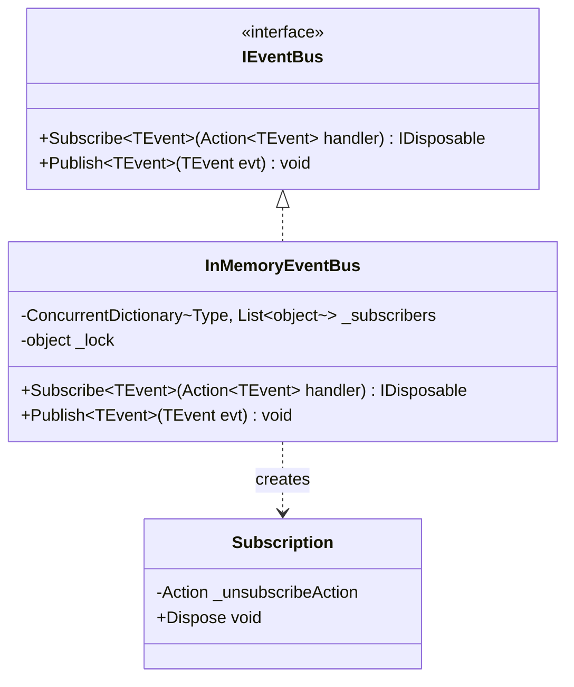

**Sequence Diagram**

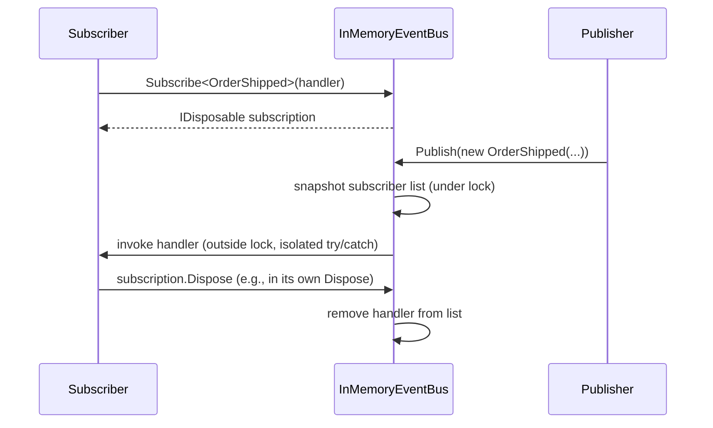

### Module 5 — C# Advanced: LINQ Internals — `IEnumerable` vs `IQueryable`, Deferred Execution & Iterator State Machines
*Source: `05-LINQ-Internals.md`*

**2.3 `IQueryable<T>` — Expression Trees and Provider Translation**

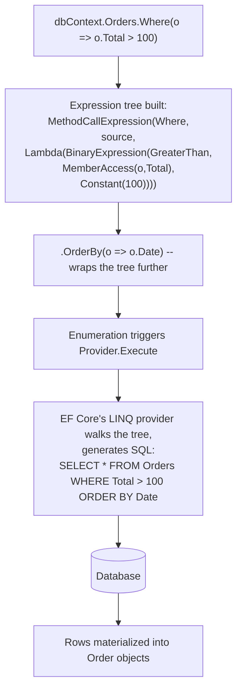

**LINQ Execution Model — Two Worlds**

```mermaid
graph TB
 subgraph "LINQ to Objects (IEnumerable<T>)"
 A1[Source: List/Array/yield-based iterator] --> A2["Where(Func&lt;T,bool&gt)<br/>compiled delegate"]
 A2 --> A3["Select(Func&lt;T,TResult&gt)<br/>compiled delegate"]
 A3 --> A4["foreach / ToList<br/>drives MoveNext chain, in-process"]
 end
 subgraph "LINQ to Entities (IQueryable<T>)"
 B1["Source: DbSet&lt;T&gt;"] --> B2["Where(Expression&lt;Func&lt;T,bool&gt;&gt)<br/>appends to expression tree"]
 B2 --> B3["OrderBy(Expression&lt;Func&lt;T,TKey&gt;&gt)<br/>appends further"]
 B3 --> B4["ToListAsync<br/>triggers Provider.Execute"]
 B4 --> B5["Expression tree -> SQL translation"]
 B5 --> B6[(Database engine)]
 end
```

**Iterator State Machine Lifecycle (ASCII, mirrors the async state machine diagram)**

```text
 Range(0, 3) called
 │
 ▼
 ┌───────────────────────┐ NOT executed yet -- just constructs the state machine object
 │ state = -2 (not started)│
 └───────────────────────┘
 │ first MoveNext call (from foreach / next LINQ operator)
 ▼
 ┌───────────────────────┐
 │ state = 0, i = 0 │
 │ Current = start + 0 │ <-- yield return suspends HERE, returns true
 └───────────────────────┘
 │ next MoveNext call
 ▼
 ┌───────────────────────┐
 │ resume at state 0, │
 │ i++, loop condition, │
 │ Current = start + 1 │
 └───────────────────────┘
 │... repeats until loop condition false...
 ▼
 ┌───────────────────────┐
 │ MoveNext returns false │ <-- enumeration complete
 └───────────────────────┘
```

**Class Diagram**

```mermaid
classDiagram
 class ISortableFilterableSpec~T~ {
 <<interface>>
 +GetSortExpression(string fieldName) Expression~Func~T,object~~
 +GetFilterExpression(string fieldName, string value) Expression~Func~T,bool~~
 }
 class TransactionFieldMap {
 -Dictionary~string, Expression~Func~Transaction,object~~~ _sortFields
 -Dictionary~string, Func~string, Expression~Func~Transaction,bool~~~~ _filterFields
 +GetSortExpression(string) Expression~Func~Transaction,object~~
 +GetFilterExpression(string, string) Expression~Func~Transaction,bool~~
 }
 ISortableFilterableSpec~Transaction~ <|.. TransactionFieldMap
```

### Module 6 — C# Advanced: Generics, Variance & Generic Constraints
*Source: `06-Generics-Variance.md`*

**2.1 Reified Generics vs Type Erasure — the CLR-Level Mechanism**

```mermaid
graph TB
 subgraph "Generic Type Definition (IL, one copy)"
 Def["List&lt;T&gt; -- generic IL, T is a placeholder"]
 end
 Def --> JIT{"JIT compilation<br/>per instantiation"}
 JIT -->|"T = int (value type)"| Code1["Specialized native code for List&lt;int&gt;<br/>(operates on int directly, no boxing)"]
 JIT -->|"T = double (value type)"| Code2["SEPARATE specialized native code for List&lt;double&gt;"]
 JIT -->|"T = string (reference type)"| Code3["Shared native code for ALL reference-type<br/>instantiations (List&lt;string&gt;, List&lt;MyClass&gt;,...)"]
 JIT -->|"T = MyClass (reference type)"| Code3
```

**Variance Direction Diagram**

```mermaid
graph LR
 subgraph "Covariance: out T (safe substitution goes UP the hierarchy for the WRAPPER)"
 A1["IProducer&lt;Cat&gt;"] -->|"assignable to"| A2["IProducer&lt;Animal&gt;"]
 end
 subgraph "Contravariance: in T (safe substitution goes DOWN the hierarchy for the WRAPPER)"
 B1["IConsumer&lt;Animal&gt;"] -->|"assignable to"| B2["IConsumer&lt;Cat&gt;"]
 end
 subgraph "Invariance: classes, or T used in BOTH positions"
 C1["List&lt;Cat&gt;"] -.->|"COMPILE ERROR"| C2["List&lt;Animal&gt;"]
 end
```

**Generic Instantiation & JIT Specialization (ASCII)**

```text
 List<T> (IL, one generic definition)
 │
 ┌─────────────────────┼─────────────────────┐
 ▼ ▼ ▼
 List<int> List<double> List<string> / List<MyClass> /...
 (own native code, (own native code, (ONE SHARED native code body --
 inline int[] storage, inline double[] all reference types are pointer-
 zero boxing) storage, zero sized and behave uniformly)
 boxing)
```

**Class Diagram**

```mermaid
classDiagram
 class IResult~out T~ {
 <<interface>>
 +IsSuccess bool
 +Value T
 +Error string
 }
 class Result~T~ {
 +IsSuccess bool
 +Value T
 +Error string
 +Success(T value)$ Result~T~
 +Failure(string error)$ Result~T~
 +Map~TResult~(Func~T,TResult~ mapper) Result~TResult~
 }
 IResult~T~ <|.. Result~T~
```

**Sequence Diagram — `Map` chaining**

```mermaid
sequenceDiagram
 participant Caller
 participant R1 as Result<Order>
 participant R2 as Result<OrderDto>

 Caller->>R1: Result<Order>.Success(order)
 Caller->>R1: Map(order => new OrderDto(order))
 R1->>R1: check IsSuccess
 alt IsSuccess
 R1->>R2: Result<OrderDto>.Success(mapper(Value))
 else failed
 R1->>R2: Result<OrderDto>.Failure(Error)
 end
 R2-->>Caller: Result<OrderDto>
```

### Module 7 — C# Advanced: Records, Pattern Matching & Immutability
*Source: `07-Records-Pattern-Matching-Immutability.md`*

**Record Equality & `with` Mechanics (ASCII)**

```text
var original = new Order(1, "Widget", 10) { Tags = new List<string> { "sale" } };
var copy = original with { Quantity = 20 };

  ┌───────────────────────────┐        ┌───────────────────────────┐
  │ original (heap object)    │        │ copy (NEW heap object)    │
  │   Id       = 1            │        │   Id       = 1            │
  │   Name     = "Widget"     │        │   Name     = "Widget"     │
  │   Quantity = 10           │        │   Quantity = 20  <- the   │
  │                           │        │                  only     │
  │                           │        │                  change   │
  │   Tags ───────────────────┼───┐    │   Tags ───────────────────┼───┐
  └───────────────────────────┘   │    └───────────────────────────┘   │
                                  │                                    │
                                  └─────────────────┬──────────────────┘
                                                    │
                                                    ▼
                          ┌─────────────────────────────────────────┐
                          │ SHARED List<string> { "sale" }          │
                          │ `with` copied the REFERENCE, not the    │
                          │ list -- mutating via EITHER reference   │
                          │ affects BOTH original and copy          │
                          └─────────────────────────────────────────┘
```

**Pattern Matching Decision Tree (Discriminated-Union-Style Modeling)**

```mermaid
classDiagram
 class Shape {
 <<abstract record, sealed hierarchy>>
 }
 class Circle {
 +double Radius
 }
 class Rectangle {
 +double Width
 +double Height
 }
 class Triangle {
 +double Base
 +double Height
 }
 Shape <|-- Circle
 Shape <|-- Rectangle
 Shape <|-- Triangle
 note for Shape "sealed hierarchy -- enables compiler\nexhaustiveness checking on switch expressions\nover Shape (with warnings-as-errors enabled)"
```

**Class Diagram**

```mermaid
classDiagram
 class OrderState {
 <<abstract sealed-hierarchy record>>
 }
 class Pending {
 +DateTime CreatedAt
 }
 class Paid {
 +DateTime PaidAt
 +string TransactionId
 }
 class Shipped {
 +DateTime ShippedAt
 +string TrackingNumber
 }
 class Cancelled {
 +DateTime CancelledAt
 +string Reason
 }
 OrderState <|-- Pending
 OrderState <|-- Paid
 OrderState <|-- Shipped
 OrderState <|-- Cancelled
```

**Sequence Diagram**

```mermaid
sequenceDiagram
 participant Client
 participant Transitions as OrderStateTransitions
 Client->>Transitions: Pay(new Pending(...), "txn-123")
 Transitions->>Transitions: switch on current state (exhaustive)
 Transitions-->>Client: new Paid(now, "txn-123")
 Client->>Transitions: Ship(paidState, "trk-456")
 Transitions->>Transitions: switch on current state (exhaustive)
 Transitions-->>Client: new Shipped(now, "trk-456")
 Client->>Transitions: Ship(pendingState, "trk-789")
 Transitions->>Transitions: switch matches Pending arm
 Transitions-->>Client: throws InvalidOperationException("Cannot ship an unpaid order.")
```

### Module 8 — C# Advanced: Exception Handling, SEH Internals & Custom Exception Design
*Source: `08-Exception-Handling-Custom-Exceptions.md`*

**Two-Pass Exception Handling (ASCII)**

```text
Call stack at throw time:
 Main
 └── ProcessOrder
 └── ValidateStock <-- throw new InsufficientStockException(...) HERE

PASS 1 (search, no unwinding yet):
 ValidateStock frame: any matching catch here? No try/catch in this frame.
 ProcessOrder frame: try/catch(InsufficientStockException) when (...)? EVALUATE FILTER (stack NOT yet unwound)
 -> filter returns true -> MATCH FOUND at this frame

PASS 2 (unwind down to the matched frame):
 ValidateStock frame: run any 'finally' blocks in this frame, pop it
 ProcessOrder frame: stack trace was already captured at throw time (ValidateStock's line);
 now actually execute the matched catch block's body
```

**Exception Hierarchy Example**

```mermaid
classDiagram
 class Exception {
 <<System.Exception>>
 +string Message
 +Exception InnerException
 +string StackTrace
 }
 class ApplicationDomainException {
 <<custom base for this app>>
 +string ErrorCode
 }
 class InsufficientStockException {
 +string Sku
 +int Requested
 +int Available
 }
 class PaymentDeclinedException {
 +string DeclineReason
 }
 class OrderValidationException {
 +IReadOnlyList~string~ Errors
 }
 Exception <|-- ApplicationDomainException
 ApplicationDomainException <|-- InsufficientStockException
 ApplicationDomainException <|-- PaymentDeclinedException
 ApplicationDomainException <|-- OrderValidationException
```

**Class Diagram**

```mermaid
classDiagram
 class ApiException {
 <<abstract>>
 +string ErrorCode
 +int HttpStatusCode
 }
 class ValidationApiException {
 +IReadOnlyDictionary~string,string[]~ FieldErrors
 }
 class RateLimitApiException {
 +TimeSpan RetryAfter
 }
 class NotFoundApiException
 class ExceptionHandlingMiddleware {
 -RequestDelegate _next
 -ILogger _logger
 +InvokeAsync(HttpContext) Task
 }
 ApiException <|-- ValidationApiException
 ApiException <|-- RateLimitApiException
 ApiException <|-- NotFoundApiException
 ExceptionHandlingMiddleware..> ApiException: catches specifically
```

**Sequence Diagram**

```mermaid
sequenceDiagram
 participant Client
 participant Middleware as ExceptionHandlingMiddleware
 participant App as Application Pipeline

 Client->>Middleware: HTTP request
 Middleware->>App: _next(context)
 alt ApiException thrown (expected)
 App-->>Middleware: throws ValidationApiException
 Middleware->>Middleware: LogInformation (low severity)
 Middleware-->>Client: 400 { errorCode, message, details }
 else Unexpected exception thrown
 App-->>Middleware: throws NullReferenceException
 Middleware->>Middleware: LogCritical (high severity, triggers alert)
 Middleware-->>Client: 500 { errorCode: "INTERNAL_ERROR", generic message }
 end
```
