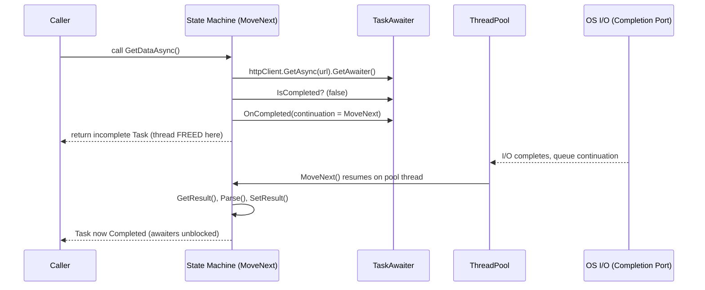
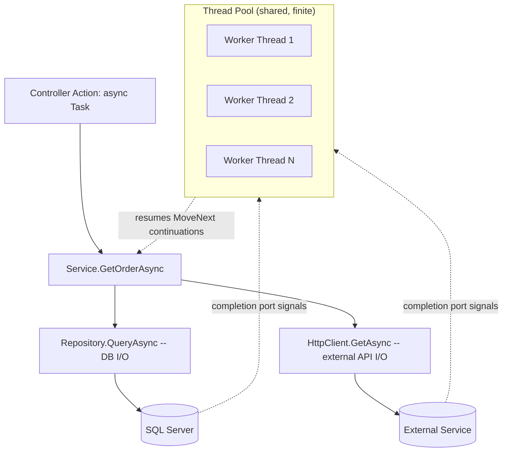
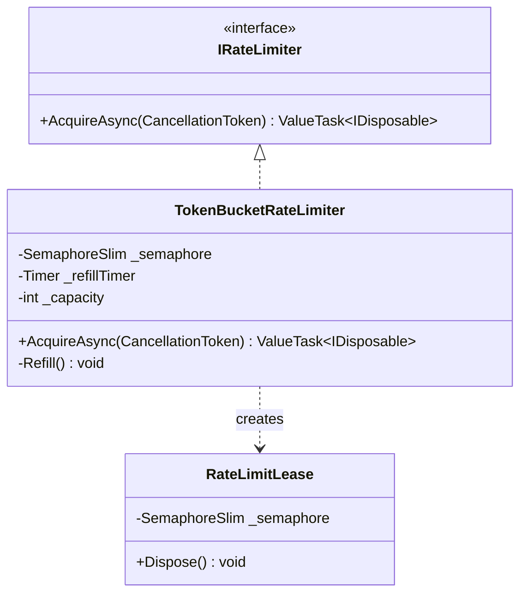
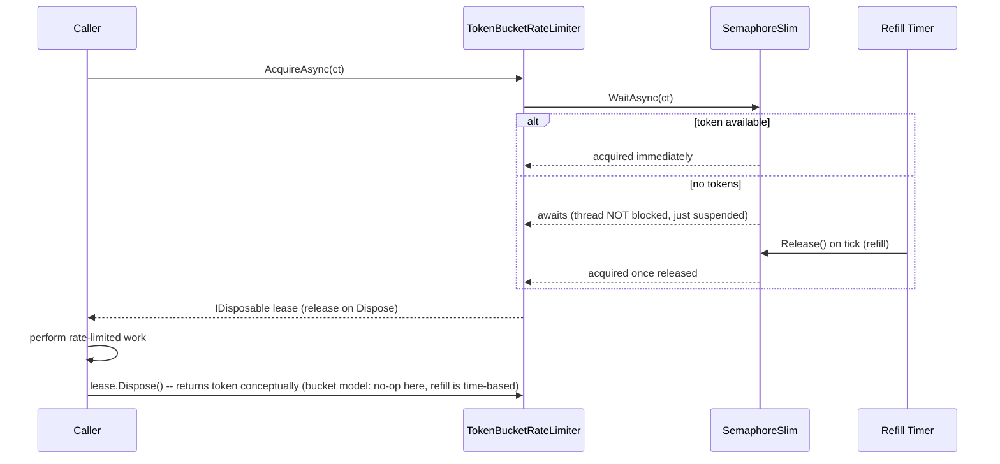

# Module 2 — C# Advanced: Async/Await, Task, and Threading Internals

> Domain: C# | Level: Beginner → Expert | Prerequisite: [[01-CLR-JIT-GC-Memory-Management]] (state machines, ThreadPool, GC allocation costs referenced throughout)

---

## 1. Fundamentals

### What is `async`/`await`?
`async`/`await` is C#'s compiler-driven syntax for writing asynchronous, non-blocking code that *reads* like synchronous code. It does not create threads. It is a **continuation-passing transformation**: the compiler rewrites your method into a state machine that can suspend at an `await` point (when the awaited operation isn't done yet), return control to the caller immediately, and resume later — on some thread — when the awaited operation completes.

### Why does it exist?
Before `async`/`await` (pre-C# 5), asynchronous I/O required either:
- **Blocking a thread** (`Thread.Sleep`, synchronous socket/file calls) — wastes a thread (and its ~1MB stack) sitting idle waiting on I/O that the OS is already handling asynchronously via interrupts/completion ports.
- **Callback-based APIs** (`BeginRead`/`EndRead`, `IAsyncResult`) — functionally correct but produces unreadable "callback hell," fragile error handling, and difficult composition.

`async`/`await` solves this: **don't hold a thread hostage while waiting on I/O.** A thread issues the I/O request, then returns to the pool to do other work; when the OS signals completion (via an I/O completion port), a thread-pool thread picks up the continuation and resumes your method exactly where it left off.

### When does this matter?
- **Always** in modern C# — it's the default way to write I/O-bound code (HTTP calls, DB queries, file I/O, message queue reads).
- **Critically** in server-side code (ASP.NET Core) where thread-pool threads are a shared, finite resource across all concurrent requests — blocking one to wait on I/O directly reduces the server's request-handling capacity.
- **Differently** for CPU-bound work — `async`/`await` doesn't parallelize CPU work by itself; that's what `Task.Run` (offload to thread pool) or `Parallel`/PLINQ (data parallelism) are for. Confusing "async" with "parallel" is one of the most common professional-level misunderstandings.

### How does it work (30,000-ft view)?

```
async Task<int> GetDataAsync()
{
    var response = await httpClient.GetAsync(url); // (1) suspend point
    return Parse(response);                          // (3) resumes here later
}
                                                       // (2) caller gets a Task<int> immediately,
                                                       //     keeps running; thread returned to pool
                                                       //     while I/O is in flight
```

Mental model for interviews: **"`await` doesn't wait. It registers a continuation and returns."** The calling thread is freed the instant an `await` hits an operation that hasn't completed synchronously. This is the single most load-bearing sentence in this entire module.

---

## 2. Deep Dive

### 2.1 The State Machine Transformation

The compiler rewrites an `async` method into a type implementing `IAsyncStateMachine`, roughly:

```csharp
// You write:
async Task<int> GetDataAsync()
{
    var response = await httpClient.GetAsync(url);
    return Parse(response);
}

// Compiler generates (simplified):
struct GetDataAsyncStateMachine : IAsyncStateMachine
{
    public int _state; // -1 = not started/running, 0/1/... = suspended at await #N
    public AsyncTaskMethodBuilder<int> _builder;
    public HttpClient httpClient; // captured locals become fields
    public TaskAwaiter<HttpResponseMessage> _awaiter;

    public void MoveNext()
    {
        int result;
        try
        {
            if (_state == 0) goto ResumePoint; // jump back in after suspension
            var task = httpClient.GetAsync(url);
            _awaiter = task.GetAwaiter();
            if (!_awaiter.IsCompleted)
            {
                _state = 0;
                _builder.AwaitUnsafeOnCompleted(ref _awaiter, ref this); // register continuation, RETURN
                return; // <-- this is the "suspend": control goes back to caller here
            }
            ResumePoint:
            var response = _awaiter.GetResult(); // resumes here when continuation fires
            result = Parse(response);
        }
        catch (Exception ex) { _builder.SetException(ex); return; }
        _builder.SetResult(result);
    }
}
```

Key facts this reveals:
- **It's a `struct` by default** (since C# 5, an optimization) — cheap, no allocation, *as long as it never needs to be boxed*. It gets boxed onto the heap the moment it's stored somewhere that outlives the stack frame — i.e., the first time it actually suspends (`AwaitUnsafeOnCompleted`). If every `await` in the method completes synchronously (already-completed tasks), the state machine may never box at all — a real, measurable perf difference between "usually completes synchronously" and "usually actually suspends" code paths.
- **Captured locals become fields** of the state machine — this is why a `foreach` loop variable or local captured across an `await` "survives" the suspension: it's not stack-resident anymore, it's a field on a (potentially heap-allocated) object.
- **`MoveNext()` is the continuation** — it's what gets scheduled to run when the awaited operation completes. This is literally what's registered with the `SynchronizationContext`/`TaskScheduler`/ThreadPool as "the thing to run next."

### 2.2 `Task` vs `Task<T>` vs `ValueTask` vs `ValueTask<T>`

- **`Task`/`Task<T>`**: A reference type representing an in-flight or completed operation. Always heap-allocated (with some caching for common cases — `Task.CompletedTask`, small cached `Task<bool>`/`Task<int>` results for 0-8 or so). Supports being awaited multiple times, cached, stored, and passed around freely — this is the *safe default*.
- **`ValueTask`/`ValueTask<T>`**: A `struct` wrapping *either* a synchronously-available result directly, *or* an `IValueTaskSource<T>` (a poolable, reusable backing object) for the asynchronous case. Purpose: avoid a `Task<T>` heap allocation on the **synchronous-completion hot path** (e.g., a cache-hit that returns immediately without ever truly going async).
  - **Strict rules** (violate these and you get silent bugs, not compile errors): don't await it twice, don't call `.Result`/`.GetAwaiter().GetResult()` and then `await` it too, don't store it and await it later from multiple places. If any of that flexibility is needed, call `.AsTask()` first to convert to a real `Task<T>`.
  - **When to use**: hot-path library APIs where synchronous completion is common/likely (e.g., `IAsyncEnumerator<T>.MoveNextAsync()`, cache lookups, buffered stream reads). **Not** a blanket replacement for `Task` in ordinary application code — the restrictions aren't worth it unless profiling shows the allocation matters.

### 2.3 `SynchronizationContext` and `ExecutionContext` — the two "ambient contexts"

These are frequently confused; they solve **different problems**:

- **`SynchronizationContext`**: Answers *"which thread/context should the continuation run on?"* Classic WinForms/WPF: marshal back to the UI thread (only the UI thread may touch UI controls). Classic ASP.NET (Framework, not Core): one-thread-per-request-context semantics tied to `HttpContext`. **ASP.NET Core installs no `SynchronizationContext` by default** — continuations resume on an arbitrary thread-pool thread, which is *why* the classic UI/ASP.NET-Framework deadlock (see §2.4) mostly doesn't reproduce there.
- **`ExecutionContext`**: Answers *"what ambient data (security principal, `AsyncLocal<T>` values, culture) should flow with this logical operation as it hops across threads?"* It's captured at every `await` (and other async boundaries like `Task.Run`) and restored on the resuming thread so `AsyncLocal<T>.Value` "follows" the logical call chain even though the physical thread changed.

`ConfigureAwait(false)` tells the awaiter: *"don't bother capturing/restoring the `SynchronizationContext` (or the current `TaskScheduler` if not default) for this continuation — just resume on any thread-pool thread."* This (a) avoids the marshaling cost, and (b) is the standard fix for library code that shouldn't care about UI-thread affinity. It does **not** affect `ExecutionContext` flow (`AsyncLocal` values still flow regardless).

### 2.4 The Classic Deadlock — precisely

```csharp
// Classic ASP.NET (Framework) or WPF/WinForms:
public ActionResult Index()
{
    var data = GetDataAsync().Result; // BLOCKS the current (UI/request) thread
    return View(data);
}
async Task<Data> GetDataAsync()
{
    var response = await httpClient.GetAsync(url); // captures SynchronizationContext
    return Parse(response); // this continuation is POSTED BACK to that same captured context
}
```
1. `.Result` blocks the calling thread (say, the one-and-only request-context thread in classic ASP.NET) waiting for `GetDataAsync()`'s `Task` to complete.
2. Inside `GetDataAsync`, after the `await`, the continuation (`Parse(response)` onward) is scheduled to run **on the captured `SynchronizationContext`** — i.e., that exact same thread.
3. That thread is busy blocking on step 1. It can never run the continuation from step 2. **Deadlock.**

**ASP.NET Core has no such `SynchronizationContext`**, so the continuation runs on an arbitrary pool thread instead — no deadlock in the classic sense. But `.Result`/`.Wait()` in ASP.NET Core is still harmful: it **synchronously blocks a pool thread**, contributing to thread-pool starvation under load (see Module 1 §2.5, §14) — a different failure mode (throughput collapse, not deadlock), often mistaken for "the same bug" in interviews. Know the distinction.

### 2.5 `async void` — why it's (almost) always wrong
- `async Task`/`async Task<T>` methods return a `Task` the caller can await, observe exceptions on, and compose.
- `async void` methods return nothing awaitable. Exceptions thrown inside them **cannot be caught by the caller** — they're rethrown directly on the `SynchronizationContext` that was current when the method started, typically crashing the process (unhandled exception) rather than propagating through normal `try`/`catch`.
- The **only** legitimate use: top-level event handlers (`button_Click`) where the delegate signature is fixed by the framework and can't return `Task`.

### 2.6 `Task.Run` vs `async`/`await` — CPU-bound vs I/O-bound
- `await someIoTask` — no thread is consumed while waiting; the OS/completion port does the actual waiting.
- `Task.Run(() => CpuBoundWork())` — explicitly **queues work to a thread-pool thread** to run synchronously-blocking CPU work off the calling thread. This *does* consume a thread for the duration of the work — it's parallelism/offloading, not "asynchrony" in the I/O sense.
- **Anti-pattern**: wrapping a naturally synchronous CPU-bound method in `Task.Run` inside an ASP.NET Core controller to "make it async" — you've just moved the blocking work from the request-handling thread to *another* pool thread, consuming the same shared pool resource with added overhead (thread hop, `Task` allocation) and zero benefit, since ASP.NET Core already dispatches requests on pool threads.

### 2.7 `IAsyncEnumerable<T>` and `await foreach`
Async streams (C# 8+) compile to a state machine implementing `IAsyncEnumerator<T>`, where `MoveNextAsync()` returns a `ValueTask<bool>` (chosen specifically to avoid per-iteration `Task<bool>` allocation on the common synchronous-continuation path — a direct application of §2.2). `await foreach` desugars to a loop calling `MoveNextAsync()`/`Current` and disposing via `DisposeAsync()` (if `IAsyncDisposable`) at the end — enabling truly async, backpressure-aware iteration (e.g., streaming paged results from a DB without buffering the whole set in memory).

### 2.8 Threading model tie-back (from Module 1)
Every continuation not explicitly targeted at a captured `SynchronizationContext` is queued as a work item on the CLR **ThreadPool** (see [[01-CLR-JIT-GC-Memory-Management]] §2.5). Under sustained load, if pool threads are being blocked synchronously (sync-over-async, §2.4) faster than the pool's ~1-thread/sec growth heuristic can compensate, queued continuations back up — this is **thread pool starvation**, and it is fundamentally an async/await misuse problem wearing a "GC/threading" costume.



---

## 3. Visual Architecture

### Async Call Composition



### State Machine Lifecycle (ASCII)

```
 Method call
      │
      ▼
 ┌─────────────────────┐   IsCompleted==true (sync path)   ┌──────────────────┐
 │ MoveNext() state=-1  │ ─────────────────────────────────▶│ SetResult(); done │  <- may never allocate
 └─────────────────────┘                                    └──────────────────┘
      │ IsCompleted==false
      ▼
 ┌─────────────────────┐
 │ box state machine    │  <- heap allocation happens HERE, only on the truly-async path
 │ register continuation│
 │ RETURN to caller      │
 └─────────────────────┘
      │  (later, on completion)
      ▼
 ┌─────────────────────┐
 │ MoveNext() resumes    │
 │ state=0 -> goto label │
 │ SetResult() / throw   │
 └─────────────────────┘
```

---

## 4. Production Example

### Scenario: E-commerce checkout API — intermittent 500s under Black-Friday load

**Problem**: A checkout microservice (ASP.NET Core, .NET 8) worked fine at normal load (~500 req/s) but under Black-Friday peak (~4,000 req/s) started throwing `TaskCanceledException`/timeout errors on a *downstream inventory-check call*, even though the inventory service itself reported healthy, low CPU, low latency.

**Investigation**:
- `dotnet-counters` showed `ThreadPool Queue Length` climbing into the thousands, `ThreadPool Thread Count` slowly climbing (the classic ~1/sec injection pattern), while CPU utilization stayed under 40%.
- `dotnet-dump analyze` + `clrstack` on multiple worker threads revealed dozens of threads blocked inside a legacy `PaymentGatewayClient.Charge(...)` method — a synchronous wrapper that internally called `.GetAwaiter().GetResult()` on an async HTTP call, added years earlier "to keep the interface synchronous for a legacy caller."
- Under peak load, enough concurrent checkout requests hit this synchronous wrapper simultaneously that pool threads were consumed faster than new checkout requests (and, critically, the *inventory-check continuations*) could be scheduled — starving unrelated async work elsewhere in the same process, producing the seemingly-unrelated inventory timeout symptom.

**Architecture fix**:
- Replaced `PaymentGatewayClient.Charge(...)` (sync-over-async) with a genuinely `async Task<ChargeResult> ChargeAsync(...)`, propagated `async` up through the one remaining legacy synchronous caller (which was refactored, since "keep it sync" was a shortcut, not a hard constraint).
- Added a Roslyn analyzer rule (banning `.Result`/`.Wait()`/`.GetAwaiter().GetResult()` outside of `Main`/explicitly annotated exceptions) to the CI pipeline to prevent recurrence.
- Load-tested at 2x expected peak with the fix, confirming `ThreadPool Queue Length` stayed flat under sustained load.

**Trade-offs**: The refactor touched a legacy interface boundary considered "stable/do not touch" — required a coordinated review with the team owning the legacy caller. Accepted because the alternative (raising `ThreadPool.SetMinThreads` as a band-aid) only delays the same failure to a higher load threshold, papering over the root cause.

**Lessons learned**:
1. Thread pool starvation manifests as **seemingly unrelated** failures elsewhere in the same process — the symptom (inventory timeout) and the cause (payment gateway sync-over-async) were in different modules entirely, because they share one finite thread pool.
2. Low CPU + high latency + climbing queue length is the diagnostic signature of thread pool starvation — don't chase CPU-bound explanations when CPU is low.
3. `ThreadPool.SetMinThreads` treats a symptom; fixing sync-over-async treats the cause.
4. Static analysis (banning blocking async calls) is cheaper than repeat incidents.

---

## 5. Best Practices

- **`async` all the way down.** Why: any sync-over-async boundary anywhere in a call chain reintroduces thread-pool blocking risk for everyone sharing that pool. Exception: true top-level entry points (`Main`, a console app with no further async callers) where there's nothing left to compose with.
- **Use `ConfigureAwait(false)` in library/shared code that has no UI-thread affinity requirement.** Why: avoids unnecessary `SynchronizationContext` capture/marshaling cost and prevents accidental UI-thread deadlocks if the library is ever called from a context that has one. Don't bother in ASP.NET Core app-level code (no default `SynchronizationContext` to avoid) unless the team has a blanket style-consistency rule — but always do it in reusable NuGet-published libraries, since you don't control the caller's context.
- **Prefer `Task`/`Task<T>` by default; reach for `ValueTask<T>` only after profiling shows allocation matters** on a genuinely hot, frequently-synchronously-completing path. Don't cargo-cult `ValueTask` everywhere — its usage restrictions are a real correctness hazard if misused.
- **Never use `async void` except for framework-mandated event handler signatures.** Wrap the body in `try`/`catch` if you must use `async void`, since unhandled exceptions there crash the process instead of propagating normally.
- **Use `CancellationToken` end-to-end** for any async API that might run long or be user-cancelable (HTTP requests, DB queries) — propagate the token from the request's `HttpContext.RequestAborted` down through every layer, don't swallow it at a service boundary.
- **Use `IAsyncEnumerable<T>`/`await foreach` for streaming large result sets** instead of materializing a full `List<T>` in memory — directly reduces both latency-to-first-byte and peak memory/GC pressure (ties back to Module 1's LOH/allocation guidance).
- **Use `Task.WhenAll`/`Task.WhenAny` for independent concurrent operations**, not sequential `await` in a loop, when operations don't depend on each other's results — e.g., fetching from 3 independent services in parallel rather than one after another.

---

## 6. Anti-patterns

- **Sync-over-async (`.Result`, `.Wait()`, `.GetAwaiter().GetResult()`) in hot/shared-pool code.** Why it fails: causes deadlocks (classic `SynchronizationContext` contexts) or thread-pool starvation (ASP.NET Core). Fix: propagate `async` through the call chain; if truly blocked by a synchronous interface you don't own, isolate the blocking call to a dedicated, bounded thread pool (not the shared CLR pool) as damage control while planning the real fix.
- **`async void` for anything but UI event handlers.** Fix: return `Task`; if the signature is fixed by a framework delegate, wrap the body defensively in `try`/`catch` and log — never let an exception escape unguarded.
- **Wrapping CPU-bound work in `Task.Run` inside an already-pool-threaded ASP.NET Core request handler "to make it async."** Why it fails: adds a thread-hop + allocation for zero concurrency benefit — the request thread was already a pool thread. Fix: just call the CPU-bound method directly (synchronously) if it must run on this request's thread, or genuinely offload to a separate, bounded worker/queue (background service, message queue) if you need to decouple request latency from the CPU work's duration.
- **`Task.WhenAll` without exception aggregation awareness.** `Task.WhenAll` only rethrows the *first* exception via `await`; other faulted tasks' exceptions are silently available only via the `AggregateException` on the `Task` itself, not the awaited result. Fix: inspect `.Exceptions` explicitly if multiple failures matter, or use per-task error handling before aggregating.
- **Capturing large objects across `await` boundaries in hot-path async methods**, needlessly inflating the (potentially heap-boxed) state machine size. Fix: scope locals tightly; avoid holding onto large buffers/DTOs across suspension points longer than necessary.
- **Using `ValueTask<T>` as a general-purpose "faster Task" without respecting its single-await/single-consumption contract.** Why it fails: awaiting it twice, or calling `.Result` and then `await`-ing, is undefined/broken behavior specific to the backing `IValueTaskSource` implementation — can silently corrupt results or throw obscure exceptions. Fix: `.AsTask()` immediately if you need `Task`-like flexibility.
- **Fire-and-forget `async` calls without exception handling** (`_ = DoSomethingAsync();` with no follow-up). Why it fails: exceptions vanish silently (or crash the process if unobserved-task-exception policies are strict) — failures become invisible. Fix: explicitly handle/log within the fire-and-forget method itself, or use a proper background task/queue abstraction with observability.

---

---

---

---

## 10. Interview Questions

### Basic (10)

1. **Q: Does `await` block the calling thread?**
   **A:** No — if the awaited operation hasn't completed synchronously, the method returns control to its caller immediately; the thread is freed to do other work. **Mistake:** saying "await pauses execution" without clarifying that the *thread* is released, not blocked.

2. **Q: What's the difference between `Task.Run` and `await someAsyncMethod()`?**
   **A:** `Task.Run` explicitly offloads work to a thread-pool thread (for CPU-bound work); `await` on a genuinely async (I/O-based) method doesn't consume a thread while waiting at all.

3. **Q: What does `async void` do differently from `async Task`, and why avoid it?**
   **A:** `async void` gives the caller nothing to await and rethrows exceptions directly on the ambient context, often crashing the process; use only for framework event handlers.

4. **Q: What is a `CancellationToken` for?**
   **A:** A cooperative cancellation signal passed through an async call chain so long-running or now-unneeded work can stop early.

5. **Q: What's the difference between `Task.WhenAll` and `Task.WhenAny`?**
   **A:** `WhenAll` completes when *all* given tasks complete (aggregating exceptions); `WhenAny` completes as soon as the *first* one does.

6. **Q: Can you await the same `Task` multiple times?**
   **A:** Yes, `Task`/`Task<T>` supports multiple awaits/consumers safely — unlike `ValueTask`, which does not.

7. **Q: What is `ConfigureAwait(false)` for?**
   **A:** Tells the runtime not to bother resuming the continuation on the originally-captured `SynchronizationContext` — resume on any available thread-pool thread instead.

8. **Q: Is `async`/`await` the same as multithreading?**
   **A:** No — it's about not blocking threads during I/O waits; it doesn't inherently run code on multiple threads simultaneously (that's what `Task.Run`/`Parallel` are for).

9. **Q: What does an `async` method return if it has no meaningful result?**
   **A:** `Task` (not `void`), so callers can still await completion and observe exceptions.

10. **Q: What happens if an exception is thrown inside an `async Task` method?**
    **A:** It's captured and stored on the returned `Task`; it's rethrown when the caller `await`s (or accessed via `.Exception` if using `.Result`/`.Wait()`, wrapped in `AggregateException`).

### Intermediate (10)

1. **Q: Explain exactly why sync-over-async deadlocks in classic ASP.NET/WPF but usually doesn't in ASP.NET Core.**
   **A:** Classic frameworks install a `SynchronizationContext` that the continuation is posted back to; blocking that same thread with `.Result` prevents the continuation from ever running. ASP.NET Core installs no such context by default, so continuations run on arbitrary pool threads — no deadlock, but still thread-pool-starvation risk under load.

2. **Q: Why is the async state machine a `struct` by default, and when does it get boxed?**
   **A:** To avoid a heap allocation for methods that complete synchronously. It's boxed the first time it must actually suspend (register a continuation via `AwaitUnsafeOnCompleted`) since it needs to outlive the current stack frame at that point.

3. **Q: When would you choose `ValueTask<T>` over `Task<T>`, and what must you avoid doing with it?**
   **A:** Hot paths where synchronous completion is common (e.g., cache hits) to avoid a `Task<T>` allocation; avoid awaiting it more than once, blocking on it and then awaiting it, or storing/sharing it across multiple consumers — convert to `Task` via `.AsTask()` if that flexibility is needed.

4. **Q: What's the difference between `ExecutionContext` and `SynchronizationContext`?**
   **A:** `ExecutionContext` flows ambient data (`AsyncLocal`, security/culture) across async boundaries regardless of thread; `SynchronizationContext` determines *which* thread/context a continuation resumes on. `ConfigureAwait(false)` skips capturing `SynchronizationContext` only — `ExecutionContext`/`AsyncLocal` values still flow.

5. **Q: Why does wrapping a CPU-bound method in `Task.Run` inside an ASP.NET Core controller action usually not help?**
   **A:** The controller action already runs on a thread-pool thread; `Task.Run` just moves the same blocking work to a different pool thread, adding overhead (thread hop, `Task` allocation) with no added concurrency, since it's the same shared, finite pool either way.

6. **Q: How does `Task.WhenAll` handle multiple faulted tasks, and what's the common mistake?**
   **A:** It aggregates all exceptions into an `AggregateException` on the returned `Task`, but `await`-ing the `WhenAll` result only surfaces the *first* exception directly; the mistake is assuming `await Task.WhenAll(...)` reveals every failure — you must inspect `Task.Exception`/each individual task if all failures matter.

7. **Q: What is `IAsyncDisposable` and when do you need it over `IDisposable`?**
   **A:** Provides `DisposeAsync()` for resources whose cleanup itself involves async I/O (e.g., flushing a network stream); use `await using` instead of `using` so cleanup doesn't block a thread synchronously.

8. **Q: Why does `IAsyncEnumerator<T>.MoveNextAsync()` return `ValueTask<bool>` instead of `Task<bool>`?**
   **A:** To avoid allocating a new `Task<bool>` on every single iteration when elements are frequently available synchronously (e.g., an in-memory buffer being streamed) — a direct, high-frequency case for `ValueTask`'s allocation-avoidance design.

9. **Q: What's a practical example of `CancellationToken` misuse that causes a resource leak or wasted work?**
   **A:** A controller action that accepts a `CancellationToken` parameter but doesn't pass it down into the DB call/HTTP client call — if the client disconnects, the server keeps running the full downstream query/call to completion anyway, wasting resources and potentially connection-pool slots.

10. **Q: How would you explain to a junior engineer why "async" doesn't automatically make an API "faster"?**
    **A:** Per single request, async can add small overhead (state machine, context capture) versus doing the same work synchronously; the benefit is systemic — under concurrent load, it prevents threads from being blocked idle on I/O, so the *server* handles more concurrent requests without needing proportionally more threads, which indirectly avoids the queueing-delay latency that thread exhaustion would otherwise cause.

### Advanced (10)

1. **Q: Walk through, at the field level, what a captured `foreach` loop variable inside an `async` method with an `await` per iteration actually becomes.**
   **A:** The loop variable becomes a field on the compiler-generated state machine (not a true stack local), reused/reassigned each iteration in `MoveNext()`; since C# 5's per-iteration variable scoping fix (each iteration effectively gets a distinct closure-visible value for `foreach`), captured lambdas referencing it inside the loop body see the correct per-iteration value, but it's still one field being written repeatedly across `MoveNext` invocations, not N independent stack slots — understanding this matters when reasoning about whether a captured mutable field could be observed mid-mutation by a concurrent access path (e.g., a bug where the loop body kicks off a fire-and-forget task capturing the loop variable incorrectly in older C# versions/`for` loops without the fix).

2. **Q: Explain precisely why `Task.Delay(0)` or `await Task.Yield()` is sometimes inserted deliberately in async code, and the risk of overusing it.**
   **A:** `Task.Yield()` forces an asynchronous suspension point even if nothing is "really" async yet — used to yield control back to the caller/scheduler explicitly (e.g., breaking up a long synchronous loop into cooperatively-scheduled chunks so it doesn't monopolize a thread-pool thread, or avoiding stack-dive/`SynchronizationContext` reentrancy issues in specific UI scenarios). Overuse risk: each forced yield still pays continuation-scheduling overhead (a real, if small, cost) and can mask a design that should instead genuinely offload to `Task.Run` or restructure around true I/O boundaries — it's a scalpel for narrow scheduling problems, not a general "make it more async" habit.

3. **Q: How does the `TaskScheduler` abstraction relate to `SynchronizationContext`, and when would you implement a custom one?**
   **A:** `TaskScheduler` is the lower-level abstraction controlling *where*/*how* `Task` continuations are scheduled (default is the thread pool via `TaskScheduler.Default`); `SynchronizationContext.Current` (when set) is wrapped by `TaskScheduler.FromCurrentSynchronizationContext()` for UI-affinity scenarios. Custom `TaskScheduler` implementations are rare in application code — legitimate cases include enforcing limited concurrency for a specific workload (a scheduler capping N concurrent tasks) or integrating with a non-standard execution environment (e.g., a custom actor/single-threaded-affinity model) where neither the default pool nor a UI `SynchronizationContext` fits.

4. **Q: Describe a scenario where `ConfigureAwait(false)` would actually change program *behavior*, not just performance, and why that's dangerous.**
   **A:** In an environment with a meaningful `SynchronizationContext` (e.g., WPF), if code after an `await` needs to touch a UI control, adding `ConfigureAwait(false)` upstream causes that continuation to run on a non-UI thread, throwing a cross-thread-access exception — a correctness regression, not just a perf tweak. This is why `ConfigureAwait(false)` should be applied deliberately (typically in leaf library code that has no UI dependency) rather than as a reflexive style rule applied blindly to every `await` in an application that *does* have UI-thread-affinity requirements somewhere in its call chain.

5. **Q: What is "async-over-sync" (the inverse of sync-over-async), and why can it also be harmful?**
   **A:** Wrapping an inherently synchronous, fast operation in `Task.Run`/`async` "to look modern/consistent" — adds state-machine, `Task` allocation, and potential thread-pool scheduling overhead for work that gains nothing from asynchrony (no I/O, no long CPU work worth offloading). Harmful because it adds latency/overhead and pool contention (a queued `Task.Run` competes for the same pool as everything else) without any concurrency benefit — the "always make everything async" cargo-cult is as much an anti-pattern as sync-over-async, just less catastrophic under load.

6. **Q: How would you reason about the right degree of concurrency when using `Task.WhenAll` over a large collection (e.g., 10,000 items each requiring an async DB call)?**
   **A:** Unbounded `Task.WhenAll(items.Select(CallAsync))` over 10,000 items can exhaust downstream connection pools (DB, HTTP) or overwhelm a rate-limited external API — bound concurrency explicitly via a `SemaphoreSlim` gate, `Parallel.ForEachAsync` (built-in bounded-concurrency async iteration, .NET 6+), or a bounded `Channel<T>` producer/consumer pipeline — choosing the bound based on the downstream system's actual safe concurrency limit (e.g., DB max pool size), not an arbitrary guess.

7. **Q: Explain how `AsyncLocal<T>` combined with a custom middleware "current tenant" pattern could leak state across requests, and how to prevent it.**
   **A:** If tenant context is set via `AsyncLocal<T>.Value = tenant` at request start but a background `Task.Run`/fire-and-forget work item is spawned *without* properly flowing/scoping `ExecutionContext` (e.g., using `ExecutionContext.SuppressFlow()` incorrectly, or a custom scheduler that doesn't copy context), a later request reusing that same pool thread could observe stale `AsyncLocal` state if the value was mistakenly stored somewhere thread-static instead of properly flowed/cleared — prevention: rely on standard `AsyncLocal`/`ExecutionContext` flow (don't hand-roll `ThreadStatic` for request-scoped ambient data), and explicitly avoid capturing broader scope than the request itself in any background work spawned from within it.

8. **Q: What's the actual difference in allocation profile between `await Task.FromResult(x)` and `return x;` inside an `async Task<T>` method?**
   **A:** `async Task<T>` methods that complete synchronously use the compiler-generated state machine's fast path (`SetResult` directly on the builder, using a cached/pooled completed `Task<T>` where applicable) — `return x;` inside a genuinely `async` method is already optimized; explicitly writing `await Task.FromResult(x)` inside an async method adds an unnecessary extra await/state-machine step for no benefit (it was a pre-`async`/`await`-native idiom). The more relevant real comparison is a **non-async** method returning `Task.FromResult(x)` directly (no state machine at all, cheapest option) versus marking it `async` unnecessarily (adds state-machine overhead for a method with no actual `await`).

9. **Q: How does exception handling differ between `await`-ing a faulted `Task` versus accessing `.Result` on it?**
   **A:** `await` unwraps and rethrows the *original* exception type directly (preserving the stack trace via `ExceptionDispatchInfo` under the hood); `.Result`/`.Wait()` wraps it in an `AggregateException`, requiring `.InnerException`/`.Flatten()` handling — a common source of "why did my catch block for `SqlException` stop working" bugs when someone changes `await` to `.Result` without updating exception handling accordingly.

10. **Q: Describe how you'd design a bounded background-processing pipeline (e.g., outbound webhook delivery) using `Channel<T>` and async consumers, and why over a raw `ConcurrentQueue` + polling loop.**
    **A:** `System.Threading.Channels.Channel<T>` provides an async-native, backpressure-capable producer/consumer queue (`WriteAsync`/`ReadAsync`, bounded capacity with configurable full-channel behavior — wait, drop, or throw) — producers (webhook enqueue requests) and a fixed pool of consumer tasks (`await foreach (var item in channel.Reader.ReadAllAsync())`) coordinate without a hand-rolled polling loop (`while(true) { if queue.TryDequeue... else Thread.Sleep(...) }`), which either wastes CPU (tight polling) or adds artificial latency (sleep-based polling) and doesn't naturally support backpressure. `Channel<T>` also integrates cleanly with `CancellationToken` for graceful shutdown draining, unlike a raw `ConcurrentQueue`.

### Expert (10)

1. **Q: A high-throughput service exhibits growing memory (Gen 2) specifically correlated with a feature that uses `IAsyncEnumerable<T>` to stream DB results to clients over Server-Sent Events. Diagnose the likely root cause classes and how you'd confirm each.**
   **A:** Likely classes: (a) client consumers not properly disposing (`await using`) the async enumerator on early disconnect, leaving server-side DB command/reader resources (and their buffers) alive until a timeout — confirm via `dotnet-gcdump` showing growing counts of the DB reader/connection-related types, correlated with connection pool exhaustion metrics; (b) the streaming path incorrectly buffering (e.g., an accidental `.ToListAsync()` inserted upstream of the "streaming" enumerable, defeating the whole point) — confirm by checking whether memory scales with result-set size per request rather than with concurrent-request count; (c) `AsyncLocal`/`ExecutionContext` capturing large per-request state that's kept alive for the full duration of a long-lived streaming connection rather than released promptly — confirm via heap dump "path to root" analysis showing the object graph rooted through an `ExecutionContext`/captured closure rather than through the expected DB/connection object graph.

2. **Q: Explain, precisely, the difference in behavior (not just theory) between `Task.Run(async () => await X())` and directly `await X()`, in terms of `SynchronizationContext` and exception propagation.**
   **A:** `Task.Run` always schedules its delegate onto a thread-pool thread and — critically — the async delegate executed inside it runs with **no captured `SynchronizationContext`** from the caller (thread-pool-queued work starts fresh), whereas `await X()` directly, if called from a context with a `SynchronizationContext` (e.g., a UI thread), captures and returns to that context for its continuation. This means `Task.Run(async () => await X())` is sometimes used *specifically* as a deliberate escape hatch to break out of an unwanted `SynchronizationContext` (e.g., avoiding UI-thread-affinity for a chain of calls) — legitimate, but should be a documented deliberate choice, not an accidental side effect of "wrapping things in Task.Run out of habit." Exception propagation is unaffected in either case — both surface exceptions normally through the returned `Task` when awaited.

3. **Q: How would you design cooperative cancellation for a multi-stage async pipeline (validate → charge payment → reserve inventory → notify) such that cancellation after payment has already succeeded doesn't leave the system in an inconsistent state?**
   **A:** `CancellationToken` should gate stages *before* any externally-observable side effect commits, but once a stage has an irreversible external effect (payment charged), that stage must either (a) ignore cancellation for its own critical section and instead trigger a compensating action (refund) if a *later* stage fails or is cancelled — this is exactly the **Saga pattern** (own module later) applied at the code level — or (b) be structured so cancellation is checked only at safe boundaries between stages, with each stage's own internal work treated as atomic/non-cancellable once started. The key principal-level point: `CancellationToken` is a **cooperative, best-effort signal**, not a transactional rollback mechanism — conflating "cancel the operation" with "undo committed side effects" is the root design error; the two need entirely separate mechanisms (cancellation for *not yet started* work, compensation/saga for *already committed* work).

4. **Q: Your team wants to migrate a codebase from `Task<T>` to `ValueTask<T>` broadly "for performance." As a Principal Engineer, how do you respond?**
   **A:** Push back on "broadly" — require profiling evidence (allocation rate from `dotnet-counters`/BenchmarkDotNet) showing the specific hot paths where `Task<T>` allocation is actually a measured bottleneck, since `ValueTask<T>`'s stricter usage contract (no double-await, no multi-consumer sharing) is a real correctness risk that's easy to violate accidentally in codebases with generic/composable async helper methods (e.g., anything that does `var t = SomeCall(); await Task.WhenAny(t, timeoutTask)` style patterns breaks with `ValueTask`). Recommend a narrow, targeted migration (specific hot interfaces: cache lookups, `IAsyncEnumerator`) rather than a global find-replace, and require analyzer coverage (the built-in Roslyn analyzers flag some unsafe `ValueTask` usage patterns) before merging.

5. **Q: Explain how OSR (On-Stack Replacement, from Module 1) and async state machines interact — does an `async` method's `MoveNext` loop benefit from OSR the same way a normal hot loop does?**
   **A:** Yes in principle — `MoveNext()` is a normal JIT-compiled method like any other, so a hot loop *inside* a single `MoveNext` invocation (e.g., a tight CPU-bound loop between two `await` points) is eligible for the same Tier 0→OSR promotion as any hot loop. However, the *state machine dispatch itself* (the repeated re-entry into `MoveNext` across many separate asynchronous resumptions) isn't a single long-running loop from the JIT's perspective — each resumption is a fresh, short-lived call to `MoveNext()`, so the tiering benefit there comes from ordinary call-count-based Tier 0→Tier 1 promotion (since `MoveNext` gets called repeatedly across the object's lifetime), not OSR specifically. Knowing this distinction — OSR helps *within* one resumption's CPU-bound work, ordinary tiering helps *across* many resumptions — is the kind of cross-module synthesis a Principal-level interview specifically probes for.

6. **Q: Design a rate-limited, bounded-concurrency async HTTP client wrapper for calling a third-party API with a strict 50 req/s contractual limit, across a horizontally-scaled fleet of 20 pods.**
   **A:** Per-pod local rate limiting (e.g., `System.Threading.RateLimiting`'s `TokenBucketRateLimiter`, .NET 7+) is necessary but not sufficient — with 20 pods each independently limiting to some fraction, coordination is needed to enforce the *global* 50 req/s ceiling, typically via a shared distributed rate limiter (Redis-backed token bucket, e.g., a Lua script doing atomic token decrement) that every pod's outbound call path checks/waits on before issuing the HTTP request; wrap the `HttpClient` call in a `SemaphoreSlim`-bounded local concurrency gate *in addition* to the distributed rate check (to avoid one pod locally bursting past its fair share while waiting on distributed-limiter round-trips), and use `Polly`-based retry-with-backoff (with jitter) for 429 responses as a defense-in-depth layer beneath the proactive limiter, not a replacement for it. Discuss trade-off: proactive distributed limiting adds a network round-trip (Redis) per call — acceptable given the contractual/legal cost of exceeding the third party's limit outweighs that latency cost.

7. **Q: A code reviewer flags `await Task.Delay(5000, cancellationToken)` used as a "wait and retry" mechanism inside a tight retry loop as an anti-pattern, even though it correctly respects cancellation. What's the likely concern, and what's the better pattern?**
   **A:** Likely concern: a fixed-delay retry loop without jitter/exponential backoff causes synchronized retry storms across many concurrent callers/instances hitting the same failure at the same time (the "thundering herd" problem) — all retrying again in lockstep 5 seconds later, potentially amplifying load on an already-struggling downstream dependency instead of giving it room to recover. Better pattern: exponential backoff with jitter (e.g., via `Polly`'s `WaitAndRetryAsync` with a jittered backoff strategy), and ideally combined with a circuit breaker so repeated failures stop generating retry traffic entirely for a cooldown window rather than continuing to hammer a dependency that's clearly down.

8. **Q: How would you explain, to a skeptical senior engineer, why `async`/`await` adoption across an entire legacy synchronous codebase is (or isn't) worth the migration cost, framed as a Principal Engineer trade-off decision?**
   **A:** Frame it around the actual bottleneck: if the service's scalability ceiling today is CPU-bound or downstream-dependency-bound (not thread-pool/connection-count-bound), full async migration buys little — the cost (large refactor, "async all the way down" contagion through the codebase, retraining, risk of introducing sync-over-async bugs mid-migration) may exceed the benefit. If the service is I/O-heavy and currently thread-pool-starved under load (measurable via `ThreadPool Queue Length`/thread count under production load), the ROI is clear and quantifiable (fewer replicas needed for the same throughput, or higher throughput per replica — a direct infra cost argument). The Principal-level answer isn't "always migrate" or "never migrate" — it's "show me the counters that prove which bottleneck we actually have, then we'll know which fix pays for itself."

9. **Q: Explain the failure mode where a `Task`-returning method captures a `DbContext` (or other non-thread-safe, per-request-scoped object) across an `await`, and why this becomes dangerous specifically under concurrent request handling.**
   **A:** A scoped `DbContext` is not thread-safe for concurrent operations; if an async method fires multiple concurrent operations against the same `DbContext` instance (e.g., `Task.WhenAll(ctx.Orders.ToListAsync(), ctx.Customers.ToListAsync())` — a very common mistake) it can throw `InvalidOperationException` ("a second operation started on this context before a previous operation completed") or, worse, corrupt internal state non-deterministically under certain timing. Fix: sequential `await` for anything sharing one `DbContext` instance, or explicitly create separate scoped contexts (via `IDbContextFactory<T>`) per concurrent branch when true parallel DB access is needed within one logical request.

10. **Q: As a Principal Engineer reviewing a proposed architecture that leans heavily on `async`/`await` combined with heavy `AsyncLocal`-based ambient context propagation (current user, current tenant, current correlation ID, current feature flags — all via `AsyncLocal`) — what would you push back on, and what would you require instead?**
    **A:** Push back on ambient-everything as a design default: `AsyncLocal` context is powerful but invisible in method signatures — it makes dependencies implicit, harder to unit test (must set up ambient state correctly rather than just passing parameters), and riskier under any code path that spawns detached background work (fire-and-forget, custom schedulers) where context flow can silently break or leak (§Advanced Q7). Require: explicit parameter/DI-scoped passing (e.g., an `ICurrentUserContext` resolved per-request via DI, not `AsyncLocal`) for anything that affects security or business logic correctness; reserve `AsyncLocal`/ambient context genuinely for cross-cutting, non-business-critical concerns where explicit threading through every signature would be pure ceremony (e.g., distributed tracing correlation IDs, where the existing ecosystem — `Activity`/`DiagnosticSource` — already uses this pattern deliberately and is well-tested). The governance principle: ambient state is a convenience that trades away explicitness and testability — spend that trade-off budget only where the ecosystem/observability tooling already assumes it, not for arbitrary business context.

---

### Additional Medium → Expert (20)
1. **Q: What exactly does the compiler generate for an `async` method — walk through the moving parts.** **A:** The method body becomes a state machine struct implementing `IAsyncStateMachine` with an `int` state field, hoisted locals as fields, and a builder field (`AsyncTaskMethodBuilder<T>`); the original method just initializes the struct and calls `Start`, which runs `MoveNext` synchronously until the first genuinely-incomplete `await`. At that point `AwaitUnsafeOnCompleted` boxes/moves the struct to the heap (once), registers a continuation with the awaiter, and returns the builder's `Task` to the caller.
2. **Q: What is the "hot path" optimization when an awaited task is already complete, and why does it matter at scale?** **A:** `await` first calls `awaiter.IsCompleted`; if true, execution continues synchronously in the same `MoveNext` invocation — no continuation registration, no state-machine boxing, no thread handoff. Since real workloads frequently await already-completed operations (cached results, buffered stream reads), this path is why async overhead is often near-zero, and why `ValueTask` synchronous completions can be allocation-free end to end.
3. **Q: How does an awaiter's `OnCompleted` vs `UnsafeOnCompleted` differ, and why does the compiler prefer the unsafe one?** **A:** `OnCompleted` must capture and flow `ExecutionContext` per the contract; `UnsafeOnCompleted` skips that capture because the async method builder already flows `ExecutionContext` itself at a higher level. The compiler emits `AwaitUnsafeOnCompleted` when the awaiter implements `ICriticalNotifyCompletion` to avoid double-capturing context — one of several layered micro-optimizations that make async cheap.
4. **Q: Where does an exception thrown *before* the first `await` in an `async Task` method surface, versus in a non-async `Task`-returning method?** **A:** In an `async` method, *all* exceptions — even those thrown synchronously in the first line — are captured onto the returned faulted `Task`, surfacing only when awaited. In a non-async method that does argument validation and then returns a `Task`, the validation exception throws synchronously at call time. That's why argument-validating public APIs often use a non-async wrapper that validates eagerly, then calls a private async core.
5. **Q: What does `TaskCreationOptions.RunContinuationsAsynchronously` fix on a `TaskCompletionSource`, and what's the failure mode without it?** **A:** By default, `TrySetResult` runs continuations *synchronously on the caller's thread* — so a producer completing a TCS can suddenly find itself executing arbitrary consumer continuation code inline, causing stack dives, holding locks across foreign code, or deadlocking (consumer blocks on something the producer holds). `RunContinuationsAsynchronously` queues continuations to the thread pool, decoupling producer and consumer; it should be the default choice for any TCS handed to unknown awaiters.
6. **Q: Why is `async void` exception behavior categorically worse than `async Task`, mechanically?** **A:** With no `Task` to carry the fault, `async void` posts the exception directly to the captured `SynchronizationContext` (or thread pool), where it escalates as an unhandled exception that can crash the process — the caller has no handle to observe, await, or `try/catch` around the completed operation. It exists solely for event-handler signatures; everywhere else `async Task` preserves composability and error flow.
7. **Q: What is `ConfigureAwait(ConfigureAwaitOptions.ForceYielding)` (or `SuppressThrowing`) in .NET 8+, and when are they useful?** **A:** .NET 8 extended `ConfigureAwait` with an options enum: `ForceYielding` guarantees the continuation never runs synchronously even if the task is complete (useful to escape a lock-holding or recursion-prone context, replacing `Task.Yield` hacks), and `SuppressThrowing` awaits completion without rethrowing the task's exception (useful in cleanup paths that must not throw, e.g., awaiting a cancelled worker task during shutdown while ignoring its expected `OperationCanceledException`).
8. **Q: Distinguish `OperationCanceledException` handling done right from the common broken patterns.** **A:** Done right: cancellation flows as `OperationCanceledException` carrying the triggering token, callers catch it *only* at the boundary that owns the operation, and it's not logged as an error (it's an expected outcome). Broken patterns: `catch (Exception)` treating cancellation as failure (polluting error rates and triggering retries of deliberately-cancelled work), swallowing it deep in a library layer so the caller thinks work completed, or throwing plain `TaskCanceledException` without the token so `ct.IsCancellationRequested` checks upstream can't distinguish whose cancellation it was.
9. **Q: How does `CancellationToken.Register` become a resource leak, and what's the disciplined pattern?** **A:** Each `Register` on a long-lived token (e.g., an app-shutdown token) adds a callback node that lives until the token fires or the registration is disposed; per-request registrations against such a token accumulate forever. Discipline: store and dispose the `CancellationTokenRegistration` (`using var reg = ct.Register(...)`), prefer linked token sources (`CreateLinkedTokenSource`) with disposal for combined lifetimes, and never register per-operation callbacks on process-lifetime tokens without disposal.
10. **Q: What problem does `IValueTaskSource` solve beyond what `ValueTask` wrapping a `Task` gives you?** **A:** `ValueTask<T>` over a completed result avoids allocation only for synchronous completion; asynchronous completion still normally allocates a `Task<T>`. `IValueTaskSource<T>` lets a component (like `Socket`'s async engine or `Channel<T>` readers) implement a *reusable, pooled* completion source so even asynchronous completions allocate nothing amortized — the mechanism behind .NET's zero-allocation socket reads. The cost is a strict single-consumer, single-await, token-validated contract.
11. **Q: Why must a `ValueTask` be awaited exactly once, and what does `Preserve()` do?** **A:** A `ValueTask` backed by a pooled `IValueTaskSource` returns its backing object to the pool after the first await/`GetResult`; a second await can observe a recycled object now representing a *different* operation — data corruption, not just an exception. `.Preserve()` (or `.AsTask()`) converts it into a real `Task` that's safe for multiple awaits, combinators, or storage, trading back one allocation for safety.
12. **Q: Explain `Task.WaitAsync(timeout/ct)` (.NET 6+) and why it's better than `Task.WhenAny(task, Task.Delay(...))`.** **A:** `WaitAsync` returns a task that faults with `TimeoutException` or cancels when the timeout/token fires, without abandoning proper cleanup: the `WhenAny`+`Delay` idiom leaks a running `Task.Delay` timer when the operation wins (unless you cancel it manually), silently ignores the losing task's eventual exception (unobserved), and reads worse. Note both patterns only *stop waiting* — the underlying operation keeps running unless it also honors a token.
13. **Q: What is an unobserved task exception, and what does the runtime do with it today?** **A:** A faulted `Task` whose exception is never awaited/`.Exception`-read is "unobserved"; when the task is finalized, `TaskScheduler.UnobservedTaskException` fires. Since .NET 4.5 it no longer crashes the process by default (unlike .NET 4.0), which means fire-and-forget faults vanish silently — so production services should subscribe to that event for logging, and fire-and-forget work should go through a wrapper that logs faults explicitly.
14. **Q: How do you correctly implement fire-and-forget in a server application?** **A:** Route it through an owned mechanism: a helper that awaits the task in a background context, catches and logs exceptions, respects a shutdown token, and (ideally) tracks in-flight count for graceful drain — or better, enqueue to a `Channel<T>` consumed by a hosted `BackgroundService`. Naked `_ = DoWorkAsync()` loses exceptions, ignores backpressure, dies silently on shutdown, and (in ASP.NET Core) may capture scoped services like `DbContext` past their request lifetime.
15. **Q: Why is `Parallel.ForEachAsync` usually the right tool over `Task.WhenAll(items.Select(...))` for large fan-out, and when is the reverse true?** **A:** `Parallel.ForEachAsync` enforces a bounded degree of parallelism (default: processor count), so 10,000 items don't launch 10,000 concurrent operations that exhaust sockets, connection pools, or the remote service; it also integrates cancellation per-iteration. `WhenAll` over a materialized `Select` is right when the item count is small/bounded, when you need each item's *result* aggregated, or when the operations are genuinely independent completions (e.g., 3 parallel service calls composing one response).
16. **Q: What does `SemaphoreSlim.WaitAsync` give you that `lock` cannot, and what's the classic bug when using it?** **A:** `lock`/`Monitor` is thread-affine and cannot span an `await` (the continuation may resume on another thread, and C# forbids `await` in a `lock` body pre-C# 13's `Lock` still forbids it); `SemaphoreSlim(1,1).WaitAsync` provides awaitable mutual exclusion with no thread affinity. Classic bug: not releasing in a `finally` (a thrown exception permanently deadlocks all future waiters), or calling `Wait()` (sync) on it from thread-pool threads under load, recreating sync-over-async starvation.
17. **Q: Explain thread-pool starvation's feedback loop with sync-over-async, and the counters that prove it.** **A:** Blocking calls (`.Result`, `.Wait()`, `Semaphore.Wait`) park thread-pool threads; completions that would unblock them need pool threads too, but the pool only injects new threads slowly (hill-climbing plus a ~1–2/sec starvation-detection rate), so queued work — including the unblocking continuations — backs up: latency explodes while CPU stays low. Proof: `dotnet-counters` shows `threadpool-queue-length` climbing, `threadpool-thread-count` ratcheting up steadily, low CPU; a dump shows dozens of threads in `Monitor.Wait`/`Task.Wait` under async frames.
18. **Q: How does `ConfigureAwait(false)` interact with ASP.NET Core, and what's the actual current guidance?** **A:** ASP.NET Core has no `SynchronizationContext`, so `ConfigureAwait(false)` is a no-op for context-capture there — application code doesn't *need* it for deadlock avoidance. Guidance: general-purpose *libraries* should still use it everywhere (they may run under WPF/WinForms/legacy contexts, and it skips a small amount of context-flow work); application code in ASP.NET Core may omit it for readability. It is not a performance switch worth littering through app code.
19. **Q: Design the shutdown path for a `BackgroundService` consuming a `Channel<T>` so that no accepted work is lost. What async details matter?** **A:** On shutdown: complete the channel writer (`TryComplete`) so producers stop and the reader's `ReadAllAsync` drains remaining items rather than aborting; give the drain a bounded grace period via a linked token (host shutdown token + timeout) rather than honoring the stop token inside item processing immediately; await the processing task in `StopAsync` so the host actually waits; persist or dead-letter items you couldn't process. Key detail: distinguish "stop accepting" (writer completion) from "stop processing" (token) — cancelling both simultaneously is what loses accepted work.
20. **Q: You see `System.InvalidOperationException: A second operation was started on this context instance` intermittently under load. Reconstruct the likely async bug classes.** **A:** Something is using a scoped `DbContext` concurrently: (a) a fire-and-forget task captured the request's scoped context and runs after/parallel to the request; (b) two branches of `Task.WhenAll` share one context (EF Core contexts are not thread-safe even for reads); (c) an un-awaited task ("missing await" — method returns while query still runs) lets the request end and the next usage overlap; (d) a singleton service captured a scoped context. Fix: one context per concurrent operation (`IDbContextFactory`), audit for un-awaited tasks (compiler warning CS4014 as error), and never let background work reuse request-scoped services.

## 11. Coding Exercises

### Easy — Fix a fire-and-forget bug
**Problem**: This method silently swallows exceptions and the caller has no way to know it failed.
```csharp
public void NotifyUser(string userId)
{
    _ = SendNotificationAsync(userId); // fire-and-forget, exceptions vanish
}
```
**Solution**:
```csharp
public void NotifyUser(string userId)
{
    _ = SendNotificationAsyncSafe(userId);
}

private async Task SendNotificationAsyncSafe(string userId)
{
    try
    {
        await SendNotificationAsync(userId);
    }
    catch (Exception ex)
    {
        _logger.LogError(ex, "Failed to send notification to {UserId}", userId);
    }
}
```
**Time/Space**: Unchanged — this is a correctness fix, not a performance one. **Optimized**: For anything beyond best-effort logging, replace fire-and-forget entirely with a durable queue (message broker) so failures can be retried, not just logged and dropped.

### Medium — Bounded concurrency over a large collection
**Problem**: Given 10,000 user IDs, call `await CallExternalApiAsync(id)` for each, but the external API allows only 20 concurrent calls.
```csharp
public async Task ProcessAllAsync(IEnumerable<string> ids)
{
    var tasks = ids.Select(CallExternalApiAsync);
    await Task.WhenAll(tasks); // unbounded — will blow past the 20-concurrent limit
}
```
**Solution**:
```csharp
public async Task ProcessAllAsync(IEnumerable<string> ids, CancellationToken ct)
{
    var options = new ParallelOptions
    {
        MaxDegreeOfParallelism = 20,
        CancellationToken = ct
    };
    await Parallel.ForEachAsync(ids, options, async (id, token) =>
    {
        await CallExternalApiAsync(id).WaitAsync(token);
    });
}
```
**Time complexity**: O(n) calls total, bounded to 20 in flight at once (wall-clock ≈ n/20 × per-call latency). **Space**: O(20) in-flight state instead of O(n) tasks all queued/allocated at once.
**Optimized**: If per-item work varies wildly in duration, a `Channel<T>`-based producer/consumer with N fixed consumer tasks gives finer control over backpressure and lets you observe queue depth as a live metric — worth it if this becomes a recurring/monitored production pipeline rather than a one-off batch call.

### Hard — Implement a simple async retry-with-backoff-and-jitter helper
**Problem**: Implement a reusable helper that retries an async operation on transient failure with exponential backoff + jitter, respecting cancellation, without any external library (demonstrating you understand what `Polly` does under the hood).
```csharp
public static async Task<T> RetryAsync<T>(
    Func<CancellationToken, Task<T>> operation,
    int maxAttempts,
    TimeSpan baseDelay,
    CancellationToken ct)
{
    var random = Random.Shared;
    for (int attempt = 1; ; attempt++)
    {
        try
        {
            return await operation(ct);
        }
        catch (Exception ex) when (attempt < maxAttempts && IsTransient(ex))
        {
            var exponential = baseDelay * Math.Pow(2, attempt - 1);
            var jitter = TimeSpan.FromMilliseconds(random.Next(0, 250));
            await Task.Delay(exponential + jitter, ct);
        }
    }
}

private static bool IsTransient(Exception ex) =>
    ex is HttpRequestException or TimeoutException or TaskCanceledException;
```
**Time complexity**: O(maxAttempts) worst case. **Space**: O(1) — no accumulation across attempts.
**Discussion**: The `when (attempt < maxAttempts && IsTransient(ex))` exception filter is deliberate — exception filters run *before* stack unwinding, so this doesn't unwind-then-rethrow on non-matching exceptions, and it keeps non-transient exceptions (e.g., a 400 Bad Request-equivalent) propagating immediately without wasting retry attempts. `TaskCanceledException` classification is subtle: distinguish "operation timed out" (transient, retry) from "caller explicitly cancelled via the passed-in `ct`" (should NOT retry) — a production-grade version checks `ct.IsCancellationRequested` first and rethrows immediately if the *caller's* token (not an internal timeout token) was the cause.
**Optimized**: In real production code, use `Polly`'s `WaitAndRetryAsync`/resilience pipelines — battle-tested, integrates with circuit breakers and telemetry; this exercise is for understanding the mechanism so you can reason about `Polly`'s behavior, not to replace it.

### Expert — Implement a bounded async producer/consumer pipeline with graceful shutdown using `Channel<T>`
**Problem**: Implement a webhook-delivery pipeline: producers enqueue webhook payloads; a fixed pool of consumers delivers them via HTTP with retry; on shutdown, stop accepting new work but drain what's already queued within a timeout.
```csharp
public sealed class WebhookDeliveryPipeline : IAsyncDisposable
{
    private readonly Channel<WebhookPayload> _channel;
    private readonly List<Task> _consumers = new();
    private readonly CancellationTokenSource _shutdownCts = new();
    private readonly HttpClient _httpClient;

    public WebhookDeliveryPipeline(HttpClient httpClient, int consumerCount = 4, int capacity = 10_000)
    {
        _httpClient = httpClient;
        _channel = Channel.CreateBounded<WebhookPayload>(new BoundedChannelOptions(capacity)
        {
            FullMode = BoundedChannelFullMode.Wait, // apply backpressure to producers instead of dropping
            SingleReader = false,
            SingleWriter = false
        });

        for (int i = 0; i < consumerCount; i++)
            _consumers.Add(Task.Run(() => ConsumeAsync(_shutdownCts.Token)));
    }

    public ValueTask EnqueueAsync(WebhookPayload payload, CancellationToken ct = default) =>
        _channel.Writer.WriteAsync(payload, ct);

    private async Task ConsumeAsync(CancellationToken shutdownToken)
    {
        await foreach (var payload in _channel.Reader.ReadAllAsync(CancellationToken.None))
        {
            // Note: CancellationToken.None here -- we want to keep draining
            // already-queued items during graceful shutdown, not abandon them.
            try
            {
                await DeliverWithRetryAsync(payload, shutdownToken);
            }
            catch (Exception ex)
            {
                Log(ex, payload);
            }
        }
    }

    private async Task DeliverWithRetryAsync(WebhookPayload payload, CancellationToken ct)
    {
        await RetryAsync(
            token => _httpClient.PostAsJsonAsync(payload.Url, payload.Body, token),
            maxAttempts: 5, baseDelay: TimeSpan.FromMilliseconds(200), ct);
    }

    public async ValueTask DisposeAsync()
    {
        _channel.Writer.Complete(); // stop accepting new items; ReadAllAsync completes once drained
        var drainTimeout = Task.Delay(TimeSpan.FromSeconds(30));
        var allConsumersDone = Task.WhenAll(_consumers);
        if (await Task.WhenAny(allConsumersDone, drainTimeout) == drainTimeout)
            _shutdownCts.Cancel(); // force-cancel in-flight deliveries past the grace period
        await allConsumersDone.WaitAsync(TimeSpan.FromSeconds(5)).ContinueWith(_ => { });
    }

    private void Log(Exception ex, WebhookPayload payload) { /* structured logging */ }
}
public record WebhookPayload(string Url, object Body);
```
**Time complexity**: O(1) enqueue (amortized, subject to backpressure wait when full); O(n) total delivery work across n consumers. **Space**: O(capacity) bounded — this is the entire point versus an unbounded queue, which risks unbounded memory growth if producers outpace consumers.
**Discussion points**: `FullMode = Wait` deliberately applies backpressure (producers `await` when the channel is full) rather than dropping payloads (`DropWrite`) or throwing — the right choice for something like webhook delivery where losing a payload is worse than slowing down producers. The graceful-shutdown logic deliberately uses `CancellationToken.None` inside `ReadAllAsync` so already-enqueued items keep draining after `Complete()` is called, only escalating to a hard cancel (`_shutdownCts`) after a grace period — a realistic, interview-worthy demonstration of the "cooperative cancellation with an escalation path" pattern discussed in Advanced Q3.

---

## 12. System Design

*(Applied narrowly — full System Design has its own module. This shows async/threading reasoning feeding a design.)*

**Scenario**: Design the concurrency model for a **notification fan-out service**: on a single event (e.g., "order shipped"), notify the customer via email, SMS, and push notification, plus update 2 internal analytics systems — 5 independent downstream calls per event, at 2,000 events/sec.

- **Functional**: Fan out one event to 5 independent async operations; partial failure of one channel must not block the others.
- **Non-functional**: Must not let a slow/degraded downstream (e.g., SMS provider having an outage) exhaust the thread pool or backlog the whole pipeline; must be observable (per-channel success/failure rates).
- **Architecture**: Each event triggers `Task.WhenAll` (not sequential `await`) across the 5 channel calls, each independently wrapped in its own retry-with-backoff + circuit breaker (so one degraded channel's retries don't amplify load on itself indefinitely, and don't block the others since they're concurrent, independent tasks). Ingest events via a bounded `Channel<T>`/message queue (Kafka/RabbitMQ, covered in later modules) rather than directly processing on the HTTP request thread that produced the event, decoupling producer latency from notification-delivery latency entirely.
- **Failure handling**: Per-channel circuit breaker with its own cooldown; failed deliveries land in a dead-letter queue for retry/inspection rather than being silently dropped or endlessly retried inline.
- **Concurrency bound**: Consumer pool size for the event queue chosen based on downstream connection-pool limits (§Expert Q6's rate-limiting reasoning applies directly here) — not unbounded `Task.WhenAll` over the entire incoming event stream.
- **Monitoring**: Per-channel latency/error-rate dashboards, plus `ThreadPool`/`Channel` queue-depth metrics as first-class signals (directly reusing the diagnostic approach from §4's production incident).
- **Trade-offs**: Decoupling via a message queue adds infrastructure complexity and end-to-end latency (event → queue → consumer) versus direct in-process fan-out, but isolates notification-channel outages from the order-processing path entirely — accepted because notification delivery is not on the critical path of the order transaction itself.

---

## 13. Low-Level Design

**Scenario**: Design a small, reusable **bounded async rate limiter** (the mechanism underlying `System.Threading.RateLimiting`'s token bucket), demonstrating SOLID + async correctness.

### Class Diagram


### Sequence Diagram — Acquire under contention


```csharp
public interface IRateLimiter
{
    ValueTask<IDisposable> AcquireAsync(CancellationToken ct = default);
}

public sealed class TokenBucketRateLimiter : IRateLimiter, IDisposable
{
    private readonly SemaphoreSlim _semaphore;
    private readonly Timer _refillTimer;

    public TokenBucketRateLimiter(int capacity, TimeSpan refillInterval, int refillAmount)
    {
        _semaphore = new SemaphoreSlim(capacity, capacity);
        _refillTimer = new Timer(_ =>
        {
            for (int i = 0; i < refillAmount && _semaphore.CurrentCount < capacity; i++)
                _semaphore.Release();
        }, null, refillInterval, refillInterval);
    }

    public async ValueTask<IDisposable> AcquireAsync(CancellationToken ct = default)
    {
        await _semaphore.WaitAsync(ct); // suspends async -- no thread blocked while waiting for a token
        return new NoOpLease(); // token bucket model: capacity is time-refilled, not returned on release
    }

    public void Dispose() => _refillTimer.Dispose();

    private sealed class NoOpLease : IDisposable { public void Dispose() { } }
}
```

### Design Patterns applied
- **Strategy/Interface segregation** (`IRateLimiter`) — callers depend on the abstraction; swapping token-bucket for sliding-window or fixed-window limiter requires no caller changes.
- **Dispose pattern as a scoping mechanism** (`IDisposable` lease) — idiomatic C# way to represent "hold this resource for a scope," even when (as in a pure token-bucket model) release is a no-op — kept for symmetry/extensibility with limiter strategies where release *does* matter (e.g., a concurrency-limiter semaphore where `Dispose()` genuinely calls `Release()`).

### SOLID
- **S**: `TokenBucketRateLimiter` only manages token accounting/timing; it doesn't know anything about *what* work it's gating.
- **O**: New limiting strategies (sliding window, leaky bucket) implement `IRateLimiter` without modifying existing callers.
- **L**: Any `IRateLimiter` implementation must honor "the returned lease represents permission already granted" — a substitutability violation would be an implementation that sometimes returns a lease before actually granting a token.
- **I**: Single-method interface — no forced implementation of unrelated concerns (no `GetStats()`/`Reset()` forced onto every implementation; those would be separate optional interfaces if needed).
- **D**: Callers (e.g., the HTTP client wrapper from Advanced Q6) depend on `IRateLimiter`, injected via DI, not a concrete `TokenBucketRateLimiter`.

### Concurrency & Thread Safety
- `SemaphoreSlim.WaitAsync` is the core async-correct primitive here — it suspends the *logical* caller without blocking a thread, unlike a raw `lock`/`Monitor.Wait`, which is why `SemaphoreSlim` (not `Semaphore`, not `lock`) is the standard choice for async-compatible concurrency gating.
- The `Timer` callback runs on a thread-pool thread independently of any caller — `Release()` calls from it are thread-safe by `SemaphoreSlim`'s design, requiring no additional locking in this class.
- Extensibility: a distributed variant (Expert Q6) would replace the in-process `SemaphoreSlim` with a Redis-backed atomic decrement, but keep the exact same `IRateLimiter` interface — demonstrating why programming to the interface, not the concrete timer/semaphore mechanics, pays off when scaling from single-process to distributed.

---

## 14. Production Debugging

### Incident: Thread pool starvation from sync-over-async (deep dive beyond §4's summary)
- **Symptoms**: Rising latency under load, low CPU, growing `ThreadPool Queue Length`, seemingly unrelated features degrading simultaneously.
- **Investigation**: `dotnet-counters monitor` for `ThreadPool Thread Count`/`Queue Length`; `dotnet-dump collect` + `analyze` → `threads` and `clrstack` on several threads to find common blocking call sites (`.Result`/`.Wait()`/`.GetAwaiter().GetResult()`).
- **Tools**: `dotnet-counters`, `dotnet-dump`, a Roslyn analyzer (`Microsoft.VisualStudio.Threading.Analyzers` or custom rule) run retroactively over the codebase to find every blocking-call site, not just the one that happened to be caught live.
- **Root cause**: A single legacy synchronous-interface wrapper, invoked frequently enough under peak load to starve the shared pool.
- **Fix**: Convert the wrapper to genuinely async; propagate upward.
- **Prevention**: CI-enforced analyzer rule; load-test specifically designed to exercise peak concurrent load (not just peak throughput averaged over time) to surface starvation that only appears under concurrency spikes.

### Incident: `async void` crash — process termination from an unobserved exception
- **Symptoms**: Process crashes intermittently with no application-level error log, only an OS-level/host-level crash record.
- **Investigation**: Windows Event Viewer/container crash logs show an unhandled exception originating from an `async void` method (visible in the crash stack trace); grep codebase for `async void` outside of designated event-handler files.
- **Tools**: Crash dump analysis (`dotnet-dump analyze` on a crash dump if captured), static grep/analyzer sweep.
- **Root cause**: A background timer callback was declared `async void` instead of returning `Task`, so an exception inside it (e.g., a transient DB timeout) crashed the whole process instead of being caught.
- **Fix**: Convert to `async Task`-returning method invoked properly (e.g., via a `Task`-aware timer wrapper, or wrap the body in `try`/`catch` if the signature truly can't change), add structured logging inside the catch.
- **Prevention**: Analyzer rule flagging `async void` outside of a small explicit allowlist (UI event handler files).

### Incident: Silent data corruption from concurrent `DbContext` use across `Task.WhenAll`
- **Symptoms**: Intermittent `InvalidOperationException` ("a second operation was started on this context...") under moderate concurrent load, or, worse, occasional wrong-data-returned bug reports with no exception at all.
- **Investigation**: Code review/grep for `Task.WhenAll`/parallel `await` calls sharing a single injected (scoped) `DbContext` instance; reproduce under load testing with concurrency deliberately increased.
- **Tools**: Static analysis (EF Core itself throws on many but not all unsafe concurrent-access patterns — don't rely on the exception always firing); code review checklist item.
- **Root cause**: A service method fired two DB queries concurrently against the same scoped `DbContext` for a small "optimization" that predates a full understanding of `DbContext`'s thread-safety contract.
- **Fix**: Sequential `await`, or `IDbContextFactory<T>`-created separate contexts per concurrent branch.
- **Prevention**: Team guideline + code-review checklist item specifically calling out "any `Task.WhenAll`/parallel branch touching `DbContext` must use separate context instances."

### Incident: Backlog/memory growth in a fire-and-forget notification path under traffic spike
- **Symptoms**: Gen 2 heap growth (Module 1 territory) correlated with a marketing campaign traffic spike; eventually OOM.
- **Investigation**: `dotnet-gcdump` shows growing counts of a notification-payload DTO type; trace back to an unbounded `_ = SendNotificationAsync(payload)` fire-and-forget call with no concurrency limit, spawning effectively unbounded concurrent `Task`s (each holding a reference to its payload) during the traffic spike, faster than the downstream notification provider could drain them.
- **Root cause**: No backpressure mechanism — fire-and-forget async calls have no natural concurrency ceiling.
- **Fix**: Replace with a bounded `Channel<T>` pipeline (Expert coding exercise above) with `FullMode = Wait`, applying backpressure to the producer path instead of unboundedly queuing in-memory `Task`s.
- **Prevention**: Ban raw fire-and-forget (`_ = SomeAsync()`) in code review for anything triggered by external/user-facing traffic; require a bounded queue/pipeline abstraction instead.

---

## 15. Architecture Decision

**Decision**: Choosing a concurrency-control mechanism for outbound calls to a third-party API with contractual concurrency/rate limits, across a horizontally-scaled service.

| Option | Advantages | Disadvantages | Cost | Complexity | Maintainability | Performance | Scalability | Ops Overhead |
|---|---|---|---|---|---|---|---|---|
| **A. Per-pod `SemaphoreSlim`/`Parallel.ForEachAsync` local limiting only** | Simple, no external dependency, low latency | Global limit not enforced across pods — total concurrency = per-pod limit × pod count, can exceed contract as fleet scales | Low | Low | High | High (no extra hop) | Poor (breaks as pod count grows) | Low |
| **B. Distributed limiter (Redis token bucket) only** | Enforces true global limit regardless of pod count | Adds a network round-trip per call; Redis becomes a dependency/bottleneck for this path | Medium | Medium | Medium | Medium (added latency) | High | Medium (Redis operational burden) |
| **C. Distributed limiter + local `SemaphoreSlim` bound (defense-in-depth) + Polly retry/circuit-breaker** | Correct global enforcement, protects against local bursts even if Redis is briefly slow/unavailable (local semaphore is a secondary ceiling), resilient to transient failures | Most complex to build/reason about; more moving parts to test | Medium-High | High | Medium (well-documented pattern once built, reusable across services) | Medium | High | Medium |
| **D. Client-side no limiting, rely entirely on provider's 429 responses + retry** | Simplest possible implementation | Reactive only — routinely exceeds contract before backing off, risking API key suspension/legal exposure; retry storms under sustained load | Low upfront, high risk cost | Low | Low (fragile, surprising failures) | High until throttled | Poor under scale | Low upfront, high incident cost |

**Recommendation**: **Option C** for any third-party integration with a hard contractual limit tied to real business/legal risk (e.g., payment processors, SMS providers with per-account rate contracts); **Option A alone** is acceptable only for soft, best-effort internal limits where occasionally exceeding them briefly has no real consequence. **Option D is never acceptable** as a primary strategy for a limit with real business consequences — retry-after-429 is appropriate only as a defense-in-depth *supplement* (as in Option C), not the sole mechanism. Rationale: the cost of building the distributed limiter (Option C) is a one-time, reusable investment (build it once as a shared library/sidecar pattern), while the cost of an API-key suspension or contract violation from Option A/D failing silently at scale is a business-level incident, not just an engineering one — exactly the kind of asymmetric-risk trade-off a Principal Engineer is expected to weigh explicitly rather than defaulting to "simplest code" as the only criterion.

---

## 16. Enterprise Case Study

**Inspired by**: Publicly discussed patterns from **Stack Overflow's** engineering blog (their well-known "async/await deadlock" postmortems), and general industry-wide **ASP.NET Core migration** experience (Framework → Core) at large enterprises.

- **Architecture**: A large enterprise's monolithic ASP.NET (Framework) application, migrated over several years to ASP.NET Core, carried forward a substantial amount of `.Result`/`.Wait()` sync-over-async code that had "worked" for years specifically *because* classic ASP.NET's thread-per-request model + `SynchronizationContext` masked the thread-pool-starvation failure mode (it manifested as deadlocks instead — rarer, easier to spot in QA, because they hang obviously rather than degrade gradually under load).
- **Challenge**: Post-migration to ASP.NET Core (no `SynchronizationContext`), the exact same code stopped deadlocking (seemingly "the migration fixed a bug!") but began exhibiting the *harder-to-diagnose* thread-pool-starvation failure mode under real production peak load months later — because the underlying anti-pattern (sync-over-async) was never actually fixed, just changed failure modes.
- **Scaling lesson**: A framework/runtime change can silently convert one failure mode into a different, less obvious one, without actually fixing the root cause — reinforcing why "the deadlock went away" should never be read as "the async code is now correct." Migrations are an opportunity to *audit and fix* underlying anti-patterns, not just an opportunity to watch old bugs change shape.
- **Lesson for principal engineers**: Framework migrations (Framework→Core, or any major runtime upgrade) should include an explicit audit pass for known anti-pattern categories (sync-over-async, `async void`, unbounded fire-and-forget) as part of the migration checklist — not assumed away because "the new runtime handles it better." Better runtime behavior around a bug is not the same as the bug being fixed.

---

## 17. Principal Engineer Perspective

- **Business impact**: Thread-pool starvation and sync-over-async bugs are among the most expensive-to-diagnose production incidents specifically because their symptoms (unrelated feature degradation, low CPU) actively mislead investigation — a Principal Engineer's job includes ensuring the org's diagnostic playbooks/dashboards make this failure mode *fast* to recognize (thread pool counters as a standard dashboard, not something rediscovered fresh during every incident).
- **Engineering trade-offs**: `ValueTask` vs `Task`, bounded vs unbounded concurrency, ambient (`AsyncLocal`) vs explicit context passing — every one of these is an explicitness/safety vs micro-optimization/convenience trade-off; the correct default in almost all application code is the safer, more explicit option, with the optimized option reserved for profiled hot paths.
- **Technical leadership**: Institute analyzer-enforced bans on the worst anti-patterns (`.Result`/`.Wait()`, unguarded `async void`) at the CI level — this converts a "hope everyone remembers the training" problem into a "the build fails" guarantee, which is a much stronger lever than documentation alone.
- **Cross-team communication**: Translate "we have thread-pool starvation" into business terms non-.NET stakeholders understand: "the service can handle fewer concurrent users than its CPU/memory metrics suggest it should, because of how it's waiting on other systems" — avoids the conversation getting stuck on CPU/memory graphs that look fine.
- **Architecture governance**: Require any new third-party integration with rate/concurrency contracts to go through an explicit rate-limiting design review (§15) before launch, not reactively after the first 429-storm incident.
- **Cost optimization**: Fixing genuine async/threading bottlenecks (vs simply scaling out more replicas to compensate for thread-pool inefficiency) is very often the cheaper lever — more replicas cost money monthly forever; fixing the code is a one-time cost. A Principal Engineer should be the one making this cost comparison explicit to leadership rather than defaulting to "just add more pods."
- **Risk analysis**: Ambient async context (`AsyncLocal`) and unbounded fire-and-forget work are both "looks fine until it doesn't" risk categories — invisible in code review unless specifically looked for, and invisible in normal-load testing (only surfaces under real concurrency/scale). Principal-level risk analysis means explicitly testing for these classes, not just trusting that normal QA will catch them.
- **Long-term maintainability**: Document *why* a `ConfigureAwait(false)`, a `ValueTask`, or a deliberate `Task.Run` escape-hatch exists at any given call site that isn't the obvious/default choice — future maintainers need the reasoning, not just the code, or they'll either "helpfully" revert it or cargo-cult it into places where it doesn't apply.

---

## 18. Revision

### Key Takeaways
- `await` doesn't block a thread — it registers a continuation and returns; the thread is freed for other work.
- The compiler transforms `async` methods into state machines (`struct` by default, boxed only on genuine suspension).
- `SynchronizationContext` = "which thread does the continuation run on"; `ExecutionContext` = "what ambient data flows with it" — different concerns, don't conflate them.
- The classic deadlock requires a captured `SynchronizationContext`; ASP.NET Core has none, so sync-over-async there causes thread-pool starvation instead — a different, harder-to-diagnose failure mode, not "no problem at all."
- `ValueTask<T>` avoids allocation on synchronous-completion hot paths but has strict single-await/single-consumer rules — use narrowly, after profiling.
- `async void` is (almost) always wrong outside UI event handlers — exceptions can't be caught normally.
- Bounded concurrency (`Parallel.ForEachAsync`, `Channel<T>`, semaphores) is mandatory whenever fanning out over large/unbounded collections against a finite downstream resource.

### Interview Cheatsheet
- Async = not blocking a thread during I/O; not inherently "parallel" (that's `Task.Run`/`Parallel`).
- Deadlock (classic contexts) vs starvation (ASP.NET Core) — know which failure mode applies where.
- `Task.WhenAll` aggregates exceptions but `await` only surfaces the first — inspect `.Exception`/`.Exceptions` for full detail.
- `IAsyncEnumerator<T>.MoveNextAsync()` returns `ValueTask<bool>` specifically to avoid per-iteration allocation.
- `Channel<T>` > raw `ConcurrentQueue` + polling for async producer/consumer pipelines — async-native, backpressure-capable.

### Things Interviewers Love
- Precisely distinguishing `SynchronizationContext` vs `ExecutionContext` (most candidates conflate them).
- Explaining *why* async buys throughput, not raw per-call latency, under load.
- Naming the specific counters/tools used to diagnose thread-pool starvation, not just "I'd look into it."

### Things Interviewers Hate
- "Async makes code run faster" (without the throughput/concurrency nuance).
- Treating `.Result`/`.Wait()` as harmless "as long as it's ASP.NET Core, not classic ASP.NET."
- Recommending `ValueTask` everywhere without acknowledging its usage restrictions.

### Common Traps
- Assuming `ConfigureAwait(false)` is purely a performance knob — it can change behavior (§Advanced Q4) in code with real `SynchronizationContext` dependencies.
- Wrapping CPU-bound work in `Task.Run` inside an already-pool-threaded ASP.NET Core handler, believing it "adds async benefits."
- Sharing a scoped `DbContext` (or similarly non-thread-safe scoped resource) across concurrent `Task.WhenAll` branches.

### Revision Notes
Cross-reference [[01-CLR-JIT-GC-Memory-Management]] §2.5 (ThreadPool) and §7 (allocation costs) before an interview — this module's thread-pool-starvation and state-machine-boxing content directly extends that one, and interviewers frequently probe the connection between the two topics as a single follow-up chain.

---

**Next**: Type "Next" to proceed to Module 3 (e.g., Delegates/Events/Closures, Generics & Variance, or `Span<T>`/`Memory<T>` and low-allocation code — all referenced as open threads in Modules 1–2).
