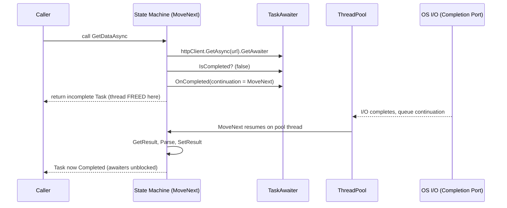
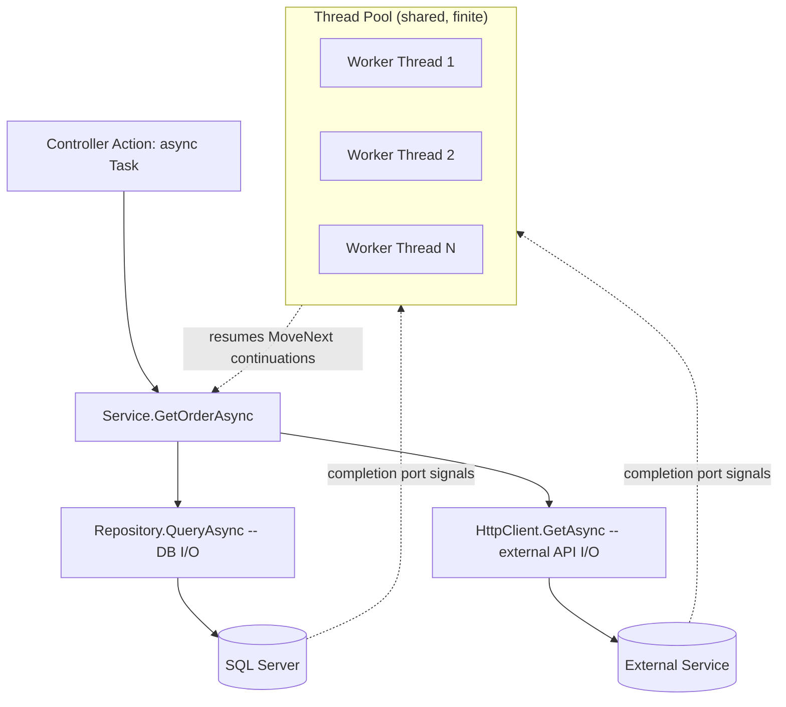
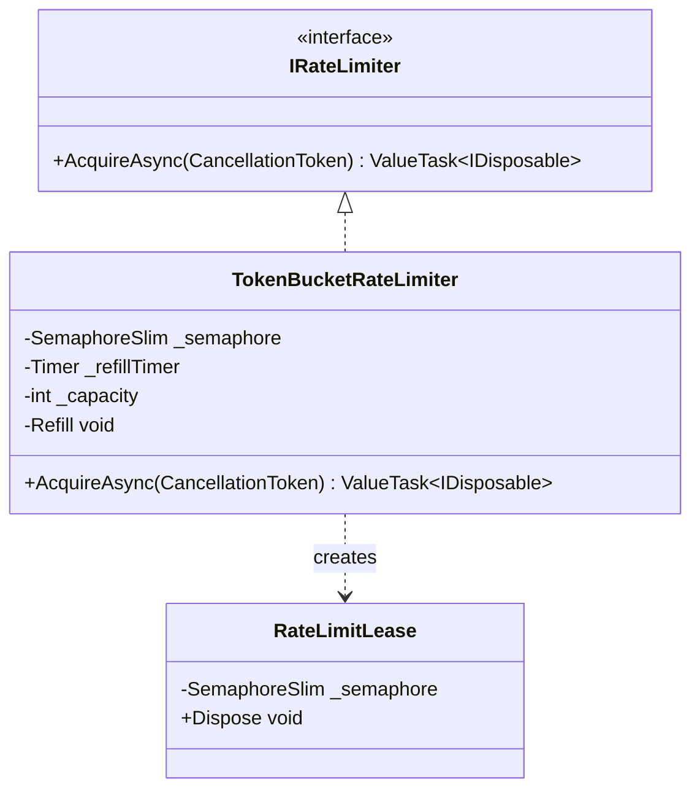
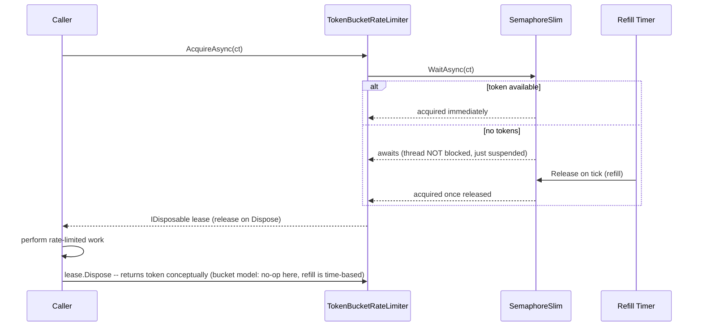

# Module 2 — C# Advanced: Async/Await, Task, and Threading Internals

> Domain: C# | Level: Beginner → Expert | Prerequisite: [[01-CLR-JIT-GC-Memory-Management]] (state machines, ThreadPool, GC allocation costs referenced throughout)

---

## 1. Topic Description

### Definition

`async`/`await` is a **compiler transformation**, not a threading feature. The compiler rewrites an `async` method into a state machine whose locals become fields and whose body is split into resumable segments; a *builder* type owns the returned `Task`/`ValueTask`, and an *awaiter* decides whether the operation has already completed (continue synchronously) or must register a continuation (suspend and return the thread). The runtime completes I/O-bound work through OS completion callbacks, so a pending I/O operation occupies **no thread at all**. Async is therefore a technique for improving *thread utilisation*, and almost every production failure attributed to it stems from an engineer believing it is something else.

### Core sub-concepts

- **The generated state machine** — `IAsyncStateMachine`, `MoveNext`, lifted locals, builder types, the awaiter pattern (`GetAwaiter`/`IsCompleted`/`GetResult`).
- **Synchronous fast path and boxing** — the state machine is a `struct` until it first genuinely suspends.
- **`SynchronizationContext` vs `ExecutionContext`** — *where* a continuation resumes versus *what ambient state* flows with it; what `ConfigureAwait(false)` does and does not suppress.
- **Sync-over-async and deadlock** — `.Result`/`.Wait()`/`GetAwaiter().GetResult()` and why the deadlock is deterministic in some hosts and not others.
- **Thread-pool mechanics** — hill-climbing thread injection, queue depth, and starvation as a failure mode.
- **`Task` vs `ValueTask`** — allocation trade-offs, `IValueTaskSource` pooling, and the single-await restriction.
- **Composition** — `Task.WhenAll` / `WhenAny` semantics, abandoned tasks, aggregated versus first-thrown exceptions.
- **Exception behaviour** — capture on the task, `ExceptionDispatchInfo`, `AggregateException` shape differences, unobserved exceptions.
- **`async void`** — no observable completion, exceptions raised on the ambient context.
- **Cooperative cancellation** — `CancellationToken`, linked token sources, propagation to the data layer.
- **Async streams and channels** — `IAsyncEnumerable`, `await foreach`, `[EnumeratorCancellation]`, bounded `Channel<T>` for backpressure.
- **`TaskCompletionSource`** — bridging callback-based sources; `RunContinuationsAsynchronously`.

### Where it fits

Every ASP.NET Core request, every `HttpClient` call, every message-consumer loop and every EF Core query is built on this model, so it is the concurrency substrate of a .NET service. Downward it depends on the allocation behaviour covered by the CLR/GC subtopic; upward it determines a service's throughput ceiling, its behaviour under dependency slowness, and whether distributed tracing survives an `await`.

### Why it matters at scale

The signature failure is **thread-pool starvation**: latency climbs across *every* endpoint simultaneously, CPU sits low rather than high, and timeouts surface at whichever dependency is called most — so teams spend hours blaming the database while the cause is one blocking call. Because the pool injects new threads at only one or two per second, a small number of blocked threads is enough to convert a healthy service into an outage under load. Conversely, async without timeouts and concurrency limits simply fails more slowly: in-flight requests accumulate with their state machines, buffers and connections, trading thread exhaustion for memory and connection-pool exhaustion.

### Common pitfalls / anti-patterns

- **Sync-over-async (`.Result` / `.Wait()`)** — deadlocks deterministically in hosts with a `SynchronizationContext`, and causes thread-pool starvation everywhere else; the "it works in ASP.NET Core" conclusion is wrong.
- **`async void` for background work** — the caller cannot await it or catch its exceptions, so failures either crash the process or vanish silently.
- **`Task.Run` wrapped around I/O to "make it async"** — buys a thread hop and an allocation while adding no concurrency, since I/O already consumes no thread.
- **Accepting a `CancellationToken` and never passing it down** — creates the appearance of cancellation support while abandoned requests keep holding connections and executing queries.
- **Awaiting a `ValueTask` twice, or caching one** — it may wrap a pooled `IValueTaskSource` that has already been recycled, returning another caller's result.
- **Assuming `ConfigureAwait(false)` stops `AsyncLocal` flow** — it only opts out of the `SynchronizationContext`; ambient state and trace context still propagate.

> Scope note: GC and allocation mechanics belong to `01-CLR-JIT-GC-Memory-Management`; `Span<T>` and pooling to `03-Span-Memory-Low-Allocation`; delegate and closure capture to `04-Delegates-Events-Closures`; exception design and custom exception types to `08-Exception-Handling-Custom-Exceptions`.

---

## 2. Beginner (10 Q&A)


**Q1. Does `await` block the calling thread? Be precise.**
**A:** No. If the awaited operation has not already completed, the method returns to its caller, the thread goes back to the pool to do other work, and the rest of the method is registered as a continuation that resumes later — possibly on a different thread. If the operation *has* already completed, there is no suspension at all: execution continues synchronously down the fast path. The distinction that matters is between "the method is suspended" and "the thread is blocked" — the entire value of async rests on the second one being false.
*Follow-up: Which thread runs the code after the `await`, and what determines that?*

**Q2. What does the compiler actually generate for an `async` method?**
**A:** It rewrites the method body into a state machine type implementing `IAsyncStateMachine`, with the locals lifted to fields and the code between awaits split into cases of a `MoveNext` switch. A builder (`AsyncTaskMethodBuilder`, `AsyncValueTaskMethodBuilder`, or `AsyncVoidMethodBuilder`) owns the returned task and drives the transitions. In Release builds the state machine is a `struct`, so a method that completes synchronously allocates nothing; it is boxed onto the heap only the first time it genuinely suspends and needs to outlive the stack frame. Understanding that shape is what lets you reason about async allocation cost rather than guessing.
*Follow-up: What exactly triggers the boxing, and how would you find a hot async method that suspends more often than you expected?*

**Q3. What is the difference between `Task.Run` and awaiting an async method?**
**A:** `Task.Run` moves work *onto* a thread-pool thread — the right tool for CPU-bound work you want off the current thread. Awaiting a genuinely I/O-bound async method consumes no thread at all while waiting; the operation completes via an OS completion callback and only then is a continuation queued. Confusing the two produces `Task.Run(() => SomeIoAsync())`, which buys a thread hop and an allocation and nothing else. In ASP.NET Core it is worse than neutral, because you are already on a pool thread and have just moved work to a different thread from the same finite pool.
*Follow-up: If no thread is waiting on an I/O-bound task, who completes it?*

**Q4. Why is `async void` dangerous, and what is its one legitimate use?**
**A:** `async void` returns nothing to await, so completion cannot be observed and exceptions cannot be caught by the caller — they are raised on the ambient `SynchronizationContext` and typically take down the process. `async Task` instead stores the exception on the returned task and surfaces it at `await`. The single legitimate use is a framework event handler whose delegate signature you do not control, and even then the body should be a `try`/`catch` wrapping a call to a proper `async Task` method. Fire-and-forget background work is *not* a legitimate use — that needs a hosted service or a channel-backed worker with its own error handling.
*Follow-up: A `try`/`catch` around the call site of an `async void` method doesn't catch its exception. Why not?*

**Q5. What does `ConfigureAwait(false)` do, and — just as importantly — what does it not do?**
**A:** It opts out of capturing the current `SynchronizationContext`, so the continuation resumes on a pool thread instead of being posted back to the original context. That avoids both the marshalling cost and the classic sync-over-async deadlock in hosts that install a context, which is why libraries should use it unconditionally — a library cannot know its host. What it does *not* do is stop `ExecutionContext` flow, so `AsyncLocal` values, culture and the ambient activity still propagate. In ASP.NET Core, which installs no `SynchronizationContext`, it is effectively a no-op for performance.
*Follow-up: Where would adding `ConfigureAwait(false)` change behaviour rather than just performance?*

**Q6. `Task.WhenAll` versus `Task.WhenAny` — semantics and the trap in each.**
**A:** `WhenAll` completes when every task has completed and collects all exceptions on the returned task, but `await` surfaces only the first one — so "we awaited `WhenAll` so we'd see every failure" is wrong. `WhenAny` completes as soon as the first task settles, and the others keep running; unless you cancel or observe them you have leaked work and possibly an unobserved exception. Both traps are about what happens to the tasks you stopped paying attention to, which is the actual bug these APIs produce in production.
*Follow-up: What's the modern way to apply a timeout to a single call, and why is it better than `WhenAny` with a delay task?*

**Q7. Can you await the same task twice? Does the answer differ for `ValueTask`?**
**A:** `Task`/`Task<T>` is effectively an immutable completed-result holder once finished, so it supports any number of awaits and consumers — each returns the cached result or rethrows the stored exception. `ValueTask<T>` does not: it may wrap a pooled `IValueTaskSource` that is recycled after a single await, so awaiting twice, or awaiting after calling `.AsTask()`, is undefined behaviour that can return another caller's result. If you need to consume a `ValueTask` more than once, call `.AsTask()` exactly once and await the resulting `Task`.
*Follow-up: Given those restrictions, when is `ValueTask` worth using at all?*

**Q8. Is async the same as multithreading?**
**A:** No. Async is about not occupying a thread while waiting; running work in parallel across threads is a separate concern served by `Task.Run`, `Parallel`, or simply starting several async operations before awaiting them. A single-threaded application can have thousands of async operations in flight. Async raises how many concurrent operations a fixed number of threads can serve — it does not, by itself, make anything run faster or in parallel. A single request usually gets marginally *slower* under async; the win is systemic throughput.
*Follow-up: How do you actually run two independent I/O calls concurrently, and what's the common mistake people make when they try?*

**Q9. What happens to an exception thrown inside an `async Task` method?**
**A:** It is captured and stored on the returned task rather than propagating immediately, and rethrown when the task is awaited, with the original type and stack trace preserved via `ExceptionDispatchInfo`. If you block on `.Result` or `.Wait()` instead, it surfaces wrapped in an `AggregateException` — which is why replacing `await` with `.Result` silently breaks existing `catch (SqlException)` clauses. If nobody ever awaits the task, the exception is simply never observed.
*Follow-up: How would you detect un-awaited tasks across a large codebase before they hide a failure?*

**Q10. What is a `CancellationToken` actually for, and what does it not do?**
**A:** It is a cooperative signal that lets in-flight work stop early — client disconnect, timeout, shutdown. Cooperative is the operative word: nothing is forcibly aborted, so the code must either check the token or hand it to APIs that do. Its highest-value production use is propagating a client disconnect all the way to the database call, so an abandoned request stops holding a connection. What it does not do is undo side effects that have already been committed — cancellation is not a rollback.
*Follow-up: How would you compose a request-abort token with a per-call timeout?*

---

## 3. Intermediate (10 Q&A)


**Q1. Explain precisely why `.Result` deadlocks in classic ASP.NET or WPF but usually does not in ASP.NET Core.**
**A:** Classic ASP.NET and WPF install a `SynchronizationContext` that requires continuations to run on a specific thread — the request thread or the UI thread. Blocking that thread with `.Result` means the continuation can never be scheduled onto it, and the continuation is what would complete the task you are blocking on: a textbook self-deadlock. ASP.NET Core installs no `SynchronizationContext`, so continuations run on arbitrary pool threads and the cycle does not form. It is important not to conclude that `.Result` is therefore safe there — you have traded a deterministic deadlock for thread-pool starvation under load, which is much harder to diagnose.
*Follow-up: Given that, how do you handle a legacy synchronous interface you must implement but whose work is genuinely async?*

**Q2. Walk me through diagnosing thread-pool starvation. What are the symptoms and what misleads people?**
**A:** The symptoms are latency climbing across *all* endpoints simultaneously, CPU that is low rather than high, and timeouts appearing at whatever dependency happens to be called most — which is what misleads people into blaming the database. The mechanism is blocking calls occupying pool threads, so the pool's hill-climbing algorithm injects new threads slowly (roughly one or two per second), and queued work backs up faster than threads arrive. Confirmation is direct: compare `ThreadPool.ThreadCount` and queue length against completed work items, or take a dump and count threads parked in `Monitor.Wait`, `Task.Result`, or synchronous socket reads. The fix is removing the blocking call, not raising `SetMinThreads`, which only buys time.
*Follow-up: `SetMinThreads` is sometimes a legitimate mitigation. When, and what do you do immediately afterwards?*

**Q3. When would you choose `ValueTask<T>` over `Task<T>`, and what would make you refuse?**
**A:** Choose it on a hot path where the operation usually completes synchronously — a cache lookup that hits most of the time, a buffered stream read, a pipeline that is normally already satisfied — because that avoids a `Task<T>` allocation per call in a place where per-call allocation is measurable. Refuse it on public APIs where consumers might store, share, or await the result more than once, on anything low-frequency where the allocation is noise, and anywhere the added usage constraints outweigh a saving you have not measured. The honest position is that `ValueTask` is a targeted optimisation with sharp edges, not a better default.
*Follow-up: `ValueTask` pooling via `IValueTaskSource` removes even the async-path allocation. What does that add in complexity and risk?*

**Q4. `ExecutionContext` versus `SynchronizationContext` — what does each do, and why does the distinction matter operationally?**
**A:** `ExecutionContext` carries ambient state — `AsyncLocal` values, culture, the current `Activity` — across async boundaries regardless of which thread resumes. `SynchronizationContext` determines *where* a continuation resumes. They are captured and restored independently, which is why `ConfigureAwait(false)` opts out of the second but never the first. Operationally this is exactly how distributed tracing and correlation IDs survive an `await` while resuming on a completely different thread — and why the belief that `ConfigureAwait(false)` breaks correlation IDs is a myth worth correcting in review.
*Follow-up: `AsyncLocal` flows down but changes don't flow back up to the caller. Why, and where does that surprise people?*

**Q5. You inherit a method that makes six independent HTTP calls with sequential awaits. What do you change, and what do you have to be careful about?**
**A:** Start all six, then `await Task.WhenAll`, turning a sum of latencies into a max — usually the single largest win available in this kind of code. The care is in what concurrency exposes: the downstream service may not tolerate a six-fold burst multiplied by every concurrent request, so I would check `HttpClient`'s per-server connection limits and whether the dependency has a rate limit or its own thread-pool constraint. I would also make failure semantics explicit, since `WhenAll` surfaces only the first exception and abandons nothing — if partial success is acceptable, that has to be handled deliberately rather than inherited from the API's default behaviour.
*Follow-up: One of the six is optional and slow. How would you structure that so it can't drag the whole response?*

**Q6. Someone adds `Task.Run` around a CPU-bound method inside an ASP.NET Core controller action to "free up the request thread." What do you tell them?**
**A:** That it accomplishes nothing, because the action is already running on a thread-pool thread and `Task.Run` moves the same work to another thread from the same finite pool, adding a hop and an allocation. Total pool capacity is unchanged, so under load the queue is identical. The genuine questions are whether the CPU work belongs in the request path at all — often it should be a background job or a separate service — and whether the box has the cores to do it concurrently. `Task.Run` is legitimate in a *desktop* app to get work off the UI thread; in a server it is almost always a misunderstanding of what the pool is.
*Follow-up: What if the CPU-bound work is 200 ms and must be in the request? What do you do instead?*

**Q7. A `CancellationToken` is accepted by the controller and passed nowhere else. Why is that worse than not accepting it at all?**
**A:** Because it creates the appearance of cancellation support without the behaviour, so nobody investigates further. The abandoned request keeps its database connection, keeps executing its query, and keeps consuming a pool thread until it completes work whose result will be discarded — which under a retry storm is exactly how a slow dependency becomes an outage. Real support means threading the token to every async call in the chain, especially the database and HTTP calls, and often linking it with a timeout via `CreateLinkedTokenSource`. It is worth enforcing with an analyzer, since this is a discipline failure rather than a knowledge failure.
*Follow-up: Where should cancellation be checked in a long CPU-bound loop, and what's the cost of checking too often?*

**Q8. What is `TaskCompletionSource` for, and what is the classic production bug with it?**
**A:** It is the bridge from a non-task-based async source — an event, a callback, a legacy `Begin`/`End` API, a message arriving on a socket — into the `Task` world, by handing out a task you complete manually. The classic bug is that, without `TaskCreationOptions.RunContinuationsAsynchronously`, calling `SetResult` runs the awaiting continuations *synchronously on the completing thread*. When that thread is a message-pump, socket-reader or timer thread, arbitrary user code now runs on your infrastructure thread — producing stalls, reentrancy and occasional deadlocks that are extremely hard to attribute. Always pass that flag unless you have a specific reason not to.
*Follow-up: What's the second most common bug — around setting a result more than once?*

**Q9. When is `IAsyncEnumerable<T>` the right tool, and what does it cost?**
**A:** It is right when results arrive incrementally and you want the consumer to start work before the producer finishes — streaming query results, paging an API, consuming a channel — because it avoids buffering an entire result set in memory and improves time-to-first-byte. The cost is a `MoveNextAsync` state-machine transition per item, so it is the wrong choice for millions of tiny items where a batched `Task<List<T>>` is dramatically cheaper. You also need `[EnumeratorCancellation]` on the token parameter for `WithCancellation` to work, and to remember that the underlying resource — often a database reader — stays open for the whole enumeration, which changes your connection-pool math.
*Follow-up: What breaks when an `IAsyncEnumerable` returned from a repository is enumerated after the `DbContext` has been disposed?*

**Q10. Does making a method async make it faster?**
**A:** For a single request, usually marginally slower — you have added state-machine transitions, possible heap allocation, and continuation scheduling to a path that previously ran straight through. The benefit is systemic: the same number of threads can serve far more concurrent requests, so throughput and behaviour under load improve dramatically even though per-request latency does not. This is why async shows nothing on a single-user benchmark and everything on a load test, and why "we made it async and it didn't get faster" is usually a measurement problem rather than a design problem.
*Follow-up: How would you design a load test that demonstrates the actual benefit?*

---

## 4. Expert / Architect (10 Q&A)


**Q1. Latency degrades across every endpoint, CPU sits at 30%, and the database team says their queries are fast. Walk me through the incident.**
**A:** Flat-CPU, all-endpoints degradation with healthy dependencies is the signature of thread-pool starvation, and the fact that the database *looks* slow from the application while looking fast from the server is the confirming detail — the time is spent queued before the call is even made. I would confirm from the pool's own counters and a dump showing threads parked in blocking waits, then find the sync-over-async call that entered the hot path, which is very often in a library, a health check, or a logging sink rather than the code recently changed. Immediate mitigation is raising minimum threads to restore service while the real fix is deployed. Prevention is structural: an analyzer banning `.Result`/`.Wait()`, dashboards on pool queue depth as a first-class signal, and a runbook entry so the next responder does not spend an hour on the database.
*Follow-up: The blocking call is inside a third-party NuGet package you can't change. What are your options?*

**Q2. How would you drive async correctness across dozens of teams and a large legacy codebase?**
**A:** Treat it as a supply-chain problem rather than an education problem: guidance does not scale, gates do. I would ban `.Result`, `.Wait()`, `GetAwaiter().GetResult()` and `async void` with analyzers wired into the shared build template so teams inherit them, and enable CS4014 as an error. Legacy code gets a suppression baseline so the rules can go in today and the debt is visible and burned down deliberately rather than blocking adoption. Alongside that, the platform team owns the observability — pool queue depth and thread count on the standard dashboard — so the failure mode is recognisable to a responder who has never read the guidance. The cultural piece is making the *reason* concrete with a real incident, because "async all the way" as a slogan does not survive a deadline.
*Follow-up: A team says the analyzer blocks a legitimate case in their startup path. How do you handle the exception request?*

**Q3. You are converting a large synchronous codebase to async. How do you sequence it, and what makes it dangerous?**
**A:** Async is viral, so it must be converted from the I/O leaves upward — converting the middle produces exactly the sync-over-async bridges that cause the incidents. I would identify the highest-value I/O paths, convert each end to end behind a feature flag, and ship in slices rather than attempting a big-bang. The danger is the intermediate state: partially converted paths where a blocking bridge remains, and the fact that async changes concurrency characteristics, so code that was implicitly serialised by blocking may now run concurrently and expose latent thread-safety bugs in shared state. I would also expect throughput to rise enough to shift the bottleneck downstream, so connection-pool sizes and dependency rate limits need re-checking as part of the same work.
*Follow-up: Halfway through, throughput doubles and the database starts timing out. Is that a failure of the migration?*

**Q4. Design a bounded async work pipeline for a service that ingests bursty messages faster than it can process them.**
**A:** I would use `System.Threading.Channels` with a bounded channel and an explicit full-mode policy, a small set of consumer tasks, and backpressure propagated to the ingestion point rather than absorbed silently. Bounded is the essential decision: an unbounded channel converts a throughput problem into an out-of-memory crash, which is strictly worse because it destroys in-flight work. The full-mode choice is a product decision — `Wait` applies backpressure to the producer, `DropOldest` accepts loss to protect freshness — and should be made explicitly with the business, not defaulted. I would expose queue depth and consumer lag as first-class metrics, because the queue is where this system's health becomes visible before latency moves.
*Follow-up: The producer is a Kafka consumer that can't be slowed without triggering rebalances. How does that change the design?*

**Q5. How much of your latency budget does async machinery legitimately consume, and how would you decide it is worth optimising?**
**A:** In a typical service, a handful of microseconds per await against milliseconds of real I/O — genuinely irrelevant, and optimising it is misallocated effort. It becomes worth attention only in high-frequency paths where the operation itself is sub-microsecond and completes synchronously most of the time, which is where `ValueTask`, pooled value-task sources, and sometimes avoiding async altogether pay off. The decision rule I use is that the async overhead must be a measured, material fraction of the total in a profile — not inferred from a benchmark of `await` in isolation, which is the classic way teams spend a quarter on a 0.3% improvement.
*Follow-up: Where in a modern .NET service does async overhead genuinely show up in a profile?*

**Q6. A background job started with fire-and-forget occasionally vanishes with no trace. What went wrong and how do you fix it structurally?**
**A:** Almost certainly `async void` or an un-awaited `Task`: with `async void` the exception is raised on the ambient context and may crash or be swallowed depending on the host, and with an un-awaited `Task` the exception is stored on an object nobody looks at, so the work simply stops silently. The additional hazard in a hosted environment is that shutdown does not wait for orphaned work, so a rolling deploy can terminate the job mid-flight with no record. The structural fix is to have no fire-and-forget at all: background work belongs in an `IHostedService`/`BackgroundService` with explicit lifetime, structured logging, its own error handling, and participation in graceful shutdown. If the work must survive a restart, it belongs in a queue rather than in memory.
*Follow-up: How do you make a `BackgroundService` shut down cleanly without losing in-flight work during a rolling deploy?*

**Q7. Your API calls a downstream service that has become slow. Explain how async changes — and does not change — how that failure propagates.**
**A:** Async prevents thread exhaustion during the wait, so the process stays responsive far longer than a blocking equivalent, but it does not bound anything: in-flight requests still accumulate, each holding its state machine, its buffers, and often a connection, so you trade thread starvation for memory pressure and connection-pool exhaustion. Async without timeouts, concurrency limits and circuit breakers just fails more slowly and less obviously. The correct architecture pairs async with a bounded concurrency limiter per dependency, aggressive timeouts, a circuit breaker to stop sending doomed requests, and load shedding at the edge so the system degrades deliberately rather than by exhaustion.
*Follow-up: Where do you place the concurrency limit — per dependency, per endpoint, or globally — and why?*

**Q8. `AsyncLocal` is proposed to carry tenant context through the request pipeline. What is your view?**
**A:** It works and it is how `Activity`, correlation IDs and most ambient diagnostics already flow, so the mechanism is sound. My concerns are architectural rather than technical: ambient state is invisible in method signatures, so it becomes untestable and hard to reason about, and it silently fails at boundaries the `ExecutionContext` does not cross — thread-pool work queued without flow, long-lived singletons, custom threads, and anything resumed from a different logical request. In a multi-tenant system that failure mode is a data-leak class bug, not a correctness inconvenience. I would accept it for cross-cutting diagnostics where a missing value is harmless, and insist on explicit parameter passing for anything that authorises or scopes data access.
*Follow-up: How would you detect a case where the tenant context is missing or, worse, belongs to a different tenant?*

**Q9. How do you test async code so that concurrency bugs surface before production?**
**A:** Deterministic unit tests catch almost none of them, because a test that awaits a completed task never exercises the suspension path at all. What actually works is a layered approach: tests that force the asynchronous path with real delays or controlled `TaskCompletionSource` sources; cancellation tests that assert the operation actually stops rather than merely returning; concurrency tests that run the operation N times in parallel and assert on shared state; and load tests that hold sustained concurrency long enough for pool behaviour to emerge. I would also inject latency and faults at dependency boundaries in a staging environment, since most async production failures are really timeout, cancellation and backpressure failures rather than logic errors.
*Follow-up: How would you write a regression test for a sync-over-async deadlock without depending on timing?*

**Q10. Would you argue for a different concurrency model than task-based async for a new high-throughput service, and how would you make that case?**
**A:** I would start from the workload rather than the model. Task-based async is the right default in .NET because the ecosystem, tooling and hiring pool all assume it. Reactive/dataflow models are worth arguing for when the domain is genuinely stream-shaped with complex composition, windowing and backpressure; an actor model is worth arguing for when the domain is naturally partitioned per-entity and you would otherwise be hand-rolling locks. The case has to be made on ownership cost, not elegance: a model the team cannot debug at 3 a.m., or which every new hire must be trained into, is a long-term liability that usually outweighs the design win. My default recommendation is async plus `Channel<T>` for pipelines, escalating only when a specific, demonstrated shortcoming justifies it.
*Follow-up: You inherit a service built on a reactive framework nobody remaining understands. Do you migrate it, and how do you decide?*

---

## 5. Reference Material

> Retained from the original module: deep-dive internals, diagrams, production examples, exercises, system/low-level design, debugging walkthroughs and the Principal Engineer perspective.

### 1. Fundamentals

#### What is `async`/`await`?
`async`/`await` is C#'s compiler-driven syntax for writing asynchronous, non-blocking code that *reads* like synchronous code. It does not create threads. It is a **continuation-passing transformation**: the compiler rewrites your method into a state machine that can suspend at an `await` point (when the awaited operation isn't done yet), return control to the caller immediately, and resume later — on some thread — when the awaited operation completes.

#### Why does it exist?
Before `async`/`await` (pre-C# 5), asynchronous I/O required either:
- **Blocking a thread** (`Thread.Sleep`, synchronous socket/file calls) — wastes a thread (and its ~1MB stack) sitting idle waiting on I/O that the OS is already handling asynchronously via interrupts/completion ports.
- **Callback-based APIs** (`BeginRead`/`EndRead`, `IAsyncResult`) — functionally correct but produces unreadable "callback hell," fragile error handling, and difficult composition.

`async`/`await` solves this: **don't hold a thread hostage while waiting on I/O.** A thread issues the I/O request, then returns to the pool to do other work; when the OS signals completion (via an I/O completion port), a thread-pool thread picks up the continuation and resumes your method exactly where it left off.

#### When does this matter?
- **Always** in modern C# — it's the default way to write I/O-bound code (HTTP calls, DB queries, file I/O, message queue reads).
- **Critically** in server-side code (ASP.NET Core) where thread-pool threads are a shared, finite resource across all concurrent requests — blocking one to wait on I/O directly reduces the server's request-handling capacity.
- **Differently** for CPU-bound work — `async`/`await` doesn't parallelize CPU work by itself; that's what `Task.Run` (offload to thread pool) or `Parallel`/PLINQ (data parallelism) are for. Confusing "async" with "parallel" is one of the most common professional-level misunderstandings.

#### How does it work (30,000-ft view)?

```
async Task<int> GetDataAsync
{
 var response = await httpClient.GetAsync(url); // (1) suspend point
 return Parse(response); // (3) resumes here later
}
 // (2) caller gets a Task<int> immediately
 // keeps running; thread returned to pool
 // while I/O is in flight
```

Mental model for interviews: **"`await` doesn't wait. It registers a continuation and returns."** The calling thread is freed the instant an `await` hits an operation that hasn't completed synchronously. This is the single most load-bearing sentence in this entire module.

### 2. Deep Dive

#### 2.1 The State Machine Transformation

The compiler rewrites an `async` method into a type implementing `IAsyncStateMachine`, roughly:

```csharp
// You write:
async Task<int> GetDataAsync
{
    var response = await httpClient.GetAsync(url);
    return Parse(response);
}

// Compiler generates (simplified):
struct GetDataAsyncStateMachine: IAsyncStateMachine
{
    public int _state; // -1 = not started/running, 0/1/... = suspended at await #N
    public AsyncTaskMethodBuilder<int> _builder;
    public HttpClient httpClient; // captured locals become fields
    public TaskAwaiter<HttpResponseMessage> _awaiter;

    public void MoveNext
    {
        int result;
        try
        {
            if (_state == 0) goto ResumePoint; // jump back in after suspension
            var task = httpClient.GetAsync(url);
            _awaiter = task.GetAwaiter;
            if (!_awaiter.IsCompleted)
            {
                _state = 0;
                _builder.AwaitUnsafeOnCompleted(ref _awaiter, ref this); // register continuation, RETURN
                return; // <-- this is the "suspend": control goes back to caller here
            }
            ResumePoint:
                var response = _awaiter.GetResult; // resumes here when continuation fires
            result = Parse(response);
        }
        catch (Exception ex) { _builder.SetException(ex); return; }
        _builder.SetResult(result);
    }
}
```

Key facts this reveals:
- **It's a `struct` by default** (since C# 5, an optimization) — cheap, no allocation, *as long as it never needs to be boxed*. It gets boxed onto the heap the moment it's stored somewhere that outlives the stack frame — i.e., the first time it actually suspends (`AwaitUnsafeOnCompleted`). If every `await` in the method completes synchronously (already-completed tasks), the state machine may never box at all — a real, measurable perf difference between "usually completes synchronously" and "usually actually suspends" code paths.
- **Captured locals become fields** of the state machine — this is why a `foreach` loop variable or local captured across an `await` "survives" the suspension: it's not stack-resident anymore, it's a field on a (potentially heap-allocated) object.
- **`MoveNext` is the continuation** — it's what gets scheduled to run when the awaited operation completes. This is literally what's registered with the `SynchronizationContext`/`TaskScheduler`/ThreadPool as "the thing to run next."

#### 2.2 `Task` vs `Task<T>` vs `ValueTask` vs `ValueTask<T>`

- **`Task`/`Task<T>`**: A reference type representing an in-flight or completed operation. Always heap-allocated (with some caching for common cases — `Task.CompletedTask`, small cached `Task<bool>`/`Task<int>` results for 0-8 or so). Supports being awaited multiple times, cached, stored, and passed around freely — this is the *safe default*.
- **`ValueTask`/`ValueTask<T>`**: A `struct` wrapping *either* a synchronously-available result directly, *or* an `IValueTaskSource<T>` (a poolable, reusable backing object) for the asynchronous case. Purpose: avoid a `Task<T>` heap allocation on the **synchronous-completion hot path** (e.g., a cache-hit that returns immediately without ever truly going async).
 - **Strict rules** (violate these and you get silent bugs, not compile errors): don't await it twice, don't call `.Result`/`.GetAwaiter.GetResult` and then `await` it too, don't store it and await it later from multiple places. If any of that flexibility is needed, call `.AsTask` first to convert to a real `Task<T>`.
 - **When to use**: hot-path library APIs where synchronous completion is common/likely (e.g., `IAsyncEnumerator<T>.MoveNextAsync`, cache lookups, buffered stream reads). **Not** a blanket replacement for `Task` in ordinary application code — the restrictions aren't worth it unless profiling shows the allocation matters.

#### 2.3 `SynchronizationContext` and `ExecutionContext` — the two "ambient contexts"

These are frequently confused; they solve **different problems**:

- **`SynchronizationContext`**: Answers *"which thread/context should the continuation run on?"* Classic WinForms/WPF: marshal back to the UI thread (only the UI thread may touch UI controls). Classic ASP.NET (Framework, not Core): one-thread-per-request-context semantics tied to `HttpContext`. **ASP.NET Core installs no `SynchronizationContext` by default** — continuations resume on an arbitrary thread-pool thread, which is *why* the classic UI/ASP.NET-Framework deadlock mostly doesn't reproduce there.
- **`ExecutionContext`**: Answers *"what ambient data (security principal, `AsyncLocal<T>` values, culture) should flow with this logical operation as it hops across threads?"* It's captured at every `await` (and other async boundaries like `Task.Run`) and restored on the resuming thread so `AsyncLocal<T>.Value` "follows" the logical call chain even though the physical thread changed.

`ConfigureAwait(false)` tells the awaiter: *"don't bother capturing/restoring the `SynchronizationContext` (or the current `TaskScheduler` if not default) for this continuation — just resume on any thread-pool thread."* This (a) avoids the marshaling cost, and (b) is the standard fix for library code that shouldn't care about UI-thread affinity. It does **not** affect `ExecutionContext` flow (`AsyncLocal` values still flow regardless).

#### 2.4 The Classic Deadlock — precisely

```csharp
// Classic ASP.NET (Framework) or WPF/WinForms:
public ActionResult Index
{
    var data = GetDataAsync.Result; // BLOCKS the current (UI/request) thread
    return View(data);
}
async Task<Data> GetDataAsync
{
    var response = await httpClient.GetAsync(url); // captures SynchronizationContext
    return Parse(response); // this continuation is POSTED BACK to that same captured context
}
```
1. `.Result` blocks the calling thread (say, the one-and-only request-context thread in classic ASP.NET) waiting for `GetDataAsync`'s `Task` to complete.
2. Inside `GetDataAsync`, after the `await`, the continuation (`Parse(response)` onward) is scheduled to run **on the captured `SynchronizationContext`** — i.e., that exact same thread.
3. That thread is busy blocking on step 1. It can never run the continuation from step 2. **Deadlock.**

**ASP.NET Core has no such `SynchronizationContext`**, so the continuation runs on an arbitrary pool thread instead — no deadlock in the classic sense. But `.Result`/`.Wait` in ASP.NET Core is still harmful: it **synchronously blocks a pool thread**, contributing to thread-pool starvation under load () — a different failure mode (throughput collapse, not deadlock), often mistaken for "the same bug" in interviews. Know the distinction.

#### 2.5 `async void` — why it's (almost) always wrong
- `async Task`/`async Task<T>` methods return a `Task` the caller can await, observe exceptions on, and compose.
- `async void` methods return nothing awaitable. Exceptions thrown inside them **cannot be caught by the caller** — they're rethrown directly on the `SynchronizationContext` that was current when the method started, typically crashing the process (unhandled exception) rather than propagating through normal `try`/`catch`.
- The **only** legitimate use: top-level event handlers (`button_Click`) where the delegate signature is fixed by the framework and can't return `Task`.

#### 2.6 `Task.Run` vs `async`/`await` — CPU-bound vs I/O-bound
- `await someIoTask` — no thread is consumed while waiting; the OS/completion port does the actual waiting.
- `Task.Run(=> CpuBoundWork)` — explicitly **queues work to a thread-pool thread** to run synchronously-blocking CPU work off the calling thread. This *does* consume a thread for the duration of the work — it's parallelism/offloading, not "asynchrony" in the I/O sense.
- **Anti-pattern**: wrapping a naturally synchronous CPU-bound method in `Task.Run` inside an ASP.NET Core controller to "make it async" — you've just moved the blocking work from the request-handling thread to *another* pool thread, consuming the same shared pool resource with added overhead (thread hop, `Task` allocation) and zero benefit, since ASP.NET Core already dispatches requests on pool threads.

#### 2.7 `IAsyncEnumerable<T>` and `await foreach`
Async streams (C# 8+) compile to a state machine implementing `IAsyncEnumerator<T>`, where `MoveNextAsync` returns a `ValueTask<bool>` (chosen specifically to avoid per-iteration `Task<bool>` allocation on the common synchronous-continuation path — a direct application). `await foreach` desugars to a loop calling `MoveNextAsync`/`Current` and disposing via `DisposeAsync` (if `IAsyncDisposable`) at the end — enabling truly async, backpressure-aware iteration (e.g., streaming paged results from a DB without buffering the whole set in memory).

#### 2.8 Threading model tie-back 
Every continuation not explicitly targeted at a captured `SynchronizationContext` is queued as a work item on the CLR **ThreadPool** (see [[01-CLR-JIT-GC-Memory-Management]]). Under sustained load, if pool threads are being blocked synchronously (sync-over-async) faster than the pool's ~1-thread/sec growth heuristic can compensate, queued continuations back up — this is **thread pool starvation**, and it is fundamentally an async/await misuse problem wearing a "GC/threading" costume.


```mermaid
sequenceDiagram
 participant Caller
 participant SM as State Machine (MoveNext)
 participant Awaiter as TaskAwaiter
 participant TP as ThreadPool
 participant IO as OS I/O (Completion Port)

 Caller->>SM: call GetDataAsync
 SM->>Awaiter: httpClient.GetAsync(url).GetAwaiter
 SM->>Awaiter: IsCompleted? (false)
 SM->>Awaiter: OnCompleted(continuation = MoveNext)
 SM-->>Caller: return incomplete Task (thread FREED here)
 IO-->>TP: I/O completes, queue continuation
 TP->>SM: MoveNext resumes on pool thread
 SM->>SM: GetResult, Parse, SetResult
 SM-->>Caller: Task now Completed (awaiters unblocked)
```

### 3. Visual Architecture

#### Async Call Composition


```mermaid
graph TB
 A[Controller Action: async Task<IActionResult>] --> B[Service.GetOrderAsync]
 B --> C[Repository.QueryAsync -- DB I/O]
 B --> D[HttpClient.GetAsync -- external API I/O]
 C --> E[(SQL Server)]
 D --> F[(External Service)]
 subgraph ThreadPool["Thread Pool (shared, finite)"]
 T1[Worker Thread 1]
 T2[Worker Thread 2]
 T3[Worker Thread N]
 end
 E -.->|completion port signals| ThreadPool
 F -.->|completion port signals| ThreadPool
 ThreadPool -.->|resumes MoveNext continuations| B
```

#### State Machine Lifecycle (ASCII)

```
 Method call
 │
 ▼
 ┌─────────────────────┐ IsCompleted==true (sync path) ┌──────────────────┐
 │ MoveNext state=-1 │ ─────────────────────────────────▶│ SetResult; done │ <- may never allocate
 └─────────────────────┘ └──────────────────┘
 │ IsCompleted==false
 ▼
 ┌─────────────────────┐
 │ box state machine │ <- heap allocation happens HERE, only on the truly-async path
 │ register continuation│
 │ RETURN to caller │
 └─────────────────────┘
 │ (later, on completion)
 ▼
 ┌─────────────────────┐
 │ MoveNext resumes │
 │ state=0 -> goto label │
 │ SetResult / throw │
 └─────────────────────┘
```

### 4. Production Example

#### Scenario: E-commerce checkout API — intermittent 500s under Black-Friday load

**Problem**: A checkout microservice (ASP.NET Core,.NET 8) worked fine at normal load (~500 req/s) but under Black-Friday peak (~4,000 req/s) started throwing `TaskCanceledException`/timeout errors on a *downstream inventory-check call*, even though the inventory service itself reported healthy, low CPU, low latency.

**Investigation**:
- `dotnet-counters` showed `ThreadPool Queue Length` climbing into the thousands, `ThreadPool Thread Count` slowly climbing (the classic ~1/sec injection pattern), while CPU utilization stayed under 40%.
- `dotnet-dump analyze` + `clrstack` on multiple worker threads revealed dozens of threads blocked inside a legacy `PaymentGatewayClient.Charge(...)` method — a synchronous wrapper that internally called `.GetAwaiter.GetResult` on an async HTTP call, added years earlier "to keep the interface synchronous for a legacy caller."
- Under peak load, enough concurrent checkout requests hit this synchronous wrapper simultaneously that pool threads were consumed faster than new checkout requests (and, critically, the *inventory-check continuations*) could be scheduled — starving unrelated async work elsewhere in the same process, producing the seemingly-unrelated inventory timeout symptom.

**Architecture fix**:
- Replaced `PaymentGatewayClient.Charge(...)` (sync-over-async) with a genuinely `async Task<ChargeResult> ChargeAsync(...)`, propagated `async` up through the one remaining legacy synchronous caller (which was refactored, since "keep it sync" was a shortcut, not a hard constraint).
- Added a Roslyn analyzer rule (banning `.Result`/`.Wait`/`.GetAwaiter.GetResult` outside of `Main`/explicitly annotated exceptions) to the CI pipeline to prevent recurrence.
- Load-tested at 2x expected peak with the fix, confirming `ThreadPool Queue Length` stayed flat under sustained load.

**Trade-offs**: The refactor touched a legacy interface boundary considered "stable/do not touch" — required a coordinated review with the team owning the legacy caller. Accepted because the alternative (raising `ThreadPool.SetMinThreads` as a band-aid) only delays the same failure to a higher load threshold, papering over the root cause.

**Lessons learned**:
1. Thread pool starvation manifests as **seemingly unrelated** failures elsewhere in the same process — the symptom (inventory timeout) and the cause (payment gateway sync-over-async) were in different modules entirely, because they share one finite thread pool.
2. Low CPU + high latency + climbing queue length is the diagnostic signature of thread pool starvation — don't chase CPU-bound explanations when CPU is low.
3. `ThreadPool.SetMinThreads` treats a symptom; fixing sync-over-async treats the cause.
4. Static analysis (banning blocking async calls) is cheaper than repeat incidents.

### 11. Coding Exercises

#### Easy — Fix a fire-and-forget bug
**Problem**: This method silently swallows exceptions and the caller has no way to know it failed.
```csharp
public void NotifyUser(string userId)
{
    _ = SendNotificationAsync(userId); // fire-and-forget, exceptions vanish
}
```
**Solution**:
```csharp
public void NotifyUser(string userId)
{
    _ = SendNotificationAsyncSafe(userId);
}

private async Task SendNotificationAsyncSafe(string userId)
{
    try
    {
        await SendNotificationAsync(userId);
    }
    catch (Exception ex)
    {
        _logger.LogError(ex, "Failed to send notification to {UserId}", userId);
    }
}
```
**Time/Space**: Unchanged — this is a correctness fix, not a performance one. **Optimized**: For anything beyond best-effort logging, replace fire-and-forget entirely with a durable queue (message broker) so failures can be retried, not just logged and dropped.

#### Medium — Bounded concurrency over a large collection
**Problem**: Given 10,000 user IDs, call `await CallExternalApiAsync(id)` for each, but the external API allows only 20 concurrent calls.
```csharp
public async Task ProcessAllAsync(IEnumerable<string> ids)
{
    var tasks = ids.Select(CallExternalApiAsync);
    await Task.WhenAll(tasks); // unbounded — will blow past the 20-concurrent limit
}
```
**Solution**:
```csharp
public async Task ProcessAllAsync(IEnumerable<string> ids, CancellationToken ct)
{
    var options = new ParallelOptions
    {
        MaxDegreeOfParallelism = 20,
            CancellationToken = ct
    };
    await Parallel.ForEachAsync(ids, options, async (id, token) =>
        {
            await CallExternalApiAsync(id).WaitAsync(token);
    });
}
```
**Time complexity**: O(n) calls total, bounded to 20 in flight at once (wall-clock ≈ n/20 × per-call latency). **Space**: O(20) in-flight state instead of O(n) tasks all queued/allocated at once.
**Optimized**: If per-item work varies wildly in duration, a `Channel<T>`-based producer/consumer with N fixed consumer tasks gives finer control over backpressure and lets you observe queue depth as a live metric — worth it if this becomes a recurring/monitored production pipeline rather than a one-off batch call.

#### Hard — Implement a simple async retry-with-backoff-and-jitter helper
**Problem**: Implement a reusable helper that retries an async operation on transient failure with exponential backoff + jitter, respecting cancellation, without any external library (demonstrating you understand what `Polly` does under the hood).
```csharp
public static async Task<T> RetryAsync<T>(
    Func<CancellationToken, Task<T>> operation,
        int maxAttempts,
        TimeSpan baseDelay,
        CancellationToken ct)
{
    var random = Random.Shared;
    for (int attempt = 1;; attempt++)
    {
        try
        {
            return await operation(ct);
        }
        catch (Exception ex) when (attempt < maxAttempts && IsTransient(ex))
        {
            var exponential = baseDelay * Math.Pow(2, attempt - 1);
            var jitter = TimeSpan.FromMilliseconds(random.Next(0, 250));
            await Task.Delay(exponential + jitter, ct);
        }
    }
}

private static bool IsTransient(Exception ex) =>
    ex is HttpRequestException or TimeoutException or TaskCanceledException;
```
**Time complexity**: O(maxAttempts) worst case. **Space**: O(1) — no accumulation across attempts.
**Discussion**: The `when (attempt < maxAttempts && IsTransient(ex))` exception filter is deliberate — exception filters run *before* stack unwinding, so this doesn't unwind-then-rethrow on non-matching exceptions, and it keeps non-transient exceptions (e.g., a 400 Bad Request-equivalent) propagating immediately without wasting retry attempts. `TaskCanceledException` classification is subtle: distinguish "operation timed out" (transient, retry) from "caller explicitly cancelled via the passed-in `ct`" (should NOT retry) — a production-grade version checks `ct.IsCancellationRequested` first and rethrows immediately if the *caller's* token (not an internal timeout token) was the cause.
**Optimized**: In real production code, use `Polly`'s `WaitAndRetryAsync`/resilience pipelines — battle-tested, integrates with circuit breakers and telemetry; this exercise is for understanding the mechanism so you can reason about `Polly`'s behavior, not to replace it.

#### Expert — Implement a bounded async producer/consumer pipeline with graceful shutdown using `Channel<T>`
**Problem**: Implement a webhook-delivery pipeline: producers enqueue webhook payloads; a fixed pool of consumers delivers them via HTTP with retry; on shutdown, stop accepting new work but drain what's already queued within a timeout.
```csharp
public sealed class WebhookDeliveryPipeline: IAsyncDisposable
{
    private readonly Channel<WebhookPayload> _channel;
    private readonly List<Task> _consumers = new;
    private readonly CancellationTokenSource _shutdownCts = new;
    private readonly HttpClient _httpClient;

    public WebhookDeliveryPipeline(HttpClient httpClient, int consumerCount = 4, int capacity = 10_000)
    {
        _httpClient = httpClient;
        _channel = Channel.CreateBounded<WebhookPayload>(new BoundedChannelOptions(capacity)
            {
                FullMode = BoundedChannelFullMode.Wait, // apply backpressure to producers instead of dropping
                    SingleReader = false,
                    SingleWriter = false
        });

        for (int i = 0; i < consumerCount; i++)
            _consumers.Add(Task.Run(=> ConsumeAsync(_shutdownCts.Token)));
    }

    public ValueTask EnqueueAsync(WebhookPayload payload, CancellationToken ct = default) =>
        _channel.Writer.WriteAsync(payload, ct);

    private async Task ConsumeAsync(CancellationToken shutdownToken)
    {
        await foreach (var payload in _channel.Reader.ReadAllAsync(CancellationToken.None))
        {
            // Note: CancellationToken.None here -- we want to keep draining
            // already-queued items during graceful shutdown, not abandon them.
            try
            {
                await DeliverWithRetryAsync(payload, shutdownToken);
            }
            catch (Exception ex)
            {
                Log(ex, payload);
            }
        }
    }

    private async Task DeliverWithRetryAsync(WebhookPayload payload, CancellationToken ct)
    {
        await RetryAsync(
            token => _httpClient.PostAsJsonAsync(payload.Url, payload.Body, token),
                maxAttempts: 5, baseDelay: TimeSpan.FromMilliseconds(200), ct);
    }

    public async ValueTask DisposeAsync
    {
        _channel.Writer.Complete; // stop accepting new items; ReadAllAsync completes once drained
        var drainTimeout = Task.Delay(TimeSpan.FromSeconds(30));
        var allConsumersDone = Task.WhenAll(_consumers);
        if (await Task.WhenAny(allConsumersDone, drainTimeout) == drainTimeout)
            _shutdownCts.Cancel; // force-cancel in-flight deliveries past the grace period
        await allConsumersDone.WaitAsync(TimeSpan.FromSeconds(5)).ContinueWith(_ => { });
    }

    private void Log(Exception ex, WebhookPayload payload) { /* structured logging */ }
}
public record WebhookPayload(string Url, object Body);
```
**Time complexity**: O(1) enqueue (amortized, subject to backpressure wait when full); O(n) total delivery work across n consumers. **Space**: O(capacity) bounded — this is the entire point versus an unbounded queue, which risks unbounded memory growth if producers outpace consumers.
**Discussion points**: `FullMode = Wait` deliberately applies backpressure (producers `await` when the channel is full) rather than dropping payloads (`DropWrite`) or throwing — the right choice for something like webhook delivery where losing a payload is worse than slowing down producers. The graceful-shutdown logic deliberately uses `CancellationToken.None` inside `ReadAllAsync` so already-enqueued items keep draining after `Complete` is called, only escalating to a hard cancel (`_shutdownCts`) after a grace period — a realistic, interview-worthy demonstration of the "cooperative cancellation with an escalation path" pattern discussed in Advanced Q3.

### 12. System Design

*(Applied narrowly — full System Design has its own module. This shows async/threading reasoning feeding a design.)*

**Scenario**: Design the concurrency model for a **notification fan-out service**: on a single event (e.g., "order shipped"), notify the customer via email, SMS, and push notification, plus update 2 internal analytics systems — 5 independent downstream calls per event, at 2,000 events/sec.

- **Functional**: Fan out one event to 5 independent async operations; partial failure of one channel must not block the others.
- **Non-functional**: Must not let a slow/degraded downstream (e.g., SMS provider having an outage) exhaust the thread pool or backlog the whole pipeline; must be observable (per-channel success/failure rates).
- **Architecture**: Each event triggers `Task.WhenAll` (not sequential `await`) across the 5 channel calls, each independently wrapped in its own retry-with-backoff + circuit breaker (so one degraded channel's retries don't amplify load on itself indefinitely, and don't block the others since they're concurrent, independent tasks). Ingest events via a bounded `Channel<T>`/message queue (Kafka/RabbitMQ, covered in later modules) rather than directly processing on the HTTP request thread that produced the event, decoupling producer latency from notification-delivery latency entirely.
- **Failure handling**: Per-channel circuit breaker with its own cooldown; failed deliveries land in a dead-letter queue for retry/inspection rather than being silently dropped or endlessly retried inline.
- **Concurrency bound**: Consumer pool size for the event queue chosen based on downstream connection-pool limits (§Expert Q6's rate-limiting reasoning applies directly here) — not unbounded `Task.WhenAll` over the entire incoming event stream.
- **Monitoring**: Per-channel latency/error-rate dashboards, plus `ThreadPool`/`Channel` queue-depth metrics as first-class signals (directly reusing the diagnostic approach from the production incident).
- **Trade-offs**: Decoupling via a message queue adds infrastructure complexity and end-to-end latency (event → queue → consumer) versus direct in-process fan-out, but isolates notification-channel outages from the order-processing path entirely — accepted because notification delivery is not on the critical path of the order transaction itself.

### 13. Low-Level Design

**Scenario**: Design a small, reusable **bounded async rate limiter** (the mechanism underlying `System.Threading.RateLimiting`'s token bucket), demonstrating SOLID + async correctness.

#### Class Diagram

```mermaid
classDiagram
 class IRateLimiter {
 <<interface>>
 +AcquireAsync(CancellationToken) ValueTask~IDisposable~
 }
 class TokenBucketRateLimiter {
 -SemaphoreSlim _semaphore
 -Timer _refillTimer
 -int _capacity
 +AcquireAsync(CancellationToken) ValueTask~IDisposable~
 -Refill void
 }
 class RateLimitLease {
 -SemaphoreSlim _semaphore
 +Dispose void
 }
 IRateLimiter <|.. TokenBucketRateLimiter
 TokenBucketRateLimiter..> RateLimitLease: creates
```

#### Sequence Diagram — Acquire under contention

```mermaid
sequenceDiagram
 participant Caller
 participant Limiter as TokenBucketRateLimiter
 participant Sem as SemaphoreSlim
 participant Timer as Refill Timer

 Caller->>Limiter: AcquireAsync(ct)
 Limiter->>Sem: WaitAsync(ct)
 alt token available
 Sem-->>Limiter: acquired immediately
 else no tokens
 Sem-->>Limiter: awaits (thread NOT blocked, just suspended)
 Timer->>Sem: Release on tick (refill)
 Sem-->>Limiter: acquired once released
 end
 Limiter-->>Caller: IDisposable lease (release on Dispose)
 Caller->>Caller: perform rate-limited work
 Caller->>Limiter: lease.Dispose -- returns token conceptually (bucket model: no-op here, refill is time-based)
```

```csharp
public interface IRateLimiter
{
    ValueTask<IDisposable> AcquireAsync(CancellationToken ct = default);
}

public sealed class TokenBucketRateLimiter: IRateLimiter, IDisposable
{
    private readonly SemaphoreSlim _semaphore;
    private readonly Timer _refillTimer;

    public TokenBucketRateLimiter(int capacity, TimeSpan refillInterval, int refillAmount)
    {
        _semaphore = new SemaphoreSlim(capacity, capacity);
        _refillTimer = new Timer(_ =>
            {
                for (int i = 0; i < refillAmount && _semaphore.CurrentCount < capacity; i++)
                    _semaphore.Release;
            }, null, refillInterval, refillInterval);
    }

    public async ValueTask<IDisposable> AcquireAsync(CancellationToken ct = default)
    {
        await _semaphore.WaitAsync(ct); // suspends async -- no thread blocked while waiting for a token
        return new NoOpLease; // token bucket model: capacity is time-refilled, not returned on release
    }

    public void Dispose => _refillTimer.Dispose;

    private sealed class NoOpLease: IDisposable { public void Dispose { } }
}
```

#### Design Patterns applied
- **Strategy/Interface segregation** (`IRateLimiter`) — callers depend on the abstraction; swapping token-bucket for sliding-window or fixed-window limiter requires no caller changes.
- **Dispose pattern as a scoping mechanism** (`IDisposable` lease) — idiomatic C# way to represent "hold this resource for a scope," even when (as in a pure token-bucket model) release is a no-op — kept for symmetry/extensibility with limiter strategies where release *does* matter (e.g., a concurrency-limiter semaphore where `Dispose` genuinely calls `Release`).

#### SOLID
- **S**: `TokenBucketRateLimiter` only manages token accounting/timing; it doesn't know anything about *what* work it's gating.
- **O**: New limiting strategies (sliding window, leaky bucket) implement `IRateLimiter` without modifying existing callers.
- **L**: Any `IRateLimiter` implementation must honor "the returned lease represents permission already granted" — a substitutability violation would be an implementation that sometimes returns a lease before actually granting a token.
- **I**: Single-method interface — no forced implementation of unrelated concerns (no `GetStats`/`Reset` forced onto every implementation; those would be separate optional interfaces if needed).
- **D**: Callers (e.g., the HTTP client wrapper from Advanced Q6) depend on `IRateLimiter`, injected via DI, not a concrete `TokenBucketRateLimiter`.

#### Concurrency & Thread Safety
- `SemaphoreSlim.WaitAsync` is the core async-correct primitive here — it suspends the *logical* caller without blocking a thread, unlike a raw `lock`/`Monitor.Wait`, which is why `SemaphoreSlim` (not `Semaphore`, not `lock`) is the standard choice for async-compatible concurrency gating.
- The `Timer` callback runs on a thread-pool thread independently of any caller — `Release` calls from it are thread-safe by `SemaphoreSlim`'s design, requiring no additional locking in this class.
- Extensibility: a distributed variant (Expert Q6) would replace the in-process `SemaphoreSlim` with a Redis-backed atomic decrement, but keep the exact same `IRateLimiter` interface — demonstrating why programming to the interface, not the concrete timer/semaphore mechanics, pays off when scaling from single-process to distributed.

### 14. Production Debugging

#### Incident: Thread pool starvation from sync-over-async (deep dive beyond the summary)
- **Symptoms**: Rising latency under load, low CPU, growing `ThreadPool Queue Length`, seemingly unrelated features degrading simultaneously.
- **Investigation**: `dotnet-counters monitor` for `ThreadPool Thread Count`/`Queue Length`; `dotnet-dump collect` + `analyze` → `threads` and `clrstack` on several threads to find common blocking call sites (`.Result`/`.Wait`/`.GetAwaiter.GetResult`).
- **Tools**: `dotnet-counters`, `dotnet-dump`, a Roslyn analyzer (`Microsoft.VisualStudio.Threading.Analyzers` or custom rule) run retroactively over the codebase to find every blocking-call site, not just the one that happened to be caught live.
- **Root cause**: A single legacy synchronous-interface wrapper, invoked frequently enough under peak load to starve the shared pool.
- **Fix**: Convert the wrapper to genuinely async; propagate upward.
- **Prevention**: CI-enforced analyzer rule; load-test specifically designed to exercise peak concurrent load (not just peak throughput averaged over time) to surface starvation that only appears under concurrency spikes.

#### Incident: `async void` crash — process termination from an unobserved exception
- **Symptoms**: Process crashes intermittently with no application-level error log, only an OS-level/host-level crash record.
- **Investigation**: Windows Event Viewer/container crash logs show an unhandled exception originating from an `async void` method (visible in the crash stack trace); grep codebase for `async void` outside of designated event-handler files.
- **Tools**: Crash dump analysis (`dotnet-dump analyze` on a crash dump if captured), static grep/analyzer sweep.
- **Root cause**: A background timer callback was declared `async void` instead of returning `Task`, so an exception inside it (e.g., a transient DB timeout) crashed the whole process instead of being caught.
- **Fix**: Convert to `async Task`-returning method invoked properly (e.g., via a `Task`-aware timer wrapper, or wrap the body in `try`/`catch` if the signature truly can't change), add structured logging inside the catch.
- **Prevention**: Analyzer rule flagging `async void` outside of a small explicit allowlist (UI event handler files).

#### Incident: Silent data corruption from concurrent `DbContext` use across `Task.WhenAll`
- **Symptoms**: Intermittent `InvalidOperationException` ("a second operation was started on this context...") under moderate concurrent load, or, worse, occasional wrong-data-returned bug reports with no exception at all.
- **Investigation**: Code review/grep for `Task.WhenAll`/parallel `await` calls sharing a single injected (scoped) `DbContext` instance; reproduce under load testing with concurrency deliberately increased.
- **Tools**: Static analysis (EF Core itself throws on many but not all unsafe concurrent-access patterns — don't rely on the exception always firing); code review checklist item.
- **Root cause**: A service method fired two DB queries concurrently against the same scoped `DbContext` for a small "optimization" that predates a full understanding of `DbContext`'s thread-safety contract.
- **Fix**: Sequential `await`, or `IDbContextFactory<T>`-created separate contexts per concurrent branch.
- **Prevention**: Team guideline + code-review checklist item specifically calling out "any `Task.WhenAll`/parallel branch touching `DbContext` must use separate context instances."

#### Incident: Backlog/memory growth in a fire-and-forget notification path under traffic spike
- **Symptoms**: Gen 2 heap growth (territory) correlated with a marketing campaign traffic spike; eventually OOM.
- **Investigation**: `dotnet-gcdump` shows growing counts of a notification-payload DTO type; trace back to an unbounded `_ = SendNotificationAsync(payload)` fire-and-forget call with no concurrency limit, spawning effectively unbounded concurrent `Task`s (each holding a reference to its payload) during the traffic spike, faster than the downstream notification provider could drain them.
- **Root cause**: No backpressure mechanism — fire-and-forget async calls have no natural concurrency ceiling.
- **Fix**: Replace with a bounded `Channel<T>` pipeline (Expert coding exercise above) with `FullMode = Wait`, applying backpressure to the producer path instead of unboundedly queuing in-memory `Task`s.
- **Prevention**: Ban raw fire-and-forget (`_ = SomeAsync`) in code review for anything triggered by external/user-facing traffic; require a bounded queue/pipeline abstraction instead.

### 15. Architecture Decision

**Decision**: Choosing a concurrency-control mechanism for outbound calls to a third-party API with contractual concurrency/rate limits, across a horizontally-scaled service.

| Option | Advantages | Disadvantages | Cost | Complexity | Maintainability | Performance | Scalability | Ops Overhead |
|---|---|---|---|---|---|---|---|---|
| **A. Per-pod `SemaphoreSlim`/`Parallel.ForEachAsync` local limiting only** | Simple, no external dependency, low latency | Global limit not enforced across pods — total concurrency = per-pod limit × pod count, can exceed contract as fleet scales | Low | Low | High | High (no extra hop) | Poor (breaks as pod count grows) | Low |
| **B. Distributed limiter (Redis token bucket) only** | Enforces true global limit regardless of pod count | Adds a network round-trip per call; Redis becomes a dependency/bottleneck for this path | Medium | Medium | Medium | Medium (added latency) | High | Medium (Redis operational burden) |
| **C. Distributed limiter + local `SemaphoreSlim` bound (defense-in-depth) + Polly retry/circuit-breaker** | Correct global enforcement, protects against local bursts even if Redis is briefly slow/unavailable (local semaphore is a secondary ceiling), resilient to transient failures | Most complex to build/reason about; more moving parts to test | Medium-High | High | Medium (well-documented pattern once built, reusable across services) | Medium | High | Medium |
| **D. Client-side no limiting, rely entirely on provider's 429 responses + retry** | Simplest possible implementation | Reactive only — routinely exceeds contract before backing off, risking API key suspension/legal exposure; retry storms under sustained load | Low upfront, high risk cost | Low | Low (fragile, surprising failures) | High until throttled | Poor under scale | Low upfront, high incident cost |

**Recommendation**: **Option C** for any third-party integration with a hard contractual limit tied to real business/legal risk (e.g., payment processors, SMS providers with per-account rate contracts); **Option A alone** is acceptable only for soft, best-effort internal limits where occasionally exceeding them briefly has no real consequence. **Option D is never acceptable** as a primary strategy for a limit with real business consequences — retry-after-429 is appropriate only as a defense-in-depth *supplement* (as in Option C), not the sole mechanism. Rationale: the cost of building the distributed limiter (Option C) is a one-time, reusable investment (build it once as a shared library/sidecar pattern), while the cost of an API-key suspension or contract violation from Option A/D failing silently at scale is a business-level incident, not just an engineering one — exactly the kind of asymmetric-risk trade-off a Principal Engineer is expected to weigh explicitly rather than defaulting to "simplest code" as the only criterion.

### 16. Enterprise Case Study

**Inspired by**: Publicly discussed patterns from **Stack Overflow's** engineering blog (their well-known "async/await deadlock" postmortems), and general industry-wide **ASP.NET Core migration** experience (Framework → Core) at large enterprises.

- **Architecture**: A large enterprise's monolithic ASP.NET (Framework) application, migrated over several years to ASP.NET Core, carried forward a substantial amount of `.Result`/`.Wait` sync-over-async code that had "worked" for years specifically *because* classic ASP.NET's thread-per-request model + `SynchronizationContext` masked the thread-pool-starvation failure mode (it manifested as deadlocks instead — rarer, easier to spot in QA, because they hang obviously rather than degrade gradually under load).
- **Challenge**: Post-migration to ASP.NET Core (no `SynchronizationContext`), the exact same code stopped deadlocking (seemingly "the migration fixed a bug!") but began exhibiting the *harder-to-diagnose* thread-pool-starvation failure mode under real production peak load months later — because the underlying anti-pattern (sync-over-async) was never actually fixed, just changed failure modes.
- **Scaling lesson**: A framework/runtime change can silently convert one failure mode into a different, less obvious one, without actually fixing the root cause — reinforcing why "the deadlock went away" should never be read as "the async code is now correct." Migrations are an opportunity to *audit and fix* underlying anti-patterns, not just an opportunity to watch old bugs change shape.
- **Lesson for principal engineers**: Framework migrations (Framework→Core, or any major runtime upgrade) should include an explicit audit pass for known anti-pattern categories (sync-over-async, `async void`, unbounded fire-and-forget) as part of the migration checklist — not assumed away because "the new runtime handles it better." Better runtime behavior around a bug is not the same as the bug being fixed.

### 17. Principal Engineer Perspective

- **Business impact**: Thread-pool starvation and sync-over-async bugs are among the most expensive-to-diagnose production incidents specifically because their symptoms (unrelated feature degradation, low CPU) actively mislead investigation — a Principal Engineer's job includes ensuring the org's diagnostic playbooks/dashboards make this failure mode *fast* to recognize (thread pool counters as a standard dashboard, not something rediscovered fresh during every incident).
- **Engineering trade-offs**: `ValueTask` vs `Task`, bounded vs unbounded concurrency, ambient (`AsyncLocal`) vs explicit context passing — every one of these is an explicitness/safety vs micro-optimization/convenience trade-off; the correct default in almost all application code is the safer, more explicit option, with the optimized option reserved for profiled hot paths.
- **Technical leadership**: Institute analyzer-enforced bans on the worst anti-patterns (`.Result`/`.Wait`, unguarded `async void`) at the CI level — this converts a "hope everyone remembers the training" problem into a "the build fails" guarantee, which is a much stronger lever than documentation alone.
- **Cross-team communication**: Translate "we have thread-pool starvation" into business terms non-.NET stakeholders understand: "the service can handle fewer concurrent users than its CPU/memory metrics suggest it should, because of how it's waiting on other systems" — avoids the conversation getting stuck on CPU/memory graphs that look fine.
- **Architecture governance**: Require any new third-party integration with rate/concurrency contracts to go through an explicit rate-limiting design review before launch, not reactively after the first 429-storm incident.
- **Cost optimization**: Fixing genuine async/threading bottlenecks (vs simply scaling out more replicas to compensate for thread-pool inefficiency) is very often the cheaper lever — more replicas cost money monthly forever; fixing the code is a one-time cost. A Principal Engineer should be the one making this cost comparison explicit to leadership rather than defaulting to "just add more pods."
- **Risk analysis**: Ambient async context (`AsyncLocal`) and unbounded fire-and-forget work are both "looks fine until it doesn't" risk categories — invisible in code review unless specifically looked for, and invisible in normal-load testing (only surfaces under real concurrency/scale). Principal-level risk analysis means explicitly testing for these classes, not just trusting that normal QA will catch them.
- **Long-term maintainability**: Document *why* a `ConfigureAwait(false)`, a `ValueTask`, or a deliberate `Task.Run` escape-hatch exists at any given call site that isn't the obvious/default choice — future maintainers need the reasoning, not just the code, or they'll either "helpfully" revert it or cargo-cult it into places where it doesn't apply.

### 18. Revision

#### Key Takeaways
- `await` doesn't block a thread — it registers a continuation and returns; the thread is freed for other work.
- The compiler transforms `async` methods into state machines (`struct` by default, boxed only on genuine suspension).
- `SynchronizationContext` = "which thread does the continuation run on"; `ExecutionContext` = "what ambient data flows with it" — different concerns, don't conflate them.
- The classic deadlock requires a captured `SynchronizationContext`; ASP.NET Core has none, so sync-over-async there causes thread-pool starvation instead — a different, harder-to-diagnose failure mode, not "no problem at all."
- `ValueTask<T>` avoids allocation on synchronous-completion hot paths but has strict single-await/single-consumer rules — use narrowly, after profiling.
- `async void` is (almost) always wrong outside UI event handlers — exceptions can't be caught normally.
- Bounded concurrency (`Parallel.ForEachAsync`, `Channel<T>`, semaphores) is mandatory whenever fanning out over large/unbounded collections against a finite downstream resource.

#### Interview Cheatsheet
- Async = not blocking a thread during I/O; not inherently "parallel" (that's `Task.Run`/`Parallel`).
- Deadlock (classic contexts) vs starvation (ASP.NET Core) — know which failure mode applies where.
- `Task.WhenAll` aggregates exceptions but `await` only surfaces the first — inspect `.Exception`/`.Exceptions` for full detail.
- `IAsyncEnumerator<T>.MoveNextAsync` returns `ValueTask<bool>` specifically to avoid per-iteration allocation.
- `Channel<T>` > raw `ConcurrentQueue` + polling for async producer/consumer pipelines — async-native, backpressure-capable.

#### Things Interviewers Love
- Precisely distinguishing `SynchronizationContext` vs `ExecutionContext` (most candidates conflate them).
- Explaining *why* async buys throughput, not raw per-call latency, under load.
- Naming the specific counters/tools used to diagnose thread-pool starvation, not just "I'd look into it."

#### Things Interviewers Hate
- "Async makes code run faster" (without the throughput/concurrency nuance).
- Treating `.Result`/`.Wait` as harmless "as long as it's ASP.NET Core, not classic ASP.NET."
- Recommending `ValueTask` everywhere without acknowledging its usage restrictions.

#### Common Traps
- Assuming `ConfigureAwait(false)` is purely a performance knob — it can change behavior (§Advanced Q4) in code with real `SynchronizationContext` dependencies.
- Wrapping CPU-bound work in `Task.Run` inside an already-pool-threaded ASP.NET Core handler, believing it "adds async benefits."
- Sharing a scoped `DbContext` (or similarly non-thread-safe scoped resource) across concurrent `Task.WhenAll` branches.

#### Revision Notes
Cross-reference [[01-CLR-JIT-GC-Memory-Management]] (ThreadPool) and (allocation costs) before an interview — this module's thread-pool-starvation and state-machine-boxing content directly extends that one, and interviewers frequently probe the connection between the two topics as a single follow-up chain.

---

**Next**: Type "Next" to proceed to Module 3 (e.g., Delegates/Events/Closures, Generics & Variance, or `Span<T>`/`Memory<T>` and low-allocation code — all referenced as open threads in Modules 1–2).
