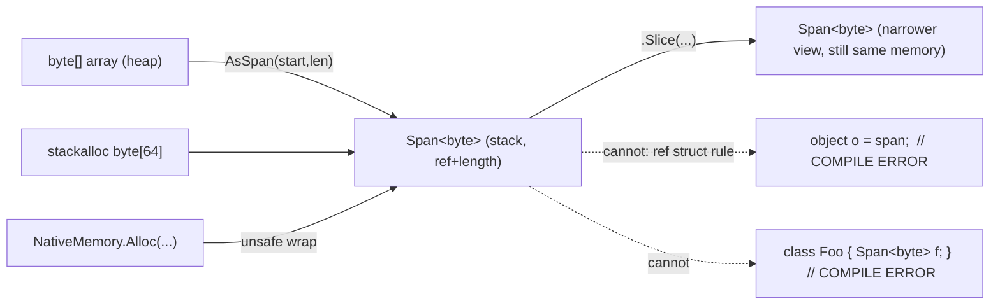
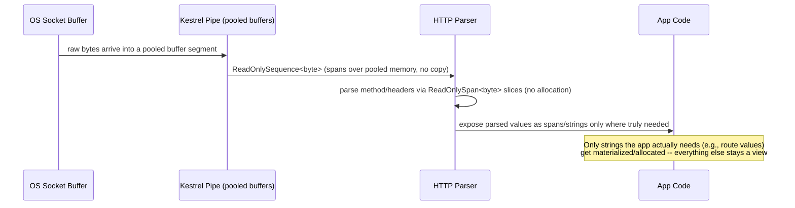
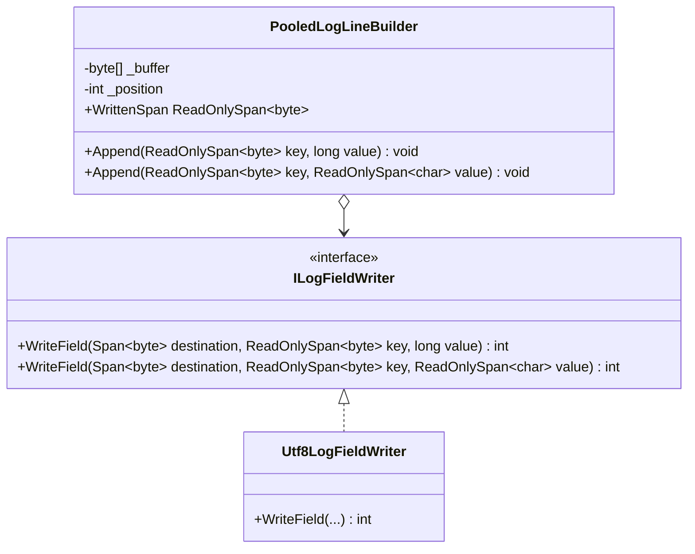
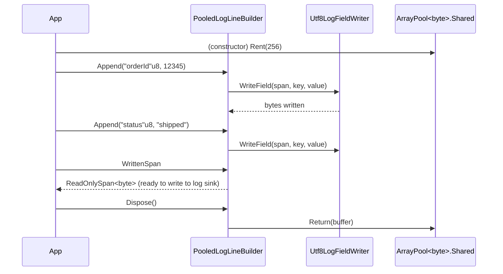

# Module 3 — C# Advanced: `Span<T>`, `Memory<T>` & Low-Allocation Code Patterns

> Domain: C# | Level: Beginner → Expert | Prerequisite: [[01-CLR-JIT-GC-Memory-Management]] (stack vs heap, GC pressure, LOH), [[02-Async-Await-Internals]] (why `Span<T>` cannot be used across `await`)

---

## 1. Fundamentals

### What is `Span<T>`?
`Span<T>` is a **ref struct** (a stack-only value type) that represents a **contiguous, type-safe view over memory** — memory that can live on the stack, on the managed heap, or even in unmanaged/native memory — without copying it and without allocating a wrapper object for the common case. It's `{ ref T reference; int length; }` under the hood: a pointer-like reference plus a length, bounds-checked on every access.

`Memory<T>` is its **heap-safe counterpart**: not a `ref struct`, so it can be stored in a class field, captured in a closure, passed across `await` boundaries, and boxed — at the cost of an extra indirection (`.Span` must be materialized to actually read/write through it).

### Why do they exist?
Before `Span<T>` (introduced .NET Core 2.1 / C# 7.2), any operation that needed "a slice of an array/string" had exactly one option: **allocate a new array/string** (`Substring`, `Array.Copy` into a new array, `Skip().Take()` via LINQ). Every parse, every slice, every sub-buffer operation paid a heap allocation — a direct tax on GC pressure (Module 1) for something that is conceptually just "a window into memory I already have."

`Span<T>` lets you slice, parse, and pass around views into existing memory — arrays, `stackalloc` buffers, native/unmanaged memory, or a segment of a string (`ReadOnlySpan<char>`) — with **zero additional allocation**, while still being bounds-checked and type-safe (unlike raw pointers).

### When does this matter?
- **High-throughput parsing** (HTTP header parsing, JSON/CSV parsing, protocol buffers, log processing) — the textbook use case; ASP.NET Core's own Kestrel server and `System.Text.Json` are built on `Span<T>` internally.
- **Hot paths identified by profiling** as allocation-bound (see Module 1 §7) — this is an *optimization* tool, not a default style choice for ordinary CRUD/business logic where clarity matters more.
- **Interop scenarios** — working with native buffers (P/Invoke) safely without `unsafe` pointer arithmetic everywhere.
- **NOT** for: async methods' local state across an `await` (compiler-enforced — `ref struct` cannot be a field of a heap-allocated state machine), long-lived storage (use `Memory<T>` instead), or ordinary application code where the allocation isn't measured to matter.

### How does it work (30,000-ft view)?

```
string s = "Hello, World!";
ReadOnlySpan<char> slice = s.AsSpan(7, 5); // "World" -- NO new string allocated
                                            // slice is just {ref to s's internal char at index 7, length 5}

int[] arr = { 1, 2, 3, 4, 5 };
Span<int> mid = arr.AsSpan(1, 3);          // {2, 3, 4} -- a view, not a copy
mid[0] = 99;                               // mutates arr[1] directly -- it's the SAME memory
Console.WriteLine(arr[1]);                 // 99
```

Mental model for interviews: **"`Span<T>` is a view, not a copy. Mutating through it mutates the original."** This is simultaneously its main performance win and its main correctness hazard if misunderstood.

---

## 2. Deep Dive

### 2.1 Why `Span<T>` Must Be a `ref struct`

A `Span<T>` can point at **stack memory** (via `stackalloc`) or memory that only the runtime knows might move (managed heap objects during GC compaction — handled internally by the runtime's tracked-reference machinery). If `Span<T>` could be:
- **Boxed** (assigned to `object`) → it could outlive the stack frame it pointed into → dangling reference. **Forbidden.**
- **A field of a normal (non-ref) class** → same problem, since a class instance's lifetime isn't tied to the stack frame that created the `Span`. **Forbidden.**
- **Captured in a lambda closure or used across an `await`** → the closure/state machine is (potentially) heap-allocated, same danger. **Forbidden — this is exactly why you cannot use `Span<T>` in an `async` method body across an `await` point.**

The C# compiler enforces all of this at **compile time** via the `ref struct` rule — this is a purely compile-time safety mechanism with zero runtime cost, one of the more elegant pieces of the CLR/C# type system to know cold for interviews.

### 2.2 `Span<T>` vs `Memory<T>` vs `ReadOnlySpan<T>` vs `ReadOnlyMemory<T>`

| Type | Stack-only (`ref struct`)? | Can cross `await`/be a field? | Mutable? | Typical use |
|---|---|---|---|---|
| `Span<T>` | Yes | No | Yes | Synchronous hot-path parsing/slicing with mutation |
| `ReadOnlySpan<T>` | Yes | No | No | Synchronous hot-path parsing/slicing, read-only (e.g., string slices) |
| `Memory<T>` | No | Yes | Yes (via `.Span`) | Buffers that must survive across `await` or be stored as fields |
| `ReadOnlyMemory<T>` | No | Yes | No | Same as above, read-only (e.g., what `string.AsMemory()` returns) |

**Pattern**: An API that needs to work both synchronously (fast path, no allocation) and asynchronously (must store the buffer across an `await`) typically exposes a `Memory<T>` parameter, then calls `.Span` internally right before the actual synchronous read/write — e.g., `Stream.ReadAsync(Memory<byte> buffer, ...)` in modern .NET.

### 2.3 `stackalloc` and Bounds Safety

```csharp
Span<int> buffer = stackalloc int[128]; // allocated on the CURRENT method's stack frame
```
- Prior to `Span<T>`, `stackalloc` required an `unsafe` context and returned a raw `int*` with **no bounds checking** — a direct buffer-overrun risk.
- With `Span<T>`, `stackalloc` can be wrapped in a `Span<T>` in **safe** code — every access is bounds-checked (throws `IndexOutOfRangeException` on violation), eliminating the classic C-style stack-buffer-overrun vulnerability class while keeping the zero-allocation, zero-GC-involvement benefit.
- **Danger**: stack space is small (default ~1MB/thread) and not GC-tracked — a `stackalloc` sized by untrusted/attacker-controlled input (e.g., `stackalloc byte[userProvidedLength]`) is a **stack-overflow-as-DoS** vector (see §8 Security). Always cap the size with a compile-time-known or validated maximum, falling back to `ArrayPool<T>.Shared.Rent(...)` for larger/variable sizes.

### 2.4 How Slicing Avoids Allocation — the Actual Mechanics

`someArray.AsSpan(start, length)` constructs a `Span<T>` containing:
1. A **managed pointer** (`ref T`, not a raw pointer — this is tracked by the GC so it updates correctly if the object moves during compaction) to `someArray[start]`.
2. An `int Length = length`.

No new array is allocated; no elements are copied. Indexing `span[i]` computes `ref + i * sizeof(T)` and bounds-checks against `Length` — genuinely as fast as raw array indexing in the JIT-optimized case (Tier 1/PGO can often elide the redundant bounds check entirely when it can prove safety, e.g., in a simple `for (int i = 0; i < span.Length; i++)` loop).

### 2.5 `ArrayPool<T>` — the Pooling Partner

`Span<T>`/`Memory<T>` solve the "avoid allocation when *slicing existing memory*" problem. They do **not** solve "avoid allocation when you need a *new* buffer" (e.g., a scratch buffer for a parse operation, a temporary encode/decode buffer). That's what **`ArrayPool<T>.Shared`** is for:

```csharp
byte[] buffer = ArrayPool<byte>.Shared.Rent(4096); // may return a LARGER array than requested
try
{
    int written = FillBuffer(buffer.AsSpan(0, 4096)); // must respect requested size, not buffer.Length
    Process(buffer.AsSpan(0, written));
}
finally
{
    ArrayPool<byte>.Shared.Return(buffer, clearArray: true); // clearArray matters if it held sensitive data
}
```
- `Rent` may return an array **larger** than requested (pool buckets are sized in powers of two internally) — always slice to the size you actually asked for, don't assume `buffer.Length == requested size`.
- `Return` should specify `clearArray: true` when the buffer held sensitive data (credentials, PII) — otherwise the returned array's old contents remain in memory, retrievable by whoever rents it next (a real security consideration, §8).
- Not calling `Return` isn't a "leak" in the GC sense (the array is still a normal, collectible object) — it just defeats the purpose of pooling, forcing the pool to allocate a fresh array for the next `Rent`.

### 2.6 `Span<T>` and the JIT — Zero-Cost Abstraction, Mostly

The JIT recognizes `Span<T>`/`ReadOnlySpan<T>` patterns specially:
- **`ReadOnlySpan<byte>` over a UTF-8 string literal** (`"hello"u8` syntax, C# 11+) compiles to a reference directly into the assembly's static data section — genuinely zero runtime allocation, zero copy, resolved entirely at compile time.
- Simple `Span<T>` loops are inlined and bounds-checks elided by Tier 1/PGO when provably safe, making `Span<T>`-based code perform on par with raw array/pointer code in the steady state — the "abstraction" costs effectively nothing once JIT-optimized, which is *not* generally true of, say, `IEnumerable<T>`/LINQ abstractions (those retain real virtual-dispatch/iterator overhead even after full optimization).



---

## 3. Visual Architecture

### Memory View Hierarchy (ASCII)

```
                     ┌───────────────────────────────────────────┐
                     │              Underlying Memory              │
                     │  (array on heap | stackalloc | native buf)  │
                     └───────────────────────────────────────────┘
                           ▲                    ▲             ▲
                 view (no copy)         view (no copy)   view (no copy)
                           │                    │             │
                  ┌────────────────┐  ┌──────────────────┐  ┌───────────────┐
                  │   Span<T>       │  │  ReadOnlySpan<T>  │  │  Memory<T>     │
                  │  (stack only)   │  │   (stack only)    │  │ (heap-safe,    │
                  │  mutable        │  │   read-only       │  │  field/await-  │
                  │                 │  │                   │  │  safe)         │
                  └────────────────┘  └──────────────────┘  └───────┬───────┘
                                                                      │ .Span
                                                                      ▼
                                                            ┌──────────────────┐
                                                            │  Span<T> (materialized
                                                            │  right before use) │
                                                            └──────────────────┘
```

### Data Flow — Zero-Allocation Request Parsing (Kestrel-style)



---

## 4. Production Example

### Scenario: High-frequency market-data ingestion service (FIX protocol parser)

**Problem**: A trading-adjacent service parsing FIX protocol messages (pipe-delimited key=value pairs over TCP, tens of thousands of messages/sec) showed `% Time in GC` around 18% and Gen 0 collections happening several times per second under peak feed volume, contributing directly to tail-latency violations on a strict sub-millisecond internal SLA.

**Investigation**:
- `dotnet-trace` + allocation sampling (`dotnet-trace collect --profile gc-verbose`) showed the majority of allocations were `string` objects from `message.Split('\x01')` (FIX's SOH delimiter) followed by `.Split('=')` on each field — classic `string.Split` allocates a new `string[]` **and** a new `string` per token, for every single field of every single message.
- A secondary allocation source: `int.Parse`/`decimal.Parse` overloads being called on already-split `string` tokens — an unavoidable-seeming cost that turned out to have a zero-allocation alternative.

**Architecture fix**:
- Replaced `string.Split` with manual `ReadOnlySpan<char>` scanning: `message.AsSpan()`, then iterating and slicing on delimiter positions found via `IndexOf`/`Slice` — no intermediate `string[]`, no per-token `string` allocation for fields that only need numeric parsing.
- Used `int.Parse(ReadOnlySpan<char>)`/`decimal.Parse(ReadOnlySpan<char>)` overloads (available since .NET Core 3.0+) directly on the sliced spans — parses numbers straight out of the original buffer with zero intermediate string allocation at all.
- For the handful of fields that *did* need to become real `string`s (e.g., a symbol ticker cached in a dictionary key), those specific slices were the only ones materialized via `.ToString()` — allocation reduced from "every field, every message" to "only the few fields that truly need to persist as strings."
- Backing buffer for incoming socket data came from `ArrayPool<byte>.Shared` (rented once per connection buffer refill, not per message), with the parser operating on `ReadOnlySpan<byte>`/`ReadOnlySpan<char>` views into it.

**Trade-offs**: The manual span-scanning parser is measurably less readable than `string.Split` + LINQ — the team documented the parser heavily and isolated it behind a small, well-tested interface (`IFixMessageParser`) so the complexity is contained to one file, not spread through the codebase. Accepted because this specific path was proven (via profiling, not guesswork) to be the dominant GC-pressure contributor.

**Lessons learned**:
1. `string.Split` is a hidden, easy-to-miss allocation hotspot in any text-parsing hot path — always suspect it first when profiling shows string-dominated allocations in a parsing service.
2. `Span<T>`-based numeric parsing (`int.Parse(ReadOnlySpan<char>)`) is a direct drop-in replacement with zero API-shape cost once you already have a span — there's rarely a reason not to use it once you're already in span-based code.
3. Optimize surgically: only the fields that must become long-lived `string`s should ever pay that allocation — everything else can stay a transient view.
4. Contain the complexity: low-allocation code is real complexity debt — isolate it behind clear interfaces so it doesn't spread as a "style" into code that doesn't need it.

---

## 5. Best Practices

- **Reach for `Span<T>`/`ReadOnlySpan<T>` only after profiling identifies allocation as a real bottleneck** (Module 1 §7's `dotnet-counters`/BenchmarkDotNet discipline applies directly). Why: it's a genuine readability/complexity cost — don't pay it speculatively.
- **Use `Memory<T>`/`ReadOnlyMemory<T>` for any buffer that must survive an `await` or be stored as a field**; use `Span<T>`/`ReadOnlySpan<T>` only for the synchronous, local, "in and out within this method call" portion of the work.
- **Prefer the `Span<char>`/`ReadOnlySpan<char>` `Parse`/`TryParse` overloads** (`int.Parse(ReadOnlySpan<char>)`, `Utf8Parser`, etc.) over allocating an intermediate `string` purely to parse it — a strict, free win whenever you already have a span in hand.
- **Pool scratch buffers with `ArrayPool<T>.Shared`** for temporary work buffers in hot paths; always `Return` in a `finally` block, and pass `clearArray: true` when the buffer may have held sensitive data.
- **Cap `stackalloc` sizes to a small, compile-time-bounded constant** (or validate any input-derived size against a hard maximum before using it) — never `stackalloc` directly sized by untrusted input.
- **Use `"literal"u8` UTF-8 string literals** (C# 11+) when comparing/matching against known ASCII/UTF-8 byte sequences in parsing code (e.g., HTTP method/header names) — genuinely free at runtime.
- **Keep low-allocation/span-based code isolated behind clear interfaces** in a small number of well-tested files, rather than letting the style bleed into ordinary business logic where it buys nothing but costs readability.

---

## 6. Anti-patterns

- **Sprinkling `Span<T>` through ordinary CRUD/business-logic code "because it's more efficient."** Why it fails: adds real cognitive overhead and compiler-restriction friction (can't use in async methods, can't store as fields, can't use in iterators) for code where the allocation was never actually a measured problem. Fix: keep `Span<T>` scoped to profiled hot paths.
- **`stackalloc` sized directly by user/network input without a bounds check.** Why it fails: a large enough requested size overflows the thread stack, crashing the process — a trivially triggerable DoS if the size comes from an external request. Fix: clamp to a maximum, or use `ArrayPool<T>` (heap, GC-managed, no stack-overflow risk) above a small threshold.
- **Storing a `Span<T>` across an `await` by "working around" the compiler error** (e.g., converting to `Memory<T>`, awaiting, then converting back — done carelessly without understanding *why* the restriction exists in the first place, sometimes via `unsafe`/pointer tricks to defeat the compiler). Why it fails: reintroduces the exact dangling-reference risk the `ref struct` restriction exists to prevent. Fix: genuinely restructure around `Memory<T>` for the async-spanning portion, materializing `.Span` only for the synchronous sub-operations.
- **Forgetting to `Return` rented `ArrayPool<T>` buffers**, or returning them without `clearArray: true` when they held sensitive data. Fix: `try`/`finally` discipline; explicit review for any pooled buffer touching secrets/PII.
- **Assuming `Span<T>` slicing "copies" and mutating it "to be safe," accidentally corrupting the original array.** Why it fails: the opposite mistake — not realizing a `Span<T>` (mutable) IS a view, so writes propagate back, causing surprising bugs when a caller didn't expect their original array to change. Fix: use `ReadOnlySpan<T>` by default for any API that only needs to read, reserving mutable `Span<T>` for APIs that are explicitly documented to write through.
- **Using `Span<T>` where `ReadOnlySpan<T>` would communicate intent correctly.** Fix: default to `ReadOnlySpan<T>` parameters unless the method genuinely needs to mutate the caller's buffer — this is the `Span<T>`-world equivalent of preferring `IReadOnlyList<T>` over `List<T>` in public API signatures.

---

---

---

---

## 10. Interview Questions

### Basic (10)

1. **Q: What is `Span<T>`?**
   **A:** A `ref struct` providing a type-safe, bounds-checked, contiguous view over memory (array, stack, or native) without copying the underlying data.

2. **Q: Why is `Span<T>` a `ref struct`?**
   **A:** So the compiler can guarantee it never outlives the stack frame/memory it points into — it can't be boxed, stored in a heap-allocated class field, or captured across an `await`, preventing dangling references.

3. **Q: Does slicing a `Span<T>` copy the underlying data?**
   **A:** No — slicing produces a new `Span<T>` that's still a view into the exact same memory; no copy occurs.

4. **Q: What's the difference between `Span<T>` and `Memory<T>`?**
   **A:** `Span<T>` is stack-only (`ref struct`) and can't cross `await`/be a field; `Memory<T>` is a normal struct that can be stored/passed across async boundaries, materialized to a `Span<T>` via `.Span` when actually reading/writing.

5. **Q: What does `stackalloc` do?**
   **A:** Allocates a block of memory directly on the current method's stack frame; wrapped in a `Span<T>` in safe code, it's bounds-checked without needing `unsafe`.

6. **Q: Can you use `Span<T>` inside an `async` method?**
   **A:** You can use it for synchronous, local work within the method, but not across an `await` — the compiler will reject storing it in a way that would need to survive suspension.

7. **Q: What is `ArrayPool<T>` used for?**
   **A:** Renting and returning reusable arrays to avoid repeated heap allocation for temporary/scratch buffers, reducing GC pressure in high-frequency code paths.

8. **Q: What does `Rent()` on `ArrayPool<T>` guarantee about the returned array's size?**
   **A:** Only that it's **at least** as large as requested — it may be larger (pool buckets round up), so callers must track and use only the originally requested length.

9. **Q: Is a `ReadOnlySpan<char>` slice of a `string` a new string?**
   **A:** No — it's a view directly into the original string's internal character data; no new string is allocated.

10. **Q: What happens if you try to store a `Span<T>` as a field of a normal class?**
    **A:** A compile-time error — `ref struct` types cannot be fields of non-`ref struct` (ordinary) types.

### Intermediate (10)

1. **Q: Why can't `Span<T>` be boxed or assigned to an `object`/interface-typed variable?**
   **A:** Boxing would require heap-allocating a wrapper that could outlive the stack frame or GC-tracked reference the span points to, breaking the safety guarantee `ref struct` exists to provide — so the compiler forbids it entirely.

2. **Q: Explain how `int.Parse(ReadOnlySpan<char>)` avoids allocation compared to `int.Parse(someString.Substring(...))`.**
   **A:** `Substring` allocates a brand-new `string` before parsing it; the span overload parses digits directly out of a view into the original buffer, with no intermediate string ever created.

3. **Q: What's the danger of `stackalloc` with an attacker-controlled size, and how do you mitigate it?**
   **A:** An oversized request can overflow the thread's stack and crash the process — a DoS vector; mitigate by capping the size to a small hard maximum or falling back to `ArrayPool<T>` (heap-based) for larger/variable sizes.

4. **Q: Why does the JIT often elide bounds checks on `Span<T>` indexing in loops, and when does it not?**
   **A:** When it can statically prove the loop index never exceeds `span.Length` (e.g., a simple `for (int i=0; i<span.Length; i++)` pattern), Tier 1/PGO can safely remove the redundant per-access check; it retains the check whenever the access pattern isn't provably safe (arbitrary/computed indices, multiple mutation points affecting the bound).

5. **Q: What's the correct usage discipline around `ArrayPool<T>.Return` and sensitive data?**
   **A:** Pass `clearArray: true` when the buffer held secrets/PII, since otherwise stale contents remain in memory and could be read by whichever caller rents that slot next — a real information-disclosure risk in shared-pool scenarios.

6. **Q: Why would an API expose a `Memory<T>` parameter instead of `Span<T>` even for code that's often called synchronously?**
   **A:** So the same API can be used from both synchronous and asynchronous callers (e.g., `Stream.ReadAsync`) — `Memory<T>` can survive across an `await` if needed, materializing `.Span` internally only for the actual synchronous read/write.

7. **Q: What is a UTF-8 string literal (`"text"u8`) and why is it relevant to low-allocation code?**
   **A:** A C# 11+ syntax producing a `ReadOnlySpan<byte>` pointing directly at compile-time-embedded UTF-8 bytes in the assembly — useful for comparing/matching known ASCII/UTF-8 sequences (e.g., HTTP method names) with zero runtime allocation or encoding cost.

8. **Q: How does mutating a `Span<T>` slice affect the original array it came from?**
   **A:** It mutates it directly — a `Span<T>` (mutable) is a view, not a copy, so any write through the span is visible in the original backing array immediately.

9. **Q: Why should public APIs default to `ReadOnlySpan<T>` parameters instead of `Span<T>` unless mutation is required?**
   **A:** It correctly communicates (and enforces at compile time) that the method won't modify the caller's buffer — the same intent-signaling principle as preferring `IReadOnlyList<T>` over `List<T>` in public signatures.

10. **Q: What's the practical difference between `ReadOnlySpan<T>` and `ReadOnlyMemory<T>` in terms of where each can be used?**
    **A:** `ReadOnlySpan<T>` is stack-only (local variables, method parameters, can't be a field or cross `await`); `ReadOnlyMemory<T>` is a regular struct that can be stored as a field, captured in closures, and passed across async boundaries, exposing `.Span` for the actual synchronous read.

### Advanced (10)

1. **Q: Explain precisely why `Span<T>`'s internal `ref T` field is special compared to a raw pointer, in terms of GC interaction.**
   **A:** `Span<T>`'s internal reference is a **managed pointer** (an "interior pointer" the GC tracks and updates), not a raw unmanaged address — if the GC compacts the heap and moves the object the span points into, the GC updates that tracked reference correctly, unlike a raw `T*` obtained via `fixed`/unsafe code, which would become invalid (dangling) after compaction unless the object is explicitly pinned. This is precisely why `Span<T>` can safely point into ordinary (unpinned, movable) heap objects without requiring pinning, whereas raw-pointer interop code must pin first.

2. **Q: How would you decide between `Span<T>`-based manual parsing and simply pinning a buffer and using raw pointers with `unsafe`, for a very hot parsing path?**
   **A:** `Span<T>` gives bounds-checked safety at effectively zero runtime cost once JIT-optimized (§2.6) — there's rarely a legitimate performance reason to drop into raw `unsafe` pointers for pure in-process parsing logic; `unsafe`/pinning is reserved for genuine interop boundaries (P/Invoke signatures requiring raw pointers, or SIMD/vectorized code using `Vector<T>`/hardware intrinsics that may need pointer-level access for specific APIs) where `Span<T>`'s safe API surface doesn't reach. Defaulting to `unsafe` "for speed" without such a boundary requirement trades away bounds-checking safety for no measurable benefit.

3. **Q: Why can a `ref struct` not implement an interface in older C# versions, and how did C# 11's `ref struct` interface support change this — with what restriction?**
   **A:** Implementing an interface normally allows the value to be accessed through the interface reference, which would require boxing (heap-allocating a wrapper) — directly violating the `ref struct` stack-only guarantee. C# 11 allows a `ref struct` to implement an interface **only** if it's used through generic constraints (`static abstract`/generic-math-style patterns, `where T : IMyInterface, allows ref struct`) that the JIT can specialize per concrete type without ever boxing — calling through an actual `IMyInterface`-typed reference is still forbidden, preserving the no-boxing/no-heap-escape guarantee.

4. **Q: Walk through why `ArrayPool<T>.Shared.Rent` can return an array larger than requested, and what bug pattern this causes if a caller assumes otherwise.**
   **A:** The shared pool buckets arrays by power-of-two sizes internally (for efficient bucketed reuse) — requesting 100 elements might yield a 128-element array back. The common bug: a caller iterates/serializes `buffer.Length` elements instead of tracking and using only the originally requested count, silently processing/exposing extra, uninitialized (or stale, from a previous renter) trailing elements — a correctness bug and, if the stale data is sensitive, a potential information-disclosure bug too (tying back to §8).

5. **Q: Explain how `Span<T>` composes with `System.Buffers.SequenceReader<T>` and `ReadOnlySequence<T>`, and why the latter exists at all given `Span<T>` already solves contiguous-memory views.**
   **A:** `Span<T>`/`ReadOnlySpan<T>` require the underlying memory to be **contiguous** — but real-world I/O buffers (e.g., data arriving from a socket in multiple non-contiguous pooled segments) often aren't. `ReadOnlySequence<T>` represents a possibly-**multi-segment** (linked list of memory chunks) view, with `SequenceReader<T>` providing span-like scanning/parsing convenience methods (`TryReadTo`, `IsNext`, etc.) that transparently handle segment boundaries — falling back to per-segment `Span<T>` operations under the hood wherever a sub-range happens to be contiguous. This is exactly the abstraction Kestrel/`System.IO.Pipelines` is built on (§3's data flow diagram) since network I/O fundamentally doesn't guarantee contiguous delivery.

6. **Q: A candidate claims "using `Span<T>` everywhere makes code strictly faster." What's the nuanced pushback?**
   **A:** `Span<T>` eliminates allocation/copy costs for slicing, which is a real win specifically when (a) the operation would otherwise have allocated (e.g., replacing `Substring`), and (b) it's called frequently enough for that allocation to matter. It does **not** make already-non-allocating operations (e.g., a simple arithmetic loop over an `int[]` that wasn't slicing/substring-ing anything) meaningfully faster, and it adds real complexity/restriction cost (can't cross `await`, can't be a field, can't be captured in most closures) that isn't "free" from a maintainability standpoint — the correct framing is "removes a specific class of allocation overhead where it previously existed," not "a universal speed multiplier."

7. **Q: How does `MemoryMarshal` relate to `Span<T>`, and what's a legitimate advanced use case?**
   **A:** `MemoryMarshal` provides low-level, explicitly-named-as-dangerous operations for reinterpreting/casting spans (`Cast<TFrom,TTo>`, `Read<T>`, `GetReference`) — e.g., reinterpreting a `ReadOnlySpan<byte>` as a `ReadOnlySpan<int>` to parse a binary wire format without copying, or obtaining a `ref` to a span's first element for interop/pinning scenarios. Legitimate advanced use: implementing a zero-copy binary protocol deserializer where the wire format's byte layout maps directly onto a struct's field layout (`MemoryMarshal.Read<MyStruct>(span)`), provided endianness and struct layout (`[StructLayout]`) are handled correctly — genuinely powerful, but it deliberately bypasses normal type-safety guarantees and demands the same scrutiny as `unsafe` code.

8. **Q: What's the interaction between `Span<T>` and SIMD/hardware-accelerated code (e.g., `System.Numerics.Vector<T>`), and why does this matter for performance-critical numeric code?**
   **A:** `Span<T>` provides a safe, bounds-checked way to obtain contiguous chunks of data that can then be loaded into `Vector<T>`/`Vector256<T>` etc. for SIMD-accelerated processing (e.g., vectorized sum/compare/transform over large arrays) — libraries like `System.Numerics.Tensors` and modern `System.Text.Json`/`System.Text.Encodings.Web` internally combine `Span<T>`-based buffer management with SIMD intrinsics for operations like UTF-8 validation or bulk character escaping, achieving both memory safety (via `Span<T>`) and hardware-level throughput (via SIMD) simultaneously rather than trading one for the other.

9. **Q: Explain a realistic scenario where converting a hot path to `Span<T>`-based code made a BenchmarkDotNet microbenchmark look great but didn't move the needle in production — and why that gap can happen.**
   **A:** A microbenchmark isolates the parsing function alone, showing a clean allocation/time reduction; in production, if the *rest* of the request pipeline still allocates heavily elsewhere (e.g., the parsed values are immediately boxed into an `object[]` for a downstream logging call, or immediately converted to `string`s for a database call anyway), the isolated win gets swallowed by allocation happening one step later in the pipeline — the overall service's `% Time in GC` barely moves. Lesson: profile and validate the *end-to-end* allocation profile under production-representative load, not just the isolated function, before claiming the optimization mattered.

10. **Q: How would you reason about whether a team should adopt `Span<T>`-based parsing as a standard practice for all new services, versus treating it as a specialized technique?**
    **A:** Treat it as specialized: mandate it only where profiling has demonstrated allocation-driven GC pressure as an actual bottleneck (per §7's benchmarking discipline), and provide a small number of well-tested shared utilities/parsers (as in §4's isolated `IFixMessageParser`) rather than asking every engineer to hand-roll span-based parsing throughout the codebase — the complexity/restriction cost (§6, §Advanced Q6) is real and should be paid deliberately and narrowly, matching the general Principal-level pattern established in Module 1/2 of "measure first, optimize the proven bottleneck, don't cargo-cult the technique broadly."

### Expert (10)

1. **Q: Design a zero-allocation, `Span<T>`-based binary protocol parser for a fixed-schema message format (4-byte length prefix + type byte + payload), including how you'd handle a payload that spans multiple network reads (partial message arrival).**
   **A:** Use `System.IO.Pipelines` (`PipeReader`) as the foundation rather than raw `Span<T>` alone, since partial/multi-segment arrival is exactly the problem `ReadOnlySequence<T>`/`SequenceReader<T>` solve (Advanced Q5): read from the pipe, examine the buffered `ReadOnlySequence<byte>`, and only attempt to parse once at least the 5-byte header is available (`buffer.Length >= 5`); if the full payload (per the length prefix) isn't yet buffered, call `reader.AdvanceTo(examined: buffer.End, consumed: buffer.Start)` to signal "wait for more data without consuming what we've seen," avoiding any copy or allocation while waiting. Once a full message is available, use `SequenceReader<byte>.TryReadTo`/manual segment-walking to parse the header fields via `Span<T>`-based reads (using `MemoryMarshal`/`BinaryPrimitives.ReadInt32BigEndian` for the length prefix, handling multi-segment payloads by copying only if the payload happens to straddle a segment boundary — the one case where a small, bounded copy is unavoidable, versus optimizing for the common case where it's fully contained in one segment).

2. **Q: A high-frequency trading system's risk team wants "guaranteed zero GC pauses" during the trading day for the market-data ingestion path. Evaluate this requirement and design toward it using the tools from this module.**
   **A:** "Guaranteed zero GC pauses" is not literally achievable in a garbage-collected runtime without extreme measures (the CLR always has *some* allocation somewhere — JIT itself, framework internals) — the achievable, honest goal is "effectively zero *application-driven* Gen 0/1/2 collections during the critical window." Design: pre-allocate and pool every buffer used on the hot path at startup (`ArrayPool<T>` rentals held for the session's duration rather than rented/returned per-message, or even simpler fixed pre-sized arrays reused in place), use `Span<T>`/`stackalloc` (capped, per §6) for all transient per-message scratch work, avoid `string` allocation entirely on the hot path (parse numeric fields directly via `Span<char>` overloads, intern/cache the small fixed set of symbol strings once at startup rather than allocating per message), and validate via `dotnet-counters`/`dotnet-trace` under sustained production-representative load that Gen 0 collection count during the trading window is at or near the theoretical minimum (only from truly unavoidable framework-internal allocation) — then present that measured number to the risk team as the honest "as close to zero as achievable" commitment, not a literal zero guarantee.

3. **Q: Explain how you'd safely reinterpret a `ReadOnlySpan<byte>` received from an external network source as a fixed-layout struct (e.g., a binary header), addressing both the `MemoryMarshal` mechanics and the endianness/security concerns.**
   **A:** Mechanically, `MemoryMarshal.Read<T>(span)` or `MemoryMarshal.Cast<byte, T>(span)` can reinterpret raw bytes as a `[StructLayout(LayoutKind.Sequential, Pack = 1)]` struct directly, avoiding any field-by-field parsing/copying. Security/correctness concerns: (a) **endianness** — most network protocols are big-endian while x86/ARM are little-endian, so a naive `MemoryMarshal.Read<T>` over multi-byte integer fields will silently produce wrong values unless each field is explicitly byte-swapped (`BinaryPrimitives.ReverseEndianness` or reading via `BinaryPrimitives.ReadInt32BigEndian` instead of a blind struct cast for multi-byte fields) — a naive full-struct reinterpret-cast is only safe for single-byte fields or protocols that happen to match host endianness; (b) **bounds validation** — always verify `span.Length >= sizeof(T)`/`Unsafe.SizeOf<T>()` before the read, since `MemoryMarshal` operations trust the caller's length accounting rather than independently re-validating against the original buffer's true bounds in every overload; (c) never reinterpret-cast a struct containing reference-type fields or one whose layout isn't `Sequential`/`Explicit` with padding fully understood, since the raw byte layout won't match what you expect and can misinterpret attacker-controlled bytes as pointers/lengths in unsafe downstream code.

4. **Q: How would you architect a shared, org-wide "low-allocation toolkit" library so that individual teams get the benefits of `Span<T>`/`ArrayPool<T>` patterns without each team re-deriving the subtle correctness rules (stackalloc caps, ArrayPool clearing, ref struct restrictions) themselves?**
   **A:** Provide a small number of purpose-built, heavily-tested primitives rather than raw access to the low-level types: e.g., a `PooledBufferWriter<T>` wrapper (implementing `IBufferWriter<T>`) that internally handles `ArrayPool` rent/return/clear correctly and exposes a safe, ordinary-looking API to consumers; a `SafeStackAllocHelper` (or simple documented convention) enforcing a compile-time-constant max size for any `stackalloc` usage across the org; span-based parsing helpers for common formats (delimited fields, fixed-width binary headers) that internally apply the endianness/bounds-safety rules from Expert Q3 once, correctly, rather than leaving every team to reimplement them. This mirrors the general Principal Engineer pattern (also seen in Module 2's rate-limiter and Module 1's object-pool LLD sections) of "encode the hard-won correctness knowledge into a shared, reviewed abstraction once, rather than relying on every team independently getting a subtle safety rule right."

5. **Q: Explain why `Span<T>`-based low-allocation rewrites sometimes make code *harder* to unit test, and how you'd mitigate that.**
   **A:** `ref struct` types can't be used as generic type arguments in most standard mocking/generic-constraint scenarios (pre-C# 13's expanded `ref struct` generics support), can't be stored in test fixtures/fields for setup/teardown patterns, and methods taking `Span<T>` parameters can't be easily wrapped by traditional interface-based mocking frameworks (which typically work via boxing/proxying, incompatible with `ref struct` parameters in some tooling). Mitigation: keep the `Span<T>`-based implementation as a thin, direct, easily-golden-tested (input bytes/string in, expected output values out, no mocking needed since it's pure computation) leaf function, and keep any code that *does* need interface-based mocking (I/O, external calls) at a layer above that operates on ordinary `Memory<T>`/arrays/strings — this naturally separates "pure, span-based, easily golden-tested parsing logic" from "orchestration code that needs conventional DI/mocking," which is good layering practice independent of the `Span<T>` question.

6. **Q: A profiling session shows that a `Span<T>`-based rewrite of a hot loop is *slower* than the original array-based version in Release/optimized builds. What are the plausible explanations, and how would you investigate?**
   **A:** Plausible causes: (a) the rewrite introduced additional `Slice()` calls inside the loop body that weren't in the original (each `Slice` call, while cheap, still has non-zero cost if done redundantly per-iteration instead of once outside the loop); (b) the access pattern defeated the JIT's bounds-check elision (e.g., indexing via a computed/non-monotonic index instead of a simple incrementing loop variable), so every access still pays a bounds check that the original array-based code's equivalent pattern happened to have optimized away too, making the comparison actually apples-to-apples-minus-a-red-herring; (c) the `Span<T>` version is operating over a `Memory<T>.Span` materialized *inside* the loop instead of once before it, paying repeated materialization overhead. Investigate via BenchmarkDotNet with disassembly diagnostics (`[DisassemblyDiagnoser]`) to directly inspect the JIT-generated native code for both versions and confirm whether bounds checks were actually elided in each case, rather than guessing from wall-clock numbers alone.

7. **Q: How does `Span<T>` relate to the broader C# "low-level performance" feature set (`ref` returns/locals, `in` parameters, `readonly struct`, function pointers) as a cohesive design philosophy, and how would you explain that cohesion to a team learning these features for the first time?**
   **A:** All of these features share one underlying goal: **let performance-critical code avoid copying and avoid heap allocation, while the compiler still enforces safety guarantees at compile time rather than relying on programmer discipline alone** (the same value proposition as `Span<T>`'s bounds-checking replacing raw-pointer `stackalloc`). `ref` returns/locals let a method return a reference into existing memory instead of a copy; `in` parameters pass large structs by reference without allowing mutation (avoiding copy cost while preserving value-semantics guarantees); `readonly struct` lets the compiler skip defensive copies it would otherwise insert when calling members on a `readonly` struct field/parameter; function pointers (`delegate*`) avoid the allocation/indirection of a full `Delegate` object for very hot callback scenarios. Teaching frame: "C# has spent the last several versions systematically adding ways to write high-performance code *without* dropping into `unsafe`, each one targeting a specific copy/allocation cost that used to be unavoidable in safe code — `Span<T>` is the most commonly used member of that family, not an isolated one-off feature."

8. **Q: Design a benchmark methodology (not just "run BenchmarkDotNet once") to validate a proposed org-wide adoption of `Span<T>`-based JSON field extraction over `System.Text.Json`'s standard `JsonDocument`/`JsonElement` API for a specific high-volume internal service.**
   **A:** (1) Establish representative payload samples spanning the actual production size/shape distribution (not just one synthetic small JSON blob) — allocation/perf characteristics can differ meaningfully by payload size and structure (deeply nested vs flat, many small fields vs few large ones); (2) benchmark both approaches with `[MemoryDiagnoser]` across that payload distribution, not a single point sample; (3) validate correctness equivalence with a shared golden-output test suite before trusting either implementation's numbers (a faster-but-wrong parser is not a valid comparison); (4) run a canary/shadow-traffic production comparison (route a copy of real traffic to both implementations, compare `dotnet-counters` GC metrics and p50/p99 latency under real concurrency, not just single-threaded microbenchmark throughput) before committing to org-wide adoption; (5) document the measured break-even point (e.g., "only worth it above N requests/sec or M-byte payloads") so future teams have a data-driven adoption criterion instead of a blanket "always use the span version" rule — directly reinforcing the "measure, don't cargo-cult" principle running through this entire module.

9. **Q: Explain the relationship between `Span<T>` and the .NET vectorized/SIMD-accelerated `string` operations (e.g., `string.Contains`, `Enumerable.SequenceEqual` on spans) shipped in the BCL, and why understanding this matters when deciding whether to hand-roll your own span-scanning loop.**
   **A:** Many BCL methods operating on `ReadOnlySpan<char>`/`ReadOnlySpan<byte>` (`IndexOf`, `SequenceEqual`, `Contains`) are already internally vectorized (using SIMD intrinsics under the hood for supported platforms/sizes) and extensively tuned by the runtime team — a hand-rolled scalar `for` loop scanning byte-by-byte for a delimiter will very often be *slower* than simply calling `span.IndexOf((byte)'\x01')` and letting the BCL's already-vectorized implementation handle it. Practical guidance: before hand-rolling a span-scanning loop (as in §4's FIX parser example), check whether an existing `Span<T>`/`ReadOnlySpan<T>` BCL method already does exactly what's needed — the "manual scanning" approach is justified only for genuinely custom logic that no BCL method covers, not as a default reflex, since reinventing `IndexOf` by hand usually loses to the framework's tuned implementation.

10. **Q: As a Principal Engineer, a team proposes replacing `System.Text.Json` entirely with a hand-rolled `Span<T>`-based JSON parser for "maximum performance" across the whole platform. Walk through your evaluation and likely recommendation.**
    **A:** Evaluate against: (a) **measured need** — is JSON parsing actually a proven bottleneck (via profiling) for the services in question, or is this speculative optimization?; (b) **maintenance cost** — `System.Text.Json` is a heavily-optimized, security-hardened, actively-maintained BCL component (handles UTF-8/UTF-16 edge cases, escaping, malformed-input robustness, DoS-resistant depth/size limits) that a hand-rolled replacement would need to re-implement and re-harden from scratch, an enormous and ongoing cost center (every future JSON edge case/CVE-class bug becomes the team's own problem instead of the framework's); (c) **actual achievable win** — `System.Text.Json` already uses `Span<T>`/UTF-8 processing internally and is competitive with or faster than most hand-rolled alternatives for general-purpose use; a custom parser might beat it only for a narrow, fixed, well-known schema (much like §4's FIX parser, which is *not* general JSON). Likely recommendation: reject blanket platform-wide replacement; approve a narrow, isolated custom parser only for the specific proven-hot, fixed-schema paths (mirroring §4 and Expert Q4's "small number of purpose-built, heavily-tested primitives" pattern) while keeping `System.Text.Json` as the default for everything else — the same measure-first, scope-narrowly discipline applied consistently throughout this module.

---

### Additional Medium → Expert (20)
1. **Q: Why can `Span<T>` wrap stack memory, native memory, and managed arrays uniformly, and what runtime feature makes that safe?** **A:** Its core field is a `ref T` (a managed "interior pointer") plus a length; the GC's stack-scanning understands interior pointers into arrays and updates them when the array moves during compaction, while stack/native-backed spans simply contain addresses the GC ignores. The `ref struct` restriction (stack-only lifetime) is what makes this safe — the span can never outlive the stack frame or scope that guarantees its target's validity.
2. **Q: What is `scoped` (C# 11) on a `ref struct` parameter, and what problem does it solve?** **A:** `scoped Span<T> s` declares the parameter cannot escape the method (not returned, not stored into a wider-lived `ref`), which relaxes the compiler's conservative lifetime analysis for callers: without it, a method taking both a `Span<T>` and returning a `Span<T>` forces the compiler to assume the return might alias any argument, rejecting safe call patterns like passing a `stackalloc` buffer. `scoped` restores those patterns by contract.
3. **Q: Explain the `[UnscopedRef]` attribute and when a struct method needs it.** **A:** By default `this` in a struct method is `scoped ref` — you can't return a `ref`/`Span` into the struct's own fields. `[UnscopedRef]` opts a method/property out, allowing e.g. an inline-buffer struct (`[InlineArray]`) to hand out a `Span<T>` over its own storage; the cost is that callers now face stricter lifetime rules for the struct instance itself (it must outlive the returned span).
4. **Q: What does C# 12's `[InlineArray]` give low-allocation code that `stackalloc` doesn't?** **A:** An `[InlineArray(N)]` struct is a fixed-size buffer of N elements laid out inline — embeddable in *fields* (including inside classes and other structs), reusable across calls, and safely exposed as `Span<T>` without `unsafe`, whereas `stackalloc` exists only for the current frame's lifetime and can't be a field. It's the mechanism behind params-span optimizations and small fixed buffers in the BCL.
5. **Q: When does the compiler use spans to eliminate allocations for you, without any span code in your source?** **A:** Several lowerings: `params ReadOnlySpan<T>` overloads (C# 13) let variadic calls stackalloc the arguments; constant-length `stackalloc`-backed interpolated string handlers avoid intermediate strings; `string.Concat`/comparisons over spans; switch over string lowered to span comparisons; and collection expressions targeting spans. Knowing these exist prevents hand-rolling "optimizations" the compiler already performs more safely.
6. **Q: Compare `ArrayPool<T>.Shared` with a custom `ArrayPool<T>.Create(...)` pool — when is the custom pool justified?** **A:** `Shared` is process-wide with per-size buckets, per-core caching, and no ownership tracking — fine for most transient buffer needs. A custom pool is justified when you need isolation (a misbehaving component over-renting shouldn't starve others), different retention (bounded max arrays/bucket for memory-capped services), very large or unusual sizes beyond `Shared`'s 1MB default cap, or clear-on-return semantics enforced centrally for sensitive data.
7. **Q: What's the bug when an `ArrayPool` buffer is returned while a `Memory<T>` over it is still referenced somewhere, and how do you design against it?** **A:** The pooled array gets re-rented and overwritten while the stale `Memory<T>` still reads/writes it — silent cross-request data corruption (one user's response bytes appearing in another's), among the worst bug classes to debug. Design against it with strict ownership: the renter alone returns, only after all consumers complete (await them); or use `IMemoryOwner<T>`/`MemoryPool<T>` so disposal expresses ownership transfer, and never hand pooled memory to code with unknown lifetime.
8. **Q: Why does `ReadOnlySequence<T>` exist alongside `Span<T>`, and what's the standard pattern for consuming one?** **A:** Network data arrives in non-contiguous segments (pipe buffers, socket reads); `ReadOnlySequence<T>` represents a multi-segment view without copying into one contiguous buffer. Standard consumption: fast-path `if (sequence.IsSingleSegment)` operate on `FirstSpan`; otherwise use `SequenceReader<T>` to parse across boundaries or copy just the (rare) straddling fragment into a small stack buffer — the shape `System.IO.Pipelines` parsers all follow.
9. **Q: Sketch how `System.IO.Pipelines` changes the read-loop contract compared to `Stream.ReadAsync`, and why that eliminates a whole buffer-management bug class.** **A:** With a `PipeReader`, the pipe owns the buffers: you `ReadAsync`, get a `ReadOnlySequence<byte>`, parse what you can, then `AdvanceTo(consumed, examined)` — partial messages simply remain buffered and are re-presented with more data next read; backpressure pauses the writer when unconsumed data exceeds thresholds. This removes the hand-rolled "carry partial message across reads" copy/resize logic (and its off-by-one corruption bugs) that every `Stream`-based framed-protocol parser reimplements.
10. **Q: What do `CollectionsMarshal.AsSpan(list)` and `GetValueRefOrNullRef(dict, key)` unlock, and what's the safety contract?** **A:** They expose a `List<T>`'s backing array as a mutable span and a dictionary entry's value slot as a `ref` — enabling in-place mutation of struct values without copy-modify-writeback and span-based bulk processing of list contents. Contract: the collection must not be structurally modified (add/remove/resize) while the span/ref is alive, or you're reading a detached array/dangling entry; these are hot-path tools, not general-purpose accessors.
11. **Q: Explain `string.Create(length, state, spanAction)` and why it beats `StringBuilder` for known-length formatting.** **A:** It allocates the final string once and lets your delegate write directly into its `Span<char>` before the string is published — one exact allocation, no intermediate buffers, no copy from builder to string. Use when the output length is computable up front (IDs, formatted keys, concatenations of known parts); `StringBuilder` remains right for genuinely unknown-length, many-append construction.
12. **Q: What are `ISpanFormattable`/`IUtf8SpanFormattable`, and how do they compose into allocation-free logging or serialization?** **A:** They let a type format itself directly into a caller-provided `Span<char>`/`Span<byte>` (`TryFormat`) instead of producing an intermediate `string`. Frameworks exploit this transitively: interpolated string handlers, `Utf8JsonWriter`, and modern logging call `TryFormat` on your type into their pooled buffers — so implementing them on hot domain types (money, timestamps, IDs) removes per-format allocations across every serialization path that touches them.
13. **Q: Why is returning `Span<T>` from a property on a class safe, but returning one over a `stackalloc` buffer from a method impossible — what's the compiler's rule?** **A:** Ref-safety analysis assigns every span a "safe-to-escape" scope: one over a class's array field escapes safely (the array is heap-lived), while one over `stackalloc` memory is confined to the declaring method — returning it would dangle. The compiler tracks this transitively through calls (using parameter annotations like `scoped` to refine it), which is why span code either compiles safely or fails loudly, never dangles at runtime.
14. **Q: How do you write a method that accepts input flexibly for zero-copy processing — `string`, `char[]`, or substring — without overload explosion?** **A:** Take `ReadOnlySpan<char>` as the single parameter: strings, arrays, slices, and stackalloc'd buffers all implicitly convert, and callers pass `s.AsSpan(start, len)` instead of `Substring` (zero-copy). Provide a `ReadOnlyMemory<char>` overload only if the method must be async or store the input; keep the span version as the synchronous core the memory version calls after `.Span`.
15. **Q: What's the interaction between `Span<T>` and `async` methods, and the three standard workarounds?** **A:** `ref struct` locals can't live across `await` (they can't be hoisted to the heap state machine), so spans in async methods must be confined between awaits. Workarounds: (1) accept/store `Memory<T>` and call `.Span` inside a synchronous local function that does the parsing; (2) restructure so span work happens in synchronous helper methods called between awaits; (3) in .NET 8+/C# 13, `ref struct` locals *are* allowed in async methods as long as they don't cross an `await` — narrowing the confinement to what's actually unsafe.
16. **Q: A code review proposes `MemoryMarshal.Cast<byte, int>(span)` for a network parser. What must be verified before approving?** **A:** (1) Alignment/length: the byte span's length must be a multiple of 4, and though .NET handles unaligned access on mainstream architectures, performance may degrade; (2) endianness: `Cast` reinterprets native-endian, so a big-endian wire format needs `BinaryPrimitives.ReadInt32BigEndian` instead — the most common correctness miss; (3) the target type must contain no references and have a deterministic layout; (4) lifetime/aliasing: writes through the cast span mutate the original buffer. Usually `BinaryPrimitives` per-field is both safer and equally fast.
17. **Q: Explain how `SearchValues<T>` (.NET 8) changes multi-value scanning, and when you'd use it over `IndexOfAny(a, b, c)`.** **A:** `SearchValues.Create("...")` precomputes an optimized (often vectorized bitmap) matcher once; `span.IndexOfAny(searchValues)` then scans using that precomputed structure, dramatically faster for larger sets than repeated ad-hoc `IndexOfAny` calls which must re-derive strategy per call. Use it for any hot scanning against a fixed character/byte set (token delimiters, invalid-char checks, JSON escaping candidates), stored in a `static readonly` field.
18. **Q: Your span-based parser must handle untrusted input lengths. Enumerate the defensive rules.** **A:** Cap `stackalloc` with a constant threshold (`len <= 256 ? stackalloc byte[256] : rented`) — never attacker-sized stack allocation (stack overflow is process-fatal and uncatchable); validate declared lengths against actual buffer bounds before slicing (slicing throws safely, but arithmetic on lengths can overflow — use checked or compare against `span.Length` directly); treat `MemoryMarshal`/`Unsafe` reinterprets over untrusted bytes as requiring explicit field validation after the cast; and clear (`CryptographicOperations.ZeroMemory`/`clearArray: true`) any pooled buffer that held secrets.
19. **Q: How would you benchmark whether a span rewrite actually helps a production service, beyond microbenchmarks?** **A:** Pair BenchmarkDotNet (with `[MemoryDiagnoser]` to prove the allocation delta, across realistic input-size distributions, not just the happy size) with service-level evidence: allocation rate and GC counts from `dotnet-counters` under a production-shaped load test, and p99 latency comparison — because a rewrite that saves nanoseconds per call but removes GB/hour of allocations shows up in GC pause reduction, not per-call speed. If allocation rate wasn't a measured problem first, expect the rewrite to be noise and weigh its readability cost accordingly.
20. **Q: As the owner of a shared serialization library, when do you *reject* a span-based API addition even though it benchmarks faster?** **A:** When the API forces lifetime hazards on ordinary callers (returning spans over pooled internal buffers whose validity window callers will get wrong), when it forks the API surface into parallel span/non-span worlds doubling maintenance and confusing 90% of consumers, when the gain only materializes for inputs larger than real callers use, or when it precludes async/streaming evolution the roadmap needs (`Span` in signatures is viral and sync-only). A library's contract stability and misuse-resistance outrank a benchmark win; the span fast path can often be internal behind the same safe public API.

## 11. Coding Exercises

### Easy — Replace `Substring`-based parsing with `Span<char>`
**Problem**: Parse a `"key=value"` string without allocating intermediate substrings.
```csharp
// Before: allocates 2 new strings every call
(string Key, string Value) ParseKvp(string input)
{
    int idx = input.IndexOf('=');
    return (input.Substring(0, idx), input.Substring(idx + 1));
}
```
**Solution**:
```csharp
(ReadOnlySpan<char> Key, ReadOnlySpan<char> Value) ParseKvp(ReadOnlySpan<char> input)
{
    int idx = input.IndexOf('=');
    return (input[..idx], input[(idx + 1)..]);
}
// Caller materializes to string ONLY if/when it truly needs to persist the value:
var (keySpan, valueSpan) = ParseKvp("timeout=30".AsSpan());
if (int.TryParse(valueSpan, out int timeoutSeconds)) { /* zero-allocation numeric parse */ }
```
**Time complexity**: O(n) either way (n = string length). **Space**: Original allocates 2 strings/call; span version allocates 0 for the parse itself (only if/when the caller explicitly calls `.ToString()`).
**Optimized**: Already optimal for this shape; if called across millions of invocations, verify with BenchmarkDotNet that Gen 0 allocations/op dropped to 0 for the parse path.

### Medium — Zero-allocation CSV line tokenizer using `Span<T>`
**Problem**: Tokenize a single CSV line (no quoted-field support needed for this exercise) into fields without allocating a `string[]`.
```csharp
public static class CsvTokenizer
{
    // Caller supplies a buffer to receive field boundaries -- avoids allocating a List<Range> internally.
    public static int Tokenize(ReadOnlySpan<char> line, Span<Range> fieldRanges)
    {
        int fieldCount = 0;
        int start = 0;
        for (int i = 0; i <= line.Length; i++)
        {
            if (i == line.Length || line[i] == ',')
            {
                if (fieldCount >= fieldRanges.Length)
                    throw new ArgumentException("fieldRanges too small for this line");
                fieldRanges[fieldCount++] = new Range(start, i);
                start = i + 1;
            }
        }
        return fieldCount;
    }
}

// Usage:
ReadOnlySpan<char> line = "id,name,price".AsSpan();
Span<Range> ranges = stackalloc Range[16]; // capped, small, safe stackalloc (fixed compile-time size)
int count = CsvTokenizer.Tokenize(line, ranges);
for (int i = 0; i < count; i++)
{
    ReadOnlySpan<char> field = line[ranges[i]];
    Console.WriteLine(field.ToString()); // materialize only for display; real callers could parse in-place
}
```
**Time complexity**: O(n) (n = line length), single pass. **Space**: O(1) beyond the caller-supplied `Span<Range>` — no per-field string allocation, no internal `List<T>`/array allocation.
**Optimized**: For production CSV parsing with quoted fields/escaping, use a battle-tested library (e.g., `CsvHelper` or `Sep`) rather than hand-rolling — this exercise demonstrates the zero-allocation *mechanism* (caller-supplied output buffer + `Range` instead of materializing substrings), not a production-ready CSV spec implementation.

### Hard — Implement a pooled `IBufferWriter<byte>` for building a response without repeated array resizing
**Problem**: Implement a growable byte buffer writer (the shape underlying `System.Text.Json`'s `Utf8JsonWriter` output target) backed by `ArrayPool<byte>`, avoiding the classic "grow by doubling and copy" cost pattern beyond what's necessary.
```csharp
public sealed class PooledBufferWriter : IBufferWriter<byte>, IDisposable
{
    private byte[] _buffer;
    private int _written;

    public PooledBufferWriter(int initialCapacity = 4096)
    {
        _buffer = ArrayPool<byte>.Shared.Rent(initialCapacity);
    }

    public ReadOnlySpan<byte> WrittenSpan => _buffer.AsSpan(0, _written);

    public void Advance(int count)
    {
        if (count < 0 || _written + count > _buffer.Length)
            throw new ArgumentOutOfRangeException(nameof(count));
        _written += count;
    }

    public Memory<byte> GetMemory(int sizeHint = 0) => EnsureCapacity(sizeHint).AsMemory(_written);
    public Span<byte> GetSpan(int sizeHint = 0) => EnsureCapacity(sizeHint).AsSpan(_written);

    private byte[] EnsureCapacity(int sizeHint)
    {
        int needed = Math.Max(sizeHint, 1);
        if (_buffer.Length - _written < needed)
        {
            int newSize = Math.Max(_buffer.Length * 2, _written + needed);
            byte[] newBuffer = ArrayPool<byte>.Shared.Rent(newSize);
            _buffer.AsSpan(0, _written).CopyTo(newBuffer); // one copy, only on actual growth
            ArrayPool<byte>.Shared.Return(_buffer);
            _buffer = newBuffer;
        }
        return _buffer;
    }

    public void Dispose() => ArrayPool<byte>.Shared.Return(_buffer, clearArray: true);
}
```
**Time complexity**: O(1) amortized per write (doubling strategy → amortized O(1) across the buffer's lifetime, same analysis as `List<T>`/`StringBuilder` growth). **Space**: O(final size), with at most one "wasted" intermediate array briefly alive during each growth step (returned to the pool immediately after copy, not garbage for the GC).
**Optimized further**: Real-world `System.Text.Json` uses exactly this `IBufferWriter<byte>` abstraction so the *caller* controls the backing strategy (pooled array here, or a direct-to-socket `PipeWriter` in Kestrel) — the exercise's value is understanding that `IBufferWriter<T>`/`Advance`/`GetSpan` is the standard .NET abstraction for "write into a growable, poolable buffer without the writer needing to know the backing storage," worth recognizing when reading BCL/ASP.NET Core source.

### Expert — Implement a `ReadOnlySequence<byte>`-aware line-delimited message reader over `PipeReader`
**Problem**: Given a `PipeReader` receiving a stream of newline-delimited messages (which may arrive split across multiple physical reads/segments), implement an `async IAsyncEnumerable<ReadOnlyMemory<byte>>` that yields each complete line without ever holding more than one message's worth of data in a materialized copy.
```csharp
public static async IAsyncEnumerable<ReadOnlyMemory<byte>> ReadLinesAsync(
    PipeReader reader,
    [EnumeratorCancellation] CancellationToken ct = default)
{
    while (true)
    {
        ReadResult result = await reader.ReadAsync(ct);
        ReadOnlySequence<byte> buffer = result.Buffer;

        while (TryReadLine(ref buffer, out ReadOnlySequence<byte> line))
        {
            // Materialize exactly one message's worth -- Memory<T> so it can safely
            // cross the 'yield return' (an async-enumerable suspension point).
            yield return line.ToArray(); // implicit conversion: byte[] -> ReadOnlyMemory<byte>
        }

        reader.AdvanceTo(buffer.Start, buffer.End); // consumed up to buffer.Start, examined through buffer.End

        if (result.IsCompleted)
        {
            if (buffer.Length > 0)
                yield return buffer.ToArray(); // trailing partial line with no terminator, if any
            yield break;
        }
    }
}

private static bool TryReadLine(ref ReadOnlySequence<byte> buffer, out ReadOnlySequence<byte> line)
{
    SequencePosition? pos = buffer.PositionOf((byte)'\n');
    if (pos == null) { line = default; return false; }

    line = buffer.Slice(0, pos.Value); // zero-copy slice -- may itself be multi-segment, that's fine
    buffer = buffer.Slice(buffer.GetPosition(1, pos.Value)); // advance past the newline
    return true;
}
```
**Time complexity**: O(total bytes) amortized across the whole stream — each byte is scanned by `PositionOf` at most a small constant number of times across resumptions (not re-scanned from the start on every partial read, since `buffer` is re-sliced forward each time). **Space**: O(one message) materialized at a time via `yield return`, plus whatever `PipeReader`'s internal pooled segments hold for not-yet-fully-consumed data — no unbounded buffering of the entire stream.
**Discussion points**: `line.ToArray()` is the one deliberate, unavoidable allocation per message — unavoidable because the data must survive across the `yield return` (an async suspension point, same restriction as `await` from §2.1) and because `ReadOnlySequence<byte>` cannot itself be exposed as a stable "cross-suspension" reference the way `ReadOnlyMemory<byte>` can. `AdvanceTo(consumed, examined)`'s two-parameter form matters: passing `buffer.End` as `examined` (not just `buffer.Start` twice) tells the pipe "I looked at everything up to here and found no more line breaks — don't wake me up again until genuinely new data arrives," which is the correct backpressure/efficiency signal; getting this wrong (e.g., always passing the same position for both) is a classic subtle bug in hand-rolled `PipeReader` consumers that causes either busy-looping or missed wake-ups.

---

## 12. System Design

*(Narrow application — full System Design has its own module.)*

**Scenario**: Design the ingestion tier for a **log-aggregation platform** accepting structured logs from ~50,000 agents, ~200,000 lines/sec aggregate, each line a JSON object up to ~2KB.

- **Functional**: Accept newline-delimited JSON over persistent TCP/HTTP2 streams from agents; parse, lightly validate/enrich (add ingestion timestamp, tenant ID), forward to a Kafka topic (covered in a later module) for durable storage/downstream processing.
- **Non-functional**: Must sustain 200K lines/sec per ingestion node with predictable memory (bounded, not growing with backlog), tolerate agents sending partial lines across TCP segment boundaries, low p99 ingestion latency.
- **Architecture**: `System.IO.Pipelines`-based ingestion (exactly the pattern from the Expert coding exercise) reading newline-delimited JSON directly off each agent connection's `PipeReader`; each complete line parsed via `System.Text.Json.Utf8JsonReader` operating directly on the `ReadOnlySequence<byte>` slice (no intermediate string decode) for the lightweight enrichment step (only 2-3 fields actually read/modified, not full deserialization to a POM/DTO object graph) before re-serializing (again via `Utf8JsonWriter` into a `PooledBufferWriter`-style buffer, per the Hard exercise) directly to the Kafka producer's byte buffer.
- **Database/Caching**: Not a caching concern at this tier — the design goal is to touch each byte as few times as possible (parse once, patch minimally, forward) rather than caching, since each message is processed exactly once and not re-read.
- **Messaging**: Kafka producer's own internal batching/buffering (covered later) composes naturally with this tier's pooled-buffer output.
- **Scaling**: Horizontal — each ingestion node handles a shard of agent connections; per-node throughput ceiling is set by exactly the low-allocation techniques in this module (GC pressure would otherwise be the first bottleneck at this message rate, per §4's FIX-parser precedent).
- **Failure handling**: Backpressure via bounded `PipeReader`/Kafka-producer buffering — if downstream Kafka is slow, `PipeReader.ReadAsync` naturally slows agent connections via TCP backpressure rather than buffering unboundedly in-process (avoiding the "unbounded fire-and-forget" anti-pattern from Module 2 §6/§14).
- **Monitoring**: Per-node Gen 0 collection rate and allocation rate (`dotnet-counters`) as a first-class capacity-planning input — directly informs how many ingestion nodes are needed per agent-count target, since this tier's scalability ceiling is allocation-rate-bound, not CPU-bound, by design.
- **Trade-offs**: The `Utf8JsonReader`-direct-patch approach (vs full deserialize-modify-reserialize to a POCO) is less flexible for complex enrichment logic — acceptable here because the enrichment set is small and fixed (2-3 fields), and the throughput requirement (200K lines/sec/node) makes the allocation cost of full POCO round-tripping prohibitive at this specific tier (a POCO-based approach might be entirely appropriate one hop downstream, in a lower-throughput enrichment/processing service — the low-allocation discipline is applied precisely where profiling/requirements demand it, consistent with this module's recurring theme).

---

## 13. Low-Level Design

**Scenario**: Design a small, reusable **pooled `StringBuilder`-free number-to-string formatter** for a hot logging path that needs to format `"key=value "` pairs directly into a pooled output buffer, demonstrating span-based composition and SOLID structure.

### Class Diagram


```csharp
public interface ILogFieldWriter
{
    int WriteField(Span<byte> destination, ReadOnlySpan<byte> key, long value);
    int WriteField(Span<byte> destination, ReadOnlySpan<byte> key, ReadOnlySpan<char> value);
}

public sealed class Utf8LogFieldWriter : ILogFieldWriter
{
    public int WriteField(Span<byte> destination, ReadOnlySpan<byte> key, long value)
    {
        int pos = 0;
        key.CopyTo(destination); pos += key.Length;
        destination[pos++] = (byte)'=';
        Utf8Formatter.TryFormat(value, destination[pos..], out int written);
        pos += written;
        destination[pos++] = (byte)' ';
        return pos;
    }

    public int WriteField(Span<byte> destination, ReadOnlySpan<byte> key, ReadOnlySpan<char> value)
    {
        int pos = 0;
        key.CopyTo(destination); pos += key.Length;
        destination[pos++] = (byte)'=';
        pos += Encoding.UTF8.GetBytes(value, destination[pos..]);
        destination[pos++] = (byte)' ';
        return pos;
    }
}

public sealed class PooledLogLineBuilder : IDisposable
{
    private byte[] _buffer;
    private int _position;
    private readonly ILogFieldWriter _writer;

    public PooledLogLineBuilder(ILogFieldWriter writer, int initialCapacity = 256)
    {
        _writer = writer;
        _buffer = ArrayPool<byte>.Shared.Rent(initialCapacity);
    }

    public void Append(ReadOnlySpan<byte> key, long value) =>
        _position += _writer.WriteField(_buffer.AsSpan(_position), key, value);

    public void Append(ReadOnlySpan<byte> key, ReadOnlySpan<char> value) =>
        _position += _writer.WriteField(_buffer.AsSpan(_position), key, value);

    public ReadOnlySpan<byte> WrittenSpan => _buffer.AsSpan(0, _position);

    public void Dispose() => ArrayPool<byte>.Shared.Return(_buffer, clearArray: false);
}
```

### Sequence Diagram


### Design Patterns / SOLID
- **Strategy pattern** (`ILogFieldWriter`) — decouples *formatting mechanics* from *buffer/lifetime management* (`PooledLogLineBuilder`), so a different serialization format (e.g., a binary/MessagePack-style writer) can be swapped in without touching the pooling logic.
- **S**: `Utf8LogFieldWriter` only knows how to format one field; `PooledLogLineBuilder` only manages buffer growth/pooling — no field-formatting knowledge inside it beyond delegating to the writer.
- **O**: New field types (e.g., `double`, `Guid`) added via new `WriteField` overloads on the interface without modifying `PooledLogLineBuilder`.
- **D**: `PooledLogLineBuilder` depends on `ILogFieldWriter`, injected — not hardwired to `Utf8LogFieldWriter`.
- **Missing production feature deliberately omitted for clarity**: real code needs growth handling in `PooledLogLineBuilder.Append` (mirroring the Hard coding exercise's `EnsureCapacity`) rather than assuming the initial rental is always large enough — worth calling out explicitly in an interview as "this sketch omits bounds/growth handling for brevity, here's how I'd add it" to demonstrate awareness rather than presenting incomplete code as finished.

---

## 14. Production Debugging

### Incident: Intermittent data corruption traced to `Span<T>` aliasing misunderstanding
- **Symptoms**: A batch-processing job occasionally produced records with fields swapped/overwritten between unrelated entries, non-deterministically, only under high parallelism.
- **Investigation**: Code review of a recently "optimized" hot path found a shared, reused `Span<byte>` (backed by a single rented `ArrayPool<byte>` buffer held at class-instance scope) being handed out to multiple concurrent worker tasks under `Task.WhenAll`/`Parallel.ForEachAsync`, each assuming it had exclusive access to "its own" span.
- **Tools**: Code review (this class of bug rarely shows up cleanly in a profiler — it's a concurrency/aliasing logic bug, not a performance signature); a stress test with deliberately high parallelism reproduced it reliably once suspected.
- **Root cause**: `Span<T>`/pooled-buffer patterns are **not implicitly thread-safe** — reusing one buffer across concurrent operations without partitioning it (or renting a separate buffer per concurrent operation) causes exactly the same class of race condition as sharing a mutable array across threads without synchronization, because that is precisely what's happening under the `Span<T>` abstraction.
- **Fix**: Rent a separate `ArrayPool<byte>` buffer per concurrent worker (or partition one larger rented buffer into disjoint, non-overlapping `Span<T>` slices handed to each worker, if the total size is known upfront), never share one mutable span/buffer across concurrent writers.
- **Prevention**: Code-review checklist item specifically for any `Span<T>`/pooled-buffer usage introduced inside a parallel/concurrent code path — treat it with the same scrutiny as any other shared-mutable-state review.

### Incident: `stackalloc`-triggered `StackOverflowException` under adversarial input
- **Symptoms**: A parsing service crashed hard (process-level crash, `StackOverflowException` is not catchable) under a specific class of malformed client request, with no graceful error response — a genuine availability incident.
- **Investigation**: Crash dump analysis (`dotnet-dump` on a captured crash, or Windows Error Reporting/core dump on Linux) showed the crash occurring inside a request-header-parsing method containing `Span<byte> buffer = stackalloc byte[headerLength];` where `headerLength` was read directly from an attacker-controlled request field with no upper-bound validation.
- **Tools**: Crash dump analysis; targeted fuzz testing of the parsing entry point with large `headerLength` values to confirm reproducibility.
- **Root cause**: Untrusted-input-sized `stackalloc`, exactly the anti-pattern flagged in §6/§8.
- **Fix**: Cap `headerLength` against a small, protocol-appropriate maximum before the `stackalloc`; reject (with a normal, catchable validation error) any request exceeding it; use `ArrayPool<byte>` instead for any legitimately larger, variable-size buffer need.
- **Prevention**: Static-analysis rule flagging any `stackalloc` whose size expression isn't a compile-time constant or a value provably bounded by a prior validated-range check.

### Incident: `ArrayPool` buffer clearing gap causing sensitive-data leakage between requests
- **Symptoms**: A security review (not a live incident, caught proactively) found that a session-token-handling code path rented buffers from `ArrayPool<byte>.Shared` for temporary decryption workspace and returned them with the default `clearArray: false`.
- **Investigation**: Manual code audit plus a targeted test: rent a buffer, write a known sensitive-looking pattern, return it without clearing, then rent again from the same size class and inspect the returned array's initial contents — confirmed the stale pattern was still present and readable.
- **Tools**: Manual security code review; a small proof-of-concept test harness demonstrating the leak class (not a live exploit against production).
- **Root cause**: Default `ArrayPool.Return` behavior does not clear the buffer (a deliberate performance default — clearing costs a full-buffer write on every return, only worth paying when necessary) — the security-sensitive code path needed the explicit opt-in that was missing.
- **Fix**: Add `clearArray: true` to every `Return` call in any code path that rents a buffer for secret/PII handling; document this as a mandatory pattern in the team's secure-coding guidelines specifically alongside `ArrayPool` usage.
- **Prevention**: A custom Roslyn analyzer (or, more simply, a dedicated non-shared `ArrayPool<byte>.Create(...)` instance reserved exclusively for secret-handling code, always cleared on return) so the security property is structurally enforced rather than dependent on every call site remembering the flag.

### Incident: `PipeReader`-based ingestion service stalls under partial-message load
- **Symptoms**: A newline-delimited ingestion service (per §12's log-ingestion design) occasionally stopped processing a specific connection entirely, with data sitting unconsumed in the OS socket buffer, while other connections on the same process continued normally.
- **Investigation**: Instrumentation added around `PipeReader.AdvanceTo` calls revealed the affected connection's consumer was calling `AdvanceTo(buffer.Start, buffer.Start)` (both parameters identical) instead of `AdvanceTo(buffer.Start, buffer.End)` after failing to find a line terminator — telling the pipe "I haven't examined anything new," which (correctly, per `PipeReader`'s contract) caused it to withhold waking the reader until *even more* data arrived beyond what should have already been sufficient to make progress once combined with a subsequent read.
- **Root cause**: Subtle misuse of the two-parameter `AdvanceTo(consumed, examined)` contract (exactly the pitfall flagged in the Expert coding exercise's discussion) — a copy-pasted, slightly-wrong version of the pattern from a different code path where the distinction happened not to matter at the time.
- **Fix**: Correct the `examined` parameter to genuinely reflect "how far into the buffer was actually scanned for a delimiter," matching the reference pattern.
- **Prevention**: Treat `PipeReader`/`Span<T>`/`ReadOnlySequence<T>`-based consumer code as needing the same rigorous, example-backed code review as concurrency code — this class of bug is a contract-violation, not a typo, and benefits from a small, well-documented, copy-pasteable reference implementation (exactly like this module's Expert coding exercise) that teams pull from rather than re-deriving the `AdvanceTo` semantics from scratch each time.

---

## 15. Architecture Decision

**Decision**: Choosing a buffer/parsing strategy for a new high-throughput ingestion service's wire-format handling.

| Option | Advantages | Disadvantages | Cost | Complexity | Maintainability | Performance | Scalability | Ops Overhead |
|---|---|---|---|---|---|---|---|---|
| **A. `string`/LINQ-based parsing (`Split`, `Substring`)** | Simple, highly readable, fast to write/onboard new engineers | High allocation rate → GC pressure at scale (Module 1 territory) | Low (dev time) | Low | High | Poor at high volume | Poor (GC becomes bottleneck first) | Low |
| **B. `Span<T>`/`ReadOnlySpan<T>`-based manual parsing** | Near-zero allocation, high throughput, bounds-checked safety retained | Less readable, more restrictive (can't cross `await`), needs careful review | Medium (dev time) | Medium-High | Medium (needs good isolation/tests, per §4) | High | High | Medium |
| **C. `System.IO.Pipelines` + `Span<T>`/`ReadOnlySequence<T>` full pipeline** | Handles partial/multi-segment I/O correctly, backpressure-aware, production-proven pattern (same as Kestrel) | Steepest learning curve, most code to get right (`AdvanceTo` semantics, per §14's incident) | Medium-High | High | Medium (worth it if isolated behind a shared utility, per Expert Q4) | Highest | Highest | Medium |
| **D. Third-party high-performance parsing library (format-specific, e.g., a dedicated FIX/binary-protocol SDK)** | Offloads correctness/security hardening to a maintained external project | Dependency risk, less control over exact behavior, licensing/support considerations | Varies (license cost + integration time) | Low (from the consuming team's view) | High (if well-maintained upstream) | High (if genuinely well-built) | High | Low (if vendor-supported) |

**Recommendation**: Start with **Option A** for any new service until profiling proves it's the bottleneck (per this module's recurring measure-first principle) — most services never need to leave this tier. For services with proven, high-volume, low-latency requirements (§4, §12's examples), escalate to **Option B** for simple, self-contained, single-buffer message formats, or **Option C** when messages can genuinely arrive fragmented/multi-segment over a persistent connection (the common case for real network protocols, as opposed to, say, parsing an already-fully-buffered HTTP request body). Evaluate **Option D** whenever a well-maintained library already exists for the specific external protocol (don't reinvent a FIX/protobuf/Avro parser if a solid one is available) — reserve hand-rolled `Span<T>`-based parsers (B/C) for protocols genuinely internal/proprietary to the team, where no such library exists.

---

## 16. Enterprise Case Study

**Inspired by**: Microsoft's own public engineering narrative around **Kestrel** (ASP.NET Core's web server) and **`System.Text.Json`**'s design, both extensively documented in .NET team blog posts and conference talks as the flagship real-world adopters of `Span<T>`/`Memory<T>`/`System.IO.Pipelines`.

- **Architecture**: Kestrel's networking layer is built end-to-end on `System.IO.Pipelines`, parsing HTTP/1.1 and HTTP/2 frames directly over pooled, potentially-multi-segment buffers with `Span<T>`/`ReadOnlySequence<T>` — a direct, production-scale instance of this module's §12 design and Expert coding exercise, at a scale (millions of requests/sec across the .NET ecosystem) that makes even small per-request allocation reductions translate into enormous aggregate GC-pressure savings across the ecosystem.
- **Challenge**: Achieving this required an enormous, deliberate engineering investment (`Span<T>`, `Memory<T>`, `System.IO.Pipelines`, and the vectorized/SIMD-accelerated BCL string/UTF-8 operations were all built and hardened together over multiple release cycles) — precisely illustrating why this module's guidance is "reach for this only when profiling/scale justifies it": the .NET team itself only invested this heavily because Kestrel's performance is a headline, ecosystem-wide competitive benchmark (TechEmpower-style framework benchmarks), not because every internal service needs this level of optimization.
- **Scaling lesson**: The same low-allocation philosophy scales from "one team's FIX parser" (§4) to "the framework everyone's ASP.NET Core app is built on" (Kestrel) — the *technique* is identical at every scale; what changes is the *justification threshold* for paying its complexity cost, which rises sharply the more general-purpose/widely-reused the code is (worth the investment for a framework used by millions of apps; often not worth it for one team's internal service unless proven necessary).
- **Lesson for principal engineers**: When evaluating whether to invest in this class of optimization, explicitly ask "are we building a shared platform component that amortizes this cost across many consumers (like Kestrel), or a single service where the cost is paid once for a narrower benefit?" — this framing, more than any single benchmark number, is what should drive the adopt/don't-adopt decision.

---

## 17. Principal Engineer Perspective

- **Business impact**: Low-allocation techniques translate to fewer replicas needed at a given throughput/latency target (direct cloud-cost reduction) and better tail-latency SLA compliance — but the *engineering cost* (readability, restricted composability, steeper onboarding for `ref struct`/`PipeReader` patterns) is real and must be weighed against that benefit for each specific service, not applied as a blanket platform mandate.
- **Engineering trade-offs**: Every technique in this module trades some combination of readability/composability/testability for allocation/throughput — the Principal Engineer's job is ensuring that trade is made deliberately, backed by measurement (§7, §Expert Q8), and contained (§4, §6, §Expert Q4's "isolate behind shared, well-tested primitives" pattern) rather than let loose across a codebase.
- **Technical leadership**: Build (or sponsor building) a small number of shared, hardened low-allocation primitives (pooled buffer writers, span-based parsing helpers) once, centrally, rather than letting every team independently rediscover `ArrayPool`/`stackalloc`/`PipeReader` correctness rules — directly reduces the chance of the §14 incident classes recurring org-wide.
- **Cross-team communication**: Frame the business case in terms non-runtime-specialist stakeholders understand — "this change lets one node handle 3x the message volume before needing to scale out" lands better than "we replaced `string.Split` with `Span<char>`."
- **Architecture governance**: Require any hand-rolled `Span<T>`/`stackalloc`/`PipeReader`-based parser to go through security review specifically for the failure classes in §8/§14 (unbounded `stackalloc`, `ArrayPool` clearing, `AdvanceTo` correctness) before shipping — these are narrow but real, non-obvious risk categories that ordinary code review easily misses without a specific checklist.
- **Cost optimization**: Present low-allocation rewrites with a concrete before/after cost model (replica count × instance cost, at measured throughput) when requesting engineering time for this class of optimization — makes the ROI conversation concrete rather than abstract ("it's more efficient").
- **Risk analysis**: Explicitly flag the concurrency-aliasing risk (§14's first incident) whenever pooled buffers/spans are introduced into any parallel/concurrent code path — this is the single most dangerous, least-obvious failure mode this module covers, since it produces silent data corruption rather than a loud crash.
- **Long-term maintainability**: Document, at each non-obvious call site, *why* a span-based/pooled approach was chosen over the simpler default (string/array-based) — exactly as recommended in Modules 1 and 2 — so a future engineer doesn't "simplify" it back to an allocating version without understanding what measured problem it was solving.

---

## 18. Revision

### Key Takeaways
- `Span<T>` is a view, not a copy — mutating a mutable `Span<T>` mutates the original backing memory.
- `ref struct` restrictions (no boxing, no heap fields, no crossing `await`) are compile-time-enforced safety guarantees, not arbitrary limitations.
- `Memory<T>`/`ReadOnlyMemory<T>` are the heap-safe counterparts for anything that must survive across `await` or be stored as a field.
- `ArrayPool<T>` solves "avoid repeated allocation of new buffers"; `Span<T>` solves "avoid allocation when slicing existing memory" — different, complementary problems.
- `stackalloc` sized by untrusted input is a genuine stack-overflow DoS vector — always cap it.
- `System.IO.Pipelines`/`ReadOnlySequence<T>` exist because real I/O isn't guaranteed contiguous — `Span<T>` alone assumes contiguity.
- This entire toolkit is an *optimization for profiled hot paths*, not a default coding style — apply the same measure-first discipline established in Modules 1 and 2.

### Interview Cheatsheet
- `Span<T>` = `{ ref T; int Length }`, stack-only, bounds-checked, zero-cost once JIT-optimized.
- `ArrayPool<T>.Rent` may return a larger array than requested — always track/use the originally requested length.
- Classic deadlock/starvation-style gotcha here: sharing one mutable pooled buffer/span across concurrent workers without partitioning = silent data race.
- `PipeReader.AdvanceTo(consumed, examined)` — get `examined` wrong and the reader either busy-loops or stalls waiting for more data than necessary.
- `"literal"u8` = compile-time `ReadOnlySpan<byte>` into static data, genuinely free.

### Things Interviewers Love
- Correctly explaining *why* `ref struct` restrictions exist (dangling-reference prevention), not just reciting that they exist.
- Distinguishing `Span<T>` (slicing existing memory) from `ArrayPool<T>` (avoiding new-buffer allocation) as solving different problems.
- Citing the measure-first discipline explicitly — refusing to recommend `Span<T>` everywhere without profiling justification.

### Things Interviewers Hate
- "`Span<T>` makes everything faster" without the nuance of §6/Advanced Q6.
- Assuming `Span<T>` slicing copies data (the opposite of true, and a real correctness bug source when mutating).
- Treating `stackalloc` as always-safe without acknowledging the untrusted-input-size risk.

### Common Traps
- Sharing one pooled buffer/span across concurrent tasks assuming implicit thread safety (§14's first incident).
- Forgetting `clearArray: true` on `ArrayPool.Return` for sensitive-data buffers.
- Getting `PipeReader.AdvanceTo`'s `consumed`/`examined` distinction wrong, causing stalls or busy-loops.

### Revision Notes
Cross-reference [[01-CLR-JIT-GC-Memory-Management]] §2.4 (why avoiding allocation matters — Gen 0 frequency, LOH, card-table churn) and [[02-Async-Await-Internals]] §2.1 (why `ref struct` can't cross `await` — state machine boxing) before an interview; this module is the practical toolkit that both of those modules' theory directly motivates, and interviewers often chain all three together as a single extended follow-up sequence.

---

**Next**: Type "Next" to proceed to Module 4 — candidates include Delegates/Events/Closures & Multicast Internals, Generics & Variance, or Records/Pattern Matching, all still open threads from Modules 1–3.
