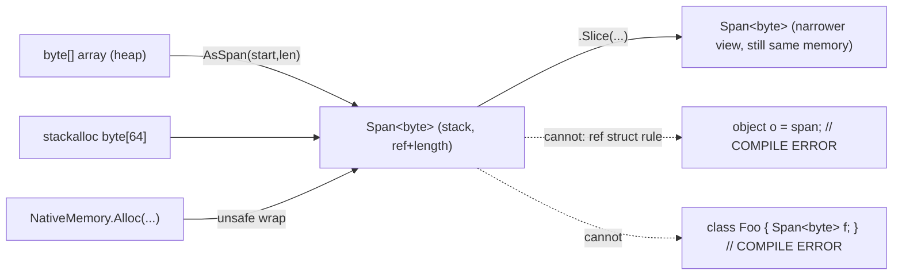
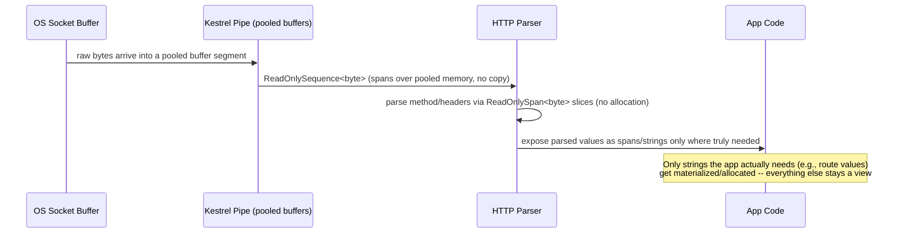
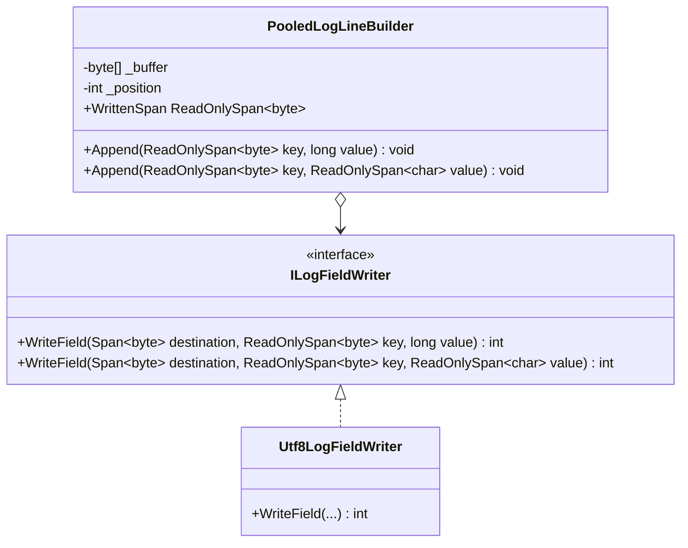
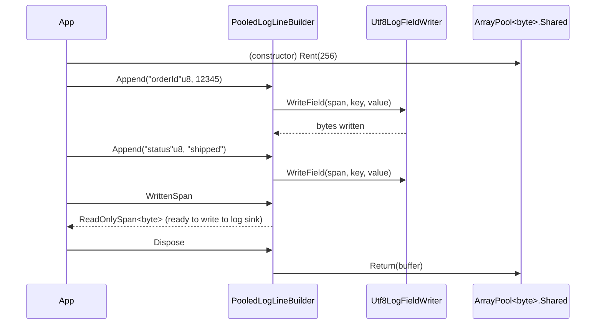

# Module 3 — C# Advanced: `Span<T>`, `Memory<T>` & Low-Allocation Code Patterns

> Domain: C# | Level: Beginner → Expert | Prerequisite: [[01-CLR-JIT-GC-Memory-Management]] (stack vs heap, GC pressure, LOH), [[02-Async-Await-Internals]] (why `Span<T>` cannot be used across `await`)

---

## 1. Topic Description

### Definition

`Span<T>` is a **`ref struct`** holding a reference to the start of a contiguous block of memory plus a length — a *view* over an array, a `stackalloc` buffer, a string or native memory, not a container. It lets code slice and pass parts of a buffer with zero copying and zero allocation while keeping bounds checking and type safety, which previously required either copying (`Substring`, `Array.Copy`) or `unsafe` pointers. `Memory<T>` is the heap-storable counterpart for cases where the view must outlive a stack frame. Together with pooling and `ref`-based copy avoidance, these form the low-allocation programming model used throughout Kestrel, `System.Text.Json` and the BCL's parsing and formatting paths.

### Core sub-concepts

- **`Span<T>` / `ReadOnlySpan<T>`** — stack-only views; slicing without copying; uniform access over array, stack and native memory.
- **The `ref struct` constraint** — no fields on classes, no boxing, no capture in lambdas, no crossing an `await` or `yield`; each restriction is a lifetime guarantee.
- **`Memory<T>` / `ReadOnlyMemory<T>` and `IMemoryOwner<T>`** — heap-storable views, `.Span` materialisation, and explicit buffer ownership.
- **`stackalloc`** — stack allocation, the small-constant threshold pattern, and stack overflow as an uncatchable process kill.
- **`ArrayPool<T>` / `MemoryPool<T>`** — rent/return discipline, over-delivered lengths, `clearArray`, `Shared` versus a custom bounded pool.
- **Copy avoidance with `ref` semantics** — `readonly struct`, `in` parameters and defensive copies, `ref readonly`.
- **Non-contiguous buffers** — `ReadOnlySequence<T>`, segment boundaries, and `System.IO.Pipelines` with its `consumed`/`examined` model and built-in backpressure.
- **UTF-8-first formatting** — `Utf8Formatter`/`Utf8Parser`, `ISpanFormattable.TryFormat`, `string.Create`, `u8` literals, and interpolated-string handlers.
- **Reinterpretation** — `MemoryMarshal`, `Unsafe`, and the endianness/alignment hazards they carry.
- **Vectorised search** — `SearchValues<T>` and SIMD-backed `IndexOfAny`.

### Where it fits

This sits directly above the allocator: it is the toolkit for *not creating work for the collector*, so its value is entirely defined by the GC behaviour covered in `01-CLR-JIT-GC-Memory-Management`. It interacts sharply with async — spans cannot cross an `await`, which is why `Memory<T>` exists — and it is the mechanism behind AOT-friendly, reflection-free serialisation. Architecturally it belongs in a narrow, benchmarked, owned layer, with ordinary code on either side of it.

### Why it matters at scale

Used correctly on a genuinely hot path, it removes an entire category of work: fewer bytes allocated per request means lower gen0 rates, less promotion, smaller memory headroom requirements and often a smaller instance size across the fleet. Used incorrectly it is worse than doing nothing — a use-after-return bug on a pooled buffer produces cross-request data corruption that is load-dependent, unreproducible, and in a multi-tenant system a confidentiality incident rather than a performance one. A `stackalloc` sized from untrusted input is a remote process kill with no catchable exception and no telemetry.

### Common pitfalls / anti-patterns

- **`stackalloc` with a caller-controlled length** — a request field claiming a huge size becomes a stack overflow, which kills the process outright rather than throwing.
- **Renting from `ArrayPool` without `try`/`finally`, or using the buffer after returning it** — the buffer is handed to another caller while still referenced, producing intermittent cross-request data corruption.
- **Trusting `array.Length` on a rented buffer** — `Rent(n)` returns *at least* n, so the tail holds another caller's data and the logical length must be tracked separately.
- **Applying `in` to a non-`readonly struct`** — the compiler inserts a defensive copy on every member access, making the "optimisation" slower than passing by value.
- **Exposing `Memory<T>` in a public API without an ownership contract** — nothing stops a consumer holding it after the underlying buffer is pooled or disposed.
- **Rewriting readable LINQ into span loops without a profile** — spends permanent readability on a path that was never a measurable share of request time, and typically reintroduces edge-case bugs the BCL handled.

> Scope note: GC generations, LOH and pinning mechanics belong to `01-CLR-JIT-GC-Memory-Management`; async state machines and `ValueTask` to `02-Async-Await-Internals`; LINQ operator allocation and deferred execution to `05-LINQ-Internals`.

---

## 2. Beginner (10 Q&A)

**Q1. What's the difference between these two, and why does it matter?**
```csharp
string a = text.Substring(10, 5);
ReadOnlySpan<char> b = text.AsSpan(10, 5);
```
**A:** The first allocates a new string and copies five characters. The second allocates nothing — it's a reference to position 10 in the existing string plus a length. On a parsing path that runs millions of times, that's the difference between constant gen0 churn and none. The catch is the span can't outlive the frame it's in, so you can't return it from an async method or store it in a field.
*Follow-up: Why can't a `Span<T>` be a field on a class?*

**Q2. Why won't this compile?**
```csharp
async Task ProcessAsync(byte[] data) {
    Span<byte> s = data;
    await _sink.WriteAsync(data);
    s[0] = 1;
}
```
**A:** `Span<T>` is a `ref struct` — stack-only. An async method's locals get lifted into a state machine on the heap when it suspends, and a span can't live on the heap because it may point at the stack. So the compiler rejects a span local that's alive across an `await`. That's the language telling you your lifetime assumption is wrong; use `Memory<byte>` and take `.Span` at the point of synchronous use.
*Follow-up: What does `.Span` on a `Memory<T>` actually cost?*

**Q3. What's the danger here?**
```csharp
Span<byte> buffer = stackalloc byte[request.Length];
```
**A:** `request.Length` is caller-controlled. A request claiming a huge length blows the stack, and stack overflow is not a catchable exception in .NET — the process dies immediately, with no graceful degradation and no telemetry. That's a remote crash primitive on a public endpoint. The safe pattern is a small constant threshold: `stackalloc` below it, rent from `ArrayPool<T>` above it.
*Follow-up: What's a sensible threshold, and why is `stackalloc` inside a loop dangerous even at a small size?*

**Q4. Review this.**
```csharp
var buf = ArrayPool<byte>.Shared.Rent(1024);
Process(buf, 1024);
ArrayPool<byte>.Shared.Return(buf);
```
**A:** Three problems. No `try`/`finally`, so an exception in `Process` leaks the buffer permanently. `Rent(1024)` can return a *larger* array, so passing `1024` is right here but `buf.Length` would have been wrong — you must track the logical length yourself. And if that buffer held tenant data, it goes back to the pool with the data still in it for the next renter to read; return with `clearArray: true` or clear it yourself.
*Follow-up: What actually happens if you use the buffer after returning it, and why is that so hard to reproduce?*

**Q5. When do you use `Memory<T>` instead of `Span<T>`?**
**A:** When the buffer has to be stored or survive an `await` — a field on a class, a queued work item, a parameter to an async method. `Memory<T>` is a normal struct so it can live on the heap; you convert to `Span<T>` at the point of synchronous use. The usual shape is `Memory<T>` for plumbing and ownership, `Span<T>` for the tight synchronous work inside — and take the `.Span` once outside a loop rather than per iteration.
*Follow-up: Who owns the lifetime of the buffer behind a `Memory<T>`?*

**Q6. Does using `Span<T>` make code faster?**
**A:** Not intrinsically — it makes code allocate less and copy less. If the path wasn't allocation- or copy-bound, converting it changes nothing measurable while making it harder to read. Spans also add a bounds check per access, though the JIT often eliminates those in simple loops. So the honest answer is that it removes a category of work, and whether removing that category matters depends entirely on whether it was a meaningful share of the profile.
*Follow-up: Name a case where converting to spans measurably hurt.*

**Q7. What is `ReadOnlySequence<T>` and why does it exist?**
**A:** Data that's logically contiguous but physically split across buffer segments — which is exactly what comes off a socket, where one message arrives across several reads. `Span<T>` can't express that because it requires contiguity. It's the currency of `System.IO.Pipelines`, and its existence is why a production parser has to handle a value straddling a segment boundary rather than assuming a whole message is present.
*Follow-up: How do you parse a fixed-length header that spans two segments without copying the whole sequence?*

**Q8. What's the trap with `in` parameters?**
```csharp
public void Process(in Matrix4x4 m) { var x = m.M11; }
```
**A:** `in` passes by readonly reference to avoid copying a large struct — but if the struct isn't declared `readonly`, the compiler inserts a *defensive copy* on every member access, because it can't prove the member won't mutate. So `in` on a non-readonly struct can be slower than passing by value. That's a silent pessimisation that only shows up in a profile. Mark the struct `readonly` and the copies disappear.
*Follow-up: How large does a struct need to be before `in` is worth considering at all?*

**Q9. How does `Span<T>` interact with strings?**
**A:** A `string` is immutable contiguous UTF-16, so `AsSpan()` gives you a `ReadOnlySpan<char>` for free and slicing it allocates nothing where `Substring` would. That's why parsing code should take `ReadOnlySpan<char>` rather than `string` — a caller can pass a slice of a much larger buffer without materialising it. You only ever get `ReadOnlySpan<char>`, never `Span<char>`, because mutating an interned string would be a disaster.
*Follow-up: Where does `string.Create` fit in?*

**Q10. What does `System.IO.Pipelines` give you over a `Stream` and a byte array?**
**A:** Pooled buffers, built-in backpressure so the writer is throttled when the reader falls behind, and correct handling of partial messages — so you stop hand-writing "did I get a whole frame yet" buffer-shuffling code. The classic `Stream` pattern allocates a buffer per read, copies on resize, and leaks subtle framing bugs at boundaries. It's what Kestrel uses. Reach for it for high-throughput protocol parsing, not ordinary application I/O where a `Stream` is simpler and perfectly adequate.
*Follow-up: What do `consumed` and `examined` mean in `AdvanceTo`, and what breaks if you get them wrong?*

---

## 3. Intermediate (10 Q&A)

**Q1. You're asked to make a hot JSON-parsing path allocation-free. How do you decide whether that's even the right goal?**
**A:** Establish that allocation is actually the cost first — `MemoryDiagnoser` for bytes per operation, GC counters to see whether that allocation is translating into collection pressure or promotion. Very often the parse allocates in gen0, dies immediately, and costs almost nothing, while the real time is I/O or downstream object mapping. If it is material, the cheap wins come first: use `Utf8JsonReader` over the raw bytes instead of deserialising to intermediate objects, avoid materialising strings for fields you only compare, pool the buffers. Rewriting the whole path into spans is the last step, not the first.
*Follow-up: The benchmark shows 4 KB allocated per parse. Is that a problem?*

**Q2. Write me the buffer pattern for a method that needs a scratch buffer of caller-determined size.**
**A:** Threshold: below a small constant, `stackalloc`; above it, rent from `ArrayPool<T>` and slice to the exact logical length. The rented path goes in `try`/`finally` so an exception can't leak it, and you track the length separately because `Rent` over-delivers. The threshold exists precisely *because* the size is caller-controlled — an unbounded `stackalloc` is a crash primitive. This shape appears throughout the BCL for exactly this reason.
*Follow-up: What changes if the method is async?*

**Q3. What's the most damaging `ArrayPool` bug you'd expect to see?**
**A:** Use-after-return — a buffer goes back to the pool while some other object still holds a `Memory<T>` over it, and later that memory is handed to an unrelated caller. It shows up as data corruption that looks impossible: one request seeing fragments of another's payload, intermittent, unreproducible, and load-dependent because it needs the pool to actually recycle. In a multi-tenant system that's a confidentiality incident, not a bug. Prevention is strict ownership — exactly one component owns rent-and-return, and no rented buffer escapes that scope without a documented handover.
*Follow-up: How would you catch that class of bug in test rather than production?*

**Q4. When would you write your own pool instead of using `ArrayPool<T>.Shared`?**
**A:** When you need buffers larger than the shared pool's maximum, when you want a bounded number of retained buffers for predictable memory rather than the shared pool's heuristics, or when you want isolation so a noisy component can't evict another's buffers. The trade is that a custom pool is memory you now own — an unbounded one is a leak with a friendly name — so only with a measured reason and an explicit cap.
*Follow-up: How do you size the cap, and what metric tells you it's wrong?*

**Q5. When would you *not* use `Span<T>` even on a path that allocates?**
**A:** When the allocation isn't on a hot path; when the surrounding code is async, because spans can't cross an `await` and you'd be restructuring for no benefit; when the code will be maintained by people who'll fight the `ref struct` rules; and in public API surfaces consumers will find hard to satisfy. `Span<T>` is a hot-path tool — applying it to warm or cold paths spends readability, which is the scarcer resource in a long-lived codebase.
*Follow-up: A team has adopted spans throughout their service layer. What would you look at before asking them to revert?*

**Q6. How would you eliminate the intermediate strings here?**
```csharp
var msg = "Order " + id + " total " + amount.ToString("C");
socket.Send(Encoding.UTF8.GetBytes(msg));
```
**A:** Format directly into a buffer instead of composing strings — `TryFormat`/`ISpanFormattable` writing into a `Span<char>`, or `Utf8Formatter` straight into a `Span<byte>` since the sink is UTF-8 anyway. Staying in UTF-8 end to end skips the transcoding entirely, which is what `u8` literals and the `Utf8` APIs are for. Worth saying though: in most services the biggest realistic win isn't this at all — it's interpolated log messages being built for levels that get filtered out.
*Follow-up: How do interpolated-string handlers solve that logging case?*

**Q7. How do you benchmark low-allocation changes credibly?**
**A:** BenchmarkDotNet with `MemoryDiagnoser` against a committed baseline on the same hardware — and benchmark the *realistic input distribution*, because span optimisations often win on large inputs and lose on the small ones that dominate production. Microbenchmarks alone aren't enough: they miss GC effects that only appear under sustained allocation, so pair them with a load test watching gen0/gen2 rates and pause times. The failure I see most is a 40% improvement on a path representing 2% of request time, presented as a 40% service improvement.
*Follow-up: Your benchmark says zero bytes allocated but the service's gen0 rate is unchanged. What happened?*

**Q8. What's the risk of exposing `Span<T>` or `Memory<T>` in a public library API?**
**A:** You're exposing a lifetime contract the type system only partly enforces. `Span<T>` is safe because the compiler stops you storing it, but it makes your API unusable from async callers — a significant constraint to impose. `Memory<T>` is the dangerous one: nothing stops a consumer holding it after the buffer is returned to a pool. So either document ownership rigorously, or have the API own the buffer and hand back an `IMemoryOwner<T>`. For most libraries the balanced choice is accepting `ReadOnlySpan<T>` for input and returning owned results.
*Follow-up: `IMemoryOwner<T>` or return an array the caller must return to a pool — which for a public API?*

**Q9. You see `MemoryMarshal.Cast<byte, MyStruct>` in a PR parsing a network frame. What do you ask?**
**A:** Whether the struct's layout is explicit and whether endianness is handled, because this reinterprets raw bytes as a struct and both assumptions hold on your dev machine and break on ARM or on a big-endian peer. Also whether the input length is validated before the cast, and whether there are tests with malformed and truncated frames. `MemoryMarshal` is legitimate in a tightly-scoped codec — it's safer than raw `unsafe` — but it needs a comment stating the invariant and tests that would catch the invariant breaking.
*Follow-up: How would you fuzz a span-based binary parser, and what would you assert?*

**Q10. A colleague replaced readable LINQ with span loops and reports a 3x microbenchmark win. Response?**
**A:** Ask what share of end-to-end request time that path represents — a 3x win on 1% of the profile is a rounding error bought with permanent readability cost. Then check the input distribution matches production, and that the new code handles the edge cases LINQ got for free: empty sequences, boundary slices, culture-sensitive comparisons. If the path genuinely is hot and the win is real, isolate it behind a well-named method with thorough tests and a comment recording *why* the readable version was rejected — otherwise someone simplifies it back in six months.
*Follow-up: How do you stop that optimisation being silently reverted?*

---

## 4. Expert / Architect (10 Q&A)

**Q1. When is a low-allocation rewrite the right architectural answer, and when is it the expensive wrong one?**
**A:** Right when live evidence says GC pressure or copying is a leading cost — high gen2 rates traceable to LOH buffer churn, pause times consuming a real share of a tight latency budget, per-request bytes scaling with payload size on a high-throughput path. Wrong when the actual constraint is downstream latency, database round-trips, serialisation format or an N+1 pattern, all of which are far more common and much cheaper to fix. My rule: a low-allocation programme needs a profile naming it as a top-two cost, a bounded scope, and an owner — otherwise a team spends a quarter saving microseconds on a millisecond-scale problem, which is a leadership failure rather than an engineering one.
*Follow-up: How do you present that to a director who's already been promised a "performance rewrite"?*

**Q2. How do you introduce these techniques to a team without creating a maintenance liability?**
**A:** Contain it deliberately: one well-chosen hot path, done properly, with benchmarks committed alongside and a written rationale, so the team has a concrete reference rather than a slogan. Keep the techniques behind clean ordinary-looking APIs so the rest of the codebase doesn't need to know — the parser takes `ReadOnlySpan<char>` internally while the service layer still sees normal types. Reviews for that code need a specific checklist (return-in-finally, no caller-controlled `stackalloc`, clear pooled buffers, no escaping `Memory<T>`), because ordinary review doesn't catch these. And set the expectation explicitly that this is a permanent small minority of the codebase, not a new house style.
*Follow-up: A year later half the codebase uses spans and velocity has dropped. What went wrong?*

**Q3. In a multi-tenant service, what's the security dimension of buffer pooling?**
**A:** Pooled buffers are shared mutable state crossing tenant boundaries, so a correctness bug becomes a confidentiality bug — a buffer returned with tenant A's data and rented by tenant B leaks it unless cleared or fully overwritten. The subtlety is that "fully overwritten" is easy to get wrong, because `Rent` returns a longer array than requested and the tail keeps old contents. In a regulated or multi-tenant context my position is that pooled buffers carrying customer data are cleared on return by policy, and the cost is accepted as a control — which is also far easier to defend in an audit than a per-site performance argument.
*Follow-up: Clearing large buffers is measurably expensive. How would you scope that?*

**Q4. How do you stop allocation regressions creeping back into an optimised path over years?**
**A:** Encode the requirement rather than the intent: `MemoryDiagnoser` benchmarks in CI against a committed baseline, failing the build when allocated-bytes-per-operation exceeds a threshold, so the guarantee is enforced by the pipeline rather than by memory. Keep those benchmarks small and stable to limit CI noise, and require any threshold change to be an explicit reviewed commit with a reason. Complement with production GC counters alerting on rate-of-change, which catches regressions the benchmark's inputs miss. And name an owner — an unowned gate gets disabled the first time it goes red on a Friday.
*Follow-up: The benchmark is flaky on shared CI runners. What do you change rather than deleting it?*

**Q5. You're designing internal contracts for a high-throughput market-data pipeline. How does buffer ownership shape that?**
**A:** Ownership has to be explicit at every boundary, because with pooled buffers the dangerous question is always "who returns this, and when is everyone finished". I'd define single-owner handoff: a stage either consumes a buffer and returns it, or transfers ownership onward and never touches it again. No shared ownership, and no fanning the same buffer out to multiple consumers unless it's immutable and reference-counted — which I'd avoid unless forced. Where a consumer needs data beyond the handoff, it copies deliberately, because a copy is far cheaper than an intermittent cross-message corruption. And I'd write that contract down, because it's the invariant new contributors will otherwise violate.
*Follow-up: One stage is slow and needs to hold buffers longer. How do you handle that without unbounded pool growth?*

**Q6. When should a component drop to `unsafe` or `MemoryMarshal`, and how do you govern it?**
**A:** Only where a specific measured need can't be met by safe APIs — a hot binary codec, an interop boundary, a vectorised routine the JIT won't produce — and then `MemoryMarshal` and the `Unsafe` helpers before genuine `unsafe` blocks, since those preserve more checking. Governance matters more than the decision: isolate it in a small clearly-named assembly, two reviewers, tests including adversarial inputs, fuzzing if it parses untrusted data, and comments stating the invariants assumed. `AllowUnsafeBlocks` enabled per project, never globally, so its spread shows up in a diff.
*Follow-up: How would you fuzz that codec, and what would you assert beyond "doesn't crash"?*

**Q7. What's the cost argument for low-allocation work at fleet scale, and how do you make it to finance?**
**A:** Reduced allocation lowers GC CPU and memory headroom, which translates into smaller instances or higher density — a fleet running at 60% memory because of buffer churn can often run at 35%, and that's a real line item. To make it credibly: quantify current cost, run the change on a canary tier, and measure the achievable instance-size or replica reduction rather than quoting a microbenchmark. The honest counter I'd present is engineering cost — several engineer-weeks plus permanent maintenance drag — so the saving must be recurring and material. For a small fleet, a smaller instance type or an obvious caching fix usually returns more for far less.
*Follow-up: The change saves 12% memory across 200 instances. Worth two engineer-months?*

**Q8. `System.IO.Pipelines` or `Stream` for a new protocol implementation?**
**A:** Pipelines when you own the framing of a high-throughput binary or text protocol: pooled buffers, backpressure, and correct handling of messages split across reads — precisely the code teams get wrong by hand. What the team inherits is a genuinely harder programming model — `ReadOnlySequence<T>`, the `consumed`/`examined` distinction, and failures that show up as a stalled connection rather than an exception — so it needs people who'll still be around to debug it. For an ordinary HTTP service, `Stream` and the framework's parsing are right and Pipelines is over-engineering. I'd decide on message rate and framing complexity, and insist on an integration suite that fragments input at every byte boundary.
*Follow-up: A Pipelines connection hangs under load with no exception. Where do you look first?*

**Q9. How do these techniques change under NativeAOT or a hard memory limit?**
**A:** More valuable and more constrained simultaneously. More valuable because a tight memory limit turns allocation rate directly into collection frequency, so reducing bytes-per-request buys headroom you can't buy with configuration. More constrained because AOT removes runtime code generation, so reflection-based serialisation fallbacks must become source generators — which happens to align well with span-based generated formatters. Stack sizes matter more in constrained or heavily-threaded environments too, making unbounded `stackalloc` even less acceptable. I'd treat "works under a hard heap limit" as an explicit test scenario rather than an assumption.
*Follow-up: What would you add to CI to prove the service behaves correctly at half its normal memory limit?*

**Q10. A principal engineer proposes rewriting the shared serialisation library to be allocation-free. How do you evaluate it?**
**A:** Ask what problem it solves for consumers, measured end to end — a shared library's cost is amortised across many services, so a genuine win is leveraged, and so is a genuine regression or a breaking API change. The specific risks: span-based APIs are viral and may force async consumers into awkward shapes, ownership contracts leak into every caller, and a shared library is the worst place to introduce use-after-return bugs because the blast radius is the whole estate. I'd want a prototype benchmarked against two or three real consumer workloads, a compatibility story that doesn't force a big-bang migration, and a long-term owner. If the honest projection is single-digit percent for most consumers, I'd decline and say so plainly — shared-library rewrites are where good engineers spend quarters producing very little.
*Follow-up: The prototype shows 40% for one high-volume consumer and nothing for the other twenty. Recommendation?*

---

## 5. Reference Material

> Retained from the original module: deep-dive internals, diagrams, production examples, exercises, system/low-level design, debugging walkthroughs and the Principal Engineer perspective.

### 1. Fundamentals

#### What is `Span<T>`?
`Span<T>` is a **ref struct** (a stack-only value type) that represents a **contiguous, type-safe view over memory** — memory that can live on the stack, on the managed heap, or even in unmanaged/native memory — without copying it and without allocating a wrapper object for the common case. It's `{ ref T reference; int length; }` under the hood: a pointer-like reference plus a length, bounds-checked on every access.

`Memory<T>` is its **heap-safe counterpart**: not a `ref struct`, so it can be stored in a class field, captured in a closure, passed across `await` boundaries, and boxed — at the cost of an extra indirection (`.Span` must be materialized to actually read/write through it).

#### Why do they exist?
Before `Span<T>` (introduced.NET Core 2.1 / C# 7.2), any operation that needed "a slice of an array/string" had exactly one option: **allocate a new array/string** (`Substring`, `Array.Copy` into a new array, `Skip.Take` via LINQ). Every parse, every slice, every sub-buffer operation paid a heap allocation — a direct tax on GC pressure for something that is conceptually just "a window into memory I already have."

`Span<T>` lets you slice, parse, and pass around views into existing memory — arrays, `stackalloc` buffers, native/unmanaged memory, or a segment of a string (`ReadOnlySpan<char>`) — with **zero additional allocation**, while still being bounds-checked and type-safe (unlike raw pointers).

#### When does this matter?
- **High-throughput parsing** (HTTP header parsing, JSON/CSV parsing, protocol buffers, log processing) — the textbook use case; ASP.NET Core's own Kestrel server and `System.Text.Json` are built on `Span<T>` internally.
- **Hot paths identified by profiling** as allocation-bound — this is an *optimization* tool, not a default style choice for ordinary CRUD/business logic where clarity matters more.
- **Interop scenarios** — working with native buffers (P/Invoke) safely without `unsafe` pointer arithmetic everywhere.
- **NOT** for: async methods' local state across an `await` (compiler-enforced — `ref struct` cannot be a field of a heap-allocated state machine), long-lived storage (use `Memory<T>` instead), or ordinary application code where the allocation isn't measured to matter.

#### How does it work (30,000-ft view)?

```
string s = "Hello, World!";
ReadOnlySpan<char> slice = s.AsSpan(7, 5); // "World" -- NO new string allocated
 // slice is just {ref to s's internal char at index 7, length 5}

int[] arr = { 1, 2, 3, 4, 5 };
Span<int> mid = arr.AsSpan(1, 3); // {2, 3, 4} -- a view, not a copy
mid[0] = 99; // mutates arr[1] directly -- it's the SAME memory
Console.WriteLine(arr[1]); // 99
```

Mental model for interviews: **"`Span<T>` is a view, not a copy. Mutating through it mutates the original."** This is simultaneously its main performance win and its main correctness hazard if misunderstood.

### 2. Deep Dive

#### 2.1 Why `Span<T>` Must Be a `ref struct`

A `Span<T>` can point at **stack memory** (via `stackalloc`) or memory that only the runtime knows might move (managed heap objects during GC compaction — handled internally by the runtime's tracked-reference machinery). If `Span<T>` could be:
- **Boxed** (assigned to `object`) → it could outlive the stack frame it pointed into → dangling reference. **Forbidden.**
- **A field of a normal (non-ref) class** → same problem, since a class instance's lifetime isn't tied to the stack frame that created the `Span`. **Forbidden.**
- **Captured in a lambda closure or used across an `await`** → the closure/state machine is (potentially) heap-allocated, same danger. **Forbidden — this is exactly why you cannot use `Span<T>` in an `async` method body across an `await` point.**

The C# compiler enforces all of this at **compile time** via the `ref struct` rule — this is a purely compile-time safety mechanism with zero runtime cost, one of the more elegant pieces of the CLR/C# type system to know cold for interviews.

#### 2.2 `Span<T>` vs `Memory<T>` vs `ReadOnlySpan<T>` vs `ReadOnlyMemory<T>`

| Type | Stack-only (`ref struct`)? | Can cross `await`/be a field? | Mutable? | Typical use |
|---|---|---|---|---|
| `Span<T>` | Yes | No | Yes | Synchronous hot-path parsing/slicing with mutation |
| `ReadOnlySpan<T>` | Yes | No | No | Synchronous hot-path parsing/slicing, read-only (e.g., string slices) |
| `Memory<T>` | No | Yes | Yes (via `.Span`) | Buffers that must survive across `await` or be stored as fields |
| `ReadOnlyMemory<T>` | No | Yes | No | Same as above, read-only (e.g., what `string.AsMemory` returns) |

**Pattern**: An API that needs to work both synchronously (fast path, no allocation) and asynchronously (must store the buffer across an `await`) typically exposes a `Memory<T>` parameter, then calls `.Span` internally right before the actual synchronous read/write — e.g., `Stream.ReadAsync(Memory<byte> buffer,...)` in modern.NET.

#### 2.3 `stackalloc` and Bounds Safety

```csharp
Span<int> buffer = stackalloc int[128]; // allocated on the CURRENT method's stack frame
```
- Prior to `Span<T>`, `stackalloc` required an `unsafe` context and returned a raw `int*` with **no bounds checking** — a direct buffer-overrun risk.
- With `Span<T>`, `stackalloc` can be wrapped in a `Span<T>` in **safe** code — every access is bounds-checked (throws `IndexOutOfRangeException` on violation), eliminating the classic C-style stack-buffer-overrun vulnerability class while keeping the zero-allocation, zero-GC-involvement benefit.
- **Danger**: stack space is small (default ~1MB/thread) and not GC-tracked — a `stackalloc` sized by untrusted/attacker-controlled input (e.g., `stackalloc byte[userProvidedLength]`) is a **stack-overflow-as-DoS** vector (Security). Always cap the size with a compile-time-known or validated maximum, falling back to `ArrayPool<T>.Shared.Rent(...)` for larger/variable sizes.

#### 2.4 How Slicing Avoids Allocation — the Actual Mechanics

`someArray.AsSpan(start, length)` constructs a `Span<T>` containing:
1. A **managed pointer** (`ref T`, not a raw pointer — this is tracked by the GC so it updates correctly if the object moves during compaction) to `someArray[start]`.
2. An `int Length = length`.

No new array is allocated; no elements are copied. Indexing `span[i]` computes `ref + i * sizeof(T)` and bounds-checks against `Length` — genuinely as fast as raw array indexing in the JIT-optimized case (Tier 1/PGO can often elide the redundant bounds check entirely when it can prove safety, e.g., in a simple `for (int i = 0; i < span.Length; i++)` loop).

#### 2.5 `ArrayPool<T>` — the Pooling Partner

`Span<T>`/`Memory<T>` solve the "avoid allocation when *slicing existing memory*" problem. They do **not** solve "avoid allocation when you need a *new* buffer" (e.g., a scratch buffer for a parse operation, a temporary encode/decode buffer). That's what **`ArrayPool<T>.Shared`** is for:

```csharp
byte[] buffer = ArrayPool<byte>.Shared.Rent(4096); // may return a LARGER array than requested
try
{
    int written = FillBuffer(buffer.AsSpan(0, 4096)); // must respect requested size, not buffer.Length
    Process(buffer.AsSpan(0, written));
}
finally
{
    ArrayPool<byte>.Shared.Return(buffer, clearArray: true); // clearArray matters if it held sensitive data
}
```
- `Rent` may return an array **larger** than requested (pool buckets are sized in powers of two internally) — always slice to the size you actually asked for, don't assume `buffer.Length == requested size`.
- `Return` should specify `clearArray: true` when the buffer held sensitive data (credentials, PII) — otherwise the returned array's old contents remain in memory, retrievable by whoever rents it next (a real security consideration).
- Not calling `Return` isn't a "leak" in the GC sense (the array is still a normal, collectible object) — it just defeats the purpose of pooling, forcing the pool to allocate a fresh array for the next `Rent`.

#### 2.6 `Span<T>` and the JIT — Zero-Cost Abstraction, Mostly

The JIT recognizes `Span<T>`/`ReadOnlySpan<T>` patterns specially:
- **`ReadOnlySpan<byte>` over a UTF-8 string literal** (`"hello"u8` syntax, C# 11+) compiles to a reference directly into the assembly's static data section — genuinely zero runtime allocation, zero copy, resolved entirely at compile time.
- Simple `Span<T>` loops are inlined and bounds-checks elided by Tier 1/PGO when provably safe, making `Span<T>`-based code perform on par with raw array/pointer code in the steady state — the "abstraction" costs effectively nothing once JIT-optimized, which is *not* generally true of, say, `IEnumerable<T>`/LINQ abstractions (those retain real virtual-dispatch/iterator overhead even after full optimization).


```mermaid
graph LR
 A["byte[] array (heap)"] -->|"AsSpan(start,len)"| B["Span&lt;byte&gt; (stack, ref+length)"]
 C["stackalloc byte[64]"] --> B
 D["NativeMemory.Alloc(...)"] -->|"unsafe wrap"| B
 B -->|".Slice(...)"| E["Span&lt;byte&gt; (narrower view, still same memory)"]
 B -.->|"cannot: ref struct rule"| F["object o = span; // COMPILE ERROR"]
 B -.->|"cannot"| G["class Foo { Span&lt;byte&gt; f; } // COMPILE ERROR"]
```

### 3. Visual Architecture

#### Memory View Hierarchy (ASCII)

```
               ┌───────────────────────────────────────────┐
               │ Underlying Memory                         │
               │ (array on heap | stackalloc | native buf) │
               └───────────────────────────────────────────┘
                      ▲                ▲               ▲
               view (no copy)   view (no copy)   view (no copy)
                      │                │               │
        ┌────────────────┐  ┌──────────────────┐  ┌────────────────┐
        │ Span<T>        │  │ ReadOnlySpan<T>  │  │ Memory<T>      │
        │ (stack only)   │  │ (stack only)     │  │ (heap-safe,    │
        │ mutable        │  │ read-only        │  │ field/await-   │
        │                │  │                  │  │ safe)          │
        └────────────────┘  └──────────────────┘  └───────┬────────┘
                                                          │ .Span
                                                          ▼
                                                  ┌──────────────────────┐
                                                  │ Span<T> materialized │
                                                  │ right before use     │
                                                  └──────────────────────┘
```

#### Data Flow — Zero-Allocation Request Parsing (Kestrel-style)


```mermaid
sequenceDiagram
 participant Socket as OS Socket Buffer
 participant Kestrel as Kestrel Pipe (pooled buffers)
 participant Parser as HTTP Parser
 participant App as App Code

 Socket->>Kestrel: raw bytes arrive into a pooled buffer segment
 Kestrel->>Parser: ReadOnlySequence<byte> (spans over pooled memory, no copy)
 Parser->>Parser: parse method/headers via ReadOnlySpan<byte> slices (no allocation)
 Parser->>App: expose parsed values as spans/strings only where truly needed
 Note over App: Only strings the app actually needs (e.g., route values)<br/>get materialized/allocated -- everything else stays a view
```

### 4. Production Example

#### Scenario: High-frequency market-data ingestion service (FIX protocol parser)

**Problem**: A trading-adjacent service parsing FIX protocol messages (pipe-delimited key=value pairs over TCP, tens of thousands of messages/sec) showed `% Time in GC` around 18% and Gen 0 collections happening several times per second under peak feed volume, contributing directly to tail-latency violations on a strict sub-millisecond internal SLA.

**Investigation**:
- `dotnet-trace` + allocation sampling (`dotnet-trace collect --profile gc-verbose`) showed the majority of allocations were `string` objects from `message.Split('\x01')` (FIX's SOH delimiter) followed by `.Split('=')` on each field — classic `string.Split` allocates a new `string[]` **and** a new `string` per token, for every single field of every single message.
- A secondary allocation source: `int.Parse`/`decimal.Parse` overloads being called on already-split `string` tokens — an unavoidable-seeming cost that turned out to have a zero-allocation alternative.

**Architecture fix**:
- Replaced `string.Split` with manual `ReadOnlySpan<char>` scanning: `message.AsSpan`, then iterating and slicing on delimiter positions found via `IndexOf`/`Slice` — no intermediate `string[]`, no per-token `string` allocation for fields that only need numeric parsing.
- Used `int.Parse(ReadOnlySpan<char>)`/`decimal.Parse(ReadOnlySpan<char>)` overloads (available since.NET Core 3.0+) directly on the sliced spans — parses numbers straight out of the original buffer with zero intermediate string allocation at all.
- For the handful of fields that *did* need to become real `string`s (e.g., a symbol ticker cached in a dictionary key), those specific slices were the only ones materialized via `.ToString` — allocation reduced from "every field, every message" to "only the few fields that truly need to persist as strings."
- Backing buffer for incoming socket data came from `ArrayPool<byte>.Shared` (rented once per connection buffer refill, not per message), with the parser operating on `ReadOnlySpan<byte>`/`ReadOnlySpan<char>` views into it.

**Trade-offs**: The manual span-scanning parser is measurably less readable than `string.Split` + LINQ — the team documented the parser heavily and isolated it behind a small, well-tested interface (`IFixMessageParser`) so the complexity is contained to one file, not spread through the codebase. Accepted because this specific path was proven (via profiling, not guesswork) to be the dominant GC-pressure contributor.

**Lessons learned**:
1. `string.Split` is a hidden, easy-to-miss allocation hotspot in any text-parsing hot path — always suspect it first when profiling shows string-dominated allocations in a parsing service.
2. `Span<T>`-based numeric parsing (`int.Parse(ReadOnlySpan<char>)`) is a direct drop-in replacement with zero API-shape cost once you already have a span — there's rarely a reason not to use it once you're already in span-based code.
3. Optimize surgically: only the fields that must become long-lived `string`s should ever pay that allocation — everything else can stay a transient view.
4. Contain the complexity: low-allocation code is real complexity debt — isolate it behind clear interfaces so it doesn't spread as a "style" into code that doesn't need it.

### 11. Coding Exercises

#### Easy — Replace `Substring`-based parsing with `Span<char>`
**Problem**: Parse a `"key=value"` string without allocating intermediate substrings.
```csharp
// Before: allocates 2 new strings every call
(string Key, string Value) ParseKvp(string input)
{
    int idx = input.IndexOf('=');
    return (input.Substring(0, idx), input.Substring(idx + 1));
}
```
**Solution**:
```csharp
(ReadOnlySpan<char> Key, ReadOnlySpan<char> Value) ParseKvp(ReadOnlySpan<char> input)
{
    int idx = input.IndexOf('=');
    return (input[..idx], input[(idx + 1)..]);
}
// Caller materializes to string ONLY if/when it truly needs to persist the value:
var (keySpan, valueSpan) = ParseKvp("timeout=30".AsSpan);
if (int.TryParse(valueSpan, out int timeoutSeconds)) { /* zero-allocation numeric parse */ }
```
**Time complexity**: O(n) either way (n = string length). **Space**: Original allocates 2 strings/call; span version allocates 0 for the parse itself (only if/when the caller explicitly calls `.ToString`).
**Optimized**: Already optimal for this shape; if called across millions of invocations, verify with BenchmarkDotNet that Gen 0 allocations/op dropped to 0 for the parse path.

#### Medium — Zero-allocation CSV line tokenizer using `Span<T>`
**Problem**: Tokenize a single CSV line (no quoted-field support needed for this exercise) into fields without allocating a `string[]`.
```csharp
public static class CsvTokenizer
{
    // Caller supplies a buffer to receive field boundaries -- avoids allocating a List<Range> internally.
    public static int Tokenize(ReadOnlySpan<char> line, Span<Range> fieldRanges)
    {
        int fieldCount = 0;
        int start = 0;
        for (int i = 0; i <= line.Length; i++)
        {
            if (i == line.Length || line[i] == ',')
            {
                if (fieldCount >= fieldRanges.Length)
                    throw new ArgumentException("fieldRanges too small for this line");
                fieldRanges[fieldCount++] = new Range(start, i);
                start = i + 1;
            }
        }
        return fieldCount;
    }
}

// Usage:
ReadOnlySpan<char> line = "id,name,price".AsSpan;
Span<Range> ranges = stackalloc Range[16]; // capped, small, safe stackalloc (fixed compile-time size)
int count = CsvTokenizer.Tokenize(line, ranges);
for (int i = 0; i < count; i++)
{
    ReadOnlySpan<char> field = line[ranges[i]];
    Console.WriteLine(field.ToString); // materialize only for display; real callers could parse in-place
}
```
**Time complexity**: O(n) (n = line length), single pass. **Space**: O(1) beyond the caller-supplied `Span<Range>` — no per-field string allocation, no internal `List<T>`/array allocation.
**Optimized**: For production CSV parsing with quoted fields/escaping, use a battle-tested library (e.g., `CsvHelper` or `Sep`) rather than hand-rolling — this exercise demonstrates the zero-allocation *mechanism* (caller-supplied output buffer + `Range` instead of materializing substrings), not a production-ready CSV spec implementation.

#### Hard — Implement a pooled `IBufferWriter<byte>` for building a response without repeated array resizing
**Problem**: Implement a growable byte buffer writer (the shape underlying `System.Text.Json`'s `Utf8JsonWriter` output target) backed by `ArrayPool<byte>`, avoiding the classic "grow by doubling and copy" cost pattern beyond what's necessary.
```csharp
public sealed class PooledBufferWriter: IBufferWriter<byte>, IDisposable
{
    private byte[] _buffer;
    private int _written;

    public PooledBufferWriter(int initialCapacity = 4096)
    {
        _buffer = ArrayPool<byte>.Shared.Rent(initialCapacity);
    }

    public ReadOnlySpan<byte> WrittenSpan => _buffer.AsSpan(0, _written);

    public void Advance(int count)
    {
        if (count < 0 || _written + count > _buffer.Length)
            throw new ArgumentOutOfRangeException(nameof(count));
        _written += count;
    }

    public Memory<byte> GetMemory(int sizeHint = 0) => EnsureCapacity(sizeHint).AsMemory(_written);
    public Span<byte> GetSpan(int sizeHint = 0) => EnsureCapacity(sizeHint).AsSpan(_written);

    private byte[] EnsureCapacity(int sizeHint)
    {
        int needed = Math.Max(sizeHint, 1);
        if (_buffer.Length - _written < needed)
        {
            int newSize = Math.Max(_buffer.Length * 2, _written + needed);
            byte[] newBuffer = ArrayPool<byte>.Shared.Rent(newSize);
            _buffer.AsSpan(0, _written).CopyTo(newBuffer); // one copy, only on actual growth
            ArrayPool<byte>.Shared.Return(_buffer);
            _buffer = newBuffer;
        }
        return _buffer;
    }

    public void Dispose => ArrayPool<byte>.Shared.Return(_buffer, clearArray: true);
}
```
**Time complexity**: O(1) amortized per write (doubling strategy → amortized O(1) across the buffer's lifetime, same analysis as `List<T>`/`StringBuilder` growth). **Space**: O(final size), with at most one "wasted" intermediate array briefly alive during each growth step (returned to the pool immediately after copy, not garbage for the GC).
**Optimized further**: Real-world `System.Text.Json` uses exactly this `IBufferWriter<byte>` abstraction so the *caller* controls the backing strategy (pooled array here, or a direct-to-socket `PipeWriter` in Kestrel) — the exercise's value is understanding that `IBufferWriter<T>`/`Advance`/`GetSpan` is the standard.NET abstraction for "write into a growable, poolable buffer without the writer needing to know the backing storage," worth recognizing when reading BCL/ASP.NET Core source.

#### Expert — Implement a `ReadOnlySequence<byte>`-aware line-delimited message reader over `PipeReader`
**Problem**: Given a `PipeReader` receiving a stream of newline-delimited messages (which may arrive split across multiple physical reads/segments), implement an `async IAsyncEnumerable<ReadOnlyMemory<byte>>` that yields each complete line without ever holding more than one message's worth of data in a materialized copy.
```csharp
public static async IAsyncEnumerable<ReadOnlyMemory<byte>> ReadLinesAsync(
    PipeReader reader,
        [EnumeratorCancellation] CancellationToken ct = default)
{
    while (true)
    {
        ReadResult result = await reader.ReadAsync(ct);
        ReadOnlySequence<byte> buffer = result.Buffer;

        while (TryReadLine(ref buffer, out ReadOnlySequence<byte> line))
        {
            // Materialize exactly one message's worth -- Memory<T> so it can safely
            // cross the 'yield return' (an async-enumerable suspension point).
            yield return line.ToArray; // implicit conversion: byte[] -> ReadOnlyMemory<byte>
        }

        reader.AdvanceTo(buffer.Start, buffer.End); // consumed up to buffer.Start, examined through buffer.End

        if (result.IsCompleted)
        {
            if (buffer.Length > 0)
                yield return buffer.ToArray; // trailing partial line with no terminator, if any
            yield break;
        }
    }
}

private static bool TryReadLine(ref ReadOnlySequence<byte> buffer, out ReadOnlySequence<byte> line)
{
    SequencePosition? pos = buffer.PositionOf((byte)'\n');
    if (pos == null) { line = default; return false; }

    line = buffer.Slice(0, pos.Value); // zero-copy slice -- may itself be multi-segment, that's fine
    buffer = buffer.Slice(buffer.GetPosition(1, pos.Value)); // advance past the newline
    return true;
}
```
**Time complexity**: O(total bytes) amortized across the whole stream — each byte is scanned by `PositionOf` at most a small constant number of times across resumptions (not re-scanned from the start on every partial read, since `buffer` is re-sliced forward each time). **Space**: O(one message) materialized at a time via `yield return`, plus whatever `PipeReader`'s internal pooled segments hold for not-yet-fully-consumed data — no unbounded buffering of the entire stream.
**Discussion points**: `line.ToArray` is the one deliberate, unavoidable allocation per message — unavoidable because the data must survive across the `yield return` (an async suspension point, same restriction as `await`) and because `ReadOnlySequence<byte>` cannot itself be exposed as a stable "cross-suspension" reference the way `ReadOnlyMemory<byte>` can. `AdvanceTo(consumed, examined)`'s two-parameter form matters: passing `buffer.End` as `examined` (not just `buffer.Start` twice) tells the pipe "I looked at everything up to here and found no more line breaks — don't wake me up again until genuinely new data arrives," which is the correct backpressure/efficiency signal; getting this wrong (e.g., always passing the same position for both) is a classic subtle bug in hand-rolled `PipeReader` consumers that causes either busy-looping or missed wake-ups.

### 12. System Design

*(Narrow application — full System Design has its own module.)*

**Scenario**: Design the ingestion tier for a **log-aggregation platform** accepting structured logs from ~50,000 agents, ~200,000 lines/sec aggregate, each line a JSON object up to ~2KB.

- **Functional**: Accept newline-delimited JSON over persistent TCP/HTTP2 streams from agents; parse, lightly validate/enrich (add ingestion timestamp, tenant ID), forward to a Kafka topic (covered in a later module) for durable storage/downstream processing.
- **Non-functional**: Must sustain 200K lines/sec per ingestion node with predictable memory (bounded, not growing with backlog), tolerate agents sending partial lines across TCP segment boundaries, low p99 ingestion latency.
- **Architecture**: `System.IO.Pipelines`-based ingestion (exactly the pattern from the Expert coding exercise) reading newline-delimited JSON directly off each agent connection's `PipeReader`; each complete line parsed via `System.Text.Json.Utf8JsonReader` operating directly on the `ReadOnlySequence<byte>` slice (no intermediate string decode) for the lightweight enrichment step (only 2-3 fields actually read/modified, not full deserialization to a POM/DTO object graph) before re-serializing (again via `Utf8JsonWriter` into a `PooledBufferWriter`-style buffer, per the Hard exercise) directly to the Kafka producer's byte buffer.
- **Database/Caching**: Not a caching concern at this tier — the design goal is to touch each byte as few times as possible (parse once, patch minimally, forward) rather than caching, since each message is processed exactly once and not re-read.
- **Messaging**: Kafka producer's own internal batching/buffering (covered later) composes naturally with this tier's pooled-buffer output.
- **Scaling**: Horizontal — each ingestion node handles a shard of agent connections; per-node throughput ceiling is set by exactly the low-allocation techniques in this module (GC pressure would otherwise be the first bottleneck at this message rate, per the FIX-parser precedent).
- **Failure handling**: Backpressure via bounded `PipeReader`/Kafka-producer buffering — if downstream Kafka is slow, `PipeReader.ReadAsync` naturally slows agent connections via TCP backpressure rather than buffering unboundedly in-process (avoiding the "unbounded fire-and-forget" anti-pattern /).
- **Monitoring**: Per-node Gen 0 collection rate and allocation rate (`dotnet-counters`) as a first-class capacity-planning input — directly informs how many ingestion nodes are needed per agent-count target, since this tier's scalability ceiling is allocation-rate-bound, not CPU-bound, by design.
- **Trade-offs**: The `Utf8JsonReader`-direct-patch approach (vs full deserialize-modify-reserialize to a POCO) is less flexible for complex enrichment logic — acceptable here because the enrichment set is small and fixed (2-3 fields), and the throughput requirement (200K lines/sec/node) makes the allocation cost of full POCO round-tripping prohibitive at this specific tier (a POCO-based approach might be entirely appropriate one hop downstream, in a lower-throughput enrichment/processing service — the low-allocation discipline is applied precisely where profiling/requirements demand it, consistent with this module's recurring theme).

### 13. Low-Level Design

**Scenario**: Design a small, reusable **pooled `StringBuilder`-free number-to-string formatter** for a hot logging path that needs to format `"key=value "` pairs directly into a pooled output buffer, demonstrating span-based composition and SOLID structure.

#### Class Diagram

```mermaid
classDiagram
 class ILogFieldWriter {
 <<interface>>
 +WriteField(Span~byte~ destination, ReadOnlySpan~byte~ key, long value) int
 +WriteField(Span~byte~ destination, ReadOnlySpan~byte~ key, ReadOnlySpan~char~ value) int
 }
 class Utf8LogFieldWriter {
 +WriteField(...) int
 }
 class PooledLogLineBuilder {
 -byte[] _buffer
 -int _position
 +Append(ReadOnlySpan~byte~ key, long value) void
 +Append(ReadOnlySpan~byte~ key, ReadOnlySpan~char~ value) void
 +WrittenSpan ReadOnlySpan~byte~
 }
 ILogFieldWriter <|.. Utf8LogFieldWriter
 PooledLogLineBuilder o--> ILogFieldWriter
```

```csharp
public interface ILogFieldWriter
{
    int WriteField(Span<byte> destination, ReadOnlySpan<byte> key, long value);
    int WriteField(Span<byte> destination, ReadOnlySpan<byte> key, ReadOnlySpan<char> value);
}

public sealed class Utf8LogFieldWriter: ILogFieldWriter
{
    public int WriteField(Span<byte> destination, ReadOnlySpan<byte> key, long value)
    {
        int pos = 0;
        key.CopyTo(destination); pos += key.Length;
        destination[pos++] = (byte)'=';
        Utf8Formatter.TryFormat(value, destination[pos..], out int written);
        pos += written;
        destination[pos++] = (byte)' ';
        return pos;
    }

    public int WriteField(Span<byte> destination, ReadOnlySpan<byte> key, ReadOnlySpan<char> value)
    {
        int pos = 0;
        key.CopyTo(destination); pos += key.Length;
        destination[pos++] = (byte)'=';
        pos += Encoding.UTF8.GetBytes(value, destination[pos..]);
        destination[pos++] = (byte)' ';
        return pos;
    }
}

public sealed class PooledLogLineBuilder: IDisposable
{
    private byte[] _buffer;
    private int _position;
    private readonly ILogFieldWriter _writer;

    public PooledLogLineBuilder(ILogFieldWriter writer, int initialCapacity = 256)
    {
        _writer = writer;
        _buffer = ArrayPool<byte>.Shared.Rent(initialCapacity);
    }

    public void Append(ReadOnlySpan<byte> key, long value) =>
        _position += _writer.WriteField(_buffer.AsSpan(_position), key, value);

    public void Append(ReadOnlySpan<byte> key, ReadOnlySpan<char> value) =>
        _position += _writer.WriteField(_buffer.AsSpan(_position), key, value);

    public ReadOnlySpan<byte> WrittenSpan => _buffer.AsSpan(0, _position);

    public void Dispose => ArrayPool<byte>.Shared.Return(_buffer, clearArray: false);
}
```

#### Sequence Diagram

```mermaid
sequenceDiagram
 participant App
 participant Builder as PooledLogLineBuilder
 participant Writer as Utf8LogFieldWriter
 participant Pool as ArrayPool<byte>.Shared

 App->>Pool: (constructor) Rent(256)
 App->>Builder: Append("orderId"u8, 12345)
 Builder->>Writer: WriteField(span, key, value)
 Writer-->>Builder: bytes written
 App->>Builder: Append("status"u8, "shipped")
 Builder->>Writer: WriteField(span, key, value)
 App->>Builder: WrittenSpan
 Builder-->>App: ReadOnlySpan<byte> (ready to write to log sink)
 App->>Builder: Dispose
 Builder->>Pool: Return(buffer)
```

#### Design Patterns / SOLID
- **Strategy pattern** (`ILogFieldWriter`) — decouples *formatting mechanics* from *buffer/lifetime management* (`PooledLogLineBuilder`), so a different serialization format (e.g., a binary/MessagePack-style writer) can be swapped in without touching the pooling logic.
- **S**: `Utf8LogFieldWriter` only knows how to format one field; `PooledLogLineBuilder` only manages buffer growth/pooling — no field-formatting knowledge inside it beyond delegating to the writer.
- **O**: New field types (e.g., `double`, `Guid`) added via new `WriteField` overloads on the interface without modifying `PooledLogLineBuilder`.
- **D**: `PooledLogLineBuilder` depends on `ILogFieldWriter`, injected — not hardwired to `Utf8LogFieldWriter`.
- **Missing production feature deliberately omitted for clarity**: real code needs growth handling in `PooledLogLineBuilder.Append` (mirroring the Hard coding exercise's `EnsureCapacity`) rather than assuming the initial rental is always large enough — worth calling out explicitly in an interview as "this sketch omits bounds/growth handling for brevity, here's how I'd add it" to demonstrate awareness rather than presenting incomplete code as finished.

### 14. Production Debugging

#### Incident: Intermittent data corruption traced to `Span<T>` aliasing misunderstanding
- **Symptoms**: A batch-processing job occasionally produced records with fields swapped/overwritten between unrelated entries, non-deterministically, only under high parallelism.
- **Investigation**: Code review of a recently "optimized" hot path found a shared, reused `Span<byte>` (backed by a single rented `ArrayPool<byte>` buffer held at class-instance scope) being handed out to multiple concurrent worker tasks under `Task.WhenAll`/`Parallel.ForEachAsync`, each assuming it had exclusive access to "its own" span.
- **Tools**: Code review (this class of bug rarely shows up cleanly in a profiler — it's a concurrency/aliasing logic bug, not a performance signature); a stress test with deliberately high parallelism reproduced it reliably once suspected.
- **Root cause**: `Span<T>`/pooled-buffer patterns are **not implicitly thread-safe** — reusing one buffer across concurrent operations without partitioning it (or renting a separate buffer per concurrent operation) causes exactly the same class of race condition as sharing a mutable array across threads without synchronization, because that is precisely what's happening under the `Span<T>` abstraction.
- **Fix**: Rent a separate `ArrayPool<byte>` buffer per concurrent worker (or partition one larger rented buffer into disjoint, non-overlapping `Span<T>` slices handed to each worker, if the total size is known upfront), never share one mutable span/buffer across concurrent writers.
- **Prevention**: Code-review checklist item specifically for any `Span<T>`/pooled-buffer usage introduced inside a parallel/concurrent code path — treat it with the same scrutiny as any other shared-mutable-state review.

#### Incident: `stackalloc`-triggered `StackOverflowException` under adversarial input
- **Symptoms**: A parsing service crashed hard (process-level crash, `StackOverflowException` is not catchable) under a specific class of malformed client request, with no graceful error response — a genuine availability incident.
- **Investigation**: Crash dump analysis (`dotnet-dump` on a captured crash, or Windows Error Reporting/core dump on Linux) showed the crash occurring inside a request-header-parsing method containing `Span<byte> buffer = stackalloc byte[headerLength];` where `headerLength` was read directly from an attacker-controlled request field with no upper-bound validation.
- **Tools**: Crash dump analysis; targeted fuzz testing of the parsing entry point with large `headerLength` values to confirm reproducibility.
- **Root cause**: Untrusted-input-sized `stackalloc`, exactly the anti-pattern flagged /.
- **Fix**: Cap `headerLength` against a small, protocol-appropriate maximum before the `stackalloc`; reject (with a normal, catchable validation error) any request exceeding it; use `ArrayPool<byte>` instead for any legitimately larger, variable-size buffer need.
- **Prevention**: Static-analysis rule flagging any `stackalloc` whose size expression isn't a compile-time constant or a value provably bounded by a prior validated-range check.

#### Incident: `ArrayPool` buffer clearing gap causing sensitive-data leakage between requests
- **Symptoms**: A security review (not a live incident, caught proactively) found that a session-token-handling code path rented buffers from `ArrayPool<byte>.Shared` for temporary decryption workspace and returned them with the default `clearArray: false`.
- **Investigation**: Manual code audit plus a targeted test: rent a buffer, write a known sensitive-looking pattern, return it without clearing, then rent again from the same size class and inspect the returned array's initial contents — confirmed the stale pattern was still present and readable.
- **Tools**: Manual security code review; a small proof-of-concept test harness demonstrating the leak class (not a live exploit against production).
- **Root cause**: Default `ArrayPool.Return` behavior does not clear the buffer (a deliberate performance default — clearing costs a full-buffer write on every return, only worth paying when necessary) — the security-sensitive code path needed the explicit opt-in that was missing.
- **Fix**: Add `clearArray: true` to every `Return` call in any code path that rents a buffer for secret/PII handling; document this as a mandatory pattern in the team's secure-coding guidelines specifically alongside `ArrayPool` usage.
- **Prevention**: A custom Roslyn analyzer (or, more simply, a dedicated non-shared `ArrayPool<byte>.Create(...)` instance reserved exclusively for secret-handling code, always cleared on return) so the security property is structurally enforced rather than dependent on every call site remembering the flag.

#### Incident: `PipeReader`-based ingestion service stalls under partial-message load
- **Symptoms**: A newline-delimited ingestion service (per the log-ingestion design) occasionally stopped processing a specific connection entirely, with data sitting unconsumed in the OS socket buffer, while other connections on the same process continued normally.
- **Investigation**: Instrumentation added around `PipeReader.AdvanceTo` calls revealed the affected connection's consumer was calling `AdvanceTo(buffer.Start, buffer.Start)` (both parameters identical) instead of `AdvanceTo(buffer.Start, buffer.End)` after failing to find a line terminator — telling the pipe "I haven't examined anything new," which (correctly, per `PipeReader`'s contract) caused it to withhold waking the reader until *even more* data arrived beyond what should have already been sufficient to make progress once combined with a subsequent read.
- **Root cause**: Subtle misuse of the two-parameter `AdvanceTo(consumed, examined)` contract (exactly the pitfall flagged in the Expert coding exercise's discussion) — a copy-pasted, slightly-wrong version of the pattern from a different code path where the distinction happened not to matter at the time.
- **Fix**: Correct the `examined` parameter to genuinely reflect "how far into the buffer was actually scanned for a delimiter," matching the reference pattern.
- **Prevention**: Treat `PipeReader`/`Span<T>`/`ReadOnlySequence<T>`-based consumer code as needing the same rigorous, example-backed code review as concurrency code — this class of bug is a contract-violation, not a typo, and benefits from a small, well-documented, copy-pasteable reference implementation (exactly like this module's Expert coding exercise) that teams pull from rather than re-deriving the `AdvanceTo` semantics from scratch each time.

### 15. Architecture Decision

**Decision**: Choosing a buffer/parsing strategy for a new high-throughput ingestion service's wire-format handling.

| Option | Advantages | Disadvantages | Cost | Complexity | Maintainability | Performance | Scalability | Ops Overhead |
|---|---|---|---|---|---|---|---|---|
| **A. `string`/LINQ-based parsing (`Split`, `Substring`)** | Simple, highly readable, fast to write/onboard new engineers | High allocation rate → GC pressure at scale (territory) | Low (dev time) | Low | High | Poor at high volume | Poor (GC becomes bottleneck first) | Low |
| **B. `Span<T>`/`ReadOnlySpan<T>`-based manual parsing** | Near-zero allocation, high throughput, bounds-checked safety retained | Less readable, more restrictive (can't cross `await`), needs careful review | Medium (dev time) | Medium-High | Medium (needs good isolation/tests) | High | High | Medium |
| **C. `System.IO.Pipelines` + `Span<T>`/`ReadOnlySequence<T>` full pipeline** | Handles partial/multi-segment I/O correctly, backpressure-aware, production-proven pattern (same as Kestrel) | Steepest learning curve, most code to get right (`AdvanceTo` semantics, per the incident) | Medium-High | High | Medium (worth it if isolated behind a shared utility, per Expert Q4) | Highest | Highest | Medium |
| **D. Third-party high-performance parsing library (format-specific, e.g., a dedicated FIX/binary-protocol SDK)** | Offloads correctness/security hardening to a maintained external project | Dependency risk, less control over exact behavior, licensing/support considerations | Varies (license cost + integration time) | Low (from the consuming team's view) | High (if well-maintained upstream) | High (if genuinely well-built) | High | Low (if vendor-supported) |

**Recommendation**: Start with **Option A** for any new service until profiling proves it's the bottleneck (per this module's recurring measure-first principle) — most services never need to leave this tier. For services with proven, high-volume, low-latency requirements, escalate to **Option B** for simple, self-contained, single-buffer message formats, or **Option C** when messages can genuinely arrive fragmented/multi-segment over a persistent connection (the common case for real network protocols, as opposed to, say, parsing an already-fully-buffered HTTP request body). Evaluate **Option D** whenever a well-maintained library already exists for the specific external protocol (don't reinvent a FIX/protobuf/Avro parser if a solid one is available) — reserve hand-rolled `Span<T>`-based parsers (B/C) for protocols genuinely internal/proprietary to the team, where no such library exists.

### 16. Enterprise Case Study

**Inspired by**: Microsoft's own public engineering narrative around **Kestrel** (ASP.NET Core's web server) and **`System.Text.Json`**'s design, both extensively documented in.NET team blog posts and conference talks as the flagship real-world adopters of `Span<T>`/`Memory<T>`/`System.IO.Pipelines`.

- **Architecture**: Kestrel's networking layer is built end-to-end on `System.IO.Pipelines`, parsing HTTP/1.1 and HTTP/2 frames directly over pooled, potentially-multi-segment buffers with `Span<T>`/`ReadOnlySequence<T>` — a direct, production-scale instance of this module's design and Expert coding exercise, at a scale (millions of requests/sec across the.NET ecosystem) that makes even small per-request allocation reductions translate into enormous aggregate GC-pressure savings across the ecosystem.
- **Challenge**: Achieving this required an enormous, deliberate engineering investment (`Span<T>`, `Memory<T>`, `System.IO.Pipelines`, and the vectorized/SIMD-accelerated BCL string/UTF-8 operations were all built and hardened together over multiple release cycles) — precisely illustrating why this module's guidance is "reach for this only when profiling/scale justifies it": the.NET team itself only invested this heavily because Kestrel's performance is a headline, ecosystem-wide competitive benchmark (TechEmpower-style framework benchmarks), not because every internal service needs this level of optimization.
- **Scaling lesson**: The same low-allocation philosophy scales from "one team's FIX parser" to "the framework everyone's ASP.NET Core app is built on" (Kestrel) — the *technique* is identical at every scale; what changes is the *justification threshold* for paying its complexity cost, which rises sharply the more general-purpose/widely-reused the code is (worth the investment for a framework used by millions of apps; often not worth it for one team's internal service unless proven necessary).
- **Lesson for principal engineers**: When evaluating whether to invest in this class of optimization, explicitly ask "are we building a shared platform component that amortizes this cost across many consumers (like Kestrel), or a single service where the cost is paid once for a narrower benefit?" — this framing, more than any single benchmark number, is what should drive the adopt/don't-adopt decision.

### 17. Principal Engineer Perspective

- **Business impact**: Low-allocation techniques translate to fewer replicas needed at a given throughput/latency target (direct cloud-cost reduction) and better tail-latency SLA compliance — but the *engineering cost* (readability, restricted composability, steeper onboarding for `ref struct`/`PipeReader` patterns) is real and must be weighed against that benefit for each specific service, not applied as a blanket platform mandate.
- **Engineering trade-offs**: Every technique in this module trades some combination of readability/composability/testability for allocation/throughput — the Principal Engineer's job is ensuring that trade is made deliberately, backed by measurement (§Expert Q8), and contained (§Expert Q4's "isolate behind shared, well-tested primitives" pattern) rather than let loose across a codebase.
- **Technical leadership**: Build (or sponsor building) a small number of shared, hardened low-allocation primitives (pooled buffer writers, span-based parsing helpers) once, centrally, rather than letting every team independently rediscover `ArrayPool`/`stackalloc`/`PipeReader` correctness rules — directly reduces the chance of the incident classes recurring org-wide.
- **Cross-team communication**: Frame the business case in terms non-runtime-specialist stakeholders understand — "this change lets one node handle 3x the message volume before needing to scale out" lands better than "we replaced `string.Split` with `Span<char>`."
- **Architecture governance**: Require any hand-rolled `Span<T>`/`stackalloc`/`PipeReader`-based parser to go through security review specifically for the failure classes / (unbounded `stackalloc`, `ArrayPool` clearing, `AdvanceTo` correctness) before shipping — these are narrow but real, non-obvious risk categories that ordinary code review easily misses without a specific checklist.
- **Cost optimization**: Present low-allocation rewrites with a concrete before/after cost model (replica count × instance cost, at measured throughput) when requesting engineering time for this class of optimization — makes the ROI conversation concrete rather than abstract ("it's more efficient").
- **Risk analysis**: Explicitly flag the concurrency-aliasing risk (the first incident) whenever pooled buffers/spans are introduced into any parallel/concurrent code path — this is the single most dangerous, least-obvious failure mode this module covers, since it produces silent data corruption rather than a loud crash.
- **Long-term maintainability**: Document, at each non-obvious call site, *why* a span-based/pooled approach was chosen over the simpler default (string/array-based) — exactly as recommended in Modules 1 and 2 — so a future engineer doesn't "simplify" it back to an allocating version without understanding what measured problem it was solving.

### 18. Revision

#### Key Takeaways
- `Span<T>` is a view, not a copy — mutating a mutable `Span<T>` mutates the original backing memory.
- `ref struct` restrictions (no boxing, no heap fields, no crossing `await`) are compile-time-enforced safety guarantees, not arbitrary limitations.
- `Memory<T>`/`ReadOnlyMemory<T>` are the heap-safe counterparts for anything that must survive across `await` or be stored as a field.
- `ArrayPool<T>` solves "avoid repeated allocation of new buffers"; `Span<T>` solves "avoid allocation when slicing existing memory" — different, complementary problems.
- `stackalloc` sized by untrusted input is a genuine stack-overflow DoS vector — always cap it.
- `System.IO.Pipelines`/`ReadOnlySequence<T>` exist because real I/O isn't guaranteed contiguous — `Span<T>` alone assumes contiguity.
- This entire toolkit is an *optimization for profiled hot paths*, not a default coding style — apply the same measure-first discipline established in Modules 1 and 2.

#### Interview Cheatsheet
- `Span<T>` = `{ ref T; int Length }`, stack-only, bounds-checked, zero-cost once JIT-optimized.
- `ArrayPool<T>.Rent` may return a larger array than requested — always track/use the originally requested length.
- Classic deadlock/starvation-style gotcha here: sharing one mutable pooled buffer/span across concurrent workers without partitioning = silent data race.
- `PipeReader.AdvanceTo(consumed, examined)` — get `examined` wrong and the reader either busy-loops or stalls waiting for more data than necessary.
- `"literal"u8` = compile-time `ReadOnlySpan<byte>` into static data, genuinely free.

#### Things Interviewers Love
- Correctly explaining *why* `ref struct` restrictions exist (dangling-reference prevention), not just reciting that they exist.
- Distinguishing `Span<T>` (slicing existing memory) from `ArrayPool<T>` (avoiding new-buffer allocation) as solving different problems.
- Citing the measure-first discipline explicitly — refusing to recommend `Span<T>` everywhere without profiling justification.

#### Things Interviewers Hate
- "`Span<T>` makes everything faster" without the nuance /Advanced Q6.
- Assuming `Span<T>` slicing copies data (the opposite of true, and a real correctness bug source when mutating).
- Treating `stackalloc` as always-safe without acknowledging the untrusted-input-size risk.

#### Common Traps
- Sharing one pooled buffer/span across concurrent tasks assuming implicit thread safety (the first incident).
- Forgetting `clearArray: true` on `ArrayPool.Return` for sensitive-data buffers.
- Getting `PipeReader.AdvanceTo`'s `consumed`/`examined` distinction wrong, causing stalls or busy-loops.

#### Revision Notes
Cross-reference [[01-CLR-JIT-GC-Memory-Management]] (why avoiding allocation matters — Gen 0 frequency, LOH, card-table churn) and [[02-Async-Await-Internals]] (why `ref struct` can't cross `await` — state machine boxing) before an interview; this module is the practical toolkit that both of those modules' theory directly motivates, and interviewers often chain all three together as a single extended follow-up sequence.

---

**Next**: Type "Next" to proceed to Module 4 — candidates include Delegates/Events/Closures & Multicast Internals, Generics & Variance, or Records/Pattern Matching, all still open threads from Modules 1–3.
