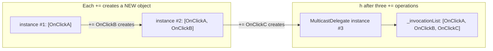
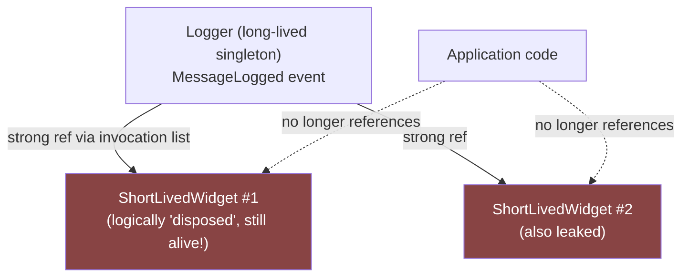
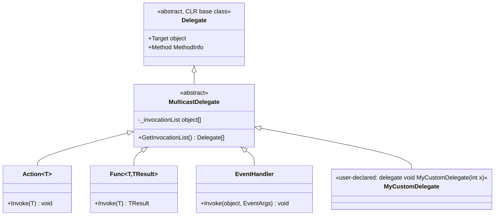
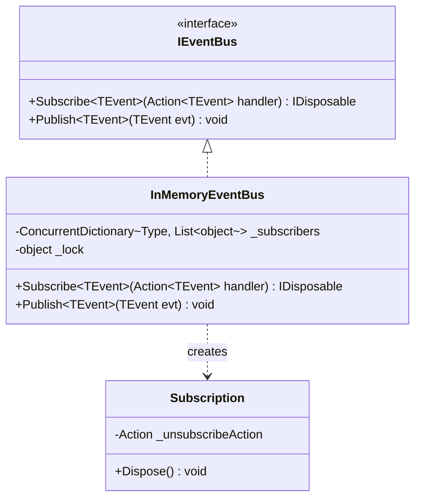
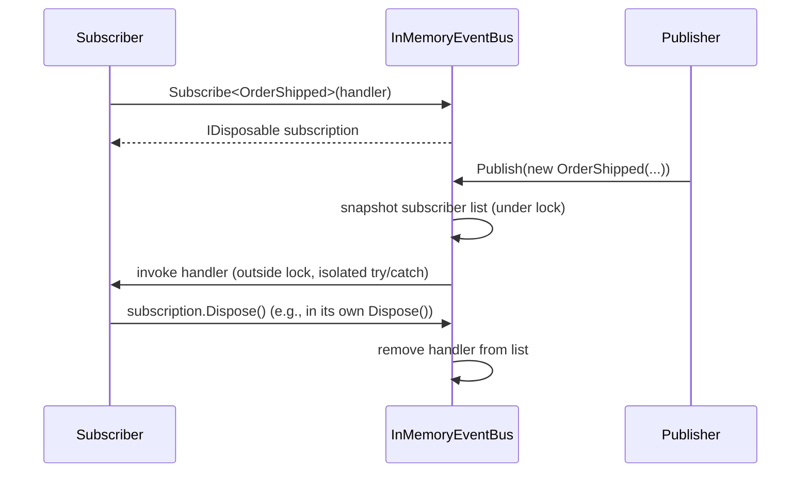

# Module 4 — C# Advanced: Delegates, Events, Closures & Multicast Internals

> Domain: C# | Level: Beginner → Expert | Prerequisite: [[01-CLR-JIT-GC-Memory-Management]] (GC roots, "lapsed listener" leak referenced in §14), [[03-Span-Memory-Low-Allocation]] (why closures can't capture `ref struct` locals)

---

## 1. Fundamentals

### What is a delegate?
A **delegate** is a type-safe, object-oriented function pointer: a reference type that holds (a) a reference to a method (static or instance), and (b) if instance, a reference to the target object the method should run on. Calling a delegate invokes the method it points to, with full type checking of the signature at compile time — unlike a raw C function pointer.

### What is an event?
An **event** is a language-level wrapper around a delegate field that restricts how outside code can interact with it: external code can only `+=`/`-=` (subscribe/unsubscribe) a handler; only the declaring class can `Invoke` it (raise it) or assign it outright (`=`). This is the **Observer pattern** baked directly into the language.

### What is a closure?
A **closure** is what the compiler generates when a lambda or anonymous method references a variable from its enclosing scope (a local variable, a parameter, or `this`). The compiler lifts that captured variable into a compiler-generated class (or occasionally a struct, for closures that provably don't escape — see §2.3) so the lambda can keep referencing it even after the enclosing method has returned.

### Why do these exist?
- **Delegates**: C# needed a type-safe way to pass "behavior" as data — callbacks, strategy objects, LINQ predicates — without falling back to untyped function pointers or reflection-based invocation.
- **Events**: Plain public delegate fields would let any external code not just subscribe, but also **overwrite the entire invocation list** (`myObject.SomeDelegate = null;` or `= someHandler;`, wiping out every other subscriber) or **raise the event** on someone else's object. The `event` keyword closes both holes — a canonical example of "the language enforces an encapsulation boundary that a plain field cannot."
- **Closures**: Without them, lambdas could only operate on their own parameters — hugely limiting for LINQ (`items.Where(x => x > threshold)` needs to capture `threshold`), event handlers, and async continuations.

### When does this matter?
- **Always** — delegates/events underpin events (UI, domain events), LINQ, `Action`/`Func` callback APIs, and the entire async/await continuation mechanism (Module 2's `MoveNext` *is* effectively a delegate-shaped continuation).
- **Critically** for memory-leak diagnosis — the "lapsed listener" pattern (Module 1 §14) is purely an events/delegates phenomenon: a long-lived publisher's invocation list keeps every subscriber alive indefinitely if they never unsubscribe.
- **Critically** for closure-capture correctness — the classic "captured loop variable" bug and closure-induced allocation are both top-tier interview and code-review topics.

### How does it work (30,000-ft view)?

```csharp
public class Button
{
    public event EventHandler? Click; // compiler generates a private backing delegate field + add/remove accessors

    public void SimulateClick() => Click?.Invoke(this, EventArgs.Empty); // only the declaring class can invoke
}

var button = new Button();
button.Click += (s, e) => Console.WriteLine("Clicked!"); // external code can only +=/-=, not assign or invoke
```

Mental model for interviews: **"An event is a delegate with the field made private and only `+=`/`-=` exposed publicly. A closure is a delegate whose target is a compiler-generated object holding the captured variables."**

---

## 2. Deep Dive

### 2.1 Delegate Internals — What `Action`/`Func` Actually Are

Every delegate type (including `Action<T>`, `Func<T,TResult>`, and any custom `delegate` declaration) compiles to a **sealed class deriving from `MulticastDelegate`** (itself deriving from `Delegate`), with compiler-synthesized `Invoke`, `BeginInvoke`/`EndInvoke` (legacy, rarely used since async/await superseded the APM pattern), and constructor. Internally, a delegate instance holds:
- `_target`: the object instance the method should run on (`null` for a static method).
- `_methodPtr`: an internal method pointer/token identifying the target method.
- `_invocationList` + `_invocationCount`: used only when the delegate is a **multicast** delegate wrapping more than one subscriber (see §2.2).

Every delegate allocation is a **heap allocation** — assigning a lambda, method group, or anonymous method to a delegate-typed variable allocates a delegate object (unless the runtime can cache/reuse it — see §2.4).

### 2.2 Multicast Delegates — the `+=` Mechanism

`event`/delegate fields in C# are **multicast** by default (`MulticastDelegate`). `handler1 + handler2` doesn't mutate either delegate — delegates are **immutable**; `+` (and thus `+=`) creates a **brand-new delegate instance** whose internal invocation list is the concatenation of both operands' lists.

```csharp
EventHandler? h = null;
h += OnClickA;   // h = new delegate wrapping [OnClickA]
h += OnClickB;   // h = ANOTHER new delegate wrapping [OnClickA, OnClickB] -- h now points to a different object
h -= OnClickA;   // h = yet another new delegate wrapping [OnClickB] -- -= does a linear scan + rebuild, not a "removal in place"
```

**Invocation order**: subscribers are called **synchronously, in subscription order**, on the *same thread* that raised the event — there is no concurrency here unless the handlers themselves spawn async work.

**Return values with multicast**: `Invoke()` on a multicast delegate with a non-`void` return type calls every subscriber in order but only returns **the last subscriber's return value** — every earlier subscriber's return value is silently discarded. This is a very commonly missed interview/code-review fact and a real production bug source (see §6).

**Exception propagation**: if subscriber #2 (of 4) throws, subscribers #3 and #4 **never run** — the exception propagates immediately out of `Invoke()`, aborting the remaining invocation list. This is why robust event-raising code often needs to iterate the invocation list manually (`GetInvocationList()`) and catch per-subscriber exceptions if "one bad subscriber shouldn't break the others" is a requirement.



### 2.3 Closures — the Compiler Transformation in Detail

```csharp
// You write:
int threshold = 10;
Func<int, bool> isAboveThreshold = x => x > threshold;

// Compiler generates (simplified):
private sealed class DisplayClass0
{
    public int threshold;
    public bool Lambda(int x) => x > threshold;
}
var displayClass = new DisplayClass0 { threshold = 10 };
Func<int, bool> isAboveThreshold = displayClass.Lambda; // delegate targets the DisplayClass0 instance
```

Key facts:
- The captured variable `threshold` becomes a **field** on a compiler-generated class instance (the "display class") — it's no longer a true stack local once captured. This is exactly why mutating a captured variable *after* creating the lambda is visible *inside* the lambda too — they share the same field, not independent copies.
- **This is a heap allocation** (the display class instance) — every closure that captures anything allocates, unless the JIT/compiler can prove it's unnecessary (rare, and not something to rely on).
- **Multiple lambdas in the same method sharing captured variables share the same display class instance** — the compiler is smart enough to generate one display class per *scope*, not one per lambda, so two lambdas both capturing `threshold` share a single allocated object.
- **`foreach` loop variables get a fresh capture per iteration** (fixed in C# 5 for `foreach`; **`for` loops still share one variable across iterations unless you introduce a fresh local inside the loop body**) — this distinction is one of the most common "gotcha" interview questions (§10 Intermediate Q1).

### 2.4 Delegate Caching and Allocation Avoidance

- A lambda that **captures nothing** (no closure over locals/`this`) is compiled to a **static method** with a delegate instance that the compiler **caches in a static field** and reuses across every call — genuinely zero allocation after the first invocation.
- A lambda that captures **only `this`** (an instance method reference, not a local) creates a new delegate per call (since it needs to bind to `this`), but does *not* need a separate display-class heap object — the delegate's `_target` is simply the enclosing instance itself.
- A lambda capturing **local variables** always allocates a new display-class instance per invocation of the enclosing method (not per lambda invocation) — understanding "per enclosing-method-call, not per lambda-call" is important for reasoning about allocation rate in loops (see §7 performance discussion, and the `for`/`foreach` capture-scope nuance in §2.3).

### 2.5 Events vs Delegate Fields — the Encapsulation Mechanism Precisely

```csharp
public class Publisher
{
    public event EventHandler? SomethingHappened; // compiler-enforced: external code can ONLY += / -=

    // Internally (what the field-like event actually compiles to, roughly):
    // private EventHandler? _somethingHappened;
    // public event EventHandler SomethingHappened
    // {
    //     add    { _somethingHappened += value; }   // synchronized in older compilers via Delegate.Combine + lock
    //     remove { _somethingHappened -= value; }
    // }
}
```
Without `event` (a plain `public EventHandler? SomethingHappened;` field), any external caller could do `publisher.SomethingHappened = null;` (silently wiping every other subscriber) or `publisher.SomethingHappened?.Invoke(...)` (raising the event on someone else's object) — both are real encapsulation violations `event` exists specifically to prevent. **A subtle but real interview point**: the auto-generated `add`/`remove` accessors on a plain field-like `event` are **not thread-safe against each other before .NET-version-specific compiler changes** (older compilers used `lock(this)`-free `Delegate.Combine`/`CompareExchange`-based patterns that could lose a concurrent subscription under a race) — modern C# compilers generate a lock-free `Interlocked.CompareExchange`-based loop for field-like events specifically to close this race safely.

### 2.6 The "Lapsed Listener" Memory Leak — Precise Mechanics

```csharp
public class Logger // long-lived singleton
{
    public event Action<string>? MessageLogged;
    public void Log(string msg) => MessageLogged?.Invoke(msg);
}

public class ShortLivedWidget
{
    public ShortLivedWidget(Logger logger)
    {
        logger.MessageLogged += OnMessageLogged; // subscribes -- Logger's invocation list now references this widget
    }
    private void OnMessageLogged(string msg) { /* ... */ }
    // No unsubscribe anywhere!
}
```
`Logger.MessageLogged`'s invocation list holds a reference to `ShortLivedWidget.OnMessageLogged`'s **target** — i.e., the `ShortLivedWidget` instance itself. As long as `Logger` (long-lived) is reachable, its `MessageLogged` field is a **GC root path** (Module 1 §2.4) keeping every subscribed `ShortLivedWidget` alive forever, even after all other references to it are gone and the application logically considers it "disposed of." This is invisible in ordinary code review (no obviously-wrong line) and shows up specifically as a steadily-growing object count for the *subscriber* type in a heap dump — not the publisher — which is the classic diagnostic confusion this bug causes (Module 1 §14).

### 2.7 Weak Event Pattern

To let a long-lived publisher hold subscribers **without** keeping them alive, use a `WeakReference<T>`-based subscription list instead of a normal delegate invocation list — the .NET ecosystem's built-in version is `WeakEventManager` (WPF) or a hand-rolled equivalent:

```csharp
public class WeakEventSubscription<TArgs>
{
    private readonly List<WeakReference<Action<TArgs>>> _handlers = new();

    public void Subscribe(Action<TArgs> handler) => _handlers.Add(new WeakReference<Action<TArgs>>(handler));

    public void Raise(TArgs args)
    {
        for (int i = _handlers.Count - 1; i >= 0; i--)
        {
            if (_handlers[i].TryGetTarget(out var handler)) handler(args);
            else _handlers.RemoveAt(i); // prune dead subscribers as we go
        }
    }
}
```
**Trade-off**: The subscriber's *delegate object itself* must not be the only reference keeping the subscriber's target alive elsewhere either (a common subtlety — if the delegate wraps a lambda whose only strong reference is the list, the `WeakReference<Action<TArgs>>` doesn't help unless the *subscriber object* is independently rooted by something else the caller controls) — this pattern is correct but easy to apply incompletely; genuinely understanding it is an Advanced/Expert-tier signal.



### 2.8 `Delegate.Combine`/`Remove` Cost

Each `+=`/`-=` on a multicast delegate with N existing subscribers is **O(N)** (a new array-backed invocation list is built by copying). This is fine for typical event usage (a handful of subscribers) but is a real, measurable cost if code mistakenly subscribes/unsubscribes in a hot loop (e.g., subscribing inside a per-request handler instead of once at startup) — an anti-pattern worth naming explicitly (§6).

---

## 3. Visual Architecture

### Delegate Type Hierarchy



### Closure Capture Data Flow (ASCII)

```
Method scope:
  int threshold = 10;              ┌─────────────────────┐
  Action a = () => {               │  DisplayClass (heap) │
      threshold++;                 │  int threshold = 10   │◄────┐
      Console.WriteLine(threshold);│                       │     │
  };                                └─────────────────────┘     │
  a();  // prints 11                        ▲                    │
  Console.WriteLine(threshold); // 11 (!)   │ delegate targets   │
                                             │ this instance      │
                                    ┌────────┴────────┐          │
                                    │  Action delegate │──────────┘
                                    │  _target = DisplayClass
                                    │  _methodPtr = Lambda
                                    └─────────────────┘
```

---

## 4. Production Example

### Scenario: Real-time dashboard service — memory growth traced to WebSocket connection handlers

**Problem**: A real-time analytics dashboard (ASP.NET Core with a long-lived `WebSocket` per connected client, backed by a singleton `MetricsBroadcastService`) showed steadily growing memory over days, with `dotnet-gcdump` showing `ClientConnectionHandler` instance counts climbing far beyond the actual number of concurrently connected browser tabs (confirmed via load-balancer connection counts).

**Investigation**:
- `dotnet-gcdump`'s "path to root" analysis on a sample `ClientConnectionHandler` instance (one that should have been collected after its browser tab closed) showed a reference chain: `MetricsBroadcastService.MetricUpdated` (a singleton-scoped `event`) → its invocation list → the disconnected `ClientConnectionHandler.OnMetricUpdated` method target.
- Code review confirmed: `ClientConnectionHandler`'s constructor subscribed to `MetricsBroadcastService.MetricUpdated += OnMetricUpdated`, but its `Dispose()`/connection-close handling path never called `-=` — a straightforward lapsed-listener bug (§2.6), at the scale of thousands of connections/day across the service's lifetime.

**Architecture fix**:
- Added `MetricsBroadcastService.MetricUpdated -= OnMetricUpdated;` to `ClientConnectionHandler`'s `Dispose()`, and audited every other singleton-scoped event subscription in the codebase for the same pattern (found two more instances).
- Added an analyzer rule (a custom Roslyn analyzer, since no built-in one covers this precisely) flagging any class implementing `IDisposable` that subscribes to an event (`+=`) in a constructor/initializer without a matching `-=` appearing anywhere in its `Dispose` method body.
- For one genuinely hard case (a handler whose lifetime was managed by a third-party library that didn't expose a reliable disposal hook), switched to the weak-event pattern (§2.7) instead of relying on an unsubscribe call that couldn't be guaranteed to run.

**Trade-offs**: The weak-event fallback adds a small per-raise cost (iterating and pruning dead `WeakReference`s) compared to a normal strong-reference invocation list — accepted only for the one case where deterministic unsubscription genuinely couldn't be guaranteed, not applied universally (unnecessary complexity for the majority of cases where `Dispose()`-based unsubscription is reliable).

**Lessons learned**:
1. The lapsed-listener leak's heap-dump signature is distinctive: the *subscriber* type count grows, but the reference-path analysis always leads back through the *publisher's* event field — train the team to recognize this shape immediately rather than treating each occurrence as a novel mystery.
2. `IDisposable` classes that subscribe to external events without a paired unsubscribe are the single highest-value pattern to catch in code review or via static analysis for this bug class.
3. Weak references are a valid but non-default tool — reach for them only when deterministic unsubscription is provably unavailable, not as a blanket "safer" default (they add real overhead and complexity).

---

## 5. Best Practices

- **Always pair event subscription with unsubscription in `Dispose()`** for any subscriber whose lifetime is shorter than the publisher's. Why: this is the single highest-leverage rule preventing the lapsed-listener leak (§2.6, §4).
- **Prefer `Action<T>`/`Func<T,TResult>` over custom `delegate` declarations** for ordinary callback signatures — reduces API surface/cognitive load; reserve custom delegate types for cases needing named parameters for clarity in public APIs or `ref`/`out`/`in` parameter support (which `Action`/`Func` support since C# 13's expanded generic capabilities, but custom delegates remain clearer for complex signatures).
- **Avoid non-`void` return types on multicast-invoked delegates/events.** Why: only the last subscriber's return value survives `Invoke()` — a near-guaranteed source of silent bugs once a second subscriber is ever added. If you need every subscriber's result, iterate `GetInvocationList()` manually and collect results yourself.
- **Be deliberate about closure allocation in hot loops.** If a lambda inside a loop doesn't need to capture a per-iteration value, hoist it outside the loop (or make it a non-capturing lambda/local static method) so it's allocated once instead of per-iteration.
- **Use `static` lambdas (`static (x) => ...`, C# 9+) wherever the lambda genuinely doesn't need to capture anything**, including `this`. The compiler enforces the "no capture" guarantee at compile time and reliably takes the zero-allocation cached-delegate path from §2.4 — an explicit, self-documenting signal of intent, not just an optimization hint.
- **Reserve the weak-event pattern for cases where deterministic `Dispose`-based unsubscription genuinely can't be guaranteed** — it's a valid tool, not a default; it adds real per-raise overhead and complexity that most subscriptions don't need.
- **Raise events defensively with the `?.Invoke(...)` null-conditional pattern** (or capture the delegate into a local first in multi-threaded contexts: `var handler = SomethingHappened; handler?.Invoke(...)`) to avoid a race where the field becomes `null` between a null-check and the call in older patterns — the local-variable-capture idiom is a genuine thread-safety fix, not just style.

---

## 6. Anti-patterns

- **Subscribing to a long-lived publisher's event without ever unsubscribing.** Why it fails: the lapsed-listener leak (§2.6) — invisible until a heap dump under memory pressure. Fix: `Dispose()`-paired unsubscription, or the weak-event pattern where that's not possible.
- **Using events/delegates with non-`void` return types expecting to aggregate every subscriber's result.** Why it fails: `Invoke()` on a multicast delegate discards every return value except the last subscriber's — silent, no compiler warning. Fix: `GetInvocationList()` + manual iteration if all results matter; or redesign as a method returning `IEnumerable<TResult>` computed by iterating a `List<Func<...>>` explicitly instead of a delegate/event.
- **Assuming all subscribers run even if one throws.** Why it fails: an exception from subscriber N aborts subscribers N+1 onward silently (from the raiser's perspective, it just looks like "the event threw"). Fix: if isolation between subscribers matters, iterate `GetInvocationList()` and wrap each call in its own `try`/`catch`.
- **Capturing a mutable loop variable across iterations in a `for` loop when each iteration needs its own captured value** (the classic "closure captures the loop variable, not its value" bug — still live for `for` loops, though fixed for `foreach` since C# 5). Fix: declare a fresh local inside the loop body (`for (int i = 0; i < n; i++) { int local = i; action = () => Use(local); }`) to force a per-iteration capture.
- **Subscribing/unsubscribing inside a hot loop or per-request code path** instead of once at initialization. Why it fails: each `+=`/`-=` is O(N) in current subscriber count (§2.8) — a real, avoidable cost multiplied by call frequency. Fix: subscribe once at a natural lifecycle boundary (constructor/startup), not per-operation.
- **Using `public` plain delegate fields instead of `event`** on any type exposed outside its own assembly/module. Why it fails: removes the encapsulation guarantee entirely — any external caller can wipe all subscribers or raise the event itself. Fix: always use `event` for any externally-observable notification API.
- **Treating a captured `this` in an instance-method-group lambda as "no allocation" without checking.** While it avoids the *display-class* allocation, the delegate object itself is still a heap allocation per assignment — don't assume "captures only `this`" is entirely free; it's cheaper, not free.

---

## 7. Performance Engineering

**CPU**: Delegate invocation itself is fast (effectively a virtual-call-like indirect jump) — the *allocation* around it (delegate objects, display classes) is the actual performance-relevant cost, not the invocation.

**Memory**: Every delegate assignment allocates, unless it's a genuinely non-capturing lambda/method-group hitting the compiler's cached-static-delegate path (§2.4). LINQ query chains built from lambdas inside hot loops are a classic hidden source of repeated delegate + display-class allocation (this directly extends Module 1 §2.6's "hidden costs checklist" and Module 3's low-allocation discipline).

**GC**: High-frequency event raising with many subscribers, or per-call lambda allocation inside hot loops, contributes measurably to Gen 0 allocation rate — profile with `dotnet-counters`/BenchmarkDotNet `[MemoryDiagnoser]` exactly as in Modules 1 and 3 before assuming it matters.

**Allocations**: Use `static` lambdas (§5) to force the compiler to guarantee the zero-allocation path at compile time rather than hoping the JIT/compiler figures it out. `Delegate.Combine`/`Remove`'s O(N) cost (§2.8) matters specifically for high-subscriber-count events raised/modified at high frequency — rare, but a real Advanced-tier profiling target.

**Latency vs Throughput**: Synchronous, in-order multicast invocation means a slow subscriber directly adds latency to whoever raises the event — if a subscriber does meaningful I/O/CPU work, that cost is fully absorbed into the raiser's call stack (no implicit async fan-out); this is a common design mistake corrected in §9's architecture-decision discussion (event-driven in-process fan-out vs message-queue-based fan-out).

**Benchmarking**: BenchmarkDotNet comparing a `for` loop using a captured lambda (per-iteration allocation) vs a hoisted non-capturing delegate vs a plain non-delegate loop body directly demonstrates the allocation delta from closures — a genuinely illuminating exercise for a team skeptical that "just a lambda" has a real cost.

**Caching**: Event-based "cache invalidated" notifications are a common, legitimate low-overhead pattern (a cache subscribes to an upstream data-change event rather than polling) — but the publisher must remain aware that every subscribed cache instance is kept alive for the publisher's lifetime (§2.6), which matters if caches are meant to be short-lived/per-request.

---

## 8. Security

- **Untrusted code registering event handlers on a shared/singleton publisher** can observe every event raised (a potential information-disclosure vector if the event arguments carry sensitive data) and, if the handler throws deliberately, can **deny service to subsequent subscribers** in the invocation list (§2.2's exception-abort behavior) — a real concern in plugin-hosting or multi-tenant-in-process architectures. Mitigation: never expose a shared event carrying sensitive payloads to less-trusted code without per-subscriber exception isolation (`GetInvocationList()` + individual `try`/`catch`) and, ideally, per-tenant/plugin event scoping rather than one global publisher.
- **Reflection-based delegate creation from untrusted type/method names** (`Delegate.CreateDelegate` bound to a dynamically-resolved `MethodInfo` from user input) can be leveraged to invoke arbitrary methods if the method/type name is attacker-influenced — treat this exactly like any other reflection-based dynamic invocation surface (Module 1 §8): never resolve target methods from unvalidated external input.
- **Lapsed-listener leaks as an availability risk**: at sufficient scale/duration, an unbounded lapsed-listener leak is a slow-burn denial-of-service against the process itself (eventual OOM) — while not "malicious" in origin, it's the same failure-mode class as a deliberate memory-exhaustion attack, and should be covered by the same monitoring/alerting discipline (Module 1 §14's OOM-leak playbook).
- **OWASP relevance**: A08 (Software/Data Integrity)-adjacent if dynamically-resolved delegates execute unvalidated method names; general availability-risk overlap with A04 (Insecure Design) for unbounded event-subscription growth without any lifecycle governance.

---

## 9. Scalability

- **Horizontal scaling**: In-process events/delegates are inherently **single-process** — they do not, by themselves, provide any cross-instance/cross-replica notification mechanism. A design that relies on in-process events for something that needs to fan out across a horizontally-scaled fleet (e.g., "notify all connected clients across all pods") requires a genuinely distributed mechanism (Redis pub/sub, a message broker — covered in later modules) layered on top; in-process events alone don't scale past one process's boundary.
- **Vertical scaling**: Multicast delegate invocation is single-threaded/synchronous by default — a publisher raising an event with many subscribers doing meaningful work serializes that work onto the raiser's thread; this doesn't benefit from additional cores unless subscribers are explicitly dispatched to background work (`Task.Run`/async fan-out), which then reintroduces all of Module 2's async/threading considerations.
- **Caching/Replication/Partitioning**: Not directly applicable to delegates/events themselves, but the event-driven "cache invalidation notification" pattern (§7) is a small-scale instance of the same publish/notify principle that reappears at the distributed-systems level (cache invalidation via pub/sub across a fleet) — recognizing this structural parallel is useful synthesis for interviews.
- **CAP theorem**: Not directly relevant to in-process delegates; worth explicitly noting *as* a limitation when a candidate is asked to scale an event-driven in-process design — the correct answer often involves acknowledging that in-process events don't survive the CAP-theorem-relevant boundary at all (they're not even in the distributed-systems conversation until externalized via a broker).
- **HA/DR**: An in-process-only "event bus" pattern used for anything business-critical (e.g., "notify downstream of an order status change" implemented purely as an in-process C# event) is a single point of failure — if the process crashes between the state change and the event being fully processed by all subscribers, the notification is lost with no replay/durability. This is exactly the motivating problem for the **Outbox pattern** (a later module) — worth flagging explicitly that in-process events are not a substitute for a durable messaging mechanism when reliability guarantees matter.

---

## 10. Interview Questions

### Basic (10)

1. **Q: What is a delegate?**
   **A:** A type-safe object referencing a method (and, for instance methods, the target object) that can be invoked indirectly, like a type-checked function pointer.

2. **Q: What is the difference between a delegate and an event?**
   **A:** An event is a delegate field with restricted external access — outside code can only `+=`/`-=` a handler, not assign the field outright or invoke it directly; only the declaring class can raise it.

3. **Q: What is a closure?**
   **A:** A lambda/anonymous method that references a variable from its enclosing scope; the compiler generates a class to hold that captured variable so the lambda can use it after the enclosing method returns.

4. **Q: Are delegates value types or reference types?**
   **A:** Reference types — every delegate ultimately derives from the `System.MulticastDelegate`/`Delegate` base classes.

5. **Q: What does `+=` do to an event/delegate field?**
   **A:** Combines the existing delegate with a new one into a brand-new multicast delegate instance containing both invocation lists concatenated — delegates are immutable, so it doesn't mutate anything in place.

6. **Q: What happens if you `?.Invoke()` an event with no subscribers?**
   **A:** Nothing — the null-conditional operator short-circuits safely since the field is `null` when no one has subscribed.

7. **Q: Can a `for` loop's captured variable behave differently from a `foreach` loop's, in a closure?**
   **A:** Yes — `foreach` gives each iteration its own captured variable (since C# 5), while a `for` loop's loop variable is shared across all iterations unless a fresh local is introduced inside the loop body.

8. **Q: What is `Action<T>` vs `Func<T,TResult>`?**
   **A:** `Action<T>` represents a method returning `void`; `Func<T,TResult>` represents a method returning `TResult`.

9. **Q: Why should you use `event` instead of a plain public delegate field?**
   **A:** A plain field lets any external code overwrite the whole invocation list (`= null` or `= someHandler`) or raise the event itself — `event` restricts external code to only `+=`/`-=`.

10. **Q: What's a common cause of a memory leak involving events?**
    **A:** A subscriber that registers (`+=`) with a long-lived publisher's event but never unsubscribes (`-=`) — the publisher's invocation list keeps the subscriber alive indefinitely (the "lapsed listener" pattern).

### Intermediate (10)

1. **Q: Explain precisely why a `for` loop's captured variable causes bugs but `foreach`'s doesn't (in modern C#).**
   **A:** In a `for` loop, the loop variable is a single variable mutated across iterations — a closure capturing it references that one shared variable, so all captured lambdas see its *final* value after the loop ends. `foreach` (since C# 5) allocates a fresh iteration variable each pass, so each captured lambda gets its own independent value.

2. **Q: What happens if a subscriber throws an exception when a multicast event is raised with 4 subscribers, and the exception occurs in the 2nd?**
   **A:** Subscribers 3 and 4 never execute — the exception propagates immediately out of `Invoke()`, aborting the remaining invocation list; this is not caught/isolated per-subscriber by default.

3. **Q: What's the danger of using a delegate/event with a non-`void` return type?**
   **A:** Multicast invocation only returns the **last** subscriber's return value — every earlier subscriber's return value is silently discarded, a near-guaranteed bug source once more than one subscriber exists.

4. **Q: Why does a non-capturing lambda avoid allocation on repeated calls, while a capturing one doesn't?**
   **A:** A non-capturing lambda compiles to a static method with its delegate instance cached in a static field by the compiler and reused across every call; a capturing lambda requires a fresh display-class instance (heap allocation) per invocation of the enclosing scope, since it holds the captured variable's current state.

5. **Q: How would you fix a lapsed-listener leak when the subscriber's lifetime can't reliably call `Dispose()`?**
   **A:** Use the weak-event pattern — store subscribers via `WeakReference<T>` so the publisher's invocation list doesn't keep them alive, pruning dead references opportunistically when the event is raised.

6. **Q: What's the cost of `+=`/`-=` on an event with many existing subscribers, and why?**
   **A:** O(N) in the current subscriber count — delegates are immutable, so combining/removing rebuilds a new invocation-list array each time rather than mutating in place.

7. **Q: How do you safely raise an event in a multi-threaded context to avoid a null-reference race?**
   **A:** Capture the delegate field into a local variable first (`var handler = MyEvent; handler?.Invoke(...);`), since another thread could set the field to `null` between a naive null-check and the invocation if you check the field directly.

8. **Q: What does `GetInvocationList()` let you do that a plain `Invoke()` call doesn't?**
   **A:** Iterate each subscriber individually — letting you catch exceptions per-subscriber (so one failing handler doesn't abort the rest) and/or collect every subscriber's return value instead of only the last one.

9. **Q: Why is capturing `this` in a lambda cheaper than capturing a local variable, in terms of allocation?**
   **A:** Capturing only `this` lets the delegate's `_target` simply be the existing enclosing instance — no separate display-class object needs to be allocated, unlike capturing a local, which requires lifting that variable into a new heap-allocated holder class.

10. **Q: What's the difference between `Delegate.Combine` and directly assigning `+=`?**
    **A:** `+=` on an event/delegate field is syntactic sugar that calls `Delegate.Combine` under the hood (and, for compiler-generated field-like events, does so via a thread-safe `Interlocked`-based pattern) — they're the same underlying mechanism, `+=` is just the readable surface syntax.

### Advanced (10)

1. **Q: Explain exactly how the compiler decides whether to generate one display class per lambda or share one across multiple lambdas in the same method.**
   **A:** The compiler generates display classes per **scope**, not per lambda — if two lambdas in the same method (or the same nested block) capture overlapping sets of variables, they share a single display-class instance holding all the captured variables needed by either, allocated once per execution of that scope. This matters for reasoning about allocation count: five lambdas all capturing the same three locals in one method body typically cost one display-class allocation total, not five.

2. **Q: Why is a field-like event's compiler-generated `add`/`remove` implementation specifically designed to be thread-safe, and what would go wrong with a naive non-atomic implementation?**
   **A:** A naive implementation (`_field = _field + value;` without synchronization) has a classic read-modify-write race: two threads subscribing concurrently could both read the same starting invocation list, each compute an "old + mine" result, and the second write to complete would silently discard the first thread's subscription (lost update). Modern compilers generate an `Interlocked.CompareExchange`-based retry loop specifically to make concurrent subscription safe without requiring a full lock, closing this race.

3. **Q: Describe a scenario where the "last subscriber's return value only" multicast behavior causes a subtle, hard-to-find production bug, and how it was likely introduced.**
   **A:** A `Func<Request, ValidationResult>` event-like delegate used for a pluggable "validation" extension point, initially designed and tested with exactly one subscriber (so its return value was always meaningfully observed) — later, a second team adds a second validator by subscribing another handler to the same delegate field. Both validators run (their side effects, if any, both occur), but only the second one's `ValidationResult` is ever actually returned/acted upon — the first validator's rejection is silently ignored, allowing invalid requests through. This is introduced precisely because the original single-subscriber design "worked" in testing and never surfaced the multicast-return-value hazard until a second legitimate subscriber was added far later.

4. **Q: How would you redesign the pluggable-validator scenario from the previous question to avoid this hazard entirely, using idiomatic C#?**
   **A:** Replace the delegate/event with an explicit `IEnumerable<Func<Request, ValidationResult>>` (or better, an `IValidator` interface with a discoverable collection via DI, e.g., `IEnumerable<IValidator>` resolved from the container) that the calling code iterates explicitly, aggregating every result deliberately (e.g., "valid only if every validator passes," collecting all failure reasons) — making the aggregation semantics an explicit, visible part of the calling code rather than an implicit, easy-to-misunderstand side effect of multicast delegate invocation.

5. **Q: Explain the memory-allocation difference between an event with a `List<Action<T>>` backing store you manage manually versus a standard C# `event` field, and when you'd choose the former.**
   **A:** A standard `event`/delegate field reallocates its entire invocation-list array on every `+=`/`-=` (O(N) per modification, §2.8); a manually-managed `List<Action<T>>` backing store, while requiring you to reimplement thread-safety and reproduce the encapsulation guarantees `event` gives you for free, supports O(1) amortized `Add` (via `List<T>`'s standard growth strategy) and, crucially, can be normal-locked or use `ConcurrentBag`/other concurrent collections tuned to your actual concurrency pattern rather than the delegate machinery's generic one-size-fits-all approach. Choose the manual approach only when profiling shows subscription/unsubscription churn (not just raising) is itself a hot-path cost — rare, but a legitimate Advanced-tier optimization when it applies (e.g., a very high-churn plugin/observer registry).

6. **Q: What is the relationship between C#'s `event`/delegate model and the classic Gang-of-Four Observer pattern, and where does the language-level version diverge from the textbook pattern?**
   **A:** C# events are a direct, first-class language implementation of Observer (publisher = subject, subscribers = observers, `+=`/`-=` = attach/detach). Divergences from the textbook pattern: (a) textbook Observer typically defines an explicit `IObserver` interface with a `Notify`/`Update` method, while C# events use structural delegate-signature matching instead of a nominal interface; (b) textbook Observer discussions rarely address the multicast-return-value hazard (§Advanced Q3) since GoF-era Observer implementations were typically `void`-returning by convention; (c) C#'s built-in exception-abort-on-first-throw behavior (§2.2) isn't part of the classical pattern's contract and must be explicitly designed around if per-observer isolation is required.

7. **Q: How would you implement an event-raising mechanism that guarantees every subscriber runs even if earlier ones throw, while still surfacing all exceptions to the caller?**
   **A:** Iterate `GetInvocationList()` manually, invoking each delegate inside a `try`/`catch`, collecting any thrown exceptions into a list, and after the loop, if any were caught, throw an `AggregateException` wrapping all of them — giving the caller full visibility into every failure while guaranteeing complete fan-out regardless of individual subscriber failures. This is exactly the semantic gap between naive `Invoke()` (§2.2) and the exception-isolation the Production Example's fix (§4) required for the plugin-hosting-adjacent scenario.

8. **Q: Explain why `static` lambdas (C# 9+) are a compile-time-enforced guarantee rather than just a naming convention, and what error you get if you violate it.**
   **A:** Marking a lambda `static` instructs the compiler to reject the lambda if it captures **any** enclosing state, including `this` — attempting to reference an outer local, parameter, or instance member inside a `static` lambda produces a compile-time error (e.g., "a static anonymous function cannot contain a reference to..."), not a runtime behavior difference. This makes it a genuine correctness/intent-signaling tool: a team can safely refactor around a `static`-marked lambda knowing the compiler actively prevents an accidental future capture from silently reintroducing allocation or unintended state coupling.

9. **Q: Describe how delegate covariance/contravariance interacts with multicast combination — can you combine two delegates with different (but compatible) signatures via variance?**
   **A:** Delegate variance (covariant return types, contravariant parameter types, since C# 2's generic delegate variance rules) applies to *assignment compatibility* (a `Func<string>` can be assigned to a `Func<object>`-typed variable due to covariant return type), but `Delegate.Combine`/`+=` still requires the delegates being combined to be of the **exact same delegate type** at the combination call site — you can't directly `+=` a `Func<string>` onto a `Func<object>` field even though a single covariant assignment would be legal; the invocation list itself is homogeneous in delegate type once combined, variance only affects how a single delegate reference can be *assigned/passed*, not cross-type multicast combination.

10. **Q: How would you detect, via tooling rather than manual code review, every event subscription in a large codebase that's missing a corresponding unsubscription, as a scalable alternative to the ad-hoc audit described in §4?**
    **A:** Write a custom Roslyn analyzer that: (a) finds every class implementing `IDisposable` (or having a clear disposal/teardown method by convention), (b) within that class, finds every `+=` expression where the left-hand side resolves to a member on a different, externally-injected/longer-lived object (distinguishing "subscribing to something else's event" from "raising your own"), and (c) flags any such subscription where no matching `-=` expression targeting the same event member appears anywhere in the class's `Dispose`/teardown method body. Ship it as a CI-enforced analyzer (warning-as-error) rather than a one-time manual sweep, so new instances of the pattern are caught automatically going forward — directly generalizing the fix from the Production Example (§4) into a repeatable, low-maintenance organizational safeguard rather than a one-off audit.

### Expert (10)

1. **Q: Design a plugin-hosting architecture where third-party plugins subscribe to core application lifecycle events, ensuring (a) one misbehaving plugin's exception can't break other plugins or the host, and (b) plugins are correctly garbage-collected when unloaded even if they forget to unsubscribe.**
   **A:** (a) Never use a raw C# `event`/`Invoke()` for plugin-facing lifecycle hooks — wrap raising in a manual `GetInvocationList()` iteration with per-subscriber `try`/`catch`, logging and isolating each plugin's failure (mirroring §Advanced Q7), so no single plugin can abort the host's own remaining processing or other plugins' handlers. (b) Plugin lifetime/unload safety is a two-part problem: even with weak-reference-based subscription (§2.7) protecting against the *host* keeping a plugin object alive, if plugins are loaded via a separate `AssemblyLoadContext` (the modern .NET plugin-unloading mechanism, superseding `AppDomain`), you must also ensure the event subscription doesn't hold a strong reference to the plugin's *`MethodInfo`/delegate*, which itself roots the plugin's loaded assembly — combine weak-reference subscriber storage with explicit `AssemblyLoadContext.Unloading` cleanup that forcibly clears any remaining subscriptions tied to that specific load context, since weak references alone don't guarantee prompt collection of a collectible assembly load context, only that the host isn't the thing *preventing* it.

2. **Q: A team wants to replace their entire in-process `event`-based domain-event system (e.g., `OrderShipped`, `PaymentReceived` raised as C# events across service classes) with a proper Domain Events pattern backed by an in-memory mediator (e.g., MediatR-style) ahead of eventually externalizing to a message broker. Walk through the migration reasoning.**
   **A:** The core problem being solved is exactly §9's "in-process events don't survive process boundaries and provide no durability" limitation — raw C# events are a poor foundation for anything that will eventually need durable, replayable, cross-process semantics. A mediator-based domain-event dispatch (handlers registered via DI as `IEnumerable<INotificationHandler<T>>` rather than delegate subscriptions) gives: (a) explicit, DI-container-visible handler registration (discoverable, testable, no lapsed-listener risk since handlers aren't kept alive via an event field but resolved fresh per dispatch from the container), (b) natural per-handler exception isolation and ordering control designed into the dispatch mechanism itself rather than bolted on via manual `GetInvocationList()` iteration, and (c) a clean seam for later swapping the "publish" step to also (or instead) write to an outbox table/message broker (a later module's Outbox pattern) without touching every call site that raises a domain event — the abstraction boundary (a `IDomainEventPublisher.Publish(event)` call) stays the same whether the implementation dispatches in-process or externally. This is presented as the natural evolution path once an event-driven design's ambitions outgrow what raw C# `event` was ever designed for.

3. **Q: Explain a scenario where closures over `IDisposable` resources inside `async` continuations create a subtle resource-lifetime bug, connecting this module to Module 2's async state machine mechanics.**
   **A:** Given `using var connection = await OpenConnectionAsync(); var handler = new Action(() => connection.Query(...));` where `handler` is stored somewhere and invoked *after* the enclosing method (and thus the `using` block) has already exited — the closure captured `connection` (lifted into the async state machine's fields, per Module 2 §2.1's "captured locals become fields" mechanics combined with this module's §2.3 closure-capture mechanics, since an async method's state machine *is* effectively a closure over its locals), but the `using` block disposed it at method exit regardless of whether the captured delegate is invoked later. The captured closure still compiles and "works" until the delegate is actually invoked post-disposal, at which point it throws `ObjectDisposedException` — a bug that's invisible at the call site that creates the closure and only manifests wherever/whenever the delegate is later invoked, potentially in an entirely different part of the codebase. Fix: never capture a `using`-scoped disposable resource into a delegate intended to outlive the enclosing method; capture only the data needed, or restructure so the resource's lifetime is explicitly tied to the delegate's actual usage span.

4. **Q: How would you reason about whether a high-frequency (millions of events/sec) internal telemetry/metrics-emission pathway should use C# events/delegates at all, versus a different mechanism entirely?**
   **A:** At genuinely extreme frequency, both the per-raise synchronous multicast-iteration cost and any closure/delegate allocation anywhere in the hot path (§7) become measurable — the right question, per this module's recurring measure-first discipline, is whether `dotnet-counters`/BenchmarkDotNet actually shows this as a bottleneck before redesigning. If it does, the typical fix isn't "avoid delegates entirely" but rather: ensure zero allocation in the hot path (non-capturing/`static` delegates registered once, never per-event), and consider whether the *dispatch* mechanism itself should be a specialized, tuned structure (e.g., a lock-free ring buffer/channel that batches metric emissions rather than synchronously invoking N subscriber delegates per single event) — this is the same reasoning pattern as Module 3's "don't hand-roll unless the BCL/simpler tool doesn't cover it, and only after profiling," applied here to the choice between "plain C# events," "a tuned custom dispatch structure," and "an established high-performance telemetry library" (e.g., wrapping `System.Diagnostics.Metrics`, which is specifically built and tuned for exactly this use case rather than raw C# events).

5. **Q: Describe how you'd unit-test that a class correctly unsubscribes from an injected publisher's event upon disposal, as a regression guard against the lapsed-listener bug class.**
   **A:** Construct the subscriber with a test-double/mock publisher exposing the same event; capture the publisher's invocation-list subscriber count (via `GetInvocationList().Length` on the relevant event, accessible if the test has access to the concrete publisher type or a test-specific accessor) immediately after construction (expect it to have increased by exactly one), then call `Dispose()` on the subscriber and assert the invocation-list count has returned to its pre-subscription value — directly, mechanically verifying the unsubscription occurred rather than only inferring it from the absence of a later symptom. This test pattern, applied as a standing convention for every `IDisposable` class that subscribes to injected events, converts the "audit codebase for missing unsubscribes" problem (§4, §Advanced Q10) into an automatically-enforced regression guard at the unit-test level, complementary to (not a replacement for) the static-analyzer approach.

6. **Q: A code reviewer objects to a PR that introduces a new custom `delegate` type instead of reusing `Action<T1,T2>`/`Func<T1,T2,TResult>`. When is a custom delegate type actually the better choice, and how would you defend it?**
   **A:** A custom delegate type is justified when: (a) the parameter names carry meaningful documentation value that generic `Action`/`Func` type parameters can't express (e.g., `delegate void OrderStatusChanged(Order order, OrderStatus previousStatus, OrderStatus newStatus);` is significantly more self-documenting at every call site than `Action<Order, OrderStatus, OrderStatus>`, where parameter order/meaning must be inferred from context or documentation); (b) the signature needs `ref`/`out`/`in` parameters in a way that's awkward or unsupported by the generic `Action`/`Func` family for the specific C# version in use; (c) the delegate type itself needs to carry additional attributes or be part of a public API's discoverable type surface (e.g., in a plugin SDK, a named delegate type is more discoverable via IntelliSense/documentation generation than a generic instantiation). The defense: this is a documented, deliberate exception to the general "prefer `Action`/`Func`" guideline (§5), not a violation of it — the guideline's purpose (reduce unnecessary API surface) doesn't apply when the custom type materially improves clarity at every call site, which is precisely the kind of judgment call a PR description should make explicit rather than leaving the reviewer to guess at the reasoning.

7. **Q: Explain how the CLR's handling of delegate equality (`==`, `.Equals()`) works for multicast delegates, and a real bug this can cause in `-=` usage.**
   **A:** Delegate equality compares `_target` and `_methodPtr` pairs (and, for multicast delegates, the entire ordered invocation list must match element-for-element for two multicast delegates to be considered equal) — critically, `-=` removes a subscription by finding an invocation-list entry matching the *delegate instance being subtracted* by this same target+method equality, **not by reference identity of a "subscription handle."** The real bug: if a handler is subscribed via a **lambda expression** (`obj.Event += () => DoWork();`) rather than a named method group, the exact same lambda syntax written again at unsubscription time (`obj.Event -= () => DoWork();`) creates a **new, different delegate instance** that, despite looking identical in source code, may not compare equal for removal purposes if it captures different closure state (or, even with identical non-capturing content, some remain subtly non-interchangeable across compiler-generated lambda caching boundaries) — the idiomatic, reliable fix is to store the exact delegate instance used at subscription time in a field and pass that same instance to `-=`, never re-writing the lambda expression a second time and hoping it matches.

8. **Q: How would you architect a high-throughput, thread-safe pub/sub mechanism entirely in-process (no external broker) for a scenario with thousands of ephemeral subscribers churning rapidly (subscribe/unsubscribe every few milliseconds), given that standard C# events have O(N) `+=`/`-=` cost?**
   **A:** Replace the standard `event`/`MulticastDelegate` mechanism with a `ConcurrentDictionary<Guid, Action<T>>` (or `ConcurrentBag`/a custom lock-free structure) as the subscriber registry, giving O(1) amortized add/remove (via dictionary key removal) instead of O(N) array-rebuild per change (§2.8) — trading away the built-in encapsulation/`event` syntax for a custom `Subscribe(Action<T> handler) => IDisposable` / internally-managed-removal API (returning an `IDisposable` "subscription handle" whose `Dispose()` removes the specific entry by its `Guid` key, sidestepping the delegate-equality pitfall from Expert Q7 entirely since removal is keyed, not equality-matched). Raising still iterates the current subscriber set (O(N) in *raise* cost is unavoidable if every subscriber must be notified, but this is a different, expected cost from the *modification* cost being optimized here) — this is exactly the kind of case flagged in Advanced Q5 as justifying a manually-managed backing store over the standard `event` keyword, now with a concrete high-churn scenario motivating it.

9. **Q: Discuss the interaction between delegates/closures and NativeAOT trimming (from Module 1's discussion of NativeAOT) — what breaks, and why?**
   **A:** Ordinary compile-time-known delegates (lambdas, method groups resolved statically) trim and AOT-compile without issue, since the target methods are statically discoverable by the trimmer/compiler. The breakage risk is specifically around **reflection-based delegate creation** (`Delegate.CreateDelegate` against a `MethodInfo` obtained via runtime reflection over a type/method name not statically referenced elsewhere) — the AOT trimmer, working from static analysis of what's actually reachable, may remove the target method entirely if nothing else in the statically-analyzed call graph references it, causing a runtime failure only under NativeAOT/trimmed publish (not under normal JIT, where reflection can always find the method since nothing was removed). Mitigation: explicit trimmer directives (`[DynamicDependency]` attributes, or `TrimmerRootDescriptor` XML) marking reflection-discovered delegate targets as roots the trimmer must preserve — directly connecting back to Module 1's NativeAOT discussion of "reflection-heavy code needs trimming-safety annotations."

10. **Q: As a Principal Engineer, you're asked to review an architecture proposal that uses C# events extensively as the primary inter-module communication mechanism within a large monolith (dozens of modules communicating via a shared static event-bus class with public events). What do you push back on, and what do you recommend instead?**
    **A:** Push back on: (a) a shared **static** event bus is effectively a global mutable singleton with all the lapsed-listener leak risk (§2.6) multiplied across every module that ever subscribes, with no natural lifecycle boundary forcing anyone to think about unsubscription; (b) the multicast-return-value hazard (§Advanced Q3) and exception-abort-on-first-throw behavior (§2.2) make raw events a poor fit for cross-module communication where isolation and predictable semantics matter more than in a single well-owned class; (c) it creates implicit, hard-to-trace coupling between modules (any module can silently subscribe to any other's events, with no compile-time-visible dependency graph, unlike explicit interface-based dependencies or DI-resolved handler collections) — a maintainability and architecture-governance concern as the system grows, since "who listens to this event" becomes effectively undiscoverable without a full-codebase search. Recommend: a proper in-process mediator/domain-event dispatch mechanism (Expert Q2) with DI-registered handlers (visible, testable, individually lifecycle-managed by the container rather than an ever-growing static invocation list), reserving raw C# `event`/delegate usage for what it's actually well-suited to — narrow, well-owned, single-class-scoped notification APIs (e.g., a UI control's `Click` event, or a tightly-scoped domain object's own lifecycle hooks), not as the backbone of an entire application's module-to-module communication architecture.

---

## 11. Coding Exercises

### Easy — Fix a `for`-loop closure-capture bug
**Problem**: This code is supposed to print 0, 1, 2 but prints 3, 3, 3.
```csharp
var actions = new List<Action>();
for (int i = 0; i < 3; i++)
{
    actions.Add(() => Console.WriteLine(i));
}
foreach (var a in actions) a(); // prints "3" three times
```
**Solution**:
```csharp
var actions = new List<Action>();
for (int i = 0; i < 3; i++)
{
    int local = i; // fresh variable captured per iteration
    actions.Add(() => Console.WriteLine(local));
}
foreach (var a in actions) a(); // prints 0, 1, 2
```
**Time/Space**: Unchanged algorithmically — this is purely a correctness fix. Each closure still allocates a display-class instance per iteration (since `local` differs per iteration, they can't share one instance) — this is the *correct*, necessary cost here, not something to further optimize away.
**Discussion**: This is precisely why `foreach` didn't have this bug even before the fix mattered as much (each element binds to a fresh iteration variable automatically) — converting the `for` to a `foreach` over `Enumerable.Range(0, 3)` would also fix it, at the cost of a small amount of iterator overhead versus the plain `for` loop.

### Medium — Implement exception-isolated event raising
**Problem**: Given a `public event Action<string> OnMessage;` with multiple subscribers, ensure all subscribers run even if one throws, and surface every exception to the caller.
```csharp
public class RobustPublisher
{
    public event Action<string>? OnMessage;

    public void Publish(string message)
    {
        var handler = OnMessage; // capture to local for thread-safety
        if (handler is null) return;

        List<Exception>? exceptions = null;
        foreach (Action<string> subscriber in handler.GetInvocationList())
        {
            try
            {
                subscriber(message);
            }
            catch (Exception ex)
            {
                (exceptions ??= new List<Exception>()).Add(ex);
            }
        }
        if (exceptions is not null)
            throw new AggregateException("One or more subscribers failed.", exceptions);
    }
}
```
**Time complexity**: O(N) in subscriber count either way (invoking N subscribers is inherently O(N)) — the exercise adds no asymptotic cost, only per-subscriber exception-handling overhead (negligible in the non-throwing case). **Space**: O(1) in the common case (no exceptions); O(K) for K failed subscribers if exceptions occur.
**Optimized**: For very high subscriber counts where allocating the invocation-list array (`GetInvocationList()` itself allocates) matters, a custom `List<Action<string>>`-backed registry (Expert Q8's pattern) avoids that specific allocation — worth it only if profiling shows this path is hot.

### Hard — Implement the weak-event pattern generically
**Problem**: Implement a reusable `WeakEvent<TArgs>` that doesn't keep subscribers alive, with automatic pruning of collected subscribers.
```csharp
public sealed class WeakEvent<TArgs>
{
    private readonly List<WeakReference<Action<TArgs>>> _subscribers = new();
    private readonly object _lock = new();

    public void Subscribe(Action<TArgs> handler)
    {
        lock (_lock) { _subscribers.Add(new WeakReference<Action<TArgs>>(handler)); }
    }

    public void Unsubscribe(Action<TArgs> handler)
    {
        lock (_lock)
        {
            _subscribers.RemoveAll(wr => !wr.TryGetTarget(out var target) || target == handler);
        }
    }

    public void Raise(TArgs args)
    {
        List<Action<TArgs>> live = new();
        lock (_lock)
        {
            for (int i = _subscribers.Count - 1; i >= 0; i--)
            {
                if (_subscribers[i].TryGetTarget(out var handler)) live.Add(handler);
                else _subscribers.RemoveAt(i); // prune dead entries opportunistically
            }
        }
        foreach (var handler in live) handler(args); // invoke OUTSIDE the lock to avoid holding it during subscriber code
    }
}
```
**Time complexity**: O(N) per `Raise` (N = current subscriber count, including pruning). **Space**: O(N) for the subscriber list, but crucially **does not** prevent subscriber GC — a subscriber with no other strong references is collected normally and simply pruned from `_subscribers` on the next `Raise`.
**Discussion points**: The critical, easy-to-miss correctness detail (flagged in §2.7) — this only works if the **subscriber object's own lifetime** isn't itself artificially extended by something else; if `handler` is a lambda whose *only* strong reference anywhere in the program is this list, wrapping it in `WeakReference` doesn't help because nothing else keeps the lambda's closure alive either way, meaning it could be collected *immediately* (even while "still needed") unless the caller independently holds a strong reference to the subscription for as long as they want it active — worth stating explicitly in an interview as the pattern's most commonly-misunderstood subtlety. Invoking `live` handlers *outside* the lock avoids a potential deadlock/reentrancy issue if a handler itself calls `Subscribe`/`Unsubscribe`/`Raise` on the same instance.

### Expert — Build a typed, DI-friendly in-process mediator as an `event`/delegate replacement
**Problem**: Implement a minimal, MediatR-inspired in-process notification dispatcher demonstrating the Expert Q2 migration path — explicit, DI-resolved handlers instead of C# `event` subscriptions, with per-handler exception isolation and no lapsed-listener risk.
```csharp
public interface INotification { }

public interface INotificationHandler<in TNotification> where TNotification : INotification
{
    Task HandleAsync(TNotification notification, CancellationToken ct);
}

public interface IDomainEventPublisher
{
    Task PublishAsync<TNotification>(TNotification notification, CancellationToken ct = default)
        where TNotification : INotification;
}

public sealed class Mediator : IDomainEventPublisher
{
    private readonly IServiceProvider _serviceProvider;
    private readonly ILogger<Mediator> _logger;

    public Mediator(IServiceProvider serviceProvider, ILogger<Mediator> logger)
    {
        _serviceProvider = serviceProvider;
        _logger = logger;
    }

    public async Task PublishAsync<TNotification>(TNotification notification, CancellationToken ct = default)
        where TNotification : INotification
    {
        // Handlers resolved FRESH per publish from DI -- no static invocation list, no lapsed-listener risk;
        // the container's own scope/lifetime rules govern handler lifetime, not an event field.
        var handlers = _serviceProvider.GetServices<INotificationHandler<TNotification>>();

        List<Exception>? exceptions = null;
        foreach (var handler in handlers)
        {
            try
            {
                await handler.HandleAsync(notification, ct);
            }
            catch (Exception ex)
            {
                _logger.LogError(ex, "Handler {Handler} failed for {Notification}",
                    handler.GetType().Name, typeof(TNotification).Name);
                (exceptions ??= new List<Exception>()).Add(ex);
            }
        }
        if (exceptions is not null)
            throw new AggregateException($"{exceptions.Count} handler(s) failed.", exceptions);
    }
}

// Usage:
public record OrderShipped(Guid OrderId, DateTimeOffset ShippedAt) : INotification;

public class SendShippingEmailHandler : INotificationHandler<OrderShipped>
{
    public Task HandleAsync(OrderShipped n, CancellationToken ct) => SendEmailAsync(n.OrderId, ct);
}
// Registration: services.AddScoped<INotificationHandler<OrderShipped>, SendShippingEmailHandler>();
// Multiple handlers for the same notification register side-by-side via the same interface --
// GetServices<T>() returns all of them, no delegate-combination/multicast semantics involved at all.
```
**Time complexity**: O(N) per publish (N = registered handlers for that notification type) — same asymptotic shape as multicast delegate invocation, but with explicit, per-handler async support (impossible to express cleanly with a plain `void`-returning C# `event`) and per-handler exception isolation built into the dispatch loop itself, not bolted on afterward. **Space**: Handlers are resolved from DI per call (no persistent invocation list at all) — the lapsed-listener leak class (§2.6) is structurally impossible here, since nothing is ever "subscribed and forgotten"; the container's own scope governs handler instance lifetime.
**Discussion points**: This directly demonstrates Expert Q2's migration argument in code — notice there is no `+=`/`-=` anywhere, no `MulticastDelegate`, and no possibility of the lapsed-listener bug, because the entire "who handles this" question is answered fresh from DI on every publish rather than accumulated in a long-lived invocation list. The trade-off made explicit: this requires DI-container support and a small amount of ceremony (interfaces, registration) compared to a one-line `event` declaration — appropriate for cross-module/domain-event scenarios (Expert Q2, Expert Q10) but genuine overkill for a simple, single-class-scoped UI event, where a plain C# `event` remains the right, idiomatic tool.

---

## 12. System Design

*(Narrow application — full System Design has its own module.)*

**Scenario**: Design the notification-dispatch layer for a **collaborative document-editing service** (like a simplified Google Docs) where multiple users editing the same document need real-time updates about each other's cursor position and text changes, within a single document-editing session hosted by one server process, before any cross-process/cross-region scaling is considered.

- **Functional**: Any connected editor's cursor-move or text-edit action must be broadcast to every other connected editor of the same document, in near-real-time, in-process (single document = single server-side session object for this design's scope).
- **Non-functional**: Must not let one slow/misbehaving client connection block delivery to others (directly the exception-isolation/multicast-hazard lesson of §2.2/§Advanced Q7); must not leak session/connection objects after a client disconnects (directly the lapsed-listener lesson of §2.6/§4).
- **Architecture**: Each `DocumentSession` (one per actively-edited document) exposes an internal dispatch mechanism modeled on the Hard coding exercise's weak-event pattern *or* the Expert exercise's DI-mediator pattern, **not** a raw public C# `event`, specifically because: (a) connections churn frequently (users joining/leaving constantly) — the O(N) `+=`/`-=` cost (§2.8) and lapsed-listener risk of raw events are both directly relevant at realistic session sizes; (b) delivery to one slow client's WebSocket write must never block delivery to others — implemented as fire-and-forget-with-timeout per-connection dispatch (each connection's send wrapped in its own bounded-timeout task, gathered via `Task.WhenAll` rather than sequential synchronous multicast invocation) rather than plain synchronous event `Invoke()`.
- **Failure handling**: A connection that fails to accept updates within a timeout is proactively disconnected/cleaned up (its subscription removed) rather than continuing to silently retry/degrade the whole session's fan-out latency.
- **Scaling boundary explicitly acknowledged (§9)**: This design is intentionally scoped to **one document session, one process** — extending this to multiple server instances (so two editors connected to different pods can collaborate) requires an entirely different mechanism (a distributed pub/sub or a sticky-session/session-affinity load-balancing strategy routing all of one document's connections to the same process) — explicitly *not* achievable by scaling the in-process event/delegate mechanism itself, exactly the limitation flagged in §9.
- **Monitoring**: Per-session subscriber count and per-connection dispatch latency as health signals — a session with an ever-growing subscriber count despite stable actual connection counts is the live-system signature of exactly the lapsed-listener bug this module centers on.
- **Trade-offs**: Building a custom dispatch mechanism (rather than a one-line C# `event`) is real added complexity, justified here specifically by the churn rate and blocking-isolation requirements — for a hypothetical lower-churn, single-slow-consumer-tolerable scenario, a plain `event` might genuinely suffice, reinforcing that the "don't use raw events for this" conclusion is a consequence of *this scenario's specific requirements*, not a universal rule against C# events.

---

## 13. Low-Level Design

**Scenario**: Design a small, reusable, thread-safe **typed pub/sub registry** (`IEventBus`) supporting multiple event types through one interface, addressing the O(N) modification cost (§2.8) and lapsed-listener risk (§2.6) that a raw `event`-per-type design would carry, while remaining simpler than the full DI-mediator (Expert exercise) for cases that don't need per-call DI resolution.

### Class Diagram


```csharp
public interface IEventBus
{
    IDisposable Subscribe<TEvent>(Action<TEvent> handler);
    void Publish<TEvent>(TEvent evt);
}

public sealed class InMemoryEventBus : IEventBus
{
    private readonly ConcurrentDictionary<Type, List<object>> _subscribers = new();
    private readonly object _lock = new();

    public IDisposable Subscribe<TEvent>(Action<TEvent> handler)
    {
        var list = _subscribers.GetOrAdd(typeof(TEvent), _ => new List<object>());
        lock (_lock) { list.Add(handler); }
        return new Subscription(() =>
        {
            lock (_lock) { list.Remove(handler); } // O(1) reference-based removal via a keyed handle, not delegate-equality (Expert Q7)
        });
    }

    public void Publish<TEvent>(TEvent evt)
    {
        List<Action<TEvent>> snapshot;
        lock (_lock)
        {
            if (!_subscribers.TryGetValue(typeof(TEvent), out var list)) return;
            snapshot = list.Cast<Action<TEvent>>().ToList(); // snapshot to invoke outside the lock
        }
        List<Exception>? exceptions = null;
        foreach (var handler in snapshot)
        {
            try { handler(evt); }
            catch (Exception ex) { (exceptions ??= new()).Add(ex); }
        }
        if (exceptions is not null) throw new AggregateException(exceptions);
    }

    private sealed class Subscription : IDisposable
    {
        private readonly Action _unsubscribe;
        private bool _disposed;
        public Subscription(Action unsubscribe) => _unsubscribe = unsubscribe;
        public void Dispose()
        {
            if (_disposed) return;
            _disposed = true;
            _unsubscribe();
        }
    }
}
```

### Sequence Diagram


### Design Patterns / SOLID
- **Observer pattern**, explicitly implemented (unlike raw C# `event`, which implements it implicitly via language sugar) — makes the pattern's mechanics (subscribe/publish/unsubscribe) visible and customizable (exception isolation, snapshot-before-invoke) rather than inheriting C# `event`'s built-in (and, per §2.2, sometimes undesirable) default semantics.
- **Dispose-as-unsubscribe-handle**: the returned `IDisposable` from `Subscribe` is the idiomatic C# way to represent "this subscription's scope" — directly reusable with `using`, and sidesteps the delegate-equality pitfall (Expert Q7) entirely since removal doesn't depend on the caller re-supplying an equal delegate later, only on disposing the handle they were given.
- **S**: `InMemoryEventBus` only manages subscription bookkeeping and dispatch; it has no knowledge of what any specific event type means.
- **O**: New event types work automatically (keyed by `typeof(TEvent)`) with zero changes to `InMemoryEventBus`.
- **D**: Consumers depend on `IEventBus`, not `InMemoryEventBus` directly — a future distributed implementation (backed by Redis pub/sub, directly addressing §9's scaling limitation) could implement the same interface transparently.

### Concurrency & Thread Safety
- Subscriber-list mutation (`Subscribe`/`Dispose`) is lock-protected; `Publish` takes a **snapshot** under the lock and invokes handlers **outside** it — avoiding both a torn-read race on the list and a potential deadlock/long-lock-hold if a handler itself calls back into `Subscribe`/`Publish` (the same reentrancy concern flagged in the Hard coding exercise's weak-event implementation).
- Extensibility note for interview discussion: swapping the `List<object>`/lock-based registry for a `ConcurrentDictionary`-of-immutable-arrays pattern (copy-on-write, similar in spirit to how `MulticastDelegate` itself works internally, §2.2) would remove the lock entirely at the cost of allocating a new array on every subscribe/unsubscribe — the exact same O(N)-modification-vs-O(1)-modification trade-off discussed in Advanced Q5, made concrete in this LLD's specific design choice.

---

## 14. Production Debugging

### Incident: Lapsed-listener leak in a WebSocket dashboard service (full deep dive of §4)
- **Symptoms**: Steady memory growth over days; `ClientConnectionHandler` instance count in `dotnet-gcdump` far exceeds actual concurrent connections.
- **Investigation**: `dotnet-gcdump`'s path-to-root analysis on a sample stale instance; traced to a singleton's event invocation list.
- **Tools**: `dotnet-gcdump collect`/`report`, manual "path to root" inspection (or a GUI heap-dump viewer).
- **Root cause**: Missing `-=` in `Dispose()`.
- **Fix**: Add the missing unsubscription; audit for similar patterns.
- **Prevention**: Custom Roslyn analyzer (§4, §Advanced Q10) plus a standing unit-test convention (§Expert Q5) verifying unsubscription on dispose.

### Incident: Silent validation bypass from multicast return-value discard
- **Symptoms**: A support ticket reports an order that should have failed a business-rule validation went through successfully; no exception, no error log — the failure was silent.
- **Investigation**: Code archaeology found a `Func<Request, ValidationResult>`-typed field used as a pluggable validation extension point; git blame showed a second validator handler was added months after the original single-subscriber design, subscribing via `+=` without anyone realizing only the last subscriber's return value would ever be observed by the caller.
- **Tools**: Manual code reading/git history archaeology (this class of bug produces no distinctive runtime signature to search for — it's a logic bug, not a performance or crash signature).
- **Root cause**: The multicast-delegate "last return value only" semantic (§2.2), triggered by a second subscriber being added to code that was implicitly designed assuming exactly one.
- **Fix**: Replaced the `Func`-based extension point with an explicit `IEnumerable<IValidator>`-based design (§Advanced Q4) that deliberately aggregates every validator's result.
- **Prevention**: Static-analysis/code-review guideline flagging any non-`void`-returning delegate/event field as requiring explicit justification and an explicit comment about intended multi-subscriber return-value semantics (or a ban on non-`void` delegate/event fields entirely, requiring the `IEnumerable<IHandler>` pattern instead whenever aggregation might ever be needed).

### Incident: Cross-connection WebSocket blocking traced to synchronous multicast fan-out
- **Symptoms**: In a real-time collaboration feature (matching §12's system design scenario), one user on a slow/high-latency mobile connection caused *other* users' cursor updates to visibly stall/lag in lockstep with the slow user's connection.
- **Investigation**: `dotnet-trace` showed the session's cursor-update dispatch method blocked synchronously inside a single call stack frame corresponding to a slow `WebSocket.SendAsync` call being awaited *sequentially* inside what was effectively a multicast-style fan-out loop (a hand-rolled `foreach (var conn in connections) await conn.SendAsync(...)`), rather than genuinely fanning out concurrently.
- **Root cause**: A sequential-`await`-in-a-loop anti-pattern (directly the Module 2 §11 "bounded concurrency" lesson, here specifically manifesting through an event-fan-out-shaped dispatch mechanism) — the one slow connection's `await` blocked the loop from reaching subsequent connections' sends until it individually completed or timed out.
- **Fix**: Switched to `Task.WhenAll(connections.Select(c => SendWithTimeoutAsync(c, message)))`, with each individual send independently timeout-bounded, so one slow connection's latency is isolated to its own task rather than serializing the whole fan-out.
- **Prevention**: Treat any "notify N subscribers/connections" dispatch code — whether built on raw C# events or a hand-rolled loop — as needing the same "is this fan-out concurrent and isolated, or sequential and coupled" review question every time, since the failure mode recurs identically whether the underlying mechanism is a delegate invocation list or a manual loop.

### Incident: `NativeAOT` publish failure traced to reflection-based delegate creation
- **Symptoms**: A plugin-loading feature worked correctly under normal JIT execution but threw a `MissingMethodException` at runtime only in the team's new NativeAOT-published build, specifically when resolving a plugin's designated "entry point" method by name via reflection and binding it to a delegate.
- **Investigation**: Confirmed via `dotnet publish` trimming warnings (`ILLink` analysis output, which flags exactly this class of risk when built with trimming/analysis warnings enabled) that the entry-point method wasn't statically reachable from anything else in the trimmed dependency graph, so the AOT trimmer removed it entirely.
- **Root cause**: Exactly the Expert Q9 scenario — reflection-based `Delegate.CreateDelegate` against a dynamically-resolved `MethodInfo`, invisible to the trimmer's static reachability analysis.
- **Fix**: Added `[DynamicDependency]` attributes marking the plugin entry-point convention as a trimmer root, preserved across trimming.
- **Prevention**: Enable trimming/AOT analysis warnings in CI for any project intending to eventually support NativeAOT publish, catching this class of issue at build time rather than discovering it only when someone finally tries a trimmed/AOT publish.

---

## 15. Architecture Decision

**Decision**: Choosing an in-process notification/pub-sub mechanism for a growing modular monolith's cross-module communication needs.

| Option | Advantages | Disadvantages | Cost | Complexity | Maintainability | Performance | Scalability | Ops Overhead |
|---|---|---|---|---|---|---|---|---|
| **A. Raw C# `event`/delegate fields** | Zero setup, language-native, familiar to every C# developer | Lapsed-listener leak risk, multicast-return-value hazard, exception-abort-on-first-throw, O(N) modification cost, no cross-process reach | Lowest | Lowest | Low at scale (invisible coupling, easy to misuse per this module's anti-patterns) | Good for low-churn/low-subscriber-count cases | None beyond one process | Low upfront, hidden incident cost later |
| **B. Custom `IEventBus` (this module's LLD)** | Explicit dispose-based unsubscription (no delegate-equality pitfalls), exception isolation built in, still simple/lightweight | Team must build/maintain it; not DI-container-integrated by default | Low-Medium | Medium | Medium-High | Good | None beyond one process (same as A) | Low-Medium |
| **C. DI-mediator pattern (MediatR-style, Expert exercise)** | Fully explicit, discoverable, testable handler registration; async-native; no lapsed-listener risk structurally; natural seam to externalize later | Most ceremony (interfaces, DI registration per handler); mediator library dependency or in-house equivalent to maintain | Medium | Medium-High | High | Good (per-call DI resolution cost is small and well-understood) | Clean seam to externalize (Expert Q2) | Medium |
| **D. Skip in-process entirely; go straight to a message broker (Kafka/RabbitMQ, later module) even for intra-process communication** | Maximum future-proofing, durability, replay | Massive overkill/latency/operational cost for communication that's actually intra-process | High | High | Low (over-engineered for the actual problem) | Poor (network round-trip for something that could be a method call) | N/A (solving a scaling problem that doesn't exist yet) | High |

**Recommendation**: **Option C (DI-mediator)** for genuine cross-module domain-event communication in a growing modular monolith — it directly addresses every structural weakness of raw events (A) that matters at this scale (visibility, testability, no lapsed-listener risk) while remaining appropriately lightweight (not Option D's premature distributed-systems overkill) and providing the clean seam to externalize specific event types later if/when a module genuinely needs to become its own service. **Option A remains entirely appropriate** for narrow, single-class-owned notification needs (a UI control's own events, a tightly-scoped object's lifecycle hooks) — the decision isn't "events are bad," it's "cross-module architectural communication has different requirements than a single class's own notification API," and the tool should match the actual requirement, not be chosen reflexively either way.

---

## 16. Enterprise Case Study

**Inspired by**: The broad industry pattern (documented across many companies' engineering blogs, including well-known writeups from teams at **Microsoft** on their own large internal codebases, and the general history of the **MediatR** library's adoption across the .NET ecosystem) of large C# monoliths migrating from ad-hoc `event`-based module communication toward mediator/domain-event patterns as a precursor to eventual service decomposition.

- **Architecture**: A large enterprise .NET monolith (a common shape across many domains — insurance, banking, retail platforms) accumulates cross-module C# events over years as the "path of least resistance" for one module to react to another's state changes, since it requires no new infrastructure and every C# developer already knows the syntax.
- **Challenge**: As the module count grows into the dozens, the informal "who subscribes to what" graph becomes untraceable without full-codebase search (exactly the concern raised in §Expert Q10) — onboarding new engineers becomes harder ("if I change this event's signature, what breaks?" has no good answer without grepping the whole solution), lapsed-listener leaks accumulate gradually as modules are added/refactored by different teams over years without a consistent unsubscription discipline, and eventual attempts to extract a module into its own microservice discover that the module's boundaries are blurred by dozens of ad-hoc event subscriptions crossing what should have been a clean seam.
- **Scaling lesson**: The migration to a mediator/domain-event pattern (Expert Q2, this module's Expert coding exercise) is most commonly undertaken not for a performance reason but specifically as a **prerequisite step for eventual service decomposition** — you cannot cleanly extract a module into its own service if its boundaries are laced with untracked in-process event subscriptions; making the communication explicit (DI-registered handlers, a `Publish`/`Handle` seam) is what makes the later externalization step (Outbox pattern, message broker — later modules) tractable at all.
- **Lesson for principal engineers**: Recognize C#'s raw `event` keyword as convenient for exactly what it was designed for (single-class-owned notification APIs) and actively steer teams away from it as an architectural backbone for cross-module communication *before* the untraceable-subscription-graph problem accumulates — this is a case where the "right tool for a small job" becomes a genuine architectural liability at a larger scale, and the fix is far cheaper to apply early (a new-module coding standard) than late (a multi-quarter migration project entangled with an eventual microservices decomposition effort).

---

## 17. Principal Engineer Perspective

- **Business impact**: The lapsed-listener leak class and the multicast-return-value hazard are both "invisible until they cost real incident time" categories — a Principal Engineer's leverage here is making these failure modes *structurally* harder to introduce (analyzers, DI-mediator patterns, dispose-based subscription handles) rather than relying on every engineer independently remembering the rule from a training session.
- **Engineering trade-offs**: Raw C# events (simplest, most familiar) vs a custom event bus (more control, more code to maintain) vs a full DI-mediator (most explicit/testable, most ceremony) is a genuine spectrum, not a single "always use X" answer — the right choice scales with how cross-cutting/long-lived/multi-team the communication need actually is (§15).
- **Technical leadership**: Institute the specific, mechanical guidance this module builds toward — "raw events are fine for single-class-owned APIs; anything crossing module/team ownership boundaries goes through the mediator pattern" — as an explicit, documented architectural standard, not an implicit expectation every new hire has to intuit independently.
- **Cross-team communication**: When explaining *why* a migration from raw events to a mediator pattern matters to non-technical stakeholders, frame it around the concrete, business-relevant symptom it prevents ("we've had three memory-leak incidents this year traced to this pattern; this change makes that class of incident structurally impossible going forward") rather than an abstract architecture-purity argument.
- **Architecture governance**: Require any new cross-module (not single-class-scoped) event/notification need to go through the mediator pattern by default in architecture review, with raw C# events requiring explicit justification for cross-module use rather than the reverse — flipping the default matters more than merely permitting the better option.
- **Cost optimization**: The DI-mediator migration (§16) is expensive precisely because it's usually undertaken late, entangled with a bigger decomposition effort — a Principal Engineer's cost-optimization lever here is timing: proactively steering new cross-module communication toward the mediator pattern from the start is vastly cheaper than a later big-bang migration once dozens of untracked event subscriptions already exist.
- **Risk analysis**: Treat "who subscribes to this event, and does anything unsubscribe" as a standing risk question for any long-lived (singleton/static) publisher — this module's recurring theme (§2.6, §4, §14's first incident, §Advanced Q10) is that this specific risk is both extremely common and extremely cheap to prevent structurally (analyzers, tests, DI patterns), making it a high-leverage governance target.
- **Long-term maintainability**: Explicit, DI-visible handler registration (mediator pattern) is fundamentally more maintainable at scale than an implicit, `grep`-only-discoverable web of `+=` subscriptions — this is the single clearest "explicitness beats cleverness at scale" lesson in this entire module, and it's worth stating in exactly those terms when justifying the pattern choice to a skeptical team that finds raw events "simpler."

---

## 18. Revision

### Key Takeaways
- A delegate is a type-safe method reference; an `event` is a delegate field with `+=`/`-=`-only external access, enforced by the compiler.
- Multicast delegates are immutable — `+=`/`-=` always create a new delegate instance (O(N) cost), never mutate in place.
- Only the **last** subscriber's return value survives `Invoke()` on a non-`void` multicast delegate — a major, easily-missed correctness hazard.
- An exception from one subscriber aborts all subsequent subscribers in the invocation list — use `GetInvocationList()` + per-subscriber `try`/`catch` for isolation.
- Closures lift captured variables into a compiler-generated heap-allocated class — this is why mutating a captured variable after lambda creation is visible inside the lambda, and why capturing allocates.
- The lapsed-listener leak: a long-lived publisher's event keeps every subscriber alive forever unless explicitly unsubscribed — the single most important production-memory-leak pattern tied to this topic.
- Raw C# events are the right tool for single-class-owned notification APIs; cross-module/architectural communication is better served by an explicit mediator/domain-event pattern at scale.

### Interview Cheatsheet
- `event` = delegate field + compiler-enforced `+=`/`-=`-only external access.
- Multicast return value: only the last subscriber's result survives.
- Exception in subscriber N aborts subscribers N+1 onward.
- `for`-loop closures share one captured variable across iterations; `foreach` doesn't (since C# 5).
- Weak-event pattern trades a small per-raise overhead for breaking the lapsed-listener leak — but only helps if the subscriber's own lifetime isn't otherwise artificially extended.

### Things Interviewers Love
- Correctly explaining the multicast-return-value and exception-abort hazards without prompting — most candidates only know the basic "subscribe/unsubscribe" mechanics.
- Naming the lapsed-listener leak by its heap-dump signature (subscriber-type count growing, path-to-root through the publisher's event field), not just abstractly.
- Recognizing when a mediator/domain-event pattern is the better architectural choice than raw events, and articulating *why* (explicitness/discoverability/testability), not just "it's more modern."

### Things Interviewers Hate
- Treating `event`/delegate as "just a callback mechanism" with no mention of the multicast hazards.
- Assuming `foreach`'s per-iteration capture fix also applies to `for` loops.
- Recommending weak events as a default "safer" pattern without acknowledging its added complexity/overhead and the subscriber-lifetime caveat.

### Common Traps
- Assuming all subscribers always run regardless of exceptions (they don't — §2.2).
- Rewriting an identical-looking lambda expression at `-=` time expecting it to successfully unsubscribe (delegate-equality pitfall, §Expert Q7) — always store and reuse the exact original delegate instance.
- Believing "captures only `this`" is entirely allocation-free — it avoids the display-class allocation but the delegate object itself still allocates.

### Revision Notes
Cross-reference [[01-CLR-JIT-GC-Memory-Management]] §14 (the original lapsed-listener leak mention) and [[02-Async-Await-Internals]] §2.1 (captured locals becoming state-machine fields — the same underlying "lift into a heap object" mechanism as closures) before an interview; this module's §2.3 and §2.6 are the concrete mechanics behind both of those earlier high-level references, and interviewers frequently chain a GC-leak question directly into "so what exactly keeps that object alive, mechanically?" — this module is the precise answer.

---

**Next**: Type "Next" to proceed to Module 5 — candidates include Generics & Variance, Records/Pattern Matching & Immutability, or LINQ Internals (`IEnumerable` vs `IQueryable`, deferred execution, iterator state machines) — all still open threads from Modules 1–4.
