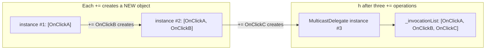
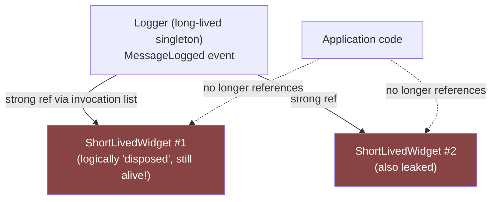
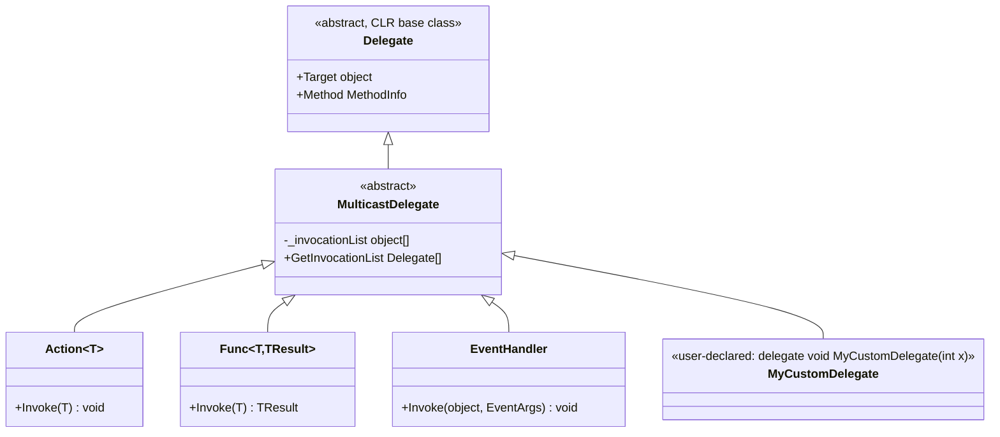
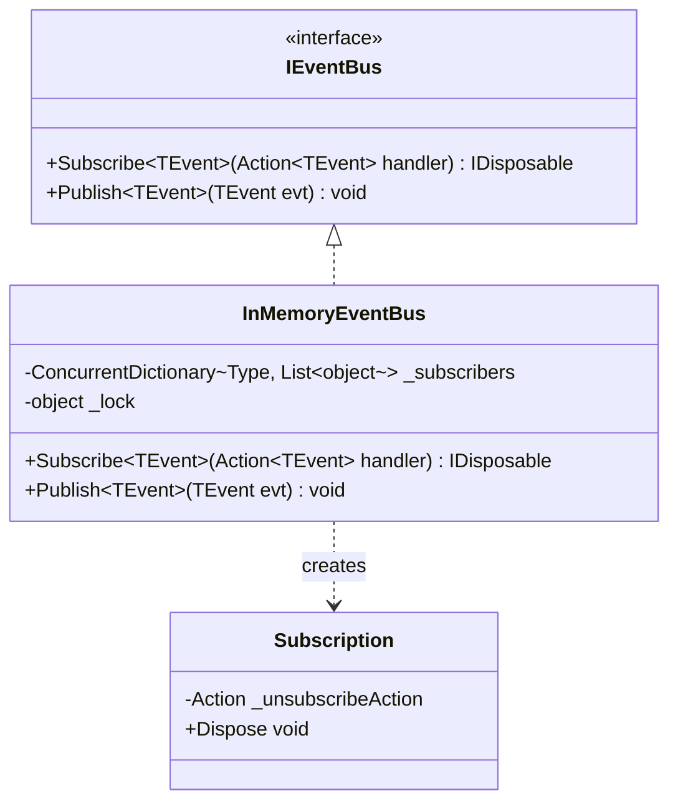
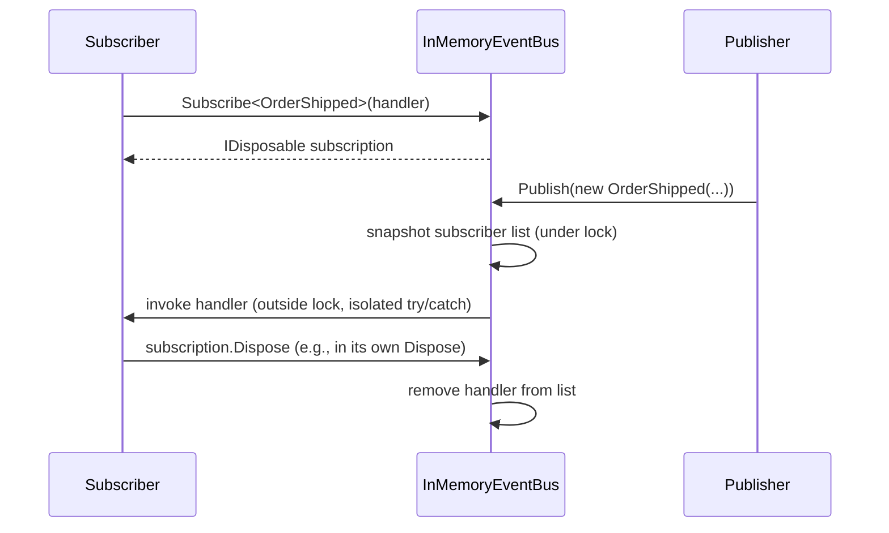

# Module 4 — C# Advanced: Delegates, Events, Closures & Multicast Internals

> Domain: C# | Level: Beginner → Expert | Prerequisite: [[01-CLR-JIT-GC-Memory-Management]] (GC roots, "lapsed listener" leak referenced), [[03-Span-Memory-Low-Allocation]] (why closures can't capture `ref struct` locals)

---

## 1. Topic Description

### Definition

A **delegate** is an object deriving from `MulticastDelegate` that holds a target reference, a method pointer and an invocation list — so it is not merely "a function", it *keeps its target object alive*. An **event** is the language's encapsulation of a delegate field: the compiler generates `add`/`remove` accessors so external code may only subscribe and unsubscribe, never invoke or replace the list. A **closure** is the compiler's mechanism for letting a lambda outlive its enclosing scope: captured locals are lifted into a generated *display class*, which is why capture is by reference and why capturing lambdas allocate. All three are lifetime constructs first and syntax second, which is why they dominate the leak and lifetime bug categories.

### Core sub-concepts

- **`Delegate` / `MulticastDelegate` internals** — target + method pointer, the invocation list, `+=` / `-=` semantics, return value of a multicast invoke.
- **`event` vs a public delegate field** — encapsulation of invocation, field-like events, explicit `add`/`remove` accessors.
- **Display classes and capture semantics** — lifted locals, capture by reference, implicit `this` capture, per-iteration capture in `foreach` versus shared capture in `for`.
- **Lambda caching** — non-capturing lambdas cached in a static field; `static` lambdas as a compile-time capture guard.
- **Subscription lifetime and leaks** — publisher-holds-subscriber direction, symmetric subscribe/unsubscribe, weak-event patterns, `WeakReference`.
- **Delegate identity** — why `-=` with a re-written lambda removes nothing.
- **Raising events safely** — null-conditional snapshot, per-handler isolation via `GetInvocationList`, exception propagation stopping the chain.
- **Async handlers** — `async void` forced by `EventHandler`'s signature, unobservable completion and exceptions.
- **Threading and reentrancy contracts** — which thread handlers run on, concurrent and reentrant raises.
- **Dispatch cost** — delegate invocation versus virtual call versus direct call; `delegate*` function pointers for interop and extreme hot paths.
- **Design alternatives** — injected callbacks, interfaces, in-process mediators, and when each beats an event.

### Where it fits

Delegates and closures underpin LINQ operators, DI factory registrations, middleware pipelines, retry and caching policies, and every callback-based API; events underpin in-process observer relationships in UI frameworks and long-lived services. Downward this depends on the GC's root and reachability model — a delegate is simply another root path. Upward it shapes coupling: whether a module notifies via an event, an injected interface or a durable message is an architectural decision with very different failure semantics.

### Why it matters at scale

An event subscription that outlives its subscriber is the single most common managed memory leak in .NET: the long-lived publisher roots the short-lived subscriber and its entire object graph, so memory grows until restart with no line of code looking wrong. A closure that accidentally captures `this` produces the same effect at controller or view-model granularity. In a DI composition root, a singleton factory lambda capturing a scoped dependency silently promotes it to application lifetime, producing disposed contexts and cross-request data bleed — a correctness and isolation bug invisible in constructors and undetectable by the container's own validation.

### Common pitfalls / anti-patterns

- **Subscribing a short-lived object to a long-lived publisher without unsubscribing** — the publisher holds the subscriber, so the whole graph leaks for the process lifetime.
- **Unsubscribing with a freshly-written lambda (`x -= () => Foo()`)** — delegate identity differs, so nothing is removed and the leak persists silently.
- **Accidental `this` capture in a lambda stored in a static or singleton** — roots the entire containing object rather than the one value actually needed.
- **Capturing a `for` loop variable** — every lambda observes the terminal value, because `for` captures one shared variable (unlike `foreach` since C# 5).
- **Raising an event without per-handler isolation** — one subscriber's exception silently prevents every subsequent subscriber from running.
- **A singleton DI registration whose factory lambda captures a scoped service** — the captured dependency is promoted to singleton lifetime and is invisible to scope validation.
- **`async void` event handlers with no internal `try`/`catch`** — the publisher continues at the first `await` and any exception is raised on the ambient context, typically killing the process.

> Scope note: GC roots and dump analysis belong to `01-CLR-JIT-GC-Memory-Management`; async continuations and `SynchronizationContext` to `02-Async-Await-Internals`; expression trees and LINQ composition to `05-LINQ-Internals`; variance rules for `Func<>`/`Action<>` to `06-Generics-Variance`.

---

## 2. Beginner (10 Q&A)


**Q1. What is a delegate at runtime — not conceptually, but as an object?**
**A:** It is an instance of a class deriving from `MulticastDelegate`, holding a target object reference (null for a static method), a method pointer, and an invocation list. Because it holds a target reference, a delegate is not just "a function" — it keeps the object whose method it points at alive for as long as the delegate itself is alive. That single fact explains most delegate-related memory leaks. Multicast delegates chain multiple targets in an invocation list, which `+=` appends to and `-=` removes from.
*Follow-up: What happens to the return value when you invoke a multicast delegate with three subscribers?*

**Q2. What does the `event` keyword actually add over a public delegate field?**
**A:** Encapsulation of the invocation list. A public delegate field lets any consumer invoke it, replace the entire list with `=`, or clear it — all of which break the publisher's contract. Declaring it as an `event` restricts external code to `+=` and `-=` only, generating `add`/`remove` accessors and keeping invocation private to the declaring type. Since a field-like event is otherwise a normal delegate field, the difference is purely about who may do what, which is exactly why it is the correct default for any public notification.
*Follow-up: When would you write explicit `add`/`remove` accessors rather than using a field-like event?*

**Q3. Explain what the compiler generates for a lambda that captures a local variable.**
**A:** It generates a *display class* — a compiler-created class with a field per captured variable — and rewrites the enclosing method so the variable lives in that class instead of on the stack. The lambda becomes a method on the display class, and the delegate's target is the display class instance. This is why capture is by *reference*, not by value: both the outer method and the lambda read and write the same field. It is also why a capturing lambda allocates: the display class instance plus the delegate itself.
*Follow-up: What does the compiler generate differently for a lambda that captures nothing?*

**Q4. Why is a non-capturing lambda cheaper than a capturing one?**
**A:** Because it has no state, so the compiler can create the delegate once and cache it in a static field, reusing the same instance for every call rather than allocating per invocation. A capturing lambda must allocate a fresh display class (holding the current values) and a fresh delegate each time, since each invocation's captured state is different. In a hot loop that difference is the whole cost, and it is the reason APIs increasingly offer overloads that take an explicit state argument — so callers can pass state without capturing.
*Follow-up: How would you rewrite `list.Where(x => x.Id == localId)` to avoid the capture?*

**Q5. Why is an event subscription such a common source of memory leaks?**
**A:** Because the direction of the reference is the opposite of what people picture: the *publisher* holds a reference to the *subscriber* through the delegate's target. So when a long-lived publisher — a singleton, a cache, a static event — is subscribed to by a short-lived object, that short-lived object and everything it references stays reachable for the publisher's entire lifetime. Nothing in the code looks wrong; the leak is in the lifetime asymmetry. The fix is either explicit unsubscription tied to the subscriber's disposal, or a weak-event pattern.
*Follow-up: How would you confirm this specific cause in a memory dump?*

**Q6. Why does `-=` sometimes fail to remove a handler?**
**A:** Because removal compares delegate instances by target and method, and a lambda written at two different places produces two different delegate instances even when the source text is identical. Subscribing with `x += () => Foo()` and later attempting `x -= () => Foo()` therefore removes nothing. The same applies to a method group converted twice in some scenarios. The reliable pattern is to keep a reference to the exact delegate you subscribed and unsubscribe with that reference.
*Follow-up: What's the equivalent trap with an anonymous method used as an async event handler?*

**Q7. What is the standard safe pattern for raising an event, and what problem does it solve?**
**A:** Take a local copy of the delegate and invoke through that — in modern C#, `Handler?.Invoke(this, args)` compiles to exactly that pattern. The problem it solves is a race: between checking the field for null and invoking it, another thread could unsubscribe the last handler, making the field null and the invocation throw. Snapshotting removes the window. It does not solve the related, subtler issue that a handler unsubscribed a microsecond ago may still be invoked from the snapshot, which handlers must tolerate.
*Follow-up: Is the snapshot enough to make event invocation thread-safe? What isn't it protecting?*

**Q8. What happens if one subscriber throws while an event is being raised?**
**A:** The exception propagates out of the invoke call immediately, and the remaining subscribers in the invocation list are never called. This makes multicast invocation fragile: one badly-behaved subscriber silently disables every subscriber registered after it, and the publisher usually has no idea. If independent delivery matters, the publisher must enumerate `GetInvocationList()` and invoke each handler inside its own `try`/`catch`, deciding explicitly whether to collect or log the failures.
*Follow-up: Where would you rather have that isolation live — in the publisher, or in every handler?*

**Q9. Why are `async void` event handlers so common, and what does that cost?**
**A:** Because the standard `EventHandler` delegate returns `void`, so an asynchronous handler has no shape other than `async void`. The cost is that the publisher cannot await it — the handler returns at its first suspension point, so the publisher continues as if it were done — and any exception is raised on the ambient context rather than being catchable by the publisher, which commonly means a process crash. If a handler genuinely needs to do async work, either the event should be replaced by a delegate returning `Task` that the publisher awaits, or the handler must wrap its entire body in a `try`/`catch`.
*Follow-up: How would you design an event-like notification that supports asynchronous handlers properly?*

**Q10. What is the difference between a delegate call and a virtual method call in terms of what the runtime does?**
**A:** A virtual call resolves through the type's method table using the object's concrete type; a delegate call is an indirect call through a stored function pointer plus a target reference, so it cannot generally be devirtualised or inlined. In practice the JIT can sometimes inline through a delegate when the target is provably constant, but the safe assumption is that a delegate invocation costs slightly more than a virtual call and considerably more than a direct call. That difference is irrelevant almost everywhere and matters only in extremely hot inner loops — which is where `delegate*` function pointers or generic constraints become worth considering.
*Follow-up: When would you reach for a generic struct constraint instead of a delegate to get the call inlined?*

---

## 3. Intermediate (10 Q&A)


**Q1. A WPF or long-lived service leaks memory and dumps show view models rooted by a singleton's event. Walk me through the fix options and their trade-offs.**
**A:** The straightforward fix is symmetric lifetime management: subscribe in initialisation, unsubscribe in `Dispose`, and make sure the subscriber is actually disposed — which relies on discipline that the code review process will not reliably enforce. The weak-event pattern removes the reliance by having the publisher hold a weak reference, so the subscriber can be collected while subscribed, at the cost of complexity and slower invocation. A third option is inverting the relationship entirely: instead of subscribing to a singleton, have the subscriber poll or receive notifications through a scoped mediator whose lifetime matches theirs. I would prefer the third where the architecture allows it, because it removes the failure mode rather than managing it.
*Follow-up: What's the downside of weak events when the subscriber's only remaining reference is the subscription itself?*

**Q2. Explain a closure bug involving a loop variable, and what changed in C# 5.**
**A:** Capturing a `for` loop's variable captures the single variable, not its per-iteration value, so every lambda created in the loop sees the final value — the classic "all my tasks printed 10." C# 5 changed `foreach` so that the iteration variable is a fresh variable per iteration, fixing that case, but `for` loops still capture one shared variable. The bug is most damaging with deferred execution or asynchronous work, where the lambdas run after the loop finishes and all observe the terminal value. The fix is an explicit per-iteration local copied inside the loop body.
*Follow-up: How does this interact with `Task.Run` inside a loop, and why is that combination especially confusing to debug?*

**Q3. How do you spot an accidental `this` capture, and why does it matter more than capturing a local?**
**A:** It happens whenever a lambda references an instance field or calls an instance method — the compiler captures `this`, not the field, so the delegate roots the entire containing object and everything it references. It matters far more than capturing a small local because the retained graph can be a whole controller, service or view model with its dependencies attached. You spot it by reading what the lambda touches, and confirm it in a dump where the display class's field is the containing type. The mitigation is to copy the needed value into a local before the lambda, so only that value is captured.
*Follow-up: A lambda registered with a static cache captures `this`. What's the resulting lifetime, and how would that show up in production?*

**Q4. When would you use `event` versus an injected callback delegate versus an in-process mediator?**
**A:** An `event` fits genuinely optional, multi-subscriber notification where the publisher does not care whether anyone is listening — UI updates, lifecycle notifications. An injected callback (`Func<>`/`Action<>` or a small interface) fits a mandatory single collaborator, and is far better for testability and for making the dependency visible in the constructor. A mediator fits when you want decoupled request/notification dispatch with cross-cutting behaviour, at the cost of indirection that makes call graphs hard to follow. My default in a service codebase is the injected interface, because events hide dependencies from the constructor and thus from anyone reading the class.
*Follow-up: A team has adopted a mediator library for everything internal. What symptoms would make you push back?*

**Q5. Someone raises an in-process event and expects downstream handlers to have completed when it returns. What is wrong with that?**
**A:** For synchronous handlers it happens to be true, which is exactly what makes it dangerous — the code works until someone adds an `async void` handler, at which point the publisher continues after the handler's first `await` and the ordering assumption breaks silently. It is also fragile because handler execution is on the publisher's thread, so a slow handler blocks the publisher, and an exception in one handler skips the rest. If completion actually matters, this should not be an event at all — it should be an awaited call or a proper pipeline with explicit ordering and error handling.
*Follow-up: How would you refactor an existing event with ten subscribers where three now need to be async?*

**Q6. What are the real costs of delegate allocation in a hot path, and how would you eliminate them?**
**A:** Each capturing lambda allocates a display class plus a delegate, so a per-item callback in a tight loop can dominate an otherwise allocation-free path. The remedies in order of preference: hoist the delegate out of the loop when the captured state does not change; use an API overload that accepts explicit state so nothing is captured; use a static lambda (`static` on the lambda makes accidental capture a compile error); or, in genuinely extreme cases, replace the delegate with a generic struct implementing an interface so the JIT specialises and inlines the call. I would only go past the first two with a profile showing delegate allocation is material.
*Follow-up: What does marking a lambda `static` actually guarantee, and why is it useful even where performance doesn't matter?*

**Q7. How do you make event invocation resilient when subscribers are third-party or plugin code?**
**A:** Enumerate `GetInvocationList()` and invoke each handler in its own `try`/`catch`, logging failures with enough identity to name the offending subscriber, so one plugin cannot silence the others. I would also consider a timeout or a watchdog if handlers can block, since a hung subscriber otherwise hangs the publisher, and would document that handlers must be fast and non-blocking. If subscribers are genuinely untrusted, in-process events are the wrong boundary altogether — the right answer is process isolation or a queue, because you cannot defend against a plugin that allocates a gigabyte or spins a core.
*Follow-up: You add per-handler catch blocks and now failures are invisible because they're only logged. How do you surface them?*

**Q8. How would you unit test a class that raises events, and what usually gets missed?**
**A:** Subscribe a test handler, exercise the operation, and assert on the arguments and the number of invocations — that part is easy. What gets missed is the negative and lifecycle cases: that unsubscribing actually stops delivery, that no event fires on the failure path, that raising with no subscribers does not throw, and — most importantly — that the subscriber is unsubscribed on disposal, which is the leak everyone ships. I would also assert that a throwing handler does not prevent the remaining ones from being called, if the publisher claims that isolation.
*Follow-up: How would you write an automated test that fails when a subscription leak is introduced?*

**Q9. When is `WeakReference`/weak events the right tool, and when is it a smell?**
**A:** It is right when the publisher's lifetime is genuinely unbounded relative to subscribers and unsubscription cannot be reliably enforced — classic in UI frameworks, where the platform owns object lifetimes. It is a smell in a service codebase, where it usually means the object graph's ownership is unclear and someone is patching over it: weak references make lifetimes non-deterministic, so objects disappear at times determined by the collector, and bugs become load-dependent and unreproducible. My preference is to fix the ownership so subscriptions are scoped, and treat weak events as the exception with a comment explaining why the ownership could not be fixed.
*Follow-up: A cache uses weak references so entries "clean themselves up." What behaviour will the team observe in production?*

**Q10. What are `delegate*` function pointers for, and when would you actually use one?**
**A:** They are raw managed function pointers — no target object, no allocation, no invocation list — introduced for scenarios where even the delegate object is too expensive or where you need a native calling convention for interop. Realistic uses are interop callbacks that must be passed to native code without a GC-visible wrapper, and extremely hot dispatch loops in runtime-level code. They require `unsafe`, provide none of a delegate's safety, and cannot capture state, so in ordinary application code they are almost always the wrong tool. Recognising when someone has reached for them without justification is more valuable in an interview than knowing the syntax.
*Follow-up: What lifetime hazard do you have to manage when passing a managed function pointer to native code?*

---

## 4. Expert / Architect (10 Q&A)


**Q1. A team proposes an in-process event bus to decouple modules in a modular monolith. How do you evaluate that?**
**A:** I would ask what property they actually want, because "decoupling" usually conflates three different things: compile-time independence, runtime independence, and team independence. An in-process event bus gives the first and none of the others — handlers still run in the same process, on the publisher's thread by default, sharing its failure domain, transaction and memory — so a slow or failing handler is still the publisher's problem. It also destroys call-graph navigability, which is a genuine long-term cost in a large codebase. I would support it where the notification is genuinely fire-and-forget and cross-module, insist that events represent facts rather than commands, and require that anything needing durability, retry or ordering goes through a real broker with an outbox instead.
*Follow-up: Where exactly is the line between "in-process event is fine" and "this needs to be a durable message"?*

**Q2. How would you eradicate event-subscription leaks across a large estate rather than fixing them case by case?**
**A:** Prevention beats detection here, so first I would attack the pattern: prefer scoped DI-managed collaborators over long-lived publishers, and make static and singleton events an explicitly reviewed exception, since they are the shape that leaks. Where the pattern must exist, standardise a subscription-token type that is `IDisposable` and unsubscribes on dispose, so the lifetime is expressed in the type system rather than in a comment. For detection, I would add a soak test in CI that runs a realistic workload and asserts on heap growth and instance counts of key types, which catches this class of leak before release. And I would make the diagnosis reproducible — a runbook showing exactly how `!dumpheap` plus `!gcroot` identifies it, so it is a twenty-minute investigation rather than a two-day one.
*Follow-up: The soak test is slow and gets skipped on PRs. Where do you run it instead?*

**Q3. Callbacks and events are being used as extension points in a shared platform library. What API design guidance would you set?**
**A:** For a shared library, I would prefer explicit interfaces over events for anything the platform *depends on*, because an interface makes the contract discoverable, versionable and mockable, while an event makes it optional and invisible. Where callbacks are right, I would define delegates that take an explicit state parameter to avoid forcing consumers into closures on hot paths, return `Task` where async is plausible so it is not a breaking change later, and pass a `CancellationToken`. I would specify the threading contract explicitly — which thread the callback runs on, whether it may block, whether reentrancy is permitted — because unspecified threading contracts are where platform libraries generate support tickets forever. And I would treat every callback as untrusted: the platform isolates failures rather than assuming well-behaved consumers.
*Follow-up: You need to add a parameter to an existing public event's args type. What are your options without breaking consumers?*

**Q4. In a high-throughput service, delegate allocation from callbacks shows up as a leading allocation source. How do you approach it?**
**A:** I would first check whether the allocations are actually causing harm — gen0 allocation that dies immediately is cheap, and this is a classic case of a profiler's "top allocation sites" view being mistaken for a top cost. If it is genuinely material, the ordered fixes are: hoist invariant delegates out of loops, switch to overloads that accept explicit state, apply `static` lambdas so capture becomes a compile error, and only then consider structural changes like generic struct callbacks. The architectural point I would make to the team is that this is a hot-path technique with a readability cost, so it belongs in a narrow, benchmarked, owned layer — not as a coding standard imposed across the service.
*Follow-up: `static` lambdas eliminate capture but you need per-call state. How does the API have to change?*

**Q5. How do you reason about threading and reentrancy for events in a concurrent service?**
**A:** The default contract is unforgiving: handlers run synchronously on whatever thread raised the event, concurrently if the event is raised concurrently, and possibly reentrantly if a handler causes the same event to be raised again. That means handler code must be thread-safe and must not assume it is called once at a time — an assumption that is almost never written down and almost always made. If a handler takes a lock that the publisher also holds, you have a lock-ordering deadlock waiting for load. My guidance is to specify the contract in the publisher's documentation, keep handlers short and non-blocking, and where serialisation is genuinely needed, move to an explicit queue with a single consumer rather than relying on locks inside handlers.
*Follow-up: Where would you put the boundary between "handler must be thread-safe" and "publisher serialises delivery"?*

**Q6. Migrating a legacy system with heavy event usage to a distributed architecture — what breaks?**
**A:** Every implicit guarantee that in-process events provided for free: synchronous ordering, same-transaction visibility, exactly-one delivery, and the ability to observe an exception from a handler. Across a network you get at-least-once delivery, out-of-order arrival, partial failure, and no shared transaction — so handlers that were idempotent by accident are now the design problem. The migration approach I would use is to first make the in-process events look like distributed ones (explicit event contracts, idempotent handlers, no reliance on ordering or on the publisher's transaction), and only then swap the transport. Doing it the other way round produces a distributed system with monolith assumptions baked in, which is the most expensive class of failure to unwind.
*Follow-up: Which of those in-process guarantees would you try hardest to preserve, and how?*

**Q7. How do you make event-driven code inside a process observable?**
**A:** Instrument the dispatch point rather than the handlers, since that is the one place you control: emit a span or activity per event raise, tag it with the event type and subscriber count, and record per-handler duration and outcome when invoking the invocation list individually. Without that, an event-heavy codebase is a black box during an incident — you can see the request slow down but not which subscriber caused it. I would also expose subscriber counts as a metric, because a subscription leak shows up there long before it shows up as memory pressure. The general principle is that any indirection you add to a system, you must also add observability for, or you have traded debuggability for decoupling.
*Follow-up: How do you keep that instrumentation from dominating the cost of a high-frequency event?*

**Q8. What is your position on using events in a domain model, e.g. domain events raised by aggregates?**
**A:** I like domain events as a modelling device but not raised through C# `event` members. The right pattern is for the aggregate to *record* events into a collection which the application layer collects and dispatches after the transaction commits — that keeps the domain free of dispatch concerns, makes the events testable as data, and crucially prevents handlers from running inside the aggregate's transaction where a failure would corrupt the unit of work. Raising real C# events from an aggregate couples the domain to subscribers, makes ordering implicit, and invites handlers to perform I/O mid-transaction. The distinction between recording and dispatching is one of the more reliable signals of whether someone has actually operated a DDD codebase.
*Follow-up: The handler needs to run in the same transaction for consistency. How do you handle that without coupling the aggregate?*

**Q9. How do closures interact with lifetime in a DI container, and what failure does that produce?**
**A:** A lambda registered with the container — a factory delegate, an options configuration callback, a filter predicate — captures whatever it references, and if the registration is singleton, that captured state becomes singleton-lived too. The classic failure is a factory lambda that captures a scoped service or a request-specific value, silently promoting it to application lifetime: you get a stale or cross-request value, or a disposed `DbContext` used by a later request. It is insidious because the captured dependency does not appear in any constructor, so the container's own lifetime validation cannot see it. I would ban capturing anything but the container/provider in singleton registrations, and rely on scope-validation plus code review focused specifically on lambdas in composition roots.
*Follow-up: How would you detect a captured scoped dependency in a singleton factory before production?*

**Q10. A shared internal library exposes a static event that many services subscribe to. What is your assessment?**
**A:** Static events are the worst combination available: unbounded publisher lifetime, invisible global coupling, no scoping per tenant or request, subscription leaks with no natural unsubscribe point, and — in a library used by many services — a failure mode that reproduces differently in each consumer. They also make testing awful, because state leaks between tests and ordering becomes significant. I would treat this as a defect rather than a design and plan a migration: introduce an injectable instance-scoped notifier with the same shape, dual-publish during transition, migrate consumers with telemetry showing who is still on the static path, then remove it. The organisational point is that a shared library's mistakes are amortised across the estate, so its API deserves stricter review than any individual service's.
*Follow-up: One consumer can't migrate for two quarters. How do you avoid the deprecation stalling indefinitely?*

---

## 5. Reference Material

> Retained from the original module: deep-dive internals, diagrams, production examples, exercises, system/low-level design, debugging walkthroughs and the Principal Engineer perspective.

### 1. Fundamentals

#### What is a delegate?
A **delegate** is a type-safe, object-oriented function pointer: a reference type that holds (a) a reference to a method (static or instance), and (b) if instance, a reference to the target object the method should run on. Calling a delegate invokes the method it points to, with full type checking of the signature at compile time — unlike a raw C function pointer.

#### What is an event?
An **event** is a language-level wrapper around a delegate field that restricts how outside code can interact with it: external code can only `+=`/`-=` (subscribe/unsubscribe) a handler; only the declaring class can `Invoke` it (raise it) or assign it outright (`=`). This is the **Observer pattern** baked directly into the language.

#### What is a closure?
A **closure** is what the compiler generates when a lambda or anonymous method references a variable from its enclosing scope (a local variable, a parameter, or `this`). The compiler lifts that captured variable into a compiler-generated class (or occasionally a struct, for closures that provably don't escape —) so the lambda can keep referencing it even after the enclosing method has returned.

#### Why do these exist?
- **Delegates**: C# needed a type-safe way to pass "behavior" as data — callbacks, strategy objects, LINQ predicates — without falling back to untyped function pointers or reflection-based invocation.
- **Events**: Plain public delegate fields would let any external code not just subscribe, but also **overwrite the entire invocation list** (`myObject.SomeDelegate = null;` or `= someHandler;`, wiping out every other subscriber) or **raise the event** on someone else's object. The `event` keyword closes both holes — a canonical example of "the language enforces an encapsulation boundary that a plain field cannot."
- **Closures**: Without them, lambdas could only operate on their own parameters — hugely limiting for LINQ (`items.Where(x => x > threshold)` needs to capture `threshold`), event handlers, and async continuations.

#### When does this matter?
- **Always** — delegates/events underpin events (UI, domain events), LINQ, `Action`/`Func` callback APIs, and the entire async/await continuation mechanism (the `MoveNext` *is* effectively a delegate-shaped continuation).
- **Critically** for memory-leak diagnosis — the "lapsed listener" pattern is purely an events/delegates phenomenon: a long-lived publisher's invocation list keeps every subscriber alive indefinitely if they never unsubscribe.
- **Critically** for closure-capture correctness — the classic "captured loop variable" bug and closure-induced allocation are both top-tier interview and code-review topics.

#### How does it work (30,000-ft view)?

```csharp
public class Button
{
    public event EventHandler? Click; // compiler generates a private backing delegate field + add/remove accessors

    public void SimulateClick => Click?.Invoke(this, EventArgs.Empty); // only the declaring class can invoke
}

var button = new Button;
button.Click += (s, e) => Console.WriteLine("Clicked!"); // external code can only +=/-=, not assign or invoke
```

Mental model for interviews: **"An event is a delegate with the field made private and only `+=`/`-=` exposed publicly. A closure is a delegate whose target is a compiler-generated object holding the captured variables."**

### 2. Deep Dive

#### 2.1 Delegate Internals — What `Action`/`Func` Actually Are

Every delegate type (including `Action<T>`, `Func<T,TResult>`, and any custom `delegate` declaration) compiles to a **sealed class deriving from `MulticastDelegate`** (itself deriving from `Delegate`), with compiler-synthesized `Invoke`, `BeginInvoke`/`EndInvoke` (legacy, rarely used since async/await superseded the APM pattern), and constructor. Internally, a delegate instance holds:
- `_target`: the object instance the method should run on (`null` for a static method).
- `_methodPtr`: an internal method pointer/token identifying the target method.
- `_invocationList` + `_invocationCount`: used only when the delegate is a **multicast** delegate wrapping more than one subscriber.

Every delegate allocation is a **heap allocation** — assigning a lambda, method group, or anonymous method to a delegate-typed variable allocates a delegate object (unless the runtime can cache/reuse it —).

#### 2.2 Multicast Delegates — the `+=` Mechanism

`event`/delegate fields in C# are **multicast** by default (`MulticastDelegate`). `handler1 + handler2` doesn't mutate either delegate — delegates are **immutable**; `+` (and thus `+=`) creates a **brand-new delegate instance** whose internal invocation list is the concatenation of both operands' lists.

```csharp
EventHandler? h = null;
h += OnClickA; // h = new delegate wrapping [OnClickA]
h += OnClickB; // h = ANOTHER new delegate wrapping [OnClickA, OnClickB] -- h now points to a different object
h -= OnClickA; // h = yet another new delegate wrapping [OnClickB] -- -= does a linear scan + rebuild, not a "removal in place"
```

**Invocation order**: subscribers are called **synchronously, in subscription order**, on the *same thread* that raised the event — there is no concurrency here unless the handlers themselves spawn async work.

**Return values with multicast**: `Invoke` on a multicast delegate with a non-`void` return type calls every subscriber in order but only returns **the last subscriber's return value** — every earlier subscriber's return value is silently discarded. This is a very commonly missed interview/code-review fact and a real production bug source.

**Exception propagation**: if subscriber #2 (of 4) throws, subscribers #3 and #4 **never run** — the exception propagates immediately out of `Invoke`, aborting the remaining invocation list. This is why robust event-raising code often needs to iterate the invocation list manually (`GetInvocationList`) and catch per-subscriber exceptions if "one bad subscriber shouldn't break the others" is a requirement.


```mermaid
graph LR
 subgraph "h after three += operations"
 D3["MulticastDelegate instance #3"] --> IL["_invocationList: [OnClickA, OnClickB, OnClickC]"]
 end
 subgraph "Each += creates a NEW object"
 D1["instance #1: [OnClickA]"] -->|"+= OnClickB creates"| D2["instance #2: [OnClickA, OnClickB]"]
 D2 -->|"+= OnClickC creates"| D3
 end
```

#### 2.3 Closures — the Compiler Transformation in Detail

```csharp
// You write:
int threshold = 10;
Func<int, bool> isAboveThreshold = x => x > threshold;

// Compiler generates (simplified):
private sealed class DisplayClass0
{
    public int threshold;
    public bool Lambda(int x) => x > threshold;
}
var displayClass = new DisplayClass0 { threshold = 10 };
Func<int, bool> isAboveThreshold = displayClass.Lambda; // delegate targets the DisplayClass0 instance
```

Key facts:
- The captured variable `threshold` becomes a **field** on a compiler-generated class instance (the "display class") — it's no longer a true stack local once captured. This is exactly why mutating a captured variable *after* creating the lambda is visible *inside* the lambda too — they share the same field, not independent copies.
- **This is a heap allocation** (the display class instance) — every closure that captures anything allocates, unless the JIT/compiler can prove it's unnecessary (rare, and not something to rely on).
- **Multiple lambdas in the same method sharing captured variables share the same display class instance** — the compiler is smart enough to generate one display class per *scope*, not one per lambda, so two lambdas both capturing `threshold` share a single allocated object.
- **`foreach` loop variables get a fresh capture per iteration** (fixed in C# 5 for `foreach`; **`for` loops still share one variable across iterations unless you introduce a fresh local inside the loop body**) — this distinction is one of the most common "gotcha" interview questions.

#### 2.4 Delegate Caching and Allocation Avoidance

- A lambda that **captures nothing** (no closure over locals/`this`) is compiled to a **static method** with a delegate instance that the compiler **caches in a static field** and reuses across every call — genuinely zero allocation after the first invocation.
- A lambda that captures **only `this`** (an instance method reference, not a local) creates a new delegate per call (since it needs to bind to `this`), but does *not* need a separate display-class heap object — the delegate's `_target` is simply the enclosing instance itself.
- A lambda capturing **local variables** always allocates a new display-class instance per invocation of the enclosing method (not per lambda invocation) — understanding "per enclosing-method-call, not per lambda-call" is important for reasoning about allocation rate in loops (performance discussion, and the `for`/`foreach` capture-scope nuance).

#### 2.5 Events vs Delegate Fields — the Encapsulation Mechanism Precisely

```csharp
public class Publisher
{
    public event EventHandler? SomethingHappened; // compiler-enforced: external code can ONLY += / -=

    // Internally (what the field-like event actually compiles to, roughly):
    // private EventHandler? _somethingHappened
    // public event EventHandler SomethingHappened
    // {
    // add { _somethingHappened += value; } // synchronized in older compilers via Delegate.Combine + lock
    // remove { _somethingHappened -= value; }
    // }
}
```
Without `event` (a plain `public EventHandler? SomethingHappened;` field), any external caller could do `publisher.SomethingHappened = null;` (silently wiping every other subscriber) or `publisher.SomethingHappened?.Invoke(...)` (raising the event on someone else's object) — both are real encapsulation violations `event` exists specifically to prevent. **A subtle but real interview point**: the auto-generated `add`/`remove` accessors on a plain field-like `event` are **not thread-safe against each other before.NET-version-specific compiler changes** (older compilers used `lock(this)`-free `Delegate.Combine`/`CompareExchange`-based patterns that could lose a concurrent subscription under a race) — modern C# compilers generate a lock-free `Interlocked.CompareExchange`-based loop for field-like events specifically to close this race safely.

#### 2.6 The "Lapsed Listener" Memory Leak — Precise Mechanics

```csharp
public class Logger // long-lived singleton
{
    public event Action<string>? MessageLogged;
    public void Log(string msg) => MessageLogged?.Invoke(msg);
}

public class ShortLivedWidget
{
    public ShortLivedWidget(Logger logger)
    {
        logger.MessageLogged += OnMessageLogged; // subscribes -- Logger's invocation list now references this widget
    }
    private void OnMessageLogged(string msg) { /*... */ }
    // No unsubscribe anywhere!
}
```
`Logger.MessageLogged`'s invocation list holds a reference to `ShortLivedWidget.OnMessageLogged`'s **target** — i.e., the `ShortLivedWidget` instance itself. As long as `Logger` (long-lived) is reachable, its `MessageLogged` field is a **GC root path** keeping every subscribed `ShortLivedWidget` alive forever, even after all other references to it are gone and the application logically considers it "disposed of." This is invisible in ordinary code review (no obviously-wrong line) and shows up specifically as a steadily-growing object count for the *subscriber* type in a heap dump — not the publisher — which is the classic diagnostic confusion this bug causes.

#### 2.7 Weak Event Pattern

To let a long-lived publisher hold subscribers **without** keeping them alive, use a `WeakReference<T>`-based subscription list instead of a normal delegate invocation list — the.NET ecosystem's built-in version is `WeakEventManager` (WPF) or a hand-rolled equivalent:

```csharp
public class WeakEventSubscription<TArgs>
{
    private readonly List<WeakReference<Action<TArgs>>> _handlers = new;

    public void Subscribe(Action<TArgs> handler) => _handlers.Add(new WeakReference<Action<TArgs>>(handler));

    public void Raise(TArgs args)
    {
        for (int i = _handlers.Count - 1; i >= 0; i--)
        {
            if (_handlers[i].TryGetTarget(out var handler)) handler(args);
            else _handlers.RemoveAt(i); // prune dead subscribers as we go
        }
    }
}
```
**Trade-off**: The subscriber's *delegate object itself* must not be the only reference keeping the subscriber's target alive elsewhere either (a common subtlety — if the delegate wraps a lambda whose only strong reference is the list, the `WeakReference<Action<TArgs>>` doesn't help unless the *subscriber object* is independently rooted by something else the caller controls) — this pattern is correct but easy to apply incompletely; genuinely understanding it is an Advanced/Expert-tier signal.


```mermaid
graph TD
 Logger["Logger (long-lived singleton)<br/>MessageLogged event"] -->|"strong ref via invocation list"| Widget1["ShortLivedWidget #1<br/>(logically 'disposed', still alive!)"]
 Logger -->|"strong ref"| Widget2["ShortLivedWidget #2<br/>(also leaked)"]
 AppCode["Application code"] -.->|"no longer references"| Widget1
 AppCode -.->|"no longer references"| Widget2
 style Widget1 fill:#844,color:#fff
 style Widget2 fill:#844,color:#fff
```

#### 2.8 `Delegate.Combine`/`Remove` Cost

Each `+=`/`-=` on a multicast delegate with N existing subscribers is **O(N)** (a new array-backed invocation list is built by copying). This is fine for typical event usage (a handful of subscribers) but is a real, measurable cost if code mistakenly subscribes/unsubscribes in a hot loop (e.g., subscribing inside a per-request handler instead of once at startup) — an anti-pattern worth naming explicitly.

### 3. Visual Architecture

#### Delegate Type Hierarchy


```mermaid
classDiagram
 class Delegate {
 <<abstract, CLR base class>>
 +Target object
 +Method MethodInfo
 }
 class MulticastDelegate {
 <<abstract>>
 -_invocationList object[]
 +GetInvocationList Delegate[]
 }
 class Action~T~ {
 +Invoke(T) void
 }
 class Func~T,TResult~ {
 +Invoke(T) TResult
 }
 class EventHandler {
 +Invoke(object, EventArgs) void
 }
 class MyCustomDelegate {
 <<user-declared: delegate void MyCustomDelegate(int x)>>
 }
 Delegate <|-- MulticastDelegate
 MulticastDelegate <|-- Action~T~
 MulticastDelegate <|-- Func~T,TResult~
 MulticastDelegate <|-- EventHandler
 MulticastDelegate <|-- MyCustomDelegate
```

#### Closure Capture Data Flow (ASCII)

```
Method scope:
 int threshold = 10; ┌─────────────────────┐
 Action a = => { │ DisplayClass (heap) │
 threshold++; │ int threshold = 10 │◄────┐
 Console.WriteLine(threshold);│ │ │
 }; └─────────────────────┘ │
 a; // prints 11 ▲ │
 Console.WriteLine(threshold); // 11 (!) │ delegate targets │
 │ this instance │
 ┌────────┴────────┐ │
 │ Action delegate │──────────┘
 │ _target = DisplayClass
 │ _methodPtr = Lambda
 └─────────────────┘
```

### 4. Production Example

#### Scenario: Real-time dashboard service — memory growth traced to WebSocket connection handlers

**Problem**: A real-time analytics dashboard (ASP.NET Core with a long-lived `WebSocket` per connected client, backed by a singleton `MetricsBroadcastService`) showed steadily growing memory over days, with `dotnet-gcdump` showing `ClientConnectionHandler` instance counts climbing far beyond the actual number of concurrently connected browser tabs (confirmed via load-balancer connection counts).

**Investigation**:
- `dotnet-gcdump`'s "path to root" analysis on a sample `ClientConnectionHandler` instance (one that should have been collected after its browser tab closed) showed a reference chain: `MetricsBroadcastService.MetricUpdated` (a singleton-scoped `event`) → its invocation list → the disconnected `ClientConnectionHandler.OnMetricUpdated` method target.
- Code review confirmed: `ClientConnectionHandler`'s constructor subscribed to `MetricsBroadcastService.MetricUpdated += OnMetricUpdated`, but its `Dispose`/connection-close handling path never called `-=` — a straightforward lapsed-listener bug, at the scale of thousands of connections/day across the service's lifetime.

**Architecture fix**:
- Added `MetricsBroadcastService.MetricUpdated -= OnMetricUpdated;` to `ClientConnectionHandler`'s `Dispose`, and audited every other singleton-scoped event subscription in the codebase for the same pattern (found two more instances).
- Added an analyzer rule (a custom Roslyn analyzer, since no built-in one covers this precisely) flagging any class implementing `IDisposable` that subscribes to an event (`+=`) in a constructor/initializer without a matching `-=` appearing anywhere in its `Dispose` method body.
- For one genuinely hard case (a handler whose lifetime was managed by a third-party library that didn't expose a reliable disposal hook), switched to the weak-event pattern instead of relying on an unsubscribe call that couldn't be guaranteed to run.

**Trade-offs**: The weak-event fallback adds a small per-raise cost (iterating and pruning dead `WeakReference`s) compared to a normal strong-reference invocation list — accepted only for the one case where deterministic unsubscription genuinely couldn't be guaranteed, not applied universally (unnecessary complexity for the majority of cases where `Dispose`-based unsubscription is reliable).

**Lessons learned**:
1. The lapsed-listener leak's heap-dump signature is distinctive: the *subscriber* type count grows, but the reference-path analysis always leads back through the *publisher's* event field — train the team to recognize this shape immediately rather than treating each occurrence as a novel mystery.
2. `IDisposable` classes that subscribe to external events without a paired unsubscribe are the single highest-value pattern to catch in code review or via static analysis for this bug class.
3. Weak references are a valid but non-default tool — reach for them only when deterministic unsubscription is provably unavailable, not as a blanket "safer" default (they add real overhead and complexity).

### 11. Coding Exercises

#### Easy — Fix a `for`-loop closure-capture bug
**Problem**: This code is supposed to print 0, 1, 2 but prints 3, 3, 3.
```csharp
var actions = new List<Action>;
for (int i = 0; i < 3; i++)
{
    actions.Add(=> Console.WriteLine(i));
}
foreach (var a in actions) a; // prints "3" three times
```
**Solution**:
```csharp
var actions = new List<Action>;
for (int i = 0; i < 3; i++)
{
    int local = i; // fresh variable captured per iteration
    actions.Add(=> Console.WriteLine(local));
}
foreach (var a in actions) a; // prints 0, 1, 2
```
**Time/Space**: Unchanged algorithmically — this is purely a correctness fix. Each closure still allocates a display-class instance per iteration (since `local` differs per iteration, they can't share one instance) — this is the *correct*, necessary cost here, not something to further optimize away.
**Discussion**: This is precisely why `foreach` didn't have this bug even before the fix mattered as much (each element binds to a fresh iteration variable automatically) — converting the `for` to a `foreach` over `Enumerable.Range(0, 3)` would also fix it, at the cost of a small amount of iterator overhead versus the plain `for` loop.

#### Medium — Implement exception-isolated event raising
**Problem**: Given a `public event Action<string> OnMessage;` with multiple subscribers, ensure all subscribers run even if one throws, and surface every exception to the caller.
```csharp
public class RobustPublisher
{
    public event Action<string>? OnMessage;

    public void Publish(string message)
    {
        var handler = OnMessage; // capture to local for thread-safety
        if (handler is null) return;

        List<Exception>? exceptions = null;
        foreach (Action<string> subscriber in handler.GetInvocationList)
        {
            try
            {
                subscriber(message);
            }
            catch (Exception ex)
            {
                (exceptions??= new List<Exception>).Add(ex);
            }
        }
        if (exceptions is not null)
            throw new AggregateException("One or more subscribers failed.", exceptions);
    }
}
```
**Time complexity**: O(N) in subscriber count either way (invoking N subscribers is inherently O(N)) — the exercise adds no asymptotic cost, only per-subscriber exception-handling overhead (negligible in the non-throwing case). **Space**: O(1) in the common case (no exceptions); O(K) for K failed subscribers if exceptions occur.
**Optimized**: For very high subscriber counts where allocating the invocation-list array (`GetInvocationList` itself allocates) matters, a custom `List<Action<string>>`-backed registry (Expert Q8's pattern) avoids that specific allocation — worth it only if profiling shows this path is hot.

#### Hard — Implement the weak-event pattern generically
**Problem**: Implement a reusable `WeakEvent<TArgs>` that doesn't keep subscribers alive, with automatic pruning of collected subscribers.
```csharp
public sealed class WeakEvent<TArgs>
{
    private readonly List<WeakReference<Action<TArgs>>> _subscribers = new;
    private readonly object _lock = new;

    public void Subscribe(Action<TArgs> handler)
    {
        lock (_lock) { _subscribers.Add(new WeakReference<Action<TArgs>>(handler)); }
    }

    public void Unsubscribe(Action<TArgs> handler)
    {
        lock (_lock)
        {
            _subscribers.RemoveAll(wr =>!wr.TryGetTarget(out var target) || target == handler);
        }
    }

    public void Raise(TArgs args)
    {
        List<Action<TArgs>> live = new;
        lock (_lock)
        {
            for (int i = _subscribers.Count - 1; i >= 0; i--)
            {
                if (_subscribers[i].TryGetTarget(out var handler)) live.Add(handler);
                else _subscribers.RemoveAt(i); // prune dead entries opportunistically
            }
        }
        foreach (var handler in live) handler(args); // invoke OUTSIDE the lock to avoid holding it during subscriber code
    }
}
```
**Time complexity**: O(N) per `Raise` (N = current subscriber count, including pruning). **Space**: O(N) for the subscriber list, but crucially **does not** prevent subscriber GC — a subscriber with no other strong references is collected normally and simply pruned from `_subscribers` on the next `Raise`.
**Discussion points**: The critical, easy-to-miss correctness detail (flagged) — this only works if the **subscriber object's own lifetime** isn't itself artificially extended by something else; if `handler` is a lambda whose *only* strong reference anywhere in the program is this list, wrapping it in `WeakReference` doesn't help because nothing else keeps the lambda's closure alive either way, meaning it could be collected *immediately* (even while "still needed") unless the caller independently holds a strong reference to the subscription for as long as they want it active — worth stating explicitly in an interview as the pattern's most commonly-misunderstood subtlety. Invoking `live` handlers *outside* the lock avoids a potential deadlock/reentrancy issue if a handler itself calls `Subscribe`/`Unsubscribe`/`Raise` on the same instance.

#### Expert — Build a typed, DI-friendly in-process mediator as an `event`/delegate replacement
**Problem**: Implement a minimal, MediatR-inspired in-process notification dispatcher demonstrating the Expert Q2 migration path — explicit, DI-resolved handlers instead of C# `event` subscriptions, with per-handler exception isolation and no lapsed-listener risk.
```csharp
public interface INotification { }

public interface INotificationHandler<in TNotification> where TNotification: INotification
{
    Task HandleAsync(TNotification notification, CancellationToken ct);
}

public interface IDomainEventPublisher
{
    Task PublishAsync<TNotification>(TNotification notification, CancellationToken ct = default)
    where TNotification: INotification;
}

public sealed class Mediator: IDomainEventPublisher
{
    private readonly IServiceProvider _serviceProvider;
    private readonly ILogger<Mediator> _logger;

    public Mediator(IServiceProvider serviceProvider, ILogger<Mediator> logger)
    {
        _serviceProvider = serviceProvider;
        _logger = logger;
    }

    public async Task PublishAsync<TNotification>(TNotification notification, CancellationToken ct = default)
    where TNotification: INotification
    {
        // Handlers resolved FRESH per publish from DI -- no static invocation list, no lapsed-listener risk
        // the container's own scope/lifetime rules govern handler lifetime, not an event field.
        var handlers = _serviceProvider.GetServices<INotificationHandler<TNotification>>;

        List<Exception>? exceptions = null;
        foreach (var handler in handlers)
        {
            try
            {
                await handler.HandleAsync(notification, ct);
            }
            catch (Exception ex)
            {
                _logger.LogError(ex, "Handler {Handler} failed for {Notification}",
                    handler.GetType.Name, typeof(TNotification).Name);
                (exceptions??= new List<Exception>).Add(ex);
            }
        }
        if (exceptions is not null)
            throw new AggregateException($"{exceptions.Count} handler(s) failed.", exceptions);
    }
}

// Usage:
public record OrderShipped(Guid OrderId, DateTimeOffset ShippedAt): INotification;

public class SendShippingEmailHandler: INotificationHandler<OrderShipped>
{
    public Task HandleAsync(OrderShipped n, CancellationToken ct) => SendEmailAsync(n.OrderId, ct);
}
// Registration: services.AddScoped<INotificationHandler<OrderShipped>, SendShippingEmailHandler>
// Multiple handlers for the same notification register side-by-side via the same interface --
// GetServices<T> returns all of them, no delegate-combination/multicast semantics involved at all.
```
**Time complexity**: O(N) per publish (N = registered handlers for that notification type) — same asymptotic shape as multicast delegate invocation, but with explicit, per-handler async support (impossible to express cleanly with a plain `void`-returning C# `event`) and per-handler exception isolation built into the dispatch loop itself, not bolted on afterward. **Space**: Handlers are resolved from DI per call (no persistent invocation list at all) — the lapsed-listener leak class is structurally impossible here, since nothing is ever "subscribed and forgotten"; the container's own scope governs handler instance lifetime.
**Discussion points**: This directly demonstrates Expert Q2's migration argument in code — notice there is no `+=`/`-=` anywhere, no `MulticastDelegate`, and no possibility of the lapsed-listener bug, because the entire "who handles this" question is answered fresh from DI on every publish rather than accumulated in a long-lived invocation list. The trade-off made explicit: this requires DI-container support and a small amount of ceremony (interfaces, registration) compared to a one-line `event` declaration — appropriate for cross-module/domain-event scenarios (Expert Q2, Expert Q10) but genuine overkill for a simple, single-class-scoped UI event, where a plain C# `event` remains the right, idiomatic tool.

### 12. System Design

*(Narrow application — full System Design has its own module.)*

**Scenario**: Design the notification-dispatch layer for a **collaborative document-editing service** (like a simplified Google Docs) where multiple users editing the same document need real-time updates about each other's cursor position and text changes, within a single document-editing session hosted by one server process, before any cross-process/cross-region scaling is considered.

- **Functional**: Any connected editor's cursor-move or text-edit action must be broadcast to every other connected editor of the same document, in near-real-time, in-process (single document = single server-side session object for this design's scope).
- **Non-functional**: Must not let one slow/misbehaving client connection block delivery to others (directly the exception-isolation/multicast-hazard lesson /§Advanced Q7); must not leak session/connection objects after a client disconnects (directly the lapsed-listener lesson /).
- **Architecture**: Each `DocumentSession` (one per actively-edited document) exposes an internal dispatch mechanism modeled on the Hard coding exercise's weak-event pattern *or* the Expert exercise's DI-mediator pattern, **not** a raw public C# `event`, specifically because: (a) connections churn frequently (users joining/leaving constantly) — the O(N) `+=`/`-=` cost and lapsed-listener risk of raw events are both directly relevant at realistic session sizes; (b) delivery to one slow client's WebSocket write must never block delivery to others — implemented as fire-and-forget-with-timeout per-connection dispatch (each connection's send wrapped in its own bounded-timeout task, gathered via `Task.WhenAll` rather than sequential synchronous multicast invocation) rather than plain synchronous event `Invoke`.
- **Failure handling**: A connection that fails to accept updates within a timeout is proactively disconnected/cleaned up (its subscription removed) rather than continuing to silently retry/degrade the whole session's fan-out latency.
- **Scaling boundary explicitly acknowledged**: This design is intentionally scoped to **one document session, one process** — extending this to multiple server instances (so two editors connected to different pods can collaborate) requires an entirely different mechanism (a distributed pub/sub or a sticky-session/session-affinity load-balancing strategy routing all of one document's connections to the same process) — explicitly *not* achievable by scaling the in-process event/delegate mechanism itself, exactly the limitation flagged.
- **Monitoring**: Per-session subscriber count and per-connection dispatch latency as health signals — a session with an ever-growing subscriber count despite stable actual connection counts is the live-system signature of exactly the lapsed-listener bug this module centers on.
- **Trade-offs**: Building a custom dispatch mechanism (rather than a one-line C# `event`) is real added complexity, justified here specifically by the churn rate and blocking-isolation requirements — for a hypothetical lower-churn, single-slow-consumer-tolerable scenario, a plain `event` might genuinely suffice, reinforcing that the "don't use raw events for this" conclusion is a consequence of *this scenario's specific requirements*, not a universal rule against C# events.

### 13. Low-Level Design

**Scenario**: Design a small, reusable, thread-safe **typed pub/sub registry** (`IEventBus`) supporting multiple event types through one interface, addressing the O(N) modification cost and lapsed-listener risk that a raw `event`-per-type design would carry, while remaining simpler than the full DI-mediator (Expert exercise) for cases that don't need per-call DI resolution.

#### Class Diagram

```mermaid
classDiagram
 class IEventBus {
 <<interface>>
 +Subscribe~TEvent~(Action~TEvent~ handler) IDisposable
 +Publish~TEvent~(TEvent evt) void
 }
 class InMemoryEventBus {
 -ConcurrentDictionary~Type, List~object~~ _subscribers
 -object _lock
 +Subscribe~TEvent~(Action~TEvent~ handler) IDisposable
 +Publish~TEvent~(TEvent evt) void
 }
 class Subscription {
 -Action _unsubscribeAction
 +Dispose void
 }
 IEventBus <|.. InMemoryEventBus
 InMemoryEventBus..> Subscription: creates
```

```csharp
public interface IEventBus
{
    IDisposable Subscribe<TEvent>(Action<TEvent> handler);
    void Publish<TEvent>(TEvent evt);
}

public sealed class InMemoryEventBus: IEventBus
{
    private readonly ConcurrentDictionary<Type, List<object>> _subscribers = new;
    private readonly object _lock = new;

    public IDisposable Subscribe<TEvent>(Action<TEvent> handler)
    {
        var list = _subscribers.GetOrAdd(typeof(TEvent), _ => new List<object>);
        lock (_lock) { list.Add(handler); }
        return new Subscription(=>
            {
                lock (_lock) { list.Remove(handler); } // O(1) reference-based removal via a keyed handle, not delegate-equality (Expert Q7)
        });
    }

    public void Publish<TEvent>(TEvent evt)
    {
        List<Action<TEvent>> snapshot;
        lock (_lock)
        {
            if (!_subscribers.TryGetValue(typeof(TEvent), out var list)) return;
            snapshot = list.Cast<Action<TEvent>>.ToList; // snapshot to invoke outside the lock
        }
        List<Exception>? exceptions = null;
        foreach (var handler in snapshot)
        {
            try { handler(evt); }
            catch (Exception ex) { (exceptions??= new).Add(ex); }
        }
        if (exceptions is not null) throw new AggregateException(exceptions);
    }

    private sealed class Subscription: IDisposable
    {
        private readonly Action _unsubscribe;
        private bool _disposed;
        public Subscription(Action unsubscribe) => _unsubscribe = unsubscribe;
        public void Dispose
        {
            if (_disposed) return;
            _disposed = true;
            _unsubscribe;
        }
    }
}
```

#### Sequence Diagram

```mermaid
sequenceDiagram
 participant Sub as Subscriber
 participant Bus as InMemoryEventBus
 participant Pub as Publisher

 Sub->>Bus: Subscribe<OrderShipped>(handler)
 Bus-->>Sub: IDisposable subscription
 Pub->>Bus: Publish(new OrderShipped(...))
 Bus->>Bus: snapshot subscriber list (under lock)
 Bus->>Sub: invoke handler (outside lock, isolated try/catch)
 Sub->>Bus: subscription.Dispose (e.g., in its own Dispose)
 Bus->>Bus: remove handler from list
```

#### Design Patterns / SOLID
- **Observer pattern**, explicitly implemented (unlike raw C# `event`, which implements it implicitly via language sugar) — makes the pattern's mechanics (subscribe/publish/unsubscribe) visible and customizable (exception isolation, snapshot-before-invoke) rather than inheriting C# `event`'s built-in (and, sometimes undesirable) default semantics.
- **Dispose-as-unsubscribe-handle**: the returned `IDisposable` from `Subscribe` is the idiomatic C# way to represent "this subscription's scope" — directly reusable with `using`, and sidesteps the delegate-equality pitfall (Expert Q7) entirely since removal doesn't depend on the caller re-supplying an equal delegate later, only on disposing the handle they were given.
- **S**: `InMemoryEventBus` only manages subscription bookkeeping and dispatch; it has no knowledge of what any specific event type means.
- **O**: New event types work automatically (keyed by `typeof(TEvent)`) with zero changes to `InMemoryEventBus`.
- **D**: Consumers depend on `IEventBus`, not `InMemoryEventBus` directly — a future distributed implementation (backed by Redis pub/sub, directly addressing the scaling limitation) could implement the same interface transparently.

#### Concurrency & Thread Safety
- Subscriber-list mutation (`Subscribe`/`Dispose`) is lock-protected; `Publish` takes a **snapshot** under the lock and invokes handlers **outside** it — avoiding both a torn-read race on the list and a potential deadlock/long-lock-hold if a handler itself calls back into `Subscribe`/`Publish` (the same reentrancy concern flagged in the Hard coding exercise's weak-event implementation).
- Extensibility note for interview discussion: swapping the `List<object>`/lock-based registry for a `ConcurrentDictionary`-of-immutable-arrays pattern (copy-on-write, similar in spirit to how `MulticastDelegate` itself works internally) would remove the lock entirely at the cost of allocating a new array on every subscribe/unsubscribe — the exact same O(N)-modification-vs-O(1)-modification trade-off discussed in Advanced Q5, made concrete in this LLD's specific design choice.

### 14. Production Debugging

#### Incident: Lapsed-listener leak in a WebSocket dashboard service (full deep dive)
- **Symptoms**: Steady memory growth over days; `ClientConnectionHandler` instance count in `dotnet-gcdump` far exceeds actual concurrent connections.
- **Investigation**: `dotnet-gcdump`'s path-to-root analysis on a sample stale instance; traced to a singleton's event invocation list.
- **Tools**: `dotnet-gcdump collect`/`report`, manual "path to root" inspection (or a GUI heap-dump viewer).
- **Root cause**: Missing `-=` in `Dispose`.
- **Fix**: Add the missing unsubscription; audit for similar patterns.
- **Prevention**: Custom Roslyn analyzer (§Advanced Q10) plus a standing unit-test convention (§Expert Q5) verifying unsubscription on dispose.

#### Incident: Silent validation bypass from multicast return-value discard
- **Symptoms**: A support ticket reports an order that should have failed a business-rule validation went through successfully; no exception, no error log — the failure was silent.
- **Investigation**: Code archaeology found a `Func<Request, ValidationResult>`-typed field used as a pluggable validation extension point; git blame showed a second validator handler was added months after the original single-subscriber design, subscribing via `+=` without anyone realizing only the last subscriber's return value would ever be observed by the caller.
- **Tools**: Manual code reading/git history archaeology (this class of bug produces no distinctive runtime signature to search for — it's a logic bug, not a performance or crash signature).
- **Root cause**: The multicast-delegate "last return value only" semantic, triggered by a second subscriber being added to code that was implicitly designed assuming exactly one.
- **Fix**: Replaced the `Func`-based extension point with an explicit `IEnumerable<IValidator>`-based design (§Advanced Q4) that deliberately aggregates every validator's result.
- **Prevention**: Static-analysis/code-review guideline flagging any non-`void`-returning delegate/event field as requiring explicit justification and an explicit comment about intended multi-subscriber return-value semantics (or a ban on non-`void` delegate/event fields entirely, requiring the `IEnumerable<IHandler>` pattern instead whenever aggregation might ever be needed).

#### Incident: Cross-connection WebSocket blocking traced to synchronous multicast fan-out
- **Symptoms**: In a real-time collaboration feature (matching the system design scenario), one user on a slow/high-latency mobile connection caused *other* users' cursor updates to visibly stall/lag in lockstep with the slow user's connection.
- **Investigation**: `dotnet-trace` showed the session's cursor-update dispatch method blocked synchronously inside a single call stack frame corresponding to a slow `WebSocket.SendAsync` call being awaited *sequentially* inside what was effectively a multicast-style fan-out loop (a hand-rolled `foreach (var conn in connections) await conn.SendAsync(...)`), rather than genuinely fanning out concurrently.
- **Root cause**: A sequential-`await`-in-a-loop anti-pattern (directly the "bounded concurrency" lesson, here specifically manifesting through an event-fan-out-shaped dispatch mechanism) — the one slow connection's `await` blocked the loop from reaching subsequent connections' sends until it individually completed or timed out.
- **Fix**: Switched to `Task.WhenAll(connections.Select(c => SendWithTimeoutAsync(c, message)))`, with each individual send independently timeout-bounded, so one slow connection's latency is isolated to its own task rather than serializing the whole fan-out.
- **Prevention**: Treat any "notify N subscribers/connections" dispatch code — whether built on raw C# events or a hand-rolled loop — as needing the same "is this fan-out concurrent and isolated, or sequential and coupled" review question every time, since the failure mode recurs identically whether the underlying mechanism is a delegate invocation list or a manual loop.

#### Incident: `NativeAOT` publish failure traced to reflection-based delegate creation
- **Symptoms**: A plugin-loading feature worked correctly under normal JIT execution but threw a `MissingMethodException` at runtime only in the team's new NativeAOT-published build, specifically when resolving a plugin's designated "entry point" method by name via reflection and binding it to a delegate.
- **Investigation**: Confirmed via `dotnet publish` trimming warnings (`ILLink` analysis output, which flags exactly this class of risk when built with trimming/analysis warnings enabled) that the entry-point method wasn't statically reachable from anything else in the trimmed dependency graph, so the AOT trimmer removed it entirely.
- **Root cause**: Exactly the Expert Q9 scenario — reflection-based `Delegate.CreateDelegate` against a dynamically-resolved `MethodInfo`, invisible to the trimmer's static reachability analysis.
- **Fix**: Added `[DynamicDependency]` attributes marking the plugin entry-point convention as a trimmer root, preserved across trimming.
- **Prevention**: Enable trimming/AOT analysis warnings in CI for any project intending to eventually support NativeAOT publish, catching this class of issue at build time rather than discovering it only when someone finally tries a trimmed/AOT publish.

### 15. Architecture Decision

**Decision**: Choosing an in-process notification/pub-sub mechanism for a growing modular monolith's cross-module communication needs.

| Option | Advantages | Disadvantages | Cost | Complexity | Maintainability | Performance | Scalability | Ops Overhead |
|---|---|---|---|---|---|---|---|---|
| **A. Raw C# `event`/delegate fields** | Zero setup, language-native, familiar to every C# developer | Lapsed-listener leak risk, multicast-return-value hazard, exception-abort-on-first-throw, O(N) modification cost, no cross-process reach | Lowest | Lowest | Low at scale (invisible coupling, easy to misuse per this module's anti-patterns) | Good for low-churn/low-subscriber-count cases | None beyond one process | Low upfront, hidden incident cost later |
| **B. Custom `IEventBus` (this module's LLD)** | Explicit dispose-based unsubscription (no delegate-equality pitfalls), exception isolation built in, still simple/lightweight | Team must build/maintain it; not DI-container-integrated by default | Low-Medium | Medium | Medium-High | Good | None beyond one process (same as A) | Low-Medium |
| **C. DI-mediator pattern (MediatR-style, Expert exercise)** | Fully explicit, discoverable, testable handler registration; async-native; no lapsed-listener risk structurally; natural seam to externalize later | Most ceremony (interfaces, DI registration per handler); mediator library dependency or in-house equivalent to maintain | Medium | Medium-High | High | Good (per-call DI resolution cost is small and well-understood) | Clean seam to externalize (Expert Q2) | Medium |
| **D. Skip in-process entirely; go straight to a message broker (Kafka/RabbitMQ, later module) even for intra-process communication** | Maximum future-proofing, durability, replay | Massive overkill/latency/operational cost for communication that's actually intra-process | High | High | Low (over-engineered for the actual problem) | Poor (network round-trip for something that could be a method call) | N/A (solving a scaling problem that doesn't exist yet) | High |

**Recommendation**: **Option C (DI-mediator)** for genuine cross-module domain-event communication in a growing modular monolith — it directly addresses every structural weakness of raw events (A) that matters at this scale (visibility, testability, no lapsed-listener risk) while remaining appropriately lightweight (not Option D's premature distributed-systems overkill) and providing the clean seam to externalize specific event types later if/when a module genuinely needs to become its own service. **Option A remains entirely appropriate** for narrow, single-class-owned notification needs (a UI control's own events, a tightly-scoped object's lifecycle hooks) — the decision isn't "events are bad," it's "cross-module architectural communication has different requirements than a single class's own notification API," and the tool should match the actual requirement, not be chosen reflexively either way.

### 16. Enterprise Case Study

**Inspired by**: The broad industry pattern (documented across many companies' engineering blogs, including well-known writeups from teams at **Microsoft** on their own large internal codebases, and the general history of the **MediatR** library's adoption across the.NET ecosystem) of large C# monoliths migrating from ad-hoc `event`-based module communication toward mediator/domain-event patterns as a precursor to eventual service decomposition.

- **Architecture**: A large enterprise.NET monolith (a common shape across many domains — insurance, banking, retail platforms) accumulates cross-module C# events over years as the "path of least resistance" for one module to react to another's state changes, since it requires no new infrastructure and every C# developer already knows the syntax.
- **Challenge**: As the module count grows into the dozens, the informal "who subscribes to what" graph becomes untraceable without full-codebase search (exactly the concern raised in §Expert Q10) — onboarding new engineers becomes harder ("if I change this event's signature, what breaks?" has no good answer without grepping the whole solution), lapsed-listener leaks accumulate gradually as modules are added/refactored by different teams over years without a consistent unsubscription discipline, and eventual attempts to extract a module into its own microservice discover that the module's boundaries are blurred by dozens of ad-hoc event subscriptions crossing what should have been a clean seam.
- **Scaling lesson**: The migration to a mediator/domain-event pattern (Expert Q2, this module's Expert coding exercise) is most commonly undertaken not for a performance reason but specifically as a **prerequisite step for eventual service decomposition** — you cannot cleanly extract a module into its own service if its boundaries are laced with untracked in-process event subscriptions; making the communication explicit (DI-registered handlers, a `Publish`/`Handle` seam) is what makes the later externalization step (Outbox pattern, message broker — later modules) tractable at all.
- **Lesson for principal engineers**: Recognize C#'s raw `event` keyword as convenient for exactly what it was designed for (single-class-owned notification APIs) and actively steer teams away from it as an architectural backbone for cross-module communication *before* the untraceable-subscription-graph problem accumulates — this is a case where the "right tool for a small job" becomes a genuine architectural liability at a larger scale, and the fix is far cheaper to apply early (a new-module coding standard) than late (a multi-quarter migration project entangled with an eventual microservices decomposition effort).

### 17. Principal Engineer Perspective

- **Business impact**: The lapsed-listener leak class and the multicast-return-value hazard are both "invisible until they cost real incident time" categories — a Principal Engineer's leverage here is making these failure modes *structurally* harder to introduce (analyzers, DI-mediator patterns, dispose-based subscription handles) rather than relying on every engineer independently remembering the rule from a training session.
- **Engineering trade-offs**: Raw C# events (simplest, most familiar) vs a custom event bus (more control, more code to maintain) vs a full DI-mediator (most explicit/testable, most ceremony) is a genuine spectrum, not a single "always use X" answer — the right choice scales with how cross-cutting/long-lived/multi-team the communication need actually is.
- **Technical leadership**: Institute the specific, mechanical guidance this module builds toward — "raw events are fine for single-class-owned APIs; anything crossing module/team ownership boundaries goes through the mediator pattern" — as an explicit, documented architectural standard, not an implicit expectation every new hire has to intuit independently.
- **Cross-team communication**: When explaining *why* a migration from raw events to a mediator pattern matters to non-technical stakeholders, frame it around the concrete, business-relevant symptom it prevents ("we've had three memory-leak incidents this year traced to this pattern; this change makes that class of incident structurally impossible going forward") rather than an abstract architecture-purity argument.
- **Architecture governance**: Require any new cross-module (not single-class-scoped) event/notification need to go through the mediator pattern by default in architecture review, with raw C# events requiring explicit justification for cross-module use rather than the reverse — flipping the default matters more than merely permitting the better option.
- **Cost optimization**: The DI-mediator migration is expensive precisely because it's usually undertaken late, entangled with a bigger decomposition effort — a Principal Engineer's cost-optimization lever here is timing: proactively steering new cross-module communication toward the mediator pattern from the start is vastly cheaper than a later big-bang migration once dozens of untracked event subscriptions already exist.
- **Risk analysis**: Treat "who subscribes to this event, and does anything unsubscribe" as a standing risk question for any long-lived (singleton/static) publisher — this module's recurring theme is that this specific risk is both extremely common and extremely cheap to prevent structurally (analyzers, tests, DI patterns), making it a high-leverage governance target.
- **Long-term maintainability**: Explicit, DI-visible handler registration (mediator pattern) is fundamentally more maintainable at scale than an implicit, `grep`-only-discoverable web of `+=` subscriptions — this is the single clearest "explicitness beats cleverness at scale" lesson in this entire module, and it's worth stating in exactly those terms when justifying the pattern choice to a skeptical team that finds raw events "simpler."

### 18. Revision

#### Key Takeaways
- A delegate is a type-safe method reference; an `event` is a delegate field with `+=`/`-=`-only external access, enforced by the compiler.
- Multicast delegates are immutable — `+=`/`-=` always create a new delegate instance (O(N) cost), never mutate in place.
- Only the **last** subscriber's return value survives `Invoke` on a non-`void` multicast delegate — a major, easily-missed correctness hazard.
- An exception from one subscriber aborts all subsequent subscribers in the invocation list — use `GetInvocationList` + per-subscriber `try`/`catch` for isolation.
- Closures lift captured variables into a compiler-generated heap-allocated class — this is why mutating a captured variable after lambda creation is visible inside the lambda, and why capturing allocates.
- The lapsed-listener leak: a long-lived publisher's event keeps every subscriber alive forever unless explicitly unsubscribed — the single most important production-memory-leak pattern tied to this topic.
- Raw C# events are the right tool for single-class-owned notification APIs; cross-module/architectural communication is better served by an explicit mediator/domain-event pattern at scale.

#### Interview Cheatsheet
- `event` = delegate field + compiler-enforced `+=`/`-=`-only external access.
- Multicast return value: only the last subscriber's result survives.
- Exception in subscriber N aborts subscribers N+1 onward.
- `for`-loop closures share one captured variable across iterations; `foreach` doesn't (since C# 5).
- Weak-event pattern trades a small per-raise overhead for breaking the lapsed-listener leak — but only helps if the subscriber's own lifetime isn't otherwise artificially extended.

#### Things Interviewers Love
- Correctly explaining the multicast-return-value and exception-abort hazards without prompting — most candidates only know the basic "subscribe/unsubscribe" mechanics.
- Naming the lapsed-listener leak by its heap-dump signature (subscriber-type count growing, path-to-root through the publisher's event field), not just abstractly.
- Recognizing when a mediator/domain-event pattern is the better architectural choice than raw events, and articulating *why* (explicitness/discoverability/testability), not just "it's more modern."

#### Things Interviewers Hate
- Treating `event`/delegate as "just a callback mechanism" with no mention of the multicast hazards.
- Assuming `foreach`'s per-iteration capture fix also applies to `for` loops.
- Recommending weak events as a default "safer" pattern without acknowledging its added complexity/overhead and the subscriber-lifetime caveat.

#### Common Traps
- Assuming all subscribers always run regardless of exceptions (they don't —).
- Rewriting an identical-looking lambda expression at `-=` time expecting it to successfully unsubscribe (delegate-equality pitfall, §Expert Q7) — always store and reuse the exact original delegate instance.
- Believing "captures only `this`" is entirely allocation-free — it avoids the display-class allocation but the delegate object itself still allocates.

#### Revision Notes
Cross-reference [[01-CLR-JIT-GC-Memory-Management]] (the original lapsed-listener leak mention) and [[02-Async-Await-Internals]] (captured locals becoming state-machine fields — the same underlying "lift into a heap object" mechanism as closures) before an interview; this module's and are the concrete mechanics behind both of those earlier high-level references, and interviewers frequently chain a GC-leak question directly into "so what exactly keeps that object alive, mechanically?" — this module is the precise answer.

---

**Next**: Type "Next" to proceed to Module 5 — candidates include Generics & Variance, Records/Pattern Matching & Immutability, or LINQ Internals (`IEnumerable` vs `IQueryable`, deferred execution, iterator state machines) — all still open threads from Modules 1–4.
