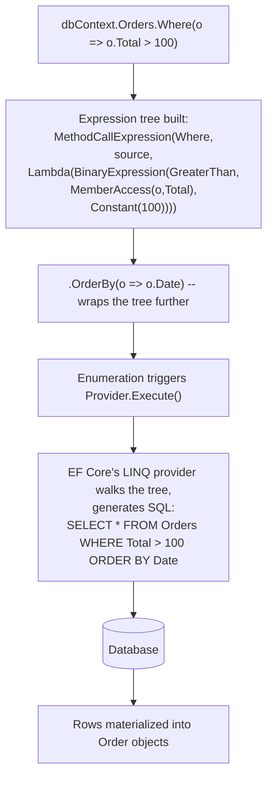
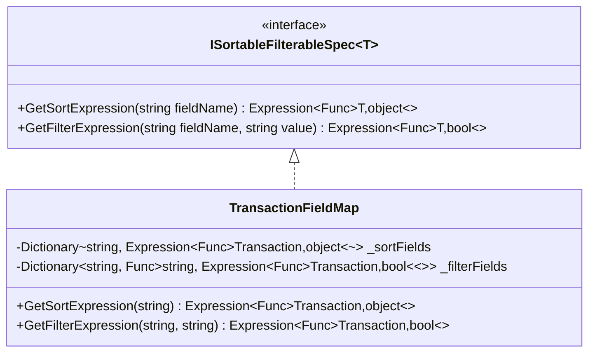

# Module 5 — C# Advanced: LINQ Internals — `IEnumerable` vs `IQueryable`, Deferred Execution & Iterator State Machines

> Domain: C# | Level: Beginner → Expert | Prerequisite: [[04-Delegates-Events-Closures]] (closures inside lambda predicates), [[02-Async-Await-Internals]] (iterator/state-machine compiler pattern), [[03-Span-Memory-Low-Allocation]] (LINQ allocation costs vs `Span<T>`)

---

## 1. Fundamentals

### What is LINQ?
**Language Integrated Query (LINQ)** is a set of extension methods (`Where`, `Select`, `OrderBy`, `GroupBy`, `Join`, etc.) over `IEnumerable<T>` (LINQ to Objects) and `IQueryable<T>` (LINQ to anything with a query provider — EF Core, LINQ to SQL, etc.), plus C#'s query-expression syntax (`from x in xs where ... select ...`) that the compiler translates into chained method calls. It provides one consistent, composable query syntax over in-memory collections, databases, XML, and any custom data source that implements the right interfaces.

### Why does it exist?
Before LINQ (pre-C# 3/.NET 3.5), filtering/projecting/aggregating collections meant hand-written `foreach` loops with manual accumulation, or SQL embedded as opaque strings with no compile-time checking. LINQ unifies this into a single, type-checked, composable, declarative style — and, critically, the **same syntax** can express both "filter this in-memory list" (compiled to a delegate, executed in-process) and "filter this database table" (compiled to an **expression tree**, translated to SQL, executed remotely) — a genuinely elegant piece of language design most candidates use daily without understanding the mechanism.

### When does this matter?
- **Always**, for anyone using EF Core, in-memory collection processing, or any LINQ-based library — but understanding the *mechanism* matters specifically when:
  - Diagnosing an EF Core query that materializes far more data than expected, or one that silently pulls an entire table into memory before filtering (the "client-side evaluation" trap, §2.4).
  - Reasoning about LINQ's allocation cost in hot paths (directly extending Module 3's guidance).
  - Explaining **deferred execution** bugs (a query re-evaluated on each enumeration, or evaluated with stale captured variables).
  - Interviewing at Staff/Principal level — "explain `IEnumerable<T>` vs `IQueryable<T>`, precisely" is one of the most common C#/EF gatekeeping questions, and most candidates give a surface-level answer.

### How does it work (30,000-ft view)?

```csharp
// LINQ to Objects (IEnumerable<T>) -- compiles to a chain of delegate-based method calls,
// executed in-process, method-by-method, item-by-item, lazily.
var evens = numbers.Where(n => n % 2 == 0).Select(n => n * n);

// LINQ to Entities (IQueryable<T>) -- the SAME syntax compiles the lambda to an
// EXPRESSION TREE (data describing the lambda, not compiled code), which the
// provider (EF Core) translates into SQL and sends to the database.
var evens = dbContext.Numbers.Where(n => n % 2 == 0).Select(n => n * n);
```

Mental model for interviews: **"`IEnumerable<T>` LINQ compiles your lambda into a delegate and runs it here, in this process, one item at a time, lazily, on demand. `IQueryable<T>` LINQ compiles your lambda into an expression tree — data describing the lambda's logic — that a provider translates into a different language (SQL) and executes somewhere else."** Every deep LINQ question traces back to this one distinction.

---

## 2. Deep Dive

### 2.1 `IEnumerable<T>` — the Iterator Pattern and `yield return`

`IEnumerable<T>` exposes exactly one method: `GetEnumerator()`, returning an `IEnumerator<T>` with `MoveNext()`, `Current`, and `Reset()` (Reset is largely vestigial/unsupported by most modern enumerators). This is the classic **Iterator design pattern**, built into the language via `foreach` (which desugars to explicit `GetEnumerator()`/`MoveNext()`/`Current` calls, wrapped in a `try`/`finally` that calls `Dispose()` if the enumerator implements `IDisposable`).

**`yield return`** is the compiler's sugar for hand-writing an `IEnumerator<T>` implementation. Just like `async`/`await` (Module 2 §2.1), a method containing `yield return` is transformed into a **compiler-generated state machine class** implementing `IEnumerable<T>`/`IEnumerator<T>`, where each `yield return` is a suspension point (recorded as a numbered state, resumed via a `goto`-based jump table in `MoveNext()`), and local variables become fields on the state machine — structurally the **same transformation pattern** as `async` methods (Module 2 §2.1), just targeting iteration instead of asynchrony.

```csharp
// You write:
IEnumerable<int> Range(int start, int count)
{
    for (int i = 0; i < count; i++)
        yield return start + i;
}

// Compiler generates (simplified): a class implementing IEnumerable<int> AND IEnumerator<int>
// with a MoveNext() method containing a state-based goto/switch resuming exactly where
// the last yield return left off -- start, count, and i all become fields.
```

**Critical fact**: calling `Range(0, 5)` does **not** run any of the loop body immediately — it merely constructs and returns the state-machine object. The loop body only executes as `MoveNext()` is called, i.e., **lazily, one item at a time, driven entirely by the consumer** (a `foreach`, or a chained LINQ operator pulling the next item).

### 2.2 Deferred Execution — the Single Most Important LINQ Concept

Every LINQ-to-Objects operator (`Where`, `Select`, `OrderBy`, etc., **except** the "terminal"/materializing ones: `ToList()`, `ToArray()`, `ToDictionary()`, `Count()`, `First()`, `Sum()`, etc.) is **deferred**: calling `.Where(predicate)` does not filter anything immediately — it returns a new lazy `IEnumerable<T>` wrapping the source, and the predicate only actually runs when something enumerates the result (a `foreach`, or a subsequent terminal operator).

```csharp
var query = numbers.Where(n => n > threshold); // NOTHING has executed yet -- no iteration happened
threshold = 100;                                // this mutation is now visible to the query!
foreach (var n in query) { ... }                // NOW the predicate runs, using threshold == 100
```

This is directly the closure-capture mechanic from Module 4 §2.3: the lambda `n => n > threshold` captures `threshold` by reference (via the compiler-generated display class), so any mutation to `threshold` *before* enumeration begins is visible when the query finally executes — a frequent source of confusion and real bugs (§6).

**Consequence #1 — re-execution on every enumeration**: A deferred query is **not** a cached result — enumerating the same `IEnumerable<T>` query variable twice **re-runs the entire operator chain from the source**, twice. If the source is expensive (a database call wrapped behind a custom `IEnumerable`, a large computed sequence), this silently doubles (or worse) the work.

**Consequence #2 — exceptions are deferred too**: An exception inside a `Where`/`Select` predicate doesn't throw when you call `.Where(...)` — it throws when enumeration actually reaches the item that triggers it, which can be surprising if the `.Where(...)` call and the `foreach`/`.ToList()` that triggers enumeration are far apart in the code (or in different methods entirely).

### 2.3 `IQueryable<T>` — Expression Trees and Provider Translation

`IQueryable<T>` extends `IEnumerable<T>` and adds an `Expression` property (an `Expression` object — a **data structure representing code**, not compiled code) and a `Provider` property (an `IQueryProvider` responsible for translating and executing that expression). When you write:

```csharp
var query = dbContext.Orders.Where(o => o.Total > 100).OrderBy(o => o.Date);
```

The C# compiler notices `dbContext.Orders` is `IQueryable<Order>`, so it resolves `.Where`/`.OrderBy` to the **`Queryable`** class's overloads (not `Enumerable`'s) — these take `Expression<Func<T,bool>>` parameters, not `Func<T,bool>` delegates. The compiler converts the lambda `o => o.Total > 100` into an **expression tree** (a tree of `BinaryExpression`, `MemberExpression`, `ConstantExpression` nodes describing "access `.Total` on parameter `o`, compare greater-than, constant `100`") instead of compiling it to IL. Each `.Where`/`.OrderBy` call **builds up a larger expression tree** representing the entire query — **nothing executes yet**. Only when the query is enumerated (`foreach`, `.ToList()`, etc.) does EF Core's `IQueryProvider` walk the accumulated expression tree, translate it into SQL, execute it against the database, and materialize the results into objects.



### 2.4 The Client-Side Evaluation Trap — Precisely

Because `IQueryable<T>` providers can only translate expressions they understand (a finite, provider-specific subset of .NET — most standard operators, some string methods, but **not arbitrary C# methods, especially ones with side effects or that call into non-translatable APIs**), calling **any method the provider can't translate** inside a `Where`/`Select` on an `IQueryable<T>` either:
- Throws at query-execution time (`InvalidOperationException`/provider-specific translation exception) — the *safe* failure mode, common in modern EF Core (5+) which is fairly strict.
- **Or**, in older EF/EF6-era behavior (and in some remaining EF Core scenarios if you're not careful), **silently switches to client-side evaluation**: the provider fetches a larger-than-intended result set from the database (potentially the *entire table*) and then applies the untranslatable predicate/projection **in memory, in your process**, after the fact.

```csharp
// DANGEROUS pattern (classic interview/code-review trap):
var results = dbContext.Orders
    .Where(o => MyCustomBusinessRule(o)) // MyCustomBusinessRule is a plain C# method -- NOT translatable to SQL
    .ToList();
// If this doesn't throw, it may have pulled the ENTIRE Orders table into memory
// and filtered in-process -- catastrophic for a large table, and invisible in code review.
```

**Interview-critical fact**: This is exactly why placing a breakpoint/logging *inside* a lambda passed to an `IQueryable<T>` `.Where()` and expecting it to hit for each row **as SQL executes** is a category error — if the query genuinely translates to SQL, **your C# lambda body never executes at all**; the *expression tree* describing it was translated to SQL text instead. If your breakpoint *does* hit, that's actually diagnostic evidence you've fallen into client-side evaluation.

### 2.5 `IEnumerable<T>` vs `IQueryable<T>` — the Precise Comparison Table

| Aspect | `IEnumerable<T>` | `IQueryable<T>` |
|---|---|---|
| Lambda compiles to | `Func<T,...>` delegate (compiled IL) | `Expression<Func<T,...>>` (data structure) |
| Where does filtering/projection execute? | In-process, in this method's call stack | Wherever the provider decides (DB server, remote service) |
| Extension method source | `System.Linq.Enumerable` | `System.Linq.Queryable` |
| Can call arbitrary C# methods in the predicate? | Yes, anything — it's just compiled code | Only what the provider can translate — arbitrary methods fail or silently evaluate client-side |
| Typical use | In-memory collections (`List<T>`, arrays), already-materialized data | ORMs (EF Core), remote/queryable data sources |
| Composability across calls | Composes freely; each operator wraps the previous `IEnumerable<T>` | Composes freely; each operator extends the **same expression tree** (crucial: mixing the two, e.g., calling `.AsEnumerable()` partway through, is a common and sometimes deliberate technique — see §6) |

### 2.6 Multiple Enumeration — the Classic Performance/Correctness Bug

```csharp
IEnumerable<Order> expensiveQuery = GetOrdersFromSomewhereExpensive(); // deferred, not yet executed

int count = expensiveQuery.Count();           // enumerates the WHOLE source once
var first = expensiveQuery.First();            // enumerates AGAIN from the start (at least partially)
var list = expensiveQuery.ToList();            // enumerates a THIRD time, fully
```

If `GetOrdersFromSomewhereExpensive()` wraps a network call, a database query, or an expensive computed sequence, this pattern silently triples the cost — and if the underlying source is **not idempotent** (e.g., it advances some external cursor, or the underlying data can change between calls), each enumeration can return **different results**, a genuine correctness bug, not just a performance one. Static analyzers (Roslyn analyzer `CA1851`/"possible multiple enumeration" and similar Resharper/SonarQube rules) specifically exist to flag this.

### 2.7 `Enumerable` vs Array/`List<T>`-Specific Overload Resolution and Performance

Many LINQ operators have **internal fast paths** for known concrete types: `Enumerable.Count()` checks whether the source implements `ICollection<T>`/`ICollection` and, if so, returns `.Count` directly (O(1)) instead of enumerating (O(n)) — but only when called on a variable of a type where this check is visible; calling `.Count()` on a variable **statically typed as `IEnumerable<T>`** (even if the runtime object is actually a `List<T>`) still goes through this same runtime check inside `Enumerable.Count()`'s implementation, so this particular optimization *does* still apply — but many **other** LINQ operators (`Where`, `Select`, etc.) do **not** have such fast paths and always incur full iterator/delegate overhead regardless of the underlying concrete type. Modern .NET (8+) has also added **direct `Span<T>`-friendly overloads and internal vectorization** for some `Enumerable` operations (`Sum`, `Max`, `Min` over numeric arrays) — another place where "LINQ has a fixed, uniform cost" is an oversimplification worth knowing precisely for Advanced-tier questions.

---

## 3. Visual Architecture

### LINQ Execution Model — Two Worlds

```mermaid
graph TB
    subgraph "LINQ to Objects (IEnumerable<T>)"
        A1[Source: List/Array/yield-based iterator] --> A2["Where(Func&lt;T,bool&gt;)<br/>compiled delegate"]
        A2 --> A3["Select(Func&lt;T,TResult&gt;)<br/>compiled delegate"]
        A3 --> A4["foreach / ToList()<br/>drives MoveNext() chain, in-process"]
    end
    subgraph "LINQ to Entities (IQueryable<T>)"
        B1["Source: DbSet&lt;T&gt;"] --> B2["Where(Expression&lt;Func&lt;T,bool&gt;&gt;)<br/>appends to expression tree"]
        B2 --> B3["OrderBy(Expression&lt;Func&lt;T,TKey&gt;&gt;)<br/>appends further"]
        B3 --> B4["ToListAsync()<br/>triggers Provider.Execute()"]
        B4 --> B5["Expression tree -> SQL translation"]
        B5 --> B6[(Database engine)]
    end
```



### Iterator State Machine Lifecycle (ASCII, mirrors Module 2's async state machine diagram)

```
 Range(0, 3) called
      │
      ▼
 ┌───────────────────────┐   NOT executed yet -- just constructs the state machine object
 │ state = -2 (not started)│
 └───────────────────────┘
      │  first MoveNext() call (from foreach / next LINQ operator)
      ▼
 ┌───────────────────────┐
 │ state = 0, i = 0        │
 │ Current = start + 0     │  <-- yield return suspends HERE, returns true
 └───────────────────────┘
      │  next MoveNext() call
      ▼
 ┌───────────────────────┐
 │ resume at state 0,      │
 │ i++, loop condition,    │
 │ Current = start + 1     │
 └───────────────────────┘
      │ ... repeats until loop condition false ...
      ▼
 ┌───────────────────────┐
 │ MoveNext() returns false │  <-- enumeration complete
 └───────────────────────┘
```

---

## 4. Production Example

### Scenario: E-commerce reporting API — a query that "worked in dev" times out in production

**Problem**: An internal reporting endpoint (`GET /api/reports/high-value-customers`) ran in ~200ms against the development database (a few thousand rows) but timed out (>30s) against production (tens of millions of order rows), despite seemingly identical code and an index on the relevant columns.

**Investigation**:
- Enabling EF Core's SQL logging (`optionsBuilder.LogTo(...)` / `IDbCommandInterceptor`) revealed the actual SQL sent to the database was `SELECT * FROM Orders` — **the entire table**, with no `WHERE` clause at all, despite the C# code clearly containing a `.Where(...)` filter.
- The offending line: `.Where(o => CalculateLoyaltyTier(o.CustomerId, o.Total) == LoyaltyTier.Platinum)`, where `CalculateLoyaltyTier` was a plain C# static method containing business logic (tier thresholds, special-case rules) that had organically grown too complex to express as a simple property comparison.
- Because `CalculateLoyaltyTier` is an arbitrary C# method with no SQL translation, the specific (older, at-the-time-in-use) EF Core/LINQ-provider version in use fell back to **client-side evaluation** (§2.4) — silently pulling the entire `Orders` table into application memory before applying the filter in-process. In dev, with a few thousand rows, this was invisible (fast enough not to notice); in production, with tens of millions of rows, it was catastrophic.

**Architecture fix**:
- Rewrote `CalculateLoyaltyTier`'s core comparable logic as an `IQueryable`-translatable expression directly in the `Where` clause (moving the threshold constants and simple comparisons into SQL-translatable form: `o.Total > platinumThreshold && ...`), keeping the more complex, genuinely non-translatable business rules as a **secondary, in-memory filter applied only after** a first SQL-translatable filter had already reduced the result set to a manageable size (`dbContext.Orders.Where(o => o.Total > threshold).AsEnumerable().Where(o => CalculateLoyaltyTier(...) == ...)`) — deliberately splitting the query into "what SQL can do" and "what only C# can do," in that order, rather than accidentally letting the whole thing fall back to client-side evaluation on the unfiltered table.
- Upgraded to a modern EF Core version where untranslatable expressions **throw immediately** at query-construction/execution time rather than silently falling back — converting this entire bug class from "silent production catastrophe" into "loud, caught-in-dev-immediately compile/runtime error."
- Added a CI-run integration test asserting the generated SQL for this and other reporting queries contains a `WHERE` clause with the expected filter columns (a "SQL shape" regression test), not just asserting on the returned C# result.

**Trade-offs**: Splitting the query into a SQL-translatable prefix + an in-memory-evaluated suffix (`.AsEnumerable().Where(...)`) means the "coarse" SQL filter must be conservative enough to never *exclude* a row the finer in-memory filter would have included — the team had to carefully verify `o.Total > platinumThreshold` was a true superset condition, not an independent narrower filter, to avoid silently dropping valid results.

**Lessons learned**:
1. Always verify the *actual generated SQL* for any `IQueryable<T>`-based query touching a large table — never trust that "the C# compiles and runs" means "the database work is what you expect."
2. Client-side evaluation is the single most dangerous, least-visible LINQ-to-Entities failure mode — it produces *correct results*, just via a catastrophically inefficient path, so it's invisible to correctness-only testing.
3. Upgrading to a stricter EF Core version that fails loudly instead of silently degrading is a legitimate, high-value defensive engineering investment, not just a routine dependency bump.
4. When a business rule genuinely can't be translated to SQL, deliberately and explicitly split the query (SQL-translatable coarse filter, then in-memory fine filter) rather than accidentally falling into it.

---

## 5. Best Practices

- **Materialize (`.ToList()`/`.ToArray()`) a query exactly once if you need to enumerate it more than once**, and store the materialized result, not the original deferred `IQueryable`/`IEnumerable`. Why: prevents both the performance cost and the correctness risk of multiple enumeration (§2.6).
- **Always check the actual generated SQL for any non-trivial `IQueryable<T>` query against a large table** (EF Core logging, `ToQueryString()` in modern EF Core) before shipping — never assume a `.Where(...)` clause you wrote in C# became a `WHERE` clause in SQL.
- **Keep predicates passed to `IQueryable<T>` operators translatable** — simple property comparisons, standard string/math methods the provider documents support for. Push genuinely complex/non-translatable business logic to a deliberate, explicit in-memory step **after** a SQL-translatable coarse filter has already reduced the result set (§4's fix pattern), never as an accidental fallback.
- **Prefer `Any()` over `Count() > 0`** for existence checks — `Any()` short-circuits on the first match (O(1) in the best case); `Count()` must enumerate the entire sequence (or, for `IQueryable`, translates to a full `COUNT(*)` that's more expensive than an `EXISTS`-shaped query) even when you only care whether *any* element exists.
- **Avoid LINQ (especially chained, multi-operator queries) in profiled hot loops** — directly extending Module 3's guidance; each operator in a chain (`Where().Select().OrderBy()`) allocates its own iterator wrapper object, and non-static lambdas capturing locals allocate closures (Module 4 §2.3) — fine for ordinary code, a real cost at extreme call frequency.
- **Use `AsNoTracking()` for read-only EF Core queries** — skips change-tracking overhead entirely for query results that will never be updated/saved back, a genuinely free, low-effort performance win for reporting/read-heavy endpoints.
- **Be explicit about the `AsEnumerable()`/`AsQueryable()` boundary** when intentionally mixing SQL-side and in-memory-side LINQ — a bare, unexplained `.AsEnumerable()` call in the middle of a query chain should always carry a comment explaining *why* the switch to client-side evaluation is deliberate here, not accidental (directly addressing the diagnostic confusion at the heart of §4's incident).

---

## 6. Anti-patterns

- **Calling non-translatable C# methods inside an `IQueryable<T>` `.Where()`/`.Select()` without realizing the risk of client-side evaluation.** Why it fails: silently (in permissive providers) or loudly (in strict modern EF Core) breaks — either catastrophic performance (§4) or a runtime exception discovered late. Fix: know your provider's translation capabilities; test against realistic data volumes, not just dev-sized data.
- **Enumerating the same deferred `IEnumerable<T>`/`IQueryable<T>` multiple times**, assuming it behaves like a cached list. Why it fails: re-executes the entire chain (and, for `IQueryable`, re-issues the database query) every single time — a correctness risk too if the source isn't idempotent. Fix: materialize once (`.ToList()`) if reused.
- **Capturing a mutable variable in a LINQ predicate closure and mutating it before the query is enumerated**, expecting the query to have "already captured the old value." Why it fails: deferred execution + closure-by-reference (Module 4 §2.3) means the query sees the variable's value **at enumeration time**, not at `.Where()`-call time — a subtle, easy-to-miss bug, especially across method boundaries. Fix: capture an explicit local snapshot (`var snapshot = threshold;`) immediately before building the query if you need the value pinned at that point.
- **Chaining many LINQ operators over a large in-memory collection inside a hot, frequently-called method** without considering the per-call allocation cost (each operator wraps an iterator object; captured-variable lambdas allocate closures). Fix: for genuinely hot paths, a hand-written loop (verified via BenchmarkDotNet to actually matter, per Module 3's discipline) can meaningfully outperform an equivalent LINQ chain — but only reach for this after profiling proves it, not reflexively.
- **Using `.Count() > 0` or `.Any(x => true)` instead of plain `.Any()`** for existence checks. Fix: `.Any()` alone; reserve `.Count()` for when you actually need the count value itself.
- **Returning `IQueryable<T>` from a repository/service-layer method exposed to arbitrary downstream callers**, letting callers tack on arbitrary further `.Where()` clauses (including non-translatable ones) far from the original query's context — this leaks the ORM/provider abstraction across an architectural boundary that should otherwise hide it, and makes the client-side-evaluation risk (§2.4) an org-wide, hard-to-audit surface instead of a contained one. Fix: repository/service layers should generally return already-materialized results (`List<T>`/`IReadOnlyList<T>`) or, if genuinely composable querying is a deliberate design goal, a narrowly-scoped specification/query-object pattern instead of a raw leaked `IQueryable<T>`.
- **Assuming `OrderBy` followed by `Take` is always efficiently translated/executed** without verifying — for `IQueryable`, this is usually fine (translates to `ORDER BY ... OFFSET/FETCH` or `TOP`), but for `IEnumerable`, `OrderBy` **must** buffer and fully sort the entire source before yielding the first `Take`-limited item, an O(n log n) + full-buffering cost that's easy to underestimate for a large in-memory sequence.

---

## 7. Performance Engineering

**CPU**: Each LINQ operator in a chain (`Where`, `Select`, etc.) wraps the previous iterator in a new iterator object — enumerating a 3-operator chain means each element passes through 3 layers of `MoveNext()`/delegate-invocation indirection, versus a single hand-written loop's direct iteration. This overhead is real but typically small relative to whatever work the predicate/projection itself does — only measure/optimize it away after BenchmarkDotNet proves it matters (Module 3's discipline, again).

**Memory**: Each non-capturing LINQ lambda benefits from the Module 4 §2.4 delegate-caching optimization (compiled once, cached, reused); each **capturing** lambda (referencing an enclosing local) allocates a display-class instance per invocation of the enclosing method — a LINQ chain built inside a hot loop, with lambdas capturing per-iteration state, can allocate meaningfully. `OrderBy`/`GroupBy`/`ToList`/`ToArray` all buffer their full input in memory — a genuinely large source means a genuinely large buffered allocation, distinct from `Where`/`Select`'s pure streaming (constant-memory) behavior.

**GC**: Chained `IEnumerable<T>` LINQ over large in-memory collections in hot, high-frequency code paths is a legitimate, measurable Gen 0 allocation contributor (each iterator wrapper + any capturing closures) — directly connects to Module 1 §2.4 and Module 3 §7's allocation-rate-vs-GC-pause-frequency reasoning.

**IQueryable-specific**: The real performance cost center for `IQueryable<T>`/EF Core queries is almost never the LINQ operator overhead itself — it's (a) the SQL the expression tree translates into (missing indexes, unnecessary joins, N+1 query patterns from lazy-loaded navigation properties) and (b) accidental client-side evaluation (§2.4/§4). Profile with EF Core's SQL logging and a database query planner (`EXPLAIN`/execution plan) rather than BenchmarkDotNet-style C#-level profiling for this category of problem.

**Latency vs Throughput**: `AsNoTracking()` reduces per-query CPU/memory overhead (no change-tracker snapshot maintained) — a direct, close-to-free latency win for read-only query paths, exactly analogous in spirit to Module 3's "pay only for what you need" philosophy.

**Benchmarking**: BenchmarkDotNet comparing a hand-written `for` loop vs an equivalent `Where().Select().ToList()` chain over a large in-memory array/list, with `[MemoryDiagnoser]`, is the standard way to *demonstrate* (not assume) LINQ's overhead magnitude for a specific case — results vary meaningfully by operator chain length and whether lambdas capture state.

**Caching**: A materialized (`.ToList()`) LINQ result is a legitimate simple cache; but remember (§2.6) that re-running `.Where(...)` against an **already-materialized** `List<T>` is cheap and safe to do repeatedly (no re-execution-from-source cost, since the source is now just an in-memory list) — the "don't enumerate twice" caution applies specifically to *deferred, expensive-to-produce* sources, not to cheap re-filtering of an already-materialized list.

---

## 8. Security

- **Client-side evaluation as an availability risk**: An attacker-influenced or simply high-traffic path that accidentally triggers client-side evaluation on a large table (§2.4/§4) can be a self-inflicted denial-of-service — worth treating with the same seriousness as a genuine resource-exhaustion vulnerability, since the failure mode (memory/CPU exhaustion from pulling an entire table) is identical in effect.
- **Dynamic LINQ / string-based expression building from user input** (e.g., libraries or hand-rolled code that build a `.Where(userSuppliedFieldName + " == " + userSuppliedValue)`-style dynamic predicate) is a genuine **injection vector** — the LINQ/SQL-injection-adjacent equivalent of building raw SQL from string concatenation. Mitigation: never construct query predicates from unvalidated user input as raw strings/expressions; use a strictly validated allowlist of sortable/filterable field names mapped to statically-known expressions, never a dynamic-expression-from-arbitrary-string mechanism exposed to untrusted input.
- **Leaking `IQueryable<T>` across a public API boundary** (the anti-pattern flagged in §6) is itself a security-adjacent architectural risk beyond just performance: if a controller action returns `IQueryable<T>` and a client-facing API layer (e.g., OData) allows arbitrary further query composition, an insufficiently-restricted endpoint can allow a caller to request unbounded, expensive queries (no `Take`/paging enforced, arbitrary `.Include()` navigation-property expansion) — effectively an attacker-controlled resource-exhaustion lever if the API doesn't enforce hard limits (max page size, max query complexity) independent of what the client requests.
- **OWASP relevance**: A03 (Injection)-equivalent for dynamic/string-built LINQ predicates from untrusted input; A04 (Insecure Design)/A05-adjacent for unbounded queryable API surfaces without enforced limits.

---

## 9. Scalability

- **Horizontal scaling**: `IQueryable<T>`-based queries push filtering/aggregation work to the database tier, which is often the actual scaling bottleneck in a horizontally-scaled application-tier architecture (many stateless app replicas, one shared database) — understanding exactly what gets pushed down to SQL (and what silently doesn't, per §2.4) is directly relevant to whether adding more app-tier replicas actually helps at all, versus the database itself being the real ceiling.
- **Vertical scaling**: `IEnumerable<T>` LINQ over large in-memory collections is CPU/memory-bound in the current process — more cores help only if the work is explicitly parallelized (`AsParallel()`/PLINQ, `Parallel.ForEach`), which LINQ-to-Objects does not do by default (ordinary LINQ-to-Objects execution is single-threaded).
- **Caching/Replication/Partitioning**: Deferred execution and materialization discipline (§5) directly inform caching strategy — cache the *materialized* result (`List<T>`), never a deferred `IQueryable`/`IEnumerable` reference, since caching an unmaterialized query object doesn't actually cache anything (each access would still re-execute against the live source).
- **CAP theorem**: Not directly applicable to LINQ mechanics, but the client-side-evaluation trap (§2.4) is a useful bridge concept: it's an example of a system silently choosing a "correct but catastrophically inefficient" execution path when its ideal (push filtering to the data tier) isn't available — the same class of silent-degradation risk that shows up at the distributed-systems level when a system falls back to a slow-but-correct path under partition/failure without surfacing that it's doing so.
- **HA/DR**: Not directly relevant to LINQ itself; the practical connection is that reporting/analytics queries prone to the client-side-evaluation trap are a common source of "one bad query brought down the whole database connection pool for every other service sharing it" incidents — a LINQ-level bug with a distributed-systems-level blast radius.

---

## 10. Interview Questions

### Basic (10)

1. **Q: What is deferred execution in LINQ?**
   **A:** Most LINQ operators (`Where`, `Select`, etc.) don't execute immediately when called — they build up a description of the query that only actually runs when the result is enumerated (via `foreach`, `.ToList()`, etc.).

2. **Q: What are the two main interfaces LINQ operates over?**
   **A:** `IEnumerable<T>` (LINQ to Objects, in-process, delegate-based) and `IQueryable<T>` (LINQ to a remote/queryable provider like a database, expression-tree-based).

3. **Q: What does `yield return` do?**
   **A:** Marks a method as an iterator; the compiler transforms it into a state machine implementing `IEnumerable<T>`/`IEnumerator<T>` that produces one value at a time, lazily, as `MoveNext()` is called.

4. **Q: Does calling `.Where(...)` on a list immediately filter it?**
   **A:** No — it returns a new, lazy `IEnumerable<T>` that only actually filters when enumerated.

5. **Q: What's the difference between `Func<T,bool>` and `Expression<Func<T,bool>>`?**
   **A:** `Func<T,bool>` is a compiled delegate that can be invoked directly; `Expression<Func<T,bool>>` is a data structure describing the lambda's logic, which a provider (like EF Core) can inspect and translate into another language (SQL) instead of executing directly.

6. **Q: What do `.ToList()`/`.ToArray()`/`.Count()` have in common?**
   **A:** They're "terminal"/materializing operators — they force immediate execution of the whole deferred query chain, rather than returning another lazy sequence.

7. **Q: What happens if you enumerate the same `IEnumerable<T>` query twice?**
   **A:** The entire operator chain (and, for `IQueryable`, the underlying database query) re-executes from scratch each time — it's not automatically cached.

8. **Q: Should you use `.Count() > 0` or `.Any()` to check if a sequence has elements?**
   **A:** `.Any()` — it short-circuits on the first element found, while `.Count()` must enumerate (or fully aggregate) the entire sequence.

9. **Q: What does `AsNoTracking()` do in EF Core, and why use it?**
   **A:** Tells EF Core not to track the returned entities for change-detection — a performance win for read-only queries that will never be saved back.

10. **Q: What is the risk of calling a plain C# method inside an EF Core `.Where()` clause?**
    **A:** If the provider can't translate that method into SQL, it either throws (modern EF Core, usually) or silently falls back to fetching more data than intended and filtering in memory (older/some remaining scenarios) — the "client-side evaluation" trap.

### Intermediate (10)

1. **Q: Why does mutating a captured variable after building a LINQ query, but before enumerating it, change the query's behavior?**
   **A:** Deferred execution means the predicate lambda's captured variable (lifted into a compiler-generated display class, per Module 4 §2.3) is read at **enumeration time**, not at the moment `.Where(...)` was called — so any mutation before enumeration is visible to the query.

2. **Q: Explain precisely what an expression tree is, as opposed to a compiled delegate.**
   **A:** An expression tree is an object graph of `Expression`-derived nodes (`BinaryExpression`, `MemberExpression`, `ParameterExpression`, etc.) that represents the *structure* of a lambda's logic as inspectable data — it can be walked, analyzed, and translated by a provider into another representation (SQL), whereas a compiled delegate is already-executable IL/native code with no separately inspectable structure.

3. **Q: Why might a breakpoint inside a lambda passed to an EF Core `.Where()` clause never be hit?**
   **A:** If the expression genuinely translates to SQL, the C# lambda body itself never executes at all in-process — only the expression tree describing it was used, to generate SQL text executed by the database; the breakpoint would only hit if execution fell back to client-side evaluation.

4. **Q: What's the performance/memory difference between `Where`/`Select` and `OrderBy`/`GroupBy` in LINQ to Objects?**
   **A:** `Where`/`Select` stream — they process and yield one element at a time with O(1) additional memory; `OrderBy`/`GroupBy` must buffer the **entire** source sequence before producing any output (to sort/group it), an O(n) memory cost and typically O(n log n) time for sorting.

5. **Q: How would you diagnose whether an EF Core query has fallen into client-side evaluation?**
   **A:** Enable EF Core's SQL logging (or use `ToQueryString()`) and inspect the actual generated SQL — if it's missing an expected `WHERE`/filter clause that exists in the C# code, or if it's fetching far more columns/rows than the query logically needs, that's the signature of client-side evaluation.

6. **Q: Why does `IEnumerable<T>`'s `OrderBy().Take(n)` cost more than `IQueryable<T>`'s equivalent, typically?**
   **A:** `IEnumerable<T>`'s `OrderBy` must fully sort the entire in-memory source before `Take` can yield the first n items (no way to short-circuit a general in-memory sort); `IQueryable<T>`'s equivalent usually translates to a database-side `ORDER BY ... OFFSET/FETCH` or `TOP`, which the database engine can often satisfy without a full table sort (e.g., via an index).

7. **Q: What is the compiler transformation behind `yield return`, and how does it relate to the `async`/`await` state machine from Module 2?**
   **A:** Both use the same underlying compiler technique: transforming a method into a state machine class where local variables become fields and each suspension point (`yield return` or `await`) is a numbered state resumed via a jump table in a `MoveNext()`-style method — `yield return` targets the iterator pattern (`IEnumerable<T>`/`IEnumerator<T>`), `async`/`await` targets asynchronous continuation, but the compiler machinery generating the state machine is structurally analogous.

8. **Q: Why is returning a raw `IQueryable<T>` from a repository method to arbitrary calling code considered risky?**
   **A:** It leaks the ORM/provider abstraction across an architectural boundary, letting distant callers tack on arbitrary further query operators (including potentially non-translatable ones triggering client-side evaluation) far from the original query's context, and makes it hard to enforce consistent paging/limits across all consumers.

9. **Q: What does `AsEnumerable()` do when called partway through an `IQueryable<T>` chain, and why would you deliberately use it?**
   **A:** It "casts" the sequence to `IEnumerable<T>`, causing everything **after** that point in the chain to execute as ordinary LINQ to Objects (in-process) rather than being translated as part of the query — useful when you deliberately want a SQL-translatable coarse filter to run first, then apply genuinely non-translatable logic in-memory afterward on the (now smaller) result set.

10. **Q: Why can enumerating a deferred query twice be a correctness bug, not just a performance one?**
    **A:** If the underlying source isn't idempotent (e.g., it depends on mutable external state, advances some cursor, or the underlying data changes between calls), each enumeration can produce **different results** — not just redundant work, but potentially inconsistent behavior between two supposedly-identical accesses to "the same" query variable.

### Advanced (10)

1. **Q: Explain, precisely, why `Enumerable.Count()` can be O(1) for some sources but O(n) for others, even though it's the same method call syntax.**
   **A:** `Enumerable.Count()`'s implementation checks at runtime whether the source implements `ICollection<T>` (or the non-generic `ICollection`) — if so, it returns the collection's `.Count` property directly (O(1)); otherwise, it falls back to enumerating the entire sequence to count elements (O(n)). This check happens based on the **runtime type** of the object, regardless of the **static/compile-time type** of the variable holding the reference — so `IEnumerable<int> x = someList; x.Count();` is still O(1) if `someList` is actually a `List<int>` at runtime, since the `ICollection<T>` check happens via a runtime type test (`is`), not compile-time overload resolution.

2. **Q: Walk through exactly how EF Core translates a LINQ query with a `.Select()` projecting into an anonymous type or DTO, and why this can (or can't) still be a fully server-side-translated query.**
   **A:** EF Core's query pipeline walks the accumulated expression tree, including the `.Select()`'s projection expression — if the projection consists only of translatable member accesses and simple expressions (e.g., `.Select(o => new OrderDto { Id = o.Id, Total = o.Total })`), the provider can generate SQL that selects exactly those columns (avoiding `SELECT *`) and construct the DTO objects directly from the result set, entirely server-side for the filtering/column-selection part. If the projection includes any non-translatable logic (calling an arbitrary instance method, complex conditional logic beyond what the provider's expression-tree-to-SQL translator supports), that specific part either throws (modern EF Core) or requires materializing the necessary source columns first and completing the projection in memory — this is a narrower, more targeted instance of the general client-side-evaluation risk (§2.4), scoped specifically to the projection step rather than the whole query.

3. **Q: A candidate says "LINQ is always slower than a hand-written loop." Provide a precise, nuanced correction.**
   **A:** LINQ-to-Objects generally has real, measurable per-element overhead (iterator-chain indirection, closure allocation for capturing lambdas) compared to an equivalent hand-written loop — but the *magnitude* varies enormously by scenario (a single `.Where()` over a small list vs a five-operator chain over millions of elements), some specific operators have internal fast paths (`Count()` on `ICollection<T>`, some numeric aggregation operators using vectorized internals in modern .NET) that can be competitive or even faster than a naive hand-written loop, and the *correctness/readability* benefit of LINQ is a real engineering cost trade-off that "always slower" ignores entirely. The precise, defensible claim: "LINQ-to-Objects has real per-element overhead versus a hand-written loop in the general case; whether that overhead matters is an empirical, profiled question specific to the hot-path frequency and data volume involved — treat it exactly like any other optimization candidate from Module 3's measure-first discipline, not as a blanket rule."

4. **Q: Explain how `IQueryable<T>`'s `Expression` property composes across multiple chained operator calls, and why order of operations in the C# source matters for what expression tree is ultimately built.**
   **A:** Each `IQueryable<T>` extension method call (e.g., `.Where(predicate)`) doesn't mutate the source `IQueryable<T>` — it calls `Provider.CreateQuery<T>(Expression.Call(..., source.Expression, Expression.Quote(predicate)))`, producing a **new** `IQueryable<T>` instance whose `Expression` property is a **larger tree wrapping the previous one** (the "Method​Call​Expression" pattern — each subsequent operator wraps the prior expression tree as an argument to a new outer method-call node representing itself). This means the final `Expression` a provider sees when execution is triggered is a nested tree exactly mirroring the C# call chain's order, left-to-right — which is precisely why `.Where(...).OrderBy(...)` and `.OrderBy(...).Where(...)` can produce genuinely different (though sometimes semantically equivalent after provider optimization) generated SQL, since the provider's translator walks the tree in the order it was actually constructed.

5. **Q: Describe a realistic scenario where PLINQ (`AsParallel()`) could make a LINQ-to-Objects operation *slower*, and why.**
   **A:** `AsParallel()` partitions the source across multiple threads and incurs real overhead: thread-pool scheduling, partitioning the source, and (for operations that need ordered results) potentially re-merging results back into original order (`AsOrdered()`) — for a small source, or for a per-element operation that's already very cheap (e.g., a simple arithmetic comparison), this coordination overhead can easily exceed whatever parallel-execution speedup is gained, making the parallel version net slower than sequential LINQ-to-Objects. PLINQ is worth reaching for only when per-element work is substantial (justifying the partitioning/coordination overhead) and the source is large enough to divide meaningfully across available cores — exactly the same "measure before applying" discipline as every other performance technique in this course.

6. **Q: How does `IQueryable<T>`'s deferred execution model interact with EF Core's `DbContext` lifetime, and what bug pattern results from mismanaging this interaction?**
   **A:** An `IQueryable<T>` built from a `DbContext`-backed `DbSet<T>` captures a reference to that `DbContext` instance inside its expression tree's closure state (via the captured `dbContext.Orders` source) — if the query is constructed inside one `DbContext` scope but not actually enumerated (`.ToList()`/`foreach`) until after that `DbContext` has been disposed (a common bug in code that builds a query, returns it up the call stack, and disposes the `using`-scoped context before the caller enumerates it), enumeration throws an `ObjectDisposedException` — structurally the exact same lifetime-mismatch bug class as Module 4 Expert Q3's closure-over-disposed-resource scenario, here manifesting specifically through `IQueryable<T>`'s deferred-execution + captured-context mechanics rather than a plain delegate closure.

7. **Q: Explain why `.Include()` for EF Core navigation properties combined with a `.Where()` filtering a collection navigation property can produce a subtly wrong (or at least surprising) result set, historically.**
   **A:** (Illustrating precise EF Core/LINQ translation nuance.) Filtering a collection navigation property inside a projection (e.g., `.Select(o => new { o.Id, FilteredItems = o.Items.Where(i => i.IsActive) })`) is a *filtered include*-shaped query — older EF Core versions had specific, sometimes surprising rules about whether/how such filters combined with a separate top-level `.Include()` call on the same navigation, occasionally applying the `.Include()`'s full unfiltered set in a way inconsistent with a same-named filter elsewhere in the query, a frequently-cited EF Core gotcha. Modern EF Core has since added explicit "filtered include" support (`.Include(o => o.Items.Where(i => i.IsActive))`) specifically to make this pattern unambiguous and correctly translated — worth knowing as an illustration of how expression-tree-to-SQL translation correctness is an evolving, provider-version-specific concern, not a fixed, universal guarantee independent of which EF Core version is in use.

8. **Q: Design a "specification pattern" abstraction that lets a repository layer expose composable, reusable query logic without leaking a raw `IQueryable<T>` across the architectural boundary flagged in §6/Intermediate Q8.**
   **A:** Define an `ISpecification<T>` interface exposing an `Expression<Func<T,bool>>` (and optionally ordering/include/paging metadata) as data, not as a live, already-connected `IQueryable<T>`; the repository accepts an `ISpecification<T>` and internally applies it (`dbContext.Set<T>().Where(spec.Criteria)...`) entirely within its own `DbContext` lifetime scope, returning only a fully materialized result (`List<T>`/DTO projection) to the caller. This gives callers composable, reusable, testable query logic (specifications can be unit-tested by inspecting their expression trees or by running them against an in-memory test double) without ever handing out a raw `IQueryable<T>` tied to a specific `DbContext` instance's lifetime — directly solving both the client-side-evaluation-surface-area concern (§8) and the `DbContext`-disposal lifetime bug (Advanced Q6) by construction, since the specification itself carries no live connection state.

9. **Q: How would you explain, to a team debating it, whether `IQueryable<T>` or a raw stored-procedure/Dapper-based approach is the better choice for a specific complex, performance-critical reporting query?**
   **A:** Frame it around what's actually being traded: `IQueryable<T>`/EF Core gives composability, refactoring safety (strongly-typed member access instead of string-based SQL/column names), and automatic translation for straightforward-to-moderately-complex queries — at the cost of translation risk (§2.4/§4's incident) and, for genuinely complex queries (multi-CTE analytical queries, database-specific query hints, window functions not cleanly expressible in LINQ), often generating SQL that's harder to hand-tune or reason about than SQL you'd write directly. For a specific reporting query proven (via SQL-logging/execution-plan analysis) to need database-specific tuning beyond what EF Core's translator produces, a raw SQL/stored-procedure/Dapper approach for *that specific query* is a legitimate, narrow exception — while keeping EF Core/LINQ as the default for the majority of straightforward CRUD/query needs across the rest of the application. This mirrors the exact "measure first, exception is narrow and justified, not a wholesale replacement" pattern established throughout this course (Module 3's low-allocation code, Module 4's custom event bus).

10. **Q: A junior engineer asks why `dbContext.Orders.Where(o => o.CustomerId == customerId).ToList()` and `dbContext.Orders.ToList().Where(o => o.CustomerId == customerId)` (note the `.ToList()` moved earlier) produce the "same" C# result but behave completely differently in production. Explain fully.**
   **A:** The first version keeps `.Where(...)` as part of the `IQueryable<T>` expression tree, so the filter is translated into SQL (`WHERE CustomerId = @customerId`) and only matching rows are ever fetched from the database — efficient, and the intended pattern. The second version calls `.ToList()` **immediately** on the unfiltered `dbContext.Orders`, forcing EF Core to fetch and materialize **the entire table** into an in-memory `List<Order>` first, and *then* applies `.Where(...)` as ordinary LINQ-to-Objects against that already-fully-materialized in-memory list — functionally producing the same filtered *result set* for correctness purposes, but at the cost of transferring and materializing the entire table every single call, regardless of how selective the filter is. This is precisely the mechanism behind why "the query result looks right in every test" provides zero assurance about production performance/scalability — the bug is invisible to output-correctness testing and only shows up as a database/network/memory cost at realistic data volume, exactly the shape of the production incident in §4.

---

## 11. Coding Exercises

### Easy — Fix a multiple-enumeration bug
**Problem**: This method enumerates an expensive source three times.
```csharp
public ReportSummary BuildSummary(IEnumerable<Order> expensiveOrderSource)
{
    return new ReportSummary
    {
        Total = expensiveOrderSource.Sum(o => o.Total),
        Count = expensiveOrderSource.Count(),
        Items = expensiveOrderSource.ToList()
    };
}
```
**Solution**:
```csharp
public ReportSummary BuildSummary(IEnumerable<Order> expensiveOrderSource)
{
    var orders = expensiveOrderSource.ToList(); // materialize ONCE
    return new ReportSummary
    {
        Total = orders.Sum(o => o.Total),
        Count = orders.Count, // List<T>.Count property, O(1), not Enumerable.Count()
        Items = orders
    };
}
```
**Time complexity**: Original: O(3n) plus, if the source is a wrapped expensive operation (DB call, computed sequence), 3x the underlying cost. Fixed: O(n) total enumeration, O(1) for `.Count` (property access on the materialized `List<T>`).
**Discussion**: Note `orders.Count` (property) vs `orders.Count()` (LINQ extension method) — on an already-materialized `List<T>`, both are O(1), but using the property directly is slightly more idiomatic/explicit once you know you're holding a concrete `List<T>`.

### Medium — Implement a custom lazy iterator with `yield return`
**Problem**: Implement a `Batch<T>` extension method that lazily groups a sequence into fixed-size chunks, without materializing the whole source upfront.
```csharp
public static IEnumerable<IReadOnlyList<T>> Batch<T>(this IEnumerable<T> source, int batchSize)
{
    if (batchSize <= 0) throw new ArgumentOutOfRangeException(nameof(batchSize));

    List<T>? currentBatch = null;
    foreach (var item in source)
    {
        currentBatch ??= new List<T>(batchSize);
        currentBatch.Add(item);
        if (currentBatch.Count == batchSize)
        {
            yield return currentBatch;
            currentBatch = null; // start a fresh batch -- don't reuse/clear the same list (see discussion)
        }
    }
    if (currentBatch is { Count: > 0 })
        yield return currentBatch; // final partial batch, if any
}

// Usage:
foreach (var batch in bigSequence.Batch(100))
{
    await ProcessBatchAsync(batch); // only ONE batch (100 items) materialized in memory at a time
}
```
**Time complexity**: O(n) total across the whole enumeration. **Space**: O(batchSize) held at any one time (not O(n)) — this is the entire point: lazily batching a huge (or even infinite/streaming) source without ever buffering it all in memory at once.
**Discussion**: Deliberately allocating a **new** `List<T>` for each batch (rather than clearing and reusing one shared list) matters because each yielded batch is handed to the caller, who may hold onto it (e.g., queue it for later async processing) — reusing one mutable list across yields would let a later mutation silently corrupt a batch the caller thought was already "theirs," a subtle aliasing bug in the same family as Module 3 §14's shared-mutable-buffer incident, here manifesting through a hand-rolled iterator instead of a `Span<T>`.

### Hard — Diagnose and fix a client-side evaluation bug
**Problem**: This EF Core query works in a small test database but is catastrophic in production.
```csharp
public List<CustomerSummary> GetActiveHighValueCustomers(AppDbContext db)
{
    return db.Customers
        .Where(c => IsHighValue(c)) // plain C# method -- NOT translatable
        .Select(c => new CustomerSummary { Id = c.Id, Name = c.Name })
        .ToList();
}

private bool IsHighValue(Customer c) =>
    c.TotalLifetimeSpend > 10_000 && c.Orders.Count(o => !o.IsRefunded) > 5;
```
**Solution**:
```csharp
public List<CustomerSummary> GetActiveHighValueCustomers(AppDbContext db)
{
    return db.Customers
        // Inline the translatable parts directly into the LINQ expression tree
        // instead of calling an opaque C# method -- EF Core CAN translate this.
        .Where(c => c.TotalLifetimeSpend > 10_000
                 && c.Orders.Count(o => !o.IsRefunded) > 5)
        .Select(c => new CustomerSummary { Id = c.Id, Name = c.Name })
        .ToList();
}
```
**Time complexity**: Original: O(entire Customers + Orders tables) transferred and evaluated in application memory. Fixed: the filter (including the correlated `Orders.Count(...)` subquery) translates entirely to SQL — the database evaluates it using indexes/joins, transferring only matching rows.
**Optimized further**: Verify via `db.Customers.Where(...).Select(...).ToQueryString()` (EF Core 5+) that the generated SQL contains the expected `WHERE`/subquery shape before shipping, exactly as the Production Example (§4) recommends as a standing practice, not a one-time fix.

### Expert — Implement a `Specification<T>` pattern to prevent `IQueryable<T>` leakage (from Advanced Q8)
**Problem**: Implement the specification pattern sketched in Advanced Q8, demonstrating composable, testable, boundary-safe query logic.
```csharp
public interface ISpecification<T>
{
    Expression<Func<T, bool>> Criteria { get; }
    List<Expression<Func<T, object>>> Includes { get; }
    Expression<Func<T, object>>? OrderBy { get; }
    int? Take { get; }
    int? Skip { get; }
}

public abstract class Specification<T> : ISpecification<T>
{
    public Expression<Func<T, bool>> Criteria { get; }
    public List<Expression<Func<T, object>>> Includes { get; } = new();
    public Expression<Func<T, object>>? OrderBy { get; private set; }
    public int? Take { get; private set; }
    public int? Skip { get; private set; }

    protected Specification(Expression<Func<T, bool>> criteria) => Criteria = criteria;

    protected void AddInclude(Expression<Func<T, object>> include) => Includes.Add(include);
    protected void ApplyOrderBy(Expression<Func<T, object>> orderBy) => OrderBy = orderBy;
    protected void ApplyPaging(int skip, int take) { Skip = skip; Take = take; }
}

public sealed class HighValueCustomersSpec : Specification<Customer>
{
    public HighValueCustomersSpec(decimal threshold)
        : base(c => c.TotalLifetimeSpend > threshold && c.Orders.Count(o => !o.IsRefunded) > 5)
    {
        AddInclude(c => c.Orders);
        ApplyOrderBy(c => c.TotalLifetimeSpend);
    }
}

// Repository -- the ONLY place a live IQueryable<T> ever exists; never returned to callers.
public sealed class Repository<T> where T : class
{
    private readonly DbContext _db;
    public Repository(DbContext db) => _db = db;

    public async Task<List<T>> ListAsync(ISpecification<T> spec, CancellationToken ct)
    {
        IQueryable<T> query = _db.Set<T>().AsNoTracking();
        query = spec.Includes.Aggregate(query, (current, include) => current.Include(include));
        query = query.Where(spec.Criteria);
        if (spec.OrderBy is not null) query = query.OrderBy(spec.OrderBy);
        if (spec.Skip is not null) query = query.Skip(spec.Skip.Value);
        if (spec.Take is not null) query = query.Take(spec.Take.Value);
        return await query.ToListAsync(ct); // fully materialized -- caller gets a List<T>, never an IQueryable<T>
    }
}

// Usage -- caller never sees a raw IQueryable<T>, DbContext lifetime, or SQL translation details:
var customers = await repository.ListAsync(new HighValueCustomersSpec(10_000m), ct);
```
**Time complexity**: Same as the equivalent hand-written query (§Hard exercise) — the specification pattern is a structural/architectural wrapper, not a performance change in itself. **Space**: The repository materializes exactly the requested (potentially paged) result set; no additional buffering beyond what the equivalent direct query would need.
**Discussion points**: `Criteria` is an `Expression<Func<T,bool>>`, not a `Func<T,bool>` — deliberately, so it remains translatable when the repository applies it against `_db.Set<T>()`, exactly matching §2.3's mechanics. Every specification's `Criteria` can be **unit-tested independently** by compiling it (`spec.Criteria.Compile()`) and running it against in-memory test objects — verifying the *business logic* without needing a real database, while the repository's translation/execution behavior is covered separately by integration tests against a real (or EF Core in-memory/SQLite) provider. This directly closes every architectural gap flagged earlier in the module: no leaked `IQueryable<T>` (Intermediate Q8/§6), no `DbContext`-lifetime bug risk (Advanced Q6) since the specification carries no live connection state, and a structural (not just disciplinary) prevention of accidentally exposing non-translatable logic to the ORM boundary (Advanced Q9's "narrow, deliberate exception" pattern is now enforced by the type system: `Criteria` can only ever be an expression tree, so a non-translatable arbitrary method reference simply won't compile into it as a lambda body without translation-breaking constructs being visibly, deliberately introduced).

---

## 12. System Design

*(Narrow application — full System Design has its own module.)*

**Scenario**: Design the query layer for a **multi-tenant SaaS reporting platform** where each tenant's dashboard issues ad-hoc, user-configurable filters (date ranges, category filters, custom sort orders) against a shared, large (hundreds of millions of rows), multi-tenant `Transactions` table.

- **Functional**: Let end users build filters via a UI (date range picker, category multi-select, sort-by dropdown) that translate into an efficient, tenant-scoped database query; support pagination.
- **Non-functional**: Must never allow one tenant's query to scan another tenant's data (multi-tenancy isolation); must never allow a user-configurable filter to trigger client-side evaluation or an unbounded/unindexed table scan; must enforce hard limits (max page size) regardless of client request.
- **Architecture**: A `TransactionQuerySpecification` (the pattern from the Expert coding exercise) built from a **strictly validated, allowlisted mapping** of user-facing filter/sort options to specific, pre-vetted, statically-known `Expression<Func<Transaction,...>>` fragments — **never** dynamically constructing a predicate from a raw user-supplied field name/expression string (directly the §8 security guidance). Every specification unconditionally ANDs in a `TenantId == currentTenantId` criterion at the repository layer itself (not trusted to be included by the caller-supplied specification), so tenant isolation is structurally enforced regardless of what filter options a user selects.
- **Database**: A composite index covering `(TenantId, Date)` (and other commonly-filtered columns) ensures the tenant-scoping + date-range filter combination — present in essentially every query this system will ever run — is always efficiently servable, directly informed by verifying actual generated SQL/execution plans (§5's standing practice) against realistic per-tenant data volumes.
- **Caching**: Materialized (paged) results only are cached (never a deferred query object, per §9) keyed by tenant + filter-hash, with a short TTL appropriate for "near-real-time but not necessarily millisecond-fresh" reporting dashboards.
- **Failure handling**: Hard server-side caps on page size and date-range span (e.g., "no more than 1 year, no more than 500 rows per page") enforced independent of client request, directly preventing the unbounded-queryable-API risk flagged in §8.
- **Monitoring**: SQL-logging/execution-plan sampling on this endpoint specifically, as a standing practice (not just at incident time) given how easy it is for a seemingly-small filter-option addition to reintroduce a client-side-evaluation regression (§4) months later without anyone touching the "obviously risky" code path directly.
- **Trade-offs**: The strict allowlisted-filter-mapping approach is less flexible than a fully generic dynamic-query builder — deliberately, since a fully generic approach is exactly the dynamic-LINQ-from-user-input injection/client-side-evaluation risk this design exists to avoid (§8's dynamic-LINQ warning applied at full system-design scale, not just a single query).

---

## 13. Low-Level Design

**Scenario**: Design a small, reusable, **safe dynamic sort/filter builder** that lets an API accept user-specified `sortBy`/`filterBy` field names from a request without opening the dynamic-LINQ injection risk flagged in §8, using an explicit allowlist mapping rather than reflection/string-based expression construction.

### Class Diagram


```csharp
public sealed class TransactionFieldMap : ISortableFilterableSpec<Transaction>
{
    // Explicit, statically-known, compile-time-checked allowlist -- NOT reflection, NOT string-eval.
    private static readonly Dictionary<string, Expression<Func<Transaction, object>>> SortFields = new()
    {
        ["date"] = t => t.Date,
        ["amount"] = t => t.Amount,
        ["category"] = t => t.Category,
    };

    private static readonly Dictionary<string, Func<string, Expression<Func<Transaction, bool>>>> FilterFields = new()
    {
        ["category"] = value => t => t.Category == value,
        ["minAmount"] = value => t => t.Amount >= decimal.Parse(value),
    };

    public Expression<Func<Transaction, object>> GetSortExpression(string fieldName)
    {
        if (!SortFields.TryGetValue(fieldName, out var expr))
            throw new ArgumentException($"'{fieldName}' is not a sortable field.", nameof(fieldName));
        return expr;
    }

    public Expression<Func<Transaction, bool>> GetFilterExpression(string fieldName, string value)
    {
        if (!FilterFields.TryGetValue(fieldName, out var factory))
            throw new ArgumentException($"'{fieldName}' is not a filterable field.", nameof(fieldName));
        return factory(value); // value is used only as a PARAMETER VALUE inside a pre-defined expression --
                                // never as field-name/structural input, so no injection surface exists here.
    }
}

// Usage in the repository/query layer:
IQueryable<Transaction> query = db.Transactions.Where(t => t.TenantId == tenantId); // always-enforced tenant scope, first
foreach (var (field, value) in requestedFilters)
    query = query.Where(fieldMap.GetFilterExpression(field, value)); // each further filter ANDed in, safely
query = requestedSortField is not null ? query.OrderBy(fieldMap.GetSortExpression(requestedSortField)) : query;
```

### Design Patterns / SOLID
- **Allowlist/lookup-table pattern** — the entire safety property of this design rests on `SortFields`/`FilterFields` being **statically defined by the development team**, never dynamically constructed from request input; user input only ever selects a *key* into a pre-built dictionary of trusted expressions, never supplies structural query logic itself.
- **S**: `TransactionFieldMap` only knows the mapping from field names to expressions; it has no knowledge of pagination, tenant-scoping, or the repository's execution mechanics.
- **O**: Adding a new sortable/filterable field is a one-line dictionary addition, with no changes to the query-building/repository code.
- **I**: `ISortableFilterableSpec<T>` is minimal and focused — a hypothetical additional entity type's field map would implement the same small interface independently.

### Security Property (the actual point of this LLD)
Every user-supplied string in this design is used **exclusively as a dictionary lookup key or as a literal parameter value inside an already-defined expression** (e.g., `decimal.Parse(value)` feeding a pre-written `t => t.Amount >= ...` expression) — at no point does user input influence which **properties**, **operators**, or **expression structure** get evaluated. This is the precise, mechanical distinguishing feature between "safe, allowlisted dynamic behavior" and "dynamic LINQ/reflection-based expression construction from arbitrary user input" (§8's warning) — worth stating explicitly in an interview as the actual security invariant being enforced, not just "we used a dictionary so it's safe."

---

## 14. Production Debugging

### Incident: Client-side evaluation catastrophe (full deep dive of §4)
- **Symptoms**: Reporting endpoint fast in dev, times out in production at scale.
- **Investigation**: EF Core SQL logging revealed `SELECT * FROM Orders` with no `WHERE` clause.
- **Tools**: `DbContext.LogTo()`, `ToQueryString()`, database execution-plan analysis.
- **Root cause**: Non-translatable C# method inside `.Where()`, triggering (older-EF-Core-era) silent client-side evaluation.
- **Fix**: Rewrote translatable logic inline into the expression tree; split genuinely non-translatable logic into an explicit, deliberate post-filter after a SQL-side coarse filter.
- **Prevention**: SQL-shape regression tests; upgraded EF Core version that fails loudly on untranslatable expressions instead of silently degrading.

### Incident: Intermittent wrong report totals traced to stale closure capture
- **Symptoms**: A nightly batch report occasionally produced totals reflecting the *previous* day's threshold configuration instead of the current day's, non-deterministically.
- **Investigation**: Code review found a deferred `IEnumerable<Order>` query built once at batch-job startup (`var highValueQuery = orders.Where(o => o.Total > currentThreshold);`), with `currentThreshold` subsequently reloaded/reassigned from configuration partway through the job's execution, **before** the query was actually enumerated later in the job — the query, per deferred execution + closure-by-reference semantics (§2.2/§6), used whatever `currentThreshold` happened to be at the moment of enumeration, not at the moment the query was written.
- **Tools**: Code review/reasoning about execution order — this bug class produces no distinctive runtime signature (no exception, no crash), only intermittently wrong output correlated with configuration-reload timing.
- **Root cause**: Deferred execution's closure-by-reference capture combined with a mutable variable reassigned between query construction and enumeration.
- **Fix**: Snapshot the threshold into a genuinely immutable local (`var thresholdSnapshot = currentThreshold;`) immediately before constructing the query, or materialize the query immediately after construction if the intent was truly "filter using the threshold as it is right now."
- **Prevention**: Code-review guideline flagging any LINQ query built from a mutable field/variable that isn't immediately materialized, requiring an explicit comment justifying deferred-evaluation-with-later-value-capture if that's genuinely the intended behavior (mirroring §5's `AsEnumerable()` documentation guidance).

### Incident: Repository `IQueryable<T>` leak causing production `ObjectDisposedException`
- **Symptoms**: An intermittent `ObjectDisposedException` ("Cannot access a disposed context instance") in a background reporting job, occurring only under certain call patterns.
- **Investigation**: Traced to a repository method returning a raw `IQueryable<Order>` (built from a `using`-scoped `DbContext`) up to a caller in a different method, which enumerated it only after the originating method (and its `using` block) had already returned and disposed the context — precisely the Advanced Q6 scenario.
- **Root cause**: `IQueryable<T>` leaked across a `DbContext` lifetime boundary via a method return value, rather than being materialized before the context's scope ended.
- **Fix**: Repository method changed to materialize (`.ToListAsync()`) before returning, per the architectural guidance in §6/Intermediate Q8; longer-term, migrated the affected repository to the specification pattern (Expert coding exercise) to make this class of leak structurally impossible going forward.
- **Prevention**: Code-review/architecture-review rule: no public repository/service method may return `IQueryable<T>` — always `IReadOnlyList<T>`/materialized DTOs, or an `ISpecification<T>` if composability is genuinely needed before materialization.

### Incident: PLINQ "optimization" made a reporting job slower
- **Symptoms**: A team added `.AsParallel()` to a LINQ-to-Objects aggregation over an in-memory collection "to speed it up," and the job's wall-clock time actually increased slightly in production.
- **Investigation**: BenchmarkDotNet comparison (added retroactively, after the fact — should have been done *before* merging the change) showed the per-element aggregation work was trivial (a simple sum/comparison), and the collection size, while "large" in absolute terms, wasn't large enough to amortize PLINQ's partitioning/thread-coordination/result-merging overhead — precisely the Advanced Q5 scenario, discovered in production instead of caught pre-merge.
- **Root cause**: Applying a parallelization technique without profiling first, on the assumption that "parallel is always faster."
- **Fix**: Reverted to sequential LINQ; documented the benchmark result so the same "optimization" isn't proposed again without evidence.
- **Prevention**: Require a BenchmarkDotNet before/after comparison as part of the PR for any change specifically justified as "a performance optimization" — the same measure-first discipline established repeatedly across this course (Modules 1, 3, and here again), now applied specifically to parallel-LINQ proposals.

---

## 15. Architecture Decision

**Decision**: Choosing how a service layer exposes queryable data to its callers (API controllers, other internal services).

| Option | Advantages | Disadvantages | Cost | Complexity | Maintainability | Performance | Scalability | Ops Overhead |
|---|---|---|---|---|---|---|---|---|
| **A. Return raw `IQueryable<T>` from repository/service methods** | Maximum caller flexibility, minimal repository code | Leaks ORM/`DbContext`-lifetime concerns across boundaries; client-side-evaluation and disposal-lifetime risks land on every caller (§6, §Advanced Q6) | Lowest upfront | Lowest upfront | Low at scale (risk surface grows with every new caller) | Variable/unpredictable (depends entirely on what callers do with it) | Poor (unbounded caller-composed queries) | Low upfront, high incident risk later |
| **B. Return materialized `List<T>`/DTOs only, no further composability** | Simple, safe, no leaked lifetime/translation concerns | Callers needing different filters must go back to the repository for a new method/parameter each time — can lead to repository method sprawl | Low | Low | High for simple cases, degrades if query variety grows (method sprawl) | Good (repository controls exactly what executes) | Good | Low |
| **C. Specification pattern (Expert coding exercise)** | Composable, reusable, testable query logic; structurally prevents leaked `IQueryable<T>`/lifetime bugs; enforces translatability by construction | More upfront ceremony/abstraction to build and learn | Medium | Medium | High | Good | Good | Medium |
| **D. Allowlisted dynamic filter/sort mapping (LLD, layered on top of B or C)** | Supports genuinely user-configurable filtering/sorting (e.g., a reporting UI) without the injection/client-side-evaluation risk of fully dynamic query construction | Requires maintaining the allowlist mapping as new filterable/sortable fields are added | Medium | Medium | High | Good | Good | Medium |

**Recommendation**: **Option B** as the default for the majority of straightforward service/repository methods with a small, stable set of known query shapes; escalate to **Option C** specifically when query logic genuinely needs to be composed/reused across multiple call sites or independently unit-tested; layer **Option D** on top of B or C specifically for the narrow, well-justified case of user-configurable filtering/sorting UIs (§12's system design). **Option A is never recommended** as a default for any service/repository boundary crossed by more than one team/caller — the risk surface it opens (§6, §Advanced Q6, and this module's incident log in §14) consistently outweighs the convenience it saves, and every concrete production incident cataloged in this module traces back to exactly this leaked-abstraction pattern in one form or another.

---

## 16. Enterprise Case Study

**Inspired by**: Widely-documented industry experience (Microsoft's own EF Core documentation and issue tracker explicitly discuss this history) around **EF6 → EF Core's evolution in handling client-side evaluation**, and the broader .NET community's gradual adoption of the **specification pattern** (popularized by Eric Evans' and Martin Fowler's DDD-adjacent writing, and widely referenced in .NET architecture guidance, including Microsoft's own eShopOnContainers reference architecture).

- **Architecture**: EF6 (the pre-EF-Core Entity Framework) permitted silent client-side evaluation broadly, by design, prioritizing "the query always works, even if inefficiently" — a defensible choice at the time, but one that produced exactly the class of latent, hard-to-discover production incident illustrated in §4 across the industry at large scale, for years, before the pattern's danger was widely enough understood and documented as an anti-pattern.
- **Challenge**: EF Core's team made a deliberate, documented, and at-the-time controversial decision to make client-side evaluation of `Where`/`Join` predicates an **error by default** starting in EF Core 3.0 — explicitly citing exactly this "invisible catastrophic production behavior" problem class as the motivating reason, even though it meant some previously-"working" (if silently inefficient) EF6 queries would now throw exceptions after an upgrade, requiring genuine query-logic fixes rather than silent degradation.
- **Scaling lesson**: A framework/runtime maintainer choosing to break backward compatibility specifically to convert a "silent, catastrophic-at-scale" failure mode into a "loud, caught-immediately" one is a recurring, deliberate design philosophy across the .NET ecosystem (directly paralleling Module 2's Framework→Core `SynchronizationContext` removal changing sync-over-async's failure mode from deadlock to starvation, and Module 1's DATAS change to Server GC's container behavior) — recognizing this recurring pattern ("make dangerous silent behavior loud instead") across multiple unrelated .NET subsystems is a strong Staff/Principal-level synthesis signal.
- **Lesson for principal engineers**: When a framework upgrade changes previously-silent behavior into a loud failure, treat this as the framework surfacing a **pre-existing bug** that was always there, not as "the upgrade broke something" — the correct response is almost always to fix the newly-surfaced underlying issue (as in §4's fix), not to suppress/work around the new, louder failure mode to restore the old, silently-broken behavior.

---

## 17. Principal Engineer Perspective

- **Business impact**: The client-side evaluation trap is one of the highest-severity-per-line-of-code bug classes covered in this entire course — a single innocuous-looking method call inside a `.Where()` clause can, at production data scale, cause a full outage or catastrophic latency degradation with zero warning signs visible in code review or small-scale testing.
- **Engineering trade-offs**: Every abstraction layer discussed here (raw `IQueryable<T>` vs materialized results vs the specification pattern) trades composability/flexibility for safety/predictability — the Principal Engineer's job is setting the *default* posture (materialize-by-default, specification-pattern-when-composability-is-genuinely-needed) so individual engineers aren't re-deriving this trade-off from scratch on every new repository method.
- **Technical leadership**: Institute "check the actual generated SQL" as a non-negotiable step in code review for any new or modified query touching a large/production-scale table — not a suggestion, a checklist item, precisely because this bug class is invisible without deliberately looking for it.
- **Cross-team communication**: When explaining a client-side-evaluation incident post-mortem to non-database-specialist stakeholders, frame it concretely: "the code was logically correct — it filtered to the right customers — but it did so by copying the entire multi-million-row table into the application's memory first, instead of asking the database to filter it, which is why it worked fine in testing and failed catastrophically in production."
- **Architecture governance**: Require the specification pattern (or an equivalent materialize-by-default repository convention) as a documented architectural standard for any codebase past a certain size/team-count, specifically to prevent the `IQueryable<T>`-leakage risk from compounding as more teams/callers accumulate over time (§16's EF Core-team-level design lesson, applied at the scale of a single organization's codebase).
- **Cost optimization**: A single caught-early client-side-evaluation bug (via SQL-shape regression testing, per §4's fix) can prevent an outage whose cost (engineering incident-response time, customer-facing downtime, potential SLA penalties) vastly exceeds the cost of the testing discipline that would have caught it — an easy, concrete ROI argument for investing in this specific class of test coverage.
- **Risk analysis**: Treat any `.Where()`/`.Select()` clause containing a call to a project-defined (non-BCL) method against an `IQueryable<T>` source as a standing risk flag requiring explicit verification (does it translate? is it deliberately split via `AsEnumerable()`?) — this is a narrow, mechanically identifiable risk category (unlike many subtler bug classes), making it unusually tractable for systematic, tooling-assisted governance (a custom Roslyn analyzer flagging exactly this pattern is a realistic, high-value investment).
- **Long-term maintainability**: Document, at every deliberate `AsEnumerable()`/client-side-evaluation boundary in a codebase, *why* it's there and *what SQL-side filter already ran first* — exactly as recommended in §5 — so a future engineer refactoring nearby code understands the boundary is deliberate and doesn't either remove it (reintroducing translation-attempt failures) or, worse, fail to notice it's there at all and add more non-translatable logic upstream of it, expanding the client-side-evaluated portion of the query without realizing the scale implications.

---

## 18. Revision

### Key Takeaways
- `IEnumerable<T>` LINQ compiles lambdas to delegates and executes in-process; `IQueryable<T>` LINQ compiles lambdas to expression trees translated and executed by a provider (e.g., to SQL by EF Core).
- Deferred execution means most LINQ operators don't run until enumerated — captured variables are read at enumeration time (closure-by-reference), and re-enumerating re-runs the whole chain.
- `yield return` compiles to a state-machine class, structurally the same compiler pattern as `async`/`await` (Module 2), targeting iteration instead of asynchrony.
- Client-side evaluation — a non-translatable method inside an `IQueryable<T>` predicate either throws (modern EF Core) or silently pulls far more data than intended into application memory — is the single highest-severity LINQ bug class covered in this course.
- Never leak a raw `IQueryable<T>` across a repository/service boundary or beyond its originating `DbContext`'s lifetime — materialize, or use the specification pattern.
- `Any()` beats `Count() > 0`; `AsNoTracking()` is a near-free win for read-only EF Core queries; always verify actual generated SQL for non-trivial queries against large tables.

### Interview Cheatsheet
- `Func<T,bool>` (compiled delegate) vs `Expression<Func<T,bool>>` (inspectable data describing the lambda) is the core `IEnumerable`/`IQueryable` distinction.
- `OrderBy`/`GroupBy` buffer the entire source (O(n) memory); `Where`/`Select` stream (O(1) additional memory).
- `Enumerable.Count()` is O(1) for `ICollection<T>` sources, O(n) otherwise — checked at runtime regardless of the static variable type.
- Client-side evaluation signature: breakpoint inside an `IQueryable` predicate doesn't hit if it genuinely translated to SQL; if it *does* hit, that's diagnostic evidence of client-side fallback.
- Specification pattern: `Expression<Func<T,bool>>` as data, never a live `IQueryable<T>`, crossing architectural boundaries.

### Things Interviewers Love
- Precisely explaining expression trees as "inspectable data describing code," not just "how database LINQ works."
- Immediately naming client-side evaluation as the risk when shown a `.Where()` clause containing an arbitrary method call.
- Connecting `yield return`'s state-machine transformation to `async`/`await`'s, unprompted — a strong cross-module synthesis signal.

### Things Interviewers Hate
- "LINQ is always slower than a loop" without the profiled, scenario-specific nuance.
- Assuming deferred execution means "cached after first enumeration" (it doesn't — it re-executes every time).
- Recommending `.AsParallel()` as a default performance fix without acknowledging its real coordination overhead and the need to measure first.

### Common Traps
- Mutating a variable captured in a LINQ predicate closure before enumeration, expecting the "old" value to have been used (Module 4 §2.3's closure-by-reference mechanics apply directly here).
- Returning `IQueryable<T>` from a repository method whose backing `DbContext` may be disposed before the caller enumerates it.
- Assuming `.Where(complexCSharpMethod)` against an `IQueryable<T>` will "just work" the way it does against an `IEnumerable<T>` — always verify translatability.

### Revision Notes
Cross-reference [[04-Delegates-Events-Closures]] §2.3 (closure/display-class mechanics — directly explains deferred execution's captured-variable behavior) and [[02-Async-Await-Internals]] §2.1 (the state-machine compiler transformation shared structurally with `yield return`) before an interview. This module's client-side-evaluation content (§2.4, §4) is consistently one of the highest-value, most production-relevant topics in the entire C# domain — prioritize it if time is limited before a Staff/Principal-level interview involving any EF Core/database-backed system design discussion.

---

**Next**: Type "Next" to proceed to Module 6 — candidates include Generics & Variance, Records/Pattern Matching & Immutability, or Exception Handling & Custom Exception Design — all still open threads from Modules 1–5. This also completes a natural checkpoint for the `01-CSharp` domain's core language-mechanics coverage before moving to `02-DotNet-AspNetCore` if you'd prefer to switch domains.
