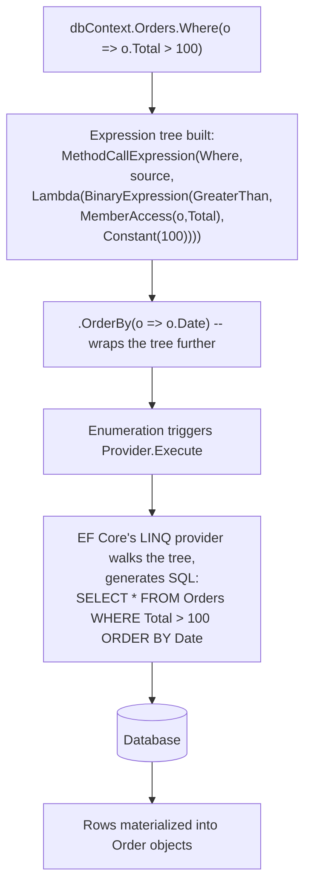
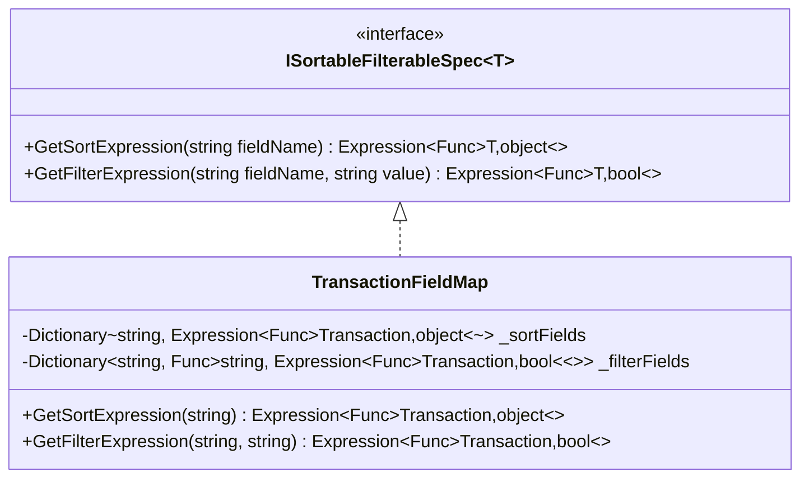

# Module 5 — C# Advanced: LINQ Internals — `IEnumerable` vs `IQueryable`, Deferred Execution & Iterator State Machines

> Domain: C# | Level: Beginner → Expert | Prerequisite: [[04-Delegates-Events-Closures]] (closures inside lambda predicates), [[02-Async-Await-Internals]] (iterator/state-machine compiler pattern), [[03-Span-Memory-Low-Allocation]] (LINQ allocation costs vs `Span<T>`)

---

## 1. Topic Description

### Definition

LINQ is two distinct execution models behind one syntax. **LINQ to Objects** binds to `Enumerable` extension methods that take **compiled delegates** and pull items one at a time through a chain of iterator state machines generated from `yield return`. **LINQ to a provider** binds to `Queryable` methods that take **expression trees** — the same lambda captured as an inspectable data structure — which a provider translates into another language, typically SQL. Which of the two you are holding is invisible in the source text and is the single most consequential fact about any LINQ query in a data-access path.

### Core sub-concepts

- **Iterator state machines** — what `yield return` compiles to; why argument validation in an iterator method throws at first `MoveNext`, not at the call.
- **Deferred vs immediate execution** — the query as a recipe; which operators force execution.
- **Streaming vs buffering operators** — `Where`/`Select`/`Take` versus `OrderBy`/`GroupBy`/`Distinct`/`ToList`, and the memory and time-to-first-result consequences.
- **`IEnumerable<T>` vs `IQueryable<T>`** — delegates versus expression trees; the exact moment a chain degrades to client-side evaluation.
- **Expression trees** — lambdas as data, provider translation, what C# constructs cannot be represented, and the runtime code generation they imply.
- **Multiple enumeration** — re-executing a deferred pipeline, including re-issuing the database query, and inconsistent results under concurrency.
- **Closure interaction** — capture by reference in predicates, deferred queries escaping the lifetime of what they captured.
- **Element operators** — `First` / `FirstOrDefault` / `Single` / `SingleOrDefault` chosen by the invariant being asserted, and their cost differences.
- **`Any()` vs `Count()`** — short-circuiting versus full enumeration or `COUNT(*)`.
- **Allocation profile** — one iterator and one delegate per operator, plus a display class per capturing lambda; per-query rather than per-element cost.
- **Custom operators** — extension methods with `yield return`, eager validation wrappers, `IList<T>` fast paths.
- **Boundary operators** — `AsEnumerable`, `ToList` and where the server/client fence is placed.

### Where it fits

LINQ is the most-used abstraction in a C# codebase, sitting between application logic and both in-memory collections and the database. Downward it depends on delegates and closures for `Enumerable`, and on expression trees plus runtime code generation for `Queryable` — the latter being precisely what NativeAOT cannot support, so a heavy provider dependency quietly forecloses an AOT deployment option. Upward it is the layer where a clean-looking repository method silently becomes a full table scan.

### Why it matters at scale

Two pathologies dominate production. **Silent client-side evaluation**: the chain becomes `IEnumerable<T>` before the filter, so the provider fetches every row and the predicate runs in memory — fast in development against a thousand rows, forty seconds against ten million. **Multiple enumeration**: `if (q.Any())` followed by `foreach (q)` issues the query twice, and a `Count()` before iteration makes it three times, multiplying database load invisibly. Both look like idiomatic, well-factored code in review, which is why they need mechanical detection rather than vigilance.

### Common pitfalls / anti-patterns

- **Returning `IQueryable<T>` beyond the data layer** — callers compose untranslatable expressions, enumerate a live query repeatedly, or hold it past the context's lifetime.
- **Reflexive `.ToList()` mid-chain "to be safe"** — materialises the entire result at that point, discards remaining server-side filtering, and can pull an unbounded set into memory.
- **`Count() > 0` instead of `Any()`** — enumerates the whole sequence, or becomes a `COUNT(*)` over the full result set where a short-circuit would do.
- **`NOT IN` against a subquery containing NULL** — returns no rows at all, silently, because of three-valued logic.
- **A CTE-style expectation that a query variable is materialised once** — a deferred query referenced three times executes three times; nothing is cached.
- **Returning `IEnumerable<T>` from a repository** — the signature communicates nothing about whether enumeration is free or catastrophic, or whether the connection is still open.

> Scope note: async iterator mechanics and `ValueTask` belong to `02-Async-Await-Internals`; span-based hot-path alternatives to `03-Span-Memory-Low-Allocation`; closure and display-class mechanics to `04-Delegates-Events-Closures`; variance on `IEnumerable<out T>` to `06-Generics-Variance`. EF Core's query pipeline and change tracking live in `56-LINQ-EFCore`.

---

## 2. Beginner (10 Q&A)


**Q1. What does the compiler generate for a method containing `yield return`?**
**A:** A state machine class implementing `IEnumerable<T>` and `IEnumerator<T>`, with the method's locals lifted to fields and the body split into cases of a `MoveNext` switch keyed on a state field. Calling the method executes none of the body — it just constructs the state machine — and each `MoveNext` runs until the next `yield return`, storing the value in `Current` and recording where to resume. This is why an exception inside an iterator method surfaces at the first `MoveNext`, not at the call, which routinely confuses people validating arguments in iterator methods.
*Follow-up: How would you make argument validation throw eagerly in an iterator method?*

**Q2. Explain deferred execution and give an example where it produces a wrong result.**
**A:** Most LINQ operators build a pipeline object and execute nothing until enumerated, so the query runs at the `foreach`, `ToList`, or aggregation — not where it was written. The classic wrong result comes from a captured variable that changes in between: define `var q = items.Where(x => x.Id == id)`, reassign `id`, then enumerate, and you filter on the new value because capture is by reference. The same shape causes trouble with a query defined inside a `using` and enumerated after the resource is disposed. The mental model to hold is that a LINQ query is a *recipe*, not a result.
*Follow-up: Which common operators execute immediately rather than lazily?*

**Q3. What is the difference between `IEnumerable<T>` and `IQueryable<T>`?**
**A:** `IEnumerable<T>` operators take delegates and execute in-process, pulling items one at a time. `IQueryable<T>` operators take *expression trees* — the lambda as a data structure describing the code rather than compiled code — which a provider inspects and translates into something else, typically SQL. That difference is why a predicate on an `IQueryable` can become a `WHERE` clause executed by the database, while the same predicate on an `IEnumerable` requires every row to be fetched first. Knowing which one you are holding is the single most consequential thing about a LINQ query in a data-access path.
*Follow-up: What happens at the moment an `IQueryable<T>` is assigned to an `IEnumerable<T>` variable?*

**Q4. Which operators stream and which buffer, and why does that distinction matter?**
**A:** `Where`, `Select`, `Take`, `SkipWhile` and friends stream — they process one element at a time and hold nothing. `OrderBy`, `GroupBy`, `Reverse`, `ToList`, `ToDictionary` and `Distinct` (partially) must buffer, because they cannot produce their first result until they have seen enough of the input. It matters because a streaming pipeline over a million rows uses constant memory, while inserting a single `OrderBy` in the middle materialises the whole sequence. It also matters for latency: a buffering operator destroys time-to-first-result, which is the whole point of streaming from a database or a network.
*Follow-up: `OrderBy(...).First()` — does that sort everything, and does the answer differ for `IQueryable`?*

**Q5. What is multiple enumeration, and why is it dangerous?**
**A:** Enumerating the same deferred query more than once re-executes the entire pipeline each time — including, for an `IQueryable`, re-issuing the database query. The dangerous version is subtle: `if (q.Any()) { foreach (var x in q) ... }` runs the query twice, and `q.Count()` followed by iteration runs it twice more. Beyond cost, it can give inconsistent results if the underlying data changed between enumerations, which produces bugs that only appear under concurrency. The fix is to materialise once into a `List<T>` when you know you need the results more than once — deliberately, not reflexively.
*Follow-up: How do you decide between materialising and restructuring the code to enumerate once?*

**Q6. `First`, `FirstOrDefault`, `Single`, `SingleOrDefault` — how do you choose?**
**A:** Choose by the invariant you are asserting, not by convenience. `Single` says "exactly one must match, and it is a bug otherwise" and will throw if there are two — which is exactly what you want when the value is a primary key and a duplicate indicates data corruption. `First` says "there may be several, give me one," which only makes sense with a deterministic ordering. The `OrDefault` variants say absence is expected and handled. The cost difference matters too: `Single` must read a second element to prove uniqueness, so on a large sequence or a database query it is strictly more work than `First`.
*Follow-up: A developer uses `First()` on an unordered query and it's non-deterministic in production but stable in dev. Why?*

**Q7. Why is `Any()` usually preferable to `Count() > 0`?**
**A:** `Any()` stops at the first element; `Count()` enumerates the entire sequence, and on an `IQueryable` it becomes a `COUNT(*)` over the full result set. On a large collection or a large table that is the difference between an index seek and a scan. The exception worth knowing is that when the source is an `ICollection<T>`, `Count()` short-circuits to the `Count` property and is O(1) — but relying on that requires knowing the concrete type, which the interface deliberately hides, so `Any()` remains the safer habit.
*Follow-up: What about `Count() == 0` versus `!Any()` on an `IQueryable` — is there a difference in generated SQL?*

**Q8. What does a simple `Where(...).Select(...)` chain allocate?**
**A:** One iterator object per operator, one delegate per lambda, and a display class per capturing lambda — so a two-operator chain over a collection typically allocates a handful of small objects once, then nothing per element. That is cheap and dies in gen0, which is why LINQ is fine almost everywhere. It becomes material only when the chain is constructed inside a hot loop, so the per-chain allocations happen millions of times, or when the sequence is short enough that the fixed setup cost dominates the work. Recognising that the cost is per-query rather than per-element is the point.
*Follow-up: Why can a `foreach` over a `List<T>` avoid an enumerator allocation where the same loop over `IEnumerable<T>` cannot?*

**Q9. What is an expression tree, and how is it different from a lambda?**
**A:** `Func<T, bool>` is compiled code — a delegate you can only invoke. `Expression<Func<T, bool>>` is the same lambda captured as a *tree of nodes* describing the operation, which you can inspect, rewrite, translate to another language, or compile to a delegate at runtime. The compiler chooses which to build based on the target type, which is why the identical lambda text means something completely different depending on whether it is passed to `Enumerable.Where` or `Queryable.Where`. Everything a query provider does rests on this.
*Follow-up: What kinds of C# constructs cannot be represented in an expression tree?*

**Q10. What does `AsEnumerable()` do, and when would you use it deliberately?**
**A:** It changes the static type from `IQueryable<T>` to `IEnumerable<T>`, so every subsequent operator binds to `Enumerable` rather than `Queryable` — meaning everything after that point executes in memory on the results fetched so far. You use it deliberately when the remaining logic cannot be translated by the provider and you have already reduced the result set to a size you are happy to pull into memory. Using it accidentally, or early in a chain, is one of the most expensive mistakes available in a data-access layer.
*Follow-up: How would you make an accidental `AsEnumerable` visible in code review or in CI?*

---

## 3. Intermediate (10 Q&A)


**Q1. A query that was fast in dev takes 40 seconds in production and the database shows a full table scan with no `WHERE` clause. What happened?**
**A:** Almost certainly client-side evaluation: the chain became `IEnumerable<T>` before the filter — through an `AsEnumerable`, a `ToList`, a method the provider cannot translate, or assignment to an `IEnumerable<T>` variable — so the provider fetched every row and the predicate ran in memory. In dev the table had a thousand rows and nobody noticed. I would confirm by capturing the generated SQL, then find the exact point in the chain where translation stopped. The durable fix is not just moving the filter but making this class of bug loud: newer EF Core versions throw rather than silently evaluating client-side, and query logging with a row-count threshold catches the rest.
*Follow-up: The untranslatable part is a genuine business rule that can't be expressed in SQL. How do you restructure the query?*

**Q2. How would you find and fix multiple enumeration in an existing codebase?**
**A:** Static analysis first — the "possible multiple enumeration" inspection catches most of it, and it is worth enabling as a warning even though it has false positives. Then the higher-leverage structural change: stop returning `IEnumerable<T>` from methods that have already materialised their data, and return `IReadOnlyList<T>` instead, which makes multiple enumeration harmless and free. For repositories, returning `IQueryable<T>` beyond the data layer is what allows callers to accidentally enumerate a live query several times, so I would treat that boundary as the real defect rather than fixing call sites one at a time.
*Follow-up: Some argue repositories should return `IQueryable<T>` for composability. What's your position?*

**Q3. When is `.ToList()` the right call, and when is it a mistake?**
**A:** It is right when you will genuinely enumerate more than once, when you need to release a connection or a `DbContext` before consuming, or when you need a stable snapshot because the source may change. It is a mistake when it is reflexive — inserted "to be safe" mid-chain — because it materialises everything at that point, defeats streaming, discards any remaining server-side filtering, and can pull an unbounded result set into memory. The tell in review is `.ToList()` followed immediately by more LINQ operators: that is almost always a fence in the wrong place.
*Follow-up: A junior adds `.ToList()` to fix a "connection already open" error. What's the actual bug?*

**Q4. Explain the performance implication of operator order in a LINQ chain.**
**A:** For streaming operators, put the most selective filter first so later operators process fewer elements — `Where` before `Select` before `OrderBy` is the general shape, and sorting before filtering is a common and expensive inversion. For `IQueryable` the provider usually reorders for you since it produces a single SQL statement, so ordering matters far less; for `IEnumerable` the pipeline executes literally as written, so it matters a great deal. The important judgement is knowing which of those two worlds you are in, because advice that is correct for one is irrelevant in the other.
*Follow-up: Is there a case where putting `Where` first is actually worse?*

**Q5. What is the cost of `GroupBy` and how does it differ between LINQ to Objects and a database provider?**
**A:** In LINQ to Objects, `GroupBy` buffers the entire source to build the groups, so it is O(n) memory and produces no results until the input is exhausted — a real problem in a streaming pipeline over a large sequence. Translated to SQL it becomes a `GROUP BY` executed by the database with its own indexes and memory, which is usually far better, but only if the projection is translatable — grouping and then selecting a complex object often falls back to fetching all rows and grouping client-side. So the same expression can be an index-assisted aggregate or a full table load depending on details that are invisible in the C#.
*Follow-up: How do you verify which of those two you got, without guessing?*

**Q6. When would you write a custom LINQ operator, and how would you implement it?**
**A:** When a non-trivial sequence transformation appears repeatedly and expressing it inline hurts readability — batching, chunking before `Chunk` existed, sliding windows, distinct-by-key before `DistinctBy` existed. Implement it as an extension method on `IEnumerable<T>` using `yield return` so it composes and streams like the built-ins, and split argument validation into a non-iterator wrapper so it throws eagerly. I would check the BCL first, since several classic custom operators have been added to `System.Linq` in recent versions, and a custom one that shadows a built-in causes confusion later.
*Follow-up: How would you write that operator so it also works efficiently when the source is an `IList<T>`?*

**Q7. How do closures interact with LINQ in a way that causes bugs?**
**A:** A predicate captures variables by reference and the query runs later, so anything that mutates the captured variable between definition and enumeration changes the result — including a loop variable, which for a `for` loop is shared across iterations. The subtler production version is capturing something expensive or long-lived: a lambda capturing `this` inside a query stored in a field roots the whole containing object, and a lambda capturing a `DbContext` in a deferred query means the query is only valid while that context lives. I would look for deferred queries that escape the scope of what they captured — that is the shape of the bug.
*Follow-up: How does storing an `IQueryable` in a field or cache go wrong?*

**Q8. When is LINQ genuinely too slow, and what replaces it?**
**A:** In tight numeric loops over large arrays or spans, where the per-element delegate invocation and enumerator indirection prevent the JIT from vectorising or inlining, a hand-written `for` loop over a `Span<T>` can be several times faster. It also matters where a chain is rebuilt inside a hot loop so the per-query allocation happens millions of times. Everywhere else — request handling, business logic, anything dominated by I/O — LINQ's cost is noise and replacing it trades readability for nothing. The decision must come from a profile showing the LINQ pipeline as a leading cost, not from a general belief that LINQ is slow.
*Follow-up: You replace a LINQ chain with a manual loop and gain 30% on the benchmark. What do you check before merging?*

**Q9. How do you unit-test code that returns `IQueryable<T>`, and what does that testing miss?**
**A:** You can back it with an in-memory list and the tests will pass — which is exactly the trap, because the in-memory provider is `Enumerable`, so it happily evaluates expressions the real provider cannot translate, and it applies .NET semantics for null handling, string comparison and culture that differ from the database's. Tests therefore prove the logic and hide the translation failures, which are the bugs that actually reach production. The reliable answer is integration tests against the real database engine, ideally containerised, for anything whose correctness depends on translation — with in-memory tests reserved for pure logic.
*Follow-up: Containerised database tests are slow. How do you keep the feedback loop tolerable?*

**Q10. What is your view on returning `IEnumerable<T>` from a repository method?**
**A:** It is usually the wrong choice, because it hides whether the result is already materialised or a live query. Callers cannot tell whether enumerating twice is free or catastrophic, whether the underlying connection is still open, or whether the sequence is bounded. Returning `IReadOnlyList<T>` states "this is materialised and safe," while returning `IAsyncEnumerable<T>` states "this streams and you must consume it within the resource's lifetime" — both are honest, and `IEnumerable<T>` is not. The general principle is that a return type should communicate the consumption contract, and this is one of the clearest places where C#'s default choice communicates nothing.
*Follow-up: What breaks when an `IAsyncEnumerable` from a repository is enumerated after the scope is disposed, and how do you prevent it?*

---

## 4. Expert / Architect (10 Q&A)


**Q1. Would you allow `IQueryable<T>` to cross the boundary out of the data-access layer? Argue both sides.**
**A:** For it: composability — callers add filters and paging, the provider produces one efficient query, and you avoid an explosion of near-identical repository methods. Against it: the abstraction leaks completely. Callers can compose expressions the provider cannot translate, cause client-side evaluation, hold a live query past the context's lifetime, and defeat any attempt to reason about or govern the queries a service issues. My position for a large estate is that `IQueryable` stops at the data layer, with an explicit specification or query-object pattern for the composability people actually want, because the failure modes of a leaked `IQueryable` are severe, load-dependent, and diagnosed far from where they were introduced.
*Follow-up: How would you implement that specification pattern without recreating a worse `IQueryable`?*

**Q2. How would you make LINQ-related performance problems detectable at the organisation level rather than per incident?**
**A:** Make the database the source of truth for what actually happened. Log generated SQL with the associated query tag in non-production and sampled in production, alert on queries returning above a row threshold, and surface per-request query counts so N+1 patterns show as a number rather than a suspicion. Configure the provider to throw on client-side evaluation rather than warn, so it fails in CI instead of degrading in production. Then add integration tests that assert query counts for critical paths, which is the only reliable regression gate for this class of bug. The organisational piece is that this instrumentation belongs in the shared data-access package so every service inherits it rather than each team rediscovering the need.
*Follow-up: A team's query-count test fails after an unrelated refactor. How do you keep that from being marked flaky and deleted?*

**Q3. A team wants to build a dynamic query API where clients send filter expressions that are turned into `IQueryable` predicates. What are your concerns?**
**A:** Primarily security and cost. Building expression trees from client input is an injection surface of a different shape than SQL injection — the risk is not string concatenation but allowing filters on unindexed columns, unbounded result sets, or navigation paths that expose data the caller should not see. There is also a denial-of-service dimension: an arbitrary filter can force a full scan or a cartesian join, and an arbitrary sort can exhaust the database's memory. I would require an explicit allow-list of filterable fields and operators, mandatory paging with a hard cap, per-caller cost limits, and authorisation applied as a non-negotiable predicate composed into every query rather than something the client can influence.
*Follow-up: How do you enforce that the tenant filter can never be omitted, structurally rather than by convention?*

**Q4. How would you approach migrating a large codebase off a query pattern that has become a systemic performance problem?**
**A:** Measure first to size it: instrument to find which call sites actually produce the bad queries, because in my experience a small number of paths generate most of the cost and a mass refactor would be mostly wasted. Then fix in order of production impact rather than alphabetically, behind tests that assert query counts and SQL shape so the fix cannot regress. To stop the bleeding while migrating, add the analyzer or provider setting that makes the pattern a build error for *new* code with a suppression baseline for existing code — that converts an unbounded refactor into a burn-down with a visible number. I would resist the instinct to ban the pattern outright before the alternative is documented and easy, since teams under deadline will otherwise route around it in worse ways.
*Follow-up: The burn-down stalls at 80% because the remaining sites are hard. What do you do?*

**Q5. What are the architectural implications of expression trees being used for translation — where else does this pattern show up, and what does it cost you?**
**A:** The same mechanism underpins provider-based ORMs, mapping libraries, validation rule engines, mocking frameworks and dynamic filtering. The architectural cost is that translation is partial and version-dependent: what compiles is not what is supported, so the contract lives in a provider's implementation rather than in the type system, and a provider upgrade can change which of your queries are translatable. The second cost is runtime code generation — compiling expression trees is expensive and, critically, unavailable under NativeAOT, so a codebase leaning heavily on this pattern has quietly foreclosed an AOT option. I would want those dependencies known and deliberate rather than accumulated.
*Follow-up: How would you evaluate whether your service could move to NativeAOT given a heavy expression-tree dependency?*

**Q6. How do you weigh readability against performance when setting LINQ guidance for many teams?**
**A:** I would set the default firmly on readability, because the vast majority of code is not hot and LINQ's clarity has real, compounding value in a codebase many people maintain. The guidance I would write is narrow and specific rather than general: no `IQueryable` beyond the data layer, no reflexive `.ToList()`, prefer `Any()` over `Count()`, return types that state their consumption contract, and hand-optimised loops only in benchmarked hot paths with a comment explaining why. Blanket advice like "avoid LINQ for performance" is actively harmful — it produces slower, buggier code written by people optimising the wrong thing. The credibility of guidance depends on it naming the specific failure it prevents.
*Follow-up: A senior engineer on another team disagrees and is banning LINQ in their service. How do you handle that?*

**Q7. In a service with a strict latency budget, how do you decide where LINQ is acceptable?**
**A:** By allocating the budget explicitly: measure where time actually goes, and accept LINQ anywhere its contribution is below the noise floor of that path — which is nearly everywhere, since a few enumerator allocations are nanoseconds against milliseconds of I/O. The places to scrutinise are per-element work in high-frequency loops, chains rebuilt inside loops, and any buffering operator on a sequence whose size is caller-controlled, because that is a memory and latency risk rather than a constant cost. I would encode the outcome as benchmarks on the specific hot paths rather than as a style rule, so the constraint is enforced by measurement and stays true as the code changes.
*Follow-up: Where in a typical request pipeline would you expect LINQ to actually show up in a profile?*

**Q8. How does the LINQ-to-provider model complicate multi-tenant data isolation?**
**A:** The tenant predicate has to be present on every query, and LINQ makes it very easy to write one that omits it — a single missed `Where` is a cross-tenant data leak that no test will catch unless it was written to look for it. Relying on developers to remember is not a control. The structural answers are provider-level global query filters applied automatically, plus database-level enforcement such as row-level security so the isolation does not depend on the application at all, plus tests that run as one tenant and assert that another tenant's rows are unreachable through every repository method. I would treat any code path that bypasses the filter as requiring explicit review and an audit record, because in a regulated environment that is a control, not a convention.
*Follow-up: A reporting feature legitimately needs cross-tenant access. How do you allow it without weakening the default?*

**Q9. What is your position on hand-written SQL versus LINQ for a data-intensive service?**
**A:** Mixed by intent rather than by ideology. LINQ for the large volume of ordinary CRUD and simple queries, where its type safety, refactorability and compile-time checking against the model are real advantages over strings. Hand-written SQL for the small number of queries where performance is critical, the shape is complex, or you need engine-specific features the provider cannot express — because fighting the translator to produce a specific plan is more fragile than writing the query you want. The important part is making the boundary deliberate and reviewed: hand-written SQL needs its own tests, parameterisation discipline, and an owner, and should be kept where it is discoverable rather than scattered inline.
*Follow-up: How do you keep hand-written SQL from drifting out of sync with the model over time?*

**Q10. A performance review finds LINQ named as the top allocation source in a service. How do you interpret that, and what would you do?**
**A:** With scepticism, because "top allocation source" and "top cost" are different claims, and LINQ appearing at the top of an allocation profile is normal in an application that is behaving fine — those allocations mostly die in gen0 at negligible cost. I would look at whether they are actually causing collection pressure, promotion or pause time before acting, and I would look for the specific pathologies that genuinely hurt: buffering operators on unbounded inputs, chains constructed per-element, and materialisation of large result sets. If the honest answer is that LINQ allocates a lot and it costs nothing, that is the finding, and I would say so rather than authorising a rewrite. Redirecting a team away from a plausible-looking but worthless optimisation is one of the more valuable things a principal engineer does.
*Follow-up: The team has already spent two weeks on the rewrite and it shows a 2% improvement. How do you close that out?*

---

## 5. Reference Material

> Retained from the original module: deep-dive internals, diagrams, production examples, exercises, system/low-level design, debugging walkthroughs and the Principal Engineer perspective.

### 1. Fundamentals

#### What is LINQ?
**Language Integrated Query (LINQ)** is a set of extension methods (`Where`, `Select`, `OrderBy`, `GroupBy`, `Join`, etc.) over `IEnumerable<T>` (LINQ to Objects) and `IQueryable<T>` (LINQ to anything with a query provider — EF Core, LINQ to SQL, etc.), plus C#'s query-expression syntax (`from x in xs where... select...`) that the compiler translates into chained method calls. It provides one consistent, composable query syntax over in-memory collections, databases, XML, and any custom data source that implements the right interfaces.

#### Why does it exist?
Before LINQ (pre-C# 3/.NET 3.5), filtering/projecting/aggregating collections meant hand-written `foreach` loops with manual accumulation, or SQL embedded as opaque strings with no compile-time checking. LINQ unifies this into a single, type-checked, composable, declarative style — and, critically, the **same syntax** can express both "filter this in-memory list" (compiled to a delegate, executed in-process) and "filter this database table" (compiled to an **expression tree**, translated to SQL, executed remotely) — a genuinely elegant piece of language design most candidates use daily without understanding the mechanism.

#### When does this matter?
- **Always**, for anyone using EF Core, in-memory collection processing, or any LINQ-based library — but understanding the *mechanism* matters specifically when:
 - Diagnosing an EF Core query that materializes far more data than expected, or one that silently pulls an entire table into memory before filtering (the "client-side evaluation" trap).
 - Reasoning about LINQ's allocation cost in hot paths (directly extending the guidance).
 - Explaining **deferred execution** bugs (a query re-evaluated on each enumeration, or evaluated with stale captured variables).
 - Interviewing at Staff/Principal level — "explain `IEnumerable<T>` vs `IQueryable<T>`, precisely" is one of the most common C#/EF gatekeeping questions, and most candidates give a surface-level answer.

#### How does it work (30,000-ft view)?

```csharp
// LINQ to Objects (IEnumerable<T>) -- compiles to a chain of delegate-based method calls
// executed in-process, method-by-method, item-by-item, lazily.
var evens = numbers.Where(n => n % 2 == 0).Select(n => n * n);

// LINQ to Entities (IQueryable<T>) -- the SAME syntax compiles the lambda to an
// EXPRESSION TREE (data describing the lambda, not compiled code), which the
// provider (EF Core) translates into SQL and sends to the database.
var evens = dbContext.Numbers.Where(n => n % 2 == 0).Select(n => n * n);
```

Mental model for interviews: **"`IEnumerable<T>` LINQ compiles your lambda into a delegate and runs it here, in this process, one item at a time, lazily, on demand. `IQueryable<T>` LINQ compiles your lambda into an expression tree — data describing the lambda's logic — that a provider translates into a different language (SQL) and executes somewhere else."** Every deep LINQ question traces back to this one distinction.

### 2. Deep Dive

#### 2.1 `IEnumerable<T>` — the Iterator Pattern and `yield return`

`IEnumerable<T>` exposes exactly one method: `GetEnumerator`, returning an `IEnumerator<T>` with `MoveNext`, `Current`, and `Reset` (Reset is largely vestigial/unsupported by most modern enumerators). This is the classic **Iterator design pattern**, built into the language via `foreach` (which desugars to explicit `GetEnumerator`/`MoveNext`/`Current` calls, wrapped in a `try`/`finally` that calls `Dispose` if the enumerator implements `IDisposable`).

**`yield return`** is the compiler's sugar for hand-writing an `IEnumerator<T>` implementation. Just like `async`/`await`, a method containing `yield return` is transformed into a **compiler-generated state machine class** implementing `IEnumerable<T>`/`IEnumerator<T>`, where each `yield return` is a suspension point (recorded as a numbered state, resumed via a `goto`-based jump table in `MoveNext`), and local variables become fields on the state machine — structurally the **same transformation pattern** as `async` methods, just targeting iteration instead of asynchrony.

```csharp
// You write:
IEnumerable<int> Range(int start, int count)
{
    for (int i = 0; i < count; i++)
        yield return start + i;
}

// Compiler generates (simplified): a class implementing IEnumerable<int> AND IEnumerator<int>
// with a MoveNext method containing a state-based goto/switch resuming exactly where
// the last yield return left off -- start, count, and i all become fields.
```

**Critical fact**: calling `Range(0, 5)` does **not** run any of the loop body immediately — it merely constructs and returns the state-machine object. The loop body only executes as `MoveNext` is called, i.e., **lazily, one item at a time, driven entirely by the consumer** (a `foreach`, or a chained LINQ operator pulling the next item).

#### 2.2 Deferred Execution — the Single Most Important LINQ Concept

Every LINQ-to-Objects operator (`Where`, `Select`, `OrderBy`, etc., **except** the "terminal"/materializing ones: `ToList`, `ToArray`, `ToDictionary`, `Count`, `First`, `Sum`, etc.) is **deferred**: calling `.Where(predicate)` does not filter anything immediately — it returns a new lazy `IEnumerable<T>` wrapping the source, and the predicate only actually runs when something enumerates the result (a `foreach`, or a subsequent terminal operator).

```csharp
var query = numbers.Where(n => n > threshold); // NOTHING has executed yet -- no iteration happened
threshold = 100; // this mutation is now visible to the query!
foreach (var n in query) {... } // NOW the predicate runs, using threshold == 100
```

This is directly the closure-capture mechanic: the lambda `n => n > threshold` captures `threshold` by reference (via the compiler-generated display class), so any mutation to `threshold` *before* enumeration begins is visible when the query finally executes — a frequent source of confusion and real bugs.

**Consequence #1 — re-execution on every enumeration**: A deferred query is **not** a cached result — enumerating the same `IEnumerable<T>` query variable twice **re-runs the entire operator chain from the source**, twice. If the source is expensive (a database call wrapped behind a custom `IEnumerable`, a large computed sequence), this silently doubles (or worse) the work.

**Consequence #2 — exceptions are deferred too**: An exception inside a `Where`/`Select` predicate doesn't throw when you call `.Where(...)` — it throws when enumeration actually reaches the item that triggers it, which can be surprising if the `.Where(...)` call and the `foreach`/`.ToList` that triggers enumeration are far apart in the code (or in different methods entirely).

#### 2.3 `IQueryable<T>` — Expression Trees and Provider Translation

`IQueryable<T>` extends `IEnumerable<T>` and adds an `Expression` property (an `Expression` object — a **data structure representing code**, not compiled code) and a `Provider` property (an `IQueryProvider` responsible for translating and executing that expression). When you write:

```csharp
var query = dbContext.Orders.Where(o => o.Total > 100).OrderBy(o => o.Date);
```

The C# compiler notices `dbContext.Orders` is `IQueryable<Order>`, so it resolves `.Where`/`.OrderBy` to the **`Queryable`** class's overloads (not `Enumerable`'s) — these take `Expression<Func<T,bool>>` parameters, not `Func<T,bool>` delegates. The compiler converts the lambda `o => o.Total > 100` into an **expression tree** (a tree of `BinaryExpression`, `MemberExpression`, `ConstantExpression` nodes describing "access `.Total` on parameter `o`, compare greater-than, constant `100`") instead of compiling it to IL. Each `.Where`/`.OrderBy` call **builds up a larger expression tree** representing the entire query — **nothing executes yet**. Only when the query is enumerated (`foreach`, `.ToList`, etc.) does EF Core's `IQueryProvider` walk the accumulated expression tree, translate it into SQL, execute it against the database, and materialize the results into objects.


```mermaid
graph TB
 A["dbContext.Orders.Where(o => o.Total > 100)"] --> B["Expression tree built:<br/>MethodCallExpression(Where,<br/> source, Lambda(BinaryExpression(GreaterThan,<br/> MemberAccess(o,Total), Constant(100))))"]
 B --> C[".OrderBy(o => o.Date) -- wraps the tree further"]
 C --> D["Enumeration triggers Provider.Execute"]
 D --> E["EF Core's LINQ provider walks the tree,<br/>generates SQL:<br/>SELECT * FROM Orders WHERE Total > 100 ORDER BY Date"]
 E --> F[(Database)]
 F --> G["Rows materialized into Order objects"]
```

#### 2.4 The Client-Side Evaluation Trap — Precisely

Because `IQueryable<T>` providers can only translate expressions they understand (a finite, provider-specific subset of.NET — most standard operators, some string methods, but **not arbitrary C# methods, especially ones with side effects or that call into non-translatable APIs**), calling **any method the provider can't translate** inside a `Where`/`Select` on an `IQueryable<T>` either:
- Throws at query-execution time (`InvalidOperationException`/provider-specific translation exception) — the *safe* failure mode, common in modern EF Core (5+) which is fairly strict.
- **Or**, in older EF/EF6-era behavior (and in some remaining EF Core scenarios if you're not careful), **silently switches to client-side evaluation**: the provider fetches a larger-than-intended result set from the database (potentially the *entire table*) and then applies the untranslatable predicate/projection **in memory, in your process**, after the fact.

```csharp
// DANGEROUS pattern (classic interview/code-review trap):
var results = dbContext.Orders
.Where(o => MyCustomBusinessRule(o)) // MyCustomBusinessRule is a plain C# method -- NOT translatable to SQL
.ToList;
// If this doesn't throw, it may have pulled the ENTIRE Orders table into memory
// and filtered in-process -- catastrophic for a large table, and invisible in code review.
```

**Interview-critical fact**: This is exactly why placing a breakpoint/logging *inside* a lambda passed to an `IQueryable<T>` `.Where` and expecting it to hit for each row **as SQL executes** is a category error — if the query genuinely translates to SQL, **your C# lambda body never executes at all**; the *expression tree* describing it was translated to SQL text instead. If your breakpoint *does* hit, that's actually diagnostic evidence you've fallen into client-side evaluation.

#### 2.5 `IEnumerable<T>` vs `IQueryable<T>` — the Precise Comparison Table

| Aspect | `IEnumerable<T>` | `IQueryable<T>` |
|---|---|---|
| Lambda compiles to | `Func<T,...>` delegate (compiled IL) | `Expression<Func<T,...>>` (data structure) |
| Where does filtering/projection execute? | In-process, in this method's call stack | Wherever the provider decides (DB server, remote service) |
| Extension method source | `System.Linq.Enumerable` | `System.Linq.Queryable` |
| Can call arbitrary C# methods in the predicate? | Yes, anything — it's just compiled code | Only what the provider can translate — arbitrary methods fail or silently evaluate client-side |
| Typical use | In-memory collections (`List<T>`, arrays), already-materialized data | ORMs (EF Core), remote/queryable data sources |
| Composability across calls | Composes freely; each operator wraps the previous `IEnumerable<T>` | Composes freely; each operator extends the **same expression tree** (crucial: mixing the two, e.g., calling `.AsEnumerable` partway through, is a common and sometimes deliberate technique —) |

#### 2.6 Multiple Enumeration — the Classic Performance/Correctness Bug

```csharp
IEnumerable<Order> expensiveQuery = GetOrdersFromSomewhereExpensive; // deferred, not yet executed

int count = expensiveQuery.Count; // enumerates the WHOLE source once
var first = expensiveQuery.First; // enumerates AGAIN from the start (at least partially)
var list = expensiveQuery.ToList; // enumerates a THIRD time, fully
```

If `GetOrdersFromSomewhereExpensive` wraps a network call, a database query, or an expensive computed sequence, this pattern silently triples the cost — and if the underlying source is **not idempotent** (e.g., it advances some external cursor, or the underlying data can change between calls), each enumeration can return **different results**, a genuine correctness bug, not just a performance one. Static analyzers (Roslyn analyzer `CA1851`/"possible multiple enumeration" and similar Resharper/SonarQube rules) specifically exist to flag this.

#### 2.7 `Enumerable` vs Array/`List<T>`-Specific Overload Resolution and Performance

Many LINQ operators have **internal fast paths** for known concrete types: `Enumerable.Count` checks whether the source implements `ICollection<T>`/`ICollection` and, if so, returns `.Count` directly (O(1)) instead of enumerating (O(n)) — but only when called on a variable of a type where this check is visible; calling `.Count` on a variable **statically typed as `IEnumerable<T>`** (even if the runtime object is actually a `List<T>`) still goes through this same runtime check inside `Enumerable.Count`'s implementation, so this particular optimization *does* still apply — but many **other** LINQ operators (`Where`, `Select`, etc.) do **not** have such fast paths and always incur full iterator/delegate overhead regardless of the underlying concrete type. Modern.NET (8+) has also added **direct `Span<T>`-friendly overloads and internal vectorization** for some `Enumerable` operations (`Sum`, `Max`, `Min` over numeric arrays) — another place where "LINQ has a fixed, uniform cost" is an oversimplification worth knowing precisely for Advanced-tier questions.

### 3. Visual Architecture

#### LINQ Execution Model — Two Worlds


```mermaid
graph TB
 subgraph "LINQ to Objects (IEnumerable<T>)"
 A1[Source: List/Array/yield-based iterator] --> A2["Where(Func&lt;T,bool&gt)<br/>compiled delegate"]
 A2 --> A3["Select(Func&lt;T,TResult&gt)<br/>compiled delegate"]
 A3 --> A4["foreach / ToList<br/>drives MoveNext chain, in-process"]
 end
 subgraph "LINQ to Entities (IQueryable<T>)"
 B1["Source: DbSet&lt;T&gt;"] --> B2["Where(Expression&lt;Func&lt;T,bool&gt;&gt)<br/>appends to expression tree"]
 B2 --> B3["OrderBy(Expression&lt;Func&lt;T,TKey&gt;&gt)<br/>appends further"]
 B3 --> B4["ToListAsync<br/>triggers Provider.Execute"]
 B4 --> B5["Expression tree -> SQL translation"]
 B5 --> B6[(Database engine)]
 end
```

#### Iterator State Machine Lifecycle (ASCII, mirrors the async state machine diagram)

```
 Range(0, 3) called
 │
 ▼
 ┌───────────────────────┐ NOT executed yet -- just constructs the state machine object
 │ state = -2 (not started)│
 └───────────────────────┘
 │ first MoveNext call (from foreach / next LINQ operator)
 ▼
 ┌───────────────────────┐
 │ state = 0, i = 0 │
 │ Current = start + 0 │ <-- yield return suspends HERE, returns true
 └───────────────────────┘
 │ next MoveNext call
 ▼
 ┌───────────────────────┐
 │ resume at state 0, │
 │ i++, loop condition, │
 │ Current = start + 1 │
 └───────────────────────┘
 │... repeats until loop condition false...
 ▼
 ┌───────────────────────┐
 │ MoveNext returns false │ <-- enumeration complete
 └───────────────────────┘
```

### 4. Production Example

#### Scenario: E-commerce reporting API — a query that "worked in dev" times out in production

**Problem**: An internal reporting endpoint (`GET /api/reports/high-value-customers`) ran in ~200ms against the development database (a few thousand rows) but timed out (>30s) against production (tens of millions of order rows), despite seemingly identical code and an index on the relevant columns.

**Investigation**:
- Enabling EF Core's SQL logging (`optionsBuilder.LogTo(...)` / `IDbCommandInterceptor`) revealed the actual SQL sent to the database was `SELECT * FROM Orders` — **the entire table**, with no `WHERE` clause at all, despite the C# code clearly containing a `.Where(...)` filter.
- The offending line: `.Where(o => CalculateLoyaltyTier(o.CustomerId, o.Total) == LoyaltyTier.Platinum)`, where `CalculateLoyaltyTier` was a plain C# static method containing business logic (tier thresholds, special-case rules) that had organically grown too complex to express as a simple property comparison.
- Because `CalculateLoyaltyTier` is an arbitrary C# method with no SQL translation, the specific (older, at-the-time-in-use) EF Core/LINQ-provider version in use fell back to **client-side evaluation** — silently pulling the entire `Orders` table into application memory before applying the filter in-process. In dev, with a few thousand rows, this was invisible (fast enough not to notice); in production, with tens of millions of rows, it was catastrophic.

**Architecture fix**:
- Rewrote `CalculateLoyaltyTier`'s core comparable logic as an `IQueryable`-translatable expression directly in the `Where` clause (moving the threshold constants and simple comparisons into SQL-translatable form: `o.Total > platinumThreshold &&...`), keeping the more complex, genuinely non-translatable business rules as a **secondary, in-memory filter applied only after** a first SQL-translatable filter had already reduced the result set to a manageable size (`dbContext.Orders.Where(o => o.Total > threshold).AsEnumerable.Where(o => CalculateLoyaltyTier(...) ==...)`) — deliberately splitting the query into "what SQL can do" and "what only C# can do," in that order, rather than accidentally letting the whole thing fall back to client-side evaluation on the unfiltered table.
- Upgraded to a modern EF Core version where untranslatable expressions **throw immediately** at query-construction/execution time rather than silently falling back — converting this entire bug class from "silent production catastrophe" into "loud, caught-in-dev-immediately compile/runtime error."
- Added a CI-run integration test asserting the generated SQL for this and other reporting queries contains a `WHERE` clause with the expected filter columns (a "SQL shape" regression test), not just asserting on the returned C# result.

**Trade-offs**: Splitting the query into a SQL-translatable prefix + an in-memory-evaluated suffix (`.AsEnumerable.Where(...)`) means the "coarse" SQL filter must be conservative enough to never *exclude* a row the finer in-memory filter would have included — the team had to carefully verify `o.Total > platinumThreshold` was a true superset condition, not an independent narrower filter, to avoid silently dropping valid results.

**Lessons learned**:
1. Always verify the *actual generated SQL* for any `IQueryable<T>`-based query touching a large table — never trust that "the C# compiles and runs" means "the database work is what you expect."
2. Client-side evaluation is the single most dangerous, least-visible LINQ-to-Entities failure mode — it produces *correct results*, just via a catastrophically inefficient path, so it's invisible to correctness-only testing.
3. Upgrading to a stricter EF Core version that fails loudly instead of silently degrading is a legitimate, high-value defensive engineering investment, not just a routine dependency bump.
4. When a business rule genuinely can't be translated to SQL, deliberately and explicitly split the query (SQL-translatable coarse filter, then in-memory fine filter) rather than accidentally falling into it.

### 11. Coding Exercises

#### Easy — Fix a multiple-enumeration bug
**Problem**: This method enumerates an expensive source three times.
```csharp
public ReportSummary BuildSummary(IEnumerable<Order> expensiveOrderSource)
{
    return new ReportSummary
    {
        Total = expensiveOrderSource.Sum(o => o.Total),
            Count = expensiveOrderSource.Count,
            Items = expensiveOrderSource.ToList
    };
}
```
**Solution**:
```csharp
public ReportSummary BuildSummary(IEnumerable<Order> expensiveOrderSource)
{
    var orders = expensiveOrderSource.ToList; // materialize ONCE
    return new ReportSummary
    {
        Total = orders.Sum(o => o.Total),
            Count = orders.Count, // List<T>.Count property, O(1), not Enumerable.Count
            Items = orders
    };
}
```
**Time complexity**: Original: O(3n) plus, if the source is a wrapped expensive operation (DB call, computed sequence), 3x the underlying cost. Fixed: O(n) total enumeration, O(1) for `.Count` (property access on the materialized `List<T>`).
**Discussion**: Note `orders.Count` (property) vs `orders.Count` (LINQ extension method) — on an already-materialized `List<T>`, both are O(1), but using the property directly is slightly more idiomatic/explicit once you know you're holding a concrete `List<T>`.

#### Medium — Implement a custom lazy iterator with `yield return`
**Problem**: Implement a `Batch<T>` extension method that lazily groups a sequence into fixed-size chunks, without materializing the whole source upfront.
```csharp
public static IEnumerable<IReadOnlyList<T>> Batch<T>(this IEnumerable<T> source, int batchSize)
{
    if (batchSize <= 0) throw new ArgumentOutOfRangeException(nameof(batchSize));

    List<T>? currentBatch = null;
    foreach (var item in source)
    {
        currentBatch??= new List<T>(batchSize);
        currentBatch.Add(item);
        if (currentBatch.Count == batchSize)
        {
            yield return currentBatch;
            currentBatch = null; // start a fresh batch -- don't reuse/clear the same list (see discussion)
        }
    }
    if (currentBatch is { Count: > 0 })
        yield return currentBatch; // final partial batch, if any
}

// Usage:
foreach (var batch in bigSequence.Batch(100))
{
    await ProcessBatchAsync(batch); // only ONE batch (100 items) materialized in memory at a time
}
```
**Time complexity**: O(n) total across the whole enumeration. **Space**: O(batchSize) held at any one time (not O(n)) — this is the entire point: lazily batching a huge (or even infinite/streaming) source without ever buffering it all in memory at once.
**Discussion**: Deliberately allocating a **new** `List<T>` for each batch (rather than clearing and reusing one shared list) matters because each yielded batch is handed to the caller, who may hold onto it (e.g., queue it for later async processing) — reusing one mutable list across yields would let a later mutation silently corrupt a batch the caller thought was already "theirs," a subtle aliasing bug in the same family as the shared-mutable-buffer incident, here manifesting through a hand-rolled iterator instead of a `Span<T>`.

#### Hard — Diagnose and fix a client-side evaluation bug
**Problem**: This EF Core query works in a small test database but is catastrophic in production.
```csharp
public List<CustomerSummary> GetActiveHighValueCustomers(AppDbContext db)
{
    return db.Customers
    .Where(c => IsHighValue(c)) // plain C# method -- NOT translatable
    .Select(c => new CustomerSummary { Id = c.Id, Name = c.Name })
    .ToList;
}

private bool IsHighValue(Customer c) =>
    c.TotalLifetimeSpend > 10_000 && c.Orders.Count(o =>!o.IsRefunded) > 5;
```
**Solution**:
```csharp
public List<CustomerSummary> GetActiveHighValueCustomers(AppDbContext db)
{
    return db.Customers
    // Inline the translatable parts directly into the LINQ expression tree
    // instead of calling an opaque C# method -- EF Core CAN translate this.
    .Where(c => c.TotalLifetimeSpend > 10_000
        && c.Orders.Count(o =>!o.IsRefunded) > 5)
    .Select(c => new CustomerSummary { Id = c.Id, Name = c.Name })
    .ToList;
}
```
**Time complexity**: Original: O(entire Customers + Orders tables) transferred and evaluated in application memory. Fixed: the filter (including the correlated `Orders.Count(...)` subquery) translates entirely to SQL — the database evaluates it using indexes/joins, transferring only matching rows.
**Optimized further**: Verify via `db.Customers.Where(...).Select(...).ToQueryString` (EF Core 5+) that the generated SQL contains the expected `WHERE`/subquery shape before shipping, exactly as the Production Example recommends as a standing practice, not a one-time fix.

#### Expert — Implement a `Specification<T>` pattern to prevent `IQueryable<T>` leakage (from Advanced Q8)
**Problem**: Implement the specification pattern sketched in Advanced Q8, demonstrating composable, testable, boundary-safe query logic.
```csharp
public interface ISpecification<T>
{
    Expression<Func<T, bool>> Criteria { get; }
    List<Expression<Func<T, object>>> Includes { get; }
    Expression<Func<T, object>>? OrderBy { get; }
    int? Take { get; }
    int? Skip { get; }
}

public abstract class Specification<T>: ISpecification<T>
{
    public Expression<Func<T, bool>> Criteria { get; }
    public List<Expression<Func<T, object>>> Includes { get; } = new;
    public Expression<Func<T, object>>? OrderBy { get; private set; }
    public int? Take { get; private set; }
    public int? Skip { get; private set; }

    protected Specification(Expression<Func<T, bool>> criteria) => Criteria = criteria;

    protected void AddInclude(Expression<Func<T, object>> include) => Includes.Add(include);
    protected void ApplyOrderBy(Expression<Func<T, object>> orderBy) => OrderBy = orderBy;
    protected void ApplyPaging(int skip, int take) { Skip = skip; Take = take; }
}

public sealed class HighValueCustomersSpec: Specification<Customer>
{
    public HighValueCustomersSpec(decimal threshold)
    : base(c => c.TotalLifetimeSpend > threshold && c.Orders.Count(o =>!o.IsRefunded) > 5)
    {
        AddInclude(c => c.Orders);
        ApplyOrderBy(c => c.TotalLifetimeSpend);
    }
}

// Repository -- the ONLY place a live IQueryable<T> ever exists; never returned to callers.
public sealed class Repository<T> where T: class
{
    private readonly DbContext _db;
    public Repository(DbContext db) => _db = db;

    public async Task<List<T>> ListAsync(ISpecification<T> spec, CancellationToken ct)
    {
        IQueryable<T> query = _db.Set<T>.AsNoTracking;
        query = spec.Includes.Aggregate(query, (current, include) => current.Include(include));
        query = query.Where(spec.Criteria);
        if (spec.OrderBy is not null) query = query.OrderBy(spec.OrderBy);
        if (spec.Skip is not null) query = query.Skip(spec.Skip.Value);
        if (spec.Take is not null) query = query.Take(spec.Take.Value);
        return await query.ToListAsync(ct); // fully materialized -- caller gets a List<T>, never an IQueryable<T>
    }
}

// Usage -- caller never sees a raw IQueryable<T>, DbContext lifetime, or SQL translation details:
var customers = await repository.ListAsync(new HighValueCustomersSpec(10_000m), ct);
```
**Time complexity**: Same as the equivalent hand-written query (§Hard exercise) — the specification pattern is a structural/architectural wrapper, not a performance change in itself. **Space**: The repository materializes exactly the requested (potentially paged) result set; no additional buffering beyond what the equivalent direct query would need.
**Discussion points**: `Criteria` is an `Expression<Func<T,bool>>`, not a `Func<T,bool>` — deliberately, so it remains translatable when the repository applies it against `_db.Set<T>`, exactly matching the mechanics. Every specification's `Criteria` can be **unit-tested independently** by compiling it (`spec.Criteria.Compile`) and running it against in-memory test objects — verifying the *business logic* without needing a real database, while the repository's translation/execution behavior is covered separately by integration tests against a real (or EF Core in-memory/SQLite) provider. This directly closes every architectural gap flagged earlier in the module: no leaked `IQueryable<T>` (Intermediate Q8/), no `DbContext`-lifetime bug risk (Advanced Q6) since the specification carries no live connection state, and a structural (not just disciplinary) prevention of accidentally exposing non-translatable logic to the ORM boundary (Advanced Q9's "narrow, deliberate exception" pattern is now enforced by the type system: `Criteria` can only ever be an expression tree, so a non-translatable arbitrary method reference simply won't compile into it as a lambda body without translation-breaking constructs being visibly, deliberately introduced).

### 12. System Design

*(Narrow application — full System Design has its own module.)*

**Scenario**: Design the query layer for a **multi-tenant SaaS reporting platform** where each tenant's dashboard issues ad-hoc, user-configurable filters (date ranges, category filters, custom sort orders) against a shared, large (hundreds of millions of rows), multi-tenant `Transactions` table.

- **Functional**: Let end users build filters via a UI (date range picker, category multi-select, sort-by dropdown) that translate into an efficient, tenant-scoped database query; support pagination.
- **Non-functional**: Must never allow one tenant's query to scan another tenant's data (multi-tenancy isolation); must never allow a user-configurable filter to trigger client-side evaluation or an unbounded/unindexed table scan; must enforce hard limits (max page size) regardless of client request.
- **Architecture**: A `TransactionQuerySpecification` (the pattern from the Expert coding exercise) built from a **strictly validated, allowlisted mapping** of user-facing filter/sort options to specific, pre-vetted, statically-known `Expression<Func<Transaction,...>>` fragments — **never** dynamically constructing a predicate from a raw user-supplied field name/expression string (directly the security guidance). Every specification unconditionally ANDs in a `TenantId == currentTenantId` criterion at the repository layer itself (not trusted to be included by the caller-supplied specification), so tenant isolation is structurally enforced regardless of what filter options a user selects.
- **Database**: A composite index covering `(TenantId, Date)` (and other commonly-filtered columns) ensures the tenant-scoping + date-range filter combination — present in essentially every query this system will ever run — is always efficiently servable, directly informed by verifying actual generated SQL/execution plans (the standing practice) against realistic per-tenant data volumes.
- **Caching**: Materialized (paged) results only are cached (never a deferred query object) keyed by tenant + filter-hash, with a short TTL appropriate for "near-real-time but not necessarily millisecond-fresh" reporting dashboards.
- **Failure handling**: Hard server-side caps on page size and date-range span (e.g., "no more than 1 year, no more than 500 rows per page") enforced independent of client request, directly preventing the unbounded-queryable-API risk flagged.
- **Monitoring**: SQL-logging/execution-plan sampling on this endpoint specifically, as a standing practice (not just at incident time) given how easy it is for a seemingly-small filter-option addition to reintroduce a client-side-evaluation regression months later without anyone touching the "obviously risky" code path directly.
- **Trade-offs**: The strict allowlisted-filter-mapping approach is less flexible than a fully generic dynamic-query builder — deliberately, since a fully generic approach is exactly the dynamic-LINQ-from-user-input injection/client-side-evaluation risk this design exists to avoid (the dynamic-LINQ warning applied at full system-design scale, not just a single query).

### 13. Low-Level Design

**Scenario**: Design a small, reusable, **safe dynamic sort/filter builder** that lets an API accept user-specified `sortBy`/`filterBy` field names from a request without opening the dynamic-LINQ injection risk flagged, using an explicit allowlist mapping rather than reflection/string-based expression construction.

#### Class Diagram

```mermaid
classDiagram
 class ISortableFilterableSpec~T~ {
 <<interface>>
 +GetSortExpression(string fieldName) Expression~Func~T,object~~
 +GetFilterExpression(string fieldName, string value) Expression~Func~T,bool~~
 }
 class TransactionFieldMap {
 -Dictionary~string, Expression~Func~Transaction,object~~~ _sortFields
 -Dictionary~string, Func~string, Expression~Func~Transaction,bool~~~~ _filterFields
 +GetSortExpression(string) Expression~Func~Transaction,object~~
 +GetFilterExpression(string, string) Expression~Func~Transaction,bool~~
 }
 ISortableFilterableSpec~Transaction~ <|.. TransactionFieldMap
```

```csharp
public sealed class TransactionFieldMap: ISortableFilterableSpec<Transaction>
{
    // Explicit, statically-known, compile-time-checked allowlist -- NOT reflection, NOT string-eval.
    private static readonly Dictionary<string, Expression<Func<Transaction, object>>> SortFields = new
    {
        ["date"] = t => t.Date,
            ["amount"] = t => t.Amount,
            ["category"] = t => t.Category,
        };

    private static readonly Dictionary<string, Func<string, Expression<Func<Transaction, bool>>>> FilterFields = new
    {
        ["category"] = value => t => t.Category == value,
            ["minAmount"] = value => t => t.Amount >= decimal.Parse(value),
        };

    public Expression<Func<Transaction, object>> GetSortExpression(string fieldName)
    {
        if (!SortFields.TryGetValue(fieldName, out var expr))
            throw new ArgumentException($"'{fieldName}' is not a sortable field.", nameof(fieldName));
        return expr;
    }

    public Expression<Func<Transaction, bool>> GetFilterExpression(string fieldName, string value)
    {
        if (!FilterFields.TryGetValue(fieldName, out var factory))
            throw new ArgumentException($"'{fieldName}' is not a filterable field.", nameof(fieldName));
        return factory(value); // value is used only as a PARAMETER VALUE inside a pre-defined expression --
        // never as field-name/structural input, so no injection surface exists here.
    }
}

// Usage in the repository/query layer:
IQueryable<Transaction> query = db.Transactions.Where(t => t.TenantId == tenantId); // always-enforced tenant scope, first
foreach (var (field, value) in requestedFilters)
    query = query.Where(fieldMap.GetFilterExpression(field, value)); // each further filter ANDed in, safely
query = requestedSortField is not null? query.OrderBy(fieldMap.GetSortExpression(requestedSortField)): query;
```

#### Design Patterns / SOLID
- **Allowlist/lookup-table pattern** — the entire safety property of this design rests on `SortFields`/`FilterFields` being **statically defined by the development team**, never dynamically constructed from request input; user input only ever selects a *key* into a pre-built dictionary of trusted expressions, never supplies structural query logic itself.
- **S**: `TransactionFieldMap` only knows the mapping from field names to expressions; it has no knowledge of pagination, tenant-scoping, or the repository's execution mechanics.
- **O**: Adding a new sortable/filterable field is a one-line dictionary addition, with no changes to the query-building/repository code.
- **I**: `ISortableFilterableSpec<T>` is minimal and focused — a hypothetical additional entity type's field map would implement the same small interface independently.

#### Security Property (the actual point of this LLD)
Every user-supplied string in this design is used **exclusively as a dictionary lookup key or as a literal parameter value inside an already-defined expression** (e.g., `decimal.Parse(value)` feeding a pre-written `t => t.Amount >=...` expression) — at no point does user input influence which **properties**, **operators**, or **expression structure** get evaluated. This is the precise, mechanical distinguishing feature between "safe, allowlisted dynamic behavior" and "dynamic LINQ/reflection-based expression construction from arbitrary user input" (the warning) — worth stating explicitly in an interview as the actual security invariant being enforced, not just "we used a dictionary so it's safe."

### 14. Production Debugging

#### Incident: Client-side evaluation catastrophe (full deep dive)
- **Symptoms**: Reporting endpoint fast in dev, times out in production at scale.
- **Investigation**: EF Core SQL logging revealed `SELECT * FROM Orders` with no `WHERE` clause.
- **Tools**: `DbContext.LogTo`, `ToQueryString`, database execution-plan analysis.
- **Root cause**: Non-translatable C# method inside `.Where`, triggering (older-EF-Core-era) silent client-side evaluation.
- **Fix**: Rewrote translatable logic inline into the expression tree; split genuinely non-translatable logic into an explicit, deliberate post-filter after a SQL-side coarse filter.
- **Prevention**: SQL-shape regression tests; upgraded EF Core version that fails loudly on untranslatable expressions instead of silently degrading.

#### Incident: Intermittent wrong report totals traced to stale closure capture
- **Symptoms**: A nightly batch report occasionally produced totals reflecting the *previous* day's threshold configuration instead of the current day's, non-deterministically.
- **Investigation**: Code review found a deferred `IEnumerable<Order>` query built once at batch-job startup (`var highValueQuery = orders.Where(o => o.Total > currentThreshold);`), with `currentThreshold` subsequently reloaded/reassigned from configuration partway through the job's execution, **before** the query was actually enumerated later in the job — the query, per deferred execution + closure-by-reference semantics (/), used whatever `currentThreshold` happened to be at the moment of enumeration, not at the moment the query was written.
- **Tools**: Code review/reasoning about execution order — this bug class produces no distinctive runtime signature (no exception, no crash), only intermittently wrong output correlated with configuration-reload timing.
- **Root cause**: Deferred execution's closure-by-reference capture combined with a mutable variable reassigned between query construction and enumeration.
- **Fix**: Snapshot the threshold into a genuinely immutable local (`var thresholdSnapshot = currentThreshold;`) immediately before constructing the query, or materialize the query immediately after construction if the intent was truly "filter using the threshold as it is right now."
- **Prevention**: Code-review guideline flagging any LINQ query built from a mutable field/variable that isn't immediately materialized, requiring an explicit comment justifying deferred-evaluation-with-later-value-capture if that's genuinely the intended behavior (mirroring the `AsEnumerable` documentation guidance).

#### Incident: Repository `IQueryable<T>` leak causing production `ObjectDisposedException`
- **Symptoms**: An intermittent `ObjectDisposedException` ("Cannot access a disposed context instance") in a background reporting job, occurring only under certain call patterns.
- **Investigation**: Traced to a repository method returning a raw `IQueryable<Order>` (built from a `using`-scoped `DbContext`) up to a caller in a different method, which enumerated it only after the originating method (and its `using` block) had already returned and disposed the context — precisely the Advanced Q6 scenario.
- **Root cause**: `IQueryable<T>` leaked across a `DbContext` lifetime boundary via a method return value, rather than being materialized before the context's scope ended.
- **Fix**: Repository method changed to materialize (`.ToListAsync`) before returning, per the architectural guidance /Intermediate Q8; longer-term, migrated the affected repository to the specification pattern (Expert coding exercise) to make this class of leak structurally impossible going forward.
- **Prevention**: Code-review/architecture-review rule: no public repository/service method may return `IQueryable<T>` — always `IReadOnlyList<T>`/materialized DTOs, or an `ISpecification<T>` if composability is genuinely needed before materialization.

#### Incident: PLINQ "optimization" made a reporting job slower
- **Symptoms**: A team added `.AsParallel` to a LINQ-to-Objects aggregation over an in-memory collection "to speed it up," and the job's wall-clock time actually increased slightly in production.
- **Investigation**: BenchmarkDotNet comparison (added retroactively, after the fact — should have been done *before* merging the change) showed the per-element aggregation work was trivial (a simple sum/comparison), and the collection size, while "large" in absolute terms, wasn't large enough to amortize PLINQ's partitioning/thread-coordination/result-merging overhead — precisely the Advanced Q5 scenario, discovered in production instead of caught pre-merge.
- **Root cause**: Applying a parallelization technique without profiling first, on the assumption that "parallel is always faster."
- **Fix**: Reverted to sequential LINQ; documented the benchmark result so the same "optimization" isn't proposed again without evidence.
- **Prevention**: Require a BenchmarkDotNet before/after comparison as part of the PR for any change specifically justified as "a performance optimization" — the same measure-first discipline established repeatedly across this course (Modules 1, 3, and here again), now applied specifically to parallel-LINQ proposals.

### 15. Architecture Decision

**Decision**: Choosing how a service layer exposes queryable data to its callers (API controllers, other internal services).

| Option | Advantages | Disadvantages | Cost | Complexity | Maintainability | Performance | Scalability | Ops Overhead |
|---|---|---|---|---|---|---|---|---|
| **A. Return raw `IQueryable<T>` from repository/service methods** | Maximum caller flexibility, minimal repository code | Leaks ORM/`DbContext`-lifetime concerns across boundaries; client-side-evaluation and disposal-lifetime risks land on every caller (§Advanced Q6) | Lowest upfront | Lowest upfront | Low at scale (risk surface grows with every new caller) | Variable/unpredictable (depends entirely on what callers do with it) | Poor (unbounded caller-composed queries) | Low upfront, high incident risk later |
| **B. Return materialized `List<T>`/DTOs only, no further composability** | Simple, safe, no leaked lifetime/translation concerns | Callers needing different filters must go back to the repository for a new method/parameter each time — can lead to repository method sprawl | Low | Low | High for simple cases, degrades if query variety grows (method sprawl) | Good (repository controls exactly what executes) | Good | Low |
| **C. Specification pattern (Expert coding exercise)** | Composable, reusable, testable query logic; structurally prevents leaked `IQueryable<T>`/lifetime bugs; enforces translatability by construction | More upfront ceremony/abstraction to build and learn | Medium | Medium | High | Good | Good | Medium |
| **D. Allowlisted dynamic filter/sort mapping (LLD, layered on top of B or C)** | Supports genuinely user-configurable filtering/sorting (e.g., a reporting UI) without the injection/client-side-evaluation risk of fully dynamic query construction | Requires maintaining the allowlist mapping as new filterable/sortable fields are added | Medium | Medium | High | Good | Good | Medium |

**Recommendation**: **Option B** as the default for the majority of straightforward service/repository methods with a small, stable set of known query shapes; escalate to **Option C** specifically when query logic genuinely needs to be composed/reused across multiple call sites or independently unit-tested; layer **Option D** on top of B or C specifically for the narrow, well-justified case of user-configurable filtering/sorting UIs (the system design). **Option A is never recommended** as a default for any service/repository boundary crossed by more than one team/caller — the risk surface it opens (§Advanced Q6, and this module's incident log) consistently outweighs the convenience it saves, and every concrete production incident cataloged in this module traces back to exactly this leaked-abstraction pattern in one form or another.

### 16. Enterprise Case Study

**Inspired by**: Widely-documented industry experience (Microsoft's own EF Core documentation and issue tracker explicitly discuss this history) around **EF6 → EF Core's evolution in handling client-side evaluation**, and the broader.NET community's gradual adoption of the **specification pattern** (popularized by Eric Evans' and Martin Fowler's DDD-adjacent writing, and widely referenced in.NET architecture guidance, including Microsoft's own eShopOnContainers reference architecture).

- **Architecture**: EF6 (the pre-EF-Core Entity Framework) permitted silent client-side evaluation broadly, by design, prioritizing "the query always works, even if inefficiently" — a defensible choice at the time, but one that produced exactly the class of latent, hard-to-discover production incident illustrated across the industry at large scale, for years, before the pattern's danger was widely enough understood and documented as an anti-pattern.
- **Challenge**: EF Core's team made a deliberate, documented, and at-the-time controversial decision to make client-side evaluation of `Where`/`Join` predicates an **error by default** starting in EF Core 3.0 — explicitly citing exactly this "invisible catastrophic production behavior" problem class as the motivating reason, even though it meant some previously-"working" (if silently inefficient) EF6 queries would now throw exceptions after an upgrade, requiring genuine query-logic fixes rather than silent degradation.
- **Scaling lesson**: A framework/runtime maintainer choosing to break backward compatibility specifically to convert a "silent, catastrophic-at-scale" failure mode into a "loud, caught-immediately" one is a recurring, deliberate design philosophy across the.NET ecosystem (directly paralleling the Framework→Core `SynchronizationContext` removal changing sync-over-async's failure mode from deadlock to starvation, and the DATAS change to Server GC's container behavior) — recognizing this recurring pattern ("make dangerous silent behavior loud instead") across multiple unrelated.NET subsystems is a strong Staff/Principal-level synthesis signal.
- **Lesson for principal engineers**: When a framework upgrade changes previously-silent behavior into a loud failure, treat this as the framework surfacing a **pre-existing bug** that was always there, not as "the upgrade broke something" — the correct response is almost always to fix the newly-surfaced underlying issue (as in the fix), not to suppress/work around the new, louder failure mode to restore the old, silently-broken behavior.

### 17. Principal Engineer Perspective

- **Business impact**: The client-side evaluation trap is one of the highest-severity-per-line-of-code bug classes covered in this entire course — a single innocuous-looking method call inside a `.Where` clause can, at production data scale, cause a full outage or catastrophic latency degradation with zero warning signs visible in code review or small-scale testing.
- **Engineering trade-offs**: Every abstraction layer discussed here (raw `IQueryable<T>` vs materialized results vs the specification pattern) trades composability/flexibility for safety/predictability — the Principal Engineer's job is setting the *default* posture (materialize-by-default, specification-pattern-when-composability-is-genuinely-needed) so individual engineers aren't re-deriving this trade-off from scratch on every new repository method.
- **Technical leadership**: Institute "check the actual generated SQL" as a non-negotiable step in code review for any new or modified query touching a large/production-scale table — not a suggestion, a checklist item, precisely because this bug class is invisible without deliberately looking for it.
- **Cross-team communication**: When explaining a client-side-evaluation incident post-mortem to non-database-specialist stakeholders, frame it concretely: "the code was logically correct — it filtered to the right customers — but it did so by copying the entire multi-million-row table into the application's memory first, instead of asking the database to filter it, which is why it worked fine in testing and failed catastrophically in production."
- **Architecture governance**: Require the specification pattern (or an equivalent materialize-by-default repository convention) as a documented architectural standard for any codebase past a certain size/team-count, specifically to prevent the `IQueryable<T>`-leakage risk from compounding as more teams/callers accumulate over time (the EF Core-team-level design lesson, applied at the scale of a single organization's codebase).
- **Cost optimization**: A single caught-early client-side-evaluation bug (via SQL-shape regression testing, per the fix) can prevent an outage whose cost (engineering incident-response time, customer-facing downtime, potential SLA penalties) vastly exceeds the cost of the testing discipline that would have caught it — an easy, concrete ROI argument for investing in this specific class of test coverage.
- **Risk analysis**: Treat any `.Where`/`.Select` clause containing a call to a project-defined (non-BCL) method against an `IQueryable<T>` source as a standing risk flag requiring explicit verification (does it translate? is it deliberately split via `AsEnumerable`?) — this is a narrow, mechanically identifiable risk category (unlike many subtler bug classes), making it unusually tractable for systematic, tooling-assisted governance (a custom Roslyn analyzer flagging exactly this pattern is a realistic, high-value investment).
- **Long-term maintainability**: Document, at every deliberate `AsEnumerable`/client-side-evaluation boundary in a codebase, *why* it's there and *what SQL-side filter already ran first* — exactly as recommended — so a future engineer refactoring nearby code understands the boundary is deliberate and doesn't either remove it (reintroducing translation-attempt failures) or, worse, fail to notice it's there at all and add more non-translatable logic upstream of it, expanding the client-side-evaluated portion of the query without realizing the scale implications.

### 18. Revision

#### Key Takeaways
- `IEnumerable<T>` LINQ compiles lambdas to delegates and executes in-process; `IQueryable<T>` LINQ compiles lambdas to expression trees translated and executed by a provider (e.g., to SQL by EF Core).
- Deferred execution means most LINQ operators don't run until enumerated — captured variables are read at enumeration time (closure-by-reference), and re-enumerating re-runs the whole chain.
- `yield return` compiles to a state-machine class, structurally the same compiler pattern as `async`/`await`, targeting iteration instead of asynchrony.
- Client-side evaluation — a non-translatable method inside an `IQueryable<T>` predicate either throws (modern EF Core) or silently pulls far more data than intended into application memory — is the single highest-severity LINQ bug class covered in this course.
- Never leak a raw `IQueryable<T>` across a repository/service boundary or beyond its originating `DbContext`'s lifetime — materialize, or use the specification pattern.
- `Any` beats `Count > 0`; `AsNoTracking` is a near-free win for read-only EF Core queries; always verify actual generated SQL for non-trivial queries against large tables.

#### Interview Cheatsheet
- `Func<T,bool>` (compiled delegate) vs `Expression<Func<T,bool>>` (inspectable data describing the lambda) is the core `IEnumerable`/`IQueryable` distinction.
- `OrderBy`/`GroupBy` buffer the entire source (O(n) memory); `Where`/`Select` stream (O(1) additional memory).
- `Enumerable.Count` is O(1) for `ICollection<T>` sources, O(n) otherwise — checked at runtime regardless of the static variable type.
- Client-side evaluation signature: breakpoint inside an `IQueryable` predicate doesn't hit if it genuinely translated to SQL; if it *does* hit, that's diagnostic evidence of client-side fallback.
- Specification pattern: `Expression<Func<T,bool>>` as data, never a live `IQueryable<T>`, crossing architectural boundaries.

#### Things Interviewers Love
- Precisely explaining expression trees as "inspectable data describing code," not just "how database LINQ works."
- Immediately naming client-side evaluation as the risk when shown a `.Where` clause containing an arbitrary method call.
- Connecting `yield return`'s state-machine transformation to `async`/`await`'s, unprompted — a strong cross-module synthesis signal.

#### Things Interviewers Hate
- "LINQ is always slower than a loop" without the profiled, scenario-specific nuance.
- Assuming deferred execution means "cached after first enumeration" (it doesn't — it re-executes every time).
- Recommending `.AsParallel` as a default performance fix without acknowledging its real coordination overhead and the need to measure first.

#### Common Traps
- Mutating a variable captured in a LINQ predicate closure before enumeration, expecting the "old" value to have been used (the closure-by-reference mechanics apply directly here).
- Returning `IQueryable<T>` from a repository method whose backing `DbContext` may be disposed before the caller enumerates it.
- Assuming `.Where(complexCSharpMethod)` against an `IQueryable<T>` will "just work" the way it does against an `IEnumerable<T>` — always verify translatability.

#### Revision Notes
Cross-reference [[04-Delegates-Events-Closures]] (closure/display-class mechanics — directly explains deferred execution's captured-variable behavior) and [[02-Async-Await-Internals]] (the state-machine compiler transformation shared structurally with `yield return`) before an interview. This module's client-side-evaluation content is consistently one of the highest-value, most production-relevant topics in the entire C# domain — prioritize it if time is limited before a Staff/Principal-level interview involving any EF Core/database-backed system design discussion.

---

**Next**: Type "Next" to proceed to Module 6 — candidates include Generics & Variance, Records/Pattern Matching & Immutability, or Exception Handling & Custom Exception Design — all still open threads from Modules 1–5. This also completes a natural checkpoint for the `01-CSharp` domain's core language-mechanics coverage before moving to `02-DotNet-AspNetCore` if you'd prefer to switch domains.
