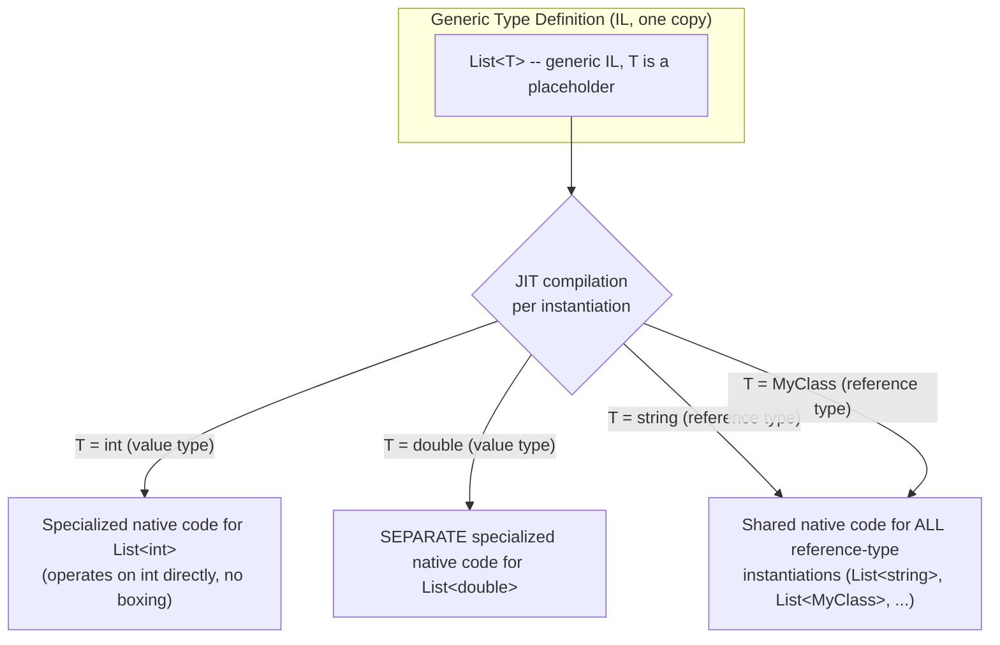
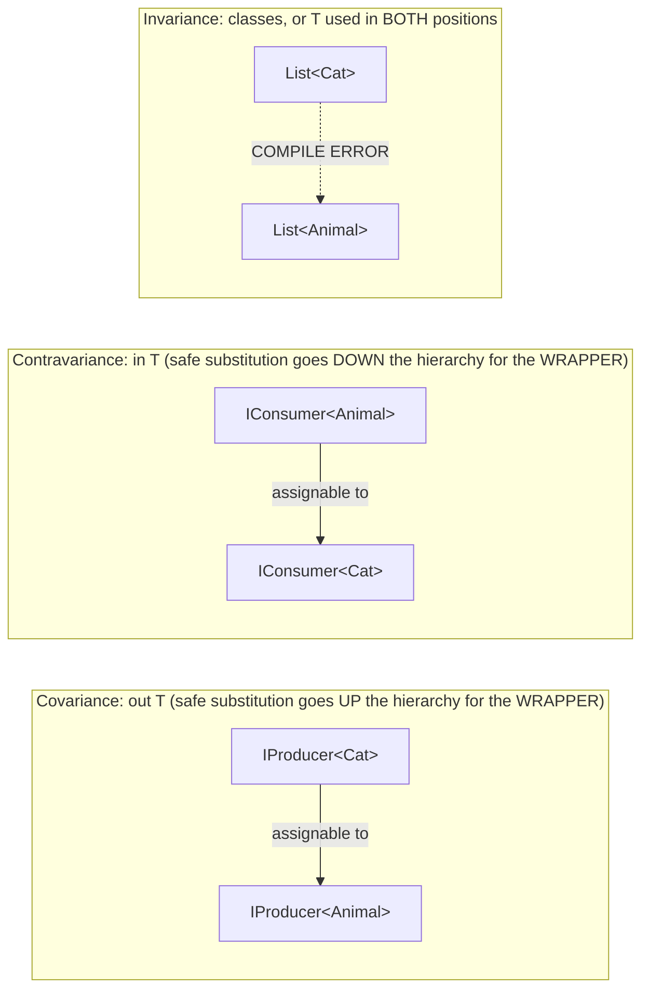
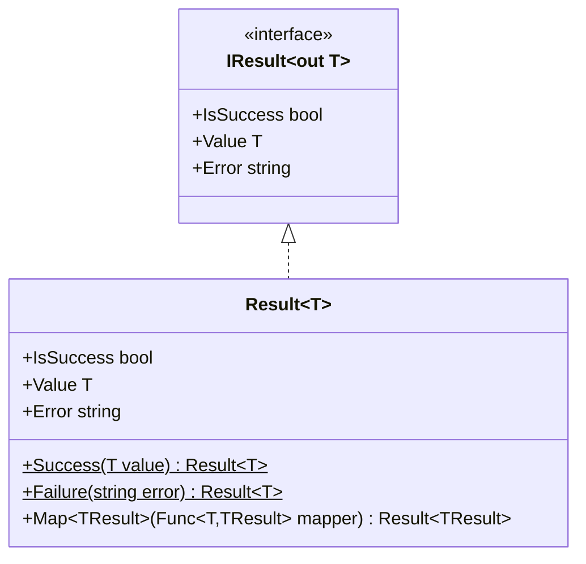
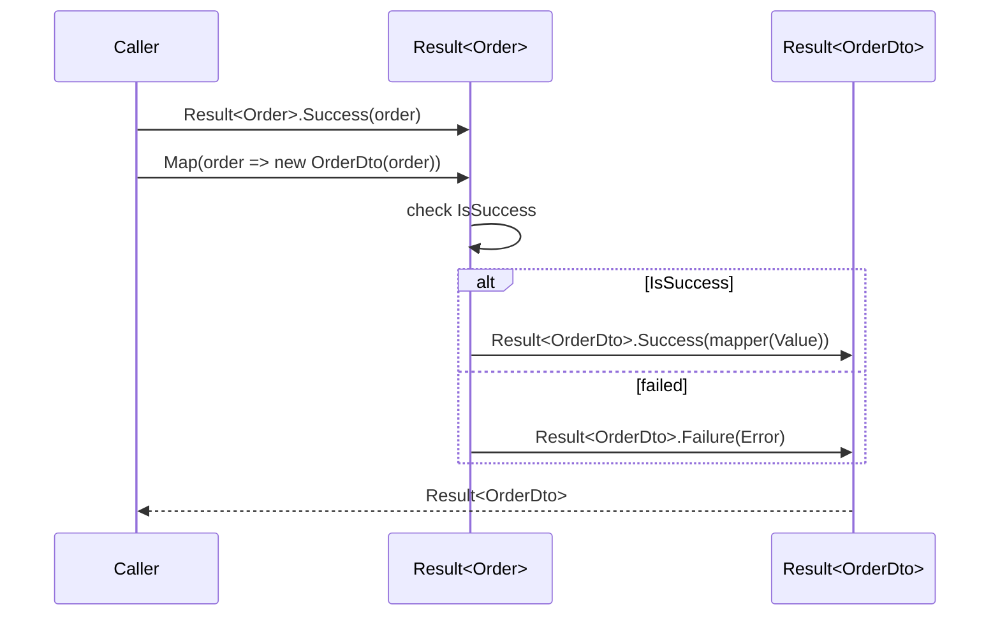

# Module 6 — C# Advanced: Generics, Variance & Generic Constraints

> Domain: C# | Level: Beginner → Expert | Prerequisite: [[01-CLR-JIT-GC-Memory-Management]] (boxing, JIT specialization referenced in §2.2/§10), [[03-Span-Memory-Low-Allocation]] (`ref struct` generic constraints, C# 13's `allows ref struct`)

---

## 1. Fundamentals

### What are generics?
Generics let you define a type or method with a **placeholder type parameter** (`T`), filled in with a concrete type at the point of use, giving you type safety and reuse without duplicating code per type and without the performance/safety cost of casting to/from `object`.

```csharp
public class Box<T>
{
    public T Value { get; set; }
}
var intBox = new Box<int> { Value = 5 };       // T = int
var stringBox = new Box<string> { Value = "x" }; // T = string
```

### What is variance?
**Variance** governs whether a generic type with a more specific type argument can be used where a generic type with a less specific (more general) type argument is expected — specifically for **interfaces and delegates** (never for classes/structs themselves in C#). **Covariance** (`out T`) allows a `IProducer<Derived>` to be used as an `IProducer<Base>`; **contravariance** (`in T`) allows a `IConsumer<Base>` to be used as an `IConsumer<Derived>`.

### Why do these exist?
- **Generics** solve the pre-.NET-2.0 problem of collections (`ArrayList`, `Hashtable`) that stored everything as `object`, requiring boxing for value types (Module 1 §2.6) and unsafe downcasts for reference types, with zero compile-time type checking (`ArrayList.Add("oops")` into what was "supposed to be" an `int` collection compiled fine, then threw at runtime).
- **Variance** solves a genuine, common frustration: without it, `IEnumerable<string>` couldn't be passed where `IEnumerable<object>` was expected, even though logically "a sequence of strings is safely usable wherever a sequence of objects is expected for read-only purposes" — variance lets the type system express exactly this safe subset of substitutability, while still preventing genuinely unsafe substitutions (see §2.3).

### When does this matter?
- **Always**, since virtually every modern C# collection, LINQ operator, and library API is generic.
- **Deeply**, for interview purposes, in three specific areas that separate senior from principal-level understanding: (1) **why generics don't cause boxing for value types** (reified generics vs. Java-style type erasure — a frequent, incorrect cross-language assumption), (2) **precisely why variance only applies to interfaces/delegates, only to reference-type-compatible positions, and only in specific directions**, and (3) **generic constraints as a design tool** for expressing compile-time-enforced contracts (`where T : IComparable<T>`, `where T : struct`, generic math's `where T : INumber<T>`).

### How does it work (30,000-ft view)?

```csharp
List<int> ints = new();        // JIT generates SPECIALIZED native code for List<int>, no boxing
List<string> strings = new();  // JIT generates SEPARATE specialized code for List<string> (or shares with other reference types -- see §2.2)

IEnumerable<string> strs = new List<string>();
IEnumerable<object> objs = strs; // legal! IEnumerable<T> is declared covariant (out T)
```

Mental model for interviews: **"C# generics are reified — the CLR actually knows and specializes on the concrete type at runtime, unlike Java's type erasure. Variance is a narrow, compiler-checked safety mechanism that only applies to interfaces/delegates, only when a type parameter is used exclusively in 'output' (covariant) or 'input' (contravariant) positions."**

---

## 2. Deep Dive

### 2.1 Reified Generics vs Type Erasure — the CLR-Level Mechanism

Unlike Java (which erases generic type parameters at compile time — `List<String>` and `List<Integer>` are literally the same bytecode-level class at runtime, `List`, with casts inserted by the compiler), the **CLR retains full generic type information at runtime**. This is implemented via:
- **Generic type definitions** (`List<T>`) are compiled to IL containing genuine placeholder type parameters, with full metadata.
- At JIT time, for each **distinct value-type instantiation** (`List<int>`, `List<double>`, `List<MyStruct>`), the JIT generates **completely separate, specialized native code** — because value types have different sizes/layouts, generic code operating on `T` needs different machine code per value type (e.g., `List<int>`'s internal array is a genuine `int[]`, stored inline with no boxing, and comparisons/copies use `int`-sized operations).
- For **reference-type instantiations** (`List<string>`, `List<MyClass>`, `List<AnyReferenceType>`), the JIT generates and **shares one specialized native code body** across all of them, since every reference type is the same size (a pointer) and behaves uniformly with respect to the generic code's operations — this sharing is a genuine, important CLR optimization (avoids generating N copies of `List<T>`'s code for N different reference types) but is invisible from a correctness standpoint (each instantiation still behaves as its own distinct type at the type-system level: `List<string>` and `List<object>` are different types, cannot be freely substituted for each other despite sharing native code).

**This is precisely why `List<int>` involves zero boxing**: the JIT-generated code for `List<int>` operates directly on `int` values inline, not on boxed `object` references — a direct continuation of Module 1 §2.6's boxing-avoidance discussion and Module 3 §Advanced Q3's constrained-generic-avoids-boxing point.



### 2.2 Generic Constraints — Precise Mechanics and Design Purpose

```csharp
public T Max<T>(T a, T b) where T : IComparable<T>
{
    return a.CompareTo(b) > 0 ? a : b;
}
```
- `where T : IComparable<T>` is a **compile-time-enforced contract**: only types implementing `IComparable<T>` can be substituted for `T`, and the compiler allows calling `.CompareTo(...)` on `T`-typed values inside the method body **without boxing and without a runtime interface-dispatch cast**, because the JIT specializes the method per concrete `T` (§2.1) — calling an interface member on a **constrained value-type `T`** invokes it directly on the unboxed value via a specialized code path (this is exactly Module 3 Advanced Q10's point, restated in its natural home).
- Common constraint kinds: `where T : struct` (value types only, excludes `Nullable<T>` itself but permits any struct), `where T : class` (reference types only), `where T : new()` (must have a public parameterless constructor — enables `new T()` inside the generic method), `where T : BaseClass`, `where T : IInterface`, `where T : U` (must be the same type as or derived from another type parameter `U`), `where T : notnull` (C# 8+, nullable-reference-types-aware constraint), and (C# 13+) `where T : allows ref struct` (permits `ref struct` types like `Span<T>` to be used as `T` — directly resolving Module 3's earlier-noted limitation).
- **Multiple constraints** combine with implicit AND semantics: `where T : class, IComparable<T>, new()` requires all three simultaneously.

### 2.3 Variance — the Precise Rules and Why They're Necessary

Variance (`in`/`out`) is declared **only on generic interface and delegate type parameters**, never on classes/structs, and only applies to type parameters used **exclusively** in one directional role throughout the entire interface definition:

```csharp
public interface IProducer<out T>  // covariant: T appears only in OUTPUT positions (return types)
{
    T Produce();
    // T Consume(T item); // COMPILE ERROR if attempted -- T can't appear as an input parameter in a covariant interface
}

public interface IConsumer<in T>   // contravariant: T appears only in INPUT positions (parameter types)
{
    void Consume(T item);
    // T Produce();       // COMPILE ERROR if attempted -- T can't appear as a return type in a contravariant interface
}
```

**Why covariance is safe** (`IProducer<Derived>` usable as `IProducer<Base>`): if you have an `IProducer<Cat>` and treat it as an `IProducer<Animal>`, calling `.Produce()` on it will genuinely return a `Cat` — which **is** an `Animal` — so treating the return value as `Animal` is always safe. The compiler enforces this by forbidding `T` from ever appearing in an *input* position, where the reverse substitution would be unsafe.

**Why contravariance is safe** (`IConsumer<Base>` usable as `IConsumer<Derived>`): if you have an `IConsumer<Animal>` (something that knows how to consume **any** `Animal`) and treat it as an `IConsumer<Cat>`, calling `.Consume(someCat)` on it is safe — a `Cat` **is** an `Animal`, so something that can consume any `Animal` can certainly consume this specific `Cat`. The compiler forbids `T` from appearing in an *output* position, where returning a general `Animal` when a specific `Cat` was expected would be unsafe.

**Why classes/structs cannot be variant**: a class like `List<T>` exposes `T` in **both** input positions (`Add(T item)`) and output positions (`this[int index]` getter, enumeration) — genuinely mixing roles, so neither covariance nor contravariance could be soundly applied; this is exactly why `List<Cat>` **cannot** be assigned to a `List<Animal>`-typed variable (a classic interview trap — `IEnumerable<Cat>` can, `List<Cat>` cannot), and why `List<T>.Add` existing at all is precisely the mechanism that would make such an assignment unsound if it were permitted (you could then `animalList.Add(new Dog())` into what's actually backed by a `List<Cat>`).

**Real BCL examples**: `IEnumerable<out T>` (covariant — you can only "get" items out), `IEnumerator<out T>`, `Func<out TResult>` (covariant in its return type), `Action<in T>` (contravariant in its parameter), `IComparer<in T>` (contravariant — "something that can compare any two `Animal`s can compare two `Cat`s"), `Func<in T, out TResult>` (contravariant parameter, covariant return — the most commonly cited example of both variance kinds coexisting in one generic delegate).

### 2.4 Generic Methods vs Generic Types — Type Inference Mechanics

```csharp
public static T Max<T>(T a, T b) where T : IComparable<T> { ... }
var result = Max(3, 7); // T inferred as int -- no need to write Max<int>(3, 7) explicitly
```
The compiler performs **type inference** for generic method calls by examining the argument types at the call site — this is a compile-time-only process (no runtime cost), distinct from generic type instantiation (`List<int>`) itself, which does have the JIT-specialization behavior from §2.1. A generic method can also have constraints referencing multiple type parameters against each other (`where T : IComparable<TOther>`), enabling expressive, statically-checked relationships between otherwise-independent generic parameters.

### 2.5 Generic Math (C# 11+, .NET 7+) — Static Abstract Interface Members

Before C# 11, you could not write a generic method constrained to "any numeric type" and use operators (`+`, `-`, `<`) on it, because operators are **static** members, and prior to C# 11, interfaces could not declare static abstract members (a fundamental limitation — interface constraints only let you call *instance* members). C# 11 introduced **static abstract interface members**, enabling the `System.Numerics` **generic math** interfaces (`INumber<TSelf>`, `IAdditionOperators<TSelf,TOther,TResult>`, etc.):

```csharp
public static T Sum<T>(IEnumerable<T> values) where T : INumber<T>
{
    T total = T.Zero; // T.Zero is a STATIC ABSTRACT member -- resolved per-instantiation, not via instance dispatch
    foreach (var v in values) total += v; // uses T's static + operator
    return total;
}
// Works identically for Sum<int>, Sum<double>, Sum<MyCustomNumericType> (if it implements INumber<T>)
```
This directly closes a decades-old C# generics gap (no generic numeric algorithms without either code duplication per numeric type or a runtime-dispatch-based workaround) and is implemented, like all constrained generic value-type code, via per-instantiation JIT specialization (§2.1) — `Sum<int>` and `Sum<double>` each get their own specialized native code calling the JIT-resolved concrete `+`/`Zero` for that specific type, with no virtual dispatch or boxing involved.

### 2.6 The `List<Cat>`-Cannot-Assign-to-`List<Animal>` Trap, Fully Explained

```csharp
List<Cat> cats = new() { new Cat() };
List<Animal> animals = cats;      // COMPILE ERROR -- List<T> is NOT variant
IEnumerable<Animal> animalsEnum = cats; // OK -- IEnumerable<T> IS covariant
```
This is one of the single most commonly mis-explained topics in C# interviews. The precise reason: `List<T>` is a **class**, and classes can never be declared variant in C# regardless of how their members happen to use `T` — the language simply doesn't permit `out`/`in` variance annotations on classes at all (only on interface/delegate type parameters). Even if `List<T>` *conceptually* had all the same variance-safety concerns as `IEnumerable<T>` for its read-only members, the language draws the line at the interface/delegate boundary as a deliberate simplification (largely because classes commonly mix input and output usage of `T`, as `List<T>` itself does via `Add`, making blanket variance unsound for the general case, and the language doesn't offer a narrower "partially variant class" mechanism).

---

## 3. Visual Architecture

### Variance Direction Diagram



### Generic Instantiation & JIT Specialization (ASCII)

```
                    List<T> (IL, one generic definition)
                              │
        ┌─────────────────────┼─────────────────────┐
        ▼                     ▼                     ▼
   List<int>              List<double>        List<string> / List<MyClass> / ...
   (own native code,      (own native code,    (ONE SHARED native code body --
    inline int[] storage,  inline double[]      all reference types are pointer-
    zero boxing)           storage, zero        sized and behave uniformly)
                            boxing)
```

---

## 4. Production Example

### Scenario: A generic repository abstraction causing a subtle covariance-related production bug

**Problem**: A shared internal library exposed a generic caching abstraction:
```csharp
public interface ICacheReader<out T>
{
    T? Get(string key);
}
public interface ICache<T> : ICacheReader<T>
{
    void Set(string key, T value);
}
```
A team building a notification service had a method accepting `ICacheReader<Notification>` for read-only access, and a caller passed a `ICache<EmailNotification>` (where `EmailNotification : Notification`) directly as an `ICacheReader<Notification>` — relying on `ICacheReader<out T>`'s covariance, which worked correctly and was the intended design. The bug arose in a **different, related** spot: a second developer, generalizing a helper method, changed a parameter type from `ICacheReader<Notification>` to the full `ICache<Notification>` (not realizing `ICache<T>` is **invariant**, since `T` appears in `Set`'s input position) — this silently broke every call site that had been passing a covariance-reliant `ICache<EmailNotification>` where an `ICache<Notification>` was now required, since `ICache<T>` cannot support that substitution at all. All such call sites failed to compile, were "fixed" under time pressure by the second developer via unsafe casts (`(ICache<Notification>)(object)theEmailCache`), and one of those casts was later invoked in a code path that called `.Set("key", someOtherNotificationSubtype)` — successfully compiling and running (since the cast bypassed the compiler's variance safety net entirely) but **corrupting the underlying `ICache<EmailNotification>`'s type invariant at runtime**, causing an `InvalidCastException` deep inside the cache's own internal storage logic when a later `.Get()` call tried to hand back what it assumed was always an `EmailNotification`.

**Investigation**:
- The runtime `InvalidCastException` stack trace pointed into the cache implementation's internals, far from the actual root cause (the unsafe cast introduced during the earlier "fix").
- Git blame + code review traced the cast back to the parameter-type generalization change, and to the original developer's lack of understanding of *why* `ICacheReader<T>` was deliberately split out as a separate, narrower, covariant interface from the invariant `ICache<T>`.

**Architecture fix**:
- Reverted the helper method to accept `ICacheReader<Notification>` (the narrowest interface actually needed — the helper only ever read from the cache, never wrote), removing the need for any cast at all, restoring full compile-time safety.
- Added an explicit code comment on `ICacheReader<T>`'s declaration explaining *why* it exists as a separate, deliberately narrower, covariant interface (documenting the design intent that had been lost/misunderstood), directly addressing the root cause rather than just the symptom.
- Banned unsafe `(object)`-mediated generic casts via a Roslyn analyzer rule in the shared library's codebase specifically, given the severity of what bypassing them enabled here.

**Trade-offs**: Maintaining two interfaces (`ICacheReader<T>` and `ICache<T>`) instead of one is genuinely more API surface to design and document — justified specifically because it enables real covariance for read-only consumers, a design pattern worth the extra interface only when read/write separation is a genuine, recurring need (directly an instance of the **Interface Segregation Principle** applied specifically to unlock variance).

**Lessons learned**:
1. Splitting a read/write interface into a narrower covariant "reader" interface plus an invariant "read-write" interface is a deliberate, valuable design pattern precisely *because* it unlocks safe substitutability that the combined interface can never support — this should be a documented, intentional decision, not something a later refactor casually undoes.
2. An unsafe cast used to "fix" a variance-related compile error is a major red flag in code review — it's almost never actually safe, and its entire purpose is bypassing the exact safety check that just caught a real design mismatch.
3. `(object)`-mediated casts between generic interface instantiations should be treated with the same suspicion as raw pointer casts in `unsafe` code (Module 3 §8) — they defeat a compiler-enforced safety guarantee, not just a style preference.

---

## 5. Best Practices

- **Prefer generic constraints (`where T : IComparable<T>`) over runtime type checks/casts inside generic methods.** Why: constraints are compile-time-enforced and enable JIT specialization without boxing/casting (§2.1, §2.2) — a runtime `is`/`as` check inside a generic method is both slower and less safe (caught at runtime, not compile time).
- **Split a combined read-write generic interface into a narrower covariant "reader" interface when read-only consumers genuinely exist**, exactly as in §4's fix — a deliberate application of Interface Segregation specifically to unlock variance, not a default habit for every interface.
- **Never bypass a variance-related compile error with an unsafe `(object)` cast.** Why: the compiler error is correctly identifying that the substitution isn't type-safe — bypassing it reintroduces exactly the class of runtime type-corruption bug illustrated in §4.
- **Use generic math interfaces (`INumber<T>`, etc.) for numeric algorithms that should work across `int`/`double`/`decimal`/custom numeric types**, instead of either duplicating the algorithm per type or falling back to a slower `dynamic`/reflection-based generic implementation.
- **Understand and explicitly state the reason `List<T>` isn't covariant while `IEnumerable<T>` is** when reviewing any API design choice between them — if a method only needs to *read* a sequence, prefer accepting `IEnumerable<T>` (or `IReadOnlyList<T>`/`IReadOnlyCollection<T>`, themselves covariant) over `List<T>`, both for variance flexibility and for the general "accept the narrowest interface you actually need" principle.
- **Use `where T : allows ref struct` (C# 13+)** when writing generic utility code that should also work with `Span<T>`/other `ref struct` types, rather than maintaining a separate non-generic overload — but recognize this is a narrow, specialized feature (relevant mainly to low-level/performance-library code, directly connecting back to Module 3) rather than an everyday constraint.

---

## 6. Anti-patterns

- **Bypassing a variance compile error via an unsafe cast** (§4's root cause). Fix: reconsider whether the interface design should be split (reader/writer) or whether the invariant interface is genuinely, correctly required — never cast around the compiler's correct rejection.
- **Using `object`/non-generic collections (`ArrayList`, `Hashtable`) in new code.** Why it fails: reintroduces boxing (Module 1 §2.6) and eliminates compile-time type safety entirely — there is essentially never a legitimate reason to reach for these in modern C#. Fix: always use the generic collection equivalents.
- **Assuming `List<Derived>` can be passed where `List<Base>` is expected** (the classic trap, §2.6). Fix: know the precise rule — use `IEnumerable<T>`/other covariant interfaces if only reading is needed; if mutation is genuinely required through the substituted reference, the design requirement itself is unsound and needs rethinking (there is no safe way to make `List<T>` itself variant).
- **Over-constraining generic methods "just in case"** (e.g., adding `where T : class, new(), IComparable<T>, IDisposable` when the method body only ever calls `.CompareTo()`). Why it fails: unnecessarily restricts which types can call the method, and signals a contract broader than what's actually used — a Liskov/Interface-Segregation-style violation applied to generic constraints. Fix: constrain to exactly what the method body requires, no more.
- **Writing a generic method with a constraint that could instead be expressed as a simple overload or non-generic method**, adding unnecessary complexity/compile-time cost for no real reuse benefit (e.g., a "generic" method that's only ever called with one concrete type across the entire codebase). Fix: don't generalize speculatively — introduce genericity when actual reuse across multiple concrete types materializes, consistent with this course's recurring "don't design for hypothetical future requirements" principle.
- **Ignoring the reference-type-code-sharing behavior (§2.1) when reasoning about per-type static state.** A `static` field inside a generic class (`class Cache<T> { static Dictionary<string,T> _store; }`) gets a **separate** static field instance **per distinct closed generic type** (`Cache<int>`, `Cache<string>`, `Cache<MyClass>` each have their own independent `_store`) — a common, subtle bug source when a developer assumes (incorrectly) that reference-type code-sharing (§2.1) also means shared static state across reference-type instantiations; it does not — static field instances are always per-closed-type, regardless of native-code sharing.

---

---

---

---

## 10. Interview Questions

### Basic (10)

1. **Q: What is a generic type parameter?**
   **A:** A placeholder type (`T`) in a class/method/interface definition, filled in with a concrete type at the point of use, enabling type-safe reuse across different types without duplicating code.

2. **Q: What problem do generics solve that existed before them (pre-.NET 2.0)?**
   **A:** Non-generic collections (`ArrayList`) stored everything as `object`, requiring boxing for value types and unsafe runtime casts for reference types, with no compile-time type checking.

3. **Q: What is covariance, in one sentence?**
   **A:** Allows a generic interface/delegate with a more derived type argument to be used where one with a less derived (base) type argument is expected — declared with `out T`.

4. **Q: What is contravariance, in one sentence?**
   **A:** Allows a generic interface/delegate with a less derived (base) type argument to be used where one with a more derived type argument is expected — declared with `in T`.

5. **Q: Can `List<Cat>` be assigned to a variable of type `List<Animal>`?**
   **A:** No — `List<T>` is a class, and classes cannot be declared variant in C#; only interfaces and delegates can be.

6. **Q: Can `IEnumerable<Cat>` be assigned to a variable of type `IEnumerable<Animal>`?**
   **A:** Yes — `IEnumerable<out T>` is declared covariant.

7. **Q: What does `where T : struct` mean?**
   **A:** Restricts `T` to value types only (excluding `Nullable<T>` itself, though any other struct is permitted).

8. **Q: What does `where T : new()` allow you to do inside the generic method/class?**
   **A:** Call `new T()` to construct an instance, since the constraint guarantees `T` has an accessible public parameterless constructor.

9. **Q: Does using generics with a value type (e.g., `List<int>`) cause boxing?**
   **A:** No — the CLR generates specialized native code per value-type instantiation that operates on the value directly, with no boxing involved.

10. **Q: What is the difference between a generic class and a generic method?**
    **A:** A generic class (`Box<T>`) fixes its type parameter for the lifetime of an instance; a generic method (`Max<T>(T a, T b)`) can infer/specify a different type parameter on each individual call, independent of any containing type.

### Intermediate (10)

1. **Q: Explain precisely why C# generics don't suffer from Java-style type erasure.**
   **A:** The CLR retains full generic type metadata at runtime and the JIT compiles genuinely specialized native code per distinct value-type instantiation (and shares one code body across reference-type instantiations) — unlike Java, where generic type information is erased at compile time and a single, unspecialized bytecode class serves all instantiations via inserted casts.

2. **Q: Why can a covariant interface (`out T`) never have `T` appear as a method parameter type?**
   **A:** Allowing `T` in an input position would break the substitutability guarantee — e.g., if `IProducer<Animal>` (from an actual `IProducer<Cat>`) allowed a method taking a `T` parameter, calling it with an arbitrary `Animal` (like a `Dog`) would attempt to pass a `Dog` into something that's actually backed by `Cat`-specific logic, which is unsafe; the compiler forbids this by requiring `T` to appear only in output positions for a covariant interface.

3. **Q: What's the difference between `where T : class` and `where T : notnull`?**
   **A:** `where T : class` restricts `T` to reference types only; `where T : notnull` (C# 8+) is broader — it permits both non-nullable reference types and any value type (including nullable value types are excluded specifically as `T?`, but plain value types are fine), primarily used to interact correctly with nullable reference type annotations rather than to restrict to reference vs. value types.

4. **Q: Why does a `static` field inside a generic class get a separate instance per closed generic type, even though reference-type instantiations share JIT-compiled code?**
   **A:** Native code sharing (§2.1) is purely a code-generation optimization for reference types with identical size/behavior; static field storage is a distinct, per-closed-type concern entirely — the CLR allocates independent static storage for `Cache<int>`, `Cache<string>`, `Cache<MyClass>`, etc., regardless of whether their instance methods happen to share compiled native code.

5. **Q: What are static abstract interface members, and what problem did they solve when introduced in C# 11?**
   **A:** They let an interface declare a `static abstract` member (including operators) that implementing types must provide a concrete static implementation of — this closed the long-standing gap where generic code couldn't use operators (`+`, `<`) on a type-parameter-constrained-to-an-interface, since operators are static and interfaces previously could only constrain instance members; this enabled the generic math (`INumber<T>`) interfaces.

6. **Q: Why would you split a single `ICache<T>` interface into a covariant `ICacheReader<out T>` plus the original `ICache<T>` (extending it)?**
   **A:** To let read-only consumers benefit from covariance (accepting `ICacheReader<Derived>` where `ICacheReader<Base>` is expected) — something the combined read-write interface can never support, since `T` also appears in an input position (`Set(T value)`), making the combined interface necessarily invariant.

7. **Q: Give an example of a single BCL generic delegate type that uses both covariance and contravariance simultaneously, and explain why each direction is safe there.**
   **A:** `Func<in T, out TResult>` — contravariant in its parameter `T` (something that can accept any `Base` can safely be given a more specific `Derived`) and covariant in its return type `TResult` (something that returns a specific `Derived` can safely be treated as returning the more general `Base`).

8. **Q: What happens, precisely, if you try to declare a mutable field of type `T` as `public` inside a class where `T` is meant to support covariance-like usage?**
   **A:** Variance annotations (`in`/`out`) are only permitted on interface/delegate type parameters in the first place — a class cannot declare `out T`/`in T` at all, so the question of "a public mutable field breaking covariance" doesn't arise for classes; for an interface, a settable property of type `T` would itself be a compile error under an `out T` declaration, since a property setter is an input position.

9. **Q: Why is `IComparer<in T>` contravariant, conceptually?**
   **A:** An `IComparer<Animal>` (something that knows how to compare any two `Animal`s) can safely be used wherever an `IComparer<Cat>` is needed (comparing two `Cat`s is a special case of comparing two `Animal`s) — the general-purpose comparer being usable for a more specific type is the contravariant substitution direction.

10. **Q: What's the performance difference between calling `.CompareTo()` on a `T` constrained to `IComparable<T>` versus calling it on a `T` with no constraint (via a cast to `IComparable`)?**
    **A:** The constrained version gets JIT-specialized, direct (non-boxing, non-virtually-dispatched-through-a-boxed-copy) native code per concrete value type; casting an unconstrained `T` to `IComparable` first requires boxing the value type (to obtain an interface reference) and then a genuine virtual interface dispatch on the boxed copy — a real, measurable allocation and indirection cost difference.

### Advanced (10)

1. **Q: Explain exactly why the CLR shares JIT-compiled native code across reference-type generic instantiations but not across value-type ones, in terms of what the generated code actually needs to know about `T`.**
   **A:** For any reference type, `T` is always represented as a single machine-word-sized pointer, and every operation the generic code performs on a `T` value (storing it, comparing references, calling virtual members through it) is uniform across all reference types at the machine-code level — so one code body, parameterized at runtime by a `MethodTable`/type-handle pointer passed alongside (for the rare operations that need to know the exact runtime type, like `typeof(T)` or boxing-related operations), suffices for all reference-type instantiations. For value types, `T`'s size, memory layout, and required operations (e.g., an `int` comparison vs. a `struct` field-by-field comparison) are fundamentally different per concrete value type — no single code body could correctly manipulate both an `int` and a large custom `struct` inline, so the JIT must generate genuinely distinct native code per distinct value-type instantiation.

2. **Q: A candidate claims "generics are always faster than using `object`/casting." Provide the precise, complete correction.**
   **A:** Generics constrained appropriately (enabling direct, non-boxing operations on value types, or simply avoiding runtime casts for reference types) are indeed typically faster and safer than the `object`-based equivalent — but an *unconstrained* generic method that only ever calls `object`-level members (`.ToString()`, `.GetHashCode()`) gains no boxing-avoidance benefit for value-type instantiations beyond what any correctly-cast `object`-based code would also get from the JIT's boxing-caching for small values, and the *real* performance-determining factor is specifically whether the generic code's constraints let the JIT emit direct, unboxed, non-virtually-dispatched operations — not genericity in the abstract. The precise claim: "generics enable, but do not automatically guarantee, allocation/dispatch savings — the constraint and usage pattern determine whether that potential is actually realized."

3. **Q: Walk through why `Func<in T, out TResult>`'s contravariant `T` parameter allows a lambda expecting a more general parameter type to satisfy a delegate variable typed for a more specific one, with a concrete example.**
   **A:** Given `Func<Animal, string> generalHandler = (Animal a) => a.ToString();`, this can be assigned to a variable of type `Func<Cat, string>` because `Func<in T, out TResult>`'s contravariance in `T` permits it: a `Func<Cat,string>`-typed variable just needs "something callable with a `Cat` argument that returns a `string`" — and `generalHandler`, which can accept *any* `Animal` including a `Cat`, certainly satisfies that requirement. This is the same underlying safety argument as `IConsumer<in T>` in §2.3, just instantiated concretely with a real BCL delegate type and a specific example, which is exactly the level of concreteness an Advanced-tier interview answer should reach for beyond the abstract rule.

4. **Q: Describe a realistic scenario where a team needed a covariant custom interface but ran into the "T cannot appear in an input position" restriction, and how they worked around it while preserving safety.**
   **A:** A team wanted `IEventPublisher<out TEvent>` (to allow publishing infrastructure to accept a more specific event-publisher type where a more general one was expected) but also wanted a `Publish(TEvent evt)` method on the same interface — directly disallowed, since `Publish` puts `T` in an input position, conflicting with `out T`. The safe resolution: split into `IEventPublisher<out TEvent> { IObservable<TEvent> Events { get; } }` (purely output-shaped, genuinely covariant) and a separate, necessarily-invariant `IEventSink<TEvent> { void Publish(TEvent evt); }` — mirroring exactly the reader/writer-interface-splitting pattern from §4/§5, here applied to a publish/subscribe scenario instead of a cache, demonstrating that this is a **general, recurring design pattern** for unlocking variance, not a one-off cache-specific trick.

5. **Q: Explain how generic constraints interact with method overload resolution when multiple overloads differ only in their constraints, and why this can be surprising.**
   **A:** C# does **not** support overloading purely on generic constraints — two methods with the identical name, type parameter list, and parameter types but *different* `where` clauses are not distinct overloads and will not compile as such (a genuine, sometimes-surprising language limitation); constraints narrow *which types can be substituted* for an already-fixed method signature, they do not participate in selecting *which of several methods* gets called the way parameter types do in ordinary overload resolution. This surprises engineers coming from languages/mental models where "more specific generic constraint = more specific overload" is assumed to work like ordinary method overloading — it does not, in C#.

6. **Q: How does variance interact with generic interfaces that have multiple type parameters, some covariant and some contravariant (like `Func<in T, out TResult>` generalized to more parameters)?**
   **A:** Each type parameter's variance is declared and checked **independently** — `Func<in T1, in T2, out TResult>` (the real 2-parameter `Func` shape) requires `T1` and `T2` to each appear only in input positions and `TResult` to appear only in output positions, exactly as if each were the sole type parameter of its own single-parameter interface; the compiler's variance-safety checking doesn't get more complex or interact across parameters — each parameter's directional constraint is verified against every member of the interface independently, and the overall interface is covariant/contravariant "per parameter," not as a single combined property of the whole type.

7. **Q: Explain a subtle bug that can arise from over-relying on `where T : new()` in a generic factory method, and how to avoid it.**
   **A:** `where T : new()` only guarantees a **public parameterless** constructor exists — it says nothing about what that constructor actually *does* (whether it fully initializes the object into a valid state, whether it has side effects, whether it's appropriate to call in the specific context the generic factory method uses it in). A generic factory method like `T CreateDefault<T>() where T : new() => new T();` used against a type whose parameterless constructor leaves required fields in an invalid/uninitialized state (common for types primarily designed to be constructed via a different, parameterized constructor, with the parameterless one only present to satisfy an ORM/serializer requirement) can silently produce objects that violate the type's actual invariants — the constraint guarantees compilability, not correctness/safety of the resulting object, echoing the constraint-vs-behavioral-guarantee distinction from §8's security discussion.

8. **Q: How would you design a generic repository interface that supports both a covariant read-only view and mutation, without falling into the invariant-`List<T>`-style trap, generalizing the §4 production fix into a reusable pattern?**
   **A:** Define `IReadOnlyRepository<out T> { T? GetById(string id); IEnumerable<T> GetAll(); }` (purely output-shaped, safely covariant) and a separate `IRepository<T> : IReadOnlyRepository<T> { void Add(T item); void Update(T item); }` (necessarily invariant, since `Add`/`Update` require `T` as input) — any consumer that only needs to read can be given the narrower, covariant `IReadOnlyRepository<Derived>` even when the underlying concrete repository is typed for a derived entity type, while consumers needing mutation must work with the specific, invariant `IRepository<TExact>` type they actually need. This is the exact general shape of the reader/writer interface-splitting pattern, now stated as a reusable repository-design template rather than tied to one specific cache incident.

9. **Q: Explain how `where T : allows ref struct` (C# 13+) changes what's possible in generic code, and why this required a dedicated new constraint rather than simply lifting the old restriction unconditionally.**
   **A:** Before this constraint existed, `ref struct` types (like `Span<T>`) could never be used as a generic type argument at all, because ordinary generic code might box `T`, store it in a field, or otherwise treat it in ways fundamentally incompatible with `ref struct`'s stack-only guarantees (Module 3 §2.1) — allowing `Span<T>` as a type argument unconditionally would have silently broken that safety guarantee for any existing generic code not written with `ref struct` semantics in mind. `allows ref struct` is an explicit, opt-in constraint: it tells the compiler "this specific generic method/type has been written to respect `ref struct` restrictions throughout its body" (no boxing, no storing `T` in a heap-allocated field, no crossing `await`, etc.), and only methods/types explicitly declaring this constraint can accept `ref struct` type arguments — preserving full backward safety for the vast majority of existing generic code that was never audited for `ref struct` compatibility, while opening the door for new, deliberately-`ref-struct`-aware generic utility code (directly relevant to Module 3's low-allocation library-design guidance).

10. **Q: As a Principal Engineer, how would you explain to a team why an unsafe cast used to work around a variance compile error (as in §4's incident) is categorically different from, and more dangerous than, an ordinary unsafe cast between unrelated reference types (e.g., `(SomeType)(object)someOtherObject`)?**
    **A:** Both are dangerous, but the variance-specific case has a distinguishing trap: the cast **appears to be between related, seemingly-compatible generic instantiations of the same interface** (`ICache<EmailNotification>` to `ICache<Notification>` — genuinely related types, just not variance-compatible for the reasons in §2.3), which makes it *look* far more plausible and "probably fine" to a reviewer than an obviously-unrelated cast would — the danger is precisely that it doesn't trigger the same instinctive scrutiny a completely-unrelated-type cast would. The correct framing for the team: "the compiler didn't reject this cast out of excessive caution — it rejected it because the two types genuinely have different, incompatible capability contracts (one can safely have items added of a subtype, the other can't), and the cast doesn't change that underlying incompatibility, it just hides it from the compiler until it manifests as a runtime failure, likely far from the actual cast site" — reframing "the compiler is being annoying" into "the compiler caught a real design conflict" is the actual persuasion needed, not just a rule to follow.

---

## 11. Coding Exercises

### Easy — Fix a variance compile error by choosing the right interface
**Problem**: This code fails to compile.
```csharp
public void PrintAll(List<Animal> animals) { foreach (var a in animals) Console.WriteLine(a); }

List<Cat> cats = new() { new Cat(), new Cat() };
PrintAll(cats); // COMPILE ERROR: cannot convert List<Cat> to List<Animal>
```
**Solution**:
```csharp
public void PrintAll(IEnumerable<Animal> animals) { foreach (var a in animals) Console.WriteLine(a); }

List<Cat> cats = new() { new Cat(), new Cat() };
PrintAll(cats); // OK -- IEnumerable<out T> is covariant, and PrintAll only ever reads, never mutates
```
**Discussion**: The fix is a design fix, not a cast — `PrintAll` never needed list-mutation capability, only read access, so narrowing the parameter type to the covariant `IEnumerable<T>` is strictly more correct (accept the narrowest interface actually needed) in addition to resolving the compile error, directly applying §5's guidance.

### Medium — Implement a generic, constrained `Max` that avoids boxing
**Problem**: Implement a generic `Max<T>` usable for both value types and reference types implementing `IComparable<T>`, verifying no boxing occurs for value-type calls.
```csharp
public static T Max<T>(T a, T b) where T : IComparable<T>
{
    return a.CompareTo(b) >= 0 ? a : b;
}

// Usage:
int maxInt = Max(3, 7);                 // T = int, JIT-specialized, zero boxing
string maxStr = Max("apple", "banana"); // T = string, shares reference-type code path
```
**Discussion**: Verify via BenchmarkDotNet `[MemoryDiagnoser]` that `Max(3, 7)` allocates 0 bytes — confirming the constraint enables the JIT to call `CompareTo` directly on the unboxed `int` value, exactly per §2.2's mechanism. Contrast with an unconstrained `object`-based version (`static object Max(object a, object b)`) that would box both `int` arguments on every call — a direct, hands-on demonstration of Module 1 §2.6's boxing-cost claim, now fully explained mechanically.

### Hard — Design and implement the covariant reader / invariant read-write split (from §4/§5/Advanced Q8)
**Problem**: Given the production bug in §4, implement the corrected repository interface split, plus a concrete implementation, demonstrating the fix compiles and behaves safely where the original design didn't.
```csharp
public interface IReadOnlyRepository<out T>
{
    T? GetById(string id);
    IEnumerable<T> GetAll();
}

public interface IRepository<T> : IReadOnlyRepository<T>
{
    void Add(string id, T item);
}

public sealed class InMemoryRepository<T> : IRepository<T>
{
    private readonly Dictionary<string, T> _store = new();

    public T? GetById(string id) => _store.TryGetValue(id, out var value) ? value : default;
    public IEnumerable<T> GetAll() => _store.Values;
    public void Add(string id, T item) => _store[id] = item;
}

public abstract class Notification { }
public sealed class EmailNotification : Notification { }

// Usage demonstrating the fix:
IRepository<EmailNotification> emailRepo = new InMemoryRepository<EmailNotification>();
emailRepo.Add("1", new EmailNotification());

IReadOnlyRepository<Notification> readOnlyView = emailRepo; // OK! Covariant, read-only, SAFE.
foreach (var n in readOnlyView.GetAll()) { /* read-only access to Notification-typed view */ }

// The following correctly FAILS TO COMPILE -- and this is exactly the desired outcome,
// not a limitation to work around with a cast:
// IRepository<Notification> writableView = emailRepo; // COMPILE ERROR: IRepository<T> is invariant (by design)
```
**Discussion**: This directly demonstrates why the *compile error* on the last line is the **correct, desired behavior**, not a problem to solve — allowing `emailRepo` (an `EmailRepository`) to be treated as a full `IRepository<Notification>` would let calling code `.Add("x", new SomeOtherNotificationSubtype())` into what's actually backed by an `EmailNotification`-only store, corrupting its type invariant exactly as happened in the original production incident. The fix isn't "make this compile" — it's "recognize that read-only, covariant access is all the calling code in question ever legitimately needed," which is precisely the design correction §4 made.

### Expert — Implement a generic, allocation-free numeric aggregation pipeline using generic math (C# 11+)
**Problem**: Implement a reusable statistics helper (`Sum`, `Average`, `Min`, `Max`) generic over any type implementing `INumber<T>`, demonstrating zero-boxing generic math and its interaction with `Span<T>` from Module 3.
```csharp
using System.Numerics;

public static class Statistics
{
    public static T Sum<T>(ReadOnlySpan<T> values) where T : INumber<T>
    {
        T total = T.Zero;
        foreach (var v in values) total += v; // static abstract '+' operator, resolved per-instantiation
        return total;
    }

    public static T Average<T>(ReadOnlySpan<T> values) where T : INumber<T>
    {
        if (values.IsEmpty) throw new ArgumentException("Cannot average an empty span.");
        T total = Sum(values);
        T count = T.CreateChecked(values.Length); // generic math: convert an int count into T's own numeric type
        return total / count;
    }

    public static T Max<T>(ReadOnlySpan<T> values) where T : INumber<T>, IMinMaxValue<T>
    {
        T max = T.MinValue; // static abstract member from IMinMaxValue<T>
        foreach (var v in values) if (v > max) max = v;
        return max;
    }
}

// Usage -- works identically, with zero boxing, for int, double, decimal, or any custom INumber<T>:
ReadOnlySpan<int> ints = stackalloc int[] { 3, 7, 2, 9, 4 };
int sum = Statistics.Sum(ints);         // T = int, fully specialized, zero heap allocation
double avg = Statistics.Average(ints.ToArray().Select(i => (double)i).ToArray()); // T = double, separately specialized
```
**Time complexity**: O(n) for `Sum`/`Average`/`Max`, single pass. **Space**: O(1) beyond the input span — no boxing (§2.1/§2.2), no intermediate allocations at all; `ReadOnlySpan<T>` (Module 3) as the parameter type additionally avoids any array-copy/allocation for the input itself when called against a `stackalloc` buffer or an existing array slice.
**Discussion points**: `T.CreateChecked(values.Length)` demonstrates generic math's cross-type conversion mechanism (`INumberBase<T>.CreateChecked<TOther>`) — converting a plain `int` count into whatever numeric type `T` actually is, in a fully generic, checked (throws on overflow/invalid conversion, e.g., converting a huge `int` into a `byte`-based custom numeric type) manner, without the caller needing type-specific conversion logic. This exercise directly ties together Module 3's `Span<T>` (zero-copy input), this module's generic constraints and static abstract members (zero-boxing numeric operations), and Module 1's boxing-cost motivation — a genuinely synthesized, multi-module demonstration appropriate for an Expert-tier take-home or live-coding exercise.

---

## 12. System Design

*(Narrow application — full System Design has its own module.)*

**Scenario**: Design a shared internal **generic, strongly-typed message-bus client library** used across dozens of microservices (each with its own message DTOs), balancing genericity/reuse against the variance/invariance pitfalls covered in this module.

- **Functional**: A single library must let any service publish/subscribe to strongly-typed messages (`OrderCreated`, `PaymentProcessed`, etc.) without each service reimplementing serialization/transport plumbing.
- **Non-functional**: Must be impossible (by the type system, not just convention) for a service to accidentally publish a message of the wrong subtype into a topic typed for a base message class; must allow read-only "message inspection" tooling (an internal message-browsing dashboard) to work generically across all message types without needing write access.
- **Architecture**: `IMessagePublisher<in TMessage>` (contravariant — "a publisher that can publish any `BaseMessage` can be used to publish a more specific `OrderCreated`," mirroring `Action<in T>`'s exact shape) for the write side; `IMessageSubscription<out TMessage>` (covariant — the read/inspection side, mirroring `IEnumerable<out T>`) for tooling that only ever observes messages, never publishes. The two are **never combined into one variant interface**, directly applying §4/§5/Advanced Q8's pattern — a hypothetical combined `IMessageChannel<TMessage>` supporting both publish and subscribe is correctly invariant, and any code needing both capabilities simply depends on the concrete, invariant channel type for its exact message type rather than forcing a false variance onto the combined interface.
- **Failure handling**: Serialization/deserialization boundary (crossing from generic `TMessage` to wire-format bytes and back) is where runtime type validation genuinely matters (§8's constraint-vs-behavior distinction) — the library validates the deserialized wire message actually matches the expected concrete `TMessage` type at the subscription boundary, since generic constraints alone (`where TMessage : IMessage`) cannot guarantee a malformed/mismatched wire payload deserializes into a genuinely valid `TMessage` instance.
- **Scaling**: Not directly a generics concern; the library's genericity is what allows one shared client codebase to scale across dozens of services' differing message types without per-service code duplication — the actual scaling lever here is code reuse/consistency, not runtime performance.
- **Monitoring**: Type-mismatch/deserialization-validation failures at the subscription boundary are logged with full message-type metadata, since (per §8) a constraint violation surfacing only at this boundary (not earlier, at compile time) is exactly the kind of failure this design anticipates and handles explicitly rather than assuming can't happen.
- **Trade-offs**: Maintaining separate publisher/subscriber generic interfaces (rather than one simpler combined interface) is, again, the direct Interface-Segregation-for-variance trade-off from §4/§5 — more interfaces to design/document, justified by the genuine cross-service reuse and type-safety value at this scale (dozens of services, many message types) where the alternative (a combined invariant interface, or worse, an unsafe-cast-laden workaround) would reproduce exactly the incident class from §4 at a much larger blast radius.

---

## 13. Low-Level Design

**Scenario**: Design a small, reusable, generic **`Result<T>` type** (a common, idiomatic C# alternative to exceptions-for-control-flow) that correctly handles variance for its success-value type, demonstrating the full range of this module's concepts in one cohesive design.

### Class Diagram


```csharp
public interface IResult<out T>
{
    bool IsSuccess { get; }
    T Value { get; }     // T only in an output (getter) position -- correctly covariant
    string? Error { get; }
}

public readonly struct Result<T> : IResult<T>
{
    public bool IsSuccess { get; }
    public T Value { get; }
    public string? Error { get; }

    private Result(bool isSuccess, T value, string? error)
    {
        IsSuccess = isSuccess;
        Value = value;
        Error = error;
    }

    public static Result<T> Success(T value) => new(true, value, null);
    public static Result<T> Failure(string error) => new(false, default!, error);

    // Generic method with ITS OWN type parameter, distinct from the containing type's T (§2.4) --
    // enables transforming a Result<T> into a Result<TResult> without boxing (T, TResult both flow
    // through JIT-specialized code per their concrete instantiations).
    public Result<TResult> Map<TResult>(Func<T, TResult> mapper) =>
        IsSuccess ? Result<TResult>.Success(mapper(Value)) : Result<TResult>.Failure(Error!);
}

// Usage demonstrating covariance on the interface (note: Result<T> ITSELF, being a struct, is invariant;
// only the separately-defined IResult<out T> interface view is covariant, exactly per §2.3's class-vs-interface rule):
Result<EmailNotification> emailResult = Result<EmailNotification>.Success(new EmailNotification());
IResult<Notification> readOnlyView = emailResult; // OK -- IResult<out T>, read-only, safe covariant view
```

### Sequence Diagram — `Map` chaining


### Design Patterns / SOLID
- **Railway-oriented programming** (functional-style error handling via `Map`/chaining) — `Result<T>` composes without exceptions-as-control-flow, and `Map<TResult>`'s independent generic type parameter (§2.4) is precisely what lets a `Result<T>` chain transform through multiple different concrete types (`Result<Order>` → `Result<OrderDto>` → `Result<string>`) fluently.
- **Interface segregation for variance**: `IResult<out T>` is deliberately a **read-only projection** of `Result<T>`'s full (invariant, since it's a struct — §2.6) surface, existing specifically to enable the one legitimate covariant use case (passing a `Result<Derived>` somewhere a read-only `IResult<Base>` is expected) without pretending the full `Result<T>` struct itself could ever be variant.
- **`readonly struct`**: Chosen as a value type (avoiding heap allocation for the common case of wrapping a small value or reference) and marked `readonly` (Module 3 §Advanced Q7's connection — avoids defensive copies the compiler would otherwise insert for non-readonly struct member access), directly reusing Module 3's low-level performance-feature knowledge in a practical design.

### Concurrency & Thread Safety
- `Result<T>` as an immutable `readonly struct` is inherently thread-safe to share/read concurrently (no mutable state, no locking needed) — a natural fit for the common pattern of returning results from concurrently-executing async operations (Module 2) without any additional synchronization concerns.
- Extensibility: a hypothetical async variant (`Task<Result<T>>`/`ValueTask<Result<T>>`, directly reusing Module 2's `ValueTask` guidance for hot paths) composes naturally on top of this design without requiring any change to `Result<T>`/`IResult<T>` themselves.

---

## 14. Production Debugging

### Incident: Variance-bypass unsafe cast causing runtime type corruption (full deep dive of §4)
- **Symptoms**: Intermittent `InvalidCastException` deep inside a shared cache library's internals, in a code path that "should" have been fully type-safe.
- **Investigation**: Stack trace led to internal cache logic; git blame + code review traced the actual root cause to an unsafe `(object)`-mediated cast several call frames away from the exception site, introduced to work around a variance compile error.
- **Tools**: Exception stack trace analysis, git blame, code review.
- **Root cause**: Bypassing a correct variance-related compile error with an unsafe cast, reintroducing a type-safety violation the compiler had correctly flagged.
- **Fix**: Reverted to the narrowest correctly-variant interface actually needed (`ICacheReader<T>`); removed the unsafe cast entirely.
- **Prevention**: Roslyn analyzer banning `(object)`-mediated casts between distinct closed generic interface instantiations in the shared library's codebase.

### Incident: JIT warm-up latency spike traced to excessive generic value-type instantiation diversity
- **Symptoms**: A service using an unusually large number of distinct small `struct` types (dozens of small DTO-like structs, each used as `T` in a shared generic `Result<T>`/`Option<T>`-style utility type across the codebase) showed a measurably longer cold-start JIT warm-up period than comparable services, particularly noticeable during frequent horizontal scale-out events.
- **Investigation**: `dotnet-trace` CPU sampling during process startup showed a disproportionate amount of time in JIT compilation specifically for many distinct closed generic types (`Result<StructA>`, `Result<StructB>`, ... `Result<StructZ>`), each requiring its own separately-JIT-compiled native code body per §2.1's value-type-instantiation-sharing rule.
- **Root cause**: A design choice (many small distinct structs, each independently wrapped in shared generic utility types) that, while individually reasonable, compounded into a genuinely measurable startup-cost tax at this specific service's scale of struct-type diversity.
- **Fix**: Adopted ReadyToRun publishing (Module 1 §2.2) specifically to precompile the most commonly-used closed generic instantiations ahead of time, moving this cost from runtime cold-start to build time; longer-term, consolidated some of the smallest, most similar structs where the distinction wasn't actually load-bearing.
- **Prevention**: Added JIT warm-up time as a tracked metric in the service's deployment/scale-out dashboards, specifically flagging it as a signal worth investigating if it regresses after adding new generic-value-type-heavy code.

### Incident: Silent object-invariant violation from a `where T : new()` factory assumption
- **Symptoms**: A generic object-pool implementation using `where T : new()` to construct pooled instances occasionally handed out objects in an invalid, partially-initialized state for one specific pooled type.
- **Investigation**: Code review found the specific type's parameterless constructor existed only to satisfy a separate serialization library's requirements, and genuinely left several required fields at their default (invalid, in this type's domain logic) values — the generic pool's `new T()` call, entirely valid per the `new()` constraint, was nonetheless constructing objects that violated the type's actual behavioral invariants, exactly the scenario predicted in Advanced Q7.
- **Root cause**: Conflating "satisfies the `new()` constraint" with "produces a valid, ready-to-use object" — a constraint-vs-behavior gap.
- **Fix**: Changed the generic pool to accept an explicit `Func<T> factory` parameter instead of relying on `where T : new()`, letting each pooled type's registration explicitly specify correct construction/initialization logic rather than implicitly trusting a bare parameterless constructor.
- **Prevention**: Team guideline treating `where T : new()` as appropriate only when a type's parameterless constructor is independently verified/documented to produce a fully valid instance — otherwise, prefer an explicit factory delegate parameter.

### Incident: Reflection-based generic instantiation from a configuration-driven plugin loader
- **Symptoms**: A plugin-loading subsystem that used `typeof(GenericHandler<>).MakeGenericType(configuredType)` (where `configuredType` came from a configuration file, not hardcoded) threw an obscure `TypeLoadException` in production after a configuration typo, and separately raised a security review flag questioning whether a malicious configuration value could instantiate unexpected generic types.
- **Investigation**: Confirmed the configuration value was validated only for "is this a known type name string" but not cross-checked against an explicit allowlist of types actually intended to be used as this specific generic parameter, nor against the generic parameter's own constraints being satisfied by attacker-influenced configuration in a defense-in-depth sense.
- **Root cause**: Reflection-based generic instantiation driven by external (even if not directly user-facing, still externally-editable) configuration without a strict allowlist — directly the §8 security concern.
- **Fix**: Added an explicit, hardcoded allowlist mapping configuration string values to specific, pre-vetted concrete types eligible for this generic instantiation point, rejecting anything outside it before ever calling `MakeGenericType`.
- **Prevention**: Security-review checklist item flagging any `MakeGenericType`/reflection-based generic instantiation call site as requiring an explicit allowlist justification, mirroring Module 5 §13's dynamic-LINQ-allowlist pattern applied here to reflection-based generics instead of query predicates.

---

## 15. Architecture Decision

**Decision**: Choosing how a shared internal library exposes a generic abstraction (cache, repository, message bus) to many independent consuming teams.

| Option | Advantages | Disadvantages | Cost | Complexity | Maintainability | Performance | Scalability | Ops Overhead |
|---|---|---|---|---|---|---|---|---|
| **A. Single combined, necessarily-invariant interface (read + write together)** | Simplest to design initially, one interface to learn | No variance possible at all — every consumer needing polymorphic substitution across a type hierarchy is blocked or forced into unsafe casts (§4's root cause) | Lowest upfront | Lowest upfront | Degrades as more consumers hit the invariance wall | Same runtime cost either way (variance is compile-time only, §7) | N/A | Low upfront, real incident-risk cost later |
| **B. Split covariant reader + invariant read-write interfaces (this module's recommended pattern)** | Unlocks safe substitutability for the common read-only-consumer case; each interface's contract is precisely as narrow as its actual capability | Two interfaces to design/document/maintain instead of one | Low-Medium | Medium | High | Same runtime cost (variance is free, §7) | Same | Low-Medium |
| **C. Fully dynamic/`object`-based API avoiding generics (and thus variance concerns) entirely** | Sidesteps variance complexity entirely | Reintroduces boxing (value types) and loses all compile-time type safety — the exact problem generics were introduced to solve (§1) | Low upfront | Low | Low (constant risk of runtime type errors) | Poor (boxing, casts) | N/A | Low upfront, high defect-rate cost |

**Recommendation**: **Option B** for any shared, widely-reused generic abstraction where read-only consumption by differently-typed callers is a realistic, recurring pattern (caches, repositories, event/message publishers — exactly the categories covered in §4, §12, and §13's designs); **Option A** remains acceptable for narrowly-scoped generic types used by a single team/module where the variance need genuinely never arises (don't design for hypothetical future requirements, consistent with this course's recurring principle); **Option C is never recommended** for new code — it discards the entire value proposition of generics for essentially no benefit once Option B's pattern is understood and applied where it's actually needed.

---

## 16. Enterprise Case Study

**Inspired by**: The well-documented evolution of the **.NET BCL's own collection and LINQ interfaces** across .NET 2.0 → 4.0 (when `out`/`in` variance was introduced for interfaces/delegates) — extensively covered in Microsoft's own C# language design notes and Eric Lippert's (former Microsoft C# compiler team member) widely-referenced public writing on exactly why `List<T>` is invariant while `IEnumerable<T>` is covariant.

- **Architecture**: When .NET 4.0 introduced generic variance, the BCL team had to retrofit `out`/`in` annotations onto **existing** interfaces (`IEnumerable<T>`, `IComparer<T>`, `IComparable<T>`, etc.) without breaking any existing compiled code depending on them — a genuinely constrained design exercise, since adding variance to an interface is a source-compatible but not always behavior-preserving change if the interface's members don't cleanly fit one directional role.
- **Challenge**: Several BCL interfaces that "look like" they should be variant (e.g., a hypothetical fully-variant `ICollection<T>`) were deliberately **left invariant** because their actual member set (mixing `Add`, `Contains`, indexed access) genuinely mixes input and output roles for `T` — exactly the same structural reason `List<T>` itself is invariant (§2.6) — meaning the BCL team had to draw the same line this module draws for any custom interface design, at a much larger, harder-to-change public-API scale.
- **Scaling lesson**: Variance-aware interface design (splitting read/write concerns, as in `IEnumerable<T>` vs `ICollection<T>` vs `IList<T>`, a real, existing BCL hierarchy exhibiting exactly the reader/writer-split pattern from §4/§5/Advanced Q8) is most valuable and most necessary to get right **before** an API has many external consumers — retrofitting variance onto an already-widely-used interface with a mixed member set is far more constrained (must preserve exact existing behavior/compatibility) than designing the split correctly from the start.
- **Lesson for principal engineers**: The BCL's own `IEnumerable<T>`/`ICollection<T>`/`IList<T>` hierarchy is a directly citable, authoritative real-world instance of this module's central design pattern — when justifying a similar split in an internal API design review, pointing to this exact, familiar BCL precedent ("we're applying the same reasoning that makes `IEnumerable<T>` covariant while `List<T>` isn't") is a highly effective, concrete way to make the abstract variance argument land with a skeptical team.

---

## 17. Principal Engineer Perspective

- **Business impact**: Variance-bypass bugs (§4, §14) are a clear instance of a broader principle this course returns to repeatedly — compiler/type-system errors are almost always signals of a genuine design mismatch, not obstacles to engineer around; the business cost of "engineering around" such a signal (a production incident, incident-response time, potential data corruption) vastly exceeds the cost of the small API redesign (interface splitting) that actually resolves it correctly.
- **Engineering trade-offs**: More interfaces (reader/writer split) vs fewer interfaces (one combined, invariant interface) is a genuine API-surface-area vs. flexibility trade-off — the Principal Engineer's judgment call is recognizing *which* shared abstractions are widely-reused/long-lived enough to justify the extra design investment (§15) versus which are narrow enough that a single combined interface remains the right, simpler choice.
- **Technical leadership**: Use the BCL's own `IEnumerable`/`ICollection`/`IList` hierarchy (§16) as a standing, always-available teaching example when explaining variance design decisions to a team — it requires no hypothetical illustration since every C# engineer already uses this exact hierarchy daily.
- **Cross-team communication**: Frame variance-related API design decisions in terms of what a consuming team can and cannot safely do with a given interface, not in terms of the variance keyword mechanics themselves — "if you only need to read from this, use `IReadOnlyRepository<T>` and it'll work smoothly even across your different entity subtypes; if you need to write, you'll need the exact type" is a far more actionable statement to a consuming team than an explanation of `out`/`in` annotations.
- **Architecture governance**: Require any new shared, widely-reused generic interface design to explicitly consider and document whether a covariant read-only view is warranted, as a standing architecture-review checklist item for library/platform-team API proposals — proactively catching the need for the split before it accumulates the kind of entrenched, hard-to-change usage the BCL itself had to work around retroactively (§16).
- **Cost optimization**: The upfront cost of designing a proper reader/writer interface split for a new shared abstraction is small and one-time; the cost of *not* doing so and later discovering the need (via an incident, as in §4) includes both the incident response and a harder, more disruptive later API migration across every existing consumer — a clear "pay a little now or pay a lot later" argument.
- **Risk analysis**: Treat any code review containing an unsafe `(object)`-mediated cast between related generic interface instantiations as a high-priority red flag requiring the same scrutiny as raw pointer/`unsafe` code review (Module 3 §8) — it is a categorically more dangerous pattern than an ordinary cast precisely because of how plausible/innocuous it superficially looks (§Advanced Q10).
- **Long-term maintainability**: Document, directly on the declaration of any deliberately-split covariant reader interface, *why* it exists as a separate type from its invariant read-write counterpart (as recommended in §4/§5) — without this, a future engineer unfamiliar with the variance reasoning may "simplify" the two interfaces back into one combined interface, silently reintroducing the exact substitutability gap (and associated unsafe-cast temptation) the split was designed to prevent.

---

## 18. Revision

### Key Takeaways
- C# generics are reified (the CLR retains full type information at runtime) — value-type instantiations get separately JIT-specialized native code (no boxing); reference-type instantiations share one code body.
- Variance (`out`/`in`) applies only to interfaces/delegates, only when a type parameter is used exclusively in one directional role (output-only for covariance, input-only for contravariance) — never to classes/structs.
- `List<Cat>` cannot be assigned to `List<Animal>` (invariant, since `T` appears in both input and output positions via `Add`/indexers); `IEnumerable<Cat>` can be assigned to `IEnumerable<Animal>` (covariant, output-only).
- Splitting a combined read-write generic interface into a covariant reader interface plus an invariant read-write interface is the standard, recurring pattern for unlocking safe substitutability — exemplified in the BCL's own `IEnumerable`/`ICollection`/`IList` hierarchy.
- Never bypass a variance-related compile error with an unsafe cast — it's a signal of a genuine design mismatch, not an obstacle to route around.
- Generic constraints are compile-time type-shape guarantees, not runtime behavioral guarantees (`where T : new()` doesn't guarantee the parameterless constructor produces a valid object).
- Static abstract interface members (C# 11+) enabled generic math (`INumber<T>`), closing a long-standing gap in writing operator-using generic numeric algorithms.

### Interview Cheatsheet
- Covariance (`out T`): safe when `T` only ever comes *out* (return types). Contravariance (`in T`): safe when `T` only ever goes *in* (parameter types).
- `Func<in T, out TResult>` — the canonical single-type example combining both variance directions.
- Variance is 100% compile-time — zero runtime cost, no wrapping, no conversion.
- `where T : new()` guarantees compilability of `new T()`, not that the result is a valid/fully-initialized object.
- `allows ref struct` (C# 13+) is the narrow, opt-in mechanism letting generic code accept `Span<T>`-like types safely.

### Things Interviewers Love
- Explaining precisely *why* `List<T>` can't be covariant (mixed input/output roles via `Add`), not just stating that it isn't.
- Citing the BCL's own `IEnumerable`/`ICollection`/`IList` hierarchy as a real, existing instance of the reader/writer variance-split pattern.
- Correctly distinguishing "generics avoid boxing when properly constrained" from the overbroad, incorrect "generics are always faster" claim.

### Things Interviewers Hate
- Treating variance as "some kind of runtime type conversion" instead of a purely compile-time safety mechanism.
- Recommending an unsafe cast to "fix" a variance compile error without recognizing it as a genuine design-mismatch signal.
- Confusing type erasure (Java) with C#'s reified generics, or assuming C# generics box value types the way a naive `object`-based generic-like mechanism would.

### Common Traps
- Assuming `where T : new()`/any interface constraint guarantees correct runtime *behavior*, not just compile-time type shape (§Advanced Q7, §14's object-pool incident).
- Forgetting that a `static` field inside a generic class gets independent storage per closed generic type, even though reference-type instantiations share JIT-compiled code.
- Assuming generic method overloads can differ purely by constraint (`where` clause) — they cannot; constraints narrow substitutability, they don't participate in overload selection.

### Revision Notes
Cross-reference [[01-CLR-JIT-GC-Memory-Management]] §2.6 (boxing costs — directly motivates why constrained generics matter) and [[03-Span-Memory-Low-Allocation]] §Advanced Q10 (the constrained-generic-avoids-boxing mechanism, first flagged there and fully explained mechanically here in §2.1/§2.2) before an interview. This module completes the "why generics don't box value types, precisely" thread that both of those earlier modules deliberately deferred — expect interviewers to chain a boxing question directly into a generics-mechanism follow-up, exactly mirroring how this course built up to it.

---

**Next**: Type "Next" to proceed to Module 7 — candidates include Records/Pattern Matching & Immutability, or Exception Handling & Custom Exception Design (the two remaining open C# threads), or switch domains to `02-DotNet-AspNetCore` now that C# core language mechanics (Modules 1–6) form a complete, cross-referenced foundation.
