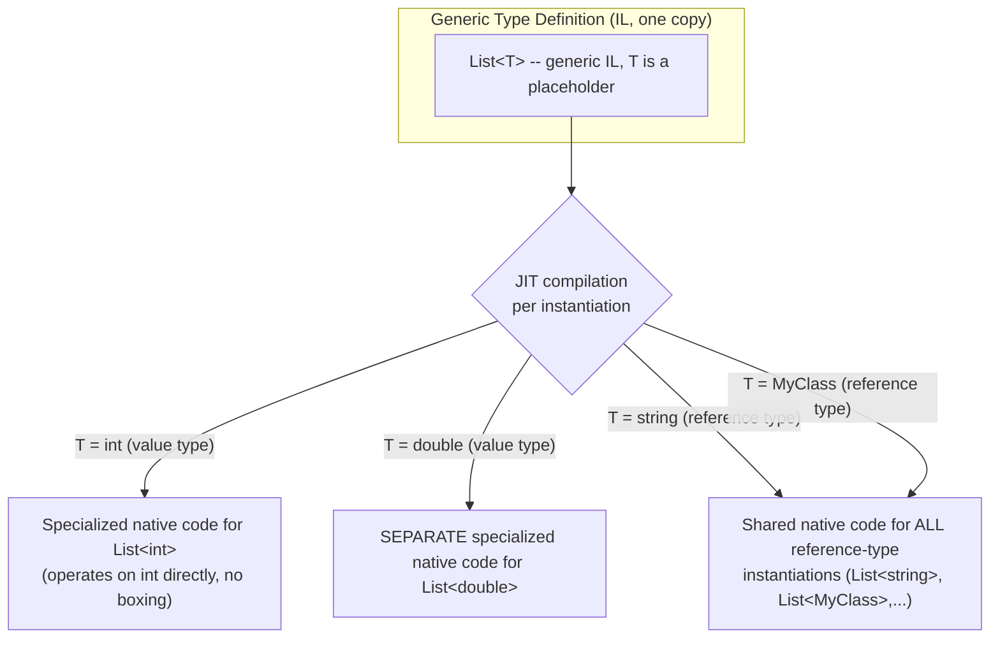
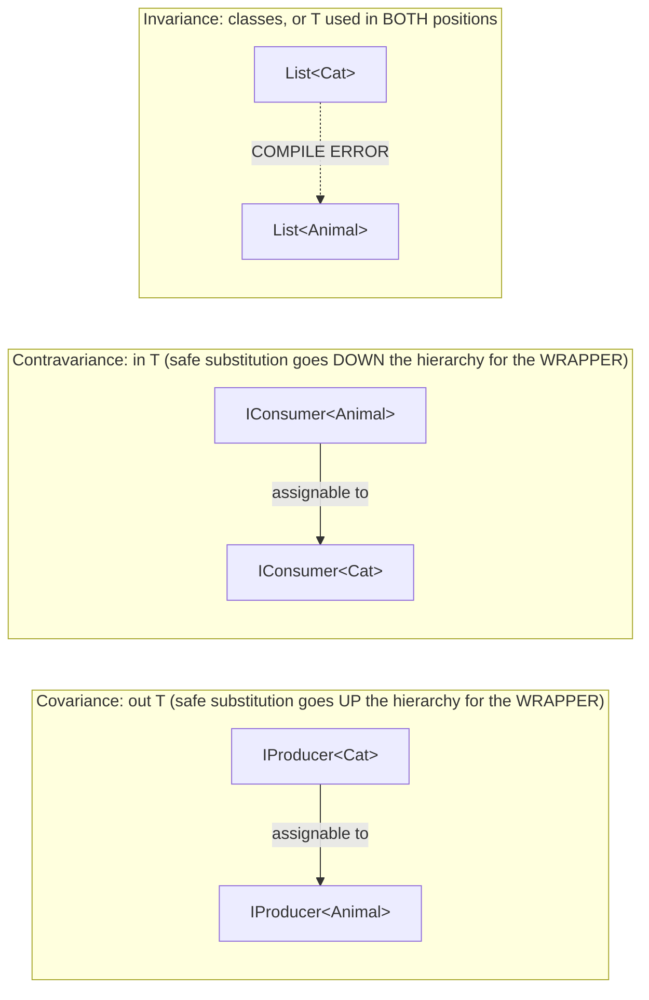
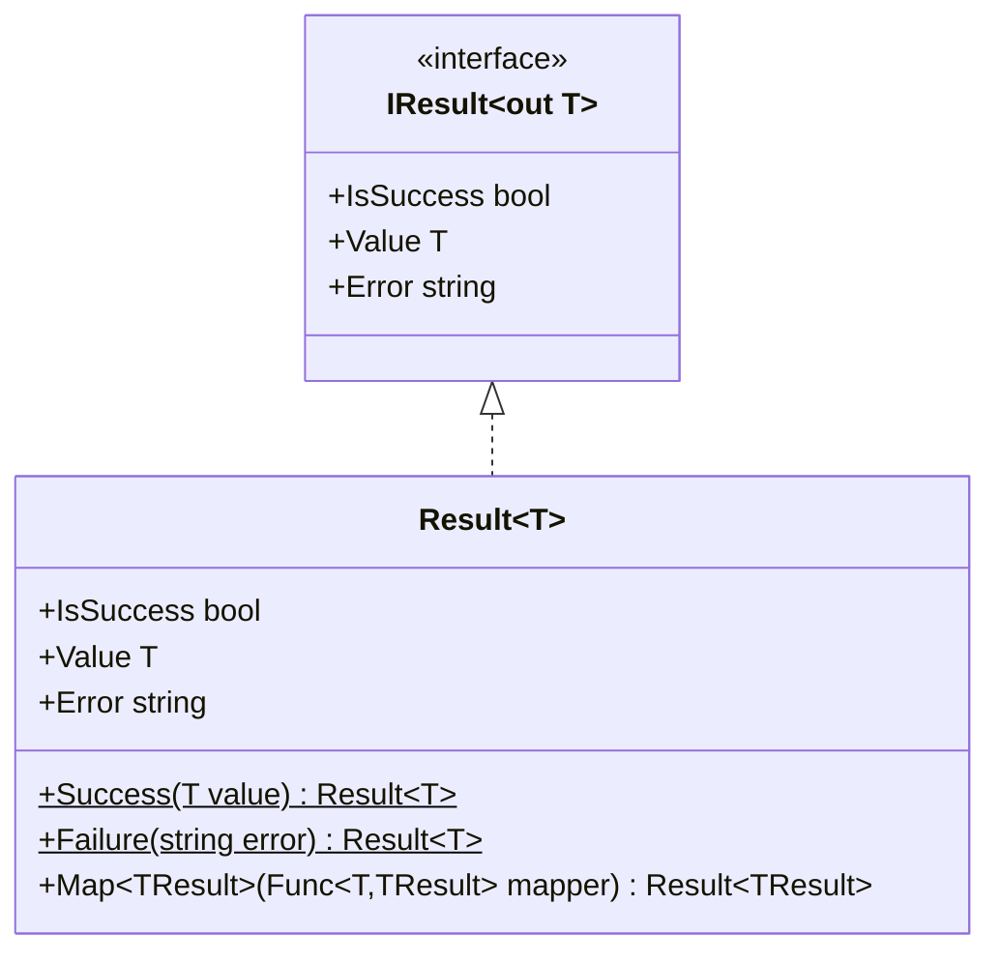
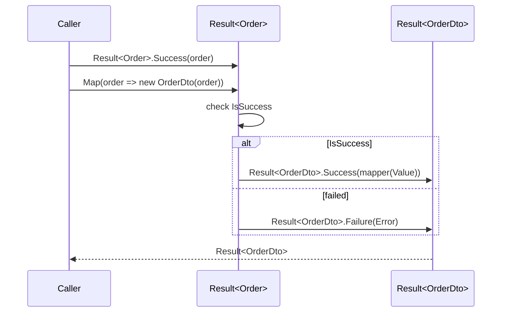

# Module 6 — C# Advanced: Generics, Variance & Generic Constraints

> Domain: C# | Level: Beginner → Expert | Prerequisite: [[01-CLR-JIT-GC-Memory-Management]] (boxing, JIT specialization referenced /), [[03-Span-Memory-Low-Allocation]] (`ref struct` generic constraints, C# 13's `allows ref struct`)

---

## 1. Topic Description

### Definition

.NET generics are **reified**, not erased and not textually expanded: the CLR retains full generic type information at runtime, so `List<int>` and `List<string>` are genuinely distinct runtime types with distinct `Type` objects. The JIT compiles a **separate native body per value-type argument** (because layout and size differ) and **shares one body across all reference-type arguments** (because every reference is the same shape), passing the type handle where it is needed. **Variance** (`in` / `out`) is the type system's rule for which generic assignments are permitted, and it is limited to reference types precisely because it is implemented as a reference reinterpretation with no representational change.

### Core sub-concepts

- **Reification vs erasure vs templates** — what `typeof(T)` and runtime constraint checks depend on, and how this differs from Java and C++.
- **JIT instantiation and code sharing** — per-value-type bodies, shared reference-type bodies, and the code-size / startup consequences.
- **Constraints** — `class`, `struct`, `new()`, base type, interface, `notnull`, `unmanaged`; as both an API contract and a codegen mechanism.
- **Struct-generic devirtualisation** — why an interface constraint on a struct type argument inlines the call and avoids boxing, and why storing it in an interface-typed variable destroys that.
- **Covariance (`out`)** — safe when `T` appears only in output positions; `IEnumerable<out T>`.
- **Contravariance (`in`)** — safe when `T` appears only in input positions; `IComparer<in T>`, handler and consumer interfaces.
- **Invariance** — why `IList<T>` and `List<T>` cannot be variant.
- **Unsafe array covariance** — `object[] a = new string[10]` and `ArrayTypeMismatchException`; the store check every array write pays.
- **Open vs closed constructed types** — `List<>` versus `List<int>`; open-generic registration in DI and generic decorators.
- **Type inference and its limits** — return-type-only parameters, the `Tuple.Create` factory-method workaround.
- **Static abstract interface members** — generic math (`INumber<T>`), generic factories, and what they replace.
- **`default(T)` and nullability** — `T?` under different constraints, `notnull`, `MaybeNull`/`NotNullWhen`.

### Where it fits

Generics are the shape of nearly every reusable abstraction in a .NET codebase: collections, repositories, handlers, validators, serialisers and DI registrations. Downward they depend on the CLR's type-loading and JIT model covered in `01`; sideways they interact with delegates (`Func<>`/`Action<>` are variant), with LINQ (`IEnumerable<out T>` is what makes query composition assignable), and with pooling and span code where struct constraints are the mechanism for zero-cost abstraction. Upward, generic signatures are part of a library's **binary contract**, so they constrain how an estate can evolve.

### Why it matters at scale

Two consequences bite. First, **AOT and startup**: instantiations created at runtime via `MakeGenericType`, `Activator.CreateInstance` or reflection-driven dispatch cannot be generated ahead of time, so a reflection-heavy generic design silently forecloses NativeAOT and inflates JIT time on every cold start — a real cost for scale-to-zero or frequently-restarted workloads. Second, **versioning**: adding a constraint, changing variance or adding a type parameter to a published generic type breaks every consumer at compile *and* load time, and reification means you cannot paper over it at runtime. In a plugin architecture where untrusted input influences which closed types are constructed, unbounded instantiation is also a slow denial-of-service against code heap that is never reclaimed.

### Common pitfalls / anti-patterns

- **Expecting variance on value types** (`IEnumerable<int>` → `IEnumerable<object>`) — it would require boxing every element, so the runtime forbids it; the rule falls out of the representation model.
- **Relying on array covariance** — `object[] a = new string[10]; a[0] = 42;` compiles and throws at runtime, converting a compile-time error into a production one.
- **Adding a constraint to a shipped public generic type** — a breaking change for every consumer whose `T` no longer qualifies, and not fixable by recompiling downstream assemblies.
- **Shipping a one-directional interface as invariant** — `IHandler<TEvent>` without `in` forces consumers to write adapter classes forever, and adding variance later is breaking.
- **Runtime generic instantiation on a request path** — `MakeGenericMethod(...).Invoke(...)` is orders of magnitude slower than a direct call and eliminates AOT as an option.
- **Large generic method bodies instantiated over many structs** — multiplies native code, inflating JIT time, instruction-cache pressure and AOT binary size; the BCL pattern is a thin generic wrapper over a shared non-generic implementation.
- **A generic abstraction expressing conceptual rather than behavioural similarity** — produces methods that throw `NotSupportedException` for some type arguments and unreadable compiler errors for everyone.

> Scope note: allocation and boxing costs belong to `01-CLR-JIT-GC-Memory-Management`; span-based specialisation to `03-Span-Memory-Low-Allocation`; `Func<>`/`Action<>` delegate mechanics to `04-Delegates-Events-Closures`; `IEnumerable<out T>` in query composition to `05-LINQ-Internals`.

---

## 2. Beginner (10 Q&A)


**Q1. How does the CLR represent generics at runtime, and how does that differ from Java or C++?**
**A:** The CLR keeps full generic type information in metadata and constructs a distinct runtime type for each closed generic — `List<int>` and `List<string>` are genuinely different types with different `Type` objects. Java erases generics, so `List<Integer>` and `List<String>` are the same class at runtime and you cannot ask what `T` was; C++ templates are compile-time expansion producing separate code for every instantiation with no shared runtime identity. .NET sits between them: reified types like C++, but with code sharing for reference types like nothing in either. That reification is why `typeof(T)`, generic overload resolution at runtime, and constraint checks all work.
*Follow-up: Given reification, why can't you write `new T[10]` for an unconstrained `T` without a constraint or `Activator`?*

**Q2. What does the JIT actually produce for `List<int>` versus `List<string>`?**
**A:** A distinct native code body for each value-type argument, because the layout, size and copying semantics differ — so `List<int>`, `List<long>` and `List<MyStruct>` each get their own compiled code. All reference-type arguments share a single body, because every reference is the same size and shape, with the type handle passed alongside where it is needed. This is why generics over value types eliminate boxing and can inline and specialise beautifully, and why generics over many distinct value types inflate code size and JIT time.
*Follow-up: What does that sharing mean for a method that does `typeof(T)` inside a shared reference-type body?*

**Q3. Why does `List<int>` outperform the old non-generic `ArrayList` for integers?**
**A:** `ArrayList` stores `object`, so every `int` is boxed on insertion — a heap allocation per element — and unboxed with a cast on every read, which is both an allocation cost and a type-check cost. `List<int>` is specialised to `int`, so the backing store is a genuine `int[]` with values stored inline: no allocation per element, no casts, better cache locality because the data is contiguous rather than a array of pointers to scattered boxes. On a large collection the difference is not a percentage, it is an order of magnitude in both memory and time.
*Follow-up: Where does `List<T>` still allocate, and what determines how often?*

**Q4. What are generic constraints for, beyond compile-time checking?**
**A:** They let you actually use `T` — calling members, constructing instances, comparing to `null` — which an unconstrained `T` forbids, and they let the compiler and JIT reason about the type. `where T : struct` enables non-nullable value semantics and specialised codegen; an interface constraint on a *struct* type argument lets the JIT devirtualise and inline the interface call rather than dispatching through an interface map, which is the basis of several high-performance BCL patterns. So constraints are simultaneously an API contract and a performance mechanism.
*Follow-up: Why does an interface constraint on a struct avoid boxing where casting the struct to that interface would box it?*

**Q5. Explain covariance and contravariance with a concrete example.**
**A:** Covariance (`out`) lets you use a more-derived type where a less-derived one is expected, which is safe when the type only ever comes *out*: `IEnumerable<string>` is assignable to `IEnumerable<object>` because you can only read from it. Contravariance (`in`) is the reverse and is safe when the type only goes *in*: an `IComparer<object>` can be used as an `IComparer<string>`, because anything that can compare any two objects can certainly compare two strings. The direction is determined entirely by whether `T` appears in output or input positions — which is why `IList<T>` is invariant: it does both.
*Follow-up: Why can't `List<string>` be assigned to `List<object>` even though `IEnumerable<string>` can be assigned to `IEnumerable<object>`?*

**Q6. Why does variance not work with value types?**
**A:** Variance is implemented as a reference conversion — the same reference, reinterpreted as a different type, with no representational change. Value types have different sizes and layouts, so converting `IEnumerable<int>` to `IEnumerable<object>` would require boxing every element, which is a representation change rather than a reinterpretation. The runtime therefore restricts variance to reference type arguments, and the compiler enforces it. This is a case where a language rule falls directly out of the runtime's representation model.
*Follow-up: What's the practical workaround when you need an `IEnumerable<object>` from an `IEnumerable<int>`?*

**Q7. C# arrays are covariant. Why is that considered a design mistake?**
**A:** Because it is not type-safe: `object[] arr = new string[10]` compiles, and `arr[0] = 42` then throws `ArrayTypeMismatchException` at runtime. The type system permitted an assignment it cannot honour, converting a compile-time error into a runtime one, and imposing a covariance store-check on every array write — a real cost paid by all code to support a feature that is unsound. It was inherited from Java for pre-generics interoperability, and generics later provided the correct answer, which is why `List<T>` is invariant deliberately.
*Follow-up: How does the runtime avoid paying that store check for arrays it can prove are exact?*

**Q8. When should an interface you design be declared covariant or contravariant?**
**A:** Whenever the type parameter genuinely appears only in output or only in input positions, because declaring it costs nothing and enables composition you cannot add later without a breaking change. A read-only source interface should be `out T`; a consumer, handler, comparer or validator interface should be `in T`. The design discipline is to notice when a single method forces invariance for no real reason — a `Reset(T item)` on an otherwise-covariant reader — and to consider splitting the interface so the covariant part stays composable.
*Follow-up: You shipped `IRepository<T>` as invariant and now consumers want covariance. What are your options?*

**Q9. What is the difference between an open and a closed generic type, and where does that distinction matter?**
**A:** An open type has unbound parameters (`List<>`, `IHandler<,>`) and cannot be instantiated; a closed type has them all supplied (`List<int>`). The distinction matters most in reflection and dependency injection: you register `typeof(IHandler<>)` mapped to `typeof(Handler<>)` and the container closes it per request, which is how a single registration serves every message type. Getting this wrong produces the familiar runtime error about an open type where a closed one was needed, and understanding it is what separates people who can extend a DI composition root from people who copy registrations.
*Follow-up: How would you register a generic decorator that wraps every closed `IHandler<T>`?*

**Q10. What do static abstract interface members enable?**
**A:** They let an interface require static members — operators, factory methods, constants — so generic code can call them through a constraint. That is what makes generic math possible: a method constrained to `INumber<T>` can use `+` and `T.Zero` without boxing or reflection, which previously required either code duplication per numeric type or a slow dynamic path. More broadly it enables generic factories and parsers where the type itself provides the behaviour. The cost is added complexity in the type system and a feature that only works on modern runtimes, so it is worth using where it removes real duplication rather than for its own sake.
*Follow-up: What did people do before this feature to write one algorithm over `int`, `long` and `decimal`, and what did it cost?*

---

## 3. Intermediate (10 Q&A)


**Q1. When does generic code cause a code-size or startup problem, and how would you notice?**
**A:** Because every distinct value-type argument gets its own JIT-compiled body, a heavily generic library instantiated over dozens of structs multiplies native code — increasing JIT time at startup, instruction-cache pressure at steady state, and binary size under AOT. You notice it as slow cold start disproportionate to the work being done, or as an AOT binary far larger than expected. Diagnosis is to look at JIT counters or the AOT size breakdown by instantiation. Mitigation is to keep the generic surface thin — a generic wrapper delegating to a shared non-generic implementation, so the specialised code is small even though the API is generic, which is exactly how much of the BCL is written.
*Follow-up: How would you restructure a generic method with a large body to reduce instantiation cost?*

**Q2. How do generics interact with NativeAOT, and what patterns break?**
**A:** AOT must generate code ahead of time, so every generic instantiation actually used has to be discoverable statically. Instantiations created at runtime — via `MakeGenericType`, `Activator.CreateInstance` with a runtime-computed type, or reflection-driven dispatch — cannot be produced and fail at runtime. Patterns that break are therefore reflection-based serialisers, dynamic proxy and interception libraries, and any plugin model that closes generics from configuration. The fix is source generators and explicit registration so the closed set is known at build time, which is a real architectural constraint worth knowing before promising AOT to stakeholders.
*Follow-up: How would you audit an existing service for runtime generic instantiation before committing to AOT?*

**Q3. Adding a constraint to an existing public generic type — breaking change or not?**
**A:** Breaking. Adding `where T : class` means every consumer whose `T` was a value type no longer compiles, and because generics are reified it is a binary-compatibility problem as well, so recompilation does not save downstream assemblies that were built against the old signature. Removing a constraint is the safe direction. This is the general shape of generic API evolution: the type parameter's constraints are part of the contract, so a shared library should get them right initially or accept a major version. It is a good example of why generic public APIs deserve more design scrutiny than internal ones.
*Follow-up: You need the constraint for correctness in v2 of a widely-used library. How would you sequence that change?*

**Q4. How would you design a generic repository or handler abstraction so it stays useful as it scales?**
**A:** Constrain it enough to be meaningful and no more — an unconstrained `IRepository<T>` invites use over types that have no identity or no persistence, and produces methods that only make sense for some `T`. I would define the constraint that actually matters (`where T : IAggregateRoot`), keep the interface small, and resist adding methods that only some implementations support, since that is how a generic abstraction turns into a leaky one with `NotSupportedException` bodies. I would also separate read and write concerns so the read side can be covariant, and register open generics in DI with decorators for cross-cutting behaviour rather than inheriting from a base class.
*Follow-up: Half your aggregates need a bespoke query the generic interface can't express. What do you do?*

**Q5. What is the runtime cost of a generic interface call, and how do constraints change it?**
**A:** An interface call on a reference type is a dispatch through the interface map — an indirection the JIT can sometimes devirtualise but often cannot. When the type argument is a *struct* constrained to that interface, the JIT knows the concrete type at instantiation, so it can devirtualise and inline the call entirely, and no boxing occurs. That is the mechanism behind high-performance patterns like passing a struct comparer or a struct enumerator: the abstraction is free at runtime. The cost is code size and a somewhat unusual-looking API, so it is a hot-path technique rather than a default.
*Follow-up: Why does storing that same struct in a variable of the interface type destroy the benefit?*

**Q6. Where does generic type inference fail, and how do you design around it?**
**A:** Inference works from arguments, so it fails when a type parameter appears only in the return type, only in a constraint, or when the argument is a lambda whose own parameter types depend on the inference you are asking for. The standard design workaround is the factory-method pattern the BCL uses — `Tuple.Create` and `KeyValuePair.Create` exist so callers get inference that constructors cannot provide — and splitting a method into two generic calls so the first infers what the second needs. Recognising this is what lets you design fluent APIs that do not force callers to write out long type arguments.
*Follow-up: Why is `Task.FromResult` inferable but a hypothetical `Cache.Get<T>(key)` not?*

**Q7. How do you handle `null` and default values in generic code where `T` might be a value type?**
**A:** `default(T)` is the general answer — `null` for reference types, zero-initialised for value types — and comparing `T` to `null` is only legal with a `class` constraint. In modern C# the harder part is nullable-reference-type annotation: `T?` means different things depending on whether `T` is constrained, and the `notnull` constraint plus attributes like `MaybeNull` and `NotNullWhen` exist to express the intent precisely. The pitfall is a generic method whose contract accidentally differs for value and reference types — returning `default` to signal "not found" is ambiguous when `T` is `int`, which is exactly why `TryGetValue` returns a `bool` rather than a sentinel.
*Follow-up: How would you design a generic cache API that can distinguish "absent" from "present but default"?*

**Q8. When is reflection over generics justified, and what would you use instead?**
**A:** It is justified at composition time — scanning assemblies to register handlers, wiring a plugin model, building a mapping once at startup — where the cost is paid once and the alternative is unmaintainable manual registration. It is not justified on a request path, where `MakeGenericMethod` and `Invoke` are orders of magnitude slower than a direct call and defeat AOT. The alternatives in order are: open generic registration in the DI container, source generators that emit the closed code at build time, and caching a compiled delegate created once per closed type so the reflection cost is amortised. I would want any request-path reflection to be a deliberate, benchmarked decision.
*Follow-up: How would you cache a `MakeGenericMethod` result correctly so it's fast and thread-safe?*

**Q9. Two generic overloads that differ only by constraint won't compile as overloads. Why, and what do you do instead?**
**A:** Because constraints are not part of the method signature for overload resolution — the compiler sees two identical methods. The practical workarounds are giving them different names, which is usually the honest answer since they do different things; introducing a distinguishing parameter; or using a single method with a runtime type check where the cost is acceptable. Modern C# also allows resolving some of these with static abstract interface members, letting the type itself supply the differing behaviour so one method suffices. The design lesson is that if two implementations differ meaningfully by type category, the API probably should say so.
*Follow-up: How would generic math let you collapse separate `int`/`decimal` overloads into one method?*

**Q10. How do variance rules affect designing a plugin or handler system?**
**A:** They determine whether consumers can compose your abstractions without adapters. A contravariant `IHandler<in TEvent>` lets a handler for a base event type be used wherever a handler for a derived event is expected, which is often exactly the polymorphism a plugin system wants; a covariant `IProvider<out T>` lets a provider of a concrete type satisfy a request for its interface. If you declare these invariant by default, consumers write wrapper classes forever, and you cannot make them variant later without a breaking change. So variance is a design decision to make at the start, and the cost of getting it right is one keyword.
*Follow-up: Your handler interface has a `CanHandle(TEvent e)` method, which forces invariance. How would you restructure it?*

---

## 4. Expert / Architect (10 Q&A)


**Q1. How do you evaluate whether an abstraction should be generic at all?**
**A:** Generics pay when the behaviour is genuinely identical across types and only the data differs — collections, serialisers, pipelines. They cost when they are used to express a *conceptual* similarity that is not a behavioural one, which produces an abstraction with constraints nobody can satisfy, methods that throw for some type arguments, and error messages that are unreadable. My test is whether I can write the body without any knowledge of `T` beyond its constraints; if the implementation needs to branch on what `T` is, the generic is the wrong shape and separate types or an interface would be clearer. At a codebase level, deeply nested generic signatures are a strong signal that the abstraction is modelling the wrong axis.
*Follow-up: You inherit an `IProcessor<TIn, TOut, TContext, TResult>`. How do you assess and unwind it?*

**Q2. What are the versioning implications of generics in a shared library used across an estate?**
**A:** Generic signatures are part of the binary contract, so type parameters, their order, their variance and their constraints are all effectively frozen once published — adding a constraint, changing variance, or adding a type parameter breaks every consumer at compile and load time. Because generics are reified, you cannot paper over it with runtime adaptation the way you sometimes can with non-generic APIs. My approach is to treat generic public APIs as requiring a higher review bar than the rest of the library, prefer fewer type parameters, add variance up front where it is sound, and use extension methods for convenience overloads so the core interface stays small and stable.
*Follow-up: How would you introduce a second type parameter to an existing interface without breaking consumers?*

**Q3. A team proposes a heavily generic framework as the standard for all services. How do you assess it?**
**A:** I would look at who pays the cost. Generic frameworks concentrate cleverness in one place and distribute comprehension cost across every consumer and every future hire — compile errors become unreadable, stack traces become unnavigable, and debugging requires understanding the framework rather than the business logic. That trade is worth it when the framework removes genuinely repetitive, error-prone work at scale; it is not worth it when it is an elegant expression of a problem three teams have. I would ask for evidence from real adopters, measure onboarding time, and be explicit that the burden of proof is on the abstraction. Framework decisions are among the hardest to reverse, so I would prefer starting with a library that teams choose over a framework they must inherit.
*Follow-up: It's already adopted by four teams and two want out. How do you handle that?*

**Q4. What are the AOT and startup-cost implications of a generics-heavy architecture at fleet scale?**
**A:** Every value-type instantiation is separately compiled, so a generics-heavy design directly inflates JIT time in a JIT world and binary size in an AOT world — which for a fleet of short-lived or scale-to-zero workloads is a real cost, since startup happens constantly rather than once. Worse, runtime instantiation via reflection forecloses AOT entirely, so a design choice made for elegance can eliminate a deployment option years later. I would want the architectural constraint stated up front: if AOT is a strategic goal, then reflection-driven generic instantiation is a banned pattern and source generation is the sanctioned alternative, decided deliberately rather than discovered during a migration.
*Follow-up: How do you measure the actual startup cost attributable to generic instantiation?*

**Q5. How would you migrate an old non-generic API (`object`-based collections, `ArrayList`-era code) to generics across a large codebase?**
**A:** Incrementally, from the edges, with the generic version added alongside rather than replacing — because a big-bang signature change across a large codebase is unreviewable and its regressions are silent type-coercion bugs. I would introduce generic overloads, mark the old ones `[Obsolete]` with a message naming the replacement, and use the compiler warnings as the burn-down list with a visible number. The genuinely risky part is behaviour change rather than syntax: `object`-based code often relied on implicit boxing, reference equality on boxes, or storing heterogeneous items, so some call sites will not have a direct generic equivalent and need real design decisions. I would find those first, since they determine whether the migration is a week or a quarter.
*Follow-up: You find call sites storing genuinely heterogeneous types. What do you do with them?*

**Q6. Where does the reified-generics design help or hurt you compared to type erasure?**
**A:** It helps enormously in practice: no boxing for value-type generics, runtime type checks and reflection that actually work, overloads that can differ by generic argument, and specialised code with real performance benefits. Where it hurts is in code size, AOT constraints, and the inability to write certain kinds of type-parameter-agnostic infrastructure that erasure makes trivial — plus the fact that generic type identity is part of the binary contract, making evolution stricter. On balance I consider it the better trade for .NET's positioning, but the honest architectural point is that it moves flexibility from runtime to build time, which is exactly the direction that suits AOT and hurts plugin-style dynamism.
*Follow-up: What's a concrete design that's easy in Java's erased model and awkward in .NET's?*

**Q7. How do generics interact with a multi-tenant plugin architecture, and what are the risks?**
**A:** If tenants or plugins can influence which closed generic types are constructed, you have given untrusted input control over runtime code generation — every new closed type triggers JIT compilation, consumes code heap that is never reclaimed, and cannot be unloaded without a collectible `AssemblyLoadContext`. That is a slow-burn denial-of-service: memory and JIT time grow with the number of distinct instantiations. The controls are an allow-list of permitted type arguments, collectible load contexts so plugin code can actually be unloaded, quotas, and monitoring on loaded-type and code-heap growth. I would treat "input controls type instantiation" as a security review trigger in its own right.
*Follow-up: How would you verify that a collectible `AssemblyLoadContext` actually unloads in your architecture?*

**Q8. When would you choose source generators over generics to solve a problem?**
**A:** When you want per-type specialised code without runtime cost or AOT restrictions — serialisation, mapping, logging, DI registration are the canonical cases. Generics give you one implementation reused across types; source generation gives you a bespoke implementation per type, produced at build time, with no reflection and full AOT compatibility. The trade is build complexity, generated code that must be debuggable, and a tool the team now owns. My rule is that generics are the default because they are simpler, and source generation earns its place where reflection would otherwise be required at runtime — which is exactly where the industry has been moving for AOT reasons.
*Follow-up: What do you require of a source generator before you'd allow it into a shared build?*

**Q9. How would you approach a performance problem that turns out to be caused by generic interface dispatch?**
**A:** First verify it is really dispatch and not the work behind it, since interface calls are cheap and rarely the top cost outside genuinely tight loops. If confirmed, the ordered options are: constrain the type parameter to a struct so the JIT can devirtualise and inline; make the type sealed so the call can be devirtualised; restructure so the loop calls a concrete type rather than the interface; or, in extreme cases, replace the abstraction on that path entirely. I would insist the change is contained to the hot path with a benchmark and a comment, because struct-generic patterns are unusual enough that a future maintainer will otherwise "clean them up." Architecturally I would also ask why an abstraction boundary sits inside the hottest loop, which is often the real design issue.
*Follow-up: Sealing the class devirtualises the call but the team objects on extensibility grounds. How do you resolve that?*

**Q10. What guidance would you write for generic API design in a shared platform library?**
**A:** Keep type parameters few and their meaning obvious; add variance wherever the parameter is genuinely one-directional, because it is free now and a breaking change later; constrain to what you actually need, since constraints cannot be tightened after publication; keep generic method bodies small and delegate to a shared non-generic implementation to limit instantiation cost; avoid runtime generic instantiation so AOT stays available; and never introduce a generic abstraction to express similarity that is not behavioural. I would pair the guidance with a short list of accepted patterns from the BCL, because concrete precedent persuades where principle does not, and I would make generic public APIs require a second reviewer — the cost of getting them wrong is measured in major versions.
*Follow-up: How do you enforce that review requirement without making the library a bottleneck for contributors?*

---

## 5. Reference Material

> Retained from the original module: deep-dive internals, diagrams, production examples, exercises, system/low-level design, debugging walkthroughs and the Principal Engineer perspective.

### 1. Fundamentals

#### What are generics?
Generics let you define a type or method with a **placeholder type parameter** (`T`), filled in with a concrete type at the point of use, giving you type safety and reuse without duplicating code per type and without the performance/safety cost of casting to/from `object`.

```csharp
public class Box<T>
{
    public T Value { get; set; }
}
var intBox = new Box<int> { Value = 5 }; // T = int
var stringBox = new Box<string> { Value = "x" }; // T = string
```

#### What is variance?
**Variance** governs whether a generic type with a more specific type argument can be used where a generic type with a less specific (more general) type argument is expected — specifically for **interfaces and delegates** (never for classes/structs themselves in C#). **Covariance** (`out T`) allows a `IProducer<Derived>` to be used as an `IProducer<Base>`; **contravariance** (`in T`) allows a `IConsumer<Base>` to be used as an `IConsumer<Derived>`.

#### Why do these exist?
- **Generics** solve the pre-.NET-2.0 problem of collections (`ArrayList`, `Hashtable`) that stored everything as `object`, requiring boxing for value types and unsafe downcasts for reference types, with zero compile-time type checking (`ArrayList.Add("oops")` into what was "supposed to be" an `int` collection compiled fine, then threw at runtime).
- **Variance** solves a genuine, common frustration: without it, `IEnumerable<string>` couldn't be passed where `IEnumerable<object>` was expected, even though logically "a sequence of strings is safely usable wherever a sequence of objects is expected for read-only purposes" — variance lets the type system express exactly this safe subset of substitutability, while still preventing genuinely unsafe substitutions.

#### When does this matter?
- **Always**, since virtually every modern C# collection, LINQ operator, and library API is generic.
- **Deeply**, for interview purposes, in three specific areas that separate senior from principal-level understanding: (1) **why generics don't cause boxing for value types** (reified generics vs. Java-style type erasure — a frequent, incorrect cross-language assumption), (2) **precisely why variance only applies to interfaces/delegates, only to reference-type-compatible positions, and only in specific directions**, and (3) **generic constraints as a design tool** for expressing compile-time-enforced contracts (`where T: IComparable<T>`, `where T: struct`, generic math's `where T: INumber<T>`).

#### How does it work (30,000-ft view)?

```csharp
List<int> ints = new; // JIT generates SPECIALIZED native code for List<int>, no boxing
List<string> strings = new; // JIT generates SEPARATE specialized code for List<string> (or shares with other reference types --)

IEnumerable<string> strs = new List<string>;
IEnumerable<object> objs = strs; // legal! IEnumerable<T> is declared covariant (out T)
```

Mental model for interviews: **"C# generics are reified — the CLR actually knows and specializes on the concrete type at runtime, unlike Java's type erasure. Variance is a narrow, compiler-checked safety mechanism that only applies to interfaces/delegates, only when a type parameter is used exclusively in 'output' (covariant) or 'input' (contravariant) positions."**

### 2. Deep Dive

#### 2.1 Reified Generics vs Type Erasure — the CLR-Level Mechanism

Unlike Java (which erases generic type parameters at compile time — `List<String>` and `List<Integer>` are literally the same bytecode-level class at runtime, `List`, with casts inserted by the compiler), the **CLR retains full generic type information at runtime**. This is implemented via:
- **Generic type definitions** (`List<T>`) are compiled to IL containing genuine placeholder type parameters, with full metadata.
- At JIT time, for each **distinct value-type instantiation** (`List<int>`, `List<double>`, `List<MyStruct>`), the JIT generates **completely separate, specialized native code** — because value types have different sizes/layouts, generic code operating on `T` needs different machine code per value type (e.g., `List<int>`'s internal array is a genuine `int[]`, stored inline with no boxing, and comparisons/copies use `int`-sized operations).
- For **reference-type instantiations** (`List<string>`, `List<MyClass>`, `List<AnyReferenceType>`), the JIT generates and **shares one specialized native code body** across all of them, since every reference type is the same size (a pointer) and behaves uniformly with respect to the generic code's operations — this sharing is a genuine, important CLR optimization (avoids generating N copies of `List<T>`'s code for N different reference types) but is invisible from a correctness standpoint (each instantiation still behaves as its own distinct type at the type-system level: `List<string>` and `List<object>` are different types, cannot be freely substituted for each other despite sharing native code).

**This is precisely why `List<int>` involves zero boxing**: the JIT-generated code for `List<int>` operates directly on `int` values inline, not on boxed `object` references — a direct continuation of the boxing-avoidance discussion and §Advanced Q3's constrained-generic-avoids-boxing point.


```mermaid
graph TB
 subgraph "Generic Type Definition (IL, one copy)"
 Def["List&lt;T&gt; -- generic IL, T is a placeholder"]
 end
 Def --> JIT{"JIT compilation<br/>per instantiation"}
 JIT -->|"T = int (value type)"| Code1["Specialized native code for List&lt;int&gt;<br/>(operates on int directly, no boxing)"]
 JIT -->|"T = double (value type)"| Code2["SEPARATE specialized native code for List&lt;double&gt;"]
 JIT -->|"T = string (reference type)"| Code3["Shared native code for ALL reference-type<br/>instantiations (List&lt;string&gt;, List&lt;MyClass&gt;,...)"]
 JIT -->|"T = MyClass (reference type)"| Code3
```

#### 2.2 Generic Constraints — Precise Mechanics and Design Purpose

```csharp
public T Max<T>(T a, T b) where T: IComparable<T>
{
    return a.CompareTo(b) > 0? a: b;
}
```
- `where T: IComparable<T>` is a **compile-time-enforced contract**: only types implementing `IComparable<T>` can be substituted for `T`, and the compiler allows calling `.CompareTo(...)` on `T`-typed values inside the method body **without boxing and without a runtime interface-dispatch cast**, because the JIT specializes the method per concrete `T` — calling an interface member on a **constrained value-type `T`** invokes it directly on the unboxed value via a specialized code path (this is exactly the point, restated in its natural home).
- Common constraint kinds: `where T: struct` (value types only, excludes `Nullable<T>` itself but permits any struct), `where T: class` (reference types only), `where T: new` (must have a public parameterless constructor — enables `new T` inside the generic method), `where T: BaseClass`, `where T: IInterface`, `where T: U` (must be the same type as or derived from another type parameter `U`), `where T: notnull` (C# 8+, nullable-reference-types-aware constraint), and (C# 13+) `where T: allows ref struct` (permits `ref struct` types like `Span<T>` to be used as `T` — directly resolving the earlier-noted limitation).
- **Multiple constraints** combine with implicit AND semantics: `where T: class, IComparable<T>, new` requires all three simultaneously.

#### 2.3 Variance — the Precise Rules and Why They're Necessary

Variance (`in`/`out`) is declared **only on generic interface and delegate type parameters**, never on classes/structs, and only applies to type parameters used **exclusively** in one directional role throughout the entire interface definition:

```csharp
public interface IProducer<out T> // covariant: T appears only in OUTPUT positions (return types)
{
    T Produce;
    // T Consume(T item); // COMPILE ERROR if attempted -- T can't appear as an input parameter in a covariant interface
}

public interface IConsumer<in T> // contravariant: T appears only in INPUT positions (parameter types)
{
    void Consume(T item);
    // T Produce; // COMPILE ERROR if attempted -- T can't appear as a return type in a contravariant interface
}
```

**Why covariance is safe** (`IProducer<Derived>` usable as `IProducer<Base>`): if you have an `IProducer<Cat>` and treat it as an `IProducer<Animal>`, calling `.Produce` on it will genuinely return a `Cat` — which **is** an `Animal` — so treating the return value as `Animal` is always safe. The compiler enforces this by forbidding `T` from ever appearing in an *input* position, where the reverse substitution would be unsafe.

**Why contravariance is safe** (`IConsumer<Base>` usable as `IConsumer<Derived>`): if you have an `IConsumer<Animal>` (something that knows how to consume **any** `Animal`) and treat it as an `IConsumer<Cat>`, calling `.Consume(someCat)` on it is safe — a `Cat` **is** an `Animal`, so something that can consume any `Animal` can certainly consume this specific `Cat`. The compiler forbids `T` from appearing in an *output* position, where returning a general `Animal` when a specific `Cat` was expected would be unsafe.

**Why classes/structs cannot be variant**: a class like `List<T>` exposes `T` in **both** input positions (`Add(T item)`) and output positions (`this[int index]` getter, enumeration) — genuinely mixing roles, so neither covariance nor contravariance could be soundly applied; this is exactly why `List<Cat>` **cannot** be assigned to a `List<Animal>`-typed variable (a classic interview trap — `IEnumerable<Cat>` can, `List<Cat>` cannot), and why `List<T>.Add` existing at all is precisely the mechanism that would make such an assignment unsound if it were permitted (you could then `animalList.Add(new Dog)` into what's actually backed by a `List<Cat>`).

**Real BCL examples**: `IEnumerable<out T>` (covariant — you can only "get" items out), `IEnumerator<out T>`, `Func<out TResult>` (covariant in its return type), `Action<in T>` (contravariant in its parameter), `IComparer<in T>` (contravariant — "something that can compare any two `Animal`s can compare two `Cat`s"), `Func<in T, out TResult>` (contravariant parameter, covariant return — the most commonly cited example of both variance kinds coexisting in one generic delegate).

#### 2.4 Generic Methods vs Generic Types — Type Inference Mechanics

```csharp
public static T Max<T>(T a, T b) where T: IComparable<T> {... }
var result = Max(3, 7); // T inferred as int -- no need to write Max<int>(3, 7) explicitly
```
The compiler performs **type inference** for generic method calls by examining the argument types at the call site — this is a compile-time-only process (no runtime cost), distinct from generic type instantiation (`List<int>`) itself, which does have the JIT-specialization behavior. A generic method can also have constraints referencing multiple type parameters against each other (`where T: IComparable<TOther>`), enabling expressive, statically-checked relationships between otherwise-independent generic parameters.

#### 2.5 Generic Math (C# 11+,.NET 7+) — Static Abstract Interface Members

Before C# 11, you could not write a generic method constrained to "any numeric type" and use operators (`+`, `-`, `<`) on it, because operators are **static** members, and prior to C# 11, interfaces could not declare static abstract members (a fundamental limitation — interface constraints only let you call *instance* members). C# 11 introduced **static abstract interface members**, enabling the `System.Numerics` **generic math** interfaces (`INumber<TSelf>`, `IAdditionOperators<TSelf,TOther,TResult>`, etc.):

```csharp
public static T Sum<T>(IEnumerable<T> values) where T: INumber<T>
{
    T total = T.Zero; // T.Zero is a STATIC ABSTRACT member -- resolved per-instantiation, not via instance dispatch
    foreach (var v in values) total += v; // uses T's static + operator
    return total;
}
// Works identically for Sum<int>, Sum<double>, Sum<MyCustomNumericType> (if it implements INumber<T>)
```
This directly closes a decades-old C# generics gap (no generic numeric algorithms without either code duplication per numeric type or a runtime-dispatch-based workaround) and is implemented, like all constrained generic value-type code, via per-instantiation JIT specialization — `Sum<int>` and `Sum<double>` each get their own specialized native code calling the JIT-resolved concrete `+`/`Zero` for that specific type, with no virtual dispatch or boxing involved.

#### 2.6 The `List<Cat>`-Cannot-Assign-to-`List<Animal>` Trap, Fully Explained

```csharp
List<Cat> cats = new { new Cat };
List<Animal> animals = cats; // COMPILE ERROR -- List<T> is NOT variant
IEnumerable<Animal> animalsEnum = cats; // OK -- IEnumerable<T> IS covariant
```
This is one of the single most commonly mis-explained topics in C# interviews. The precise reason: `List<T>` is a **class**, and classes can never be declared variant in C# regardless of how their members happen to use `T` — the language simply doesn't permit `out`/`in` variance annotations on classes at all (only on interface/delegate type parameters). Even if `List<T>` *conceptually* had all the same variance-safety concerns as `IEnumerable<T>` for its read-only members, the language draws the line at the interface/delegate boundary as a deliberate simplification (largely because classes commonly mix input and output usage of `T`, as `List<T>` itself does via `Add`, making blanket variance unsound for the general case, and the language doesn't offer a narrower "partially variant class" mechanism).

### 3. Visual Architecture

#### Variance Direction Diagram


```mermaid
graph LR
 subgraph "Covariance: out T (safe substitution goes UP the hierarchy for the WRAPPER)"
 A1["IProducer&lt;Cat&gt;"] -->|"assignable to"| A2["IProducer&lt;Animal&gt;"]
 end
 subgraph "Contravariance: in T (safe substitution goes DOWN the hierarchy for the WRAPPER)"
 B1["IConsumer&lt;Animal&gt;"] -->|"assignable to"| B2["IConsumer&lt;Cat&gt;"]
 end
 subgraph "Invariance: classes, or T used in BOTH positions"
 C1["List&lt;Cat&gt;"] -.->|"COMPILE ERROR"| C2["List&lt;Animal&gt;"]
 end
```

#### Generic Instantiation & JIT Specialization (ASCII)

```
 List<T> (IL, one generic definition)
 │
 ┌─────────────────────┼─────────────────────┐
 ▼ ▼ ▼
 List<int> List<double> List<string> / List<MyClass> /...
 (own native code, (own native code, (ONE SHARED native code body --
 inline int[] storage, inline double[] all reference types are pointer-
 zero boxing) storage, zero sized and behave uniformly)
 boxing)
```

### 4. Production Example

#### Scenario: A generic repository abstraction causing a subtle covariance-related production bug

**Problem**: A shared internal library exposed a generic caching abstraction:
```csharp
public interface ICacheReader<out T>
{
    T? Get(string key);
}
public interface ICache<T>: ICacheReader<T>
{
    void Set(string key, T value);
}
```
A team building a notification service had a method accepting `ICacheReader<Notification>` for read-only access, and a caller passed a `ICache<EmailNotification>` (where `EmailNotification: Notification`) directly as an `ICacheReader<Notification>` — relying on `ICacheReader<out T>`'s covariance, which worked correctly and was the intended design. The bug arose in a **different, related** spot: a second developer, generalizing a helper method, changed a parameter type from `ICacheReader<Notification>` to the full `ICache<Notification>` (not realizing `ICache<T>` is **invariant**, since `T` appears in `Set`'s input position) — this silently broke every call site that had been passing a covariance-reliant `ICache<EmailNotification>` where an `ICache<Notification>` was now required, since `ICache<T>` cannot support that substitution at all. All such call sites failed to compile, were "fixed" under time pressure by the second developer via unsafe casts (`(ICache<Notification>)(object)theEmailCache`), and one of those casts was later invoked in a code path that called `.Set("key", someOtherNotificationSubtype)` — successfully compiling and running (since the cast bypassed the compiler's variance safety net entirely) but **corrupting the underlying `ICache<EmailNotification>`'s type invariant at runtime**, causing an `InvalidCastException` deep inside the cache's own internal storage logic when a later `.Get` call tried to hand back what it assumed was always an `EmailNotification`.

**Investigation**:
- The runtime `InvalidCastException` stack trace pointed into the cache implementation's internals, far from the actual root cause (the unsafe cast introduced during the earlier "fix").
- Git blame + code review traced the cast back to the parameter-type generalization change, and to the original developer's lack of understanding of *why* `ICacheReader<T>` was deliberately split out as a separate, narrower, covariant interface from the invariant `ICache<T>`.

**Architecture fix**:
- Reverted the helper method to accept `ICacheReader<Notification>` (the narrowest interface actually needed — the helper only ever read from the cache, never wrote), removing the need for any cast at all, restoring full compile-time safety.
- Added an explicit code comment on `ICacheReader<T>`'s declaration explaining *why* it exists as a separate, deliberately narrower, covariant interface (documenting the design intent that had been lost/misunderstood), directly addressing the root cause rather than just the symptom.
- Banned unsafe `(object)`-mediated generic casts via a Roslyn analyzer rule in the shared library's codebase specifically, given the severity of what bypassing them enabled here.

**Trade-offs**: Maintaining two interfaces (`ICacheReader<T>` and `ICache<T>`) instead of one is genuinely more API surface to design and document — justified specifically because it enables real covariance for read-only consumers, a design pattern worth the extra interface only when read/write separation is a genuine, recurring need (directly an instance of the **Interface Segregation Principle** applied specifically to unlock variance).

**Lessons learned**:
1. Splitting a read/write interface into a narrower covariant "reader" interface plus an invariant "read-write" interface is a deliberate, valuable design pattern precisely *because* it unlocks safe substitutability that the combined interface can never support — this should be a documented, intentional decision, not something a later refactor casually undoes.
2. An unsafe cast used to "fix" a variance-related compile error is a major red flag in code review — it's almost never actually safe, and its entire purpose is bypassing the exact safety check that just caught a real design mismatch.
3. `(object)`-mediated casts between generic interface instantiations should be treated with the same suspicion as raw pointer casts in `unsafe` code — they defeat a compiler-enforced safety guarantee, not just a style preference.

### 11. Coding Exercises

#### Easy — Fix a variance compile error by choosing the right interface
**Problem**: This code fails to compile.
```csharp
public void PrintAll(List<Animal> animals) { foreach (var a in animals) Console.WriteLine(a); }

List<Cat> cats = new { new Cat, new Cat };
PrintAll(cats); // COMPILE ERROR: cannot convert List<Cat> to List<Animal>
```
**Solution**:
```csharp
public void PrintAll(IEnumerable<Animal> animals) { foreach (var a in animals) Console.WriteLine(a); }

List<Cat> cats = new { new Cat, new Cat };
PrintAll(cats); // OK -- IEnumerable<out T> is covariant, and PrintAll only ever reads, never mutates
```
**Discussion**: The fix is a design fix, not a cast — `PrintAll` never needed list-mutation capability, only read access, so narrowing the parameter type to the covariant `IEnumerable<T>` is strictly more correct (accept the narrowest interface actually needed) in addition to resolving the compile error, directly applying the guidance.

#### Medium — Implement a generic, constrained `Max` that avoids boxing
**Problem**: Implement a generic `Max<T>` usable for both value types and reference types implementing `IComparable<T>`, verifying no boxing occurs for value-type calls.
```csharp
public static T Max<T>(T a, T b) where T: IComparable<T>
{
    return a.CompareTo(b) >= 0? a: b;
}

// Usage:
int maxInt = Max(3, 7); // T = int, JIT-specialized, zero boxing
string maxStr = Max("apple", "banana"); // T = string, shares reference-type code path
```
**Discussion**: Verify via BenchmarkDotNet `[MemoryDiagnoser]` that `Max(3, 7)` allocates 0 bytes — confirming the constraint enables the JIT to call `CompareTo` directly on the unboxed `int` value, exactly per the mechanism. Contrast with an unconstrained `object`-based version (`static object Max(object a, object b)`) that would box both `int` arguments on every call — a direct, hands-on demonstration of the boxing-cost claim, now fully explained mechanically.

#### Hard — Design and implement the covariant reader / invariant read-write split (//Advanced Q8)
**Problem**: Given the production bug, implement the corrected repository interface split, plus a concrete implementation, demonstrating the fix compiles and behaves safely where the original design didn't.
```csharp
public interface IReadOnlyRepository<out T>
{
    T? GetById(string id);
    IEnumerable<T> GetAll;
}

public interface IRepository<T>: IReadOnlyRepository<T>
{
    void Add(string id, T item);
}

public sealed class InMemoryRepository<T>: IRepository<T>
{
    private readonly Dictionary<string, T> _store = new;

    public T? GetById(string id) => _store.TryGetValue(id, out var value)? value: default;
    public IEnumerable<T> GetAll => _store.Values;
    public void Add(string id, T item) => _store[id] = item;
}

public abstract class Notification { }
public sealed class EmailNotification: Notification { }

// Usage demonstrating the fix:
IRepository<EmailNotification> emailRepo = new InMemoryRepository<EmailNotification>;
emailRepo.Add("1", new EmailNotification);

IReadOnlyRepository<Notification> readOnlyView = emailRepo; // OK! Covariant, read-only, SAFE.
foreach (var n in readOnlyView.GetAll) { /* read-only access to Notification-typed view */ }

// The following correctly FAILS TO COMPILE -- and this is exactly the desired outcome
// not a limitation to work around with a cast:
// IRepository<Notification> writableView = emailRepo; // COMPILE ERROR: IRepository<T> is invariant (by design)
```
**Discussion**: This directly demonstrates why the *compile error* on the last line is the **correct, desired behavior**, not a problem to solve — allowing `emailRepo` (an `EmailRepository`) to be treated as a full `IRepository<Notification>` would let calling code `.Add("x", new SomeOtherNotificationSubtype)` into what's actually backed by an `EmailNotification`-only store, corrupting its type invariant exactly as happened in the original production incident. The fix isn't "make this compile" — it's "recognize that read-only, covariant access is all the calling code in question ever legitimately needed," which is precisely the design correction made.

#### Expert — Implement a generic, allocation-free numeric aggregation pipeline using generic math (C# 11+)
**Problem**: Implement a reusable statistics helper (`Sum`, `Average`, `Min`, `Max`) generic over any type implementing `INumber<T>`, demonstrating zero-boxing generic math and its interaction with `Span<T>`.
```csharp
using System.Numerics;

public static class Statistics
{
    public static T Sum<T>(ReadOnlySpan<T> values) where T: INumber<T>
    {
        T total = T.Zero;
        foreach (var v in values) total += v; // static abstract '+' operator, resolved per-instantiation
        return total;
    }

    public static T Average<T>(ReadOnlySpan<T> values) where T: INumber<T>
    {
        if (values.IsEmpty) throw new ArgumentException("Cannot average an empty span.");
        T total = Sum(values);
        T count = T.CreateChecked(values.Length); // generic math: convert an int count into T's own numeric type
        return total / count;
    }

    public static T Max<T>(ReadOnlySpan<T> values) where T: INumber<T>, IMinMaxValue<T>
    {
        T max = T.MinValue; // static abstract member from IMinMaxValue<T>
        foreach (var v in values) if (v > max) max = v;
        return max;
    }
}

// Usage -- works identically, with zero boxing, for int, double, decimal, or any custom INumber<T>:
ReadOnlySpan<int> ints = stackalloc int[] { 3, 7, 2, 9, 4 };
int sum = Statistics.Sum(ints); // T = int, fully specialized, zero heap allocation
double avg = Statistics.Average(ints.ToArray.Select(i => (double)i).ToArray); // T = double, separately specialized
```
**Time complexity**: O(n) for `Sum`/`Average`/`Max`, single pass. **Space**: O(1) beyond the input span — no boxing (/), no intermediate allocations at all; `ReadOnlySpan<T>` as the parameter type additionally avoids any array-copy/allocation for the input itself when called against a `stackalloc` buffer or an existing array slice.
**Discussion points**: `T.CreateChecked(values.Length)` demonstrates generic math's cross-type conversion mechanism (`INumberBase<T>.CreateChecked<TOther>`) — converting a plain `int` count into whatever numeric type `T` actually is, in a fully generic, checked (throws on overflow/invalid conversion, e.g., converting a huge `int` into a `byte`-based custom numeric type) manner, without the caller needing type-specific conversion logic. This exercise directly ties together the `Span<T>` (zero-copy input), this module's generic constraints and static abstract members (zero-boxing numeric operations), and the boxing-cost motivation — a genuinely synthesized, multi-module demonstration appropriate for an Expert-tier take-home or live-coding exercise.

### 12. System Design

*(Narrow application — full System Design has its own module.)*

**Scenario**: Design a shared internal **generic, strongly-typed message-bus client library** used across dozens of microservices (each with its own message DTOs), balancing genericity/reuse against the variance/invariance pitfalls covered in this module.

- **Functional**: A single library must let any service publish/subscribe to strongly-typed messages (`OrderCreated`, `PaymentProcessed`, etc.) without each service reimplementing serialization/transport plumbing.
- **Non-functional**: Must be impossible (by the type system, not just convention) for a service to accidentally publish a message of the wrong subtype into a topic typed for a base message class; must allow read-only "message inspection" tooling (an internal message-browsing dashboard) to work generically across all message types without needing write access.
- **Architecture**: `IMessagePublisher<in TMessage>` (contravariant — "a publisher that can publish any `BaseMessage` can be used to publish a more specific `OrderCreated`," mirroring `Action<in T>`'s exact shape) for the write side; `IMessageSubscription<out TMessage>` (covariant — the read/inspection side, mirroring `IEnumerable<out T>`) for tooling that only ever observes messages, never publishes. The two are **never combined into one variant interface**, directly applying//Advanced Q8's pattern — a hypothetical combined `IMessageChannel<TMessage>` supporting both publish and subscribe is correctly invariant, and any code needing both capabilities simply depends on the concrete, invariant channel type for its exact message type rather than forcing a false variance onto the combined interface.
- **Failure handling**: Serialization/deserialization boundary (crossing from generic `TMessage` to wire-format bytes and back) is where runtime type validation genuinely matters (the constraint-vs-behavior distinction) — the library validates the deserialized wire message actually matches the expected concrete `TMessage` type at the subscription boundary, since generic constraints alone (`where TMessage: IMessage`) cannot guarantee a malformed/mismatched wire payload deserializes into a genuinely valid `TMessage` instance.
- **Scaling**: Not directly a generics concern; the library's genericity is what allows one shared client codebase to scale across dozens of services' differing message types without per-service code duplication — the actual scaling lever here is code reuse/consistency, not runtime performance.
- **Monitoring**: Type-mismatch/deserialization-validation failures at the subscription boundary are logged with full message-type metadata, since a constraint violation surfacing only at this boundary (not earlier, at compile time) is exactly the kind of failure this design anticipates and handles explicitly rather than assuming can't happen.
- **Trade-offs**: Maintaining separate publisher/subscriber generic interfaces (rather than one simpler combined interface) is, again, the direct Interface-Segregation-for-variance trade-off / — more interfaces to design/document, justified by the genuine cross-service reuse and type-safety value at this scale (dozens of services, many message types) where the alternative (a combined invariant interface, or worse, an unsafe-cast-laden workaround) would reproduce exactly the incident class at a much larger blast radius.

### 13. Low-Level Design

**Scenario**: Design a small, reusable, generic **`Result<T>` type** (a common, idiomatic C# alternative to exceptions-for-control-flow) that correctly handles variance for its success-value type, demonstrating the full range of this module's concepts in one cohesive design.

#### Class Diagram

```mermaid
classDiagram
 class IResult~out T~ {
 <<interface>>
 +IsSuccess bool
 +Value T
 +Error string
 }
 class Result~T~ {
 +IsSuccess bool
 +Value T
 +Error string
 +Success(T value)$ Result~T~
 +Failure(string error)$ Result~T~
 +Map~TResult~(Func~T,TResult~ mapper) Result~TResult~
 }
 IResult~T~ <|.. Result~T~
```

```csharp
public interface IResult<out T>
{
    bool IsSuccess { get; }
    T Value { get; } // T only in an output (getter) position -- correctly covariant
    string? Error { get; }
}

public readonly struct Result<T>: IResult<T>
{
    public bool IsSuccess { get; }
    public T Value { get; }
    public string? Error { get; }

    private Result(bool isSuccess, T value, string? error)
    {
        IsSuccess = isSuccess;
        Value = value;
        Error = error;
    }

    public static Result<T> Success(T value) => new(true, value, null);
    public static Result<T> Failure(string error) => new(false, default!, error);

    // Generic method with ITS OWN type parameter, distinct from the containing type's T --
    // enables transforming a Result<T> into a Result<TResult> without boxing (T, TResult both flow
    // through JIT-specialized code per their concrete instantiations).
    public Result<TResult> Map<TResult>(Func<T, TResult> mapper) =>
        IsSuccess? Result<TResult>.Success(mapper(Value)): Result<TResult>.Failure(Error!);
}

// Usage demonstrating covariance on the interface (note: Result<T> ITSELF, being a struct, is invariant
// only the separately-defined IResult<out T> interface view is covariant, exactly per the class-vs-interface rule):
Result<EmailNotification> emailResult = Result<EmailNotification>.Success(new EmailNotification);
IResult<Notification> readOnlyView = emailResult; // OK -- IResult<out T>, read-only, safe covariant view
```

#### Sequence Diagram — `Map` chaining

```mermaid
sequenceDiagram
 participant Caller
 participant R1 as Result<Order>
 participant R2 as Result<OrderDto>

 Caller->>R1: Result<Order>.Success(order)
 Caller->>R1: Map(order => new OrderDto(order))
 R1->>R1: check IsSuccess
 alt IsSuccess
 R1->>R2: Result<OrderDto>.Success(mapper(Value))
 else failed
 R1->>R2: Result<OrderDto>.Failure(Error)
 end
 R2-->>Caller: Result<OrderDto>
```

#### Design Patterns / SOLID
- **Railway-oriented programming** (functional-style error handling via `Map`/chaining) — `Result<T>` composes without exceptions-as-control-flow, and `Map<TResult>`'s independent generic type parameter is precisely what lets a `Result<T>` chain transform through multiple different concrete types (`Result<Order>` → `Result<OrderDto>` → `Result<string>`) fluently.
- **Interface segregation for variance**: `IResult<out T>` is deliberately a **read-only projection** of `Result<T>`'s full (invariant, since it's a struct —) surface, existing specifically to enable the one legitimate covariant use case (passing a `Result<Derived>` somewhere a read-only `IResult<Base>` is expected) without pretending the full `Result<T>` struct itself could ever be variant.
- **`readonly struct`**: Chosen as a value type (avoiding heap allocation for the common case of wrapping a small value or reference) and marked `readonly` (§Advanced Q7's connection — avoids defensive copies the compiler would otherwise insert for non-readonly struct member access), directly reusing the low-level performance-feature knowledge in a practical design.

#### Concurrency & Thread Safety
- `Result<T>` as an immutable `readonly struct` is inherently thread-safe to share/read concurrently (no mutable state, no locking needed) — a natural fit for the common pattern of returning results from concurrently-executing async operations without any additional synchronization concerns.
- Extensibility: a hypothetical async variant (`Task<Result<T>>`/`ValueTask<Result<T>>`, directly reusing the `ValueTask` guidance for hot paths) composes naturally on top of this design without requiring any change to `Result<T>`/`IResult<T>` themselves.

### 14. Production Debugging

#### Incident: Variance-bypass unsafe cast causing runtime type corruption (full deep dive)
- **Symptoms**: Intermittent `InvalidCastException` deep inside a shared cache library's internals, in a code path that "should" have been fully type-safe.
- **Investigation**: Stack trace led to internal cache logic; git blame + code review traced the actual root cause to an unsafe `(object)`-mediated cast several call frames away from the exception site, introduced to work around a variance compile error.
- **Tools**: Exception stack trace analysis, git blame, code review.
- **Root cause**: Bypassing a correct variance-related compile error with an unsafe cast, reintroducing a type-safety violation the compiler had correctly flagged.
- **Fix**: Reverted to the narrowest correctly-variant interface actually needed (`ICacheReader<T>`); removed the unsafe cast entirely.
- **Prevention**: Roslyn analyzer banning `(object)`-mediated casts between distinct closed generic interface instantiations in the shared library's codebase.

#### Incident: JIT warm-up latency spike traced to excessive generic value-type instantiation diversity
- **Symptoms**: A service using an unusually large number of distinct small `struct` types (dozens of small DTO-like structs, each used as `T` in a shared generic `Result<T>`/`Option<T>`-style utility type across the codebase) showed a measurably longer cold-start JIT warm-up period than comparable services, particularly noticeable during frequent horizontal scale-out events.
- **Investigation**: `dotnet-trace` CPU sampling during process startup showed a disproportionate amount of time in JIT compilation specifically for many distinct closed generic types (`Result<StructA>`, `Result<StructB>`,... `Result<StructZ>`), each requiring its own separately-JIT-compiled native code body per the value-type-instantiation-sharing rule.
- **Root cause**: A design choice (many small distinct structs, each independently wrapped in shared generic utility types) that, while individually reasonable, compounded into a genuinely measurable startup-cost tax at this specific service's scale of struct-type diversity.
- **Fix**: Adopted ReadyToRun publishing specifically to precompile the most commonly-used closed generic instantiations ahead of time, moving this cost from runtime cold-start to build time; longer-term, consolidated some of the smallest, most similar structs where the distinction wasn't actually load-bearing.
- **Prevention**: Added JIT warm-up time as a tracked metric in the service's deployment/scale-out dashboards, specifically flagging it as a signal worth investigating if it regresses after adding new generic-value-type-heavy code.

#### Incident: Silent object-invariant violation from a `where T: new` factory assumption
- **Symptoms**: A generic object-pool implementation using `where T: new` to construct pooled instances occasionally handed out objects in an invalid, partially-initialized state for one specific pooled type.
- **Investigation**: Code review found the specific type's parameterless constructor existed only to satisfy a separate serialization library's requirements, and genuinely left several required fields at their default (invalid, in this type's domain logic) values — the generic pool's `new T` call, entirely valid per the `new` constraint, was nonetheless constructing objects that violated the type's actual behavioral invariants, exactly the scenario predicted in Advanced Q7.
- **Root cause**: Conflating "satisfies the `new` constraint" with "produces a valid, ready-to-use object" — a constraint-vs-behavior gap.
- **Fix**: Changed the generic pool to accept an explicit `Func<T> factory` parameter instead of relying on `where T: new`, letting each pooled type's registration explicitly specify correct construction/initialization logic rather than implicitly trusting a bare parameterless constructor.
- **Prevention**: Team guideline treating `where T: new` as appropriate only when a type's parameterless constructor is independently verified/documented to produce a fully valid instance — otherwise, prefer an explicit factory delegate parameter.

#### Incident: Reflection-based generic instantiation from a configuration-driven plugin loader
- **Symptoms**: A plugin-loading subsystem that used `typeof(GenericHandler<>).MakeGenericType(configuredType)` (where `configuredType` came from a configuration file, not hardcoded) threw an obscure `TypeLoadException` in production after a configuration typo, and separately raised a security review flag questioning whether a malicious configuration value could instantiate unexpected generic types.
- **Investigation**: Confirmed the configuration value was validated only for "is this a known type name string" but not cross-checked against an explicit allowlist of types actually intended to be used as this specific generic parameter, nor against the generic parameter's own constraints being satisfied by attacker-influenced configuration in a defense-in-depth sense.
- **Root cause**: Reflection-based generic instantiation driven by external (even if not directly user-facing, still externally-editable) configuration without a strict allowlist — directly the security concern.
- **Fix**: Added an explicit, hardcoded allowlist mapping configuration string values to specific, pre-vetted concrete types eligible for this generic instantiation point, rejecting anything outside it before ever calling `MakeGenericType`.
- **Prevention**: Security-review checklist item flagging any `MakeGenericType`/reflection-based generic instantiation call site as requiring an explicit allowlist justification, mirroring the dynamic-LINQ-allowlist pattern applied here to reflection-based generics instead of query predicates.

### 15. Architecture Decision

**Decision**: Choosing how a shared internal library exposes a generic abstraction (cache, repository, message bus) to many independent consuming teams.

| Option | Advantages | Disadvantages | Cost | Complexity | Maintainability | Performance | Scalability | Ops Overhead |
|---|---|---|---|---|---|---|---|---|
| **A. Single combined, necessarily-invariant interface (read + write together)** | Simplest to design initially, one interface to learn | No variance possible at all — every consumer needing polymorphic substitution across a type hierarchy is blocked or forced into unsafe casts (the root cause) | Lowest upfront | Lowest upfront | Degrades as more consumers hit the invariance wall | Same runtime cost either way (variance is compile-time only) | N/A | Low upfront, real incident-risk cost later |
| **B. Split covariant reader + invariant read-write interfaces (this module's recommended pattern)** | Unlocks safe substitutability for the common read-only-consumer case; each interface's contract is precisely as narrow as its actual capability | Two interfaces to design/document/maintain instead of one | Low-Medium | Medium | High | Same runtime cost (variance is free) | Same | Low-Medium |
| **C. Fully dynamic/`object`-based API avoiding generics (and thus variance concerns) entirely** | Sidesteps variance complexity entirely | Reintroduces boxing (value types) and loses all compile-time type safety — the exact problem generics were introduced to solve | Low upfront | Low | Low (constant risk of runtime type errors) | Poor (boxing, casts) | N/A | Low upfront, high defect-rate cost |

**Recommendation**: **Option B** for any shared, widely-reused generic abstraction where read-only consumption by differently-typed callers is a realistic, recurring pattern (caches, repositories, event/message publishers — exactly the categories covered,, and the designs); **Option A** remains acceptable for narrowly-scoped generic types used by a single team/module where the variance need genuinely never arises (don't design for hypothetical future requirements, consistent with this course's recurring principle); **Option C is never recommended** for new code — it discards the entire value proposition of generics for essentially no benefit once Option B's pattern is understood and applied where it's actually needed.

### 16. Enterprise Case Study

**Inspired by**: The well-documented evolution of the **.NET BCL's own collection and LINQ interfaces** across.NET 2.0 → 4.0 (when `out`/`in` variance was introduced for interfaces/delegates) — extensively covered in Microsoft's own C# language design notes and Eric Lippert's (former Microsoft C# compiler team member) widely-referenced public writing on exactly why `List<T>` is invariant while `IEnumerable<T>` is covariant.

- **Architecture**: When.NET 4.0 introduced generic variance, the BCL team had to retrofit `out`/`in` annotations onto **existing** interfaces (`IEnumerable<T>`, `IComparer<T>`, `IComparable<T>`, etc.) without breaking any existing compiled code depending on them — a genuinely constrained design exercise, since adding variance to an interface is a source-compatible but not always behavior-preserving change if the interface's members don't cleanly fit one directional role.
- **Challenge**: Several BCL interfaces that "look like" they should be variant (e.g., a hypothetical fully-variant `ICollection<T>`) were deliberately **left invariant** because their actual member set (mixing `Add`, `Contains`, indexed access) genuinely mixes input and output roles for `T` — exactly the same structural reason `List<T>` itself is invariant — meaning the BCL team had to draw the same line this module draws for any custom interface design, at a much larger, harder-to-change public-API scale.
- **Scaling lesson**: Variance-aware interface design (splitting read/write concerns, as in `IEnumerable<T>` vs `ICollection<T>` vs `IList<T>`, a real, existing BCL hierarchy exhibiting exactly the reader/writer-split pattern //Advanced Q8) is most valuable and most necessary to get right **before** an API has many external consumers — retrofitting variance onto an already-widely-used interface with a mixed member set is far more constrained (must preserve exact existing behavior/compatibility) than designing the split correctly from the start.
- **Lesson for principal engineers**: The BCL's own `IEnumerable<T>`/`ICollection<T>`/`IList<T>` hierarchy is a directly citable, authoritative real-world instance of this module's central design pattern — when justifying a similar split in an internal API design review, pointing to this exact, familiar BCL precedent ("we're applying the same reasoning that makes `IEnumerable<T>` covariant while `List<T>` isn't") is a highly effective, concrete way to make the abstract variance argument land with a skeptical team.

### 17. Principal Engineer Perspective

- **Business impact**: Variance-bypass bugs are a clear instance of a broader principle this course returns to repeatedly — compiler/type-system errors are almost always signals of a genuine design mismatch, not obstacles to engineer around; the business cost of "engineering around" such a signal (a production incident, incident-response time, potential data corruption) vastly exceeds the cost of the small API redesign (interface splitting) that actually resolves it correctly.
- **Engineering trade-offs**: More interfaces (reader/writer split) vs fewer interfaces (one combined, invariant interface) is a genuine API-surface-area vs. flexibility trade-off — the Principal Engineer's judgment call is recognizing *which* shared abstractions are widely-reused/long-lived enough to justify the extra design investment versus which are narrow enough that a single combined interface remains the right, simpler choice.
- **Technical leadership**: Use the BCL's own `IEnumerable`/`ICollection`/`IList` hierarchy as a standing, always-available teaching example when explaining variance design decisions to a team — it requires no hypothetical illustration since every C# engineer already uses this exact hierarchy daily.
- **Cross-team communication**: Frame variance-related API design decisions in terms of what a consuming team can and cannot safely do with a given interface, not in terms of the variance keyword mechanics themselves — "if you only need to read from this, use `IReadOnlyRepository<T>` and it'll work smoothly even across your different entity subtypes; if you need to write, you'll need the exact type" is a far more actionable statement to a consuming team than an explanation of `out`/`in` annotations.
- **Architecture governance**: Require any new shared, widely-reused generic interface design to explicitly consider and document whether a covariant read-only view is warranted, as a standing architecture-review checklist item for library/platform-team API proposals — proactively catching the need for the split before it accumulates the kind of entrenched, hard-to-change usage the BCL itself had to work around retroactively.
- **Cost optimization**: The upfront cost of designing a proper reader/writer interface split for a new shared abstraction is small and one-time; the cost of *not* doing so and later discovering the need (via an incident, as) includes both the incident response and a harder, more disruptive later API migration across every existing consumer — a clear "pay a little now or pay a lot later" argument.
- **Risk analysis**: Treat any code review containing an unsafe `(object)`-mediated cast between related generic interface instantiations as a high-priority red flag requiring the same scrutiny as raw pointer/`unsafe` code review — it is a categorically more dangerous pattern than an ordinary cast precisely because of how plausible/innocuous it superficially looks (§Advanced Q10).
- **Long-term maintainability**: Document, directly on the declaration of any deliberately-split covariant reader interface, *why* it exists as a separate type from its invariant read-write counterpart (as recommended /) — without this, a future engineer unfamiliar with the variance reasoning may "simplify" the two interfaces back into one combined interface, silently reintroducing the exact substitutability gap (and associated unsafe-cast temptation) the split was designed to prevent.

### 18. Revision

#### Key Takeaways
- C# generics are reified (the CLR retains full type information at runtime) — value-type instantiations get separately JIT-specialized native code (no boxing); reference-type instantiations share one code body.
- Variance (`out`/`in`) applies only to interfaces/delegates, only when a type parameter is used exclusively in one directional role (output-only for covariance, input-only for contravariance) — never to classes/structs.
- `List<Cat>` cannot be assigned to `List<Animal>` (invariant, since `T` appears in both input and output positions via `Add`/indexers); `IEnumerable<Cat>` can be assigned to `IEnumerable<Animal>` (covariant, output-only).
- Splitting a combined read-write generic interface into a covariant reader interface plus an invariant read-write interface is the standard, recurring pattern for unlocking safe substitutability — exemplified in the BCL's own `IEnumerable`/`ICollection`/`IList` hierarchy.
- Never bypass a variance-related compile error with an unsafe cast — it's a signal of a genuine design mismatch, not an obstacle to route around.
- Generic constraints are compile-time type-shape guarantees, not runtime behavioral guarantees (`where T: new` doesn't guarantee the parameterless constructor produces a valid object).
- Static abstract interface members (C# 11+) enabled generic math (`INumber<T>`), closing a long-standing gap in writing operator-using generic numeric algorithms.

#### Interview Cheatsheet
- Covariance (`out T`): safe when `T` only ever comes *out* (return types). Contravariance (`in T`): safe when `T` only ever goes *in* (parameter types).
- `Func<in T, out TResult>` — the canonical single-type example combining both variance directions.
- Variance is 100% compile-time — zero runtime cost, no wrapping, no conversion.
- `where T: new` guarantees compilability of `new T`, not that the result is a valid/fully-initialized object.
- `allows ref struct` (C# 13+) is the narrow, opt-in mechanism letting generic code accept `Span<T>`-like types safely.

#### Things Interviewers Love
- Explaining precisely *why* `List<T>` can't be covariant (mixed input/output roles via `Add`), not just stating that it isn't.
- Citing the BCL's own `IEnumerable`/`ICollection`/`IList` hierarchy as a real, existing instance of the reader/writer variance-split pattern.
- Correctly distinguishing "generics avoid boxing when properly constrained" from the overbroad, incorrect "generics are always faster" claim.

#### Things Interviewers Hate
- Treating variance as "some kind of runtime type conversion" instead of a purely compile-time safety mechanism.
- Recommending an unsafe cast to "fix" a variance compile error without recognizing it as a genuine design-mismatch signal.
- Confusing type erasure (Java) with C#'s reified generics, or assuming C# generics box value types the way a naive `object`-based generic-like mechanism would.

#### Common Traps
- Assuming `where T: new`/any interface constraint guarantees correct runtime *behavior*, not just compile-time type shape (§Advanced Q7, the object-pool incident).
- Forgetting that a `static` field inside a generic class gets independent storage per closed generic type, even though reference-type instantiations share JIT-compiled code.
- Assuming generic method overloads can differ purely by constraint (`where` clause) — they cannot; constraints narrow substitutability, they don't participate in overload selection.

#### Revision Notes
Cross-reference [[01-CLR-JIT-GC-Memory-Management]] (boxing costs — directly motivates why constrained generics matter) and [[03-Span-Memory-Low-Allocation]] §Advanced Q10 (the constrained-generic-avoids-boxing mechanism, first flagged there and fully explained mechanically here /) before an interview. This module completes the "why generics don't box value types, precisely" thread that both of those earlier modules deliberately deferred — expect interviewers to chain a boxing question directly into a generics-mechanism follow-up, exactly mirroring how this course built up to it.

---

**Next**: Type "Next" to proceed to Module 7 — candidates include Records/Pattern Matching & Immutability, or Exception Handling & Custom Exception Design (the two remaining open C# threads), or switch domains to `02-DotNet-AspNetCore` now that C# core language mechanics (Modules 1–6) form a complete, cross-referenced foundation.
