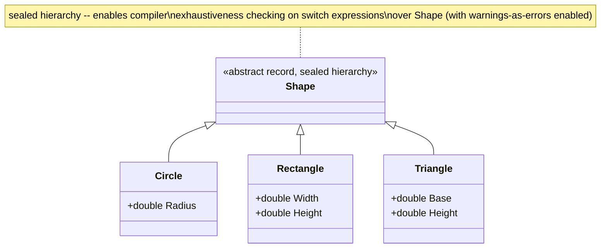
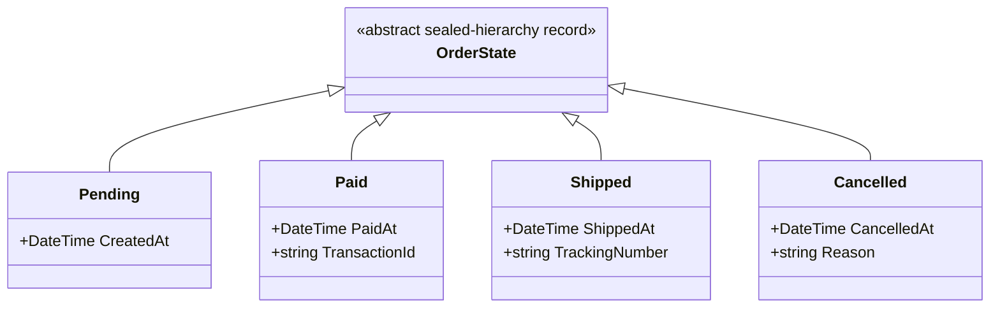
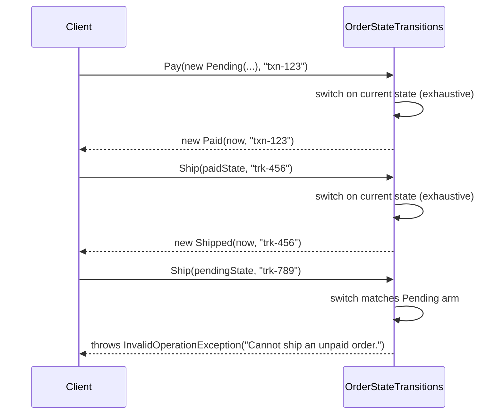

# Module 7 — C# Advanced: Records, Pattern Matching & Immutability

> Domain: C# | Level: Beginner → Expert | Prerequisite: [[06-Generics-Variance]] (`readonly struct`), [[01-CLR-JIT-GC-Memory-Management]] (stack/heap layout), [[04-Delegates-Events-Closures]] (structural equality vs reference equality contrast)

---

## 1. Fundamentals

### What are records?
`record` (C# 9+) is a keyword modifier for `class` or `struct` declarations that instructs the compiler to synthesize **value-based equality** (`Equals`/`GetHashCode`/`==`/`!=` compare all members, not references), a readable `ToString()`, a `with` expression for non-destructive mutation, and (for positional records) deconstruction — all without hand-writing this extremely common but tedious boilerplate.

### What is pattern matching?
Pattern matching (`is`, `switch` expressions, and the growing family of pattern kinds — type patterns, property patterns, positional patterns, relational patterns, list patterns) lets you test a value's **shape** (type, structure, contained values) and simultaneously **extract/bind** parts of it, in a single, declarative, compiler-checked expression — replacing chains of `if`/`is`/cast/property-access code with something closer to how you'd describe the logic in plain English.

### Why do these exist?
- **Records**: Before C# 9, expressing an immutable data-carrying type with correct value equality required manually writing `Equals`, `GetHashCode`, `==`/`!=` operators, a constructor, and often a `ToString()` override — 30-60 lines of mechanical, error-prone boilerplate for what is conceptually "a bag of values that should compare by content." Records make this the *default*, one-line behavior.
- **Pattern matching**: C# historically forced you to combine `is`-checks, casts, and nested `if`s to inspect an object's runtime type/shape — verbose, and easy to get subtly wrong (e.g., forgetting a null check before a cast). Pattern matching unifies "check the shape" and "extract the data" into one syntactic construct, and (via exhaustiveness-related compiler warnings on `switch` over closed type hierarchies) shifts some correctness checking from runtime to compile time.

### When does this matter?
- **Records**: DTOs, value objects (DDD — a later module), message/event payloads (Module 4/5's domain events), configuration objects, anywhere "two instances with the same data should be considered equal" is the desired semantics — which is most data-carrying types in a typical business application.
- **Pattern matching**: State machines, result/error handling (`Result<T>`-style types from Module 6 §13), parsing/interpreting structured data, replacing large `if`/`else if` chains checking an object's runtime type, and — critically — **discriminated-union-style modeling** using sealed hierarchies + exhaustive `switch` expressions, a pattern increasingly central to modern idiomatic C#.
- **Immutability**: Multi-threaded/concurrent code (Module 2) where shared mutable state is a correctness hazard; functional-style data transformation pipelines; anywhere "this value should never change after construction" is a genuine domain invariant, not just a style preference.

### How does it work (30,000-ft view)?

```csharp
public record Point(int X, int Y); // positional record: primary constructor + value equality + deconstruction + ToString + with

var p1 = new Point(1, 2);
var p2 = new Point(1, 2);
Console.WriteLine(p1 == p2);        // True -- value equality, not reference equality
var p3 = p1 with { X = 99 };        // non-destructive mutation: a NEW Point(99, 2), p1 unchanged

string Describe(object shape) => shape switch
{
    Point { X: 0, Y: 0 } => "origin",
    Point(var x, var y) when x == y => $"on the diagonal at {x}",
    Point p => $"({p.X}, {p.Y})",
    _ => "not a point"
};
```

Mental model for interviews: **"`record` is a compiler-generated boilerplate shortcut for value equality + `with`. Pattern matching is a declarative way to check shape and destructure data in one expression, with growing compiler-assisted exhaustiveness checking."**

---

## 2. Deep Dive

### 2.1 What the Compiler Actually Generates for a Record

```csharp
public record Point(int X, int Y);
```
desugars, roughly, to:
```csharp
public class Point : IEquatable<Point>
{
    public int X { get; init; }
    public int Y { get; init; }

    public Point(int X, int Y) { this.X = X; this.Y = Y; }

    public override bool Equals(object? obj) => Equals(obj as Point);
    public bool Equals(Point? other) =>
        other is not null && EqualityContract == other.EqualityContract
        && X == other.X && Y == other.Y;
    public override int GetHashCode() => HashCode.Combine(X, Y);
    public static bool operator ==(Point? a, Point? b) => a?.Equals(b) ?? b is null;
    public static bool operator !=(Point? a, Point? b) => !(a == b);

    public override string ToString() => $"Point {{ X = {X}, Y = {Y} }}";

    public void Deconstruct(out int X, out int Y) { X = this.X; Y = this.Y; }

    protected virtual Type EqualityContract => typeof(Point); // see §2.4

    public virtual Point <Clone>$() => new Point(this); // backing mechanism for `with`
    protected Point(Point original) { X = original.X; Y = original.Y; } // copy constructor
}
```
**Key facts**: `record class` (the default, `record` alone means `record class`) is a **reference type** — instances still live on the heap; only the *equality/ToString/with* semantics change, not the fundamental class-vs-struct memory model from Module 1. `record struct` (C# 10+) applies the same synthesis to a value type instead, giving you a struct with generated value equality (structs already have some value-equality-like default `Equals` via `ValueType.Equals`, but it's slow — reflection-based field comparison — whereas a `record struct`'s generated `Equals` is a fast, direct field-by-field comparison, a genuine, measurable improvement over the default struct `Equals`).

### 2.2 `init`-Only Properties — Compile-Time-Enforced Immutability

`init` (C# 9+) is a property accessor, like `get`/`set`, but callable **only** during object initialization (inside a constructor, or an object-initializer expression `new Point { X = 1, Y = 2 }` immediately following construction) — after that, the property becomes effectively read-only. This is enforced entirely by the compiler (a special `modreq` metadata marker on the setter, `IsExternalInit`), not by any runtime check — attempting `p.X = 5;` after construction is a **compile-time error**, not a runtime exception, giving you immutability with zero runtime enforcement cost.

```csharp
public class Point
{
    public int X { get; init; }
    public int Y { get; init; }
}
var p = new Point { X = 1, Y = 2 }; // OK -- during initialization
p.X = 5; // COMPILE ERROR: init-only property can only be assigned in an object initializer or constructor
```

### 2.3 `with` Expressions — Non-Destructive Mutation Mechanics

```csharp
var p2 = p1 with { X = 99 };
```
compiles to: call the compiler-generated `<Clone>$()` method (a shallow member-wise copy — for `record class`, this is a genuine copy constructor call producing a **new heap object**; for `record struct`, it's a plain value copy, consistent with normal struct-copy semantics) to produce a new instance, then apply the specified property changes via `init` setters on that fresh copy — **the original instance is never mutated**. This is precisely what makes records well-suited to concurrent/functional-style code: `p1` remains fully immutable and safely shared across threads, while `p2` is an independent new value derived from it.

**Critical, frequently-tested detail**: `with` performs a **shallow** copy. If a record contains a **mutable reference-type member** (e.g., a `List<T>` property), `with` copies the *reference* to that same list, not a deep copy of the list's contents — mutating the list through either the original or the `with`-derived copy affects **both**, since they share the same underlying list instance. This is a genuine, common gotcha (§6) that undermines the "immutable" framing if a record's author isn't careful to only use genuinely immutable member types (or defensively deep-copy mutable ones).

### 2.4 `EqualityContract` — Why Record Equality Respects Inheritance Correctly

```csharp
public record Animal(string Name);
public record Dog(string Name, string Breed) : Animal(Name);

Animal a = new Dog("Rex", "Labrador");
Animal b = new Animal("Rex");
Console.WriteLine(a.Equals(b)); // False -- even though "Name" matches, they're different RUNTIME types
```
The compiler-generated `Equals` checks `EqualityContract` (a `protected virtual Type` property, overridden in each derived record to return its own concrete type) **before** comparing member values — this correctly prevents a base-typed `Animal("Rex")` from ever comparing equal to a derived `Dog("Rex", "Labrador")` even when their shared members match, closing a subtle equality-correctness gap that hand-written `Equals` overrides very commonly get wrong (comparing only declared members without checking the runtime type first, leading to asymmetric or type-unsafe equality). This is a genuinely elegant, easy-to-miss piece of the record design worth knowing precisely for Advanced-tier interviews.

### 2.5 Pattern Matching — the Pattern Kind Taxonomy

| Pattern kind | Syntax example | What it checks/extracts |
|---|---|---|
| **Type pattern** | `if (obj is Customer c)` | Runtime type check + safe cast + binding, in one expression (no separate `as` + null-check needed) |
| **Constant pattern** | `case 0:` / `case "abc":` | Equality against a constant |
| **Relational pattern** (C# 9+) | `case > 100:` | Comparison against a constant using `<`, `>`, `<=`, `>=` |
| **Logical patterns** (C# 9+) | `case > 0 and < 100:` / `case not null:` | `and`/`or`/`not` combinators over other patterns |
| **Property pattern** | `case Customer { Age: > 18 }:` | Matches a type AND recursively pattern-matches named properties |
| **Positional pattern** | `case Point(0, 0):` | Uses a type's `Deconstruct` method to match/bind positional elements |
| **List pattern** (C# 11+) | `case [1, 2, .. var rest]:` | Matches array/list shape, length, and individual/slice elements |
| **Var pattern** | `case var x:` | Always matches, binds the value unconditionally (useful combined with `when`) |
| **Discard pattern** | `case _:` | Always matches, binds nothing — the catch-all |

### 2.6 Switch Expressions vs Switch Statements, and Exhaustiveness

```csharp
public enum TrafficLight { Red, Yellow, Green }

string Instruction(TrafficLight light) => light switch
{
    TrafficLight.Red => "Stop",
    TrafficLight.Yellow => "Caution",
    TrafficLight.Green => "Go",
    // No default arm -- if all enum values ARE covered, no warning.
    // If one were missing, the compiler emits CS8509 "the switch expression does not handle all possible values" (a WARNING, not an error, by default)
};
```
**Critical, commonly-mis-stated fact**: C#'s switch-expression exhaustiveness checking produces a **compiler warning** (`CS8509`), not a compile-time **error**, by default — code that doesn't handle every case still compiles and will throw a runtime `SwitchExpressionException` if an unhandled value is actually encountered. Teams wanting true compile-time-enforced exhaustiveness must enable `TreatWarningsAsErrors` (globally or for this specific warning code) — a frequently-missed nuance that separates "I've heard C# has exhaustive pattern matching" from an accurate understanding of exactly what guarantee is (and isn't) actually enforced by default.

**Sealed hierarchies for discriminated-union-style modeling**: C# has no native discriminated union type (as of C# 13; a future "union types" proposal remains under discussion at time of writing), but a common, effective idiom combines a `sealed`/`abstract` base record with a small, closed set of derived records, plus an exhaustive `switch` expression over them — the closest practical approximation available today, and specifically why "seal your hierarchy, don't leave it open for arbitrary extension" matters here beyond ordinary OOP advice (Module 9's OOP module): an open (non-sealed) hierarchy defeats the compiler's ability to reason about exhaustiveness at all, since an unknown future derived type could always violate it.

### 2.7 List Patterns (C# 11+) — Mechanics

```csharp
int[] numbers = { 1, 2, 3, 4, 5 };
string Describe(int[] arr) => arr switch
{
    [] => "empty",
    [var single] => $"one element: {single}",
    [var first, .. var rest] => $"starts with {first}, then {rest.Length} more",
    [.., var last] => $"ends with {last}" // (unreachable here since the previous arm already covers 2+ elements, illustrating pattern ORDER matters)
};
```
The `..` (slice pattern) can appear at most once per list pattern and captures the "remaining" elements as a slice — for arrays, this is genuinely efficient (backed by `Array.Slice`-equivalent mechanics, no unnecessary copying for the check itself, though binding `var rest` does produce a new array/slice); for any type implementing an appropriate `Length`/`Count` + indexer (or `Slice` method) shape, list patterns work generically, not just for arrays — connecting directly to Module 3's `Span<T>` (which also supports list-pattern matching, since it exposes `Length` and an indexer/`Slice`).

---

## 3. Visual Architecture

### Record Equality & `with` Mechanics (ASCII)

```
var original = new Order(1, "Widget", 10) { Tags = new List<string> { "sale" } };
var copy = original with { Quantity = 20 };

┌─────────────────────────┐        ┌─────────────────────────┐
│  original (heap object)  │        │  copy (NEW heap object)  │
│  Id = 1                   │        │  Id = 1                   │
│  Name = "Widget"          │        │  Name = "Widget"           │
│  Quantity = 10  ─────────►│  10    │  Quantity = 20 (CHANGED)   │
│  Tags ────────────────────┼────┐   │  Tags ─────────────────────┼──┐
└─────────────────────────┘    │   └─────────────────────────┘  │
                                 │                                  │
                                 ▼                                  ▼
                          ┌─────────────────────────────────────────┐
                          │  SHARED List<string> { "sale" }          │  <-- shallow copy!
                          │  Mutating via EITHER reference           │
                          │  affects BOTH original and copy          │
                          └─────────────────────────────────────────┘
```

### Pattern Matching Decision Tree (Discriminated-Union-Style Modeling)



---

## 4. Production Example

### Scenario: Order-processing domain model migration to records — a shallow-copy `with` bug

**Problem**: A team migrated their `Order` domain model from a hand-written mutable class to a C# `record`, expecting a clean, immutability-driven simplification. Shortly after, a production bug emerged: modifying a "new" order created via `order with { Status = OrderStatus.Shipped }` was **also silently changing the original order's line-items list** in a way that corrupted the original order's audit history.

**Investigation**:
- The `Order` record had a property `public List<LineItem> LineItems { get; init; }` — a mutable reference type.
- A downstream method took the `with`-derived "shipped" copy and called `.LineItems.Add(new LineItem(...))` to append a "shipping confirmation" pseudo-line-item for record-keeping — intending this mutation to apply only to the new copy.
- Because `with` performs only a **shallow** copy (§2.3), the "new" order's `LineItems` property held the **exact same `List<LineItem>` reference** as the original order — the `.Add(...)` call mutated the one shared list, silently corrupting the original (supposedly immutable, supposedly untouched) order's line items too.

**Architecture fix**:
- Changed `LineItems`'s type from `List<LineItem>` to `ImmutableList<LineItem>` (from `System.Collections.Immutable`), whose "mutation" methods (`.Add`, `.Remove`) **return a new `ImmutableList<LineItem>`** rather than mutating in place — this makes it structurally impossible to accidentally mutate a shared list through either the original or a `with`-derived copy, since there's no in-place mutation method to call at all.
- Audited every other record in the domain model for mutable reference-type members (`List<T>`, arrays, mutable custom classes), converting each to an immutable equivalent (`ImmutableList<T>`, `ImmutableArray<T>`, or a nested `record` for any custom mutable class member) as a systematic pass, not just a one-off fix for `Order`.
- Added a Roslyn analyzer rule flagging any `record` property of a known-mutable collection type (`List<T>`, `Dictionary<K,V>`, `T[]`) as a warning, steering future record designs toward immutable collection types from the start.

**Trade-offs**: `ImmutableList<T>` has different performance characteristics than `List<T>` (structurally-shared persistent data structure — O(log n) for `.Add` rather than `List<T>`'s amortized O(1), and generally higher constant-factor overhead) — accepted for this domain model specifically because `Order` objects are not modified at high frequency/in hot loops, and correctness (guaranteed immutability) mattered far more than raw collection-mutation throughput here; the team explicitly did *not* apply this blanket-wide to every collection in the codebase, reserving `ImmutableList<T>` specifically for records/value objects where the shallow-copy hazard was a real, demonstrated risk.

**Lessons learned**:
1. `with` expressions' shallow-copy semantics are a genuine, non-obvious gotcha that undermines the "records are immutable" mental model the moment a mutable reference-type member is involved — this must be explicitly taught, not assumed obvious from the `record` keyword alone.
2. Immutable collection types (`System.Collections.Immutable`) are the correct pairing for record-based domain models specifically because they close this gap structurally, not just by convention/discipline.
3. A systematic audit (and an enforcing analyzer rule) is more reliable than trusting every future record author to independently remember this specific gotcha.

---

## 5. Best Practices

- **Use `record` (or `record struct` for small, frequently-copied value types) for any type whose primary purpose is carrying data compared by value** — DTOs, domain events, value objects, message payloads. Why: eliminates the substantial, error-prone boilerplate of hand-written value equality.
- **Pair records with immutable collection types (`ImmutableList<T>`, `ImmutableArray<T>`, `ImmutableDictionary<K,V>`) for any reference-type member**, never `List<T>`/arrays/mutable custom classes, unless you've deliberately decided the record is only "shallowly immutable" and documented that trade-off explicitly. Why: closes the `with`-shallow-copy gotcha (§4) structurally.
- **Seal discriminated-union-style record hierarchies** (`Shape` → `Circle`/`Rectangle`/`Triangle`) so the compiler's switch-expression exhaustiveness checking (§2.6) remains meaningful — an open hierarchy can always be extended by a future derived type the exhaustiveness check never anticipated.
- **Enable `TreatWarningsAsErrors` for `CS8509`** (non-exhaustive switch expression) specifically, if your team wants genuine compile-time-enforced exhaustiveness rather than the default warning-only behavior — a small, high-leverage build-configuration decision for any codebase leaning on the discriminated-union idiom.
- **Prefer `is` type-pattern matching over `as` + separate null-check** (`if (obj is Customer c)` instead of `var c = obj as Customer; if (c != null)`) — more concise, and eliminates the class of bug where the null-check is forgotten after an `as` cast.
- **Use positional records/patterns for simple, small, self-evidently-ordered data** (`Point(int X, int Y)`); prefer property patterns (`{ Name: "x", Age: > 18 }`) for larger or less positionally-obvious types, where naming each matched member improves readability over positional order alone.
- **Use `record struct` (not plain `record`/`record class`) for small, high-frequency, short-lived value types** (e.g., a coordinate, a small money/currency pair) where avoiding heap allocation matters — directly applying Module 1's stack-vs-heap and Module 3's low-allocation guidance to the record-design decision.

---

## 6. Anti-patterns

- **Adding a mutable reference-type property (`List<T>`, a mutable custom class) to a record without recognizing the `with`-shallow-copy hazard** (§4's root cause). Fix: use immutable collection types, or a nested immutable/record type for any complex member.
- **Treating `record`'s value equality as automatically deep/recursive-correct for all member types without verifying.** `Equals` compares each member using *that member's own* `Equals` — if a member is a mutable reference type without its own value-equality override (a plain `List<T>`, for instance, which compares by reference, not by element content), two records containing "the same data" in such a member will **not** compare equal via the record's generated `Equals`, since `List<T>.Equals` is reference equality by default. Fix: for records containing collections, use `ImmutableArray<T>`/`ImmutableList<T>` (many of which *do* implement structural/sequence equality appropriately) or be explicit that such members are excluded from/handled specially in equality semantics.
- **Leaving a discriminated-union-style record hierarchy unsealed**, silently defeating exhaustiveness checking (§2.6/§5). Fix: `sealed` (or `abstract` for the base with only sealed leaves) by default for this modeling style, unless genuine open extensibility is a deliberate design goal (rare for this specific pattern).
- **Relying on switch-expression exhaustiveness as a hard guarantee without enabling warnings-as-errors for `CS8509`.** Why it fails: it's a warning by default — code can ship with an unhandled case, only failing at runtime (`SwitchExpressionException`) when that case is actually hit, possibly in production. Fix: `TreatWarningsAsErrors` for this specific diagnostic, at minimum.
- **Using `record class` reflexively for every data type without considering `record struct`** for small, high-frequency value types — inheriting Module 1/3's general stack-vs-heap-allocation guidance; a record's heap-vs-stack placement is still governed by whether it's a `class` or `struct` under the hood, `record` alone doesn't change that fundamental trade-off.
- **Pattern-matching against a base type where a property pattern silently changes behavior after a derived type adds a new property with an unexpected default**, without an exhaustiveness check catching the gap — e.g., adding a new derived record to a hierarchy that an *unsealed* switch elsewhere in the codebase falls through to a `_ => throw new NotSupportedException()` default arm for, silently breaking a previously-working feature at runtime instead of the compiler flagging every affected switch at compile time. Fix: sealed hierarchies + enabled exhaustiveness warnings (again) are what actually protect against this.
- **Overusing deeply nested positional patterns/complex `when` clauses in a single `switch` arm**, producing unreadable, hard-to-review pattern-matching code that defeats the entire "declarative clarity" purpose pattern matching exists for. Fix: extract complex sub-conditions into well-named helper methods/properties referenced from simpler patterns, exactly as you would refactor an overly complex `if` chain.

---

---

---

---

## 10. Interview Questions

### Basic (10)

1. **Q: What does the `record` keyword give you automatically?**
   **A:** Value-based equality (`Equals`/`GetHashCode`/`==`), a readable `ToString()`, and (for positional records) a constructor plus `Deconstruct` — and a `with` expression for non-destructive mutation.

2. **Q: Is a plain `record` (without `struct`) a reference type or a value type?**
   **A:** A reference type — `record` alone means `record class`; only `record struct` is a value type.

3. **Q: What does `with` do?**
   **A:** Creates a new instance that's a copy of the original, with the specified properties changed — the original instance is not mutated.

4. **Q: What is an `init`-only property?**
   **A:** A property that can only be assigned during object initialization (constructor or object initializer) — attempting to assign it afterward is a compile-time error.

5. **Q: How do two record instances with identical property values compare using `==`?**
   **A:** They compare equal (`true`) — records use value-based equality by default, unlike ordinary classes which compare by reference.

6. **Q: What is a positional record?**
   **A:** A record declared with a parameter list directly after its name (`record Point(int X, int Y)`), which generates a primary constructor and properties from those parameters automatically.

7. **Q: What does a type pattern (`is Customer c`) do?**
   **A:** Checks whether a value is of a given runtime type and, if so, safely casts and binds it to a new variable, all in one expression.

8. **Q: What is the difference between a `switch` statement and a `switch` expression?**
   **A:** A `switch` statement executes code per matched case; a `switch` expression (C# 8+) evaluates to a value directly, using `=>` arms instead of `case`/`break`.

9. **Q: What does `_` mean in a switch expression pattern?**
   **A:** The discard pattern — matches anything, typically used as the final "catch-all"/default arm.

10. **Q: Does `record` provide deep immutability automatically?**
    **A:** No — `init`-only properties prevent reassigning the property itself, but if a property's type is a mutable reference type (like `List<T>`), its contents can still be mutated through that reference.

### Intermediate (10)

1. **Q: Why does `with` only perform a shallow copy, and what bug does this cause?**
   **A:** `with` calls a compiler-generated member-wise copy constructor, which copies each field's value directly — for a reference-type field, that means copying the *reference*, not the referenced object, so both the original and the `with`-derived copy end up pointing at the exact same mutable object; mutating it through either instance affects both.

2. **Q: How would you fix the shallow-copy gotcha for a record containing a `List<T>` property?**
   **A:** Replace `List<T>` with an immutable collection type (`ImmutableList<T>`/`ImmutableArray<T>`) whose "mutating" operations return a new collection instead of mutating in place — this makes it structurally impossible to accidentally share and corrupt mutable state between the original and a `with`-derived copy.

3. **Q: What is `EqualityContract`, and what problem does it solve for record inheritance?**
   **A:** A compiler-generated `protected virtual Type` property, overridden per derived record to return its own concrete type; the generated `Equals` checks it before comparing members, correctly preventing a base-typed instance from comparing equal to a derived instance even when their shared members happen to match.

4. **Q: Is switch-expression exhaustiveness checking a compile-time error or a warning by default?**
   **A:** A warning (`CS8509`) — code with an unhandled case still compiles and will throw a runtime `SwitchExpressionException` if that case is actually encountered, unless the team enables warnings-as-errors for it.

5. **Q: Why should a discriminated-union-style record hierarchy be `sealed`?**
   **A:** So the compiler's exhaustiveness checking on switch expressions over the base type remains meaningful — an unsealed hierarchy could always be extended by a future derived type the exhaustiveness check has no way to anticipate.

6. **Q: What's the difference between a property pattern and a positional pattern?**
   **A:** A property pattern matches named properties explicitly (`{ Age: > 18 }`), improving readability for larger/non-obviously-ordered types; a positional pattern matches via a type's `Deconstruct` method in a fixed argument order (`Point(var x, var y)`), suited to small, self-evidently-ordered data.

7. **Q: Why might a record's generated `Equals` fail to consider two records "equal" even though they contain what looks like the same data?**
   **A:** If a member is a reference type that itself compares by reference (like a plain `List<T>`, whose default `Equals` is reference equality, not element-wise), the record's field-by-field `Equals` will compare those members by reference too — two records with "equivalent" but distinctly-instanced lists won't be considered equal unless that member type itself implements proper structural/sequence equality.

8. **Q: What is `record struct`, and when would you prefer it over a plain `record`?**
   **A:** A value-type version of records, giving you fast, generated field-by-field equality (avoiding the slow, reflection-based default `ValueType.Equals` a plain struct falls back to) without heap allocation — prefer it for small, frequently-copied, short-lived value types.

9. **Q: What does the `..` slice pattern do inside a list pattern?**
   **A:** Matches and captures a variable-length "remaining" portion of a list/array, usable at most once per pattern, e.g., `[var first, .. var rest]` matches a non-empty sequence, binding its first element and the rest as a separate collection/slice.

10. **Q: Why is `is Customer c` generally preferred over `var c = obj as Customer; if (c != null)`?**
    **A:** It's more concise and eliminates the risk of forgetting the subsequent null-check after an `as` cast — the pattern match combines the type check and the null-safety guarantee into a single, compiler-verified expression.

### Advanced (10)

1. **Q: Walk through exactly why a record's generated `Equals(object?)` calls `Equals(Point?)` (the strongly-typed overload) rather than doing the comparison inline, and why this matters for performance and correctness.**
   **A:** The strongly-typed `IEquatable<T>.Equals(T?)` overload avoids the need for a runtime type-check/cast when the caller already has a strongly-typed reference (e.g., generic collection code constrained to `IEquatable<T>` can call the fast, direct overload without any `is`/cast overhead) — the `object?`-typed override exists only to satisfy `object.Equals`'s general contract (needed for non-generic collections, boxing scenarios, and `==` operator support against an `object`-typed reference) and simply delegates to the fast path after a safe type check. This mirrors, at the language-feature level, the exact generic-constraint-avoids-casting principle from Module 6 §2.2 — records are, in effect, auto-generating the "provide both a fast strongly-typed path and a general-purpose object-based path" pattern that well-designed hand-written equality code should also follow.

2. **Q: Explain a subtle bug that can arise from mixing records and mutable base classes (non-record base, record-derived, or vice versa), and why the language restricts this combination.**
   **A:** A `record` can only inherit from another `record` (not from a plain `class`, and vice versa — a plain `class` cannot inherit from a `record`) — this restriction exists specifically because the generated equality/`with`/`EqualityContract` machinery (§2.1/§2.4) assumes a consistent, record-aware inheritance chain; mixing a mutable, non-value-equality-based base class into a record hierarchy would make it impossible for the compiler to correctly generate a sound `Equals` (it wouldn't know whether/how to incorporate the base class's own mutable state into value-based comparison) — the restriction is a deliberate design choice preventing an entire category of "the compiler generated equality logic that doesn't actually make sense" bugs, rather than an arbitrary limitation.

3. **Q: How does pattern matching's `when` clause interact with exhaustiveness checking, and what's a scenario where this produces an unexpected compiler warning?**
   **A:** A `when` clause on a `switch` arm makes that arm's applicability conditional at runtime — the compiler's static exhaustiveness analysis **cannot** verify that a set of arms using `when` clauses is truly exhaustive over a given type's possible values (it can't evaluate arbitrary runtime conditions at compile time), so even a switch that a developer believes is fully exhaustive (e.g., `case int n when n >= 0`, `case int n when n < 0` — logically covering every `int`) will still trigger the `CS8509` warning, because the compiler can't prove the two `when` conditions are jointly exhaustive and mutually exclusive. This is a common, initially-confusing false positive that requires either a final unconditional catch-all arm or accepting/suppressing the warning with justification.

4. **Q: Explain how `record struct`'s value equality differs from an ordinary (non-record) struct's default equality, at the implementation level, and quantify why this matters.**
   **A:** An ordinary struct with no custom `Equals` override falls back to `ValueType.Equals(object?)`, which uses **reflection** to compare each field — genuinely slow (reflection overhead on every single equality check) and boxes the `object?` parameter if compared against a value-typed operand not already boxed. A `record struct`'s compiler-generated `Equals` performs **direct, non-reflective field comparison**, compiled to ordinary IL comparisons per field — orders of magnitude faster in practice for equality-heavy code (e.g., using struct-based keys in a `Dictionary<TKey,TValue>` at scale, where `Equals`/`GetHashCode` are called extremely frequently) — this is a concrete, measurable, and commonly under-appreciated practical reason to prefer `record struct` over a plain struct whenever value equality is needed at all, not merely a stylistic preference.

5. **Q: Describe how you would model a discriminated-union-style `PaymentResult` (Success, Declined, RequiresAdditionalVerification) using sealed records, and write the exhaustive switch expression handling all three cases plus enforce compile-time exhaustiveness.**
   **A:**
   ```csharp
   public abstract record PaymentResult;
   public sealed record Success(string TransactionId) : PaymentResult;
   public sealed record Declined(string Reason) : PaymentResult;
   public sealed record RequiresAdditionalVerification(string VerificationUrl) : PaymentResult;

   string Describe(PaymentResult result) => result switch
   {
       Success(var txId) => $"Payment succeeded: {txId}",
       Declined(var reason) => $"Payment declined: {reason}",
       RequiresAdditionalVerification(var url) => $"Verify at: {url}",
       // no discard arm -- relying on exhaustiveness checking to catch any future new derived record
   };
   ```
   With `<WarningsAsErrors>CS8509</WarningsAsErrors>` (or a project-wide `TreatWarningsAsErrors`) set in the `.csproj`, adding a fourth derived record (e.g., `PartialRefund`) anywhere in the codebase without updating this (and every other) exhaustive switch over `PaymentResult` now fails the **build**, not just a runtime exception — converting a "someone forgot to update a switch statement" bug class (which could otherwise ship silently) into a compile-time-caught one, directly demonstrating §5's exhaustiveness-enforcement recommendation in concrete code.

6. **Q: A team's record-based domain events are found, during a compliance audit, to be technically mutable due to the shallow-copy gotcha. Walk through the audit/remediation process you'd lead.**
   **A:** (1) Enumerate every record type used as a domain event/audit-log entry across the codebase; (2) for each, inspect every property's type — flag any mutable reference type (`List<T>`, `Dictionary<K,V>`, a non-`record`/non-immutable custom class) as a genuine-immutability violation; (3) for flagged types, migrate to immutable collection equivalents (`ImmutableList<T>`, etc.) or nested immutable record types, exactly as in §4's fix; (4) add the Roslyn analyzer rule (§4) to prevent regression; (5) for any historically-persisted event data (event-sourcing store, audit log) that might have *already* been mutated due to this gap before the fix, assess (with the compliance/legal stakeholders) whether historical data integrity can be verified retroactively (e.g., via checksums/hashes taken at original write time, if any existed) or whether the gap must be disclosed as a known historical data-integrity risk for the affected time period — this last step is a business/legal/compliance decision, not a purely technical one, and a Principal Engineer's role is surfacing the technical finding clearly enough for that decision to be made by the right stakeholders, not unilaterally deciding it's "probably fine."

7. **Q: Explain why `record`'s auto-generated `ToString()` including every property by default is a deliberate, not accidental, design choice, and the trade-off it represents.**
   **A:** The design goal was maximizing out-of-the-box developer productivity/debuggability for the overwhelmingly common case (DTOs, small value objects) where seeing every property's value in a debugger watch window or a log line is exactly what a developer wants, with zero extra code — the alternative (excluding properties by default, requiring opt-in) would have made the *common* case worse (an unhelpful, uninformative default `ToString()`) to marginally protect the *less common* case (records containing sensitive data). The trade-off is deliberately resolved in favor of productivity-by-default, placing the burden of override-for-security specifically on the narrower set of records that actually contain sensitive data (§8) — a reasonable default design choice, but one that requires teams to actively apply the override discipline rather than assuming the framework protects them here.

8. **Q: How would you design a source generator or analyzer to detect the shallow-copy-with-mutable-member gotcha (§4) automatically across a large codebase, beyond a simple "flag any List<T> property" rule?**
   **A:** A more precise analyzer would: (1) identify all `record`/`record struct` declarations; (2) for each property, determine whether its type is a **known-mutable** reference type — not just `List<T>`/arrays, but any type lacking `readonly`/immutable guarantees (a custom mutable class with public setters, `Dictionary<K,V>`, etc.) — versus a known-immutable one (`string`, primitive types, other `record`s composed entirely of immutable members recursively, `ImmutableList<T>`/`ImmutableArray<T>`, or a type explicitly marked with a custom `[Immutable]` attribute convention); (3) flag properties whose type can't be proven immutable by this analysis, while allowing an explicit suppression/attribute for cases where the team has verified safety through some other means (e.g., a member type that's mutable in general but is only ever used here in a way that's never actually mutated after construction, a narrower and more fragile guarantee the analyzer can't verify but a human reviewer might accept with justification). This is meaningfully more sophisticated than a blanket "no List<T> in records" rule, since it correctly handles nested records-of-records and explicitly-vetted exceptions rather than either over-flagging safe patterns or under-flagging equivalent-risk custom mutable types.

9. **Q: Explain how records interact with nullable reference types (C# 8+'s `#nullable enable`), and a scenario where a positional record's generated constructor produces a compiler warning worth understanding rather than suppressing.**
   **A:** `public record Customer(string Name, string? Email);` — with nullable reference types enabled, the generated primary constructor's parameters directly reflect the declared nullability (`string Name` is non-nullable, `string? Email` is nullable) — if a caller constructs `new Customer(null!, "x")`, forcing a null past the non-nullable `Name` parameter via the null-forgiving operator, the compiler's flow analysis can't track that violation any further once forced, but any **other**, unforced attempt to pass a genuinely-possibly-null reference into `Name` correctly produces a nullability warning at the call site — this is nullable reference types' general compile-time-only, opt-in static analysis nature (not a runtime enforcement mechanism, unlike `init`'s genuine compile-time hard error) applied naturally to record primary constructors, worth understanding precisely so a team doesn't mistake nullable-warning suppression for actual null-safety, which remains only as strong as the discipline of not using `!` (the null-forgiving operator) to silence legitimate warnings.

10. **Q: As a Principal Engineer, you're reviewing a proposal to model an entire event-sourcing system's event store using plain mutable classes instead of records, citing "records have too many gotchas" (referencing the shallow-copy issue). How do you respond?**
    **A:** Push back on the conclusion while validating the underlying concern: the shallow-copy gotcha (§4) is real and worth respecting, but it's a **solved, well-understood problem** (immutable collection member types, an analyzer rule) — abandoning records entirely for an event-sourcing system trades away substantial, directly-relevant benefits (automatic, correct value equality for event comparison/deduplication, concise `with`-based event-versioning/migration code, `EqualityContract`-correct behavior across an event-type hierarchy) in exchange for avoiding a gotcha that a small amount of disciplined type selection (§5) already prevents. The better recommendation: adopt records **with** the immutable-collection-member discipline and the supporting analyzer rule as a package — "records have a gotcha we need to guard against" is a reason to add a guardrail, not a reason to revert to hand-written mutable classes that would need to solve the exact same underlying "keep historical event data genuinely unchanged" problem manually, almost certainly with more code and more opportunities for a *different*, less-well-understood mistake (Module 4/5's recurring theme: don't abandon a well-designed language feature because of one gotcha that has a known, narrow fix — apply the fix).

---

## 11. Coding Exercises

### Easy — Convert a hand-written value class to a record
**Problem**: Simplify this hand-written value class.
```csharp
public class Money
{
    public decimal Amount { get; }
    public string Currency { get; }
    public Money(decimal amount, string currency) { Amount = amount; Currency = currency; }
    public override bool Equals(object? obj) =>
        obj is Money other && Amount == other.Amount && Currency == other.Currency;
    public override int GetHashCode() => HashCode.Combine(Amount, Currency);
    public override string ToString() => $"{Amount} {Currency}";
}
```
**Solution**:
```csharp
public record struct Money(decimal Amount, string Currency);
// record struct: small, frequently-copied value type (per §5) -- gets equality, ToString,
// deconstruction, and 'with' entirely for free, replacing ~10 lines of boilerplate with 1.
```
**Discussion**: `record struct` (not plain `record`) is the right choice here specifically because `Money` is small and likely copied/compared frequently (e.g., in arithmetic-heavy financial calculations) — avoiding heap allocation per Module 1/3's guidance, while still getting fast, non-reflective generated equality (§Advanced Q4) far superior to a plain struct's default `ValueType.Equals`.

### Medium — Fix a shallow-copy bug using immutable collections
**Problem**: Fix this record so `with`-derived copies don't share mutable state.
```csharp
public record ShoppingCart(string CustomerId, List<string> ItemIds); // BUG: shallow-copy hazard
```
**Solution**:
```csharp
using System.Collections.Immutable;

public record ShoppingCart(string CustomerId, ImmutableList<string> ItemIds);

// Usage demonstrating correctness:
var cart1 = new ShoppingCart("cust-1", ImmutableList.Create("item-a", "item-b"));
var cart2 = cart1 with { CustomerId = "cust-2" };

var cart2WithNewItem = cart2 with { ItemIds = cart2.ItemIds.Add("item-c") }; // returns a NEW ImmutableList
// cart1.ItemIds still contains only "item-a", "item-b" -- genuinely untouched, unlike the List<T> version
Console.WriteLine(cart1.ItemIds.Count);           // 2
Console.WriteLine(cart2WithNewItem.ItemIds.Count); // 3
```
**Discussion**: Note that adding an item now requires an explicit `with { ItemIds = ... .Add(...) }` rather than an in-place `.Add()` call — this extra syntactic step is precisely the trade-off that makes the immutability guarantee real rather than illusory; a code reviewer seeing `cart.ItemIds.Add(...)` attempted directly against an `ImmutableList<T>` would immediately notice it doesn't compile (since `Add` returns a new list rather than mutating), which is the exact safety net a mutable `List<T>` never provided in the first place.

### Hard — Implement an exhaustive, sealed discriminated-union-style result type with pattern-matching-based handling
**Problem**: Model an API's possible outcomes (`Ok`, `NotFound`, `ValidationFailed`, `Unauthorized`) as a sealed record hierarchy, and implement a generic handler using exhaustive pattern matching that maps each outcome to an HTTP status code and response body.
```csharp
public abstract record ApiResult;
public sealed record Ok<T>(T Value) : ApiResult;
public sealed record NotFound(string ResourceType, string Id) : ApiResult;
public sealed record ValidationFailed(IReadOnlyList<string> Errors) : ApiResult;
public sealed record Unauthorized(string Reason) : ApiResult;

public static class ApiResultMapper
{
    public static (int StatusCode, object Body) ToHttpResponse(ApiResult result) => result switch
    {
        Ok<object> ok => (200, ok.Value!),
        NotFound(var resourceType, var id) => (404, new { error = $"{resourceType} '{id}' not found" }),
        ValidationFailed(var errors) when errors.Count == 1 => (400, new { error = errors[0] }),
        ValidationFailed(var errors) => (400, new { error = "Multiple validation errors", details = errors }),
        Unauthorized(var reason) => (401, new { error = reason }),
        _ => throw new NotSupportedException($"Unhandled ApiResult type: {result.GetType().Name}")
        // The '_' arm here is a deliberate defensive fallback for the Ok<T> generic-type-matching
        // limitation below, NOT a sign the hierarchy is meant to stay open -- see discussion.
    };
}
```
**Discussion points**: Note the `Ok<object> ok` arm — pattern matching against an open generic record like `Ok<T>` for an *arbitrary* `T` requires matching the non-generic base or using a workaround (since `case Ok<T>:` isn't directly expressible without knowing `T` at the switch site); production code would more commonly make `Ok` non-generic (`sealed record Ok(object Value)`) or use a separate non-generic marker interface (`IApiResult`) that generic `Ok<T>` implements, specifically to keep the exhaustive-switch pattern clean — this exercise deliberately surfaces that friction point as a realistic thing to discuss in an interview, not a limitation to silently paper over. The `_` fallback arm here exists specifically to defensively handle the `Ok<T>`-for-arbitrary-`T` matching gap (a real limitation, not a "the hierarchy might grow" hedge) — in a design using the non-generic `Ok` alternative, that `_` arm could be removed entirely and `CS8509`'s exhaustiveness warning would then genuinely enforce hierarchy completeness, exactly per §5/Advanced Q5's guidance.

### Expert — Design a generic, allocation-conscious `Either<TLeft, TRight>` discriminated union using record structs and pattern matching
**Problem**: Implement a value-type-based `Either<TLeft, TRight>` (a common functional-programming pattern for "one of two possible types" without exceptions-as-control-flow), avoiding heap allocation for the common case, with exhaustive pattern-matching support via `Deconstruct`-style helpers.
```csharp
public readonly record struct Either<TLeft, TRight>
{
    private readonly TLeft? _left;
    private readonly TRight? _right;
    public bool IsLeft { get; }

    private Either(TLeft? left, TRight? right, bool isLeft)
    {
        _left = left; _right = right; IsLeft = isLeft;
    }

    public static Either<TLeft, TRight> Left(TLeft value) => new(value, default, true);
    public static Either<TLeft, TRight> Right(TRight value) => new(default, value, false);

    public TResult Match<TResult>(Func<TLeft, TResult> onLeft, Func<TRight, TResult> onRight) =>
        IsLeft ? onLeft(_left!) : onRight(_right!);

    // Enables: if (either is { IsLeft: true } left) -- a property pattern reading the discriminator
    public bool TryGetLeft(out TLeft value)
    {
        value = _left!;
        return IsLeft;
    }
    public bool TryGetRight(out TRight value)
    {
        value = _right!;
        return !IsLeft;
    }
}

// Usage:
Either<string, int> ParseNumber(string input) =>
    int.TryParse(input, out var n) ? Either<string, int>.Right(n) : Either<string, int>.Left($"'{input}' is not a number");

var result = ParseNumber("42");
string message = result.Match(
    onLeft: error => $"Error: {error}",
    onRight: value => $"Parsed: {value}"
);

// Pattern-matching-friendly alternative to Match, using TryGetLeft/Right with 'is' patterns:
if (result.TryGetRight(out int parsed))
    Console.WriteLine($"Got {parsed}");
```
**Time complexity**: O(1) construction/matching. **Space**: `readonly record struct` — zero heap allocation per `Either` instance (unlike a `class`-based discriminated union, which would allocate per instance); the trade-off is that both `_left` and `_right` fields exist simultaneously in memory (only one is logically "active"), a small, bounded, and generally worthwhile space cost in exchange for avoiding heap allocation for what's often an extremely hot, frequently-constructed type (result/validation types constructed on nearly every method call in a codebase leaning on this pattern).
**Discussion points**: This directly synthesizes Module 6's generic constraints/generics discussion (a doubly-generic `record struct`), Module 3's low-allocation guidance (value-type discriminated union avoiding heap allocation), and this module's pattern-matching/`record struct` equality mechanics — a realistic Expert-tier exercise combining three prior modules' concepts into one cohesive, production-quality utility type, exactly mirroring the kind of cross-module synthesis Staff/Principal interviews probe for.

---

## 12. System Design

*(Narrow application — full System Design has its own module.)*

**Scenario**: Design the event/message payload modeling strategy for an **event-sourced order management system**, where historical events must be genuinely immutable (a hard compliance/correctness requirement, per §8/§9) and new event types must be added over time without breaking exhaustive handling of existing ones.

- **Functional**: Model each domain event (`OrderPlaced`, `OrderShipped`, `OrderCancelled`, etc.) as an immutable record; support replaying a full event history to reconstruct current order state; support adding new event types over the system's multi-year lifetime without silently breaking existing event-handling code.
- **Non-functional**: Historical events must be provably, structurally immutable (not just "immutable by convention") given the compliance stakes (§8's audit scenario); adding a new event type must be a **compile-time-visible** event across every place existing events are exhaustively handled, not a silent runtime gap.
- **Architecture**: Every event type is a `sealed record` (never `record class` left unsealed) deriving from an `abstract record OrderEvent`, with every property typed as either a primitive, `string`, another immutable `record`, or an `ImmutableList<T>`/`ImmutableArray<T>` — enforced by the analyzer rule from §4/§Advanced Q8, applied specifically and strictly to this event-record hierarchy given the compliance stakes. Every event-handling `switch` expression over `OrderEvent` (the event-replay/projection logic) has warnings-as-errors enabled specifically for `CS8509`, so adding a new event type (e.g., `OrderPartiallyRefunded`) without updating every handler fails the build immediately, surfacing the gap to the engineer adding the new event type rather than shipping a silent handling gap.
- **Database/Caching**: Events serialized to the event store use a serialization format/library verified to correctly round-trip `init`-only properties and the immutable collection member types chosen (verified explicitly, per §8's deserialization note, rather than assumed).
- **Failure handling**: Event replay/projection logic that encounters a genuinely unhandled event type (only possible if the exhaustiveness-enforcement build gate were somehow bypassed, e.g., via a suppressed warning) falls back to an explicit, loud failure (throwing, alerting) rather than silently skipping the unrecognized event — defense in depth beyond the compile-time gate.
- **Monitoring**: New-event-type additions are tracked as a standing, expected part of the system's evolution (a versioned changelog of event types), with the build-time exhaustiveness gate serving as the primary safety mechanism rather than relying on manual cross-referencing of "which handlers need updating" during code review.
- **Trade-offs**: The strict "every event-record member must be immutable, every event-hierarchy switch must be exhaustive-enforced" discipline is genuinely more upfront ceremony than a looser approach — justified specifically by the compliance/audit stakes (§8) that make "this historical event genuinely cannot have been altered" a hard business requirement here, not merely a nice-to-have code-quality preference; a lower-stakes internal event system (e.g., a UI-only "state changed" notification, not persisted/audited) might reasonably accept a looser, less-enforced version of this same pattern.

---

## 13. Low-Level Design

**Scenario**: Design a small, reusable **state-machine modeling toolkit** using sealed records and exhaustive pattern matching, demonstrating this module's concepts as the foundation for a general-purpose design pattern (an idiomatic C# alternative to the classic State design pattern's inheritance-heavy formulation).

### Class Diagram


```csharp
public abstract record OrderState;
public sealed record Pending(DateTime CreatedAt) : OrderState;
public sealed record Paid(DateTime PaidAt, string TransactionId) : OrderState;
public sealed record Shipped(DateTime ShippedAt, string TrackingNumber) : OrderState;
public sealed record Cancelled(DateTime CancelledAt, string Reason) : OrderState;

public static class OrderStateTransitions
{
    // Exhaustive switch encodes EVERY valid transition explicitly -- invalid transitions
    // are represented by simply not having an arm for them, falling to the final
    // exception arm, itself only reachable if a genuinely-unhandled combination occurs.
    public static OrderState Pay(OrderState current, string transactionId) => current switch
    {
        Pending => new Paid(DateTime.UtcNow, transactionId),
        Paid => throw new InvalidOperationException("Order is already paid."),
        Shipped => throw new InvalidOperationException("Cannot pay for an already-shipped order."),
        Cancelled => throw new InvalidOperationException("Cannot pay for a cancelled order."),
        _ => throw new NotSupportedException($"Unhandled state: {current.GetType().Name}")
    };

    public static OrderState Ship(OrderState current, string trackingNumber) => current switch
    {
        Paid => new Shipped(DateTime.UtcNow, trackingNumber),
        Pending => throw new InvalidOperationException("Cannot ship an unpaid order."),
        Shipped => throw new InvalidOperationException("Order is already shipped."),
        Cancelled => throw new InvalidOperationException("Cannot ship a cancelled order."),
        _ => throw new NotSupportedException($"Unhandled state: {current.GetType().Name}")
    };
}
```

### Sequence Diagram


### Design Patterns / SOLID
- **State pattern, reimagined idiomatically**: the classic Gang-of-Four State pattern uses polymorphic `virtual` methods per state class to encode transitions; this record-based approach instead centralizes each transition's *entire* valid-state-mapping logic in one exhaustive `switch`, arguably **more** readable for the common case of "a small, fixed, rarely-changing set of states" since every valid/invalid transition for a given operation is visible in one place rather than scattered across N state classes' individual method overrides — a genuine, debatable trade-off worth discussing explicitly in an interview (readability/locality vs. classic-OOP extensibility-per-state-class) rather than presenting either as unconditionally superior.
- **S**: Each transition method (`Pay`, `Ship`) has exactly one responsibility — computing the next state (or rejecting the transition) for one specific operation.
- **O**: Adding a new order state (e.g., `Refunded`) requires updating every exhaustive switch — deliberately **not** open/closed-principle-compliant in the classic sense, and this is intentional: the entire value of the sealed-hierarchy-plus-exhaustive-switch pattern is that adding a new state is a **loud, compiler-enforced, must-update-every-handler** event, not a silent, open-for-extension one — directly reflecting this module's central "sealed hierarchies enable exhaustiveness, at the cost of easy extensibility" trade-off discussion (§2.6/§5/§6).

### Concurrency & Thread Safety
- Every `OrderState` and every transition function here is purely immutable/functional (no shared mutable state, no side effects beyond the pure state-to-state computation) — inherently thread-safe, directly reusable in concurrent order-processing pipelines without any locking, a natural continuation of §9's immutability-enables-safe-concurrency point.

---

## 14. Production Debugging

### Incident: `with`-shallow-copy data corruption (full deep dive of §4)
- **Symptoms**: Modifying a `with`-derived "new" order silently corrupted the original order's line-item history.
- **Investigation**: Code review traced the mutation to a shared `List<LineItem>` reference between the original and the `with`-derived copy.
- **Tools**: Code review, reasoning about reference-identity (a debugger watch comparing `original.LineItems` and `copy.LineItems`'s object references directly would also have confirmed this immediately).
- **Root cause**: `with`'s shallow-copy semantics combined with a mutable reference-type record member.
- **Fix**: Migrated to `ImmutableList<T>`; added an analyzer rule.
- **Prevention**: Systematic codebase-wide audit for the same pattern in every other record.

### Incident: Silent `switch` exhaustiveness gap after adding a new derived record
- **Symptoms**: A newly-added `PaymentResult` variant (`PartiallyRefunded`) caused a specific reporting feature to silently show incorrect/blank data for affected transactions, with no exception, no error log.
- **Investigation**: Traced to an exhaustive-looking `switch` expression over `PaymentResult` in the reporting feature's code that had a final `_ => "Unknown"` discard arm instead of relying on (and failing loudly via) genuine exhaustiveness checking — the new `PartiallyRefunded` case silently fell into the generic `"Unknown"` arm rather than being handled correctly, and because the discard arm compiled without any warning at all, the gap was entirely invisible until a user noticed the wrong report output.
- **Root cause**: A `_` discard arm masking the exhaustiveness warning that would otherwise have caught this at compile time when `PartiallyRefunded` was introduced — directly the anti-pattern flagged in §6.
- **Fix**: Removed the discard arm from this and audited every other exhaustive-in-intent switch over `PaymentResult` across the codebase, replacing defensive discard arms with either genuine per-case handling or, where a true "impossible case" fallback is legitimately needed, an explicit `throw` (which still lets `CS8509` fire for genuinely missing cases, unlike a silent `_ => defaultValue` arm).
- **Prevention**: Enabled warnings-as-errors for `CS8509` project-wide; added a code-review guideline specifically discouraging `_ => someDefaultValue` discard arms on switches over sealed discriminated-union-style hierarchies, reserving discard arms for switches over genuinely open/unbounded types (e.g., arbitrary `string` values) where exhaustiveness was never a meaningful concept in the first place.

### Incident: Sensitive data leaked via record's default `ToString()` in application logs
- **Symptoms**: A security audit discovered that plaintext session tokens were appearing in application logs, traced to a logging statement doing `_logger.LogInformation("Processing request: {Request}", request)` where `request` was a record containing a `SessionToken` property.
- **Investigation**: Confirmed the structured-logging framework's default formatting invoked the record's auto-generated `ToString()` (or an equivalent structural serialization respecting the same "log every property" default), which included the token property verbatim.
- **Root cause**: Relying on a record's convenient default `ToString()`/structural logging behavior for a type that happened to contain a genuinely sensitive property, exactly the risk flagged in §8.
- **Fix**: Added an explicit `ToString()` override (and a corresponding custom structured-logging redaction, since some structured-logging frameworks bypass `ToString()` entirely in favor of their own property-enumeration) redacting `SessionToken` specifically; audited every other record type touching authentication/PII for the same gap.
- **Prevention**: A custom analyzer rule flagging any record property named/tagged as sensitive (via a `[Sensitive]` attribute convention introduced as part of this remediation) that lacks a corresponding `ToString()`/logging-redaction override.

### Incident: `record struct` large-size performance regression
- **Symptoms**: A newly-introduced `record struct` representing a moderately large value (several `decimal` and `DateTime` fields, migrated from a smaller original design) caused a measurable throughput regression in a hot loop that passed many instances of it by value into helper methods.
- **Investigation**: BenchmarkDotNet comparison (run reactively, after the regression was noticed via production profiling — should have been run proactively before merging a size-increasing change to a hot-path value type) confirmed the struct's growing size (now comfortably over typical "small struct" guidance, several dozen bytes) meant each by-value pass was copying a meaningfully larger block of memory on every call, compounding across the hot loop's high call frequency.
- **Root cause**: A `record struct` allowed to grow past the point where "small, cheap-to-copy value type" (its original justification, per §5) remained true, without anyone re-evaluating that original design assumption as the type's field count grew over time.
- **Fix**: Passed the struct by `in`/`ref readonly` (Module 3's low-level performance features, directly reused here) at the specific hot-call-site to avoid the repeated full-value copy, and flagged the struct's continued growth as a signal to reconsider whether it should become a `record class` instead if it keeps growing.
- **Prevention**: A team guideline (and, ideally, an analyzer warning on structs exceeding a size threshold) revisiting the `record struct` vs. `record class` choice whenever a value type's field count/size grows significantly past its original design point — the right choice at initial design time isn't guaranteed to remain right as a type evolves, and nothing automatically re-validates that assumption without a deliberate trigger.

---

## 15. Architecture Decision

**Decision**: Choosing how to model a growing set of "one of several possible outcomes" types (validation results, API responses, state-machine states) across a codebase.

| Option | Advantages | Disadvantages | Cost | Complexity | Maintainability | Performance | Scalability | Ops Overhead |
|---|---|---|---|---|---|---|---|---|
| **A. Enum + a big shared class with nullable "which fields apply" properties** | Simple, familiar, no new language features needed | Allows invalid states (fields that apply to one enum value can be non-null when they logically shouldn't be); no exhaustiveness checking at all; error-prone | Low upfront | Low upfront | Low (grows fragile as cases increase) | Good | N/A | Low upfront, high defect-rate cost |
| **B. Sealed record hierarchy + exhaustive switch expressions (this module's recommended pattern)** | Makes invalid states unrepresentable (each variant only has the fields relevant to it); compiler-enforced exhaustiveness (with warnings-as-errors) catches missed handling of new cases at build time | Requires warnings-as-errors discipline to get the full guarantee; adding a case requires touching every handler (deliberately, per §13) | Low-Medium | Medium | High | Good | Good | Low-Medium |
| **C. Full class-based State/Visitor design pattern (classic GoF, polymorphic dispatch)** | Very familiar to OOP-trained engineers; naturally extensible (new state = new class, no existing code touched) | "Naturally extensible" is often the *wrong* property for domains wanting exhaustiveness (§13's discussion) — adding a new case can silently compile without every consumer handling it, unless a Visitor pattern's own compile-time-checked double-dispatch is used correctly (itself more ceremony than records+switch) | Medium | Medium-High | Medium | Good | Good | Medium |

**Recommendation**: **Option B** as the default for any "one of a small, deliberately fixed set of outcomes" modeling need (validation results, API responses, well-understood state machines) — the combination of "invalid states unrepresentable" (each record only carries its own relevant data) and compiler-enforced exhaustiveness is precisely the correctness property most valuable for this class of domain modeling, and is both less ceremony and arguably more readable than a full Visitor-pattern equivalent (Option C) for the common case. **Option A should be actively avoided** for new code — it reproduces exactly the "invalid state representable, no compile-time safety net" problems records+pattern-matching exist to solve. **Option C** remains legitimate specifically when genuine *open* extensibility (third parties/plugins adding new cases without recompiling/touching the original codebase — Module 4's plugin-hosting scenario) is a real, deliberate requirement, which is the opposite design goal from Option B's closed, exhaustively-checked hierarchy.

---

## 16. Enterprise Case Study

**Inspired by**: The broad, well-documented adoption pattern of F#-influenced idioms (discriminated unions, exhaustive pattern matching, immutability-by-default) migrating into mainstream C# usage as the language added records (C# 9) and pattern matching (C# 7-11) — extensively discussed in Microsoft's own C# language design team blog/notes (Mads Torgersen's public writing on the design rationale for records and pattern matching explicitly cites F#'s discriminated unions and pattern matching as direct inspirations), and widely reflected in modern ASP.NET Core/minimal-API sample code and Microsoft's own reference architectures (eShopOnContainers, eShop).

- **Architecture**: Teams with engineers cross-trained in F# (or functional programming generally) at companies with mixed .NET language stacks were early, vocal adopters of the records+pattern-matching idiom for exactly the discriminated-union-style modeling this module covers — bringing "make invalid states unrepresentable" as an explicit design philosophy into C# codebases that had previously modeled the same domains with enums-plus-nullable-fields (Option A in §15) or inheritance-heavy class hierarchies without value equality.
- **Challenge**: Teams without functional-programming background frequently under-utilized records for years after their release — using them as "classes with less boilerplate" (a real, valid benefit) while missing the deeper discriminated-union/exhaustiveness-checking pattern entirely, since the language doesn't force this usage style, it only enables it — a pattern of "a powerful feature adopted only at its shallowest, most obvious level" that recurs across many language-feature adoptions industry-wide, not unique to records.
- **Scaling lesson**: The full value of this module's central pattern (sealed hierarchies + exhaustive, warnings-as-errors-enforced switches) requires **deliberate team education and codebase-wide convention-setting** — it does not emerge automatically just from using the `record` keyword; a team can use records extensively for years while never actually gaining the compile-time exhaustiveness safety net this module treats as the pattern's central value, simply because no one enabled the relevant warning-as-error setting or established the sealed-hierarchy convention.
- **Lesson for principal engineers**: When introducing records/pattern matching to a team, explicitly teach and enforce the *discriminated-union usage pattern* (sealed hierarchies, exhaustiveness-as-error) as a distinct, deliberate architectural convention — separately from "records reduce equality boilerplate" (which teams tend to discover and adopt organically without prompting) — since the former requires active, top-down convention-setting to actually materialize, while the latter tends to spread through a codebase on its own.

---

## 17. Principal Engineer Perspective

- **Business impact**: The shallow-copy gotcha and the exhaustiveness-warning-not-error default are both "silent until they cause a real incident" risk categories — precisely the kind of thing a Principal Engineer should proactively close via analyzer rules and build-configuration changes rather than relying on every engineer independently remembering both nuances from a training session months earlier.
- **Engineering trade-offs**: The sealed-hierarchy-plus-exhaustive-switch pattern deliberately trades "easy to extend without touching existing code" (classic OOP's open/closed principle) for "the compiler forces you to touch every handler when adding a new case" — the right choice depends entirely on whether the domain's actual requirement is closed-and-exhaustively-known (favor records+switch) or genuinely open-for-third-party-extension (favor classic polymorphism/Visitor) — a Principal Engineer's job is correctly diagnosing which shape a given domain actually has, not applying one pattern reflexively.
- **Technical leadership**: Explicitly teach the discriminated-union usage style (not just "records reduce boilerplate") when introducing records to a team, per §16's lesson — the deeper, more valuable pattern doesn't spread on its own and needs deliberate advocacy.
- **Cross-team communication**: Frame the "why seal your hierarchy and enable warnings-as-errors" recommendation in terms of the concrete failure it prevents ("if someone adds a new order state six months from now, we want the build to fail immediately everywhere that needs updating, not a silent gap discovered by a customer") rather than as an abstract type-theory argument about exhaustiveness.
- **Architecture governance**: Require the sealed-hierarchy + exhaustive-switch + immutable-collection-member conventions as a documented standard for any new discriminated-union-style/event-sourcing-style domain modeling, with the supporting analyzer rules enforced in CI — converting hard-won, easily-forgotten nuances (§4, §6, §14's incidents) into structural guarantees rather than tribal knowledge.
- **Cost optimization**: Catching a missing-case bug at build time (via enforced exhaustiveness) costs a few minutes of a developer's time updating a switch statement; catching the same gap in production (per §14's silent-report-corruption incident) costs incident response, customer trust, and potentially a compliance/audit finding if the affected domain is compliance-sensitive (§8/§12) — an easy, concrete ROI case for the small build-configuration investment.
- **Risk analysis**: Treat any record used for compliance-sensitive/historical/audit data as requiring the full immutable-member-type discipline (§4/§8/§12) as a non-negotiable review gate, not a best-effort suggestion — the business/legal stakes of a compliance audit discovering a records-based audit trail was only shallowly immutable (§Advanced Q6) are substantially higher than an ordinary correctness bug.
- **Long-term maintainability**: Document, at the declaration of any sealed discriminated-union-style hierarchy, that new cases require updating every exhaustive switch by design (not as an oversight to work around) — so a future engineer doesn't "fix" a `CS8509` warning by adding a defensive `_` discard arm (exactly the anti-pattern in §14's second incident) that silently defeats the entire pattern's purpose going forward.

---

## 18. Revision

### Key Takeaways
- `record` synthesizes value-based equality, `ToString()`, deconstruction, and `with` — eliminating substantial hand-written boilerplate; `record` alone means `record class` (reference type), `record struct` is the value-type variant.
- `with` performs a **shallow** copy — mutable reference-type members are shared, not copied, between the original and the derived copy; pair records with immutable collection types to close this gap.
- `EqualityContract` ensures record equality correctly respects runtime type across inheritance, preventing base/derived instances with matching shared members from incorrectly comparing equal.
- Switch-expression exhaustiveness (`CS8509`) is a **warning**, not an error, by default — enable warnings-as-errors for it to get a genuine compile-time guarantee.
- Sealed hierarchies + exhaustive switches are the practical, idiomatic C# approximation of discriminated unions — the pattern's full value requires deliberate team convention-setting, not just using the `record` keyword.
- Pattern matching (type, property, positional, relational, list patterns) unifies shape-checking and data-extraction into single, declarative, compiler-checked expressions.

### Interview Cheatsheet
- `record` = value equality + `ToString` + `with` + deconstruction, synthesized by the compiler; `record class` (default) is a reference type, `record struct` is a value type.
- `with` = shallow copy — the #1 gotcha to name unprompted when discussing records.
- `CS8509` = non-exhaustive switch expression warning, not an error, by default.
- `record struct`'s generated `Equals` is fast/direct (no reflection), unlike a plain struct's default `ValueType.Equals`.
- `List<Cat>`/mutable-collection-in-a-record + `with` = the classic shared-mutable-state bug.

### Things Interviewers Love
- Naming the `with`-shallow-copy gotcha unprompted, with the correct fix (immutable collection types).
- Correctly stating that switch exhaustiveness is a warning, not an error, by default — most candidates assume it's a hard compile-time guarantee.
- Explaining `EqualityContract`'s purpose precisely, not just that record equality "works correctly" for inheritance.

### Things Interviewers Hate
- Claiming records are "fully immutable" without the mutable-member caveat.
- Assuming exhaustive pattern matching is always a hard compiler error.
- Treating `record` and `record struct` as interchangeable without acknowledging the reference-type-vs-value-type distinction and its performance implications.

### Common Traps
- Forgetting `with`'s shallow-copy semantics when a record contains any mutable reference-type member.
- Relying on switch exhaustiveness as an enforced guarantee without enabling warnings-as-errors.
- Using a `_ => defaultValue` discard arm on a switch intended to be exhaustive, silently defeating the exhaustiveness check for any future new case (§14's second incident).

### Revision Notes
Cross-reference [[06-Generics-Variance]] §2.2 (constrained generics avoiding boxing — mirrors this module's `record struct` fast-equality-without-reflection point) and [[01-CLR-JIT-GC-Memory-Management]] (stack/heap placement — still governed by `class` vs `struct`, `record` doesn't change that fundamental model) before an interview. This module's discriminated-union pattern (§2.6/§5/§13) is an increasingly central idiom in modern C# codebases — expect it to surface again when the course reaches Domain-Driven Design, CQRS, and Event Sourcing modules later in the curriculum, where immutable record-based events/commands are the standard building block.

---

**Next**: Continuing autonomously to Module 8 — Exception Handling & Custom Exception Design, which will complete the core `01-CSharp` domain before moving to `02-DotNet-AspNetCore`.
