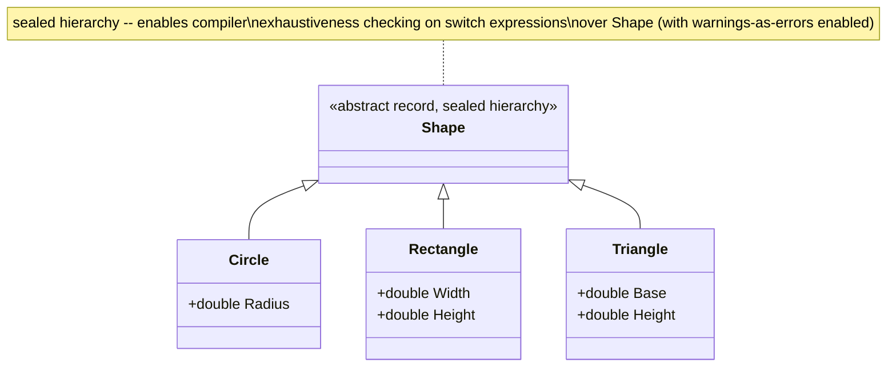
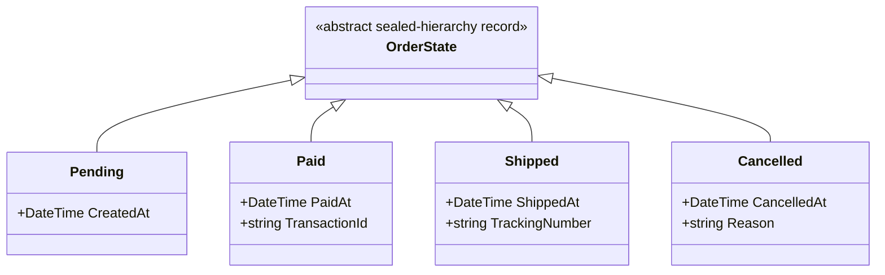
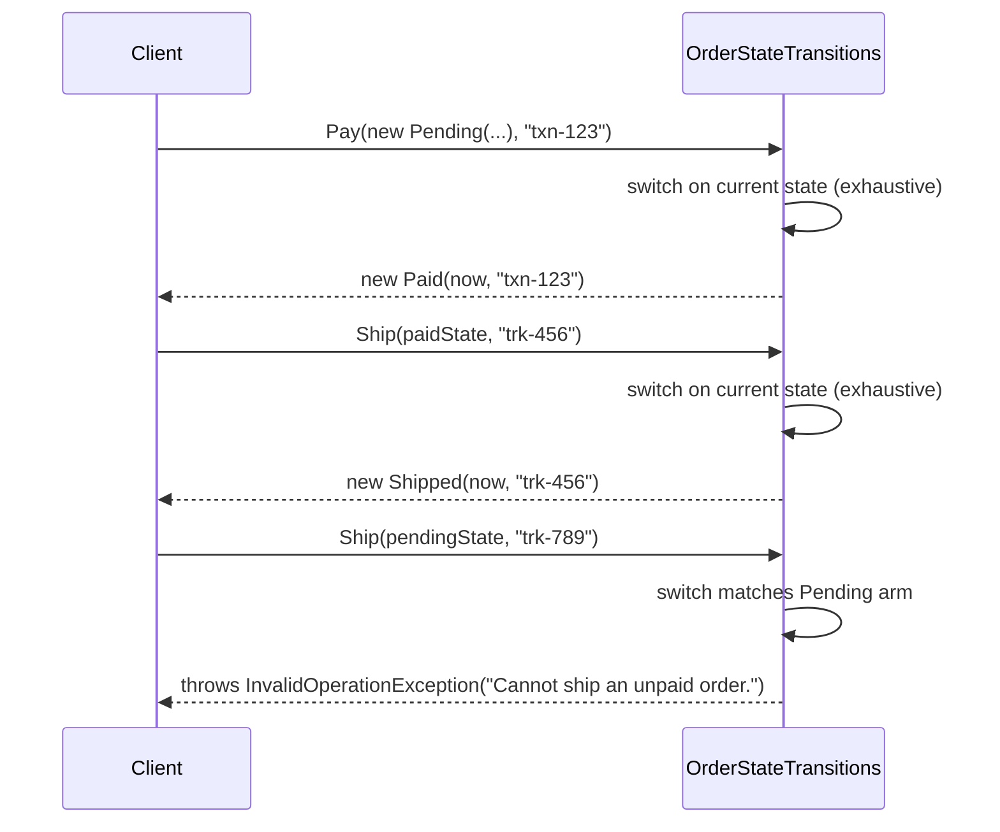

# Module 7 — C# Advanced: Records, Pattern Matching & Immutability

> Domain: C# | Level: Beginner → Expert | Prerequisite: [[06-Generics-Variance]] (`readonly struct`), [[01-CLR-JIT-GC-Memory-Management]] (stack/heap layout), [[04-Delegates-Events-Closures]] (structural equality vs reference equality contrast)

---

## 1. Topic Description

### Definition

A **record** is a type for which the compiler synthesises *value-based* identity: structural `Equals` and `GetHashCode` over all instance fields, an `==` pair delegating to them, a readable `ToString`, a copy constructor plus a `<Clone>$` method that `with` expressions invoke, and — for record classes — a virtual `EqualityContract` so a derived instance never compares equal to a base one. **Pattern matching** is the language's facility for branching on the *shape* of a value rather than on a type test followed by a cast, with the compiler able to reason about exhaustiveness. **Immutability** is the design discipline both features exist to support: state that cannot change after construction needs no synchronisation, is safe to cache and share, and cannot be corrupted by aliasing.

### Core sub-concepts

- **`record class` / `record struct` / `readonly record struct`** — reference versus value semantics, allocation versus copying, nullability.
- **Compiler-generated members** — structural equality, `Deconstruct`, copy constructor, `<Clone>$`, `EqualityContract` and record inheritance.
- **`with` expressions** — shallow copying, and why aliasing of mutable members defeats it.
- **`init`-only setters and `required` members** — construction-time-only assignment, forced initialisation, and their interaction with serialisers.
- **Shallow vs deep immutability** — `init` constrains the member, not the object it references.
- **Pattern forms** — constant, type/declaration, `var`, property, positional, relational, logical (`and`/`or`/`not`), list and slice patterns.
- **`switch` expressions and exhaustiveness** — completeness analysis, closed hierarchies, and the cost of a silent discard arm.
- **Immutable collections** — `IReadOnlyList<T>` as a *view* versus `ImmutableArray<T>` / `ImmutableList<T>` as a *guarantee*, and their opposite read/write cost profiles.
- **Hash stability** — why a mutable object is unusable as a dictionary key, and why a record with a mutable member is worse than it looks.
- **Snapshot-and-swap concurrency** — lock-free reads over an immutable object published by atomic reference assignment.
- **Value objects vs entities** — value equality versus identity equality as a domain-modelling decision.

### Where it fits

These features sit at the modelling layer and propagate outward: they determine what a DTO, an event payload, a domain value object and a cache entry actually guarantee. Downward they depend on the allocation model (`with` allocates; `record struct` copies) covered in `01`, and on generic and equality machinery from `06`. Upward they shape concurrency strategy — immutable cache entries remove the hardest question in caching — and API contracts, because a positional record's parameter *names* become its wire format.

### Why it matters at scale

The failures are quiet rather than loud. A record containing a `List<T>` used as a cache key never produces a hit, because the member's `Equals` is reference equality — so a caching layer silently degrades to a pass-through and nobody notices except the database. A mutable object used as a dictionary key becomes unreachable when its hash changes, so entries are "present but lost". A `with` expression assumed to be a deep clone produces two objects sharing mutable state, which under concurrency corrupts data in a way that reproduces only under load. And renaming a positional record parameter — a refactor the IDE presents as safe — is a breaking wire-format change for every consumer.

### Common pitfalls / anti-patterns

- **A record with a collection or array member expected to have structural equality** — reference equality on the member means two identical-looking records never compare equal and hash differently.
- **Treating `with` as a deep clone** — it is a shallow copy, so mutable referenced state is shared between the original and the copy.
- **Assuming `init` means immutable** — it prevents reassignment of the member only; an `init`-only `List<T>` is fully mutable through its own API.
- **Using a record for an entity** — value equality on something with genuine identity breaks set operations, dictionaries and ORM change tracking, because two distinct entities compare equal.
- **Returning `IReadOnlyList<T>` over a `List<T>` someone else still holds** — communicates a guarantee you are not keeping; the contents can change under the consumer.
- **A `switch` expression with a discard arm returning a default** — silences the exhaustiveness warning, so a newly-added case is handled by the fallback instead of being flagged at compile time.
- **Building an `ImmutableArray<T>` item by item** — every add copies the whole array, producing quadratic behaviour where a builder-then-freeze pattern is linear.

> Scope note: boxing and allocation costs belong to `01-CLR-JIT-GC-Memory-Management`; `readonly struct` and `in` for copy avoidance to `03-Span-Memory-Low-Allocation`; generic constraints and variance to `06-Generics-Variance`; exception design to `08-Exception-Handling-Custom-Exceptions`.

---

## 2. Beginner (10 Q&A)


**Q1. What does the compiler actually generate for a `record`?**
**A:** A class (or struct) with value-based `Equals` and `GetHashCode` comparing every instance field, an `==`/`!=` pair delegating to `Equals`, a readable `ToString`, a protected copy constructor plus a synthesised `<Clone>$` method that `with` expressions call, a `Deconstruct` if it has a positional parameter list, and — for record classes — a virtual `EqualityContract` property used to compare runtime types. That last piece is what makes record equality behave correctly under inheritance. Everything else about a record is an ordinary type: it can have methods, interfaces, and its own members.
*Follow-up: Why is `EqualityContract` needed rather than just comparing `GetType()`?*

**Q2. What does a `with` expression do, and what is the trap?**
**A:** It creates a new instance by copying every field from the original and then applying the specified changes — a shallow copy. The trap is exactly that shallowness: if the record holds a reference to a mutable object, the copy shares it, so mutating through one instance is visible through the other. People reach for `with` expecting the safety of a deep clone and get aliasing instead. The discipline is to make records hold only immutable members, so shallow copying is genuinely safe.
*Follow-up: How would you implement a deep copy for a record that must hold a mutable collection?*

**Q3. `record class` versus `record struct` — how do you choose?**
**A:** `record class` gives reference semantics with value equality: passed by reference, allocated on the heap, `null` is possible. `record struct` gives value semantics throughout: copied on assignment, no allocation when used as a local, cannot be null. Choose the struct for small immutable values used in high volume — money amounts, coordinates, identifiers — where allocation matters and copying is cheap; choose the class for anything larger, anything that may be null, or anything used polymorphically. The size threshold matters because a large struct is copied on every pass, which can cost more than the allocation you avoided.
*Follow-up: Why should a `record struct` almost always be declared `readonly`?*

**Q4. Does `init` make an object immutable?**
**A:** No — it makes the *property* settable only during construction or object-initialisation, which prevents reassignment of that member afterwards. It says nothing about the object the member refers to: an `init`-only `List<T>` property is fully mutable through its own API, so the containing object is not immutable in any useful sense. Real immutability requires that every reachable member is itself immutable, which usually means immutable collection types and records all the way down. Confusing shallow and deep immutability is the most common misunderstanding in this area.
*Follow-up: How would you enforce deep immutability for a type used as a cache key?*

**Q5. What is the difference between `IReadOnlyList<T>` and `ImmutableArray<T>`?**
**A:** `IReadOnlyList<T>` is a read-only *view*: it prevents the holder from mutating through that interface, but if it is backed by a `List<T>` that someone else still references, the contents can change underneath. `ImmutableArray<T>` is a *guarantee*: the data cannot change, so it is safe to share across threads and to cache without defensive copying. The distinction matters most at API boundaries — returning `IReadOnlyList<T>` over your internal list communicates a promise you are not actually keeping, which is a real source of concurrency bugs.
*Follow-up: What is the cost of `ImmutableList<T>` versus `ImmutableArray<T>`, and when is each right?*

**Q6. Walk me through the pattern forms you'd expect to see in modern C# code.**
**A:** Type and declaration patterns (`is Customer c`) replacing test-then-cast; property patterns (`is { Status: Active, Balance: > 0 }`) which read as assertions about shape; positional patterns using `Deconstruct`; relational and logical patterns (`is >= 18 and < 65`, `is not null`) which collapse boolean chains; and list/slice patterns for sequences. Combined in a `switch` expression they turn a nested conditional into a table of cases, which is both more readable and checkable by the compiler. The value is not brevity — it is that the intent becomes declarative and the compiler can reason about completeness.
*Follow-up: When does a property pattern become less readable than the equivalent `if` statement?*

**Q7. What does the compiler check about a `switch` expression's exhaustiveness, and where does that help?**
**A:** It warns when the patterns do not provably cover every possible input, so adding a new case to an enum or a new derived type surfaces as a warning at every switch that no longer covers it. That is genuinely valuable: it turns "find everywhere that handles this type" from a search problem into a build problem. It is also why a catch-all discard arm is a mixed blessing — it silences the warning, so adding a case is silently handled by the fallback instead of being flagged. I would use a discard arm that throws for genuinely unexpected input rather than one that returns a default.
*Follow-up: How would you get exhaustiveness checking over a closed hierarchy of classes rather than an enum?*

**Q8. What breaks when you use a mutable object as a dictionary key?**
**A:** The hash code is computed at insertion and used to place the entry in a bucket; if the object then mutates in a way that changes its hash, the entry is in the wrong bucket and lookups fail — the key is present but unreachable, and it may also be found by a different key that now hashes the same. With records this is easy to do accidentally, since a record's generated hash includes every field, so a mutable field silently makes the key unstable. The rule is that keys must be immutable for their entire time in the dictionary, which is one of the strongest practical arguments for value-object immutability.
*Follow-up: A record with a `List<T>` field is used as a key. What actually happens, and why is it worse than it looks?*

**Q9. How does record equality behave with inheritance?**
**A:** The generated equality compares the `EqualityContract` — effectively the runtime type — before comparing fields, so a `Derived` instance is never equal to a `Base` instance even when all the base fields match. That is the correct and least surprising behaviour, and it is why records solve the classic asymmetric-equality problem that hand-written `Equals` overrides usually get wrong. The remaining subtlety is that a record hierarchy still allows a derived type to add fields, so equality semantics depend on the runtime type, which is worth stating explicitly in a domain model.
*Follow-up: Would you allow record inheritance in a domain model at all? Argue your position.*

**Q10. Why do immutable objects simplify concurrency?**
**A:** Because there is no state transition to synchronise: any number of threads can read the same instance with no lock, no memory-barrier reasoning and no risk of observing a half-updated object. Updates become a new instance published with a single atomic reference assignment, which is a far smaller and more analysable surface than fine-grained locking. The cost is allocation per update, so the pattern fits read-heavy data — configuration, snapshots, lookup tables — better than high-frequency mutation. This is the core argument for immutability as an architectural choice rather than a style preference.
*Follow-up: What does "publish by atomic reference swap" require you to be careful about?*

---

## 3. Intermediate (10 Q&A)


**Q1. A record used as a cache key never gets a cache hit despite apparently equal values. Diagnose it.**
**A:** Almost certainly a reference-typed member without value equality — most commonly a `List<T>` or an array, whose `Equals` is reference equality, so two records with identical contents compare unequal and hash differently. It can also be a member whose own type overrides `Equals` but not `GetHashCode`, or a `float`/`double` where computed values differ in the last bit. I would confirm by comparing the two instances member by member and checking `GetHashCode` directly. The fix is to hold immutable collection types with structural equality, or to write explicit `Equals`/`GetHashCode` — and the general lesson is that a record's generated equality is only as good as its members'.
*Follow-up: You need a record with a collection member and structural equality. What are your options and their costs?*

**Q2. When is `record` the wrong choice for a domain type?**
**A:** When the type has *identity* rather than value — an entity whose two instances with identical field values are still different things, such as two customers who happen to share a name and address. Value equality on an entity is actively wrong: it makes two distinct entities compare equal, which corrupts set operations, dictionaries and change tracking. Records are also a poor fit for types with behaviour-heavy invariants that must be enforced across mutation, and for anything an ORM needs to track by identity. The clean split is records for value objects and DTOs, ordinary classes with identity-based equality for entities.
*Follow-up: How would you enforce that split so it doesn't erode as the codebase grows?*

**Q3. What are the serialisation implications of records and `init`-only members?**
**A:** Most modern serialisers handle records via the constructor or `init` setters, but the details bite: `System.Text.Json` needs a parameterless constructor or a matching parameterised one, positional records depend on parameter *names* matching JSON property names, and `required` members change what a deserialiser must supply. Renaming a positional parameter is therefore a wire-format breaking change that looks like a harmless refactor — which is the specific trap worth naming. For any type on a contract boundary I would pin the mapping with explicit attributes and cover it with round-trip tests, so a rename fails a test rather than a consumer.
*Follow-up: How do you evolve a positional record's contract without breaking existing consumers?*

**Q4. When does pattern matching become a design smell rather than an improvement?**
**A:** When a `switch` over derived types appears in several places, each adding behaviour that belongs on the types themselves — that is polymorphism reimplemented as a dispatch table, and every new type requires finding and updating every switch. Pattern matching is right when the behaviour genuinely belongs to the *consumer* rather than the type (rendering, serialisation, translation to another model, anti-corruption layers) or when you are matching over types you do not own. My rule of thumb is that one switch is a legitimate visitor-like boundary; the same switch shape repeated three times means the behaviour should move onto the hierarchy.
*Follow-up: The types come from a third-party library so you can't add methods. What's your approach then?*

**Q5. How would you model a closed set of states so the compiler helps you handle all of them?**
**A:** An abstract base with a private constructor and nested sealed derived records gives a closed hierarchy the compiler can reason about, so a `switch` expression over them warns when a case is unhandled and each state can carry its own data — which an enum cannot. Enums are fine when the states carry no data and exhaustiveness on the enum values is enough, but they let any integer be cast in, so they are not genuinely closed. I would choose the sealed hierarchy for domain states with associated data (a payment that is `Pending`, `Settled(DateTime)`, `Failed(reason)`), because it makes illegal combinations unrepresentable rather than merely discouraged.
*Follow-up: What do you lose with that approach compared to an enum, especially at persistence boundaries?*

**Q6. What is the performance profile of immutable collections, and when do they cost too much?**
**A:** `ImmutableArray<T>` is a thin wrapper over an array — reads are as fast as an array, but every mutation copies the whole thing, so it is ideal for read-mostly data and terrible for incremental building. `ImmutableList<T>` uses a balanced tree, so mutation is O(log n) and does not copy, but reads and enumeration are considerably slower than a `List<T>` and allocate more. The wrong choice shows up as either quadratic behaviour when building an array item by item, or as surprising read cost in a hot loop. Where a collection is built once and read many times, building with a mutable builder and freezing at the end is the right pattern.
*Follow-up: How would you build a large `ImmutableArray<T>` without quadratic copying?*

**Q7. How do you introduce immutability into an existing mutable domain model?**
**A:** Incrementally and from the leaves: convert small value objects — money, dates ranges, identifiers, addresses — to immutable records first, since they are self-contained and low-risk, and their immutability then constrains the aggregates above them. Aggregates and entities usually stay mutable, because their whole purpose is identity with a changing state, so I would not force records on them. The genuinely hard part is any code that mutates shared instances and relies on the mutation being visible elsewhere — that aliasing has to be found and made explicit before immutability can be imposed, and it is usually where the real bugs already are.
*Follow-up: You find code relying on shared-instance mutation for a cache invalidation side effect. How do you unwind it?*

**Q8. What does `required` add, and how does it interact with records and serialisation?**
**A:** It forces the caller to set a member during initialisation, so you get constructor-like guarantees without writing a constructor, which is particularly useful for types with many optional-looking members that are in fact mandatory. It closes the gap where `init` allowed an object to be constructed in an invalid state. The interaction to watch is that serialisers and reflection-based factories must be able to satisfy it, so a type with `required` members may need the appropriate attributes to remain deserialisable — and adding `required` to an existing public type is a breaking change for every caller. It is a good default for new DTOs, a careful change for existing ones.
*Follow-up: `required` versus a parameterised constructor — when would you still prefer the constructor?*

**Q9. What is the concurrency benefit of a snapshot-and-swap pattern, and where does it break down?**
**A:** You hold configuration or lookup data in an immutable object referenced by a single field; readers take the reference and use it lock-free, knowing it cannot change under them, and a writer builds a new instance and swaps the reference atomically. It gives wait-free reads and a simple mental model. It breaks down when updates are frequent enough that rebuilding is expensive, when readers need a *consistent* view across two separately-swapped objects, or when a reader holds the old snapshot long enough that acting on stale data is a correctness problem. Those are all design questions to answer explicitly rather than assume away.
*Follow-up: Two related snapshots must be updated together. How do you make that atomic for readers?*

**Q10. How would you review a PR that converts a set of DTOs to records?**
**A:** I would check what equality now means: records introduce value equality, so anything relying on reference equality — identity comparisons, dictionary usage, change tracking — may silently change behaviour. I would check members for mutable reference types that break both equality and the safety of `with`. I would check contract stability: positional record parameter names become the serialised names, so a rename is a wire break. And I would ask whether these are genuinely values rather than entities, because "convert everything to records" is a common and mistaken sweep. If all of those are clean, it is usually a good change that removes a lot of boilerplate.
*Follow-up: The PR also changes a type used as a dictionary key. What specifically do you check?*

---

## 4. Expert / Architect (10 Q&A)


**Q1. How do you decide, at architecture level, where value semantics belong in a system?**
**A:** By following the domain rather than the language feature: values are things defined entirely by their attributes and interchangeable when equal — money, quantities, date ranges, identifiers, coordinates — while entities have a lifecycle and a distinct identity that persists through change. Getting this wrong produces concrete damage: value semantics on an entity breaks tracking and set operations, and identity semantics on a value forces the code to compare fields by hand everywhere. I would settle this at the modelling stage, encode it in the type system (records for values, identity-based classes for entities), and make it visible in the codebase structure so the distinction survives the people who made it.
*Follow-up: Money is the classic value object, but currency conversion and rounding are behaviour. Where does that live?*

**Q2. What is your position on immutability as a default across a service codebase?**
**A:** Immutable by default at the boundaries and for values, mutable where mutation is the point. Immutable DTOs, events, configuration and value objects eliminate whole classes of aliasing and concurrency bug at essentially no cost, and I would make that the standard. Forcing immutability on entities and aggregates, by contrast, produces awkward rebuild-the-world code and fights both the ORM and the domain, so I would not mandate it. The judgement I would communicate is that immutability is a tool for eliminating shared-mutable-state bugs, and applying it where there is no sharing and no concurrency buys nothing while costing readability and allocation.
*Follow-up: A team wants to go fully immutable including aggregates, functional-core style. Would you approve it?*

**Q3. How do records affect API and event contract evolution?**
**A:** They make some changes look safer than they are. Adding a member to a positional record changes the constructor signature and the deconstruction arity, which is source- and binary-breaking; renaming a positional parameter breaks the serialised contract; and adding `required` breaks every caller. Meanwhile value equality means two events that were previously distinct by reference may now compare equal, which can change deduplication behaviour in a subtle way. For published contracts I would fix the shape explicitly with attributes, keep positional records for internal use and named-property records with `init` for external contracts, and cover the wire format with round-trip contract tests so a refactor cannot silently change it.
*Follow-up: How would you version an event contract expressed as a record without breaking existing consumers?*

**Q4. What are the memory and performance implications of a heavily record-based design at scale?**
**A:** Every `with` is an allocation, so a design that transforms objects through many stages produces one object per stage per item — fine at request scale, potentially significant in a high-throughput pipeline. `record struct` avoids the allocation but introduces copying, which becomes the dominant cost once the struct exceeds a couple of machine words and is passed frequently. Immutable collections add their own overhead, particularly `ImmutableList<T>` in read-heavy loops. My guidance is that record-based transformation is the right default and its cost is invisible in a normal service, but a high-throughput data path should be measured specifically, because that is exactly where "just use `with`" produces gen0 churn worth eliminating.
*Follow-up: You measure a pipeline doing six `with` transformations per item at 50k items/sec. How do you approach it?*

**Q5. Pattern matching versus polymorphism — how would you set guidance for a large team?**
**A:** Polymorphism where the behaviour belongs to the type and the set of types is open, because adding a type should not require editing existing code. Pattern matching where the behaviour belongs to the consumer or the type set is genuinely closed — translation layers, serialisation, rendering, mapping between bounded contexts, and handling types you do not own. The guidance I would write names the smell rather than the rule: the same switch shape appearing in more than two places means the behaviour wants to move onto the hierarchy. I would also require that switches over closed hierarchies avoid a silent default arm, so adding a case produces a compiler warning rather than silently falling through — that single convention is what makes the closed-hierarchy approach safe over years.
*Follow-up: A switch has grown to thirty arms across three files. What's your refactoring approach?*

**Q6. How does immutability change your approach to caching and concurrency at scale?**
**A:** It removes the hardest question in caching, which is what happens when a cached object is mutated by one consumer and observed by another. With immutable entries, sharing is free, no defensive copying is needed on read, and cache entries can be handed out to any number of threads safely. That in turn makes lock-free read paths practical and lets you reason about staleness purely in terms of *when* a snapshot was taken rather than what state it might be in. The cost moves to invalidation and to allocation on update, which is a much better-understood problem. I would treat "cache only immutable objects" as a firm rule, because the alternative — a shared mutable cached object — is a bug class that reproduces only under load.
*Follow-up: A cached object is expensive to rebuild and changes one field frequently. How do you handle that?*

**Q7. How would you migrate a widely-used mutable DTO to an immutable record across many consuming services?**
**A:** Not in one step. I would introduce the immutable type alongside the existing one, add conversions in both directions, and migrate consumers incrementally with telemetry showing who is still on the old type, then deprecate and remove. The dangerous discovery in this kind of migration is consumers who *relied* on mutating the DTO after receiving it — usually to patch a field or to carry extra state — and each of those is a small design conversation rather than a mechanical change. I would find them first by making the old type's setters obsolete, so the compiler produces the list, and I would set a deprecation date with an owner, because these migrations otherwise stall permanently at the last few consumers.
*Follow-up: One consumer mutates the DTO to carry a correlation ID through their pipeline. What do you tell them?*

**Q8. What role do these features play in making illegal states unrepresentable, and where does that principle stop being worth it?**
**A:** Records, `required`, closed hierarchies and pattern exhaustiveness together let you encode a lot of domain rules in types, so invalid combinations fail at compile time rather than in a validator — genuinely valuable for states with real consequences, such as a payment that cannot be both refunded and pending. It stops being worth it when the encoding becomes more complex than the rule it enforces, when the type gymnastics obscure the domain from the people who own it, or when the state legitimately comes from outside the system and must be validated at runtime anyway. My rule is to encode invariants that are stable and central, and to validate the rest at the boundary — over-encoding produces a model only its author can change.
*Follow-up: Where exactly do you put validation for state arriving from an external system, given the type can't represent invalid values?*

**Q9. How do these language features interact with an ORM and a persistence layer?**
**A:** Uncomfortably in places, because ORMs are built around identity, change tracking and mutation, while records are built around value equality and replacement. Value objects map well — owned types or converters handle immutable records cleanly — but making an *entity* a record fights the tracker, since two distinct rows with identical values now compare equal, and updating means replacing rather than mutating. `init`-only members are usually workable via constructors or backing fields, but they add friction. My guidance is records for value objects and read models, ordinary classes for tracked entities, and an explicit mapping layer if the domain model and the persistence model want different shapes — which, in a system large enough to ask this question, they usually do.
*Follow-up: The team wants one set of types for domain, persistence and API. When is that acceptable and when is it not?*

**Q10. How would you introduce these features to a team maintaining an older, mutable codebase without creating inconsistency?**
**A:** Start where the payoff is unambiguous and the blast radius is small: new DTOs and value objects as records, new state machines as closed hierarchies with exhaustive switches. Write down the split — values versus entities — so the choice is a rule rather than an individual preference, since the worst outcome is a codebase where identical concepts are modelled three ways depending on who wrote them. I would explicitly not mandate retrofitting existing types, because a mechanical sweep changes equality semantics across the codebase and the regressions are silent. And I would seed it with one well-reviewed exemplar per pattern, because teams copy the nearest example far more reliably than they read guidance.
*Follow-up: Six months in, half the codebase uses each style. How do you decide whether to converge or accept the split?*

---

## 5. Reference Material

> Retained from the original module: deep-dive internals, diagrams, production examples, exercises, system/low-level design, debugging walkthroughs and the Principal Engineer perspective.

### 1. Fundamentals

#### What are records?
`record` (C# 9+) is a keyword modifier for `class` or `struct` declarations that instructs the compiler to synthesize **value-based equality** (`Equals`/`GetHashCode`/`==`/`!=` compare all members, not references), a readable `ToString`, a `with` expression for non-destructive mutation, and (for positional records) deconstruction — all without hand-writing this extremely common but tedious boilerplate.

#### What is pattern matching?
Pattern matching (`is`, `switch` expressions, and the growing family of pattern kinds — type patterns, property patterns, positional patterns, relational patterns, list patterns) lets you test a value's **shape** (type, structure, contained values) and simultaneously **extract/bind** parts of it, in a single, declarative, compiler-checked expression — replacing chains of `if`/`is`/cast/property-access code with something closer to how you'd describe the logic in plain English.

#### Why do these exist?
- **Records**: Before C# 9, expressing an immutable data-carrying type with correct value equality required manually writing `Equals`, `GetHashCode`, `==`/`!=` operators, a constructor, and often a `ToString` override — 30-60 lines of mechanical, error-prone boilerplate for what is conceptually "a bag of values that should compare by content." Records make this the *default*, one-line behavior.
- **Pattern matching**: C# historically forced you to combine `is`-checks, casts, and nested `if`s to inspect an object's runtime type/shape — verbose, and easy to get subtly wrong (e.g., forgetting a null check before a cast). Pattern matching unifies "check the shape" and "extract the data" into one syntactic construct, and (via exhaustiveness-related compiler warnings on `switch` over closed type hierarchies) shifts some correctness checking from runtime to compile time.

#### When does this matter?
- **Records**: DTOs, value objects (DDD — a later module), message/event payloads (/5's domain events), configuration objects, anywhere "two instances with the same data should be considered equal" is the desired semantics — which is most data-carrying types in a typical business application.
- **Pattern matching**: State machines, result/error handling (`Result<T>`-style types), parsing/interpreting structured data, replacing large `if`/`else if` chains checking an object's runtime type, and — critically — **discriminated-union-style modeling** using sealed hierarchies + exhaustive `switch` expressions, a pattern increasingly central to modern idiomatic C#.
- **Immutability**: Multi-threaded/concurrent code where shared mutable state is a correctness hazard; functional-style data transformation pipelines; anywhere "this value should never change after construction" is a genuine domain invariant, not just a style preference.

#### How does it work (30,000-ft view)?

```csharp
public record Point(int X, int Y); // positional record: primary constructor + value equality + deconstruction + ToString + with

var p1 = new Point(1, 2);
var p2 = new Point(1, 2);
Console.WriteLine(p1 == p2); // True -- value equality, not reference equality
var p3 = p1 with { X = 99 }; // non-destructive mutation: a NEW Point(99, 2), p1 unchanged

string Describe(object shape) => shape switch
{
    Point { X: 0, Y: 0 } => "origin",
        Point(var x, var y) when x == y => $"on the diagonal at {x}",
        Point p => $"({p.X}, {p.Y})",
        _ => "not a point"
};
```

Mental model for interviews: **"`record` is a compiler-generated boilerplate shortcut for value equality + `with`. Pattern matching is a declarative way to check shape and destructure data in one expression, with growing compiler-assisted exhaustiveness checking."**

### 2. Deep Dive

#### 2.1 What the Compiler Actually Generates for a Record

```csharp
public record Point(int X, int Y);
```
desugars, roughly, to:
```csharp
public class Point: IEquatable<Point>
{
    public int X { get; init; }
    public int Y { get; init; }

    public Point(int X, int Y) { this.X = X; this.Y = Y; }

    public override bool Equals(object? obj) => Equals(obj as Point);
    public bool Equals(Point? other) =>
        other is not null && EqualityContract == other.EqualityContract
    && X == other.X && Y == other.Y;
    public override int GetHashCode => HashCode.Combine(X, Y);
    public static bool operator ==(Point? a, Point? b) => a?.Equals(b)?? b is null;
    public static bool operator!=(Point? a, Point? b) =>!(a == b);

    public override string ToString => $"Point {{ X = {X}, Y = {Y} }}";

    public void Deconstruct(out int X, out int Y) { X = this.X; Y = this.Y; }

    protected virtual Type EqualityContract => typeof(Point); //

    public virtual Point <Clone>$ => new Point(this); // backing mechanism for `with`
    protected Point(Point original) { X = original.X; Y = original.Y; } // copy constructor
}
```
**Key facts**: `record class` (the default, `record` alone means `record class`) is a **reference type** — instances still live on the heap; only the *equality/ToString/with* semantics change, not the fundamental class-vs-struct memory model. `record struct` (C# 10+) applies the same synthesis to a value type instead, giving you a struct with generated value equality (structs already have some value-equality-like default `Equals` via `ValueType.Equals`, but it's slow — reflection-based field comparison — whereas a `record struct`'s generated `Equals` is a fast, direct field-by-field comparison, a genuine, measurable improvement over the default struct `Equals`).

#### 2.2 `init`-Only Properties — Compile-Time-Enforced Immutability

`init` (C# 9+) is a property accessor, like `get`/`set`, but callable **only** during object initialization (inside a constructor, or an object-initializer expression `new Point { X = 1, Y = 2 }` immediately following construction) — after that, the property becomes effectively read-only. This is enforced entirely by the compiler (a special `modreq` metadata marker on the setter, `IsExternalInit`), not by any runtime check — attempting `p.X = 5;` after construction is a **compile-time error**, not a runtime exception, giving you immutability with zero runtime enforcement cost.

```csharp
public class Point
{
    public int X { get; init; }
    public int Y { get; init; }
}
var p = new Point { X = 1, Y = 2 }; // OK -- during initialization
p.X = 5; // COMPILE ERROR: init-only property can only be assigned in an object initializer or constructor
```

#### 2.3 `with` Expressions — Non-Destructive Mutation Mechanics

```csharp
var p2 = p1 with { X = 99 };
```
compiles to: call the compiler-generated `<Clone>$` method (a shallow member-wise copy — for `record class`, this is a genuine copy constructor call producing a **new heap object**; for `record struct`, it's a plain value copy, consistent with normal struct-copy semantics) to produce a new instance, then apply the specified property changes via `init` setters on that fresh copy — **the original instance is never mutated**. This is precisely what makes records well-suited to concurrent/functional-style code: `p1` remains fully immutable and safely shared across threads, while `p2` is an independent new value derived from it.

**Critical, frequently-tested detail**: `with` performs a **shallow** copy. If a record contains a **mutable reference-type member** (e.g., a `List<T>` property), `with` copies the *reference* to that same list, not a deep copy of the list's contents — mutating the list through either the original or the `with`-derived copy affects **both**, since they share the same underlying list instance. This is a genuine, common gotcha that undermines the "immutable" framing if a record's author isn't careful to only use genuinely immutable member types (or defensively deep-copy mutable ones).

#### 2.4 `EqualityContract` — Why Record Equality Respects Inheritance Correctly

```csharp
public record Animal(string Name);
public record Dog(string Name, string Breed): Animal(Name);

Animal a = new Dog("Rex", "Labrador");
Animal b = new Animal("Rex");
Console.WriteLine(a.Equals(b)); // False -- even though "Name" matches, they're different RUNTIME types
```
The compiler-generated `Equals` checks `EqualityContract` (a `protected virtual Type` property, overridden in each derived record to return its own concrete type) **before** comparing member values — this correctly prevents a base-typed `Animal("Rex")` from ever comparing equal to a derived `Dog("Rex", "Labrador")` even when their shared members match, closing a subtle equality-correctness gap that hand-written `Equals` overrides very commonly get wrong (comparing only declared members without checking the runtime type first, leading to asymmetric or type-unsafe equality). This is a genuinely elegant, easy-to-miss piece of the record design worth knowing precisely for Advanced-tier interviews.

#### 2.5 Pattern Matching — the Pattern Kind Taxonomy

| Pattern kind | Syntax example | What it checks/extracts |
|---|---|---|
| **Type pattern** | `if (obj is Customer c)` | Runtime type check + safe cast + binding, in one expression (no separate `as` + null-check needed) |
| **Constant pattern** | `case 0:` / `case "abc":` | Equality against a constant |
| **Relational pattern** (C# 9+) | `case > 100:` | Comparison against a constant using `<`, `>`, `<=`, `>=` |
| **Logical patterns** (C# 9+) | `case > 0 and < 100:` / `case not null:` | `and`/`or`/`not` combinators over other patterns |
| **Property pattern** | `case Customer { Age: > 18 }:` | Matches a type AND recursively pattern-matches named properties |
| **Positional pattern** | `case Point(0, 0):` | Uses a type's `Deconstruct` method to match/bind positional elements |
| **List pattern** (C# 11+) | `case [1, 2,.. var rest]:` | Matches array/list shape, length, and individual/slice elements |
| **Var pattern** | `case var x:` | Always matches, binds the value unconditionally (useful combined with `when`) |
| **Discard pattern** | `case _:` | Always matches, binds nothing — the catch-all |

#### 2.6 Switch Expressions vs Switch Statements, and Exhaustiveness

```csharp
public enum TrafficLight { Red, Yellow, Green }

string Instruction(TrafficLight light) => light switch
{
    TrafficLight.Red => "Stop",
        TrafficLight.Yellow => "Caution",
        TrafficLight.Green => "Go",
        // No default arm -- if all enum values ARE covered, no warning.
    // If one were missing, the compiler emits CS8509 "the switch expression does not handle all possible values" (a WARNING, not an error, by default)
};
```
**Critical, commonly-mis-stated fact**: C#'s switch-expression exhaustiveness checking produces a **compiler warning** (`CS8509`), not a compile-time **error**, by default — code that doesn't handle every case still compiles and will throw a runtime `SwitchExpressionException` if an unhandled value is actually encountered. Teams wanting true compile-time-enforced exhaustiveness must enable `TreatWarningsAsErrors` (globally or for this specific warning code) — a frequently-missed nuance that separates "I've heard C# has exhaustive pattern matching" from an accurate understanding of exactly what guarantee is (and isn't) actually enforced by default.

**Sealed hierarchies for discriminated-union-style modeling**: C# has no native discriminated union type (as of C# 13; a future "union types" proposal remains under discussion at time of writing), but a common, effective idiom combines a `sealed`/`abstract` base record with a small, closed set of derived records, plus an exhaustive `switch` expression over them — the closest practical approximation available today, and specifically why "seal your hierarchy, don't leave it open for arbitrary extension" matters here beyond ordinary OOP advice (the OOP module): an open (non-sealed) hierarchy defeats the compiler's ability to reason about exhaustiveness at all, since an unknown future derived type could always violate it.

#### 2.7 List Patterns (C# 11+) — Mechanics

```csharp
int[] numbers = { 1, 2, 3, 4, 5 };
string Describe(int[] arr) => arr switch
{
    [] => "empty",
        [var single] => $"one element: {single}",
        [var first,.. var rest] => $"starts with {first}, then {rest.Length} more",
        [.., var last] => $"ends with {last}" // (unreachable here since the previous arm already covers 2+ elements, illustrating pattern ORDER matters)
};
```
The `..` (slice pattern) can appear at most once per list pattern and captures the "remaining" elements as a slice — for arrays, this is genuinely efficient (backed by `Array.Slice`-equivalent mechanics, no unnecessary copying for the check itself, though binding `var rest` does produce a new array/slice); for any type implementing an appropriate `Length`/`Count` + indexer (or `Slice` method) shape, list patterns work generically, not just for arrays — connecting directly to the `Span<T>` (which also supports list-pattern matching, since it exposes `Length` and an indexer/`Slice`).

### 3. Visual Architecture

#### Record Equality & `with` Mechanics (ASCII)

```
var original = new Order(1, "Widget", 10) { Tags = new List<string> { "sale" } };
var copy = original with { Quantity = 20 };

  ┌───────────────────────────┐        ┌───────────────────────────┐
  │ original (heap object)    │        │ copy (NEW heap object)    │
  │   Id       = 1            │        │   Id       = 1            │
  │   Name     = "Widget"     │        │   Name     = "Widget"     │
  │   Quantity = 10           │        │   Quantity = 20  <- the   │
  │                           │        │                  only     │
  │                           │        │                  change   │
  │   Tags ───────────────────┼───┐    │   Tags ───────────────────┼───┐
  └───────────────────────────┘   │    └───────────────────────────┘   │
                                  │                                    │
                                  └─────────────────┬──────────────────┘
                                                    │
                                                    ▼
                          ┌─────────────────────────────────────────┐
                          │ SHARED List<string> { "sale" }          │
                          │ `with` copied the REFERENCE, not the    │
                          │ list -- mutating via EITHER reference   │
                          │ affects BOTH original and copy          │
                          └─────────────────────────────────────────┘
```

#### Pattern Matching Decision Tree (Discriminated-Union-Style Modeling)


```mermaid
classDiagram
 class Shape {
 <<abstract record, sealed hierarchy>>
 }
 class Circle {
 +double Radius
 }
 class Rectangle {
 +double Width
 +double Height
 }
 class Triangle {
 +double Base
 +double Height
 }
 Shape <|-- Circle
 Shape <|-- Rectangle
 Shape <|-- Triangle
 note for Shape "sealed hierarchy -- enables compiler\nexhaustiveness checking on switch expressions\nover Shape (with warnings-as-errors enabled)"
```

### 4. Production Example

#### Scenario: Order-processing domain model migration to records — a shallow-copy `with` bug

**Problem**: A team migrated their `Order` domain model from a hand-written mutable class to a C# `record`, expecting a clean, immutability-driven simplification. Shortly after, a production bug emerged: modifying a "new" order created via `order with { Status = OrderStatus.Shipped }` was **also silently changing the original order's line-items list** in a way that corrupted the original order's audit history.

**Investigation**:
- The `Order` record had a property `public List<LineItem> LineItems { get; init; }` — a mutable reference type.
- A downstream method took the `with`-derived "shipped" copy and called `.LineItems.Add(new LineItem(...))` to append a "shipping confirmation" pseudo-line-item for record-keeping — intending this mutation to apply only to the new copy.
- Because `with` performs only a **shallow** copy, the "new" order's `LineItems` property held the **exact same `List<LineItem>` reference** as the original order — the `.Add(...)` call mutated the one shared list, silently corrupting the original (supposedly immutable, supposedly untouched) order's line items too.

**Architecture fix**:
- Changed `LineItems`'s type from `List<LineItem>` to `ImmutableList<LineItem>` (from `System.Collections.Immutable`), whose "mutation" methods (`.Add`, `.Remove`) **return a new `ImmutableList<LineItem>`** rather than mutating in place — this makes it structurally impossible to accidentally mutate a shared list through either the original or a `with`-derived copy, since there's no in-place mutation method to call at all.
- Audited every other record in the domain model for mutable reference-type members (`List<T>`, arrays, mutable custom classes), converting each to an immutable equivalent (`ImmutableList<T>`, `ImmutableArray<T>`, or a nested `record` for any custom mutable class member) as a systematic pass, not just a one-off fix for `Order`.
- Added a Roslyn analyzer rule flagging any `record` property of a known-mutable collection type (`List<T>`, `Dictionary<K,V>`, `T[]`) as a warning, steering future record designs toward immutable collection types from the start.

**Trade-offs**: `ImmutableList<T>` has different performance characteristics than `List<T>` (structurally-shared persistent data structure — O(log n) for `.Add` rather than `List<T>`'s amortized O(1), and generally higher constant-factor overhead) — accepted for this domain model specifically because `Order` objects are not modified at high frequency/in hot loops, and correctness (guaranteed immutability) mattered far more than raw collection-mutation throughput here; the team explicitly did *not* apply this blanket-wide to every collection in the codebase, reserving `ImmutableList<T>` specifically for records/value objects where the shallow-copy hazard was a real, demonstrated risk.

**Lessons learned**:
1. `with` expressions' shallow-copy semantics are a genuine, non-obvious gotcha that undermines the "records are immutable" mental model the moment a mutable reference-type member is involved — this must be explicitly taught, not assumed obvious from the `record` keyword alone.
2. Immutable collection types (`System.Collections.Immutable`) are the correct pairing for record-based domain models specifically because they close this gap structurally, not just by convention/discipline.
3. A systematic audit (and an enforcing analyzer rule) is more reliable than trusting every future record author to independently remember this specific gotcha.

### 11. Coding Exercises

#### Easy — Convert a hand-written value class to a record
**Problem**: Simplify this hand-written value class.
```csharp
public class Money
{
    public decimal Amount { get; }
    public string Currency { get; }
    public Money(decimal amount, string currency) { Amount = amount; Currency = currency; }
    public override bool Equals(object? obj) =>
        obj is Money other && Amount == other.Amount && Currency == other.Currency;
    public override int GetHashCode => HashCode.Combine(Amount, Currency);
    public override string ToString => $"{Amount} {Currency}";
}
```
**Solution**:
```csharp
public record struct Money(decimal Amount, string Currency);
// record struct: small, frequently-copied value type -- gets equality, ToString
// deconstruction, and 'with' entirely for free, replacing ~10 lines of boilerplate with 1.
```
**Discussion**: `record struct` (not plain `record`) is the right choice here specifically because `Money` is small and likely copied/compared frequently (e.g., in arithmetic-heavy financial calculations) — avoiding heap allocation /3's guidance, while still getting fast, non-reflective generated equality (§Advanced Q4) far superior to a plain struct's default `ValueType.Equals`.

#### Medium — Fix a shallow-copy bug using immutable collections
**Problem**: Fix this record so `with`-derived copies don't share mutable state.
```csharp
public record ShoppingCart(string CustomerId, List<string> ItemIds); // BUG: shallow-copy hazard
```
**Solution**:
```csharp
using System.Collections.Immutable;

public record ShoppingCart(string CustomerId, ImmutableList<string> ItemIds);

// Usage demonstrating correctness:
var cart1 = new ShoppingCart("cust-1", ImmutableList.Create("item-a", "item-b"));
var cart2 = cart1 with { CustomerId = "cust-2" };

var cart2WithNewItem = cart2 with { ItemIds = cart2.ItemIds.Add("item-c") }; // returns a NEW ImmutableList
// cart1.ItemIds still contains only "item-a", "item-b" -- genuinely untouched, unlike the List<T> version
Console.WriteLine(cart1.ItemIds.Count); // 2
Console.WriteLine(cart2WithNewItem.ItemIds.Count); // 3
```
**Discussion**: Note that adding an item now requires an explicit `with { ItemIds =....Add(...) }` rather than an in-place `.Add` call — this extra syntactic step is precisely the trade-off that makes the immutability guarantee real rather than illusory; a code reviewer seeing `cart.ItemIds.Add(...)` attempted directly against an `ImmutableList<T>` would immediately notice it doesn't compile (since `Add` returns a new list rather than mutating), which is the exact safety net a mutable `List<T>` never provided in the first place.

#### Hard — Implement an exhaustive, sealed discriminated-union-style result type with pattern-matching-based handling
**Problem**: Model an API's possible outcomes (`Ok`, `NotFound`, `ValidationFailed`, `Unauthorized`) as a sealed record hierarchy, and implement a generic handler using exhaustive pattern matching that maps each outcome to an HTTP status code and response body.
```csharp
public abstract record ApiResult;
public sealed record Ok<T>(T Value): ApiResult;
public sealed record NotFound(string ResourceType, string Id): ApiResult;
public sealed record ValidationFailed(IReadOnlyList<string> Errors): ApiResult;
public sealed record Unauthorized(string Reason): ApiResult;

public static class ApiResultMapper
{
    public static (int StatusCode, object Body) ToHttpResponse(ApiResult result) => result switch
    {
        Ok<object> ok => (200, ok.Value!),
            NotFound(var resourceType, var id) => (404, new { error = $"{resourceType} '{id}' not found" }),
            ValidationFailed(var errors) when errors.Count == 1 => (400, new { error = errors[0] }),
            ValidationFailed(var errors) => (400, new { error = "Multiple validation errors", details = errors }),
            Unauthorized(var reason) => (401, new { error = reason }),
            _ => throw new NotSupportedException($"Unhandled ApiResult type: {result.GetType.Name}")
        // The '_' arm here is a deliberate defensive fallback for the Ok<T> generic-type-matching
        // limitation below, NOT a sign the hierarchy is meant to stay open -- see discussion.
    };
}
```
**Discussion points**: Note the `Ok<object> ok` arm — pattern matching against an open generic record like `Ok<T>` for an *arbitrary* `T` requires matching the non-generic base or using a workaround (since `case Ok<T>:` isn't directly expressible without knowing `T` at the switch site); production code would more commonly make `Ok` non-generic (`sealed record Ok(object Value)`) or use a separate non-generic marker interface (`IApiResult`) that generic `Ok<T>` implements, specifically to keep the exhaustive-switch pattern clean — this exercise deliberately surfaces that friction point as a realistic thing to discuss in an interview, not a limitation to silently paper over. The `_` fallback arm here exists specifically to defensively handle the `Ok<T>`-for-arbitrary-`T` matching gap (a real limitation, not a "the hierarchy might grow" hedge) — in a design using the non-generic `Ok` alternative, that `_` arm could be removed entirely and `CS8509`'s exhaustiveness warning would then genuinely enforce hierarchy completeness, exactly /Advanced Q5's guidance.

#### Expert — Design a generic, allocation-conscious `Either<TLeft, TRight>` discriminated union using record structs and pattern matching
**Problem**: Implement a value-type-based `Either<TLeft, TRight>` (a common functional-programming pattern for "one of two possible types" without exceptions-as-control-flow), avoiding heap allocation for the common case, with exhaustive pattern-matching support via `Deconstruct`-style helpers.
```csharp
public readonly record struct Either<TLeft, TRight>
{
    private readonly TLeft? _left;
    private readonly TRight? _right;
    public bool IsLeft { get; }

    private Either(TLeft? left, TRight? right, bool isLeft)
    {
        _left = left; _right = right; IsLeft = isLeft;
    }

    public static Either<TLeft, TRight> Left(TLeft value) => new(value, default, true);
    public static Either<TLeft, TRight> Right(TRight value) => new(default, value, false);

    public TResult Match<TResult>(Func<TLeft, TResult> onLeft, Func<TRight, TResult> onRight) =>
        IsLeft? onLeft(_left!): onRight(_right!);

    // Enables: if (either is { IsLeft: true } left) -- a property pattern reading the discriminator
    public bool TryGetLeft(out TLeft value)
    {
        value = _left!;
        return IsLeft;
    }
    public bool TryGetRight(out TRight value)
    {
        value = _right!;
        return!IsLeft;
    }
}

// Usage:
Either<string, int> ParseNumber(string input) =>
    int.TryParse(input, out var n)? Either<string, int>.Right(n): Either<string, int>.Left($"'{input}' is not a number");

var result = ParseNumber("42");
string message = result.Match(
    onLeft: error => $"Error: {error}",
        onRight: value => $"Parsed: {value}"
);

// Pattern-matching-friendly alternative to Match, using TryGetLeft/Right with 'is' patterns:
if (result.TryGetRight(out int parsed))
    Console.WriteLine($"Got {parsed}");
```
**Time complexity**: O(1) construction/matching. **Space**: `readonly record struct` — zero heap allocation per `Either` instance (unlike a `class`-based discriminated union, which would allocate per instance); the trade-off is that both `_left` and `_right` fields exist simultaneously in memory (only one is logically "active"), a small, bounded, and generally worthwhile space cost in exchange for avoiding heap allocation for what's often an extremely hot, frequently-constructed type (result/validation types constructed on nearly every method call in a codebase leaning on this pattern).
**Discussion points**: This directly synthesizes the generic constraints/generics discussion (a doubly-generic `record struct`), the low-allocation guidance (value-type discriminated union avoiding heap allocation), and this module's pattern-matching/`record struct` equality mechanics — a realistic Expert-tier exercise combining three prior modules' concepts into one cohesive, production-quality utility type, exactly mirroring the kind of cross-module synthesis Staff/Principal interviews probe for.

### 12. System Design

*(Narrow application — full System Design has its own module.)*

**Scenario**: Design the event/message payload modeling strategy for an **event-sourced order management system**, where historical events must be genuinely immutable (a hard compliance/correctness requirement/) and new event types must be added over time without breaking exhaustive handling of existing ones.

- **Functional**: Model each domain event (`OrderPlaced`, `OrderShipped`, `OrderCancelled`, etc.) as an immutable record; support replaying a full event history to reconstruct current order state; support adding new event types over the system's multi-year lifetime without silently breaking existing event-handling code.
- **Non-functional**: Historical events must be provably, structurally immutable (not just "immutable by convention") given the compliance stakes (the audit scenario); adding a new event type must be a **compile-time-visible** event across every place existing events are exhaustively handled, not a silent runtime gap.
- **Architecture**: Every event type is a `sealed record` (never `record class` left unsealed) deriving from an `abstract record OrderEvent`, with every property typed as either a primitive, `string`, another immutable `record`, or an `ImmutableList<T>`/`ImmutableArray<T>` — enforced by the analyzer rule /§Advanced Q8, applied specifically and strictly to this event-record hierarchy given the compliance stakes. Every event-handling `switch` expression over `OrderEvent` (the event-replay/projection logic) has warnings-as-errors enabled specifically for `CS8509`, so adding a new event type (e.g., `OrderPartiallyRefunded`) without updating every handler fails the build immediately, surfacing the gap to the engineer adding the new event type rather than shipping a silent handling gap.
- **Database/Caching**: Events serialized to the event store use a serialization format/library verified to correctly round-trip `init`-only properties and the immutable collection member types chosen (verified explicitly, per the deserialization note, rather than assumed).
- **Failure handling**: Event replay/projection logic that encounters a genuinely unhandled event type (only possible if the exhaustiveness-enforcement build gate were somehow bypassed, e.g., via a suppressed warning) falls back to an explicit, loud failure (throwing, alerting) rather than silently skipping the unrecognized event — defense in depth beyond the compile-time gate.
- **Monitoring**: New-event-type additions are tracked as a standing, expected part of the system's evolution (a versioned changelog of event types), with the build-time exhaustiveness gate serving as the primary safety mechanism rather than relying on manual cross-referencing of "which handlers need updating" during code review.
- **Trade-offs**: The strict "every event-record member must be immutable, every event-hierarchy switch must be exhaustive-enforced" discipline is genuinely more upfront ceremony than a looser approach — justified specifically by the compliance/audit stakes that make "this historical event genuinely cannot have been altered" a hard business requirement here, not merely a nice-to-have code-quality preference; a lower-stakes internal event system (e.g., a UI-only "state changed" notification, not persisted/audited) might reasonably accept a looser, less-enforced version of this same pattern.

### 13. Low-Level Design

**Scenario**: Design a small, reusable **state-machine modeling toolkit** using sealed records and exhaustive pattern matching, demonstrating this module's concepts as the foundation for a general-purpose design pattern (an idiomatic C# alternative to the classic State design pattern's inheritance-heavy formulation).

#### Class Diagram

```mermaid
classDiagram
 class OrderState {
 <<abstract sealed-hierarchy record>>
 }
 class Pending {
 +DateTime CreatedAt
 }
 class Paid {
 +DateTime PaidAt
 +string TransactionId
 }
 class Shipped {
 +DateTime ShippedAt
 +string TrackingNumber
 }
 class Cancelled {
 +DateTime CancelledAt
 +string Reason
 }
 OrderState <|-- Pending
 OrderState <|-- Paid
 OrderState <|-- Shipped
 OrderState <|-- Cancelled
```

```csharp
public abstract record OrderState;
public sealed record Pending(DateTime CreatedAt): OrderState;
public sealed record Paid(DateTime PaidAt, string TransactionId): OrderState;
public sealed record Shipped(DateTime ShippedAt, string TrackingNumber): OrderState;
public sealed record Cancelled(DateTime CancelledAt, string Reason): OrderState;

public static class OrderStateTransitions
{
    // Exhaustive switch encodes EVERY valid transition explicitly -- invalid transitions
    // are represented by simply not having an arm for them, falling to the final
    // exception arm, itself only reachable if a genuinely-unhandled combination occurs.
    public static OrderState Pay(OrderState current, string transactionId) => current switch
    {
        Pending => new Paid(DateTime.UtcNow, transactionId),
            Paid => throw new InvalidOperationException("Order is already paid."),
            Shipped => throw new InvalidOperationException("Cannot pay for an already-shipped order."),
            Cancelled => throw new InvalidOperationException("Cannot pay for a cancelled order."),
            _ => throw new NotSupportedException($"Unhandled state: {current.GetType.Name}")
    };

    public static OrderState Ship(OrderState current, string trackingNumber) => current switch
    {
        Paid => new Shipped(DateTime.UtcNow, trackingNumber),
            Pending => throw new InvalidOperationException("Cannot ship an unpaid order."),
            Shipped => throw new InvalidOperationException("Order is already shipped."),
            Cancelled => throw new InvalidOperationException("Cannot ship a cancelled order."),
            _ => throw new NotSupportedException($"Unhandled state: {current.GetType.Name}")
    };
}
```

#### Sequence Diagram

```mermaid
sequenceDiagram
 participant Client
 participant Transitions as OrderStateTransitions
 Client->>Transitions: Pay(new Pending(...), "txn-123")
 Transitions->>Transitions: switch on current state (exhaustive)
 Transitions-->>Client: new Paid(now, "txn-123")
 Client->>Transitions: Ship(paidState, "trk-456")
 Transitions->>Transitions: switch on current state (exhaustive)
 Transitions-->>Client: new Shipped(now, "trk-456")
 Client->>Transitions: Ship(pendingState, "trk-789")
 Transitions->>Transitions: switch matches Pending arm
 Transitions-->>Client: throws InvalidOperationException("Cannot ship an unpaid order.")
```

#### Design Patterns / SOLID
- **State pattern, reimagined idiomatically**: the classic Gang-of-Four State pattern uses polymorphic `virtual` methods per state class to encode transitions; this record-based approach instead centralizes each transition's *entire* valid-state-mapping logic in one exhaustive `switch`, arguably **more** readable for the common case of "a small, fixed, rarely-changing set of states" since every valid/invalid transition for a given operation is visible in one place rather than scattered across N state classes' individual method overrides — a genuine, debatable trade-off worth discussing explicitly in an interview (readability/locality vs. classic-OOP extensibility-per-state-class) rather than presenting either as unconditionally superior.
- **S**: Each transition method (`Pay`, `Ship`) has exactly one responsibility — computing the next state (or rejecting the transition) for one specific operation.
- **O**: Adding a new order state (e.g., `Refunded`) requires updating every exhaustive switch — deliberately **not** open/closed-principle-compliant in the classic sense, and this is intentional: the entire value of the sealed-hierarchy-plus-exhaustive-switch pattern is that adding a new state is a **loud, compiler-enforced, must-update-every-handler** event, not a silent, open-for-extension one — directly reflecting this module's central "sealed hierarchies enable exhaustiveness, at the cost of easy extensibility" trade-off discussion (//).

#### Concurrency & Thread Safety
- Every `OrderState` and every transition function here is purely immutable/functional (no shared mutable state, no side effects beyond the pure state-to-state computation) — inherently thread-safe, directly reusable in concurrent order-processing pipelines without any locking, a natural continuation of the immutability-enables-safe-concurrency point.

### 14. Production Debugging

#### Incident: `with`-shallow-copy data corruption (full deep dive)
- **Symptoms**: Modifying a `with`-derived "new" order silently corrupted the original order's line-item history.
- **Investigation**: Code review traced the mutation to a shared `List<LineItem>` reference between the original and the `with`-derived copy.
- **Tools**: Code review, reasoning about reference-identity (a debugger watch comparing `original.LineItems` and `copy.LineItems`'s object references directly would also have confirmed this immediately).
- **Root cause**: `with`'s shallow-copy semantics combined with a mutable reference-type record member.
- **Fix**: Migrated to `ImmutableList<T>`; added an analyzer rule.
- **Prevention**: Systematic codebase-wide audit for the same pattern in every other record.

#### Incident: Silent `switch` exhaustiveness gap after adding a new derived record
- **Symptoms**: A newly-added `PaymentResult` variant (`PartiallyRefunded`) caused a specific reporting feature to silently show incorrect/blank data for affected transactions, with no exception, no error log.
- **Investigation**: Traced to an exhaustive-looking `switch` expression over `PaymentResult` in the reporting feature's code that had a final `_ => "Unknown"` discard arm instead of relying on (and failing loudly via) genuine exhaustiveness checking — the new `PartiallyRefunded` case silently fell into the generic `"Unknown"` arm rather than being handled correctly, and because the discard arm compiled without any warning at all, the gap was entirely invisible until a user noticed the wrong report output.
- **Root cause**: A `_` discard arm masking the exhaustiveness warning that would otherwise have caught this at compile time when `PartiallyRefunded` was introduced — directly the anti-pattern flagged.
- **Fix**: Removed the discard arm from this and audited every other exhaustive-in-intent switch over `PaymentResult` across the codebase, replacing defensive discard arms with either genuine per-case handling or, where a true "impossible case" fallback is legitimately needed, an explicit `throw` (which still lets `CS8509` fire for genuinely missing cases, unlike a silent `_ => defaultValue` arm).
- **Prevention**: Enabled warnings-as-errors for `CS8509` project-wide; added a code-review guideline specifically discouraging `_ => someDefaultValue` discard arms on switches over sealed discriminated-union-style hierarchies, reserving discard arms for switches over genuinely open/unbounded types (e.g., arbitrary `string` values) where exhaustiveness was never a meaningful concept in the first place.

#### Incident: Sensitive data leaked via record's default `ToString` in application logs
- **Symptoms**: A security audit discovered that plaintext session tokens were appearing in application logs, traced to a logging statement doing `_logger.LogInformation("Processing request: {Request}", request)` where `request` was a record containing a `SessionToken` property.
- **Investigation**: Confirmed the structured-logging framework's default formatting invoked the record's auto-generated `ToString` (or an equivalent structural serialization respecting the same "log every property" default), which included the token property verbatim.
- **Root cause**: Relying on a record's convenient default `ToString`/structural logging behavior for a type that happened to contain a genuinely sensitive property, exactly the risk flagged.
- **Fix**: Added an explicit `ToString` override (and a corresponding custom structured-logging redaction, since some structured-logging frameworks bypass `ToString` entirely in favor of their own property-enumeration) redacting `SessionToken` specifically; audited every other record type touching authentication/PII for the same gap.
- **Prevention**: A custom analyzer rule flagging any record property named/tagged as sensitive (via a `[Sensitive]` attribute convention introduced as part of this remediation) that lacks a corresponding `ToString`/logging-redaction override.

#### Incident: `record struct` large-size performance regression
- **Symptoms**: A newly-introduced `record struct` representing a moderately large value (several `decimal` and `DateTime` fields, migrated from a smaller original design) caused a measurable throughput regression in a hot loop that passed many instances of it by value into helper methods.
- **Investigation**: BenchmarkDotNet comparison (run reactively, after the regression was noticed via production profiling — should have been run proactively before merging a size-increasing change to a hot-path value type) confirmed the struct's growing size (now comfortably over typical "small struct" guidance, several dozen bytes) meant each by-value pass was copying a meaningfully larger block of memory on every call, compounding across the hot loop's high call frequency.
- **Root cause**: A `record struct` allowed to grow past the point where "small, cheap-to-copy value type" (its original justification) remained true, without anyone re-evaluating that original design assumption as the type's field count grew over time.
- **Fix**: Passed the struct by `in`/`ref readonly` (the low-level performance features, directly reused here) at the specific hot-call-site to avoid the repeated full-value copy, and flagged the struct's continued growth as a signal to reconsider whether it should become a `record class` instead if it keeps growing.
- **Prevention**: A team guideline (and, ideally, an analyzer warning on structs exceeding a size threshold) revisiting the `record struct` vs. `record class` choice whenever a value type's field count/size grows significantly past its original design point — the right choice at initial design time isn't guaranteed to remain right as a type evolves, and nothing automatically re-validates that assumption without a deliberate trigger.

### 15. Architecture Decision

**Decision**: Choosing how to model a growing set of "one of several possible outcomes" types (validation results, API responses, state-machine states) across a codebase.

| Option | Advantages | Disadvantages | Cost | Complexity | Maintainability | Performance | Scalability | Ops Overhead |
|---|---|---|---|---|---|---|---|---|
| **A. Enum + a big shared class with nullable "which fields apply" properties** | Simple, familiar, no new language features needed | Allows invalid states (fields that apply to one enum value can be non-null when they logically shouldn't be); no exhaustiveness checking at all; error-prone | Low upfront | Low upfront | Low (grows fragile as cases increase) | Good | N/A | Low upfront, high defect-rate cost |
| **B. Sealed record hierarchy + exhaustive switch expressions (this module's recommended pattern)** | Makes invalid states unrepresentable (each variant only has the fields relevant to it); compiler-enforced exhaustiveness (with warnings-as-errors) catches missed handling of new cases at build time | Requires warnings-as-errors discipline to get the full guarantee; adding a case requires touching every handler (deliberately) | Low-Medium | Medium | High | Good | Good | Low-Medium |
| **C. Full class-based State/Visitor design pattern (classic GoF, polymorphic dispatch)** | Very familiar to OOP-trained engineers; naturally extensible (new state = new class, no existing code touched) | "Naturally extensible" is often the *wrong* property for domains wanting exhaustiveness (the discussion) — adding a new case can silently compile without every consumer handling it, unless a Visitor pattern's own compile-time-checked double-dispatch is used correctly (itself more ceremony than records+switch) | Medium | Medium-High | Medium | Good | Good | Medium |

**Recommendation**: **Option B** as the default for any "one of a small, deliberately fixed set of outcomes" modeling need (validation results, API responses, well-understood state machines) — the combination of "invalid states unrepresentable" (each record only carries its own relevant data) and compiler-enforced exhaustiveness is precisely the correctness property most valuable for this class of domain modeling, and is both less ceremony and arguably more readable than a full Visitor-pattern equivalent (Option C) for the common case. **Option A should be actively avoided** for new code — it reproduces exactly the "invalid state representable, no compile-time safety net" problems records+pattern-matching exist to solve. **Option C** remains legitimate specifically when genuine *open* extensibility (third parties/plugins adding new cases without recompiling/touching the original codebase — the plugin-hosting scenario) is a real, deliberate requirement, which is the opposite design goal from Option B's closed, exhaustively-checked hierarchy.

### 16. Enterprise Case Study

**Inspired by**: The broad, well-documented adoption pattern of F#-influenced idioms (discriminated unions, exhaustive pattern matching, immutability-by-default) migrating into mainstream C# usage as the language added records (C# 9) and pattern matching (C# 7-11) — extensively discussed in Microsoft's own C# language design team blog/notes (Mads Torgersen's public writing on the design rationale for records and pattern matching explicitly cites F#'s discriminated unions and pattern matching as direct inspirations), and widely reflected in modern ASP.NET Core/minimal-API sample code and Microsoft's own reference architectures (eShopOnContainers, eShop).

- **Architecture**: Teams with engineers cross-trained in F# (or functional programming generally) at companies with mixed.NET language stacks were early, vocal adopters of the records+pattern-matching idiom for exactly the discriminated-union-style modeling this module covers — bringing "make invalid states unrepresentable" as an explicit design philosophy into C# codebases that had previously modeled the same domains with enums-plus-nullable-fields (Option A) or inheritance-heavy class hierarchies without value equality.
- **Challenge**: Teams without functional-programming background frequently under-utilized records for years after their release — using them as "classes with less boilerplate" (a real, valid benefit) while missing the deeper discriminated-union/exhaustiveness-checking pattern entirely, since the language doesn't force this usage style, it only enables it — a pattern of "a powerful feature adopted only at its shallowest, most obvious level" that recurs across many language-feature adoptions industry-wide, not unique to records.
- **Scaling lesson**: The full value of this module's central pattern (sealed hierarchies + exhaustive, warnings-as-errors-enforced switches) requires **deliberate team education and codebase-wide convention-setting** — it does not emerge automatically just from using the `record` keyword; a team can use records extensively for years while never actually gaining the compile-time exhaustiveness safety net this module treats as the pattern's central value, simply because no one enabled the relevant warning-as-error setting or established the sealed-hierarchy convention.
- **Lesson for principal engineers**: When introducing records/pattern matching to a team, explicitly teach and enforce the *discriminated-union usage pattern* (sealed hierarchies, exhaustiveness-as-error) as a distinct, deliberate architectural convention — separately from "records reduce equality boilerplate" (which teams tend to discover and adopt organically without prompting) — since the former requires active, top-down convention-setting to actually materialize, while the latter tends to spread through a codebase on its own.

### 17. Principal Engineer Perspective

- **Business impact**: The shallow-copy gotcha and the exhaustiveness-warning-not-error default are both "silent until they cause a real incident" risk categories — precisely the kind of thing a Principal Engineer should proactively close via analyzer rules and build-configuration changes rather than relying on every engineer independently remembering both nuances from a training session months earlier.
- **Engineering trade-offs**: The sealed-hierarchy-plus-exhaustive-switch pattern deliberately trades "easy to extend without touching existing code" (classic OOP's open/closed principle) for "the compiler forces you to touch every handler when adding a new case" — the right choice depends entirely on whether the domain's actual requirement is closed-and-exhaustively-known (favor records+switch) or genuinely open-for-third-party-extension (favor classic polymorphism/Visitor) — a Principal Engineer's job is correctly diagnosing which shape a given domain actually has, not applying one pattern reflexively.
- **Technical leadership**: Explicitly teach the discriminated-union usage style (not just "records reduce boilerplate") when introducing records to a team, per the lesson — the deeper, more valuable pattern doesn't spread on its own and needs deliberate advocacy.
- **Cross-team communication**: Frame the "why seal your hierarchy and enable warnings-as-errors" recommendation in terms of the concrete failure it prevents ("if someone adds a new order state six months from now, we want the build to fail immediately everywhere that needs updating, not a silent gap discovered by a customer") rather than as an abstract type-theory argument about exhaustiveness.
- **Architecture governance**: Require the sealed-hierarchy + exhaustive-switch + immutable-collection-member conventions as a documented standard for any new discriminated-union-style/event-sourcing-style domain modeling, with the supporting analyzer rules enforced in CI — converting hard-won, easily-forgotten nuances into structural guarantees rather than tribal knowledge.
- **Cost optimization**: Catching a missing-case bug at build time (via enforced exhaustiveness) costs a few minutes of a developer's time updating a switch statement; catching the same gap in production (per the silent-report-corruption incident) costs incident response, customer trust, and potentially a compliance/audit finding if the affected domain is compliance-sensitive (/) — an easy, concrete ROI case for the small build-configuration investment.
- **Risk analysis**: Treat any record used for compliance-sensitive/historical/audit data as requiring the full immutable-member-type discipline (//) as a non-negotiable review gate, not a best-effort suggestion — the business/legal stakes of a compliance audit discovering a records-based audit trail was only shallowly immutable (§Advanced Q6) are substantially higher than an ordinary correctness bug.
- **Long-term maintainability**: Document, at the declaration of any sealed discriminated-union-style hierarchy, that new cases require updating every exhaustive switch by design (not as an oversight to work around) — so a future engineer doesn't "fix" a `CS8509` warning by adding a defensive `_` discard arm (exactly the anti-pattern in the second incident) that silently defeats the entire pattern's purpose going forward.

### 18. Revision

#### Key Takeaways
- `record` synthesizes value-based equality, `ToString`, deconstruction, and `with` — eliminating substantial hand-written boilerplate; `record` alone means `record class` (reference type), `record struct` is the value-type variant.
- `with` performs a **shallow** copy — mutable reference-type members are shared, not copied, between the original and the derived copy; pair records with immutable collection types to close this gap.
- `EqualityContract` ensures record equality correctly respects runtime type across inheritance, preventing base/derived instances with matching shared members from incorrectly comparing equal.
- Switch-expression exhaustiveness (`CS8509`) is a **warning**, not an error, by default — enable warnings-as-errors for it to get a genuine compile-time guarantee.
- Sealed hierarchies + exhaustive switches are the practical, idiomatic C# approximation of discriminated unions — the pattern's full value requires deliberate team convention-setting, not just using the `record` keyword.
- Pattern matching (type, property, positional, relational, list patterns) unifies shape-checking and data-extraction into single, declarative, compiler-checked expressions.

#### Interview Cheatsheet
- `record` = value equality + `ToString` + `with` + deconstruction, synthesized by the compiler; `record class` (default) is a reference type, `record struct` is a value type.
- `with` = shallow copy — the #1 gotcha to name unprompted when discussing records.
- `CS8509` = non-exhaustive switch expression warning, not an error, by default.
- `record struct`'s generated `Equals` is fast/direct (no reflection), unlike a plain struct's default `ValueType.Equals`.
- `List<Cat>`/mutable-collection-in-a-record + `with` = the classic shared-mutable-state bug.

#### Things Interviewers Love
- Naming the `with`-shallow-copy gotcha unprompted, with the correct fix (immutable collection types).
- Correctly stating that switch exhaustiveness is a warning, not an error, by default — most candidates assume it's a hard compile-time guarantee.
- Explaining `EqualityContract`'s purpose precisely, not just that record equality "works correctly" for inheritance.

#### Things Interviewers Hate
- Claiming records are "fully immutable" without the mutable-member caveat.
- Assuming exhaustive pattern matching is always a hard compiler error.
- Treating `record` and `record struct` as interchangeable without acknowledging the reference-type-vs-value-type distinction and its performance implications.

#### Common Traps
- Forgetting `with`'s shallow-copy semantics when a record contains any mutable reference-type member.
- Relying on switch exhaustiveness as an enforced guarantee without enabling warnings-as-errors.
- Using a `_ => defaultValue` discard arm on a switch intended to be exhaustive, silently defeating the exhaustiveness check for any future new case (the second incident).

#### Revision Notes
Cross-reference [[06-Generics-Variance]] (constrained generics avoiding boxing — mirrors this module's `record struct` fast-equality-without-reflection point) and [[01-CLR-JIT-GC-Memory-Management]] (stack/heap placement — still governed by `class` vs `struct`, `record` doesn't change that fundamental model) before an interview. This module's discriminated-union pattern (//) is an increasingly central idiom in modern C# codebases — expect it to surface again when the course reaches Domain-Driven Design, CQRS, and Event Sourcing modules later in the curriculum, where immutable record-based events/commands are the standard building block.

---

**Next**: Continuing autonomously to Module 8 — Exception Handling & Custom Exception Design, which will complete the core `01-CSharp` domain before moving to `02-DotNet-AspNetCore`.
