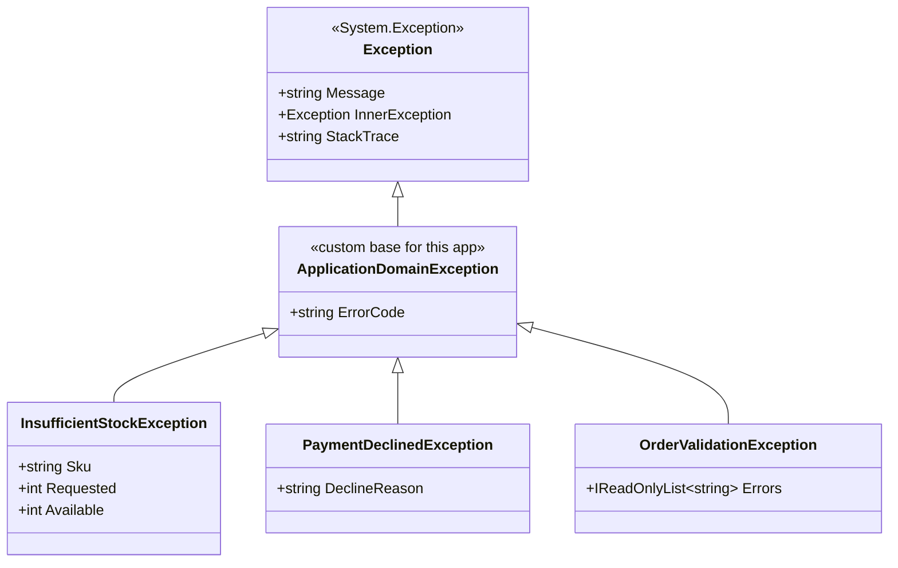
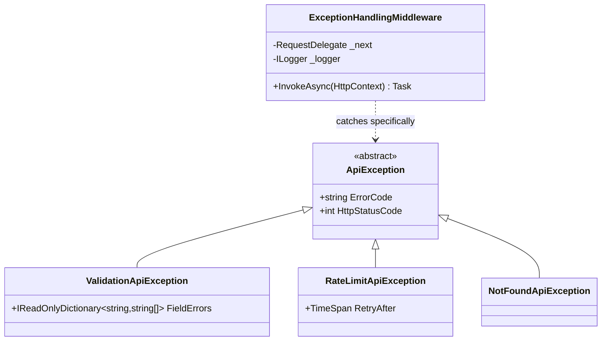
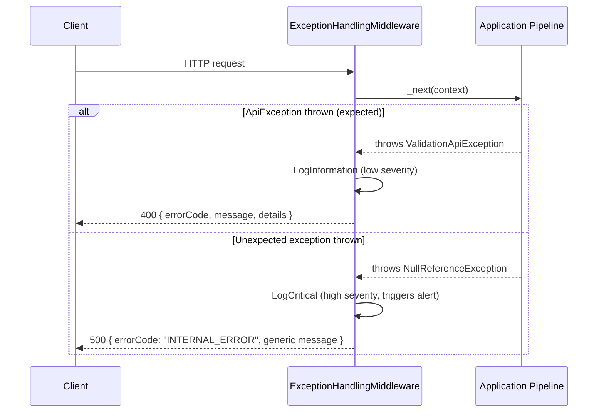

# Module 8 — C# Advanced: Exception Handling, SEH Internals & Custom Exception Design

> Domain: C# | Level: Beginner → Expert | Prerequisite: [[02-Async-Await-Internals]] (exception capture/rethrow across `await`), [[04-Delegates-Events-Closures]] (multicast exception-abort behavior), [[01-CLR-JIT-GC-Memory-Management]] (stack unwinding, finalization)

---

## 1. Fundamentals

### What is exception handling?
Exception handling is the mechanism by which .NET represents and propagates **exceptional, non-local control flow** — when a method cannot complete its contract, it throws an exception object describing what went wrong, and the runtime unwinds the call stack looking for a `catch` block prepared to handle that exception type, running `finally` blocks along the way.

### Why does it exist?
Before structured exception handling, error signaling relied on return codes (`int` error codes, `HRESULT`-style values) that could be silently ignored (nothing forces a caller to check a return value) and couldn't naturally carry rich context (a stack trace, an inner cause, arbitrary data) without significant additional plumbing. Exceptions make error propagation **impossible to silently ignore** (an unhandled exception terminates the operation, or the process, rather than continuing with corrupted state) and **carry rich diagnostic context automatically** (stack trace, type, message, inner exception chain).

### When does this matter?
- **Always**, since every .NET program uses exceptions for genuinely exceptional conditions — but *precisely when* to use exceptions versus a `Result<T>`-style return value (Module 7 §13) or a `TryX`/boolean-return pattern is a design decision with real performance and API-clarity consequences (§2.2, §7).
- **Critically** for designing library/API boundaries — a well-designed custom exception hierarchy communicates failure modes clearly to callers; a poorly-designed one (overly broad, uninformative, or inconsistent) makes robust error handling by callers difficult or impossible.
- **Critically** for production reliability — understanding precisely what state remains valid after an exception (is a partially-updated object now corrupted? did a lock get released? did a `using` block dispose correctly?) is central to writing correct, resilient code.

### How does it work (30,000-ft view)?

```csharp
try
{
    ProcessOrder(order); // might throw
}
catch (OrderValidationException ex) when (ex.ErrorCode == "INSUFFICIENT_STOCK")
{
    // handle this SPECIFIC failure mode
}
catch (OrderValidationException ex)
{
    // handle other validation failures
}
finally
{
    ReleaseResources(); // ALWAYS runs, whether an exception occurred or not
}
```

Mental model for interviews: **"An exception is an object describing a failure; throwing it unwinds the stack, running `finally` blocks along the way, until a matching `catch` is found (or the process terminates if none is). Exception filters (`when`) let you match on both type AND runtime conditions, without unwinding the stack to evaluate the filter."**

---

## 2. Deep Dive

### 2.1 Structured Exception Handling — the CLR/OS-Level Mechanism

.NET's exception handling is built on top of the OS's native **Structured Exception Handling (SEH)** on Windows (and an equivalent unwind-table-based mechanism on Linux/macOS via the CLR's own portable exception-handling implementation). When a `throw` executes:
1. The CLR captures the current stack trace **at the throw point** (not the catch point — a critical, frequently-tested fact, §2.5) and packages it with the exception object.
2. The runtime searches **up the call stack**, frame by frame, for a `try` block with a `catch` clause whose type matches (or is a base type of) the thrown exception's type — this search happens in two conceptual passes: a **first pass** identifies the matching handler without yet unwinding anything (evaluating exception filters, `when` clauses, during this pass — §2.4), and a **second pass** actually unwinds the stack down to the matching handler, running `finally` blocks (and `catch` blocks that were passed over) along the way.
3. If no handler is found anywhere up to the top of the call stack, the exception is **unhandled** — the CLR terminates the process (after running any registered unhandled-exception-event handlers, primarily for logging, since they cannot prevent termination for most exception types).

**Critical fact**: because filter evaluation (`when`) happens during the **first pass, before any unwinding occurs**, a debugger attached at the moment of an exception can inspect the *exact* state of the stack at the throw point even when a filter ultimately doesn't match and the exception continues propagating further up — this is precisely why `catch (Exception ex) when (LogAndReturnFalse(ex))` is a legitimate, sometimes-used pattern for "log this exception's full context, but don't actually handle it here, let it keep propagating" (§2.4).

### 2.2 The Real Cost of Throwing an Exception

Throwing an exception is **expensive** relative to ordinary control flow — not because of the `try`/`catch` blocks themselves (entering a `try` block with no exception thrown has near-zero cost in modern .NET), but specifically because of:
- **Stack trace capture**: walking and recording the full call stack at the throw point.
- **The two-pass search-then-unwind mechanism** itself: significantly more expensive than a simple `return` or branch, since it involves runtime metadata lookups (finding which `catch` clauses exist in each frame, matching types) and OS-level unwinding machinery.
- **Exceptions should never be used for ordinary, expected control flow** (e.g., "did this dictionary contain the key" via catching a `KeyNotFoundException` instead of `TryGetValue`) — this is a well-known, measurable anti-pattern (§6) precisely because of this cost, not merely a style preference. A `TryParse`/`TryGetValue`-style API avoids the exception path entirely for the "expected failure" case, reserving exceptions for genuinely exceptional conditions.

### 2.3 `finally` Blocks — Guarantees and Their Limits

`finally` blocks are guaranteed to run whenever the corresponding `try` block is exited — via normal completion, an exception (caught or not, as long as the process doesn't hard-crash), a `return`, `break`, or `continue` inside the `try`. **Exceptions to this guarantee**: a `finally` block will **not** run if the process is terminated abruptly (`Environment.FailFast`, a `StackOverflowException` — which cannot be caught at all since .NET 2.0 specifically because the stack is already exhausted and there's no safe way to run handler code, or an unrecoverable CLR-level failure), and historically (pre-.NET Core, on classic .NET Framework) certain `catch`/`finally` execution could be skipped under specific `ThreadAbortException` scenarios (a legacy mechanism removed entirely in modern .NET Core/5+, since `Thread.Abort()` itself now throws `PlatformNotSupportedException`).

`using`/`using var` statements desugar directly into a `try`/`finally` calling `Dispose()` — this is precisely how deterministic resource cleanup (Module 1 §5) is guaranteed even when an exception occurs mid-block.

### 2.4 Exception Filters (`when`) — Precise Semantics and Use Cases

```csharp
try { CallExternalApi(); }
catch (HttpRequestException ex) when (ex.StatusCode == HttpStatusCode.TooManyRequests)
{
    // handle rate-limiting specifically
}
catch (HttpRequestException ex) when (LogAndDecide(ex)) // side-effecting filter -- see caution below
{
    // ...
}
catch (HttpRequestException)
{
    // handle all OTHER HttpRequestExceptions
}
```
An exception filter (`when (...)`) is evaluated **during the first pass**, before the stack unwinds — meaning: (a) it can inspect the exact call-stack state at the throw point (useful for rich diagnostic logging even for exceptions you don't ultimately handle at this frame), and (b) if the filter evaluates `false`, the runtime continues searching **further up the stack** for another matching handler, exactly as if this `catch` clause didn't match at all — the exception is **not** "caught and rethrown," it simply was never caught here in the first place, a subtly different (and cheaper — no unwind/rethrow cost) semantic than the older pattern of `catch (T ex) { if (!condition) throw; ... }`.

**Caution**: filters **can** contain side effects (calling a logging method, as in the `LogAndDecide` example), but this is a debated practice — a filter with side effects executes even for exceptions the filter ultimately decides *not* to handle (if it returns `false`), meaning "logging as a filter side effect" logs on every attempted match, not just successful ones; used deliberately and sparingly (typically for "log full context regardless of whether we act on it here" scenarios) this is a legitimate, sometimes-cited idiom, but filters with substantial side effects/business logic embedded in them are a real anti-pattern (§6) since they make control flow significantly harder to reason about at a glance.

### 2.5 Stack Trace Capture, `throw;` vs `throw ex;`, and `ExceptionDispatchInfo`

```csharp
try { DoWork(); }
catch (Exception ex)
{
    LogError(ex);
    throw;      // RETHROWS preserving the ORIGINAL stack trace (captures at DoWork's throw point)
    // throw ex; // WOULD reset the stack trace to THIS line -- loses the original throw location -- almost always wrong
}
```
`throw;` (no expression) rethrows the **current** exception, preserving its original `StackTrace` property exactly as captured at the original throw site. `throw ex;` (re-throwing the caught variable as a new throw statement) **resets** the stack trace to the location of this new `throw` statement — a genuine, common bug that destroys crucial debugging information (where did this actually originate?), and one of the most consistently-tested "does this candidate actually understand exceptions" interview questions.

For scenarios needing to **re-throw an exception from a different location than where it was caught** (e.g., capturing an exception on a background thread and rethrowing it on the calling thread — precisely what `Task`'s internal machinery does for you automatically, Module 2 §2.1/§2.6), `System.Runtime.ExceptionServices.ExceptionDispatchInfo.Capture(ex).Throw()` preserves the original stack trace while allowing the actual `throw` to occur at a different point in the code/call stack than the original catch — the exact mechanism `Task.Wait()`/`.Result`'s `AggregateException` unwrapping and `await`'s exception-rethrowing rely on internally to give you a *usably accurate* stack trace despite the exception having crossed a thread/continuation boundary.

### 2.6 Custom Exception Design — the Standard Shape and Why

```csharp
[Serializable] // legacy attribute, still conventionally included though binary serialization is largely deprecated
public class OrderValidationException : Exception
{
    public string ErrorCode { get; }

    public OrderValidationException(string message, string errorCode)
        : base(message)
    {
        ErrorCode = errorCode;
    }

    public OrderValidationException(string message, string errorCode, Exception innerException)
        : base(message, innerException)
    {
        ErrorCode = errorCode;
    }
}
```
The standard convention: **derive from `Exception` (or a more specific existing base like `InvalidOperationException`/`ArgumentException` if genuinely appropriate — see §2.7 for when), provide the conventional constructor overloads** (message-only, message + inner exception, and any custom-data constructors your exception needs), and **add strongly-typed properties for structured error data** (`ErrorCode`, `ValidationErrors`, etc.) rather than encoding that data only into the free-text `Message` string, which forces callers into fragile string-parsing to programmatically react to specific failure details.

### 2.7 Choosing a Base Exception Type — the Decision That Actually Matters

- **`ArgumentException`/`ArgumentNullException`/`ArgumentOutOfRangeException`**: for invalid **arguments passed by a caller** — represents a **caller bug** (the calling code violated the method's contract), not a runtime/environmental failure. Should generally not be caught and "handled" by ordinary application logic — fixing the calling code is the correct response, not a `catch` block papering over it.
- **`InvalidOperationException`**: the object/system is in a state where the requested operation doesn't make sense right now (e.g., calling `.Current` on an enumerator before the first `MoveNext()`) — a very common, appropriately-broad choice for "this operation isn't valid given the current state" failures that aren't specifically about a bad argument.
- **A custom exception deriving directly from `Exception`**: for genuinely domain-specific failure modes that callers are expected to specifically catch and handle differently from generic runtime failures (`InsufficientStockException`, `PaymentDeclinedException`) — these represent **expected, "part of the domain's normal failure vocabulary"** outcomes, not bugs, and deserve their own distinct type precisely so calling code can `catch` them specifically (often as an alternative to, or alongside, a `Result<T>`-style return value, Module 7 §13, for cases where the "exceptional-ness" is genuine).
- **Never throw the bare `System.Exception` type directly**, and (generally) **never catch bare `Exception` except at a small number of well-justified top-level boundaries** (a global unhandled-exception handler, a background-job runner's per-job isolation boundary) — catching `Exception` broadly elsewhere risks silently swallowing genuinely unexpected bugs (`NullReferenceException`, `OutOfMemoryException`) that should surface loudly, not be treated the same as an expected domain failure.

---

## 3. Visual Architecture

### Two-Pass Exception Handling (ASCII)

```
Call stack at throw time:
 Main()
   └── ProcessOrder()
         └── ValidateStock()  <-- throw new InsufficientStockException(...) HERE

PASS 1 (search, no unwinding yet):
   ValidateStock frame: any matching catch here? No try/catch in this frame.
   ProcessOrder frame:  try/catch(InsufficientStockException) when (...)? EVALUATE FILTER (stack NOT yet unwound)
                         -> filter returns true -> MATCH FOUND at this frame

PASS 2 (unwind down to the matched frame):
   ValidateStock frame: run any 'finally' blocks in this frame, pop it
   ProcessOrder frame:  stack trace was already captured at throw time (ValidateStock's line);
                         now actually execute the matched catch block's body
```

### Exception Hierarchy Example



---

## 4. Production Example

### Scenario: Payment service — an over-broad `catch (Exception)` masking a critical bug for months

**Problem**: A payment-processing service had a top-level `catch (Exception ex) { LogError(ex); return PaymentResult.Failed("An error occurred"); }` wrapping its entire `ProcessPayment` method — a defensive pattern intended to ensure the API "always returns a clean result, never crashes." Months later, an investigation into a slow, gradual increase in "payment failed" support tickets revealed that a **`NullReferenceException`** caused by a genuine, unrelated bug (a race condition leaving a configuration object briefly null during a specific reload window) had been silently caught by this broad handler and reported to users as an ordinary "payment failed, please retry" message — masking a real, fixable production bug behind a generic, uninformative failure message for months, since the broad `catch` gave it exactly the same treatment as an expected `PaymentDeclinedException`.

**Investigation**:
- Structured logging (which *was* correctly capturing the caught exception's type and message, fortunately) eventually revealed, once someone specifically filtered logs by exception type rather than just "payment failed" outcome counts, that a meaningful fraction of "failures" were `NullReferenceException`, not the expected domain exceptions (`PaymentDeclinedException`, `InsufficientFundsException`) the broad catch was originally intended to normalize into a clean API response.
- The race condition itself was found and fixed once actually investigated as a distinct bug — but the multi-month delay in even *recognizing* it as a distinct, unexpected bug (rather than "normal" payment failures) was entirely attributable to the over-broad exception handling masking the distinction.

**Architecture fix**:
- Replaced the single broad `catch (Exception)` with specific `catch` clauses for each expected domain exception type (`PaymentDeclinedException`, `InsufficientFundsException`, `PaymentGatewayTimeoutException`), each mapped to its own specific, accurate `PaymentResult` failure reason.
- Added a final, narrow `catch (Exception ex) when (IsUnexpected(ex))` clause specifically for genuinely unanticipated exceptions, which logs at a **distinctly higher severity** (triggering an alert, not just a log entry) and returns a generic "system error, we're looking into it" result — deliberately differentiating "an expected domain failure" from "an unexpected bug" in both the logging severity and the alerting behavior, not just the returned message.
- Added a dashboard specifically tracking the *rate* of this "unexpected exception" category as a first-class reliability metric, distinct from the expected-domain-failure rate.

**Trade-offs**: The more granular exception handling is more code to write and maintain per new domain exception type introduced — accepted as a clearly worthwhile cost given the multi-month masked-bug incident this fixed, and because it directly improves the team's ability to distinguish "the payment domain is working as designed, just declining this specific payment" from "our system has a bug" — a distinction with real business value (the former needs no action, the latter needs urgent investigation).

**Lessons learned**:
1. A broad `catch (Exception)` that treats every failure identically actively destroys the information needed to distinguish "expected domain outcome" from "unexpected bug" — precisely the distinction that matters most for triage and alerting.
2. Logging the exception (even correctly) is not sufficient if nothing is actively monitoring/alerting on the *type* distribution of caught exceptions — the information being present in logs didn't prevent months of the bug going unrecognized, because no one was looking at exception-type breakdowns as a metric.
3. A well-designed custom exception hierarchy (§2.6/§2.7) is precisely what makes granular, type-specific `catch` handling practical and maintainable — this incident's root cause and its fix are two sides of the same underlying principle.

---

## 5. Best Practices

- **Catch the most specific exception type your code can actually handle meaningfully** — never `catch (Exception)` except at a small number of deliberate, well-justified top-level boundaries (global handlers, background-job isolation). Why: broad catches conflate "expected domain outcome" with "unexpected bug" (§4), destroying triage/alerting signal.
- **Use `throw;` (not `throw ex;`) to rethrow** — preserves the original stack trace; `throw ex;` resets it to the rethrow location, destroying debugging context.
- **Design custom exceptions with strongly-typed properties for structured data** (error codes, relevant IDs, validation details), not just a formatted `Message` string — lets calling code react programmatically without fragile string parsing.
- **Reserve exceptions for genuinely exceptional conditions; use `TryX`/`Result<T>`-style returns for expected, common failure paths** (Module 7 §13's `Either<TLeft,TRight>` pattern is directly applicable here) — e.g., "user not found" during a lookup is often better modeled as a `null`/`TryGetUser(out user)`/`Result<User>` return than an exception, reserving exceptions for genuinely unexpected failures (a database connection failure during that same lookup, by contrast, is a legitimate exception).
- **Differentiate "expected domain failure" from "unexpected bug" explicitly in both logging severity and downstream alerting** (§4's fix) — never let both categories look identical in your observability stack.
- **Always include the original exception as `InnerException` when wrapping/rethrowing a different exception type** (`throw new OrderProcessingException("...", ex);`) — preserves the full causal chain for diagnosis; discarding the original exception when wrapping is a common, easily-avoided loss of diagnostic information.
- **Use exception filters (`when`) for conditional handling instead of catching broadly and rethrowing conditionally** (`catch (T ex) { if (!cond) throw; ... }`) — filters are both cheaper (no unnecessary catch-then-rethrow unwind/rethrow cost when the filter doesn't match) and clearer about intent.

---

## 6. Anti-patterns

- **Using exceptions for ordinary, expected control flow** (e.g., catching `FormatException` from `int.Parse` instead of using `int.TryParse`, or catching `KeyNotFoundException` instead of `TryGetValue`). Why it fails: measurably expensive (§2.2) for a genuinely common code path, and obscures intent (a reader has to recognize "oh, this exception is actually expected here" rather than seeing an explicit `if (!TryGetValue(...))`). Fix: always prefer the `TryX` API when one exists for exactly this reason.
- **`catch (Exception ex) { }` — swallowing exceptions entirely, with no logging, no rethrow.** Why it fails: silently discards all information about a failure, including genuinely critical bugs — the single most dangerous exception-handling anti-pattern, since it actively hides problems rather than merely mishandling them. Fix: never swallow silently; at minimum, log with full context; strongly prefer letting genuinely unexpected exceptions propagate to a well-instrumented top-level handler.
- **`throw ex;` instead of `throw;`** (§5's correction) — destroys the original stack trace, making production debugging significantly harder. Fix: always use bare `throw;` for rethrowing the currently-caught exception unchanged.
- **Catching `Exception` broadly throughout ordinary business logic**, not just at designated top-level boundaries (§4's incident). Fix: catch specific types; reserve broad catches for the few deliberate boundaries where "ensure this operation always returns cleanly, whatever happens" is a genuine architectural requirement (and even there, differentiate expected vs. unexpected exceptions in logging/alerting, per §5).
- **Putting substantial business logic or heavy side effects inside exception filters (`when` clauses).** Why it fails: makes control flow significantly harder to trace/reason about (a filter can execute and have side effects even for exceptions it decides not to handle, §2.4), and filters aren't an obvious place a code reader expects to find meaningful logic. Fix: keep filters to simple, clearly-side-effect-free conditions (property checks, type checks); if logging within a filter is genuinely needed, keep it narrowly scoped and clearly commented as an intentional pattern.
- **Defining custom exceptions without the conventional constructor overloads** (message-only, message + inner exception) — breaks common exception-wrapping patterns (`throw new MyException("context", innerEx);`) and standard serialization/framework expectations. Fix: always provide at least the standard constructor set (§2.6), even if your application code doesn't (yet) use all of them directly.
- **Throwing exceptions across an API boundary without documenting which exception types callers should expect and handle** (undocumented `throws`-equivalent, since C# has no checked-exceptions mechanism, Module 6-adjacent design-contract concern). Fix: document expected exception types in XML doc comments (`<exception cref="...">`) for any public API, treating this as part of the method's actual contract, not an afterthought.

---

## 7. Performance Engineering

**CPU**: Entering/exiting a `try` block with no exception thrown has near-zero runtime cost in modern .NET (the JIT emits minimal overhead for the "happy path" through a `try` region) — the expense is entirely in the **throw-and-unwind path** (§2.2), not in merely having `try`/`catch` present in code. This is why "wrap everything in `try`/`catch` defensively" doesn't itself cost meaningful performance — the actual, real cost concern is throwing exceptions at high frequency, not writing `try` blocks liberally.

**Memory**: Exception objects are ordinary heap-allocated objects (Module 1) — capturing a stack trace involves allocating and populating a non-trivial amount of string/array data describing the call stack, a genuinely more expensive allocation than an ordinary small object; at high throw-frequency, this contributes measurably to Gen 0 allocation pressure (Module 1 §2.4), on top of the raw CPU cost of the unwind mechanism itself.

**Throw-rate as a first-class metric**: For latency-sensitive services, track **exceptions thrown per second** (not just "unhandled exceptions" or errors returned to clients) as a standing observability metric — a service throwing thousands of *caught, handled* exceptions per second for expected-but-common conditions (the `TryX`-instead-of-exception anti-pattern, §6) is paying a real, measurable tax that doesn't show up in error-rate dashboards at all, since every one of these exceptions is "successfully handled."

**Benchmarking**: BenchmarkDotNet comparing `int.TryParse` against a `try { int.Parse(...); } catch (FormatException) { }` pattern over a mix of valid/invalid input directly demonstrates the throw-path cost concretely — a genuinely illustrative, easy-to-run exercise for a team skeptical that "just catching the exception" has any real cost over the `TryX` alternative.

**`ExceptionDispatchInfo`/async exception propagation cost**: Module 2's `Task`-based exception capture/rethrow machinery (necessary to correctly propagate an exception from a background-thread continuation back to an `await`er) has its own overhead beyond a same-thread `try`/`catch` — another reason (alongside Module 2's throughput arguments) that async code shouldn't be reached for reflexively in scenarios where the added exception-marshaling complexity/cost isn't buying a real concurrency benefit.

---

## 8. Security

- **Exposing internal exception details (full stack traces, internal type names, connection strings embedded in exception messages) directly to external API clients** is a genuine information-disclosure risk — stack traces can reveal internal architecture, file paths, library versions (useful reconnaissance for an attacker), and some exception messages (a database connectivity exception, for instance) can inadvertently include sensitive configuration values. Mitigation: never return raw exception details to external callers; map internal exceptions to a sanitized, generic external error representation (an error code + safe message), logging the full internal detail server-side only — directly connecting to Module 7 §8's "don't leak sensitive data via convenient defaults" theme, here applied to exception messages/stack traces instead of record `ToString()`.
- **Exception-based timing side-channels**: in security-sensitive code (authentication, cryptographic operations), the mere *presence or absence* of an exception (and how quickly it's thrown) can leak information to a sufficiently patient attacker (e.g., "invalid username" throwing immediately vs. "invalid password for a valid username" taking measurably longer due to a password-hash comparison actually being performed) — a variant of the general timing-attack concern, specifically manifesting through exception-driven control flow differences. Mitigation: ensure authentication failure paths take constant time regardless of *which* specific condition failed, rather than allowing an early-exit exception to create an observable timing differential.
- **Swallowing security-relevant exceptions silently** (the `catch (Exception ex) { }` anti-pattern, §6, applied specifically to security contexts) can hide active attacks — a flood of authentication exceptions/authorization failures silently caught and ignored (rather than logged and monitored) removes the observability signal that would otherwise reveal a brute-force or credential-stuffing attack in progress.
- **OWASP relevance**: Directly maps to **A09 (Security Logging and Monitoring Failures)** for silently-swallowed security exceptions, and to information-disclosure concerns (adjacent to A05, Security Misconfiguration, for environments that leave detailed error pages/stack traces enabled in production) for leaked exception details.

---

## 9. Scalability

- **Horizontal/vertical scaling**: A service throwing exceptions at high frequency for expected conditions (§6/§7's anti-pattern) pays a real per-request CPU/allocation tax that directly reduces the useful request throughput each replica can sustain — fixing this (switching to `TryX`/`Result<T>` patterns for expected failure paths) is a legitimate, sometimes substantial scalability lever, distinct from any infrastructure-level scaling change.
- **Caching/Replication/Partitioning**: Not directly applicable to exception mechanics; the relevant connection is that a well-designed custom exception hierarchy (§2.6/§2.7) is what makes it practical to build resilience patterns (retry-with-backoff, circuit breakers — Module 2 §Expert Q7's Polly-based patterns) that need to distinguish *which specific failure occurred* (a transient network timeout, worth retrying, versus a permanent validation failure, not worth retrying) — a flat, undifferentiated exception model makes this kind of resilience-pattern logic far harder to implement correctly.
- **CAP theorem**: Not directly relevant; the practical connection is that distributed-systems failure handling (a later module's circuit breakers, retries, timeouts) is fundamentally built on top of exactly the exception-type-discrimination principles this module covers — a system that can't cleanly distinguish "transient, retry-worthy" exceptions from "permanent, don't-retry" ones at the language/exception-design level cannot implement correct resilience patterns at the distributed-systems level either, no matter how sophisticated the retry/circuit-breaker infrastructure is.
- **HA/DR**: Unhandled exceptions in a background worker/job processor that aren't caught at an appropriate isolation boundary can crash an entire worker process over a single bad input item — directly relevant to HA design: background-job/queue-consumer architectures need an explicit per-item exception-isolation boundary (catch broadly *at that specific boundary*, per §5's "well-justified top-level boundary" exception to the general "don't catch broadly" rule) so one malformed message doesn't take down the entire worker and interrupt processing of all other queued items.

---

## 10. Interview Questions

### Basic (10)

1. **Q: What does a `finally` block guarantee?**
   **A:** It runs whenever the corresponding `try` block is exited, whether normally, via a `return`, or via an exception (caught or not), with rare exceptions like process termination or `StackOverflowException`.

2. **Q: What's the difference between `throw;` and `throw ex;`?**
   **A:** `throw;` rethrows the current exception preserving its original stack trace; `throw ex;` resets the stack trace to this new throw location, losing the original context.

3. **Q: Should you catch `Exception` broadly throughout your application code?**
   **A:** Generally no — catch the most specific exception type you can meaningfully handle; broad catches conflate expected domain failures with unexpected bugs and can silently swallow critical issues.

4. **Q: What does `using`/`using var` desugar into?**
   **A:** A `try`/`finally` block that calls `Dispose()` on the resource in the `finally`, guaranteeing cleanup even if an exception occurs.

5. **Q: What is an exception filter?**
   **A:** A `when` clause on a `catch` block that adds a runtime condition to whether that handler matches, evaluated before the stack unwinds.

6. **Q: Is throwing an exception expensive compared to a normal `return`?**
   **A:** Yes — capturing the stack trace and the two-pass search/unwind mechanism make throwing meaningfully more expensive than ordinary control flow; entering a `try` block with no exception thrown, however, has near-zero cost.

7. **Q: What is `InnerException` used for?**
   **A:** Preserving the original causing exception when wrapping/rethrowing a different exception type, maintaining a full causal chain for diagnosis.

8. **Q: Should you use exceptions to check if a dictionary key exists?**
   **A:** No — use `TryGetValue` instead of catching a `KeyNotFoundException`; exceptions should be reserved for genuinely exceptional conditions, not routine, expected checks.

9. **Q: What is the standard base class recommendation for a caller-supplied invalid argument?**
   **A:** `ArgumentException` (or the more specific `ArgumentNullException`/`ArgumentOutOfRangeException`) — representing a caller bug/contract violation.

10. **Q: What is `catch (Exception ex) { }` (an empty catch block) an example of?**
    **A:** A dangerous anti-pattern — silently swallowing all exceptions, including critical unexpected bugs, with no logging or handling at all.

### Intermediate (10)

1. **Q: Explain precisely why `throw ex;` is worse than `throw;`, in terms of what information is lost.**
   **A:** `throw;` preserves the `StackTrace` property exactly as captured at the exception's original throw site; `throw ex;` is treated as a brand-new throw statement, resetting the stack trace to point at this rethrow location — the original call chain that actually caused the exception is lost, making production debugging significantly harder since you only see where it was rethrown, not where it originated.

2. **Q: Why is a two-pass model (search, then unwind) used for exception handling instead of unwinding immediately while searching?**
   **A:** It lets exception filters (`when` clauses) and diagnostic tooling inspect the exact stack state at the throw point before any unwinding occurs — if unwinding happened during the search, that original stack context would already be destroyed by the time a filter (or a debugger) got to examine it, even for handlers further up the stack that ultimately don't match.

3. **Q: What's the danger of putting side-effecting code (like logging) inside an exception filter?**
   **A:** The filter executes whenever that catch clause is considered, including for exceptions it ultimately decides not to handle (returns `false`) — a logging side effect inside a filter can therefore fire even when the filter "declines" to catch, which can be surprising and makes control flow harder to reason about if not done deliberately and narrowly.

4. **Q: Why should custom exceptions include strongly-typed properties (like an `ErrorCode`) rather than encoding everything into the `Message` string?**
   **A:** A `Message` string requires fragile parsing for calling code to react programmatically to specific failure details; a strongly-typed property (`ex.ErrorCode`) lets callers branch on structured data directly and safely, without depending on message text staying stable across versions.

5. **Q: When would you choose `InvalidOperationException` over a custom exception type?**
   **A:** When the failure is about the object/system being in an invalid state for the requested operation generically (not a specific, named domain concept callers need to catch distinctly) — `InvalidOperationException` is an appropriately broad, standard choice for this general case, reserving custom exception types for genuinely distinct domain failure modes.

6. **Q: What is `ExceptionDispatchInfo` used for, and why can't you just use `throw;` in every "rethrow from elsewhere" scenario?**
   **A:** It captures an exception's state (including its original stack trace) so it can be rethrown later, from a **different location in the call stack** than where it was originally caught — `throw;` only works to rethrow the *currently-caught* exception from within the same `catch` block; `ExceptionDispatchInfo.Capture(ex).Throw()` is needed when the rethrow must happen elsewhere (e.g., marshaling an exception from a background thread back to the original caller), which is exactly what `Task`'s internal exception-propagation machinery uses.

7. **Q: Why is catching `Exception` broadly at a background-job processor's per-item boundary considered acceptable, when it's discouraged elsewhere?**
   **A:** It's a deliberate, well-justified architectural boundary specifically to isolate one malformed/failing item from crashing the entire worker process and interrupting all other queued work — the key distinction is that even here, the exception should still be logged/differentiated (expected vs. unexpected, per §5) rather than silently swallowed, and this remains a narrow, explicitly-designed exception to the general "catch specific types" guidance, not a justification for broad catches everywhere.

8. **Q: What happens to a `finally` block if the corresponding `try` block's exception is never actually caught anywhere up the call stack?**
   **A:** The `finally` block still runs during the stack-unwinding process as the runtime searches upward for a handler (or ultimately fails to find one and terminates the process) — `finally` execution is tied to the `try` block being exited during unwinding, independent of whether a handler is ultimately found.

9. **Q: Why is it important to include the original exception as `InnerException` when wrapping it in a custom exception type?**
   **A:** Without it, the original exception's type, message, and stack trace are lost entirely — anyone diagnosing the wrapped exception later only sees the wrapper's generic message, with no way to determine what actually caused the failure underneath it.

10. **Q: What's the performance-relevant difference between a service that throws thousands of caught, handled exceptions per second for expected conditions versus one using `TryX`/`Result<T>` patterns for the same conditions?**
    **A:** The exception-based version pays real, measurable per-occurrence CPU and allocation cost (stack trace capture, two-pass unwind) for every one of those "expected" occurrences, even though each is fully handled and never surfaces as an error — a hidden throughput tax invisible in ordinary error-rate dashboards; the `TryX`/`Result<T>` version avoids the exception machinery entirely for these expected paths.

### Advanced (10)

1. **Q: Walk through, precisely, why a `NullReferenceException` caught by an over-broad `catch (Exception)` handler is a fundamentally different kind of event than a `PaymentDeclinedException` caught by the same handler, and why treating them identically is dangerous.**
   **A:** `PaymentDeclinedException` represents an **expected, normal domain outcome** — the payment gateway correctly, deliberately rejected a specific transaction for a legitimate business reason (insufficient funds, fraud flag) — this is "the system working as designed." `NullReferenceException` represents a **genuine, unanticipated bug** — some invariant the code assumed would always hold (a reference being non-null) was violated, indicating a real defect that needs investigation and a fix. Treating both identically (§4's incident) means the monitoring/alerting/triage process has no way to distinguish "nothing to see here, business as usual" from "there's an active bug degrading the system" — the danger isn't the broad catch itself crashing anything, it's that it actively destroys the *signal* needed to notice and prioritize fixing real problems, potentially for months, exactly as occurred in the production incident.

2. **Q: Explain how `AggregateException` relates to `Task`-based exception handling, and a scenario where failing to understand its unwrapping behavior causes a bug (connecting to Module 2).**
   **A:** When a `Task` faults, its exception(s) are wrapped in an `AggregateException` (potentially containing multiple inner exceptions, e.g., from `Task.WhenAll` with multiple failed tasks, per Module 2 §6/Intermediate Q6); `await`-ing a faulted `Task` automatically **unwraps** and rethrows just the first inner exception directly (via `ExceptionDispatchInfo`-based mechanics, §2.5), giving you the "natural," expected exception type in a `catch` block — but calling `.Result`/`.Wait()` on the same faulted `Task` does **not** unwrap automatically, surfacing the raw `AggregateException` instead. A bug pattern: code with a `catch (SpecificException ex)` block that works correctly when the async method is properly `await`-ed, but silently fails to match (falling through to a more general handler or going unhandled) if someone later "simplifies" the calling code to use `.Result` instead of `await`, since the actual thrown type at that call site is now `AggregateException`, not `SpecificException` directly — a subtle, easy-to-introduce regression when refactoring async code, tying directly back to Module 2's broader sync-over-async cautions.

3. **Q: Design an exception-based retry classification scheme distinguishing "transient, retry-worthy" from "permanent, don't retry" failures for an HTTP client wrapper, and explain the exception-hierarchy design that supports it.**
   **A:** Define a marker interface `ITransientFailure` (or a common base `TransientException : Exception`) that specific exception types implementing/deriving from it represent (a timeout, a 503/429 HTTP response mapped to a custom `ServiceUnavailableException : TransientException`), versus other exception types (a 400 Bad Request mapped to `InvalidRequestException`, deriving directly from `Exception` or `ArgumentException`, NOT `TransientException`) representing permanent failures; the retry wrapper's catch logic becomes `catch (TransientException ex) { /* retry with backoff, Module 2 Hard exercise */ }` versus a non-matching, non-transient exception propagating immediately without any retry attempt — the exception *hierarchy design itself* (not ad-hoc per-call-site conditional logic) is what makes the retry policy both correct and trivially reusable/composable across every call site using this HTTP client wrapper, directly connecting this module's exception-design principles to Module 2's resilience-pattern discussion.

4. **Q: Explain why a `catch` clause's exception filter (`when`) evaluating during the first pass (before unwinding) matters specifically for debugging tools like `!printexception`/`dotnet-dump`, beyond just the language-semantics explanation in §2.1.**
   **A:** Because the stack hasn't been unwound yet during filter evaluation, a crash-dump/live-debugging tool attached at exactly that moment (e.g., via a `when` filter deliberately written to trigger a breakpoint or dump capture for diagnostic purposes, a known advanced debugging technique) can inspect the complete, un-unwound call stack — every local variable and frame that existed at the moment of the original `throw` — even for a `catch` clause whose filter ultimately returns `false` and lets the exception continue propagating. This is precisely why some advanced debugging setups deliberately insert a `catch (Exception ex) when (CaptureDiagnosticSnapshot(ex))` (always returning `false`, so it never actually "handles" anything) purely to get a rich diagnostic snapshot at exactly the right moment without altering the program's actual exception-handling behavior at all.

5. **Q: A candidate says "exceptions should never cross an async boundary because they're too expensive." Provide a precise correction.**
   **A:** Exceptions do cross async boundaries constantly and correctly in idiomatic C# (an `await`-ed faulted `Task` naturally propagates its exception to the awaiting code, Module 2) — the *expense* concern (§2.2/§7) is about **throw frequency for expected, common conditions**, not about exceptions being fundamentally incompatible with async code. The precise, correct framing: "avoid throwing exceptions for expected, high-frequency conditions regardless of whether the code is sync or async; genuinely exceptional failures should propagate via normal exception mechanics even across `await` boundaries, since that's exactly what the language and `Task` machinery are designed to do correctly and idiomatically."

6. **Q: How would you design a custom exception type intended to be thrown from a public NuGet-published library, considering versioning/compatibility concerns not relevant to purely internal exception types?**
   **A:** Follow the standard constructor conventions strictly (§2.6) since external consumers may rely on them (e.g., a logging framework's exception-wrapping code calling the message+innerException constructor reflectively); avoid changing a custom exception's base type or removing/renaming public properties in a later version without a major version bump, since consumer code may have `catch (MySpecificException ex) when (ex.SomeProperty == ...)` filters or type-hierarchy-dependent catch chains that would silently stop matching (or start matching differently) if the type hierarchy changes; consider **sealing** the exception type (or explicitly documenting whether it's designed to be further derived from) to avoid consumers building fragile inheritance-based extensions your library's own version upgrades might later break; document every exception type your public API can throw as part of the API's actual contract (§6's guidance, doubly important for external, non-recompiled-together consumers who can't simply read your source to discover this).

7. **Q: Explain a scenario where a well-intentioned exception filter used for "log rich context but don't handle it here" actually introduces a subtle behavioral bug.**
   **A:** `catch (Exception ex) when (LogAndReturnFalse(ex))` intended purely as a "log everything passing through, then let it keep propagating" pattern — if `LogAndReturnFalse` itself ever throws (e.g., the logging call fails due to a downstream logging-infrastructure outage), that new exception from *within the filter* propagates in a way that can be confusing to reason about and, depending on the runtime/version, may itself interact with the two-pass search process in ways that obscure the *original* exception that triggered the filter in the first place — a filter is generally expected to be a simple, side-effect-light boolean condition precisely to avoid this class of confusing, filter-internal-failure scenario; if logging inside a filter is genuinely wanted, it should be wrapped in its own defensive `try`/`catch` (swallowing logging-specific failures) so a logging-infrastructure problem never masks or complicates the original exception's propagation.

8. **Q: How would you explain, to a team debating it, whether a specific failure mode (e.g., "requested resource not found" in a repository method) should be modeled as a thrown exception or a `null`/`Result<T>` return value?**
   **A:** Frame it around *frequency and expectedness* (§5/§7's core criterion): if "not found" is a common, entirely expected outcome for many call sites (e.g., checking whether a username is already taken during registration), a `null`/`TryGetX`/`Result<T>` return avoids the real throw-cost tax (§2.2/§7) for what's essentially routine control flow, and forces callers to explicitly handle the "not found" case at the type level (a `Result<T>`'s two-armed nature, Module 7 §13, makes ignoring the "not found" case a visible omission, unlike a thrown exception a caller could simply never catch and let bubble up unexpectedly). If "not found" genuinely represents an exceptional, rare, likely-a-bug-if-it-happens condition for a *specific* call site (e.g., looking up an order by an ID that was itself just returned from a prior, supposedly-guaranteed-to-succeed creation call moments earlier), a thrown exception communicating "this should never happen, and if it does, something is seriously wrong" is the more appropriate, honest signal. The team should decide per-scenario based on this expectedness criterion, not adopt a single blanket policy either way.

9. **Q: Describe how you would retrofit exception-type-based retry classification (Advanced Q3) onto an existing, large codebase that currently uses a single flat custom exception type for all HTTP client failures, without a risky big-bang rewrite.**
   **A:** Introduce the new, more granular exception hierarchy (`TransientException`, `PermanentException`, etc.) **alongside** the existing flat type initially, with the existing flat exception type's constructor updated to also derive from the appropriate new granular type based on the underlying HTTP status code/failure reason it's already inspecting internally — meaning existing `catch (OldFlatException ex)` call sites throughout the codebase continue working entirely unchanged (since the new types are additive, and the old type could even become a common base class both new granular types derive from, preserving full backward compatibility for any existing broad catches), while new code (and the retry-wrapper logic specifically) can immediately start catching the new, more specific types. This is a direct application of the general "expand, don't break" incremental-migration principle relevant to many API/type-hierarchy evolution scenarios, applied here specifically to exception-type refactoring.

10. **Q: As a Principal Engineer, how would you design an organization-wide policy for custom exception hierarchies to avoid every team independently inventing incompatible, redundant, or poorly-designed exception types across a large microservices estate?**
    **A:** Publish a small, shared "common exceptions" library defining a small number of **well-designed, genuinely cross-cutting base exception types** (e.g., a `TransientFailureException` base, a `ValidationException` base with a structured `Errors` collection, an `AuthorizationException`) that every service's own domain-specific exceptions derive from, giving cross-cutting infrastructure code (retry policies, API error-mapping middleware, logging/alerting pipelines) a consistent, shared vocabulary to key off regardless of which specific service/team's exception it's handling — while explicitly leaving each team free to define their own domain-specific derived exception types (`InsufficientStockException : ValidationException`) for their own bounded context, avoiding the alternative failure mode of an overly rigid, centrally-mandated exhaustive exception catalog that becomes a bottleneck for every team needing a new failure type. Pair this with the documented conventions from §2.6/§6 (constructor shape, `InnerException` preservation, structured data properties) as an org-wide coding standard, and require the "does this exception represent an expected domain outcome or an unexpected bug" classification (§Advanced Q1) to be a deliberate, documented decision for any new exception type introduced — converting this module's core distinctions into durable, shared organizational infrastructure rather than something each team rediscovers (or fails to) independently.

---

## 11. Coding Exercises

### Easy — Fix a `throw ex;` stack-trace bug
**Problem**: This logging wrapper destroys the original stack trace.
```csharp
public T ExecuteWithLogging<T>(Func<T> operation)
{
    try
    {
        return operation();
    }
    catch (Exception ex)
    {
        _logger.LogError(ex, "Operation failed");
        throw ex; // BUG: resets stack trace to this line
    }
}
```
**Solution**:
```csharp
public T ExecuteWithLogging<T>(Func<T> operation)
{
    try
    {
        return operation();
    }
    catch (Exception ex)
    {
        _logger.LogError(ex, "Operation failed");
        throw; // preserves original stack trace
    }
}
```
**Discussion**: A one-word fix with an outsized production-debugging impact — this is precisely the kind of subtle, easily-overlooked bug that a code-review checklist item ("never `throw ex;`, always bare `throw;`") or a Roslyn analyzer rule (several community analyzers, and Visual Studio's own built-in suggestions, already flag this) should catch automatically rather than relying on manual review every time.

### Medium — Replace exception-based control flow with `TryX`
**Problem**: This method uses exceptions for an expected, common condition.
```csharp
public decimal GetDiscountRate(string customerTier)
{
    try
    {
        return _tierDiscounts[customerTier]; // throws KeyNotFoundException for unknown tiers -- a COMMON case
    }
    catch (KeyNotFoundException)
    {
        return 0m; // default: no discount
    }
}
```
**Solution**:
```csharp
public decimal GetDiscountRate(string customerTier)
{
    return _tierDiscounts.TryGetValue(customerTier, out var rate) ? rate : 0m;
}
```
**Discussion**: Beyond the performance win (§2.2/§7 — avoiding the throw path for what's evidently a routine, expected case given the simple default-value fallback), the `TryGetValue` version is also more *readable*: it makes the "unknown tier defaults to zero" logic immediately visible as ordinary control flow, rather than requiring a reader to recognize that an exception is being used here as a disguised if/else.

### Hard — Design and implement a transient/permanent exception hierarchy with a generic retry wrapper
**Problem**: Implement the exception-hierarchy-driven retry classification from Advanced Q3, including the retry wrapper itself (building on Module 2's retry-with-backoff coding exercise).
```csharp
public abstract class HttpClientException : Exception
{
    protected HttpClientException(string message, Exception? inner = null) : base(message, inner) { }
}

public sealed class TransientHttpException : HttpClientException
{
    public HttpStatusCode? StatusCode { get; }
    public TransientHttpException(string message, HttpStatusCode? statusCode, Exception? inner = null)
        : base(message, inner) => StatusCode = statusCode;
}

public sealed class PermanentHttpException : HttpClientException
{
    public HttpStatusCode StatusCode { get; }
    public PermanentHttpException(string message, HttpStatusCode statusCode, Exception? inner = null)
        : base(message, inner) => StatusCode = statusCode;
}

public static class ResilientHttpCaller
{
    public static async Task<HttpResponseMessage> SendWithRetryAsync(
        HttpClient client, HttpRequestMessage request, int maxAttempts, CancellationToken ct)
    {
        for (int attempt = 1; ; attempt++)
        {
            try
            {
                var response = await client.SendAsync(request, ct);
                if ((int)response.StatusCode is 429 or >= 500)
                    throw new TransientHttpException($"Transient failure: {response.StatusCode}", response.StatusCode);
                if (!response.IsSuccessStatusCode)
                    throw new PermanentHttpException($"Permanent failure: {response.StatusCode}", response.StatusCode);
                return response;
            }
            catch (TransientHttpException) when (attempt < maxAttempts)
            {
                await Task.Delay(TimeSpan.FromMilliseconds(200 * Math.Pow(2, attempt - 1)), ct);
                // loop continues -- retry
            }
            // PermanentHttpException, or TransientHttpException on the final attempt, propagates immediately
        }
    }
}
```
**Discussion points**: The exception filter `when (attempt < maxAttempts)` on the `TransientHttpException` catch clause is doing real, load-bearing work — on the *final* attempt, the filter evaluates `false`, so the exception is **not caught here at all**, and propagates directly to the caller exactly as a `PermanentHttpException` would, without needing a separate "final attempt, don't retry" branch of logic — a clean, idiomatic use of exception filters (§5) rather than a manual `if (attempt >= maxAttempts) throw;` inside the catch block. Note `PermanentHttpException` is never caught by this method at all — it propagates on the very first occurrence, precisely the intended "don't waste retries on failures retrying can't fix" behavior the exception-hierarchy design (Advanced Q3) exists to enable cleanly.

### Expert — Implement a custom `ExceptionDispatchInfo`-based background-work exception marshaling utility
**Problem**: Implement a small utility that runs a synchronous, CPU-bound operation on a dedicated background thread (not the thread pool, e.g., for a long-running operation that shouldn't consume a pool thread) and correctly marshals any exception back to the calling thread with the original stack trace preserved — demonstrating the exact mechanism `Task`'s own internals rely on (§2.5/§Advanced Q2), built by hand for understanding.
```csharp
public static class DedicatedThreadRunner
{
    public static T Run<T>(Func<T> operation)
    {
        T result = default!;
        ExceptionDispatchInfo? capturedException = null;

        var thread = new Thread(() =>
        {
            try
            {
                result = operation();
            }
            catch (Exception ex)
            {
                // Capture here, on the BACKGROUND thread, at the ORIGINAL throw's unwind point --
                // preserves the true stack trace for later rethrow on a DIFFERENT thread.
                capturedException = ExceptionDispatchInfo.Capture(ex);
            }
        });

        thread.Start();
        thread.Join(); // block the calling thread until the background thread completes

        capturedException?.Throw(); // rethrows on THIS (calling) thread, with the ORIGINAL stack trace intact
        return result;
    }
}

// Usage:
try
{
    var value = DedicatedThreadRunner.Run(() => RiskyComputation());
}
catch (InvalidOperationException ex)
{
    // ex.StackTrace shows the ORIGINAL throw location inside RiskyComputation(),
    // on the background thread -- NOT just "DedicatedThreadRunner.Run" or "thread.Join()".
    Console.WriteLine(ex.StackTrace);
}
```
**Discussion points**: Without `ExceptionDispatchInfo`, the only way to "rethrow" `capturedException` on the calling thread would be a bare `throw capturedException;`-equivalent, which (exactly like `throw ex;`, §5's core lesson) would reset the stack trace to point at the `Run` method's rethrow line — completely losing the fact that the exception actually originated deep inside `RiskyComputation()` on a different thread entirely. `ExceptionDispatchInfo.Capture(ex).Throw()` is precisely the mechanism that preserves cross-thread stack-trace fidelity, and this exercise directly demystifies what `Task`'s internal machinery (Module 2) is doing on your behalf every time an exception correctly propagates from an `await`-ed background operation back to your calling code with an accurate, original stack trace — a genuinely valuable "build the primitive by hand once, to fully understand the abstraction you use daily" exercise.

---

## 12. System Design

*(Narrow application — full System Design has its own module.)*

**Scenario**: Design the error-handling and API-error-response strategy for a **public-facing REST API platform** serving multiple external partner integrations, balancing rich internal diagnostics against the information-disclosure risk (§8) of exposing exception details externally.

- **Functional**: Every API error response must include a stable, documented error code and a safe, generic message; internal exception details (stack traces, internal type names, connection strings) must never reach the external response.
- **Non-functional**: Must distinguish, in internal monitoring/alerting, between expected client-caused errors (bad request payloads — high volume, not alert-worthy individually) and unexpected internal bugs (should trigger paging/alerting); must give external partners enough structured information to programmatically handle common error categories (rate limiting, validation failures) without needing to parse free-text messages.
- **Architecture**: A shared internal exception hierarchy (per §Advanced Q10's org-wide-library pattern) with a base `ApiException` carrying a stable `ErrorCode` and an `HttpStatusCode` to map to, deriving into `ValidationApiException` (400, includes structured per-field error details), `RateLimitApiException` (429, includes a `RetryAfter` value), `AuthorizationApiException` (401/403), and `NotFoundApiException` (404) — all of these representing **expected, documented, "part of the API's normal contract"** outcomes. A separate, catch-all middleware layer at the very edge of the request pipeline catches any **other**, undocumented exception type (§Advanced Q1's "unexpected bug" category), logs it at high severity with full internal detail (stack trace, request context) server-side, triggers an alert, and returns a generic, sanitized `500`-equivalent response to the external caller with no internal detail leaked (§8).
- **Failure handling**: The middleware's catch-all boundary is exactly the kind of "well-justified, narrow, top-level broad catch" this module repeatedly endorses (§5/§9) — the *only* place in the entire request pipeline where a broad `catch (Exception)` is architecturally appropriate, specifically because it's paired with severity differentiation and full internal logging, not silent swallowing.
- **Monitoring**: Two entirely separate dashboards/alert channels: one tracking `ApiException`-derived (expected, documented) error rates per partner (useful for partner-facing SLA/usage conversations, not urgent internally), and a second tracking the catch-all "unexpected exception" rate as a core reliability/paging metric — directly mirroring §4's production-incident fix, now built into the platform's architecture from the start rather than retrofitted after an incident.
- **Trade-offs**: Maintaining a documented, stable external error-code contract (rather than just returning raw internal exception messages, which would be far less work initially) is a genuine ongoing documentation/versioning commitment — justified specifically because external partners depend on it programmatically, unlike an internal-only API where a looser, less formal error contract might be acceptable.

---

## 13. Low-Level Design

**Scenario**: Design a small, reusable **global exception-to-HTTP-response mapping middleware** for ASP.NET Core (a concrete instance of §12's system design, implemented at the code level), demonstrating the expected/unexpected exception distinction as executable middleware.

### Class Diagram


```csharp
public abstract class ApiException : Exception
{
    public abstract string ErrorCode { get; }
    public abstract int HttpStatusCode { get; }
    protected ApiException(string message, Exception? inner = null) : base(message, inner) { }
}

public sealed class ValidationApiException : ApiException
{
    public IReadOnlyDictionary<string, string[]> FieldErrors { get; }
    public override string ErrorCode => "VALIDATION_FAILED";
    public override int HttpStatusCode => 400;

    public ValidationApiException(IReadOnlyDictionary<string, string[]> fieldErrors)
        : base("One or more fields failed validation.") => FieldErrors = fieldErrors;
}

public sealed class NotFoundApiException : ApiException
{
    public override string ErrorCode => "RESOURCE_NOT_FOUND";
    public override int HttpStatusCode => 404;
    public NotFoundApiException(string resourceType, string id)
        : base($"{resourceType} '{id}' was not found.") { }
}

public sealed class ExceptionHandlingMiddleware
{
    private readonly RequestDelegate _next;
    private readonly ILogger<ExceptionHandlingMiddleware> _logger;

    public ExceptionHandlingMiddleware(RequestDelegate next, ILogger<ExceptionHandlingMiddleware> logger)
    {
        _next = next; _logger = logger;
    }

    public async Task InvokeAsync(HttpContext context)
    {
        try
        {
            await _next(context);
        }
        catch (ApiException apiEx)
        {
            // EXPECTED domain-level failure -- informational logging, safe to expose ErrorCode/message
            _logger.LogInformation(apiEx, "Handled API exception: {ErrorCode}", apiEx.ErrorCode);
            context.Response.StatusCode = apiEx.HttpStatusCode;
            await context.Response.WriteAsJsonAsync(new
            {
                errorCode = apiEx.ErrorCode,
                message = apiEx.Message,
                details = (apiEx as ValidationApiException)?.FieldErrors
            });
        }
        catch (Exception ex)
        {
            // UNEXPECTED -- high-severity log, alert-worthy, NO internal detail leaked externally
            _logger.LogCritical(ex, "Unhandled exception processing request {Path}", context.Request.Path);
            context.Response.StatusCode = 500;
            await context.Response.WriteAsJsonAsync(new
            {
                errorCode = "INTERNAL_ERROR",
                message = "An unexpected error occurred. Our team has been notified."
            });
        }
    }
}
```

### Sequence Diagram


### Design Patterns / SOLID
- **Chain of Responsibility** (middleware pipeline pattern) — this exception-handling middleware is itself one link in ASP.NET Core's broader middleware chain, a direct, practical instance of the classic pattern.
- **S**: `ExceptionHandlingMiddleware` has exactly one responsibility — mapping exceptions to HTTP responses and appropriate-severity logging; it contains no business logic.
- **O**: New `ApiException`-derived types (a future `AuthorizationApiException`) are handled automatically by the existing `catch (ApiException apiEx)` clause without modifying the middleware, as long as they correctly set `ErrorCode`/`HttpStatusCode` — genuinely open for extension.
- This directly implements this module's central distinction (§Advanced Q1) as literal, executable code: the `ApiException` catch clause and the generic `Exception` catch clause receive deliberately different logging severity and different response detail, mechanically enforcing the "expected vs. unexpected" distinction at the one place in the codebase where every request's final exception handling converges.

---

## 14. Production Debugging

### Incident: Over-broad `catch (Exception)` masking a critical bug for months (full deep dive of §4)
- **Symptoms**: Gradual increase in generic "payment failed" tickets; underlying `NullReferenceException` from an unrelated race condition indistinguishable from expected payment declines.
- **Investigation**: Filtering logs by exception *type* (not just outcome) eventually revealed the anomalous exception category.
- **Tools**: Structured logging with exception-type-aware querying; once identified, standard debugging of the underlying race condition.
- **Root cause**: A broad `catch (Exception)` treating all failures identically, destroying the expected-vs-unexpected distinction.
- **Fix**: Granular exception-type-specific handling; separate logging severity/alerting for the "unexpected" category.
- **Prevention**: A dashboard tracking unexpected-exception rate as a first-class reliability metric, not an afterthought discovered only during incident investigation.

### Incident: Lost stack trace delaying root-cause diagnosis
- **Symptoms**: A production crash's logged stack trace pointed only to a generic logging-wrapper method, giving no indication of where the actual failure originated — diagnosis took significantly longer than it should have.
- **Investigation**: Code review of the logging wrapper (exactly §11's Easy exercise scenario) found `throw ex;` instead of bare `throw;`.
- **Tools**: Code review, once the "the stack trace is suspiciously unhelpful/shallow" symptom prompted someone to actually inspect the rethrow code rather than trusting the logged trace at face value.
- **Root cause**: `throw ex;` resetting the stack trace at every logging-wrapper call site across the codebase (a shared utility method, so the bug had wide blast radius).
- **Fix**: Global find-and-fix of every `throw ex;` occurrence, replaced with bare `throw;`.
- **Prevention**: Roslyn analyzer (several off-the-shelf ones exist) specifically flagging `throw <caught-exception-variable>;` patterns, enforced in CI.

### Incident: Exception-driven timing side-channel in an authentication endpoint
- **Symptoms**: A security review (proactive, not incident-triggered) flagged a measurable timing difference between "invalid username" and "valid username, invalid password" responses on a login endpoint.
- **Investigation**: Code review found the username-lookup path threw and caught an exception (an early, fast-failing path) for unknown usernames, while the password-verification path performed a genuine (slower) cryptographic hash comparison for known usernames — the exception-driven early exit was measurably faster, creating exactly the timing side-channel described in §8.
- **Root cause**: Using an exception-driven early-exit as a performance "optimization" for the common "unknown username" case, without considering the security implications of the resulting timing differential.
- **Fix**: Restructured the authentication path to perform a constant-time operation (a dummy hash comparison against a fixed value) even for unknown usernames, removing the timing differential entirely, and switched the username-lookup itself to a non-exception-based `TryGetValue`-style check (also addressing §6's ordinary "don't use exceptions for expected lookups" anti-pattern, incidentally fixing two issues at once).
- **Prevention**: Security-review checklist item specifically for authentication/authorization code paths, checking for exception-driven or otherwise data-dependent timing differences between "valid" and "invalid" outcomes.

### Incident: Worker process crash from an uncaught exception in a queue consumer, without per-item isolation
- **Symptoms**: A background job worker processing a message queue crashed entirely and stopped consuming **all** messages (not just the one bad message) after encountering a single malformed message that caused an unhandled exception deep in the processing logic.
- **Investigation**: Confirmed the worker's message-processing loop had no per-item exception boundary at all — an unhandled exception from processing one message propagated all the way out of the consumer loop itself, terminating the entire worker process (and, since it was the only consumer instance at the time, halting all queue processing until manually restarted).
- **Root cause**: Missing the "well-justified top-level broad catch" boundary (§5/§9) specifically at the per-message-processing level — the team had correctly avoided broad catches in their business logic (a good instinct) but hadn't recognized that the queue-consumer loop itself was exactly the kind of deliberate isolation boundary that legitimately warrants one.
- **Fix**: Added a `catch (Exception ex)` specifically around each individual message's processing (not around the loop as a whole, and not around any inner business logic), logging the failure, moving the malformed message to a dead-letter queue for later inspection, and continuing to the next message — isolating one bad item without affecting the rest of the queue's processing.
- **Prevention**: Architectural review checklist item requiring every queue/batch/background-job consumer loop to have an explicit, documented per-item exception-isolation boundary as a standard, expected part of that architectural pattern — not something each new consumer implementation has to independently rediscover the need for.

---

## 15. Architecture Decision

**Decision**: Choosing how a service represents and communicates "expected failure" outcomes to its own internal callers (not external API consumers, covered separately in §12).

| Option | Advantages | Disadvantages | Cost | Complexity | Maintainability | Performance | Scalability | Ops Overhead |
|---|---|---|---|---|---|---|---|---|
| **A. Exceptions for everything, including routine/expected failures** | Simple, uniform mental model — "if it fails, it throws" | Real throw-cost tax for high-frequency expected conditions (§2.2/§7); conflates expected and unexpected failures unless carefully hierarchy-designed (§Advanced Q1) | Low upfront | Low | Degrades if exception hierarchy isn't deliberately designed | Poor for high-frequency expected failures | Poor (throughput tax at scale) | Low upfront, real incident-risk cost later (§4/§14) |
| **B. `Result<T>`/`TryX` for expected outcomes; exceptions reserved for genuinely unexpected failures** | No throw-cost tax for common paths; type system forces callers to acknowledge the "failure" case (Module 7 §13); clean separation of expected vs. unexpected | More upfront design work per API to decide which shape fits; some team unfamiliarity/inconsistency risk if not standardized | Low-Medium | Medium | High | Good | Good | Low-Medium |
| **C. A single flat custom exception type for all domain failures, with an embedded "reason code" string property** | Simple to add new failure reasons (just a new string constant, no new type) | No compiler-enforced exhaustiveness (Module 7's discriminated-union benefits lost entirely); easy to typo a reason-code string with no compile-time safety; retry/resilience logic (Advanced Q3) can't cleanly key off type | Low upfront | Low | Low (string-based reason codes are fragile, no refactoring safety) | Same throw-cost concern as Option A for frequent conditions | Poor for the same reasons as A | Low upfront, moderate ongoing fragility cost |

**Recommendation**: **Option B** as the default internal-API design posture — reserving exceptions for genuinely unexpected conditions, using `Result<T>`/`TryX`-style returns (directly connecting to Module 7 §13's `Either<TLeft,TRight>`/`Result<T>` pattern) for routine, expected failure outcomes, exactly the distinction this entire module has built toward. **Option A** remains acceptable for genuinely low-frequency, truly-exceptional failure paths where the throw-cost tax is irrelevant (most application code, most of the time, for most exceptions) — the recommendation isn't "eliminate exceptions," it's "reserve them for what they're actually good at, and don't reach for them reflexively for routine, high-frequency conditions." **Option C should be avoided** for any codebase past a small, single-team scale — it discards the compile-time safety and resilience-pattern composability (Advanced Q3) that a properly-typed exception hierarchy (or an equivalent `Result<T>`-based discriminated-union approach, Module 7) provides, in exchange for short-term convenience that compounds into long-term fragility.

---

## 16. Enterprise Case Study

**Inspired by**: Widely-discussed .NET community and Microsoft-documented guidance around **"exceptions are for exceptional circumstances"** as a core .NET Framework Design Guidelines principle (documented in Microsoft's own long-standing "Framework Design Guidelines" book/documentation, co-authored by former BCL architects, explicitly codifying the `TryX`-pattern-alongside-throwing-overload convention seen throughout the BCL itself — e.g., `int.Parse` throws, `int.TryParse` doesn't, offered side-by-side for exactly this reason).

- **Architecture**: The BCL's own consistent `X`/`TryX` dual-API pattern (`int.Parse`/`int.TryParse`, `Dictionary<K,V>.Add`/`TryAdd`, `Dictionary<K,V>[key]`/`TryGetValue`) is a direct, authoritative, decades-long-established precedent for this module's central "reserve exceptions for genuinely exceptional conditions, provide a non-throwing alternative for expected-failure-common paths" principle — it is not a novel or debatable recommendation this module introduces, but a restatement of a design philosophy already deeply embedded throughout the .NET BCL itself.
- **Challenge**: Despite this long-standing, visible precedent, the "use exceptions for expected control flow" anti-pattern (§6) remains extremely common in application-level code across the industry — precisely because the *BCL's own convention* doesn't automatically teach engineers *why* it exists or prompt them to apply the same dual-API design philosophy to their *own* custom domain APIs; many engineers use `TryParse` correctly (following the obvious, visible convention) while still writing their own domain methods that throw for entirely routine, expected conditions, never generalizing the underlying principle to their own API design choices.
- **Scaling lesson**: A well-established language/framework-level convention (the `TryX` pattern) doesn't automatically propagate its underlying *design philosophy* into application-level code without explicit teaching — exactly the same "shallow adoption vs. deep understanding" gap identified in Module 7 §16 regarding records/discriminated unions, recurring here for exception design; recognizing this as a *recurring pattern across multiple C# feature areas* (not a coincidence specific to exceptions) is itself a valuable piece of Staff/Principal-level synthesis.
- **Lesson for principal engineers**: When establishing exception-design conventions for a team/organization, explicitly point to the BCL's own `X`/`TryX` pattern as the *proof* that this isn't merely a stylistic preference — it's a decades-validated design principle from the very framework the team already uses daily, making the case far more persuasive than an abstract "exceptions are expensive" argument alone, and worth explicitly generalizing into "does our own domain need a `TryX`-shaped alternative for this operation" as a standing question during API design review.

---

## 17. Principal Engineer Perspective

- **Business impact**: The expected-vs-unexpected exception distinction (§Advanced Q1) has a direct, quantifiable business impact on incident-detection latency — §4's incident (a real bug masked for months) is the concrete, memorable illustration of why this distinction isn't academic type-design pedantry but a genuine reliability-engineering concern with real cost.
- **Engineering trade-offs**: Exceptions (rich context, automatic propagation, but real throw-cost and risk of over-broad catching) vs. `Result<T>`/`TryX` (cheap, compiler-enforced handling, but more verbose call sites) — the Principal Engineer's job is establishing *which* failure modes in a given domain warrant which approach, and codifying that as a repeatable design heuristic (§15) rather than leaving it to ad-hoc, inconsistent per-engineer judgment calls.
- **Technical leadership**: Cite the BCL's own `TryX` convention (§16) as an always-available, immediately-credible teaching example when advocating for this pattern in a team's own domain API design — it requires no hypothetical illustration, since every C# engineer already uses and implicitly trusts this exact pattern daily without necessarily having generalized its underlying principle.
- **Cross-team communication**: Frame the "why do we differentiate expected vs. unexpected exceptions in logging/alerting" question in terms a non-engineering stakeholder immediately understands: "this lets us tell the difference between 'the system correctly declined an invalid request' (no action needed) and 'something is actually broken' (needs urgent attention) — without this distinction, our monitoring can't tell those two situations apart, which is exactly what let a real bug go unnoticed for months in the past."
- **Architecture governance**: Require every new custom exception type introduced anywhere in the codebase to be explicitly classified (expected domain outcome vs. unexpected bug) as part of its design/PR review, and require the shared "common exceptions" library pattern (§Advanced Q10) for any cross-cutting exception category (transient/permanent, validation, authorization) rather than allowing every team to reinvent an incompatible version independently.
- **Cost optimization**: Fixing an "exceptions used for expected, high-frequency control flow" anti-pattern (§6/§7) in a proven-hot code path is often a cheap, surgical, high-ROI performance fix — directly comparable in spirit to Module 3's low-allocation optimizations, and worth including in the same "measure, then fix the proven bottleneck" playbook rather than treated as a separate concern.
- **Risk analysis**: Treat any `catch (Exception)` found outside a small, explicitly-documented set of deliberate architectural boundaries (a global handler, a queue-consumer per-item isolation point, per §5/§9/§14's fourth incident) as a standing code-review red flag requiring justification — the default assumption should be "this is probably masking something," not "this is probably fine."
- **Long-term maintainability**: Document, on every deliberate broad-catch boundary in a codebase, *why* it's there and how it differentiates expected from unexpected failures (exactly as §13's middleware example does structurally) — so a future engineer doesn't "simplify" it into a single undifferentiated catch-and-log-everything block, silently reintroducing the exact masking risk §4's incident was built around.

---

## 18. Revision

### Key Takeaways
- Exception handling uses a two-pass model: search (evaluating filters, no unwinding) then unwind (running `finally` blocks) down to the matched handler — this is why filters can inspect un-unwound stack state.
- `throw;` preserves the original stack trace; `throw ex;` resets it — always prefer bare `throw;` for rethrowing the currently-caught exception.
- Throwing is expensive (stack capture + two-pass search/unwind); never use exceptions for routine, expected control flow — prefer `TryX`/`Result<T>` patterns, exactly following the BCL's own established `X`/`TryX` convention.
- The most important, most frequently-violated principle: **differentiate expected domain failures from unexpected bugs**, both in exception-type design and in logging/alerting severity — conflating them (broad `catch (Exception)`) can silently mask real bugs for a very long time.
- Custom exceptions should follow standard constructor conventions, carry structured data as typed properties (not just message text), and preserve `InnerException` when wrapping.
- Broad `catch (Exception)` is legitimate only at a small number of deliberate, well-justified architectural boundaries (global handlers, per-item queue-consumer isolation) — never as a default throughout ordinary business logic.

### Interview Cheatsheet
- `throw;` (preserves trace) vs `throw ex;` (resets trace) — a top-tier, frequently-asked distinguishing question.
- Exception filters (`when`) evaluate during the first pass, before unwinding — enabling rich diagnostics even for non-matching filters.
- `ExceptionDispatchInfo.Capture(ex).Throw()` — preserves stack trace when rethrowing from a different location/thread than the original catch (what `Task` uses internally).
- `ArgumentException` family = caller bug; `InvalidOperationException` = bad state for this operation; custom domain exception = expected, named domain failure mode.
- BCL's `X`/`TryX` dual-API convention (`int.Parse`/`TryParse`) is the authoritative precedent for "reserve exceptions for genuinely exceptional conditions."

### Things Interviewers Love
- Precisely explaining the two-pass search/unwind model and why filters run before unwinding, not just that `when` clauses exist.
- Citing the BCL's `TryX` convention unprompted as the established precedent for avoiding exceptions-as-control-flow.
- Immediately identifying the expected-vs-unexpected exception distinction as the key concern with a broad `catch (Exception)`, not just "it's bad practice."

### Things Interviewers Hate
- Using `throw ex;` in example code without recognizing the stack-trace-reset issue.
- Treating all `try`/`catch` usage as equally "expensive" (entering a non-throwing `try` block is nearly free; only the throw-and-unwind path is costly).
- Recommending broad `catch (Exception)` as a general "defensive" default without the expected/unexpected differentiation this module centers on.

### Common Traps
- Assuming `finally` always runs unconditionally, without the process-termination/`StackOverflowException` caveats.
- Forgetting that `.Result`/`.Wait()` surfaces a raw `AggregateException` while `await` auto-unwraps it — a catch clause written for one may silently stop matching if the calling code is later changed to the other (Advanced Q2).
- Treating a custom exception hierarchy purely as a stylistic/organizational choice, missing that it directly enables (or blocks) clean resilience-pattern logic (transient/permanent retry classification, Advanced Q3).

### Revision Notes
Cross-reference [[02-Async-Await-Internals]] §2.6/§Intermediate Q6 (`Task.WhenAll` exception aggregation, `AggregateException` unwrapping) and [[04-Delegates-Events-Closures]] §2.2 (multicast delegate exception-abort behavior — a different but related "does a failure at step N affect steps N+1 onward" question) before an interview. This module completes the core `01-CSharp` domain (Modules 1–8): CLR/GC, async, Span/Memory, delegates/events, LINQ, generics/variance, records/pattern-matching, and now exception handling — expect Staff/Principal interviews to chain questions across these eight modules freely, since they were deliberately built to cross-reference and reinforce one another throughout.

---

**Next**: This completes the `01-CSharp` domain (Modules 1–8). Continuing autonomously to `02-DotNet-AspNetCore` — Module 9 will cover the ASP.NET Core middleware pipeline and request-processing internals.
