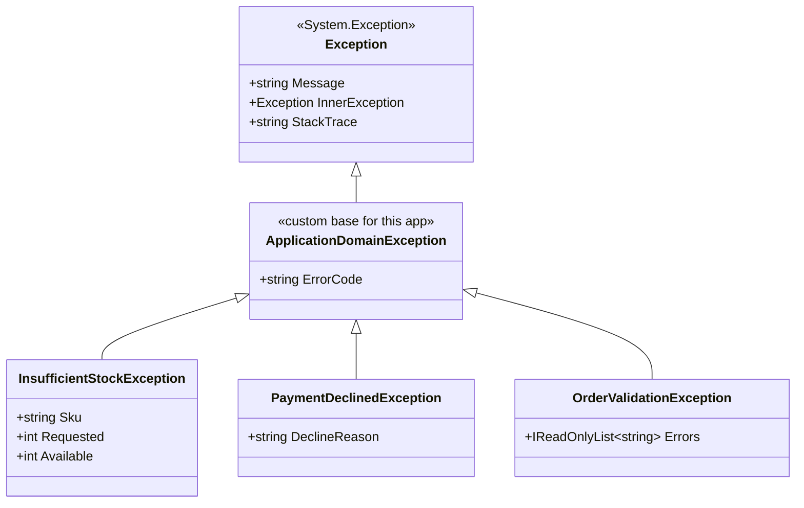
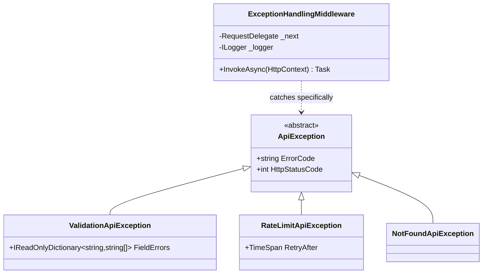
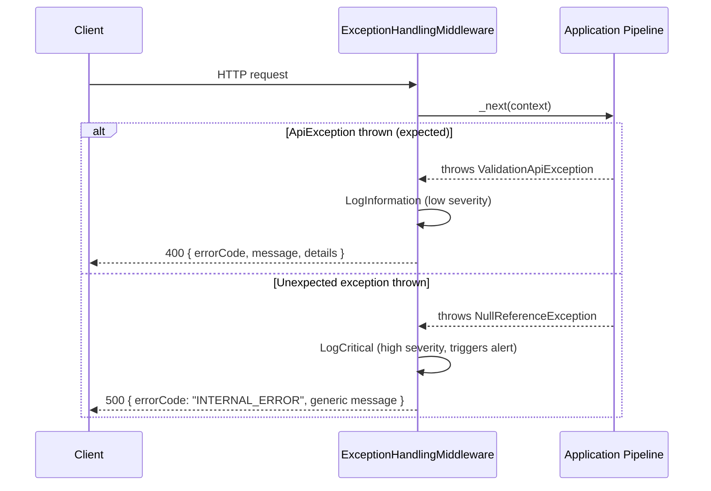

# Module 8 — C# Advanced: Exception Handling, SEH Internals & Custom Exception Design

> Domain: C# | Level: Beginner → Expert | Prerequisite: [[02-Async-Await-Internals]] (exception capture/rethrow across `await`), [[04-Delegates-Events-Closures]] (multicast exception-abort behavior), [[01-CLR-JIT-GC-Memory-Management]] (stack unwinding, finalization)

---

## 1. Topic Description

### Definition

.NET exceptions use a **two-pass, table-driven** model. The first pass walks the stack looking for a handler whose type matches and whose `when` filter returns true; only once one is found does the second pass unwind, running `finally` blocks along the way. That ordering is why a filter observes the stack *at the throw point*, and why table-driven dispatch makes `try` blocks free on the non-throwing path while making a throw expensive — roughly microseconds, dominated by stack-trace capture and the two-pass walk. **Exception design** is the separate, architectural half: which failures are genuinely exceptional, what a custom exception hierarchy should look like, and where exceptions are translated into API responses or messages.

### Core sub-concepts

- **The two-pass model** — filter evaluation before unwinding; `when` filters for conditional handling and for logging with an intact stack.
- **`throw` vs `throw ex` vs `ExceptionDispatchInfo`** — stack-trace preservation and rethrowing across contexts.
- **`finally` guarantees and their limits** — `StackOverflowException`, `FailFast`, process kill; why `finally` is not a durability mechanism.
- **Cost model** — free to declare, expensive to throw; first-chance versus unhandled exception rates.
- **Exceptions you should not catch** — `OutOfMemoryException`, `StackOverflowException`, corrupted-state exceptions, and `OperationCanceledException` treated as an error.
- **`AggregateException`** — `Flatten()`, and the `await`-versus-`.Result` difference in exception *shape*.
- **`InnerException` chains and wrapping** — adding context across an architectural boundary versus renaming for no benefit.
- **Custom exception design** — shallow, intention-revealing hierarchies; structured data on the exception rather than formatted message strings.
- **Exceptions vs result types** — frequency and locality as the deciding tests; where each model belongs in a layered system.
- **Boundary translation** — centralised middleware, status-code mapping, `ProblemDetails`, correlation IDs, and what must never reach a client.
- **Retry classification** — transient versus permanent, and the inseparable pairing with idempotency.
- **Observability of failures** — structured logging at the handling boundary, avoiding double-logging, error-rate classification.

### Where it fits

Exception handling is the failure-path counterpart to every other topic in this folder: async determines *where* an exception surfaces (`await` versus `.Result`), delegates and events determine whether a handler's exception silences the rest of the invocation list, and disposal semantics determine whether cleanup runs. Upward it defines a service's error contract, its error-budget SLI, and how a distributed caller distinguishes "retry me" from "stop".

### Why it matters at scale

Exception design failures degrade a system in two directions. Diagnostically: `throw ex` resets the stack trace so logs point at the catch block instead of the bug; `catch (Exception) { log; }` converts a failure into a silent wrong answer whose symptom appears far from its cause; double-logging at every layer makes the error rate meaningless so real incidents hide in noise. Operationally: exceptions used for expected outcomes cost microseconds each, so a routinely-throwing path burns CPU entirely invisibly because those exceptions are caught and never reach error metrics — a first-chance rate well above the request rate is a common, unnoticed tax. And retry logic that does not classify errors will faithfully retry a payment that already succeeded.

### Common pitfalls / anti-patterns

- **`throw ex;` instead of `throw;`** — resets the stack trace to the catch site, destroying the record of where the failure actually originated, and only discovered during an incident when the information is gone.
- **`catch (Exception ex) { log; }` followed by continuing** — the operation failed but the caller is told it succeeded, so partial or corrupt state propagates and the eventual symptom is far from the cause.
- **Using exceptions for expected outcomes** (validation failures, cache misses, `Parse` instead of `TryParse`) — thousands of throws per second consume CPU and allocations while remaining invisible to unhandled-exception telemetry.
- **Catching `OperationCanceledException` as a failure** — client disconnects and timeouts inflate the error rate, hiding genuine problems and corrupting the error-budget SLI.
- **Retrying without classifying, or without idempotency** — a timed-out non-idempotent write is retried and double-applies; a validation failure is retried until the budget is exhausted.
- **A deep or purely taxonomic custom hierarchy** — nobody knows what to catch, so everyone catches the base type and the hierarchy provides no value; equally, a library wrapping everything in one custom type forces consumers to inspect `InnerException`.
- **Leaking internals in the error response** — stack traces, SQL and type names are an information-disclosure finding, and clients start depending on them.
- **Relying on `finally` for cross-process invariants** — a distributed lock released only in `finally` is held forever when the process dies; that needs a lease with a timeout.

> Scope note: how exceptions are stored on tasks and the `await`-versus-`.Result` shape difference belongs to `02-Async-Await-Internals`; GC and finalizer interactions to `01-CLR-JIT-GC-Memory-Management`.

---

## 2. Beginner (10 Q&A)

**Q1. What's wrong with this catch block?**
```csharp
catch (SqlException ex) {
    _logger.LogError(ex, "Query failed");
    throw ex;
}
```
**A:** `throw ex;` resets the stack trace to this line, so your logs point at the catch block instead of where the failure actually originated. Use `throw;` to rethrow preserving the original trace. It's one of the highest-cost-per-character mistakes in C#, because the damage only appears during an incident when the information you needed is already gone. If you must rethrow from a different context, `ExceptionDispatchInfo.Capture(ex).Throw()` preserves it.
*Follow-up: When would you actually need `ExceptionDispatchInfo` rather than a plain rethrow?*

**Q2. Review this.**
```csharp
try { await ProcessAsync(order); }
catch (Exception ex) { _logger.LogError(ex, "failed"); }
return Ok();
```
**A:** It turns a failure into a silent wrong answer — the operation didn't succeed but the caller is told it did, so partial state propagates and the eventual symptom appears far from the cause. It also swallows things that should never be caught here: cancellation, out-of-memory, programming errors. The legitimate version of this pattern is narrow — a genuinely optional side effect like emitting a metric, with a comment explaining why continuing is correct.
*Follow-up: Where *is* a top-level `catch (Exception)` legitimate, and what must it do?*

**Q3. Why does this `catch` stop working when you change `await` to `.Result`?**
```csharp
try { var x = await GetAsync(); }
catch (SqlException) { ... }
```
**A:** `await` rethrows the stored exception with its original type. `.Result` and `.Wait()` wrap it in an `AggregateException`, so `catch (SqlException)` no longer matches and the failure escapes. It's a silent behavioural change from what looks like a mechanical edit — and it's a good argument for why sync-over-async isn't just a performance concern.
*Follow-up: How do you get every failure out of a faulted `Task.WhenAll`?*

**Q4. When does a `finally` block not run?**
**A:** When the process doesn't survive to run it — `StackOverflowException`, `Environment.FailFast`, a process kill, power loss. The design implication is that `finally` is a guarantee *within a functioning process*, not a durability mechanism. So cleanup that must happen even if the process dies — releasing a distributed lock, marking a job abandoned — needs an external mechanism like a lease with a timeout. Engineers who rely on `finally` for cross-process invariants are surprised exactly once.
*Follow-up: How would you make a distributed lock safe against the holder dying?*

**Q5. What does it cost to throw an exception?**
**A:** Having `try` blocks is essentially free — modern runtimes use table-driven handling with no cost on the non-throwing path. Throwing is expensive: stack-trace capture, the two-pass walk and the allocation together cost on the order of microseconds, thousands of times more than a normal return. Irrelevant when exceptions are actually exceptional; completely dominant when used for expected outcomes. A validation path throwing per request at volume is a measurable, entirely self-inflicted cost.
*Follow-up: Where does that cost show up first — CPU, allocation, or something else?*

**Q6. What's the two-pass exception model, and what does it let you do?**
**A:** The first pass walks the stack looking for a handler whose type matches and whose `when` filter returns true; only once one is found does the second pass unwind, running `finally` blocks. The consequence that matters: a filter runs *before* unwinding, so the stack at the throw point is still intact. That's why logging from inside a `when` filter captures far more useful state than logging from a `catch` block. It also means a filter must not have side effects that assume unwinding has happened.
*Follow-up: How would you use a filter to log without actually handling the exception?*

**Q7. Which exceptions should you generally not catch?**
**A:** `OutOfMemoryException` and `StackOverflowException` mean the process is no longer in a state you can reason about — and the latter can't be caught at all. `AccessViolationException` and similar corrupted-state exceptions mean memory integrity is already gone. And `OperationCanceledException` shouldn't be caught *as an error*, because cancellation is a normal outcome — logging it as a failure fills your error rate with client disconnects. General rule: catch what you can meaningfully act on; catching what you can't turns a clean crash into an unpredictable zombie process.
*Follow-up: Your error dashboard is 40% `OperationCanceledException`. What do you change?*

**Q8. When should you define a custom exception type?**
**A:** When callers need to catch *that specific failure* and act differently — a domain rule violation they translate to a 422, a transient dependency failure they retry, a concurrency conflict they resolve. If no caller will ever catch it selectively, a framework exception with a good message serves better, because every custom type is API surface someone must learn. And custom exceptions should carry structured data — the entity id, the rule violated — rather than encoding it in the message string, so handlers and logs can use it without parsing English.
*Follow-up: How many custom exception types would you expect in a service, and what does a hundred tell you?*

**Q9. What belongs in an exception message, and what doesn't?**
**A:** Belongs: what operation failed, on what, and enough context to identify the instance — ideally as structured properties with the message summarising them. Doesn't: secrets, connection strings, personal data, or internal implementation detail that'll end up in a client response or an unprotected log. The message is read by an engineer during an incident, so it should answer "what was the system trying to do" rather than restate the exception type. Anything a caller branches on should be a property or a type, never a substring.
*Follow-up: Where's the line between the exception message and structured logging fields?*

**Q10. What's the difference between a first-chance and an unhandled exception?**
**A:** First-chance fires when the exception is thrown, before any handler runs; unhandled means it reached the top of the stack with nothing catching it. The gap matters operationally: a service can be throwing and catching thousands of exceptions a second — quietly burning CPU — with none of it visible in unhandled-exception telemetry. Watching first-chance rates via runtime counters is how you discover exceptions being used as control flow, often inside a dependency.
*Follow-up: How would you find which exception type dominates a high first-chance rate?*

---

## 3. Intermediate (10 Q&A)

**Q1. How would you design an exception hierarchy for a service?**
**A:** Shallow and intention-revealing: a small number of base types corresponding to how callers actually respond — domain/validation failure, not-found, conflict, transient dependency failure — with specific types beneath only where a caller genuinely branches. What I avoid is depth for taxonomy's sake, because a five-level hierarchy means nobody knows what to catch so everyone catches the base; and a flat set of fifty unrelated types, because then callers can't catch a category at all. Each type carries structured data rather than formatted strings, and the hierarchy is documented by *what a handler should do*, which is the only question a catch site is really asking.
*Follow-up: How does that map to HTTP status codes without leaking domain detail to clients?*

**Q2. Exceptions or result types for expected failures?**
**A:** Exceptions for genuinely exceptional conditions and for things no local caller can handle; result types for outcomes that are part of the operation's normal contract — validation failures, not-found lookups, business-rule rejections. The tests are frequency and locality: if the failure happens routinely, or the immediate caller always handles it, an exception is both slower and less honest than a return value. What I wouldn't do is adopt result types everywhere — they infect every signature, compose awkwardly with async and LINQ, and fight a framework built around exceptions. Mixed and deliberate beats pure and dogmatic.
*Follow-up: A method has five distinct failure reasons. How do you express that without five exception types?*

**Q3. How should exceptions be handled at an API boundary?**
**A:** Centrally, in one middleware or filter mapping exception types to status codes and a consistent problem-detail body — never with try/catch scattered through controllers, which produces inconsistent responses and duplicated code. The mapping is a policy decision: domain violations to 400/422, not-found to 404, concurrency to 409, unmapped to 500 with a generic message. The response must not carry stack traces, SQL or type names — that's both an information-disclosure risk and useless to the client. What does go out is a correlation ID that appears in the logs.
*Follow-up: How do you stop that mapping becoming a giant switch every feature has to edit?*

**Q4. What's wrong with the observability here, and what would you change?**
```csharp
catch (Exception ex) { _logger.LogError("Failed: " + ex.Message); throw; }
```
**A:** Three things. It logs the message but not the exception object, so the stack and inner exceptions are lost. It uses string concatenation, so nothing is queryable or aggregatable. And it logs then rethrows, so the same failure gets logged again at every level up the stack — one failure, five log entries, and an error rate that means nothing. Log at the boundary where it's handled, pass the exception object, use structured fields, and enrich with context on the way up rather than logging on the way up.
*Follow-up: You need context from three layers down. How do you attach it without logging at each layer?*

**Q5. How do you handle exceptions in a retry policy?**
**A:** Retry only what's genuinely transient — timeouts, connection failures, throttling responses, deadlock victims — and never a validation failure, an authorisation failure or a business-rule rejection, which will fail identically every time while consuming capacity. The classic mistake is retrying non-idempotent operations, so a timeout on a payment that actually succeeded becomes a double charge. Second mistake is retrying without jitter and backoff, which synchronises clients into a thundering herd exactly when the dependency is weakest. Retry classification and idempotency are one design decision, not two.
*Follow-up: A write times out and you don't know whether it committed. What's the correct pattern?*

**Q6. How does exception handling interact with cancellation?**
**A:** Cancellation surfaces as `OperationCanceledException`, which is a normal outcome rather than a failure — so it must be distinguished from real errors, or every client disconnect inflates your error rate and hides genuine problems. The subtlety is disambiguation: an exception may be cancellation from *your* token or a timeout from a dependency's, and those mean different things, which is why comparing the exception's token against your own matters. And cancellation shouldn't be silently swallowed either, because a caught-and-ignored cancellation means the operation carries on doing work nobody wants.
*Follow-up: A downstream timeout throws `TaskCanceledException`. How do you tell it from a real client cancellation?*

**Q7. What's the correct pattern for wrapping a lower-level exception in your own?**
**A:** Wrap when you're adding genuinely useful context or translating across an architectural boundary — a data-access failure becoming a repository-level exception the domain can reason about — and always pass the original as `InnerException`. Don't wrap merely to rename, which adds a stack layer and a type nobody catches while obscuring the actual problem. Also preserve any structured data the original carried, since a wrapped exception whose detail is only in a string is a diagnostic downgrade. When in doubt, letting the original propagate beats an uninformative wrapper.
*Follow-up: How deep does an `InnerException` chain get before it's a problem?*

**Q8. How do you test exception behaviour meaningfully?**
**A:** Assert on the specific type and the structured data, not on message text — messages change, and message-based assertions are brittle and get deleted. Test that `finally`/`using` cleanup actually ran, that cancellation propagates as cancellation rather than as an error, and that the API boundary maps each exception type to the right status and body, since that mapping is where regressions actually hurt. The tests people skip matter most operationally: that a partial failure leaves no half-committed state, and that the failure path logs enough to diagnose it.
*Follow-up: How would you test that a failure mid-transaction leaves the system consistent?*

**Q9. What's the cost profile of exception-heavy code, and how do you detect it?**
**A:** Microseconds each, so a path throwing routinely — `Parse` instead of `TryParse`, control flow via exceptions, a dependency throwing on every cache miss — burns CPU and allocations invisibly, because the exceptions are caught and never reach error metrics. Detect it with the runtime's exception-count counter and first-chance monitoring, comparing throw rate against request rate; a ratio well above one is a strong signal. A CPU profile shows the throw machinery directly. The fix is usually a `Try*` variant or a redesign of the failure path, and the win is often surprisingly large because nobody knew the cost existed.
*Follow-up: The throws are inside a third-party library on every call. Options?*

**Q10. Where would you use a `when` filter in production code?**
**A:** Two places. Genuinely conditional handling — catching an `HttpRequestException` only when the status code is retryable, without catch-and-rethrow, which would otherwise disturb the flow. And diagnostics: a filter that logs and returns `false` runs before unwinding, so it captures full stack state at the throw point while leaving the exception to propagate untouched. Both are cleaner than the catch-inspect-rethrow pattern, which is easy to get wrong with `throw ex`. The caution is that expensive or throwing code inside a filter is a bad place to be.
*Follow-up: What happens if the filter itself throws?*

---

## 4. Expert / Architect (10 Q&A)

**Q1. What error-handling philosophy would you set for a large service estate, and how do you make it stick?**
**A:** A small number of principles that resolve real arguments: exceptions for exceptional conditions and results for expected outcomes; failures handled where they can be acted on rather than where they occur; no swallowing without a documented reason; a shared exception base set with a defined mapping to API responses. Making it stick means encoding rather than publishing — analyzers banning empty catches and `throw ex`, a shared middleware package doing the mapping so teams inherit it, a shared logging enricher so correlation is automatic. Guidance nobody can violate accidentally is worth more than guidance everyone agrees with.
*Follow-up: A team needs to deviate from the standard mapping for a legacy client. How do you handle that?*

**Q2. How should exceptions be treated at service boundaries in a distributed system?**
**A:** They stop at the boundary. Exceptions are an in-process control-flow mechanism; across a network you have status codes, error payloads and message outcomes, and serialising an exception type across services couples their internals and leaks implementation detail. The right shape is a stable error contract — machine-readable code, human-readable message, correlation ID, and a retryability indicator. That last one is the part teams most often omit and most need, because without it every caller invents its own classification and gets it wrong for at least one case.
*Follow-up: How do you propagate enough context for end-to-end diagnosis without leaking internals?*

**Q3. How do you design failure handling so partial failures don't corrupt state?**
**A:** Make the unit of work explicit and ensure every operation is either atomic within one resource or explicitly compensable across several. In practice: a local transaction where possible; an outbox where a state change and a message must both happen; idempotency keys so a retry after an ambiguous failure can't double-apply; sagas with compensating actions where a distributed sequence genuinely can't be atomic. The try/catch code is the smallest part of this — the real work is deciding, per operation, what "failed" means and what state the system may be left in. Teams that treat it as a try/catch question end up with half-applied writes discovered during reconciliation.
*Follow-up: A compensating action itself fails. What's your design for that?*

**Q4. What does a client get told when something fails, especially in a regulated environment?**
**A:** A stable error code, a safe message, and a correlation ID — never stack traces, internal type names or SQL, because that's both an information-disclosure finding and useless to them. Internally the full detail goes to logs behind access control, with personal data handled per the data-classification policy, since exception messages are a notorious channel for PII to reach logs with longer retention than policy allows. In a regulated setting I'd also expect failures of security-relevant operations to produce audit records distinct from error logs — "the payment failed" is operational, "authorisation was denied" is auditable.
*Follow-up: A developer adds the request payload to an exception message for debugging. Review response?*

**Q5. How do you evaluate a proposal to adopt result types across a codebase?**
**A:** Ask which specific problem it solves and where. Result types genuinely improve domain and application layers where failure is an expected, enumerable outcome and the compiler forcing you to handle it has real value. They're a poor fit at the edges, where the framework, the ORM and every library throw anyway, so you end up with translation in both directions and two error models to keep in sync. My position: adopt in the core where failures are domain outcomes, keep exceptions at the boundaries and for genuinely unexpected conditions, and be explicit about where conversion happens. Blanket adoption usually costs more in signature noise and library friction than it returns.
*Follow-up: The team wants to eliminate exceptions entirely for "explicit error handling". Response?*

**Q6. How do you drive down error-rate noise so the signal is usable?**
**A:** Classify rather than suppress. Client-caused failures — validation, 404s, cancellation — go in a different bucket from server-caused ones, so the error-rate SLI reflects things the team can fix. Expected transient failures that succeeded on retry are worth counting separately, because their rate is a leading indicator even though they aren't incidents. Then attack the top contributors specifically: the single endpoint producing 60% of errors, the dependency throwing on every cache miss. The organisational point is that a noisy dashboard isn't a monitoring problem but an ownership problem — if nobody's accountable for the rate it only grows, alerts get ignored, and that's how a real incident gets missed.
*Follow-up: How do you set an error-budget SLO when many errors are client-caused?*

**Q7. What's your approach to exception handling in a plugin or extension architecture?**
**A:** Assume every extension will throw, hang and leak, because eventually one will. In-process that means invoking each extension in its own try/catch, applying a timeout, attributing the failure to the specific plugin in telemetry, and having a policy for repeat offenders — disabling a plugin after repeated failures beats letting it degrade the host. What in-process isolation can't protect against is memory exhaustion, stack overflow or a runaway loop, so if extensions are genuinely untrusted the boundary has to be a process or a sandbox rather than a catch block. I'd make that call explicitly on trust level and be clear which guarantees the cheaper option doesn't give.
*Follow-up: Which failure modes survive process isolation, and what do you do about those?*

**Q8. How would you migrate a legacy codebase full of `catch (Exception) { }` to something diagnosable?**
**A:** Not by deleting them, because some are load-bearing in ways nobody remembers and removing them turns silent degradation into an outage. First make them visible: add logging inside every empty catch so the actual rate and types are known — that alone usually reveals a handful of paths generating almost all of it. Then remove or narrow in priority order, with an analyzer enabled for new code and a suppression baseline for existing sites so the debt is bounded and burning down. Each removal needs a decision about what should happen instead, which is a design conversation rather than a mechanical edit, and that's why this work is slower than it looks.
*Follow-up: Logging inside the empty catches reveals 50,000 exceptions an hour. How do you prioritise?*

**Q9. How does exception design differ between a shared library and an application?**
**A:** A library's exceptions are public API: the types, the hierarchy and the conditions under which they're thrown are a contract, and changing them breaks consumers in ways the compiler won't catch. So a library should throw a small, documented, stable set; use framework types where they fit rather than inventing parallel ones; never catch and swallow on the consumer's behalf; and be explicit about which failures are transient. An application has far more freedom because it owns all its call sites. The mistake I see most is a library wrapping everything in one custom type, which forces every consumer to inspect `InnerException` and defeats typed handling entirely.
*Follow-up: You need to add a new exception type to a widely-used library. How, without breaking consumers?*

**Q10. Retries are configured at three layers and one request becomes 27 downstream calls. How do you fix and prevent that?**
**A:** Exceptions are the signal; resilience patterns are the policy acting on them, and the layering matters. Timeouts bound everything and should derive from a request budget. Retry sits closest to the call and handles transient failures only, on idempotent operations only. Circuit breakers sit above retry so a consistently failing dependency stops receiving traffic rather than absorbing the full retry load. Fallbacks decide what the caller sees. The multiplication happens when each layer is configured independently, so the fix is a shared client package where classification and layering are decided once and configured per dependency — and reviewed as an architectural concern, because this is exactly how a slow dependency becomes a self-inflicted outage.
*Follow-up: How would you detect that multiplication in production before it causes one?*

---

## 5. Reference Material

> Retained from the original module: deep-dive internals, diagrams, production examples, exercises, system/low-level design, debugging walkthroughs and the Principal Engineer perspective.

### 1. Fundamentals

#### What is exception handling?
Exception handling is the mechanism by which.NET represents and propagates **exceptional, non-local control flow** — when a method cannot complete its contract, it throws an exception object describing what went wrong, and the runtime unwinds the call stack looking for a `catch` block prepared to handle that exception type, running `finally` blocks along the way.

#### Why does it exist?
Before structured exception handling, error signaling relied on return codes (`int` error codes, `HRESULT`-style values) that could be silently ignored (nothing forces a caller to check a return value) and couldn't naturally carry rich context (a stack trace, an inner cause, arbitrary data) without significant additional plumbing. Exceptions make error propagation **impossible to silently ignore** (an unhandled exception terminates the operation, or the process, rather than continuing with corrupted state) and **carry rich diagnostic context automatically** (stack trace, type, message, inner exception chain).

#### When does this matter?
- **Always**, since every.NET program uses exceptions for genuinely exceptional conditions — but *precisely when* to use exceptions versus a `Result<T>`-style return value or a `TryX`/boolean-return pattern is a design decision with real performance and API-clarity consequences.
- **Critically** for designing library/API boundaries — a well-designed custom exception hierarchy communicates failure modes clearly to callers; a poorly-designed one (overly broad, uninformative, or inconsistent) makes robust error handling by callers difficult or impossible.
- **Critically** for production reliability — understanding precisely what state remains valid after an exception (is a partially-updated object now corrupted? did a lock get released? did a `using` block dispose correctly?) is central to writing correct, resilient code.

#### How does it work (30,000-ft view)?

```csharp
try
{
    ProcessOrder(order); // might throw
}
catch (OrderValidationException ex) when (ex.ErrorCode == "INSUFFICIENT_STOCK")
{
    // handle this SPECIFIC failure mode
}
catch (OrderValidationException ex)
{
    // handle other validation failures
}
finally
{
    ReleaseResources; // ALWAYS runs, whether an exception occurred or not
}
```

Mental model for interviews: **"An exception is an object describing a failure; throwing it unwinds the stack, running `finally` blocks along the way, until a matching `catch` is found (or the process terminates if none is). Exception filters (`when`) let you match on both type AND runtime conditions, without unwinding the stack to evaluate the filter."**

### 2. Deep Dive

#### 2.1 Structured Exception Handling — the CLR/OS-Level Mechanism

.NET's exception handling is built on top of the OS's native **Structured Exception Handling (SEH)** on Windows (and an equivalent unwind-table-based mechanism on Linux/macOS via the CLR's own portable exception-handling implementation). When a `throw` executes:
1. The CLR captures the current stack trace **at the throw point** (not the catch point — a critical, frequently-tested fact) and packages it with the exception object.
2. The runtime searches **up the call stack**, frame by frame, for a `try` block with a `catch` clause whose type matches (or is a base type of) the thrown exception's type — this search happens in two conceptual passes: a **first pass** identifies the matching handler without yet unwinding anything (evaluating exception filters, `when` clauses, during this pass —), and a **second pass** actually unwinds the stack down to the matching handler, running `finally` blocks (and `catch` blocks that were passed over) along the way.
3. If no handler is found anywhere up to the top of the call stack, the exception is **unhandled** — the CLR terminates the process (after running any registered unhandled-exception-event handlers, primarily for logging, since they cannot prevent termination for most exception types).

**Critical fact**: because filter evaluation (`when`) happens during the **first pass, before any unwinding occurs**, a debugger attached at the moment of an exception can inspect the *exact* state of the stack at the throw point even when a filter ultimately doesn't match and the exception continues propagating further up — this is precisely why `catch (Exception ex) when (LogAndReturnFalse(ex))` is a legitimate, sometimes-used pattern for "log this exception's full context, but don't actually handle it here, let it keep propagating".

#### 2.2 The Real Cost of Throwing an Exception

Throwing an exception is **expensive** relative to ordinary control flow — not because of the `try`/`catch` blocks themselves (entering a `try` block with no exception thrown has near-zero cost in modern.NET), but specifically because of:
- **Stack trace capture**: walking and recording the full call stack at the throw point.
- **The two-pass search-then-unwind mechanism** itself: significantly more expensive than a simple `return` or branch, since it involves runtime metadata lookups (finding which `catch` clauses exist in each frame, matching types) and OS-level unwinding machinery.
- **Exceptions should never be used for ordinary, expected control flow** (e.g., "did this dictionary contain the key" via catching a `KeyNotFoundException` instead of `TryGetValue`) — this is a well-known, measurable anti-pattern precisely because of this cost, not merely a style preference. A `TryParse`/`TryGetValue`-style API avoids the exception path entirely for the "expected failure" case, reserving exceptions for genuinely exceptional conditions.

#### 2.3 `finally` Blocks — Guarantees and Their Limits

`finally` blocks are guaranteed to run whenever the corresponding `try` block is exited — via normal completion, an exception (caught or not, as long as the process doesn't hard-crash), a `return`, `break`, or `continue` inside the `try`. **Exceptions to this guarantee**: a `finally` block will **not** run if the process is terminated abruptly (`Environment.FailFast`, a `StackOverflowException` — which cannot be caught at all since.NET 2.0 specifically because the stack is already exhausted and there's no safe way to run handler code, or an unrecoverable CLR-level failure), and historically (pre-.NET Core, on classic.NET Framework) certain `catch`/`finally` execution could be skipped under specific `ThreadAbortException` scenarios (a legacy mechanism removed entirely in modern.NET Core/5+, since `Thread.Abort` itself now throws `PlatformNotSupportedException`).

`using`/`using var` statements desugar directly into a `try`/`finally` calling `Dispose` — this is precisely how deterministic resource cleanup is guaranteed even when an exception occurs mid-block.

#### 2.4 Exception Filters (`when`) — Precise Semantics and Use Cases

```csharp
try { CallExternalApi; }
catch (HttpRequestException ex) when (ex.StatusCode == HttpStatusCode.TooManyRequests)
{
    // handle rate-limiting specifically
}
catch (HttpRequestException ex) when (LogAndDecide(ex)) // side-effecting filter -- see caution below
{
    //...
}
catch (HttpRequestException)
{
    // handle all OTHER HttpRequestExceptions
}
```
An exception filter (`when (...)`) is evaluated **during the first pass**, before the stack unwinds — meaning: (a) it can inspect the exact call-stack state at the throw point (useful for rich diagnostic logging even for exceptions you don't ultimately handle at this frame), and (b) if the filter evaluates `false`, the runtime continues searching **further up the stack** for another matching handler, exactly as if this `catch` clause didn't match at all — the exception is **not** "caught and rethrown," it simply was never caught here in the first place, a subtly different (and cheaper — no unwind/rethrow cost) semantic than the older pattern of `catch (T ex) { if (!condition) throw;... }`.

**Caution**: filters **can** contain side effects (calling a logging method, as in the `LogAndDecide` example), but this is a debated practice — a filter with side effects executes even for exceptions the filter ultimately decides *not* to handle (if it returns `false`), meaning "logging as a filter side effect" logs on every attempted match, not just successful ones; used deliberately and sparingly (typically for "log full context regardless of whether we act on it here" scenarios) this is a legitimate, sometimes-cited idiom, but filters with substantial side effects/business logic embedded in them are a real anti-pattern since they make control flow significantly harder to reason about at a glance.

#### 2.5 Stack Trace Capture, `throw;` vs `throw ex;`, and `ExceptionDispatchInfo`

```csharp
try { DoWork; }
catch (Exception ex)
{
    LogError(ex);
    throw; // RETHROWS preserving the ORIGINAL stack trace (captures at DoWork's throw point)
    // throw ex; // WOULD reset the stack trace to THIS line -- loses the original throw location -- almost always wrong
}
```
`throw;` (no expression) rethrows the **current** exception, preserving its original `StackTrace` property exactly as captured at the original throw site. `throw ex;` (re-throwing the caught variable as a new throw statement) **resets** the stack trace to the location of this new `throw` statement — a genuine, common bug that destroys crucial debugging information (where did this actually originate?), and one of the most consistently-tested "does this candidate actually understand exceptions" interview questions.

For scenarios needing to **re-throw an exception from a different location than where it was caught** (e.g., capturing an exception on a background thread and rethrowing it on the calling thread — precisely what `Task`'s internal machinery does for you automatically,/), `System.Runtime.ExceptionServices.ExceptionDispatchInfo.Capture(ex).Throw` preserves the original stack trace while allowing the actual `throw` to occur at a different point in the code/call stack than the original catch — the exact mechanism `Task.Wait`/`.Result`'s `AggregateException` unwrapping and `await`'s exception-rethrowing rely on internally to give you a *usably accurate* stack trace despite the exception having crossed a thread/continuation boundary.

#### 2.6 Custom Exception Design — the Standard Shape and Why

```csharp
[Serializable] // legacy attribute, still conventionally included though binary serialization is largely deprecated
public class OrderValidationException: Exception
{
    public string ErrorCode { get; }

    public OrderValidationException(string message, string errorCode)
    : base(message)
    {
        ErrorCode = errorCode;
    }

    public OrderValidationException(string message, string errorCode, Exception innerException)
    : base(message, innerException)
    {
        ErrorCode = errorCode;
    }
}
```
The standard convention: **derive from `Exception` (or a more specific existing base like `InvalidOperationException`/`ArgumentException` if genuinely appropriate — for when), provide the conventional constructor overloads** (message-only, message + inner exception, and any custom-data constructors your exception needs), and **add strongly-typed properties for structured error data** (`ErrorCode`, `ValidationErrors`, etc.) rather than encoding that data only into the free-text `Message` string, which forces callers into fragile string-parsing to programmatically react to specific failure details.

#### 2.7 Choosing a Base Exception Type — the Decision That Actually Matters

- **`ArgumentException`/`ArgumentNullException`/`ArgumentOutOfRangeException`**: for invalid **arguments passed by a caller** — represents a **caller bug** (the calling code violated the method's contract), not a runtime/environmental failure. Should generally not be caught and "handled" by ordinary application logic — fixing the calling code is the correct response, not a `catch` block papering over it.
- **`InvalidOperationException`**: the object/system is in a state where the requested operation doesn't make sense right now (e.g., calling `.Current` on an enumerator before the first `MoveNext`) — a very common, appropriately-broad choice for "this operation isn't valid given the current state" failures that aren't specifically about a bad argument.
- **A custom exception deriving directly from `Exception`**: for genuinely domain-specific failure modes that callers are expected to specifically catch and handle differently from generic runtime failures (`InsufficientStockException`, `PaymentDeclinedException`) — these represent **expected, "part of the domain's normal failure vocabulary"** outcomes, not bugs, and deserve their own distinct type precisely so calling code can `catch` them specifically (often as an alternative to, or alongside, a `Result<T>`-style return value,, for cases where the "exceptional-ness" is genuine).
- **Never throw the bare `System.Exception` type directly**, and (generally) **never catch bare `Exception` except at a small number of well-justified top-level boundaries** (a global unhandled-exception handler, a background-job runner's per-job isolation boundary) — catching `Exception` broadly elsewhere risks silently swallowing genuinely unexpected bugs (`NullReferenceException`, `OutOfMemoryException`) that should surface loudly, not be treated the same as an expected domain failure.

### 3. Visual Architecture

#### Two-Pass Exception Handling (ASCII)

```
Call stack at throw time:
 Main
 └── ProcessOrder
 └── ValidateStock <-- throw new InsufficientStockException(...) HERE

PASS 1 (search, no unwinding yet):
 ValidateStock frame: any matching catch here? No try/catch in this frame.
 ProcessOrder frame: try/catch(InsufficientStockException) when (...)? EVALUATE FILTER (stack NOT yet unwound)
 -> filter returns true -> MATCH FOUND at this frame

PASS 2 (unwind down to the matched frame):
 ValidateStock frame: run any 'finally' blocks in this frame, pop it
 ProcessOrder frame: stack trace was already captured at throw time (ValidateStock's line);
 now actually execute the matched catch block's body
```

#### Exception Hierarchy Example


```mermaid
classDiagram
 class Exception {
 <<System.Exception>>
 +string Message
 +Exception InnerException
 +string StackTrace
 }
 class ApplicationDomainException {
 <<custom base for this app>>
 +string ErrorCode
 }
 class InsufficientStockException {
 +string Sku
 +int Requested
 +int Available
 }
 class PaymentDeclinedException {
 +string DeclineReason
 }
 class OrderValidationException {
 +IReadOnlyList~string~ Errors
 }
 Exception <|-- ApplicationDomainException
 ApplicationDomainException <|-- InsufficientStockException
 ApplicationDomainException <|-- PaymentDeclinedException
 ApplicationDomainException <|-- OrderValidationException
```

### 4. Production Example

#### Scenario: Payment service — an over-broad `catch (Exception)` masking a critical bug for months

**Problem**: A payment-processing service had a top-level `catch (Exception ex) { LogError(ex); return PaymentResult.Failed("An error occurred"); }` wrapping its entire `ProcessPayment` method — a defensive pattern intended to ensure the API "always returns a clean result, never crashes." Months later, an investigation into a slow, gradual increase in "payment failed" support tickets revealed that a **`NullReferenceException`** caused by a genuine, unrelated bug (a race condition leaving a configuration object briefly null during a specific reload window) had been silently caught by this broad handler and reported to users as an ordinary "payment failed, please retry" message — masking a real, fixable production bug behind a generic, uninformative failure message for months, since the broad `catch` gave it exactly the same treatment as an expected `PaymentDeclinedException`.

**Investigation**:
- Structured logging (which *was* correctly capturing the caught exception's type and message, fortunately) eventually revealed, once someone specifically filtered logs by exception type rather than just "payment failed" outcome counts, that a meaningful fraction of "failures" were `NullReferenceException`, not the expected domain exceptions (`PaymentDeclinedException`, `InsufficientFundsException`) the broad catch was originally intended to normalize into a clean API response.
- The race condition itself was found and fixed once actually investigated as a distinct bug — but the multi-month delay in even *recognizing* it as a distinct, unexpected bug (rather than "normal" payment failures) was entirely attributable to the over-broad exception handling masking the distinction.

**Architecture fix**:
- Replaced the single broad `catch (Exception)` with specific `catch` clauses for each expected domain exception type (`PaymentDeclinedException`, `InsufficientFundsException`, `PaymentGatewayTimeoutException`), each mapped to its own specific, accurate `PaymentResult` failure reason.
- Added a final, narrow `catch (Exception ex) when (IsUnexpected(ex))` clause specifically for genuinely unanticipated exceptions, which logs at a **distinctly higher severity** (triggering an alert, not just a log entry) and returns a generic "system error, we're looking into it" result — deliberately differentiating "an expected domain failure" from "an unexpected bug" in both the logging severity and the alerting behavior, not just the returned message.
- Added a dashboard specifically tracking the *rate* of this "unexpected exception" category as a first-class reliability metric, distinct from the expected-domain-failure rate.

**Trade-offs**: The more granular exception handling is more code to write and maintain per new domain exception type introduced — accepted as a clearly worthwhile cost given the multi-month masked-bug incident this fixed, and because it directly improves the team's ability to distinguish "the payment domain is working as designed, just declining this specific payment" from "our system has a bug" — a distinction with real business value (the former needs no action, the latter needs urgent investigation).

**Lessons learned**:
1. A broad `catch (Exception)` that treats every failure identically actively destroys the information needed to distinguish "expected domain outcome" from "unexpected bug" — precisely the distinction that matters most for triage and alerting.
2. Logging the exception (even correctly) is not sufficient if nothing is actively monitoring/alerting on the *type* distribution of caught exceptions — the information being present in logs didn't prevent months of the bug going unrecognized, because no one was looking at exception-type breakdowns as a metric.
3. A well-designed custom exception hierarchy (/) is precisely what makes granular, type-specific `catch` handling practical and maintainable — this incident's root cause and its fix are two sides of the same underlying principle.

### 11. Coding Exercises

#### Easy — Fix a `throw ex;` stack-trace bug
**Problem**: This logging wrapper destroys the original stack trace.
```csharp
public T ExecuteWithLogging<T>(Func<T> operation)
{
    try
    {
        return operation;
    }
    catch (Exception ex)
    {
        _logger.LogError(ex, "Operation failed");
        throw ex; // BUG: resets stack trace to this line
    }
}
```
**Solution**:
```csharp
public T ExecuteWithLogging<T>(Func<T> operation)
{
    try
    {
        return operation;
    }
    catch (Exception ex)
    {
        _logger.LogError(ex, "Operation failed");
        throw; // preserves original stack trace
    }
}
```
**Discussion**: A one-word fix with an outsized production-debugging impact — this is precisely the kind of subtle, easily-overlooked bug that a code-review checklist item ("never `throw ex;`, always bare `throw;`") or a Roslyn analyzer rule (several community analyzers, and Visual Studio's own built-in suggestions, already flag this) should catch automatically rather than relying on manual review every time.

#### Medium — Replace exception-based control flow with `TryX`
**Problem**: This method uses exceptions for an expected, common condition.
```csharp
public decimal GetDiscountRate(string customerTier)
{
    try
    {
        return _tierDiscounts[customerTier]; // throws KeyNotFoundException for unknown tiers -- a COMMON case
    }
    catch (KeyNotFoundException)
    {
        return 0m; // default: no discount
    }
}
```
**Solution**:
```csharp
public decimal GetDiscountRate(string customerTier)
{
    return _tierDiscounts.TryGetValue(customerTier, out var rate)? rate: 0m;
}
```
**Discussion**: Beyond the performance win (/ — avoiding the throw path for what's evidently a routine, expected case given the simple default-value fallback), the `TryGetValue` version is also more *readable*: it makes the "unknown tier defaults to zero" logic immediately visible as ordinary control flow, rather than requiring a reader to recognize that an exception is being used here as a disguised if/else.

#### Hard — Design and implement a transient/permanent exception hierarchy with a generic retry wrapper
**Problem**: Implement the exception-hierarchy-driven retry classification from Advanced Q3, including the retry wrapper itself (building on the retry-with-backoff coding exercise).
```csharp
public abstract class HttpClientException: Exception
{
    protected HttpClientException(string message, Exception? inner = null): base(message, inner) { }
}

public sealed class TransientHttpException: HttpClientException
{
    public HttpStatusCode? StatusCode { get; }
    public TransientHttpException(string message, HttpStatusCode? statusCode, Exception? inner = null)
    : base(message, inner) => StatusCode = statusCode;
}

public sealed class PermanentHttpException: HttpClientException
{
    public HttpStatusCode StatusCode { get; }
    public PermanentHttpException(string message, HttpStatusCode statusCode, Exception? inner = null)
    : base(message, inner) => StatusCode = statusCode;
}

public static class ResilientHttpCaller
{
    public static async Task<HttpResponseMessage> SendWithRetryAsync(
        HttpClient client, HttpRequestMessage request, int maxAttempts, CancellationToken ct)
    {
        for (int attempt = 1;; attempt++)
        {
            try
            {
                var response = await client.SendAsync(request, ct);
                if ((int)response.StatusCode is 429 or >= 500)
                    throw new TransientHttpException($"Transient failure: {response.StatusCode}", response.StatusCode);
                if (!response.IsSuccessStatusCode)
                    throw new PermanentHttpException($"Permanent failure: {response.StatusCode}", response.StatusCode);
                return response;
            }
            catch (TransientHttpException) when (attempt < maxAttempts)
            {
                await Task.Delay(TimeSpan.FromMilliseconds(200 * Math.Pow(2, attempt - 1)), ct);
                // loop continues -- retry
            }
            // PermanentHttpException, or TransientHttpException on the final attempt, propagates immediately
        }
    }
}
```
**Discussion points**: The exception filter `when (attempt < maxAttempts)` on the `TransientHttpException` catch clause is doing real, load-bearing work — on the *final* attempt, the filter evaluates `false`, so the exception is **not caught here at all**, and propagates directly to the caller exactly as a `PermanentHttpException` would, without needing a separate "final attempt, don't retry" branch of logic — a clean, idiomatic use of exception filters rather than a manual `if (attempt >= maxAttempts) throw;` inside the catch block. Note `PermanentHttpException` is never caught by this method at all — it propagates on the very first occurrence, precisely the intended "don't waste retries on failures retrying can't fix" behavior the exception-hierarchy design (Advanced Q3) exists to enable cleanly.

#### Expert — Implement a custom `ExceptionDispatchInfo`-based background-work exception marshaling utility
**Problem**: Implement a small utility that runs a synchronous, CPU-bound operation on a dedicated background thread (not the thread pool, e.g., for a long-running operation that shouldn't consume a pool thread) and correctly marshals any exception back to the calling thread with the original stack trace preserved — demonstrating the exact mechanism `Task`'s own internals rely on (/§Advanced Q2), built by hand for understanding.
```csharp
public static class DedicatedThreadRunner
{
    public static T Run<T>(Func<T> operation)
    {
        T result = default!;
        ExceptionDispatchInfo? capturedException = null;

        var thread = new Thread(=>
            {
                try
                {
                    result = operation;
                }
                catch (Exception ex)
                {
                    // Capture here, on the BACKGROUND thread, at the ORIGINAL throw's unwind point --
                    // preserves the true stack trace for later rethrow on a DIFFERENT thread.
                    capturedException = ExceptionDispatchInfo.Capture(ex);
                }
        });

        thread.Start;
        thread.Join; // block the calling thread until the background thread completes

        capturedException?.Throw; // rethrows on THIS (calling) thread, with the ORIGINAL stack trace intact
        return result;
    }
}

// Usage:
try
{
    var value = DedicatedThreadRunner.Run(=> RiskyComputation);
}
catch (InvalidOperationException ex)
{
    // ex.StackTrace shows the ORIGINAL throw location inside RiskyComputation
    // on the background thread -- NOT just "DedicatedThreadRunner.Run" or "thread.Join".
    Console.WriteLine(ex.StackTrace);
}
```
**Discussion points**: Without `ExceptionDispatchInfo`, the only way to "rethrow" `capturedException` on the calling thread would be a bare `throw capturedException;`-equivalent, which (exactly like `throw ex;`, the core lesson) would reset the stack trace to point at the `Run` method's rethrow line — completely losing the fact that the exception actually originated deep inside `RiskyComputation` on a different thread entirely. `ExceptionDispatchInfo.Capture(ex).Throw` is precisely the mechanism that preserves cross-thread stack-trace fidelity, and this exercise directly demystifies what `Task`'s internal machinery is doing on your behalf every time an exception correctly propagates from an `await`-ed background operation back to your calling code with an accurate, original stack trace — a genuinely valuable "build the primitive by hand once, to fully understand the abstraction you use daily" exercise.

### 12. System Design

*(Narrow application — full System Design has its own module.)*

**Scenario**: Design the error-handling and API-error-response strategy for a **public-facing REST API platform** serving multiple external partner integrations, balancing rich internal diagnostics against the information-disclosure risk of exposing exception details externally.

- **Functional**: Every API error response must include a stable, documented error code and a safe, generic message; internal exception details (stack traces, internal type names, connection strings) must never reach the external response.
- **Non-functional**: Must distinguish, in internal monitoring/alerting, between expected client-caused errors (bad request payloads — high volume, not alert-worthy individually) and unexpected internal bugs (should trigger paging/alerting); must give external partners enough structured information to programmatically handle common error categories (rate limiting, validation failures) without needing to parse free-text messages.
- **Architecture**: A shared internal exception hierarchy (per §Advanced Q10's org-wide-library pattern) with a base `ApiException` carrying a stable `ErrorCode` and an `HttpStatusCode` to map to, deriving into `ValidationApiException` (400, includes structured per-field error details), `RateLimitApiException` (429, includes a `RetryAfter` value), `AuthorizationApiException` (401/403), and `NotFoundApiException` (404) — all of these representing **expected, documented, "part of the API's normal contract"** outcomes. A separate, catch-all middleware layer at the very edge of the request pipeline catches any **other**, undocumented exception type (§Advanced Q1's "unexpected bug" category), logs it at high severity with full internal detail (stack trace, request context) server-side, triggers an alert, and returns a generic, sanitized `500`-equivalent response to the external caller with no internal detail leaked.
- **Failure handling**: The middleware's catch-all boundary is exactly the kind of "well-justified, narrow, top-level broad catch" this module repeatedly endorses (/) — the *only* place in the entire request pipeline where a broad `catch (Exception)` is architecturally appropriate, specifically because it's paired with severity differentiation and full internal logging, not silent swallowing.
- **Monitoring**: Two entirely separate dashboards/alert channels: one tracking `ApiException`-derived (expected, documented) error rates per partner (useful for partner-facing SLA/usage conversations, not urgent internally), and a second tracking the catch-all "unexpected exception" rate as a core reliability/paging metric — directly mirroring the production-incident fix, now built into the platform's architecture from the start rather than retrofitted after an incident.
- **Trade-offs**: Maintaining a documented, stable external error-code contract (rather than just returning raw internal exception messages, which would be far less work initially) is a genuine ongoing documentation/versioning commitment — justified specifically because external partners depend on it programmatically, unlike an internal-only API where a looser, less formal error contract might be acceptable.

### 13. Low-Level Design

**Scenario**: Design a small, reusable **global exception-to-HTTP-response mapping middleware** for ASP.NET Core (a concrete instance of the system design, implemented at the code level), demonstrating the expected/unexpected exception distinction as executable middleware.

#### Class Diagram

```mermaid
classDiagram
 class ApiException {
 <<abstract>>
 +string ErrorCode
 +int HttpStatusCode
 }
 class ValidationApiException {
 +IReadOnlyDictionary~string,string[]~ FieldErrors
 }
 class RateLimitApiException {
 +TimeSpan RetryAfter
 }
 class NotFoundApiException
 class ExceptionHandlingMiddleware {
 -RequestDelegate _next
 -ILogger _logger
 +InvokeAsync(HttpContext) Task
 }
 ApiException <|-- ValidationApiException
 ApiException <|-- RateLimitApiException
 ApiException <|-- NotFoundApiException
 ExceptionHandlingMiddleware..> ApiException: catches specifically
```

```csharp
public abstract class ApiException: Exception
{
    public abstract string ErrorCode { get; }
    public abstract int HttpStatusCode { get; }
    protected ApiException(string message, Exception? inner = null): base(message, inner) { }
}

public sealed class ValidationApiException: ApiException
{
    public IReadOnlyDictionary<string, string[]> FieldErrors { get; }
    public override string ErrorCode => "VALIDATION_FAILED";
    public override int HttpStatusCode => 400;

    public ValidationApiException(IReadOnlyDictionary<string, string[]> fieldErrors)
    : base("One or more fields failed validation.") => FieldErrors = fieldErrors;
}

public sealed class NotFoundApiException: ApiException
{
    public override string ErrorCode => "RESOURCE_NOT_FOUND";
    public override int HttpStatusCode => 404;
    public NotFoundApiException(string resourceType, string id)
    : base($"{resourceType} '{id}' was not found.") { }
}

public sealed class ExceptionHandlingMiddleware
{
    private readonly RequestDelegate _next;
    private readonly ILogger<ExceptionHandlingMiddleware> _logger;

    public ExceptionHandlingMiddleware(RequestDelegate next, ILogger<ExceptionHandlingMiddleware> logger)
    {
        _next = next; _logger = logger;
    }

    public async Task InvokeAsync(HttpContext context)
    {
        try
        {
            await _next(context);
        }
        catch (ApiException apiEx)
        {
            // EXPECTED domain-level failure -- informational logging, safe to expose ErrorCode/message
            _logger.LogInformation(apiEx, "Handled API exception: {ErrorCode}", apiEx.ErrorCode);
            context.Response.StatusCode = apiEx.HttpStatusCode;
            await context.Response.WriteAsJsonAsync(new
                {
                    errorCode = apiEx.ErrorCode,
                        message = apiEx.Message,
                        details = (apiEx as ValidationApiException)?.FieldErrors
            });
        }
        catch (Exception ex)
        {
            // UNEXPECTED -- high-severity log, alert-worthy, NO internal detail leaked externally
            _logger.LogCritical(ex, "Unhandled exception processing request {Path}", context.Request.Path);
            context.Response.StatusCode = 500;
            await context.Response.WriteAsJsonAsync(new
                {
                    errorCode = "INTERNAL_ERROR",
                        message = "An unexpected error occurred. Our team has been notified."
            });
        }
    }
}
```

#### Sequence Diagram

```mermaid
sequenceDiagram
 participant Client
 participant Middleware as ExceptionHandlingMiddleware
 participant App as Application Pipeline

 Client->>Middleware: HTTP request
 Middleware->>App: _next(context)
 alt ApiException thrown (expected)
 App-->>Middleware: throws ValidationApiException
 Middleware->>Middleware: LogInformation (low severity)
 Middleware-->>Client: 400 { errorCode, message, details }
 else Unexpected exception thrown
 App-->>Middleware: throws NullReferenceException
 Middleware->>Middleware: LogCritical (high severity, triggers alert)
 Middleware-->>Client: 500 { errorCode: "INTERNAL_ERROR", generic message }
 end
```

#### Design Patterns / SOLID
- **Chain of Responsibility** (middleware pipeline pattern) — this exception-handling middleware is itself one link in ASP.NET Core's broader middleware chain, a direct, practical instance of the classic pattern.
- **S**: `ExceptionHandlingMiddleware` has exactly one responsibility — mapping exceptions to HTTP responses and appropriate-severity logging; it contains no business logic.
- **O**: New `ApiException`-derived types (a future `AuthorizationApiException`) are handled automatically by the existing `catch (ApiException apiEx)` clause without modifying the middleware, as long as they correctly set `ErrorCode`/`HttpStatusCode` — genuinely open for extension.
- This directly implements this module's central distinction (§Advanced Q1) as literal, executable code: the `ApiException` catch clause and the generic `Exception` catch clause receive deliberately different logging severity and different response detail, mechanically enforcing the "expected vs. unexpected" distinction at the one place in the codebase where every request's final exception handling converges.

### 14. Production Debugging

#### Incident: Over-broad `catch (Exception)` masking a critical bug for months (full deep dive)
- **Symptoms**: Gradual increase in generic "payment failed" tickets; underlying `NullReferenceException` from an unrelated race condition indistinguishable from expected payment declines.
- **Investigation**: Filtering logs by exception *type* (not just outcome) eventually revealed the anomalous exception category.
- **Tools**: Structured logging with exception-type-aware querying; once identified, standard debugging of the underlying race condition.
- **Root cause**: A broad `catch (Exception)` treating all failures identically, destroying the expected-vs-unexpected distinction.
- **Fix**: Granular exception-type-specific handling; separate logging severity/alerting for the "unexpected" category.
- **Prevention**: A dashboard tracking unexpected-exception rate as a first-class reliability metric, not an afterthought discovered only during incident investigation.

#### Incident: Lost stack trace delaying root-cause diagnosis
- **Symptoms**: A production crash's logged stack trace pointed only to a generic logging-wrapper method, giving no indication of where the actual failure originated — diagnosis took significantly longer than it should have.
- **Investigation**: Code review of the logging wrapper (exactly the Easy exercise scenario) found `throw ex;` instead of bare `throw;`.
- **Tools**: Code review, once the "the stack trace is suspiciously unhelpful/shallow" symptom prompted someone to actually inspect the rethrow code rather than trusting the logged trace at face value.
- **Root cause**: `throw ex;` resetting the stack trace at every logging-wrapper call site across the codebase (a shared utility method, so the bug had wide blast radius).
- **Fix**: Global find-and-fix of every `throw ex;` occurrence, replaced with bare `throw;`.
- **Prevention**: Roslyn analyzer (several off-the-shelf ones exist) specifically flagging `throw <caught-exception-variable>;` patterns, enforced in CI.

#### Incident: Exception-driven timing side-channel in an authentication endpoint
- **Symptoms**: A security review (proactive, not incident-triggered) flagged a measurable timing difference between "invalid username" and "valid username, invalid password" responses on a login endpoint.
- **Investigation**: Code review found the username-lookup path threw and caught an exception (an early, fast-failing path) for unknown usernames, while the password-verification path performed a genuine (slower) cryptographic hash comparison for known usernames — the exception-driven early exit was measurably faster, creating exactly the timing side-channel described.
- **Root cause**: Using an exception-driven early-exit as a performance "optimization" for the common "unknown username" case, without considering the security implications of the resulting timing differential.
- **Fix**: Restructured the authentication path to perform a constant-time operation (a dummy hash comparison against a fixed value) even for unknown usernames, removing the timing differential entirely, and switched the username-lookup itself to a non-exception-based `TryGetValue`-style check (also addressing the ordinary "don't use exceptions for expected lookups" anti-pattern, incidentally fixing two issues at once).
- **Prevention**: Security-review checklist item specifically for authentication/authorization code paths, checking for exception-driven or otherwise data-dependent timing differences between "valid" and "invalid" outcomes.

#### Incident: Worker process crash from an uncaught exception in a queue consumer, without per-item isolation
- **Symptoms**: A background job worker processing a message queue crashed entirely and stopped consuming **all** messages (not just the one bad message) after encountering a single malformed message that caused an unhandled exception deep in the processing logic.
- **Investigation**: Confirmed the worker's message-processing loop had no per-item exception boundary at all — an unhandled exception from processing one message propagated all the way out of the consumer loop itself, terminating the entire worker process (and, since it was the only consumer instance at the time, halting all queue processing until manually restarted).
- **Root cause**: Missing the "well-justified top-level broad catch" boundary (/) specifically at the per-message-processing level — the team had correctly avoided broad catches in their business logic (a good instinct) but hadn't recognized that the queue-consumer loop itself was exactly the kind of deliberate isolation boundary that legitimately warrants one.
- **Fix**: Added a `catch (Exception ex)` specifically around each individual message's processing (not around the loop as a whole, and not around any inner business logic), logging the failure, moving the malformed message to a dead-letter queue for later inspection, and continuing to the next message — isolating one bad item without affecting the rest of the queue's processing.
- **Prevention**: Architectural review checklist item requiring every queue/batch/background-job consumer loop to have an explicit, documented per-item exception-isolation boundary as a standard, expected part of that architectural pattern — not something each new consumer implementation has to independently rediscover the need for.

### 15. Architecture Decision

**Decision**: Choosing how a service represents and communicates "expected failure" outcomes to its own internal callers (not external API consumers, covered separately).

| Option | Advantages | Disadvantages | Cost | Complexity | Maintainability | Performance | Scalability | Ops Overhead |
|---|---|---|---|---|---|---|---|---|
| **A. Exceptions for everything, including routine/expected failures** | Simple, uniform mental model — "if it fails, it throws" | Real throw-cost tax for high-frequency expected conditions (/); conflates expected and unexpected failures unless carefully hierarchy-designed (§Advanced Q1) | Low upfront | Low | Degrades if exception hierarchy isn't deliberately designed | Poor for high-frequency expected failures | Poor (throughput tax at scale) | Low upfront, real incident-risk cost later (/) |
| **B. `Result<T>`/`TryX` for expected outcomes; exceptions reserved for genuinely unexpected failures** | No throw-cost tax for common paths; type system forces callers to acknowledge the "failure" case; clean separation of expected vs. unexpected | More upfront design work per API to decide which shape fits; some team unfamiliarity/inconsistency risk if not standardized | Low-Medium | Medium | High | Good | Good | Low-Medium |
| **C. A single flat custom exception type for all domain failures, with an embedded "reason code" string property** | Simple to add new failure reasons (just a new string constant, no new type) | No compiler-enforced exhaustiveness (the discriminated-union benefits lost entirely); easy to typo a reason-code string with no compile-time safety; retry/resilience logic (Advanced Q3) can't cleanly key off type | Low upfront | Low | Low (string-based reason codes are fragile, no refactoring safety) | Same throw-cost concern as Option A for frequent conditions | Poor for the same reasons as A | Low upfront, moderate ongoing fragility cost |

**Recommendation**: **Option B** as the default internal-API design posture — reserving exceptions for genuinely unexpected conditions, using `Result<T>`/`TryX`-style returns (directly connecting to the `Either<TLeft,TRight>`/`Result<T>` pattern) for routine, expected failure outcomes, exactly the distinction this entire module has built toward. **Option A** remains acceptable for genuinely low-frequency, truly-exceptional failure paths where the throw-cost tax is irrelevant (most application code, most of the time, for most exceptions) — the recommendation isn't "eliminate exceptions," it's "reserve them for what they're actually good at, and don't reach for them reflexively for routine, high-frequency conditions." **Option C should be avoided** for any codebase past a small, single-team scale — it discards the compile-time safety and resilience-pattern composability (Advanced Q3) that a properly-typed exception hierarchy (or an equivalent `Result<T>`-based discriminated-union approach) provides, in exchange for short-term convenience that compounds into long-term fragility.

### 16. Enterprise Case Study

**Inspired by**: Widely-discussed.NET community and Microsoft-documented guidance around **"exceptions are for exceptional circumstances"** as a core.NET Framework Design Guidelines principle (documented in Microsoft's own long-standing "Framework Design Guidelines" book/documentation, co-authored by former BCL architects, explicitly codifying the `TryX`-pattern-alongside-throwing-overload convention seen throughout the BCL itself — e.g., `int.Parse` throws, `int.TryParse` doesn't, offered side-by-side for exactly this reason).

- **Architecture**: The BCL's own consistent `X`/`TryX` dual-API pattern (`int.Parse`/`int.TryParse`, `Dictionary<K,V>.Add`/`TryAdd`, `Dictionary<K,V>[key]`/`TryGetValue`) is a direct, authoritative, decades-long-established precedent for this module's central "reserve exceptions for genuinely exceptional conditions, provide a non-throwing alternative for expected-failure-common paths" principle — it is not a novel or debatable recommendation this module introduces, but a restatement of a design philosophy already deeply embedded throughout the.NET BCL itself.
- **Challenge**: Despite this long-standing, visible precedent, the "use exceptions for expected control flow" anti-pattern remains extremely common in application-level code across the industry — precisely because the *BCL's own convention* doesn't automatically teach engineers *why* it exists or prompt them to apply the same dual-API design philosophy to their *own* custom domain APIs; many engineers use `TryParse` correctly (following the obvious, visible convention) while still writing their own domain methods that throw for entirely routine, expected conditions, never generalizing the underlying principle to their own API design choices.
- **Scaling lesson**: A well-established language/framework-level convention (the `TryX` pattern) doesn't automatically propagate its underlying *design philosophy* into application-level code without explicit teaching — exactly the same "shallow adoption vs. deep understanding" gap identified regarding records/discriminated unions, recurring here for exception design; recognizing this as a *recurring pattern across multiple C# feature areas* (not a coincidence specific to exceptions) is itself a valuable piece of Staff/Principal-level synthesis.
- **Lesson for principal engineers**: When establishing exception-design conventions for a team/organization, explicitly point to the BCL's own `X`/`TryX` pattern as the *proof* that this isn't merely a stylistic preference — it's a decades-validated design principle from the very framework the team already uses daily, making the case far more persuasive than an abstract "exceptions are expensive" argument alone, and worth explicitly generalizing into "does our own domain need a `TryX`-shaped alternative for this operation" as a standing question during API design review.

### 17. Principal Engineer Perspective

- **Business impact**: The expected-vs-unexpected exception distinction (§Advanced Q1) has a direct, quantifiable business impact on incident-detection latency — the incident (a real bug masked for months) is the concrete, memorable illustration of why this distinction isn't academic type-design pedantry but a genuine reliability-engineering concern with real cost.
- **Engineering trade-offs**: Exceptions (rich context, automatic propagation, but real throw-cost and risk of over-broad catching) vs. `Result<T>`/`TryX` (cheap, compiler-enforced handling, but more verbose call sites) — the Principal Engineer's job is establishing *which* failure modes in a given domain warrant which approach, and codifying that as a repeatable design heuristic rather than leaving it to ad-hoc, inconsistent per-engineer judgment calls.
- **Technical leadership**: Cite the BCL's own `TryX` convention as an always-available, immediately-credible teaching example when advocating for this pattern in a team's own domain API design — it requires no hypothetical illustration, since every C# engineer already uses and implicitly trusts this exact pattern daily without necessarily having generalized its underlying principle.
- **Cross-team communication**: Frame the "why do we differentiate expected vs. unexpected exceptions in logging/alerting" question in terms a non-engineering stakeholder immediately understands: "this lets us tell the difference between 'the system correctly declined an invalid request' (no action needed) and 'something is actually broken' (needs urgent attention) — without this distinction, our monitoring can't tell those two situations apart, which is exactly what let a real bug go unnoticed for months in the past."
- **Architecture governance**: Require every new custom exception type introduced anywhere in the codebase to be explicitly classified (expected domain outcome vs. unexpected bug) as part of its design/PR review, and require the shared "common exceptions" library pattern (§Advanced Q10) for any cross-cutting exception category (transient/permanent, validation, authorization) rather than allowing every team to reinvent an incompatible version independently.
- **Cost optimization**: Fixing an "exceptions used for expected, high-frequency control flow" anti-pattern (/) in a proven-hot code path is often a cheap, surgical, high-ROI performance fix — directly comparable in spirit to the low-allocation optimizations, and worth including in the same "measure, then fix the proven bottleneck" playbook rather than treated as a separate concern.
- **Risk analysis**: Treat any `catch (Exception)` found outside a small, explicitly-documented set of deliberate architectural boundaries (a global handler, a queue-consumer per-item isolation point//the fourth incident) as a standing code-review red flag requiring justification — the default assumption should be "this is probably masking something," not "this is probably fine."
- **Long-term maintainability**: Document, on every deliberate broad-catch boundary in a codebase, *why* it's there and how it differentiates expected from unexpected failures (exactly as the middleware example does structurally) — so a future engineer doesn't "simplify" it into a single undifferentiated catch-and-log-everything block, silently reintroducing the exact masking risk the incident was built around.

### 18. Revision

#### Key Takeaways
- Exception handling uses a two-pass model: search (evaluating filters, no unwinding) then unwind (running `finally` blocks) down to the matched handler — this is why filters can inspect un-unwound stack state.
- `throw;` preserves the original stack trace; `throw ex;` resets it — always prefer bare `throw;` for rethrowing the currently-caught exception.
- Throwing is expensive (stack capture + two-pass search/unwind); never use exceptions for routine, expected control flow — prefer `TryX`/`Result<T>` patterns, exactly following the BCL's own established `X`/`TryX` convention.
- The most important, most frequently-violated principle: **differentiate expected domain failures from unexpected bugs**, both in exception-type design and in logging/alerting severity — conflating them (broad `catch (Exception)`) can silently mask real bugs for a very long time.
- Custom exceptions should follow standard constructor conventions, carry structured data as typed properties (not just message text), and preserve `InnerException` when wrapping.
- Broad `catch (Exception)` is legitimate only at a small number of deliberate, well-justified architectural boundaries (global handlers, per-item queue-consumer isolation) — never as a default throughout ordinary business logic.

#### Interview Cheatsheet
- `throw;` (preserves trace) vs `throw ex;` (resets trace) — a top-tier, frequently-asked distinguishing question.
- Exception filters (`when`) evaluate during the first pass, before unwinding — enabling rich diagnostics even for non-matching filters.
- `ExceptionDispatchInfo.Capture(ex).Throw` — preserves stack trace when rethrowing from a different location/thread than the original catch (what `Task` uses internally).
- `ArgumentException` family = caller bug; `InvalidOperationException` = bad state for this operation; custom domain exception = expected, named domain failure mode.
- BCL's `X`/`TryX` dual-API convention (`int.Parse`/`TryParse`) is the authoritative precedent for "reserve exceptions for genuinely exceptional conditions."

#### Things Interviewers Love
- Precisely explaining the two-pass search/unwind model and why filters run before unwinding, not just that `when` clauses exist.
- Citing the BCL's `TryX` convention unprompted as the established precedent for avoiding exceptions-as-control-flow.
- Immediately identifying the expected-vs-unexpected exception distinction as the key concern with a broad `catch (Exception)`, not just "it's bad practice."

#### Things Interviewers Hate
- Using `throw ex;` in example code without recognizing the stack-trace-reset issue.
- Treating all `try`/`catch` usage as equally "expensive" (entering a non-throwing `try` block is nearly free; only the throw-and-unwind path is costly).
- Recommending broad `catch (Exception)` as a general "defensive" default without the expected/unexpected differentiation this module centers on.

#### Common Traps
- Assuming `finally` always runs unconditionally, without the process-termination/`StackOverflowException` caveats.
- Forgetting that `.Result`/`.Wait` surfaces a raw `AggregateException` while `await` auto-unwraps it — a catch clause written for one may silently stop matching if the calling code is later changed to the other (Advanced Q2).
- Treating a custom exception hierarchy purely as a stylistic/organizational choice, missing that it directly enables (or blocks) clean resilience-pattern logic (transient/permanent retry classification, Advanced Q3).

#### Revision Notes
Cross-reference [[02-Async-Await-Internals]]/§Intermediate Q6 (`Task.WhenAll` exception aggregation, `AggregateException` unwrapping) and [[04-Delegates-Events-Closures]] (multicast delegate exception-abort behavior — a different but related "does a failure at step N affect steps N+1 onward" question) before an interview. This module completes the core `01-CSharp` domain (Modules 1–8): CLR/GC, async, Span/Memory, delegates/events, LINQ, generics/variance, records/pattern-matching, and now exception handling — expect Staff/Principal interviews to chain questions across these eight modules freely, since they were deliberately built to cross-reference and reinforce one another throughout.

---

**Next**: This completes the `01-CSharp` domain (Modules 1–8). Continuing autonomously to `02-DotNet-AspNetCore` — Module 9 will cover the ASP.NET Core middleware pipeline and request-processing internals.
