# .NET / ASP.NET Core — Complete Interview Prep (All Topics, One File)

> Domain: .NET / ASP.NET Core | Level: Beginner → Expert | Prerequisite: [[../01-CSharp/01-CSharp-Interview-Prep]] (async/await, DI-relevant C# features, exceptions)
> **Quick-prep edition** (consolidated 2026-10-03). This one file replaces the 8 former ASP.NET Core modules. The full originals are in git: `git show ebb2d5c:02-DotNet-AspNetCore/<file>.md`
> Each topic has: **Key concepts → Code example → Most common interview questions with answers.**

| # | Topic | # | Topic |
|---|---|---|---|
| 1 | Hosting, Kestrel & `Program.cs` | 7 | Health checks, logging, tracing, metrics |
| 2 | Middleware pipeline | 8 | Real-time: SignalR, WebSockets, SSE |
| 3 | Dependency injection | 9 | gRPC & service-to-service contracts |
| 4 | Minimal APIs vs controllers, model binding, validation | 10 | Built-in production features (rate limiting, caching, resilience, background work) |
| 5 | Authentication & authorization | 11 | Top 30 rapid-fire questions |
| 6 | Configuration & options | 12 | Mistakes checklist |

---

## 1. Hosting, Kestrel & `Program.cs`

**Key concepts**
- **Generic Host** (`WebApplication.CreateBuilder`) wires up configuration, logging, DI and lifetime for both web apps and workers.
- **Kestrel** is the cross-platform web server (HTTP/1.1, HTTP/2, HTTP/3). It can face the internet directly or sit behind a reverse proxy (IIS, Nginx, YARP, a cloud load balancer).
- Behind a proxy, use **Forwarded Headers** middleware so the app sees the real client IP and scheme.
- The startup flow is `builder.Services...` (register) → `builder.Build()` → `app.Use...` (pipeline) → `app.Map...` (endpoints) → `app.Run()`.
- `IHostApplicationLifetime` exposes `ApplicationStarted`, `ApplicationStopping` and `ApplicationStopped`. On SIGTERM the host stops accepting new requests and drains in-flight ones within `HostOptions.ShutdownTimeout` (default 30 s since .NET 6).

```csharp
var builder = WebApplication.CreateBuilder(args);

builder.Services.AddControllers();
builder.Services.AddProblemDetails();
builder.Services.AddHealthChecks();

var app = builder.Build();

app.UseExceptionHandler();
app.UseHttpsRedirection();
app.UseAuthentication();
app.UseAuthorization();
app.MapControllers();
app.MapHealthChecks("/health/ready");

app.Run();
```

**Common interview questions**

**Q1. What is Kestrel and do you need IIS or Nginx in front of it?**
Kestrel is ASP.NET Core's built-in, high-performance web server. It's production-ready on its own. A reverse proxy or load balancer is still common for TLS termination, multiple apps on one port, static content, WAF and DDoS protection. Behind one, enable `UseForwardedHeaders` with known proxies configured.

**Q2. In-process vs out-of-process hosting on IIS?**
In-process runs the app inside the IIS worker (`w3wp.exe`) through the ASP.NET Core Module — faster, with no extra hop. Out-of-process makes IIS a reverse proxy to Kestrel. In-process is the default.

**Q3. How does graceful shutdown work, and where are requests lost?**
SIGTERM → `ApplicationStopping` fires → Kestrel stops accepting connections → in-flight requests get up to `ShutdownTimeout` to finish. Requests are lost when the load balancer still routes to a pod that's already stopping (endpoint removal races SIGTERM). Fix: fail readiness first, add a short pre-stop delay, and set a drain timeout longer than your slowest request.

**Q4. `WebApplication` vs the old `Startup` class?**
The same pipeline with less ceremony: .NET 6+ minimal hosting merges `ConfigureServices`/`Configure` into `Program.cs`. `Startup` still works but isn't needed.

---

## 2. Middleware Pipeline

**Key concepts**
- A middleware is a `RequestDelegate` that can act **before and after** calling `next()` — the **"onion"** model.
- `Use` (call next) · `Run` (terminal) · `Map` (branch by path; doesn't rejoin) · `MapWhen` (branch by predicate) · `UseWhen` (conditional branch that **rejoins** the main pipeline).
- **Order matters.** Recommended order: ExceptionHandler → HSTS → HttpsRedirection → Static files → **Routing** → CORS → **Authentication → Authorization** → custom → Endpoints (`Map...`).
- **Endpoint routing has two stages:** `UseRouting` *selects* the endpoint and its metadata; endpoint middleware *executes* it. Anything between them (auth, CORS, rate limiting) can read the endpoint's metadata, such as `[Authorize]`. In .NET 6+ `WebApplication` adds `UseRouting` automatically if you don't.
- **Response has started:** after the first body byte you **can't change status code or headers** → check `context.Response.HasStarted`, or use `OnStarting` callbacks.
- **The request body is read-once** → call `Request.EnableBuffering()` before reading it in middleware, then reset `Position = 0`.
- **Convention-based middleware is a singleton.** Inject scoped services into `InvokeAsync`, **not** the constructor. Or implement `IMiddleware`, which is resolved per request.
- **Middleware vs filters:** middleware sees every request (no MVC context); MVC action filters see model binding and action arguments; endpoint filters do the same for minimal APIs.
- `HttpContext.Features` = the low-level server abstraction (e.g., `IHttpResponseBodyFeature`). Compression and response caching work by swapping features.

```csharp
// Custom middleware (convention-based)
public class CorrelationIdMiddleware(RequestDelegate next)
{
    public async Task InvokeAsync(HttpContext ctx, ILogger<CorrelationIdMiddleware> log) // scoped deps HERE
    {
        var id = ctx.Request.Headers["X-Correlation-Id"].FirstOrDefault() ?? Guid.NewGuid().ToString();
        ctx.Response.OnStarting(() => { ctx.Response.Headers["X-Correlation-Id"] = id; return Task.CompletedTask; });
        using (log.BeginScope(new Dictionary<string, object> { ["CorrelationId"] = id }))
            await next(ctx);                       // before ↑ / after ↓
    }
}
app.UseMiddleware<CorrelationIdMiddleware>();

// Inline + branching
app.Use(async (ctx, next) => { var sw = Stopwatch.StartNew(); await next(); /* log sw */ });
app.UseWhen(c => c.Request.Path.StartsWithSegments("/api"), b => b.UseMiddleware<ApiKeyMiddleware>()); // rejoins
app.Map("/ping", b => b.Run(c => c.Response.WriteAsync("pong")));                                      // terminal branch

// Reading the body safely
ctx.Request.EnableBuffering();
var body = await new StreamReader(ctx.Request.Body, leaveOpen: true).ReadToEndAsync();
ctx.Request.Body.Position = 0;
```

**Common interview questions**

**Q1. Explain the middleware "onion".**
Each middleware wraps the next one. Code before `await next()` runs on the way in; code after runs on the way out, in reverse order. Exception handling sits outermost so it can catch everything inside it. A middleware can short-circuit by not calling `next` (e.g., an auth failure, a cache hit).

**Q2. Why must `UseAuthorization` come after `UseRouting`?**
Authorization reads the selected endpoint's metadata (`[Authorize]`, policies). Before routing there is no endpoint, so the policies are silently not applied.

**Q3. Why must the exception handler be registered first?**
It can only catch exceptions thrown by middleware registered *after* it (inside it). Register it later and earlier components' failures escape as raw 500s.

**Q4. Why can't you inject a scoped service (`DbContext`) into a middleware constructor?**
Convention-based middleware is created once for the app's lifetime, so the first request's instance would be captured forever (a captive dependency). Inject it as an `InvokeAsync` parameter, or use `IMiddleware`.

**Q5. A middleware reads the body for logging and now the model is always null. Why?**
The body stream is forward-only. The middleware consumed it, so model binding gets nothing. Call `EnableBuffering()` and reset `Position = 0` — and be careful: buffering large uploads costs memory and disk, and logging bodies can capture PII.

**Q6. `Map` vs `MapWhen` vs `UseWhen`?**
`Map` branches on a path prefix and never returns to the main pipeline. `MapWhen` does the same on any predicate. `UseWhen` runs a branch conditionally and then **rejoins** the main pipeline. Classic bug: an early `Map("/webhooks")` bypasses authentication and correlation middleware registered later.

**Q7. Middleware, action filter or endpoint filter?**
Middleware for concerns that apply to all requests regardless of endpoint (correlation, exceptions, compression, CORS). MVC action filters when you need action arguments or `ModelState`. Endpoint filters for the same thing on minimal APIs.

**Q8. Why is `IHttpContextAccessor` treated with suspicion?**
It's backed by `AsyncLocal`, adds a small cost on every request, and lets deep layers depend on HTTP. It's null outside a request (background jobs). Better: pass the needed values (user ID, tenant) explicitly, or expose them through a scoped `ICurrentUser` service populated in the web layer.

**Q9. How do you add a header after the response has started?**
You can't. Register `Response.OnStarting(...)`, which runs just before headers are sent, or set headers before writing the body.

**Q10. Where should rate limiting live — gateway or app?**
Both, for different jobs. Coarse per-IP or per-client protection at the gateway/edge (cheap rejection). Fine-grained, business-aware limits in the app (per tenant, per plan, per expensive endpoint) using `AddRateLimiter`.

---

## 3. Dependency Injection

**Key concepts**

| Lifetime | One instance per | Typical use |
|---|---|---|
| **Singleton** | application | stateless services, caches, configuration, `HttpClient` factory |
| **Scoped** | scope (an HTTP request) | `DbContext`, unit of work, current user/tenant |
| **Transient** | each resolution | lightweight stateless helpers |

- **Captive dependency:** a longer-lived service holding a shorter-lived one (a singleton holding a scoped `DbContext`) → state shared across requests and thread-safety bugs. **Scope validation** (`ValidateScopes`, on in Development) catches some cases; enable `ValidateOnBuild` too.
- **Outside a request** (BackgroundService, console) there's no scope → create one with `IServiceScopeFactory.CreateScope()` per unit of work.
- **Disposal:** the container disposes what it **created**. It does **not** dispose `AddSingleton(new Foo())`. Transient `IDisposable`s resolved from the root accumulate until shutdown.
- **`Add` vs `TryAdd`:** the last registration wins for a single resolve; `IEnumerable<T>` returns all of them. Libraries should use `TryAdd`.
- **Open generics:** `services.AddScoped(typeof(IRepository<>), typeof(Repository<>))`.
- **Constructor selection:** the container uses the constructor with the most resolvable parameters. Keep a single public constructor.
- **Service locator** (`IServiceProvider` injected everywhere) hides dependencies → avoid, except in factories and infrastructure.
- **Keyed services** (.NET 8): `AddKeyedSingleton<IPaymentGateway, StripeGateway>("stripe")` + `[FromKeyedServices("stripe")]`.
- **Runtime parameters** → pass them as method arguments, or inject a factory (`Func<string, IClient>` / a typed factory).
- **Decorator pattern:** not built in → register manually with a factory, or use Scrutor's `Decorate`.

```csharp
builder.Services.AddScoped<IOrderService, OrderService>();
builder.Services.AddSingleton(TimeProvider.System);
builder.Services.AddKeyedScoped<IPaymentGateway, StripeGateway>("stripe");
builder.Services.AddKeyedScoped<IPaymentGateway, AdyenGateway>("adyen");

builder.Host.UseDefaultServiceProvider(o => { o.ValidateScopes = true; o.ValidateOnBuild = true; });

// Consuming a keyed service
public class CheckoutService([FromKeyedServices("stripe")] IPaymentGateway gateway) { }

// Scoped work inside a singleton BackgroundService
public class OutboxPublisher(IServiceScopeFactory scopes, ILogger<OutboxPublisher> log) : BackgroundService
{
    protected override async Task ExecuteAsync(CancellationToken ct)
    {
        using var timer = new PeriodicTimer(TimeSpan.FromSeconds(5));
        while (await timer.WaitForNextTickAsync(ct))
        {
            await using var scope = scopes.CreateAsyncScope();
            var db = scope.ServiceProvider.GetRequiredService<AppDbContext>();
            // publish pending outbox rows...
        }
    }
}

// Manual decorator
builder.Services.AddScoped<OrderService>();
builder.Services.AddScoped<IOrderService>(sp =>
    new CachingOrderService(sp.GetRequiredService<OrderService>(), sp.GetRequiredService<IMemoryCache>()));
```

**Common interview questions**

**Q1. Explain the three lifetimes and how you'd choose.**
Stateless and thread-safe → singleton. Holds per-request state or a non-thread-safe resource (`DbContext`) → scoped. Cheap with no state, or must not be shared → transient. Rule: a service may only depend on services with **equal or longer** lifetimes.

**Q2. What is a captive dependency, and what's the worst case?**
A singleton capturing a scoped or transient service. In a multi-tenant app, a singleton capturing a scoped `TenantContext` serves tenant A's context to tenant B → **cross-tenant data leak**. Under load, a captured `DbContext` throws concurrency exceptions.

**Q3. Intermittent `ObjectDisposedException` on a `DbContext` under load — why?**
Usually work escaping the request scope: fire-and-forget `Task.Run` using the request's `DbContext` after the response completes, or a singleton holding it. Fix: create a new scope for background work; never let scoped objects outlive the request.

**Q4. How do you use a scoped service in a `BackgroundService`?**
Inject `IServiceScopeFactory`, create a scope per iteration or message, resolve inside it, and dispose it.

**Q5. Which instances does the container dispose?**
Those it created (via type or factory registrations), at the end of their scope or at app shutdown for singletons. Not instances you passed in (`AddSingleton(instance)`).

**Q6. Why is injecting `IServiceProvider` discouraged?**
It hides real dependencies, defeats `ValidateOnBuild`, makes tests harder, and turns missing registrations into runtime errors on rare code paths.

**Q7. A class has 12 constructor dependencies. What do you say in review?**
It has too many responsibilities (SRP). Split it by use case, group related collaborators behind a facade, or move cross-cutting concerns into decorators or pipeline behaviors. Don't "fix" it with a service locator.

**Q8. Built-in container or Autofac?**
Built-in by default — fast, AOT-friendly, enough for most apps. Choose a third-party container only for features you really need (property injection, convention scanning, child containers), and accept the long-term dependency.

**Q9. How should a shared library expose registrations?**
An extension method like `services.AddPaymentsClient(Action<PaymentsOptions>)` using `TryAdd*`, the options pattern and `ValidateOnStart`. No hidden singletons, and don't build the provider inside the library.

**Q10. How do you handle multi-tenant implementations?**
Resolve per tenant via keyed services, or a factory keyed by the tenant from the authenticated principal. Tenant-specific configuration goes through named options.

---

## 4. Minimal APIs vs Controllers, Model Binding & Validation

**Key concepts**
- **Controllers:** classes, attribute routing, filters, conventions, `[ApiController]`. **Minimal APIs:** lambdas/handlers, route groups, endpoint filters, `TypedResults`; less overhead and **NativeAOT-friendly**. Both share routing and the middleware pipeline.
- **`[ApiController]`** gives: automatic 400 `ValidationProblemDetails` when `ModelState` is invalid, binding-source inference (`[FromBody]` for complex types), required attribute routing, and ProblemDetails for error status codes.
- **Binding sources:** `[FromRoute]`, `[FromQuery]`, `[FromHeader]`, `[FromBody]`, `[FromForm]`, `[FromServices]`, `[AsParameters]` (minimal APIs).
- **Only one parameter can come from the body** (the stream is read once).
- **Minimal APIs have no automatic validation in .NET 8** → use an endpoint filter (e.g., FluentValidation). **.NET 10** adds built-in validation via `builder.Services.AddValidation()`.
- **Route constraints** (`{id:int}`) affect *matching* → a bad value returns **404, not 400**. Don't use constraints as validation.
- **Over-posting / mass assignment:** binding directly to an entity lets the caller set `IsAdmin` or `Balance`. Always use **request DTOs**.
- **PATCH:** the binder can't tell an absent field from an explicit null → use `JsonPatchDocument`, JSON Merge Patch, or `Optional<T>`-style wrappers.
- **Results:** `IActionResult` (flexible), `ActionResult<T>` (typed + OpenAPI), `TypedResults.Ok(x)` / `Results<Ok<T>, NotFound>` (minimal APIs; testable, self-documenting).
- Use **System.Text.Json** source generation for AOT and speed. Polymorphic deserialization of client input needs an explicit allow-list (`[JsonDerivedType]`).

```csharp
// Minimal API with route group, validation filter, typed results
var orders = app.MapGroup("/api/orders").RequireAuthorization().WithTags("Orders");

orders.MapGet("/{id:guid}", async Task<Results<Ok<OrderDto>, NotFound>> (Guid id, IOrderService svc, CancellationToken ct)
    => await svc.GetAsync(id, ct) is { } o ? TypedResults.Ok(o) : TypedResults.NotFound());

orders.MapPost("/", async (CreateOrderRequest req, IOrderService svc, CancellationToken ct) =>
{
    var id = await svc.CreateAsync(req, ct);
    return TypedResults.Created($"/api/orders/{id}", new { id });
}).AddEndpointFilter<ValidationFilter<CreateOrderRequest>>();

public record CreateOrderRequest(
    [property: Required] string CustomerId,
    [property: Range(0.01, 1_000_000)] decimal Amount,
    [property: Required, StringLength(3, MinimumLength = 3)] string Currency);   // DTO, not the entity

// Controller equivalent
[ApiController, Route("api/[controller]")]
public class OrdersController(IOrderService svc) : ControllerBase
{
    [HttpGet("{id:guid}")]
    public async Task<ActionResult<OrderDto>> Get(Guid id, CancellationToken ct)
        => await svc.GetAsync(id, ct) is { } o ? o : NotFound();

    [HttpPost]
    public async Task<IActionResult> Create(CreateOrderRequest req, CancellationToken ct) // auto-400 on invalid
        => CreatedAtAction(nameof(Get), new { id = await svc.CreateAsync(req, ct) }, null);
}
```

**Common interview questions**

**Q1. Minimal APIs or controllers?**
Minimal APIs for new microservices, AOT/serverless, and small focused APIs. Controllers for large existing codebases relying on filters, conventions and team familiarity. Don't migrate a working controller codebase without a concrete benefit (performance, AOT). Pick one style per service and enforce it with templates.

**Q2. What's the over-posting vulnerability?**
Binding a request straight to a domain entity lets clients set fields they shouldn't (`Role`, `Balance`, `TenantId`). Fix: dedicated request DTOs containing only allowed fields, mapped explicitly.

**Q3. Why does validation work in my controller but not my minimal API?**
`[ApiController]` checks `ModelState` automatically. Minimal APIs (before .NET 10) ignore data annotations unless you add an endpoint filter or validate explicitly.

**Q4. Why does `/orders/abc` return 404 instead of 400?**
The route constraint `{id:int}` fails to *match*, so no endpoint is found. Use constraints to disambiguate routes; validate format inside the handler or filter and return 400 with ProblemDetails.

**Q5. Why can only one parameter bind from the body?**
The body is a single forward-only stream; it's read once into one object. Wrap multiple values in one DTO.

**Q6. A date parses correctly in dev and wrong in production. Why?**
Culture-sensitive parsing: the container's culture (or `InvariantGlobalization`) differs from the dev machine. Use ISO-8601 in the contract, `DateTimeOffset`, and parse with `CultureInfo.InvariantCulture`.

**Q7. How do you implement PATCH correctly?**
Use JSON Patch (`application/json-patch+json`) or JSON Merge Patch, where an absent field means "don't change" and `null` means "clear". Binding a partial payload to a full DTO overwrites fields with nulls.

**Q8. `IActionResult` vs `ActionResult<T>` vs `TypedResults`?**
`ActionResult<T>` and `TypedResults` carry the response type, so OpenAPI and tests know the shape. `IActionResult` loses it. In minimal APIs, `Results<Ok<T>, NotFound>` documents every possible outcome.

**Q9. How do you keep error responses consistent?**
`AddProblemDetails()` + `UseExceptionHandler()` + `UseStatusCodePages()`, plus a custom `IExceptionHandler` (.NET 8) that maps domain exceptions to status codes. Include a `traceId`. Never return stack traces.

**Q10. What limits would you put on model binding?**
Max request body size (Kestrel `MaxRequestBodySize`), max form/collection sizes, JSON `MaxDepth`, string lengths on DTOs, and pagination caps — otherwise one small request can trigger huge allocations.

---

## 5. Authentication & Authorization

**Key concepts**
- **Authentication** = who you are (a scheme handler builds a `ClaimsPrincipal`). **Authorization** = what you may do (policies).
- **401** = not authenticated (challenge). **403** = authenticated but not allowed (forbid).
- **Schemes:** JWT Bearer for APIs and machine clients; Cookie + OpenID Connect for browser apps. You can register several and pick per endpoint.
- **Policies** = requirements + handlers. **Requirements are AND-ed**; multiple handlers for one requirement are **OR-ed** (any one succeeding satisfies it — adding a handler can *widen* access).
- **Fallback policy** applies to endpoints with **no** auth metadata → **deny by default**. `[AllowAnonymous]` overrides everything.
- **Resource-based authorization:** load the object, then call `IAuthorizationService.AuthorizeAsync(user, resource, "PolicyName")`. Attributes can't do object-level checks → **BOLA** (Broken Object Level Authorization, OWASP API #1).
- Take the **tenant/user ID from the token**, never from the request body.
- **JWT validation must check:** signature (keys from JWKS, rotated), issuer, **audience**, lifetime (+ clock skew), allowed algorithms. Never disable these "to make it work".
- **Cookies + Data Protection:** with several instances, the key ring must be **shared and persisted** (Redis, Blob Storage, a DB), or users get logged out randomly after scaling or deploying.
- **CSRF / antiforgery** is needed for cookie-authenticated, state-changing requests; not for bearer tokens in headers. `SameSite=Lax/Strict` helps.
- **`IClaimsTransformation`** enriches the principal per request (e.g., permissions from a DB). Cache it — it runs on every request.
- Prefer **permission-based policies** (`orders:refund`) over role checks scattered through code → avoids role explosion.

```csharp
builder.Services.AddAuthentication(JwtBearerDefaults.AuthenticationScheme)
    .AddJwtBearer(o =>
    {
        o.Authority = "https://login.example.com/";      // discovers JWKS, rotates keys
        o.Audience  = "payments-api";                    // NEVER skip audience validation
        o.TokenValidationParameters = new() { ValidateIssuer = true, ClockSkew = TimeSpan.FromMinutes(1) };
    });

builder.Services.AddAuthorizationBuilder()
    .SetFallbackPolicy(new AuthorizationPolicyBuilder().RequireAuthenticatedUser().Build()) // deny by default
    .AddPolicy("CanRefund", p => p.RequireClaim("permission", "payments:refund"))
    .AddPolicy("SameTenant", p => p.AddRequirements(new SameTenantRequirement()));

builder.Services.AddSingleton<IAuthorizationHandler, SameTenantHandler>();

// Resource-based handler: object-level check (prevents BOLA)
public class SameTenantHandler : AuthorizationHandler<SameTenantRequirement, Order>
{
    protected override Task HandleRequirementAsync(AuthorizationHandlerContext ctx, SameTenantRequirement req, Order order)
    {
        if (ctx.User.FindFirst("tenant_id")?.Value == order.TenantId) ctx.Succeed(req);
        return Task.CompletedTask;
    }
}

app.MapGet("/orders/{id}", async (Guid id, ClaimsPrincipal user, IAuthorizationService auth, AppDbContext db) =>
{
    var order = await db.Orders.FindAsync(id);
    if (order is null) return Results.NotFound();
    var result = await auth.AuthorizeAsync(user, order, "SameTenant");
    return result.Succeeded ? Results.Ok(order) : Results.NotFound();   // 404 hides existence
});

// Shared Data Protection key ring for cookie auth across instances
builder.Services.AddDataProtection().PersistKeysToStackExchangeRedis(redis, "dp-keys").SetApplicationName("web");
```

**Common interview questions**

**Q1. Authentication vs authorization; 401 vs 403?**
Authentication establishes identity; authorization decides access. No or invalid credentials → 401 (challenge). Valid identity without permission → 403 (forbid). Mixing them up causes client redirect loops.

**Q2. `[Authorize]` is on the endpoint, yet user A can read user B's order. Why?**
BOLA: the attribute only checks authentication or role, not ownership. Add an object-level check (a resource-based handler) or scope the query by owner/tenant. Add a test where user A requests B's resource.

**Q3. How do you make every endpoint secure by default?**
Set a **fallback policy** requiring an authenticated user; open endpoints explicitly with `[AllowAnonymous]`. Add an architecture test that lists anonymous endpoints, so each one gets reviewed.

**Q4. How do policies, requirements and handlers combine?**
Every requirement in a policy must pass (AND). For one requirement, any handler calling `Succeed` passes it (OR), unless a handler calls `Fail`. So registering an extra permissive handler can open access unexpectedly.

**Q5. Users are randomly logged out after scaling to 3 replicas. Why?**
Each instance has its own Data Protection key ring, so cookies encrypted by one can't be decrypted by another (or after a restart). Persist and share the keys, and set the same application name everywhere.

**Q6. What must be validated on a JWT?**
Signature against the issuer's JWKS (with key rotation), `iss`, `aud`, `exp`/`nbf` with small skew, and allowed algorithms (reject `none`/HS-RS confusion). Skipping audience means a token minted for another service works here — privilege escalation.

**Q7. Roles, claims or policies?**
Roles for coarse groupings. Claims carry facts (tenant, permissions). Code should check **named policies** (`CanRefund`) so the underlying model (roles → permissions → ABAC) can change without touching endpoints.

**Q8. A user's permission is revoked but still works until they log out. Why, and the fix?**
The permission is baked into a long-lived token or cookie. Options: short access-token lifetimes (5–15 min) + refresh tokens, load permissions server-side per request (cached) via claims transformation, or a revocation list / session version check for sensitive operations.

**Q9. When do you need antiforgery tokens?**
When the browser sends credentials automatically (cookies) on state-changing requests. APIs using bearer tokens in the `Authorization` header aren't CSRF-vulnerable.

**Q10. How do you authorize service-to-service calls?**
Workload identity: OAuth2 client credentials with a specific audience and scopes, or mTLS (often via a service mesh). Never shared API keys in config. Authorize on the calling service's identity, and propagate the end-user context separately when needed.

**Q11. How do you make authorization auditable for a regulator?**
Centralize decisions in policies, log every decision on sensitive operations (who, what, resource, policy, result, correlation ID) to an append-only store, version the policy definitions, and test them like code.

---

## 6. Configuration & Options Pattern

**Key concepts**
- **Default provider order (later wins):** `appsettings.json` → `appsettings.{Environment}.json` → User Secrets (Development only) → environment variables → command line.
- In environment variables, use `__` for nesting: `Smtp__Host=mail`.
- **Options pattern:** bind a section to a typed class.

| Interface | Lifetime | Reloads? | Use |
|---|---|---|---|
| `IOptions<T>` | singleton | ❌ (computed once) | static settings |
| `IOptionsSnapshot<T>` | scoped | ✅ per request | per-request fresh values (not in singletons!) |
| `IOptionsMonitor<T>` | singleton | ✅ + `OnChange` | singletons needing live values, named options |

- **Validation:** data annotations + `IValidateOptions<T>` for cross-field rules + **`ValidateOnStart()`** so a bad config fails the deployment instead of becoming a 3 a.m. incident.
- **A missing or renamed section binds silently to defaults** (empty strings, zeros) → validate required values.
- **Named options:** several instances of one type (`Get("stripe")`).
- **Secrets** never go in `appsettings.json` or git → Key Vault / AWS Secrets Manager, managed identity; user secrets in development.
- Config ≠ feature flags ≠ secrets: different lifecycles (static vs dynamic targeting vs rotation and audit).
- Don't branch on `env.IsProduction()` for behaviour → express behaviour as configuration values.

```csharp
public sealed class PaymentOptions
{
    public const string Section = "Payments";
    [Required, Url] public string BaseUrl { get; init; } = "";
    [Range(1, 60)]  public int TimeoutSeconds { get; init; } = 10;
    [Required]      public string MerchantId { get; init; } = "";
}

builder.Services.AddOptions<PaymentOptions>()
    .BindConfiguration(PaymentOptions.Section)
    .ValidateDataAnnotations()
    .Validate(o => o.TimeoutSeconds < 30 || o.BaseUrl.StartsWith("https"), "Long timeouts need HTTPS")
    .ValidateOnStart();                                   // fail at startup, not on first use

builder.Configuration.AddAzureKeyVault(new Uri(vaultUri), new DefaultAzureCredential()); // secrets

public class PaymentClient(IOptionsMonitor<PaymentOptions> opts)       // singleton-safe & live
{
    public TimeSpan Timeout => TimeSpan.FromSeconds(opts.CurrentValue.TimeoutSeconds);
}
```

**Common interview questions**

**Q1. `IOptions` vs `IOptionsSnapshot` vs `IOptionsMonitor`?**
`IOptions` is computed once (no reload). `IOptionsSnapshot` is scoped and recomputed per request (don't inject it into singletons — captive dependency). `IOptionsMonitor` is a singleton with the current value plus change notifications, and supports named options.

**Q2. A config change was deployed and had no effect. Diagnose it.**
Check precedence first (an environment variable or command-line value overriding the JSON?), then whether the consumer uses `IOptions` (never reloads) or cached the value in a field, then whether the section or key name is wrong (silent defaults). Expose a redacted effective-config endpoint for diagnosis.

**Q3. What does `ValidateOnStart` buy you?**
Validation runs at startup instead of on first use, so a bad deployment fails the readiness check and rolls back, rather than failing on a cold code path hours later.

**Q4. Why not put the connection string in `appsettings.json`?**
It ends up in git history forever, visible to everyone with repo access, and can't be rotated without a code change. Use a secret store with managed identity — or better, passwordless authentication to the database.

**Q5. How do you supply config to a container?**
Environment variables and mounted files (Kubernetes ConfigMaps and Secrets, or a CSI secrets driver). Build the image once and promote the same artifact through all environments; only config changes.

**Q6. Config or feature flag?**
Config: deploy-time values that rarely change (URLs, timeouts). Feature flag: runtime toggles with targeting (per user or tenant percentage), short-lived, with an owner and removal date. Use a flag service (Azure App Configuration, LaunchDarkly) rather than reloadable JSON.

**Q7. What's the risk of loading config from a remote store at startup?**
A new startup dependency: if the store is down, nothing can start or scale out. Mitigate with a cached last-known-good copy, a timeout, and a clear choice between failing fast and starting degraded.

**Q8. How do you handle config in a regulated environment?**
Treat config changes like code: version control, pull-request review, audit trail of who changed what and when, separation of duties for production, secrets in a vault with access logging and rotation.

---

## 7. Health Checks, Logging, Tracing & Metrics

**Key concepts — health checks**

| Probe | Question it answers | Failure remedy | Should check |
|---|---|---|---|
| **Liveness** | Is the process stuck? | **restart** the container | only the process itself — **never the DB** |
| **Readiness** | Can I take traffic now? | remove from the load balancer | essential dependencies, warm-up done |
| **Startup** | Has slow initialization finished? | delays the other probes | warm-up, migrations |

- A liveness check that pings the database → DB outage → **every pod restarts** → restart storm.
- Readiness should fail only on **essential** dependencies; report non-essential ones as `Degraded`.
- Don't expose detailed health output publicly (it maps your architecture).

**Key concepts — observability**
- **Structured logging:** message templates (`"Order {OrderId} paid"`), not string interpolation. Log once at the handling boundary, not at every layer. Use `[LoggerMessage]` source generation on hot paths.
- **Log levels by consequence:** Error = someone must act; Warning = degraded but handled; Information = business events; Debug/Trace = off in production.
- **Tracing:** `Activity`/`ActivitySource` = OpenTelemetry spans. W3C `traceparent` header propagates across HTTP automatically. **Message brokers and background queues need manual propagation.**
- **Metrics:** `Meter` → `Counter`, `Histogram`, `UpDownCounter`. Built-in ASP.NET Core, HttpClient and runtime metrics. **Watch label cardinality** — never user IDs or raw paths; use route templates.
- **Use the trace ID as the correlation ID**, return it to clients (`traceId` in ProblemDetails), and put it on messages.
- **Signal choice:** metrics to detect → traces to locate → logs to explain. Alert on **symptoms** (error rate, latency SLO burn), not causes (CPU).
- **Sampling:** head-based is cheap; tail-based keeps errors and slow traces.
- Redact PII in telemetry; logs are governed data (retention, residency).

```csharp
builder.Services.AddHealthChecks()
    .AddCheck("self", () => HealthCheckResult.Healthy(), tags: ["live"])
    .AddNpgSql(connString, name: "db", tags: ["ready"])
    .AddRedis(redisConn, name: "cache", failureStatus: HealthStatus.Degraded, tags: ["ready"]);

app.MapHealthChecks("/health/live",  new() { Predicate = r => r.Tags.Contains("live") });
app.MapHealthChecks("/health/ready", new() { Predicate = r => r.Tags.Contains("ready") });

// OpenTelemetry
builder.Services.AddOpenTelemetry()
    .WithTracing(t => t.AddAspNetCoreInstrumentation().AddHttpClientInstrumentation()
                       .AddSource("Payments").AddOtlpExporter())
    .WithMetrics(m => m.AddAspNetCoreInstrumentation().AddRuntimeInstrumentation()
                       .AddMeter("Payments").AddOtlpExporter());

// Custom span + metric + structured log
public class PaymentProcessor(ILogger<PaymentProcessor> log)
{
    private static readonly ActivitySource Source = new("Payments");
    private static readonly Meter Meter = new("Payments");
    private static readonly Counter<long> Processed = Meter.CreateCounter<long>("payments.processed");

    public async Task ProcessAsync(Payment p, CancellationToken ct)
    {
        using var activity = Source.StartActivity("ProcessPayment");
        activity?.SetTag("payment.currency", p.Currency);              // low cardinality only
        // ... work ...
        Processed.Add(1, new KeyValuePair<string, object?>("status", "success"));
        log.LogInformation("Payment {PaymentId} processed for {Amount} {Currency}", p.Id, p.Amount, p.Currency);
    }
}
```

**Common interview questions**

**Q1. The database goes down. What should liveness and readiness report?**
Liveness: healthy (the process is fine; restarting won't fix the DB). Readiness: unhealthy if the DB is essential for all traffic — or degraded if the service can still serve some endpoints (cache, read-only).

**Q2. A readiness probe that checks 5 dependencies is causing cascading outages. Why?**
One shared or flaky dependency fails → every instance of every service goes unready at once → total outage, instead of partial degradation. Only check essential, owned dependencies; use timeouts and caching on checks; mark the rest `Degraded`.

**Q3. What's wrong with `log.LogInformation($"Order {id} paid")`?**
Interpolation destroys structure (you can't query by `OrderId`) and builds the string even when the level is disabled. Use templates: `LogInformation("Order {OrderId} paid", id)`.

**Q4. Log, metric or trace — when?**
Metrics are cheap aggregates for dashboards and alerts. Traces follow one request across services to find *where* time or errors happen. Logs give detailed context for *why*. Connect them via the trace ID.

**Q5. Where does trace propagation break?**
Message queues (put `traceparent` in message headers), `Task.Run`/background queues with no ambient `Activity`, custom threads, and HTTP clients not created via the factory. Fix by explicitly injecting and extracting context at those boundaries.

**Q6. What's wrong with a metric labelled by `userId`?**
Unbounded cardinality: one time series per user → millions of series, a huge bill, a broken backend. Labels must be bounded (status, route template, region).

**Q7. How do you keep PII out of telemetry?**
Log IDs, not names or card numbers. Add redaction (`Microsoft.Extensions.Compliance.Redaction`, `[LoggerMessage]` with data classification), scrub in the collector, restrict access, and set retention.

**Q8. How do you control observability cost?**
Tail sampling (keep errors and slow traces), drop debug logs in production, cap cardinality, use metrics instead of logs for counts, tier retention (hot 7 days, cold 90+), and budget per team.

---

## 8. Real-Time: SignalR, WebSockets, SSE

**Key concepts**

| | Direction | Transport | Reconnect | Best for |
|---|---|---|---|---|
| **SSE** | server → client | plain HTTP (`text/event-stream`) | automatic in the browser | notifications, price ticks, progress |
| **WebSockets** | both ways | upgraded TCP connection | do it yourself | chat, collaboration, games |
| **Long polling** | emulated | repeated HTTP requests | n/a | fallback only |
| **SignalR** | both ways | negotiates WebSockets → SSE → long polling | automatic (client) | .NET real-time with groups, RPC, scale-out |

- **SignalR hubs:** RPC-style methods; `Hub<T>` for strongly-typed clients; **hubs are transient** (no state in fields); send from outside via `IHubContext<THub>`.
- **`ConnectionId` changes on every reconnect** → never use it as a user identity; use `Clients.User(userId)` (from claims) or groups.
- **Groups** are per connection → re-join after reconnect.
- **No delivery guarantee:** messages sent while disconnected are lost → real-time is a notification channel; durable state must be fetchable (the client re-syncs on reconnect).
- **Scale-out:** connections are stateful → a **backplane** (Redis) or **Azure SignalR Service**; sticky sessions needed unless WebSockets-only with `SkipNegotiation`.
- **Capacity is measured in concurrent connections** (memory, file descriptors), not requests per second.
- **Auth:** browsers can't set headers on WebSockets → the token goes in the query string (`access_token`). Handle token expiry on long-lived connections.
- **Slow clients** → buffers grow → configure limits; send small "something changed" messages, not large payloads.
- **Deployments** cause reconnect storms → drain gradually and add jittered client backoff.

```csharp
builder.Services.AddSignalR().AddStackExchangeRedis(redisConn);   // backplane for scale-out

public interface IPriceClient { Task PriceUpdated(string symbol, decimal price); }

[Authorize]
public class PricesHub : Hub<IPriceClient>
{
    public Task Subscribe(string symbol) => Groups.AddToGroupAsync(Context.ConnectionId, symbol);
}
app.MapHub<PricesHub>("/hubs/prices");

// Push from a background service
public class PricePusher(IHubContext<PricesHub, IPriceClient> hub) : BackgroundService
{
    protected override async Task ExecuteAsync(CancellationToken ct)
    {
        await foreach (var tick in GetTicksAsync(ct))
            await hub.Clients.Group(tick.Symbol).PriceUpdated(tick.Symbol, tick.Price);
    }
}

// SSE endpoint (.NET 10 has TypedResults.ServerSentEvents; manual version works everywhere)
app.MapGet("/sse/orders/{id}", async (string id, HttpContext ctx, CancellationToken ct) =>
{
    ctx.Response.ContentType = "text/event-stream";
    await foreach (var status in WatchOrderAsync(id, ct))
    {
        await ctx.Response.WriteAsync($"data: {status}\n\n", ct);
        await ctx.Response.Body.FlushAsync(ct);
    }
});
```

**Common interview questions**

**Q1. WebSockets vs SSE vs long polling?**
SSE is the simplest for one-way server push over plain HTTP, with built-in browser reconnect and good proxy compatibility. WebSockets for genuinely bidirectional, low-latency traffic. Long polling only as a fallback. Choose SSE over WebSockets when you only push.

**Q2. What does SignalR add over raw WebSockets?**
Transport negotiation and fallback, automatic reconnect, an RPC/hub model, groups and users, a scale-out backplane, auth integration, JSON or MessagePack protocols, and streaming.

**Q3. Updates stop after a user's laptop wakes from sleep. Why?**
The connection dropped. On reconnect the client gets a new `ConnectionId`, and group memberships tied to the old one are gone. Fix: re-subscribe in the `onreconnected` handler, target users rather than connection IDs, and re-fetch state to fill the gap.

**Q4. Does SignalR guarantee delivery?**
No — no acknowledgements or replay. For anything important, persist it and let the client fetch or catch up (sequence numbers), using SignalR only as the "go check" signal.

**Q5. How do you scale SignalR across 10 servers?**
A Redis backplane (every message goes to every server — fan-out cost grows with instance count) or Azure SignalR Service (offloads connections entirely). Sticky sessions if long polling or SSE transports are used.

**Q6. How do you authenticate a WebSocket connection?**
Send the JWT in the `access_token` query string (browsers can't set headers on WebSockets), read it in `JwtBearerEvents.OnMessageReceived` for the hub path, keep it out of logs, and handle expiry by forcing a reconnect or re-authentication.

**Q7. What's the capacity metric for a real-time service?**
Concurrent connections per instance (memory per connection, file descriptors, backplane throughput), plus outbound message rate and buffer sizes — not requests per second.

---

## 9. gRPC & Service-to-Service Contracts

**Key concepts**
- gRPC = **HTTP/2 + Protocol Buffers + code generation**. Binary, compact, fast, strongly-typed contracts, built-in streaming.
- **Four call types:** unary, server streaming, client streaming, bidirectional streaming.
- **Field numbers are the contract** (not names): renaming is safe, **renumbering or reusing a number is catastrophic** → `reserved` removed numbers. Adding fields is safe; changing types is breaking.
- **proto3 scalars:** unset = default (`0`, `""`) — you can't tell "not sent" from "zero" unless you use `optional` or wrapper types.
- **`GrpcChannel` is expensive** → reuse it (like `HttpClient`), or use `AddGrpcClient<T>` (client factory).
- **Deadlines** (absolute, propagated across hops) instead of per-hop timeouts. Always set one.
- **Status codes** (`NotFound`, `InvalidArgument`, `Unavailable`, `DeadlineExceeded`…) drive client retry decisions → don't map everything to `Internal`.
- **Load balancing:** HTTP/2 connections are long-lived → **an L4 load balancer pins all calls to one backend** → use L7 (Envoy, a service mesh) or client-side load balancing.
- **Browsers can't call gRPC directly** → gRPC-Web or **JSON transcoding**.
- **Interceptors** = middleware for gRPC (logging, auth, metrics).
- Security: TLS always; mTLS or a JWT in metadata for identity.

```protobuf
syntax = "proto3";
option csharp_namespace = "Payments.Grpc";

service PaymentService {
  rpc Authorize (AuthorizeRequest) returns (AuthorizeReply);              // unary
  rpc StreamStatus (StatusRequest) returns (stream StatusUpdate);         // server streaming
}
message AuthorizeRequest {
  string payment_id = 1;
  int64 amount_minor = 2;      // money in minor units, never double
  string currency = 3;
  optional string reference = 4;
  reserved 5;                  // removed field — never reuse
}
message AuthorizeReply { bool approved = 1; string decline_code = 2; }
```

```csharp
// Server
builder.Services.AddGrpc(o => o.Interceptors.Add<LoggingInterceptor>());
app.MapGrpcService<PaymentGrpcService>();

public class PaymentGrpcService(IPaymentService svc) : PaymentService.PaymentServiceBase
{
    public override async Task<AuthorizeReply> Authorize(AuthorizeRequest req, ServerCallContext ctx)
    {
        if (req.AmountMinor <= 0) throw new RpcException(new Status(StatusCode.InvalidArgument, "amount must be > 0"));
        var ok = await svc.AuthorizeAsync(req.PaymentId, req.AmountMinor, ctx.CancellationToken); // deadline → token
        return new AuthorizeReply { Approved = ok };
    }
}

// Client via factory (reused channel, DI, resilience)
builder.Services.AddGrpcClient<PaymentService.PaymentServiceClient>(o => o.Address = new Uri("https://payments"))
    .AddStandardResilienceHandler();

var reply = await client.AuthorizeAsync(request, deadline: DateTime.UtcNow.AddSeconds(2));
```

**Common interview questions**

**Q1. gRPC or REST for a new internal service?**
gRPC for high-volume internal service-to-service calls, streaming, polyglot teams needing strict contracts, and low latency. REST/JSON for public APIs, browsers, partners, and when easy debugging (curl) and caching matter. Many organizations use gRPC internally and REST at the edge.

**Q2. Why are field numbers so important?**
The wire format identifies fields by number. Changing or reusing a number makes old clients misread the data silently. Removed fields must be `reserved`. Renaming a field is safe.

**Q3. We scaled from 2 to 10 instances and the new ones get no traffic. Why?**
HTTP/2 multiplexes all calls over long-lived connections; an L4 load balancer balances *connections*, not requests, so existing clients stay pinned. Fix: L7 load balancing (Envoy, Istio, Linkerd), client-side load balancing with DNS re-resolution, or periodic connection recycling (max connection age).

**Q4. Deadline vs timeout?**
A deadline is an absolute point in time propagated to every downstream call, so the whole chain stops when the caller gives up. Per-hop timeouts don't add up correctly and leave orphaned downstream work.

**Q5. How do you evolve a `.proto` safely?**
Add only new optional fields, never change types or numbers, reserve removed numbers and names, and run breaking-change detection in CI (e.g., `buf breaking`). Keep contracts in a shared repo or registry with clear ownership.

**Q6. How do you debug binary gRPC in production?**
Server reflection + `grpcurl`, interceptors that log metadata and status codes, OpenTelemetry tracing, and gRPC-specific metrics by method and status.

**Q7. How do you serve both gRPC and REST consumers?**
gRPC JSON transcoding (annotate the `.proto` with HTTP mappings), or a thin REST facade. Keep one source of truth for the contract.

---

## 10. Built-in Production Features (.NET 8/9/10)

**Key concepts**
- **Rate limiting** (`AddRateLimiter`): fixed window, sliding window, token bucket, concurrency limiters; partition per user, IP or tenant; returns 429.
- **Output caching** (`AddOutputCache`): server-side response cache with tags and invalidation (vs response caching, which only honours HTTP cache headers).
- **HybridCache** (.NET 9): in-memory L1 + distributed L2 with **stampede protection**.
- **Resilience** (`Microsoft.Extensions.Http.Resilience`, built on Polly v8): `AddStandardResilienceHandler()` = rate limiter + total timeout + retry + circuit breaker + attempt timeout.
- **`IHttpClientFactory`**: pooled handlers, avoids socket exhaustion and stale DNS.
- **`IExceptionHandler`** (.NET 8): typed global exception mapping to ProblemDetails.
- **`TimeProvider`**: testable time.
- **Background work:** `BackgroundService`/`IHostedService`; `PeriodicTimer`; durable work goes to a queue (Hangfire, Quartz, a message broker).
- **.NET Aspire:** dev-time orchestration, service defaults (OTel, health, resilience) and a dashboard.
- **NativeAOT** for ASP.NET Core: minimal APIs + source-generated JSON; controllers are not supported.

```csharp
// Rate limiting per user
builder.Services.AddRateLimiter(o =>
{
    o.RejectionStatusCode = StatusCodes.Status429TooManyRequests;
    o.AddPolicy("per-user", ctx => RateLimitPartition.GetTokenBucketLimiter(
        ctx.User.Identity?.Name ?? ctx.Connection.RemoteIpAddress?.ToString() ?? "anon",
        _ => new TokenBucketRateLimiterOptions { TokenLimit = 100, TokensPerPeriod = 50,
                                                 ReplenishmentPeriod = TimeSpan.FromSeconds(10), QueueLimit = 0 }));
});
app.UseRateLimiter();
app.MapPost("/payments", CreatePayment).RequireRateLimiting("per-user");

// Output cache with tag invalidation
builder.Services.AddOutputCache(o => o.AddPolicy("products", b => b.Expire(TimeSpan.FromMinutes(5)).Tag("products")));
app.UseOutputCache();
app.MapGet("/products", GetProducts).CacheOutput("products");
// on update: await outputCacheStore.EvictByTagAsync("products", ct);

// Global exception → ProblemDetails
public class DomainExceptionHandler : IExceptionHandler
{
    public async ValueTask<bool> TryHandleAsync(HttpContext ctx, Exception ex, CancellationToken ct)
    {
        if (ex is not InsufficientFundsException ife) return false;
        ctx.Response.StatusCode = StatusCodes.Status422UnprocessableEntity;
        await ctx.Response.WriteAsJsonAsync(new ProblemDetails
            { Title = "Insufficient funds", Detail = $"Account {ife.AccountId}", Status = 422 }, ct);
        return true;
    }
}
builder.Services.AddExceptionHandler<DomainExceptionHandler>();
```

**Common interview questions**

**Q1. Why `IHttpClientFactory` instead of `new HttpClient()`?**
Disposing clients per call exhausts sockets (`TIME_WAIT`); a single static client ignores DNS changes. The factory pools and rotates handlers, and plugs in resilience, logging and typed clients.

**Q2. Response caching vs output caching vs `IMemoryCache` vs `HybridCache`?**
Response caching follows HTTP headers (client and proxy caches). Output caching stores rendered responses on the server, with tag invalidation. `IMemoryCache` caches arbitrary data per instance. `HybridCache` adds a distributed L2 cache and stampede protection.

**Q3. How do you run background jobs?**
`BackgroundService` for in-process loops (with scopes, cancellation and graceful shutdown). If the work must survive restarts or needs retries and scheduling, use a durable queue or scheduler (Hangfire, Quartz, Service Bus/SQS consumers).

**Q4. What does `AddStandardResilienceHandler` configure, and what's the risk?**
A rate limiter, total request timeout, retries with exponential backoff and jitter, a circuit breaker, and per-attempt timeouts. Risk: retrying non-idempotent POSTs → duplicate side effects. Disable retries for those, or use idempotency keys.

---

## 11. Top 30 Rapid-Fire Questions

1. **Kestrel?** The built-in cross-platform web server; a reverse proxy is optional.
2. **Middleware?** A component in the request pipeline that runs before and after `next()`.
3. **`Use` vs `Run`?** `Use` can call next; `Run` is terminal.
4. **Why does order matter?** Each middleware only sees what runs inside it; auth needs routing first.
5. **`UseRouting` vs `MapControllers`?** Endpoint selection vs execution.
6. **DI lifetimes?** Singleton / scoped (per request) / transient (per resolve).
7. **Captive dependency?** A long-lived service holding a short-lived one.
8. **Scoped service in a singleton?** `IServiceScopeFactory.CreateScope()`.
9. **Keyed services?** .NET 8 — resolve an implementation by key.
10. **`[ApiController]` does what?** Auto-400 validation, binding inference, ProblemDetails.
11. **Minimal API validation?** An endpoint filter (built in from .NET 10).
12. **Over-posting?** Binding to entities → use DTOs.
13. **Route constraint failure?** 404, not 400.
14. **`[FromBody]` limit?** One body parameter.
15. **401 vs 403?** Unauthenticated vs forbidden.
16. **Fallback policy?** Applies to endpoints without auth metadata → deny by default.
17. **BOLA?** A missing object-level check → resource-based authorization.
18. **JWT validation?** Signature, issuer, audience, expiry, algorithm.
19. **Random logouts after scale-out?** Unshared Data Protection keys.
20. **CSRF needed?** Cookie auth + state change, yes; bearer tokens, no.
21. **Options interfaces?** `IOptions` (static), `Snapshot` (per request), `Monitor` (live singleton).
22. **Config precedence?** JSON < env JSON < user secrets < env vars < command line.
23. **`ValidateOnStart`?** Fail fast at deployment.
24. **Liveness vs readiness?** Restart vs remove from the load balancer; liveness never checks the DB.
25. **Structured logging?** Templates, not interpolation.
26. **Correlation ID?** The trace ID (W3C `traceparent`).
27. **SignalR scale-out?** Redis backplane or Azure SignalR Service.
28. **`ConnectionId` as a user ID?** Never — it changes on reconnect.
29. **gRPC load-balancing trap?** L4 pins HTTP/2 connections → use L7 or client-side balancing.
30. **Graceful shutdown?** Fail readiness → drain → `ShutdownTimeout`.

**Principal-level questions to prepare**
- *Standardize 50 services' pipelines without blocking teams?* A shared "service defaults" package (OTel, health, ProblemDetails, auth fallback policy, resilience) + templates + architecture tests, versioned with semver and a deprecation policy — paved road, not a mandate.
- *Assess an inherited service's production readiness in a day?* Read `Program.cs`: exception handler first? Fallback auth policy? Separate liveness and readiness? `ValidateOnStart`? Resilience on HTTP clients? Structured logging + OTel? Rate limiting? Graceful shutdown tuned? Secrets out of config?
- *Centralized authorization service or in-process?* In-process policies for latency and availability; centralize the *policy definitions* (e.g., OPA/Cedar or a shared package) and audit logging; a central decision point only for genuinely cross-cutting fine-grained permissions, with caching.

---

## 12. Mistakes Checklist (say why each is wrong)
- [ ] Exception handler not first · `UseAuthorization` before `UseRouting` · early `Map` bypassing auth
- [ ] Scoped service in a middleware constructor or singleton · resolving scoped services from the root in a BackgroundService
- [ ] Reading the request body without `EnableBuffering` · setting headers after the response started
- [ ] `AddSingleton(new Disposable())` expecting disposal · injecting `IServiceProvider` everywhere
- [ ] Binding entities directly (over-posting) · assuming minimal APIs validate automatically · route constraints as validation
- [ ] `[Authorize]` without object-level checks (BOLA) · no fallback policy · tenant ID from the request body
- [ ] Skipping JWT audience validation · unshared Data Protection keys · baking permissions into long-lived tokens
- [ ] Secrets in `appsettings.json` · `IOptionsSnapshot` in a singleton · no `ValidateOnStart` · `if (env.IsProduction())`
- [ ] Liveness checking the DB · one `/health` for everything · public detailed health output
- [ ] Interpolated log messages · logging the same exception at every layer · high-cardinality metric labels
- [ ] `ConnectionId` as identity · assuming SignalR delivery is reliable · no backplane when scaled out
- [ ] Reusing proto field numbers · a new `GrpcChannel` per call · L4 load balancing for gRPC · no deadlines
- [ ] `new HttpClient()` per call · retrying non-idempotent POSTs

---

## Architecture Diagrams (preserved from the original modules)

> All 19 Mermaid/ASCII diagrams from the original `02-DotNet-AspNetCore/` files, kept verbatim and grouped by source module. Originals: `git show ebb2d5c:02-DotNet-AspNetCore/<file>.md`.

### Module 9 — ASP.NET Core: Middleware Pipeline & Request Processing Internals
*Source: `01-Middleware-Pipeline-Request-Internals.md`*

**2.6 Kestrel, `System.IO.Pipelines`, and Where Middleware Sits in the Larger Picture**

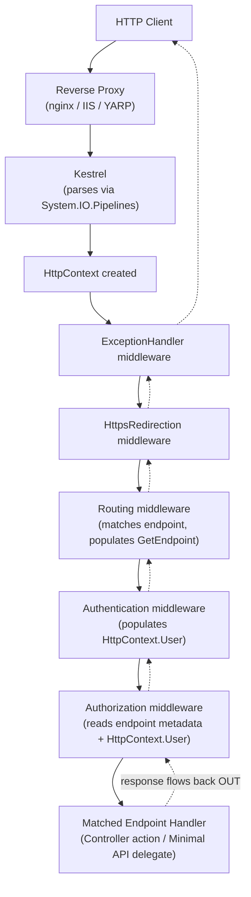

**The Onion Model (ASCII)**

```text
Request ──────────────────────────────────────────────────────►
 ┌─────────────────────────────────────────────────────────┐
 │ ExceptionHandler middleware │
 │ ┌───────────────────────────────────────────────────┐ │
 │ │ HttpsRedirection middleware │ │
 │ │ ┌─────────────────────────────────────────────┐ │ │
 │ │ │ Routing (matches endpoint) │ │ │
 │ │ │ ┌───────────────────────────────────────┐ │ │ │
 │ │ │ │ Authentication │ │ │ │
 │ │ │ │ ┌─────────────────────────────────┐ │ │ │ │
 │ │ │ │ │ Authorization │ │ │ │ │
 │ │ │ │ │ ┌───────────────────────────┐ │ │ │ │ │
 │ │ │ │ │ │ ENDPOINT (your handler) │ │ │ │ │ │
 │ │ │ │ │ └───────────────────────────┘ │ │ │ │ │
 │ │ │ │ └─────────────────────────────────┘ │ │ │ │
 │ │ │ └───────────────────────────────────────┘ │ │ │
 │ │ └─────────────────────────────────────────────┘ │ │
 │ └───────────────────────────────────────────────────┘ │
 └─────────────────────────────────────────────────────────┘
Response ◄──────────────────────────────────────────────────────
 (each layer can inspect/modify the response on the way back OUT,
 UNTIL that layer's HasStarted becomes true)
```

**Middleware Short-Circuit Diagram**

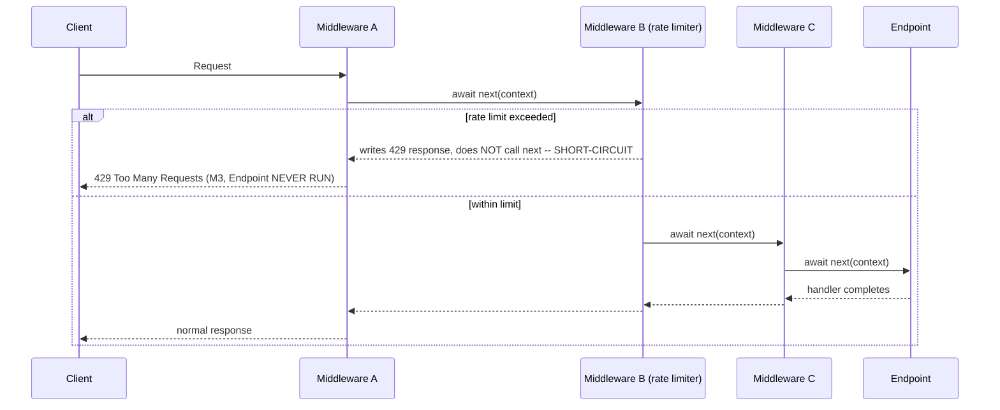

**Class Diagram**

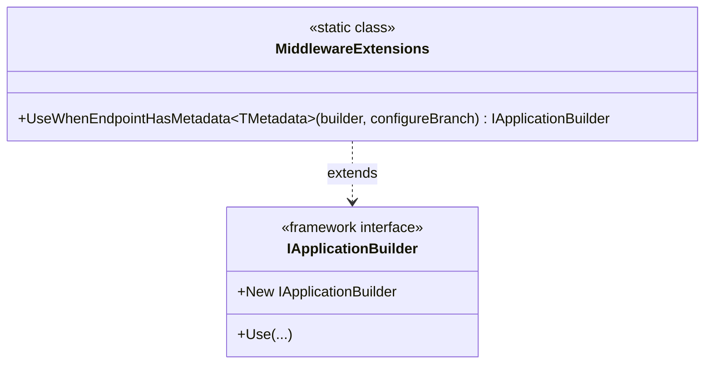

**Sequence Diagram**

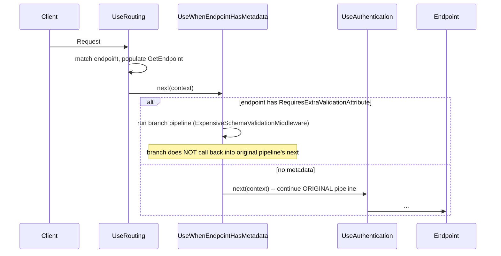

### Module 10 — ASP.NET Core: Dependency Injection Container Internals
*Source: `02-DI-Container-Internals.md`*

**Lifetime Scope Nesting (ASCII)**

```text
┌─────────────────────────────────────────────────────────────────┐
│ ROOT Service Provider (application lifetime) │
│ Singleton instances live HERE, created once, shared forever │
│ │
│ ┌─────────────────────┐ ┌─────────────────────┐ │
│ │ Request Scope #1 │ │ Request Scope #2 │... │
│ │ (created per HTTP req)│ │ (created per HTTP req)│ │
│ │ │ │ │ │
│ │ Scoped instances live │ │ Scoped instances live │ │
│ │ HERE -- one DbContext,│ │ HERE -- a DIFFERENT │ │
│ │ shared across this │ │ DbContext instance, │ │
│ │ request's whole graph │ │ shared across THIS │ │
│ │ │ │ request's graph only │ │
│ │ Transient: new EVERY │ │ Transient: new EVERY │ │
│ │ time, even within │ │ time, even within │ │
│ │ this one scope │ │ this one scope │ │
│ └─────────────────────┘ └─────────────────────┘ │
└─────────────────────────────────────────────────────────────────┘

CAPTIVE DEPENDENCY BUG: a Singleton (root-scope) constructor resolves a
Scoped dependency -- it gets locked to ONE specific scope's instance
(whichever scope was active at that moment), reused incorrectly forever:

 Singleton (root) ──holds a reference to──► [Scoped instance from Request Scope #1]
 │ ▲
 └── used by Request Scope #2's handling ─────────────┘
 (WRONG: Request #2 gets Request #1's stale/disposed instance)
```

**Dependency Graph Resolution**

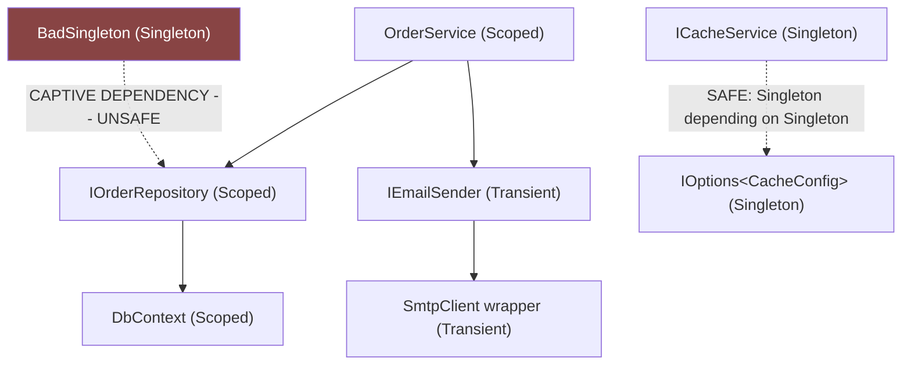

**Class Diagram**

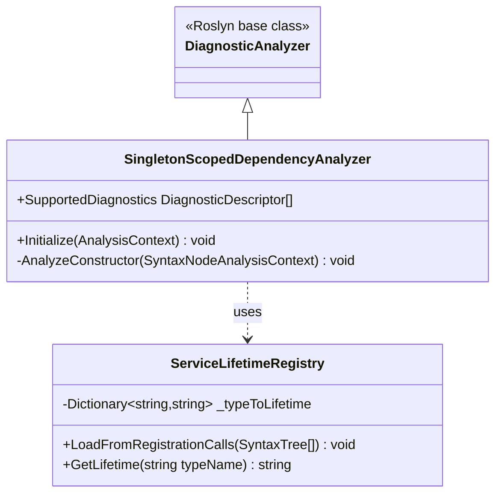

**Sequence Diagram**

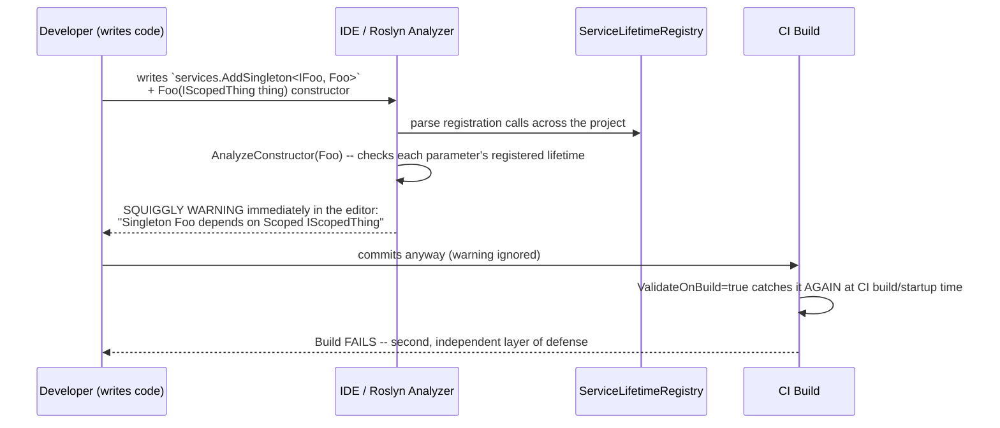

### Module 11 — ASP.NET Core: Minimal APIs vs Controllers, MVC Filters & Model Binding Internals
*Source: `03-MinimalAPIs-vs-Controllers-ModelBinding.md`*

**Nested Pipelines (ASCII)**

```text
Middleware Pipeline
┌───────────────────────────────────────────────────────────────────┐
│ ExceptionHandler → ForwardedHeaders → Routing → Auth → AuthZ → │
│ │
│ ┌─────────────────────────────────────────────────────────────┐ │
│ │ MVC FILTER PIPELINE (Controllers only) │ │
│ │ Authorization Filters │ │
│ │ Resource Filters (wraps model binding) │ │
│ │ [ MODEL BINDING happens here ] │ │
│ │ Action Filters (wraps the action method body) │ │
│ │ [ ACTION METHOD BODY ] │ │
│ │ Exception Filters (only if action/filters throw) │ │
│ │ Result Filters (wraps IActionResult execution) │ │
│ └─────────────────────────────────────────────────────────────┘ │
│ │
│ OR, for Minimal APIs: │
│ ┌─────────────────────────────────────────────────────────────┐ │
│ │ ENDPOINT FILTER CHAIN (single, uniform onion, no stages) │ │
│ │ AddEndpointFilter #1 → AddEndpointFilter #2 → [ HANDLER ] │ │
│ └─────────────────────────────────────────────────────────────┘ │
└───────────────────────────────────────────────────────────────────┘
```

**Model Binding Source Resolution**

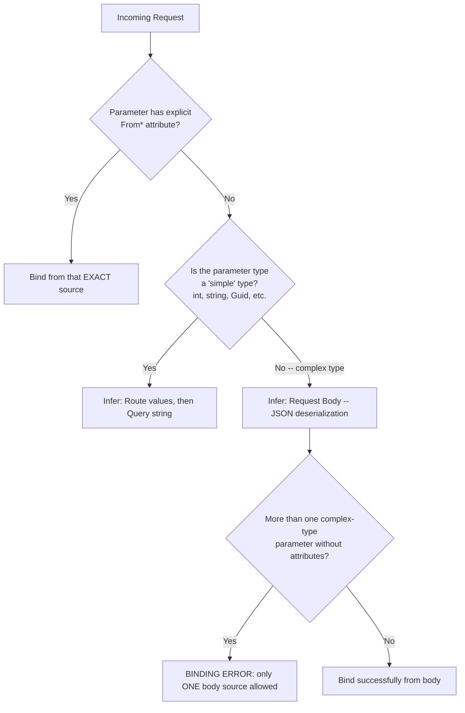

**Class Diagram**

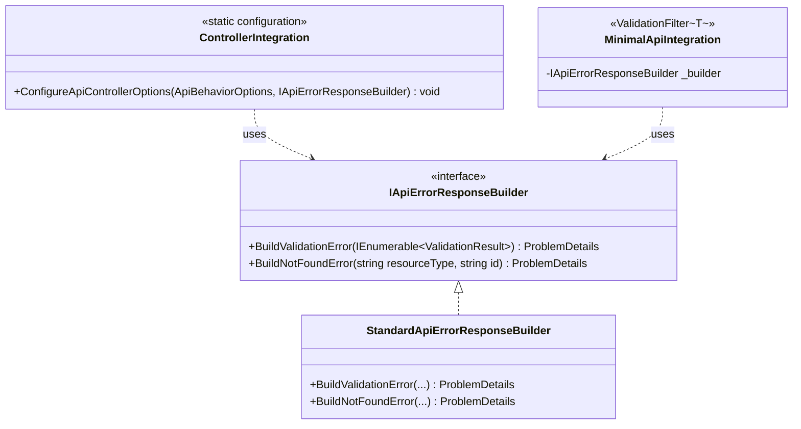

**Sequence Diagram**

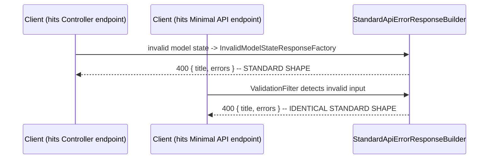

### Module 12 — ASP.NET Core: Authentication & Authorization Deep Dive
*Source: `04-Authentication-Authorization-Deep-Dive.md`*

**Authentication + Authorization Sequence**

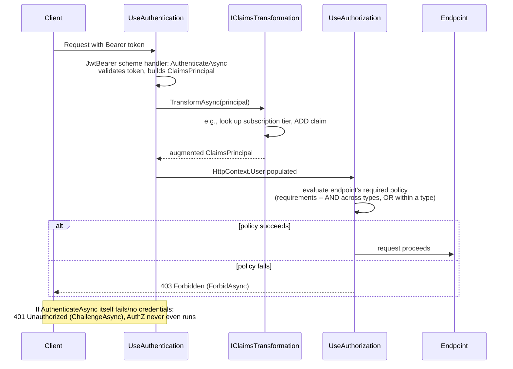

**Requirement Evaluation Logic (ASCII)**

```text
Policy "CanEditOrders" = [ RequireRoleRequirement("Editor"), MinimumAccountAgeRequirement(30 days) ]

 ┌─────────────────────────────┐
 │ RequireRoleRequirement │◄── Handler A: checks role -- Succeed or not
 │ (must be satisfied) │◄── Handler B (if registered): ALSO gets a chance
 └─────────────────────────────┘ (OR relationship between handlers for SAME requirement)
 AND
 ┌─────────────────────────────┐
 │ MinimumAccountAgeRequirement │◄── Handler C: checks claim -- Succeed or not
 │ (must be satisfied) │
 └─────────────────────────────┘

Policy succeeds ONLY IF: (RequireRoleRequirement satisfied by ANY of its handlers)
 AND (MinimumAccountAgeRequirement satisfied by ANY of its handlers)
```

**Class Diagram**

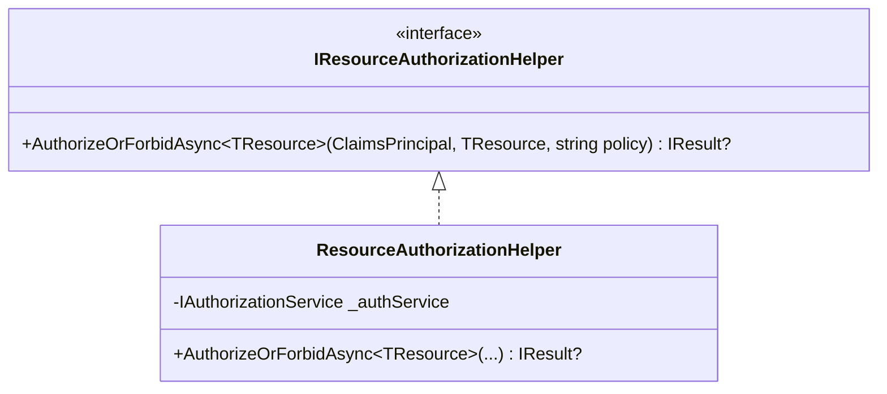

**Sequence Diagram**

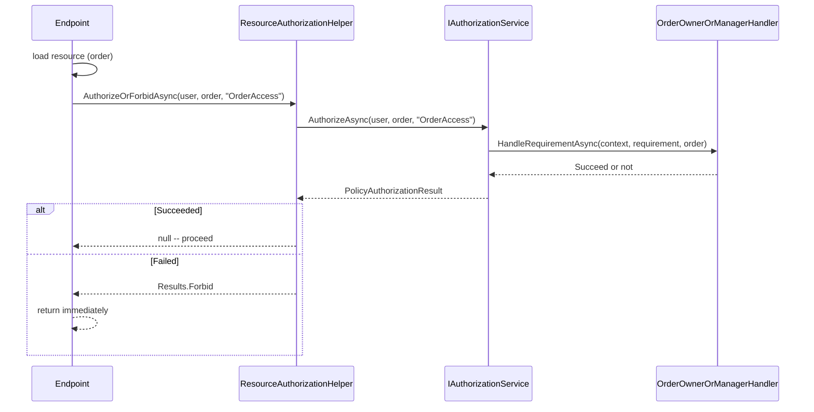

### Module 13 — ASP.NET Core: Configuration & the Options Pattern Internals
*Source: `05-Configuration-Options-Pattern.md`*

**3. Visual Architecture**

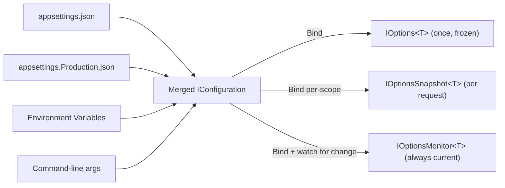

### Module 14 — ASP.NET Core: Health Checks & Observability Integration
*Source: `06-HealthChecks-Observability.md`*

**3. Visual Architecture**

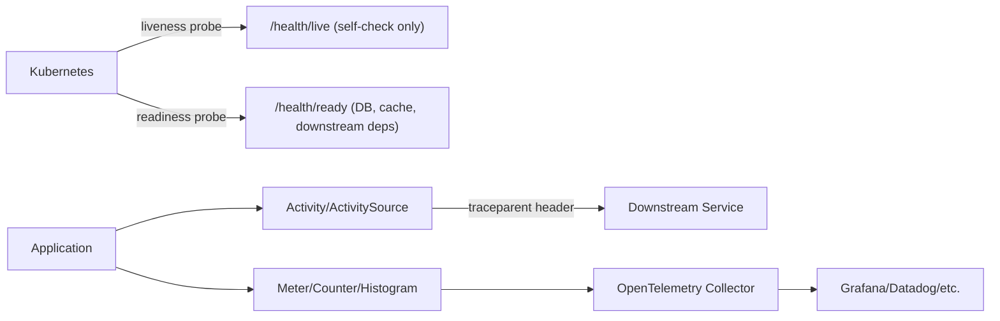
