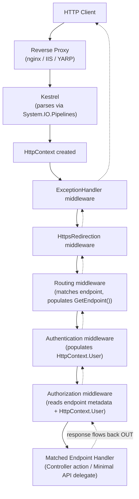
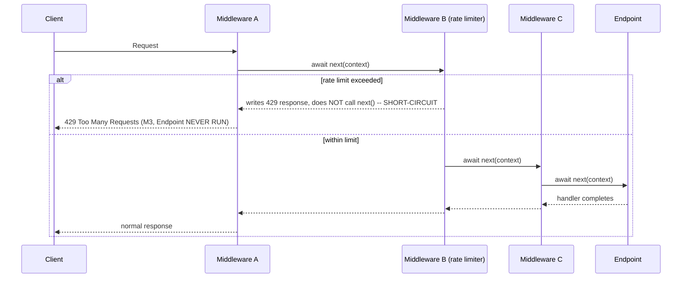
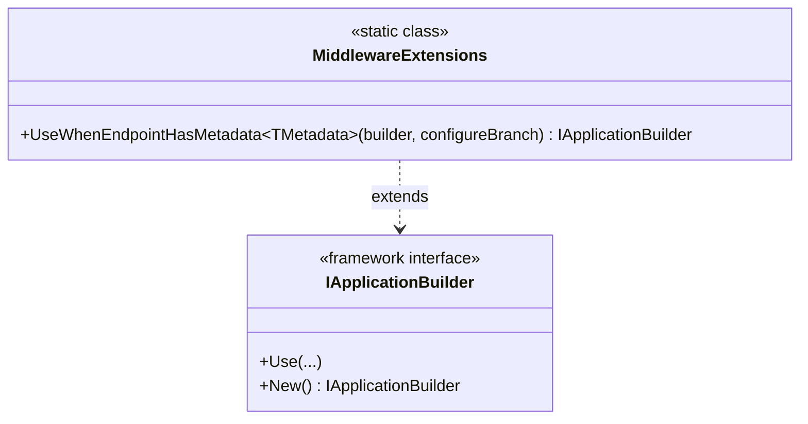
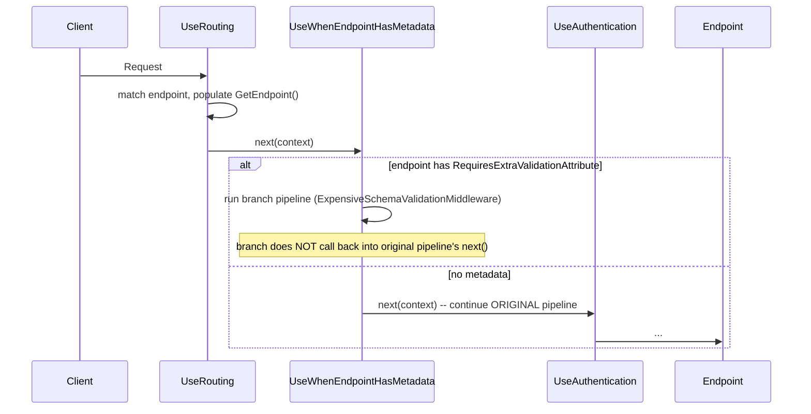

# Module 9 — ASP.NET Core: Middleware Pipeline & Request Processing Internals

> Domain: .NET / ASP.NET Core | Level: Beginner → Expert | Prerequisite: [[../01-CSharp/02-Async-Await-Internals]] (async request handling, `SynchronizationContext`), [[../01-CSharp/03-Span-Memory-Low-Allocation]] (Kestrel/`System.IO.Pipelines`), [[../01-CSharp/08-Exception-Handling-Custom-Exceptions]] (exception-handling middleware)

---

## 1. Fundamentals

### What is the ASP.NET Core middleware pipeline?
ASP.NET Core processes every HTTP request through an ordered **pipeline of middleware components** — each middleware is a piece of code that can inspect/modify the incoming `HttpContext`, decide whether to pass control to the *next* middleware in the pipeline, and inspect/modify the response on the way back out. This replaces the older ASP.NET (Framework) `HttpModule`/`HttpHandler` pipeline with a simpler, fully composable, delegate-based model.

### Why does it exist?
Classic ASP.NET's pipeline (`HttpModules`, the `HttpApplication` event-based lifecycle with ~20 named events like `BeginRequest`/`AuthenticateRequest`/`EndRequest`) was **rigid and implicit** — modules ran in an order governed by web.config registration and internal IIS/ASP.NET plumbing, and understanding "what runs before what" required memorizing a fixed event sequence. ASP.NET Core's middleware pipeline makes ordering **fully explicit and code-driven** — you literally write the order in `Program.cs` (`app.UseX(); app.UseY();`), and it's just a chain of delegates, making the request-processing flow far easier to reason about, test, and customize.

### When does this matter?
- **Always**, since every request to an ASP.NET Core app flows through this pipeline — but understanding it *deeply* matters specifically for:
  - Correctly ordering middleware (authentication before authorization, exception handling wrapping everything, response compression before/after caching) — a wrong order is a common, subtle bug source.
  - Diagnosing why a middleware's changes to the response aren't taking effect (the "response has already started" class of bug).
  - Writing custom middleware/filters for cross-cutting concerns (logging, correlation IDs, rate limiting).
  - Interviewing — "explain the ASP.NET Core request pipeline, and why does middleware order matter for X and Y" is a near-universal ASP.NET Core interview question at every seniority level, with the depth of a good answer varying enormously.

### How does it work (30,000-ft view)?

```csharp
var app = builder.Build();

app.UseExceptionHandler("/error");   // 1st: wraps EVERYTHING after it
app.UseHttpsRedirection();           // 2nd
app.UseRouting();                    // 3rd: determines WHICH endpoint will handle this request
app.UseAuthentication();             // 4th: who are you?
app.UseAuthorization();              // 5th: are you allowed?
app.UseEndpoints(endpoints => { ... }); // 6th (or implicit via MapGet/MapControllers): actually run the handler
```

Mental model for interviews: **"Middleware forms a nested chain of delegates — each one wraps everything after it, like layers of an onion. A request travels IN through each layer in registration order, hits the endpoint at the center, then the response travels OUT back through the same layers in reverse order. Order is everything — a middleware can only affect what happens *after* it on the way in, and *before* it finishes on the way out."**

---

## 2. Deep Dive

### 2.1 The Delegate Chain — Precisely How `Use`/`Run`/`Map` Build the Pipeline

Under the hood, the entire pipeline is built from `RequestDelegate` (`Func<HttpContext, Task>`) instances, composed via `IApplicationBuilder`. `app.Use(...)` registers a piece of middleware that receives the **next** `RequestDelegate` in the chain and returns a new `RequestDelegate` wrapping it:

```csharp
app.Use(async (context, next) =>
{
    // ---- code here runs on the way IN ----
    Console.WriteLine("Before");
    await next(context); // invoke the REST of the pipeline
    // ---- code here runs on the way OUT (after everything downstream completes) ----
    Console.WriteLine("After");
});
```

Conceptually, this builds a structure like:
```
RequestDelegate pipeline =
    ctx => Middleware1(ctx, next: ctx => Middleware2(ctx, next: ctx => Middleware3(ctx, next: ctx => Endpoint(ctx))));
```
Each middleware is a **closure** (Module 4 §2.3) capturing the "next" delegate — this is precisely why calling `await next(context)` in the middle of a middleware's body is what causes the "onion" behavior: code before `next()` runs on the way in, code after runs on the way out, and **omitting the call to `next()` entirely short-circuits the pipeline** — nothing downstream (including the actual endpoint) ever runs, a deliberate technique for e.g. a maintenance-mode middleware that returns a fixed response for every request without ever reaching routing/endpoints.

`app.Run(...)` registers a **terminal** middleware (never calls `next` — it's meant to be the last thing in a given branch of the pipeline); `app.Map`/`app.MapWhen` branch the pipeline conditionally (based on path or an arbitrary predicate) into a separate sub-pipeline.

### 2.2 `HttpContext` — the Per-Request State Container

`HttpContext` is the single object flowing through every middleware, carrying: `Request` (method, path, headers, body stream, query string), `Response` (status code, headers, body stream — writable), `User` (the authenticated `ClaimsPrincipal`, populated by authentication middleware), `RequestServices` (a **request-scoped** `IServiceProvider` — critical for DI scoping, §2.5), `Items` (a `IDictionary<object,object>` for passing arbitrary per-request state between middleware), and `RequestAborted` (a `CancellationToken` signaled if the client disconnects — Module 2's cancellation-propagation guidance applies directly here).

**Critical fact**: `HttpContext` is created **fresh per request** and is **not thread-safe for concurrent access** — accessing it from multiple concurrently-running tasks for the *same* request (e.g., firing off several `Task.Run`-offloaded operations that each touch `HttpContext` without careful coordination) is a genuine, real bug source, since ASP.NET Core makes no internal synchronization guarantee for concurrent reads/writes to the same context from multiple threads simultaneously.

### 2.3 Response-Already-Started — the Single Most Common Middleware Bug

Once the response body has begun being **written to the underlying network stream** (as opposed to merely having its status code/headers *set*, which remains mutable until the first byte is actually flushed), `HttpResponse.HasStarted` becomes `true`, and any subsequent attempt to modify `StatusCode`/`Headers` throws `InvalidOperationException: "StatusCode cannot be set because the response has already started."` This is precisely why exception-handling middleware (Module 8's pattern, §13 there) **must** be registered as early as possible in the pipeline (wrapping everything else) — if an exception occurs deep in the pipeline *after* the response has already started streaming (e.g., a large response body being written incrementally, mid-write, when a failure occurs), no exception-handling middleware, no matter how well-designed, can retroactively change the already-sent status code or headers — it can, at best, log the error and abruptly terminate the connection, since the client has already received a `200 OK` header it can't un-send.

### 2.4 `UseRouting`/`UseEndpoints` Split — Why Two Steps, and Endpoint Metadata

`UseRouting()` and endpoint mapping (`MapGet`, `MapControllers`, or the older explicit `UseEndpoints(...)`) are deliberately **separate pipeline steps** specifically so that middleware registered **between** them (most commonly `UseAuthentication()`/`UseAuthorization()`) can inspect **which endpoint has been matched** (via `HttpContext.GetEndpoint()`, populated by `UseRouting()`) **before** that endpoint's handler actually executes — this is exactly how `[Authorize]` attribute-based authorization works: `UseRouting()` determines the matched endpoint (and its metadata, including any `[Authorize]` attributes attached to the controller action/minimal-API route), and `UseAuthorization()` (running after routing but before the endpoint executes) inspects that metadata to decide whether the request is allowed to proceed. **This is why `UseAuthentication`/`UseAuthorization` must be registered after `UseRouting` and before the endpoint execution (`MapControllers`/etc.)** — registering them before `UseRouting` means no endpoint metadata is available yet to make an authorization decision against.

### 2.5 Dependency Injection Scoping and the Request-Scoped Container

ASP.NET Core's built-in DI container creates a **new DI scope per request**, exposed as `HttpContext.RequestServices` — any service registered as `Scoped` (the most common lifetime for things like `DbContext`) gets **one shared instance for the entire request**, resolved fresh for the next request. This directly connects to Module 5 §Advanced Q6's `DbContext`-lifetime discussion: a `Scoped` `DbContext` is safe to inject into and share across multiple services *within* one request's dependency graph, but must never be captured/cached beyond that request's scope (e.g., stored in a `Singleton`-lifetime service's field) — doing so is one of the most common and most dangerous ASP.NET Core DI bugs (a later DI-internals module covers this in full depth; this module flags it specifically as a middleware/request-lifecycle concern, since the scope's *creation and disposal* is itself a pipeline-level behavior, wrapping the entire request's middleware chain).

### 2.6 Kestrel, `System.IO.Pipelines`, and Where Middleware Sits in the Larger Picture

Kestrel (the built-in web server) accepts raw TCP connections, parses HTTP requests using exactly the `System.IO.Pipelines`/`Span<T>`-based zero-copy techniques covered in Module 3 §12, and constructs an `HttpContext` per request, which is then handed to the **first** middleware in the application's configured pipeline. In production, Kestrel commonly sits behind a **reverse proxy** (IIS in-process/out-of-process hosting, Nginx, Azure Application Gateway, YARP) — middleware like `UseForwardedHeaders()` exists specifically to correctly reconstruct the "real" client IP/scheme/host from proxy-added headers (`X-Forwarded-For`, `X-Forwarded-Proto`), since without it, Kestrel sees only the reverse proxy's own connection details, not the original client's — a common, easy-to-miss production misconfiguration (§14).



### 2.7 Minimal APIs vs Controllers — Pipeline-Level Differences

Minimal APIs (`app.MapGet("/orders/{id}", ...)`) and MVC Controllers (`[ApiController] class OrdersController`) both ultimately compile down to the **same underlying endpoint-routing infrastructure** (`Endpoint`/`RequestDelegate`) — from the middleware pipeline's perspective, they're handled identically (both are just "the matched endpoint" that `UseRouting`/`UseEndpoints` dispatches to). The meaningful differences are **above** the middleware-pipeline layer: Controllers get the full MVC filter pipeline (`IActionFilter`, `IExceptionFilter`, model binding via `[FromBody]`/`[FromQuery]` attributes, automatic `ModelState` validation with `[ApiController]`), while Minimal APIs use a leaner, filter-based (`.AddEndpointFilter(...)`) model with less implicit "magic" — a design trade-off between convention-driven productivity (Controllers) and explicit, lower-overhead simplicity (Minimal APIs) that's covered in full in a dedicated later module.

---

## 3. Visual Architecture

### The Onion Model (ASCII)

```
Request  ──────────────────────────────────────────────────────►
       ┌─────────────────────────────────────────────────────────┐
       │ ExceptionHandler middleware                                │
       │  ┌───────────────────────────────────────────────────┐   │
       │  │ HttpsRedirection middleware                          │   │
       │  │  ┌─────────────────────────────────────────────┐   │   │
       │  │  │ Routing (matches endpoint)                    │   │   │
       │  │  │  ┌───────────────────────────────────────┐   │   │   │
       │  │  │  │ Authentication                          │   │   │   │
       │  │  │  │  ┌─────────────────────────────────┐   │   │   │   │
       │  │  │  │  │ Authorization                     │   │   │   │   │
       │  │  │  │  │  ┌───────────────────────────┐   │   │   │   │   │
       │  │  │  │  │  │   ENDPOINT (your handler)  │   │   │   │   │   │
       │  │  │  │  │  └───────────────────────────┘   │   │   │   │   │
       │  │  │  │  └─────────────────────────────────┘   │   │   │   │
       │  │  │  └───────────────────────────────────────┘   │   │   │
       │  │  └─────────────────────────────────────────────┘   │   │
       │  └───────────────────────────────────────────────────┘   │
       └─────────────────────────────────────────────────────────┘
Response ◄──────────────────────────────────────────────────────
   (each layer can inspect/modify the response on the way back OUT,
    UNTIL that layer's HasStarted becomes true)
```

### Middleware Short-Circuit Diagram



---

## 4. Production Example

### Scenario: API gateway service — client IP address always logged as the reverse proxy's IP

**Problem**: A fraud-detection feature relying on client IP addresses for rate-limiting and anomaly detection was consistently seeing the **same single IP address** for every request, regardless of which actual client made it — completely breaking the feature (every client appeared identical, either triggering false-positive rate limits for legitimate traffic sharing that IP, or masking genuinely abusive traffic behind a "trusted" shared address).

**Investigation**:
- Confirmed the service ran behind an internal load balancer/reverse proxy (as essentially all production ASP.NET Core services do) — `HttpContext.Connection.RemoteIpAddress` was, correctly per its actual meaning, reporting the **immediate TCP connection's** source IP, which was the reverse proxy's own address, not the original client's.
- The reverse proxy **was** correctly setting the standard `X-Forwarded-For` header with the true original client IP — but the application's middleware pipeline had never been configured with `UseForwardedHeaders()` to actually read and apply that header, meaning the correct information was present in every request but simply never consumed.

**Architecture fix**:
- Added `app.UseForwardedHeaders(new ForwardedHeadersOptions { ForwardedHeaders = ForwardedHeaders.XForwardedFor | ForwardedHeaders.XForwardedProto })` as **one of the very first** middleware registrations (before routing, authentication, and certainly before the fraud-detection logic that reads `RemoteIpAddress`) — `UseForwardedHeaders()` rewrites `HttpContext.Connection.RemoteIpAddress` (and the request's perceived scheme) in place based on the trusted forwarded headers, so every downstream middleware/endpoint transparently sees the correct original client IP without needing to know anything about the reverse-proxy topology itself.
- Explicitly configured `KnownProxies`/`KnownNetworks` on `ForwardedHeadersOptions` to restrict which upstream hops are trusted to supply these headers — critical because blindly trusting an `X-Forwarded-For` header from *any* source is a spoofing vector (§8): a malicious client could set that header directly if the app trusted it from an untrusted, direct connection, unless the middleware is configured to only honor it when the immediate connection actually comes from a known, trusted proxy.

**Trade-offs**: Restricting `KnownProxies` requires keeping the trusted-proxy IP list/network range in the application's configuration in sync with actual infrastructure (load balancer IP ranges, potentially changing across cloud provider updates) — a small ongoing operational coupling accepted as necessary, since the alternative (trusting forwarded headers unconditionally) is a genuine security vulnerability, not just an inconvenience.

**Lessons learned**:
1. `HttpContext.Connection.RemoteIpAddress` reports the **immediate** TCP peer, which is the reverse proxy in essentially every real production deployment — any feature depending on the "real" client IP must explicitly configure `UseForwardedHeaders()`, this is never automatic.
2. `UseForwardedHeaders()` must be registered extremely early in the pipeline (before anything that reads IP/scheme) for its rewritten values to be visible to everything downstream — a direct, concrete instance of "middleware order matters" (§1/§6).
3. Never trust forwarded headers unconditionally — always scope `KnownProxies`/`KnownNetworks` to prevent spoofing from untrusted direct connections.

---

## 5. Best Practices

- **Register exception-handling middleware first** (or as close to first as possible), so it wraps the maximum possible surface of the pipeline and can catch failures from as much downstream code as possible before the response has started (§2.3).
- **Register `UseForwardedHeaders()` very early**, with explicitly scoped `KnownProxies`/`KnownNetworks`, whenever the app runs behind any reverse proxy/load balancer (essentially always in production) — never trust forwarded headers unconditionally (§4/§8).
- **Register `UseAuthentication()` and `UseAuthorization()` after `UseRouting()` and before endpoint execution** — this ordering is not arbitrary; it's what makes endpoint-metadata-driven authorization (`[Authorize]`) possible at all (§2.4).
- **Keep middleware focused on cross-cutting concerns** (logging, exception handling, correlation IDs, response compression, CORS) — push business logic into the endpoint/controller/service layer, not into custom middleware, to keep the pipeline's role clear and testable.
- **Use `HttpContext.Items` (not static/singleton state) for passing per-request data between middleware** — respects the request-scoped lifetime correctly and avoids the cross-request data leakage risk of accidentally using shared mutable state instead.
- **Avoid modifying the response after any possibility it may have started streaming** — check `HttpResponse.HasStarted` defensively in any middleware that conditionally rewrites status codes/headers based on downstream behavior, and design streaming endpoints (large file downloads, Server-Sent Events) with this constraint explicitly in mind.
- **Propagate `HttpContext.RequestAborted` into every downstream async call** (database queries, HTTP client calls) — directly reusing Module 2's cancellation-token-propagation guidance, specifically important at the pipeline/endpoint level since this is exactly where that token originates and where it's easiest to forget to pass it further down.

---

## 6. Anti-patterns

- **Registering authentication/authorization before `UseRouting()`.** Why it fails: no endpoint (and thus no endpoint metadata, like `[Authorize]` attributes) has been determined yet — authorization middleware has nothing meaningful to check against. Fix: always `UseRouting()` first, then `UseAuthentication()`/`UseAuthorization()`, then endpoint mapping.
- **Forgetting `UseForwardedHeaders()` behind a reverse proxy** (§4's incident). Fix: always configure it, with explicit trusted-proxy scoping, for any service not directly exposed to the internet without an intermediary.
- **Putting substantial business logic inside custom middleware** instead of the endpoint/service layer. Why it fails: middleware runs for *every* matching request regardless of endpoint-specific needs, is harder to unit-test in isolation compared to an injected service, and blurs the pipeline's intended cross-cutting-concerns role. Fix: keep middleware thin; delegate actual business logic to injected, testable services.
- **Capturing a `Scoped` service (like `DbContext`) into a field of a `Singleton`-lifetime service or a static field**, across a request boundary. Why it fails: the captured instance outlives its intended per-request scope, either throwing (if the underlying context is disposed at request end while still referenced) or, worse, silently being reused/shared incorrectly across unrelated requests — a serious, sometimes-hard-to-diagnose correctness bug. Fix: never store scoped services outside their natural per-request lifetime; use `IServiceScopeFactory` to explicitly create a new scope if a background/long-lived component genuinely needs its own independent scoped-service instances.
- **Assuming middleware registered via `app.Use(...)` after `app.Run(...)` will execute.** Why it fails: `app.Run(...)` is terminal — nothing registered after it in that branch of the pipeline will ever execute, a straightforward but real beginner mistake. Fix: use `app.Use(...)` for anything that should call `next()`; reserve `app.Run(...)` for the deliberate final handler in a given pipeline branch.
- **Ignoring `HttpContext.RequestAborted` in long-running endpoint logic**, continuing expensive work (DB queries, external calls) even after the client has disconnected. Fix: propagate the token, exactly as Module 2's cancellation guidance requires, especially important here since a disconnected client on a busy service wastes resources that could serve other, still-connected clients.
- **Accessing `HttpContext` from a "fire-and-forget" background task spawned during request handling**, after the request itself may have already completed (and `HttpContext` potentially recycled/invalidated by the framework). Fix: extract only the specific data needed *before* spawning background work, never pass the live `HttpContext` reference itself into detached background work.

---

## 7. Performance Engineering

**CPU**: Each middleware in the pipeline adds a small, generally negligible per-request delegate-invocation overhead — the real performance-relevant middleware-ordering concern is **doing expensive work (authentication, heavy logging, compression) as late as possible** for requests that might be short-circuited earlier (e.g., a rate-limiting middleware running *before* an expensive authentication check, so rate-limited requests never pay the authentication cost at all) — middleware order directly affects which requests pay which costs, not just correctness.

**Memory**: `HttpContext` and its associated request/response streams are pooled/reused internally by Kestrel where possible (directly building on Module 3's `System.IO.Pipelines`/pooled-buffer discipline) — custom middleware that buffers entire request/response bodies into memory (e.g., for logging or signature verification) reintroduces exactly the LOH/large-buffer concerns from Module 1 §4/Module 3 §4 if not done carefully with pooled buffers.

**Response compression ordering**: `UseResponseCompression()` should generally be registered early (so it wraps and can compress the output of everything after it) but **after** anything that shouldn't be compressed (e.g., an already-compressed static file response) — a concrete instance of "middleware order determines which requests/responses are affected by a given cross-cutting behavior."

**Routing performance**: ASP.NET Core's endpoint routing uses a **tree-based route-matching algorithm** (not a linear scan of every registered route for every request) — route-matching cost scales sub-linearly with route count for typical route-table shapes, an important fact for justifying why having hundreds of routes in a large API is not, by itself, a routing-performance concern.

**Benchmarking**: Load-testing tools (k6, NBomber, `bombardier`) measuring end-to-end request latency with middleware added/removed incrementally is the standard way to attribute latency cost to specific middleware — directly extending this course's recurring measure-first discipline to the pipeline-configuration level.

---

## 8. Security

- **Trusting forwarded headers (`X-Forwarded-For`, `X-Forwarded-Proto`) without restricting to known, trusted proxies** (§4) is a genuine IP-spoofing/authentication-bypass-adjacent vulnerability — a malicious direct client could set these headers themselves to disguise their real origin or fake an HTTPS-forwarded scheme if the app blindly trusts them from any source.
- **Missing or misordered `UseAuthentication()`/`UseAuthorization()`** — placing business-logic endpoints before authorization middleware, or entirely forgetting to add authorization middleware for a sensitive endpoint (relying only on `[Authorize]` attributes without the middleware actually being registered to enforce them) — is a direct authentication/authorization-bypass vulnerability, not merely a functional bug. Always verify, for any new sensitive endpoint, that the full authentication → authorization → endpoint chain is actually wired up and enforced, not just attribute-decorated.
- **CORS misconfiguration** (`UseCors()` with an overly permissive policy — `AllowAnyOrigin()` combined with `AllowCredentials()`, which the framework itself rejects as an invalid combination specifically because it would allow any origin to make credentialed requests) is a common, real cross-origin security misconfiguration — always scope CORS policies to explicitly known, trusted origins for any endpoint accepting credentials/cookies.
- **Exposing detailed exception pages in production** (`UseDeveloperExceptionPage()` left enabled outside the `Development` environment) directly leaks stack traces, internal file paths, and potentially connection strings to any client that can trigger an unhandled exception — always gate developer-exception-page middleware behind `env.IsDevelopment()`, using the production-safe exception-handling middleware pattern (Module 8 §13) for all other environments.
- **OWASP relevance**: A01 (Broken Access Control) for misordered/missing authorization middleware; A05 (Security Misconfiguration) directly for both the developer-exception-page and CORS misconfiguration scenarios; a spoofing/authentication-adjacent risk (not a single named OWASP category, but a recurring real-world CVE class) for unrestricted forwarded-header trust.

---

## 9. Scalability

- **Horizontal scaling**: The middleware pipeline itself is entirely per-process/per-request — it has no inherent cross-instance state, making it naturally compatible with horizontal scaling (Module 1's general "stateless replicas" theme) as long as no middleware introduces accidental in-process state that should have been externalized (e.g., an in-memory rate limiter that only limits per-replica, not globally across a horizontally-scaled fleet — directly connecting to Module 2 §Expert Q6's distributed-rate-limiting discussion).
- **Vertical scaling**: Kestrel's request-processing throughput benefits from more cores (parallel connection handling) in largely the same way Server GC does (Module 1) — the middleware pipeline itself adds negligible per-core-scaling-relevant overhead beyond the per-request delegate chain cost already discussed (§7).
- **Caching/Replication/Partitioning**: Response-caching middleware (`UseResponseCaching()`, `UseOutputCache()`, .NET 7+) is itself a pipeline-level cross-cutting concern, directly reusing this module's "some middleware can short-circuit the pipeline entirely" mechanism (§2.1/§3) — a cache-hit short-circuits before the actual endpoint (and any expensive downstream work) ever runs, exactly like the rate-limiter short-circuit example.
- **CAP theorem**: Not directly relevant to the middleware pipeline itself; the practical connection is that any middleware maintaining state that needs to be consistent *across* a horizontally-scaled fleet (distributed rate limiting, distributed caching) must externalize that state (Redis, a shared cache) rather than relying on in-process pipeline state, exactly the same lesson as Module 2's rate-limiter discussion, now anchored specifically to "where in the pipeline does this concern live."
- **HA/DR**: Graceful shutdown (`IHostApplicationLifetime.ApplicationStopping`, combined with `HttpContext.RequestAborted` propagation, §5) at the pipeline/hosting level is what allows in-flight requests to drain cleanly during a rolling deployment — a direct, practical application of Module 2's cancellation-aware graceful-shutdown guidance, here specifically at the ASP.NET Core hosting-model layer.

---

## 10. Interview Questions

### Basic (10)

1. **Q: What is ASP.NET Core middleware?**
   **A:** A component in the request-processing pipeline that can inspect/modify the `HttpContext` on the way in, choose whether to pass control to the next middleware, and inspect/modify the response on the way out.

2. **Q: What does `app.Use(...)` do differently from `app.Run(...)`?**
   **A:** `app.Use(...)` registers middleware that can call `next()` to continue the pipeline; `app.Run(...)` registers a terminal middleware that doesn't call further into the pipeline.

3. **Q: What happens if a middleware doesn't call `next()`?**
   **A:** The pipeline short-circuits — nothing registered after that middleware (including the actual endpoint) runs for that request.

4. **Q: What is `HttpContext`?**
   **A:** The per-request object carrying the request, response, authenticated user, request-scoped services, and other per-request state, flowing through every middleware.

5. **Q: Why must `UseAuthentication()`/`UseAuthorization()` be registered after `UseRouting()`?**
   **A:** Because authorization needs to inspect the matched endpoint's metadata (like `[Authorize]` attributes), which `UseRouting()` is what determines and populates.

6. **Q: What is `HttpContext.RequestServices`?**
   **A:** A request-scoped `IServiceProvider` — resolving a `Scoped`-lifetime service through it gives you the one shared instance for that entire request.

7. **Q: What does `HasStarted` on `HttpResponse` indicate?**
   **A:** Whether the response body has already begun being sent to the client — once true, status code and headers can no longer be modified.

8. **Q: What is the purpose of `UseForwardedHeaders()`?**
   **A:** To correctly read the real client IP/scheme from reverse-proxy-added headers (`X-Forwarded-For`/`X-Forwarded-Proto`), since Kestrel otherwise only sees the proxy's own connection details.

9. **Q: Should exception-handling middleware be registered early or late in the pipeline?**
   **A:** As early as possible, so it wraps the maximum amount of downstream code and can still modify the response before it has started.

10. **Q: What's the difference between Minimal APIs and Controllers from the middleware pipeline's perspective?**
    **A:** They're handled identically at the pipeline level — both compile down to the same underlying endpoint-routing infrastructure; their differences (filters, model binding conventions) exist above the middleware-pipeline layer.

### Intermediate (10)

1. **Q: Explain the "onion" model of middleware and what determines whether code runs "on the way in" or "on the way out."**
   **A:** Each middleware is a closure capturing the next delegate; code written before the `await next(context)` call runs as the request travels inward, and code written after it runs as the response travels back outward, after everything downstream has completed — the position of the `next()` call within the middleware's body is what splits its logic into "in" and "out" phases.

2. **Q: Why is `HttpContext` not safe to access concurrently from multiple tasks within the same request?**
   **A:** ASP.NET Core provides no internal synchronization for concurrent access to the same `HttpContext` instance — if request-handling code fans out into multiple concurrently-running tasks that each touch shared parts of `HttpContext`, that's an unsynchronized concurrent-access bug the framework does nothing to prevent.

3. **Q: Why can't exception-handling middleware fix a failure that occurs mid-way through streaming a large response body?**
   **A:** Because the response has already started (`HasStarted == true`) by the time the failure occurs — the status code and headers (already sent) cannot be retroactively changed; the middleware can only log the error and terminate the connection abruptly.

4. **Q: What's the danger of trusting `X-Forwarded-For` without configuring `KnownProxies`/`KnownNetworks`?**
   **A:** A malicious direct client could set that header themselves to spoof their apparent origin IP, since the app would apply the header's value unconditionally regardless of whether it actually came from a trusted reverse proxy.

5. **Q: Why is storing a `Scoped` service (like `DbContext`) in a `Singleton`-lifetime service's field a serious bug?**
   **A:** The scoped instance is meant to live only for one request's duration; capturing it into a longer-lived singleton either causes it to be used across unrelated requests incorrectly, or throws once the original request's scope disposes it while the singleton still holds a reference.

6. **Q: What does `app.MapWhen(...)` let you do that `app.Use(...)` alone doesn't?**
   **A:** Branch the pipeline into an entirely separate sub-pipeline based on an arbitrary predicate (not just a path prefix, which `app.Map(...)` handles) — useful for applying a distinct set of middleware only to requests matching some custom condition.

7. **Q: Why should a rate-limiting middleware generally be registered before an expensive authentication middleware?**
   **A:** So that requests rejected by the rate limiter short-circuit before paying the cost of the more expensive authentication check — middleware order determines which requests incur which costs, not just correctness.

8. **Q: What's the practical risk of accessing the live `HttpContext` from a fire-and-forget background task spawned during request handling?**
   **A:** The original request may complete (and its `HttpContext` be recycled/invalidated by the framework) before or while the detached background task is still running, leading to accessing an invalid/stale context — extract only the specific data needed before spawning the detached work.

9. **Q: What's the difference between `UseRouting()` populating `HttpContext.GetEndpoint()` and the endpoint actually executing?**
   **A:** `UseRouting()` only determines *which* endpoint matches the request and attaches its metadata to the context; the endpoint's actual handler code doesn't run until the pipeline reaches the endpoint-execution step (implicit via minimal API/controller mapping) — middleware in between (like authorization) can inspect the matched endpoint's metadata without it having executed yet.

10. **Q: Why is `HttpContext.RequestAborted` important to propagate into downstream async calls?**
    **A:** It's signaled when the client disconnects — propagating it into database/external-API calls (per Module 2's cancellation guidance) lets those operations stop early instead of wastefully continuing to completion for a client that's no longer there to receive the result.

### Advanced (10)

1. **Q: Walk through exactly why registering `UseForwardedHeaders()` in the wrong position in the pipeline (e.g., after routing/authentication instead of before) would fail to fix the client-IP problem from §4, even though the middleware itself is correctly configured.**
   **A:** `UseForwardedHeaders()` rewrites `HttpContext.Connection.RemoteIpAddress` in place — but any middleware that already ran and read/cached the *original* (proxy's) IP value before `UseForwardedHeaders()` executes would have captured the wrong value, and no later rewrite changes what already happened earlier in the pipeline. Since middleware ordering is strictly sequential (§2.1), any logic depending on the corrected IP — including routing decisions based on IP, or logging middleware capturing IP for correlation — must be registered **after** `UseForwardedHeaders()`, which is precisely why the guidance (§5) is to register it as one of the very first things in the pipeline: it needs to run before essentially everything else that might care about client IP/scheme.

2. **Q: Explain precisely how ASP.NET Core's endpoint routing avoids O(n) route-matching cost as the number of registered routes grows, and why this matters for large API surfaces.**
   **A:** Endpoint routing builds a **tree-based matching structure** (conceptually similar to a trie/radix tree over URL path segments, combined with constraint matching for route parameters) at startup from all registered routes, rather than testing the incoming request path against every registered route pattern linearly — this gives route matching a cost that scales with the *path's segment count and the tree's branching factor* at a given depth, not the *total number of registered routes* in the application, meaning an API with thousands of routes doesn't pay a proportionally larger per-request routing cost compared to one with a few dozen, as long as the route templates are reasonably well-structured (not, e.g., all sharing a single catch-all pattern that defeats the tree's discriminating power).

3. **Q: A team implements a custom middleware that reads and logs the entire request body for audit purposes, placed early in the pipeline. Explain the specific technical pitfall this introduces and how to correctly fix it.**
   **A:** `HttpRequest.Body` is, by default, a **forward-only, non-seekable stream** in many scenarios — reading it fully in an early middleware (to log it) consumes the stream, leaving nothing for model binding/the actual endpoint handler to read later, breaking the request entirely unless specifically handled. The correct fix: call `context.Request.EnableBuffering()` **before** reading the body (which allows the underlying stream to be buffered and seeked back to position 0), read and log the body, then explicitly reset `context.Request.Body.Position = 0` before calling `next()` so downstream model binding/handlers can read it again from the start — a specific, commonly-tested "gotcha" scenario combining this module's pipeline-ordering knowledge with ASP.NET Core's request-stream mechanics.

4. **Q: Explain how you would design a custom middleware to enforce a global, distributed rate limit (not just per-instance), and where exactly it should sit in the pipeline relative to authentication.**
   **A:** Building directly on Module 2 §Expert Q6's distributed-rate-limiter design (a Redis-backed token bucket, checked via an atomic script) — implement it as middleware calling the distributed limiter's check before proceeding; **placement relative to authentication depends on the rate-limiting key**: if limiting is per-IP or globally (unauthenticated), place it **before** authentication (so unauthenticated flood traffic doesn't even pay the authentication cost, directly reusing Intermediate Q7's "short-circuit before expensive checks" principle); if limiting is per-authenticated-user (e.g., "100 requests/min per API key"), it must be placed **after** authentication (since the rate-limiting key — the authenticated user/API key identity — isn't known until authentication has run), illustrating that "middleware order" isn't a single universal rule but depends on what data each middleware's logic actually needs and when that data becomes available in the pipeline.

5. **Q: How does the ASP.NET Core hosting model's graceful shutdown interact with in-flight requests and the middleware pipeline, and what happens to a request that's mid-pipeline when shutdown begins?**
   **A:** On receiving a shutdown signal (SIGTERM in a container/Kubernetes context, or a Windows service stop), `IHostApplicationLifetime.ApplicationStopping` is triggered, and the host gives in-flight requests a configurable grace period (`ShutdownTimeout`) to complete before forcibly terminating — during this window, `HttpContext.RequestAborted` is **not** immediately triggered for in-flight requests merely because shutdown began (that token specifically reflects *client* disconnection, a distinct concept), but Kestrel stops accepting **new** connections/requests immediately upon shutdown signal while allowing already-in-progress pipeline executions to run to completion within the grace period — any request still mid-pipeline when the grace period expires is forcibly aborted, which is exactly why long-running, non-cancellation-aware endpoint logic is a graceful-shutdown risk: it may not finish before the forced-termination deadline, since the host's shutdown mechanism and the per-request cancellation token are related but distinct signals.

6. **Q: Explain a scenario where two middleware components, each individually correct, produce an incorrect result when composed in the wrong relative order, beyond the authentication/routing example already covered.**
   **A:** Response compression (`UseResponseCompression()`) registered **before** a custom middleware that adds/modifies response headers based on the (assumed-uncompressed) response body's content (e.g., computing and setting a `Content-MD5`/checksum header by reading the response body stream) — if compression has already transformed the body by the time the checksum middleware runs, the checksum would be computed over the *compressed* bytes, not the original content, silently producing a checksum that doesn't match what a client decompressing the response and verifying against the original content would expect. The fix requires understanding which "version" of the response each middleware needs to observe and ordering accordingly (the checksum middleware needs to run *before* compression transforms the body, i.e., registered later in the pipeline so it executes on the way "out" *before* compression's own way-out transformation — requiring careful reasoning about the onion model's two-directional execution, not just naive "first registered, first concern addressed" thinking).

7. **Q: Why does ASP.NET Core create a new DI scope specifically per-request rather than, e.g., per-connection (which might span multiple HTTP/1.1 keep-alive requests) or per-middleware?**
   **A:** Per-request scoping matches the natural unit of "a coherent piece of work with its own consistent view of scoped state" that most application code reasons about (a single `DbContext` instance seeing a consistent state for the duration of handling one request's business logic) — per-connection scoping would incorrectly share scoped state (like a `DbContext`) across multiple, logically-independent requests that happen to reuse the same underlying TCP connection (via HTTP keep-alive/HTTP2 multiplexing), risking exactly the kind of stale/incorrectly-shared-state bugs Module 5's `DbContext`-lifetime discussion warns about; per-middleware scoping would be far too granular, preventing different middleware in the same pipeline from sharing a consistent scoped-service instance (e.g., authentication middleware and the endpoint both needing to see the same `DbContext` instance) within one logical request.

8. **Q: Design a middleware ordering strategy for a service that needs: response compression, response caching, rate limiting, authentication, authorization, and exception handling — justify the full order.**
   **A:** `ExceptionHandler` (first — must wrap everything) → `ForwardedHeaders` (early — corrects IP/scheme before anything else uses it) → rate limiting keyed by IP (before authentication, per Advanced Q4's "short-circuit before expensive work" principle, assuming IP-based limiting here) → `UseRouting` (determines the endpoint and its metadata) → response caching (`UseOutputCache`, placed to check for a cache hit **before** authentication/authorization if the cached response is meant to be public/shareable across users — or **after** if caching is per-authenticated-user, illustrating the same "where does the needed data become available" reasoning as Advanced Q4) → `UseAuthentication` → `UseAuthorization` (must follow routing, per §2.4) → response compression (`UseResponseCompression`, generally placed to wrap the actual response body writing, so it compresses whatever the endpoint/caching layer ultimately produces) → endpoint execution. The precise justification for each position should reference either "must run before its dependency is available" (routing before auth) or "should short-circuit before more expensive downstream work" (rate limiting before auth) as the two governing principles this entire ordering discipline reduces to.

9. **Q: How would you unit-test a custom middleware in isolation, without spinning up a full Kestrel/HTTP server, and what does ASP.NET Core provide specifically for this?**
   **A:** ASP.NET Core's `TestServer` (from `Microsoft.AspNetCore.TestHost`) hosts the actual application pipeline in-process (no real network sockets), allowing integration-style tests to send requests through the real middleware chain and assert on responses; for a *single* middleware in true isolation, construct a minimal `IApplicationBuilder` (via `WebApplicationFactory<T>` for a full-pipeline test, or a hand-built `HttpContext` with a directly-invoked middleware instance's `InvokeAsync` for a narrower unit test) and assert on the resulting `HttpContext.Response` state — the key design implication for testability is that well-written middleware (a class implementing the conventional `InvokeAsync(HttpContext, RequestDelegate next)` middleware pattern, with dependencies injected via constructor) can be instantiated and invoked directly in a unit test without needing the full hosting infrastructure, precisely because it's "just" a delegate-taking class, not a framework-magic construct.

10. **Q: As a Principal Engineer, how would you design an organization-wide "standard middleware pipeline template" for new ASP.NET Core services, and what governance would you put around allowing teams to deviate from it?**
    **A:** Publish a shared, versioned `Program.cs` template/NuGet-packaged extension method (`app.UseStandardPipeline(...)`) encoding the correct, security-reviewed ordering of the organization's mandatory cross-cutting concerns (exception handling, forwarded headers with the org's actual known-proxy ranges pre-configured, standard authentication/authorization setup, standard logging/correlation-ID middleware) — so individual teams don't each independently re-derive (and potentially get wrong, per this module's many ordering-pitfall examples) this foundational, security-and-correctness-critical configuration. Governance: require any deviation from the standard template (e.g., a team needing a genuinely different middleware order for a legitimate reason) to go through architecture review specifically because middleware ordering bugs (§4, §6, §14) are exactly the kind of subtle, hard-to-detect-in-code-review issue that benefits enormously from a shared, pre-vetted default — the org-wide leverage of getting this right once, centrally, is very high relative to the cost of every team re-deriving it independently, directly mirroring the shared-library governance pattern established in earlier C# modules (Module 4 §Expert Q4, Module 6 §15) applied here at the ASP.NET Core hosting-configuration level.

---

## 11. Coding Exercises

### Easy — Implement a request-timing logging middleware
**Problem**: Implement middleware that logs how long each request took to process.
```csharp
public class RequestTimingMiddleware
{
    private readonly RequestDelegate _next;
    private readonly ILogger<RequestTimingMiddleware> _logger;

    public RequestTimingMiddleware(RequestDelegate next, ILogger<RequestTimingMiddleware> logger)
    {
        _next = next;
        _logger = logger;
    }

    public async Task InvokeAsync(HttpContext context)
    {
        var stopwatch = Stopwatch.StartNew();
        await _next(context); // everything downstream runs HERE
        stopwatch.Stop();
        _logger.LogInformation("{Method} {Path} took {ElapsedMs}ms -> {StatusCode}",
            context.Request.Method, context.Request.Path, stopwatch.ElapsedMilliseconds, context.Response.StatusCode);
    }
}
// Registration: app.UseMiddleware<RequestTimingMiddleware>(); -- placed EARLY to time the full downstream pipeline
```
**Discussion**: Note this must be registered early (wrapping as much downstream pipeline as possible) to measure the *full* request duration, not just a narrow slice — a direct, simple illustration of the ordering principle from §5/§6 applied to the most common "hello world" custom-middleware exercise.

### Medium — Implement a maintenance-mode short-circuiting middleware
**Problem**: Implement middleware that, when a configuration flag is set, returns a fixed 503 response for all requests except a health-check endpoint, without running any downstream middleware/endpoint.
```csharp
public class MaintenanceModeMiddleware
{
    private readonly RequestDelegate _next;
    private readonly IOptionsMonitor<MaintenanceOptions> _options;

    public MaintenanceModeMiddleware(RequestDelegate next, IOptionsMonitor<MaintenanceOptions> options)
    {
        _next = next;
        _options = options;
    }

    public async Task InvokeAsync(HttpContext context)
    {
        if (_options.CurrentValue.IsEnabled && context.Request.Path != "/health")
        {
            context.Response.StatusCode = StatusCodes.Status503ServiceUnavailable;
            context.Response.Headers.RetryAfter = "300";
            await context.Response.WriteAsJsonAsync(new { message = "Service is under maintenance." });
            return; // deliberately NOT calling next() -- full short-circuit
        }
        await _next(context);
    }
}
public class MaintenanceOptions { public bool IsEnabled { get; set; } }
// Registration: app.UseMiddleware<MaintenanceModeMiddleware>(); -- registered VERY early,
// before routing/auth/anything else, so maintenance mode bypasses ALL of it.
```
**Discussion**: `IOptionsMonitor<T>` (rather than `IOptions<T>`) is deliberately used here so the maintenance flag can be toggled **live** (via a reloadable configuration source) without restarting the process — an important operational property for a maintenance-mode switch specifically, since needing to redeploy just to exit maintenance mode would defeat much of the feature's purpose.

### Hard — Implement request-body buffering and re-reading for audit logging (Advanced Q3's scenario)
**Problem**: Implement middleware that logs the full request body for POST/PUT requests without breaking downstream model binding.
```csharp
public class RequestBodyAuditMiddleware
{
    private readonly RequestDelegate _next;
    private readonly ILogger<RequestBodyAuditMiddleware> _logger;

    public RequestBodyAuditMiddleware(RequestDelegate next, ILogger<RequestBodyAuditMiddleware> logger)
    {
        _next = next;
        _logger = logger;
    }

    public async Task InvokeAsync(HttpContext context)
    {
        if (HttpMethods.IsPost(context.Request.Method) || HttpMethods.IsPut(context.Request.Method))
        {
            context.Request.EnableBuffering(); // allows the stream to be read multiple times

            using var reader = new StreamReader(
                context.Request.Body, Encoding.UTF8, detectEncodingFromByteOrderMarks: false, leaveOpen: true);
            string body = await reader.ReadToEndAsync();

            _logger.LogInformation("Audit: {Method} {Path} body: {Body}",
                context.Request.Method, context.Request.Path, body);

            context.Request.Body.Position = 0; // CRITICAL: reset for downstream model binding to read it again
        }

        await _next(context);
    }
}
```
**Time/Space discussion**: `EnableBuffering()` buffers the request body in memory (spilling to a temp file past a configurable threshold, by default) — for endpoints accepting large request bodies, this is a real memory/disk cost added specifically for the audit-logging feature, a deliberate trade-off that should be scoped (e.g., only for specific sensitive endpoints, not globally for every POST/PUT across the entire API) rather than applied blanket-wide without considering the cost, directly connecting to Module 3's "pay only for what you need, where you need it" discipline.
**Discussion points**: `leaveOpen: true` on the `StreamReader` is essential — without it, disposing the `StreamReader` would close the underlying request body stream entirely, breaking it for downstream reads regardless of resetting `Position`. This exercise is a direct, hands-on implementation of the exact gotcha named in Advanced Q3.

### Expert — Implement a distributed, endpoint-metadata-aware rate-limiting middleware
**Problem**: Implement middleware that reads a custom `[RateLimit(requestsPerMinute: N)]` attribute from the matched endpoint's metadata (populated by `UseRouting()`, per §2.4) and enforces a distributed (Redis-backed) rate limit specific to each endpoint's configured threshold, correctly positioned relative to routing and authentication per Advanced Q4/Q8's reasoning.
```csharp
[AttributeUsage(AttributeTargets.Method | AttributeTargets.Class)]
public class RateLimitAttribute : Attribute
{
    public int RequestsPerMinute { get; }
    public RateLimitAttribute(int requestsPerMinute) => RequestsPerMinute = requestsPerMinute;
}

public class EndpointRateLimitMiddleware
{
    private readonly RequestDelegate _next;
    private readonly IDistributedRateLimiter _limiter; // e.g., a Redis-token-bucket implementation

    public EndpointRateLimitMiddleware(RequestDelegate next, IDistributedRateLimiter limiter)
    {
        _next = next;
        _limiter = limiter;
    }

    public async Task InvokeAsync(HttpContext context)
    {
        var endpoint = context.GetEndpoint(); // ONLY populated because this runs AFTER UseRouting()
        var rateLimitAttr = endpoint?.Metadata.GetMetadata<RateLimitAttribute>();

        if (rateLimitAttr is not null)
        {
            // Key by authenticated user if available (requires this middleware to run AFTER
            // UseAuthentication -- see registration note below), falling back to IP otherwise.
            string key = context.User.Identity?.IsAuthenticated == true
                ? $"user:{context.User.FindFirstValue(ClaimTypes.NameIdentifier)}:{endpoint!.DisplayName}"
                : $"ip:{context.Connection.RemoteIpAddress}:{endpoint!.DisplayName}";

            bool allowed = await _limiter.TryAcquireAsync(key, rateLimitAttr.RequestsPerMinute, TimeSpan.FromMinutes(1));
            if (!allowed)
            {
                context.Response.StatusCode = StatusCodes.Status429TooManyRequests;
                context.Response.Headers.RetryAfter = "60";
                await context.Response.WriteAsJsonAsync(new { error = "Rate limit exceeded for this endpoint." });
                return; // short-circuit
            }
        }

        await _next(context);
    }
}

// Registration -- ORDER IS LOAD-BEARING, per Advanced Q4/Q8:
// app.UseRouting();                              // must run first: populates GetEndpoint()
// app.UseAuthentication();                        // must run before this middleware: populates context.User
// app.UseMiddleware<EndpointRateLimitMiddleware>(); // needs BOTH endpoint metadata AND authenticated user
// app.UseAuthorization();
// app.MapControllers(); // etc.

// Usage on an endpoint:
[RateLimit(requestsPerMinute: 10)]
[HttpPost("expensive-report")]
public IActionResult GenerateReport() => ...;
```
**Discussion points**: This exercise deliberately requires the middleware to sit **after both** `UseRouting()` (for endpoint metadata) **and** `UseAuthentication()` (for the per-user rate-limiting key) but **before** `UseAuthorization()` (so rate-limited requests are rejected before paying any authorization-check cost, though this ordering choice — rate limiting before vs. after authorization — is itself a legitimate design discussion point: placing it after authorization would mean only genuinely-authorized-but-over-the-limit requests get rate-limited, avoiding leaking "this endpoint exists and has a rate limit" information to unauthorized callers, a real security-vs-performance trade-off worth explicitly discussing in an interview rather than presenting one ordering as unconditionally correct). This single exercise synthesizes §2.1 (delegate chain/short-circuit), §2.4 (routing/endpoint-metadata timing), §2.2 (`HttpContext.User` populated by authentication), and Module 2 §Expert Q6 (distributed rate limiting) into one cohesive, realistic production component.

---

## 12. System Design

*(Narrow application — full System Design has its own module.)*

**Scenario**: Design the middleware/pipeline architecture for a **public API platform** serving both first-party web/mobile clients (cookie-based auth) and third-party partner integrations (API-key-based auth), behind a corporate reverse-proxy/CDN layer, with per-partner rate limits and full request/response audit logging for compliance.

- **Functional**: Support two distinct authentication schemes selected per-request (cookie vs. API key); enforce per-partner rate limits; log full request/response bodies for a specific, compliance-designated subset of endpoints only; correctly attribute all requests to the true originating client IP despite the CDN/proxy layer.
- **Non-functional**: Audit logging must not break streaming/large-payload endpoints; rate limiting must be globally consistent across a horizontally-scaled fleet, not per-instance; the pipeline must fail safely (deny, not silently allow) if the distributed rate-limiter/audit-log backend is temporarily unavailable, for compliance-designated endpoints specifically.
- **Architecture**: `UseForwardedHeaders()` first (scoped to the CDN's actual known IP ranges, per §4/§8); `UseExceptionHandler` early (Module 8 §13's pattern); a custom authentication-scheme-selection middleware/policy (ASP.NET Core supports multiple simultaneously-registered authentication schemes, selected per-endpoint via `[Authorize(AuthenticationSchemes = "ApiKey")]` or per-request via a custom scheme-selection policy) running after `UseRouting()`; the `EndpointRateLimitMiddleware` (Expert exercise) positioned per-endpoint-metadata after authentication; the `RequestBodyAuditMiddleware` (Hard exercise) applied selectively (checking endpoint metadata for a compliance-audit marker attribute, rather than globally) to avoid the memory-cost concern flagged in that exercise's discussion for endpoints that don't need it.
- **Failure handling**: The compliance-audit-logging middleware, for endpoints specifically marked as requiring it, treats a failure to successfully write the audit log as **fail-closed** (reject the request with a 503 rather than proceed without the required audit trail) — a deliberate, compliance-driven exception to the general "middleware failures shouldn't take down the whole app" instinct, justified specifically because processing a compliance-audited request *without* successfully auditing it is a worse outcome than temporarily rejecting the request.
- **Monitoring**: Per-middleware latency attribution (via the timing-middleware pattern from the Easy exercise, applied at a finer per-stage granularity) to distinguish "the rate limiter's Redis round-trip is slow" from "the actual endpoint logic is slow," directly informing capacity/scaling decisions for the rate-limiter's own backing infrastructure.
- **Trade-offs**: Selective (endpoint-metadata-driven) audit logging, rather than blanket-applied, adds a small amount of per-endpoint configuration overhead (marking which endpoints need it) — accepted because blanket-applying full request/response body buffering (§Hard exercise's memory-cost discussion) across an entire large API surface would impose an unjustifiable, unnecessary cost on the (likely much larger) set of endpoints that don't actually need compliance-grade audit logging.

---

## 13. Low-Level Design

**Scenario**: Design a small, reusable **conditional middleware branching utility** (`UseWhen`-style, but generalized) that lets a team apply an entirely different sub-pipeline based on endpoint metadata (not just path, which `MapWhen` handles natively) — demonstrating custom `IApplicationBuilder` extension design.

### Class Diagram


```csharp
public static class MiddlewareExtensions
{
    public static IApplicationBuilder UseWhenEndpointHasMetadata<TMetadata>(
        this IApplicationBuilder app,
        Action<IApplicationBuilder> configureBranch)
        where TMetadata : class
    {
        // IMPORTANT: this must run AFTER UseRouting() for GetEndpoint() to be populated --
        // exactly the same ordering constraint as the Expert coding exercise's rate limiter.
        var branchBuilder = app.New(); // a fresh, independent builder sharing the same DI container
        configureBranch(branchBuilder);
        var branch = branchBuilder.Build();

        return app.Use(async (context, next) =>
        {
            var metadata = context.GetEndpoint()?.Metadata.GetMetadata<TMetadata>();
            if (metadata is not null)
            {
                await branch(context); // run the branch's pipeline instead
                // NOTE: branch pipelines built this way are typically terminal for this request --
                // if the branch's own middleware doesn't call further into `next`, this request
                // does NOT continue into the ORIGINAL pipeline's remaining middleware either.
            }
            else
            {
                await next(context); // metadata not present -- continue the ORIGINAL pipeline normally
            }
        });
    }
}

// Usage: apply extra, expensive validation middleware ONLY to endpoints marked with a custom attribute
app.UseRouting();
app.UseWhenEndpointHasMetadata<RequiresExtraValidationAttribute>(branch =>
{
    branch.UseMiddleware<ExpensiveSchemaValidationMiddleware>();
});
app.UseAuthentication();
app.UseAuthorization();
app.MapControllers();
```

### Sequence Diagram


### Design Patterns / SOLID
- **Chain of Responsibility**, generalized with a **conditional branching** twist — this is architecturally the same pattern underlying the framework's own `Map`/`MapWhen`, reimplemented here keyed on endpoint metadata instead of path/predicate, directly demonstrating that the framework's branching primitives are themselves just applications of the delegate-chain-composition mechanics from §2.1, not special magic.
- **Open/Closed**: new metadata-attribute-driven branches can be added (`UseWhenEndpointHasMetadata<AnotherAttribute>(...)`) without modifying this extension method itself — genuinely extensible via composition.

### Concurrency & Thread Safety
- `app.New()` creates an independent `IApplicationBuilder` sharing the same underlying `IServiceProvider`/DI container as the parent — the branch pipeline correctly participates in the same request-scoped DI container (§2.5) as the rest of the request, an important, easy-to-get-wrong detail for anyone implementing a custom branching extension like this one; getting this wrong (e.g., accidentally building an entirely separate, disconnected service provider for the branch) would silently break `Scoped`-service sharing between the branch and the rest of the request's dependency graph.

---

## 14. Production Debugging

### Incident: Client IP always identical due to missing forwarded-headers configuration (full deep dive of §4)
- **Symptoms**: Fraud-detection/rate-limiting feature saw one identical IP for every request.
- **Investigation**: Confirmed `X-Forwarded-For` was correctly sent by the reverse proxy but never consumed by the application.
- **Tools**: Manual HTTP request/header inspection, code review of `Program.cs` pipeline configuration.
- **Root cause**: Missing `UseForwardedHeaders()` middleware.
- **Fix**: Added it early in the pipeline with explicitly scoped `KnownProxies`.
- **Prevention**: Standard, shared pipeline template (§Advanced Q10) including this configuration by default for all new services.

### Incident: Intermittent `InvalidOperationException: StatusCode cannot be set` under high load on streaming endpoints
- **Symptoms**: A file-download endpoint occasionally threw this exception, but only under concurrent/high load, never in normal testing.
- **Investigation**: Traced to a custom "add security headers" middleware that unconditionally set response headers **after** calling `next()`, assuming the response hadn't started yet — under high load, some downstream large-file-streaming responses had already begun flushing bytes to the client (due to internal buffering thresholds being reached mid-transfer) by the time control returned to this middleware's post-`next()` code, violating the `HasStarted` assumption intermittently, exactly correlated with response size/timing rather than being a deterministic bug.
- **Root cause**: A middleware assuming it could always safely modify response headers "on the way out," without checking `HttpResponse.HasStarted` defensively, combined with a downstream endpoint whose streaming behavior made that assumption sometimes false.
- **Fix**: Restructured the security-headers middleware to set headers **before** calling `next()` instead (security headers rarely depend on downstream response content, making this reordering safe here), eliminating the race entirely rather than merely defensively checking `HasStarted` and silently skipping (which would have "fixed" the exception while silently failing to apply the security headers for affected responses — a worse outcome).
- **Prevention**: Code-review guideline: any middleware modifying response headers/status code "on the way out" (after `next()`) must either not depend on content that could plausibly already be streaming, or explicitly and visibly handle the `HasStarted` case rather than assuming it never applies.

### Incident: `DbContext` cross-request corruption from an incorrectly-scoped singleton
- **Symptoms**: Intermittent, seemingly-random data appearing in one user's request that belonged to a different, unrelated concurrent user's request.
- **Investigation**: Traced to a `Singleton`-lifetime caching service that had, at some point, been "optimized" to hold a direct reference to an injected `DbContext` (itself `Scoped`) in a private field set during the singleton's construction — meaning every request after the first shared the exact same, long-since-disposed-and-recreated-by-EF-Core-internals `DbContext` instance incorrectly, with EF Core's own internal state-tracking machinery producing unpredictable cross-request data bleed under concurrent access.
- **Root cause**: Exactly the anti-pattern flagged in §6 — capturing a `Scoped` service into a `Singleton`'s field, violating DI lifetime rules in a way the compiler cannot catch (this is a runtime-only violation, no compile-time signal warns about it directly, though ASP.NET Core's DI container *does* have an optional runtime validation feature — `ValidateScopes`/`ValidateOnBuild` — specifically designed to catch exactly this class of lifetime-mismatch bug when enabled).
- **Fix**: Removed the captured `DbContext` field from the singleton entirely; any data access the singleton genuinely needed was refactored to use `IServiceScopeFactory.CreateScope()` to explicitly create its own independent, correctly-scoped `DbContext` instance per operation, rather than depending on injected per-request scoped state.
- **Prevention**: Enabled `ServiceProviderOptions.ValidateScopes = true` (and `ValidateOnBuild = true`) in the host builder configuration for all environments (not just Development, where it's default-enabled) — this causes the DI container to throw immediately at the point of the invalid captive-dependency injection, rather than allowing the bug to exist silently until it manifests as intermittent data corruption under concurrent load.

### Incident: CORS preflight failures after adding a new custom middleware
- **Symptoms**: A frontend team reported all cross-origin API calls suddenly failing with CORS errors after a backend deployment, despite no changes to the CORS policy configuration itself.
- **Investigation**: Traced to a newly-added authentication-check middleware that had been inserted **before** `UseCors()` in the pipeline — OPTIONS preflight requests (which browsers send automatically before certain cross-origin requests) were being rejected by the authentication middleware (since preflight requests don't carry auth credentials by design) before ever reaching the CORS middleware that would have correctly handled and approved them.
- **Root cause**: Middleware insertion without considering its interaction with the CORS preflight-request handling, which has its own implicit ordering requirement (CORS must generally run early enough to intercept and approve OPTIONS preflight requests before any authentication/authorization logic that would otherwise incorrectly reject them).
- **Fix**: Reordered `UseCors()` to run before the authentication middleware; added an integration test specifically exercising a cross-origin preflight request scenario to the test suite, which had previously only tested actual (non-preflight) authenticated requests.
- **Prevention**: Added explicit middleware-ordering documentation/comments in the shared pipeline template (§Advanced Q10) calling out each ordering constraint's *reason*, specifically to prevent future well-intentioned insertions from violating a non-obvious ordering dependency like this one.

---

## 15. Architecture Decision

**Decision**: Choosing how to structure and govern middleware pipeline configuration across a multi-team, multi-service ASP.NET Core estate.

| Option | Advantages | Disadvantages | Cost | Complexity | Maintainability | Performance | Scalability | Ops Overhead |
|---|---|---|---|---|---|---|---|---|
| **A. Every team configures its own `Program.cs` pipeline independently** | Maximum per-team flexibility, no shared-library dependency | High risk of ordering bugs (§4, §14) being independently rediscovered/reintroduced by every team; inconsistent security posture across services | Low upfront | Low upfront | Low (repeated mistakes across teams) | Variable | Variable | Low upfront, high aggregate incident-risk cost |
| **B. A shared, versioned "standard pipeline" extension library (§Advanced Q10)** | Centralizes correct, security-reviewed ordering once; consistent posture across the estate; upgrades propagate centrally | Requires governance for legitimate deviations; a central-library bug affects every consuming service | Medium | Medium | High | Good | Good | Medium (centralized, but well-leveraged) |
| **C. A service mesh / API gateway handling cross-cutting concerns entirely outside the application (e.g., auth, rate limiting at the mesh/gateway layer, not in-process middleware)** | Removes cross-cutting concern logic from application code entirely; consistent enforcement independent of any given service's code | Significant infrastructure investment/operational complexity; less flexibility for concerns needing deep application-context awareness (e.g., endpoint-metadata-driven rate limiting, Expert exercise) | High | High | High (once mature) | Good | Good | High (dedicated platform team needed) |

**Recommendation**: **Option B** as the practical default for most organizations — the shared-library approach directly addresses this module's core recurring lesson (middleware ordering bugs are subtle, easy to reintroduce, and high-value to solve once centrally) without the very large infrastructure investment Option C requires. **Option C** becomes worth its cost specifically at large enough scale (dozens+ of services, a dedicated platform engineering team) where centralizing cross-cutting concerns at the infrastructure layer (rather than in each service's in-process pipeline) pays for itself — many organizations adopt a **hybrid**: infrastructure-layer enforcement (Option C) for concerns that don't need deep application awareness (basic rate limiting, TLS termination, coarse-grained auth), combined with Option B's shared in-process library for concerns that genuinely need endpoint-level application context (the Expert exercise's metadata-driven rate limiting). **Option A should be actively discouraged** past a small, single-team scale, given the consistent, well-documented pattern of ordering bugs this module catalogs recurring independently across teams that each configure their own pipeline from scratch.

---

## 16. Enterprise Case Study

**Inspired by**: Microsoft's own publicly-documented evolution of the ASP.NET Core hosting/middleware model itself — the deliberate, well-explained (in Microsoft's official ASP.NET Core documentation and design-team blog posts) split of routing into `UseRouting()`/endpoint-execution as two distinct steps (introduced in ASP.NET Core 3.0, replacing the earlier, more monolithic MVC-specific routing model), specifically to enable exactly the endpoint-metadata-driven authorization pattern this module centers on (§2.4).

- **Architecture**: Pre-3.0 ASP.NET Core (and classic ASP.NET Framework before it) coupled routing and MVC action execution much more tightly, making it awkward for non-MVC middleware (custom middleware, or the framework's own built-in components) to make decisions based on "which action/endpoint will handle this request" *before* that action actually ran — the 3.0 redesign explicitly introduced the generic `Endpoint`/`EndpointMetadata` abstraction (usable by Minimal APIs, gRPC, SignalR, and MVC controllers alike, not just MVC-specific) specifically to let *any* middleware, not just MVC-internal mechanisms, participate in endpoint-metadata-driven decisions.
- **Challenge**: This was a genuinely significant breaking-change-adjacent redesign for the framework (existing custom middleware written against the pre-3.0 model sometimes needed adjustment), undertaken specifically because the alternative (perpetuating a model where only MVC-aware code could make endpoint-based decisions) would have permanently limited the framework's ability to support the growing diversity of endpoint types (Minimal APIs, gRPC, SignalR) it needed to unify under one consistent request-handling model.
- **Scaling lesson**: A framework's own architecture evolves specifically to make certain classes of cross-cutting concerns (like endpoint-metadata-driven authorization, or this module's Expert exercise's endpoint-metadata-driven rate limiting) *possible to implement generically* rather than requiring bespoke, framework-internals-specific hacks — recognizing *why* a framework redesign happened (what generic capability it was unlocking) is often more instructive than simply learning the resulting API surface, since it reveals the underlying design principle (here: "generic endpoint metadata, usable by any middleware, for any endpoint type") that a well-designed custom middleware (like this module's LLD) should itself follow.
- **Lesson for principal engineers**: When a framework introduces a seemingly-awkward two-step process (routing, then separately, endpoint execution) where a simpler single-step model seems intuitively adequate, investigate whether it's enabling a specific, valuable generic capability (here, arbitrary middleware participating in endpoint-aware decisions) before assuming it's unnecessary complexity — this is a recurring theme in framework design generally, and a useful diagnostic question ("what does splitting this into two steps make possible that one step couldn't?") to apply when evaluating any framework's architectural choices, not just ASP.NET Core's specifically.

---

## 17. Principal Engineer Perspective

- **Business impact**: Middleware ordering bugs (§4, §14) have historically ranged from moderate (a broken fraud-detection feature) to severe (a CORS/auth-bypass-adjacent misconfiguration) — a Principal Engineer's role is recognizing that this entire bug class is disproportionately cheap to prevent centrally (a shared, reviewed pipeline template, §15's Option B) relative to its potential business cost when it recurs independently across many teams/services.
- **Engineering trade-offs**: The middleware pipeline's explicit, code-driven ordering (versus classic ASP.NET's implicit event-based model) trades "you must understand and correctly reason about ordering" for "ordering is fully visible and customizable in code" — a clear net improvement in explicitness, but one that shifts the burden onto engineers to actually understand the ordering rules this module documents, rather than the framework enforcing correctness automatically; recognizing this trade-off explicitly is what should drive the "shared template + governance" recommendation (§15) rather than assuming explicitness alone is sufficient protection.
- **Technical leadership**: Use the "what does splitting this into two steps make possible?" diagnostic (§16) as a general framework-literacy teaching tool — it's broadly transferable to helping a team understand *why* a framework works a certain way, not just memorizing that it does.
- **Cross-team communication**: When explaining a middleware-ordering-caused incident to non-technical stakeholders, use the "onion" framing directly (§1/§3) — "requests pass through layers in a specific order, and one layer was positioned before another layer it actually depended on, similar to trying to check someone's ID badge before they've told you who they are" is an intuitive, accurate analogy that doesn't require framework-specific knowledge to understand.
- **Architecture governance**: Mandate the shared pipeline template (§15's Option B) as the default starting point for every new service, with any deviation requiring explicit architecture-review sign-off specifically because of this module's demonstrated pattern of subtle, hard-to-code-review ordering bugs recurring independently across teams.
- **Cost optimization**: A shared, correctly-configured pipeline template is a clear, one-time engineering investment that pays for itself the moment it prevents even a single recurrence of any of this module's cataloged incident classes across the organization's service estate — an easy, concrete case to make when requesting the (modest) engineering time to build and maintain it.
- **Risk analysis**: Treat any custom middleware touching authentication, forwarded headers, CORS, or response-header modification "on the way out" as requiring dedicated security/ordering review beyond ordinary code review — this module's incident log (§14) demonstrates that all four of these specific categories have produced real, non-obvious production bugs, making them a disproportionately high-value area for focused review attention.
- **Long-term maintainability**: Document the *reason* for every non-obvious middleware ordering decision directly in the pipeline configuration code (as recommended in §14's fourth incident's prevention step) — a future engineer inserting a new middleware needs to understand *why* the existing order is what it is, not just observe that it currently "works," to avoid unknowingly violating an ordering constraint that isn't visible from the code alone.

---

## 18. Revision

### Key Takeaways
- Middleware forms a nested "onion" of delegates — code before `next()` runs on the way in, code after runs on the way out; omitting `next()` short-circuits the pipeline entirely.
- `UseRouting()` and endpoint execution are deliberately separate steps specifically so middleware in between (authentication, authorization) can inspect the matched endpoint's metadata before it executes.
- `HttpContext.RequestServices` is a per-request DI scope — never capture a `Scoped` service into a longer-lived (`Singleton`) component's field.
- Once `HttpResponse.HasStarted` is true, status code/headers can no longer be modified — exception-handling middleware must be registered early to maximize the surface it can still affect.
- `UseForwardedHeaders()` (with explicitly scoped trusted proxies) is mandatory behind any reverse proxy/CDN/load balancer — never trust forwarded headers unconditionally.
- Middleware order is governed by two principles: "must run after its data dependency becomes available" (auth after routing) and "should short-circuit before more expensive downstream work" (rate limiting before auth, generally).

### Interview Cheatsheet
- Onion model: in-order-registration on the way in, reverse-order on the way out.
- `UseRouting()` → (middleware needing endpoint metadata) → `UseAuthentication()` → `UseAuthorization()` → endpoint execution.
- `HasStarted` = can't modify status/headers anymore — the #1 cause of "why didn't my exception middleware fix the response" confusion.
- `ValidateScopes`/`ValidateOnBuild` = DI container settings that catch captive-dependency (`Scoped`-in-`Singleton`) bugs at startup instead of silently at runtime.
- `EnableBuffering()` + reset `Body.Position = 0` = the standard pattern for reading and re-reading the request body.

### Things Interviewers Love
- Correctly explaining *why* routing and endpoint execution are split, not just that they are.
- Naming the two governing principles behind middleware ordering (data-availability, cost-short-circuiting) instead of just listing a memorized "correct order."
- Immediately flagging the forwarded-headers-trust-scoping security concern when discussing reverse-proxy deployments.

### Things Interviewers Hate
- Treating middleware order as an arbitrary convention to memorize rather than something derived from concrete dependencies.
- Assuming exception-handling middleware can always fix/modify any response, regardless of `HasStarted`.
- Not recognizing the captive-dependency (`Scoped`-in-`Singleton`) risk as a serious, DI-container-detectable bug class.

### Common Traps
- Registering authentication/authorization before `UseRouting()`, leaving no endpoint metadata to authorize against.
- Assuming `HttpContext` is safe for unsynchronized concurrent access within a single request's fanned-out async work.
- Forgetting `EnableBuffering()`/position-reset when reading the request body in custom middleware, breaking downstream model binding.

### Revision Notes
Cross-reference [[../01-CSharp/02-Async-Await-Internals]] (cancellation propagation via `RequestAborted`, `SynchronizationContext` absence in ASP.NET Core) and [[../01-CSharp/08-Exception-Handling-Custom-Exceptions]] §13 (the exact exception-handling-middleware pattern this module's §2.3 builds directly on) before an interview. This module is the foundation for the ASP.NET Core domain — expect subsequent modules (DI container internals, Minimal APIs vs Controllers, authentication/authorization deep-dive) to assume this pipeline model as established background.

---

**Next**: Continuing autonomously to Module 10 — Dependency Injection Container Internals (service lifetimes, captive dependencies in depth, `IServiceScopeFactory`), directly extending this module's §2.5/§14 DI-scoping discussion.
