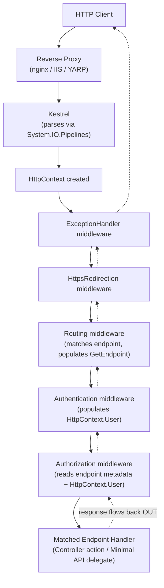
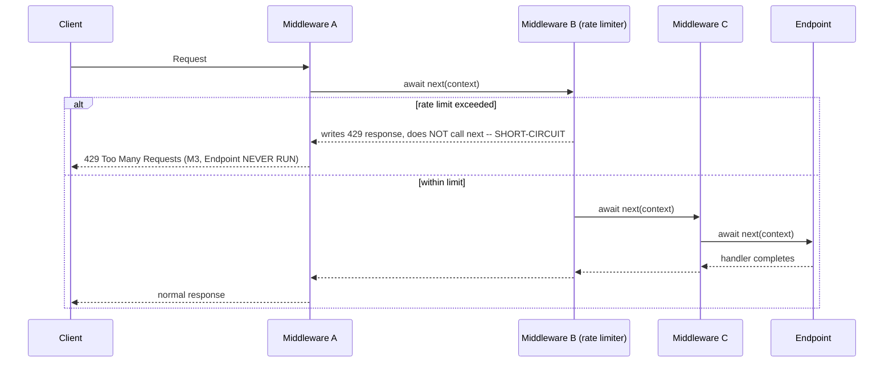
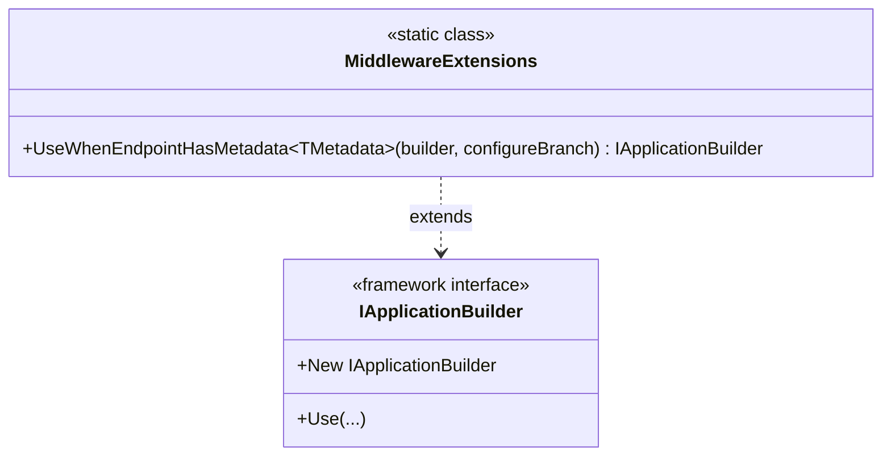
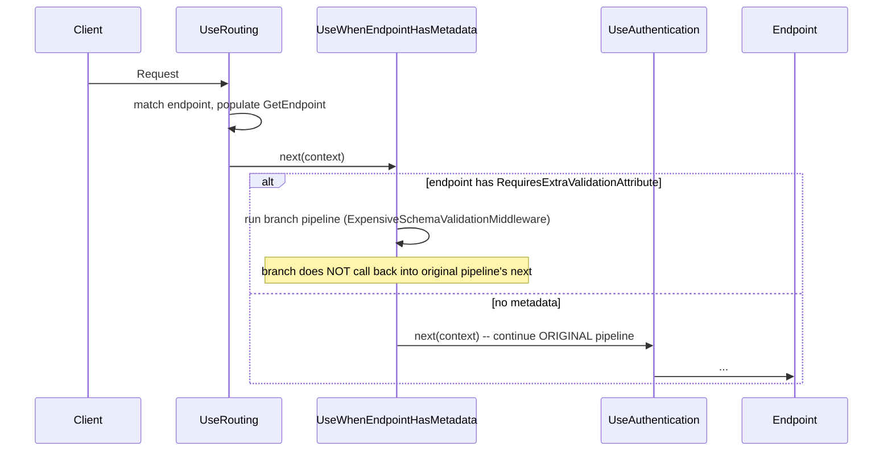

# Module 9 — ASP.NET Core: Middleware Pipeline & Request Processing Internals

> Domain:.NET / ASP.NET Core | Level: Beginner → Expert | Prerequisite: [[../01-CSharp/02-Async-Await-Internals]] (async request handling, `SynchronizationContext`), [[../01-CSharp/03-Span-Memory-Low-Allocation]] (Kestrel/`System.IO.Pipelines`), [[../01-CSharp/08-Exception-Handling-Custom-Exceptions]] (exception-handling middleware)

---

## 1. Topic Description

### Definition

The ASP.NET Core **middleware pipeline** is a nested chain of `RequestDelegate` components, each holding a reference to the next. Code written before `await next()` executes on the way *in*, in registration order; code after it executes on the way *out*, in reverse order — the "onion". A component that does not call `next` short-circuits the request. Around that chain sits the **request lifecycle**: Kestrel accepts the connection and materialises an `HttpContext` backed by a `Features` collection the server implements, the framework creates a per-request DI scope, endpoint routing selects a handler, and the response is written back through the same onion in reverse.

### Core sub-concepts

- **The `RequestDelegate` chain** — `Use`, `Run` (terminal), `Map` (hard branch), `MapWhen`, `UseWhen` (conditional insertion that rejoins).
- **Ordering semantics** — why exception handling must be outermost and authorization must sit between routing and endpoint execution.
- **Two-stage endpoint routing** — `UseRouting` selects and attaches endpoint metadata; endpoint middleware executes; the gap is what makes metadata-driven authorization possible.
- **`HttpContext` and `Features`** — the server/framework abstraction boundary, and feature replacement as the mechanism behind response caching and compression.
- **The response-has-started boundary** — headers and status are immutable after the first body byte, constraining any outward-pass modification.
- **Request-body semantics** — forward-only single-read streams, `EnableBuffering`, and the memory/disk cost of buffering.
- **Per-request DI scope** — creation, disposal, and work that escapes the scope.
- **Middleware lifetime** — convention-based middleware is effectively a singleton; `IMiddleware` as the per-request alternative.
- **Middleware vs filters vs endpoint filters** — routing-agnostic versus action-aware concerns.
- **`IHttpContextAccessor`** — `AsyncLocal` backing, its cost, and why it is an architectural smell outside the web layer.
- **Graceful shutdown** — `IHostApplicationLifetime`, drain timeouts, readiness flipping, and the SIGTERM/endpoint-removal race.
- **Admission control in the pipeline** — bounded concurrency, load shedding and fast rejection.

### Where it fits

The pipeline is where every cross-cutting concern physically lives — correlation, logging, exception translation, authentication, security headers, compression, rate limiting — so it is the single place a platform team can make behaviour consistent across an estate by default. It depends on the DI container for scope and service resolution, and it is the layer that authentication/authorization, model binding and health endpoints all plug into. `Program.cs` is consequently the most information-dense file in a service: its ordering tells you whether the team has operated this system in production.

### Why it matters at scale

Ordering defects are silent and severe. Authentication registered after authorization means every request is anonymous; exception handling registered late leaves earlier failures returning bare 500s; a `Map` branch added for a metrics path silently excludes every middleware registered afterwards, including auth. Scope defects are equally quiet: work that outlives the request throws `ObjectDisposedException` only under load, because it depends on a race with scope disposal. And a pipeline with no admission control degrades by accumulation under overload — queues build, timeouts cascade, clients retry — turning a capacity problem into an outage, when a 503 returned in 2 ms would have been far better for the whole system.

### Common pitfalls / anti-patterns

- **`UseAuthorization` before `UseRouting`** — no endpoint has been selected, so endpoint authorization metadata is invisible and the policy silently does not apply.
- **Exception-handling middleware registered after several others** — it can only catch what runs inside it, so those components' failures escape unhandled.
- **A `Map` branch registered early** — later-registered middleware never runs for that path, so health, metrics or webhook endpoints quietly bypass authentication, correlation and error handling.
- **Injecting a scoped service into a convention-based middleware constructor** — the middleware is constructed once, so one request's `DbContext` is captured and shared forever.
- **Reading the request body in middleware without `EnableBuffering`** — the stream is consumed, and the model binder silently receives nothing, producing a null model.
- **Setting a header after the response has started** — throws, which is why outward-pass middleware must check `HasStarted` and can then only abort the connection.
- **Global body buffering for logging** — turns every large upload into a memory or disk amplification per request, and captures payloads that should never be retained.

> Scope note: DI lifetimes and container mechanics belong to `02-DI-Container-Internals`; model binding, minimal APIs and controllers to `03-MinimalAPIs-vs-Controllers-ModelBinding`; authentication schemes and authorization policies to `04-Authentication-Authorization-Deep-Dive`; configuration and options to `05-Configuration-Options-Pattern`; health checks and telemetry export to `06-HealthChecks-Observability`.

---

## 2. Beginner (10 Q&A)

**Q1. What's wrong with this pipeline?**
```csharp
app.UseRouting();
app.UseAuthorization();
app.UseAuthentication();
app.MapControllers();
```
**A:** Authentication runs after authorization, so when authorization evaluates the policy `HttpContext.User` hasn't been populated yet — every request is anonymous. Depending on your policies that either denies everything or, worse, lets anonymous-allowed endpoints through while the authenticated ones fail. Order must be `UseAuthentication` then `UseAuthorization`, and authorization has to sit between `UseRouting` and the endpoints.
*Follow-up: Why specifically between routing and endpoints?*

**Q2. Explain the "onion" and what happens on the way out.**
**A:** Each middleware gets the next one as a delegate. Code before `await next()` runs on the way in, in registration order; code after it runs on the way out, in reverse. So the first-registered middleware sees the request earliest and the response latest — which is exactly why exception handling and logging go at the top. A middleware that doesn't call `next` short-circuits and everything after it never runs.
*Follow-up: What happens if a middleware calls `next()` twice?*

**Q3. Why does this break model binding?**
```csharp
app.Use(async (ctx, next) => {
    using var reader = new StreamReader(ctx.Request.Body);
    var body = await reader.ReadToEndAsync();
    _logger.LogInformation("Body: {Body}", body);
    await next();
});
```
**A:** The request body is a forward-only stream that can only be read once. This consumes it, so the model binder downstream finds nothing and the action receives a null model — with no error anywhere. `Request.EnableBuffering()` switches to a rewindable stream so you can read then reset the position. But don't do it globally: it buffers every body to memory or disk, which on an upload endpoint is a per-request amplification.
*Follow-up: What limits does `EnableBuffering` have, and how do you protect against a large-body DoS?*

**Q4. Why can't you inject a scoped service here?**
```csharp
public class TenantMiddleware {
    public TenantMiddleware(RequestDelegate next, AppDbContext db) { ... }
}
```
**A:** Convention-based middleware is constructed once at startup and reused for every request, so it's effectively a singleton. Injecting a scoped `DbContext` into the constructor captures one request's instance forever — shared across every concurrent request, accumulating tracked entities, and eventually disposed underneath you. Scoped services go as extra parameters on `InvokeAsync`, which is resolved per request.
*Follow-up: How does `IMiddleware` differ in this respect?*

**Q5. Why does `UseRouting` exist separately from endpoint execution?**
**A:** So middleware *between* the two can know which endpoint was selected without having executed it. `UseRouting` matches the request and attaches the endpoint's metadata to the context; `UseAuthorization` then reads that endpoint's authorization metadata to enforce policy; endpoint middleware finally runs the handler. That gap is the whole reason metadata-driven authorization works — before `UseRouting` there's no endpoint to inspect, and after execution it's too late.
*Follow-up: What happens if you call `UseAuthorization` before `UseRouting`?*

**Q6. What does "the response has started" mean and what does it stop you doing?**
**A:** Once the first byte of the body goes out, the status and headers are already on the wire and can't be changed — attempting to set them throws. That constrains any middleware wanting to modify the response on the way out: by the time an inner component has written, your chance is gone. It's why exception-handling middleware checks `Response.HasStarted` and, if it has, can only abort the connection rather than return a clean error.
*Follow-up: How would you write middleware that must modify a response body produced downstream?*

**Q7. `Map`, `MapWhen`, `UseWhen`, `Use`, `Run` — what's the difference?**
**A:** `Use` adds a middleware that can call the next, participating in both directions. `Run` is terminal — never calls next. `Map` branches on a path prefix into a *separate* chain with its own terminal. `UseWhen` conditionally inserts middleware into the main pipeline and rejoins it. The distinction that bites is `Map` versus `UseWhen`: `Map` is a hard fork, so anything registered after it never runs for matched requests.
*Follow-up: How would you audit an app for endpoints that bypass parts of the pipeline?*

**Q8. What is `HttpContext.Features` for?**
**A:** It's the extensibility layer between the server and the framework — a collection of interfaces the server implements (request/response bodies, connection info, TLS details, WebSocket upgrade) that higher layers query rather than depending on Kestrel directly. That indirection is why the same app runs on Kestrel, HTTP.sys or IIS in-process, and why middleware can *replace* a feature: response caching and compression both work by swapping the response body feature.
*Follow-up: Seeing `Features` in application code usually signals what?*

**Q9. Middleware, action filter, or endpoint filter?**
**A:** Middleware for concerns applying to every request regardless of routing, and that may need to run before routing exists — logging, exception handling, correlation, security headers, compression. Filters run inside MVC execution with access to the action, its arguments and its result, so they're right for model-level concerns like validation or result shaping. Endpoint filters are the minimal-API equivalent, lighter and composable per endpoint or route group. The tell: if you need routing or argument context, it isn't middleware.
*Follow-up: A concern applies to one controller only. Which, and why?*

**Q10. Why is `IHttpContextAccessor` treated with suspicion?**
**A:** It exposes the current context via an `AsyncLocal`, letting code deep in the stack reach the request without it being passed down. That creates an invisible dependency on a web context, so the code can't run from a background job or a message consumer without failing at runtime; it costs a little on every request; and it silently returns null exactly where you didn't expect to be. Fine in a logging enricher; a poor choice in domain or application logic, where the value should be an explicit parameter.
*Follow-up: A service needs the current user's tenant ID. What's the better design?*

---

## 3. Intermediate (10 Q&A)

**Q1. Someone adds middleware and authentication silently stops working on some endpoints. How do you diagnose it?**
**A:** First dump the *actual* pipeline order, because `Program.cs` in a real service is assembled across extension methods and the effective order is rarely what anyone believes. Then check whether the new middleware short-circuits for some paths, or writes to the response early so downstream sees a started response. Also check whether it branched with `Map` — a mapped branch doesn't inherit middleware registered afterwards, which is a very common cause of "auth works on most endpoints". The lesson: diagnose pipeline problems by establishing real order first, not by reading the middleware's code.
*Follow-up: How would you write a test that fails when someone reorders the pipeline incorrectly?*

**Q2. How do you implement request/response logging without wrecking performance or leaking data?**
**A:** Log metadata by default — method, path, status, duration, correlation ID, user and tenant — and make bodies opt-in per route, because buffering every body costs memory and captures payloads you almost certainly shouldn't retain. Where bodies are needed, cap the captured size, redact by an *allow-list* rather than a deny-list, and sample. Make the middleware exception-safe and certain never to change response semantics, since a logging component that alters behaviour is the worst kind of bug to chase. In a regulated environment, retention and access controls on those logs are part of the design.
*Follow-up: A sensitive field appears in logs despite redaction. What went wrong?*

**Q3. What's the bug, and why is it intermittent?**
```csharp
public async Task<IActionResult> Post(Order o) {
    _ = ProcessInBackground(o);   // uses injected scoped DbContext
    return Accepted();
}
```
**A:** The background work continues after the response, but the DI scope is disposed when the request completes — so the `DbContext` is disposed underneath it. It's intermittent because it depends on the race between the work and the disposal, so it passes locally and fails under load. Fix is an explicit scope for work that outlives the request, resolved from `IServiceScopeFactory` — or better, hand it to a hosted service or a queue so it isn't tied to a request at all.
*Follow-up: The background work needs data from the request scope. How do you pass it safely?*

**Q4. What does the built-in exception handler *not* cover?**
**A:** Anything thrown before it in the pipeline, including in the host's own startup path. Anything after the response has started, where the only honest option is aborting the connection. Failures in the response writing itself. And anything on a background thread, which is outside the request entirely. So the complete picture needs the middleware, plus a top-level unhandled-exception hook, plus explicit error handling inside hosted services.
*Follow-up: The response has already started when the exception is thrown. What should the client experience?*

**Q5. Where should a rate limiter live — gateway, middleware, or both?**
**A:** Both, for different reasons. The edge is where you shed load cheaply and protect the whole service, because rejecting there costs no application resources and defends against volumetric abuse. In-process middleware is where you enforce per-tenant or per-endpoint fairness the edge can't see, since it needs application knowledge of the caller's plan. The trade-off is state: in-process limiting is per-instance unless backed by a shared store, so an N-instance deployment permits N times the configured rate — a detail people routinely miss when the limit is contractual.
*Follow-up: How do you implement a distributed limit without making the store a single point of failure?*

**Q6. How does graceful shutdown work, and where do requests get lost?**
**A:** The host stops accepting new connections, signals `ApplicationStopping`, and waits up to a configured timeout for in-flight requests before disposing services. Requests get lost when that timeout is shorter than the longest legitimate request; when the load balancer keeps routing because readiness wasn't flipped first; and when background work started from a request isn't tracked and is simply killed. In Kubernetes the classic gap is the pod getting SIGTERM before the endpoints controller has removed it from the service, which is why a pre-stop delay matters.
*Follow-up: What sequence would you configure so a rolling deploy drops zero requests?*

**Q7. How would you implement per-tenant behaviour in the pipeline?**
**A:** Resolve tenant identity early — from host, path, header or a token claim — into a strongly-typed context registered as a scoped service, so downstream code depends on an explicit abstraction rather than reparsing the request. Then use it for configuration, connection selection and data filtering. The critical decision is failure behaviour: an unresolvable tenant must fail closed with a clear error, never fall through to a default, because a default tenant is a cross-tenant exposure waiting to happen. And keep it out of `IHttpContextAccessor` reach in the domain, so a background job can't run with no tenant at all.
*Follow-up: How do you ensure a background job processes with the correct tenant context?*

**Q8. How do you attribute latency to a specific middleware in production?**
**A:** Wrap each registration with timing instrumentation in a non-production environment, or sample it in production, emitting per-middleware duration — because "the pipeline is slow" is nearly always one middleware doing something synchronous or uncached. The specific patterns to look for are per-request configuration parsing, policy construction, resolving an expensive service graph, body buffering, and any synchronous I/O. I'd profile rather than count middlewares: twenty cheap ones are fine, three where one does a blocking lookup is not.
*Follow-up: The per-middleware instrumentation costs more than some of the middleware. How do you handle that?*

**Q9. How do you test middleware properly?**
**A:** Unit tests with a `DefaultHttpContext` and a stub `next` verify the middleware's own logic — that it calls or doesn't call next, that it doesn't alter the response unexpectedly. But the bugs that actually happen are *ordering and interaction* bugs a unit test can't see, so the important tests are integration tests via `WebApplicationFactory` asserting pipeline-level invariants: unauthenticated request to a protected endpoint returns 401, an exception produces the standard error contract, security headers appear on every response. Those are what catch a reorder six months later.
*Follow-up: How would you assert the whole pipeline's ordering rather than testing behaviours one at a time?*

**Q10. What's the difference between `UseWhen` and `MapWhen`, and when has it bitten you?**
**A:** `UseWhen` conditionally inserts middleware into the main pipeline and rejoins it, so everything registered afterwards still runs. `MapWhen` creates a separate branch that terminates on its own, so later-registered middleware never runs for matched requests. The bite is exactly there: someone adds a `Map` for a health or metrics path early in `Program.cs`, and later additions — authentication, correlation, exception handling — silently don't apply to that branch. Usually benign until the branch handles something that should have been authenticated.
*Follow-up: How would you enumerate every endpoint and its effective middleware at startup?*

---

## 4. Expert / Architect (10 Q&A)

**Q1. How do you decide what belongs in application middleware versus a gateway or service mesh?**
**A:** Ask whether the concern needs application knowledge and whether it must be consistent across everything. Volumetric protection, TLS termination, coarse routing, IP filtering and basic authentication belong at the edge, where they're cheaper and where a misconfigured service can't bypass them. Concerns needing domain context — per-tenant fairness, business-level authorization, request enrichment — must be in-process. The important architectural point is that edge controls are *not* defence in depth on their own: anything the edge enforces should also be enforceable in-process, because service-to-service traffic often never traverses the edge. I'd map each cross-cutting concern to a layer explicitly, since the ones landing in both by accident are where inconsistency lives.
*Follow-up: A concern is implemented at both the gateway and in middleware with different configurations. How do you resolve it?*

**Q2. How would you standardise the pipeline across dozens of services without blocking teams?**
**A:** A shared package exposing one opinionated composition — correlation, structured logging, exception handling and the error contract, security headers, health endpoints, telemetry — so a service gets the platform's behaviour by calling one method, and deviations require explicit code and are therefore visible. That's far more effective than documentation, because the default path is also the correct one. To avoid blocking, it must be composable rather than all-or-nothing, versioned so teams adopt on their own schedule, and free of business decisions. The risk to manage is it becoming a bottleneck or a dumping ground, so I'd scope it explicitly to cross-cutting platform concerns with a named owner.
*Follow-up: A team needs to disable one part of the standard pipeline. How do you handle that without eroding the standard?*

**Q3. What's your position on `IHttpContextAccessor` in a layered architecture?**
**A:** Web layer and infrastructure adapters only — never application or domain code. Once domain services depend on it they can't be exercised from a background worker, a message consumer or a test without faking an HTTP context, and the dependency is invisible in constructors so nobody discovers it until the code is reused. The alternative is capturing what you need at the boundary — user, tenant, correlation — into an explicit context object injected as a scoped dependency, which works identically in a request, a job and a test. I'd enforce that with an architecture test rather than review, because it's a rule that erodes silently.
*Follow-up: How would you write that architecture test?*

**Q4. Design the request lifecycle for a service handling both interactive traffic and long-running operations.**
**A:** Separate them at the protocol level: interactive requests complete within a short bounded time, long operations return `202 Accepted` with a status resource and do the work in a durable background process. Holding a connection for minutes wastes a request slot, breaks under load-balancer idle timeouts, and leaves the client no recovery path if the connection drops. The queue-plus-status pattern also gives you retry, backpressure and observability a long request can't. I'd enforce it with a hard request timeout so a long path can't quietly appear, and keep the status contract consistent across services so clients learn it once.
*Follow-up: The client team says polling is unacceptable. What are the options and their costs?*

**Q5. A pipeline concern must be applied consistently and one service keeps bypassing it. How do you handle that structurally?**
**A:** Assume bypass will happen and design so it fails *safe*. That means enforcing the invariant at more than one layer — authorization by endpoint metadata plus a global fallback policy that denies by default, so a missing attribute yields 401 rather than open access. Then make deviation detectable: an automated test enumerating endpoints and asserting every one has an authorization policy is far more reliable than review. Defaults should be secure and opting out should require an explicit, greppable, reviewable declaration. Relying on every team remembering is a control that will fail, and in a regulated environment it'll fail an audit too.
*Follow-up: How would you enumerate every endpoint and its metadata at startup to assert on it?*

**Q6. What are the pipeline's failure modes under overload, and how do you make degradation deliberate?**
**A:** By default it accepts everything and gets slower — queues build, timeouts cascade, clients retry, and a capacity problem becomes an outage. Deliberate degradation means bounding concurrency so excess requests are rejected quickly with a retryable status rather than queued indefinitely, shedding low-priority traffic first, and returning fast failures clients can back off from. The pipeline is the natural place for admission control because it sees every request before any expensive work. The key point to land with stakeholders *before* the incident is that fast rejection is a feature: a 503 in 2 ms is far better for the whole system than a 200 in 40 seconds.
*Follow-up: How do you decide which traffic to shed first, and how do you know your priorities are right?*

**Q7. How does the pipeline change for a service that must produce an auditable record of every request?**
**A:** Audit becomes a first-class concern with different requirements from logging: durable, tamper-evident, complete, retained per policy — so it can't be a log line that may be sampled or dropped under load. I'd capture audit records in middleware that has identity and outcome, write them through a path with delivery guarantees (an outbox or append-only store) rather than fire-and-forget, and make failure to record a failure of the request where the regulation demands it. That last decision is a real availability-versus-compliance trade that belongs to the business. And keep audit separate from diagnostic logging, because their retention, access control and completeness requirements genuinely differ.
*Follow-up: Writing the audit record synchronously adds 15 ms per request. How do you evaluate that?*

**Q8. How do you evolve shared middleware safely across many dependent services?**
**A:** Treat it as a product: versioning, a compatibility policy, a deprecation process. Changes that alter observable behaviour — a new default, stricter validation, a changed error shape — must be opt-in for at least one version, announced with a migration path, and ideally accompanied by telemetry showing who's affected. Roll such changes through a canary service before broad release, because a defect in shared middleware is an estate-wide incident rather than a single-service one. The discipline that matters most is resisting behavioural changes in patch versions, since teams reasonably assume patches are safe and pick them up automatically.
*Follow-up: You need to fix a security issue in shared middleware that changes behaviour. How do you sequence it?*

**Q9. Latency is dominated by cross-cutting concerns. How do you approach it?**
**A:** Attribute properly first, because "middleware is slow" is usually one middleware doing something synchronous or uncached rather than a distributed cost. Instrument per-middleware duration in non-production or via sampling, and look for the specific patterns: per-request configuration parsing, policy construction, expensive service resolution, body buffering, synchronous I/O. Then cache what's invariant, scope expensive middleware to the routes needing it, and move anything that doesn't need to be in the request path out of it. If cross-cutting cost is still material after that, the honest conversation is which concerns can move to the edge — but I'd want the measurement first, because intuition here is usually wrong.
*Follow-up: Which middleware would you expect to be genuinely expensive in a typical service?*

**Q10. You're handed a `Program.cs` you've never seen. What tells you whether the team has operated this service in production?**
**A:** The security-relevant ordering first — exception handling early, authentication before authorization, authorization between routing and endpoints, HTTPS and security headers present. Then the operational essentials: correlation, structured logging, health endpoints split into liveness and readiness, telemetry, graceful-shutdown configuration. Then the warning signs: `Map` branches bypassing later middleware, global body buffering, catch-everything middleware, scoped services resolved at composition time, business logic in the pipeline. `Program.cs` is the most information-dense file in an ASP.NET Core service — you can usually tell within a few minutes.
*Follow-up: You find a single `/health` endpoint with no liveness/readiness split. What specifically goes wrong in production?*

---

## 5. Reference Material

> Retained from the original module: deep-dive internals, diagrams, production examples, exercises, system/low-level design, debugging walkthroughs and the Principal Engineer perspective.

### 1. Fundamentals

#### What is the ASP.NET Core middleware pipeline?
ASP.NET Core processes every HTTP request through an ordered **pipeline of middleware components** — each middleware is a piece of code that can inspect/modify the incoming `HttpContext`, decide whether to pass control to the *next* middleware in the pipeline, and inspect/modify the response on the way back out. This replaces the older ASP.NET (Framework) `HttpModule`/`HttpHandler` pipeline with a simpler, fully composable, delegate-based model.

#### Why does it exist?
Classic ASP.NET's pipeline (`HttpModules`, the `HttpApplication` event-based lifecycle with ~20 named events like `BeginRequest`/`AuthenticateRequest`/`EndRequest`) was **rigid and implicit** — modules ran in an order governed by web.config registration and internal IIS/ASP.NET plumbing, and understanding "what runs before what" required memorizing a fixed event sequence. ASP.NET Core's middleware pipeline makes ordering **fully explicit and code-driven** — you literally write the order in `Program.cs` (`app.UseX; app.UseY;`), and it's just a chain of delegates, making the request-processing flow far easier to reason about, test, and customize.

#### When does this matter?
- **Always**, since every request to an ASP.NET Core app flows through this pipeline — but understanding it *deeply* matters specifically for:
 - Correctly ordering middleware (authentication before authorization, exception handling wrapping everything, response compression before/after caching) — a wrong order is a common, subtle bug source.
 - Diagnosing why a middleware's changes to the response aren't taking effect (the "response has already started" class of bug).
 - Writing custom middleware/filters for cross-cutting concerns (logging, correlation IDs, rate limiting).
 - Interviewing — "explain the ASP.NET Core request pipeline, and why does middleware order matter for X and Y" is a near-universal ASP.NET Core interview question at every seniority level, with the depth of a good answer varying enormously.

#### How does it work (30,000-ft view)?

```csharp
var app = builder.Build;

app.UseExceptionHandler("/error"); // 1st: wraps EVERYTHING after it
app.UseHttpsRedirection; // 2nd
app.UseRouting; // 3rd: determines WHICH endpoint will handle this request
app.UseAuthentication; // 4th: who are you?
app.UseAuthorization; // 5th: are you allowed?
app.UseEndpoints(endpoints => {... }); // 6th (or implicit via MapGet/MapControllers): actually run the handler
```

Mental model for interviews: **"Middleware forms a nested chain of delegates — each one wraps everything after it, like layers of an onion. A request travels IN through each layer in registration order, hits the endpoint at the center, then the response travels OUT back through the same layers in reverse order. Order is everything — a middleware can only affect what happens *after* it on the way in, and *before* it finishes on the way out."**

### 2. Deep Dive

#### 2.1 The Delegate Chain — Precisely How `Use`/`Run`/`Map` Build the Pipeline

Under the hood, the entire pipeline is built from `RequestDelegate` (`Func<HttpContext, Task>`) instances, composed via `IApplicationBuilder`. `app.Use(...)` registers a piece of middleware that receives the **next** `RequestDelegate` in the chain and returns a new `RequestDelegate` wrapping it:

```csharp
app.Use(async (context, next) =>
    {
        // ---- code here runs on the way IN ----
        Console.WriteLine("Before");
        await next(context); // invoke the REST of the pipeline
        // ---- code here runs on the way OUT (after everything downstream completes) ----
        Console.WriteLine("After");
});
```

Conceptually, this builds a structure like:
```
RequestDelegate pipeline =
 ctx => Middleware1(ctx, next: ctx => Middleware2(ctx, next: ctx => Middleware3(ctx, next: ctx => Endpoint(ctx))));
```
Each middleware is a **closure** capturing the "next" delegate — this is precisely why calling `await next(context)` in the middle of a middleware's body is what causes the "onion" behavior: code before `next` runs on the way in, code after runs on the way out, and **omitting the call to `next` entirely short-circuits the pipeline** — nothing downstream (including the actual endpoint) ever runs, a deliberate technique for e.g. a maintenance-mode middleware that returns a fixed response for every request without ever reaching routing/endpoints.

`app.Run(...)` registers a **terminal** middleware (never calls `next` — it's meant to be the last thing in a given branch of the pipeline); `app.Map`/`app.MapWhen` branch the pipeline conditionally (based on path or an arbitrary predicate) into a separate sub-pipeline.

#### 2.2 `HttpContext` — the Per-Request State Container

`HttpContext` is the single object flowing through every middleware, carrying: `Request` (method, path, headers, body stream, query string), `Response` (status code, headers, body stream — writable), `User` (the authenticated `ClaimsPrincipal`, populated by authentication middleware), `RequestServices` (a **request-scoped** `IServiceProvider` — critical for DI scoping), `Items` (a `IDictionary<object,object>` for passing arbitrary per-request state between middleware), and `RequestAborted` (a `CancellationToken` signaled if the client disconnects — the cancellation-propagation guidance applies directly here).

**Critical fact**: `HttpContext` is created **fresh per request** and is **not thread-safe for concurrent access** — accessing it from multiple concurrently-running tasks for the *same* request (e.g., firing off several `Task.Run`-offloaded operations that each touch `HttpContext` without careful coordination) is a genuine, real bug source, since ASP.NET Core makes no internal synchronization guarantee for concurrent reads/writes to the same context from multiple threads simultaneously.

#### 2.3 Response-Already-Started — the Single Most Common Middleware Bug

Once the response body has begun being **written to the underlying network stream** (as opposed to merely having its status code/headers *set*, which remains mutable until the first byte is actually flushed), `HttpResponse.HasStarted` becomes `true`, and any subsequent attempt to modify `StatusCode`/`Headers` throws `InvalidOperationException: "StatusCode cannot be set because the response has already started."` This is precisely why exception-handling middleware **must** be registered as early as possible in the pipeline (wrapping everything else) — if an exception occurs deep in the pipeline *after* the response has already started streaming (e.g., a large response body being written incrementally, mid-write, when a failure occurs), no exception-handling middleware, no matter how well-designed, can retroactively change the already-sent status code or headers — it can, at best, log the error and abruptly terminate the connection, since the client has already received a `200 OK` header it can't un-send.

#### 2.4 `UseRouting`/`UseEndpoints` Split — Why Two Steps, and Endpoint Metadata

`UseRouting` and endpoint mapping (`MapGet`, `MapControllers`, or the older explicit `UseEndpoints(...)`) are deliberately **separate pipeline steps** specifically so that middleware registered **between** them (most commonly `UseAuthentication`/`UseAuthorization`) can inspect **which endpoint has been matched** (via `HttpContext.GetEndpoint`, populated by `UseRouting`) **before** that endpoint's handler actually executes — this is exactly how `[Authorize]` attribute-based authorization works: `UseRouting` determines the matched endpoint (and its metadata, including any `[Authorize]` attributes attached to the controller action/minimal-API route), and `UseAuthorization` (running after routing but before the endpoint executes) inspects that metadata to decide whether the request is allowed to proceed. **This is why `UseAuthentication`/`UseAuthorization` must be registered after `UseRouting` and before the endpoint execution (`MapControllers`/etc.)** — registering them before `UseRouting` means no endpoint metadata is available yet to make an authorization decision against.

#### 2.5 Dependency Injection Scoping and the Request-Scoped Container

ASP.NET Core's built-in DI container creates a **new DI scope per request**, exposed as `HttpContext.RequestServices` — any service registered as `Scoped` (the most common lifetime for things like `DbContext`) gets **one shared instance for the entire request**, resolved fresh for the next request. This directly connects to §Advanced Q6's `DbContext`-lifetime discussion: a `Scoped` `DbContext` is safe to inject into and share across multiple services *within* one request's dependency graph, but must never be captured/cached beyond that request's scope (e.g., stored in a `Singleton`-lifetime service's field) — doing so is one of the most common and most dangerous ASP.NET Core DI bugs (a later DI-internals module covers this in full depth; this module flags it specifically as a middleware/request-lifecycle concern, since the scope's *creation and disposal* is itself a pipeline-level behavior, wrapping the entire request's middleware chain).

#### 2.6 Kestrel, `System.IO.Pipelines`, and Where Middleware Sits in the Larger Picture

Kestrel (the built-in web server) accepts raw TCP connections, parses HTTP requests using exactly the `System.IO.Pipelines`/`Span<T>`-based zero-copy techniques covered, and constructs an `HttpContext` per request, which is then handed to the **first** middleware in the application's configured pipeline. In production, Kestrel commonly sits behind a **reverse proxy** (IIS in-process/out-of-process hosting, Nginx, Azure Application Gateway, YARP) — middleware like `UseForwardedHeaders` exists specifically to correctly reconstruct the "real" client IP/scheme/host from proxy-added headers (`X-Forwarded-For`, `X-Forwarded-Proto`), since without it, Kestrel sees only the reverse proxy's own connection details, not the original client's — a common, easy-to-miss production misconfiguration.


```mermaid
graph TB
 Client[HTTP Client] --> Proxy["Reverse Proxy<br/>(nginx / IIS / YARP)"]
 Proxy --> Kestrel["Kestrel<br/>(parses via System.IO.Pipelines)"]
 Kestrel --> HttpCtx[HttpContext created]
 HttpCtx --> MW1["ExceptionHandler middleware"]
 MW1 --> MW2["HttpsRedirection middleware"]
 MW2 --> MW3["Routing middleware<br/>(matches endpoint, populates GetEndpoint)"]
 MW3 --> MW4["Authentication middleware<br/>(populates HttpContext.User)"]
 MW4 --> MW5["Authorization middleware<br/>(reads endpoint metadata + HttpContext.User)"]
 MW5 --> Endpoint["Matched Endpoint Handler<br/>(Controller action / Minimal API delegate)"]
 Endpoint -.->|response flows back OUT| MW5
 MW5 -.-> MW4
 MW4 -.-> MW3
 MW3 -.-> MW2
 MW2 -.-> MW1
 MW1 -.-> Client
```

#### 2.7 Minimal APIs vs Controllers — Pipeline-Level Differences

Minimal APIs (`app.MapGet("/orders/{id}",...)`) and MVC Controllers (`[ApiController] class OrdersController`) both ultimately compile down to the **same underlying endpoint-routing infrastructure** (`Endpoint`/`RequestDelegate`) — from the middleware pipeline's perspective, they're handled identically (both are just "the matched endpoint" that `UseRouting`/`UseEndpoints` dispatches to). The meaningful differences are **above** the middleware-pipeline layer: Controllers get the full MVC filter pipeline (`IActionFilter`, `IExceptionFilter`, model binding via `[FromBody]`/`[FromQuery]` attributes, automatic `ModelState` validation with `[ApiController]`), while Minimal APIs use a leaner, filter-based (`.AddEndpointFilter(...)`) model with less implicit "magic" — a design trade-off between convention-driven productivity (Controllers) and explicit, lower-overhead simplicity (Minimal APIs) that's covered in full in a dedicated later module.

### 3. Visual Architecture

#### The Onion Model (ASCII)

```
Request ──────────────────────────────────────────────────────►
 ┌─────────────────────────────────────────────────────────┐
 │ ExceptionHandler middleware │
 │ ┌───────────────────────────────────────────────────┐ │
 │ │ HttpsRedirection middleware │ │
 │ │ ┌─────────────────────────────────────────────┐ │ │
 │ │ │ Routing (matches endpoint) │ │ │
 │ │ │ ┌───────────────────────────────────────┐ │ │ │
 │ │ │ │ Authentication │ │ │ │
 │ │ │ │ ┌─────────────────────────────────┐ │ │ │ │
 │ │ │ │ │ Authorization │ │ │ │ │
 │ │ │ │ │ ┌───────────────────────────┐ │ │ │ │ │
 │ │ │ │ │ │ ENDPOINT (your handler) │ │ │ │ │ │
 │ │ │ │ │ └───────────────────────────┘ │ │ │ │ │
 │ │ │ │ └─────────────────────────────────┘ │ │ │ │
 │ │ │ └───────────────────────────────────────┘ │ │ │
 │ │ └─────────────────────────────────────────────┘ │ │
 │ └───────────────────────────────────────────────────┘ │
 └─────────────────────────────────────────────────────────┘
Response ◄──────────────────────────────────────────────────────
 (each layer can inspect/modify the response on the way back OUT,
 UNTIL that layer's HasStarted becomes true)
```

#### Middleware Short-Circuit Diagram


```mermaid
sequenceDiagram
 participant C as Client
 participant M1 as Middleware A
 participant M2 as Middleware B (rate limiter)
 participant M3 as Middleware C
 participant E as Endpoint

 C->>M1: Request
 M1->>M2: await next(context)
 alt rate limit exceeded
 M2-->>M1: writes 429 response, does NOT call next -- SHORT-CIRCUIT
 M1-->>C: 429 Too Many Requests (M3, Endpoint NEVER RUN)
 else within limit
 M2->>M3: await next(context)
 M3->>E: await next(context)
 E-->>M3: handler completes
 M3-->>M2: 
 M2-->>M1: 
 M1-->>C: normal response
 end
```

### 4. Production Example

#### Scenario: API gateway service — client IP address always logged as the reverse proxy's IP

**Problem**: A fraud-detection feature relying on client IP addresses for rate-limiting and anomaly detection was consistently seeing the **same single IP address** for every request, regardless of which actual client made it — completely breaking the feature (every client appeared identical, either triggering false-positive rate limits for legitimate traffic sharing that IP, or masking genuinely abusive traffic behind a "trusted" shared address).

**Investigation**:
- Confirmed the service ran behind an internal load balancer/reverse proxy (as essentially all production ASP.NET Core services do) — `HttpContext.Connection.RemoteIpAddress` was, correctly per its actual meaning, reporting the **immediate TCP connection's** source IP, which was the reverse proxy's own address, not the original client's.
- The reverse proxy **was** correctly setting the standard `X-Forwarded-For` header with the true original client IP — but the application's middleware pipeline had never been configured with `UseForwardedHeaders` to actually read and apply that header, meaning the correct information was present in every request but simply never consumed.

**Architecture fix**:
- Added `app.UseForwardedHeaders(new ForwardedHeadersOptions { ForwardedHeaders = ForwardedHeaders.XForwardedFor | ForwardedHeaders.XForwardedProto })` as **one of the very first** middleware registrations (before routing, authentication, and certainly before the fraud-detection logic that reads `RemoteIpAddress`) — `UseForwardedHeaders` rewrites `HttpContext.Connection.RemoteIpAddress` (and the request's perceived scheme) in place based on the trusted forwarded headers, so every downstream middleware/endpoint transparently sees the correct original client IP without needing to know anything about the reverse-proxy topology itself.
- Explicitly configured `KnownProxies`/`KnownNetworks` on `ForwardedHeadersOptions` to restrict which upstream hops are trusted to supply these headers — critical because blindly trusting an `X-Forwarded-For` header from *any* source is a spoofing vector: a malicious client could set that header directly if the app trusted it from an untrusted, direct connection, unless the middleware is configured to only honor it when the immediate connection actually comes from a known, trusted proxy.

**Trade-offs**: Restricting `KnownProxies` requires keeping the trusted-proxy IP list/network range in the application's configuration in sync with actual infrastructure (load balancer IP ranges, potentially changing across cloud provider updates) — a small ongoing operational coupling accepted as necessary, since the alternative (trusting forwarded headers unconditionally) is a genuine security vulnerability, not just an inconvenience.

**Lessons learned**:
1. `HttpContext.Connection.RemoteIpAddress` reports the **immediate** TCP peer, which is the reverse proxy in essentially every real production deployment — any feature depending on the "real" client IP must explicitly configure `UseForwardedHeaders`, this is never automatic.
2. `UseForwardedHeaders` must be registered extremely early in the pipeline (before anything that reads IP/scheme) for its rewritten values to be visible to everything downstream — a direct, concrete instance of "middleware order matters" (/).
3. Never trust forwarded headers unconditionally — always scope `KnownProxies`/`KnownNetworks` to prevent spoofing from untrusted direct connections.

### 11. Coding Exercises

#### Easy — Implement a request-timing logging middleware
**Problem**: Implement middleware that logs how long each request took to process.
```csharp
public class RequestTimingMiddleware
{
    private readonly RequestDelegate _next;
    private readonly ILogger<RequestTimingMiddleware> _logger;

    public RequestTimingMiddleware(RequestDelegate next, ILogger<RequestTimingMiddleware> logger)
    {
        _next = next;
        _logger = logger;
    }

    public async Task InvokeAsync(HttpContext context)
    {
        var stopwatch = Stopwatch.StartNew;
        await _next(context); // everything downstream runs HERE
        stopwatch.Stop;
        _logger.LogInformation("{Method} {Path} took {ElapsedMs}ms -> {StatusCode}",
            context.Request.Method, context.Request.Path, stopwatch.ElapsedMilliseconds, context.Response.StatusCode);
    }
}
// Registration: app.UseMiddleware<RequestTimingMiddleware>; -- placed EARLY to time the full downstream pipeline
```
**Discussion**: Note this must be registered early (wrapping as much downstream pipeline as possible) to measure the *full* request duration, not just a narrow slice — a direct, simple illustration of the ordering principle / applied to the most common "hello world" custom-middleware exercise.

#### Medium — Implement a maintenance-mode short-circuiting middleware
**Problem**: Implement middleware that, when a configuration flag is set, returns a fixed 503 response for all requests except a health-check endpoint, without running any downstream middleware/endpoint.
```csharp
public class MaintenanceModeMiddleware
{
    private readonly RequestDelegate _next;
    private readonly IOptionsMonitor<MaintenanceOptions> _options;

    public MaintenanceModeMiddleware(RequestDelegate next, IOptionsMonitor<MaintenanceOptions> options)
    {
        _next = next;
        _options = options;
    }

    public async Task InvokeAsync(HttpContext context)
    {
        if (_options.CurrentValue.IsEnabled && context.Request.Path!= "/health")
        {
            context.Response.StatusCode = StatusCodes.Status503ServiceUnavailable;
            context.Response.Headers.RetryAfter = "300";
            await context.Response.WriteAsJsonAsync(new { message = "Service is under maintenance." });
            return; // deliberately NOT calling next -- full short-circuit
        }
        await _next(context);
    }
}
public class MaintenanceOptions { public bool IsEnabled { get; set; } }
// Registration: app.UseMiddleware<MaintenanceModeMiddleware>; -- registered VERY early
// before routing/auth/anything else, so maintenance mode bypasses ALL of it.
```
**Discussion**: `IOptionsMonitor<T>` (rather than `IOptions<T>`) is deliberately used here so the maintenance flag can be toggled **live** (via a reloadable configuration source) without restarting the process — an important operational property for a maintenance-mode switch specifically, since needing to redeploy just to exit maintenance mode would defeat much of the feature's purpose.

#### Hard — Implement request-body buffering and re-reading for audit logging (Advanced Q3's scenario)
**Problem**: Implement middleware that logs the full request body for POST/PUT requests without breaking downstream model binding.
```csharp
public class RequestBodyAuditMiddleware
{
    private readonly RequestDelegate _next;
    private readonly ILogger<RequestBodyAuditMiddleware> _logger;

    public RequestBodyAuditMiddleware(RequestDelegate next, ILogger<RequestBodyAuditMiddleware> logger)
    {
        _next = next;
        _logger = logger;
    }

    public async Task InvokeAsync(HttpContext context)
    {
        if (HttpMethods.IsPost(context.Request.Method) || HttpMethods.IsPut(context.Request.Method))
        {
            context.Request.EnableBuffering; // allows the stream to be read multiple times

            using var reader = new StreamReader(
                context.Request.Body, Encoding.UTF8, detectEncodingFromByteOrderMarks: false, leaveOpen: true);
            string body = await reader.ReadToEndAsync;

            _logger.LogInformation("Audit: {Method} {Path} body: {Body}",
                context.Request.Method, context.Request.Path, body);

            context.Request.Body.Position = 0; // CRITICAL: reset for downstream model binding to read it again
        }

        await _next(context);
    }
}
```
**Time/Space discussion**: `EnableBuffering` buffers the request body in memory (spilling to a temp file past a configurable threshold, by default) — for endpoints accepting large request bodies, this is a real memory/disk cost added specifically for the audit-logging feature, a deliberate trade-off that should be scoped (e.g., only for specific sensitive endpoints, not globally for every POST/PUT across the entire API) rather than applied blanket-wide without considering the cost, directly connecting to the "pay only for what you need, where you need it" discipline.
**Discussion points**: `leaveOpen: true` on the `StreamReader` is essential — without it, disposing the `StreamReader` would close the underlying request body stream entirely, breaking it for downstream reads regardless of resetting `Position`. This exercise is a direct, hands-on implementation of the exact gotcha named in Advanced Q3.

#### Expert — Implement a distributed, endpoint-metadata-aware rate-limiting middleware
**Problem**: Implement middleware that reads a custom `[RateLimit(requestsPerMinute: N)]` attribute from the matched endpoint's metadata (populated by `UseRouting`) and enforces a distributed (Redis-backed) rate limit specific to each endpoint's configured threshold, correctly positioned relative to routing and authentication per Advanced Q4/Q8's reasoning.
```csharp
[AttributeUsage(AttributeTargets.Method | AttributeTargets.Class)]
public class RateLimitAttribute: Attribute
{
    public int RequestsPerMinute { get; }
    public RateLimitAttribute(int requestsPerMinute) => RequestsPerMinute = requestsPerMinute;
}

public class EndpointRateLimitMiddleware
{
    private readonly RequestDelegate _next;
    private readonly IDistributedRateLimiter _limiter; // e.g., a Redis-token-bucket implementation

    public EndpointRateLimitMiddleware(RequestDelegate next, IDistributedRateLimiter limiter)
    {
        _next = next;
        _limiter = limiter;
    }

    public async Task InvokeAsync(HttpContext context)
    {
        var endpoint = context.GetEndpoint; // ONLY populated because this runs AFTER UseRouting
        var rateLimitAttr = endpoint?.Metadata.GetMetadata<RateLimitAttribute>;

        if (rateLimitAttr is not null)
        {
            // Key by authenticated user if available (requires this middleware to run AFTER
            // UseAuthentication -- see registration note below), falling back to IP otherwise.
            string key = context.User.Identity?.IsAuthenticated == true
            ? $"user:{context.User.FindFirstValue(ClaimTypes.NameIdentifier)}:{endpoint!.DisplayName}"
            : $"ip:{context.Connection.RemoteIpAddress}:{endpoint!.DisplayName}";

            bool allowed = await _limiter.TryAcquireAsync(key, rateLimitAttr.RequestsPerMinute, TimeSpan.FromMinutes(1));
            if (!allowed)
            {
                context.Response.StatusCode = StatusCodes.Status429TooManyRequests;
                context.Response.Headers.RetryAfter = "60";
                await context.Response.WriteAsJsonAsync(new { error = "Rate limit exceeded for this endpoint." });
                return; // short-circuit
            }
        }

        await _next(context);
    }
}

// Registration -- ORDER IS LOAD-BEARING, per Advanced Q4/Q8:
// app.UseRouting; // must run first: populates GetEndpoint
// app.UseAuthentication; // must run before this middleware: populates context.User
// app.UseMiddleware<EndpointRateLimitMiddleware>; // needs BOTH endpoint metadata AND authenticated user
// app.UseAuthorization
// app.MapControllers; // etc.

// Usage on an endpoint:
[RateLimit(requestsPerMinute: 10)]
[HttpPost("expensive-report")]
public IActionResult GenerateReport =>...;
```
**Discussion points**: This exercise deliberately requires the middleware to sit **after both** `UseRouting` (for endpoint metadata) **and** `UseAuthentication` (for the per-user rate-limiting key) but **before** `UseAuthorization` (so rate-limited requests are rejected before paying any authorization-check cost, though this ordering choice — rate limiting before vs. after authorization — is itself a legitimate design discussion point: placing it after authorization would mean only genuinely-authorized-but-over-the-limit requests get rate-limited, avoiding leaking "this endpoint exists and has a rate limit" information to unauthorized callers, a real security-vs-performance trade-off worth explicitly discussing in an interview rather than presenting one ordering as unconditionally correct). This single exercise synthesizes (delegate chain/short-circuit), (routing/endpoint-metadata timing), (`HttpContext.User` populated by authentication), and §Expert Q6 (distributed rate limiting) into one cohesive, realistic production component.

### 12. System Design

*(Narrow application — full System Design has its own module.)*

**Scenario**: Design the middleware/pipeline architecture for a **public API platform** serving both first-party web/mobile clients (cookie-based auth) and third-party partner integrations (API-key-based auth), behind a corporate reverse-proxy/CDN layer, with per-partner rate limits and full request/response audit logging for compliance.

- **Functional**: Support two distinct authentication schemes selected per-request (cookie vs. API key); enforce per-partner rate limits; log full request/response bodies for a specific, compliance-designated subset of endpoints only; correctly attribute all requests to the true originating client IP despite the CDN/proxy layer.
- **Non-functional**: Audit logging must not break streaming/large-payload endpoints; rate limiting must be globally consistent across a horizontally-scaled fleet, not per-instance; the pipeline must fail safely (deny, not silently allow) if the distributed rate-limiter/audit-log backend is temporarily unavailable, for compliance-designated endpoints specifically.
- **Architecture**: `UseForwardedHeaders` first (scoped to the CDN's actual known IP ranges); `UseExceptionHandler` early (the pattern); a custom authentication-scheme-selection middleware/policy (ASP.NET Core supports multiple simultaneously-registered authentication schemes, selected per-endpoint via `[Authorize(AuthenticationSchemes = "ApiKey")]` or per-request via a custom scheme-selection policy) running after `UseRouting`; the `EndpointRateLimitMiddleware` (Expert exercise) positioned per-endpoint-metadata after authentication; the `RequestBodyAuditMiddleware` (Hard exercise) applied selectively (checking endpoint metadata for a compliance-audit marker attribute, rather than globally) to avoid the memory-cost concern flagged in that exercise's discussion for endpoints that don't need it.
- **Failure handling**: The compliance-audit-logging middleware, for endpoints specifically marked as requiring it, treats a failure to successfully write the audit log as **fail-closed** (reject the request with a 503 rather than proceed without the required audit trail) — a deliberate, compliance-driven exception to the general "middleware failures shouldn't take down the whole app" instinct, justified specifically because processing a compliance-audited request *without* successfully auditing it is a worse outcome than temporarily rejecting the request.
- **Monitoring**: Per-middleware latency attribution (via the timing-middleware pattern from the Easy exercise, applied at a finer per-stage granularity) to distinguish "the rate limiter's Redis round-trip is slow" from "the actual endpoint logic is slow," directly informing capacity/scaling decisions for the rate-limiter's own backing infrastructure.
- **Trade-offs**: Selective (endpoint-metadata-driven) audit logging, rather than blanket-applied, adds a small amount of per-endpoint configuration overhead (marking which endpoints need it) — accepted because blanket-applying full request/response body buffering (§Hard exercise's memory-cost discussion) across an entire large API surface would impose an unjustifiable, unnecessary cost on the (likely much larger) set of endpoints that don't actually need compliance-grade audit logging.

### 13. Low-Level Design

**Scenario**: Design a small, reusable **conditional middleware branching utility** (`UseWhen`-style, but generalized) that lets a team apply an entirely different sub-pipeline based on endpoint metadata (not just path, which `MapWhen` handles natively) — demonstrating custom `IApplicationBuilder` extension design.

#### Class Diagram

```mermaid
classDiagram
 class IApplicationBuilder {
 <<framework interface>>
 +Use(...)
 +New IApplicationBuilder
 }
 class MiddlewareExtensions {
 <<static class>>
 +UseWhenEndpointHasMetadata~TMetadata~(builder, configureBranch) IApplicationBuilder
 }
 MiddlewareExtensions..> IApplicationBuilder: extends
```

```csharp
public static class MiddlewareExtensions
{
    public static IApplicationBuilder UseWhenEndpointHasMetadata<TMetadata>(
        this IApplicationBuilder app,
            Action<IApplicationBuilder> configureBranch)
    where TMetadata: class
    {
        // IMPORTANT: this must run AFTER UseRouting for GetEndpoint to be populated --
        // exactly the same ordering constraint as the Expert coding exercise's rate limiter.
        var branchBuilder = app.New; // a fresh, independent builder sharing the same DI container
        configureBranch(branchBuilder);
        var branch = branchBuilder.Build;

        return app.Use(async (context, next) =>
            {
                var metadata = context.GetEndpoint?.Metadata.GetMetadata<TMetadata>;
                if (metadata is not null)
                {
                    await branch(context); // run the branch's pipeline instead
                    // NOTE: branch pipelines built this way are typically terminal for this request --
                    // if the branch's own middleware doesn't call further into `next`, this request
                    // does NOT continue into the ORIGINAL pipeline's remaining middleware either.
                }
                else
                {
                    await next(context); // metadata not present -- continue the ORIGINAL pipeline normally
                }
        });
    }
}

// Usage: apply extra, expensive validation middleware ONLY to endpoints marked with a custom attribute
app.UseRouting;
app.UseWhenEndpointHasMetadata<RequiresExtraValidationAttribute>(branch =>
    {
        branch.UseMiddleware<ExpensiveSchemaValidationMiddleware>;
});
app.UseAuthentication;
app.UseAuthorization;
app.MapControllers;
```

#### Sequence Diagram

```mermaid
sequenceDiagram
 participant C as Client
 participant Routing as UseRouting
 participant Branch as UseWhenEndpointHasMetadata
 participant Auth as UseAuthentication
 participant E as Endpoint

 C->>Routing: Request
 Routing->>Routing: match endpoint, populate GetEndpoint
 Routing->>Branch: next(context)
 alt endpoint has RequiresExtraValidationAttribute
 Branch->>Branch: run branch pipeline (ExpensiveSchemaValidationMiddleware)
 Note over Branch: branch does NOT call back into original pipeline's next
 else no metadata
 Branch->>Auth: next(context) -- continue ORIGINAL pipeline
 Auth->>E:...
 end
```

#### Design Patterns / SOLID
- **Chain of Responsibility**, generalized with a **conditional branching** twist — this is architecturally the same pattern underlying the framework's own `Map`/`MapWhen`, reimplemented here keyed on endpoint metadata instead of path/predicate, directly demonstrating that the framework's branching primitives are themselves just applications of the delegate-chain-composition mechanics, not special magic.
- **Open/Closed**: new metadata-attribute-driven branches can be added (`UseWhenEndpointHasMetadata<AnotherAttribute>(...)`) without modifying this extension method itself — genuinely extensible via composition.

#### Concurrency & Thread Safety
- `app.New` creates an independent `IApplicationBuilder` sharing the same underlying `IServiceProvider`/DI container as the parent — the branch pipeline correctly participates in the same request-scoped DI container as the rest of the request, an important, easy-to-get-wrong detail for anyone implementing a custom branching extension like this one; getting this wrong (e.g., accidentally building an entirely separate, disconnected service provider for the branch) would silently break `Scoped`-service sharing between the branch and the rest of the request's dependency graph.

### 14. Production Debugging

#### Incident: Client IP always identical due to missing forwarded-headers configuration (full deep dive)
- **Symptoms**: Fraud-detection/rate-limiting feature saw one identical IP for every request.
- **Investigation**: Confirmed `X-Forwarded-For` was correctly sent by the reverse proxy but never consumed by the application.
- **Tools**: Manual HTTP request/header inspection, code review of `Program.cs` pipeline configuration.
- **Root cause**: Missing `UseForwardedHeaders` middleware.
- **Fix**: Added it early in the pipeline with explicitly scoped `KnownProxies`.
- **Prevention**: Standard, shared pipeline template (§Advanced Q10) including this configuration by default for all new services.

#### Incident: Intermittent `InvalidOperationException: StatusCode cannot be set` under high load on streaming endpoints
- **Symptoms**: A file-download endpoint occasionally threw this exception, but only under concurrent/high load, never in normal testing.
- **Investigation**: Traced to a custom "add security headers" middleware that unconditionally set response headers **after** calling `next`, assuming the response hadn't started yet — under high load, some downstream large-file-streaming responses had already begun flushing bytes to the client (due to internal buffering thresholds being reached mid-transfer) by the time control returned to this middleware's post-`next` code, violating the `HasStarted` assumption intermittently, exactly correlated with response size/timing rather than being a deterministic bug.
- **Root cause**: A middleware assuming it could always safely modify response headers "on the way out," without checking `HttpResponse.HasStarted` defensively, combined with a downstream endpoint whose streaming behavior made that assumption sometimes false.
- **Fix**: Restructured the security-headers middleware to set headers **before** calling `next` instead (security headers rarely depend on downstream response content, making this reordering safe here), eliminating the race entirely rather than merely defensively checking `HasStarted` and silently skipping (which would have "fixed" the exception while silently failing to apply the security headers for affected responses — a worse outcome).
- **Prevention**: Code-review guideline: any middleware modifying response headers/status code "on the way out" (after `next`) must either not depend on content that could plausibly already be streaming, or explicitly and visibly handle the `HasStarted` case rather than assuming it never applies.

#### Incident: `DbContext` cross-request corruption from an incorrectly-scoped singleton
- **Symptoms**: Intermittent, seemingly-random data appearing in one user's request that belonged to a different, unrelated concurrent user's request.
- **Investigation**: Traced to a `Singleton`-lifetime caching service that had, at some point, been "optimized" to hold a direct reference to an injected `DbContext` (itself `Scoped`) in a private field set during the singleton's construction — meaning every request after the first shared the exact same, long-since-disposed-and-recreated-by-EF-Core-internals `DbContext` instance incorrectly, with EF Core's own internal state-tracking machinery producing unpredictable cross-request data bleed under concurrent access.
- **Root cause**: Exactly the anti-pattern flagged — capturing a `Scoped` service into a `Singleton`'s field, violating DI lifetime rules in a way the compiler cannot catch (this is a runtime-only violation, no compile-time signal warns about it directly, though ASP.NET Core's DI container *does* have an optional runtime validation feature — `ValidateScopes`/`ValidateOnBuild` — specifically designed to catch exactly this class of lifetime-mismatch bug when enabled).
- **Fix**: Removed the captured `DbContext` field from the singleton entirely; any data access the singleton genuinely needed was refactored to use `IServiceScopeFactory.CreateScope` to explicitly create its own independent, correctly-scoped `DbContext` instance per operation, rather than depending on injected per-request scoped state.
- **Prevention**: Enabled `ServiceProviderOptions.ValidateScopes = true` (and `ValidateOnBuild = true`) in the host builder configuration for all environments (not just Development, where it's default-enabled) — this causes the DI container to throw immediately at the point of the invalid captive-dependency injection, rather than allowing the bug to exist silently until it manifests as intermittent data corruption under concurrent load.

#### Incident: CORS preflight failures after adding a new custom middleware
- **Symptoms**: A frontend team reported all cross-origin API calls suddenly failing with CORS errors after a backend deployment, despite no changes to the CORS policy configuration itself.
- **Investigation**: Traced to a newly-added authentication-check middleware that had been inserted **before** `UseCors` in the pipeline — OPTIONS preflight requests (which browsers send automatically before certain cross-origin requests) were being rejected by the authentication middleware (since preflight requests don't carry auth credentials by design) before ever reaching the CORS middleware that would have correctly handled and approved them.
- **Root cause**: Middleware insertion without considering its interaction with the CORS preflight-request handling, which has its own implicit ordering requirement (CORS must generally run early enough to intercept and approve OPTIONS preflight requests before any authentication/authorization logic that would otherwise incorrectly reject them).
- **Fix**: Reordered `UseCors` to run before the authentication middleware; added an integration test specifically exercising a cross-origin preflight request scenario to the test suite, which had previously only tested actual (non-preflight) authenticated requests.
- **Prevention**: Added explicit middleware-ordering documentation/comments in the shared pipeline template (§Advanced Q10) calling out each ordering constraint's *reason*, specifically to prevent future well-intentioned insertions from violating a non-obvious ordering dependency like this one.

### 15. Architecture Decision

**Decision**: Choosing how to structure and govern middleware pipeline configuration across a multi-team, multi-service ASP.NET Core estate.

| Option | Advantages | Disadvantages | Cost | Complexity | Maintainability | Performance | Scalability | Ops Overhead |
|---|---|---|---|---|---|---|---|---|
| **A. Every team configures its own `Program.cs` pipeline independently** | Maximum per-team flexibility, no shared-library dependency | High risk of ordering bugs being independently rediscovered/reintroduced by every team; inconsistent security posture across services | Low upfront | Low upfront | Low (repeated mistakes across teams) | Variable | Variable | Low upfront, high aggregate incident-risk cost |
| **B. A shared, versioned "standard pipeline" extension library (§Advanced Q10)** | Centralizes correct, security-reviewed ordering once; consistent posture across the estate; upgrades propagate centrally | Requires governance for legitimate deviations; a central-library bug affects every consuming service | Medium | Medium | High | Good | Good | Medium (centralized, but well-leveraged) |
| **C. A service mesh / API gateway handling cross-cutting concerns entirely outside the application (e.g., auth, rate limiting at the mesh/gateway layer, not in-process middleware)** | Removes cross-cutting concern logic from application code entirely; consistent enforcement independent of any given service's code | Significant infrastructure investment/operational complexity; less flexibility for concerns needing deep application-context awareness (e.g., endpoint-metadata-driven rate limiting, Expert exercise) | High | High | High (once mature) | Good | Good | High (dedicated platform team needed) |

**Recommendation**: **Option B** as the practical default for most organizations — the shared-library approach directly addresses this module's core recurring lesson (middleware ordering bugs are subtle, easy to reintroduce, and high-value to solve once centrally) without the very large infrastructure investment Option C requires. **Option C** becomes worth its cost specifically at large enough scale (dozens+ of services, a dedicated platform engineering team) where centralizing cross-cutting concerns at the infrastructure layer (rather than in each service's in-process pipeline) pays for itself — many organizations adopt a **hybrid**: infrastructure-layer enforcement (Option C) for concerns that don't need deep application awareness (basic rate limiting, TLS termination, coarse-grained auth), combined with Option B's shared in-process library for concerns that genuinely need endpoint-level application context (the Expert exercise's metadata-driven rate limiting). **Option A should be actively discouraged** past a small, single-team scale, given the consistent, well-documented pattern of ordering bugs this module catalogs recurring independently across teams that each configure their own pipeline from scratch.

### 16. Enterprise Case Study

**Inspired by**: Microsoft's own publicly-documented evolution of the ASP.NET Core hosting/middleware model itself — the deliberate, well-explained (in Microsoft's official ASP.NET Core documentation and design-team blog posts) split of routing into `UseRouting`/endpoint-execution as two distinct steps (introduced in ASP.NET Core 3.0, replacing the earlier, more monolithic MVC-specific routing model), specifically to enable exactly the endpoint-metadata-driven authorization pattern this module centers on.

- **Architecture**: Pre-3.0 ASP.NET Core (and classic ASP.NET Framework before it) coupled routing and MVC action execution much more tightly, making it awkward for non-MVC middleware (custom middleware, or the framework's own built-in components) to make decisions based on "which action/endpoint will handle this request" *before* that action actually ran — the 3.0 redesign explicitly introduced the generic `Endpoint`/`EndpointMetadata` abstraction (usable by Minimal APIs, gRPC, SignalR, and MVC controllers alike, not just MVC-specific) specifically to let *any* middleware, not just MVC-internal mechanisms, participate in endpoint-metadata-driven decisions.
- **Challenge**: This was a genuinely significant breaking-change-adjacent redesign for the framework (existing custom middleware written against the pre-3.0 model sometimes needed adjustment), undertaken specifically because the alternative (perpetuating a model where only MVC-aware code could make endpoint-based decisions) would have permanently limited the framework's ability to support the growing diversity of endpoint types (Minimal APIs, gRPC, SignalR) it needed to unify under one consistent request-handling model.
- **Scaling lesson**: A framework's own architecture evolves specifically to make certain classes of cross-cutting concerns (like endpoint-metadata-driven authorization, or this module's Expert exercise's endpoint-metadata-driven rate limiting) *possible to implement generically* rather than requiring bespoke, framework-internals-specific hacks — recognizing *why* a framework redesign happened (what generic capability it was unlocking) is often more instructive than simply learning the resulting API surface, since it reveals the underlying design principle (here: "generic endpoint metadata, usable by any middleware, for any endpoint type") that a well-designed custom middleware (like this module's LLD) should itself follow.
- **Lesson for principal engineers**: When a framework introduces a seemingly-awkward two-step process (routing, then separately, endpoint execution) where a simpler single-step model seems intuitively adequate, investigate whether it's enabling a specific, valuable generic capability (here, arbitrary middleware participating in endpoint-aware decisions) before assuming it's unnecessary complexity — this is a recurring theme in framework design generally, and a useful diagnostic question ("what does splitting this into two steps make possible that one step couldn't?") to apply when evaluating any framework's architectural choices, not just ASP.NET Core's specifically.

### 17. Principal Engineer Perspective

- **Business impact**: Middleware ordering bugs have historically ranged from moderate (a broken fraud-detection feature) to severe (a CORS/auth-bypass-adjacent misconfiguration) — a Principal Engineer's role is recognizing that this entire bug class is disproportionately cheap to prevent centrally (a shared, reviewed pipeline template, the Option B) relative to its potential business cost when it recurs independently across many teams/services.
- **Engineering trade-offs**: The middleware pipeline's explicit, code-driven ordering (versus classic ASP.NET's implicit event-based model) trades "you must understand and correctly reason about ordering" for "ordering is fully visible and customizable in code" — a clear net improvement in explicitness, but one that shifts the burden onto engineers to actually understand the ordering rules this module documents, rather than the framework enforcing correctness automatically; recognizing this trade-off explicitly is what should drive the "shared template + governance" recommendation rather than assuming explicitness alone is sufficient protection.
- **Technical leadership**: Use the "what does splitting this into two steps make possible?" diagnostic as a general framework-literacy teaching tool — it's broadly transferable to helping a team understand *why* a framework works a certain way, not just memorizing that it does.
- **Cross-team communication**: When explaining a middleware-ordering-caused incident to non-technical stakeholders, use the "onion" framing directly (/) — "requests pass through layers in a specific order, and one layer was positioned before another layer it actually depended on, similar to trying to check someone's ID badge before they've told you who they are" is an intuitive, accurate analogy that doesn't require framework-specific knowledge to understand.
- **Architecture governance**: Mandate the shared pipeline template (the Option B) as the default starting point for every new service, with any deviation requiring explicit architecture-review sign-off specifically because of this module's demonstrated pattern of subtle, hard-to-code-review ordering bugs recurring independently across teams.
- **Cost optimization**: A shared, correctly-configured pipeline template is a clear, one-time engineering investment that pays for itself the moment it prevents even a single recurrence of any of this module's cataloged incident classes across the organization's service estate — an easy, concrete case to make when requesting the (modest) engineering time to build and maintain it.
- **Risk analysis**: Treat any custom middleware touching authentication, forwarded headers, CORS, or response-header modification "on the way out" as requiring dedicated security/ordering review beyond ordinary code review — this module's incident log demonstrates that all four of these specific categories have produced real, non-obvious production bugs, making them a disproportionately high-value area for focused review attention.
- **Long-term maintainability**: Document the *reason* for every non-obvious middleware ordering decision directly in the pipeline configuration code (as recommended in the fourth incident's prevention step) — a future engineer inserting a new middleware needs to understand *why* the existing order is what it is, not just observe that it currently "works," to avoid unknowingly violating an ordering constraint that isn't visible from the code alone.

### 18. Revision

#### Key Takeaways
- Middleware forms a nested "onion" of delegates — code before `next` runs on the way in, code after runs on the way out; omitting `next` short-circuits the pipeline entirely.
- `UseRouting` and endpoint execution are deliberately separate steps specifically so middleware in between (authentication, authorization) can inspect the matched endpoint's metadata before it executes.
- `HttpContext.RequestServices` is a per-request DI scope — never capture a `Scoped` service into a longer-lived (`Singleton`) component's field.
- Once `HttpResponse.HasStarted` is true, status code/headers can no longer be modified — exception-handling middleware must be registered early to maximize the surface it can still affect.
- `UseForwardedHeaders` (with explicitly scoped trusted proxies) is mandatory behind any reverse proxy/CDN/load balancer — never trust forwarded headers unconditionally.
- Middleware order is governed by two principles: "must run after its data dependency becomes available" (auth after routing) and "should short-circuit before more expensive downstream work" (rate limiting before auth, generally).

#### Interview Cheatsheet
- Onion model: in-order-registration on the way in, reverse-order on the way out.
- `UseRouting` → (middleware needing endpoint metadata) → `UseAuthentication` → `UseAuthorization` → endpoint execution.
- `HasStarted` = can't modify status/headers anymore — the #1 cause of "why didn't my exception middleware fix the response" confusion.
- `ValidateScopes`/`ValidateOnBuild` = DI container settings that catch captive-dependency (`Scoped`-in-`Singleton`) bugs at startup instead of silently at runtime.
- `EnableBuffering` + reset `Body.Position = 0` = the standard pattern for reading and re-reading the request body.

#### Things Interviewers Love
- Correctly explaining *why* routing and endpoint execution are split, not just that they are.
- Naming the two governing principles behind middleware ordering (data-availability, cost-short-circuiting) instead of just listing a memorized "correct order."
- Immediately flagging the forwarded-headers-trust-scoping security concern when discussing reverse-proxy deployments.

#### Things Interviewers Hate
- Treating middleware order as an arbitrary convention to memorize rather than something derived from concrete dependencies.
- Assuming exception-handling middleware can always fix/modify any response, regardless of `HasStarted`.
- Not recognizing the captive-dependency (`Scoped`-in-`Singleton`) risk as a serious, DI-container-detectable bug class.

#### Common Traps
- Registering authentication/authorization before `UseRouting`, leaving no endpoint metadata to authorize against.
- Assuming `HttpContext` is safe for unsynchronized concurrent access within a single request's fanned-out async work.
- Forgetting `EnableBuffering`/position-reset when reading the request body in custom middleware, breaking downstream model binding.

#### Revision Notes
Cross-reference [[../01-CSharp/02-Async-Await-Internals]] (cancellation propagation via `RequestAborted`, `SynchronizationContext` absence in ASP.NET Core) and [[../01-CSharp/08-Exception-Handling-Custom-Exceptions]] (the exact exception-handling-middleware pattern this module's builds directly on) before an interview. This module is the foundation for the ASP.NET Core domain — expect subsequent modules (DI container internals, Minimal APIs vs Controllers, authentication/authorization deep-dive) to assume this pipeline model as established background.

---

**Next**: Continuing autonomously to Module 10 — Dependency Injection Container Internals (service lifetimes, captive dependencies in depth, `IServiceScopeFactory`), directly extending this module's §2.5/§14 DI-scoping discussion.
