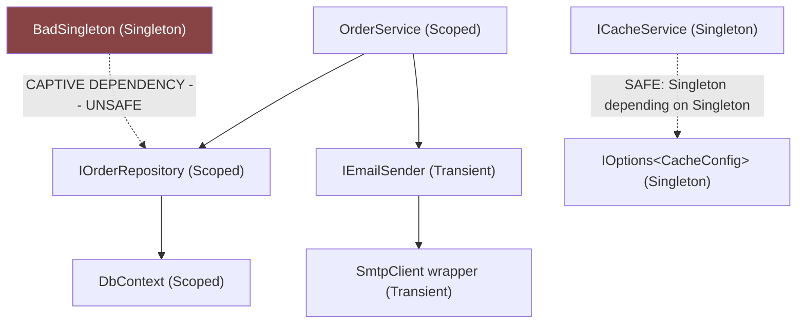
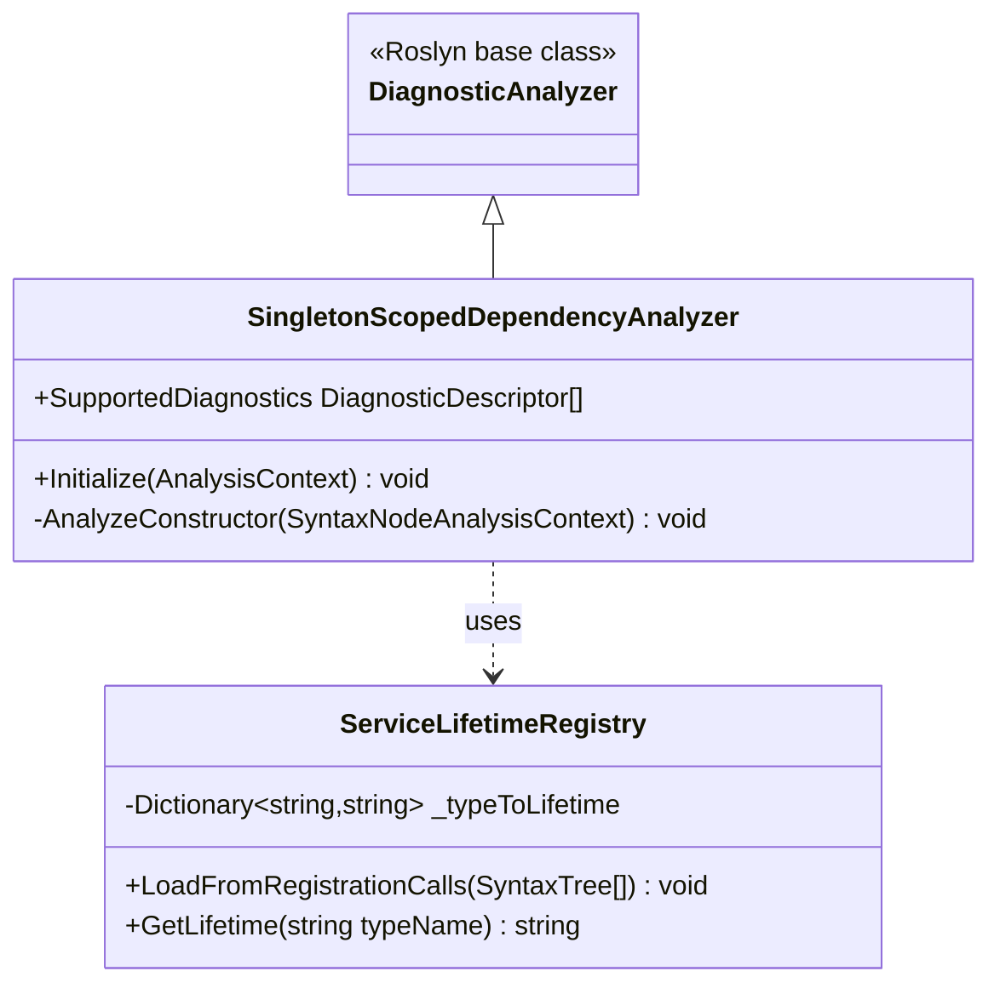
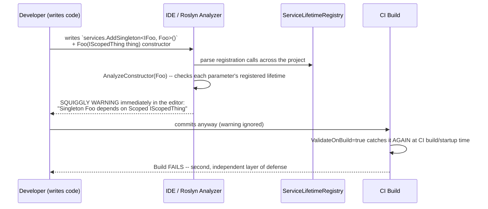

# Module 10 — ASP.NET Core: Dependency Injection Container Internals

> Domain: .NET / ASP.NET Core | Level: Beginner → Expert | Prerequisite: [[01-Middleware-Pipeline-Request-Internals]] (`HttpContext.RequestServices`, request scoping, captive-dependency bug), [[../01-CSharp/06-Generics-Variance]] (open generic service registration)

---

## 1. Fundamentals

### What is dependency injection, and what is the DI container?
**Dependency Injection (DI)** is a design pattern where a class receives its dependencies (collaborating objects it needs to do its work) from the outside — typically via constructor parameters — rather than constructing them itself internally. The **DI container** (`Microsoft.Extensions.DependencyInjection`, built into ASP.NET Core) is the infrastructure that: (1) holds a registry of "when something asks for type `T`, here's how to produce an instance," (2) resolves an entire object graph automatically (constructing `A`, which needs `B`, which needs `C`, all wired together), and (3) manages each object's **lifetime** (how long a given instance is reused before a new one is created).

### Why does it exist?
Without DI, classes construct their own dependencies directly (`new SqlOrderRepository()` inside `OrderService`'s constructor) — this **tightly couples** a class to one specific concrete implementation, making it difficult to substitute a different implementation (a mock for testing, a different database provider) without modifying the class itself. DI inverts this: a class depends only on an **abstraction** (`IOrderRepository`), and something external (the DI container, configured once at startup) decides which concrete implementation to actually supply — this is the concrete mechanism behind the **Dependency Inversion Principle** (the "D" in SOLID — a later dedicated module), and the container automates what would otherwise be a large amount of manual object-graph-wiring code ("poor man's DI," hand-constructing every object and its dependencies at the application's composition root).

### When does this matter?
- **Always** in any non-trivial ASP.NET Core application — DI is baked into the framework's own design (controllers, middleware, minimal API handlers all receive dependencies via constructor/parameter injection automatically).
- **Critically** for understanding **service lifetimes** (`Transient`, `Scoped`, `Singleton`) correctly — Module 9 §2.5/§14 already flagged the captive-dependency bug (a `Scoped` service incorrectly captured by a `Singleton`) as one of the most dangerous, silent DI mistakes; this module goes deep into *why* it happens and how the container can catch it.
- **Critically** for testability — DI is what makes unit testing practical (substituting a test double for a real dependency without modifying the class under test).
- **For interviews**: "explain service lifetimes and the captive-dependency problem" is asked at nearly every ASP.NET Core interview; a genuinely deep answer (covering the container's internal resolution mechanics, not just the three lifetime names) is a strong differentiator.

### How does it work (30,000-ft view)?

```csharp
// Registration (composition root, Program.cs):
builder.Services.AddSingleton<ICacheService, RedisCacheService>();
builder.Services.AddScoped<IOrderRepository, SqlOrderRepository>();
builder.Services.AddTransient<IEmailSender, SmtpEmailSender>();

// Consumption (anywhere in the app, via constructor injection):
public class OrderService
{
    private readonly IOrderRepository _repository;
    private readonly IEmailSender _emailSender;

    public OrderService(IOrderRepository repository, IEmailSender emailSender)
    {
        _repository = repository; // the container supplied THIS, OrderService never called 'new'
        _emailSender = emailSender;
    }
}
```

Mental model for interviews: **"The container is a registry mapping abstractions to concrete implementations plus a lifetime. When something asks for a registered type, the container recursively resolves its entire dependency graph, reusing or creating instances according to each dependency's own registered lifetime — and the single most important rule governing correctness is: a longer-lived object must never hold a direct reference to a shorter-lived one."**

---

## 2. Deep Dive

### 2.1 The Three Lifetimes — Precise Semantics

- **`Transient`**: A **new instance every single time** it's requested/injected — including multiple times within the *same* object graph resolution (if two different services in one dependency graph both depend on the same `Transient` type, they each get their **own separate instance**, not a shared one).
- **`Scoped`**: **One instance per scope** — in ASP.NET Core, a scope is created automatically per HTTP request (Module 9 §2.5), so all services resolved during that one request that depend (directly or transitively) on a given `Scoped` type share the **same** instance; a new request gets a brand-new instance.
- **`Singleton`**: **One instance for the entire application's lifetime** — created once (either eagerly at startup if registered via an instance/factory evaluated immediately, or lazily on first request, depending on registration style) and reused for every subsequent resolution, across every request, for as long as the process runs.

### 2.2 The Captive Dependency Problem — the Precise Mechanism

The container's dependency graph resolution has exactly one hard safety rule: **a service cannot depend on another service with a shorter lifetime than itself** — specifically, a `Singleton` must never depend on a `Scoped` or `Transient`-that-wraps-a-`Scoped` service, and a `Scoped` service must never depend on a `Transient`-that-wraps-something-`Scoped` in a way that outlives the scope (this second case is rarer and more subtle; the dominant, most commonly-tested case is `Singleton` capturing `Scoped`).

**Why this is dangerous, precisely**: A `Singleton` is constructed **once** — if its constructor accepts a `Scoped` dependency (e.g., `IOrderRepository`, itself backed by a `Scoped` `DbContext`), the container resolves that `Scoped` dependency **at the moment the `Singleton` is first constructed**, using whatever scope happens to be active at that exact moment (the very first request that triggers the `Singleton`'s lazy construction, or — worse — the application's root scope if the `Singleton` is eagerly constructed at startup, outside any request scope at all). That **one specific instance** of the `Scoped` dependency is then held forever inside the `Singleton`'s field, silently reused for **every subsequent request**, for the rest of the application's lifetime — completely defeating the "new instance per request" guarantee `Scoped` is supposed to provide, and (for a `DbContext` specifically) causing exactly the concurrent-access/stale-data corruption described in Module 9 §14's third incident.

### 2.3 `ValidateScopes` and `ValidateOnBuild` — How the Container Catches This

ASP.NET Core's DI container supports two opt-in validation modes (enabled by default when `IsDevelopment()` is true, but **off by default in other environments** unless explicitly configured):
- **`ValidateScopes = true`**: at runtime, throws an `InvalidOperationException` the moment a `Scoped` service is resolved from the **root** service provider (rather than from a request-scoped `IServiceProvider`) — this is precisely the situation that occurs when a `Singleton`'s constructor tries to resolve a `Scoped` dependency, since the `Singleton` itself lives in the root container, not any particular request's scope.
- **`ValidateOnBuild = true`**: performs a **static analysis pass over the entire registered service graph at application startup** (when `Build()` is called), proactively detecting captive-dependency violations for **every** registered service **immediately**, rather than waiting for the specific code path that would trigger the bug to actually execute at runtime (which might not happen until a specific, rarely-hit request pattern occurs in production, long after deployment).

**Interview-critical fact**: because these validations default to **on** in `Development` but **off** in `Production`/other environments (a deliberate performance trade-off — the validation itself has a real, if usually small, startup-time cost), a captive-dependency bug can pass all local development testing perfectly (where the validation would have caught it) and only manifest in production if the environment-specific configuration doesn't also enable it there — explicitly configuring `ValidateOnBuild = true` (and ideally `ValidateScopes = true`) for **all** environments, not just Development, is a specific, high-value hardening step many teams miss (directly connecting to Module 9 §14's fourth-incident prevention step).

### 2.4 Resolution Mechanics — How `Build()` and Constructor Selection Work

When the container resolves a requested type, it: (1) looks up the registration (interface → concrete type mapping, or a factory delegate, or a pre-built instance); (2) if a concrete type, inspects its **public constructors** and selects the one whose parameters can **all** be satisfied by the currently-registered services (if multiple constructors are viable, the container picks the one with the **most** parameters that can all be resolved — a specific, sometimes-surprising tie-breaking rule); (3) recursively resolves each constructor parameter the same way; (4) constructs the instance, caching it according to its lifetime if applicable (`Scoped`/`Singleton`) or simply returning a fresh instance (`Transient`).

**A genuinely surprising, frequently-tested detail**: if a concrete type has **two constructors** and the container **cannot unambiguously determine** which one to use (e.g., two constructors with the same parameter count, both fully resolvable), the container throws an exception at resolution time (`InvalidOperationException: Multiple constructors accepting all given argument types have been found`) — **ambiguous constructor resolution is a hard runtime failure, not a silent "pick the first one" fallback**, a detail that differs from typical C# overload-resolution intuition (which does have well-defined tie-breaking rules for ordinary method calls) and trips up engineers who assume DI constructor selection follows the same rules as normal C# method overload resolution.

### 2.5 `IServiceScopeFactory` — Correctly Creating Scopes Outside a Request

For any component that genuinely needs its own independent `Scoped`-service instances **outside** the context of an HTTP request (a background service, `IHostedService`, a timer callback, or — precisely per Module 9 §14's fourth incident's fix — a `Singleton` that needs to *use* a `Scoped` service correctly rather than capturing it) — the correct pattern is to inject `IServiceScopeFactory` (itself a `Singleton`-registered service, safe to inject anywhere) and explicitly create a new scope **at the point of use**, not at construction time:

```csharp
public class OrderProcessingBackgroundService : BackgroundService
{
    private readonly IServiceScopeFactory _scopeFactory; // Singleton-safe to hold

    public OrderProcessingBackgroundService(IServiceScopeFactory scopeFactory) => _scopeFactory = scopeFactory;

    protected override async Task ExecuteAsync(CancellationToken stoppingToken)
    {
        while (!stoppingToken.IsCancellationRequested)
        {
            using (var scope = _scopeFactory.CreateScope()) // a FRESH scope, per iteration
            {
                var repository = scope.ServiceProvider.GetRequiredService<IOrderRepository>(); // Scoped, resolved FRESH here
                await repository.ProcessPendingOrdersAsync(stoppingToken);
            } // scope disposed here -- the Scoped DbContext etc. is correctly torn down
            await Task.Delay(TimeSpan.FromMinutes(1), stoppingToken);
        }
    }
}
```
This is precisely the mechanism that lets a long-lived component (a `Singleton`/`BackgroundService`) safely use short-lived (`Scoped`) dependencies **correctly**, over and over, without ever violating the captive-dependency rule — the key distinction from the anti-pattern is that `IServiceScopeFactory` itself has no state tied to any particular scope; it's a **factory**, safe to be long-lived, that produces fresh scopes on demand.

### 2.6 Open Generic Registrations

The container supports registering an **open generic type** to satisfy any closed generic request:
```csharp
services.AddScoped(typeof(IRepository<>), typeof(EfRepository<>));
// Resolves IRepository<Order> -> EfRepository<Order>, IRepository<Customer> -> EfRepository<Customer>, etc.
// WITHOUT needing a separate explicit registration per closed generic type.
```
This directly reuses Module 6's generics/JIT-specialization mechanics (each closed generic type gets its own container-tracked lifetime instance/registration, exactly mirroring the per-value-type JIT specialization discussion, though here the "specialization" is about DI registration resolution, not native code generation) — a single open-generic registration line covers an unbounded number of closed generic types, a genuinely powerful, concise pattern for generic repository/handler-style abstractions.

### 2.7 `IEnumerable<TService>` — Multiple Registrations for One Interface

Registering the same interface multiple times (`services.AddScoped<INotificationHandler<OrderShipped>, EmailHandler>(); services.AddScoped<INotificationHandler<OrderShipped>, SmsHandler>();`) doesn't overwrite the first registration — resolving a single `INotificationHandler<OrderShipped>` returns the **last**-registered implementation, but resolving `IEnumerable<INotificationHandler<OrderShipped>>` returns **all** registered implementations, in registration order — this is precisely the mechanism underlying Module 4's DI-mediator pattern (`_serviceProvider.GetServices<INotificationHandler<TNotification>>()`), now explained at the container-mechanics level rather than treated as a given.

---

## 3. Visual Architecture

### Lifetime Scope Nesting (ASCII)

```
┌─────────────────────────────────────────────────────────────────┐
│  ROOT Service Provider (application lifetime)                      │
│  Singleton instances live HERE, created once, shared forever        │
│                                                                       │
│   ┌─────────────────────┐   ┌─────────────────────┐               │
│   │ Request Scope #1      │   │ Request Scope #2      │  ...        │
│   │ (created per HTTP req)│   │ (created per HTTP req)│               │
│   │                       │   │                       │               │
│   │ Scoped instances live │   │ Scoped instances live │               │
│   │ HERE -- one DbContext,│   │ HERE -- a DIFFERENT   │               │
│   │ shared across this    │   │ DbContext instance,   │               │
│   │ request's whole graph │   │ shared across THIS    │               │
│   │                       │   │ request's graph only  │               │
│   │  Transient: new EVERY │   │  Transient: new EVERY │               │
│   │  time, even within    │   │  time, even within    │               │
│   │  this one scope       │   │  this one scope       │               │
│   └─────────────────────┘   └─────────────────────┘               │
└─────────────────────────────────────────────────────────────────┘

CAPTIVE DEPENDENCY BUG: a Singleton (root-scope) constructor resolves a
Scoped dependency -- it gets locked to ONE specific scope's instance
(whichever scope was active at that moment), reused incorrectly forever:

  Singleton (root)  ──holds a reference to──►  [Scoped instance from Request Scope #1]
       │                                                    ▲
       └── used by Request Scope #2's handling ─────────────┘
            (WRONG: Request #2 gets Request #1's stale/disposed instance)
```

### Dependency Graph Resolution



---

## 4. Production Example

### Scenario: Multi-tenant SaaS platform — silent cross-tenant data leakage from a captive `DbContext`

**Problem**: A multi-tenant application (each request scoped to a specific tenant, with a `Scoped` `ITenantContext` service resolving the current tenant from the request's JWT claims, and a `Scoped` `TenantAwareDbContext` applying a global query filter based on that tenant context) exhibited an intermittent, severe bug: occasionally, a request for **Tenant A** would return data belonging to **Tenant B** — a critical, potentially breach-notification-triggering multi-tenancy isolation failure.

**Investigation**:
- Enabling `ValidateOnBuild = true` in a staging environment (where it had never previously been enabled, only in local `Development`, per §2.3's default-environment gap) **immediately** surfaced the root cause at application startup: a recently-added `Singleton`-registered `MetricsAggregatorService` (intended to collect cross-request performance metrics) had, during a refactor, been given a constructor dependency on `ITenantContext` (`Scoped`) — a captive-dependency violation the container's static analysis caught instantly.
- Tracing back further: `MetricsAggregatorService` was constructed once, lazily, on the **first** request the application handled after startup — that first request happened to belong to whichever tenant's request triggered it, and `ITenantContext`'s resolved-and-captured instance (reflecting that one specific tenant) was then held by the `Singleton` **forever**, used for every metrics-related tenant-context lookup across **every subsequent request from every tenant**, for as long as the process ran — explaining both the intermittency (only metrics-related code paths were affected, not the entire request) and the specific cross-tenant leakage pattern (always leaking toward whichever tenant happened to trigger the very first request).

**Architecture fix**:
- Removed the direct `ITenantContext` constructor dependency from `MetricsAggregatorService`; refactored it to accept an explicit tenant identifier as a **method parameter** on its metrics-recording methods (passed in by the calling, correctly `Scoped`-lifetime code that already had legitimate access to the current request's tenant context) rather than depending on `ITenantContext` directly as a captured constructor dependency.
- Enabled `ValidateOnBuild = true` and `ValidateScopes = true` for **all** environments (staging, production, not just Development) immediately, as an emergency hardening step, specifically to guarantee this exact bug class could never again reach production undetected.
- Conducted a full audit of every other `Singleton`-registered service in the codebase for any similar `Scoped`-dependency captures, using the now-always-on validation to make this an automatic, continuous safeguard rather than a one-time manual audit.

**Trade-offs**: Enabling `ValidateOnBuild`/`ValidateScopes` in production has a small, one-time startup-cost overhead (the full dependency-graph analysis pass) — an entirely acceptable, negligible trade-off given the severity of the bug class it prevents; there is no credible argument for leaving this validation disabled in any environment given this incident's demonstrated real-world impact.

**Lessons learned**:
1. The captive-dependency validation being **environment-gated by default** (on in Development, off elsewhere) is a genuine, easy-to-overlook configuration gap — this incident would have been caught **at build/deploy time in staging**, months earlier, had the validation simply been enabled everywhere from the start.
2. A seemingly innocuous refactor (adding one constructor parameter to a `Singleton` for what seemed like a reasonable convenience) is exactly how this bug class is introduced in practice — it requires no obviously "risky"-looking code change, which is precisely why static, automated validation (not just code review) is the appropriate defense.
3. Multi-tenant systems have an especially severe blast radius for this specific bug class — a captive-dependency bug that would merely be "annoying/incorrect" in a single-tenant system becomes a genuine security/compliance incident (cross-tenant data leakage) in a multi-tenant one, raising the stakes for proactive prevention substantially.

---

## 5. Best Practices

- **Enable `ValidateOnBuild = true` and `ValidateScopes = true` in every environment**, not just Development — the startup-cost overhead is negligible relative to the severity of the bug class it prevents (§4).
- **Never inject a `Scoped` service directly into a `Singleton`'s constructor.** If a `Singleton` genuinely needs to use `Scoped` functionality, inject `IServiceScopeFactory` and create a fresh scope at the point of actual use (§2.5), never at construction time.
- **Prefer `Scoped` as the default lifetime for anything touching per-request state** (repositories, `DbContext`, anything reflecting the current user/tenant) — reserve `Singleton` specifically for genuinely stateless or intentionally-shared-across-all-requests services (configuration, caches, connection-pool-managing clients like `HttpClient` via `IHttpClientFactory`).
- **Design services to depend on abstractions (interfaces), not concrete types**, even for internal (non-swappable-in-practice) implementations — this is what makes substituting test doubles practical and keeps the dependency-inversion benefit real, not just nominal.
- **Use `IEnumerable<TService>` (multiple registrations) for genuinely pluggable, multi-handler scenarios** (Module 4's mediator pattern) rather than a single service with an internal `switch`/if-chain over "which handler applies" — lets new handlers be added via a new registration line, not by modifying existing dispatch code.
- **Avoid ambiguous multi-constructor types intended for DI** — if a class has multiple constructors, ensure the container's resolution behavior (§2.4's "most-parameters-that-resolve" rule, or an outright ambiguity exception) is well-understood and intentional, not accidental; generally, prefer exactly one DI-facing constructor per class.
- **Register `HttpClient` via `IHttpClientFactory`** (`services.AddHttpClient<IMyApiClient, MyApiClient>()`), never `new HttpClient()` directly inside a service — `IHttpClientFactory` correctly manages the underlying `SocketsHttpHandler`/connection-pooling lifetime (a distinct, separate lifetime-management concern from ordinary DI lifetimes, addressing the well-known "`HttpClient` socket exhaustion" problem when `HttpClient` instances are created and disposed too frequently).

---

## 6. Anti-patterns

- **Capturing a `Scoped` service (directly or transitively) into a `Singleton`'s field** (§2.2/§4's incident). Fix: `IServiceScopeFactory`-based on-demand scope creation (§2.5).
- **Relying on Development-only validation defaults and never explicitly configuring `ValidateOnBuild`/`ValidateScopes` for other environments.** Fix: explicit, environment-independent configuration, exactly as §4's remediation did.
- **Using the Service Locator anti-pattern** — injecting `IServiceProvider` itself into a class and calling `.GetService<T>()` on demand throughout its methods, instead of declaring actual dependencies via constructor parameters. Why it fails: hides a class's true dependencies (they're no longer visible in its constructor signature, making the class harder to understand, test, and reason about — the code compiles and "works" but with all the coupling/opacity DI is meant to eliminate, just relocated). Fix: declare genuine constructor-injected dependencies; reserve direct `IServiceProvider` injection for the narrow, legitimate cases where dynamic, runtime-determined resolution is genuinely required (e.g., `IServiceScopeFactory`-based patterns, or a plugin-loading system resolving a dynamically-determined type).
- **Over-registering everything as `Singleton` "for performance"** without considering correctness. Why it fails: beyond the captive-dependency risk, `Singleton` services must be thread-safe for concurrent access across all simultaneously-handled requests — a `Singleton` with mutable, unsynchronized instance state is a concurrent-access bug waiting to happen (directly Module 2's concurrency concerns, now surfacing via a DI-lifetime choice) — `Transient`/`Scoped` services don't need this concern since they're never concurrently shared across requests by construction.
- **Registering a concrete type without a corresponding interface for services that will realistically need substitution in tests or alternate implementations** — while not every internal type needs an interface (a well-known, sometimes-debated point — "interface for every class" is itself an over-application, not a universal rule), completely skipping abstraction for anything crossing a meaningful architectural boundary (a repository, an external API client) reintroduces tight coupling DI is meant to avoid.
- **Constructing services with heavy, expensive constructor-time work** (a `Singleton` whose constructor performs a slow network call to "warm up") without considering the application's actual startup-latency requirements — if lazily constructed, this cost is paid by whichever unlucky first request happens to trigger it (a direct, visible latency spike for that specific request); if this is undesirable, either perform the expensive work asynchronously after construction (a background warm-up task) or explicitly force eager construction at a controlled point in startup (e.g., resolving the singleton once explicitly during `app.Build()`-time initialization) rather than leaving it to accidental first-request timing.

---

## 10. Interview Questions

### Basic (10)

1. **Q: What are the three built-in DI lifetimes in ASP.NET Core?**
   **A:** `Transient` (new instance every resolution), `Scoped` (one instance per request/scope), `Singleton` (one instance for the application's entire lifetime).

2. **Q: What creates a new DI scope in ASP.NET Core, by default?**
   **A:** Each incoming HTTP request automatically gets its own new scope.

3. **Q: What is a captive dependency?**
   **A:** A longer-lived service (typically `Singleton`) holding a direct reference to a shorter-lived one (typically `Scoped`), causing the shorter-lived instance to be incorrectly reused far beyond its intended lifetime.

4. **Q: What does `ValidateOnBuild = true` do?**
   **A:** Performs a static analysis pass over the entire registered service graph at application startup, proactively detecting captive-dependency violations immediately rather than waiting for them to manifest at runtime.

5. **Q: How does the container choose which constructor to use when a class has multiple?**
   **A:** It selects the constructor whose parameters can all be resolved by currently-registered services, preferring the one with the most resolvable parameters if multiple qualify.

6. **Q: What happens if you resolve `IEnumerable<IMyService>` when multiple implementations are registered for `IMyService`?**
   **A:** You get all registered implementations, in registration order — resolving just `IMyService` alone, by contrast, returns only the last-registered implementation.

7. **Q: Should you register `DbContext` as `Singleton`?**
   **A:** No — `DbContext` is not thread-safe for concurrent use and is designed to be `Scoped` (one instance per request), which is also its default registration lifetime via `AddDbContext`.

8. **Q: What is the Service Locator anti-pattern in the context of DI?**
   **A:** Injecting `IServiceProvider` itself and calling `.GetService<T>()` throughout a class's methods, instead of declaring dependencies as constructor parameters — hides the class's true dependencies.

9. **Q: Why shouldn't you create a new `HttpClient` directly with `new HttpClient()` in application code?**
   **A:** It bypasses `IHttpClientFactory`'s connection-pool management, risking socket exhaustion (if created/disposed frequently) or DNS-change-blindness (if never disposed) — `IHttpClientFactory` manages the underlying connection-pooling lifetime correctly.

10. **Q: What is `IServiceScopeFactory` used for?**
    **A:** Explicitly creating a new DI scope (with its own independent `Scoped` service instances) outside the context of an HTTP request — e.g., inside a background service.

### Intermediate (10)

1. **Q: Explain precisely why a `Singleton` capturing a `Scoped` `DbContext` causes data corruption, not just an exception.**
   **A:** The `Singleton`'s constructor resolves the `Scoped` `DbContext` once, at whichever moment the `Singleton` is first constructed — that one specific `DbContext` instance is then held and reused by the `Singleton` for every subsequent request across the application's entire lifetime, even though EF Core's `DbContext` is explicitly not designed for concurrent/cross-request reuse — this produces unpredictable behavior (stale cached entities, concurrent-access exceptions, or silently incorrect query results) rather than a clean, immediate failure, since nothing prevents the code from technically continuing to run.

2. **Q: Why is `ValidateScopes = true` specifically effective at catching captive dependencies, mechanically?**
   **A:** It throws whenever a `Scoped` service is resolved from the **root** service provider rather than a request-scoped one — a `Singleton`'s constructor executes in the context of the root provider (since `Singleton`s live at the root, not inside any particular request's scope), so attempting to resolve a `Scoped` dependency during that construction is exactly the condition this validation is designed to detect and reject immediately.

3. **Q: Why might a captive-dependency bug pass all local development testing yet still reach production?**
   **A:** `ValidateScopes`/`ValidateOnBuild` default to enabled only when `IsDevelopmentEnvironment()` is true — if a team never explicitly enables them for staging/production environments, the validation that would have caught the bug locally simply doesn't run in those environments, letting the bug through undetected until it manifests as a runtime symptom.

4. **Q: What's the correct way for a `Singleton` service to make use of `Scoped` functionality?**
   **A:** Inject `IServiceScopeFactory` (itself safely `Singleton`-injectable, since it holds no scope-specific state itself) and explicitly call `CreateScope()` at the actual point of use, resolving the needed `Scoped` service fresh from that new scope each time, then disposing the scope when done.

5. **Q: Why does registering the same interface multiple times not cause a resolution error?**
   **A:** The container simply accumulates all registrations for that service type; resolving the single interface type returns the last one registered (a "last registration wins" rule for singular resolution), while resolving `IEnumerable<TService>` returns the complete, ordered list of all registrations — both are valid, intentional resolution modes for different use cases.

6. **Q: What's the risk of registering a `Singleton` with unsynchronized mutable instance state?**
   **A:** Since a `Singleton` is shared across every concurrently-handled request, any mutable state it holds is subject to genuine multi-threaded concurrent access — without proper synchronization (locks, concurrent collections, immutable data structures), this is a real race-condition risk, unlike `Scoped`/`Transient` services which are never concurrently shared across requests by construction.

7. **Q: Why is the Service Locator pattern considered an anti-pattern even though it technically achieves loose coupling from concrete implementations?**
   **A:** While it does decouple from concrete types, it hides the class's actual dependency graph from its public interface (the constructor) — anyone reading the class's signature can no longer tell what it depends on without reading through its entire implementation, defeating the transparency/reviewability and easy-testability benefits that constructor injection provides for essentially the same loose-coupling benefit.

8. **Q: What does an open generic registration (`services.AddScoped(typeof(IRepository<>), typeof(EfRepository<>))`) let you avoid?**
   **A:** Having to write a separate explicit registration line for every closed generic type (`IRepository<Order>`, `IRepository<Customer>`, etc.) individually — one open-generic registration line covers all of them automatically.

9. **Q: Why should a background service (`IHostedService`) generally not directly inject a `Scoped` service into its own constructor?**
   **A:** `IHostedService`/`BackgroundService` implementations are themselves registered as `Singleton` by the hosting infrastructure — directly injecting a `Scoped` dependency into their constructor would be exactly the captive-dependency violation this module centers on; they must instead use `IServiceScopeFactory` to create scopes on demand during their execution.

10. **Q: What's a scenario where `IHttpClientFactory` solves a problem that simply making `HttpClient` a `Singleton` registration wouldn't fully address?**
    **A:** A single long-lived `HttpClient` instance (even as a `Singleton`) can become "DNS-blind" — it caches DNS resolution for the lifetime of its underlying connection pool and won't notice if a target host's IP address changes (e.g., during a cloud failover), continuing to connect to a stale address; `IHttpClientFactory` manages handler rotation specifically to balance both concerns (avoiding both too-frequent disposal, which exhausts sockets, and never-disposing, which causes DNS blindness) — a `Singleton HttpClient` registration alone only solves the socket-exhaustion half of the problem.

### Advanced (10)

1. **Q: Walk through, precisely, what happens if a `Scoped` service depends on a `Transient` service, which itself depends on another `Scoped` service further down the graph — is this a captive dependency, and why or why not?**
   **A:** This is generally **safe**, not a captive dependency — the `Transient` service, despite having a shorter *nominal* lifetime than `Scoped`, doesn't independently persist anywhere on its own; it's constructed fresh as part of resolving the outer `Scoped` service's graph and simply passes through to whatever `Scoped` dependency it itself needs, which resolves to the **same** `Scoped` instance already active for the current scope (since `Scoped` instances are cached per-scope regardless of how deep in the graph they're requested from). The captive-dependency danger specifically arises when a **longer**-lived service (`Singleton`) holds onto (captures, via a field) a reference to something shorter-lived that will not remain valid for the `Singleton`'s full lifetime — a `Transient` wrapping a `Scoped` dependency, itself consumed by a `Scoped` parent, doesn't create this danger because nothing here outlives the scope itself.

2. **Q: Explain a scenario where `ValidateOnBuild`'s static analysis might fail to catch a captive-dependency-equivalent bug that only manifests via a different mechanism (not direct constructor injection).**
   **A:** If a `Singleton` service resolves a `Scoped` dependency not via constructor injection but by holding an injected `IServiceProvider` (the Service Locator anti-pattern, §6) and calling `.GetService<IScopedThing>()` **inside a method**, rather than the constructor — `ValidateOnBuild`'s static graph analysis, which examines *registered constructor dependencies*, cannot detect this dynamic, runtime-only resolution pattern at all, since it isn't expressed as a declared dependency the analysis can see. This is a second, independent, and arguably even more compelling reason (beyond the general transparency argument in §6/Intermediate Q7) to avoid the Service Locator pattern: it doesn't just hide dependencies from human readers, it hides them from the container's own automated safety analysis too.

3. **Q: Describe how you would design a `Singleton`-lifetime, thread-safe, periodically-refreshed in-memory cache that needs to read from a `Scoped` data source (e.g., a database) to populate itself, without violating the captive-dependency rule.**
   **A:** The cache itself (`Singleton`) should not directly depend on the `Scoped` repository in its constructor; instead, it should depend on `IServiceScopeFactory`, and its refresh logic (triggered by a timer or `IHostedService`, itself potentially the very same component) creates a **fresh scope** for each refresh cycle, resolves the `Scoped` repository from that fresh scope, reads the data needed to repopulate the cache, and then disposes the scope — the cache's own internal storage (a `ConcurrentDictionary` or similar thread-safe structure, given the `Singleton`'s concurrent-access requirement per §6) is updated with the freshly-read data, entirely independent of any single `Scoped` instance's lifetime, directly combining §2.5's on-demand-scope pattern with §6's thread-safety requirement for `Singleton` state into one cohesive design.

4. **Q: Explain why the container's "most resolvable parameters wins" constructor-selection tie-breaking rule (§2.4) can itself be a subtle source of bugs during refactoring, with a concrete example.**
   **A:** Consider a class with two constructors: `MyService(IFoo foo)` and `MyService(IFoo foo, IBar bar)` — if `IBar` is currently registered, the container selects the **second** (more-parameters) constructor; if a later, unrelated change removes `IBar`'s registration (e.g., a different team removes a service they believed was unused), the container silently falls back to selecting the **first** constructor instead, without any compile-time signal that this happened — `MyService`'s actual runtime behavior may now differ subtly (if the two constructors weren't perfectly equivalent in what they initialize, which is a common reason to have two constructors in the first place) purely because of an unrelated registration change elsewhere in the codebase, a genuinely surprising and hard-to-trace class of bug specifically enabled by this tie-breaking rule's implicit, non-obvious registration-dependent behavior. This is a strong argument (§5) for generally preferring exactly one DI-facing constructor per class, precisely to eliminate this failure mode entirely.

5. **Q: How would you explain to a team why enabling `ValidateOnBuild`/`ValidateScopes` universally (not just in Development) is a security control, not merely a "nice to have" correctness check, referencing the specific incident class from §4?**
   **A:** Frame it directly around blast radius and detectability: a captive-dependency bug in a multi-tenant system isn't merely "sometimes returns stale data" — it can literally serve one tenant's private data to a different tenant, which is a reportable data-breach/compliance-incident-class event, not an ordinary bug; and because this bug class produces no distinctive error/exception under normal operation (the code runs "successfully," just against the wrong captured instance), it can persist silently, undetected by ordinary QA/monitoring, for an extended period — exactly the profile of risk that automated, proactive, build-time-static-analysis (rather than hoping to catch it via manual testing or eventually noticing symptoms) is specifically well-suited to close, at a startup-cost overhead that is essentially free relative to the severity being prevented.

6. **Q: Explain how a `Singleton` service intentionally designed to hold an injected `IOptionsMonitor<T>` (rather than `IOptions<T>`) interacts with configuration reloading, and why this doesn't create a captive-dependency-style problem despite the `Singleton` "holding onto" something.**
   **A:** `IOptionsMonitor<T>` is itself registered as `Singleton` and is specifically designed to be safely held long-term — it doesn't capture a *fixed* configuration snapshot; instead, it's a live, self-updating wrapper that internally re-reads/re-binds configuration whenever the underlying configuration source changes (e.g., a reloaded `appsettings.json`), exposing `.CurrentValue` (always fresh) and a `.OnChange` callback registration mechanism — this is architecturally different from the captive-dependency problem (which involves capturing a *specific, static* instance of something meant to vary per-scope) precisely because `IOptionsMonitor<T>` was deliberately designed from the ground up to be a long-lived, ever-fresh view over changing configuration, not a snapshot frozen at construction time — the distinction between "safe to hold long-term because it's designed for it" (`IOptionsMonitor<T>`, `IServiceScopeFactory`) versus "unsafe to hold long-term because it's a per-scope snapshot" (`Scoped` services generally) is the precise, general principle this question is testing.

7. **Q: Describe a testing strategy that would have caught the multi-tenant captive-dependency bug (§4) even without `ValidateOnBuild`, using integration tests rather than static container validation.**
   **A:** An integration test suite that spins up the full application (via `WebApplicationFactory<T>`, Module 9 §Advanced Q9) and sends two sequential requests **as two different tenants**, asserting that data returned for Tenant A's request never includes anything belonging to Tenant B, would have caught this specific bug's *symptom* directly (cross-tenant data leakage), even without understanding or targeting the captive-dependency mechanism specifically — this is a valuable complementary defense-in-depth layer to `ValidateOnBuild` (which catches the *mechanism* generically, for any captive dependency, even ones that wouldn't necessarily manifest as an obviously-wrong test assertion) precisely because integration tests catch the *observable business-impact symptom* regardless of root cause, while static DI validation catches the *underlying mechanism* regardless of whether a specific test happens to exercise the exact code path that triggers it — neither approach alone is sufficient; the combination is what provides robust protection against this bug class recurring in different forms.

8. **Q: Explain why open generic registrations (§2.6) don't create a captive-dependency risk across different closed generic instantiations, even though they share one registration line.**
   **A:** Each closed generic type (`IRepository<Order>`, `IRepository<Customer>`) is resolved and lifetime-managed **independently** by the container, despite sharing one open-generic registration — `services.AddScoped(typeof(IRepository<>), typeof(EfRepository<>))` means "for **any** closed generic request matching this pattern, apply the `Scoped` lifetime," not "share one single instance across all closed generic types" — resolving `IRepository<Order>` within a request gives you a `Scoped`-per-request `EfRepository<Order>` instance, entirely independent of whatever `EfRepository<Customer>` instance also exists within that same scope for `IRepository<Customer>` requests; the "one registration, many independent lifetime-managed instances" behavior here directly parallels Module 6 §2.1's "one generic type definition, many independently-specialized closed instantiations" point, now expressed at the DI-container level instead of the JIT-compilation level.

9. **Q: How would you design an automated CI check (beyond just `ValidateOnBuild` at application startup) to catch captive-dependency risks even earlier, at pull-request time, before the application is even deployed to a staging environment where it would run?**
   **A:** Add a dedicated, fast-running unit/integration test (not a full end-to-end test) that specifically constructs the application's full `IServiceCollection`/`ServiceProvider` with `ValidateOnBuild = true` and `ValidateScopes = true` explicitly enabled, calling `.Build()` in the test itself and asserting it doesn't throw — this converts a "would be caught the next time we deploy to staging with the flag enabled" safety net (still valuable, but late) into a "caught within seconds, in CI, on every single pull request, before merge" safety net — a small, cheap, high-leverage addition to a CI pipeline specifically targeting this bug class, directly generalizing the "shift correctness-checking as early as possible in the development lifecycle" principle that recurs throughout this course (Module 7's exhaustiveness-warnings-as-errors, Module 8's static-analysis-for-`throw ex;`, and now here for DI captive dependencies).

10. **Q: As a Principal Engineer, a team proposes eliminating `Scoped` lifetime entirely from their codebase, using only `Transient` and `Singleton`, arguing this simplifies reasoning about lifetimes and eliminates the captive-dependency risk category entirely (since `Transient` can never "capture" anything meaningfully persistent, and `Singleton` capturing `Transient` is architecturally different). Evaluate this proposal.**
    **A:** This doesn't actually eliminate the risk category, and introduces a new, arguably worse one: `DbContext` and similar per-request-consistency-requiring resources are specifically designed around the `Scoped` (one-instance-per-logical-unit-of-work) model — if forced into `Transient`, a single request's business logic that resolves the same "repository" abstraction multiple times across different services would get **multiple independent `DbContext` instances within one request**, breaking transactional consistency/change-tracking correctness within that single request's unit of work (each `DbContext` instance has its own independent change-tracker, so updates made via one instance wouldn't be visible to code holding a different instance within the supposedly-same logical request) — trading the captive-dependency risk (preventable via `ValidateOnBuild`/design discipline, per this entire module) for a *guaranteed*, constant, and much harder-to-detect correctness problem (silent transactional/consistency fragmentation within every single request, all the time, not just an occasional misconfiguration). The correct recommendation: keep `Scoped` as the appropriate lifetime for genuinely per-request-consistent resources, and rely on the container's built-in validation (`ValidateOnBuild`/`ValidateScopes`) plus the design discipline this module covers (§2.5's `IServiceScopeFactory` pattern) to manage the captive-dependency risk correctly, rather than discarding a correctly-designed lifetime model to avoid a risk that's actually well-understood and preventable through simpler, more targeted means.

---

## 11. Coding Exercises

### Easy — Fix a captive-dependency registration
**Problem**: This registration causes a captive-dependency bug.
```csharp
services.AddSingleton<INotificationDispatcher, NotificationDispatcher>();
services.AddScoped<ICurrentUserContext, HttpCurrentUserContext>();

public class NotificationDispatcher : INotificationDispatcher
{
    private readonly ICurrentUserContext _userContext; // CAPTIVE DEPENDENCY -- Scoped captured by Singleton
    public NotificationDispatcher(ICurrentUserContext userContext) => _userContext = userContext;
    public void Dispatch(string message) => Console.WriteLine($"[{_userContext.UserId}] {message}");
}
```
**Solution**:
```csharp
public class NotificationDispatcher : INotificationDispatcher
{
    public void Dispatch(string message, string userId) => Console.WriteLine($"[{userId}] {message}");
    // ICurrentUserContext removed entirely -- caller (who has legitimate per-request access to it) passes userId explicitly
}
```
**Discussion**: The simplest, most robust fix for a captive-dependency bug is frequently not "use `IServiceScopeFactory`" (which is the right tool when the `Singleton` genuinely needs autonomous, self-initiated access to scoped data) but simply **removing the dependency entirely** and having the correctly-`Scoped` calling code pass the needed data explicitly as a parameter — the smallest, least-mechanism-heavy fix is usually best when it's available, reserving `IServiceScopeFactory` for cases where the `Singleton` genuinely needs to *initiate* its own scoped-data access (background timers, §5's coding exercise below) rather than simply being handed data by an already-scoped caller.

### Medium — Implement `ValidateOnBuild`-catchable registration as a CI-testable pattern (Advanced Q9)
**Problem**: Implement a fast CI unit test that validates the entire application's DI container for captive-dependency issues, without deploying anywhere.
```csharp
public class DiContainerValidationTests
{
    [Fact]
    public void ServiceCollection_Should_Build_Without_Captive_Dependencies()
    {
        var builder = WebApplication.CreateBuilder();
        Startup.ConfigureServices(builder.Services, builder.Configuration); // the app's REAL registration logic

        var provider = builder.Services.BuildServiceProvider(new ServiceProviderOptions
        {
            ValidateScopes = true,
            ValidateOnBuild = true
        });
        // If BuildServiceProvider above didn't throw, no captive dependencies (or other resolution errors)
        // exist anywhere in the ENTIRE registered graph -- this assertion is almost incidental;
        // the real check already happened during BuildServiceProvider itself.
        Assert.NotNull(provider);
    }
}
```
**Discussion**: This test's real value is running in **seconds**, on **every pull request**, catching this entire bug class before merge — dramatically cheaper and faster feedback than discovering it via a staging deployment (as in §4's incident) or, worse, in production. Note this requires the application's service-registration logic to be **extractable/callable independently** from the full hosting startup sequence (a `Startup.ConfigureServices(IServiceCollection, IConfiguration)` static method, or equivalent, rather than registration logic inextricably tangled into `Program.cs`'s top-level statements) — a good architectural reason, beyond just testability in general, to keep registration logic in a separately-callable method.

### Hard — Implement a `Singleton` background cache refresher using `IServiceScopeFactory` (Advanced Q3)
**Problem**: Implement a thread-safe, periodically-refreshed in-memory cache (`Singleton`) that reads from a `Scoped` repository without violating the captive-dependency rule.
```csharp
public interface IProductCatalogCache
{
    IReadOnlyList<Product> GetAll();
}

public sealed class ProductCatalogCache : IProductCatalogCache, IHostedService, IDisposable
{
    private readonly IServiceScopeFactory _scopeFactory;
    private volatile IReadOnlyList<Product> _products = Array.Empty<Product>(); // volatile: safe concurrent read
    private Timer? _timer;

    public ProductCatalogCache(IServiceScopeFactory scopeFactory) => _scopeFactory = scopeFactory;

    public IReadOnlyList<Product> GetAll() => _products; // thread-safe: reading a reference is atomic

    public Task StartAsync(CancellationToken ct)
    {
        _timer = new Timer(_ => RefreshAsync().GetAwaiter().GetResult(), null, TimeSpan.Zero, TimeSpan.FromMinutes(5));
        return Task.CompletedTask;
    }

    private async Task RefreshAsync()
    {
        using var scope = _scopeFactory.CreateScope(); // FRESH scope, per refresh cycle -- never captured long-term
        var repository = scope.ServiceProvider.GetRequiredService<IProductRepository>(); // Scoped, resolved fresh
        var freshProducts = await repository.GetAllProductsAsync();
        _products = freshProducts; // atomic reference swap -- readers never see a partially-updated list
    }

    public Task StopAsync(CancellationToken ct)
    {
        _timer?.Change(Timeout.Infinite, 0);
        return Task.CompletedTask;
    }

    public void Dispose() => _timer?.Dispose();
}

// Registration:
// services.AddScoped<IProductRepository, EfProductRepository>();
// services.AddSingleton<IProductCatalogCache, ProductCatalogCache>();
// services.AddHostedService(sp => (ProductCatalogCache)sp.GetRequiredService<IProductCatalogCache>());
```
**Discussion points**: `_products` is `volatile` and updated via a single atomic reference reassignment (never mutated in place) — this is precisely the "immutable snapshot swap" pattern from Module 3's system-design section (§12, the RTB ad-service example), now applied concretely at the DI/background-service level: readers (`GetAll()`, called from any concurrently-handled request) never observe a partially-updated or torn state, since they only ever read a complete, fully-constructed `IReadOnlyList<Product>` reference at a time, and the swap itself is atomic at the CLR level for reference-type assignments. The registration's slightly awkward-looking `services.AddHostedService(sp => (ProductCatalogCache)sp.GetRequiredService<IProductCatalogCache>())` line deliberately ensures the **same** `Singleton` instance serves both roles (the cache interface consumers depend on, and the `IHostedService` the framework drives) — a common, useful trick for a `Singleton` that needs to be both an injectable service and a framework-managed hosted lifecycle participant simultaneously, worth explicitly explaining in an interview since it's a genuinely non-obvious registration pattern.

### Expert — Implement a generic, DI-friendly decorator pattern for cross-cutting concerns (caching, retry) without modifying existing registrations
**Problem**: Implement a generic caching decorator for any `IRepository<T>`-shaped service, layered on top of an existing registration via the **Scrutor**-style decoration pattern (implemented by hand here, for understanding), demonstrating advanced DI composition.
```csharp
public interface IRepository<T> where T : class
{
    Task<T?> GetByIdAsync(string id);
}

public sealed class EfRepository<T> : IRepository<T> where T : class
{
    private readonly DbContext _dbContext;
    public EfRepository(DbContext dbContext) => _dbContext = dbContext;
    public async Task<T?> GetByIdAsync(string id) => await _dbContext.Set<T>().FindAsync(id);
}

// DECORATOR: wraps an existing IRepository<T> registration, adding caching WITHOUT modifying EfRepository<T> at all.
public sealed class CachingRepositoryDecorator<T> : IRepository<T> where T : class
{
    private readonly IRepository<T> _inner; // the DECORATED instance -- injected by name via a keyed/factory registration
    private readonly IMemoryCache _cache;

    public CachingRepositoryDecorator(IRepository<T> inner, IMemoryCache cache)
    {
        _inner = inner;
        _cache = cache;
    }

    public async Task<T?> GetByIdAsync(string id)
    {
        string cacheKey = $"{typeof(T).Name}:{id}";
        if (_cache.TryGetValue(cacheKey, out T? cached)) return cached;

        var result = await _inner.GetByIdAsync(id);
        if (result is not null) _cache.Set(cacheKey, result, TimeSpan.FromMinutes(5));
        return result;
    }
}

// Manual decoration registration (what Scrutor's .Decorate<T>() automates):
services.AddScoped(typeof(IRepository<>), sp =>
{
    // This factory pattern manually constructs the "inner" EfRepository<T> first,
    // then wraps it -- since the container has no built-in "decorate an existing
    // registration" primitive without a library like Scrutor.
    throw new NotSupportedException("See discussion: open generics + decoration requires either Scrutor or a non-generic-factory-per-T approach.");
});
```
**Discussion points**: This exercise deliberately surfaces a genuine limitation: `Microsoft.Extensions.DependencyInjection`'s built-in container has **no native "decorate an existing open-generic registration" primitive** — achieving true open-generic decoration (working for `IRepository<Order>`, `IRepository<Customer>`, etc. uniformly, without one explicit registration per concrete `T`) in practice requires either the popular third-party **Scrutor** library (`services.Decorate<IRepository<object>>(...)`-style, which uses reflection/assembly-scanning tricks to make this work generically) or falling back to explicit, per-concrete-type registrations (losing the open-generic conciseness from §2.6). This is an important, honest "here's a real gap in the built-in container" point to raise in an Advanced/Expert interview — demonstrating awareness that `Microsoft.Extensions.DependencyInjection` is a deliberately minimal, "good enough for 90% of cases" container (unlike more feature-rich third-party containers such as Autofac, which natively support decoration, property injection, and more advanced registration modules) rather than presenting it as universally capable of every DI pattern without qualification.

---

## 12. System Design

*(Narrow application — full System Design has its own module.)*

**Scenario**: Design the DI/service-lifetime architecture for a **multi-tenant SaaS platform** (directly extending §4's incident scenario) that must guarantee, structurally, that no future engineer can accidentally reintroduce a cross-tenant captive-dependency bug.

- **Functional**: Every tenant-scoped resource (repositories, tenant-specific configuration, tenant-specific feature flags) must be `Scoped`, correctly isolated per request; genuinely cross-tenant, shared infrastructure (a global rate limiter, application-wide metrics aggregation) must be `Singleton` but must **never** directly depend on any tenant-scoped abstraction.
- **Non-functional**: The captive-dependency risk category must be caught automatically, before merge (CI) and before traffic (startup validation) — not solely relying on code review, given this bug class's demonstrated (§4) ability to slip past ordinary review.
- **Architecture**: `ValidateOnBuild`/`ValidateScopes` enabled universally (§4/§5's remediation) as the first line of defense; a CI-level DI-validation unit test (§11's Medium exercise) as a second, earlier line of defense; a custom Roslyn analyzer (extending this course's recurring "codify hard-won lessons as tooling" pattern, e.g., Module 4 §Advanced Q10, Module 6 §14) specifically flagging any class registered as `Singleton` whose constructor parameters include any type known to be `Scoped`-registered (a more precise, code-review-time-visible check than waiting for the container's own runtime/build-time validation) as a **third**, earliest-possible line of defense, surfacing the issue directly in the IDE as the offending code is written.
- **Failure handling**: Should the multi-layered defense somehow still be bypassed (e.g., a dynamic Service Locator-style resolution the analyzer can't statically detect, per Advanced Q2), the `ITenantContext`'s own implementation includes a defensive **tenant-ID consistency assertion**: any tenant-scoped repository call cross-checks that the tenant ID embedded in the data being accessed matches the current request's `ITenantContext.TenantId`, throwing loudly if they ever mismatch — a deliberate, defense-in-depth "fail loudly and immediately" backstop specifically for this catastrophic bug class, rather than relying entirely on DI-level prevention alone.
- **Monitoring**: The tenant-ID consistency assertion's exception type is monitored/alerted on as a **critical-severity, page-immediately** signal (directly reusing Module 8's expected-vs-unexpected exception-severity-differentiation principle) — a fired assertion here indicates a genuine, severe, likely-compliance-relevant bug, warranting the highest possible response urgency.
- **Trade-offs**: The tenant-ID consistency assertion adds a small, per-query runtime check across the entire application — an acceptable, deliberate cost given the catastrophic severity of what it guards against, directly mirroring this course's recurring theme (Module 8 §12) of accepting a small guaranteed cost in exchange for closing a severe, low-probability-but-high-impact risk.

---

## 13. Low-Level Design

**Scenario**: Design and implement (by hand, demonstrating the underlying mechanism) a minimal Roslyn analyzer sketch for the "Singleton depends on Scoped" static-detection concept from §12 — showing how this kind of custom, project-specific DI-safety tooling could actually be built, even if a real implementation would be more involved.

### Class Diagram


```csharp
// Conceptual sketch (a real implementation requires the full Roslyn analyzer SDK scaffolding --
// this illustrates the CORE detection logic, not a complete, buildable analyzer).
public static class CaptiveDependencyDetectionLogic
{
    public static IEnumerable<string> FindViolations(
        IReadOnlyDictionary<string, ServiceLifetime> registeredLifetimes,
        IReadOnlyDictionary<string, string[]> typeConstructorParameterTypes)
    {
        var violations = new List<string>();

        foreach (var (typeName, lifetime) in registeredLifetimes)
        {
            if (lifetime != ServiceLifetime.Singleton) continue;
            if (!typeConstructorParameterTypes.TryGetValue(typeName, out var paramTypes)) continue;

            foreach (var paramType in paramTypes)
            {
                if (registeredLifetimes.TryGetValue(paramType, out var paramLifetime)
                    && paramLifetime is ServiceLifetime.Scoped or ServiceLifetime.Transient)
                {
                    // NOTE: Transient is flagged too, IF that Transient type itself
                    // (transitively) captures something Scoped -- a fuller analyzer would
                    // recurse through the Transient's own dependencies here.
                    violations.Add(
                        $"{typeName} (Singleton) depends on {paramType} ({paramLifetime}) -- potential captive dependency.");
                }
            }
        }
        return violations;
    }
}
```

### Sequence Diagram


### Design Patterns / SOLID
- **Defense in depth**, applied to tooling layers rather than runtime security controls — this LLD, combined with §12's system design, demonstrates three independent, complementary detection layers (IDE-time analyzer, CI-time container validation test, and framework's own `ValidateOnBuild`) each catching the same bug class at a different, progressively-later point, exactly the "don't rely on a single layer of defense" principle applied to a correctness/tooling concern rather than a security one.
- **S**: `ServiceLifetimeRegistry` only knows how to parse and answer "what lifetime is type X registered with" — it has no opinion about what constitutes a violation; `SingletonScopedDependencyAnalyzer`/`CaptiveDependencyDetectionLogic` owns the actual violation-detection policy, cleanly separated from the lifetime-lookup mechanism.

### Extensibility
- The detection logic sketch explicitly notes the need to **recurse** through `Transient` dependencies (a `Transient` type that itself captures something `Scoped` in its own field is an equally real captive-dependency risk, just one level removed) — a genuinely more complete implementation would need a full transitive-closure graph walk, not just a one-hop parameter check, directly illustrating that even this "simple" static-analysis idea has real depth/complexity once pursued fully, a good honest point to raise if asked to extend this LLD further in an interview.

---

## 14. Production Debugging

### Incident: Multi-tenant cross-tenant data leakage from a captive-dependency bug (full deep dive of §4)
- **Symptoms**: Intermittent, severe cross-tenant data leakage.
- **Investigation**: Enabling `ValidateOnBuild` in staging immediately surfaced the exact offending registration.
- **Tools**: `ValidateOnBuild`/`ValidateScopes` container validation, dependency-graph tracing.
- **Root cause**: A `Singleton` metrics service capturing a `Scoped` tenant-context dependency.
- **Fix**: Removed the direct dependency; passed tenant ID explicitly as a method parameter instead.
- **Prevention**: Universal (all-environment) validation enablement; full audit of all other `Singleton` registrations.

### Incident: Startup latency spike traced to eager `Singleton` construction with expensive constructor work
- **Symptoms**: The very first request handled after a fresh deployment consistently took several seconds longer than every subsequent request.
- **Investigation**: `dotnet-trace` during a deployment's first request showed significant time spent inside a `Singleton` service's constructor, which performed a synchronous, blocking network call to warm up a connection to an external service.
- **Root cause**: A `Singleton` lazily constructed on first use (the default behavior for interface-based registrations) whose constructor happened to be expensive — exactly the anti-pattern flagged in §6's final point, with the cost landing entirely and unpredictably on whichever request happened to trigger construction first.
- **Fix**: Explicitly forced eager construction of this specific `Singleton` during a controlled startup phase (resolving it once explicitly right after `app.Build()`, before the application starts accepting traffic), converting the cost from "an unpredictable tax on one unlucky live request" into "a predictable, bounded part of the deployment's startup sequence" (measured and accounted for in health-check/readiness-probe timing).
- **Prevention**: A team convention flagging any `Singleton` with non-trivial constructor-time work as needing an explicit decision: eager-construct at startup (predictable, delays readiness) or accept the "first unlucky request pays the cost" trade-off deliberately (only acceptable if that cost is genuinely small/tolerable) — never leave this as an accidental, undiscussed side effect of lazy construction's default behavior.

### Incident: `HttpClient` socket exhaustion from bypassing `IHttpClientFactory`
- **Symptoms**: A service making frequent outbound calls to a partner API began failing with `SocketException`s under moderate load, specifically correlated with sustained traffic rather than traffic spikes.
- **Investigation**: Code review found a `Transient`-lifetime service directly instantiating `new HttpClient()` in its constructor — since the service itself was `Transient` (a new instance per resolution, potentially many times per request across different call sites), a fresh `HttpClient` (and its underlying socket/connection-pool resources) was being created and subsequently garbage-collected at a high rate, exhausting available ephemeral ports faster than the OS could reclaim them from the `TIME_WAIT` state.
- **Root cause**: Bypassing `IHttpClientFactory`'s connection-pool management (§5) by directly constructing `HttpClient` inside a frequently-resolved `Transient` service.
- **Fix**: Switched to `services.AddHttpClient<IMyApiClient, MyApiClient>()`, letting `IHttpClientFactory` manage the underlying handler/connection-pool lifetime correctly regardless of how frequently `MyApiClient` itself is resolved.
- **Prevention**: Static-analysis/code-review rule banning direct `new HttpClient()` construction anywhere in application code, requiring `IHttpClientFactory`-based registration exclusively.

### Incident: Ambiguous-constructor resolution failure after a refactor
- **Symptoms**: A deployment failed immediately at application startup with `InvalidOperationException: Unable to resolve service for type 'X' ... Multiple constructors accepting all given argument types have been found`.
- **Investigation**: A recent refactor had added a second, overloaded constructor to a service class (for a specific unit-testing convenience, allowing an optional test-only parameter) without realizing both constructors were now simultaneously fully resolvable given the currently-registered services, triggering the ambiguous-constructor failure described in §2.4.
- **Root cause**: An unintentional second, fully-DI-resolvable constructor introduced without awareness of the container's ambiguous-resolution behavior.
- **Fix**: Marked the test-convenience constructor with `[ActivatorUtilitiesConstructor]` (an attribute that explicitly tells the container which constructor to prefer when ambiguity would otherwise occur) or, more simply, made the test-only constructor `internal`/require a parameter type not registered in the container (so it's no longer "fully resolvable," removing the ambiguity naturally).
- **Prevention**: Team guideline (§5) preferring exactly one DI-facing public constructor per service class, with any test-specific construction needs handled via a separate factory method or test-only helper rather than an additional public constructor that inadvertently becomes DI-ambiguous.

---

## 15. Architecture Decision

**Decision**: Choosing a dependency injection container strategy — the built-in `Microsoft.Extensions.DependencyInjection` versus a more feature-rich third-party container (Autofac, Simple Injector).

| Option | Advantages | Disadvantages | Cost | Complexity | Maintainability | Performance | Scalability | Ops Overhead |
|---|---|---|---|---|---|---|---|---|
| **A. Built-in `Microsoft.Extensions.DependencyInjection`** | Zero extra dependency, deeply integrated with the framework's own hosting/configuration model, sufficient for the large majority of applications | No native decoration support (§11 Expert exercise's gap), fewer advanced registration features (property injection, more sophisticated module/assembly-scanning conventions) than mature third-party containers | Low | Low | High (well-understood, framework-standard) | Good | Good | Low |
| **B. Built-in container + Scrutor (decoration/scanning extension library)** | Closes the decoration gap and adds convention-based registration scanning, while staying on the framework-standard container underneath | An additional third-party dependency, though a widely-used, well-maintained, narrowly-scoped one | Low | Low-Medium | High | Good | Good | Low |
| **C. A full third-party container (Autofac, Simple Injector)** | Native decoration, richer diagnostics/lifetime-validation tooling (some third-party containers have even stricter, more configurable captive-dependency detection than the built-in container's `ValidateOnBuild`), more advanced module/convention systems | Additional learning curve for the team; some ASP.NET Core framework integrations assume/prefer the built-in container's abstractions, occasionally requiring adapter code; a genuinely larger dependency to take on | Medium | Medium-High | Medium-High (powerful, but another framework to master) | Good (often comparable or better for advanced scenarios) | Good | Medium |

**Recommendation**: **Option A** as the default for the large majority of ASP.NET Core applications — the built-in container, combined with the disciplined lifetime-management practices this entire module covers (universal `ValidateOnBuild`/`ValidateScopes`, `IServiceScopeFactory` for `Singleton`-needs-`Scoped` scenarios), is sufficient for nearly all real-world needs without adding a dependency. **Option B** is a reasonable, low-cost upgrade specifically when the team hits the decoration gap (§11 Expert exercise) repeatedly enough that manual workarounds become genuinely burdensome. **Option C** is worth the larger investment specifically for teams with advanced DI needs the built-in container structurally can't satisfy (rich convention-based auto-registration across large codebases, more sophisticated lifetime-validation diagnostics than `ValidateOnBuild` provides) — not a default choice, but a legitimate one once a specific, demonstrated need justifies the added complexity, exactly the same "don't adopt complexity speculatively" discipline recurring throughout this course.

---

## 16. Enterprise Case Study

**Inspired by**: Microsoft's own well-documented history of the built-in DI container's design philosophy (extensively discussed in ASP.NET Core design-team blog posts and GitHub issue discussions) — a deliberate choice to ship a **minimal, "good enough for the framework's own needs" container** as a first-class, zero-additional-dependency part of the framework, rather than mandating or deeply favoring any specific full-featured third-party container, explicitly leaving room for teams with more advanced needs to bring their own (Autofac, Simple Injector, etc., all of which provide official ASP.NET Core integration packages specifically because Microsoft designed the DI abstraction layer to be swappable).

- **Architecture**: The deliberate abstraction (`IServiceProvider`, `IServiceCollection`) that ASP.NET Core's hosting model is built against is intentionally container-agnostic — any third-party container implementing/adapting to these abstractions can be substituted in, precisely because Microsoft anticipated (correctly, per the DI-tooling ecosystem that emerged) that a minimal built-in container wouldn't satisfy every advanced use case, and chose interface-based extensibility over either mandating a heavier built-in container for everyone or leaving no supported path for advanced needs at all.
- **Challenge**: This minimalism means real, demonstrated gaps exist (no native decoration, less sophisticated captive-dependency diagnostics than some third-party containers offer) — a deliberate, documented trade-off the framework team made explicitly in favor of keeping the *default*, out-of-the-box experience simple and dependency-free for the majority of applications that don't need those advanced features, rather than every application paying the complexity/dependency cost of a heavier container by default.
- **Scaling lesson**: This is a recurring architectural pattern worth recognizing generally (not unique to DI containers): **"ship a minimal, good-enough default; design clean extension points for advanced needs"** rather than either "ship the most powerful thing for everyone" (unnecessary complexity cost for the common case) or "ship only the minimal thing, with no path forward" (blocks legitimate advanced use cases entirely) — the same design philosophy recurs across many parts of ASP.NET Core (Minimal APIs vs. the full MVC filter pipeline, per Module 9 §2.7) and is worth explicitly naming as a design principle when evaluating any platform/framework's own architecture, not just when using it.
- **Lesson for principal engineers**: When your own team builds internal platform/shared-library abstractions, apply this same "minimal good-enough default + clean extension point for advanced needs" principle deliberately, rather than either over-engineering a fully-featured internal framework from day one or building something so minimal that legitimate future advanced needs have no supported path forward — Microsoft's own DI-container design is a directly citable, well-documented precedent for this architectural philosophy when advocating for it internally.

---

## 17. Principal Engineer Perspective

- **Business impact**: The captive-dependency bug class (§4) has demonstrated real, severe business impact (a multi-tenant data-leakage incident) — a Principal Engineer's highest-leverage action here is institutionalizing the multi-layered defense (§12/§13: universal container validation, CI-level testing, IDE-level static analysis) so this specific, well-understood risk category becomes structurally difficult to reintroduce, rather than depending on every engineer's individual vigilance indefinitely.
- **Engineering trade-offs**: `Scoped` (correct per-request consistency, but must never be captured by longer-lived services) vs. `Singleton` (efficient, shared, but must be thread-safe and must never directly depend on `Scoped`) vs. `Transient` (safest from a lifetime-mismatch perspective, but potentially wasteful if genuinely expensive to construct repeatedly) — the Principal Engineer's role is ensuring the team has a clear, simple decision heuristic (§5) rather than treating lifetime selection as an ad-hoc, per-registration guess.
- **Technical leadership**: Champion the "minimal good-enough default + clean extension point" design philosophy (§16) both when evaluating the built-in container's sufficiency for a given team's needs, and as a transferable principle for the team's own internal platform/library design decisions.
- **Cross-team communication**: Frame captive-dependency risk to non-technical stakeholders concretely: "some parts of our system are built once and shared by every user's request forever, and other parts are built fresh for each individual request — if code that's supposed to be 'built fresh per request' accidentally gets permanently attached to something 'built once and shared,' one user's request can end up using data that actually belongs to a completely different user, which is exactly what happened in [the incident] — we've now added three separate, automated safety checks specifically to make that mistake essentially impossible to ship again."
- **Architecture governance**: Mandate universal `ValidateOnBuild`/`ValidateScopes` enablement and the CI-level DI-validation test (§11 Medium exercise) as non-negotiable, standard requirements for every new ASP.NET Core service — directly extending the shared-pipeline-template governance pattern established in Module 9 §15/§17 to this module's DI-specific concerns.
- **Cost optimization**: The multi-layered defense described here (validation flags, a CI test, potentially a custom analyzer) is a small, one-time, largely-automated investment relative to the cost of even a single recurrence of a severe production incident in this bug class — an easy, compelling ROI argument.
- **Risk analysis**: Treat any `Singleton`-lifetime service in a multi-tenant or otherwise security/compliance-sensitive system as warranting explicit, extra scrutiny of its full dependency graph (not just its direct constructor parameters, per Advanced Q1's transitive-dependency nuance) — the severity multiplier in a multi-tenant context (§4/§12) makes this a disproportionately high-value area for focused review attention, exactly mirroring Module 9 §17's similar guidance for authentication/forwarded-headers middleware.
- **Long-term maintainability**: Keep service-registration logic in an explicitly callable, separately-testable method (`Startup.ConfigureServices`-style, per §11 Medium exercise's discussion) rather than inextricably embedded in top-level `Program.cs` statements — a small structural choice that directly enables the CI-level validation test this module recommends as a standard safeguard, illustrating how a seemingly-minor code-organization decision can be a prerequisite for a much more valuable testing/governance capability.

---

## 18. Revision

### Key Takeaways
- Three lifetimes: `Transient` (new every time), `Scoped` (one per request/scope), `Singleton` (one for the app's entire lifetime) — the hard rule is a longer-lived service must never capture a shorter-lived one.
- The captive-dependency bug: a `Singleton` capturing a `Scoped` dependency locks in one specific instance forever, reused incorrectly across every subsequent request — in a multi-tenant system, this can mean severe cross-tenant data leakage.
- `ValidateOnBuild`/`ValidateScopes` catch this at startup/resolution time but default to enabled only in Development — always explicitly enable them for every environment.
- `IServiceScopeFactory` is the correct tool for a `Singleton` that genuinely needs to use `Scoped` functionality — create a fresh scope at the point of use, never capture at construction time.
- The Service Locator anti-pattern (injecting `IServiceProvider`, resolving dynamically) hides a class's true dependencies from both human reviewers and the container's own static validation — prefer declared constructor dependencies.
- `IHttpClientFactory` (not raw `new HttpClient()`) correctly manages connection-pool lifetime, avoiding both socket exhaustion and DNS-blindness.

### Interview Cheatsheet
- `Transient` = every resolution; `Scoped` = per request; `Singleton` = per application lifetime.
- Captive dependency = longer-lived service holding a reference to a shorter-lived one — the `Singleton`-captures-`Scoped` case is the classic, most-tested example.
- `ValidateScopes` throws when a `Scoped` service is resolved from the root provider (exactly what happens when a `Singleton` tries to inject one).
- `IServiceScopeFactory` = safe to hold long-term (it's a factory, not a scope itself); use it to create fresh scopes on demand.
- Ambiguous multi-constructor resolution is a hard runtime failure, not a silent fallback — prefer one DI-facing constructor per class.

### Things Interviewers Love
- Explaining precisely *why* the captive-dependency bug causes silent corruption rather than a clean exception, not just naming the pattern.
- Immediately citing the `ValidateOnBuild`/environment-gating gap as a common, easily-overlooked hardening step.
- Correctly distinguishing "Transient wrapping Scoped, consumed by a Scoped parent" (safe) from "Singleton capturing Scoped" (unsafe) — a nuance many candidates miss.

### Things Interviewers Hate
- Treating all three lifetimes as interchangeable "just pick one" choices without articulating the hard capture rule.
- Assuming `ValidateOnBuild`/`ValidateScopes` are enabled by default in all environments.
- Recommending the Service Locator pattern as a reasonable way to "simplify" dependency management.

### Common Traps
- Injecting a `Scoped` service directly into a `Singleton`'s constructor, especially via an innocuous-looking refactor (§4's incident, §14's fourth incident).
- Assuming `IHttpClientFactory` is only about avoiding socket exhaustion — it also solves DNS-blindness, a distinct, equally important concern.
- Adding a second, unintentionally-DI-ambiguous constructor to a service class without realizing the container's resolution behavior differs from ordinary C# overload resolution.

### Revision Notes
Cross-reference [[01-Middleware-Pipeline-Request-Internals]] §2.5/§14 (where the captive-dependency problem was first introduced as a request-scoping concern) and [[../01-CSharp/06-Generics-Variance]] §2.1 (JIT specialization per closed generic type — directly mirrored by open-generic DI registration's per-closed-type independent lifetime management, §2.6) before an interview. This module completes the foundational request/DI-lifecycle pairing for the ASP.NET Core domain — expect subsequent modules (Minimal APIs vs Controllers, Authentication/Authorization deep-dive) to assume both this module's and Module 9's content as established background.

---

**Next**: Continuing autonomously to Module 11 — Minimal APIs vs Controllers (MVC filter pipeline, model binding internals, `[ApiController]` conventions).
