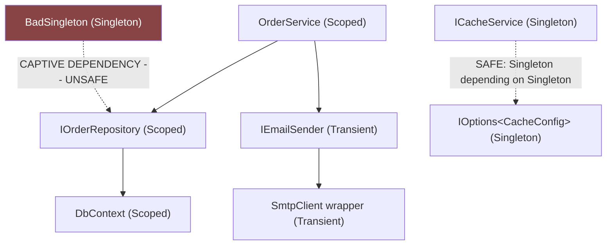
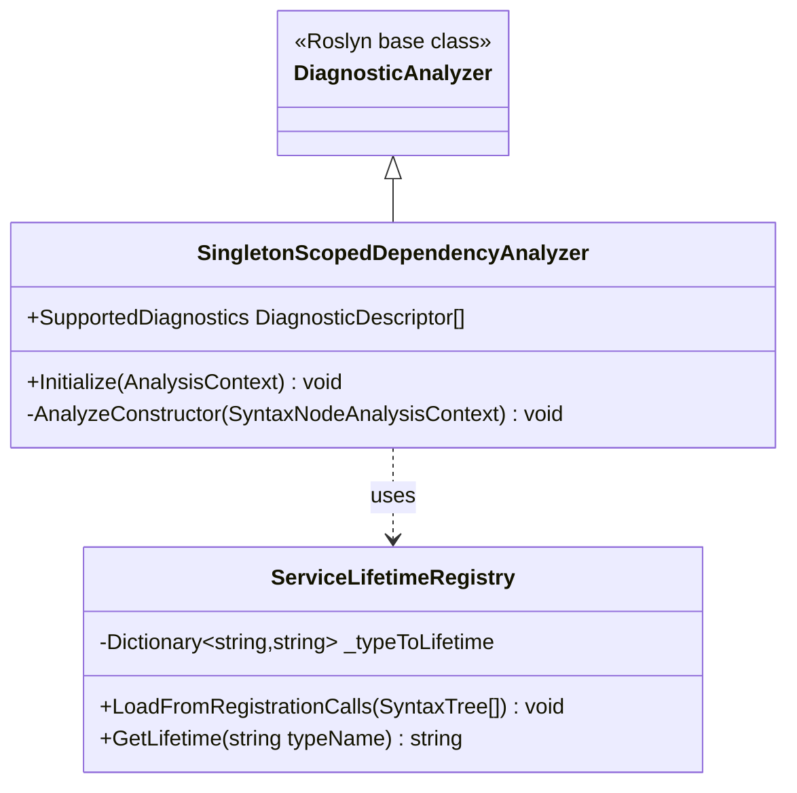
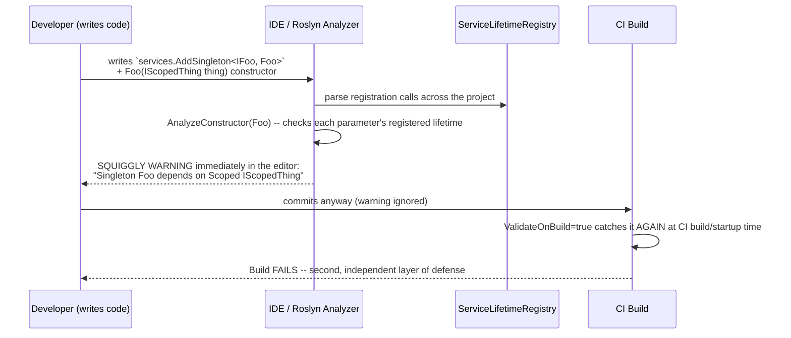

# Module 10 — ASP.NET Core: Dependency Injection Container Internals

> Domain:.NET / ASP.NET Core | Level: Beginner → Expert | Prerequisite: [[01-Middleware-Pipeline-Request-Internals]] (`HttpContext.RequestServices`, request scoping, captive-dependency bug), [[../01-CSharp/06-Generics-Variance]] (open generic service registration)

---

## 1. Topic Description

### Definition

`Microsoft.Extensions.DependencyInjection` separates **registration** from **resolution**. `IServiceCollection` is a list of `ServiceDescriptor` records — service type, implementation type or factory or instance, and lifetime — built at startup; `IServiceProvider` is the resolved graph that constructs objects on demand. Lifetime is enforced per **scope**: a transient is created on every resolve, a scoped instance once per scope, a singleton once per provider. Critically, a "scope" is whatever creates one — ASP.NET Core creates one per request, but a background service, a message consumer or a test must create its own, which is where most lifetime bugs originate.

### Core sub-concepts

- **`ServiceDescriptor` and the registration model** — service type, implementation type / factory / instance, lifetime.
- **The three lifetimes** — transient, scoped, singleton, and what "scoped" means outside a request.
- **Root scope vs child scopes** — `IServiceScopeFactory`, scope granularity, and disposal timing.
- **Captive dependencies** — a longer-lived service capturing a shorter-lived one; scope validation and what it cannot see.
- **Container-owned disposal** — which instances the container disposes and which it does not (`AddSingleton(instance)`), and transient-disposable accumulation in long-lived scopes.
- **Registration semantics** — `Add` vs `TryAdd`, last-registration-wins for a single resolve, `IEnumerable<T>` for all.
- **Open generic registration** — `typeof(IHandler<>)` → `typeof(Handler<>)`, and generic decorators.
- **Constructor selection rules** — greediest satisfiable constructor, and why multiple constructors are a design smell.
- **Service locator** — injecting `IServiceProvider`, why it hides dependencies, and the narrow legitimate cases.
- **Factories for runtime parameters** — typed factories, `Func<TParam, TService>`, or passing the value as a method argument.
- **Keyed services and `IServiceProviderIsService`** — resolving by key; querying registration without resolving, which is how minimal APIs decide body-versus-service binding.
- **Composition root as an architectural control point** — layered registration extension methods, architecture tests, validate-on-build.

### Where it fits

The container is the wiring layer between every other part of an ASP.NET Core service: the pipeline resolves middleware dependencies from the request scope, options and configuration are surfaced as registered services, authentication handlers and health checks are registrations, and EF Core's `DbContext` lifetime is a container decision. The composition root is the one place the entire dependency structure is visible, which makes it the natural point to enforce direction — domain depending on nothing, infrastructure implementing domain-owned abstractions.

### Why it matters at scale

Lifetime defects are silent, load-dependent and expensive. A scoped `DbContext` captured by a singleton accumulates tracked entities — a memory leak *and* a source of stale data — and any per-request state it holds leaks across users, which in a multi-tenant system is a data-exposure bug rather than a correctness one. Transient disposables resolved from the root scope are tracked for disposal that never comes, producing steady memory growth attributed in dumps to the provider itself. And a composition root that does real work — assembly scanning, constructors performing I/O, configuration providers making network calls — turns startup into a 45-second operation, which caps how fast you can scale out during exactly the incident where you need capacity.

### Common pitfalls / anti-patterns

- **Injecting a scoped service into a singleton (captive dependency)** — one request's instance is captured for the process lifetime; it works in development where there is one request at a time and fails under concurrency.
- **Resolving scoped services from the root provider in a `BackgroundService`** — the instance lives for the application's lifetime and is never disposed; the correct pattern is `IServiceScopeFactory` with a scope per unit of work.
- **`AddSingleton(new Foo())` for a disposable** — the container did not create it, so it will not dispose it; ownership silently transferred to you.
- **Transient `IDisposable` resolved repeatedly inside a long-lived scope** — every instance is retained for disposal at scope end, so memory grows until the scope ends (for the root scope, never).
- **Injecting `IServiceProvider` and resolving inside methods** — hides the real dependency set, defeats container validation, and turns a missing registration into a runtime failure on some code path.
- **Real work in a constructor** — I/O, blocking calls or configuration parsing turn object construction into a latency and failure source, and multiply across the graph.
- **Multiple public constructors on an injectable type** — the container silently picks the greediest satisfiable one, so a missing registration produces a degraded object instead of a clear error.

> Scope note: pipeline ordering and per-request scope creation belong to `01-Middleware-Pipeline-Request-Internals`; `IOptions` and configuration binding to `05-Configuration-Options-Pattern`; authentication scheme and policy registration to `04-Authentication-Authorization-Deep-Dive`.

---

## 2. Beginner (10 Q&A)

**Q1. What happens in production with this registration?**
```csharp
services.AddDbContext<AppDbContext>();          // scoped
services.AddSingleton<ICacheWarmer, CacheWarmer>();
// CacheWarmer(AppDbContext db) { ... }
```
**A:** A captive dependency. The singleton captures one request's `DbContext` for the process lifetime, so every request shares it — the change tracker accumulates entities forever (a memory leak), reads go stale, and any per-request state leaks across users. It works fine in development where there's one request at a time, and fails under concurrency. Scope validation catches this at startup in Development; it's off elsewhere by default.
*Follow-up: What kinds of captive dependency does scope validation *not* catch?*

**Q2. What does "scoped" mean outside a web request?**
**A:** One instance per *scope*, and a scope is whatever creates one. ASP.NET Core creates one per request, but a background service, a message consumer or a test has to create its own via `IServiceScopeFactory`. The common misconception is that scoped means "per request" — it means per scope, and code assuming a request exists is exactly what breaks when the same service is reused in a worker.
*Follow-up: What happens if you resolve a scoped service directly from the root provider?*

**Q3. Which of these does the container dispose?**
```csharp
services.AddSingleton<IFoo>(new Foo());        // Foo : IDisposable
services.AddSingleton<IBar, Bar>();            // Bar : IDisposable
services.AddScoped<IBaz, Baz>();               // Baz : IDisposable
```
**A:** The second and third. The container disposes instances *it created* — `Bar` at root provider disposal, `Baz` at scope end. It will not dispose the `Foo` you constructed yourself, because it didn't create it and doesn't assume ownership. That asymmetry surprises people: registering a pre-built disposable silently makes its lifetime your problem, with no compiler warning.
*Follow-up: What about a transient `IDisposable` resolved repeatedly inside a long-lived scope?*

**Q4. How does the container pick a constructor?**
**A:** The one with the most parameters it can satisfy from registered services — not necessarily the one you intended. If two are equally satisfiable and neither is a superset, it throws as ambiguous. The practical implication is that multiple constructors on an injectable type is a design smell: a missing registration can silently select a fallback constructor and give you an object in a degraded configuration rather than a clear error.
*Follow-up: What error do you get for a missing dependency versus an ambiguous one, and why does that distinction matter?*

**Q5. What's the difference between these, and what does resolving return?**
```csharp
services.AddSingleton<IValidator, EmailValidator>();
services.AddSingleton<IValidator, PhoneValidator>();
```
**A:** Resolving `IValidator` returns the *last* one registered — `PhoneValidator`. Resolving `IEnumerable<IValidator>` returns both, in registration order. That's how pluggable sets are built (validators, handlers, health checks) and also how a duplicate registration silently changes behaviour with no error. `TryAdd` appends only if the service type isn't already registered, which is what library authors use so a consumer's own registration wins.
*Follow-up: How would you *replace* an existing registration rather than adding another?*

**Q6. What's the correct way to use a scoped service in a `BackgroundService`?**
**A:** Inject `IServiceScopeFactory`, create a scope per unit of work, resolve inside it, dispose when that unit completes. A `BackgroundService` is a singleton, so injecting a scoped service into its constructor is a captive dependency, and resolving from the root provider gives you an instance tied to the application's lifetime that's never disposed. Scope granularity matters too: one scope for the whole loop means a `DbContext` accumulating state forever.
*Follow-up: Your worker processes a batch of 1,000 messages. How many scopes?*

**Q7. What is an open generic registration and where is it used?**
**A:** Registering `typeof(IValidator<>)` to `typeof(Validator<>)` so the container closes the generic on demand — one registration serving every closed type. It's the mechanism behind handler, validator and repository patterns without registering each type individually, and it only works when the implementation's arity and constraints match. It's also the alternative to assembly scanning with reflection, and both faster and more AOT-friendly.
*Follow-up: How would you register a decorator wrapping every closed `IHandler<T>`?*

**Q8. Why is injecting `IServiceProvider` and resolving inside methods discouraged?**
**A:** It hides the class's real dependencies. The constructor no longer tells you what it needs, so the compiler can't help, tests must configure a whole container instead of passing fakes, and a missing registration becomes a runtime failure on some code path rather than a startup error. It also defeats the container's own validation. Legitimate uses are narrow — factories resolving by a runtime value, infrastructure that genuinely can't know its dependencies until runtime — and even then a typed factory abstraction beats passing the provider around.
*Follow-up: You need to resolve a handler based on a message type known only at runtime. Cleanest design?*

**Q9. What is scope validation and when is it on?**
**A:** A startup check that walks registrations and fails if a singleton depends on a scoped service, or if a scoped service is resolved from the root. It's on by default in Development and off elsewhere for performance — which is exactly why the classic failure is a captive dependency caught locally but not in production. I'd enable both scope and on-build validation in every environment: paying a few milliseconds at boot to catch a class of bug that otherwise corrupts data is an obviously good trade.
*Follow-up: What captive dependencies can it still not see?*

**Q10. When would you use a third-party container?**
**A:** When you need capabilities the built-in one deliberately lacks: interception and dynamic decoration, property injection, convention-based scanning with complex rules, child containers, or richer diagnostics. The built-in container is intentionally minimal and fast, and for most services that's the right trade. Switching costs you a dependency that must keep pace with the framework plus registration syntax the whole team must learn, so I'd only do it for a concrete capability need rather than preference.
*Follow-up: Keyed services arrived recently in the built-in container. What did that remove the need for?*

---

## 3. Intermediate (10 Q&A)

**Q1. `ObjectDisposedException` on a `DbContext`, intermittently, under load. Walk me through it.**
**A:** Scope-lifetime mismatch. The usual causes are work started from a request and continuing after the response (so the request scope was disposed underneath it), a scoped service captured by a singleton, or a background operation resolving from the root provider. The intermittency is the tell — it depends on the race between the continuation and the scope disposal. I'd look for fire-and-forget calls, un-awaited tasks and event handlers registered from request-scoped objects. Structurally the rule is that no work escapes the request scope, and any that must gets its own scope.
*Follow-up: The offending code is `_ = SomeAsyncMethod(scopedService)`. Why does that fail only sometimes?*

**Q2. How do you decide a service's lifetime?**
**A:** From state and cost. Stateless services with cheap construction can be transient or singleton with little difference; anything holding per-operation state must be scoped; anything expensive to build and safe to share concurrently should be singleton. The decisive question for singleton is thread safety, because a singleton is used concurrently by definition and any mutable field is a race. I'd default to scoped for application services in a web app, because it matches the unit of work and avoids captive-dependency risk.
*Follow-up: A service is expensive to construct but not thread-safe. What do you do?*

**Q3. What's the real cost of DI resolution, and when does it matter?**
**A:** Resolution walks the graph and constructs objects, so it scales with depth and breadth — but for a typical request it's microseconds against milliseconds of real work, effectively invisible. It matters when a deep graph is resolved per *item* in a loop rather than per request; when constructors do real work like I/O or configuration parsing; and at startup, where thousands of registrations plus assembly scanning delay boot noticeably for scale-to-zero or frequently-restarted workloads. One rule prevents most of this: constructors do assignments only — no I/O, no computation, no blocking.
*Follow-up: A constructor calls a configuration API that hits the network. What goes wrong and when?*

**Q4. How would you implement the decorator pattern with the built-in container?**
**A:** Register the concrete implementation, then register the interface with a factory that resolves the inner implementation and wraps it — or, more cleanly, rewrite the existing `ServiceDescriptor` so decoration composes and works for open generics, which is what Scrutor does. The built-in container has no first-class decoration support, and that's one of the commonest reasons teams reach for a third-party one. Worth saying: decoration is the right way to add caching, retry, logging or authorization to a service, because it keeps the core implementation free of those concerns and testable in isolation.
*Follow-up: You have four decorators on one service. How do you keep the ordering intentional and visible?*

**Q5. What's the container-caused memory leak, and how does it show in a dump?**
**A:** The container tracks every disposable it creates within a scope so it can dispose them. A transient disposable resolved many times inside a long-lived scope — and a singleton's scope is the root, which lives forever — accumulates references never released. In a dump you see objects rooted by `ServiceProviderEngineScope`, which is a distinctive and recognisable signature. Two rules avoid it: don't register disposables as transient if they may be resolved from long-lived scopes, and prefer explicit `using` ownership for short-lived disposables the container needn't track at all.
*Follow-up: You see thousands of objects rooted that way. What's your next step?*

**Q6. How do you handle a dependency needing a runtime parameter?**
**A:** Not by putting the parameter in the container. Clean options: a typed factory registered as a service that takes the runtime value and returns a configured instance; a `Func<TParam, TService>` for simple cases; or passing the value as a method parameter rather than a constructor one, which is often the honest answer because the value belongs to the operation rather than the service. Injecting `IServiceProvider` to resolve with parameters is the pattern to avoid, since it hides the dependency and makes construction implicit.
*Follow-up: The runtime parameter is the tenant ID and ten services need it. How do you avoid threading it everywhere?*

**Q7. How should a shared library expose its registrations?**
**A:** One extension method on `IServiceCollection` with a clear name, using `TryAdd` so consumers can override any part, accepting an options delegate for configuration, and registering nothing it doesn't own. What a library must not do is register competing implementations of common abstractions, replace consumer registrations, or perform work at registration time — registration builds descriptors only, with anything expensive deferred to first use or a hosted service. I'd also publish the abstractions separately from the implementation so consumers can depend on the contract without the wiring.
*Follow-up: Two libraries register conflicting services. How do you resolve it?*

**Q8. What does `IServiceProviderIsService` let you do?**
**A:** Ask whether a type is registered without resolving it — which is what minimal APIs use to decide whether a handler parameter comes from DI or from the request. It's useful in framework-level code and in conditional registration (enable a feature only when its dependency is present), and a smell in application code, where a conditional dependency usually means the design is unclear. Knowing it exists mostly matters for understanding why minimal API parameter binding behaves as it does, which otherwise looks like magic.
*Follow-up: How does that affect a minimal API handler taking a type that's sometimes registered?*

**Q9. How do you test DI-based code without every unit test becoming an integration test?**
**A:** Unit tests construct the class directly with test doubles — that's the whole point of constructor injection, and building a container in a unit test usually signals too many dependencies or a service locator. Where container behaviour itself is under test, build a minimal `ServiceCollection` with only the relevant registrations. Separately, have *one* integration test that builds the real composition root and validates it, which catches missing and mis-lifetimed registrations unit tests never see. Fast feedback plus a real guarantee that the app can start.
*Follow-up: How would you fail the build when a registration is missing, without running the whole app?*

**Q10. A class has twelve constructor dependencies. Review response?**
**A:** The number is a symptom, not the problem — the class has too many responsibilities and DI is making that visible, which is one of its useful side effects. I'd look at whether the dependencies cluster into two or three cohesive groups that should be separate classes, or whether several are really one collaborator that should be a facade. What I'd resist is the common workaround of injecting `IServiceProvider` or bundling them into a settings-like object, both of which hide the coupling without reducing it. The refactor is a design conversation, not a DI one.
*Follow-up: It's a controller and the dependencies are genuinely unrelated endpoints' needs. What do you suggest?*

---

## 4. Expert / Architect (10 Q&A)

**Q1. How do you use the composition root as an architectural control point?**
**A:** It's the one place the entire dependency structure is visible, so it's where you can enforce direction — the domain depends on nothing, infrastructure implements domain-owned abstractions, no application service depends on a web type. Concretely: organise registrations by layer with each owning its extension method, keep business logic out of the composition root, and back it with architecture tests asserting the dependency rules — because the composition root can express a clean structure that individual projects then violate through direct references. The value is that a single reviewer can see the shape of the whole system there, which is rare.
*Follow-up: An architecture test fails because a domain project references a persistence type. What's your remediation path?*

**Q2. How do you standardise DI patterns across many teams without imposing a framework?**
**A:** Ship the composition, not the rules: a platform package registering the standard cross-cutting services with one call, so teams inherit correct lifetimes, disposal and configuration by default. Alongside that, a small set of enforceable conventions — one public constructor, no service locator, no work in constructors, validation enabled — implemented as analyzers or architecture tests rather than documentation. I'd deliberately avoid a mandated abstraction layer over DI itself, which adds a concept everyone must learn for no benefit and makes framework upgrades harder. The goal is that the easy path and the correct path are the same one.
*Follow-up: Two teams want different lifetimes for the same shared service. How do you resolve it?*

**Q3. What are DI's implications for NativeAOT and startup-sensitive workloads?**
**A:** Reflection-based registration — assembly scanning, convention discovery, dynamic generic closing — is exactly what AOT can't support and what makes startup slow, so a codebase relying on it has quietly foreclosed both. Explicit and open-generic registration are AOT-friendly; scanning isn't. For scale-to-zero or frequently-restarted workloads, container build time and graph construction become a visible share of request latency, which is where trimming registrations, avoiding deep graphs and deferring expensive construction actually pay. If AOT is a goal, make it an explicit architectural constraint, because discovering it during a migration is far more expensive.
*Follow-up: You need convention-based registration *and* AOT. What's the path?*

**Q4. Startup has grown to 45 seconds. How do you diagnose and fix it?**
**A:** Measure the phases first — host build, configuration providers, container build, hosted-service startup — because it's usually one of them rather than DI generally. Recurring culprits: assembly scanning across many assemblies, constructors doing I/O, configuration providers making network calls on a cold path, eager singleton construction, and hosted services doing full initialisation before signalling started. Fixes in order: explicit rather than scanned registration, move work out of constructors to lazy initialisation, make readiness reflect actual warm-up rather than blocking startup, parallelise independent initialisation. In Kubernetes the readiness-versus-startup-probe distinction matters a lot here.
*Follow-up: One dependency legitimately takes 30 seconds to warm. How do you deploy that safely?*

**Q5. How do you handle multi-tenant resolution where tenants need different implementations or configuration?**
**A:** Resolve tenant identity at the boundary into a scoped context, then use it to select behaviour rather than building separate containers — a factory returning the right strategy, keyed services, or per-tenant configuration via named options. I'd avoid a container per tenant, which multiplies memory and startup cost and creates a lifetime model nobody can reason about, unless isolation genuinely requires it. The critical requirement is fail-closed: if the tenant can't be determined, resolution fails rather than falling back to a default, because a default tenant in a multi-tenant system is a data-leak path.
*Follow-up: A background job runs for all tenants. How do you structure the scopes and contexts?*

**Q6. Should a library depend on `IServiceCollection` at all?**
**A:** Its *core* shouldn't — it should depend on its own abstractions and be constructible manually, so consumers using a different container, or none, aren't excluded. The DI wiring belongs in a separate integration package providing the extension method. That split matters more than it sounds: a library usable only through one container's extension method is untestable in isolation, awkward from a console tool or test harness, and couples every consumer to the Microsoft abstractions' version. It's the pattern the BCL itself follows with abstraction packages separated from implementation and integration.
*Follow-up: That doubles your published packages. Worth it for an internal library?*

**Q7. How do you make lifetime bugs impossible rather than merely detectable?**
**A:** Reduce the surface where they can occur. Ban singletons holding mutable state by convention and review; make anything holding per-operation state obviously scoped by naming and placement; and design background work so it always creates its own scope through a shared helper rather than each team hand-rolling it. Then enforce with validation on in all environments, an integration test that builds and validates the composition root, and analyzers where they exist. Where the risk is highest — anything carrying tenant or user identity — prefer designs that *pass* context explicitly, since a value that's passed can't be captured by a longer-lived object.
*Follow-up: A singleton legitimately needs a scoped service occasionally. Correct pattern?*

**Q8. How does the choice of container affect a system over its life?**
**A:** Less than teams expect, provided constructor injection is used consistently — most testability comes from the pattern, not the container. Where it matters over time is what it makes *easy*: property injection and auto-registration reduce friction but hide dependencies, and interception adds behaviour invisible at the call site, which is powerful and genuinely hard to debug years later. My preference is the simplest container meeting the need, because container-specific features are a form of lock-in that accumulates and whose migration cost lands on whoever inherits the system. If a third-party container is chosen, confine its use to the composition root.
*Follow-up: You inherit a system using interception heavily. How do you assess whether to keep it?*

**Q9. A team proposes replacing DI with static factories for performance. How do you evaluate that?**
**A:** Ask for the measurement, because DI resolution is microseconds and almost never a real bottleneck in a service doing I/O — the proposal usually comes from benchmarking resolution in isolation. If the workload is genuinely startup- or allocation-sensitive (AOT, serverless, very high throughput with trivial handlers) there's a legitimate conversation, but the answer is normally to reduce graph depth, avoid scanning and defer construction rather than abandon DI. What I'd push back on hardest is the cost side: static factories make testing harder, hide dependencies, and reintroduce the coupling DI removed — a large permanent cost for a usually-immeasurable gain.
*Follow-up: The profile does show 8% container overhead in a minimal-API service with trivial handlers. Now what?*

**Q10. How would you migrate between containers, and would you?**
**A:** Only with a real reason, because this migration has no user-visible benefit and competes with feature work — it needs something concrete like AOT support, a maintenance risk, or removing a capability nobody uses. Technically the hard parts are the features that don't map: property injection, interception, child containers and complex conventions each need an explicit replacement, and each is a design decision rather than a translation. So I'd inventory which advanced features are actually used — usually most registrations turn out ordinary — replace the exotic ones with explicit patterns first, and leave the container swap itself as the mechanical final step. Keep the composition root behind stable extension methods throughout so the change is contained.
*Follow-up: The audit finds interception used for transaction management across 200 services. What's your plan?*

---

## 5. Reference Material

> Retained from the original module: deep-dive internals, diagrams, production examples, exercises, system/low-level design, debugging walkthroughs and the Principal Engineer perspective.

### 1. Fundamentals

#### What is dependency injection, and what is the DI container?
**Dependency Injection (DI)** is a design pattern where a class receives its dependencies (collaborating objects it needs to do its work) from the outside — typically via constructor parameters — rather than constructing them itself internally. The **DI container** (`Microsoft.Extensions.DependencyInjection`, built into ASP.NET Core) is the infrastructure that: (1) holds a registry of "when something asks for type `T`, here's how to produce an instance," (2) resolves an entire object graph automatically (constructing `A`, which needs `B`, which needs `C`, all wired together), and (3) manages each object's **lifetime** (how long a given instance is reused before a new one is created).

#### Why does it exist?
Without DI, classes construct their own dependencies directly (`new SqlOrderRepository` inside `OrderService`'s constructor) — this **tightly couples** a class to one specific concrete implementation, making it difficult to substitute a different implementation (a mock for testing, a different database provider) without modifying the class itself. DI inverts this: a class depends only on an **abstraction** (`IOrderRepository`), and something external (the DI container, configured once at startup) decides which concrete implementation to actually supply — this is the concrete mechanism behind the **Dependency Inversion Principle** (the "D" in SOLID — a later dedicated module), and the container automates what would otherwise be a large amount of manual object-graph-wiring code ("poor man's DI," hand-constructing every object and its dependencies at the application's composition root).

#### When does this matter?
- **Always** in any non-trivial ASP.NET Core application — DI is baked into the framework's own design (controllers, middleware, minimal API handlers all receive dependencies via constructor/parameter injection automatically).
- **Critically** for understanding **service lifetimes** (`Transient`, `Scoped`, `Singleton`) correctly —/ already flagged the captive-dependency bug (a `Scoped` service incorrectly captured by a `Singleton`) as one of the most dangerous, silent DI mistakes; this module goes deep into *why* it happens and how the container can catch it.
- **Critically** for testability — DI is what makes unit testing practical (substituting a test double for a real dependency without modifying the class under test).
- **For interviews**: "explain service lifetimes and the captive-dependency problem" is asked at nearly every ASP.NET Core interview; a genuinely deep answer (covering the container's internal resolution mechanics, not just the three lifetime names) is a strong differentiator.

#### How does it work (30,000-ft view)?

```csharp
// Registration (composition root, Program.cs):
builder.Services.AddSingleton<ICacheService, RedisCacheService>;
builder.Services.AddScoped<IOrderRepository, SqlOrderRepository>;
builder.Services.AddTransient<IEmailSender, SmtpEmailSender>;

// Consumption (anywhere in the app, via constructor injection):
public class OrderService
{
    private readonly IOrderRepository _repository;
    private readonly IEmailSender _emailSender;

    public OrderService(IOrderRepository repository, IEmailSender emailSender)
    {
        _repository = repository; // the container supplied THIS, OrderService never called 'new'
        _emailSender = emailSender;
    }
}
```

Mental model for interviews: **"The container is a registry mapping abstractions to concrete implementations plus a lifetime. When something asks for a registered type, the container recursively resolves its entire dependency graph, reusing or creating instances according to each dependency's own registered lifetime — and the single most important rule governing correctness is: a longer-lived object must never hold a direct reference to a shorter-lived one."**

### 2. Deep Dive

#### 2.1 The Three Lifetimes — Precise Semantics

- **`Transient`**: A **new instance every single time** it's requested/injected — including multiple times within the *same* object graph resolution (if two different services in one dependency graph both depend on the same `Transient` type, they each get their **own separate instance**, not a shared one).
- **`Scoped`**: **One instance per scope** — in ASP.NET Core, a scope is created automatically per HTTP request, so all services resolved during that one request that depend (directly or transitively) on a given `Scoped` type share the **same** instance; a new request gets a brand-new instance.
- **`Singleton`**: **One instance for the entire application's lifetime** — created once (either eagerly at startup if registered via an instance/factory evaluated immediately, or lazily on first request, depending on registration style) and reused for every subsequent resolution, across every request, for as long as the process runs.

#### 2.2 The Captive Dependency Problem — the Precise Mechanism

The container's dependency graph resolution has exactly one hard safety rule: **a service cannot depend on another service with a shorter lifetime than itself** — specifically, a `Singleton` must never depend on a `Scoped` or `Transient`-that-wraps-a-`Scoped` service, and a `Scoped` service must never depend on a `Transient`-that-wraps-something-`Scoped` in a way that outlives the scope (this second case is rarer and more subtle; the dominant, most commonly-tested case is `Singleton` capturing `Scoped`).

**Why this is dangerous, precisely**: A `Singleton` is constructed **once** — if its constructor accepts a `Scoped` dependency (e.g., `IOrderRepository`, itself backed by a `Scoped` `DbContext`), the container resolves that `Scoped` dependency **at the moment the `Singleton` is first constructed**, using whatever scope happens to be active at that exact moment (the very first request that triggers the `Singleton`'s lazy construction, or — worse — the application's root scope if the `Singleton` is eagerly constructed at startup, outside any request scope at all). That **one specific instance** of the `Scoped` dependency is then held forever inside the `Singleton`'s field, silently reused for **every subsequent request**, for the rest of the application's lifetime — completely defeating the "new instance per request" guarantee `Scoped` is supposed to provide, and (for a `DbContext` specifically) causing exactly the concurrent-access/stale-data corruption described in the third incident.

#### 2.3 `ValidateScopes` and `ValidateOnBuild` — How the Container Catches This

ASP.NET Core's DI container supports two opt-in validation modes (enabled by default when `IsDevelopment` is true, but **off by default in other environments** unless explicitly configured):
- **`ValidateScopes = true`**: at runtime, throws an `InvalidOperationException` the moment a `Scoped` service is resolved from the **root** service provider (rather than from a request-scoped `IServiceProvider`) — this is precisely the situation that occurs when a `Singleton`'s constructor tries to resolve a `Scoped` dependency, since the `Singleton` itself lives in the root container, not any particular request's scope.
- **`ValidateOnBuild = true`**: performs a **static analysis pass over the entire registered service graph at application startup** (when `Build` is called), proactively detecting captive-dependency violations for **every** registered service **immediately**, rather than waiting for the specific code path that would trigger the bug to actually execute at runtime (which might not happen until a specific, rarely-hit request pattern occurs in production, long after deployment).

**Interview-critical fact**: because these validations default to **on** in `Development` but **off** in `Production`/other environments (a deliberate performance trade-off — the validation itself has a real, if usually small, startup-time cost), a captive-dependency bug can pass all local development testing perfectly (where the validation would have caught it) and only manifest in production if the environment-specific configuration doesn't also enable it there — explicitly configuring `ValidateOnBuild = true` (and ideally `ValidateScopes = true`) for **all** environments, not just Development, is a specific, high-value hardening step many teams miss (directly connecting to the fourth-incident prevention step).

#### 2.4 Resolution Mechanics — How `Build` and Constructor Selection Work

When the container resolves a requested type, it: (1) looks up the registration (interface → concrete type mapping, or a factory delegate, or a pre-built instance); (2) if a concrete type, inspects its **public constructors** and selects the one whose parameters can **all** be satisfied by the currently-registered services (if multiple constructors are viable, the container picks the one with the **most** parameters that can all be resolved — a specific, sometimes-surprising tie-breaking rule); (3) recursively resolves each constructor parameter the same way; (4) constructs the instance, caching it according to its lifetime if applicable (`Scoped`/`Singleton`) or simply returning a fresh instance (`Transient`).

**A genuinely surprising, frequently-tested detail**: if a concrete type has **two constructors** and the container **cannot unambiguously determine** which one to use (e.g., two constructors with the same parameter count, both fully resolvable), the container throws an exception at resolution time (`InvalidOperationException: Multiple constructors accepting all given argument types have been found`) — **ambiguous constructor resolution is a hard runtime failure, not a silent "pick the first one" fallback**, a detail that differs from typical C# overload-resolution intuition (which does have well-defined tie-breaking rules for ordinary method calls) and trips up engineers who assume DI constructor selection follows the same rules as normal C# method overload resolution.

#### 2.5 `IServiceScopeFactory` — Correctly Creating Scopes Outside a Request

For any component that genuinely needs its own independent `Scoped`-service instances **outside** the context of an HTTP request (a background service, `IHostedService`, a timer callback, or — precisely per the fourth incident's fix — a `Singleton` that needs to *use* a `Scoped` service correctly rather than capturing it) — the correct pattern is to inject `IServiceScopeFactory` (itself a `Singleton`-registered service, safe to inject anywhere) and explicitly create a new scope **at the point of use**, not at construction time:

```csharp
public class OrderProcessingBackgroundService: BackgroundService
{
    private readonly IServiceScopeFactory _scopeFactory; // Singleton-safe to hold

    public OrderProcessingBackgroundService(IServiceScopeFactory scopeFactory) => _scopeFactory = scopeFactory;

    protected override async Task ExecuteAsync(CancellationToken stoppingToken)
    {
        while (!stoppingToken.IsCancellationRequested)
        {
            using (var scope = _scopeFactory.CreateScope) // a FRESH scope, per iteration
            {
                var repository = scope.ServiceProvider.GetRequiredService<IOrderRepository>; // Scoped, resolved FRESH here
                await repository.ProcessPendingOrdersAsync(stoppingToken);
            } // scope disposed here -- the Scoped DbContext etc. is correctly torn down
            await Task.Delay(TimeSpan.FromMinutes(1), stoppingToken);
        }
    }
}
```
This is precisely the mechanism that lets a long-lived component (a `Singleton`/`BackgroundService`) safely use short-lived (`Scoped`) dependencies **correctly**, over and over, without ever violating the captive-dependency rule — the key distinction from the anti-pattern is that `IServiceScopeFactory` itself has no state tied to any particular scope; it's a **factory**, safe to be long-lived, that produces fresh scopes on demand.

#### 2.6 Open Generic Registrations

The container supports registering an **open generic type** to satisfy any closed generic request:
```csharp
services.AddScoped(typeof(IRepository<>), typeof(EfRepository<>));
// Resolves IRepository<Order> -> EfRepository<Order>, IRepository<Customer> -> EfRepository<Customer>, etc.
// WITHOUT needing a separate explicit registration per closed generic type.
```
This directly reuses the generics/JIT-specialization mechanics (each closed generic type gets its own container-tracked lifetime instance/registration, exactly mirroring the per-value-type JIT specialization discussion, though here the "specialization" is about DI registration resolution, not native code generation) — a single open-generic registration line covers an unbounded number of closed generic types, a genuinely powerful, concise pattern for generic repository/handler-style abstractions.

#### 2.7 `IEnumerable<TService>` — Multiple Registrations for One Interface

Registering the same interface multiple times (`services.AddScoped<INotificationHandler<OrderShipped>, EmailHandler>; services.AddScoped<INotificationHandler<OrderShipped>, SmsHandler>;`) doesn't overwrite the first registration — resolving a single `INotificationHandler<OrderShipped>` returns the **last**-registered implementation, but resolving `IEnumerable<INotificationHandler<OrderShipped>>` returns **all** registered implementations, in registration order — this is precisely the mechanism underlying the DI-mediator pattern (`_serviceProvider.GetServices<INotificationHandler<TNotification>>`), now explained at the container-mechanics level rather than treated as a given.

### 3. Visual Architecture

#### Lifetime Scope Nesting (ASCII)

```
┌─────────────────────────────────────────────────────────────────┐
│ ROOT Service Provider (application lifetime) │
│ Singleton instances live HERE, created once, shared forever │
│ │
│ ┌─────────────────────┐ ┌─────────────────────┐ │
│ │ Request Scope #1 │ │ Request Scope #2 │... │
│ │ (created per HTTP req)│ │ (created per HTTP req)│ │
│ │ │ │ │ │
│ │ Scoped instances live │ │ Scoped instances live │ │
│ │ HERE -- one DbContext,│ │ HERE -- a DIFFERENT │ │
│ │ shared across this │ │ DbContext instance, │ │
│ │ request's whole graph │ │ shared across THIS │ │
│ │ │ │ request's graph only │ │
│ │ Transient: new EVERY │ │ Transient: new EVERY │ │
│ │ time, even within │ │ time, even within │ │
│ │ this one scope │ │ this one scope │ │
│ └─────────────────────┘ └─────────────────────┘ │
└─────────────────────────────────────────────────────────────────┘

CAPTIVE DEPENDENCY BUG: a Singleton (root-scope) constructor resolves a
Scoped dependency -- it gets locked to ONE specific scope's instance
(whichever scope was active at that moment), reused incorrectly forever:

 Singleton (root) ──holds a reference to──► [Scoped instance from Request Scope #1]
 │ ▲
 └── used by Request Scope #2's handling ─────────────┘
 (WRONG: Request #2 gets Request #1's stale/disposed instance)
```

#### Dependency Graph Resolution


```mermaid
graph TB
 OrderService["OrderService (Scoped)"] --> Repo["IOrderRepository (Scoped)"]
 OrderService --> Email["IEmailSender (Transient)"]
 Repo --> DbCtx["DbContext (Scoped)"]
 Email --> SmtpClient["SmtpClient wrapper (Transient)"]
 Cache["ICacheService (Singleton)"] -.->|"SAFE: Singleton depending on Singleton"| ConfigOptions["IOptions&lt;CacheConfig&gt; (Singleton)"]
 BadSingleton["BadSingleton (Singleton)"] -.->|"CAPTIVE DEPENDENCY -- UNSAFE"| Repo
 style BadSingleton fill:#844,color:#fff
```

### 4. Production Example

#### Scenario: Multi-tenant SaaS platform — silent cross-tenant data leakage from a captive `DbContext`

**Problem**: A multi-tenant application (each request scoped to a specific tenant, with a `Scoped` `ITenantContext` service resolving the current tenant from the request's JWT claims, and a `Scoped` `TenantAwareDbContext` applying a global query filter based on that tenant context) exhibited an intermittent, severe bug: occasionally, a request for **Tenant A** would return data belonging to **Tenant B** — a critical, potentially breach-notification-triggering multi-tenancy isolation failure.

**Investigation**:
- Enabling `ValidateOnBuild = true` in a staging environment (where it had never previously been enabled, only in local `Development`, per the default-environment gap) **immediately** surfaced the root cause at application startup: a recently-added `Singleton`-registered `MetricsAggregatorService` (intended to collect cross-request performance metrics) had, during a refactor, been given a constructor dependency on `ITenantContext` (`Scoped`) — a captive-dependency violation the container's static analysis caught instantly.
- Tracing back further: `MetricsAggregatorService` was constructed once, lazily, on the **first** request the application handled after startup — that first request happened to belong to whichever tenant's request triggered it, and `ITenantContext`'s resolved-and-captured instance (reflecting that one specific tenant) was then held by the `Singleton` **forever**, used for every metrics-related tenant-context lookup across **every subsequent request from every tenant**, for as long as the process ran — explaining both the intermittency (only metrics-related code paths were affected, not the entire request) and the specific cross-tenant leakage pattern (always leaking toward whichever tenant happened to trigger the very first request).

**Architecture fix**:
- Removed the direct `ITenantContext` constructor dependency from `MetricsAggregatorService`; refactored it to accept an explicit tenant identifier as a **method parameter** on its metrics-recording methods (passed in by the calling, correctly `Scoped`-lifetime code that already had legitimate access to the current request's tenant context) rather than depending on `ITenantContext` directly as a captured constructor dependency.
- Enabled `ValidateOnBuild = true` and `ValidateScopes = true` for **all** environments (staging, production, not just Development) immediately, as an emergency hardening step, specifically to guarantee this exact bug class could never again reach production undetected.
- Conducted a full audit of every other `Singleton`-registered service in the codebase for any similar `Scoped`-dependency captures, using the now-always-on validation to make this an automatic, continuous safeguard rather than a one-time manual audit.

**Trade-offs**: Enabling `ValidateOnBuild`/`ValidateScopes` in production has a small, one-time startup-cost overhead (the full dependency-graph analysis pass) — an entirely acceptable, negligible trade-off given the severity of the bug class it prevents; there is no credible argument for leaving this validation disabled in any environment given this incident's demonstrated real-world impact.

**Lessons learned**:
1. The captive-dependency validation being **environment-gated by default** (on in Development, off elsewhere) is a genuine, easy-to-overlook configuration gap — this incident would have been caught **at build/deploy time in staging**, months earlier, had the validation simply been enabled everywhere from the start.
2. A seemingly innocuous refactor (adding one constructor parameter to a `Singleton` for what seemed like a reasonable convenience) is exactly how this bug class is introduced in practice — it requires no obviously "risky"-looking code change, which is precisely why static, automated validation (not just code review) is the appropriate defense.
3. Multi-tenant systems have an especially severe blast radius for this specific bug class — a captive-dependency bug that would merely be "annoying/incorrect" in a single-tenant system becomes a genuine security/compliance incident (cross-tenant data leakage) in a multi-tenant one, raising the stakes for proactive prevention substantially.

### 11. Coding Exercises

#### Easy — Fix a captive-dependency registration
**Problem**: This registration causes a captive-dependency bug.
```csharp
services.AddSingleton<INotificationDispatcher, NotificationDispatcher>;
services.AddScoped<ICurrentUserContext, HttpCurrentUserContext>;

public class NotificationDispatcher: INotificationDispatcher
{
    private readonly ICurrentUserContext _userContext; // CAPTIVE DEPENDENCY -- Scoped captured by Singleton
    public NotificationDispatcher(ICurrentUserContext userContext) => _userContext = userContext;
    public void Dispatch(string message) => Console.WriteLine($"[{_userContext.UserId}] {message}");
}
```
**Solution**:
```csharp
public class NotificationDispatcher: INotificationDispatcher
{
    public void Dispatch(string message, string userId) => Console.WriteLine($"[{userId}] {message}");
    // ICurrentUserContext removed entirely -- caller (who has legitimate per-request access to it) passes userId explicitly
}
```
**Discussion**: The simplest, most robust fix for a captive-dependency bug is frequently not "use `IServiceScopeFactory`" (which is the right tool when the `Singleton` genuinely needs autonomous, self-initiated access to scoped data) but simply **removing the dependency entirely** and having the correctly-`Scoped` calling code pass the needed data explicitly as a parameter — the smallest, least-mechanism-heavy fix is usually best when it's available, reserving `IServiceScopeFactory` for cases where the `Singleton` genuinely needs to *initiate* its own scoped-data access (background timers, the coding exercise below) rather than simply being handed data by an already-scoped caller.

#### Medium — Implement `ValidateOnBuild`-catchable registration as a CI-testable pattern (Advanced Q9)
**Problem**: Implement a fast CI unit test that validates the entire application's DI container for captive-dependency issues, without deploying anywhere.
```csharp
public class DiContainerValidationTests
{
    [Fact]
    public void ServiceCollection_Should_Build_Without_Captive_Dependencies
    {
        var builder = WebApplication.CreateBuilder;
        Startup.ConfigureServices(builder.Services, builder.Configuration); // the app's REAL registration logic

        var provider = builder.Services.BuildServiceProvider(new ServiceProviderOptions
            {
                ValidateScopes = true,
                    ValidateOnBuild = true
        });
        // If BuildServiceProvider above didn't throw, no captive dependencies (or other resolution errors)
        // exist anywhere in the ENTIRE registered graph -- this assertion is almost incidental
        // the real check already happened during BuildServiceProvider itself.
        Assert.NotNull(provider);
    }
}
```
**Discussion**: This test's real value is running in **seconds**, on **every pull request**, catching this entire bug class before merge — dramatically cheaper and faster feedback than discovering it via a staging deployment (as in the incident) or, worse, in production. Note this requires the application's service-registration logic to be **extractable/callable independently** from the full hosting startup sequence (a `Startup.ConfigureServices(IServiceCollection, IConfiguration)` static method, or equivalent, rather than registration logic inextricably tangled into `Program.cs`'s top-level statements) — a good architectural reason, beyond just testability in general, to keep registration logic in a separately-callable method.

#### Hard — Implement a `Singleton` background cache refresher using `IServiceScopeFactory` (Advanced Q3)
**Problem**: Implement a thread-safe, periodically-refreshed in-memory cache (`Singleton`) that reads from a `Scoped` repository without violating the captive-dependency rule.
```csharp
public interface IProductCatalogCache
{
    IReadOnlyList<Product> GetAll;
}

public sealed class ProductCatalogCache: IProductCatalogCache, IHostedService, IDisposable
{
    private readonly IServiceScopeFactory _scopeFactory;
    private volatile IReadOnlyList<Product> _products = Array.Empty<Product>; // volatile: safe concurrent read
    private Timer? _timer;

    public ProductCatalogCache(IServiceScopeFactory scopeFactory) => _scopeFactory = scopeFactory;

    public IReadOnlyList<Product> GetAll => _products; // thread-safe: reading a reference is atomic

    public Task StartAsync(CancellationToken ct)
    {
        _timer = new Timer(_ => RefreshAsync.GetAwaiter.GetResult, null, TimeSpan.Zero, TimeSpan.FromMinutes(5));
        return Task.CompletedTask;
    }

    private async Task RefreshAsync
    {
        using var scope = _scopeFactory.CreateScope; // FRESH scope, per refresh cycle -- never captured long-term
        var repository = scope.ServiceProvider.GetRequiredService<IProductRepository>; // Scoped, resolved fresh
        var freshProducts = await repository.GetAllProductsAsync;
        _products = freshProducts; // atomic reference swap -- readers never see a partially-updated list
    }

    public Task StopAsync(CancellationToken ct)
    {
        _timer?.Change(Timeout.Infinite, 0);
        return Task.CompletedTask;
    }

    public void Dispose => _timer?.Dispose;
}

// Registration:
// services.AddScoped<IProductRepository, EfProductRepository>
// services.AddSingleton<IProductCatalogCache, ProductCatalogCache>
// services.AddHostedService(sp => (ProductCatalogCache)sp.GetRequiredService<IProductCatalogCache>)
```
**Discussion points**: `_products` is `volatile` and updated via a single atomic reference reassignment (never mutated in place) — this is precisely the "immutable snapshot swap" pattern from the system-design section (the RTB ad-service example), now applied concretely at the DI/background-service level: readers (`GetAll`, called from any concurrently-handled request) never observe a partially-updated or torn state, since they only ever read a complete, fully-constructed `IReadOnlyList<Product>` reference at a time, and the swap itself is atomic at the CLR level for reference-type assignments. The registration's slightly awkward-looking `services.AddHostedService(sp => (ProductCatalogCache)sp.GetRequiredService<IProductCatalogCache>)` line deliberately ensures the **same** `Singleton` instance serves both roles (the cache interface consumers depend on, and the `IHostedService` the framework drives) — a common, useful trick for a `Singleton` that needs to be both an injectable service and a framework-managed hosted lifecycle participant simultaneously, worth explicitly explaining in an interview since it's a genuinely non-obvious registration pattern.

#### Expert — Implement a generic, DI-friendly decorator pattern for cross-cutting concerns (caching, retry) without modifying existing registrations
**Problem**: Implement a generic caching decorator for any `IRepository<T>`-shaped service, layered on top of an existing registration via the **Scrutor**-style decoration pattern (implemented by hand here, for understanding), demonstrating advanced DI composition.
```csharp
public interface IRepository<T> where T: class
{
    Task<T?> GetByIdAsync(string id);
}

public sealed class EfRepository<T>: IRepository<T> where T: class
{
    private readonly DbContext _dbContext;
    public EfRepository(DbContext dbContext) => _dbContext = dbContext;
    public async Task<T?> GetByIdAsync(string id) => await _dbContext.Set<T>.FindAsync(id);
}

// DECORATOR: wraps an existing IRepository<T> registration, adding caching WITHOUT modifying EfRepository<T> at all.
public sealed class CachingRepositoryDecorator<T>: IRepository<T> where T: class
{
    private readonly IRepository<T> _inner; // the DECORATED instance -- injected by name via a keyed/factory registration
    private readonly IMemoryCache _cache;

    public CachingRepositoryDecorator(IRepository<T> inner, IMemoryCache cache)
    {
        _inner = inner;
        _cache = cache;
    }

    public async Task<T?> GetByIdAsync(string id)
    {
        string cacheKey = $"{typeof(T).Name}:{id}";
        if (_cache.TryGetValue(cacheKey, out T? cached)) return cached;

        var result = await _inner.GetByIdAsync(id);
        if (result is not null) _cache.Set(cacheKey, result, TimeSpan.FromMinutes(5));
        return result;
    }
}

// Manual decoration registration (what Scrutor's.Decorate<T> automates):
services.AddScoped(typeof(IRepository<>), sp =>
    {
        // This factory pattern manually constructs the "inner" EfRepository<T> first
        // then wraps it -- since the container has no built-in "decorate an existing
        // registration" primitive without a library like Scrutor.
        throw new NotSupportedException("See discussion: open generics + decoration requires either Scrutor or a non-generic-factory-per-T approach.");
});
```
**Discussion points**: This exercise deliberately surfaces a genuine limitation: `Microsoft.Extensions.DependencyInjection`'s built-in container has **no native "decorate an existing open-generic registration" primitive** — achieving true open-generic decoration (working for `IRepository<Order>`, `IRepository<Customer>`, etc. uniformly, without one explicit registration per concrete `T`) in practice requires either the popular third-party **Scrutor** library (`services.Decorate<IRepository<object>>(...)`-style, which uses reflection/assembly-scanning tricks to make this work generically) or falling back to explicit, per-concrete-type registrations (losing the open-generic conciseness). This is an important, honest "here's a real gap in the built-in container" point to raise in an Advanced/Expert interview — demonstrating awareness that `Microsoft.Extensions.DependencyInjection` is a deliberately minimal, "good enough for 90% of cases" container (unlike more feature-rich third-party containers such as Autofac, which natively support decoration, property injection, and more advanced registration modules) rather than presenting it as universally capable of every DI pattern without qualification.

### 12. System Design

*(Narrow application — full System Design has its own module.)*

**Scenario**: Design the DI/service-lifetime architecture for a **multi-tenant SaaS platform** (directly extending the incident scenario) that must guarantee, structurally, that no future engineer can accidentally reintroduce a cross-tenant captive-dependency bug.

- **Functional**: Every tenant-scoped resource (repositories, tenant-specific configuration, tenant-specific feature flags) must be `Scoped`, correctly isolated per request; genuinely cross-tenant, shared infrastructure (a global rate limiter, application-wide metrics aggregation) must be `Singleton` but must **never** directly depend on any tenant-scoped abstraction.
- **Non-functional**: The captive-dependency risk category must be caught automatically, before merge (CI) and before traffic (startup validation) — not solely relying on code review, given this bug class's demonstrated ability to slip past ordinary review.
- **Architecture**: `ValidateOnBuild`/`ValidateScopes` enabled universally (/the remediation) as the first line of defense; a CI-level DI-validation unit test (the Medium exercise) as a second, earlier line of defense; a custom Roslyn analyzer (extending this course's recurring "codify hard-won lessons as tooling" pattern, e.g., §Advanced Q10) specifically flagging any class registered as `Singleton` whose constructor parameters include any type known to be `Scoped`-registered (a more precise, code-review-time-visible check than waiting for the container's own runtime/build-time validation) as a **third**, earliest-possible line of defense, surfacing the issue directly in the IDE as the offending code is written.
- **Failure handling**: Should the multi-layered defense somehow still be bypassed (e.g., a dynamic Service Locator-style resolution the analyzer can't statically detect, per Advanced Q2), the `ITenantContext`'s own implementation includes a defensive **tenant-ID consistency assertion**: any tenant-scoped repository call cross-checks that the tenant ID embedded in the data being accessed matches the current request's `ITenantContext.TenantId`, throwing loudly if they ever mismatch — a deliberate, defense-in-depth "fail loudly and immediately" backstop specifically for this catastrophic bug class, rather than relying entirely on DI-level prevention alone.
- **Monitoring**: The tenant-ID consistency assertion's exception type is monitored/alerted on as a **critical-severity, page-immediately** signal (directly reusing the expected-vs-unexpected exception-severity-differentiation principle) — a fired assertion here indicates a genuine, severe, likely-compliance-relevant bug, warranting the highest possible response urgency.
- **Trade-offs**: The tenant-ID consistency assertion adds a small, per-query runtime check across the entire application — an acceptable, deliberate cost given the catastrophic severity of what it guards against, directly mirroring this course's recurring theme of accepting a small guaranteed cost in exchange for closing a severe, low-probability-but-high-impact risk.

### 13. Low-Level Design

**Scenario**: Design and implement (by hand, demonstrating the underlying mechanism) a minimal Roslyn analyzer sketch for the "Singleton depends on Scoped" static-detection concept — showing how this kind of custom, project-specific DI-safety tooling could actually be built, even if a real implementation would be more involved.

#### Class Diagram

```mermaid
classDiagram
 class DiagnosticAnalyzer {
 <<Roslyn base class>>
 }
 class SingletonScopedDependencyAnalyzer {
 +SupportedDiagnostics DiagnosticDescriptor[]
 +Initialize(AnalysisContext) void
 -AnalyzeConstructor(SyntaxNodeAnalysisContext) void
 }
 class ServiceLifetimeRegistry {
 -Dictionary~string,string~ _typeToLifetime
 +LoadFromRegistrationCalls(SyntaxTree[]) void
 +GetLifetime(string typeName) string
 }
 DiagnosticAnalyzer <|-- SingletonScopedDependencyAnalyzer
 SingletonScopedDependencyAnalyzer..> ServiceLifetimeRegistry: uses
```

```csharp
// Conceptual sketch (a real implementation requires the full Roslyn analyzer SDK scaffolding --
// this illustrates the CORE detection logic, not a complete, buildable analyzer).
public static class CaptiveDependencyDetectionLogic
{
    public static IEnumerable<string> FindViolations(
        IReadOnlyDictionary<string, ServiceLifetime> registeredLifetimes,
            IReadOnlyDictionary<string, string[]> typeConstructorParameterTypes)
    {
        var violations = new List<string>;

        foreach (var (typeName, lifetime) in registeredLifetimes)
        {
            if (lifetime!= ServiceLifetime.Singleton) continue;
            if (!typeConstructorParameterTypes.TryGetValue(typeName, out var paramTypes)) continue;

            foreach (var paramType in paramTypes)
            {
                if (registeredLifetimes.TryGetValue(paramType, out var paramLifetime)
                    && paramLifetime is ServiceLifetime.Scoped or ServiceLifetime.Transient)
                {
                    // NOTE: Transient is flagged too, IF that Transient type itself
                    // (transitively) captures something Scoped -- a fuller analyzer would
                    // recurse through the Transient's own dependencies here.
                    violations.Add(
                        $"{typeName} (Singleton) depends on {paramType} ({paramLifetime}) -- potential captive dependency.");
                }
            }
        }
        return violations;
    }
}
```

#### Sequence Diagram

```mermaid
sequenceDiagram
 participant Dev as Developer (writes code)
 participant IDE as IDE / Roslyn Analyzer
 participant Registry as ServiceLifetimeRegistry
 participant Build as CI Build

 Dev->>IDE: writes `services.AddSingleton<IFoo, Foo>`<br/>+ Foo(IScopedThing thing) constructor
 IDE->>Registry: parse registration calls across the project
 IDE->>IDE: AnalyzeConstructor(Foo) -- checks each parameter's registered lifetime
 IDE-->>Dev: SQUIGGLY WARNING immediately in the editor:<br/>"Singleton Foo depends on Scoped IScopedThing"
 Dev->>Build: commits anyway (warning ignored)
 Build->>Build: ValidateOnBuild=true catches it AGAIN at CI build/startup time
 Build-->>Dev: Build FAILS -- second, independent layer of defense
```

#### Design Patterns / SOLID
- **Defense in depth**, applied to tooling layers rather than runtime security controls — this LLD, combined with the system design, demonstrates three independent, complementary detection layers (IDE-time analyzer, CI-time container validation test, and framework's own `ValidateOnBuild`) each catching the same bug class at a different, progressively-later point, exactly the "don't rely on a single layer of defense" principle applied to a correctness/tooling concern rather than a security one.
- **S**: `ServiceLifetimeRegistry` only knows how to parse and answer "what lifetime is type X registered with" — it has no opinion about what constitutes a violation; `SingletonScopedDependencyAnalyzer`/`CaptiveDependencyDetectionLogic` owns the actual violation-detection policy, cleanly separated from the lifetime-lookup mechanism.

#### Extensibility
- The detection logic sketch explicitly notes the need to **recurse** through `Transient` dependencies (a `Transient` type that itself captures something `Scoped` in its own field is an equally real captive-dependency risk, just one level removed) — a genuinely more complete implementation would need a full transitive-closure graph walk, not just a one-hop parameter check, directly illustrating that even this "simple" static-analysis idea has real depth/complexity once pursued fully, a good honest point to raise if asked to extend this LLD further in an interview.

### 14. Production Debugging

#### Incident: Multi-tenant cross-tenant data leakage from a captive-dependency bug (full deep dive)
- **Symptoms**: Intermittent, severe cross-tenant data leakage.
- **Investigation**: Enabling `ValidateOnBuild` in staging immediately surfaced the exact offending registration.
- **Tools**: `ValidateOnBuild`/`ValidateScopes` container validation, dependency-graph tracing.
- **Root cause**: A `Singleton` metrics service capturing a `Scoped` tenant-context dependency.
- **Fix**: Removed the direct dependency; passed tenant ID explicitly as a method parameter instead.
- **Prevention**: Universal (all-environment) validation enablement; full audit of all other `Singleton` registrations.

#### Incident: Startup latency spike traced to eager `Singleton` construction with expensive constructor work
- **Symptoms**: The very first request handled after a fresh deployment consistently took several seconds longer than every subsequent request.
- **Investigation**: `dotnet-trace` during a deployment's first request showed significant time spent inside a `Singleton` service's constructor, which performed a synchronous, blocking network call to warm up a connection to an external service.
- **Root cause**: A `Singleton` lazily constructed on first use (the default behavior for interface-based registrations) whose constructor happened to be expensive — exactly the anti-pattern flagged in the final point, with the cost landing entirely and unpredictably on whichever request happened to trigger construction first.
- **Fix**: Explicitly forced eager construction of this specific `Singleton` during a controlled startup phase (resolving it once explicitly right after `app.Build`, before the application starts accepting traffic), converting the cost from "an unpredictable tax on one unlucky live request" into "a predictable, bounded part of the deployment's startup sequence" (measured and accounted for in health-check/readiness-probe timing).
- **Prevention**: A team convention flagging any `Singleton` with non-trivial constructor-time work as needing an explicit decision: eager-construct at startup (predictable, delays readiness) or accept the "first unlucky request pays the cost" trade-off deliberately (only acceptable if that cost is genuinely small/tolerable) — never leave this as an accidental, undiscussed side effect of lazy construction's default behavior.

#### Incident: `HttpClient` socket exhaustion from bypassing `IHttpClientFactory`
- **Symptoms**: A service making frequent outbound calls to a partner API began failing with `SocketException`s under moderate load, specifically correlated with sustained traffic rather than traffic spikes.
- **Investigation**: Code review found a `Transient`-lifetime service directly instantiating `new HttpClient` in its constructor — since the service itself was `Transient` (a new instance per resolution, potentially many times per request across different call sites), a fresh `HttpClient` (and its underlying socket/connection-pool resources) was being created and subsequently garbage-collected at a high rate, exhausting available ephemeral ports faster than the OS could reclaim them from the `TIME_WAIT` state.
- **Root cause**: Bypassing `IHttpClientFactory`'s connection-pool management by directly constructing `HttpClient` inside a frequently-resolved `Transient` service.
- **Fix**: Switched to `services.AddHttpClient<IMyApiClient, MyApiClient>`, letting `IHttpClientFactory` manage the underlying handler/connection-pool lifetime correctly regardless of how frequently `MyApiClient` itself is resolved.
- **Prevention**: Static-analysis/code-review rule banning direct `new HttpClient` construction anywhere in application code, requiring `IHttpClientFactory`-based registration exclusively.

#### Incident: Ambiguous-constructor resolution failure after a refactor
- **Symptoms**: A deployment failed immediately at application startup with `InvalidOperationException: Unable to resolve service for type 'X'... Multiple constructors accepting all given argument types have been found`.
- **Investigation**: A recent refactor had added a second, overloaded constructor to a service class (for a specific unit-testing convenience, allowing an optional test-only parameter) without realizing both constructors were now simultaneously fully resolvable given the currently-registered services, triggering the ambiguous-constructor failure described.
- **Root cause**: An unintentional second, fully-DI-resolvable constructor introduced without awareness of the container's ambiguous-resolution behavior.
- **Fix**: Marked the test-convenience constructor with `[ActivatorUtilitiesConstructor]` (an attribute that explicitly tells the container which constructor to prefer when ambiguity would otherwise occur) or, more simply, made the test-only constructor `internal`/require a parameter type not registered in the container (so it's no longer "fully resolvable," removing the ambiguity naturally).
- **Prevention**: Team guideline preferring exactly one DI-facing public constructor per service class, with any test-specific construction needs handled via a separate factory method or test-only helper rather than an additional public constructor that inadvertently becomes DI-ambiguous.

### 15. Architecture Decision

**Decision**: Choosing a dependency injection container strategy — the built-in `Microsoft.Extensions.DependencyInjection` versus a more feature-rich third-party container (Autofac, Simple Injector).

| Option | Advantages | Disadvantages | Cost | Complexity | Maintainability | Performance | Scalability | Ops Overhead |
|---|---|---|---|---|---|---|---|---|
| **A. Built-in `Microsoft.Extensions.DependencyInjection`** | Zero extra dependency, deeply integrated with the framework's own hosting/configuration model, sufficient for the large majority of applications | No native decoration support (the gap), fewer advanced registration features (property injection, more sophisticated module/assembly-scanning conventions) than mature third-party containers | Low | Low | High (well-understood, framework-standard) | Good | Good | Low |
| **B. Built-in container + Scrutor (decoration/scanning extension library)** | Closes the decoration gap and adds convention-based registration scanning, while staying on the framework-standard container underneath | An additional third-party dependency, though a widely-used, well-maintained, narrowly-scoped one | Low | Low-Medium | High | Good | Good | Low |
| **C. A full third-party container (Autofac, Simple Injector)** | Native decoration, richer diagnostics/lifetime-validation tooling (some third-party containers have even stricter, more configurable captive-dependency detection than the built-in container's `ValidateOnBuild`), more advanced module/convention systems | Additional learning curve for the team; some ASP.NET Core framework integrations assume/prefer the built-in container's abstractions, occasionally requiring adapter code; a genuinely larger dependency to take on | Medium | Medium-High | Medium-High (powerful, but another framework to master) | Good (often comparable or better for advanced scenarios) | Good | Medium |

**Recommendation**: **Option A** as the default for the large majority of ASP.NET Core applications — the built-in container, combined with the disciplined lifetime-management practices this entire module covers (universal `ValidateOnBuild`/`ValidateScopes`, `IServiceScopeFactory` for `Singleton`-needs-`Scoped` scenarios), is sufficient for nearly all real-world needs without adding a dependency. **Option B** is a reasonable, low-cost upgrade specifically when the team hits the decoration gap repeatedly enough that manual workarounds become genuinely burdensome. **Option C** is worth the larger investment specifically for teams with advanced DI needs the built-in container structurally can't satisfy (rich convention-based auto-registration across large codebases, more sophisticated lifetime-validation diagnostics than `ValidateOnBuild` provides) — not a default choice, but a legitimate one once a specific, demonstrated need justifies the added complexity, exactly the same "don't adopt complexity speculatively" discipline recurring throughout this course.

### 16. Enterprise Case Study

**Inspired by**: Microsoft's own well-documented history of the built-in DI container's design philosophy (extensively discussed in ASP.NET Core design-team blog posts and GitHub issue discussions) — a deliberate choice to ship a **minimal, "good enough for the framework's own needs" container** as a first-class, zero-additional-dependency part of the framework, rather than mandating or deeply favoring any specific full-featured third-party container, explicitly leaving room for teams with more advanced needs to bring their own (Autofac, Simple Injector, etc., all of which provide official ASP.NET Core integration packages specifically because Microsoft designed the DI abstraction layer to be swappable).

- **Architecture**: The deliberate abstraction (`IServiceProvider`, `IServiceCollection`) that ASP.NET Core's hosting model is built against is intentionally container-agnostic — any third-party container implementing/adapting to these abstractions can be substituted in, precisely because Microsoft anticipated (correctly, per the DI-tooling ecosystem that emerged) that a minimal built-in container wouldn't satisfy every advanced use case, and chose interface-based extensibility over either mandating a heavier built-in container for everyone or leaving no supported path for advanced needs at all.
- **Challenge**: This minimalism means real, demonstrated gaps exist (no native decoration, less sophisticated captive-dependency diagnostics than some third-party containers offer) — a deliberate, documented trade-off the framework team made explicitly in favor of keeping the *default*, out-of-the-box experience simple and dependency-free for the majority of applications that don't need those advanced features, rather than every application paying the complexity/dependency cost of a heavier container by default.
- **Scaling lesson**: This is a recurring architectural pattern worth recognizing generally (not unique to DI containers): **"ship a minimal, good-enough default; design clean extension points for advanced needs"** rather than either "ship the most powerful thing for everyone" (unnecessary complexity cost for the common case) or "ship only the minimal thing, with no path forward" (blocks legitimate advanced use cases entirely) — the same design philosophy recurs across many parts of ASP.NET Core (Minimal APIs vs. the full MVC filter pipeline) and is worth explicitly naming as a design principle when evaluating any platform/framework's own architecture, not just when using it.
- **Lesson for principal engineers**: When your own team builds internal platform/shared-library abstractions, apply this same "minimal good-enough default + clean extension point for advanced needs" principle deliberately, rather than either over-engineering a fully-featured internal framework from day one or building something so minimal that legitimate future advanced needs have no supported path forward — Microsoft's own DI-container design is a directly citable, well-documented precedent for this architectural philosophy when advocating for it internally.

### 17. Principal Engineer Perspective

- **Business impact**: The captive-dependency bug class has demonstrated real, severe business impact (a multi-tenant data-leakage incident) — a Principal Engineer's highest-leverage action here is institutionalizing the multi-layered defense (/: universal container validation, CI-level testing, IDE-level static analysis) so this specific, well-understood risk category becomes structurally difficult to reintroduce, rather than depending on every engineer's individual vigilance indefinitely.
- **Engineering trade-offs**: `Scoped` (correct per-request consistency, but must never be captured by longer-lived services) vs. `Singleton` (efficient, shared, but must be thread-safe and must never directly depend on `Scoped`) vs. `Transient` (safest from a lifetime-mismatch perspective, but potentially wasteful if genuinely expensive to construct repeatedly) — the Principal Engineer's role is ensuring the team has a clear, simple decision heuristic rather than treating lifetime selection as an ad-hoc, per-registration guess.
- **Technical leadership**: Champion the "minimal good-enough default + clean extension point" design philosophy both when evaluating the built-in container's sufficiency for a given team's needs, and as a transferable principle for the team's own internal platform/library design decisions.
- **Cross-team communication**: Frame captive-dependency risk to non-technical stakeholders concretely: "some parts of our system are built once and shared by every user's request forever, and other parts are built fresh for each individual request — if code that's supposed to be 'built fresh per request' accidentally gets permanently attached to something 'built once and shared,' one user's request can end up using data that actually belongs to a completely different user, which is exactly what happened in [the incident] — we've now added three separate, automated safety checks specifically to make that mistake essentially impossible to ship again."
- **Architecture governance**: Mandate universal `ValidateOnBuild`/`ValidateScopes` enablement and the CI-level DI-validation test as non-negotiable, standard requirements for every new ASP.NET Core service — directly extending the shared-pipeline-template governance pattern established / to this module's DI-specific concerns.
- **Cost optimization**: The multi-layered defense described here (validation flags, a CI test, potentially a custom analyzer) is a small, one-time, largely-automated investment relative to the cost of even a single recurrence of a severe production incident in this bug class — an easy, compelling ROI argument.
- **Risk analysis**: Treat any `Singleton`-lifetime service in a multi-tenant or otherwise security/compliance-sensitive system as warranting explicit, extra scrutiny of its full dependency graph (not just its direct constructor parameters, per Advanced Q1's transitive-dependency nuance) — the severity multiplier in a multi-tenant context (/) makes this a disproportionately high-value area for focused review attention, exactly mirroring the similar guidance for authentication/forwarded-headers middleware.
- **Long-term maintainability**: Keep service-registration logic in an explicitly callable, separately-testable method (`Startup.ConfigureServices`-style, per the discussion) rather than inextricably embedded in top-level `Program.cs` statements — a small structural choice that directly enables the CI-level validation test this module recommends as a standard safeguard, illustrating how a seemingly-minor code-organization decision can be a prerequisite for a much more valuable testing/governance capability.

### 18. Revision

#### Key Takeaways
- Three lifetimes: `Transient` (new every time), `Scoped` (one per request/scope), `Singleton` (one for the app's entire lifetime) — the hard rule is a longer-lived service must never capture a shorter-lived one.
- The captive-dependency bug: a `Singleton` capturing a `Scoped` dependency locks in one specific instance forever, reused incorrectly across every subsequent request — in a multi-tenant system, this can mean severe cross-tenant data leakage.
- `ValidateOnBuild`/`ValidateScopes` catch this at startup/resolution time but default to enabled only in Development — always explicitly enable them for every environment.
- `IServiceScopeFactory` is the correct tool for a `Singleton` that genuinely needs to use `Scoped` functionality — create a fresh scope at the point of use, never capture at construction time.
- The Service Locator anti-pattern (injecting `IServiceProvider`, resolving dynamically) hides a class's true dependencies from both human reviewers and the container's own static validation — prefer declared constructor dependencies.
- `IHttpClientFactory` (not raw `new HttpClient`) correctly manages connection-pool lifetime, avoiding both socket exhaustion and DNS-blindness.

#### Interview Cheatsheet
- `Transient` = every resolution; `Scoped` = per request; `Singleton` = per application lifetime.
- Captive dependency = longer-lived service holding a reference to a shorter-lived one — the `Singleton`-captures-`Scoped` case is the classic, most-tested example.
- `ValidateScopes` throws when a `Scoped` service is resolved from the root provider (exactly what happens when a `Singleton` tries to inject one).
- `IServiceScopeFactory` = safe to hold long-term (it's a factory, not a scope itself); use it to create fresh scopes on demand.
- Ambiguous multi-constructor resolution is a hard runtime failure, not a silent fallback — prefer one DI-facing constructor per class.

#### Things Interviewers Love
- Explaining precisely *why* the captive-dependency bug causes silent corruption rather than a clean exception, not just naming the pattern.
- Immediately citing the `ValidateOnBuild`/environment-gating gap as a common, easily-overlooked hardening step.
- Correctly distinguishing "Transient wrapping Scoped, consumed by a Scoped parent" (safe) from "Singleton capturing Scoped" (unsafe) — a nuance many candidates miss.

#### Things Interviewers Hate
- Treating all three lifetimes as interchangeable "just pick one" choices without articulating the hard capture rule.
- Assuming `ValidateOnBuild`/`ValidateScopes` are enabled by default in all environments.
- Recommending the Service Locator pattern as a reasonable way to "simplify" dependency management.

#### Common Traps
- Injecting a `Scoped` service directly into a `Singleton`'s constructor, especially via an innocuous-looking refactor.
- Assuming `IHttpClientFactory` is only about avoiding socket exhaustion — it also solves DNS-blindness, a distinct, equally important concern.
- Adding a second, unintentionally-DI-ambiguous constructor to a service class without realizing the container's resolution behavior differs from ordinary C# overload resolution.

#### Revision Notes
Cross-reference [[01-Middleware-Pipeline-Request-Internals]]/ (where the captive-dependency problem was first introduced as a request-scoping concern) and [[../01-CSharp/06-Generics-Variance]] (JIT specialization per closed generic type — directly mirrored by open-generic DI registration's per-closed-type independent lifetime management) before an interview. This module completes the foundational request/DI-lifecycle pairing for the ASP.NET Core domain — expect subsequent modules (Minimal APIs vs Controllers, Authentication/Authorization deep-dive) to assume both this module's and the content as established background.

---

**Next**: Continuing autonomously to Module 11 — Minimal APIs vs Controllers (MVC filter pipeline, model binding internals, `[ApiController]` conventions).
