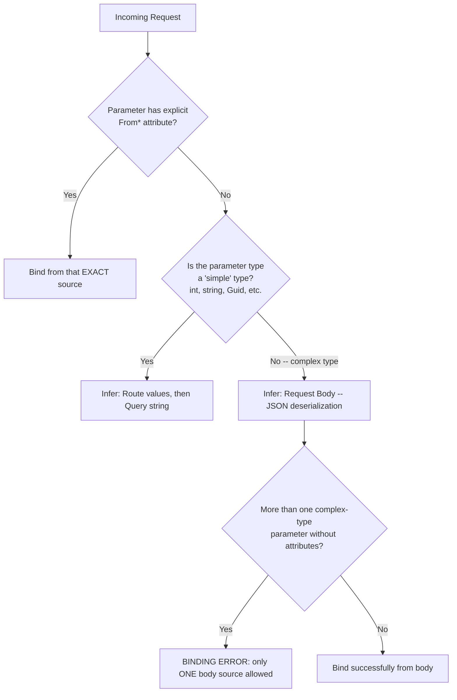
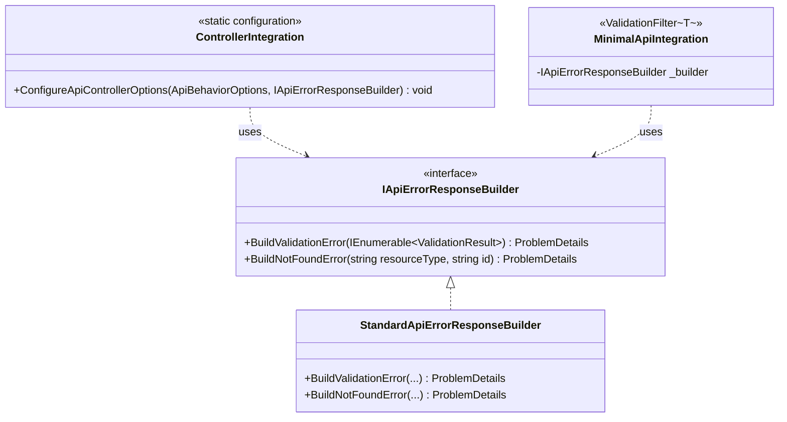
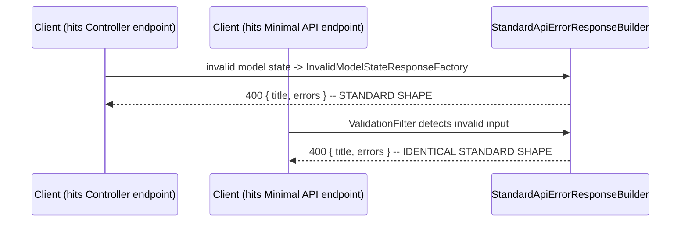

# Module 11 — ASP.NET Core: Minimal APIs vs Controllers, MVC Filters & Model Binding Internals

> Domain: .NET / ASP.NET Core | Level: Beginner → Expert | Prerequisite: [[01-Middleware-Pipeline-Request-Internals]] (endpoint routing, `GetEndpoint()`), [[02-DI-Container-Internals]] (constructor injection mechanics), [[../01-CSharp/07-Records-Pattern-Matching-Immutability]] (records as DTOs)

---

## 1. Fundamentals

### What are Minimal APIs and Controllers?
Both are ways of defining **endpoints** in ASP.NET Core — code that handles a specific route/HTTP-method combination. **Controllers** (`[ApiController] class OrdersController : ControllerBase`) are the classic, convention-heavy MVC model: a class with action methods, attribute-based routing, automatic model binding/validation, and a rich **filter pipeline** (`IActionFilter`, `IExceptionFilter`, etc.) wrapping each action. **Minimal APIs** (`app.MapGet("/orders/{id}", (int id, IOrderService svc) => ...)`) express the same endpoint concept as a lambda/method delegate registered directly against the routing system, with a leaner, more explicit, filter-based (`.AddEndpointFilter(...)`) extensibility model and no MVC-specific conventions layered on top.

### Why do both exist?
Controllers (and the full MVC framework) predate Minimal APIs by many years and were designed for **full web applications** (server-rendered views, complex model binding scenarios, a rich, convention-driven filter/pipeline system) — genuinely valuable for large, convention-heavy applications, but with real overhead (reflection-based action invocation, a more complex object-graph per request, more implicit "magic" that must be learned) for **simple, high-throughput JSON APIs** that don't need any of that. Minimal APIs (ASP.NET Core 6+) were introduced specifically to let a simple HTTP API be expressed with **less code and less implicit machinery** — directly competitive with lightweight frameworks in other ecosystems (Express.js, Flask) for the "just handle a few JSON endpoints fast" use case, while still being built on the exact same underlying endpoint-routing infrastructure as Controllers (Module 9 §2.7).

### When does this matter?
- **Choosing between them** for a new service is now a routine, real architectural decision at nearly every ASP.NET Core shop — understanding the actual, substantive trade-offs (not just "Minimal APIs are newer/faster") is a common Staff/Principal-level discussion point.
- **Understanding model binding internals** matters whenever debugging "why didn't my request body/query string bind correctly" — a very common, often subtly-caused class of bug.
- **Understanding the MVC filter pipeline** (distinct from, and nested inside, the middleware pipeline from Module 9) matters for correctly implementing cross-cutting concerns scoped to *actions* specifically (not every request), like model-state validation, response caching per-action, or custom authorization logic beyond what `[Authorize]` alone expresses.

### How does it work (30,000-ft view)?

```csharp
// Minimal API:
app.MapPost("/orders", (CreateOrderRequest request, IOrderService service) =>
{
    var order = service.CreateOrder(request);
    return Results.Created($"/orders/{order.Id}", order);
});

// Controller equivalent:
[ApiController]
[Route("orders")]
public class OrdersController : ControllerBase
{
    private readonly IOrderService _service;
    public OrdersController(IOrderService service) => _service = service;

    [HttpPost]
    public IActionResult Create(CreateOrderRequest request)
    {
        var order = _service.CreateOrder(request);
        return CreatedAtAction(nameof(GetById), new { id = order.Id }, order);
    }
}
```

Mental model for interviews: **"Both compile down to the same `Endpoint`/`RequestDelegate` infrastructure at the routing layer. Controllers add a reflection-driven action-invocation pipeline with a rich filter system and implicit model-binding/validation conventions on top; Minimal APIs are a thinner, more explicit layer with less implicit behavior and a simpler, delegate-based filter model."**

---

## 2. Deep Dive

### 2.1 The MVC Filter Pipeline — a Second, Nested Pipeline Inside the Endpoint

Controllers get an additional **filter pipeline**, distinct from (and nested *inside*) the middleware pipeline from Module 9 — it runs specifically around a matched controller action's execution, in a fixed, documented order:

1. **Authorization filters** (`IAuthorizationFilter`) — run first, can short-circuit before model binding even happens.
2. **Resource filters** (`IResourceFilter`) — run before model binding (`OnResourceExecuting`) and after the result is produced (`OnResourceExecuted`) — the only filter type that wraps *model binding itself*.
3. **Model binding** happens here (not a filter type itself, but occurs at this specific point in the sequence).
4. **Action filters** (`IActionFilter`) — run immediately before (`OnActionExecuting`) and after (`OnActionExecuted`) the action method body itself executes; this is where `[ApiController]`'s automatic model-state validation short-circuit (§2.4) is implemented.
5. **Exception filters** (`IExceptionFilter`) — run only if an exception propagates out of the action/action filters, before the exception would otherwise propagate up to ASP.NET Core's ordinary middleware-level exception handling (Module 8/9).
6. **Result filters** (`IResultFilter`) — run immediately before/after the action's `IActionResult` is actually executed (i.e., before/after the response is actually written).

Minimal APIs have a deliberately **simpler, single filter type**: `IEndpointFilter`, composed via `.AddEndpointFilter(...)`, which wraps the entire endpoint delegate's execution in one unified before/after model (conceptually closer to ordinary middleware, but scoped to one specific endpoint rather than the whole pipeline) — trading the MVC filter pipeline's fine-grained, many-stage extensibility for a simpler, single mental model.

### 2.2 Model Binding — Precisely How Request Data Becomes Method Parameters

**Model binding** is the process of populating an action method's/endpoint delegate's parameters from the incoming request — route values, query string, headers, form data, and the JSON request body. The binding **source** for each parameter is determined by:
- **Explicit attributes**: `[FromBody]`, `[FromQuery]`, `[FromRoute]`, `[FromHeader]`, `[FromForm]`, `[FromServices]` (this last one requests DI resolution instead of binding from the HTTP request at all).
- **Convention-based inference** (when no attribute is present): simple types (`string`, `int`, `Guid`, etc.) are inferred as coming from the **route** first, then the **query string**; complex types (a class/record with multiple properties) are inferred as coming from the **request body** (for Controllers with `[ApiController]`, this inference is a well-defined, documented convention; Minimal APIs apply a similar but not identical set of inference rules — a genuinely common source of "why isn't this binding the way I expected" confusion when a team is used to one model and switches to the other).
- **Only one parameter per request may be bound `[FromBody]`** — the request body stream can only be read once (Module 9 §Advanced Q3's buffering discussion notwithstanding), so exactly one complex-type parameter can be inferred/attributed as the body source; attempting to bind multiple parameters from the body produces a binding error.

### 2.3 `[ApiController]` — What the Attribute Actually Turns On

`[ApiController]` (applied to a Controller class) enables several **conventions simultaneously**, each independently significant:
- **Automatic HTTP 400 response on invalid `ModelState`**: if model binding/validation (via Data Annotations, `[Required]`/`[Range]`/etc., or `IValidatableObject`) fails, an `IActionFilter`-based convention automatically short-circuits the action **before it ever runs**, returning a `400 Bad Request` with a structured `ValidationProblemDetails` body — the action method body can assume `ModelState.IsValid` is always true if it executes at all, since invalid requests never reach it.
- **Binding source inference** (§2.2's convention-based defaults) — without `[ApiController]`, complex-type parameters default to a different, less API-friendly inference (historically defaulting toward form binding in some scenarios, a holdover from MVC's original server-rendered-views design center).
- **Multipart/form-data inference**, **problem-details for non-success status codes**, and **attribute-routing requirement** (a `[ApiController]`-decorated class *requires* attribute routing — conventional/URL-pattern-based routing isn't supported for API controllers) are additional, smaller conventions bundled into the same attribute.

**Interview-critical fact**: **all of `[ApiController]`'s behavior is implemented via ordinary filters and conventions** — it is not special-cased "magic" in the framework's core; a candidate demonstrating awareness that `[ApiController]`'s automatic-400 behavior is literally just a built-in `IActionFilter` (`ModelStateInvalidFilter`, internally) shows a meaningfully deeper understanding than one who treats it as an opaque, unexplainable framework feature.

### 2.4 Minimal API Filters (`IEndpointFilter`) — Mechanics

```csharp
app.MapPost("/orders", CreateOrder)
   .AddEndpointFilter(async (context, next) =>
   {
       // before
       var result = await next(context);
       // after
       return result;
   });
```
`IEndpointFilter`'s `InvokeAsync(EndpointFilterInvocationContext context, EndpointFilterDelegate next)` is structurally almost identical to ordinary middleware (Module 9 §2.1's delegate-chain pattern) — the same "onion," the same short-circuit-by-not-calling-`next()` mechanic — but scoped specifically to **one endpoint's** filter chain rather than the entire application's middleware pipeline, and with access to strongly-typed argument binding via `context.GetArgument<T>(index)`. This is a deliberate design simplification relative to the MVC filter pipeline's six distinct filter-type stages (§2.1) — Minimal APIs trade fine-grained filter-stage distinctions for a single, simpler, uniformly-composable filter concept.

### 2.5 `IActionResult`/`Results` — the Response-Construction Abstraction

Both models use a **result abstraction** rather than writing directly to the response — Controllers return `IActionResult` (`Ok()`, `NotFound()`, `CreatedAtAction()`, `BadRequest()`); Minimal APIs return `IResult` (`Results.Ok()`, `Results.NotFound()`, `Results.Created()`), or (since C# 11's covariant return support combined with newer Minimal API type-inference, .NET 7+) can return `TypedResults.Ok(...)` for compile-time-checked, strongly-typed results that also correctly populate OpenAPI/Swagger metadata without needing separate `[ProducesResponseType]` attributes. This abstraction layer is precisely what makes **unit testing an action/endpoint's logic** practical without a real HTTP pipeline — asserting "this method returned a `NotFoundResult`" is a plain, synchronous object-equality-style check, not something requiring an actual HTTP round-trip.

### 2.6 Endpoint Filter Ordering vs MVC Filter Ordering — a Genuine, Non-Obvious Difference

MVC filters have a **fixed stage order** (§2.1's six-stage sequence) regardless of registration order *within* the same stage (multiple `IActionFilter`s registered on the same action run in a documented, but sometimes surprising, order combining global/controller/action-level registration scope with explicit `Order` property values) — genuinely more complex to reason about than Minimal API endpoint filters, which simply nest in the **exact order `.AddEndpointFilter(...)` was called**, mirroring ordinary middleware's simplicity. This is a real, substantive complexity difference between the two models, not just a surface-syntax difference — worth naming explicitly when discussing trade-offs (§Advanced Q on this exact point).

---

## 3. Visual Architecture

### Nested Pipelines (ASCII)

```
Middleware Pipeline (Module 9)
┌───────────────────────────────────────────────────────────────────┐
│ ExceptionHandler → ForwardedHeaders → Routing → Auth → AuthZ →      │
│                                                                       │
│   ┌─────────────────────────────────────────────────────────────┐ │
│   │  MVC FILTER PIPELINE (Controllers only)                        │ │
│   │  Authorization Filters                                          │ │
│   │   Resource Filters (wraps model binding)                        │ │
│   │     [ MODEL BINDING happens here ]                               │ │
│   │     Action Filters (wraps the action method body)                │ │
│   │       [ ACTION METHOD BODY ]                                     │ │
│   │     Exception Filters (only if action/filters throw)             │ │
│   │   Result Filters (wraps IActionResult execution)                 │ │
│   └─────────────────────────────────────────────────────────────┘ │
│                                                                       │
│   OR, for Minimal APIs:                                              │
│   ┌─────────────────────────────────────────────────────────────┐ │
│   │  ENDPOINT FILTER CHAIN (single, uniform onion, no stages)       │ │
│   │   AddEndpointFilter #1 → AddEndpointFilter #2 → [ HANDLER ]     │ │
│   └─────────────────────────────────────────────────────────────┘ │
└───────────────────────────────────────────────────────────────────┘
```

### Model Binding Source Resolution



---

## 4. Production Example

### Scenario: API migration from Controllers to Minimal APIs — a silent model-binding regression

**Problem**: A team migrated a moderately-sized internal API from Controllers to Minimal APIs (motivated by measured startup-time and per-request-allocation improvements, Module 1/3's discipline applied to this specific architectural choice) and, shortly after deployment, discovered that a `GET /reports?startDate=2024-01-01&customerId=123&includeArchived=true` endpoint was silently ignoring the `includeArchived` query parameter — always behaving as if it were `false`, regardless of what the client actually sent.

**Investigation**:
- The original Controller action had: `public IActionResult GetReports(ReportFilterDto filter)` — a single complex-type parameter (`ReportFilterDto` with `StartDate`, `CustomerId`, `IncludeArchived` properties), which, **without** any explicit `[FromQuery]` attribute and **without** `[ApiController]`'s body-inference convention applying here (since query-string-bindable complex types have their own, subtly different inference history in classic MVC model binding, especially for `GET` requests where a body wouldn't normally be expected), had — thanks to years-old, somewhat obscure default MVC model-binding conventions — actually been binding `ReportFilterDto`'s properties from the **query string**, property-by-property, correctly.
- The direct Minimal API "equivalent" (`app.MapGet("/reports", (ReportFilterDto filter) => ...)`) applies **Minimal APIs' own binding-inference rules**, which (as of the .NET version in use at the time) treated a complex-type parameter with **no explicit attribute** as a **request body** binding candidate by default for Minimal APIs specifically — since `GET` requests conventionally have no body, the `ReportFilterDto` parameter silently bound to an **empty/default-initialized instance** (no error was thrown; every property simply took its type's default value), which is precisely why `IncludeArdchived` always appeared `false` (its default) — the query string was never consulted at all under Minimal API's differing inference rules for this exact scenario.

**Architecture fix**:
- Added explicit `[AsParameters]` (a Minimal-API-specific attribute allowing a complex type's properties to each be bound individually from route/query, mirroring what the original Controller's implicit convention had been doing) to the `ReportFilterDto filter` parameter — `app.MapGet("/reports", ([AsParameters] ReportFilterDto filter) => ...)` — restoring the intended per-property query-string binding behavior explicitly rather than relying on inference.
- Established a team-wide migration checklist explicitly calling out "verify complex-type parameter binding source for every migrated GET/query-string-bound endpoint" as a mandatory verification step for any future Controller-to-Minimal-API migration, rather than assuming behavioral equivalence.
- Added integration tests (via `WebApplicationFactory<T>`) specifically exercising query-string-bound complex-type scenarios across the migrated API surface, to catch this exact regression class automatically for any future refactor.

**Trade-offs**: `[AsParameters]` is Minimal-API-specific syntax with no Controller equivalent needed (since Controllers' implicit convention already did this) — a small, explicit piece of "translation friction" the team accepted as the cost of an otherwise worthwhile migration, documenting it clearly for future engineers unfamiliar with the two models' differing default inference behavior.

**Lessons learned**:
1. Minimal APIs and Controllers' model-binding **inference conventions are genuinely different**, not just syntactically different expressions of the same rules — assuming behavioral equivalence during a migration is a real, demonstrated risk, not a theoretical concern.
2. This class of bug is especially dangerous because it's **silent** — no exception, no error, just a quietly wrong default value, exactly the "invisible until someone notices business logic behaving wrong" pattern this course has repeatedly flagged as the most dangerous bug category (directly echoing Module 5's client-side-evaluation trap and Module 8's masked-exception incident in shape, if not mechanism).
3. Integration tests exercising actual HTTP request/response behavior (not just unit tests of isolated handler logic) are specifically necessary to catch model-binding-inference regressions, since a unit test calling the handler method directly with manually-constructed parameters would never exercise the binding-inference layer at all.

---

## 5. Best Practices

- **Choose Minimal APIs for new, simple, high-throughput JSON APIs without complex, convention-heavy requirements**; choose Controllers for large applications benefiting from the MVC filter pipeline's fine-grained extensibility, view-rendering needs, or teams with deep existing MVC convention investment. Treat this as a genuine, evidence-based architectural decision (§15), not a default "always use the newer one" reflex.
- **Use explicit binding-source attributes (`[FromQuery]`, `[FromBody]`, `[FromRoute]`) rather than relying purely on inference** for any parameter where the binding source isn't immediately, unambiguously obvious to a future reader — especially valuable during any Controller ↔ Minimal API migration, directly preventing §4's incident class.
- **Use `[AsParameters]` (Minimal APIs) explicitly when binding a complex type's properties individually from route/query values** rather than assuming it will be inferred correctly — be explicit about intent rather than relying on convention-based inference matching your expectations.
- **Leverage `TypedResults` (not plain `Results`) for Minimal API endpoints** where compile-time-checked return types and automatic OpenAPI metadata population are valuable — directly improves both correctness (a typo in a status-code-returning method name is now a compile error) and API-documentation accuracy with no extra annotation burden.
- **Write integration tests (via `WebApplicationFactory<T>`) covering real HTTP request/response round-trips for model-binding-sensitive endpoints**, not just unit tests of isolated handler logic — the binding-inference layer itself is exactly what unit tests bypass entirely.
- **Understand and use `[ApiController]`'s automatic-400 behavior deliberately** — don't duplicate manual `if (!ModelState.IsValid) return BadRequest(...)` checks in every action when `[ApiController]` already handles this uniformly; but be aware this convention exists specifically for Controllers, not Minimal APIs (which require an explicit validation approach, e.g., a validation `IEndpointFilter` or a library like FluentValidation's Minimal API integration).

---

## 6. Anti-patterns

- **Assuming Controller and Minimal API model-binding inference behave identically during a migration**, without explicit verification (§4's incident). Fix: explicit binding attributes, integration tests, a documented migration checklist.
- **Putting substantial business logic directly inline in a Minimal API lambda**, growing it into an unreadable, untestable, deeply-nested delegate. Why it fails: defeats the separation-of-concerns benefit DI/service-layer architecture provides — a large inline lambda is harder to unit-test in isolation than an injected service method. Fix: keep the endpoint delegate thin, delegating to an injected service for actual logic — precisely the same "keep middleware thin" guidance from Module 9 §5, applied here to endpoint handlers.
- **Choosing Minimal APIs purely because they're "newer"/"faster" without validating that the performance difference actually matters for the specific service** (directly extending this course's recurring measure-first discipline) — for most CRUD APIs at typical traffic volumes, the performance delta between Controllers and Minimal APIs is immaterial relative to database/network latency; the more consequential trade-offs are usually about filter-pipeline richness and team familiarity, not raw throughput.
- **Duplicating `[ApiController]`'s automatic model-validation behavior manually** in every action, unaware it's already handled globally. Fix: trust the convention; remove redundant manual `ModelState.IsValid` checks.
- **Registering many `IEndpointFilter`s on every single Minimal API endpoint individually**, rather than using route groups (`app.MapGroup("/orders").AddEndpointFilter(...)`) to apply shared filters once across a whole group of related endpoints — repetitive, error-prone (easy to forget on a newly-added endpoint) registration. Fix: use `MapGroup` for cross-cutting Minimal API filters shared across a logical group of endpoints, directly analogous to applying an MVC filter at the controller level instead of repeating it on every action.
- **Ignoring the ambiguity/complexity difference in filter ordering (§2.6) when a team is more comfortable with Controllers' MVC filter pipeline but adopts Minimal APIs' simpler model without adjusting their mental model** — assuming Minimal API endpoint filters have the same six-stage semantics as MVC filters (they don't) can lead to incorrect assumptions about exactly when a given filter's logic runs relative to model binding/validation.

---

---

---

---

## 10. Interview Questions

### Basic (10)

1. **Q: What is the fundamental difference between Minimal APIs and Controllers?**
   **A:** Controllers use a class-based, convention-heavy MVC model with a rich multi-stage filter pipeline; Minimal APIs express endpoints as delegates registered directly against routing, with a simpler, single-stage filter model and less implicit convention.

2. **Q: Do Minimal APIs and Controllers use the same underlying routing infrastructure?**
   **A:** Yes — both compile down to the same `Endpoint`/`RequestDelegate` abstraction; they're handled identically by the middleware pipeline's routing/endpoint-execution layer.

3. **Q: What does `[FromBody]` do?**
   **A:** Explicitly specifies that a parameter should be bound by deserializing the request body (typically JSON), overriding whatever the default inference would have chosen.

4. **Q: Can more than one parameter be bound `[FromBody]` on the same action/endpoint?**
   **A:** No — the request body can only be read/deserialized once, so only one complex-type parameter may be bound from it.

5. **Q: What does `[ApiController]` do automatically regarding invalid model state?**
   **A:** It automatically short-circuits with a `400 Bad Request` (with a structured problem-details body) before the action method runs, if model binding/validation fails.

6. **Q: What is `IEndpointFilter` used for?**
   **A:** Adding cross-cutting before/after logic around a specific Minimal API endpoint's execution, similar in spirit to middleware but scoped to one endpoint.

7. **Q: What is the mass-assignment/over-posting vulnerability?**
   **A:** Binding a request body directly onto a rich domain/entity type lets a client set unexpected fields (e.g., an admin flag) that were never intended to be client-controllable — mitigated by binding to a dedicated, narrowly-scoped DTO instead.

8. **Q: What does `TypedResults` provide that plain `Results` doesn't?**
   **A:** Compile-time-checked, strongly-typed result objects that also automatically populate accurate OpenAPI metadata without needing separate `[ProducesResponseType]` attributes.

9. **Q: Which model generally has lower per-request overhead and faster startup?**
   **A:** Minimal APIs — Controllers' reflection-based action invocation and richer multi-stage filter pipeline add more per-request/startup cost.

10. **Q: What does `[AsParameters]` do in a Minimal API?**
    **A:** Lets a complex type's individual properties be bound from route/query values (rather than the request body), mirroring the kind of per-property binding Controllers historically did via implicit convention for certain scenarios.

### Intermediate (10)

1. **Q: Name the six MVC filter pipeline stages in order, and identify which one wraps model binding itself.**
   **A:** Authorization filters, resource filters (the one wrapping model binding), action filters, exception filters, result filters — model binding occurs specifically between the resource-filter and action-filter stages.

2. **Q: Why can a Controller-to-Minimal-API migration silently change a `GET` endpoint's query-string binding behavior?**
   **A:** The two models have genuinely different default inference rules for complex-type parameters without explicit attributes — a parameter that Controllers historically bound from the query string via convention might be inferred as a request-body parameter under Minimal APIs' rules, silently binding to a default/empty instance for a `GET` request that has no body.

3. **Q: What is `ModelStateInvalidFilter`, conceptually, and what does knowing about it demonstrate?**
   **A:** It's the actual internal `IActionFilter` implementation behind `[ApiController]`'s automatic-400 behavior — knowing this demonstrates that `[ApiController]`'s conventions are implemented via ordinary, inspectable filter machinery, not unexplainable framework magic.

4. **Q: Why should you use `MapGroup` for shared Minimal API filters instead of adding the same `.AddEndpointFilter(...)` call to every individual endpoint?**
   **A:** It applies the filter once across a whole logical group of related endpoints, avoiding repetitive, error-prone per-endpoint registration that's easy to forget when a new endpoint is added to the group later.

5. **Q: What's the security risk of binding a request body directly to an EF Core entity type instead of a dedicated DTO?**
   **A:** A client can include unexpected extra properties in the JSON body that map onto entity fields never intended to be client-settable (e.g., setting an `IsAdmin` flag), a mass-assignment/over-posting vulnerability.

6. **Q: Does `[ApiController]`'s automatic model-validation short-circuit apply to Minimal APIs by default?**
   **A:** No — Minimal APIs have no equivalent automatic convention; a team must explicitly implement validation enforcement (e.g., via a custom `IEndpointFilter` or a validation library's Minimal API integration).

7. **Q: How does Minimal API endpoint filter ordering differ from MVC filter ordering, in terms of complexity?**
   **A:** Minimal API filters simply nest in the exact order `.AddEndpointFilter(...)` was called, mirroring ordinary middleware's simplicity; MVC filters have a fixed six-stage order combined with additional scope/`Order`-property-based tie-breaking rules within each stage, a genuinely more complex model to reason about.

8. **Q: Why would `IResourceFilter` be the right filter type to use if you needed to short-circuit a request before model binding even occurs?**
   **A:** It's the only MVC filter stage that runs before model binding happens (`OnResourceExecuting`) — `IActionFilter` runs after binding has already occurred, too late to prevent it.

9. **Q: What is the benefit of integration testing (via `WebApplicationFactory<T>`) specifically for catching model-binding regressions, beyond ordinary unit testing?**
   **A:** Model binding/inference only actually occurs as part of a real HTTP request being processed through the routing/binding infrastructure — a unit test that directly calls a handler method with manually-constructed parameters bypasses the binding layer entirely and would never catch an inference-related regression.

10. **Q: Why might a team choose Controllers over Minimal APIs even for a greenfield project, despite the performance/startup advantages of Minimal APIs?**
    **A:** If the project genuinely benefits from the MVC filter pipeline's rich, fine-grained extensibility (complex, multi-stage cross-cutting concerns), needs server-rendered views (Razor), or the team has deep existing familiarity/tooling investment in MVC conventions, those substantive benefits may outweigh Minimal APIs' performance/simplicity advantages for that specific project's actual needs.

### Advanced (10)

1. **Q: Explain precisely why `IResourceFilter` is uniquely positioned to implement something like custom response caching that needs to bypass model binding entirely for a cache hit, and why `IActionFilter` couldn't achieve the same effect.**
   **A:** `IResourceFilter.OnResourceExecuting` runs **before** model binding occurs — a cache-hit short-circuit implemented here can return a cached response and never trigger the (potentially non-trivial) cost of binding/validating the request at all; `IActionFilter.OnActionExecuting`, by contrast, runs strictly **after** model binding has already completed, meaning even if it short-circuits the action method itself, the binding cost has already been paid regardless — for a cache-hit scenario specifically designed to avoid unnecessary work, this timing distinction is the entire reason `IResourceFilter` (not `IActionFilter`) is the architecturally correct filter type to use.

2. **Q: A candidate claims "Minimal APIs and Controllers are functionally identical, just different syntax." Provide a precise, complete correction.**
   **A:** They share the same underlying routing/endpoint infrastructure (making this claim partially true at that specific layer), but they differ substantively in: (a) filter pipeline richness/complexity (six MVC stages with complex ordering vs. one simple, ordered `IEndpointFilter` chain); (b) default model-binding inference conventions (§4's incident demonstrates these are genuinely, sometimes silently, different — not just cosmetically different); (c) automatic model-validation behavior (`[ApiController]`'s convention has no Minimal API equivalent by default); (d) per-request/startup performance profile (§7); and (e) OpenAPI-metadata generation mechanics (`TypedResults`' compile-time approach vs. attribute-based reflection). The precise, correct framing: "they're built on a shared foundation but represent meaningfully different trade-offs in convention, extensibility, and performance — not interchangeable syntax for an identical underlying behavior."

3. **Q: Design a validation-enforcement `IEndpointFilter` that replicates `[ApiController]`'s automatic-400 behavior for a Minimal API, and explain precisely where in the endpoint filter chain it should be registered relative to other filters.**
   **A:**
   ```csharp
   public class ValidationFilter<T> : IEndpointFilter
   {
       public async ValueTask<object?> InvokeAsync(EndpointFilterInvocationContext context, EndpointFilterDelegate next)
       {
           var arg = context.GetArgument<T>(0); // assumes the validated type is the first parameter -- a real
                                                  // implementation would need a more robust argument-locating strategy
           var validationContext = new ValidationContext(arg!);
           var results = new List<ValidationResult>();
           if (!Validator.TryValidateObject(arg!, validationContext, results, validateAllProperties: true))
           {
               return Results.ValidationProblem(results.ToDictionary(
                   r => r.MemberNames.FirstOrDefault() ?? "",
                   r => new[] { r.ErrorMessage ?? "" }));
           }
           return await next(context);
       }
   }
   // Usage: app.MapPost("/orders", CreateOrder).AddEndpointFilter<ValidationFilter<CreateOrderRequest>>();
   ```
   This should be registered as the **first** filter in the chain for a given endpoint (or, if using `MapGroup`, applied at the group level before any other business-logic-oriented filters) — mirroring `IResourceFilter`'s "runs before the actual work" positioning from Advanced Q1, ensuring invalid input is rejected before any subsequent filter or the handler itself does any real work, exactly replicating the *timing* semantics of `[ApiController]`'s convention, not just its validation logic.

4. **Q: Explain a scenario where relying on Minimal API model-binding inference (rather than explicit attributes) creates a genuine, non-obvious API-versioning/compatibility hazard as an API evolves.**
   **A:** If a team adds a **new property** to an existing complex-type parameter that was previously bound via inferred query-string/`[AsParameters]` binding, and that new property happens to be another complex type itself (e.g., adding a `nested: AddressDto` property to a previously-flat `CustomerFilterDto`), the binding-inference rules for how to handle a *nested* complex property within an `[AsParameters]`-bound type may not behave as naturally/predictably as a flat set of primitive properties did — potentially silently failing to bind the new nested property from query parameters the way a naive extension of the existing pattern would suggest, without any compile-time signal that the binding behavor for the *new* property differs from the existing ones. This is a concrete illustration of why explicit attribution and deliberate integration testing (§5) matter increasingly as a DTO's shape evolves over an API's lifetime, not just at initial migration time.

5. **Q: How would you design an automated test specifically to catch model-binding-inference discrepancies between two API implementations (e.g., during a phased Controller-to-Minimal-API migration where both exist temporarily side by side)?**
   **A:** Implement a **contract/characterization test suite** that sends an identical, comprehensive matrix of representative requests (varying which fields are present/absent, edge-case values, unexpected extra fields) to both the old (Controller) and new (Minimal API) endpoint implementations simultaneously (via `WebApplicationFactory<T>` instances of each, or a shared test harness hitting both if temporarily co-deployed), asserting that the resulting bound parameter values (exposed via a debug/test-only endpoint, or captured via a test-injected interceptor) are identical between the two implementations for every request in the matrix — this directly, mechanically catches exactly the class of silent inference discrepancy that caused §4's incident, rather than relying on manual review or hoping a general integration test suite happens to exercise the specific mismatched scenario.

6. **Q: Explain why `TypedResults`' compile-time-checked approach to OpenAPI metadata generation is architecturally different from (and, in specific documented ways, superior to) `[ProducesResponseType]` attribute-based generation, beyond just "it's more type-safe."**
   **A:** `[ProducesResponseType(typeof(OrderDto), 200)]` requires the developer to manually keep the attribute's declared type/status-code **in sync** with what the action method actually returns at runtime — nothing prevents the method body from being changed to return a different type/status code without updating the attribute, silently producing incorrect OpenAPI documentation with no compiler warning. `TypedResults.Ok<OrderDto>(order)`'s return type **is** the actual, compiler-verified runtime behavior — the OpenAPI generator can derive accurate metadata directly from the method's actual, guaranteed-correct return type signature, making documentation drift (a real, common, and easy-to-overlook problem with attribute-based approaches) structurally impossible for this specific class of mismatch.

7. **Q: A team's Minimal API endpoint accepts a large, deeply nested complex-type parameter with no explicit attributes, and the team reports intermittent, hard-to-reproduce 400 errors specifically when certain optional nested properties are omitted from the request body. Diagnose the likely mechanism.**
   **A:** For request-body-bound (JSON deserialization-based) complex types, `System.Text.Json`'s default deserialization behavior for **non-nullable reference-type properties without a default value** can produce `null` for an omitted JSON property — if the parameter type doesn't correctly express which properties are genuinely optional (via nullable annotations, default property values, or explicit `[Required]`/validation-attribute absence for optional fields) versus required, the deserializer may either silently leave a property `null` (potentially causing a downstream `NullReferenceException` if application code assumes it's always populated) or, if strict deserialization options are configured, throw a `JsonException` translated into a 400 — the "intermittent" nature specifically correlates with which combination of optional properties happen to be omitted in a given request, since different omission patterns exercise different nullable/default-value edge cases in the DTO's declared shape. The fix requires precisely auditing the DTO's property nullability/default-value declarations against the API's actual intended optionality contract, not a model-binding-configuration change per se.

8. **Q: How would you architect a shared, reusable validation/error-response convention that works identically for both Controllers (via `[ApiController]`) and Minimal APIs (via a custom filter), so that a team maintaining both simultaneously (during a gradual migration) presents a consistent API contract to clients regardless of which underlying model handles a given endpoint?**
   **A:** Define a shared `ValidationProblemDetails`-shaped error-response contract (field names, structure) explicitly, independent of either framework's default conventions; for Controllers, configure `[ApiController]`'s `InvalidModelStateResponseFactory` (a customization point specifically for this purpose) to produce exactly that shared shape instead of the framework's raw default; for Minimal APIs, implement the shared validation filter (Advanced Q3) to produce the identical shape via `Results.ValidationProblem(...)` with matching field structure — the goal being that a client consuming the API cannot tell, from the response shape alone, which underlying implementation model handled any given request, a genuinely important consistency property during any phased migration where both models are simultaneously live in production.

9. **Q: Explain the performance and correctness implications of applying an `IEndpointFilter` that itself performs an expensive, blocking-style operation (e.g., a synchronous database call) versus one that's properly `async`, connecting this back to Module 2's thread-pool-starvation discussion.**
   **A:** `IEndpointFilter.InvokeAsync` is an `async` method by design specifically so filters can perform I/O-bound work (database calls, external API calls for authorization/validation) without blocking a thread-pool thread — a filter that internally uses `.Result`/`.Wait()` on an async operation instead of properly `await`-ing it reintroduces exactly Module 2 §4's thread-pool-starvation risk, now specifically at the endpoint-filter layer; since filters run on **every** request matching their endpoint (or endpoint group), a sync-over-async mistake here has an amplified blast radius proportional to that endpoint's traffic volume, making endpoint filters a particularly high-value place to apply Module 2's "async all the way down" discipline rigorously.

10. **Q: As a Principal Engineer, how would you guide an organization-wide decision on whether new services should default to Minimal APIs or Controllers, avoiding both "always use the shiny new thing" and "never change what already works" as unexamined defaults?**
    **A:** Establish a small, explicit decision checklist tied to actual project characteristics rather than a blanket mandate either way: (1) does the service need Razor/server-rendered views, or is it a pure JSON API? (Controllers only make sense for the former); (2) does the team need the MVC filter pipeline's fine-grained, multi-stage extensibility for genuinely complex cross-cutting concerns, or would Minimal APIs' simpler model suffice? (3) is this a very-high-throughput, cost-sensitive service where the measured startup/per-request overhead difference (§7) is actually significant relative to the service's other bottlenecks, or is database/network latency going to dominate regardless of framework choice? (4) does the team have specific, demonstrated proficiency/tooling investment in one model that would make switching a genuine productivity cost, independent of the frameworks' own merits? Publish this checklist (mirroring the shared-template governance pattern from Module 9 §15/§17 and Module 10 §17) as the organization's standard decision framework, explicitly designed to route each *specific* new service toward whichever model actually fits its concrete requirements — converting what could otherwise become a recurring, opinion-based debate into a repeatable, evidence-based decision process.

---

## 11. Coding Exercises

### Easy — Convert a Controller action to a Minimal API endpoint, preserving explicit binding
**Problem**: Convert this Controller action to a Minimal API, being explicit about binding sources to avoid §4's inference-mismatch risk.
```csharp
[HttpGet]
public IActionResult Search([FromQuery] string term, [FromQuery] int page = 1) => ...
```
**Solution**:
```csharp
app.MapGet("/search", ([FromQuery] string term, [FromQuery] int page = 1, IOrderService service) =>
{
    var results = service.Search(term, page);
    return TypedResults.Ok(results);
});
```
**Discussion**: For simple types (`string`, `int`) bound from the query string, Minimal APIs' convention-based inference (§2.2) would actually have inferred the same binding source correctly even without the explicit `[FromQuery]` attributes — this exercise demonstrates that explicit attribution, while a good defensive habit (§5) especially valuable during migrations, is not strictly *required* for simple-type parameters the way it effectively is for complex-type parameters (§4's actual failure mode) — an important, precise distinction to draw rather than over-generalizing "always use explicit attributes everywhere" without understanding exactly which binding scenarios are actually inference-risky.

### Medium — Implement a `MapGroup`-based shared validation filter for a Minimal API route group
**Problem**: Apply a shared validation filter across an entire group of order-related endpoints without repeating registration on each one.
```csharp
var orders = app.MapGroup("/orders")
    .AddEndpointFilterFactory((factoryContext, next) =>
    {
        // Inspect the endpoint's parameter types ONCE, at startup, to build an efficient,
        // reusable validation delegate specific to THIS endpoint's actual parameter shape --
        // avoiding repeated reflection on every single request.
        var validatableParamIndex = Array.FindIndex(
            factoryContext.MethodInfo.GetParameters(),
            p => typeof(IValidatableObject).IsAssignableFrom(p.ParameterType) || HasValidationAttributes(p.ParameterType));

        if (validatableParamIndex < 0)
            return next; // no validatable parameter on this endpoint -- skip the filter entirely, zero overhead

        return async context =>
        {
            var arg = context.GetArgument<object>(validatableParamIndex);
            var results = new List<ValidationResult>();
            if (arg is not null && !Validator.TryValidateObject(arg, new ValidationContext(arg), results, true))
                return Results.ValidationProblem(results.ToDictionary(r => r.MemberNames.FirstOrDefault() ?? "", r => new[] { r.ErrorMessage ?? "" }));
            return await next(context);
        };
    });

orders.MapPost("/", CreateOrder);
orders.MapPut("/{id}", UpdateOrder);
orders.MapGet("/{id}", GetOrder); // has no validatable body parameter -- filter factory correctly skips it above
```
**Discussion**: `AddEndpointFilterFactory` (rather than the simpler `AddEndpointFilter`) is used deliberately here — it runs its setup logic **once per endpoint, at application startup** (inspecting each endpoint's specific parameter shape via `factoryContext.MethodInfo`), producing a specialized filter delegate for that endpoint, rather than performing that same inspection work redundantly on **every single request**. This is a direct, concrete performance-optimization pattern specific to the Minimal API filter model, and precisely why `GetOrder` (with no validatable body parameter) correctly pays **zero** validation-filter overhead at request time — the factory determined at startup that this endpoint needs no validation logic at all and returned `next` unwrapped.

### Hard — Diagnose and fix the mass-assignment vulnerability
**Problem**: Fix this endpoint, which binds directly to an EF Core entity.
```csharp
// VULNERABLE: binds the request body directly onto the persistence entity
app.MapPost("/users/register", async (User user, AppDbContext db) =>
{
    db.Users.Add(user); // a malicious client could include "isAdmin": true in the JSON body!
    await db.SaveChangesAsync();
    return TypedResults.Created($"/users/{user.Id}", user);
});

public class User // EF Core entity
{
    public int Id { get; set; }
    public string Email { get; set; } = "";
    public string PasswordHash { get; set; } = "";
    public bool IsAdmin { get; set; } // NEVER should be client-settable
}
```
**Solution**:
```csharp
public record RegisterUserRequest(string Email, string Password); // DTO: ONLY the fields a client should ever supply

app.MapPost("/users/register", async (RegisterUserRequest request, IPasswordHasher hasher, AppDbContext db) =>
{
    var user = new User
    {
        Email = request.Email,
        PasswordHash = hasher.Hash(request.Password),
        IsAdmin = false // explicitly, deliberately set server-side -- NEVER derived from client input
    };
    db.Users.Add(user);
    await db.SaveChangesAsync();
    return TypedResults.Created($"/users/{user.Id}", new { user.Id, user.Email }); // response DTO too -- never leak PasswordHash
});
```
**Discussion**: Note the fix addresses **two** related, but distinct, concerns: (1) the mass-assignment vulnerability itself (input DTO, not entity, as the bound type), and (2) an equally important but easy-to-overlook **output**-side data-exposure risk (returning the raw `user` entity directly would leak `PasswordHash` in the response body) — a dedicated, narrow response projection (`new { user.Id, user.Email }`, or a proper response DTO/record) is needed on the way *out* for exactly the same "don't expose internal entity shape directly to clients" reasoning applied on the way *in*.

### Expert — Implement a request/response contract-consistency test harness (Advanced Q5)
**Problem**: Implement the contract-consistency test harness comparing a legacy Controller endpoint against its Minimal API migration target, catching binding-inference discrepancies automatically.
```csharp
public class BindingConsistencyTests : IClassFixture<WebApplicationFactory<ControllerStartup>>, IClassFixture<WebApplicationFactory<MinimalApiStartup>>
{
    private readonly HttpClient _controllerClient;
    private readonly HttpClient _minimalApiClient;

    public BindingConsistencyTests(WebApplicationFactory<ControllerStartup> controllerFactory, WebApplicationFactory<MinimalApiStartup> minimalFactory)
    {
        _controllerClient = controllerFactory.CreateClient();
        _minimalApiClient = minimalFactory.CreateClient();
    }

    public static IEnumerable<object[]> RequestMatrix()
    {
        // A representative matrix: every field present; each optional field individually omitted;
        // boundary values; unexpected extra fields -- exactly the scenarios most likely to expose
        // an inference discrepancy, per this module's production incident.
        yield return new object[] { "?startDate=2024-01-01&customerId=123&includeArchived=true" };
        yield return new object[] { "?startDate=2024-01-01&customerId=123" }; // includeArchived OMITTED
        yield return new object[] { "?customerId=123&includeArchived=true" }; // startDate OMITTED
        yield return new object[] { "?startDate=2024-01-01&customerId=123&includeArchived=true&unexpectedField=x" };
    }

    [Theory]
    [MemberData(nameof(RequestMatrix))]
    public async Task Both_Implementations_Should_Bind_Identically(string queryString)
    {
        var controllerResponse = await _controllerClient.GetFromJsonAsync<ReportFilterDto>($"/reports/debug-binding{queryString}");
        var minimalApiResponse = await _minimalApiClient.GetFromJsonAsync<ReportFilterDto>($"/reports/debug-binding{queryString}");

        Assert.Equal(controllerResponse, minimalApiResponse); // ReportFilterDto is a record (Module 7) --
                                                                 // value equality makes this assertion meaningful and simple
    }
}
// A "/reports/debug-binding" endpoint exists on BOTH implementations specifically for this test,
// simply echoing back the bound parameter values as JSON -- a test-only diagnostic endpoint.
```
**Discussion points**: Using a `record` (Module 7) for `ReportFilterDto` makes the `Assert.Equal(...)` comparison meaningful with zero extra equality-implementation code — a direct, practical payoff of Module 7's value-equality discussion applied to test-assertion ergonomics. This test harness would have caught §4's exact incident automatically, on the very first CI run after the migration, rather than requiring a production incident to surface it — the general principle (build a characterization test comparing old vs. new behavior across a representative input matrix *before* fully cutting over during any significant refactor/migration) is broadly transferable well beyond this specific Controllers-vs-Minimal-APIs scenario.

---

## 12. System Design

*(Narrow application — full System Design has its own module.)*

**Scenario**: Design the API-layer architecture for a **large enterprise platform** undergoing a multi-year, incremental migration from a legacy Controllers-based monolith to a Minimal-API-based set of focused services, without a risky "big bang" cutover.

- **Functional**: Support both models simultaneously, side-by-side, for an extended transition period; ensure API consumers experience a **consistent contract** (error shapes, validation behavior) regardless of which underlying model currently serves a given endpoint (directly Advanced Q8's shared-convention design).
- **Non-functional**: Zero silent behavioral regressions during migration (directly addressing §4's incident class at the full-platform scale); ability to migrate endpoint-by-endpoint incrementally, not all-or-nothing.
- **Architecture**: A shared "API conventions" library defining the common `ValidationProblemDetails` shape, applied via `[ApiController]`'s `InvalidModelStateResponseFactory` customization for still-Controller-based endpoints and via the shared `ValidationFilter<T>` (Expert coding exercise's pattern) for newly-migrated Minimal API endpoints; every migrated endpoint requires, as a mandatory migration-checklist gate, a passing contract-consistency test (Expert coding exercise) run against both the old and new implementation before the old one is retired/removed from the codebase.
- **Failure handling**: A feature-flag-based routing layer (directly reusing this course's recurring feature-flag/gradual-rollout theme) allows individual endpoints to be toggled between "served by legacy Controller" and "served by new Minimal API" independently, enabling instant rollback of a single problematic migrated endpoint without affecting any others.
- **Monitoring**: Per-endpoint request-shape/response-shape monitoring (structured logging of bound parameter values, sampled) specifically during each endpoint's transition window, to catch any inference discrepancy in production traffic patterns the pre-migration test matrix might not have anticipated — a defense-in-depth layer beyond the contract-consistency tests alone.
- **Trade-offs**: Running both models side-by-side for an extended period is genuinely more operational complexity (two sets of conventions to maintain simultaneously, two codebases to reason about) than a hypothetical instant full cutover — accepted specifically because the alternative (a single large, risky, all-at-once migration) carries a much higher risk of a difficult-to-isolate, large-blast-radius regression, exactly the kind of risk this course has repeatedly emphasized minimizing via incremental, test-gated, rollback-capable migration strategies (directly echoing Module 6 §Advanced Q9's "expand, don't break" incremental migration principle, now applied at the API-framework-migration scale).

---

## 13. Low-Level Design

**Scenario**: Design a small, reusable **response-shape consistency enforcement layer** ensuring both Controllers and Minimal APIs in a hybrid codebase (per §12) produce byte-for-byte-identical error response shapes for equivalent failure scenarios.

### Class Diagram


```csharp
public interface IApiErrorResponseBuilder
{
    ProblemDetails BuildValidationError(IEnumerable<ValidationResult> errors);
    ProblemDetails BuildNotFoundError(string resourceType, string id);
}

public sealed class StandardApiErrorResponseBuilder : IApiErrorResponseBuilder
{
    public ProblemDetails BuildValidationError(IEnumerable<ValidationResult> errors) => new()
    {
        Status = 400,
        Title = "One or more validation errors occurred.",
        Extensions = { ["errors"] = errors.GroupBy(e => e.MemberNames.FirstOrDefault() ?? "")
                                            .ToDictionary(g => g.Key, g => g.Select(e => e.ErrorMessage).ToArray()) }
    };

    public ProblemDetails BuildNotFoundError(string resourceType, string id) => new()
    {
        Status = 404,
        Title = $"{resourceType} not found.",
        Extensions = { ["resourceId"] = id }
    };
}

// Controller-side wiring (in Program.cs):
builder.Services.Configure<ApiBehaviorOptions>(options =>
{
    var errorBuilder = new StandardApiErrorResponseBuilder(); // or resolved via DI in a real implementation
    options.InvalidModelStateResponseFactory = context =>
    {
        var errors = context.ModelState.SelectMany(kvp => kvp.Value!.Errors.Select(e =>
            new ValidationResult(e.ErrorMessage, new[] { kvp.Key })));
        return new BadRequestObjectResult(errorBuilder.BuildValidationError(errors));
    };
});

// Minimal API-side wiring: ValidationFilter<T> (Expert coding exercise) constructed with the
// SAME IApiErrorResponseBuilder implementation, guaranteeing byte-identical shapes for both models.
```

### Sequence Diagram


### Design Patterns / SOLID
- **Single Responsibility + Dependency Inversion**: `IApiErrorResponseBuilder` is the single source of truth for error-response *shape*, injected/used identically by both integration points — neither Controllers' `ApiBehaviorOptions` configuration nor the Minimal API `ValidationFilter<T>` contain their own independent shape-construction logic; both delegate to the same shared abstraction, guaranteeing consistency by construction rather than by convention/discipline alone.
- This directly operationalizes §12's system design requirement ("consistent contract regardless of underlying model") as concrete, testable code — a genuinely reusable pattern for any organization running a hybrid Controllers/Minimal-APIs codebase during a migration window.

---

## 14. Production Debugging

### Incident: Silent model-binding regression during Controller-to-Minimal-API migration (full deep dive of §4)
- **Symptoms**: A query parameter silently ignored, always behaving as its default value.
- **Investigation**: Comparing actual generated SQL/behavior against the original Controller implementation revealed the parameter was binding to a default-initialized DTO instance instead of reading the query string.
- **Tools**: Manual request/response inspection, code review comparing old vs. new binding attribute usage.
- **Root cause**: Differing default complex-type binding-source inference between Controllers and Minimal APIs.
- **Fix**: Explicit `[AsParameters]` attribute restoring intended per-property query-string binding.
- **Prevention**: Contract-consistency test harness (§11 Expert exercise) as a mandatory migration-checklist gate.

### Incident: Mass-assignment vulnerability discovered in a security review
- **Symptoms**: A security review (proactive, not incident-triggered) found a user-registration endpoint binding directly to the `User` EF Core entity, including its `IsAdmin` property.
- **Investigation**: Confirmed via a proof-of-concept request including an unexpected `"isAdmin": true` field in the registration payload, verifying the entity's `IsAdmin` property was indeed set from client input.
- **Root cause**: Binding a request body directly to a persistence entity type instead of a dedicated, narrowly-scoped DTO (§8/§11 Hard exercise).
- **Fix**: Introduced dedicated request/response DTOs across every entity-bound endpoint found in the audit, explicitly setting security-sensitive fields server-side only.
- **Prevention**: Static-analysis rule flagging any Minimal API/Controller action parameter or return type that is directly an EF Core entity type (identifiable via `DbSet<T>`'s `T`), requiring an explicit justification comment for any legitimate exception.

### Incident: Thread-pool starvation traced to a synchronous database call inside an `IEndpointFilter`
- **Symptoms**: An endpoint group with a shared authorization-check `IEndpointFilter` exhibited exactly Module 2's thread-pool-starvation signature (low CPU, climbing latency, growing thread-pool queue length) under moderate sustained load.
- **Investigation**: Code review of the shared filter found `dbContext.Users.FirstOrDefault(...)` (a synchronous EF Core call) inside the filter's `InvokeAsync`, rather than `FirstOrDefaultAsync(...)` properly awaited.
- **Root cause**: A sync-over-async (technically, in this case, a fully synchronous call inside an async method, blocking the calling thread for the database round-trip's duration) mistake inside a high-traffic, shared endpoint filter — exactly Advanced Q9's predicted scenario, discovered in production.
- **Fix**: Changed to `await dbContext.Users.FirstOrDefaultAsync(...)`.
- **Prevention**: The same Roslyn analyzer banning sync-over-async patterns (Module 2 §14) extended explicitly to cover `IEndpointFilter`/`IActionFilter` implementations, recognizing these as equally high-traffic, high-blast-radius contexts as ordinary middleware.

### Incident: OpenAPI documentation drift traced to stale `[ProducesResponseType]` attributes
- **Symptoms**: A partner integration team reported their generated API client (from the published OpenAPI spec) didn't match the actual response shape returned by a specific endpoint in practice.
- **Investigation**: Found the Controller action's actual return statement had been changed (during an unrelated refactor) to return a different DTO type than what its `[ProducesResponseType(typeof(OldDto), 200)]` attribute still declared — the attribute was never updated when the return type changed, and nothing in the build/test process caught the mismatch.
- **Root cause**: Exactly the documentation-drift risk named in Advanced Q6 — attribute-based OpenAPI metadata isn't compiler-verified against the method's actual behavior.
- **Fix**: Migrated the affected endpoints to `TypedResults`-based Minimal API equivalents (or, for Controllers remaining as-is, added a custom Roslyn analyzer specifically cross-checking `[ProducesResponseType]` declarations against the action method's actual return statements' inferred types) to make this class of drift structurally impossible going forward.
- **Prevention**: Prefer `TypedResults`/strongly-typed return declarations wherever the migration path allows; for Controllers that must remain, mandatory analyzer-based cross-checking of `[ProducesResponseType]` accuracy as a CI gate.

---

## 15. Architecture Decision

**Decision**: Choosing Controllers vs. Minimal APIs for a new ASP.NET Core service.

| Option | Advantages | Disadvantages | Cost | Complexity | Maintainability | Performance | Scalability | Ops Overhead |
|---|---|---|---|---|---|---|---|---|
| **A. Controllers (`[ApiController]`)** | Rich, fine-grained filter pipeline; automatic model-validation convention; mature, widely-understood, deep tooling/documentation ecosystem; supports server-rendered views if ever needed | More per-request/startup overhead; more implicit convention to learn/misunderstand; documentation-drift risk with attribute-based OpenAPI metadata | Low (mature, well-documented) | Medium (more implicit conventions) | High (well-understood by most .NET teams) | Good | Good | Low |
| **B. Minimal APIs (with `TypedResults`)** | Lower overhead, faster startup, less implicit magic, compile-time-checked OpenAPI metadata via `TypedResults`, simpler filter model | No automatic model-validation convention (must build explicitly); genuinely different binding-inference rules (a migration risk, §4); filter pipeline less fine-grained for very complex cross-cutting scenarios | Low | Low-Medium (once validation convention is established) | High once conventions are standardized (§Advanced Q10's checklist) | Better (lower overhead) | Good, modestly better for HA/DR scale-out scenarios (§9) | Low |
| **C. Hybrid (both, during a migration window)** | Enables safe, incremental migration without a risky big-bang cutover | Real added complexity: two conventions to maintain consistently (§12/§13), requires disciplined shared-contract enforcement | Medium (migration-period overhead) | Medium-High | Medium during transition, High once complete | Improves incrementally as migration progresses | Good | Medium during transition |

**Recommendation**: **Option B (Minimal APIs with `TypedResults`)** as the default for new, greenfield JSON-API services without a specific, demonstrated need for the MVC filter pipeline's richer extensibility or server-rendered views — provided the team explicitly establishes the missing validation convention (§11 Medium/Expert exercises) as a standard practice from the start, rather than discovering its absence reactively. **Option A** remains the right choice for services genuinely needing MVC's richer filter pipeline or view-rendering capability. **Option C** is the correct, deliberate choice specifically for an existing, large Controllers-based system transitioning incrementally (§12) — not a permanent end state, but a necessary, well-governed transitional architecture.

---

## 16. Enterprise Case Study

**Inspired by**: Microsoft's own publicly-documented rationale for introducing Minimal APIs (extensively covered in ASP.NET Core 6 release announcements and the ASP.NET Core team's own design-discussion GitHub issues) — explicitly citing competitive pressure from lightweight, low-ceremony API frameworks in other ecosystems (Node.js/Express, Go's `net/http`, Python's Flask) as a direct motivating factor, alongside Microsoft's own internal telemetry showing that a large fraction of ASP.NET Core users were building simple JSON APIs that didn't need the full weight of MVC's conventions.

- **Architecture**: Rather than replacing Controllers/MVC (a large, mature, heavily-invested-in system with millions of existing production applications depending on it), Microsoft deliberately added Minimal APIs as a **parallel, additive** option sharing the same underlying routing foundation (Module 9 §2.7) — the same "minimal good-enough default + doesn't break existing investment" philosophy discussed in Module 10 §16 regarding the DI container, now applied at the web-framework-API-surface level.
- **Challenge**: This dual-model approach means the framework now has **two** sets of conventions or lack thereof (model binding, validation, filters) that documentation, tooling, and new engineers all need to understand — a real, acknowledged cost of maintaining two parallel paradigms rather than a single unified one, one Microsoft's own documentation explicitly addresses via extensive "Minimal APIs vs Controllers" comparison guides specifically because the framework team recognized this would be a common, recurring point of confusion for the community.
- **Scaling lesson**: A framework (or, by direct extension, any large internal platform/library) facing pressure to modernize/simplify for a subset of use cases doesn't necessarily need to force a full migration of its existing, working investment — an additive, parallel option sharing a common foundation can serve new use cases well while preserving existing investment, at the cost of needing deliberate, explicit governance (documentation, shared conventions, migration tooling) to prevent the "two ways to do the same thing" duality from becoming a source of ongoing confusion or inconsistency, exactly the governance this module's §12/§13/§15 describe applying at an individual organization's scale.
- **Lesson for principal engineers**: When evaluating whether to introduce a new, lighter-weight alternative alongside an existing, heavier internal framework/pattern (rather than replacing it outright), explicitly budget for the "dual-paradigm governance" cost (shared conventions, comparison documentation, migration tooling) as a first-class part of the decision — Microsoft's own Minimal-APIs-vs-Controllers experience is a direct, large-scale, well-documented precedent demonstrating both that this approach can work well and that it requires deliberate, sustained governance investment to do so successfully, not just a one-time announcement of the new option.

---

## 17. Principal Engineer Perspective

- **Business impact**: The Controllers-vs-Minimal-APIs choice has real, if often secondary, business impact (startup-time/replica-cost efficiency, §7/§9) — but the *primary* business risk this module highlights is the silent model-binding-inference regression class (§4/§14), which can cause genuine functional/security incidents during migrations if not deliberately guarded against.
- **Engineering trade-offs**: Richer conventions (Controllers) vs. leaner explicitness (Minimal APIs) is a real, legitimate trade-off with no universally correct answer — the Principal Engineer's role is establishing a clear, evidence-based decision checklist (§Advanced Q10) so this choice is made deliberately per-service rather than through either inertia or trend-following.
- **Technical leadership**: Recognize and teach the recurring "minimal good-enough default + additive extension, not wholesale replacement" pattern (§16) as a transferable architectural philosophy applicable well beyond this specific framework choice.
- **Cross-team communication**: Frame the choice to non-technical stakeholders around concrete, business-relevant properties: "this newer approach starts up faster, which matters for how quickly we can add capacity during a traffic spike" (Minimal APIs' HA/DR benefit, §9) rather than abstract framework-preference arguments.
- **Architecture governance**: Mandate the contract-consistency testing discipline (§11 Expert exercise, §12) as a non-negotiable gate for any Controller-to-Minimal-API migration, and the shared error-response-shape abstraction (§13) as a standard requirement for any organization running both models simultaneously during a transition.
- **Cost optimization**: Minimal APIs' lower per-request/startup overhead is a legitimate, quantifiable infrastructure-cost lever for sufficiently high-traffic services — but only worth the migration effort (and its associated risks, per §4) when the measured benefit at the organization's actual traffic volume genuinely justifies it, not as a blanket, unexamined modernization initiative.
- **Risk analysis**: Treat any model-binding change (Controller-to-Minimal-API migration, or even a DTO shape change within the same model, per Advanced Q4) as requiring the same rigorous, characterization-test-based verification this module establishes — silent binding regressions are specifically dangerous because they produce no exception, no error, just quietly wrong behavior that can persist undetected for an extended period.
- **Long-term maintainability**: Document explicit binding-source attribution as a team-wide convention (§5) specifically to reduce reliance on inference rules that, as this module demonstrates, genuinely differ between models and can shift subtly across framework versions — explicitness here is cheap insurance against a demonstrated, real class of silent regression.

---

## 18. Revision

### Key Takeaways
- Controllers and Minimal APIs share the same underlying `Endpoint`/routing infrastructure but differ substantively in filter-pipeline richness, model-binding inference conventions, automatic validation behavior, and performance profile.
- The MVC filter pipeline has six ordered stages (authorization → resource → [model binding] → action → exception → result filters); Minimal API `IEndpointFilter`s form a single, simply-ordered chain.
- `[ApiController]`'s automatic-400 behavior is implemented via an ordinary, inspectable `IActionFilter` (`ModelStateInvalidFilter`) — not unexplainable magic — and has no automatic equivalent in Minimal APIs.
- Complex-type parameter binding-source inference genuinely differs between the two models — a real, demonstrated source of silent regressions during migration; use explicit attributes (`[FromQuery]`, `[AsParameters]`, `[FromBody]`) to remove ambiguity.
- Never bind a request body directly to a persistence entity type — always use a dedicated, narrowly-scoped DTO, both for input (mass-assignment prevention) and output (avoiding leaking internal fields).
- `TypedResults` provides compile-time-checked results and drift-proof OpenAPI metadata generation, unlike `[ProducesResponseType]` attributes, which can silently fall out of sync with actual behavior.

### Interview Cheatsheet
- Both models → same `Endpoint` infrastructure; differ in filter richness, binding inference, validation convention, performance.
- Six MVC filter stages: authorization → resource → (model binding) → action → exception → result.
- `ModelStateInvalidFilter` = the actual filter behind `[ApiController]`'s automatic 400.
- Mass assignment = binding request body directly to an entity type — always use a DTO.
- `TypedResults` = compile-time-checked + drift-proof OpenAPI metadata; `[ProducesResponseType]` = can silently go stale.

### Things Interviewers Love
- Naming `ModelStateInvalidFilter` (or equivalent precise mechanism) instead of treating `[ApiController]` as unexplainable magic.
- Correctly identifying that model-binding inference genuinely differs between the two models, with a concrete example, not just "they're a bit different."
- Immediately flagging mass-assignment risk when shown an entity-bound model-binding parameter.

### Things Interviewers Hate
- Treating Minimal APIs and Controllers as "functionally identical, just different syntax."
- Choosing between them based purely on "newer is better" without evidence-based reasoning.
- Missing the mass-assignment vulnerability when reviewing entity-bound binding code.

### Common Traps
- Assuming a Controller-to-Minimal-API migration preserves identical model-binding behavior without explicit verification.
- Forgetting that `[ApiController]`'s automatic validation convention has no Minimal API equivalent by default.
- Letting `[ProducesResponseType]` attributes drift out of sync with actual action-method return behavior.

### Revision Notes
Cross-reference [[01-Middleware-Pipeline-Request-Internals]] §2.7 (where the shared-endpoint-infrastructure point was first introduced) and [[../01-CSharp/07-Records-Pattern-Matching-Immutability]] (records as DTOs, directly leveraged in this module's contract-consistency test harness for meaningful equality assertions) before an interview. This module's model-binding-inference-mismatch incident (§4) is a genuinely distinctive, high-value "gotcha" relatively few candidates know precisely — a strong differentiator to have ready in a Staff/Principal-level ASP.NET Core discussion.

---

**Next**: Continuing autonomously to Module 12 — Authentication & Authorization Deep Dive (cookie vs. JWT vs. API-key schemes, policy-based authorization, claims transformation), directly extending this module's endpoint-metadata-driven authorization thread from Module 9 §2.4.
