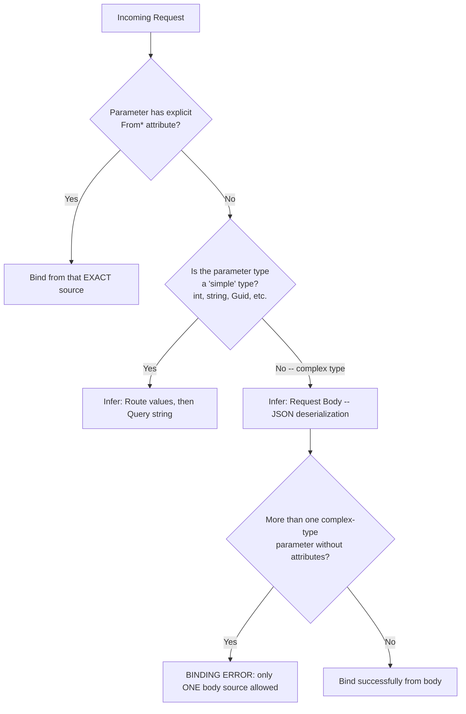
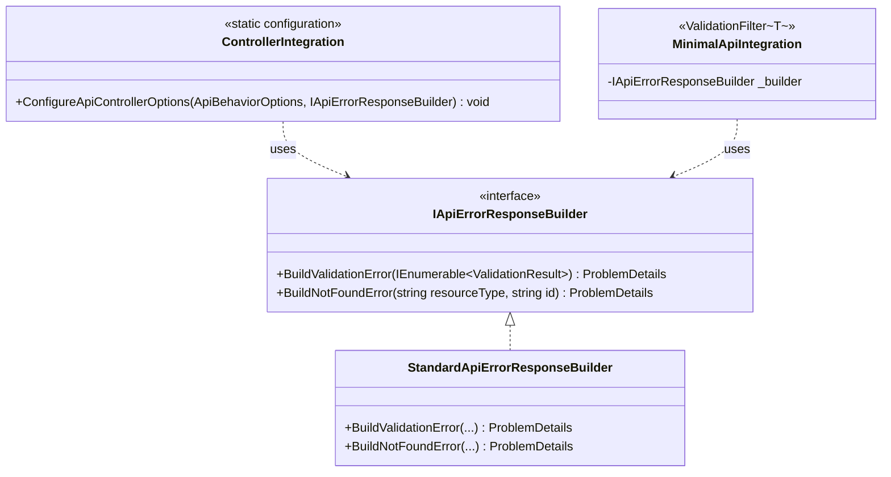
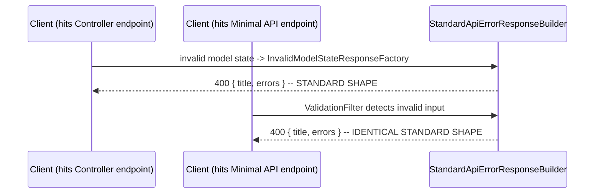

# Module 11 — ASP.NET Core: Minimal APIs vs Controllers, MVC Filters & Model Binding Internals

> Domain:.NET / ASP.NET Core | Level: Beginner → Expert | Prerequisite: [[01-Middleware-Pipeline-Request-Internals]] (endpoint routing, `GetEndpoint`), [[02-DI-Container-Internals]] (constructor injection mechanics), [[../01-CSharp/07-Records-Pattern-Matching-Immutability]] (records as DTOs)

---

## 1. Topic Description

### Definition

**Model binding** is the process that turns an HTTP request's raw parts — route values, query string, headers, body, form fields — into typed arguments for a handler, applying conversion and (in MVC) validation before your code runs. **Endpoint style** is the architectural choice of how endpoints are declared: MVC **controllers**, which bring convention-based routing, action filters and `[ApiController]`'s behavioural bundle; or **minimal APIs**, which declare endpoints as delegates with lighter infrastructure, endpoint filters and route groups. The two differ in more than syntax — binding-source inference rules and automatic validation behave differently, which is why moving an endpoint between them can silently change what it accepts.

### Core sub-concepts

- **Binding sources and inference** — route, query, header, body, form, services; `[From*]` attributes; how MVC and minimal APIs infer differently.
- **The single-body-parameter rule** — the request body is a forward-only stream consumed once.
- **`TryParse` / `BindAsync` conventions** — type-driven binding in minimal APIs, and how DI registration can change a parameter's binding source.
- **Complex type binding** — collections, dictionaries, nested objects, and depth/size limits.
- **Over-posting / mass assignment** — binding fields the caller should not control, and explicit request DTOs as the structural defence.
- **Validation** — data annotations and automatic `ModelState` 400s under `[ApiController]`, versus minimal APIs having no automatic validation at all.
- **`[ApiController]` conventions** — the bundle: automatic validation, source inference, attribute routing requirement, `ProblemDetails` shaping.
- **Result types** — `IActionResult`, `ActionResult<T>`, `IResult` and `TypedResults`, and their effect on OpenAPI inference and testability.
- **Route constraints vs validation** — constraints affect *matching*, so a failure yields 404 rather than 400.
- **Absent vs null** — why the binder cannot distinguish them, and what that means for PATCH semantics.
- **Culture sensitivity** — date and number parsing differing between environments; ISO-8601 and invariant parsing as contract decisions.
- **Serialisation configuration** — `System.Text.Json` options, source-generated contexts, and polymorphic deserialisation safety.
- **Cross-cutting placement** — action filters versus endpoint filters versus route groups.

### Where it fits

Binding is the first code that touches untrusted input, sitting between the middleware pipeline and your handler, and drawing types from the DI container. It is therefore a **trust boundary**, not plumbing. The endpoint-style decision propagates outward: it determines where cross-cutting concerns attach, how consistent a large API surface stays, what the OpenAPI document can infer, and — because minimal APIs plus source-generated serialisation are the AOT-friendly path — which deployment models remain available.

### Why it matters at scale

The costly failures here happen before any of your validation runs. Over-posting lets a crafted payload set `role`, `balance` or `tenantId` on a bound domain entity. Unbounded collection binding lets one request control how much memory the server allocates. Culture-dependent parsing means `03/04/2026` is March in one environment and April in another, which in a financial system is a real defect rather than a curiosity. And a team migrating endpoints from controllers to minimal APIs without noticing that automatic validation does not carry over has silently removed its entire input-validation layer — with every existing test still passing, because tests call the happy path.

### Common pitfalls / anti-patterns

- **Binding directly to a domain or persistence entity** — every field is settable by the caller, and the internal model becomes an unversioned public contract.
- **Assuming validation is automatic in minimal APIs** — data annotations are ignored unless you add an endpoint filter or explicit checks, so the endpoint accepts anything that parses.
- **Unbounded collection or nesting depth in a bound model** — a single small request becomes a memory and CPU amplification, needing no authentication if the endpoint is public.
- **Relying on culture-sensitive parsing for dates and decimals** — dev machines, containers and `InvariantGlobalization` settings differ, producing environment-dependent results.
- **Treating a nullable-value-type bind failure as "not supplied"** — a malformed value and an omitted value are indistinguishable, so bad input is silently defaulted.
- **Using a route constraint as validation** — a non-matching value yields 404 rather than a 400 explaining what was wrong, which misleads clients debugging an integration.
- **Naive PATCH by binding a partial payload to a full DTO** — absent fields arrive as null and overwrite data the caller never mentioned.

> Scope note: pipeline ordering and middleware belong to `01-Middleware-Pipeline-Request-Internals`; DI lifetimes and registration to `02-DI-Container-Internals`; authentication schemes and authorization policies to `04-Authentication-Authorization-Deep-Dive`. REST resource design, versioning and contract testing live in the `03-REST-APIs` folder.

---

## 2. Beginner (10 Q&A)


**Q1. Walk me through how a request becomes typed arguments to a handler.**
**A:** The framework selects an endpoint by routing, then determines a binding source for each parameter — explicitly from a `[From*]` attribute, or inferred: simple types from route values then query string, complex types from the body, registered services from DI. Values are converted using the type's parsing rules, and failures are recorded in `ModelState` for MVC or produce a 400 in minimal APIs. Only after that does your handler run. The key insight is that a substantial amount of untrusted-input processing happens before your first line of code, which is why binding is a security-relevant layer rather than plumbing.
*Follow-up: What happens when a value can't be converted — does the handler still run?*

**Q2. How does binding-source inference differ between controllers and minimal APIs?**
**A:** In MVC with `[ApiController]`, complex types are inferred as `[FromBody]` and simple types from route or query. Minimal APIs add a rule that changes behaviour meaningfully: if a type is registered in DI, it is bound from services rather than the body, and types with a `TryParse` or `BindAsync` method bind from route/query or take over binding entirely. That means registering a type in the container can silently change how a parameter binds — a genuinely surprising interaction worth knowing before it costs an afternoon.
*Follow-up: A parameter that used to bind from the body starts resolving from DI. What changed?*

**Q3. Why can only one parameter be bound from the body?**
**A:** The request body is a single forward-only stream that is consumed as it is read, so binding a second parameter from it would find nothing left. MVC throws at startup when it detects two `[FromBody]` parameters. The practical consequence is that an endpoint needing several pieces of body data takes one request object containing them, which is better design anyway because it gives the payload a name and a version you can evolve.
*Follow-up: How would you handle an endpoint that genuinely needs two independent payloads?*

**Q4. What is over-posting and how do you prevent it?**
**A:** It is when a client supplies fields you did not intend them to set — `IsAdmin`, `Balance`, `TenantId` — because the model being bound contains them and the binder populates whatever it finds. Prevention is structural: bind to a purpose-built request DTO containing only the fields a caller may set, and map to the domain or entity explicitly. Attribute-based exclusions and bind lists exist but are fragile, because the danger comes from someone adding a property later and nobody revisiting the attribute. This is one of the clearest cases where a dedicated DTO is not ceremony but a control.
*Follow-up: The team argues DTOs are duplication. What's your counter-argument?*

**Q5. How does validation work in controllers versus minimal APIs?**
**A:** With `[ApiController]`, MVC validates data annotations during binding and automatically returns a 400 with a `ProblemDetails` body when `ModelState` is invalid — so validation happens whether or not you wrote code for it. Minimal APIs have no such automatic step: annotations are ignored unless you add validation yourself, via an endpoint filter, a validation library, or explicit checks. Teams that move endpoints from controllers to minimal APIs and do not notice this have silently removed their input validation, which is one of the more consequential differences between the two models.
*Follow-up: How would you add consistent validation across all minimal API endpoints?*

**Q6. What does `[ApiController]` actually change?**
**A:** It enables automatic `ModelState` validation with a 400 response, binding-source inference (complex types from the body, and so on), a requirement that attribute routing is used, and `ProblemDetails` formatting for error responses. It is a bundle of conventions that make API controllers behave consistently, and removing it changes several behaviours at once — most notably, validation stops being automatic, which is the change most likely to go unnoticed. Knowing what it bundles matters when debugging why two controllers behave differently.
*Follow-up: You need a custom error body instead of `ProblemDetails`. How do you change that without losing the other conventions?*

**Q7. When would you choose minimal APIs over controllers?**
**A:** For small, focused services where the endpoint count is modest and the reduced ceremony is real value — internal APIs, webhook receivers, health and admin surfaces, and anything startup-sensitive, since minimal APIs avoid part of the MVC infrastructure. Controllers earn their keep on large API surfaces where conventions, shared filters, attribute-based cross-cutting concerns and a consistent structure matter more than brevity. The decision is about how much consistency the surface needs across how many people, not about performance, where the difference is small.
*Follow-up: You have 200 endpoints. Does the answer change, and why?*

**Q8. What is the difference between `IActionResult`, `ActionResult<T>` and `TypedResults`?**
**A:** `IActionResult` expresses any result but loses the response type, so tooling and OpenAPI cannot infer it. `ActionResult<T>` keeps the success type while still permitting other results, which is why it is the better default in controllers. `TypedResults` in minimal APIs returns concrete result types, giving compile-time checking and automatic OpenAPI metadata, and it makes handlers unit-testable without inspecting a generic result object. The general point is that a strongly-typed result is worth preferring because it makes the contract visible to both the compiler and the documentation.
*Follow-up: How do you express an endpoint that returns 200, 404 or 409 with typed results?*

**Q9. How do route constraints affect binding and matching?**
**A:** Constraints such as `{id:int}` or `{code:regex(...)}` are part of *matching*, not validation — a non-matching value means the route does not match, so the client gets a 404 rather than a 400. That distinction matters for API semantics: a malformed identifier reported as "not found" is misleading and makes client debugging harder. Constraints are useful for disambiguating overlapping routes, and less appropriate as a substitute for validation, which should produce a proper error explaining what was wrong.
*Follow-up: Two routes overlap and the wrong one is selected. How do you reason about precedence?*

**Q10. What happens when a required value fails to parse?**
**A:** In MVC the failure is recorded in `ModelState` and, with `[ApiController]`, produces an automatic 400 before the action runs. Without `[ApiController]` the action *does* run with a default value and an invalid `ModelState`, which is exactly how unchecked handlers end up processing zeros and nulls as if they were supplied. In minimal APIs a failed parse of a required parameter returns 400 automatically, but an optional or nullable parameter binds to null and looks identical to "not provided." That ambiguity between "absent" and "unparseable" is worth designing around explicitly.
*Follow-up: How do you distinguish "field not supplied" from "field supplied as null" in a PATCH request?*

---

## 3. Intermediate (10 Q&A)


**Q1. A date parses correctly in dev and incorrectly in production. What's your hypothesis?**
**A:** Culture. Binding uses culture-sensitive conversion for some types, so `03/04/2026` is March or April depending on the server's culture, and a decimal separator differs between locales — a dev machine and a container image frequently differ, and `InvariantGlobalization` in a container changes behaviour again. The fix is to make wire formats culture-invariant by contract: ISO-8601 for dates, invariant parsing for numbers, and explicit `DateTimeOffset` rather than `DateTime` so offsets are unambiguous. I would also pin culture explicitly at startup rather than relying on the host, so behaviour is identical everywhere.
*Follow-up: Why is `DateTimeOffset` better than `DateTime` at an API boundary?*

**Q2. How would you implement a custom binder, and when is that the right answer?**
**A:** The right answer is usually *not* a custom binder — a `TryParse` or `BindAsync` static method on the type handles most cases in minimal APIs, and a simple type converter handles them in MVC, both with far less machinery. A full custom binder earns its place when binding requires access to services or multiple sources — building a composite object from a header plus a route value plus a claim, for example. The thing to be careful about is that custom binders run on untrusted input outside your normal validation, so they need to fail cleanly with a useful error rather than throwing, and they need tests for malformed input specifically.
*Follow-up: Your custom binder needs a scoped service. How do you get it, and what's the lifetime risk?*

**Q3. What are the risks of binding collections, and how do you bound them?**
**A:** An unbounded collection parameter lets a client control how much memory and CPU one request consumes — a query string or body with a hundred thousand elements produces a large allocation and potentially a large downstream query. The defences are a maximum request-body size, a configured limit on model-binding collection size and complexity, and explicit validation of collection length in the contract with a clear error. I would also consider whether the endpoint should accept a collection at all, since a bulk operation usually deserves an explicit batch contract with documented limits and its own throttling rather than an incidental array parameter.
*Follow-up: A legitimate client needs to submit 50,000 items. How do you design for that?*

**Q4. How do you keep error responses consistent when a service mixes controllers and minimal APIs?**
**A:** By making the error contract a pipeline concern rather than an endpoint one: central exception-handling middleware producing the standard body, plus explicit configuration so `[ApiController]`'s automatic 400 and minimal APIs' validation failures produce the same shape. Left alone, the two models produce visibly different bodies for the same class of failure, and clients then special-case per endpoint, which is a contract defect. I would encode the shared shape in the platform package and cover it with tests asserting the body for each failure category, since this is exactly the kind of consistency that erodes as endpoints are added.
*Follow-up: You need to change the error contract for new endpoints only. How do you do that without breaking existing clients?*

**Q5. Where do you put cross-cutting concerns in a minimal-API codebase?**
**A:** Endpoint filters for per-endpoint concerns such as validation, authorization detail and result shaping; route-group configuration for concerns that apply to a set of endpoints, which is the closest equivalent to a controller-level filter; and middleware for anything that must apply to every request. The trap in minimal APIs is that without controllers as a natural grouping, cross-cutting behaviour drifts into individual handlers and gets applied inconsistently. I would insist on route groups as the organising unit from the start, so there is always a level between "one endpoint" and "the whole app" to attach behaviour to.
*Follow-up: How would you enforce that every endpoint in a group has validation applied?*

**Q6. What are the trade-offs of source-generated JSON serialisation?**
**A:** It removes runtime reflection, so it is faster, allocates less, starts quicker and is required for NativeAOT and trimming. The costs are that every serialisable type must be declared in a context class, polymorphic and dynamic scenarios need explicit configuration, and there are runtime features it does not support — so an unusual payload shape can require rework. For a service on a modern .NET version with a stable set of contract types, it is a good default; for one relying on dynamic or polymorphic payloads, the reflection-based serialiser is still simpler. I would decide this early, because retrofitting it after a codebase leans on dynamic serialisation is genuinely painful.
*Follow-up: You need polymorphic serialisation of a domain event hierarchy. How does that work with source generation?*

**Q7. How do you test binding and validation behaviour effectively?**
**A:** Through the HTTP surface with `WebApplicationFactory`, not by calling the handler directly — because binding, inference, validation and the error contract are exactly what a direct call bypasses. I would test the malformed cases specifically: missing required fields, wrong types, extra unexpected fields, null versus absent, boundary sizes, and culture-sensitive values. Those tests are also the regression net for the `[ApiController]`-versus-minimal-API differences, which is where a refactor silently changes behaviour. Testing only the happy path through the handler is the pattern that lets an entire validation layer be removed without a single test failing.
*Follow-up: How would you catch the case where a new property is added to a request DTO and becomes over-postable?*

**Q8. How do you handle PATCH semantics given the binder can't distinguish absent from null?**
**A:** Either use JSON Patch, which expresses operations explicitly, or model the payload so absence is representable — an `Optional<T>`-style wrapper or a JSON document you inspect for property presence. Binding a normal DTO to a partial payload gives nulls for everything absent, so a naive implementation wipes fields the caller never mentioned, which is a data-loss bug that looks like a working feature. Whichever approach is chosen, I would make it consistent across the API and documented in the contract, since PATCH semantics vary widely and clients will otherwise guess.
*Follow-up: JSON Patch is expressive but hard for clients. What would you pick for a public API and why?*

**Q9. What does binding a domain entity directly cost you, beyond over-posting?**
**A:** It couples your public contract to your internal model, so every domain refactor becomes a potential breaking change for clients, and every field added to the entity is exposed by default. It also drags persistence concerns into the API — navigation properties serialised into cycles, lazy-loading triggered during serialisation, and identity fields the client should never see. The extra DTO and mapping code is real cost, but it buys the ability to change the internals without coordinating with consumers, which for anything with external clients is the difference between a refactor and a migration project.
*Follow-up: For an internal API with one consumer team, does that calculus change?*

**Q10. How would you migrate a large controller-based API to minimal APIs, or decide not to?**
**A:** I would start by asking what problem it solves, because for a large existing surface the answer is often "none that justifies the risk." Minimal APIs win on startup and ceremony, not on throughput in any way most services would notice. If there is a real driver — AOT, cold start, a genuinely simpler service — I would migrate incrementally by route group, keeping both models running side by side, and pay particular attention to the behaviours that do not carry over: automatic validation, `ProblemDetails` shaping, action filters, and convention-based routing. Each of those needs an explicit replacement before the first endpoint moves, or the migration silently removes protections.
*Follow-up: You move one endpoint and its validation disappears. How would you have caught that in CI?*

---

## 4. Expert / Architect (10 Q&A)


**Q1. How do you set an endpoint-style standard for an organisation with many services?**
**A:** I would define the decision rather than mandate one style: controllers as the default for services with a substantial public API surface where convention and consistency dominate, minimal APIs for small services, internal utilities and startup-sensitive workloads. What must be standardised regardless of style is the things clients experience — the error contract, validation behaviour, versioning, pagination, authentication and the OpenAPI output — because those are the parts that hurt when they differ. I would ship both as templates with the platform package pre-wired, so the standard is inherited rather than remembered, and I would explicitly discourage mixing styles within one service, since that is where inconsistency actually appears.
*Follow-up: A team wants to mix both in one service for a specific reason. What would make you agree?*

**Q2. How do you treat the binding layer as a security boundary?**
**A:** By recognising that it processes untrusted input before any of your code runs, and constraining it accordingly: request size limits, collection and depth limits on model binding and JSON, explicit request DTOs so nothing binds by accident, and no binding to types that carry authorisation-relevant fields. Any field determining tenancy, ownership or privilege must come from the authenticated principal rather than the payload — accepting a `TenantId` from the body is the single most common shape of a cross-tenant vulnerability. I would also make deserialisation configuration explicit and reviewed, since permissive settings such as unrestricted polymorphic type handling have a long history of turning into remote code execution.
*Follow-up: A legitimate admin endpoint needs to act on behalf of another tenant. How do you design that safely?*

**Q3. How do you keep an API's contract stable while the internal model evolves?**
**A:** By keeping them genuinely separate types with an explicit mapping, and by testing the contract rather than the model — snapshot or schema tests that fail when the serialised shape changes, so a domain rename cannot silently break clients. Versioning strategy then applies to the contract types only, so internal refactors are free and contract changes are deliberate. I would also generate the OpenAPI document in CI and diff it against the previous version, treating a breaking diff as a build failure requiring an explicit version decision. That single control catches most accidental contract breaks, which are far more common than intentional ones.
*Follow-up: How do you classify a diff as breaking versus non-breaking automatically?*

**Q4. What are the performance implications of the binding and serialisation layer at scale, and what would you actually change?**
**A:** For most services, serialisation is a measurable but minor cost dominated by I/O; it becomes significant with large payloads, high request rates, or deeply nested models. The changes that actually pay are reducing payload size (projection, paging, sparse fieldsets), source-generated serialisation to remove reflection, avoiding double serialisation through intermediate strings, and streaming large responses rather than buffering. What rarely pays is micro-optimising the binder itself. I would also look at whether large payloads should be an API at all — a bulk export is usually better served by a file and a signed URL than by a synchronous JSON response.
*Follow-up: Responses average 2 MB of JSON. What's your first move?*

**Q5. How do you handle API surface consistency when dozens of engineers add endpoints over years?**
**A:** Consistency has to be produced by tooling, not by review, because review attention decays. Concretely: a shared endpoint template and route-group conventions, OpenAPI generated in CI with linting rules for naming, status codes, pagination and error shapes, and contract tests asserting the standard behaviours. I would treat the linter's rules as the actual API standard document, since a rule that runs is worth more than a wiki page that does not. Where a team must deviate, an explicit suppression with a reason makes the exception visible rather than invisible, which is the property that keeps a standard alive over years.
*Follow-up: The linter has 300 suppressions after two years. What does that tell you and what do you do?*

**Q6. How does the choice between controllers and minimal APIs interact with AOT and cold-start-sensitive deployments?**
**A:** Minimal APIs plus source-generated serialisation are the AOT-friendly path, because MVC's convention discovery and the reflection-based serialiser both rely on capabilities AOT removes. For a scale-to-zero or per-request-billed workload, the startup difference is a genuine cost line rather than a benchmark curiosity. So if AOT or cold start is a strategic requirement, the endpoint-style decision is effectively made for you, and it should be made *before* a large surface exists rather than discovered during a migration. I would state that constraint explicitly in the architecture decision, along with the follow-on constraints it imposes on serialisation, DI registration and reflection use.
*Follow-up: An existing controller-based service must move to AOT. How do you scope that work?*

**Q7. How do you approach validation architecture across a large API?**
**A:** Layered and explicit: structural validation at the boundary (types, required fields, ranges, sizes) applied uniformly by the framework or a filter, and business-rule validation in the domain where the rules and the data actually live. The failure mode I would design against is business rules leaking into DTO annotations, where they get duplicated, drift, and are unenforced on any path that does not go through the API. The boundary validation should produce a consistent, machine-readable error body listing all failures rather than the first, because clients need to display them together. I would also treat validation as part of the contract and version it accordingly, since tightening a rule breaks existing callers.
*Follow-up: A rule must be enforced both at the API and in a message consumer. Where does it live?*

**Q8. What would you require before allowing polymorphic deserialisation of client input?**
**A:** A closed, explicitly declared set of permitted types — never type resolution driven by a value in the payload against arbitrary types, which is the classic deserialisation RCE pattern that has affected every major platform. `System.Text.Json`'s polymorphism support with declared derived types and discriminators is acceptable because the set is fixed at compile time. I would require a threat-model note on any such endpoint, tests for unexpected discriminators, and a review by someone outside the team. If a design needs open-ended polymorphism from untrusted input, I would treat that as a design problem to solve rather than a capability to enable.
*Follow-up: A legacy client sends a `$type` field expected by an older serialiser. How do you handle the migration safely?*

**Q9. How would you evaluate a proposal to generate endpoints from a schema or specification rather than writing them?**
**A:** I would look at where the source of truth ends up and what happens when generation is insufficient. Spec-first with generated contracts works well and gives you consistency, client SDKs and documentation for free — the risk is the generated code becoming a layer nobody can modify when a genuine exception is needed, and a toolchain the team must own. Generating whole endpoints including behaviour is a bigger commitment and tends to fail at the first requirement the generator does not anticipate. My position is generally to generate contracts and clients, hand-write behaviour, and treat the specification as the reviewed artefact — which also makes API changes visible in a diff that non-engineers can read.
*Follow-up: The generator's output differs subtly from what the team hand-wrote before. How do you manage that transition?*

**Q10. What signals in an API codebase tell you it will be expensive to maintain?**
**A:** Domain entities used as request and response types; validation logic duplicated in annotations, handlers and the domain; error shapes that differ by endpoint; no versioning strategy with clients depending on undocumented behaviour; endpoints that return different structures for the same resource depending on the caller; and binding that accepts more than the operation needs. Each of these individually is survivable; together they mean every internal change risks an external break, so the team slows down to protect clients they cannot see. The fix is not a rewrite but a boundary — introduce explicit contract types and contract tests, then refactor freely behind them.
*Follow-up: You inherit that codebase with 150 endpoints and no contract tests. What's your first quarter's plan?*

---

## 5. Reference Material

> Retained from the original module: deep-dive internals, diagrams, production examples, exercises, system/low-level design, debugging walkthroughs and the Principal Engineer perspective.

### 1. Fundamentals

#### What are Minimal APIs and Controllers?
Both are ways of defining **endpoints** in ASP.NET Core — code that handles a specific route/HTTP-method combination. **Controllers** (`[ApiController] class OrdersController: ControllerBase`) are the classic, convention-heavy MVC model: a class with action methods, attribute-based routing, automatic model binding/validation, and a rich **filter pipeline** (`IActionFilter`, `IExceptionFilter`, etc.) wrapping each action. **Minimal APIs** (`app.MapGet("/orders/{id}", (int id, IOrderService svc) =>...)`) express the same endpoint concept as a lambda/method delegate registered directly against the routing system, with a leaner, more explicit, filter-based (`.AddEndpointFilter(...)`) extensibility model and no MVC-specific conventions layered on top.

#### Why do both exist?
Controllers (and the full MVC framework) predate Minimal APIs by many years and were designed for **full web applications** (server-rendered views, complex model binding scenarios, a rich, convention-driven filter/pipeline system) — genuinely valuable for large, convention-heavy applications, but with real overhead (reflection-based action invocation, a more complex object-graph per request, more implicit "magic" that must be learned) for **simple, high-throughput JSON APIs** that don't need any of that. Minimal APIs (ASP.NET Core 6+) were introduced specifically to let a simple HTTP API be expressed with **less code and less implicit machinery** — directly competitive with lightweight frameworks in other ecosystems (Express.js, Flask) for the "just handle a few JSON endpoints fast" use case, while still being built on the exact same underlying endpoint-routing infrastructure as Controllers.

#### When does this matter?
- **Choosing between them** for a new service is now a routine, real architectural decision at nearly every ASP.NET Core shop — understanding the actual, substantive trade-offs (not just "Minimal APIs are newer/faster") is a common Staff/Principal-level discussion point.
- **Understanding model binding internals** matters whenever debugging "why didn't my request body/query string bind correctly" — a very common, often subtly-caused class of bug.
- **Understanding the MVC filter pipeline** (distinct from, and nested inside, the middleware pipeline) matters for correctly implementing cross-cutting concerns scoped to *actions* specifically (not every request), like model-state validation, response caching per-action, or custom authorization logic beyond what `[Authorize]` alone expresses.

#### How does it work (30,000-ft view)?

```csharp
// Minimal API:
app.MapPost("/orders", (CreateOrderRequest request, IOrderService service) =>
    {
        var order = service.CreateOrder(request);
        return Results.Created($"/orders/{order.Id}", order);
});

// Controller equivalent:
[ApiController]
[Route("orders")]
public class OrdersController: ControllerBase
{
    private readonly IOrderService _service;
    public OrdersController(IOrderService service) => _service = service;

    [HttpPost]
    public IActionResult Create(CreateOrderRequest request)
    {
        var order = _service.CreateOrder(request);
        return CreatedAtAction(nameof(GetById), new { id = order.Id }, order);
    }
}
```

Mental model for interviews: **"Both compile down to the same `Endpoint`/`RequestDelegate` infrastructure at the routing layer. Controllers add a reflection-driven action-invocation pipeline with a rich filter system and implicit model-binding/validation conventions on top; Minimal APIs are a thinner, more explicit layer with less implicit behavior and a simpler, delegate-based filter model."**

### 2. Deep Dive

#### 2.1 The MVC Filter Pipeline — a Second, Nested Pipeline Inside the Endpoint

Controllers get an additional **filter pipeline**, distinct from (and nested *inside*) the middleware pipeline — it runs specifically around a matched controller action's execution, in a fixed, documented order:

1. **Authorization filters** (`IAuthorizationFilter`) — run first, can short-circuit before model binding even happens.
2. **Resource filters** (`IResourceFilter`) — run before model binding (`OnResourceExecuting`) and after the result is produced (`OnResourceExecuted`) — the only filter type that wraps *model binding itself*.
3. **Model binding** happens here (not a filter type itself, but occurs at this specific point in the sequence).
4. **Action filters** (`IActionFilter`) — run immediately before (`OnActionExecuting`) and after (`OnActionExecuted`) the action method body itself executes; this is where `[ApiController]`'s automatic model-state validation short-circuit is implemented.
5. **Exception filters** (`IExceptionFilter`) — run only if an exception propagates out of the action/action filters, before the exception would otherwise propagate up to ASP.NET Core's ordinary middleware-level exception handling (/9).
6. **Result filters** (`IResultFilter`) — run immediately before/after the action's `IActionResult` is actually executed (i.e., before/after the response is actually written).

Minimal APIs have a deliberately **simpler, single filter type**: `IEndpointFilter`, composed via `.AddEndpointFilter(...)`, which wraps the entire endpoint delegate's execution in one unified before/after model (conceptually closer to ordinary middleware, but scoped to one specific endpoint rather than the whole pipeline) — trading the MVC filter pipeline's fine-grained, many-stage extensibility for a simpler, single mental model.

#### 2.2 Model Binding — Precisely How Request Data Becomes Method Parameters

**Model binding** is the process of populating an action method's/endpoint delegate's parameters from the incoming request — route values, query string, headers, form data, and the JSON request body. The binding **source** for each parameter is determined by:
- **Explicit attributes**: `[FromBody]`, `[FromQuery]`, `[FromRoute]`, `[FromHeader]`, `[FromForm]`, `[FromServices]` (this last one requests DI resolution instead of binding from the HTTP request at all).
- **Convention-based inference** (when no attribute is present): simple types (`string`, `int`, `Guid`, etc.) are inferred as coming from the **route** first, then the **query string**; complex types (a class/record with multiple properties) are inferred as coming from the **request body** (for Controllers with `[ApiController]`, this inference is a well-defined, documented convention; Minimal APIs apply a similar but not identical set of inference rules — a genuinely common source of "why isn't this binding the way I expected" confusion when a team is used to one model and switches to the other).
- **Only one parameter per request may be bound `[FromBody]`** — the request body stream can only be read once (§Advanced Q3's buffering discussion notwithstanding), so exactly one complex-type parameter can be inferred/attributed as the body source; attempting to bind multiple parameters from the body produces a binding error.

#### 2.3 `[ApiController]` — What the Attribute Actually Turns On

`[ApiController]` (applied to a Controller class) enables several **conventions simultaneously**, each independently significant:
- **Automatic HTTP 400 response on invalid `ModelState`**: if model binding/validation (via Data Annotations, `[Required]`/`[Range]`/etc., or `IValidatableObject`) fails, an `IActionFilter`-based convention automatically short-circuits the action **before it ever runs**, returning a `400 Bad Request` with a structured `ValidationProblemDetails` body — the action method body can assume `ModelState.IsValid` is always true if it executes at all, since invalid requests never reach it.
- **Binding source inference** (the convention-based defaults) — without `[ApiController]`, complex-type parameters default to a different, less API-friendly inference (historically defaulting toward form binding in some scenarios, a holdover from MVC's original server-rendered-views design center).
- **Multipart/form-data inference**, **problem-details for non-success status codes**, and **attribute-routing requirement** (a `[ApiController]`-decorated class *requires* attribute routing — conventional/URL-pattern-based routing isn't supported for API controllers) are additional, smaller conventions bundled into the same attribute.

**Interview-critical fact**: **all of `[ApiController]`'s behavior is implemented via ordinary filters and conventions** — it is not special-cased "magic" in the framework's core; a candidate demonstrating awareness that `[ApiController]`'s automatic-400 behavior is literally just a built-in `IActionFilter` (`ModelStateInvalidFilter`, internally) shows a meaningfully deeper understanding than one who treats it as an opaque, unexplainable framework feature.

#### 2.4 Minimal API Filters (`IEndpointFilter`) — Mechanics

```csharp
app.MapPost("/orders", CreateOrder)
.AddEndpointFilter(async (context, next) =>
    {
        // before
        var result = await next(context);
        // after
        return result;
});
```
`IEndpointFilter`'s `InvokeAsync(EndpointFilterInvocationContext context, EndpointFilterDelegate next)` is structurally almost identical to ordinary middleware (the delegate-chain pattern) — the same "onion," the same short-circuit-by-not-calling-`next` mechanic — but scoped specifically to **one endpoint's** filter chain rather than the entire application's middleware pipeline, and with access to strongly-typed argument binding via `context.GetArgument<T>(index)`. This is a deliberate design simplification relative to the MVC filter pipeline's six distinct filter-type stages — Minimal APIs trade fine-grained filter-stage distinctions for a single, simpler, uniformly-composable filter concept.

#### 2.5 `IActionResult`/`Results` — the Response-Construction Abstraction

Both models use a **result abstraction** rather than writing directly to the response — Controllers return `IActionResult` (`Ok`, `NotFound`, `CreatedAtAction`, `BadRequest`); Minimal APIs return `IResult` (`Results.Ok`, `Results.NotFound`, `Results.Created`), or (since C# 11's covariant return support combined with newer Minimal API type-inference,.NET 7+) can return `TypedResults.Ok(...)` for compile-time-checked, strongly-typed results that also correctly populate OpenAPI/Swagger metadata without needing separate `[ProducesResponseType]` attributes. This abstraction layer is precisely what makes **unit testing an action/endpoint's logic** practical without a real HTTP pipeline — asserting "this method returned a `NotFoundResult`" is a plain, synchronous object-equality-style check, not something requiring an actual HTTP round-trip.

#### 2.6 Endpoint Filter Ordering vs MVC Filter Ordering — a Genuine, Non-Obvious Difference

MVC filters have a **fixed stage order** (the six-stage sequence) regardless of registration order *within* the same stage (multiple `IActionFilter`s registered on the same action run in a documented, but sometimes surprising, order combining global/controller/action-level registration scope with explicit `Order` property values) — genuinely more complex to reason about than Minimal API endpoint filters, which simply nest in the **exact order `.AddEndpointFilter(...)` was called**, mirroring ordinary middleware's simplicity. This is a real, substantive complexity difference between the two models, not just a surface-syntax difference — worth naming explicitly when discussing trade-offs (§Advanced Q on this exact point).

### 3. Visual Architecture

#### Nested Pipelines (ASCII)

```
Middleware Pipeline
┌───────────────────────────────────────────────────────────────────┐
│ ExceptionHandler → ForwardedHeaders → Routing → Auth → AuthZ → │
│ │
│ ┌─────────────────────────────────────────────────────────────┐ │
│ │ MVC FILTER PIPELINE (Controllers only) │ │
│ │ Authorization Filters │ │
│ │ Resource Filters (wraps model binding) │ │
│ │ [ MODEL BINDING happens here ] │ │
│ │ Action Filters (wraps the action method body) │ │
│ │ [ ACTION METHOD BODY ] │ │
│ │ Exception Filters (only if action/filters throw) │ │
│ │ Result Filters (wraps IActionResult execution) │ │
│ └─────────────────────────────────────────────────────────────┘ │
│ │
│ OR, for Minimal APIs: │
│ ┌─────────────────────────────────────────────────────────────┐ │
│ │ ENDPOINT FILTER CHAIN (single, uniform onion, no stages) │ │
│ │ AddEndpointFilter #1 → AddEndpointFilter #2 → [ HANDLER ] │ │
│ └─────────────────────────────────────────────────────────────┘ │
└───────────────────────────────────────────────────────────────────┘
```

#### Model Binding Source Resolution


```mermaid
flowchart TD
 A[Incoming Request] --> B{Parameter has explicit<br/>From* attribute?}
 B -->|Yes| C[Bind from that EXACT source]
 B -->|No| D{Is the parameter type<br/>a 'simple' type?<br/>int, string, Guid, etc.}
 D -->|Yes| E[Infer: Route values, then Query string]
 D -->|No -- complex type| F[Infer: Request Body -- JSON deserialization]
 F --> G{More than one complex-type<br/>parameter without attributes?}
 G -->|Yes| H[BINDING ERROR: only ONE body source allowed]
 G -->|No| I[Bind successfully from body]
```

### 4. Production Example

#### Scenario: API migration from Controllers to Minimal APIs — a silent model-binding regression

**Problem**: A team migrated a moderately-sized internal API from Controllers to Minimal APIs (motivated by measured startup-time and per-request-allocation improvements,/3's discipline applied to this specific architectural choice) and, shortly after deployment, discovered that a `GET /reports?startDate=2024-01-01&customerId=123&includeArchived=true` endpoint was silently ignoring the `includeArchived` query parameter — always behaving as if it were `false`, regardless of what the client actually sent.

**Investigation**:
- The original Controller action had: `public IActionResult GetReports(ReportFilterDto filter)` — a single complex-type parameter (`ReportFilterDto` with `StartDate`, `CustomerId`, `IncludeArchived` properties), which, **without** any explicit `[FromQuery]` attribute and **without** `[ApiController]`'s body-inference convention applying here (since query-string-bindable complex types have their own, subtly different inference history in classic MVC model binding, especially for `GET` requests where a body wouldn't normally be expected), had — thanks to years-old, somewhat obscure default MVC model-binding conventions — actually been binding `ReportFilterDto`'s properties from the **query string**, property-by-property, correctly.
- The direct Minimal API "equivalent" (`app.MapGet("/reports", (ReportFilterDto filter) =>...)`) applies **Minimal APIs' own binding-inference rules**, which (as of the.NET version in use at the time) treated a complex-type parameter with **no explicit attribute** as a **request body** binding candidate by default for Minimal APIs specifically — since `GET` requests conventionally have no body, the `ReportFilterDto` parameter silently bound to an **empty/default-initialized instance** (no error was thrown; every property simply took its type's default value), which is precisely why `IncludeArchived` always appeared `false` (its default) — the query string was never consulted at all under Minimal API's differing inference rules for this exact scenario.

**Architecture fix**:
- Added explicit `[AsParameters]` (a Minimal-API-specific attribute allowing a complex type's properties to each be bound individually from route/query, mirroring what the original Controller's implicit convention had been doing) to the `ReportFilterDto filter` parameter — `app.MapGet("/reports", ([AsParameters] ReportFilterDto filter) =>...)` — restoring the intended per-property query-string binding behavior explicitly rather than relying on inference.
- Established a team-wide migration checklist explicitly calling out "verify complex-type parameter binding source for every migrated GET/query-string-bound endpoint" as a mandatory verification step for any future Controller-to-Minimal-API migration, rather than assuming behavioral equivalence.
- Added integration tests (via `WebApplicationFactory<T>`) specifically exercising query-string-bound complex-type scenarios across the migrated API surface, to catch this exact regression class automatically for any future refactor.

**Trade-offs**: `[AsParameters]` is Minimal-API-specific syntax with no Controller equivalent needed (since Controllers' implicit convention already did this) — a small, explicit piece of "translation friction" the team accepted as the cost of an otherwise worthwhile migration, documenting it clearly for future engineers unfamiliar with the two models' differing default inference behavior.

**Lessons learned**:
1. Minimal APIs and Controllers' model-binding **inference conventions are genuinely different**, not just syntactically different expressions of the same rules — assuming behavioral equivalence during a migration is a real, demonstrated risk, not a theoretical concern.
2. This class of bug is especially dangerous because it's **silent** — no exception, no error, just a quietly wrong default value, exactly the "invisible until someone notices business logic behaving wrong" pattern this course has repeatedly flagged as the most dangerous bug category (directly echoing the client-side-evaluation trap and the masked-exception incident in shape, if not mechanism).
3. Integration tests exercising actual HTTP request/response behavior (not just unit tests of isolated handler logic) are specifically necessary to catch model-binding-inference regressions, since a unit test calling the handler method directly with manually-constructed parameters would never exercise the binding-inference layer at all.

### 11. Coding Exercises

#### Easy — Convert a Controller action to a Minimal API endpoint, preserving explicit binding
**Problem**: Convert this Controller action to a Minimal API, being explicit about binding sources to avoid the inference-mismatch risk.
```csharp
[HttpGet]
public IActionResult Search([FromQuery] string term, [FromQuery] int page = 1) =>...
```
**Solution**:
```csharp
    app.MapGet("/search", ([FromQuery] string term, [FromQuery] int page = 1, IOrderService service) =>
    {
        var results = service.Search(term, page);
        return TypedResults.Ok(results);
});
```
**Discussion**: For simple types (`string`, `int`) bound from the query string, Minimal APIs' convention-based inference would actually have inferred the same binding source correctly even without the explicit `[FromQuery]` attributes — this exercise demonstrates that explicit attribution, while a good defensive habit especially valuable during migrations, is not strictly *required* for simple-type parameters the way it effectively is for complex-type parameters (the actual failure mode) — an important, precise distinction to draw rather than over-generalizing "always use explicit attributes everywhere" without understanding exactly which binding scenarios are actually inference-risky.

#### Medium — Implement a `MapGroup`-based shared validation filter for a Minimal API route group
**Problem**: Apply a shared validation filter across an entire group of order-related endpoints without repeating registration on each one.
```csharp
var orders = app.MapGroup("/orders")
.AddEndpointFilterFactory((factoryContext, next) =>
    {
        // Inspect the endpoint's parameter types ONCE, at startup, to build an efficient
        // reusable validation delegate specific to THIS endpoint's actual parameter shape --
        // avoiding repeated reflection on every single request.
        var validatableParamIndex = Array.FindIndex(
            factoryContext.MethodInfo.GetParameters,
                p => typeof(IValidatableObject).IsAssignableFrom(p.ParameterType) || HasValidationAttributes(p.ParameterType));

        if (validatableParamIndex < 0)
            return next; // no validatable parameter on this endpoint -- skip the filter entirely, zero overhead

        return async context =>
        {
            var arg = context.GetArgument<object>(validatableParamIndex);
            var results = new List<ValidationResult>;
            if (arg is not null &&!Validator.TryValidateObject(arg, new ValidationContext(arg), results, true))
                return Results.ValidationProblem(results.ToDictionary(r => r.MemberNames.FirstOrDefault?? "", r => new[] { r.ErrorMessage?? "" }));
            return await next(context);
        };
});

orders.MapPost("/", CreateOrder);
orders.MapPut("/{id}", UpdateOrder);
orders.MapGet("/{id}", GetOrder); // has no validatable body parameter -- filter factory correctly skips it above
```
**Discussion**: `AddEndpointFilterFactory` (rather than the simpler `AddEndpointFilter`) is used deliberately here — it runs its setup logic **once per endpoint, at application startup** (inspecting each endpoint's specific parameter shape via `factoryContext.MethodInfo`), producing a specialized filter delegate for that endpoint, rather than performing that same inspection work redundantly on **every single request**. This is a direct, concrete performance-optimization pattern specific to the Minimal API filter model, and precisely why `GetOrder` (with no validatable body parameter) correctly pays **zero** validation-filter overhead at request time — the factory determined at startup that this endpoint needs no validation logic at all and returned `next` unwrapped.

#### Hard — Diagnose and fix the mass-assignment vulnerability
**Problem**: Fix this endpoint, which binds directly to an EF Core entity.
```csharp
// VULNERABLE: binds the request body directly onto the persistence entity
app.MapPost("/users/register", async (User user, AppDbContext db) =>
    {
        db.Users.Add(user); // a malicious client could include "isAdmin": true in the JSON body!
        await db.SaveChangesAsync;
        return TypedResults.Created($"/users/{user.Id}", user);
});

public class User // EF Core entity
{
    public int Id { get; set; }
    public string Email { get; set; } = "";
    public string PasswordHash { get; set; } = "";
    public bool IsAdmin { get; set; } // NEVER should be client-settable
}
```
**Solution**:
```csharp
public record RegisterUserRequest(string Email, string Password); // DTO: ONLY the fields a client should ever supply

app.MapPost("/users/register", async (RegisterUserRequest request, IPasswordHasher hasher, AppDbContext db) =>
    {
        var user = new User
        {
            Email = request.Email,
                PasswordHash = hasher.Hash(request.Password),
                IsAdmin = false // explicitly, deliberately set server-side -- NEVER derived from client input
        };
        db.Users.Add(user);
        await db.SaveChangesAsync;
        return TypedResults.Created($"/users/{user.Id}", new { user.Id, user.Email }); // response DTO too -- never leak PasswordHash
});
```
**Discussion**: Note the fix addresses **two** related, but distinct, concerns: (1) the mass-assignment vulnerability itself (input DTO, not entity, as the bound type), and (2) an equally important but easy-to-overlook **output**-side data-exposure risk (returning the raw `user` entity directly would leak `PasswordHash` in the response body) — a dedicated, narrow response projection (`new { user.Id, user.Email }`, or a proper response DTO/record) is needed on the way *out* for exactly the same "don't expose internal entity shape directly to clients" reasoning applied on the way *in*.

#### Expert — Implement a request/response contract-consistency test harness (Advanced Q5)
**Problem**: Implement the contract-consistency test harness comparing a legacy Controller endpoint against its Minimal API migration target, catching binding-inference discrepancies automatically.
```csharp
public class BindingConsistencyTests: IClassFixture<WebApplicationFactory<ControllerStartup>>, IClassFixture<WebApplicationFactory<MinimalApiStartup>>
{
    private readonly HttpClient _controllerClient;
    private readonly HttpClient _minimalApiClient;

    public BindingConsistencyTests(WebApplicationFactory<ControllerStartup> controllerFactory, WebApplicationFactory<MinimalApiStartup> minimalFactory)
    {
        _controllerClient = controllerFactory.CreateClient;
        _minimalApiClient = minimalFactory.CreateClient;
    }

    public static IEnumerable<object[]> RequestMatrix
    {
        // A representative matrix: every field present; each optional field individually omitted
        // boundary values; unexpected extra fields -- exactly the scenarios most likely to expose
        // an inference discrepancy, per this module's production incident.
        yield return new object[] { "?startDate=2024-01-01&customerId=123&includeArchived=true" };
        yield return new object[] { "?startDate=2024-01-01&customerId=123" }; // includeArchived OMITTED
        yield return new object[] { "?customerId=123&includeArchived=true" }; // startDate OMITTED
        yield return new object[] { "?startDate=2024-01-01&customerId=123&includeArchived=true&unexpectedField=x" };
    }

    [Theory]
    [MemberData(nameof(RequestMatrix))]
    public async Task Both_Implementations_Should_Bind_Identically(string queryString)
    {
        var controllerResponse = await _controllerClient.GetFromJsonAsync<ReportFilterDto>($"/reports/debug-binding{queryString}");
        var minimalApiResponse = await _minimalApiClient.GetFromJsonAsync<ReportFilterDto>($"/reports/debug-binding{queryString}");

        Assert.Equal(controllerResponse, minimalApiResponse); // ReportFilterDto is a record --
        // value equality makes this assertion meaningful and simple
    }
}
// A "/reports/debug-binding" endpoint exists on BOTH implementations specifically for this test
// simply echoing back the bound parameter values as JSON -- a test-only diagnostic endpoint.
```
**Discussion points**: Using a `record` for `ReportFilterDto` makes the `Assert.Equal(...)` comparison meaningful with zero extra equality-implementation code — a direct, practical payoff of the value-equality discussion applied to test-assertion ergonomics. This test harness would have caught the exact incident automatically, on the very first CI run after the migration, rather than requiring a production incident to surface it — the general principle (build a characterization test comparing old vs. new behavior across a representative input matrix *before* fully cutting over during any significant refactor/migration) is broadly transferable well beyond this specific Controllers-vs-Minimal-APIs scenario.

### 12. System Design

*(Narrow application — full System Design has its own module.)*

**Scenario**: Design the API-layer architecture for a **large enterprise platform** undergoing a multi-year, incremental migration from a legacy Controllers-based monolith to a Minimal-API-based set of focused services, without a risky "big bang" cutover.

- **Functional**: Support both models simultaneously, side-by-side, for an extended transition period; ensure API consumers experience a **consistent contract** (error shapes, validation behavior) regardless of which underlying model currently serves a given endpoint (directly Advanced Q8's shared-convention design).
- **Non-functional**: Zero silent behavioral regressions during migration (directly addressing the incident class at the full-platform scale); ability to migrate endpoint-by-endpoint incrementally, not all-or-nothing.
- **Architecture**: A shared "API conventions" library defining the common `ValidationProblemDetails` shape, applied via `[ApiController]`'s `InvalidModelStateResponseFactory` customization for still-Controller-based endpoints and via the shared `ValidationFilter<T>` (Expert coding exercise's pattern) for newly-migrated Minimal API endpoints; every migrated endpoint requires, as a mandatory migration-checklist gate, a passing contract-consistency test (Expert coding exercise) run against both the old and new implementation before the old one is retired/removed from the codebase.
- **Failure handling**: A feature-flag-based routing layer (directly reusing this course's recurring feature-flag/gradual-rollout theme) allows individual endpoints to be toggled between "served by legacy Controller" and "served by new Minimal API" independently, enabling instant rollback of a single problematic migrated endpoint without affecting any others.
- **Monitoring**: Per-endpoint request-shape/response-shape monitoring (structured logging of bound parameter values, sampled) specifically during each endpoint's transition window, to catch any inference discrepancy in production traffic patterns the pre-migration test matrix might not have anticipated — a defense-in-depth layer beyond the contract-consistency tests alone.
- **Trade-offs**: Running both models side-by-side for an extended period is genuinely more operational complexity (two sets of conventions to maintain simultaneously, two codebases to reason about) than a hypothetical instant full cutover — accepted specifically because the alternative (a single large, risky, all-at-once migration) carries a much higher risk of a difficult-to-isolate, large-blast-radius regression, exactly the kind of risk this course has repeatedly emphasized minimizing via incremental, test-gated, rollback-capable migration strategies (directly echoing §Advanced Q9's "expand, don't break" incremental migration principle, now applied at the API-framework-migration scale).

### 13. Low-Level Design

**Scenario**: Design a small, reusable **response-shape consistency enforcement layer** ensuring both Controllers and Minimal APIs in a hybrid codebase produce byte-for-byte-identical error response shapes for equivalent failure scenarios.

#### Class Diagram

```mermaid
classDiagram
 class IApiErrorResponseBuilder {
 <<interface>>
 +BuildValidationError(IEnumerable~ValidationResult~) ProblemDetails
 +BuildNotFoundError(string resourceType, string id) ProblemDetails
 }
 class StandardApiErrorResponseBuilder {
 +BuildValidationError(...) ProblemDetails
 +BuildNotFoundError(...) ProblemDetails
 }
 class ControllerIntegration {
 <<static configuration>>
 +ConfigureApiControllerOptions(ApiBehaviorOptions, IApiErrorResponseBuilder) void
 }
 class MinimalApiIntegration {
 <<ValidationFilter~T~>>
 -IApiErrorResponseBuilder _builder
 }
 IApiErrorResponseBuilder <|.. StandardApiErrorResponseBuilder
 ControllerIntegration..> IApiErrorResponseBuilder: uses
 MinimalApiIntegration..> IApiErrorResponseBuilder: uses
```

```csharp
public interface IApiErrorResponseBuilder
{
    ProblemDetails BuildValidationError(IEnumerable<ValidationResult> errors);
    ProblemDetails BuildNotFoundError(string resourceType, string id);
}

public sealed class StandardApiErrorResponseBuilder: IApiErrorResponseBuilder
{
    public ProblemDetails BuildValidationError(IEnumerable<ValidationResult> errors) => new
    {
        Status = 400,
            Title = "One or more validation errors occurred.",
            Extensions = { ["errors"] = errors.GroupBy(e => e.MemberNames.FirstOrDefault?? "")
            .ToDictionary(g => g.Key, g => g.Select(e => e.ErrorMessage).ToArray) }
    };

    public ProblemDetails BuildNotFoundError(string resourceType, string id) => new
    {
        Status = 404,
            Title = $"{resourceType} not found.",
            Extensions = { ["resourceId"] = id }
    };
}

// Controller-side wiring (in Program.cs):
builder.Services.Configure<ApiBehaviorOptions>(options =>
    {
        var errorBuilder = new StandardApiErrorResponseBuilder; // or resolved via DI in a real implementation
        options.InvalidModelStateResponseFactory = context =>
        {
            var errors = context.ModelState.SelectMany(kvp => kvp.Value!.Errors.Select(e =>
                    new ValidationResult(e.ErrorMessage, new[] { kvp.Key })));
            return new BadRequestObjectResult(errorBuilder.BuildValidationError(errors));
        };
});

// Minimal API-side wiring: ValidationFilter<T> (Expert coding exercise) constructed with the
// SAME IApiErrorResponseBuilder implementation, guaranteeing byte-identical shapes for both models.
```

#### Sequence Diagram

```mermaid
sequenceDiagram
 participant ControllerClient as Client (hits Controller endpoint)
 participant MinimalClient as Client (hits Minimal API endpoint)
 participant Builder as StandardApiErrorResponseBuilder

 ControllerClient->>Builder: invalid model state -> InvalidModelStateResponseFactory
 Builder-->>ControllerClient: 400 { title, errors } -- STANDARD SHAPE

 MinimalClient->>Builder: ValidationFilter detects invalid input
 Builder-->>MinimalClient: 400 { title, errors } -- IDENTICAL STANDARD SHAPE
```

#### Design Patterns / SOLID
- **Single Responsibility + Dependency Inversion**: `IApiErrorResponseBuilder` is the single source of truth for error-response *shape*, injected/used identically by both integration points — neither Controllers' `ApiBehaviorOptions` configuration nor the Minimal API `ValidationFilter<T>` contain their own independent shape-construction logic; both delegate to the same shared abstraction, guaranteeing consistency by construction rather than by convention/discipline alone.
- This directly operationalizes the system design requirement ("consistent contract regardless of underlying model") as concrete, testable code — a genuinely reusable pattern for any organization running a hybrid Controllers/Minimal-APIs codebase during a migration window.

### 14. Production Debugging

#### Incident: Silent model-binding regression during Controller-to-Minimal-API migration (full deep dive)
- **Symptoms**: A query parameter silently ignored, always behaving as its default value.
- **Investigation**: Comparing actual generated SQL/behavior against the original Controller implementation revealed the parameter was binding to a default-initialized DTO instance instead of reading the query string.
- **Tools**: Manual request/response inspection, code review comparing old vs. new binding attribute usage.
- **Root cause**: Differing default complex-type binding-source inference between Controllers and Minimal APIs.
- **Fix**: Explicit `[AsParameters]` attribute restoring intended per-property query-string binding.
- **Prevention**: Contract-consistency test harness as a mandatory migration-checklist gate.

#### Incident: Mass-assignment vulnerability discovered in a security review
- **Symptoms**: A security review (proactive, not incident-triggered) found a user-registration endpoint binding directly to the `User` EF Core entity, including its `IsAdmin` property.
- **Investigation**: Confirmed via a proof-of-concept request including an unexpected `"isAdmin": true` field in the registration payload, verifying the entity's `IsAdmin` property was indeed set from client input.
- **Root cause**: Binding a request body directly to a persistence entity type instead of a dedicated, narrowly-scoped DTO.
- **Fix**: Introduced dedicated request/response DTOs across every entity-bound endpoint found in the audit, explicitly setting security-sensitive fields server-side only.
- **Prevention**: Static-analysis rule flagging any Minimal API/Controller action parameter or return type that is directly an EF Core entity type (identifiable via `DbSet<T>`'s `T`), requiring an explicit justification comment for any legitimate exception.

#### Incident: Thread-pool starvation traced to a synchronous database call inside an `IEndpointFilter`
- **Symptoms**: An endpoint group with a shared authorization-check `IEndpointFilter` exhibited exactly the thread-pool-starvation signature (low CPU, climbing latency, growing thread-pool queue length) under moderate sustained load.
- **Investigation**: Code review of the shared filter found `dbContext.Users.FirstOrDefault(...)` (a synchronous EF Core call) inside the filter's `InvokeAsync`, rather than `FirstOrDefaultAsync(...)` properly awaited.
- **Root cause**: A sync-over-async (technically, in this case, a fully synchronous call inside an async method, blocking the calling thread for the database round-trip's duration) mistake inside a high-traffic, shared endpoint filter — exactly Advanced Q9's predicted scenario, discovered in production.
- **Fix**: Changed to `await dbContext.Users.FirstOrDefaultAsync(...)`.
- **Prevention**: The same Roslyn analyzer banning sync-over-async patterns extended explicitly to cover `IEndpointFilter`/`IActionFilter` implementations, recognizing these as equally high-traffic, high-blast-radius contexts as ordinary middleware.

#### Incident: OpenAPI documentation drift traced to stale `[ProducesResponseType]` attributes
- **Symptoms**: A partner integration team reported their generated API client (from the published OpenAPI spec) didn't match the actual response shape returned by a specific endpoint in practice.
- **Investigation**: Found the Controller action's actual return statement had been changed (during an unrelated refactor) to return a different DTO type than what its `[ProducesResponseType(typeof(OldDto), 200)]` attribute still declared — the attribute was never updated when the return type changed, and nothing in the build/test process caught the mismatch.
- **Root cause**: Exactly the documentation-drift risk named in Advanced Q6 — attribute-based OpenAPI metadata isn't compiler-verified against the method's actual behavior.
- **Fix**: Migrated the affected endpoints to `TypedResults`-based Minimal API equivalents (or, for Controllers remaining as-is, added a custom Roslyn analyzer specifically cross-checking `[ProducesResponseType]` declarations against the action method's actual return statements' inferred types) to make this class of drift structurally impossible going forward.
- **Prevention**: Prefer `TypedResults`/strongly-typed return declarations wherever the migration path allows; for Controllers that must remain, mandatory analyzer-based cross-checking of `[ProducesResponseType]` accuracy as a CI gate.

### 15. Architecture Decision

**Decision**: Choosing Controllers vs. Minimal APIs for a new ASP.NET Core service.

| Option | Advantages | Disadvantages | Cost | Complexity | Maintainability | Performance | Scalability | Ops Overhead |
|---|---|---|---|---|---|---|---|---|
| **A. Controllers (`[ApiController]`)** | Rich, fine-grained filter pipeline; automatic model-validation convention; mature, widely-understood, deep tooling/documentation ecosystem; supports server-rendered views if ever needed | More per-request/startup overhead; more implicit convention to learn/misunderstand; documentation-drift risk with attribute-based OpenAPI metadata | Low (mature, well-documented) | Medium (more implicit conventions) | High (well-understood by most.NET teams) | Good | Good | Low |
| **B. Minimal APIs (with `TypedResults`)** | Lower overhead, faster startup, less implicit magic, compile-time-checked OpenAPI metadata via `TypedResults`, simpler filter model | No automatic model-validation convention (must build explicitly); genuinely different binding-inference rules (a migration risk); filter pipeline less fine-grained for very complex cross-cutting scenarios | Low | Low-Medium (once validation convention is established) | High once conventions are standardized (§Advanced Q10's checklist) | Better (lower overhead) | Good, modestly better for HA/DR scale-out scenarios (faster cold-start replica scaling) | Low |
| **C. Hybrid (both, during a migration window)** | Enables safe, incremental migration without a risky big-bang cutover | Real added complexity: two conventions to maintain consistently (/), requires disciplined shared-contract enforcement | Medium (migration-period overhead) | Medium-High | Medium during transition, High once complete | Improves incrementally as migration progresses | Good | Medium during transition |

**Recommendation**: **Option B (Minimal APIs with `TypedResults`)** as the default for new, greenfield JSON-API services without a specific, demonstrated need for the MVC filter pipeline's richer extensibility or server-rendered views — provided the team explicitly establishes the missing validation convention (/Expert exercises) as a standard practice from the start, rather than discovering its absence reactively. **Option A** remains the right choice for services genuinely needing MVC's richer filter pipeline or view-rendering capability. **Option C** is the correct, deliberate choice specifically for an existing, large Controllers-based system transitioning incrementally — not a permanent end state, but a necessary, well-governed transitional architecture.

### 16. Enterprise Case Study

**Inspired by**: Microsoft's own publicly-documented rationale for introducing Minimal APIs (extensively covered in ASP.NET Core 6 release announcements and the ASP.NET Core team's own design-discussion GitHub issues) — explicitly citing competitive pressure from lightweight, low-ceremony API frameworks in other ecosystems (Node.js/Express, Go's `net/http`, Python's Flask) as a direct motivating factor, alongside Microsoft's own internal telemetry showing that a large fraction of ASP.NET Core users were building simple JSON APIs that didn't need the full weight of MVC's conventions.

- **Architecture**: Rather than replacing Controllers/MVC (a large, mature, heavily-invested-in system with millions of existing production applications depending on it), Microsoft deliberately added Minimal APIs as a **parallel, additive** option sharing the same underlying routing foundation — the same "minimal good-enough default + doesn't break existing investment" philosophy discussed regarding the DI container, now applied at the web-framework-API-surface level.
- **Challenge**: This dual-model approach means the framework now has **two** sets of conventions or lack thereof (model binding, validation, filters) that documentation, tooling, and new engineers all need to understand — a real, acknowledged cost of maintaining two parallel paradigms rather than a single unified one, one Microsoft's own documentation explicitly addresses via extensive "Minimal APIs vs Controllers" comparison guides specifically because the framework team recognized this would be a common, recurring point of confusion for the community.
- **Scaling lesson**: A framework (or, by direct extension, any large internal platform/library) facing pressure to modernize/simplify for a subset of use cases doesn't necessarily need to force a full migration of its existing, working investment — an additive, parallel option sharing a common foundation can serve new use cases well while preserving existing investment, at the cost of needing deliberate, explicit governance (documentation, shared conventions, migration tooling) to prevent the "two ways to do the same thing" duality from becoming a source of ongoing confusion or inconsistency, exactly the governance this module's// describe applying at an individual organization's scale.
- **Lesson for principal engineers**: When evaluating whether to introduce a new, lighter-weight alternative alongside an existing, heavier internal framework/pattern (rather than replacing it outright), explicitly budget for the "dual-paradigm governance" cost (shared conventions, comparison documentation, migration tooling) as a first-class part of the decision — Microsoft's own Minimal-APIs-vs-Controllers experience is a direct, large-scale, well-documented precedent demonstrating both that this approach can work well and that it requires deliberate, sustained governance investment to do so successfully, not just a one-time announcement of the new option.

### 17. Principal Engineer Perspective

- **Business impact**: The Controllers-vs-Minimal-APIs choice has real, if often secondary, business impact (startup-time/replica-cost efficiency) — but the *primary* business risk this module highlights is the silent model-binding-inference regression class (/), which can cause genuine functional/security incidents during migrations if not deliberately guarded against.
- **Engineering trade-offs**: Richer conventions (Controllers) vs. leaner explicitness (Minimal APIs) is a real, legitimate trade-off with no universally correct answer — the Principal Engineer's role is establishing a clear, evidence-based decision checklist (§Advanced Q10) so this choice is made deliberately per-service rather than through either inertia or trend-following.
- **Technical leadership**: Recognize and teach the recurring "minimal good-enough default + additive extension, not wholesale replacement" pattern as a transferable architectural philosophy applicable well beyond this specific framework choice.
- **Cross-team communication**: Frame the choice to non-technical stakeholders around concrete, business-relevant properties: "this newer approach starts up faster, which matters for how quickly we can add capacity during a traffic spike" (Minimal APIs' HA/DR benefit) rather than abstract framework-preference arguments.
- **Architecture governance**: Mandate the contract-consistency testing discipline as a non-negotiable gate for any Controller-to-Minimal-API migration, and the shared error-response-shape abstraction as a standard requirement for any organization running both models simultaneously during a transition.
- **Cost optimization**: Minimal APIs' lower per-request/startup overhead is a legitimate, quantifiable infrastructure-cost lever for sufficiently high-traffic services — but only worth the migration effort (and its associated risks) when the measured benefit at the organization's actual traffic volume genuinely justifies it, not as a blanket, unexamined modernization initiative.
- **Risk analysis**: Treat any model-binding change (Controller-to-Minimal-API migration, or even a DTO shape change within the same model, per Advanced Q4) as requiring the same rigorous, characterization-test-based verification this module establishes — silent binding regressions are specifically dangerous because they produce no exception, no error, just quietly wrong behavior that can persist undetected for an extended period.
- **Long-term maintainability**: Document explicit binding-source attribution as a team-wide convention specifically to reduce reliance on inference rules that, as this module demonstrates, genuinely differ between models and can shift subtly across framework versions — explicitness here is cheap insurance against a demonstrated, real class of silent regression.

### 18. Revision

#### Key Takeaways
- Controllers and Minimal APIs share the same underlying `Endpoint`/routing infrastructure but differ substantively in filter-pipeline richness, model-binding inference conventions, automatic validation behavior, and performance profile.
- The MVC filter pipeline has six ordered stages (authorization → resource → [model binding] → action → exception → result filters); Minimal API `IEndpointFilter`s form a single, simply-ordered chain.
- `[ApiController]`'s automatic-400 behavior is implemented via an ordinary, inspectable `IActionFilter` (`ModelStateInvalidFilter`) — not unexplainable magic — and has no automatic equivalent in Minimal APIs.
- Complex-type parameter binding-source inference genuinely differs between the two models — a real, demonstrated source of silent regressions during migration; use explicit attributes (`[FromQuery]`, `[AsParameters]`, `[FromBody]`) to remove ambiguity.
- Never bind a request body directly to a persistence entity type — always use a dedicated, narrowly-scoped DTO, both for input (mass-assignment prevention) and output (avoiding leaking internal fields).
- `TypedResults` provides compile-time-checked results and drift-proof OpenAPI metadata generation, unlike `[ProducesResponseType]` attributes, which can silently fall out of sync with actual behavior.

#### Interview Cheatsheet
- Both models → same `Endpoint` infrastructure; differ in filter richness, binding inference, validation convention, performance.
- Six MVC filter stages: authorization → resource → (model binding) → action → exception → result.
- `ModelStateInvalidFilter` = the actual filter behind `[ApiController]`'s automatic 400.
- Mass assignment = binding request body directly to an entity type — always use a DTO.
- `TypedResults` = compile-time-checked + drift-proof OpenAPI metadata; `[ProducesResponseType]` = can silently go stale.

#### Things Interviewers Love
- Naming `ModelStateInvalidFilter` (or equivalent precise mechanism) instead of treating `[ApiController]` as unexplainable magic.
- Correctly identifying that model-binding inference genuinely differs between the two models, with a concrete example, not just "they're a bit different."
- Immediately flagging mass-assignment risk when shown an entity-bound model-binding parameter.

#### Things Interviewers Hate
- Treating Minimal APIs and Controllers as "functionally identical, just different syntax."
- Choosing between them based purely on "newer is better" without evidence-based reasoning.
- Missing the mass-assignment vulnerability when reviewing entity-bound binding code.

#### Common Traps
- Assuming a Controller-to-Minimal-API migration preserves identical model-binding behavior without explicit verification.
- Forgetting that `[ApiController]`'s automatic validation convention has no Minimal API equivalent by default.
- Letting `[ProducesResponseType]` attributes drift out of sync with actual action-method return behavior.

#### Revision Notes
Cross-reference [[01-Middleware-Pipeline-Request-Internals]] (where the shared-endpoint-infrastructure point was first introduced) and [[../01-CSharp/07-Records-Pattern-Matching-Immutability]] (records as DTOs, directly leveraged in this module's contract-consistency test harness for meaningful equality assertions) before an interview. This module's model-binding-inference-mismatch incident is a genuinely distinctive, high-value "gotcha" relatively few candidates know precisely — a strong differentiator to have ready in a Staff/Principal-level ASP.NET Core discussion.

---

**Next**: Continuing autonomously to Module 12 — Authentication & Authorization Deep Dive (cookie vs. JWT vs. API-key schemes, policy-based authorization, claims transformation), directly extending this module's endpoint-metadata-driven authorization thread from Module 9 §2.4.
