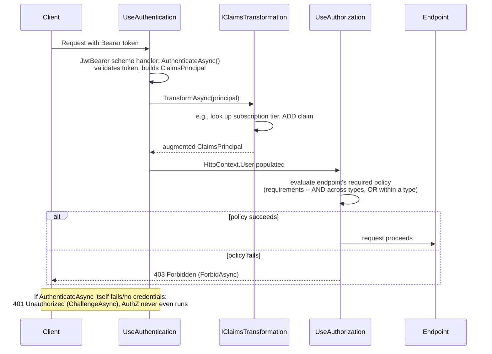
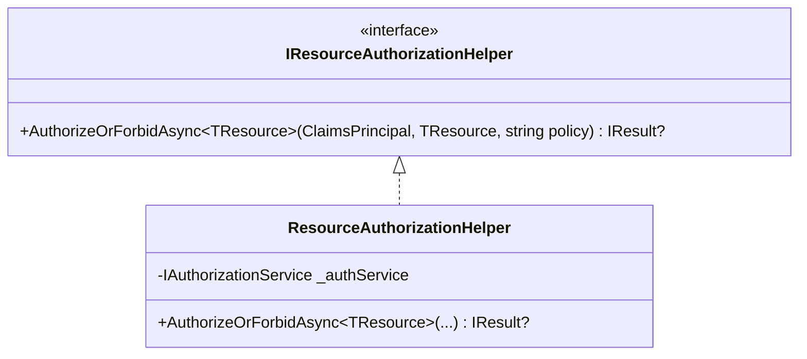
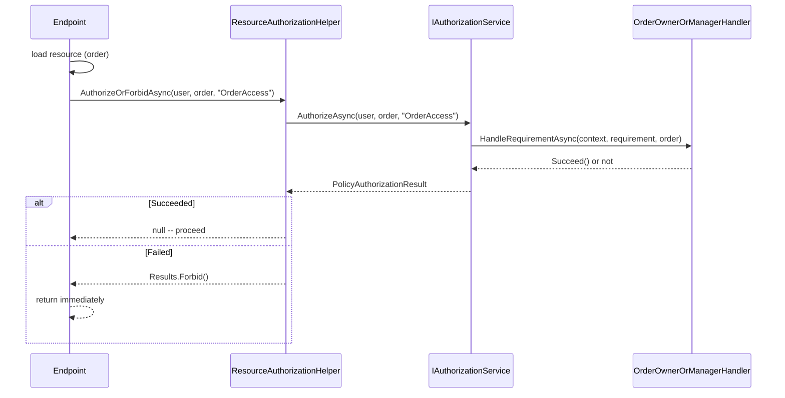

# Module 12 — ASP.NET Core: Authentication & Authorization Deep Dive

> Domain: .NET / ASP.NET Core | Level: Beginner → Expert | Prerequisite: [[01-Middleware-Pipeline-Request-Internals]] §2.4 (endpoint-metadata-driven authorization ordering), [[03-MinimalAPIs-vs-Controllers-ModelBinding]] (endpoint filters); connects forward to a later dedicated OAuth2/OIDC/JWT/PKCE module

---

## 1. Fundamentals

### What is authentication, and what is authorization?
**Authentication** answers *"who are you?"* — establishing the identity of the caller, producing a `ClaimsPrincipal` (a set of claims — key/value facts about the identity — grouped into one or more `ClaimsIdentity` objects) attached to `HttpContext.User`. **Authorization** answers *"are you allowed to do this?"* — a separate, subsequent decision evaluated **against** the already-established identity (and the specific resource/endpoint being accessed), producing a simple allow/deny result.

### Why are they modeled as distinct, pluggable systems in ASP.NET Core?
Because **many different mechanisms** can establish identity (a cookie, a JWT bearer token, an API key, a client certificate, a third-party OAuth provider) and **many different policies** can govern access (a simple role check, a complex multi-claim business rule, a resource-specific ownership check) — conflating the two into one monolithic system would prevent mixing/matching (e.g., "authenticate via JWT, but authorize using a rich, business-logic-driven policy" or "support both cookie and API-key authentication simultaneously for different client types on the same API"). ASP.NET Core's **authentication schemes** (pluggable identity-establishing mechanisms) and **authorization policies** (pluggable, composable access-decision logic) are deliberately independent, composable systems precisely to support this flexibility.

### When does this matter?
- **Always**, for any API/application with meaningful access control — but *deeply* understanding the mechanics matters specifically for:
  - Correctly supporting multiple simultaneous authentication schemes (a common real-world requirement — first-party web clients via cookies, third-party partners via API keys, service-to-service calls via JWT).
  - Designing authorization policies that go beyond simple role checks (resource-based/ownership-based authorization — "can this user edit *this specific* order," not just "is this user an Editor").
  - Diagnosing the very common "why did this request get a 401 instead of my custom logic running" / "why is `[Authorize(Roles = "Admin")]` not working" class of bug.
  - Interviewing — a genuinely deep answer here (policy-based authorization, claims transformation, scheme selection) is a strong Staff/Principal-level differentiator over a surface-level "we use `[Authorize]` attributes" answer.

### How does it work (30,000-ft view)?

```csharp
builder.Services.AddAuthentication(options => options.DefaultScheme = "Cookies")
    .AddCookie("Cookies")
    .AddJwtBearer("Bearer", options => { /* token validation parameters */ });

builder.Services.AddAuthorization(options =>
{
    options.AddPolicy("CanEditOrders", policy =>
        policy.RequireClaim("permission", "orders:edit"));
});

app.UseAuthentication(); // populates HttpContext.User by running the matched scheme's handler
app.UseAuthorization();  // evaluates the endpoint's required policy against HttpContext.User

app.MapPut("/orders/{id}", UpdateOrder)
   .RequireAuthorization("CanEditOrders");
```

Mental model for interviews: **"Authentication middleware runs the appropriate scheme handler(s) to populate `HttpContext.User` with a `ClaimsPrincipal`. Authorization middleware then evaluates a policy — a composable set of requirements — against that principal and the current request/resource, producing allow or deny. Schemes and policies are independent, pluggable, and can be mixed and matched."**

---

## 2. Deep Dive

### 2.1 `ClaimsPrincipal`/`ClaimsIdentity`/`Claim` — the Identity Data Model

- A **`Claim`** is a single key-value assertion about the identity (`ClaimTypes.Name = "alice"`, `"permission" = "orders:edit"`, `"tenant_id" = "acme-corp"`), optionally with an issuer.
- A **`ClaimsIdentity`** is a named collection of claims, associated with a specific authentication scheme/method (`AuthenticationType`) — a principal can carry **multiple** identities simultaneously (e.g., one from a cookie scheme and one from an external OAuth provider, in a multi-scheme scenario), though the common case is one identity.
- A **`ClaimsPrincipal`** wraps one or more `ClaimsIdentity` objects and is what `HttpContext.User` actually is — `User.Identity.Name`, `User.IsInRole(...)`, `User.HasClaim(...)` all operate across the principal's identities.

### 2.2 Authentication Schemes — Precisely How Multiple Schemes Coexist

Each registered scheme (`AddCookie("Cookies")`, `AddJwtBearer("Bearer")`, a custom `AddApiKey("ApiKey")`) has its own **handler** implementing `IAuthenticationHandler`, responsible for: (a) `AuthenticateAsync()` — attempt to extract and validate credentials from the current request (a cookie, an `Authorization: Bearer` header, an API-key header) and produce a `ClaimsPrincipal` if successful; (b) `ChallengeAsync()` — what to do when an **unauthenticated** request hits a protected resource (redirect to a login page for cookies; return `401 WWW-Authenticate: Bearer` for JWT); (c) `ForbidAsync()` — what to do when an **authenticated-but-not-authorized** request is denied (typically a `403`).

**Scheme selection** for a given endpoint is determined by: an explicit `[Authorize(AuthenticationSchemes = "Bearer")]`/`.RequireAuthorization(...)` specifying which scheme(s) apply, or, absent that, the configured **default scheme** — `UseAuthentication()` middleware runs **every** registered scheme's `AuthenticateAsync()` unless scoped, populating `HttpContext.User` with whichever scheme(s) actually apply to the incoming request's credentials (a cookie present triggers the cookie scheme; a bearer token present triggers the JWT scheme) — **it is entirely possible, and common, for a single request to be simultaneously "authenticated" under multiple schemes** if it happens to carry credentials for more than one (rare in practice, but architecturally important to understand for correctly reasoning about multi-scheme APIs).

### 2.3 Policy-Based Authorization — Requirements and Handlers

An authorization **policy** is a named collection of **requirements** (`IAuthorizationRequirement`), each evaluated by one or more **handlers** (`AuthorizationHandler<TRequirement>`). The built-in `RequireClaim`/`RequireRole`/`RequireAuthenticatedUser` are convenience methods that add pre-built requirement/handler pairs — but the real power is **custom requirements** for business-logic-driven decisions:

```csharp
public class MinimumAccountAgeRequirement : IAuthorizationRequirement
{
    public TimeSpan MinimumAge { get; }
    public MinimumAccountAgeRequirement(TimeSpan minimumAge) => MinimumAge = minimumAge;
}

public class MinimumAccountAgeHandler : AuthorizationHandler<MinimumAccountAgeRequirement>
{
    protected override Task HandleRequirementAsync(
        AuthorizationHandlerContext context, MinimumAccountAgeRequirement requirement)
    {
        var createdAtClaim = context.User.FindFirst("account_created_at");
        if (createdAtClaim is not null
            && DateTimeOffset.Parse(createdAtClaim.Value) <= DateTimeOffset.UtcNow - requirement.MinimumAge)
        {
            context.Succeed(requirement); // marks THIS requirement satisfied
        }
        return Task.CompletedTask;
        // NOTE: not calling context.Succeed() does NOT fail the policy immediately --
        // it simply leaves this requirement unsatisfied; the policy overall fails only if
        // ANY requirement remains unsatisfied after ALL handlers have run.
    }
}
```
**Critical, frequently-tested fact**: a policy succeeds only if **every** requirement in it is satisfied — but an individual handler **choosing not to call `context.Succeed()`** does not immediately fail the whole evaluation; it simply means that specific requirement remains unsatisfied, and **other handlers for the same requirement type** (multiple handlers can register for the same requirement) get a chance to satisfy it too (an "OR" relationship **between handlers for the same requirement**, combined with an "AND" relationship **across different requirements** in the same policy) — a genuinely subtle, commonly-misunderstood evaluation semantic worth knowing precisely.

### 2.4 Resource-Based Authorization — Beyond "Is This User an Admin"

The examples so far check claims/roles **independent of any specific resource** — but a huge, common real-world need is: **"can this specific user edit *this specific* order"** (an ownership/resource-based check), which requires the actual resource instance to be available at authorization-decision time:

```csharp
public class OrderOwnerRequirement : IAuthorizationRequirement { }

public class OrderOwnerHandler : AuthorizationHandler<OrderOwnerRequirement, Order>
{
    protected override Task HandleRequirementAsync(
        AuthorizationHandlerContext context, OrderOwnerRequirement requirement, Order resource)
    {
        var userId = context.User.FindFirstValue(ClaimTypes.NameIdentifier);
        if (resource.CustomerId == userId) context.Succeed(requirement);
        return Task.CompletedTask;
    }
}

// Usage inside an endpoint/controller (imperative, resource-based check -- NOT expressible via a
// simple [Authorize] attribute alone, since the attribute has no access to the specific loaded resource):
var order = await repository.GetByIdAsync(id);
var authResult = await authorizationService.AuthorizeAsync(User, order, "OrderOwnerPolicy");
if (!authResult.Succeeded) return Forbid();
```
This is precisely why `[Authorize]` attributes alone (declarative, evaluated purely from endpoint metadata + the principal, per Module 9 §2.4) **cannot** express ownership/resource-based checks — the resource itself (a specific `Order` instance) doesn't exist until the handler has already started executing and loaded it from the database; resource-based authorization is necessarily an **imperative** call to `IAuthorizationService.AuthorizeAsync(user, resource, policy)` from within the handler/action body, not a purely declarative attribute.

### 2.5 Claims Transformation — `IClaimsTransformation`

`IClaimsTransformation.TransformAsync(ClaimsPrincipal principal)` runs **after** authentication succeeds but **before** authorization evaluates — a hook for **augmenting** the principal with additional claims not present in the original token/cookie (e.g., looking up a user's current subscription tier from a database and adding it as a claim, so authorization policies can check it without every policy handler needing its own database call). **Critical gotcha**: `IClaimsTransformation` runs on **every single request** (it's not cached across requests by default) — a transformation performing an expensive database lookup on every request is a real, easily-introduced performance problem (§7/§14), and its result is **not** persisted back into the original authentication cookie/token, meaning the same lookup repeats every request unless the application explicitly implements its own caching layer around it.

### 2.6 The 401 vs 403 Distinction, Precisely

- **`401 Unauthorized`** ("who are you? I don't recognize your credentials, or you provided none") — the correct response when **authentication** fails or is absent for a resource requiring it; triggered by the scheme handler's `ChallengeAsync()`.
- **`403 Forbidden`** ("I know who you are, but you're not allowed to do this") — the correct response when authentication **succeeded** but **authorization** subsequently denies the request; triggered by `ForbidAsync()`.
- A common, real bug: returning `401` for an authorization failure (leaking information about *why* access was denied in a subtly wrong way, and technically violating HTTP semantics) or, conversely, `403` for a genuinely unauthenticated request (some security guidance argues `401` is more appropriate specifically to avoid confirming a resource's existence to an unauthenticated caller, an intentional information-hiding consideration — worth knowing this is a deliberate design decision some APIs make, not just an implementation detail to get "right" or "wrong" universally).

---

## 3. Visual Architecture

### Authentication + Authorization Sequence



### Requirement Evaluation Logic (ASCII)

```
Policy "CanEditOrders" = [ RequireRoleRequirement("Editor"), MinimumAccountAgeRequirement(30 days) ]

                    ┌─────────────────────────────┐
                    │ RequireRoleRequirement        │◄── Handler A: checks role -- Succeed() or not
                    │ (must be satisfied)            │◄── Handler B (if registered): ALSO gets a chance
                    └─────────────────────────────┘     (OR relationship between handlers for SAME requirement)
                                  AND
                    ┌─────────────────────────────┐
                    │ MinimumAccountAgeRequirement  │◄── Handler C: checks claim -- Succeed() or not
                    │ (must be satisfied)            │
                    └─────────────────────────────┘

Policy succeeds ONLY IF: (RequireRoleRequirement satisfied by ANY of its handlers)
                          AND (MinimumAccountAgeRequirement satisfied by ANY of its handlers)
```

---

## 4. Production Example

### Scenario: Partner API platform — an `IClaimsTransformation` causing a slow, cascading authentication-layer outage

**Problem**: A B2B API platform serving multiple partner integrations via JWT bearer tokens experienced a severe, platform-wide latency degradation (p99 response times across **every** authenticated endpoint, not just one specific feature) that began shortly after a seemingly-minor feature addition: a new `IClaimsTransformation` implementation added to enrich the principal with the caller's **current, real-time partner-tier/rate-limit-quota information**, looked up from a database, "so authorization policies could reference it without each one needing its own database call" (directly following the pattern described in §2.5).

**Investigation**:
- `dotnet-counters`/APM tracing showed a database query (the partner-tier lookup) executing on **every single authenticated request**, platform-wide — including requests to endpoints that never actually *used* the partner-tier claim in any authorization policy at all.
- Confirmed `IClaimsTransformation.TransformAsync` runs unconditionally for **every** request reaching the authentication middleware, regardless of whether the specific endpoint being accessed has any policy that actually needs the added claim — the team had implemented it assuming (incorrectly) that it would only run when "needed," when in fact it runs universally, on the hot path of literally every authenticated request across the entire platform.
- Under the platform's actual traffic volume, this added one additional, synchronous database round-trip to every single request's critical path — the database connection pool, sized for the platform's existing query load, became a genuine bottleneck, and the resulting query queueing/contention degraded latency platform-wide, well beyond just the feature that had motivated the change.

**Architecture fix**:
- Replaced the per-request database lookup with a **short-TTL, in-memory-cached** lookup (`IMemoryCache`, keyed by partner ID, TTL of a few minutes) inside the `IClaimsTransformation` implementation — reducing the actual database query rate from "once per request" to "once per partner, per cache-TTL-window," a dramatic reduction given the platform's actual partner-to-request-volume ratio.
- Added a **feature-scoping guard**: the transformation now checks whether the current request's matched endpoint (`HttpContext.GetEndpoint()`, directly reusing Module 9 §2.4's endpoint-metadata mechanism) actually carries a marker indicating it needs the partner-tier claim, skipping the lookup entirely (cached or not) for the (large) majority of endpoints that never reference it — an even more targeted fix than caching alone, directly avoiding unnecessary work rather than just making the unnecessary work cheaper.
- Load-tested the fix at 2x production peak specifically exercising the authentication path before redeploying, given the platform-wide (not feature-scoped) blast radius this incident demonstrated `IClaimsTransformation` changes can have.

**Trade-offs**: The short-TTL cache introduces a small window (the cache's TTL) during which a partner-tier change (e.g., an upgrade/downgrade processed by a separate billing system) might not be immediately reflected in authorization decisions — accepted as a reasonable, deliberate trade-off given the alternative (a database call on every single request platform-wide) was demonstrably catastrophic at scale, and the business impact of a few minutes' staleness for a tier-change is minor compared to a platform-wide outage.

**Lessons learned**:
1. `IClaimsTransformation` runs on **every authenticated request across the entire application**, not scoped to specific endpoints by default — any expensive operation placed inside it has a platform-wide blast radius, not a feature-scoped one, making it a uniquely high-leverage (and high-risk) extension point.
2. A seemingly-reasonable, well-intentioned feature addition ("enrich the principal so policies don't each need their own lookup") can silently become a platform-wide performance bottleneck if the actual, universal-execution semantics of the extension point aren't fully understood before use.
3. Caching and, even better, endpoint-scoped conditional execution are both valid, complementary mitigations — caching reduces the cost of necessary work; scoping eliminates unnecessary work entirely, and combining both gives the strongest protection.

---

## 5. Best Practices

- **Understand that `IClaimsTransformation` runs on every authenticated request platform-wide** — never place expensive, unconditional work inside it without caching and/or endpoint-scoping (§4's dual fix).
- **Use resource-based authorization (`IAuthorizationService.AuthorizeAsync(user, resource, policy)`) for any "does this user own/have rights to this specific resource" check** — never attempt to force this into a declarative `[Authorize]` attribute, which has no access to the loaded resource instance (§2.4).
- **Register custom `AuthorizationHandler<TRequirement>` implementations for genuine business-logic-driven access rules**, rather than trying to encode complex logic into `RequireClaim`/`RequireRole`'s simpler built-in convenience methods — custom handlers are the intended, fully-general extensibility point.
- **Explicitly specify `AuthenticationSchemes` on `[Authorize]`/`.RequireAuthorization(...)` for any endpoint in a multi-scheme application**, rather than relying on the default scheme — makes the intended authentication mechanism for that specific endpoint unambiguous and self-documenting.
- **Return `401` for authentication failures and `403` for authorization failures**, consistently — and make a deliberate, documented choice (not an accident) if your API intentionally deviates from this (e.g., returning `401` universally to avoid confirming resource existence to unauthenticated callers).
- **Cache expensive claims-enrichment lookups** with an appropriately short TTL reflecting how quickly the underlying data can legitimately change and how much staleness is acceptable for your specific authorization decisions.
- **Test authorization policies with dedicated unit tests directly against `AuthorizationHandler<T>` implementations** (constructing a test `ClaimsPrincipal`/resource and asserting `context.HasSucceeded`), not solely through full end-to-end HTTP integration tests — faster, more precise feedback for the actual business-logic correctness of a policy's decision rules.

---

## 6. Anti-patterns

- **Placing expensive, unconditional work inside `IClaimsTransformation` without caching or endpoint-scoping** (§4's incident). Fix: cache with an appropriate TTL; scope execution to only the endpoints that actually need the enriched claim.
- **Attempting to express resource-based/ownership authorization via `[Authorize(Policy = "...")]` alone**, without realizing the policy has no access to the specific resource instance unless explicitly passed via `IAuthorizationService.AuthorizeAsync(user, resource, policy)`. Fix: use the imperative resource-based authorization call from within the handler/action, after loading the resource.
- **Relying on the default authentication scheme in a multi-scheme application without explicit per-endpoint scheme specification**, leading to confusing, hard-to-predict behavior about which scheme actually authenticates a given request. Fix: explicit `AuthenticationSchemes` specification per endpoint/policy.
- **Conflating authentication and authorization failures**, returning the wrong status code (`401` when authorization actually failed, or vice versa) — beyond a pure correctness/HTTP-semantics concern, this can confuse legitimate API consumers trying to distinguish "I need to re-authenticate" from "I'm logged in but not allowed to do this."
- **Encoding complex, multi-condition business authorization logic directly inline in a controller action/endpoint handler** (`if (user.IsInRole("Admin") || (user.HasClaim(...) && order.Status == ...)) { ... }`) rather than expressing it as a named, reusable, independently-testable `AuthorizationHandler`. Why it fails: duplicates logic across multiple endpoints needing the same rule, and makes the authorization rule itself harder to locate/audit/test in isolation from the endpoint's other logic. Fix: extract into a named policy/handler, referenced declaratively or via `IAuthorizationService` as appropriate.
- **Assuming a single principal can only ever have one `ClaimsIdentity`/come from one scheme**, breaking in multi-scheme scenarios where a request might legitimately carry credentials recognized by more than one registered scheme simultaneously.

---

---

---

---

## 10. Interview Questions

### Basic (10)

1. **Q: What's the difference between authentication and authorization?**
   **A:** Authentication establishes who the caller is (producing a `ClaimsPrincipal`); authorization decides, given that established identity, whether the caller is allowed to perform a specific action.

2. **Q: What is a `Claim`?**
   **A:** A single key-value assertion about an identity, such as a name, role, or permission.

3. **Q: What does `UseAuthentication()` middleware do?**
   **A:** Runs the appropriate registered authentication scheme handler(s) to attempt to establish the caller's identity, populating `HttpContext.User`.

4. **Q: What status code should be returned for a failed authentication attempt, versus a failed authorization check?**
   **A:** `401 Unauthorized` for authentication failures; `403 Forbidden` for authorization failures (the caller is known but not permitted).

5. **Q: What is an authorization policy?**
   **A:** A named collection of requirements that must all be satisfied for access to be granted.

6. **Q: Can `[Authorize]` alone express "can this user edit this specific order"?**
   **A:** No — declarative `[Authorize]` attributes have no access to a specific loaded resource instance; this requires imperative, resource-based authorization via `IAuthorizationService.AuthorizeAsync(user, resource, policy)`.

7. **Q: What is `IClaimsTransformation` used for?**
   **A:** Augmenting the `ClaimsPrincipal` with additional claims after authentication succeeds but before authorization runs.

8. **Q: Does `IClaimsTransformation` run for every request, or only when a policy needs the added claim?**
   **A:** Every single authenticated request, unconditionally, unless explicitly scoped by the implementation itself.

9. **Q: What is the purpose of specifying `AuthenticationSchemes` on an `[Authorize]` attribute?**
   **A:** To explicitly declare which authentication scheme(s) apply to that specific endpoint, rather than relying on the application's default scheme.

10. **Q: What does a custom `AuthorizationHandler<TRequirement>` let you do that built-in `RequireRole`/`RequireClaim` don't?**
    **A:** Express arbitrary, custom business-logic-driven authorization decisions, not just simple claim/role presence checks.

### Intermediate (10)

1. **Q: Explain the relationship between requirements and handlers within a single authorization policy.**
   **A:** A policy is satisfied only if every requirement it contains is satisfied (an AND relationship across requirement types); for a given requirement, if multiple handlers are registered for it, any one of them succeeding is sufficient (an OR relationship between handlers for the same requirement).

2. **Q: Why can a single `ClaimsPrincipal` contain multiple `ClaimsIdentity` objects?**
   **A:** A request might legitimately carry credentials recognized by more than one registered authentication scheme simultaneously — each scheme contributes its own identity, and the principal aggregates all of them.

3. **Q: What's the danger of placing an expensive database call inside `IClaimsTransformation` without caching?**
   **A:** It executes on every single authenticated request across the entire application, adding that cost to every request's critical path platform-wide and potentially exhausting shared downstream resources like a database connection pool under real production load.

4. **Q: Why is JWT authentication generally considered more horizontally-scaling-friendly than cookie-based authentication?**
   **A:** JWTs are self-contained and stateless — any replica with the shared signing/verification key can validate them independently, with no shared session store required, whereas cookie-based authentication typically requires either sticky sessions or an externalized, shared session/data-protection-key store.

5. **Q: What happens if you don't configure a shared data-protection key ring across replicas for a cookie-authenticated, horizontally-scaled application?**
   **A:** Each replica generates/uses its own independent keys, so a cookie encrypted by one replica can't be validated by another — users can appear to get logged out unpredictably whenever their request happens to land on a different replica than the one that issued their cookie.

6. **Q: Why might a security-conscious API deliberately return 401 for both unauthenticated and "authenticated but resource doesn't exist for you" scenarios, rather than the textbook 401/403/404 distinction?**
   **A:** To avoid confirming a protected resource's existence to an unauthenticated or unauthorized caller — a deliberate information-hiding/reconnaissance-prevention security decision, not a bug.

7. **Q: What's the security risk of a custom authentication scheme handler trusting a claim value taken directly from a request header without further validation?**
   **A:** An attacker could forge that header value directly, since nothing about simply reading a header value inherently proves its authenticity — the handler must validate the credential against a trusted, server-side source before deriving any claims from it.

8. **Q: Why would you write a unit test directly against an `AuthorizationHandler<T>` implementation rather than relying solely on end-to-end HTTP tests?**
   **A:** It gives faster, more precise, more isolated feedback specifically on the authorization rule's business-logic correctness, without needing to spin up a full HTTP pipeline/real authentication flow just to exercise the decision logic.

9. **Q: What's the difference between `ChallengeAsync()` and `ForbidAsync()` on an authentication scheme handler?**
   **A:** `ChallengeAsync()` runs when authentication is missing/failed (typically resulting in a 401 or a login redirect); `ForbidAsync()` runs when the caller is authenticated but authorization subsequently denies the request (typically resulting in a 403).

10. **Q: Why should you explicitly specify which authentication scheme(s) apply to a given endpoint in a multi-scheme application, rather than relying on the default?**
    **A:** It removes ambiguity about which credential mechanism is actually expected/validated for that specific endpoint, and prevents a potential security gap where a caller might authenticate via an unintended, possibly weaker scheme that happens to also be registered as valid by default.

### Advanced (10)

1. **Q: Walk through, precisely, why the platform-wide latency degradation in §4's incident affected endpoints that never referenced the newly-added claim at all.**
   **A:** `IClaimsTransformation.TransformAsync` executes unconditionally as part of the authentication middleware's processing for **every** authenticated request, entirely independent of which specific endpoint is ultimately being accessed or whether that endpoint's authorization policy actually reads the enriched claim — the expensive database lookup runs and completes (paying its full cost) **before** routing/authorization even determines which endpoint or policy applies, meaning the cost is incurred universally regardless of downstream relevance, which is exactly why the blast radius was platform-wide rather than scoped to the one feature that motivated the change.

2. **Q: Explain how you would design an authorization system supporting both "any Editor can edit any order" (a simple role check) and "additionally, the original creator can always edit their own order regardless of role" (a resource-based override), combining both into one coherent policy.**
   **A:** Register a single policy (`"CanEditOrder"`) with one requirement (`EditOrderRequirement`), but register **two** handlers for that same requirement: one checking `context.User.IsInRole("Editor")` (calling `Succeed()` if true), and a separate one checking `((Order)context.Resource).CustomerId == context.User.FindFirstValue(ClaimTypes.NameIdentifier)` (also calling `Succeed()` if true) — per §2.3's "OR between handlers for the same requirement" semantics, the policy succeeds if **either** condition is met, precisely modeling "any Editor OR the resource's own creator" as a single, coherent, composable policy rather than duplicating an `if (isEditor || isOwner)` check inline at every call site.

3. **Q: A candidate claims "JWT authentication doesn't need session state, so it has no scalability concerns at all." Provide a precise correction.**
   **A:** JWT's self-contained, stateless nature does eliminate the *session-store* scalability concern cookie-based auth has — but real JWT-based systems still commonly need **shared state** for token revocation (a blocklist of revoked-but-not-yet-expired tokens, since JWTs can't be "un-issued" once signed) and for refresh-token rotation/tracking — both of which reintroduce a shared-state/distributed-consistency concern, just a different, narrower one than full session storage. The precise claim: "JWT eliminates the need for shared session state to validate a token's *signature and claims*, but real-world JWT systems still typically need shared state for revocation and refresh-token management — it reduces, but doesn't entirely eliminate, the stateful-scaling-concern category."

4. **Q: Design a caching strategy for `IClaimsTransformation` that correctly balances the performance concern from §4 against the security staleness concern from §8, for a scenario involving account suspension (a claim indicating "this account is suspended" that must be enforced promptly).**
   **A:** Use a **short** TTL cache (seconds, not minutes) specifically for the suspension-status claim, since the business/security requirement here (promptly enforcing suspension) is more stringent than, e.g., a partner-tier claim's staleness tolerance (§4's original scenario) — additionally, implement an **explicit cache-invalidation hook**: when an account is suspended (via whatever administrative action triggers it), proactively evict that specific account's cached claim entry (if using a keyed cache like `IMemoryCache`) rather than relying on TTL expiration alone, giving both a fast-path (immediate invalidation on the triggering event) and a bounded worst-case staleness window (the short TTL, as a safety net for cases where the explicit invalidation hook itself might be missed/fail) — directly combining "cache for performance" with "invalidate proactively for security-critical staleness-sensitive claims" rather than treating all cached claims with a uniform, one-size-fits-all TTL policy.

5. **Q: Explain a scenario where a multi-scheme authentication configuration creates a genuine security vulnerability if endpoint-level scheme scoping is missing, with a concrete example.**
   **A:** An application supporting both a legacy `ApiKey` scheme (simple, static-key-based, perhaps originally intended only for a small set of trusted internal batch jobs) and a modern `Bearer` (JWT) scheme (with rich, granular claims-based authorization) for its general API surface — if a sensitive endpoint (e.g., `DELETE /users/{id}`) only specifies `[Authorize(Policy = "AdminOnly")]` without scoping `AuthenticationSchemes`, and the `ApiKey` scheme's handler (perhaps for simplicity, or an oversight) attaches an `Admin` role claim to **every** successfully-validated API-key holder (since it was only ever tested/used by trusted internal jobs, "admin" seemed a reasonable default), then **any external caller possessing a valid API key** (perhaps issued for an entirely different, lower-trust purpose) could satisfy the "AdminOnly" policy via the API-key scheme, bypassing the intended, more rigorous JWT-based admin-verification path entirely — a real privilege-escalation vulnerability arising purely from the *combination* of multiple schemes and missing endpoint-level scheme scoping, not from either scheme being individually "broken."

6. **Q: How would you architect authorization for a scenario requiring both coarse-grained, policy-based checks (declarative, fast, cacheable) AND fine-grained, resource-based checks (imperative, requires loading the resource), minimizing redundant database access?**
   **A:** Structure the endpoint handler to perform the **coarse-grained** check first, declaratively (`[Authorize(Policy = "HasOrderManagementAccess")]`, evaluated before the handler body even runs, short-circuiting cheaply for callers who fail this basic gate without any database access at all) — then, **only for callers who pass the coarse check**, load the specific resource (which the handler needs to load anyway for its actual business logic, so this isn't "extra" work solely for authorization's sake) and perform the **fine-grained**, resource-based check (`IAuthorizationService.AuthorizeAsync(user, order, "OrderOwnerPolicy")`) against it — this two-tier structure ensures the (potentially expensive) resource-loading and fine-grained check only happens for requests that already passed a cheap, declarative gate, directly mirroring Module 9 §Advanced Q4's "short-circuit before expensive work" middleware-ordering principle, now applied specifically to the coarse-vs-fine authorization-check sequencing decision.

7. **Q: Explain how you would test the `IClaimsTransformation` caching fix from §4 to ensure it doesn't reintroduce the original staleness-vs-performance trade-off incorrectly under concurrent load (e.g., a cache stampede on cold start).**
   **A:** A naive `IMemoryCache`-based cache is vulnerable to a **cache stampede**: if many concurrent requests for the *same* uncached partner ID arrive simultaneously (e.g., immediately after a cache eviction or on application cold-start), each one might independently trigger its own database lookup before any of them finishes populating the cache, momentarily reproducing the original "database call per request" problem for that specific burst — the correct fix uses a **per-key locking/deduplication mechanism** (e.g., `IMemoryCache.GetOrCreateAsync` combined with a `SemaphoreSlim`-per-key pattern, or a library like `Microsoft.Extensions.Caching.Memory`'s newer stampede-resistant patterns) ensuring only **one** concurrent lookup occurs per uncached key, with other concurrent requests for that same key awaiting the single in-flight lookup's result rather than each independently hitting the database — testing this specifically requires a concurrency-focused test (many simulated concurrent requests for the same uncached partner ID) asserting the underlying repository/database mock was called only **once**, not once-per-concurrent-request.

8. **Q: A team wants to implement "step-up authentication" (requiring a fresh, recent re-authentication for a specific high-sensitivity action, like changing a password, even if the user has a valid, longer-lived session/token) — design this using the authorization concepts covered in this module.**
   **A:** Add an `authentication_time` claim (many JWT/OIDC flows already include this, `auth_time`) at authentication time reflecting when the credential was actually established; implement a custom `RecentAuthenticationRequirement(TimeSpan maxAge)` with a handler checking `DateTimeOffset.UtcNow - authTimeClaim <= maxAge`, succeeding only if the authentication is sufficiently recent — apply this policy specifically to the sensitive endpoints requiring step-up authentication (`[Authorize(Policy = "RecentAuthRequired")]`), while leaving ordinary endpoints governed by the normal, longer-lived session/token validity policy — if the requirement fails (the session, while still generally valid, is "too old" for this specific sensitive action), the endpoint returns a distinct response (e.g., a custom 403 variant or a specific error code) prompting the client to initiate a fresh re-authentication flow specifically for this action, directly demonstrating how custom requirements/handlers (§2.3) extend naturally to genuinely novel authorization concepts beyond the built-in role/claim conveniences.

9. **Q: Explain why data-protection key management (§9's HA/DR point) is architecturally a distinct concern from authentication scheme configuration itself, and what happens mechanically if it's misconfigured in a horizontally-scaled deployment.**
   **A:** ASP.NET Core's cookie-authentication scheme relies on the separate **Data Protection API** (`IDataProtectionProvider`) to encrypt/sign the cookie's contents — by default, each application instance generates and stores its own data-protection keys **locally** (e.g., in-memory or a local file), which works fine for a single-instance deployment but means each replica in a horizontally-scaled fleet has **independent, incompatible** keys unless explicitly configured to share a common key ring (via a persisted, shared store — Redis, a shared network file location, Azure Blob Storage). Mechanically, if unconfigured: a cookie encrypted by Replica A's key cannot be decrypted/validated by Replica B — the cookie-authentication scheme's `AuthenticateAsync()` simply fails silently (treating the request as unauthenticated, not as an error), producing the exact "users get logged out randomly, seemingly depending on which server they hit" symptom, which can be genuinely confusing to diagnose without specifically knowing to look at data-protection key-ring configuration rather than the authentication scheme configuration itself, since the scheme setup can look entirely correct in isolation.

10. **Q: As a Principal Engineer, how would you design an organization-wide authentication/authorization architecture standard that prevents the specific incident classes covered in this module (claims-transformation performance blast radius, missing resource-based checks, multi-scheme scope ambiguity) from recurring across many services?**
    **A:** Publish a shared library providing: (a) a pre-built, stampede-resistant, TTL-configurable claims-caching wrapper (directly the fix from §4/Advanced Q7) that any team can use for their own claims-enrichment needs without independently rediscovering the caching/stampede pitfalls; (b) a standard base `AuthorizationHandler<TRequirement, TResource>` pattern/template with accompanying unit-test scaffolding, making resource-based authorization the well-supported, low-friction default rather than something each team has to figure out from documentation independently; (c) a mandatory architecture-review checklist item requiring explicit `AuthenticationSchemes` scoping for any endpoint in a multi-scheme service, with automated tooling (a custom analyzer, similar in spirit to this course's recurring analyzer-based governance pattern — Module 4 §Advanced Q10, Module 6 §14, Module 10 §12/§13) flagging any `[Authorize]`/`.RequireAuthorization()` call missing explicit scheme specification in a project with more than one registered scheme. This directly generalizes this module's specific incidents into durable, low-friction, largely-automated organizational safeguards, consistent with this course's recurring "codify hard-won lessons as shared tooling, don't rely on tribal knowledge" principle.

---

## 11. Coding Exercises

### Easy — Implement a simple role-based policy and apply it to an endpoint
**Problem**: Restrict an endpoint to users with the "Manager" role.
```csharp
builder.Services.AddAuthorization(options =>
{
    options.AddPolicy("ManagerOnly", policy => policy.RequireRole("Manager"));
});

app.MapDelete("/orders/{id}", DeleteOrder).RequireAuthorization("ManagerOnly");
```
**Discussion**: `RequireRole` is a convenience wrapper adding a pre-built `RolesAuthorizationRequirement` and its corresponding built-in handler — functionally equivalent to, but far less code than, hand-writing an equivalent custom `IAuthorizationRequirement`/`AuthorizationHandler<T>` pair for this simple case; reserve custom requirements/handlers (§5) for genuinely custom logic the built-ins can't express.

### Medium — Implement resource-based (ownership) authorization
**Problem**: Ensure only the order's original customer (or a Manager) can view its details.
```csharp
public class OrderAccessRequirement : IAuthorizationRequirement { }

public class OrderOwnerOrManagerHandler : AuthorizationHandler<OrderAccessRequirement, Order>
{
    protected override Task HandleRequirementAsync(
        AuthorizationHandlerContext context, OrderAccessRequirement requirement, Order resource)
    {
        if (context.User.IsInRole("Manager")
            || resource.CustomerId == context.User.FindFirstValue(ClaimTypes.NameIdentifier))
        {
            context.Succeed(requirement);
        }
        return Task.CompletedTask;
    }
}

// Registration:
// services.AddAuthorization(o => o.AddPolicy("OrderAccess", p => p.Requirements.Add(new OrderAccessRequirement())));
// services.AddScoped<IAuthorizationHandler, OrderOwnerOrManagerHandler>();

// Usage in the endpoint:
app.MapGet("/orders/{id}", async (string id, IOrderRepository repo, IAuthorizationService authService, ClaimsPrincipal user) =>
{
    var order = await repo.GetByIdAsync(id);
    if (order is null) return Results.NotFound();

    var authResult = await authService.AuthorizeAsync(user, order, "OrderAccess");
    if (!authResult.Succeeded) return Results.Forbid();

    return Results.Ok(order);
});
```
**Discussion**: Note the deliberate ordering — the resource (`order`) is loaded **first** (needed regardless, for the actual business logic if access is granted), **then** the resource-based authorization check runs against it — exactly the pattern described in §2.4, and impossible to express as a purely declarative `[Authorize]` attribute since the attribute has no way to reference `order` before it's been loaded inside the handler body.

### Hard — Implement a stampede-resistant, cache-invalidatable claims transformation (Advanced Q4/Q7)
**Problem**: Fix §4's incident with both caching and explicit invalidation support, avoiding cache-stampede risk.
```csharp
public class PartnerTierClaimsTransformation : IClaimsTransformation
{
    private readonly IMemoryCache _cache;
    private readonly IPartnerRepository _repository;
    private static readonly SemaphoreSlim _lock = new(1, 1); // simplistic global lock -- a production version
                                                                // would use a per-key lock collection for finer granularity

    public PartnerTierClaimsTransformation(IMemoryCache cache, IPartnerRepository repository)
    {
        _cache = cache;
        _repository = repository;
    }

    public async Task<ClaimsPrincipal> TransformAsync(ClaimsPrincipal principal)
    {
        var partnerId = principal.FindFirstValue("partner_id");
        if (partnerId is null) return principal; // not a partner-scoped caller -- nothing to enrich

        string cacheKey = $"partner-tier:{partnerId}";
        if (!_cache.TryGetValue(cacheKey, out string? tier))
        {
            await _lock.WaitAsync();
            try
            {
                // DOUBLE-CHECK after acquiring the lock -- another concurrent request may have
                // already populated the cache while this one was waiting for the lock.
                if (!_cache.TryGetValue(cacheKey, out tier))
                {
                    tier = await _repository.GetPartnerTierAsync(partnerId);
                    _cache.Set(cacheKey, tier, TimeSpan.FromSeconds(30)); // SHORT TTL, per §Advanced Q4's reasoning
                }
            }
            finally { _lock.Release(); }
        }

        var identity = new ClaimsIdentity();
        identity.AddClaim(new Claim("partner_tier", tier ?? "unknown"));
        principal.AddIdentity(identity);
        return principal;
    }

    // Explicit invalidation hook, called by whatever administrative action changes a partner's tier:
    public void InvalidatePartner(string partnerId) => _cache.Remove($"partner-tier:{partnerId}");
}
```
**Discussion points**: The double-checked-locking pattern (checking the cache, acquiring a lock, checking **again** before doing the expensive work) is precisely what prevents the cache-stampede scenario from Advanced Q7 — without the second check inside the lock, every request that arrived while the lock was held would still redundantly perform the database lookup once it eventually acquired the lock, one at a time, rather than benefiting from the first request's now-populated cache entry. A production implementation would replace the single global `SemaphoreSlim` with a per-key locking mechanism (to avoid serializing lookups for *different* partner IDs behind one shared lock) — flagged here explicitly as a known simplification, exactly the kind of "here's what I'd improve for real production use" honesty valuable to demonstrate in an interview setting rather than presenting a simplified exercise as production-complete without qualification.

### Expert — Implement step-up authentication (Advanced Q8) end-to-end
**Problem**: Implement the step-up (recent-authentication) authorization requirement from Advanced Q8, including the client-facing signal for triggering re-authentication.
```csharp
public class RecentAuthenticationRequirement : IAuthorizationRequirement
{
    public TimeSpan MaxAge { get; }
    public RecentAuthenticationRequirement(TimeSpan maxAge) => MaxAge = maxAge;
}

public class RecentAuthenticationHandler : AuthorizationHandler<RecentAuthenticationRequirement>
{
    protected override Task HandleRequirementAsync(
        AuthorizationHandlerContext context, RecentAuthenticationRequirement requirement)
    {
        var authTimeClaim = context.User.FindFirst("auth_time");
        if (authTimeClaim is not null
            && long.TryParse(authTimeClaim.Value, out var authTimeUnix))
        {
            var authTime = DateTimeOffset.FromUnixTimeSeconds(authTimeUnix);
            if (DateTimeOffset.UtcNow - authTime <= requirement.MaxAge)
            {
                context.Succeed(requirement);
            }
        }
        // Deliberately NOT calling context.Fail() -- absence of Succeed() is sufficient for the
        // requirement to remain unsatisfied; explicit Fail() would short-circuit ALL other
        // requirements in the policy immediately, which isn't desired here (see discussion).
        return Task.CompletedTask;
    }
}

// Custom result handling: distinguish "step-up needed" from an ordinary 403.
public class StepUpAuthorizationMiddlewareResultHandler : IAuthorizationMiddlewareResultHandler
{
    private readonly AuthorizationMiddlewareResultHandler _defaultHandler = new();

    public async Task HandleAsync(
        RequestDelegate next, HttpContext context, AuthorizationPolicy policy, PolicyAuthorizationResult authorizeResult)
    {
        if (!authorizeResult.Succeeded
            && policy.Requirements.OfType<RecentAuthenticationRequirement>().Any())
        {
            context.Response.StatusCode = StatusCodes.Status401Unauthorized;
            context.Response.Headers["X-Step-Up-Auth-Required"] = "true"; // client-facing signal
            await context.Response.WriteAsJsonAsync(new { error = "step_up_authentication_required" });
            return;
        }
        await _defaultHandler.HandleAsync(next, context, policy, authorizeResult);
    }
}
// Registration: services.AddSingleton<IAuthorizationMiddlewareResultHandler, StepUpAuthorizationMiddlewareResultHandler>();
```
**Discussion points**: `IAuthorizationMiddlewareResultHandler` is a genuinely advanced, less-commonly-known extensibility point — it lets you **customize what happens when authorization fails**, distinct from customizing the *decision logic itself* (which is what `AuthorizationHandler<T>` does) — here used specifically to distinguish "you're not allowed at all" (an ordinary 403) from "you need to freshly re-authenticate for this specific action" (a custom signal the client can act on, e.g., by prompting for a password re-entry) — demonstrating that the authorization *system* itself, not just individual policies, has customizable extension points worth knowing about for genuinely advanced authorization UX requirements. Not calling `context.Fail()` explicitly (per the code comment) is deliberate: `Fail()` immediately and unconditionally fails the **entire** policy evaluation regardless of other requirements' outcomes, which would be inappropriate here if this requirement were ever combined with other, independent requirements in the same policy — simply not calling `Succeed()` is the correct, more composable way to express "this specific requirement isn't met" without forcibly short-circuiting unrelated requirements.

---

## 12. System Design

*(Narrow application — full System Design has its own module; a full OAuth2/OIDC/JWT/PKCE module covers token-issuance architecture separately.)*

**Scenario**: Design the authentication/authorization architecture for a **B2B platform** (directly extending §4's scenario) supporting three distinct caller types: first-party web/mobile clients (cookie-based session), partner API integrations (JWT bearer tokens issued via client-credentials OAuth flow), and a small number of trusted internal batch/automation jobs (a legacy API-key scheme, per Advanced Q5's cautionary scenario).

- **Functional**: Support all three schemes simultaneously; enforce fine-grained, resource-based authorization (order ownership, partner-tier-based feature gating) alongside coarse-grained role/policy checks; support step-up authentication for a small set of especially sensitive administrative actions.
- **Non-functional**: No claims-enrichment logic may add unbounded per-request latency platform-wide (directly §4's lesson); cookie-authenticated sessions must survive horizontal scaling and rolling deployments; the legacy API-key scheme must be strictly scoped (Advanced Q5) to prevent privilege escalation via scheme confusion.
- **Architecture**: Every endpoint **explicitly** declares its accepted `AuthenticationSchemes` (never relying on the default) — first-party endpoints scope to `"Cookies"`, partner endpoints scope to `"Bearer"`, and the narrow set of legacy batch-job endpoints scope explicitly and exclusively to `"ApiKey"`, with the API-key scheme handler deliberately attaching **only** a narrow, job-specific claim set (never a broad "Admin" role) to prevent exactly the Advanced Q5 privilege-escalation scenario. The stampede-resistant, short-TTL claims-caching pattern (Hard coding exercise) is applied to the partner-tier enrichment specifically, with the endpoint-scoping optimization (§4's second fix) additionally applied so the lookup is skipped entirely for the large fraction of endpoints that don't reference partner-tier data at all. A shared data-protection key ring (Redis-backed) is provisioned for the cookie scheme specifically to satisfy the horizontal-scaling/rolling-deployment requirement (§9).
- **Failure handling**: The custom `IAuthorizationMiddlewareResultHandler` (Expert coding exercise) distinguishes step-up-required failures from ordinary 403s for the administrative-action policies specifically requiring recent authentication.
- **Monitoring**: Per-scheme authentication success/failure rates and per-policy authorization denial rates are tracked as distinct metrics, enabling the platform team to notice, e.g., an anomalous spike in `ApiKey`-scheme authentication attempts against endpoints that shouldn't accept that scheme at all (a potential probing/attack signal) distinctly from ordinary `Bearer`-scheme partner traffic patterns.
- **Trade-offs**: Maintaining three distinct schemes with individually-scoped endpoint access is more configuration/governance overhead than a single unified scheme would be — accepted because each caller type has genuinely different trust/integration characteristics (a legacy batch job can't practically implement a full OAuth client-credentials flow; a partner integration shouldn't be issued long-lived static API keys) that a single scheme couldn't accommodate without meaningfully compromising either security or integration simplicity for at least one caller category.

---

## 13. Low-Level Design

**Scenario**: Design a small, reusable **generic resource-based authorization helper** reducing the boilerplate of the "load resource → check ownership → return 403 if denied" pattern (Medium coding exercise) across many different resource types in a codebase.

### Class Diagram


```csharp
public interface IResourceAuthorizationHelper
{
    // Returns null if authorized (caller proceeds); returns a 403 IResult if denied
    // (caller returns it immediately) -- a small, deliberate convenience reducing repetitive boilerplate.
    Task<IResult?> AuthorizeOrForbidAsync<TResource>(ClaimsPrincipal user, TResource resource, string policy)
        where TResource : class;
}

public sealed class ResourceAuthorizationHelper : IResourceAuthorizationHelper
{
    private readonly IAuthorizationService _authService;
    public ResourceAuthorizationHelper(IAuthorizationService authService) => _authService = authService;

    public async Task<IResult?> AuthorizeOrForbidAsync<TResource>(ClaimsPrincipal user, TResource resource, string policy)
        where TResource : class
    {
        var result = await _authService.AuthorizeAsync(user, resource, policy);
        return result.Succeeded ? null : Results.Forbid();
    }
}

// Usage -- reduces the Medium exercise's repeated 3-line pattern to one line at every call site:
app.MapGet("/orders/{id}", async (string id, IOrderRepository repo, IResourceAuthorizationHelper authHelper, ClaimsPrincipal user) =>
{
    var order = await repo.GetByIdAsync(id);
    if (order is null) return Results.NotFound();

    if (await authHelper.AuthorizeOrForbidAsync(user, order, "OrderAccess") is { } forbidden) return forbidden;

    return Results.Ok(order);
});
```

### Sequence Diagram


### Design Patterns / SOLID
- **Facade pattern**: `IResourceAuthorizationHelper` is a thin facade over `IAuthorizationService`, specifically reducing repetitive boilerplate at every resource-based-authorization call site across a codebase — a small, high-leverage DRY improvement directly generalizing the Medium coding exercise's pattern into reusable, shared infrastructure.
- **S**: The helper has exactly one responsibility — translating an authorization decision into a directly-returnable `IResult?`, with no knowledge of what any specific resource type or policy actually means.
- This pattern is a good example of "the smallest reasonable abstraction that removes real, repeated boilerplate" — worth explicitly contrasting with over-engineering a much larger, more elaborate authorization-abstraction framework when this simple, narrow helper already solves the actual, observed repetition problem, directly consistent with this course's recurring "don't design for hypothetical future requirements" principle (Module 1's opening guidance, restated here in a DI/authorization-helper context).

---

## 14. Production Debugging

### Incident: Platform-wide latency degradation from an uncached `IClaimsTransformation` (full deep dive of §4)
- **Symptoms**: p99 latency degradation across every authenticated endpoint, not just the feature that motivated the change.
- **Investigation**: APM tracing showed a database query inside claims transformation executing on every single request.
- **Tools**: Distributed tracing (spans specifically around the authentication middleware stage), `dotnet-counters` for connection-pool contention.
- **Root cause**: Unconditional, uncached expensive work inside a universally-executing extension point.
- **Fix**: Short-TTL, stampede-resistant caching plus endpoint-scoped conditional execution.
- **Prevention**: Load-testing the authentication path specifically for any future claims-transformation change; a shared, pre-built caching wrapper (Advanced Q10) to prevent every team independently rediscovering this pitfall.

### Incident: Users randomly logged out after every deployment
- **Symptoms**: A cookie-authenticated web application's users reported being unexpectedly logged out shortly after every production deployment, seemingly at random, not affecting all users simultaneously.
- **Investigation**: Confirmed the application had no shared data-protection key-ring configuration — each replica independently generated its own local keys on startup, meaning a rolling deployment (replacing replicas one at a time) caused any user whose next request landed on a newly-started replica (with different keys than the one that issued their cookie) to fail cookie validation silently, appearing logged out.
- **Root cause**: Missing shared data-protection key-ring configuration for a horizontally-scaled, cookie-authenticated application (exactly §9's HA/DR point and Advanced Q9's mechanical explanation).
- **Fix**: Configured `AddDataProtection().PersistKeysToStackExchangeRedis(...)` (or an equivalent shared-store provider) so all replicas share a common, persisted key ring surviving both horizontal scaling and rolling deployments.
- **Prevention**: Added shared data-protection key-ring configuration to the organization's standard service template/checklist (directly extending Module 9 §15/§17's shared-pipeline-template governance pattern) for any new cookie-authenticated service.

### Incident: Privilege escalation via multi-scheme scope ambiguity
- **Symptoms**: A security review (proactive) discovered that a sensitive administrative endpoint was reachable via the legacy API-key scheme, not just the intended JWT-based admin path, exactly the Advanced Q5 scenario.
- **Investigation**: Confirmed the endpoint's `[Authorize(Policy = "AdminOnly")]` attribute had no explicit `AuthenticationSchemes` specification, and the legacy API-key scheme's handler had, for historical/convenience reasons, attached a broad "Admin" role claim to all successfully-validated keys.
- **Root cause**: Missing endpoint-level scheme scoping combined with an overly-broad claim-attachment convention in a legacy scheme handler originally designed for a narrower, more trusted use case than it had since grown into.
- **Fix**: Added explicit `AuthenticationSchemes = "Bearer"` to every genuinely sensitive administrative endpoint; narrowed the legacy API-key scheme's attached claims to only the specific, narrow permissions the original trusted batch jobs actually needed, removing the broad "Admin" role attachment entirely.
- **Prevention**: Mandatory, tooling-enforced (custom analyzer, per Advanced Q10) explicit scheme scoping for every `[Authorize]`/`.RequireAuthorization()` usage in any multi-scheme application, converting this from a manual-review-dependent finding into an automatically-enforced build-time check.

### Incident: Resource-based authorization gap allowing cross-customer order access
- **Symptoms**: A customer reported being able to view another customer's order details by directly guessing/incrementing an order ID in the URL.
- **Investigation**: Confirmed the endpoint only checked `[Authorize]` (any authenticated user) with no resource-based ownership verification at all — the order-loading logic never checked whether the authenticated caller actually owned the requested order ID.
- **Root cause**: Missing resource-based authorization entirely — the endpoint relied solely on coarse-grained "is this user authenticated" rather than the fine-grained "does this user own this specific resource" check this module centers on (§2.4/§6).
- **Fix**: Added the resource-based `OrderAccess` policy check (Medium coding exercise's exact pattern) to every order-detail endpoint, verified via a dedicated integration test attempting exactly this cross-customer access pattern and asserting a 403.
- **Prevention**: Security-review checklist item requiring explicit verification that every endpoint accepting a resource identifier as a route/query parameter has a corresponding resource-based (not just coarse-grained authenticated-user) authorization check — a broad, systemic audit across the entire API surface, not just the one endpoint where the bug was first reported, given how easily this same gap could exist elsewhere undetected.

---

## 15. Architecture Decision

**Decision**: Choosing a primary authentication mechanism for a new API service's external-facing surface.

| Option | Advantages | Disadvantages | Cost | Complexity | Maintainability | Performance | Scalability | Ops Overhead |
|---|---|---|---|---|---|---|---|---|
| **A. Cookie-based session authentication** | Familiar for browser-based first-party clients; built-in CSRF-protection integration; simple mental model for web-app scenarios | Requires shared data-protection key ring for horizontal scaling (§9/§14); less natural fit for non-browser/service-to-service clients | Low | Low | High for web-app-centric teams | Good | Requires explicit shared-key-ring setup for full horizontal scalability | Medium (key-ring management) |
| **B. JWT bearer tokens** | Stateless, naturally horizontally-scaling-friendly, well-suited for API/service-to-service and mobile-client scenarios, rich claims-based authorization support | Revocation is inherently harder (stateless-by-design tension, Advanced Q3); requires careful signing-key management/rotation | Low-Medium | Medium | High (well-understood, industry-standard) | Good | Excellent (no shared session store needed for validation itself) | Medium (key rotation, revocation-list management if needed) |
| **C. Static API keys** | Simplest possible mechanism for service-to-service/trusted-automation scenarios | No natural claims/rich-authorization model; revocation requires explicit key-management infrastructure; easy to over-scope (§14's third incident) if not carefully governed | Low | Low | Low if over-relied-upon for anything beyond narrow, trusted, low-stakes integrations | Good | Good | Low, but real governance risk if claim-attachment isn't carefully scoped |

**Recommendation**: **Option B (JWT)** as the default for API/service-to-service and mobile-client-facing surfaces, given its natural horizontal-scaling fit and rich claims-based authorization support; **Option A (cookies)** for first-party, browser-based web application front-ends specifically, with the shared data-protection key-ring requirement (§9/§14) treated as a mandatory, non-negotiable setup step, not an optional hardening measure; **Option C (API keys)** reserved narrowly for genuinely trusted, low-stakes, service-to-service integrations (internal batch jobs), with strict, deliberate claim-scoping governance (§14's third incident's lesson) to prevent it from silently accumulating broader privileges than originally intended over time. Many real systems, per §12's system design, legitimately need **more than one** of these simultaneously for different caller categories — the recommendation isn't "pick exactly one," but "choose deliberately per caller-type, with explicit endpoint-level scheme scoping enforced wherever more than one is in use."

---

## 16. Enterprise Case Study

**Inspired by**: The broad, well-documented industry evolution from monolithic, cookie-session-based web-application authentication toward token-based (JWT/OAuth2) authentication as API-first and microservices architectures became dominant — extensively covered in identity-and-access-management vendor documentation (Auth0, Okta, Microsoft Entra ID/Azure AD) and Microsoft's own ASP.NET Core Identity/authentication evolution across major framework versions.

- **Architecture**: Early web application architectures (and much of classic ASP.NET Framework-era development) were built around a single, monolithic web server rendering views and managing sessions via cookies — a natural, sufficient fit for that architecture. As systems decomposed into distributed microservices/APIs consumed by diverse clients (mobile apps, SPAs, partner integrations, service-to-service calls), the shared-session-state assumption cookies rely on became a genuine architectural liability (exactly §9's horizontal-scaling discussion), driving the industry-wide shift toward stateless, self-contained tokens.
- **Challenge**: This shift didn't eliminate cookies' legitimate use cases (browser-based first-party clients still benefit from cookie-based session management's built-in CSRF integration and simpler client-side handling) — most mature, large-scale systems, exactly as this module's §12 system design illustrates, ended up supporting **multiple** authentication mechanisms simultaneously for different caller categories, rather than a single, universal replacement — directly paralleling this course's recurring "additive, not wholesale-replacement" pattern (Module 10 §16, Module 11 §16) now observed at the industry-wide authentication-architecture-evolution scale.
- **Scaling lesson**: A "one true authentication mechanism for everything" architecture is rarely the right long-term answer for a system serving genuinely diverse client types — recognizing which caller categories exist and matching each to its best-fit mechanism (exactly §15's decision framework) is a more durable architectural approach than forcing a single scheme to serve every use case, even if that adds the governance overhead (explicit scheme scoping, per this module's repeated emphasis) of managing multiple schemes correctly.
- **Lesson for principal engineers**: When evaluating "should we migrate from X authentication mechanism to Y," first ask whether the actual answer is "add Y alongside X for the caller categories that specifically benefit from it," rather than assuming a full, wholesale replacement is either necessary or even desirable — the industry's own broad authentication-architecture history strongly suggests multi-mechanism coexistence, correctly governed, is the more common and more durable end state than any single "final" universal mechanism.

---

## 17. Principal Engineer Perspective

- **Business impact**: This module's incidents span the full severity spectrum — a platform-wide performance degradation (§4), a confusing but non-security user-experience bug (§14's second incident), and a genuine privilege-escalation security vulnerability (§14's third incident) — a Principal Engineer should recognize that authentication/authorization code, more than almost any other application layer, has this unusually wide blast-radius range, warranting correspondingly rigorous review and testing discipline across the board.
- **Engineering trade-offs**: Coarse-grained declarative policies (fast, cacheable, but limited to endpoint-metadata-visible information) vs. fine-grained imperative resource-based checks (necessarily requires loading the resource, more expensive, but the only way to express genuine ownership/business-rule-driven access decisions) — the two-tier combination (Advanced Q6) is usually the right answer, not a choice between them.
- **Technical leadership**: Champion resource-based authorization as the default expectation for any endpoint accepting a resource identifier, rather than something added reactively after a cross-customer-access incident (§14's fourth incident) — this is a preventable, well-understood gap that shouldn't require a production incident to surface.
- **Cross-team communication**: Explain the 401-vs-403 distinction and multi-scheme scope-ambiguity risk to non-technical stakeholders concretely: "we need every sensitive endpoint to explicitly say which of our several ways of proving identity it will accept — otherwise, someone might be able to access something sensitive using a weaker proof-of-identity method than we intended, even though each method individually 'works correctly' for its own intended purpose."
- **Architecture governance**: Mandate explicit `AuthenticationSchemes` scoping (tooling-enforced where possible, per Advanced Q10) as a non-negotiable standard for any multi-scheme service, and require resource-based authorization as the default expectation (not an opt-in enhancement) for any endpoint exposing individually-identifiable resources.
- **Cost optimization**: The stampede-resistant claims-caching pattern (Hard coding exercise) is a clear, quantifiable infrastructure-cost lever once claims-enrichment logic exists at all — worth proactively auditing any existing `IClaimsTransformation` implementations across a service estate for this exact optimization opportunity, not just applying it reactively after a §4-style incident.
- **Risk analysis**: Treat any endpoint accepting a resource identifier without a corresponding resource-based authorization check, and any multi-scheme service without explicit per-endpoint scheme scoping, as standing, high-priority security-review findings — both are mechanically identifiable, common, and (per this module's incident log) demonstrated to cause real security/business impact, making them disproportionately high-value areas for systematic, tooling-assisted review.
- **Long-term maintainability**: Document, for every authorization policy in a codebase, which specific business rule it encodes and why (a policy named `"OrderAccess"` should have clear, discoverable documentation of exactly what "access" means — owner-only? owner-or-manager? — per Medium exercise's example) — authorization logic is exactly the kind of code where an undocumented, seemingly-obvious-at-the-time business rule becomes a genuine audit/compliance liability years later if a future engineer can't quickly determine what access control is actually being enforced and why.

---

## 18. Revision

### Key Takeaways
- Authentication (who are you) and authorization (are you allowed) are deliberately independent, pluggable systems — schemes establish identity; policies (requirements + handlers) decide access.
- Requirements within a policy combine with AND semantics; multiple handlers for the same requirement combine with OR semantics — a subtle, frequently-misunderstood evaluation rule.
- Resource-based (ownership) authorization requires the imperative `IAuthorizationService.AuthorizeAsync(user, resource, policy)` call — declarative `[Authorize]` attributes have no access to a specific loaded resource instance.
- `IClaimsTransformation` runs on every authenticated request platform-wide, unconditionally — any expensive, uncached work placed inside it has a platform-wide, not feature-scoped, blast radius.
- Cookie-based authentication requires a shared data-protection key ring for correct behavior across horizontally-scaled, rolling-deployed replicas; JWT is naturally more horizontal-scaling-friendly but reintroduces shared-state needs for revocation.
- Multi-scheme applications must explicitly scope `AuthenticationSchemes` per endpoint — relying on defaults risks privilege escalation via scheme confusion.

### Interview Cheatsheet
- 401 = who are you (authentication failure); 403 = I know who you are, but no (authorization failure).
- Policy requirements: AND across types, OR within handlers for the same type.
- Resource-based authorization = imperative `AuthorizeAsync(user, resource, policy)`, not declarative `[Authorize]`.
- `IClaimsTransformation` = runs every request, unconditionally — cache and/or endpoint-scope anything expensive inside it.
- Data-protection key ring must be shared across replicas for cookie auth to survive horizontal scaling/rolling deployments.

### Things Interviewers Love
- Correctly stating the AND-across-requirements/OR-within-handler evaluation rule precisely, not just "policies combine requirements."
- Immediately recognizing that `[Authorize]` alone can't express ownership checks, and naming `IAuthorizationService.AuthorizeAsync` as the correct mechanism.
- Citing the `IClaimsTransformation`-runs-on-every-request gotcha unprompted when discussing claims enrichment.

### Things Interviewers Hate
- Treating authentication and authorization as one undifferentiated concept.
- Assuming `[Authorize(Policy = "...")]` alone can express resource-based/ownership authorization.
- Missing the shared-key-ring requirement for cookie authentication in a horizontally-scaled deployment.

### Common Traps
- Placing expensive, uncached work inside `IClaimsTransformation` without realizing its universal, per-request execution scope.
- Relying on a multi-scheme application's default scheme instead of explicit per-endpoint scheme scoping, risking privilege escalation.
- Forgetting resource-based authorization entirely, relying only on "is authenticated" for endpoints that actually need "does this user own this specific resource."

### Revision Notes
Cross-reference [[01-Middleware-Pipeline-Request-Internals]] §2.4 (the endpoint-metadata-driven authorization mechanism this module builds directly on) and [[02-DI-Container-Internals]] (custom `AuthorizationHandler<T>`/`IClaimsTransformation` implementations are ordinary DI-registered services, subject to the exact same lifetime considerations covered there) before an interview. A dedicated later module covers OAuth2/OIDC/JWT/PKCE token-issuance architecture in full depth — this module deliberately focused on ASP.NET Core's consumption-side authentication/authorization mechanics, which apply regardless of which specific token-issuance protocol produces the credentials being validated.

---

**Next**: Continuing autonomously to Module 13 — the next `02-DotNet-AspNetCore` topic (Configuration & Options Pattern internals, or Health Checks/Observability integration) to further round out the ASP.NET Core domain before advancing to `03-REST-APIs`.
