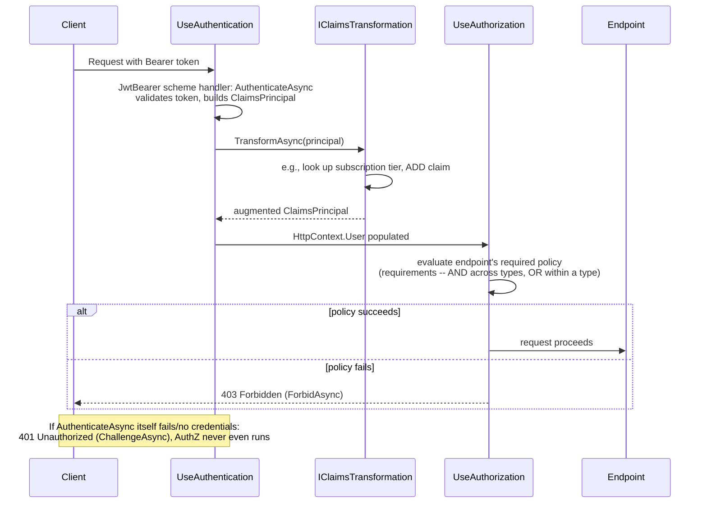
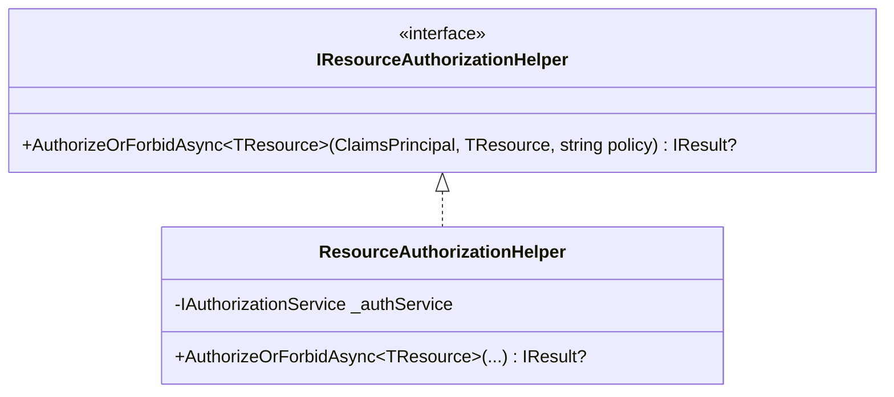
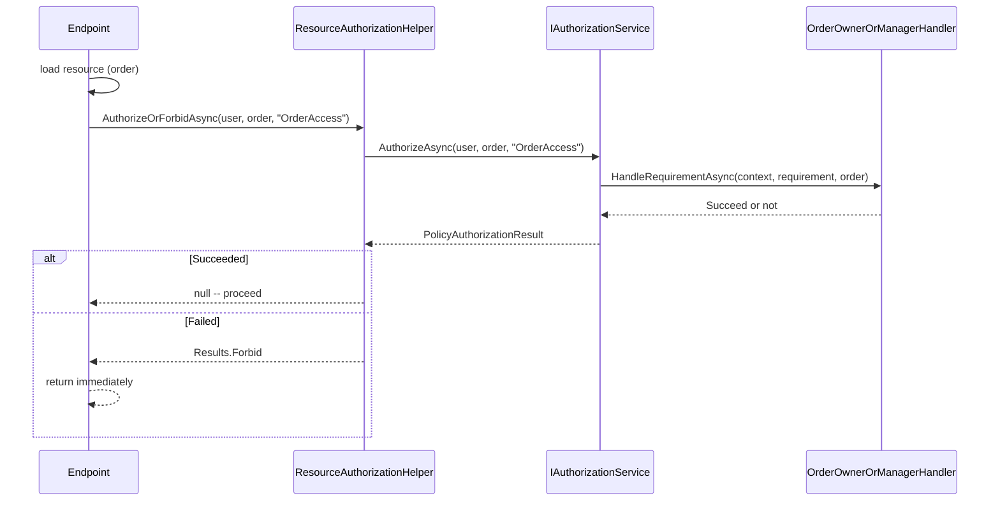

# Module 12 — ASP.NET Core: Authentication & Authorization Deep Dive

> Domain:.NET / ASP.NET Core | Level: Beginner → Expert | Prerequisite: [[01-Middleware-Pipeline-Request-Internals]] (endpoint-metadata-driven authorization ordering), [[03-MinimalAPIs-vs-Controllers-ModelBinding]] (endpoint filters); connects forward to a later dedicated OAuth2/OIDC/JWT/PKCE module

---

## 1. Topic Description

### Definition

**Authentication** establishes *who* the caller is: an authentication handler for a named **scheme** validates a credential and populates `HttpContext.User` with a `ClaimsPrincipal`. **Authorization** decides whether that principal may perform *this* operation: the policy engine evaluates a named `AuthorizationPolicy` — a set of `IAuthorizationRequirement`s, each satisfied by one or more handlers — against the principal and, for resource-based checks, against a loaded object. The two run at different points in the pipeline for a structural reason: authorization needs the *selected endpoint's* metadata, so it must sit between `UseRouting` and endpoint execution, while authentication has no such dependency.

### Core sub-concepts

- **Schemes and handlers** — `AuthenticateAsync` / `ChallengeAsync` / `ForbidAsync`; the 401-versus-403 distinction and why confusing them causes client redirect loops.
- **Multiple schemes** — default scheme semantics, per-endpoint scheme selection, mixing cookie/OIDC for browsers with bearer for machines.
- **`ClaimsPrincipal` and `ClaimsIdentity`** — multiple identities from multiple schemes, and scoping a claim lookup to its source.
- **Claims transformation** — `IClaimsTransformation` for enriching the principal once per request, with caching and staleness trade-offs.
- **Policies, requirements and handlers** — requirements AND-ed, handlers for one requirement OR-ed, and why adding a handler can silently widen access.
- **Default vs fallback policy** — the fallback applies to endpoints with *no* authorization metadata, making the system deny-by-default.
- **`[AllowAnonymous]` precedence** — it overrides every policy including the fallback.
- **Resource-based authorization** — `IAuthorizationService.AuthorizeAsync(user, resource, policy)` after loading the object; why attributes structurally cannot do this.
- **Roles vs claims vs permissions** — role explosion, and policies named for operations as the indirection that survives an access-model redesign.
- **Cookie authentication and Data Protection** — the key ring, sharing and persisting it, and what breaks on scale-out or restart.
- **JWT validation parameters** — signature, issuer, audience, lifetime, algorithm; JWKS key rotation.
- **Antiforgery and `SameSite`** — when CSRF protection is required (cookie-credentialed requests) and when it is not (bearer headers).
- **Multi-tenant isolation and workload identity** — tenant from the principal not the payload; per-service identity for service-to-service calls.

### Where it fits

This sits inside the middleware pipeline and depends on the DI container for scheme and policy registration and on configuration for keys and issuer metadata. Upward it is the enforcement point for every data-access decision, and it is only *one* of the entry paths into an operation — a message consumer, a scheduled job or an internal call reaches the same code without passing any attribute, which is why authorization that lives only at the controller is bypassable by design.

### Why it matters at scale

These are the highest-severity defects a service can ship: they are silent, they pass every functional test written from the owner's perspective, and they are exactly what an attacker and an auditor both look for. Missing object-level authorization means any authenticated user reads any record by changing an ID. A `TenantId` accepted from the request body means one missing check is a cross-tenant breach. A Data Protection key ring that is not shared means users are randomly logged out the moment you scale to three replicas — an availability incident caused by a default. And in a regulated environment, an inability to answer "who could approve a payment, and under which policy version" is an audit finding regardless of whether anything was actually exploited.

### Common pitfalls / anti-patterns

- **`UseAuthorization` outside the routing/endpoint window** — before `UseRouting` there is no endpoint metadata to read, so policies silently do not apply.
- **Relying on `[Authorize]` being remembered rather than setting a fallback policy** — a forgotten attribute is an open endpoint instead of a 401.
- **Endpoint-level checks with no object-level check** — the classic broken-object-level-authorization flaw; the endpoint looks protected in review and leaks every record.
- **Taking the tenant or user identifier from the request body** — lets the caller choose whose data they operate on; authorisation-relevant values must derive from the credential.
- **Disabling signature, audience or lifetime validation to "make it work"** — audience skipping alone accepts tokens minted for a different service, which is cross-service privilege escalation.
- **An unshared or unpersisted Data Protection key ring** — cookies issued by one instance are rejected by another and invalidated on restart, presenting as random logouts correlated with deployments.
- **Modelling fine-grained access as roles** — combinatorial role explosion produces a set nobody can audit or reason about, and it cannot be changed without a deployment.
- **Baking permissions into a long-lived token with no revocation path** — a permission change takes effect only at next sign-in, and the acceptance of that window is usually discovered during an incident.

> Scope note: pipeline ordering belongs to `01-Middleware-Pipeline-Request-Internals`; DI registration mechanics to `02-DI-Container-Internals`; model binding and over-posting to `03-MinimalAPIs-vs-Controllers-ModelBinding`. Identity architecture, directories and privileged access live in `40-IAM`; OAuth2/OIDC flows, token lifecycle and PKCE in `41-OAuth2-OIDC-JWT-PKCE`.

---

## 2. Beginner (10 Q&A)


**Q1. What is the difference between authentication and authorization in this framework, and where does each run?**
**A:** Authentication establishes identity and populates `HttpContext.User` — it runs in `UseAuthentication`, before routing has any bearing on it. Authorization decides whether that identity may perform the selected operation, and runs in `UseAuthorization`, which must sit between `UseRouting` and endpoint execution because it needs the endpoint's metadata to know which policy applies. The clean mental model is that authentication is about the caller and authorization is about the caller *plus* the operation — which is why authorization cannot be a purely pipeline-level concern once resources are involved.
*Follow-up: What happens if `UseAuthorization` is registered before `UseRouting`?*

**Q2. When does the framework return 401 versus 403?**
**A:** 401 is a *challenge*: the caller is not authenticated, or their credentials were not accepted, and the response tells them how to authenticate. 403 is a *forbid*: the caller is authenticated, we know who they are, and they are not permitted. Getting this wrong matters operationally — returning 401 for a permission failure causes clients to loop through re-authentication forever, and returning 403 for an expired token stops clients refreshing it. The framework picks the right one automatically if you use the authorization pipeline rather than hand-rolling checks.
*Follow-up: A client is stuck in a redirect loop after their token expires. Which end of this is wrong?*

**Q3. What is a `ClaimsPrincipal` and why can it contain multiple identities?**
**A:** It is the representation of the authenticated caller: a collection of `ClaimsIdentity` objects, each a set of claims from one source. Multiple identities exist because a caller can be authenticated by more than one scheme at once — a cookie plus an API key, or an application identity plus a delegated user identity. That matters when checking claims, because a naive lookup searches across all identities and may find a claim from a source you did not intend to trust. Being explicit about which identity a claim came from is a real concern in systems with multiple schemes.
*Follow-up: How would you check a claim only from a specific authentication scheme?*

**Q4. Explain how policies, requirements and handlers fit together.**
**A:** A policy is a named set of requirements; each requirement is a marker of something that must be satisfied; each handler evaluates one requirement and either succeeds or does nothing. The combination rule is the part people get wrong: multiple *requirements* in a policy must all succeed (AND), but multiple *handlers* for the same requirement mean any one succeeding is enough (OR). That OR behaviour is deliberate — it lets you satisfy "can edit this document" by being the owner or an admin — but it also means adding a handler can silently widen access.
*Follow-up: How would you express "must be an owner AND must have completed MFA"?*

**Q5. What is a fallback policy and why does it matter more than the default policy?**
**A:** The default policy is what `[Authorize]` with no arguments means. The fallback policy is what applies to endpoints with *no* authorization metadata at all — so setting it to `RequireAuthenticatedUser` turns the system deny-by-default, meaning a forgotten `[Authorize]` results in a 401 rather than open access. That single configuration converts the most common authorization defect from a silent vulnerability into an obvious failure, which is why I would treat it as mandatory rather than optional in any service handling non-public data.
*Follow-up: With a fallback policy set, how do you expose a genuinely public endpoint?*

**Q6. How does `[AllowAnonymous]` interact with policies?**
**A:** It wins. `[AllowAnonymous]` short-circuits authorization regardless of what policies are applied at controller, group or fallback level, so an accidentally-placed attribute silently exposes an endpoint that every other control believes is protected. Because it overrides everything, it deserves specific review attention and, in a sensitive codebase, an automated check that enumerates anonymous endpoints and compares them against an approved list. Treating it as an explicitly-registered exception rather than an ordinary attribute is the safer posture.
*Follow-up: How would you enumerate every anonymous endpoint at startup?*

**Q7. What is resource-based authorization and why can't attributes do it?**
**A:** Attributes evaluate before the handler runs, so they only know the caller and the endpoint — they cannot know whether *this* caller owns *this* record, because the record has not been loaded yet. Resource-based authorization uses `IAuthorizationService.AuthorizeAsync(user, resource, policy)` after loading the resource, letting a handler compare the caller against the resource's owner or tenant. Missing this layer is the most common serious API vulnerability there is: authenticated users fetching other users' data by changing an ID.
*Follow-up: Should a failed resource check return 403 or 404, and why?*

**Q8. What does the Data Protection stack do, and what breaks when it is misconfigured?**
**A:** It provides the keys used to encrypt and sign authentication cookies, antiforgery tokens and anything else using the protection APIs, managed as a key ring with automatic rotation. By default keys are stored locally and, in a container, ephemerally — so on scale-out each instance has different keys and a cookie issued by one instance is rejected by another, and on restart every existing cookie becomes invalid. The symptom is random logouts that correlate with deployments or load balancing. The fix is a shared, persisted key ring, itself encrypted at rest with a managed key.
*Follow-up: You move to three replicas and users are randomly logged out. What exactly is happening?*

**Q9. What must be validated on an incoming JWT, and what happens if any of it is skipped?**
**A:** Signature against the issuer's current keys, issuer, audience, expiry and not-before, and the algorithm — never trusting the token's own header to choose it. Skipping signature validation means anyone can mint a token; skipping audience validation means a token issued for a different service is accepted here, which is a real cross-service privilege escalation; skipping expiry means a leaked token is valid forever. These get disabled during development to "make it work" and then ship, which is why validation configuration deserves explicit review and a test asserting a tampered token is rejected.
*Follow-up: How do keys rotate without downtime, and what does your service need to do to keep up?*

**Q10. When are antiforgery tokens needed and when are they not?**
**A:** They defend against cross-site request forgery, which is only possible when the browser attaches credentials automatically — cookies. A cookie-authenticated form post needs antiforgery protection; an API authenticated with a bearer token in a header does not, because the browser will not attach that header cross-site. The nuance worth knowing is `SameSite` cookie behaviour, which mitigates much of the classic attack but is not a complete replacement, and the fact that a service using cookies for some endpoints and bearer tokens for others needs both models understood rather than one blanket setting.
*Follow-up: An API uses cookie auth because it's called from the same site's SPA. What do you require?*

---

## 3. Intermediate (10 Q&A)


**Q1. A service supports both a browser SPA and machine-to-machine callers. How do you configure schemes?**
**A:** Register both schemes — cookie or OIDC for the interactive path, JWT bearer for machine callers — and select per endpoint rather than relying on a single default, since the default determines what a bare `[Authorize]` means and getting that wrong either breaks one class of caller or silently accepts the wrong credential type. Policies then specify the acceptable schemes explicitly. I would also make the challenge behaviour differ appropriately: a browser gets a redirect, an API client gets a 401 with a `WWW-Authenticate` header, and mixing those produces the classic "API client receives an HTML login page" bug.
*Follow-up: How do you make a single endpoint accept either scheme?*

**Q2. Roles versus claims versus policies — how do you decide?**
**A:** Roles are coarse identity groupings and work only while the set stays small; they degrade badly, because expressing fine-grained access as roles produces combinatorial role explosion and roles named after individual features. Claims carry attributes about the caller; policies express the *decision* and can combine claims, roles, resource state and external checks. My guidance is to use policies as the unit that code depends on, with names describing the operation (`CanApprovePayment`) rather than the identity, so the underlying mapping from roles or permissions can change without touching endpoint code. That indirection is what makes the model survive an access-model redesign.
*Follow-up: You have 40 roles and it's unmanageable. What's the migration to permissions?*

**Q3. Where should authorization decisions live in a layered application?**
**A:** Coarse decisions (is this caller allowed to invoke this operation at all) belong at the endpoint via policies; fine, data-dependent decisions belong close to the data, in the application or domain layer, because that is the only place with the resource in hand. The critical point is that the endpoint is *not* the only entry path — a message consumer, a scheduled job or an internal API call reaches the same operation without passing any attribute — so authorization that exists only at the controller is bypassable by design. Anything protecting data rather than an HTTP route needs to be enforced where the operation actually happens.
*Follow-up: How do you handle authorization for an operation triggered by a queue message with no user?*

**Q4. How do you implement multi-tenant isolation so a single missed check cannot leak data?**
**A:** In depth, and never by relying on developers to remember a filter. Tenant identity comes from the authenticated principal, never from the request payload; a global query filter applies the tenant predicate automatically; and the database enforces it too, via row-level security or per-tenant credentials, so an application bug alone is not sufficient to cross the boundary. On top of that I would run automated tests that authenticate as tenant A and assert that every repository method returns nothing for tenant B's identifiers. The design principle is that isolation should be a property of the infrastructure, with the application layer as a second line rather than the only one.
*Follow-up: A reporting job legitimately needs cross-tenant access. How do you permit that safely?*

**Q5. How would you implement permission checks that depend on data without wrecking performance?**
**A:** Load the permission set once per request into the principal or a scoped context, rather than querying per check — a handler that hits the database on every authorization evaluation turns one request into dozens of round-trips. `IClaimsTransformation` is the natural place to enrich the principal, with caching keyed on the user and invalidated on permission change. The trade-off to be explicit about is staleness: cached permissions mean a revoked permission remains effective until expiry, which is a business decision about the acceptable revocation window rather than a technical detail to default silently.
*Follow-up: The business requires revocation to take effect within 60 seconds. How does that change your design?*

**Q6. What are the operational consequences of long-lived versus short-lived tokens?**
**A:** Long-lived tokens reduce load on the identity provider and simplify clients, but they extend the window in which a stolen token is usable and make revocation effectively impossible without introspection or a deny list. Short-lived tokens with refresh give you a real revocation window at the cost of more traffic to the IdP, which then becomes a critical dependency whose outage logs everyone out. The design decision is where you want the failure: I would generally take short access tokens with a resilient IdP and cached signing keys, and be explicit that token lifetime is a security-versus-availability trade with a named owner rather than a default nobody chose.
*Follow-up: The identity provider goes down. What should your service do with tokens that are still valid?*

**Q7. How do you test authorization meaningfully?**
**A:** By testing the negatives, because the positive path is what everyone writes and what never fails. That means integration tests asserting: an unauthenticated request gets 401, an authenticated-but-unentitled request gets 403, a caller from tenant A cannot read tenant B's resource by ID, and every endpoint has an authorization policy attached. The last one is best done as a test that enumerates the endpoint data source and asserts on metadata, since it catches the newly-added endpoint that nobody remembered to protect. Unit tests of individual handlers are worth having, but they cannot catch the failure that actually happens, which is a policy not being applied at all.
*Follow-up: How do you write that endpoint-enumeration test so it fails helpfully rather than cryptically?*

**Q8. A user's permissions are changed but the change takes effect only after they log out. Why, and what do you do?**
**A:** Because the permissions were baked into a token or cookie at sign-in and nothing re-evaluates them until it is reissued. The options are: short token lifetimes so the window is bounded; a server-side check on each request, which reintroduces the per-request lookup you were avoiding; validation events on the cookie handler that re-check a security stamp; or a revocation list checked at the gateway. Which is right depends on how quickly the business requires revocation to take effect, and that requirement should be stated explicitly — teams usually discover they have accepted a 24-hour window only when someone asks during an incident.
*Follow-up: How does a security stamp work, and what does it cost per request?*

**Q9. How do you handle authorization for service-to-service calls?**
**A:** With workload identity rather than shared secrets: each service gets its own credential (managed identity, mTLS certificate, or a client-credentials token) so calls are attributable and revocable individually. Then decide explicitly whether the downstream service authorises the *calling service*, the *original user*, or both — propagating the user's identity via token exchange or an on-behalf-of flow when the downstream needs to enforce user-level rules. The anti-pattern is a shared "internal" credential with broad rights and an implicit assumption that anything inside the network is trusted, which fails completely once one service is compromised.
*Follow-up: The downstream service needs the original user's identity. How do you propagate it without letting a service impersonate arbitrary users?*

**Q10. How do you diagnose "this request is being denied and I don't know why"?**
**A:** Authorization failures are deliberately uninformative to the caller, so the diagnosis must come from the server side: log the evaluated policy, which requirements failed, and the principal's relevant claims — with the caveat that logging claims can itself be a data-protection issue, so it needs to be scoped and access-controlled. The framework's authorization events and debug-level logging expose most of this. I would also make the response carry a correlation ID so a user's report maps to a specific decision in the logs. Building this before it is needed is the difference between a five-minute answer and a day of guessing.
*Follow-up: Which claims are safe to log, and how would you enforce that?*

---

## 4. Expert / Architect (10 Q&A)


**Q1. How would you design an authorization model for a large system that will outlive its current org chart?**
**A:** Separate the three layers that people usually conflate: identity (who you are), entitlements (what has been granted, managed by the business), and enforcement (what code checks). Application code should depend on stable, operation-named permissions; the mapping from users and groups to those permissions belongs in a system the business can change without a deployment. That indirection is what lets roles be reorganised, a new business unit be onboarded, or an access review be conducted without touching services. I would also insist that entitlement changes are auditable and that every enforcement point is discoverable, because in a regulated environment the ability to answer "who can approve a payment and why" is a requirement, not a nice-to-have.
*Follow-up: Where do you draw the line between RBAC and ABAC, and what does ABAC cost operationally?*

**Q2. Centralised authorization service versus in-process policy evaluation — how do you choose?**
**A:** Centralised gives consistency, one place for audit and change, and is attractive to compliance; the costs are a hot-path network dependency, availability coupling, and latency on every decision. In-process evaluation is fast and resilient but drifts, because each service ends up with its own interpretation of the rules. The pattern I favour is centralised *policy authoring and distribution* with local evaluation — policies and entitlement data pushed to services and evaluated in-process, with caching and a bounded staleness window. That keeps the hot path local while keeping the source of truth central, and it degrades to "last known good policy" rather than to an outage.
*Follow-up: How do you handle policy propagation delay when a permission is revoked for cause?*

**Q3. What is your approach to enforcing deny-by-default across dozens of services?**
**A:** Make the secure configuration the inherited default: a platform package that sets the fallback policy, wires the standard schemes, and configures token validation correctly, so a service must actively opt out rather than actively opt in. Then verify rather than trust — a CI check that enumerates endpoints and fails on any without an authorization policy or an approved anonymous exemption, plus periodic scanning of deployed services. The organisational half is that anonymous endpoints require a recorded exception with an owner, which turns an invisible risk into a reviewable list. Guidance alone reliably fails here, because the failure is an omission and omissions are exactly what review misses.
*Follow-up: A team disables the shared package's fallback policy to unblock a release. How do you find out and what do you do?*

**Q4. How do you handle the migration from an old authentication mechanism to a new one with zero downtime?**
**A:** Run both in parallel: accept the old and new credentials simultaneously, with telemetry attributing every authenticated request to its mechanism so you can see actual migration progress rather than guessing. Migrate clients in waves, keep a hard cut-off date with an owner, and ensure the old path is disabled by configuration so it can be turned off quickly if it turns out to be a liability. The parts teams underestimate are long-lived sessions and cached tokens — which extend the tail far beyond the client migration — and the Data Protection key ring, which must be preserved across the transition or every existing session breaks on the first deploy. I would also plan the rollback explicitly, because auth changes are the ones where an incident is severe.
*Follow-up: Telemetry shows 0.3% of traffic still on the old mechanism after six months. How do you close it out?*

**Q5. How do you make authorization decisions auditable to a standard that satisfies a regulator?**
**A:** Every decision that matters — grants, denials on sensitive operations, privileged access use, and every entitlement change — needs a durable, tamper-evident record with who, what, when, on what resource, and under which policy version. That is distinct from application logging: it needs defined retention, restricted access, and completeness guarantees, so it should not be sampled or best-effort. Policy itself must be versioned so a past decision can be explained against the rules in force at the time, which is the requirement most systems fail. I would design the audit path to have its own delivery guarantee (an outbox or append-only store) and treat a failure to record as a first-class failure where the regulation demands it.
*Follow-up: Recording synchronously adds latency to every sensitive operation. How do you evaluate that trade?*

**Q6. What is your view on token size and claim bloat at scale?**
**A:** It is a real operational problem: every claim is carried on every request, so a token stuffed with permissions costs bandwidth, can exceed header limits at proxies and gateways, and is expensive to validate and log. Beyond a few kilobytes you start hitting infrastructure limits that fail in confusing ways. The fix is to carry identity and a small set of stable claims in the token, and to resolve fine-grained permissions server-side with caching — which also improves revocation, since the token is no longer the source of truth for entitlements. I would set an explicit size budget and monitor it, because claim bloat accumulates one reasonable-sounding addition at a time.
*Follow-up: A team wants to add a per-tenant permission array to the token. How do you respond?*

**Q7. How do you approach authorization in an event-driven system where operations are triggered without a user?**
**A:** By deciding explicitly what authority a message carries. The options are: propagate the original user's identity in the message so the consumer can enforce user-level rules; give the consumer its own service identity and authorise it as a system actor; or treat authorisation as having happened at the point of command acceptance and record that decision in the event. Each is defensible, and the failure is not choosing — which produces consumers that either enforce nothing or reconstruct identity inconsistently. I would also be careful that propagated identity in a message is signed or otherwise trustworthy, since a message on an internal bus is not automatically authentic, and long-lived messages can outlive the permissions they were issued under.
*Follow-up: A message sits in a DLQ for three days and is replayed. Whose permissions apply?*

**Q8. How would you assess the security posture of an inherited service's auth implementation in a day?**
**A:** I would check, in order: is there a fallback policy or is protection per-endpoint; what does the anonymous-endpoint list look like; is token validation fully configured, including audience and signature; is Data Protection shared and persisted; is there any object-level authorization or only endpoint-level; where does tenant identity come from; and are there hand-rolled checks bypassing the policy engine. Each of those has a fast, concrete answer and each maps to a specific severe failure mode. I would also grep for disabled validation flags and for `AllowAnonymous`, which surface the most common deliberate weakening. That set gives a defensible risk picture quickly, which is what a day buys you.
*Follow-up: You find object-level authorization missing entirely across 80 endpoints. How do you sequence the remediation?*

**Q9. How do you balance security requirements against developer velocity when they genuinely conflict?**
**A:** By moving the cost into the platform rather than onto every team: if the secure path is also the easy path — a package that configures everything correctly, templates that start deny-by-default, test helpers that make writing negative authorization tests trivial — the conflict largely disappears. Where a genuine conflict remains, I would frame it as a risk decision with a named owner and a documented acceptance rather than an engineering argument, because that is what it actually is. What I would not do is grant blanket exceptions to unblock a date, since auth exceptions have a way of becoming permanent and are exactly what shows up in a post-incident review.
*Follow-up: A director asks you to ship with a known authorization gap to hit a regulatory deadline. How do you handle it?*

**Q10. What does a mature authorization architecture look like five years in, and what usually goes wrong on the way?**
**A:** Mature looks like: deny-by-default everywhere; permissions named for operations and decoupled from org structure; entitlements managed outside code with audit; enforcement close to the data so non-HTTP paths are covered; and automated verification that every entry point is protected. What goes wrong on the way is almost always accretion — roles added per feature until nobody can describe who can do what, authorization logic duplicated across services with subtle differences, and exceptions granted for migrations that never complete. The counter is treating the access model as a product with an owner and a periodic review, rather than as a thing each team extends locally. Without that ownership, the model degrades regardless of how well it was designed initially.
*Follow-up: You've inherited exactly that accreted model. What's the first thing you'd change, and why that one?*

---

## 5. Reference Material

> Retained from the original module: deep-dive internals, diagrams, production examples, exercises, system/low-level design, debugging walkthroughs and the Principal Engineer perspective.

### 1. Fundamentals

#### What is authentication, and what is authorization?
**Authentication** answers *"who are you?"* — establishing the identity of the caller, producing a `ClaimsPrincipal` (a set of claims — key/value facts about the identity — grouped into one or more `ClaimsIdentity` objects) attached to `HttpContext.User`. **Authorization** answers *"are you allowed to do this?"* — a separate, subsequent decision evaluated **against** the already-established identity (and the specific resource/endpoint being accessed), producing a simple allow/deny result.

#### Why are they modeled as distinct, pluggable systems in ASP.NET Core?
Because **many different mechanisms** can establish identity (a cookie, a JWT bearer token, an API key, a client certificate, a third-party OAuth provider) and **many different policies** can govern access (a simple role check, a complex multi-claim business rule, a resource-specific ownership check) — conflating the two into one monolithic system would prevent mixing/matching (e.g., "authenticate via JWT, but authorize using a rich, business-logic-driven policy" or "support both cookie and API-key authentication simultaneously for different client types on the same API"). ASP.NET Core's **authentication schemes** (pluggable identity-establishing mechanisms) and **authorization policies** (pluggable, composable access-decision logic) are deliberately independent, composable systems precisely to support this flexibility.

#### When does this matter?
- **Always**, for any API/application with meaningful access control — but *deeply* understanding the mechanics matters specifically for:
 - Correctly supporting multiple simultaneous authentication schemes (a common real-world requirement — first-party web clients via cookies, third-party partners via API keys, service-to-service calls via JWT).
 - Designing authorization policies that go beyond simple role checks (resource-based/ownership-based authorization — "can this user edit *this specific* order," not just "is this user an Editor").
 - Diagnosing the very common "why did this request get a 401 instead of my custom logic running" / "why is `[Authorize(Roles = "Admin")]` not working" class of bug.
 - Interviewing — a genuinely deep answer here (policy-based authorization, claims transformation, scheme selection) is a strong Staff/Principal-level differentiator over a surface-level "we use `[Authorize]` attributes" answer.

#### How does it work (30,000-ft view)?

```csharp
builder.Services.AddAuthentication(options => options.DefaultScheme = "Cookies")
.AddCookie("Cookies")
.AddJwtBearer("Bearer", options => { /* token validation parameters */ });

builder.Services.AddAuthorization(options =>
    {
        options.AddPolicy("CanEditOrders", policy =>
            policy.RequireClaim("permission", "orders:edit"));
});

app.UseAuthentication; // populates HttpContext.User by running the matched scheme's handler
app.UseAuthorization; // evaluates the endpoint's required policy against HttpContext.User

app.MapPut("/orders/{id}", UpdateOrder)
.RequireAuthorization("CanEditOrders");
```

Mental model for interviews: **"Authentication middleware runs the appropriate scheme handler(s) to populate `HttpContext.User` with a `ClaimsPrincipal`. Authorization middleware then evaluates a policy — a composable set of requirements — against that principal and the current request/resource, producing allow or deny. Schemes and policies are independent, pluggable, and can be mixed and matched."**

### 2. Deep Dive

#### 2.1 `ClaimsPrincipal`/`ClaimsIdentity`/`Claim` — the Identity Data Model

- A **`Claim`** is a single key-value assertion about the identity (`ClaimTypes.Name = "alice"`, `"permission" = "orders:edit"`, `"tenant_id" = "acme-corp"`), optionally with an issuer.
- A **`ClaimsIdentity`** is a named collection of claims, associated with a specific authentication scheme/method (`AuthenticationType`) — a principal can carry **multiple** identities simultaneously (e.g., one from a cookie scheme and one from an external OAuth provider, in a multi-scheme scenario), though the common case is one identity.
- A **`ClaimsPrincipal`** wraps one or more `ClaimsIdentity` objects and is what `HttpContext.User` actually is — `User.Identity.Name`, `User.IsInRole(...)`, `User.HasClaim(...)` all operate across the principal's identities.

#### 2.2 Authentication Schemes — Precisely How Multiple Schemes Coexist

Each registered scheme (`AddCookie("Cookies")`, `AddJwtBearer("Bearer")`, a custom `AddApiKey("ApiKey")`) has its own **handler** implementing `IAuthenticationHandler`, responsible for: (a) `AuthenticateAsync` — attempt to extract and validate credentials from the current request (a cookie, an `Authorization: Bearer` header, an API-key header) and produce a `ClaimsPrincipal` if successful; (b) `ChallengeAsync` — what to do when an **unauthenticated** request hits a protected resource (redirect to a login page for cookies; return `401 WWW-Authenticate: Bearer` for JWT); (c) `ForbidAsync` — what to do when an **authenticated-but-not-authorized** request is denied (typically a `403`).

**Scheme selection** for a given endpoint is determined by: an explicit `[Authorize(AuthenticationSchemes = "Bearer")]`/`.RequireAuthorization(...)` specifying which scheme(s) apply, or, absent that, the configured **default scheme** — `UseAuthentication` middleware runs **every** registered scheme's `AuthenticateAsync` unless scoped, populating `HttpContext.User` with whichever scheme(s) actually apply to the incoming request's credentials (a cookie present triggers the cookie scheme; a bearer token present triggers the JWT scheme) — **it is entirely possible, and common, for a single request to be simultaneously "authenticated" under multiple schemes** if it happens to carry credentials for more than one (rare in practice, but architecturally important to understand for correctly reasoning about multi-scheme APIs).

#### 2.3 Policy-Based Authorization — Requirements and Handlers

An authorization **policy** is a named collection of **requirements** (`IAuthorizationRequirement`), each evaluated by one or more **handlers** (`AuthorizationHandler<TRequirement>`). The built-in `RequireClaim`/`RequireRole`/`RequireAuthenticatedUser` are convenience methods that add pre-built requirement/handler pairs — but the real power is **custom requirements** for business-logic-driven decisions:

```csharp
public class MinimumAccountAgeRequirement: IAuthorizationRequirement
{
    public TimeSpan MinimumAge { get; }
    public MinimumAccountAgeRequirement(TimeSpan minimumAge) => MinimumAge = minimumAge;
}

public class MinimumAccountAgeHandler: AuthorizationHandler<MinimumAccountAgeRequirement>
{
    protected override Task HandleRequirementAsync(
        AuthorizationHandlerContext context, MinimumAccountAgeRequirement requirement)
    {
        var createdAtClaim = context.User.FindFirst("account_created_at");
        if (createdAtClaim is not null
            && DateTimeOffset.Parse(createdAtClaim.Value) <= DateTimeOffset.UtcNow - requirement.MinimumAge)
        {
            context.Succeed(requirement); // marks THIS requirement satisfied
        }
        return Task.CompletedTask;
        // NOTE: not calling context.Succeed does NOT fail the policy immediately --
        // it simply leaves this requirement unsatisfied; the policy overall fails only if
        // ANY requirement remains unsatisfied after ALL handlers have run.
    }
}
```
**Critical, frequently-tested fact**: a policy succeeds only if **every** requirement in it is satisfied — but an individual handler **choosing not to call `context.Succeed`** does not immediately fail the whole evaluation; it simply means that specific requirement remains unsatisfied, and **other handlers for the same requirement type** (multiple handlers can register for the same requirement) get a chance to satisfy it too (an "OR" relationship **between handlers for the same requirement**, combined with an "AND" relationship **across different requirements** in the same policy) — a genuinely subtle, commonly-misunderstood evaluation semantic worth knowing precisely.

#### 2.4 Resource-Based Authorization — Beyond "Is This User an Admin"

The examples so far check claims/roles **independent of any specific resource** — but a huge, common real-world need is: **"can this specific user edit *this specific* order"** (an ownership/resource-based check), which requires the actual resource instance to be available at authorization-decision time:

```csharp
public class OrderOwnerRequirement: IAuthorizationRequirement { }

public class OrderOwnerHandler: AuthorizationHandler<OrderOwnerRequirement, Order>
{
    protected override Task HandleRequirementAsync(
        AuthorizationHandlerContext context, OrderOwnerRequirement requirement, Order resource)
    {
        var userId = context.User.FindFirstValue(ClaimTypes.NameIdentifier);
        if (resource.CustomerId == userId) context.Succeed(requirement);
        return Task.CompletedTask;
    }
}

// Usage inside an endpoint/controller (imperative, resource-based check -- NOT expressible via a
// simple [Authorize] attribute alone, since the attribute has no access to the specific loaded resource):
var order = await repository.GetByIdAsync(id);
var authResult = await authorizationService.AuthorizeAsync(User, order, "OrderOwnerPolicy");
if (!authResult.Succeeded) return Forbid;
```
This is precisely why `[Authorize]` attributes alone (declarative, evaluated purely from endpoint metadata + the principal) **cannot** express ownership/resource-based checks — the resource itself (a specific `Order` instance) doesn't exist until the handler has already started executing and loaded it from the database; resource-based authorization is necessarily an **imperative** call to `IAuthorizationService.AuthorizeAsync(user, resource, policy)` from within the handler/action body, not a purely declarative attribute.

#### 2.5 Claims Transformation — `IClaimsTransformation`

`IClaimsTransformation.TransformAsync(ClaimsPrincipal principal)` runs **after** authentication succeeds but **before** authorization evaluates — a hook for **augmenting** the principal with additional claims not present in the original token/cookie (e.g., looking up a user's current subscription tier from a database and adding it as a claim, so authorization policies can check it without every policy handler needing its own database call). **Critical gotcha**: `IClaimsTransformation` runs on **every single request** (it's not cached across requests by default) — a transformation performing an expensive database lookup on every request is a real, easily-introduced performance problem (/), and its result is **not** persisted back into the original authentication cookie/token, meaning the same lookup repeats every request unless the application explicitly implements its own caching layer around it.

#### 2.6 The 401 vs 403 Distinction, Precisely

- **`401 Unauthorized`** ("who are you? I don't recognize your credentials, or you provided none") — the correct response when **authentication** fails or is absent for a resource requiring it; triggered by the scheme handler's `ChallengeAsync`.
- **`403 Forbidden`** ("I know who you are, but you're not allowed to do this") — the correct response when authentication **succeeded** but **authorization** subsequently denies the request; triggered by `ForbidAsync`.
- A common, real bug: returning `401` for an authorization failure (leaking information about *why* access was denied in a subtly wrong way, and technically violating HTTP semantics) or, conversely, `403` for a genuinely unauthenticated request (some security guidance argues `401` is more appropriate specifically to avoid confirming a resource's existence to an unauthenticated caller, an intentional information-hiding consideration — worth knowing this is a deliberate design decision some APIs make, not just an implementation detail to get "right" or "wrong" universally).

### 3. Visual Architecture

#### Authentication + Authorization Sequence


```mermaid
sequenceDiagram
 participant C as Client
 participant AuthN as UseAuthentication
 participant Transform as IClaimsTransformation
 participant AuthZ as UseAuthorization
 participant E as Endpoint

 C->>AuthN: Request with Bearer token
 AuthN->>AuthN: JwtBearer scheme handler: AuthenticateAsync<br/>validates token, builds ClaimsPrincipal
 AuthN->>Transform: TransformAsync(principal)
 Transform->>Transform: e.g., look up subscription tier, ADD claim
 Transform-->>AuthN: augmented ClaimsPrincipal
 AuthN->>AuthZ: HttpContext.User populated
 AuthZ->>AuthZ: evaluate endpoint's required policy<br/>(requirements -- AND across types, OR within a type)
 alt policy succeeds
 AuthZ->>E: request proceeds
 else policy fails
 AuthZ-->>C: 403 Forbidden (ForbidAsync)
 end
 Note over AuthN,C: If AuthenticateAsync itself fails/no credentials:<br/>401 Unauthorized (ChallengeAsync), AuthZ never even runs
```

#### Requirement Evaluation Logic (ASCII)

```
Policy "CanEditOrders" = [ RequireRoleRequirement("Editor"), MinimumAccountAgeRequirement(30 days) ]

 ┌─────────────────────────────┐
 │ RequireRoleRequirement │◄── Handler A: checks role -- Succeed or not
 │ (must be satisfied) │◄── Handler B (if registered): ALSO gets a chance
 └─────────────────────────────┘ (OR relationship between handlers for SAME requirement)
 AND
 ┌─────────────────────────────┐
 │ MinimumAccountAgeRequirement │◄── Handler C: checks claim -- Succeed or not
 │ (must be satisfied) │
 └─────────────────────────────┘

Policy succeeds ONLY IF: (RequireRoleRequirement satisfied by ANY of its handlers)
 AND (MinimumAccountAgeRequirement satisfied by ANY of its handlers)
```

### 4. Production Example

#### Scenario: Partner API platform — an `IClaimsTransformation` causing a slow, cascading authentication-layer outage

**Problem**: A B2B API platform serving multiple partner integrations via JWT bearer tokens experienced a severe, platform-wide latency degradation (p99 response times across **every** authenticated endpoint, not just one specific feature) that began shortly after a seemingly-minor feature addition: a new `IClaimsTransformation` implementation added to enrich the principal with the caller's **current, real-time partner-tier/rate-limit-quota information**, looked up from a database, "so authorization policies could reference it without each one needing its own database call" (directly following the pattern described).

**Investigation**:
- `dotnet-counters`/APM tracing showed a database query (the partner-tier lookup) executing on **every single authenticated request**, platform-wide — including requests to endpoints that never actually *used* the partner-tier claim in any authorization policy at all.
- Confirmed `IClaimsTransformation.TransformAsync` runs unconditionally for **every** request reaching the authentication middleware, regardless of whether the specific endpoint being accessed has any policy that actually needs the added claim — the team had implemented it assuming (incorrectly) that it would only run when "needed," when in fact it runs universally, on the hot path of literally every authenticated request across the entire platform.
- Under the platform's actual traffic volume, this added one additional, synchronous database round-trip to every single request's critical path — the database connection pool, sized for the platform's existing query load, became a genuine bottleneck, and the resulting query queueing/contention degraded latency platform-wide, well beyond just the feature that had motivated the change.

**Architecture fix**:
- Replaced the per-request database lookup with a **short-TTL, in-memory-cached** lookup (`IMemoryCache`, keyed by partner ID, TTL of a few minutes) inside the `IClaimsTransformation` implementation — reducing the actual database query rate from "once per request" to "once per partner, per cache-TTL-window," a dramatic reduction given the platform's actual partner-to-request-volume ratio.
- Added a **feature-scoping guard**: the transformation now checks whether the current request's matched endpoint (`HttpContext.GetEndpoint`, directly reusing the endpoint-metadata mechanism) actually carries a marker indicating it needs the partner-tier claim, skipping the lookup entirely (cached or not) for the (large) majority of endpoints that never reference it — an even more targeted fix than caching alone, directly avoiding unnecessary work rather than just making the unnecessary work cheaper.
- Load-tested the fix at 2x production peak specifically exercising the authentication path before redeploying, given the platform-wide (not feature-scoped) blast radius this incident demonstrated `IClaimsTransformation` changes can have.

**Trade-offs**: The short-TTL cache introduces a small window (the cache's TTL) during which a partner-tier change (e.g., an upgrade/downgrade processed by a separate billing system) might not be immediately reflected in authorization decisions — accepted as a reasonable, deliberate trade-off given the alternative (a database call on every single request platform-wide) was demonstrably catastrophic at scale, and the business impact of a few minutes' staleness for a tier-change is minor compared to a platform-wide outage.

**Lessons learned**:
1. `IClaimsTransformation` runs on **every authenticated request across the entire application**, not scoped to specific endpoints by default — any expensive operation placed inside it has a platform-wide blast radius, not a feature-scoped one, making it a uniquely high-leverage (and high-risk) extension point.
2. A seemingly-reasonable, well-intentioned feature addition ("enrich the principal so policies don't each need their own lookup") can silently become a platform-wide performance bottleneck if the actual, universal-execution semantics of the extension point aren't fully understood before use.
3. Caching and, even better, endpoint-scoped conditional execution are both valid, complementary mitigations — caching reduces the cost of necessary work; scoping eliminates unnecessary work entirely, and combining both gives the strongest protection.

### 11. Coding Exercises

#### Easy — Implement a simple role-based policy and apply it to an endpoint
**Problem**: Restrict an endpoint to users with the "Manager" role.
```csharp
builder.Services.AddAuthorization(options =>
    {
        options.AddPolicy("ManagerOnly", policy => policy.RequireRole("Manager"));
});

app.MapDelete("/orders/{id}", DeleteOrder).RequireAuthorization("ManagerOnly");
```
**Discussion**: `RequireRole` is a convenience wrapper adding a pre-built `RolesAuthorizationRequirement` and its corresponding built-in handler — functionally equivalent to, but far less code than, hand-writing an equivalent custom `IAuthorizationRequirement`/`AuthorizationHandler<T>` pair for this simple case; reserve custom requirements/handlers for genuinely custom logic the built-ins can't express.

#### Medium — Implement resource-based (ownership) authorization
**Problem**: Ensure only the order's original customer (or a Manager) can view its details.
```csharp
public class OrderAccessRequirement: IAuthorizationRequirement { }

public class OrderOwnerOrManagerHandler: AuthorizationHandler<OrderAccessRequirement, Order>
{
    protected override Task HandleRequirementAsync(
        AuthorizationHandlerContext context, OrderAccessRequirement requirement, Order resource)
    {
        if (context.User.IsInRole("Manager")
            || resource.CustomerId == context.User.FindFirstValue(ClaimTypes.NameIdentifier))
        {
            context.Succeed(requirement);
        }
        return Task.CompletedTask;
    }
}

// Registration:
// services.AddAuthorization(o => o.AddPolicy("OrderAccess", p => p.Requirements.Add(new OrderAccessRequirement)))
// services.AddScoped<IAuthorizationHandler, OrderOwnerOrManagerHandler>

// Usage in the endpoint:
app.MapGet("/orders/{id}", async (string id, IOrderRepository repo, IAuthorizationService authService, ClaimsPrincipal user) =>
    {
        var order = await repo.GetByIdAsync(id);
        if (order is null) return Results.NotFound;

        var authResult = await authService.AuthorizeAsync(user, order, "OrderAccess");
        if (!authResult.Succeeded) return Results.Forbid;

        return Results.Ok(order);
});
```
**Discussion**: Note the deliberate ordering — the resource (`order`) is loaded **first** (needed regardless, for the actual business logic if access is granted), **then** the resource-based authorization check runs against it — exactly the pattern described, and impossible to express as a purely declarative `[Authorize]` attribute since the attribute has no way to reference `order` before it's been loaded inside the handler body.

#### Hard — Implement a stampede-resistant, cache-invalidatable claims transformation (Advanced Q4/Q7)
**Problem**: Fix the incident with both caching and explicit invalidation support, avoiding cache-stampede risk.
```csharp
public class PartnerTierClaimsTransformation: IClaimsTransformation
{
    private readonly IMemoryCache _cache;
    private readonly IPartnerRepository _repository;
    private static readonly SemaphoreSlim _lock = new(1, 1); // simplistic global lock -- a production version
    // would use a per-key lock collection for finer granularity

    public PartnerTierClaimsTransformation(IMemoryCache cache, IPartnerRepository repository)
    {
        _cache = cache;
        _repository = repository;
    }

    public async Task<ClaimsPrincipal> TransformAsync(ClaimsPrincipal principal)
    {
        var partnerId = principal.FindFirstValue("partner_id");
        if (partnerId is null) return principal; // not a partner-scoped caller -- nothing to enrich

        string cacheKey = $"partner-tier:{partnerId}";
        if (!_cache.TryGetValue(cacheKey, out string? tier))
        {
            await _lock.WaitAsync;
            try
            {
                // DOUBLE-CHECK after acquiring the lock -- another concurrent request may have
                // already populated the cache while this one was waiting for the lock.
                if (!_cache.TryGetValue(cacheKey, out tier))
                {
                    tier = await _repository.GetPartnerTierAsync(partnerId);
                    _cache.Set(cacheKey, tier, TimeSpan.FromSeconds(30)); // SHORT TTL, per §Advanced Q4's reasoning
                }
            }
            finally { _lock.Release; }
        }

        var identity = new ClaimsIdentity;
        identity.AddClaim(new Claim("partner_tier", tier?? "unknown"));
        principal.AddIdentity(identity);
        return principal;
    }

    // Explicit invalidation hook, called by whatever administrative action changes a partner's tier:
    public void InvalidatePartner(string partnerId) => _cache.Remove($"partner-tier:{partnerId}");
}
```
**Discussion points**: The double-checked-locking pattern (checking the cache, acquiring a lock, checking **again** before doing the expensive work) is precisely what prevents the cache-stampede scenario from Advanced Q7 — without the second check inside the lock, every request that arrived while the lock was held would still redundantly perform the database lookup once it eventually acquired the lock, one at a time, rather than benefiting from the first request's now-populated cache entry. A production implementation would replace the single global `SemaphoreSlim` with a per-key locking mechanism (to avoid serializing lookups for *different* partner IDs behind one shared lock) — flagged here explicitly as a known simplification, exactly the kind of "here's what I'd improve for real production use" honesty valuable to demonstrate in an interview setting rather than presenting a simplified exercise as production-complete without qualification.

#### Expert — Implement step-up authentication (Advanced Q8) end-to-end
**Problem**: Implement the step-up (recent-authentication) authorization requirement from Advanced Q8, including the client-facing signal for triggering re-authentication.
```csharp
public class RecentAuthenticationRequirement: IAuthorizationRequirement
{
    public TimeSpan MaxAge { get; }
    public RecentAuthenticationRequirement(TimeSpan maxAge) => MaxAge = maxAge;
}

public class RecentAuthenticationHandler: AuthorizationHandler<RecentAuthenticationRequirement>
{
    protected override Task HandleRequirementAsync(
        AuthorizationHandlerContext context, RecentAuthenticationRequirement requirement)
    {
        var authTimeClaim = context.User.FindFirst("auth_time");
        if (authTimeClaim is not null
            && long.TryParse(authTimeClaim.Value, out var authTimeUnix))
        {
            var authTime = DateTimeOffset.FromUnixTimeSeconds(authTimeUnix);
            if (DateTimeOffset.UtcNow - authTime <= requirement.MaxAge)
            {
                context.Succeed(requirement);
            }
        }
        // Deliberately NOT calling context.Fail -- absence of Succeed is sufficient for the
        // requirement to remain unsatisfied; explicit Fail would short-circuit ALL other
        // requirements in the policy immediately, which isn't desired here (see discussion).
        return Task.CompletedTask;
    }
}

// Custom result handling: distinguish "step-up needed" from an ordinary 403.
public class StepUpAuthorizationMiddlewareResultHandler: IAuthorizationMiddlewareResultHandler
{
    private readonly AuthorizationMiddlewareResultHandler _defaultHandler = new;

    public async Task HandleAsync(
        RequestDelegate next, HttpContext context, AuthorizationPolicy policy, PolicyAuthorizationResult authorizeResult)
    {
        if (!authorizeResult.Succeeded
            && policy.Requirements.OfType<RecentAuthenticationRequirement>.Any)
        {
            context.Response.StatusCode = StatusCodes.Status401Unauthorized;
            context.Response.Headers["X-Step-Up-Auth-Required"] = "true"; // client-facing signal
            await context.Response.WriteAsJsonAsync(new { error = "step_up_authentication_required" });
            return;
        }
        await _defaultHandler.HandleAsync(next, context, policy, authorizeResult);
    }
}
// Registration: services.AddSingleton<IAuthorizationMiddlewareResultHandler, StepUpAuthorizationMiddlewareResultHandler>
```
**Discussion points**: `IAuthorizationMiddlewareResultHandler` is a genuinely advanced, less-commonly-known extensibility point — it lets you **customize what happens when authorization fails**, distinct from customizing the *decision logic itself* (which is what `AuthorizationHandler<T>` does) — here used specifically to distinguish "you're not allowed at all" (an ordinary 403) from "you need to freshly re-authenticate for this specific action" (a custom signal the client can act on, e.g., by prompting for a password re-entry) — demonstrating that the authorization *system* itself, not just individual policies, has customizable extension points worth knowing about for genuinely advanced authorization UX requirements. Not calling `context.Fail` explicitly (per the code comment) is deliberate: `Fail` immediately and unconditionally fails the **entire** policy evaluation regardless of other requirements' outcomes, which would be inappropriate here if this requirement were ever combined with other, independent requirements in the same policy — simply not calling `Succeed` is the correct, more composable way to express "this specific requirement isn't met" without forcibly short-circuiting unrelated requirements.

### 12. System Design

*(Narrow application — full System Design has its own module; a full OAuth2/OIDC/JWT/PKCE module covers token-issuance architecture separately.)*

**Scenario**: Design the authentication/authorization architecture for a **B2B platform** (directly extending the scenario) supporting three distinct caller types: first-party web/mobile clients (cookie-based session), partner API integrations (JWT bearer tokens issued via client-credentials OAuth flow), and a small number of trusted internal batch/automation jobs (a legacy API-key scheme, per Advanced Q5's cautionary scenario).

- **Functional**: Support all three schemes simultaneously; enforce fine-grained, resource-based authorization (order ownership, partner-tier-based feature gating) alongside coarse-grained role/policy checks; support step-up authentication for a small set of especially sensitive administrative actions.
- **Non-functional**: No claims-enrichment logic may add unbounded per-request latency platform-wide (directly the lesson); cookie-authenticated sessions must survive horizontal scaling and rolling deployments; the legacy API-key scheme must be strictly scoped (Advanced Q5) to prevent privilege escalation via scheme confusion.
- **Architecture**: Every endpoint **explicitly** declares its accepted `AuthenticationSchemes` (never relying on the default) — first-party endpoints scope to `"Cookies"`, partner endpoints scope to `"Bearer"`, and the narrow set of legacy batch-job endpoints scope explicitly and exclusively to `"ApiKey"`, with the API-key scheme handler deliberately attaching **only** a narrow, job-specific claim set (never a broad "Admin" role) to prevent exactly the Advanced Q5 privilege-escalation scenario. The stampede-resistant, short-TTL claims-caching pattern (Hard coding exercise) is applied to the partner-tier enrichment specifically, with the endpoint-scoping optimization (the second fix) additionally applied so the lookup is skipped entirely for the large fraction of endpoints that don't reference partner-tier data at all. A shared data-protection key ring (Redis-backed) is provisioned for the cookie scheme specifically to satisfy the horizontal-scaling/rolling-deployment requirement.
- **Failure handling**: The custom `IAuthorizationMiddlewareResultHandler` (Expert coding exercise) distinguishes step-up-required failures from ordinary 403s for the administrative-action policies specifically requiring recent authentication.
- **Monitoring**: Per-scheme authentication success/failure rates and per-policy authorization denial rates are tracked as distinct metrics, enabling the platform team to notice, e.g., an anomalous spike in `ApiKey`-scheme authentication attempts against endpoints that shouldn't accept that scheme at all (a potential probing/attack signal) distinctly from ordinary `Bearer`-scheme partner traffic patterns.
- **Trade-offs**: Maintaining three distinct schemes with individually-scoped endpoint access is more configuration/governance overhead than a single unified scheme would be — accepted because each caller type has genuinely different trust/integration characteristics (a legacy batch job can't practically implement a full OAuth client-credentials flow; a partner integration shouldn't be issued long-lived static API keys) that a single scheme couldn't accommodate without meaningfully compromising either security or integration simplicity for at least one caller category.

### 13. Low-Level Design

**Scenario**: Design a small, reusable **generic resource-based authorization helper** reducing the boilerplate of the "load resource → check ownership → return 403 if denied" pattern (Medium coding exercise) across many different resource types in a codebase.

#### Class Diagram

```mermaid
classDiagram
 class IResourceAuthorizationHelper {
 <<interface>>
 +AuthorizeOrForbidAsync~TResource~(ClaimsPrincipal, TResource, string policy) IResult?
 }
 class ResourceAuthorizationHelper {
 -IAuthorizationService _authService
 +AuthorizeOrForbidAsync~TResource~(...) IResult?
 }
 IResourceAuthorizationHelper <|.. ResourceAuthorizationHelper
```

```csharp
public interface IResourceAuthorizationHelper
{
    // Returns null if authorized (caller proceeds); returns a 403 IResult if denied
    // (caller returns it immediately) -- a small, deliberate convenience reducing repetitive boilerplate.
    Task<IResult?> AuthorizeOrForbidAsync<TResource>(ClaimsPrincipal user, TResource resource, string policy)
    where TResource: class;
}

public sealed class ResourceAuthorizationHelper: IResourceAuthorizationHelper
{
    private readonly IAuthorizationService _authService;
    public ResourceAuthorizationHelper(IAuthorizationService authService) => _authService = authService;

    public async Task<IResult?> AuthorizeOrForbidAsync<TResource>(ClaimsPrincipal user, TResource resource, string policy)
    where TResource: class
    {
        var result = await _authService.AuthorizeAsync(user, resource, policy);
        return result.Succeeded? null: Results.Forbid;
    }
}

// Usage -- reduces the Medium exercise's repeated 3-line pattern to one line at every call site:
app.MapGet("/orders/{id}", async (string id, IOrderRepository repo, IResourceAuthorizationHelper authHelper, ClaimsPrincipal user) =>
    {
        var order = await repo.GetByIdAsync(id);
        if (order is null) return Results.NotFound;

        if (await authHelper.AuthorizeOrForbidAsync(user, order, "OrderAccess") is { } forbidden) return forbidden;

        return Results.Ok(order);
});
```

#### Sequence Diagram

```mermaid
sequenceDiagram
 participant Endpoint
 participant Helper as ResourceAuthorizationHelper
 participant AuthSvc as IAuthorizationService
 participant Handler as OrderOwnerOrManagerHandler

 Endpoint->>Endpoint: load resource (order)
 Endpoint->>Helper: AuthorizeOrForbidAsync(user, order, "OrderAccess")
 Helper->>AuthSvc: AuthorizeAsync(user, order, "OrderAccess")
 AuthSvc->>Handler: HandleRequirementAsync(context, requirement, order)
 Handler-->>AuthSvc: Succeed or not
 AuthSvc-->>Helper: PolicyAuthorizationResult
 alt Succeeded
 Helper-->>Endpoint: null -- proceed
 else Failed
 Helper-->>Endpoint: Results.Forbid
 Endpoint-->>Endpoint: return immediately
 end
```

#### Design Patterns / SOLID
- **Facade pattern**: `IResourceAuthorizationHelper` is a thin facade over `IAuthorizationService`, specifically reducing repetitive boilerplate at every resource-based-authorization call site across a codebase — a small, high-leverage DRY improvement directly generalizing the Medium coding exercise's pattern into reusable, shared infrastructure.
- **S**: The helper has exactly one responsibility — translating an authorization decision into a directly-returnable `IResult?`, with no knowledge of what any specific resource type or policy actually means.
- This pattern is a good example of "the smallest reasonable abstraction that removes real, repeated boilerplate" — worth explicitly contrasting with over-engineering a much larger, more elaborate authorization-abstraction framework when this simple, narrow helper already solves the actual, observed repetition problem, directly consistent with this course's recurring "don't design for hypothetical future requirements" principle (the opening guidance, restated here in a DI/authorization-helper context).

### 14. Production Debugging

#### Incident: Platform-wide latency degradation from an uncached `IClaimsTransformation` (full deep dive)
- **Symptoms**: p99 latency degradation across every authenticated endpoint, not just the feature that motivated the change.
- **Investigation**: APM tracing showed a database query inside claims transformation executing on every single request.
- **Tools**: Distributed tracing (spans specifically around the authentication middleware stage), `dotnet-counters` for connection-pool contention.
- **Root cause**: Unconditional, uncached expensive work inside a universally-executing extension point.
- **Fix**: Short-TTL, stampede-resistant caching plus endpoint-scoped conditional execution.
- **Prevention**: Load-testing the authentication path specifically for any future claims-transformation change; a shared, pre-built caching wrapper (Advanced Q10) to prevent every team independently rediscovering this pitfall.

#### Incident: Users randomly logged out after every deployment
- **Symptoms**: A cookie-authenticated web application's users reported being unexpectedly logged out shortly after every production deployment, seemingly at random, not affecting all users simultaneously.
- **Investigation**: Confirmed the application had no shared data-protection key-ring configuration — each replica independently generated its own local keys on startup, meaning a rolling deployment (replacing replicas one at a time) caused any user whose next request landed on a newly-started replica (with different keys than the one that issued their cookie) to fail cookie validation silently, appearing logged out.
- **Root cause**: Missing shared data-protection key-ring configuration for a horizontally-scaled, cookie-authenticated application (exactly Advanced Q9's mechanical explanation).
- **Fix**: Configured `AddDataProtection.PersistKeysToStackExchangeRedis(...)` (or an equivalent shared-store provider) so all replicas share a common, persisted key ring surviving both horizontal scaling and rolling deployments.
- **Prevention**: Added shared data-protection key-ring configuration to the organization's standard service template/checklist (directly extending/the shared-pipeline-template governance pattern) for any new cookie-authenticated service.

#### Incident: Privilege escalation via multi-scheme scope ambiguity
- **Symptoms**: A security review (proactive) discovered that a sensitive administrative endpoint was reachable via the legacy API-key scheme, not just the intended JWT-based admin path, exactly the Advanced Q5 scenario.
- **Investigation**: Confirmed the endpoint's `[Authorize(Policy = "AdminOnly")]` attribute had no explicit `AuthenticationSchemes` specification, and the legacy API-key scheme's handler had, for historical/convenience reasons, attached a broad "Admin" role claim to all successfully-validated keys.
- **Root cause**: Missing endpoint-level scheme scoping combined with an overly-broad claim-attachment convention in a legacy scheme handler originally designed for a narrower, more trusted use case than it had since grown into.
- **Fix**: Added explicit `AuthenticationSchemes = "Bearer"` to every genuinely sensitive administrative endpoint; narrowed the legacy API-key scheme's attached claims to only the specific, narrow permissions the original trusted batch jobs actually needed, removing the broad "Admin" role attachment entirely.
- **Prevention**: Mandatory, tooling-enforced (custom analyzer, per Advanced Q10) explicit scheme scoping for every `[Authorize]`/`.RequireAuthorization` usage in any multi-scheme application, converting this from a manual-review-dependent finding into an automatically-enforced build-time check.

#### Incident: Resource-based authorization gap allowing cross-customer order access
- **Symptoms**: A customer reported being able to view another customer's order details by directly guessing/incrementing an order ID in the URL.
- **Investigation**: Confirmed the endpoint only checked `[Authorize]` (any authenticated user) with no resource-based ownership verification at all — the order-loading logic never checked whether the authenticated caller actually owned the requested order ID.
- **Root cause**: Missing resource-based authorization entirely — the endpoint relied solely on coarse-grained "is this user authenticated" rather than the fine-grained "does this user own this specific resource" check this module centers on (/).
- **Fix**: Added the resource-based `OrderAccess` policy check (Medium coding exercise's exact pattern) to every order-detail endpoint, verified via a dedicated integration test attempting exactly this cross-customer access pattern and asserting a 403.
- **Prevention**: Security-review checklist item requiring explicit verification that every endpoint accepting a resource identifier as a route/query parameter has a corresponding resource-based (not just coarse-grained authenticated-user) authorization check — a broad, systemic audit across the entire API surface, not just the one endpoint where the bug was first reported, given how easily this same gap could exist elsewhere undetected.

### 15. Architecture Decision

**Decision**: Choosing a primary authentication mechanism for a new API service's external-facing surface.

| Option | Advantages | Disadvantages | Cost | Complexity | Maintainability | Performance | Scalability | Ops Overhead |
|---|---|---|---|---|---|---|---|---|
| **A. Cookie-based session authentication** | Familiar for browser-based first-party clients; built-in CSRF-protection integration; simple mental model for web-app scenarios | Requires shared data-protection key ring for horizontal scaling; less natural fit for non-browser/service-to-service clients | Low | Low | High for web-app-centric teams | Good | Requires explicit shared-key-ring setup for full horizontal scalability | Medium (key-ring management) |
| **B. JWT bearer tokens** | Stateless, naturally horizontally-scaling-friendly, well-suited for API/service-to-service and mobile-client scenarios, rich claims-based authorization support | Revocation is inherently harder (stateless-by-design tension, Advanced Q3); requires careful signing-key management/rotation | Low-Medium | Medium | High (well-understood, industry-standard) | Good | Excellent (no shared session store needed for validation itself) | Medium (key rotation, revocation-list management if needed) |
| **C. Static API keys** | Simplest possible mechanism for service-to-service/trusted-automation scenarios | No natural claims/rich-authorization model; revocation requires explicit key-management infrastructure; easy to over-scope (the third incident) if not carefully governed | Low | Low | Low if over-relied-upon for anything beyond narrow, trusted, low-stakes integrations | Good | Good | Low, but real governance risk if claim-attachment isn't carefully scoped |

**Recommendation**: **Option B (JWT)** as the default for API/service-to-service and mobile-client-facing surfaces, given its natural horizontal-scaling fit and rich claims-based authorization support; **Option A (cookies)** for first-party, browser-based web application front-ends specifically, with the shared data-protection key-ring requirement treated as a mandatory, non-negotiable setup step, not an optional hardening measure; **Option C (API keys)** reserved narrowly for genuinely trusted, low-stakes, service-to-service integrations (internal batch jobs), with strict, deliberate claim-scoping governance (the third incident's lesson) to prevent it from silently accumulating broader privileges than originally intended over time. Many real systems, per the system design, legitimately need **more than one** of these simultaneously for different caller categories — the recommendation isn't "pick exactly one," but "choose deliberately per caller-type, with explicit endpoint-level scheme scoping enforced wherever more than one is in use."

### 16. Enterprise Case Study

**Inspired by**: The broad, well-documented industry evolution from monolithic, cookie-session-based web-application authentication toward token-based (JWT/OAuth2) authentication as API-first and microservices architectures became dominant — extensively covered in identity-and-access-management vendor documentation (Auth0, Okta, Microsoft Entra ID/Azure AD) and Microsoft's own ASP.NET Core Identity/authentication evolution across major framework versions.

- **Architecture**: Early web application architectures (and much of classic ASP.NET Framework-era development) were built around a single, monolithic web server rendering views and managing sessions via cookies — a natural, sufficient fit for that architecture. As systems decomposed into distributed microservices/APIs consumed by diverse clients (mobile apps, SPAs, partner integrations, service-to-service calls), the shared-session-state assumption cookies rely on became a genuine architectural liability (exactly the horizontal-scaling key-ring discussion), driving the industry-wide shift toward stateless, self-contained tokens.
- **Challenge**: This shift didn't eliminate cookies' legitimate use cases (browser-based first-party clients still benefit from cookie-based session management's built-in CSRF integration and simpler client-side handling) — most mature, large-scale systems, exactly as this module's system design illustrates, ended up supporting **multiple** authentication mechanisms simultaneously for different caller categories, rather than a single, universal replacement — directly paralleling this course's recurring "additive, not wholesale-replacement" pattern now observed at the industry-wide authentication-architecture-evolution scale.
- **Scaling lesson**: A "one true authentication mechanism for everything" architecture is rarely the right long-term answer for a system serving genuinely diverse client types — recognizing which caller categories exist and matching each to its best-fit mechanism (exactly the decision framework) is a more durable architectural approach than forcing a single scheme to serve every use case, even if that adds the governance overhead (explicit scheme scoping, per this module's repeated emphasis) of managing multiple schemes correctly.
- **Lesson for principal engineers**: When evaluating "should we migrate from X authentication mechanism to Y," first ask whether the actual answer is "add Y alongside X for the caller categories that specifically benefit from it," rather than assuming a full, wholesale replacement is either necessary or even desirable — the industry's own broad authentication-architecture history strongly suggests multi-mechanism coexistence, correctly governed, is the more common and more durable end state than any single "final" universal mechanism.

### 17. Principal Engineer Perspective

- **Business impact**: This module's incidents span the full severity spectrum — a platform-wide performance degradation, a confusing but non-security user-experience bug (the second incident), and a genuine privilege-escalation security vulnerability (the third incident) — a Principal Engineer should recognize that authentication/authorization code, more than almost any other application layer, has this unusually wide blast-radius range, warranting correspondingly rigorous review and testing discipline across the board.
- **Engineering trade-offs**: Coarse-grained declarative policies (fast, cacheable, but limited to endpoint-metadata-visible information) vs. fine-grained imperative resource-based checks (necessarily requires loading the resource, more expensive, but the only way to express genuine ownership/business-rule-driven access decisions) — the two-tier combination (Advanced Q6) is usually the right answer, not a choice between them.
- **Technical leadership**: Champion resource-based authorization as the default expectation for any endpoint accepting a resource identifier, rather than something added reactively after a cross-customer-access incident (the fourth incident) — this is a preventable, well-understood gap that shouldn't require a production incident to surface.
- **Cross-team communication**: Explain the 401-vs-403 distinction and multi-scheme scope-ambiguity risk to non-technical stakeholders concretely: "we need every sensitive endpoint to explicitly say which of our several ways of proving identity it will accept — otherwise, someone might be able to access something sensitive using a weaker proof-of-identity method than we intended, even though each method individually 'works correctly' for its own intended purpose."
- **Architecture governance**: Mandate explicit `AuthenticationSchemes` scoping (tooling-enforced where possible, per Advanced Q10) as a non-negotiable standard for any multi-scheme service, and require resource-based authorization as the default expectation (not an opt-in enhancement) for any endpoint exposing individually-identifiable resources.
- **Cost optimization**: The stampede-resistant claims-caching pattern (Hard coding exercise) is a clear, quantifiable infrastructure-cost lever once claims-enrichment logic exists at all — worth proactively auditing any existing `IClaimsTransformation` implementations across a service estate for this exact optimization opportunity, not just applying it reactively after a-style incident.
- **Risk analysis**: Treat any endpoint accepting a resource identifier without a corresponding resource-based authorization check, and any multi-scheme service without explicit per-endpoint scheme scoping, as standing, high-priority security-review findings — both are mechanically identifiable, common, and (per this module's incident log) demonstrated to cause real security/business impact, making them disproportionately high-value areas for systematic, tooling-assisted review.
- **Long-term maintainability**: Document, for every authorization policy in a codebase, which specific business rule it encodes and why (a policy named `"OrderAccess"` should have clear, discoverable documentation of exactly what "access" means — owner-only? owner-or-manager? — per Medium exercise's example) — authorization logic is exactly the kind of code where an undocumented, seemingly-obvious-at-the-time business rule becomes a genuine audit/compliance liability years later if a future engineer can't quickly determine what access control is actually being enforced and why.

### 18. Revision

#### Key Takeaways
- Authentication (who are you) and authorization (are you allowed) are deliberately independent, pluggable systems — schemes establish identity; policies (requirements + handlers) decide access.
- Requirements within a policy combine with AND semantics; multiple handlers for the same requirement combine with OR semantics — a subtle, frequently-misunderstood evaluation rule.
- Resource-based (ownership) authorization requires the imperative `IAuthorizationService.AuthorizeAsync(user, resource, policy)` call — declarative `[Authorize]` attributes have no access to a specific loaded resource instance.
- `IClaimsTransformation` runs on every authenticated request platform-wide, unconditionally — any expensive, uncached work placed inside it has a platform-wide, not feature-scoped, blast radius.
- Cookie-based authentication requires a shared data-protection key ring for correct behavior across horizontally-scaled, rolling-deployed replicas; JWT is naturally more horizontal-scaling-friendly but reintroduces shared-state needs for revocation.
- Multi-scheme applications must explicitly scope `AuthenticationSchemes` per endpoint — relying on defaults risks privilege escalation via scheme confusion.

#### Interview Cheatsheet
- 401 = who are you (authentication failure); 403 = I know who you are, but no (authorization failure).
- Policy requirements: AND across types, OR within handlers for the same type.
- Resource-based authorization = imperative `AuthorizeAsync(user, resource, policy)`, not declarative `[Authorize]`.
- `IClaimsTransformation` = runs every request, unconditionally — cache and/or endpoint-scope anything expensive inside it.
- Data-protection key ring must be shared across replicas for cookie auth to survive horizontal scaling/rolling deployments.

#### Things Interviewers Love
- Correctly stating the AND-across-requirements/OR-within-handler evaluation rule precisely, not just "policies combine requirements."
- Immediately recognizing that `[Authorize]` alone can't express ownership checks, and naming `IAuthorizationService.AuthorizeAsync` as the correct mechanism.
- Citing the `IClaimsTransformation`-runs-on-every-request gotcha unprompted when discussing claims enrichment.

#### Things Interviewers Hate
- Treating authentication and authorization as one undifferentiated concept.
- Assuming `[Authorize(Policy = "...")]` alone can express resource-based/ownership authorization.
- Missing the shared-key-ring requirement for cookie authentication in a horizontally-scaled deployment.

#### Common Traps
- Placing expensive, uncached work inside `IClaimsTransformation` without realizing its universal, per-request execution scope.
- Relying on a multi-scheme application's default scheme instead of explicit per-endpoint scheme scoping, risking privilege escalation.
- Forgetting resource-based authorization entirely, relying only on "is authenticated" for endpoints that actually need "does this user own this specific resource."

#### Revision Notes
Cross-reference [[01-Middleware-Pipeline-Request-Internals]] (the endpoint-metadata-driven authorization mechanism this module builds directly on) and [[02-DI-Container-Internals]] (custom `AuthorizationHandler<T>`/`IClaimsTransformation` implementations are ordinary DI-registered services, subject to the exact same lifetime considerations covered there) before an interview. A dedicated later module covers OAuth2/OIDC/JWT/PKCE token-issuance architecture in full depth — this module deliberately focused on ASP.NET Core's consumption-side authentication/authorization mechanics, which apply regardless of which specific token-issuance protocol produces the credentials being validated.

---

**Next**: Continuing autonomously to Module 13 — the next `02-DotNet-AspNetCore` topic (Configuration & Options Pattern internals, or Health Checks/Observability integration) to further round out the ASP.NET Core domain before advancing to `03-REST-APIs`.
