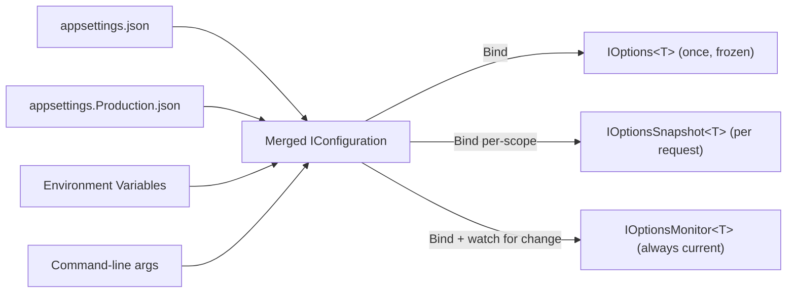

# Module 13 — ASP.NET Core: Configuration & the Options Pattern Internals

> Domain: .NET / ASP.NET Core | Level: Beginner → Expert | Prerequisite: [[02-DI-Container-Internals]] (service lifetimes — `IOptionsMonitor` as the "safe to hold long-term" example referenced there)

---

## 1. Fundamentals

### What is `IConfiguration`, and what is the Options pattern?
`IConfiguration` is ASP.NET Core's unified abstraction over configuration data from many sources (JSON files, environment variables, command-line args, Azure Key Vault, secrets manager) merged into one hierarchical key/value structure. The **Options pattern** (`IOptions<T>`/`IOptionsSnapshot<T>`/`IOptionsMonitor<T>`) is the recommended way to **consume** that configuration — binding a section of raw key/value data into a strongly-typed POCO class, injected via DI, instead of scattering `configuration["Some:Key"]` string-indexed lookups throughout application code.

### Why does it exist?
Raw `IConfiguration` access is stringly-typed (no compile-time checking of key names, no type safety) and provides no built-in mechanism for live-reloading or per-request-consistent snapshots. The Options pattern layers strong typing, validation, and three distinct reload/lifetime semantics on top, solving different consumption needs cleanly.

### When does it matter?
Every configurable service uses this; the depth matters for correctly choosing among the three options interfaces (a frequent point of confusion) and for understanding configuration-source layering/precedence when debugging "why is this setting not what I expect."

### How does it work (30,000-ft view)?
```csharp
builder.Services.Configure<SmtpOptions>(builder.Configuration.GetSection("Smtp"));

public class EmailSender
{
    private readonly IOptionsMonitor<SmtpOptions> _options; // always current
    public EmailSender(IOptionsMonitor<SmtpOptions> options) => _options = options;
    public void Send() => Connect(_options.CurrentValue.Host);
}
```

---

## 2. Deep Dive

### 2.1 Configuration Source Layering and Precedence
Sources are added in order (`appsettings.json` → `appsettings.{Environment}.json` → environment variables → command-line args → user secrets in Development) — **later sources override earlier ones** for the same key. This is why environment variables can override a JSON file's value without redeploying, and why command-line args (highest precedence by default) are used for one-off overrides.

### 2.2 `IOptions<T>` vs `IOptionsSnapshot<T>` vs `IOptionsMonitor<T>`
- **`IOptions<T>`**: `Singleton`-lifetime-safe, computed **once** and cached forever — never reflects later configuration changes. Simplest, but stale-by-design.
- **`IOptionsSnapshot<T>`**: `Scoped` — recomputed **once per request/scope**, reflecting the configuration as of that scope's start. Good for per-request consistency with reload support, but **cannot be injected into a `Singleton`** (a captive-dependency violation, directly Module 10 §2.2's rule — `IOptionsSnapshot<T>` is literally `Scoped`).
- **`IOptionsMonitor<T>`**: `Singleton`-safe, but **always current** via `.CurrentValue` (re-reads on change) and supports `.OnChange(callback)` for reactive updates — this is precisely why Module 10 §Advanced Q6 cited it as the canonical example of "safe for a Singleton to hold long-term because it's designed to be a live view, not a frozen snapshot."

### 2.3 Options Validation
`services.AddOptions<SmtpOptions>().Bind(config.GetSection("Smtp")).ValidateDataAnnotations().ValidateOnStart()` — `ValidateOnStart()` (rather than lazy, first-use validation) forces invalid configuration to fail the application at **startup**, not on the first request that happens to touch it — directly the same "fail fast, fail loud, fail at build/start time not runtime" principle recurring throughout this course (Module 7's exhaustiveness-as-error, Module 10's `ValidateOnBuild`).

### 2.4 Named Options
Multiple distinct configurations of the same options type (`services.Configure<SmtpOptions>("Marketing", ...)`, `services.Configure<SmtpOptions>("Transactional", ...)`) resolved via `IOptionsMonitor<T>.Get("Marketing")` — lets one options *type* serve multiple independently-configured instances.

---

## 3. Visual Architecture



---

## 4. Production Example

**Scenario**: A feature-flag service injected `IOptionsSnapshot<FeatureFlags>` into a `Singleton`-registered background scheduler — this threw `InvalidOperationException` (captive-dependency violation, Module 10 §2.3) immediately once `ValidateOnBuild` was enabled organization-wide (Module 10 §4's remediation). **Fix**: switched to `IOptionsMonitor<FeatureFlags>`, which is `Singleton`-safe and still reflects live config-file changes via its `.OnChange` hook. **Lesson**: the three options interfaces aren't interchangeable — the choice is a lifetime decision with the exact same captive-dependency stakes as any other DI lifetime choice.

---

## 5. Best Practices
- Default to `IOptionsMonitor<T>` for anything that might ever be consumed by a `Singleton`; use `IOptionsSnapshot<T>` only for genuinely `Scoped` consumers needing per-request consistency.
- Always call `.ValidateOnStart()` for required configuration — fail at startup, not on first use.
- Never inject raw `IConfiguration` deep into business logic — bind to a typed options class at the composition root.

## 6. Anti-patterns
- Injecting `IOptionsSnapshot<T>` into a `Singleton` (captive dependency, §4).
- Stringly-typed `configuration["A:B:C"]` lookups scattered through business logic instead of bound options classes.
- Storing secrets in `appsettings.json` committed to source control instead of user-secrets/Key Vault/environment variables.

---

## 10. Interview Questions

### Basic (10)

1. **Q: What does the Options pattern solve that raw `IConfiguration` access doesn't?**
   **A:** Strong typing (no string-indexed key lookups scattered through code), validation, and structured, well-defined reload semantics via three distinct interfaces.

2. **Q: If a key exists in both `appsettings.json` and an environment variable, which wins?**
   **A:** The environment variable — later-added configuration sources override earlier ones for the same key.

3. **Q: What is `IOptions<T>`'s reload behavior?**
   **A:** None — it's computed once and cached forever for the application's lifetime, never reflecting later configuration changes.

4. **Q: Can `IOptionsSnapshot<T>` be safely injected into a `Singleton`-lifetime service?**
   **A:** No — `IOptionsSnapshot<T>` is itself `Scoped`, so injecting it into a `Singleton` is a captive-dependency violation.

5. **Q: What does calling `.ValidateOnStart()` do?**
   **A:** Forces options validation to run at application startup, failing the app immediately if configuration is invalid, rather than only failing lazily on first use.

6. **Q: What are named options for?**
   **A:** Registering multiple independently-configured instances of the same options type, resolved by name via `IOptionsMonitor<T>.Get(name)`.

7. **Q: Where should secrets be stored during local development?**
   **A:** The User Secrets manager — never committed to `appsettings.json` in source control.

8. **Q: What is `IOptionsMonitor<T>.OnChange` used for?**
   **A:** Registering a callback that runs reactively whenever the underlying configuration changes, enabling live-update behavior beyond just reading `.CurrentValue`.

9. **Q: What lifetime is `IConfiguration` itself typically registered with?**
   **A:** `Singleton`.

10. **Q: What's the standard way to bind a configuration section to a strongly-typed class?**
    **A:** `services.Configure<T>(configuration.GetSection("SectionName"))`.

### Intermediate (10)

1. **Q: Precisely distinguish `IOptionsSnapshot<T>` from `IOptionsMonitor<T>`.**
   **A:** `IOptionsSnapshot<T>` is `Scoped` and recomputed once per request/scope, giving per-request consistency but no ability to be held by a `Singleton`; `IOptionsMonitor<T>` is `Singleton`-safe and always reflects the current configuration via `.CurrentValue`, re-evaluated on each access against the latest known state rather than frozen at scope start.

2. **Q: Why do the exact same captive-dependency rules from the DI module apply to options interfaces?**
   **A:** Because `IOptionsSnapshot<T>` is, under the hood, just an ordinary `Scoped`-registered service like any other — the container has no special-cased exception for options types, so capturing it in a `Singleton`'s constructor triggers the identical `ValidateScopes`/`ValidateOnBuild` violation as any other `Scoped`-into-`Singleton` mistake.

3. **Q: How does `ValidateDataAnnotations()` integrate with `ValidateOnStart()`?**
   **A:** `ValidateDataAnnotations()` registers a validator that checks the bound options object against its `[Required]`/`[Range]`/etc. attributes; `ValidateOnStart()` ensures that validator actually runs eagerly at startup rather than only the first time the option is resolved.

4. **Q: Why do command-line arguments have the highest default precedence among configuration sources?**
   **A:** They're added last in the default configuration-source ordering, and later-added sources override earlier ones — command-line args are specifically intended for one-off overrides at launch time, which is why this ordering is deliberate.

5. **Q: How does reload-on-change work under the hood for the JSON configuration provider?**
   **A:** It uses an `IChangeToken`-based file-system watcher — when the underlying JSON file changes, the change token fires, triggering re-parsing and notifying any `IOptionsMonitor<T>.OnChange` subscribers.

6. **Q: Why can't you simply "add a reload feature" to `IOptions<T>` without changing which interface you inject?**
   **A:** `IOptions<T>`'s entire contract is "compute once, cache forever" — its `Singleton`-safe caching behavior is exactly why it never re-reads; changing that behavior would require injecting a different interface (`IOptionsMonitor<T>`) designed for live updates, not modifying `IOptions<T>` itself.

7. **Q: What's a realistic bug scenario where a team believes their configuration reload feature is broken, but the actual root cause is interface choice?**
   **A:** A service injects `IOptions<T>` (perhaps copied from an older code example), updates the underlying config file in production, and reports "the app isn't picking up my change" — the fix is switching to `IOptionsMonitor<T>`, not debugging the configuration provider's file-watching mechanism, which was working correctly all along.

8. **Q: Why might named options be preferable to registering a separate class per tenant/variant?**
   **A:** They let one shared options type and one shared consuming-service implementation serve many independently-configured instances, avoiding class-per-variant duplication while keeping each instance's configuration independently bindable and validatable.

9. **Q: What's the risk of storing a security-critical setting in `appsettings.json` with no environment-variable override guard?**
   **A:** Anyone with access to modify environment variables in any deployment environment could silently override the intended value — for genuinely security-critical settings, some teams deliberately lock down which sources are trusted to override them, rather than accepting the default full-precedence-chain behavior unconditionally.

10. **Q: Why is validating configuration shape different from validating configuration values, and why might both matter for a feature-flag system?**
    **A:** Shape validation (via `ValidateOnStart`) ensures required feature-flag keys exist and are the correct type at startup; runtime value changes (a flag's boolean value flipping live) are a separate, expected, reactive event handled via `IOptionsMonitor.OnChange`, not something `ValidateOnStart` needs to re-check on every change.

### Advanced (10)

1. **Q: Design a Key-Vault-backed configuration provider that fails the application gracefully (not with an obscure exception deep in business logic) if a required secret is missing.**
   **A:** Register the Key Vault provider early in the configuration-source chain, then bind the dependent options with `.ValidateDataAnnotations().ValidateOnStart()` — a missing secret leaves the bound property at its default (often `null` for a `[Required] string`), and `ValidateOnStart()` surfaces a clear, startup-time `OptionsValidationException` naming exactly which property failed validation, rather than the application starting successfully and failing obscurely (a `NullReferenceException` deep in an unrelated code path) the first time that secret is actually used.

2. **Q: Explain exactly why `IOptionsMonitor<T>` was cited in the DI module as the canonical exception to "don't let a Singleton hold long-lived state that should vary."**
   **A:** It isn't a frozen snapshot the way `IOptions<T>` is — it's a live, self-updating view explicitly designed to be held indefinitely by a `Singleton` and always reflect current configuration; the "safe to hold long-term" property comes from its *design intent*, not from an exception to DI lifetime rules — it's simply not carrying any per-scope state that would need to vary per request in the first place.

3. **Q: A team reports "our configuration change isn't taking effect" despite confirming the underlying JSON file was updated correctly. Walk through the diagnostic steps.**
   **A:** First check which options interface the consuming service actually injects (`IOptions<T>` never reflects changes — the most common root cause); if it's already `IOptionsMonitor<T>`, verify the JSON provider was registered with `reloadOnChange: true` (a configurable, sometimes-overlooked flag); if using a centralized/remote configuration source (Key Vault, Azure App Configuration), verify that specific provider's own polling/refresh interval, since not all providers watch for changes as immediately as a local file-system watcher does.

4. **Q: Design named-options support for multi-tenant per-tenant SMTP configuration, and explain how a consuming service resolves the correct instance per request.**
   **A:** Register each tenant's configuration via `services.Configure<SmtpOptions>(tenantId, config.GetSection($"Tenants:{tenantId}:Smtp"))` at startup (or dynamically via a custom `IConfigureOptions<SmtpOptions>` reading tenant IDs from a database); the consuming service injects `IOptionsMonitor<SmtpOptions>` and calls `.Get(currentTenantId)` (with `currentTenantId` resolved from the current request's tenant context, Module 12's `ITenantContext` pattern) rather than `.CurrentValue`, which would return the unnamed/default instance.

5. **Q: Architect a zero-downtime, fleet-wide configuration-rollout strategy using centralized configuration and `IOptionsMonitor`.**
   **A:** Use a centralized configuration store (Azure App Configuration, Consul) with each replica's `IConfiguration` polling it on a short interval; changes propagate to every replica's `IOptionsMonitor<T>.OnChange` callbacks without any redeployment or restart — combined with a feature-flag-gated rollout (enabling a change for 5% of traffic via a per-request flag check before 100%), this gives a genuine progressive-rollout capability without touching deployment infrastructure at all, purely through configuration propagation.

6. **Q: What would you need to implement to build a fully custom `IConfigurationProvider` with correct change-token support, beyond just reading key/value pairs?**
   **A:** Implement `Load()` to populate the provider's internal data dictionary, and implement `IChangeToken GetReloadToken()` returning a token that correctly fires (`.HasChanged` becomes observable via its registered callback) whenever the underlying source's data actually changes — without a correctly-implemented, firing change token, `IOptionsMonitor<T>.OnChange` subscribers would never be notified, silently defeating live-reload for that specific custom source despite the provider otherwise working correctly for initial reads.

7. **Q: Explain the security implication of configuration-source precedence when environment variables can override values from a more tightly-access-controlled source like Key Vault.**
   **A:** If environment variables are added to the configuration chain *after* Key Vault, an actor with access to modify a deployment's environment variables (potentially a broader set of people than those with Key Vault write access) could silently override a security-critical value Key Vault was specifically meant to authoritatively control — deliberately ordering Key Vault *last* (highest precedence) for security-critical settings, or explicitly restricting which sources are even registered in security-sensitive deployment contexts, is the correct mitigation.

8. **Q: How would you test that a custom `IValidateOptions<T>` correctly catches a cross-field validation failure that Data Annotations alone can't express?**
   **A:** Write a unit test constructing the options POCO directly with an invalid cross-field combination (e.g., `MinValue > MaxValue`), invoke the custom validator's `Validate(name, options)` method directly, and assert the returned `ValidateOptionsResult` is a failure with the expected error message — no DI container or `ValidateOnStart()` needed for this unit-level test, since the validator is a plain, directly-testable class.

9. **Q: Why might binding configuration directly into a mutable class (rather than an immutable `record`, Module 7) create a subtle bug for `IOptionsMonitor<T>` consumers?**
   **A:** If a consumer holds a reference to `.CurrentValue` and the underlying options are mutable, a concurrent reload could, in principle, mutate the very object a consumer is mid-way through reading (a race), whereas `IOptionsMonitor<T>` is actually designed to hand out a fresh, immutable instance on each configuration change rather than mutating the existing one in place — using an immutable `record`-based options class removes any ambiguity or accidental reliance on in-place mutation, structurally reinforcing the intended "immutable snapshot per version" semantics.

10. **Q: How would you reason about whether a given piece of application state belongs in configuration/options versus a database-backed settings table?**
    **A:** Configuration/options are appropriate for values that are deployment/environment-scoped and change relatively infrequently, ideally versioned alongside code/infrastructure; a database-backed settings table is more appropriate for values that are business-data-scoped (per-user, per-tenant, frequently changed by end users through a UI, needing audit history) — conflating the two (e.g., storing rapidly-changing, user-editable business preferences as "configuration") tends to produce awkward reload/consistency semantics that a proper data-layer model would handle more naturally.

---

### Additional Medium → Expert (20)
1. **Q: How does the configuration system's layered model actually work internally — what are `IConfigurationProvider`s, and how does `IConfigurationRoot` resolve a key?** **A:** Each source builds a provider holding a flat key/value dictionary (colon-delimited hierarchical keys); `IConfigurationRoot` holds the ordered provider list and resolves a key by asking providers in *reverse* registration order, returning the first hit — that's the entire precedence mechanism. Sections are just key-prefix views (`GetSection("A:B")` wraps the root with a prefix); no tree exists — understanding the flat-dictionary reality explains array indices (`Items:0:Name`) and why deleting a JSON array element can leave ghost keys from a higher-precedence source.
2. **Q: Why can shortening a JSON array cause phantom configuration entries, and how do you defend against it?** **A:** Arrays flatten to indexed keys (`Servers:0`, `Servers:1`, `Servers:2`); if a lower-precedence source defines three entries and a higher-precedence override defines two, index 2 still resolves from the lower source — the merged array has a phantom third element. Defenses: don't split arrays across sources (own each array wholly in one source), use dictionaries keyed by name instead of arrays (overrides merge intelligibly), or validate bound collections (`ValidateOnStart` asserting expected counts/shapes).
3. **Q: Explain environment-variable key mapping conventions — `__`, prefixes, and the container/Kubernetes interplay.** **A:** `:` isn't valid in env-var names on all platforms, so `__` (double underscore) maps to the hierarchy separator (`Logging__LogLevel__Default`); the default host adds prefixed providers (`DOTNET_`/`ASPNETCORE_` for host config) plus unprefixed app config. In Kubernetes, env vars from ConfigMaps/Secrets use this convention directly — and because env vars outrank appsettings.json, a stray deployment-level variable silently overrides file config, which is the first place to look when "the config file change didn't take effect" in a containerized fleet.
4. **Q: What does `Bind` actually do reflection-wise, and what are its type-conversion edges — enums, TimeSpan, nullable, and get-only properties?** **A:** Binding walks target properties, matching keys case-insensitively and converting strings via TypeConverters: enums parse by name (invalid names throw `InvalidOperationException` at bind time), `TimeSpan` uses `TimeSpan.Parse` formats (`"00:00:30"` — a bare `30` means 30 *days*, a classic misconfiguration), nullable types accept missing keys as null, and get-only properties are skipped silently unless `BindNonPublicProperties`/init patterns apply — silent skipping is the trap: a typo'd property name or missing setter yields defaults with no error, which is exactly what `ValidateOnStart` + required-property validation exists to catch.
5. **Q: How does the .NET 8 configuration binder source generator change binding, and when must you care?** **A:** `EnableConfigurationBindingGenerator` emits compile-time binding code replacing reflection — required for Native AOT (reflection binding is trim-unsafe) and slightly faster everywhere. You must care when: targeting AOT (it's mandatory — unsupported shapes surface as build diagnostics instead of runtime magic), when binding exotic types the generator doesn't support (falls back or warns), and when binding behavior differs subtly from reflection (the generator is stricter about supported patterns) — a migration checklist item for AOT adoption rather than a daily concern.
6. **Q: Walk through the change-token propagation chain from a Kubernetes ConfigMap update to an `IOptionsMonitor<T>.OnChange` callback firing — where are the delays and failure points?** **A:** Kubelet syncs the mounted ConfigMap (up to ~a minute of sync delay; the update swaps a symlink atomically), the file provider's `PhysicalFilesWatcher` must detect it — symlink swaps historically evade some watchers (inotify watches the real file, requiring `reloadOnChange` polling fallbacks or restarting) — then the provider reloads, the configuration root raises its reload token, `OptionsMonitor` invalidates its cache and invokes `OnChange`. Failure points: subPath mounts (no symlink swap — never updates), watcher limits (inotify exhaustion in dense nodes), and debounce gaps (partial-write reads mitigated by the provider's retry). Production posture: treat file-based hot reload in K8s as best-effort; verify end-to-end or use a config service.
7. **Q: `OnChange` callbacks can fire multiple times for one logical change and on arbitrary threads — what discipline does a correct handler need?** **A:** File watchers commonly emit multiple events per save (write + metadata), so handlers must be idempotent and cheap: debounce (coalesce within a window), compare old/new values before acting (skip no-op notifications), never block (they run synchronously in the notification path — offload real work), and handle exceptions (a throwing handler can break subsequent notifications). For expensive reactions (reconnecting clients, rebuilding caches), the pattern is: `OnChange` sets a dirty flag/enqueues to a single-consumer channel; a background loop applies changes serially — turning a noisy callback into a controlled reconciliation.
8. **Q: Design per-tenant configuration overrides on top of the options pattern — base config + tenant deltas — and identify where the built-in abstractions stop helping.** **A:** Named options fit small, static tenant counts (`Configure<MailOptions>("tenantA", ...)`), but dynamic tenant sets need a different shape: a scoped `ITenantConfig<T>` service resolving base options (via `IOptionsMonitor<T>`) and overlaying tenant deltas from a store (cached per tenant with invalidation), because the options system's names are registration-time static and its caching has no tenant dimension. Key decisions: delta storage format (sparse overrides, not full copies — auditability and safe base evolution), cache invalidation on tenant admin changes (push via pub/sub beats TTL for admin UX), and validation per merged result (a tenant delta can violate invariants the base satisfied — validate the *merge*, not the layers).
9. **Q: What are the failure-mode differences between config-as-file, config-as-env, and config-service (App Configuration/Consul/SSM) at *startup* vs *runtime*?** **A:** Files/env: immutable after process start (env) or locally durable (files) — startup can't fail on network, but changes require redeploy/restart (env) and runtime reload is best-effort (files). Config service: startup gains a network dependency (must decide fail-fast vs cached-fallback — a config-service outage taking down every *restarting* pod while running pods continue is the classic partial-outage shape), runtime gains reliable push/poll updates, audit, and staged rollout. Mature posture: config service with local snapshot fallback (last-known-good persisted), explicit startup timeout/retry policy, and alerting on stale-config age — the availability analysis matters more than the feature list.
10. **Q: How should feature flags relate to the options pattern — when is `IFeatureManager` (or a flag SDK) the right abstraction instead of bound options, and what dangers do flags-as-options create?** **A:** Options model *configuration* (values describing how the system runs, changing rarely, validated as a coherent set); flags model *decisions* (boolean/variant gates queried at decision points, changing frequently, targeted per user/tenant/percentage). Binding flags into options loses targeting (options have no user context), evaluation telemetry (which variant did this request see), and gradual rollout semantics. Dangers of conflating: flag checks scattered as `options.EnableX` become permanent configuration nobody cleans up, and percentage rollouts get faked with random-per-process hacks. Use a flag system with lifecycle discipline (owners, expiry, cleanup) for decisions; options for tuning values — and let flags *reference* option sets for variant parameters.
11. **Q: Explain configuration composition for multi-environment promotion — `appsettings.{Environment}.json` versus environment-injected values versus per-environment config stores; what belongs where?** **A:** In-repo environment files should hold only *structural* differences safely public (logging verbosity, feature defaults per environment) — they're code-reviewed and promoted with the artifact. Environment-injected values (env vars from the deployment platform) hold *placement* facts: endpoints, resource names, scaling knobs — things the environment owns, not the app. Secrets never live in either — they come from the secret store at runtime. The anti-pattern is environment files accumulating everything (secrets in git, promotion requiring file edits) or, inversely, hundreds of env vars encoding what should be structured config. Rule: the build artifact is environment-agnostic; environment supplies identity, endpoints, and secrets; files supply shape and defaults.
12. **Q: What does a well-designed "options facade" for a complex subsystem look like — post-configuration, computed properties, and why raw bound classes shouldn't leak everywhere?** **A:** Bind a raw options class privately, use `IPostConfigureOptions<T>` for normalization (trimming, defaulting derived values, cross-field reconciliation), validate the normalized result, then expose a curated read-only interface/service to consumers (computed conveniences like parsed `Uri`s, `TimeSpan`s, preprocessed lookups) — so consumers never re-parse strings or duplicate derivation logic, and the raw shape can evolve without touching fifty consumers. Leaking raw bound classes couples the config file's shape to every consumer and scatters interpretation (three services parsing the same connection string differently); the facade centralizes interpretation once.
13. **Q: How do you keep secrets out of options-class logging/serialization accidents — enumerate the leak vectors and mechanical defenses.** **A:** Vectors: records/classes with synthesized or debug `ToString` logged wholesale ("logging the config at startup" — the classic leak), serializing options into diagnostics endpoints (`/config` debug pages), exception messages embedding option values, and `IConfiguration` dumps (`AsEnumerable()` to logs). Defenses: segregate secrets into distinct classes never logged (naming convention `*Secrets` + analyzer/review rule), override `ToString` on sensitive types to redact, register redaction in logging (the .NET data-classification/redaction APIs or Serilog destructuring policies), gate any config-dump endpoint behind admin auth *and* redaction, and prefer references (Key Vault URIs) over values in whatever *is* logged.
14. **Q: What is `IOptionsFactory<T>` and when would you replace or wrap it — give a legitimate advanced scenario.** **A:** It's the component that constructs an options instance on demand: runs the `IConfigureOptions`/`IConfigureNamedOptions` chain, then post-configures, then validators — `OptionsManager`s call it and cache results. Replace/wrap it to inject cross-cutting construction behavior: decrypting cipher-text values after binding (encrypted-at-rest config), stamping audit/telemetry (which sources contributed, config version ids for correlation with incidents), or enforcing org-wide invariants on every options type (no plaintext connection strings) without per-type validators. It's the last interception point before consumers see values — the right seam for value transformation that providers can't do.
15. **Q: A service reads a connection string at startup into a singleton; ops rotates the database password; the service breaks until restart. Redesign for rotation-tolerance across the whole credential lifecycle.** **A:** Layers: (1) prefer credential-less auth (managed identity/IAM auth to the DB) — rotation disappears entirely; (2) if passwords persist, consume via `IOptionsMonitor` + a connection factory resolving current values per connection attempt (never cache the string in long-lived objects — pools re-authenticate on new physical connections), with the secret provider supporting reload (Key Vault provider refresh, or push notification triggering configuration reload); (3) rotation runs dual-secret (two valid passwords overlapping): rotate secondary, flip consumers, rotate primary — so a propagation lag never hits a dead credential; (4) verify with a rotation drill in staging — the design isn't real until a rotation happens with zero errors. The principle: rotation-tolerance is an architecture property (indirection + overlap), not a config feature.
16. **Q: How does options validation compose — DataAnnotations, `Validate` lambdas, `IValidateOptions<T>` classes — and how do you produce *good* failure diagnostics at startup?** **A:** All registered validators run (they accumulate: annotations + every lambda + every `IValidateOptions` implementation), and failures aggregate into `OptionsValidationException` listing all messages — with `ValidateOnStart` forcing evaluation during host start (eager registration materializes each options type) so the process dies before serving traffic. Good diagnostics require deliberate messages: name the section path and key (`"Payments:RetryCount must be 1-10, got 0"`), validate cross-field invariants in `IValidateOptions` with domain language, and log the *source* of the bad value where possible (which provider won) — because "Value cannot be null" at 3 AM costs an hour that "Missing required key Payments:ApiBase (checked appsettings, env, KeyVault)" turns into a minute.
17. **Q: Explain the interplay between configuration and `WebApplicationBuilder` host bootstrapping — which settings are consumed before your app config even builds, and why does that bite people?** **A:** Host-level settings — environment name, content root, URLs (`ASPNETCORE_URLS`), and host configuration keys — are read from a *host* configuration (env vars, command line) before appsettings load, and some (environment) determine *which* app config files load; Kestrel endpoints configured in appsettings apply later but interact with URL precedence rules. Bites: setting the environment in appsettings.json (impossible — circular), expecting `builder.Configuration` changes to affect already-decided host values, and URL conflicts between `ASPNETCORE_URLS`, `UseUrls`, and Kestrel config sections resolving by precedence people don't know. Knowing the two-phase (host config → app config) model resolves the whole confusion class.
18. **Q: Design configuration for a library/NuGet package consumed by many teams — how do you accept configuration without dictating the host's configuration system?** **A:** Expose an options class configured via the standard `AddMyLibrary(Action<MyLibraryOptions>)` delegate plus an overload binding from a provided `IConfigurationSection` — never read `IConfiguration` globally yourself (don't assume section names, don't call `configuration.GetSection("MyLib")` implicitly — hosts own their layout); use `TryAdd` registrations so hosts can override; validate via `IValidateOptions` shipped in the package with actionable messages; support named options if hosts may need multiple instances; and document reloadability honestly (which options are snapshot-at-startup vs monitored). The principle: libraries *declare* their options shape and defaults; hosts own sources, layout, and precedence.
19. **Q: What observability should exist around configuration itself in a production estate — what do mature platforms track?** **A:** Track: effective-config fingerprints (a hash of resolved non-secret config logged at startup and exposed as a metric label/info endpoint — instantly answers "are these two pods running the same config?"), config version/timestamp from config services correlated onto dashboards (deploy markers for config changes — half of incidents are config changes that nobody correlated), reload events and failures (a reload that threw and left stale values is silent otherwise), staleness age for service-sourced config (time since last successful refresh), and validation failures as distinct, alertable events. The goal: configuration changes become first-class, observable deployment events — because "what changed?" is the first incident question and config is the perennial hidden answer.
20. **Q: As a Principal Engineer, define the governance line between "configuration" and "code" — when do you push a team to move a value *out* of configuration, and what's the cost model of excessive configurability?** **A:** Configuration earns its place when values legitimately differ across environments/tenants or must change faster than deploys with operational (not developer) owners; everything else is code — constants with names, or derived values. Excessive configurability costs: every knob is an untested state-space dimension (the config matrix nobody QA's), a production foot-gun (ops changing a value whose implications only code comments knew), a documentation liability, and a false flexibility (nobody has ever changed it, but everyone must reason about it). Heuristics I enforce: a config value must have a documented reason someone *will* change it per environment, a validated range, an owner, and telemetry showing if it's ever read; values unchanged across all environments for a year get folded into code; and "we might need to tune it" without a tuning plan means it starts as a constant. Configuration is an interface with operations — keep it as small and intentional as any public API.

## 11. Coding Exercises

### Easy — Bind and validate options with `ValidateOnStart`
```csharp
public class SmtpOptions
{
    [Required] public string Host { get; set; } = "";
    [Range(1, 65535)] public int Port { get; set; }
}

builder.Services.AddOptions<SmtpOptions>()
    .Bind(builder.Configuration.GetSection("Smtp"))
    .ValidateDataAnnotations()
    .ValidateOnStart(); // fails the app at startup, not on first email send, if Host/Port are invalid
```
**Discussion**: Without `ValidateOnStart()`, a missing `Host` would only surface as an exception the first time `EmailSender` actually tries to connect — potentially hours after a bad deploy, in production, on the first attempted email send.

### Medium — Named options for per-tenant SMTP configuration
```csharp
foreach (var tenant in builder.Configuration.GetSection("Tenants").GetChildren())
{
    builder.Services.Configure<SmtpOptions>(tenant.Key, tenant.GetSection("Smtp"));
}

public class TenantEmailSender
{
    private readonly IOptionsMonitor<SmtpOptions> _options;
    private readonly ITenantContext _tenantContext;
    public TenantEmailSender(IOptionsMonitor<SmtpOptions> options, ITenantContext tenantContext)
    {
        _options = options; _tenantContext = tenantContext;
    }
    public void Send() => Connect(_options.Get(_tenantContext.TenantId).Host);
}
```
**Discussion**: `.Get(name)` — not `.CurrentValue` — is what resolves the named instance; forgetting this and using `.CurrentValue` silently returns the unnamed default configuration instead of the tenant-specific one, a realistic, easy-to-make mistake.

### Hard — Custom cross-field `IValidateOptions<T>`
```csharp
public class RangeOptions { public int MinValue { get; set; } public int MaxValue { get; set; } }

public class RangeOptionsValidator : IValidateOptions<RangeOptions>
{
    public ValidateOptionsResult Validate(string? name, RangeOptions options)
    {
        if (options.MinValue >= options.MaxValue)
            return ValidateOptionsResult.Fail("MinValue must be less than MaxValue.");
        return ValidateOptionsResult.Success;
    }
}
// Registration: builder.Services.AddSingleton<IValidateOptions<RangeOptions>, RangeOptionsValidator>();
```
**Discussion**: Data Annotations (`[Range]`) validate a single property in isolation; `IValidateOptions<T>` is the correct extensibility point for validation logic spanning multiple properties, exactly the same "escalate to a custom mechanism once the built-in convenience methods can't express the rule" pattern seen with `AuthorizationHandler<T>` in Module 12.

### Expert — Live-reloading feature flags invalidating a dependent cache atomically
```csharp
public class FeatureFlagCache
{
    private readonly IMemoryCache _cache;
    public FeatureFlagCache(IOptionsMonitor<FeatureFlags> monitor, IMemoryCache cache)
    {
        _cache = cache;
        monitor.OnChange(flags => _cache.Remove("computed-feature-state")); // invalidate on ANY change
    }
}
```
**Discussion**: `OnChange` fires on every reload regardless of whether the *specific* flag a given cache entry depends on actually changed — a coarse but simple and safe invalidation strategy; a more surgical version would diff old vs. new values and invalidate only affected cache keys, a worthwhile refinement to mention if asked to extend this further in an interview.

---

## 12. System Design
A multi-region platform centralizes configuration via Azure App Configuration, with every replica's `IOptionsMonitor<T>` reacting to changes without redeployment; feature-flag rollouts are staged progressively (5% → 25% → 100% of traffic) using a per-request flag evaluation rather than a binary on/off switch, and every required setting is validated at startup (`ValidateOnStart`) so a bad configuration push fails new replica startup immediately (failing readiness checks, Module 14) rather than serving with broken configuration.

## 13. Low-Level Design
A small `ITenantOptionsResolver<T>` wrapping `IOptionsMonitor<T>.Get(tenantId)` behind a single-method interface lets consuming services depend on an abstraction rather than remembering to call `.Get(...)` with the correct tenant ID at every call site — directly mirroring Module 12 §13's `IResourceAuthorizationHelper` facade pattern, applied here to reduce repetitive, easy-to-get-wrong named-options resolution boilerplate.

## 14. Production Debugging
The signature incident for this module: a `Singleton` capturing `IOptionsSnapshot<T>` (§4) — diagnosed identically to any other captive-dependency bug (Module 10 §14): `ValidateOnBuild` throws at startup, naming the exact offending registration; the fix is switching to `IOptionsMonitor<T>`, not restructuring the consuming service's lifetime.

## 15. Architecture Decision
Centralized, live-reloadable configuration (Azure App Configuration/Consul + `IOptionsMonitor`) is recommended over redeploy-to-change static configuration for any setting that plausibly needs adjustment without a full deployment (feature flags, rate limits, timeout thresholds) — reserving redeploy-required static configuration for settings that are genuinely part of the application's build-time identity (connection strings tied to a specific environment's infrastructure).

## 16. Enterprise Case Study
Large-scale feature-flag platforms (LaunchDarkly, Azure App Configuration's feature-management integration) are, architecturally, a specialized, externally-hosted implementation of exactly this module's `IOptionsMonitor`-based live-reload pattern — recognizing this parallel helps explain *why* a third-party feature-flag service integrates so naturally with `IOptionsMonitor<T>`-consuming code: it's solving the identical "Singleton-safe, always-current, reactively-updatable configuration" problem this module covers, just with a richer targeting/rollout UI layered on top.

## 17. Principal Engineer Perspective
Treat options-interface choice with the same lifetime rigor as any other DI decision (Module 10) — this module's captive-dependency bug class is not a separate concern, it's the identical bug wearing configuration-specific clothing. Mandate `ValidateOnStart()` for all required configuration organization-wide, converting configuration mistakes into startup failures caught in CI/staging rather than production runtime surprises.

---

## 18. Revision

**Key takeaways**: `IOptions` = frozen once; `IOptionsSnapshot` = per-scope, not Singleton-safe; `IOptionsMonitor` = always-current, Singleton-safe. `ValidateOnStart()` converts runtime configuration failures into startup failures. Configuration source precedence: later-added source wins.

**Cross-reference**: [[02-DI-Container-Internals]] §2.5/§Advanced Q6 for the lifetime rules this module's options-interface choice directly inherits.

---

**Next**: Continuing autonomously to Module 14 — Health Checks & Observability Integration, then advancing toward `03-REST-APIs`.
