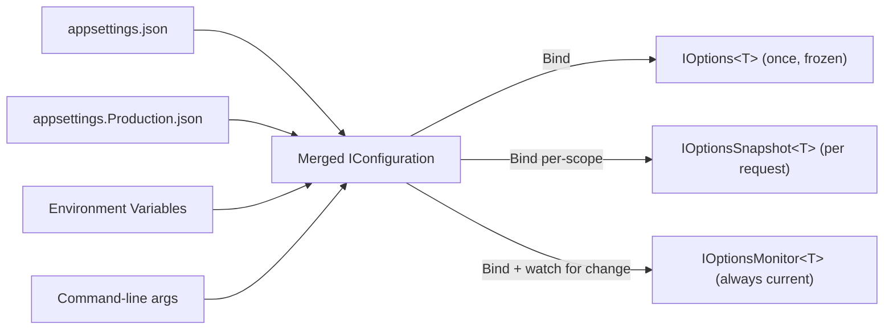

# Module 13 — ASP.NET Core: Configuration & the Options Pattern Internals

> Domain:.NET / ASP.NET Core | Level: Beginner → Expert | Prerequisite: [[02-DI-Container-Internals]] (service lifetimes — `IOptionsMonitor` as the "safe to hold long-term" example referenced there)

---

## 1. Topic Description

### Definition

**Configuration** in .NET is a layered, flattened key-value store: each provider (JSON files, environment variables, command line, user secrets, a secret store) contributes keys, and where several supply the same key the **last provider added wins**. Nested structure is flattened with `:` separators (`__` in environment variables). The **options pattern** is the typed consumption model on top: a POCO is bound to a configuration section, validated, and injected as `IOptions<T>`, `IOptionsSnapshot<T>` or `IOptionsMonitor<T>` depending on whether the value is fixed for the process, recomputed per scope, or must be observed as it changes.

### Core sub-concepts

- **Provider layering and precedence** — the default host builder's order, and `__` versus `:` in environment variables.
- **Binding to typed options** — section binding, and the silent failure when a section is missing or renamed.
- **The three options interfaces** — `IOptions<T>` (singleton, fixed), `IOptionsSnapshot<T>` (scoped, per-request), `IOptionsMonitor<T>` (singleton, change-aware) and the captive-dependency trap between them.
- **Named options** — several configured instances of one type, resolved via `IOptionsMonitor<T>.Get(name)`; the mechanism behind named `HttpClient` configuration.
- **Validation** — data annotations, `IValidateOptions<T>` for cross-field rules, and `ValidateOnStart` to move failure from first use to deployment.
- **`reloadOnChange` and change tokens** — what reload actually propagates to, and the large set of consumers it silently does not reach.
- **Configuration vs secrets vs feature flags** — three different lifecycles (static, rotated and access-audited, dynamically targeted) that share one `IConfiguration` surface.
- **Secret sourcing** — managed stores, platform injection, user secrets in development; rotation as a first-class requirement.
- **Environment-specific behaviour** — configuration values describing behaviour versus code branching on the environment name.
- **Containerised supply** — environment variables and mounted files; the same artefact promoted unchanged through environments.
- **Remote configuration providers** — startup dependency, caching last-known-good, and fail-fast versus hang.
- **Effective-configuration visibility** — diagnosing what the process actually sees, with redaction.

### Where it fits

Configuration is consumed by nearly every other component: connection strings for the data layer, issuer and key metadata for authentication, exporter endpoints for telemetry, limits for the pipeline. It is resolved through the DI container, so options lifetimes are container lifetimes and inherit the same captive-dependency hazards. It is also the seam between a build artefact and an environment, which is what makes "promote the same image" a viable deployment model.

### Why it matters at scale

Misconfiguration causes outages at roughly the rate code changes do, while being applied with far less care because it feels lighter. The specific amplifier is **silent binding**: a renamed or misspelled section binds successfully to a default-constructed object, so the service starts happily and behaves as though every setting were unset — no error, no log, just wrong behaviour discovered later. Without `ValidateOnStart`, an invalid value surfaces the first time a rarely-used path executes, which is typically in production at an inconvenient hour rather than during the rollout. And a remote configuration provider on the startup path turns a dependency's outage into an inability to *scale or deploy*, precisely when you most need to.

### Common pitfalls / anti-patterns

- **A missing or renamed section binding silently to defaults** — no exception, no warning; the service runs with empty strings and zeros until something downstream fails obscurely.
- **Injecting `IConfiguration` throughout the codebase** — every consumer does untyped string lookups, typos become runtime nulls, nothing validates, and no constructor reveals what a class actually depends on.
- **`IOptionsSnapshot<T>` injected into a singleton** — a captive dependency: the first scope's values are frozen for the process lifetime.
- **Expecting `IOptions<T>` to pick up a reloaded value** — it is computed once; the "config change had no effect" report almost always traces to this or to precedence.
- **Secrets in `appsettings.json`** — permanently in git history, visible to everyone with repository access, and unrotatable without a code change and deployment.
- **Branching on the environment name (`if (env.IsProduction())`)** — the non-production path is never exercised in production and vice versa, so you ship code that has never run in its target configuration.
- **Validating only on first use** — a deployment that should have failed instead succeeds, and the invalid value becomes an incident hours later on a cold path.
- **Business logic expressed as configuration** — rule tables and conditional behaviour get no type checking, no tests and no review discipline, and produce bugs reproducible only under one settings combination.

> Scope note: DI lifetimes and captive dependencies belong to `02-DI-Container-Internals`; startup pipeline composition to `01-Middleware-Pipeline-Request-Internals`; health-check and readiness reporting to `06-HealthChecks-Observability`.

---

## 2. Beginner (10 Q&A)


**Q1. Describe how configuration providers layer and how precedence is resolved.**
**A:** Providers are added in order and each contributes a flat set of key-value pairs; when the same key exists in several, the last provider added wins. The default host builder adds `appsettings.json`, then `appsettings.{Environment}.json`, then user secrets in Development, then environment variables, then command-line arguments — so an environment variable overrides a file, which is how the same image behaves differently per environment. The flattening is worth understanding: nested JSON becomes `Section:Sub:Key`, and in environment variables the separator is `__` because `:` is not portable.
*Follow-up: You set an environment variable and it doesn't take effect. What are the three most likely reasons?*

**Q2. Why use the options pattern instead of injecting `IConfiguration`?**
**A:** Because typed options make the dependency explicit and checkable: the class declares exactly what settings it needs, the values are converted once and can be validated at startup, and tests supply a plain object rather than building a configuration tree. Injecting `IConfiguration` means every consumer does string lookups, typos become runtime nulls, nothing validates, and you cannot tell from a class's constructor what configuration it depends on. It is the same argument as constructor injection versus a service locator, applied to settings.
*Follow-up: Where is injecting `IConfiguration` directly still legitimate?*

**Q3. Explain the difference between `IOptions<T>`, `IOptionsSnapshot<T>` and `IOptionsMonitor<T>`.**
**A:** `IOptions<T>` is a singleton computed once — the value never changes for the process lifetime. `IOptionsSnapshot<T>` is scoped and recomputed per scope, so a request picks up configuration changes but a singleton cannot use it. `IOptionsMonitor<T>` is a singleton that exposes the current value and a change notification, so it is the one to use inside singletons and background services that must react to changes. Choosing the wrong one produces either a value that never updates or a captive-dependency bug, and both are quiet failures.
*Follow-up: Why can't a singleton inject `IOptionsSnapshot<T>`, and what happens if it does?*

**Q4. What does `ValidateOnStart` do and why does it matter?**
**A:** It forces options validation to run during startup rather than lazily on first resolution, so a service with invalid configuration fails immediately and visibly instead of starting successfully and throwing when a particular code path is first exercised — potentially hours later, in production, under load. That difference is the whole point: a crash at deploy time is caught by the rollout, while a failure at 2 a.m. on a rarely-used path is an incident. I would treat startup validation of all options as a baseline requirement for any service.
*Follow-up: What's the downside of failing fast on startup, especially in Kubernetes?*

**Q5. What happens when a configuration section is missing or misspelled?**
**A:** Binding succeeds and produces a default-constructed object — empty strings, zeros, nulls — with no error at all. That is the silent failure people are surprised by: rename a section and the application still starts, then behaves as though every setting were unset. Validation is therefore not optional decoration; it is what converts a silent misconfiguration into a loud one. Required-value validation plus `ValidateOnStart` is the combination that makes the section name a checked contract rather than a hopeful string.
*Follow-up: How would you make a missing connection string fail at startup rather than at first query?*

**Q6. Where should secrets come from, and why not `appsettings.json`?**
**A:** From a managed secret store — Key Vault, Secrets Manager, or the platform's own mechanism — fetched at startup or injected by the platform, never from a file in source control. A secret in `appsettings.json` is in git history forever, visible to everyone with repository access, and cannot be rotated without a code change and deployment. In development, user secrets keep values off disk in the repo. The general rule is that a secret's lifecycle — rotation, access control, audit — is fundamentally different from configuration's, so it needs a different mechanism even though it arrives through the same `IConfiguration` interface.
*Follow-up: A secret must be rotated. What does your service need to do to pick up the new value?*

**Q7. What is `reloadOnChange` and what does it not do?**
**A:** It watches the underlying file and re-reads configuration when it changes, firing change tokens so `IOptionsSnapshot` and `IOptionsMonitor` see new values. What it does *not* do is propagate the change into anything that already captured a value — a singleton that read a setting in its constructor, a connection string used to build a pooled connection factory, or a client configured at startup will all keep the old value. So reload works for values consumed through the monitor on each use and silently does not work for everything else, which is why "the config reload didn't take effect" is such a common report.
*Follow-up: Which settings would you deliberately make non-reloadable, and why?*

**Q8. What are named options and when do you need them?**
**A:** They let you register several configured instances of the same options type under different names — one per downstream client, per tenant, or per queue — resolved via `IOptionsMonitor<T>.Get(name)`. Without them you would need a distinct type per instance, which produces near-duplicate classes. The typical use is a service that talks to several instances of the same kind of dependency with different endpoints and credentials. It is also the mechanism behind named `HttpClient` configuration.
*Follow-up: How would you validate named options, given validation is registered per name?*

**Q9. How should environment-specific behaviour be expressed?**
**A:** Through configuration values that describe the *behaviour*, not through code that branches on the environment name. `if (env.IsProduction())` scattered through a codebase means the non-production paths are never exercised in production and vice versa, so you ship code that has never run in the configuration it will run in. Configuring a value — a timeout, an endpoint, a feature toggle — keeps one code path with different data. The legitimate uses of environment checks are narrow: developer conveniences such as detailed error pages and the developer exception page.
*Follow-up: A feature must be off in production until launch. Configuration flag or environment check, and why?*

**Q10. How do you supply configuration to a containerised application?**
**A:** Environment variables and mounted files are the two portable mechanisms, with the image itself carrying only defaults so the same artefact is promoted through environments unchanged. In Kubernetes, ConfigMaps for non-secret values and Secrets or an external secret store for sensitive ones, mounted or projected as environment variables. The important discipline is that the image must never contain environment-specific configuration, because that breaks the promote-the-same-artefact model and means the thing tested in staging is not the thing deployed to production.
*Follow-up: A mounted ConfigMap is updated. Does your running pod see the change?*

---

## 3. Intermediate (10 Q&A)


**Q1. A setting change was deployed and had no effect. Walk me through the diagnosis.**
**A:** First establish what the process actually sees, ideally through a diagnostic endpoint that dumps effective configuration keys with sources and secrets redacted — that alone resolves most of these. The usual causes are precedence (an environment variable or command-line argument overriding the file you edited), a mismatched key path or `__` versus `:` in an environment variable, the value being consumed through `IOptions<T>` so it was captured at startup, or a value read once into a field. In a container it may also be that the deployment did not actually restart the pod. The general lesson is that configuration debugging must start with observed state rather than intended state.
*Follow-up: How would you build that effective-configuration endpoint without creating a data-leak risk?*

**Q2. How would you design options validation for a service with many settings?**
**A:** Validate at startup, comprehensively, with messages that name the key and say what was wrong — the error message is the whole value of this exercise, since a deployment failing with "configuration invalid" is barely better than not validating. Data annotations cover simple constraints; `IValidateOptions<T>` handles cross-field rules such as "if authentication is enabled, these three values are required." I would also validate semantics where cheap: that a URL parses, that a timeout is in a sane range, that an endpoint is reachable if the check is fast and safe. The goal is that a bad configuration cannot be deployed successfully.
*Follow-up: Validation that hits the network at startup makes the service fail when a dependency is down. Where do you draw the line?*

**Q3. How do you handle configuration that must change without a restart?**
**A:** Consume it through `IOptionsMonitor<T>` at the point of use rather than capturing it, and design the components that use it to be reconfigurable — which is the hard part, because a value baked into a pooled client, a connection factory or a compiled policy will not change even when the monitor fires. Where a component genuinely cannot be reconfigured in place, the honest options are to rebuild it on change or to declare that setting restart-only. I would also be explicit about which settings are hot-reloadable, because an implicit assumption that everything is reloadable is how a "config-only change" turns into a partially-applied state where different components disagree.
*Follow-up: Half your instances picked up the new value and half didn't. What are the consequences and how do you avoid that state?*

**Q4. Configuration versus feature flags — where's the line?**
**A:** Configuration is relatively static, deployment-scoped, and changes with a release or an operational action; feature flags are dynamic, often per-user or per-percentage, and exist to decouple deploy from release. Trying to run experiments through configuration files gives you no targeting, no gradual rollout and no audit of who changed what; conversely putting infrastructure settings in a flag system adds a runtime dependency to something that should be static. I would use a real flag system for release control and experimentation, keep infrastructure settings in configuration, and be strict about flags having owners and expiry dates, since stale flags are a well-known source of combinatorial risk.
*Follow-up: A flag has been in the codebase for two years. What's the process for removing it?*

**Q5. How do you keep configuration consistent across many environments?**
**A:** By making the *schema* the shared artefact and the values environment-specific — a strongly-typed options class with validation is that schema, and it means an environment missing a required value fails at deploy rather than at runtime. Beyond that, environment configuration belongs in version control (with secrets referenced, not embedded) so changes are reviewable and diffable, and so drift between environments is visible. The failure mode I would design against is a production-only value that exists nowhere else, since it is by definition never exercised before it matters.
*Follow-up: How do you handle a value that genuinely only exists in production, like a partner's live endpoint?*

**Q6. What's the risk of a configuration provider that fetches from a remote store at startup?**
**A:** It makes that store a hard startup dependency, so an outage or a throttle prevents your service from starting — turning a degraded dependency into a total inability to deploy or scale, which is exactly when you most need to. Mitigations are caching the last known good configuration, retrying with backoff, failing fast with a clear error rather than hanging, and being deliberate about which values genuinely need to come from remote at all. I would also watch the startup latency it adds, since a remote fetch on every pod start is multiplied by your scale-out rate.
*Follow-up: The secret store is down and you need to scale up during an incident. What should happen?*

**Q7. How do you avoid leaking secrets through configuration?**
**A:** Multiple controls, because a single one will fail. Secrets never in source control, enforced by pre-commit and CI scanning; secrets never logged, enforced by redaction in the logging pipeline and by not dumping configuration wholesale; secrets never in error messages or diagnostic endpoints; and secret values distinguished in the type system or by convention so redaction is mechanical rather than remembered. I would also assume a leak will happen and ensure rotation is fast and routine — the ability to rotate a credential in minutes is worth more than the belief that it will never leak.
*Follow-up: A connection string appears in an exception message in your logs. What's your immediate and structural response?*

**Q8. How do you test configuration and options code?**
**A:** Unit tests construct the options object directly, which is the point of the pattern. What actually needs testing is the *binding and validation*: build a configuration from an in-memory or file source and assert that valid input binds correctly and that invalid input fails with a useful message — including the missing-section case, which is the silent one. I would also add a startup test per environment configuration where feasible, asserting the application can build its host with that environment's non-secret settings, since that catches renamed keys and missing required values before deployment.
*Follow-up: How would you test that production's configuration is valid without having production's secrets in CI?*

**Q9. What are the trade-offs of a shared configuration library across services?**
**A:** It gives consistent provider setup, standard validation, secret handling and naming conventions, so every service gets the correct behaviour by default and platform changes propagate once — which is valuable at scale. The costs are coupling every service's startup to a shared component, a versioning burden, and the risk of it accumulating opinions that do not fit everyone. I would keep it narrowly scoped to provider composition and cross-cutting settings, avoid embedding business configuration, and version it so teams upgrade deliberately. A bug in shared startup code is an estate-wide incident, which argues for a small surface and a canary rollout.
*Follow-up: You need to change a default in the shared library. How do you roll that out?*

**Q10. What belongs in configuration and what doesn't?**
**A:** Configuration is for things that legitimately differ per environment or per deployment: endpoints, credentials, timeouts, limits, toggles, scaling parameters. What does not belong is business logic expressed as data — rule tables, complex conditional behaviour, workflow definitions — because configuration has no tests, no type checking beyond binding, no review culture equal to code, and no way to reason about combinations. The tell is a configuration file that requires a document to understand, or a bug that can only be reproduced with a specific settings combination. When logic ends up in configuration, it usually means someone wanted to avoid a deployment, and the right fix is to make deployment cheap.
*Follow-up: The business wants to change pricing rules without a deploy. How do you accommodate that safely?*

---

## 4. Expert / Architect (10 Q&A)


**Q1. How would you design configuration management for an estate of fifty services across four environments?**
**A:** One artefact promoted unchanged through environments, with all environment-specific values supplied externally — that is the property that makes staging meaningful. Configuration in version control with review, secrets in a managed store referenced by identity rather than embedded, and a typed schema per service so a missing or invalid value fails the deployment rather than the service. I would standardise the provider composition in a platform package so every service resolves configuration identically, and I would insist on a diffable representation of each environment's effective configuration, because drift between environments is the root cause of a large share of "works in staging" incidents.
*Follow-up: How do you detect configuration drift between environments automatically?*

**Q2. Should configuration changes be treated as deployments? Argue your position.**
**A:** Yes, with the same rigour: reviewed, versioned, rolled out progressively, observable, and reversible. Configuration changes cause outages at roughly the same rate as code changes and are usually applied with far less care, precisely because they feel lighter — which is exactly the asymmetry that makes them dangerous. Practically that means changes go through the same pipeline, apply to a canary first where possible, and have an explicit rollback. The counter-argument is that emergency configuration changes need to be fast; I would handle that with a documented break-glass path that is audited afterwards, rather than by leaving the normal path unguarded.
*Follow-up: An incident requires a config change in two minutes. What does your break-glass path look like?*

**Q3. How do you handle per-tenant configuration at scale?**
**A:** Not through the standard configuration system, which is designed for a fixed set of keys read at startup, not thousands of tenant records. Tenant configuration is data: it belongs in a store, is loaded and cached per tenant with an explicit invalidation strategy, and is accessed through a tenant-aware abstraction rather than `IConfiguration`. The design questions that matter are cache staleness (how quickly a tenant's change takes effect), failure behaviour when the store is unavailable (serve stale, or fail closed — which depends on whether the setting is security-relevant), and defaults versus overrides. Conflating this with application configuration produces both a scaling problem and an isolation risk.
*Follow-up: A tenant's setting change must take effect within 30 seconds across all instances. How do you build that?*

**Q4. What's your approach to configuration in a regulated environment where changes must be auditable?**
**A:** Configuration is change-managed like code: every change attributable to a person, reviewed, linked to a ticket, and with the effective state at any past time reconstructable — which usually means version control as the source of truth with a pipeline applying it, rather than console edits. Secrets need separate handling with access audited independently, since who *read* a secret is as important as who changed it. I would also ensure the running system's effective configuration can be evidenced, not just the intended configuration, because an auditor's question is what the system was actually doing. Direct production edits should be technically impossible outside break-glass, since a control that relies on people not doing something is not a control.
*Follow-up: An engineer changed a production setting directly in the portal. What does your process require now?*

**Q5. How do you approach a migration from file-based configuration to a centralised configuration service?**
**A:** Incrementally and with a clear picture of what it buys, because it adds a runtime dependency to something that previously could not fail. I would move non-critical values first, keep local defaults as a fallback so a service can start without the config service, and ensure caching of the last known good state so an outage degrades rather than prevents startup. The migration also needs an answer for change propagation semantics — whether all instances take a change simultaneously and what happens if they do not — since that is a new failure mode file-based configuration did not have. I would want a concrete driver such as dynamic reconfiguration or centralised audit; "it's more modern" is not sufficient justification for adding a critical-path dependency.
*Follow-up: The config service becomes a single point of failure for the estate. How do you mitigate that?*

**Q6. How do you prevent configuration from becoming an unmanageable surface over years?**
**A:** By treating settings as API: each one has an owner, a documented purpose, a default, and validation, and adding one requires the same review as adding a public method. Periodically audit for settings nobody sets and for values identical across all environments, both of which should be removed or made constants — most long-lived services accumulate dozens of these. I would resist the pattern of adding a toggle for every uncertainty, since each one doubles the state space and almost none get exercised in combination. The most effective single control is requiring that a new setting come with validation and a test, which raises the cost just enough to discourage casual additions.
*Follow-up: You find 200 settings and 40 are unused. How do you remove them safely?*

**Q7. What failure modes have you seen from configuration reload, and how do you design against them?**
**A:** Partial application, where some components see the new value and others do not, leaving the system in a state that was never designed or tested; reload triggered by a partial file write, so the application briefly reads invalid configuration; and reload cascading into expensive reinitialisation across every instance simultaneously. The designs that avoid these are validating the new configuration before applying it and rejecting invalid states outright, making reload atomic at the component level rather than per-value, staggering reloads across instances, and being explicit that some settings are restart-only. I would also emit a clear event on every reload with the resulting version, so a subsequent incident can be correlated to a configuration change.
*Follow-up: How do you make reload atomic when two related settings must change together?*

**Q8. How does configuration design interact with a service's startup and readiness behaviour?**
**A:** Configuration validation failing at startup is the correct behaviour, but it interacts with orchestration: a service that cannot start due to bad configuration will crash-loop, and if the rollout strategy is wrong that can take down healthy instances too. So the pairing that matters is fail-fast validation *plus* a deployment strategy that keeps existing instances serving until new ones are healthy, and readiness that reflects genuine ability to serve rather than just process liveness. I would also distinguish configuration errors from dependency unavailability in the failure message, because they need different responses — one is a rollback, the other is a wait.
*Follow-up: A bad config is deployed and the new pods crash-loop. What should the system do automatically?*

**Q9. How would you evaluate a proposal to move all configuration into environment variables only?**
**A:** It has real merits — twelve-factor alignment, container-native, no file mounting, clear precedence — and real limits: environment variables are flat, awkward for hierarchical or list-shaped configuration, visible in process listings and to anything that can read the environment, and not reloadable without a restart. For a service with a modest set of scalar settings it is a good default; for one with structured configuration it produces unreadable key names and error-prone escaping. My position is a mixed model — structured defaults in files shipped with the artefact, environment-specific scalars and secrets from the environment or a secret store — with the important part being consistency across the estate so engineers do not have to learn a new scheme per service.
*Follow-up: A secret in an environment variable is readable by any process in the container. Does that change your view?*

**Q10. What signals tell you an organisation's configuration practice is unhealthy?**
**A:** Incidents caused by configuration outnumbering those caused by code; settings changed directly in production consoles; the same value defined in three places with different values; no way to answer what configuration a running instance actually has; secrets found in repositories; and deployments that differ between environments in ways nobody can enumerate. Each of these is a symptom of the same root cause — configuration treated as an afterthought rather than as part of the system. The remediation I would start with is visibility, because you cannot fix drift you cannot see: an effective-configuration endpoint plus environment diffing usually surfaces more real risk in a week than a policy document does in a year.
*Follow-up: You get that visibility and it's worse than expected. How do you prioritise what to fix first?*

---

## 5. Reference Material

> Retained from the original module: deep-dive internals, diagrams, production examples, exercises, system/low-level design, debugging walkthroughs and the Principal Engineer perspective.

### 1. Fundamentals

#### What is `IConfiguration`, and what is the Options pattern?
`IConfiguration` is ASP.NET Core's unified abstraction over configuration data from many sources (JSON files, environment variables, command-line args, Azure Key Vault, secrets manager) merged into one hierarchical key/value structure. The **Options pattern** (`IOptions<T>`/`IOptionsSnapshot<T>`/`IOptionsMonitor<T>`) is the recommended way to **consume** that configuration — binding a section of raw key/value data into a strongly-typed POCO class, injected via DI, instead of scattering `configuration["Some:Key"]` string-indexed lookups throughout application code.

#### Why does it exist?
Raw `IConfiguration` access is stringly-typed (no compile-time checking of key names, no type safety) and provides no built-in mechanism for live-reloading or per-request-consistent snapshots. The Options pattern layers strong typing, validation, and three distinct reload/lifetime semantics on top, solving different consumption needs cleanly.

#### When does it matter?
Every configurable service uses this; the depth matters for correctly choosing among the three options interfaces (a frequent point of confusion) and for understanding configuration-source layering/precedence when debugging "why is this setting not what I expect."

#### How does it work (30,000-ft view)?
```csharp
builder.Services.Configure<SmtpOptions>(builder.Configuration.GetSection("Smtp"));

public class EmailSender
{
    private readonly IOptionsMonitor<SmtpOptions> _options; // always current
    public EmailSender(IOptionsMonitor<SmtpOptions> options) => _options = options;
    public void Send => Connect(_options.CurrentValue.Host);
}
```

### 2. Deep Dive

#### 2.1 Configuration Source Layering and Precedence
Sources are added in order (`appsettings.json` → `appsettings.{Environment}.json` → environment variables → command-line args → user secrets in Development) — **later sources override earlier ones** for the same key. This is why environment variables can override a JSON file's value without redeploying, and why command-line args (highest precedence by default) are used for one-off overrides.

#### 2.2 `IOptions<T>` vs `IOptionsSnapshot<T>` vs `IOptionsMonitor<T>`
- **`IOptions<T>`**: `Singleton`-lifetime-safe, computed **once** and cached forever — never reflects later configuration changes. Simplest, but stale-by-design.
- **`IOptionsSnapshot<T>`**: `Scoped` — recomputed **once per request/scope**, reflecting the configuration as of that scope's start. Good for per-request consistency with reload support, but **cannot be injected into a `Singleton`** (a captive-dependency violation, directly the rule — `IOptionsSnapshot<T>` is literally `Scoped`).
- **`IOptionsMonitor<T>`**: `Singleton`-safe, but **always current** via `.CurrentValue` (re-reads on change) and supports `.OnChange(callback)` for reactive updates — this is precisely why §Advanced Q6 cited it as the canonical example of "safe for a Singleton to hold long-term because it's designed to be a live view, not a frozen snapshot."

#### 2.3 Options Validation
`services.AddOptions<SmtpOptions>.Bind(config.GetSection("Smtp")).ValidateDataAnnotations.ValidateOnStart` — `ValidateOnStart` (rather than lazy, first-use validation) forces invalid configuration to fail the application at **startup**, not on the first request that happens to touch it — directly the same "fail fast, fail loud, fail at build/start time not runtime" principle recurring throughout this course.

#### 2.4 Named Options
Multiple distinct configurations of the same options type (`services.Configure<SmtpOptions>("Marketing",...)`, `services.Configure<SmtpOptions>("Transactional",...)`) resolved via `IOptionsMonitor<T>.Get("Marketing")` — lets one options *type* serve multiple independently-configured instances.

### 3. Visual Architecture


```mermaid
graph LR
 A[appsettings.json] --> M[Merged IConfiguration]
 B[appsettings.Production.json] --> M
 C[Environment Variables] --> M
 D[Command-line args] --> M
 M -->|Bind| E["IOptions&lt;T&gt; (once, frozen)"]
 M -->|Bind per-scope| F["IOptionsSnapshot&lt;T&gt; (per request)"]
 M -->|Bind + watch for change| G["IOptionsMonitor&lt;T&gt; (always current)"]
```

### 4. Production Example

**Scenario**: A feature-flag service injected `IOptionsSnapshot<FeatureFlags>` into a `Singleton`-registered background scheduler — this threw `InvalidOperationException` (captive-dependency violation) immediately once `ValidateOnBuild` was enabled organization-wide (the remediation). **Fix**: switched to `IOptionsMonitor<FeatureFlags>`, which is `Singleton`-safe and still reflects live config-file changes via its `.OnChange` hook. **Lesson**: the three options interfaces aren't interchangeable — the choice is a lifetime decision with the exact same captive-dependency stakes as any other DI lifetime choice.

### 11. Coding Exercises

#### Easy — Bind and validate options with `ValidateOnStart`
```csharp
public class SmtpOptions
{
    [Required] public string Host { get; set; } = "";
    [Range(1, 65535)] public int Port { get; set; }
}

builder.Services.AddOptions<SmtpOptions>
.Bind(builder.Configuration.GetSection("Smtp"))
.ValidateDataAnnotations
.ValidateOnStart; // fails the app at startup, not on first email send, if Host/Port are invalid
```
**Discussion**: Without `ValidateOnStart`, a missing `Host` would only surface as an exception the first time `EmailSender` actually tries to connect — potentially hours after a bad deploy, in production, on the first attempted email send.

#### Medium — Named options for per-tenant SMTP configuration
```csharp
foreach (var tenant in builder.Configuration.GetSection("Tenants").GetChildren)
{
    builder.Services.Configure<SmtpOptions>(tenant.Key, tenant.GetSection("Smtp"));
}

public class TenantEmailSender
{
    private readonly IOptionsMonitor<SmtpOptions> _options;
    private readonly ITenantContext _tenantContext;
    public TenantEmailSender(IOptionsMonitor<SmtpOptions> options, ITenantContext tenantContext)
    {
        _options = options; _tenantContext = tenantContext;
    }
    public void Send => Connect(_options.Get(_tenantContext.TenantId).Host);
}
```
**Discussion**: `.Get(name)` — not `.CurrentValue` — is what resolves the named instance; forgetting this and using `.CurrentValue` silently returns the unnamed default configuration instead of the tenant-specific one, a realistic, easy-to-make mistake.

#### Hard — Custom cross-field `IValidateOptions<T>`
```csharp
public class RangeOptions { public int MinValue { get; set; } public int MaxValue { get; set; } }

public class RangeOptionsValidator: IValidateOptions<RangeOptions>
{
    public ValidateOptionsResult Validate(string? name, RangeOptions options)
    {
        if (options.MinValue >= options.MaxValue)
            return ValidateOptionsResult.Fail("MinValue must be less than MaxValue.");
        return ValidateOptionsResult.Success;
    }
}
// Registration: builder.Services.AddSingleton<IValidateOptions<RangeOptions>, RangeOptionsValidator>
```
**Discussion**: Data Annotations (`[Range]`) validate a single property in isolation; `IValidateOptions<T>` is the correct extensibility point for validation logic spanning multiple properties, exactly the same "escalate to a custom mechanism once the built-in convenience methods can't express the rule" pattern seen with `AuthorizationHandler<T>`.

#### Expert — Live-reloading feature flags invalidating a dependent cache atomically
```csharp
public class FeatureFlagCache
{
    private readonly IMemoryCache _cache;
    public FeatureFlagCache(IOptionsMonitor<FeatureFlags> monitor, IMemoryCache cache)
    {
        _cache = cache;
        monitor.OnChange(flags => _cache.Remove("computed-feature-state")); // invalidate on ANY change
    }
}
```
**Discussion**: `OnChange` fires on every reload regardless of whether the *specific* flag a given cache entry depends on actually changed — a coarse but simple and safe invalidation strategy; a more surgical version would diff old vs. new values and invalidate only affected cache keys, a worthwhile refinement to mention if asked to extend this further in an interview.

### 12. System Design
A multi-region platform centralizes configuration via Azure App Configuration, with every replica's `IOptionsMonitor<T>` reacting to changes without redeployment; feature-flag rollouts are staged progressively (5% → 25% → 100% of traffic) using a per-request flag evaluation rather than a binary on/off switch, and every required setting is validated at startup (`ValidateOnStart`) so a bad configuration push fails new replica startup immediately (failing readiness checks) rather than serving with broken configuration.

### 13. Low-Level Design
A small `ITenantOptionsResolver<T>` wrapping `IOptionsMonitor<T>.Get(tenantId)` behind a single-method interface lets consuming services depend on an abstraction rather than remembering to call `.Get(...)` with the correct tenant ID at every call site — directly mirroring the `IResourceAuthorizationHelper` facade pattern, applied here to reduce repetitive, easy-to-get-wrong named-options resolution boilerplate.

### 14. Production Debugging
The signature incident for this module: a `Singleton` capturing `IOptionsSnapshot<T>` — diagnosed identically to any other captive-dependency bug: `ValidateOnBuild` throws at startup, naming the exact offending registration; the fix is switching to `IOptionsMonitor<T>`, not restructuring the consuming service's lifetime.

### 15. Architecture Decision
Centralized, live-reloadable configuration (Azure App Configuration/Consul + `IOptionsMonitor`) is recommended over redeploy-to-change static configuration for any setting that plausibly needs adjustment without a full deployment (feature flags, rate limits, timeout thresholds) — reserving redeploy-required static configuration for settings that are genuinely part of the application's build-time identity (connection strings tied to a specific environment's infrastructure).

### 16. Enterprise Case Study
Large-scale feature-flag platforms (LaunchDarkly, Azure App Configuration's feature-management integration) are, architecturally, a specialized, externally-hosted implementation of exactly this module's `IOptionsMonitor`-based live-reload pattern — recognizing this parallel helps explain *why* a third-party feature-flag service integrates so naturally with `IOptionsMonitor<T>`-consuming code: it's solving the identical "Singleton-safe, always-current, reactively-updatable configuration" problem this module covers, just with a richer targeting/rollout UI layered on top.

### 17. Principal Engineer Perspective
Treat options-interface choice with the same lifetime rigor as any other DI decision — this module's captive-dependency bug class is not a separate concern, it's the identical bug wearing configuration-specific clothing. Mandate `ValidateOnStart` for all required configuration organization-wide, converting configuration mistakes into startup failures caught in CI/staging rather than production runtime surprises.

### 18. Revision

**Key takeaways**: `IOptions` = frozen once; `IOptionsSnapshot` = per-scope, not Singleton-safe; `IOptionsMonitor` = always-current, Singleton-safe. `ValidateOnStart` converts runtime configuration failures into startup failures. Configuration source precedence: later-added source wins.

**Cross-reference**: [[02-DI-Container-Internals]]/§Advanced Q6 for the lifetime rules this module's options-interface choice directly inherits.

---

**Next**: Continuing autonomously to Module 14 — Health Checks & Observability Integration, then advancing toward `03-REST-APIs`.
