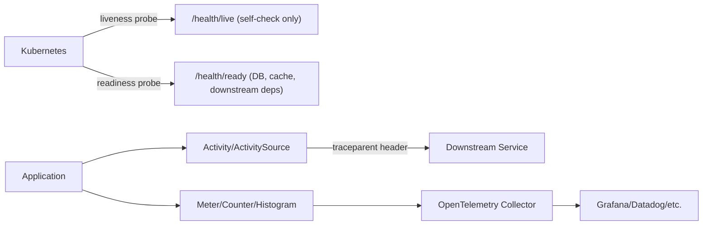

# Module 14 — ASP.NET Core: Health Checks & Observability Integration

> Domain: .NET / ASP.NET Core | Level: Beginner → Expert | Prerequisite: [[01-Middleware-Pipeline-Request-Internals]], [[02-DI-Container-Internals]]

---

## 1. Fundamentals
**Health checks** (`Microsoft.Extensions.Diagnostics.HealthChecks`) let a service report its own operational status (`Healthy`/`Degraded`/`Unhealthy`) via a dedicated endpoint, consumed by orchestrators (Kubernetes liveness/readiness probes) and load balancers to decide whether to route traffic to or restart a given instance. **Observability** (structured logging, metrics via `System.Diagnostics.Metrics`, distributed tracing via `System.Diagnostics.Activity`/OpenTelemetry) is how a running system's internal behavior becomes externally inspectable. Both exist because a distributed system's individual components must be able to answer "am I working correctly" and "what is actually happening inside me" without a human manually inspecting each instance.

## 2. Deep Dive

### 2.1 Liveness vs Readiness — a Critical, Frequently-Confused Distinction
**Liveness** ("is this process alive, or should it be killed and restarted?") and **readiness** ("can this instance currently accept traffic?") are semantically distinct and must be mapped to **separate** health-check endpoints/tags — a check that's naturally transient (e.g., "database connection pool is momentarily exhausted") should fail *readiness* (temporarily stop routing traffic here) but must **never** fail *liveness* (which would cause Kubernetes to kill and restart a perfectly healthy process that's just waiting on a downstream dependency to recover) — conflating the two is a classic, severe production mistake: a downstream database outage can cascade into the **entire fleet being killed and restarted simultaneously** if a database-connectivity check is wired to the liveness probe instead of readiness.

### 2.2 `IHealthCheck` and Tagging
```csharp
services.AddHealthChecks()
    .AddCheck<DatabaseHealthCheck>("database", tags: new[] { "ready" })
    .AddCheck("self", () => HealthCheckResult.Healthy(), tags: new[] { "live" });

app.MapHealthChecks("/health/live", new HealthCheckOptions { Predicate = c => c.Tags.Contains("live") });
app.MapHealthChecks("/health/ready", new HealthCheckOptions { Predicate = c => c.Tags.Contains("ready") });
```
Tags are precisely how one health-check registry serves both liveness and readiness endpoints with different check subsets — the liveness endpoint should include **only** checks verifying the process itself hasn't deadlocked/corrupted (rarely more than a trivial self-check), while readiness includes all genuine dependency checks (database, cache, downstream APIs).

### 2.2b Distributed Tracing — `Activity` and `ActivitySource`
`System.Diagnostics.Activity` is the .NET-native building block for distributed tracing (predating and now aligned with OpenTelemetry's semantic conventions) — an `Activity` represents one traced operation (a request, a database call), automatically correlated via a `TraceId`/`SpanId` propagated across process boundaries (via the `traceparent` HTTP header, W3C Trace Context standard) and across `async`/`await` boundaries within a process (via `AsyncLocal`-based `ExecutionContext` flow, directly Module 2 §2.3's mechanism, now applied to tracing context instead of `SynchronizationContext`).

### 2.3 Metrics — `System.Diagnostics.Metrics`
The modern (.NET 6+) built-in metrics API (`Meter`, `Counter<T>`, `Histogram<T>`) is vendor-neutral and OpenTelemetry-compatible by design — replacing older, provider-specific metrics APIs. A `Histogram<T>` recording request duration is the standard mechanism feeding p50/p99 latency dashboards.

## 3. Visual Architecture


## 4. Production Example
**Scenario**: A fleet-wide cascading restart. A shared database experienced a brief (90-second) connection-pool exhaustion under a traffic spike. Every replica's health check — a single, undifferentiated `/health` endpoint checking database connectivity, wired to **both** the Kubernetes liveness **and** readiness probes — failed simultaneously. Kubernetes, interpreting the liveness failure as "the process is broken," killed and restarted **every replica in the fleet at once**, converting a brief, self-recovering database blip into a full-platform outage (all replicas restarting simultaneously, cold-starting, and hitting the still-recovering database with a synchronized reconnection storm). **Fix**: split into separate liveness (`self`-only) and readiness (`database`-included) endpoints, per §2.1, with liveness probe configuration in Kubernetes pointed only at the former. **Lesson**: a health-check design mistake this subtle-looking has fleet-wide blast radius — exactly the "small config detail, catastrophic scale of impact" pattern recurring throughout this course (Module 9's forwarded-headers, Module 10's captive dependency, Module 12's claims transformation).

## 5. Best Practices
- Always separate liveness (self-check only) from readiness (full dependency checks) — never let a downstream dependency's health affect liveness.
- Use `System.Diagnostics.Activity`/OpenTelemetry for tracing rather than provider-specific SDKs, for portability across observability backends.
- Emit structured logs (not string-interpolated messages) so log fields are queryable, directly enabling the "differentiate expected vs unexpected" triage discipline from Module 8.
- Correlate logs, traces, and metrics via a shared `TraceId` for effective cross-signal debugging.

## 6. Anti-patterns
- A single undifferentiated health-check endpoint serving both liveness and readiness (§4's incident).
- Logging at `Information` severity for routine, expected outcomes — reproducing Module 8's expected-vs-unexpected severity-differentiation failure at the observability layer.
- Health checks that themselves perform expensive, side-effecting operations (e.g., writing test data) rather than lightweight connectivity/status checks.

---

## 10. Interview Questions

### Basic (10)

1. **Q: What's the difference between a liveness check and a readiness check?**
   **A:** Liveness answers "should this process be killed and restarted"; readiness answers "should traffic currently be routed to this instance" — they must use different check subsets.

2. **Q: What does an `IHealthCheck` implementation return?**
   **A:** A `HealthCheckResult` — `Healthy`, `Degraded`, or `Unhealthy`, optionally with a description and data payload.

3. **Q: Why are tags used on health checks?**
   **A:** To let one shared health-check registry serve multiple endpoints (liveness, readiness) each filtering to a different subset of checks via a `Predicate`.

4. **Q: What is `System.Diagnostics.Activity` used for?**
   **A:** Representing one traced operation (a request, a database call) for distributed tracing, correlated via a `TraceId`/`SpanId`.

5. **Q: What are `Meter`, `Counter<T>`, and `Histogram<T>`?**
   **A:** The building blocks of .NET's vendor-neutral metrics API — a `Meter` groups related instruments; `Counter<T>` records monotonically increasing counts; `Histogram<T>` records a distribution of values (like request durations).

6. **Q: Why prefer structured logging over string-interpolated log messages?**
   **A:** Structured logging keeps individual fields (user ID, order ID, status code) as separately queryable data rather than embedding them unsearchably inside a formatted string.

7. **Q: What HTTP status code does the health-checks middleware typically return for an unhealthy result?**
   **A:** `503 Service Unavailable`.

8. **Q: What is the W3C standard header used to propagate trace context across services?**
   **A:** `traceparent`.

9. **Q: Why should health checks be kept lightweight and fast?**
   **A:** They're polled frequently by orchestrators; an expensive check adds recurring, avoidable load and can itself become a source of instability.

10. **Q: What is OpenTelemetry?**
    **A:** A vendor-neutral, open standard and SDK for collecting traces, metrics, and logs, portable across many different observability backends.

### Intermediate (10)

1. **Q: Why must a downstream database's transient unavailability never be wired to the liveness probe?**
   **A:** Because liveness failure triggers a process kill-and-restart — if a database blip fails liveness, every replica hitting that same database gets killed simultaneously, converting a transient, recoverable dependency issue into a full, self-inflicted fleet outage.

2. **Q: How does trace context propagate across an `await` boundary within a single process?**
   **A:** Via the same `AsyncLocal`-based `ExecutionContext` flow mechanism used for `AsyncLocal<T>` generally (Module 2 §2.3) — `Activity.Current` is itself flowed this way, so it remains correctly set across asynchronous continuations without manual passing.

3. **Q: How would you tag checks to serve three distinct endpoints: liveness, readiness, and a Kubernetes "startup" probe?**
   **A:** Tag each check with one or more of `"live"`, `"ready"`, `"startup"` as appropriate, then map three separate endpoints each filtering via `HealthCheckOptions.Predicate` to the matching tag — a startup probe commonly includes a superset of readiness checks but is polled only during the container's initial startup window before liveness/readiness take over.

4. **Q: Why is `Histogram<T>`, not `Counter<T>`, the correct instrument for request latency?**
   **A:** A histogram records the full distribution of individual observed values (enabling p50/p95/p99 percentile calculations); a counter only tracks a running total/rate, which can't answer "what does the latency distribution look like" at all.

5. **Q: How does structured logging enable the same expected-vs-unexpected triage discipline covered in the exception-handling module?**
   **A:** By tagging log entries with a consistent, queryable severity/category field distinguishing "expected domain outcome" from "unexpected failure," exactly as that module recommends for exception handling — structured fields make this distinction filterable/dashboardable at the logging layer, not just at the exception-catching layer.

6. **Q: What's a realistic reason a readiness check might need to be more comprehensive than a liveness check but less comprehensive than a "deep" diagnostic endpoint?**
   **A:** Readiness needs to verify the dependencies actually required to serve traffic correctly (database, critical cache) without being so exhaustive (checking every possible downstream integration) that it becomes slow/expensive/fragile to transient blips in non-critical dependencies, which is better modeled as `Degraded` (Advanced/Hard exercise) than an all-or-nothing readiness failure.

7. **Q: Why is a single health check testing "can I reach every downstream dependency" often the wrong design?**
   **A:** It conflates critical and non-critical dependencies into one pass/fail signal, and conflates liveness-appropriate and readiness-appropriate concerns — a single non-critical dependency blip would incorrectly take the whole instance out of rotation (or worse, if wired to liveness, kill it) even though the instance could otherwise serve most requests correctly.

8. **Q: What does correlating logs, traces, and metrics via a shared `TraceId` actually let you do in practice?**
   **A:** Jump from a single slow/erroring request (found via a log entry or an alert) directly to its full distributed trace showing every downstream call and their individual durations, then to the aggregate metrics dashboard for the same time window — moving fluidly between "one specific incident" and "the aggregate pattern" using one shared identifier.

9. **Q: Why is `Activity.Current` risk-prone specifically around `Task.Run`-offloaded work?**
   **A:** `Task.Run` queues work to the thread pool with a fresh `ExecutionContext` flow from the calling context by default (it does flow correctly in standard usage) — but code that explicitly suppresses execution-context flow (`ExecutionContext.SuppressFlow()`) or uses certain older, non-flowing scheduling APIs can silently lose `Activity.Current`, producing a broken/orphaned trace span with no parent, an easy-to-miss gap in an otherwise-correct instrumentation setup.

10. **Q: Why would a team choose to log at `Warning` or a distinct custom severity for an expected-but-notable outcome, rather than `Information` or `Error`?**
    **A:** To make the log queryable/alertable at a severity level distinct both from routine informational noise and from genuine unexpected errors — mirroring the exception-handling module's expected-vs-unexpected distinction, applied here as a deliberate logging-severity convention rather than left to default, inconsistent per-engineer judgment.

### Advanced (10)

1. **Q: Design a health-check strategy for a service with one critical dependency (its primary database) and one non-critical dependency (an optional recommendation cache), correctly using `Degraded`.**
   **A:** The database check returns `Unhealthy` on failure (tagged `"ready"`, causing readiness to fail and traffic to stop routing here); the cache check returns `Degraded` (not `Unhealthy`) on failure, tagged `"ready"` but configured so the aggregate readiness response still returns a 200-equivalent "degraded but serving" status for `Degraded` results specifically (via a custom `ResponseWriter`/status-code mapping) — the instance keeps serving traffic (recommendations gracefully disabled/falling back) rather than being needlessly pulled from rotation over a genuinely non-critical dependency.

2. **Q: Explain precisely how `Activity.Current` flows across an `await` boundary, and identify a specific scenario where it breaks.**
   **A:** It flows via `ExecutionContext`, the same mechanism carrying `AsyncLocal<T>` values (Module 2 §2.3) — it breaks specifically when code uses `ConfigureAwait(false)` combined with manual `SynchronizationContext`-bypassing in a way that also strips execution context (rare in ordinary code), or, more commonly, when a fire-and-forget `Task.Run(...)` is deliberately detached from the original request's lifetime in a way that intentionally starts a new, unparented `Activity` — the break is usually deliberate/architectural, not accidental, but must be understood so an "orphaned trace span" isn't mistaken for an instrumentation bug when it's actually the correct behavior for genuinely decoupled background work.

3. **Q: Diagnose the fleet-wide cascading restart from first principles, without having seen the specific incident before.**
   **A:** Symptom: all replicas restart simultaneously during a downstream outage. First question: what health-check endpoint is wired to the liveness probe, and does it include any downstream dependency check? If yes, that's the root cause — liveness must check only local process health (self-check), never downstream dependencies, since a downstream outage affecting every replica identically will otherwise fail every replica's liveness identically and simultaneously, and Kubernetes has no way to know "these are all failing for the same external reason, don't restart everything at once."

4. **Q: Design an alerting strategy distinguishing "one replica unhealthy" from "the whole fleet unhealthy."**
   **A:** Alert only on the **aggregate** readiness-failure rate across the fleet (e.g., ">50% of replicas failing readiness for >2 minutes") rather than any single replica's individual failure, which the orchestrator already handles automatically (removing it from rotation, and, for liveness, restarting it) without needing a human paged — reserve paging specifically for patterns indicating a systemic issue no amount of individual-replica self-healing will resolve (e.g., every replica failing the same downstream check simultaneously).

5. **Q: Architect a full OpenTelemetry pipeline for a microservices estate, addressing sampling strategy explicitly.**
   **A:** Every service exports traces/metrics/logs to a local OpenTelemetry Collector sidecar/agent, which batches and forwards to a central collector tier; apply **tail-based sampling** at the central tier (deciding whether to retain a trace *after* seeing its full outcome) specifically so 100% of error/slow traces are retained regardless of a low overall sampling rate, while routine successful traces are sampled at a low percentage — this requires buffering complete traces at the collector tier (since the retain/discard decision needs the full trace) as opposed to simpler, cheaper **head-based sampling** (deciding at trace start, before the outcome is known, which discards error traces at the same rate as successful ones — a poor fit when errors are exactly what you most need visibility into).

6. **Q: Design a health-check dependency graph where Service A's readiness check calls Service B, which has its own health check — how do you avoid cascading, circular, or redundant check storms?**
   **A:** Service A's check of Service B should call B's **already-computed, cached** health status (e.g., B's last-known readiness state, refreshed on B's own polling cadence) rather than triggering a fresh, synchronous health check of B on every single poll of A — and critically, B's check must never, even transitively, check back on A, which would create a circular dependency; the correct pattern is a strict, acyclic dependency direction (A depends on B's health, never the reverse) with each service's health check reflecting only its own immediate dependencies' cached status, not a live, recursive fan-out.

7. **Q: Why might returning `Degraded` rather than `Unhealthy` for a non-critical dependency still need very careful monitoring, even though it doesn't remove the instance from rotation?**
   **A:** Because `Degraded` states can silently persist and compound — if the "optional" cache has been down for hours and every replica is serving in a permanently degraded mode without anyone noticing (since nothing failed loudly), a genuinely important, user-facing feature-quality regression can go unaddressed for a long time; `Degraded` needs its own dashboard/alerting distinct from binary healthy/unhealthy, not just "doesn't page, so it's fine."

8. **Q: How would you decide the appropriate sampling rate for routine, successful traces in a high-volume service, balancing cost against debuggability?**
   **A:** Start from the actual, measured cost per trace at the observability backend's pricing model, multiplied by expected trace volume, to establish a cost ceiling; then choose the highest sampling rate the budget allows while ensuring the *retained* sample size remains statistically large enough to detect meaningful latency-distribution shifts (not just error traces, which tail-based sampling already retains at 100% regardless) — this is a genuine, quantifiable trade-off decision, not an arbitrary percentage choice, and should be revisited as traffic volume/backend pricing changes.

9. **Q: Explain why "the deployment just happened, and the readiness checks are failing right after" might be entirely expected behavior rather than a bug.**
   **A:** A newly-started replica legitimately takes some time to warm up (JIT tiering, Module 1; connection-pool establishment) before it's genuinely ready to serve traffic efficiently — readiness probes are specifically designed to hold new replicas out of rotation during this window, and a "startup probe" (Intermediate Q3) with a longer initial grace period is the correct tool for this, rather than treating early readiness failures immediately after deployment as an incident.

10. **Q: How would you extend this module's incident (§4) into a standing, automated safeguard preventing recurrence across an entire service fleet?**
    **A:** Add the liveness/readiness-separation requirement (distinct endpoints, distinct tag sets, liveness containing only a trivial self-check) to the organization's shared service template (directly the governance pattern established in the middleware and DI modules), plus a CI/deployment-gate check verifying a new service's Kubernetes manifest points its liveness and readiness probes at genuinely different paths before allowing deployment — converting this module's single, severe incident into a structurally-enforced standard rather than tribal knowledge.

### Expert (10)

1. **Q: A very large microservices estate is considering 100% trace sampling ("full observability, nothing missed") — evaluate this as a Principal Engineer.**
   **A:** Full sampling gives maximum debuggability but scales cost linearly with traffic — at genuinely large scale, this becomes a dominant, unbounded infrastructure cost line item; the better answer is near-100% retention specifically for *interesting* traces (errors, high latency, a sampled fraction of specific high-value transaction types) via tail-based sampling, which delivers the debugging value that matters (you almost never need to inspect a routine, fast, successful trace after the fact) at a small fraction of the cost — recommend this instead of blanket full sampling, with the sampling policy itself version-controlled and reviewed as infrastructure, not a one-time setup decision.

2. **Q: Design a "canary readiness" mechanism where a newly-deployed replica's readiness check is intentionally more conservative than steady-state replicas', to catch a bad deployment before it receives full traffic.**
   **A:** Tag a canary-specific, stricter set of checks (verifying not just connectivity but a synthetic, representative transaction succeeds end-to-end) applied only during a replica's first few minutes post-deployment (distinguishable via a startup timestamp or explicit canary-phase flag), falling back to the ordinary, less strict readiness checks once the replica has been serving successfully for a defined warm-up period — this lets a genuinely broken deployment (passing basic connectivity checks but failing actual business transactions) be caught and rolled back automatically before it's promoted to serve full production traffic.

3. **Q: How would you reason about whether liveness checks should have any dependency awareness at all, even something as seemingly safe as "is my own internal work queue backed up beyond a sane threshold"?**
   **A:** This is a legitimate, narrower exception to "liveness = self-check only" — an internal, self-contained signal (not a downstream dependency) genuinely indicating the process itself is stuck/deadlocked (as opposed to merely slow due to an external cause) is arguably appropriate for liveness, since restarting a genuinely deadlocked process is the correct remedy; the key distinguishing test is "would restarting this specific process actually fix the problem, or would every replica hit the identical failure again immediately because the root cause is external" — only checks passing that test belong on liveness.

4. **Q: Explain the interaction between health-check-driven traffic shifting and the request-draining/graceful-shutdown behavior covered in the middleware module.**
   **A:** When a replica is marked not-ready (whether intentionally during shutdown, or due to a failing dependency), the orchestrator stops routing *new* traffic to it, but requests already in flight must still be allowed to complete within the graceful-shutdown grace period (Module 9's `RequestAborted`/hosting-lifetime discussion) — a health-check design that immediately terminates the process the instant readiness fails (rather than coordinating with graceful drain) would abruptly cut off in-flight requests instead of letting them finish, a subtle but important interaction between two mechanisms that are easy to design independently but must actually work together correctly.

5. **Q: As a Principal Engineer, how would you evaluate a proposal to replace health checks with "just monitor error rates and let the orchestrator's own crash-loop-backoff handle everything"?**
   **A:** Push back: error-rate monitoring is a valuable **complementary** signal but a poor substitute for dedicated health checks — a replica can be perfectly capable of serving *most* requests successfully (low overall error rate) while a specific critical dependency it needs is down, with health checks providing an explicit, targeted, low-latency signal ("this specific thing is broken") long before an aggregate error-rate threshold would trip; recommend health checks as the primary, fast-acting mechanism for traffic-routing/restart decisions, with error-rate/latency monitoring as the complementary, slower, aggregate-pattern-detection layer for human alerting — not a replacement for either.

---

### Additional Medium → Expert (20)
1. **Q: How does the health-check middleware execute registered checks — concurrency, timeouts, and what a hung check does to the endpoint?** **A:** `HealthCheckService` runs the filtered checks concurrently (each as a task), honoring per-check timeouts only if you configure them (via registration timeout or a linked token inside the check); an unbounded hung check (a sync DB call with no timeout) hangs the whole probe request until Kubernetes' probe timeout kills the *probe attempt* — repeated probe timeouts then fail the pod despite the app being otherwise fine. Discipline: every check wraps its work in a timeout well under the probe's `timeoutSeconds`, and checks must be non-blocking async.
2. **Q: What is health-check result caching, and why do orchestrator probe intervals make it necessary for expensive checks?** **A:** Kubernetes probes hit endpoints every `periodSeconds` per probe type per container — with liveness + readiness + startup across many replicas, an uncached "SELECT 1 + cache ping + queue depth" check becomes a nontrivial synthetic load on shared dependencies (a monitoring-induced thundering herd). Fix: checks cache their last result for a few seconds (or a background loop refreshes shared state the probe reads instantly), decoupling probe frequency from dependency-test frequency while keeping staleness bounded and documented.
3. **Q: Design the `IHealthCheckPublisher` pattern — what does push-based health add over pull probes, and where is it the right fit?** **A:** Publishers run on a background timer, receiving the aggregated `HealthReport` and pushing it somewhere: metrics (a `health_status` gauge per check — trend visibility, alerting on flapping), incident tooling, service registries (Consul TTL checks), or a central health dashboard. Pull probes answer "should traffic flow to this instance now"; publishers answer fleet-level questions ("what fraction of instances see the cache as degraded, trending over time") — pull for orchestration, push for observability; mature services use both from one check registry.
4. **Q: Explain `Activity`/`ActivitySource` mechanics — listeners, sampling decisions, and why an unlistened `StartActivity` returns null.** **A:** `ActivitySource.StartActivity` consults registered `ActivityListener`s (OpenTelemetry's TracerProvider registers one); with no listener, or a sampler deciding drop-at-creation, it returns null — no allocation, near-zero cost — which is why instrumentation must null-check (`activity?.SetTag(...)`) and why "my spans don't appear" usually means no listener matched the source name. Samplers decide at creation (head sampling) with the decision (`ActivitySamplingResult`) controlling whether the activity records data, propagates only, or drops — cost control happens at this gate.
5. **Q: How does W3C trace context actually propagate through `HttpClient` — who injects `traceparent`, and what breaks propagation silently?** **A:** The runtime's built-in distributed tracing (DiagnosticsHandler inside `HttpClientHandler`'s pipeline) injects `traceparent`/`tracestate` from `Activity.Current` automatically when tracing is active. Silent breakers: creating raw `SocketsHttpHandler` chains without the diagnostics handler (manual handler construction bypasses it), background work where `Activity.Current` is null (ExecutionContext not flowed — queued work must capture and restore the propagation context explicitly), custom message-queue hops (you must inject/extract manually via `Propagators.DefaultTextMapPropagator`), and intermediaries stripping unknown headers. The rule: HTTP propagation is free; every non-HTTP hop is your responsibility.
6. **Q: What's the difference between span links and parent-child relationships, and when is a link the correct model?** **A:** Parent-child expresses synchronous causality (this operation ran inside that one); links associate spans causally-related but not nested — batch processing (one consumer span linking to N producer spans whose messages it batched), fan-in joins, and retries referencing prior attempts. Modeling a batch consumer as a *child* of one message's trace misattributes the other N-1 and produces misleading trace durations; links keep each message's trace intact while making the batch discoverable from all of them.
7. **Q: Metrics cardinality: why does adding `customer_id` as a metric tag melt your monitoring bill, and what are the design rules for tag selection?** **A:** Each unique tag-value combination materializes a distinct time series stored/indexed/queried independently — unbounded-cardinality tags (user IDs, order IDs, full URLs) explode series counts into millions, degrading query performance and cost linearly-to-worse. Rules: tags must come from small closed sets (status class, endpoint route *template* not raw path, region, tenant *tier* not tenant id); high-cardinality context belongs in traces/logs (exemplars bridge them — a histogram bucket can carry sampled trace IDs); and every new tag on a hot metric is a cost-review item — cardinality is multiplicative across tags.
8. **Q: Explain histogram bucket design for latency SLOs — why default buckets often can't answer "what's my p99," and what exponential/native histograms change.** **A:** Percentiles from bucketed histograms interpolate within bucket boundaries: if your SLO threshold (say 250ms) falls inside a wide bucket (100–500ms), the computed p99 is an interpolation artifact — you literally cannot distinguish 240ms from 480ms. Classic fix: hand-place bucket edges at SLO-relevant thresholds (and accept the cost of more buckets). Exponential/native histograms (OTLP exponential, Prometheus native) auto-scale bucket resolution with far better fidelity per byte, removing manual bucket curation — but confirm your backend supports them end-to-end before relying on it.
9. **Q: What are exemplars, and how do they close the metrics→traces investigation gap?** **A:** Exemplars attach sampled trace IDs (with timestamps/values) to metric data points — a latency histogram's slow bucket carries actual trace IDs of requests that landed there. Investigation flow becomes: alert on p99 breach → click the exemplar in the slow bucket → land in the exact distributed trace exhibiting the problem — eliminating the "metrics say slow, now go fish in the trace UI for a matching slow request" gap, which is where incident minutes evaporate. Requires coordinated support: SDK recording exemplars, backend storing them, dashboards surfacing them.
10. **Q: How should log sampling differ from trace sampling — what must never be sampled, and how do you keep logs affordable at scale?** **A:** Never sample: errors/warnings, security/audit events, and state-transition records (deploy markers, config changes) — their absence during an incident is unacceptable. Sample: high-volume success-path `Information` noise (per-request "handled request" lines duplicated by metrics anyway — either drop them for access-log middleware + metrics, or sample heavily with counts preserved via metrics). Mechanisms: category/level-based filtering at source (cheapest — never serialized), collector-tier sampling with error-bypass rules, and dynamic level overrides (raise verbosity per-category during investigation via `IOptionsMonitor`-driven logging config) instead of shipping debug logs always.
11. **Q: What is `ILogger` high-performance logging — `LoggerMessage.Define`/`[LoggerMessage]` source generation — and what does it eliminate versus `LogInformation` calls?** **A:** Direct `LogInformation("User {UserId} did {Action}", userId, action)` boxes value-type arguments, allocates the params array, and parses the template per call even when the level is disabled. `[LoggerMessage]`-generated methods cache the parsed template, generate strongly-typed log methods with `IsEnabled` guards, and avoid boxing/array allocation — near-zero cost when disabled, minimal when enabled. On hot paths (per-request, per-message), this is the difference between logging being free and logging appearing in allocation profiles; platform guidance should make generated loggers the default for library/hot-path code.
12. **Q: Explain scopes (`BeginScope`) mechanics and the failure mode where scope data leaks across unrelated log lines.** **A:** Scopes push state onto an `AsyncLocal` stack that providers attach to every log line within the scope's async flow; disposal pops it. Leaks happen when disposal is skipped (missing `using` — the scope persists for the ExecutionContext's remaining flow, stamping later unrelated operations with stale tenant/user context) or when scopes are opened in one async flow and disposed in another (out-of-order disposal corrupting the stack). Discipline: scopes always via `using`/`using var` in the same method, opened at well-defined boundaries (middleware, message-handler entry), and never held across fire-and-forget forks.
13. **Q: How do you propagate observability context into queued/background work correctly — enumerate what must be captured and restored.** **A:** Capture at enqueue: trace context (`Activity.Current?.Context` — serialize traceparent/tracestate into the message/work item), baggage (if used for cross-cutting context), and relevant logging context (correlation/tenant IDs as message metadata — logger scopes don't survive the queue). Restore at dequeue: start a new consumer `Activity` with the extracted context as *link or parent* (parent for logical continuation, link for batch semantics — Q6), reopen logger scopes from metadata, and stamp metrics with appropriate low-cardinality tags. Forgetting this yields orphaned consumer traces and uncorrelatable logs — the most common observability gap in event-driven systems.
14. **Q: Design the readiness semantics for a service that consumes from Kafka but also serves HTTP queries — should consumer health affect HTTP readiness?** **A:** Separate the concerns: HTTP readiness should reflect ability to serve HTTP (its own dependencies — DB, caches), not consumer health, because pulling the pod from the HTTP load balancer doesn't help a lagging consumer (and a consumer-only issue would needlessly remove query capacity). Consumer health belongs in: liveness only if the consumer loop is *hung irrecoverably* (restart helps), otherwise metrics/alerts (lag, processing rate) and possibly a distinct health tag surfaced to dashboards — not traffic-affecting probes. The general rule: each probe gates a specific consequence (restart, traffic removal); wire a signal to a probe only if that consequence actually remediates that signal.
15. **Q: What's the observability architecture for distinguishing "we're slow" from "a dependency is slow" in one glance — which signals and dashboard shapes achieve it?** **A:** Per-endpoint RED metrics (rate/errors/duration) paired with per-dependency client metrics (duration histograms per downstream, connection-pool saturation, retry/timeout counts) on one dashboard row — when endpoint p99 rises, the dependency row immediately shows whether a downstream's latency rose in lockstep (dependency-caused) or stayed flat (self-caused: thread-pool starvation, GC, lock contention — check runtime counters on the same board: pool queue length, GC pause time, exception rate). Traces confirm the attribution via span-time breakdown. The design principle: co-locate cause-candidate signals with symptom signals so triage is a visual comparison, not a query-writing exercise.
16. **Q: Explain tail-based sampling — what it enables that head sampling can't, what infrastructure it requires, and its failure modes.** **A:** Tail sampling defers the keep/drop decision until a trace completes, deciding on *observed* properties: keep all errors, all >p99-latency traces, and 1% of the rest — the ideal policy head sampling can't express (it must decide at trace start, blind to outcome). Requires: all spans of a trace routed to the same collector instance (trace-ID-aware load balancing across the collector tier), buffering memory proportional to in-flight trace volume × decision window, and policy configuration. Failure modes: buffer overflow under load (dropped decisions), incomplete traces from long-running spans exceeding decision windows, and collector-tier operational complexity — adopt when error/latency-biased retention materially beats uniform sampling for your volume.
17. **Q: What runtime counters/diagnostics should every production .NET service export by default, and what does each catch?** **A:** Thread pool: queue length + thread count (starvation, sync-over-async); GC: gen-2/LOH collection rates, pause durations, heap sizes, allocation rate (leaks, GC-driven latency); exceptions: first-chance rate (exception-as-control-flow, error storms); connections: Kestrel current connections, HttpClient pool counters per endpoint (pool exhaustion, socket leaks); DB pool utilization; plus process CPU/memory vs. limits (throttling/OOM proximity in containers). These form the "is it us" layer beneath application metrics — most mystery latency incidents resolve to one of these counters, and exporting them costs almost nothing versus discovering mid-incident that they're absent.
18. **Q: How do you make alerting SLO-based rather than cause-based — burn-rate alerts, and why do they beat threshold alerts on raw metrics?** **A:** Define SLOs (99.9% of requests succeed under 300ms over 30 days) yielding an error budget; alert on budget *burn rate* — fast-burn (e.g., consuming 2% of monthly budget in 1 hour — page immediately) and slow-burn (5% in 6 hours — ticket) windows. Versus threshold alerts ("CPU > 80%", "p99 > 500ms for 5m"): burn rates alert only when users are meaningfully affected relative to the promise (no 3 AM pages for harmless blips), auto-scale severity with impact, and remain stable through traffic variation. Cause-based signals demote to diagnostic dashboards consulted *after* an SLO alert fires — causes inform debugging; symptoms (budget burn) justify waking humans.
19. **Q: What is OpenTelemetry Collector architecture good for beyond protocol translation — enumerate the production capabilities a collector tier provides.** **A:** The collector decouples apps from backends: receivers/processors/exporters pipelines provide backend migration without app redeploys (swap exporters), tail sampling (Q16), data shaping (attribute redaction/PII scrubbing before egress — a compliance control point, dropping high-cardinality attributes, renaming for schema consistency), batching/retry/queueing (absorbing backend outages without app memory growth), fan-out (same telemetry to two backends during migration/evaluation), and cost controls (filtering noisy signals centrally). Architecturally it converts observability from N apps × M backends point-to-point into a governed pipeline with one policy surface — the same argument as an API gateway, applied to telemetry.
20. **Q: As a Principal Engineer, you must cut observability spend 40% without losing incident-response capability. Sequence the analysis and cuts.** **A:** First measure spend by signal × source (which services, which log categories, which metrics dominate — typically: verbose success-path logs, unbounded-cardinality metrics, and 100%-sampled traces). Cuts in order of safety: (1) drop/derive duplicate signals (per-request info logs duplicating access metrics — delete, keep the metric); (2) fix cardinality offenders (Q7 — route templates not URLs, tier not tenant); (3) move trace sampling to error/latency-biased (tail or probabilistic-with-error-bypass — retain 100% of *interesting* traces at a fraction of volume); (4) tier retention (7-day hot logs, cheap cold archive for compliance rather than uniform 90-day hot); (5) collector-level filtering as the enforcement point so policies apply uniformly. Protect: error/audit logs, SLO metrics, exemplar linkage, and the ability to raise verbosity dynamically during incidents (the cheap substitute for always-on debug data). Then govern: per-team telemetry budgets with showback, CI checks on new metric cardinality, and quarterly reviews — spend regressions are architectural drift, not finance's problem.

## 11. Coding Exercises

### Easy — Database health check with timeout
```csharp
public class DatabaseHealthCheck : IHealthCheck
{
    private readonly AppDbContext _db;
    public DatabaseHealthCheck(AppDbContext db) => _db = db;

    public async Task<HealthCheckResult> CheckHealthAsync(HealthCheckContext context, CancellationToken ct)
    {
        using var cts = CancellationTokenSource.CreateLinkedTokenSource(ct);
        cts.CancelAfter(TimeSpan.FromSeconds(2)); // never let a slow check itself become the problem
        try
        {
            await _db.Database.CanConnectAsync(cts.Token);
            return HealthCheckResult.Healthy();
        }
        catch (OperationCanceledException)
        {
            return HealthCheckResult.Unhealthy("Database connectivity check timed out.");
        }
    }
}
```

### Medium — Separate live/ready endpoints
```csharp
app.MapHealthChecks("/health/live", new HealthCheckOptions
{
    Predicate = check => check.Tags.Contains("live") // only the trivial self-check
});
app.MapHealthChecks("/health/ready", new HealthCheckOptions
{
    Predicate = check => check.Tags.Contains("ready") // database, cache, downstream deps
});
```

### Hard — `Degraded` for a non-critical dependency, 200 status preserved
```csharp
public class RecommendationCacheHealthCheck : IHealthCheck
{
    public async Task<HealthCheckResult> CheckHealthAsync(HealthCheckContext context, CancellationToken ct)
    {
        try
        {
            await PingCacheAsync(ct);
            return HealthCheckResult.Healthy();
        }
        catch
        {
            return HealthCheckResult.Degraded("Recommendation cache unavailable; serving without recommendations.");
        }
    }
}

app.MapHealthChecks("/health/ready", new HealthCheckOptions
{
    Predicate = c => c.Tags.Contains("ready"),
    ResultStatusCodes =
    {
        [HealthStatus.Degraded] = StatusCodes.Status200OK // keep serving traffic; body still reports "Degraded"
    }
});
```
**Discussion**: The explicit `ResultStatusCodes` mapping is the key mechanism — without it, `HealthCheckResult.Degraded` still defaults to a non-200 status by the built-in writer in some configurations, which would incorrectly pull the replica from rotation over a genuinely non-critical dependency.

### Expert — `ActivitySource`-wrapped `HttpClient` call with duration histogram
```csharp
public class InstrumentedApiClient
{
    private static readonly ActivitySource _activitySource = new("MyApp.ApiClient");
    private static readonly Meter _meter = new("MyApp.ApiClient");
    private static readonly Histogram<double> _callDuration = _meter.CreateHistogram<double>("api_client.call.duration_ms");

    private readonly HttpClient _httpClient;
    public InstrumentedApiClient(HttpClient httpClient) => _httpClient = httpClient;

    public async Task<HttpResponseMessage> GetAsync(string path, CancellationToken ct)
    {
        using var activity = _activitySource.StartActivity("ApiClient.Get", ActivityKind.Client);
        activity?.SetTag("http.path", path);

        var sw = Stopwatch.StartNew();
        try
        {
            var response = await _httpClient.GetAsync(path, ct); // traceparent header propagated automatically
                                                                    // by HttpClient's built-in DiagnosticsHandler
            activity?.SetTag("http.status_code", (int)response.StatusCode);
            return response;
        }
        finally
        {
            _callDuration.Record(sw.Elapsed.TotalMilliseconds, new KeyValuePair<string, object?>("path", path));
        }
    }
}
```
**Discussion**: Modern `HttpClient` already propagates `traceparent` automatically via its built-in diagnostics handler as long as `Activity.Current` is set when the call is made — the explicit `StartActivity` here creates the **client-side span** itself (giving it a name/tags), not the propagation mechanism, which happens transparently underneath.

---

## 12. System Design
A production-grade platform separates liveness/readiness per §2.1/§4, exports OpenTelemetry traces/metrics to a central collector, and uses tail-based sampling (Advanced Q5/Expert Q1) to retain full traces for error/slow requests while sampling routine successful traces at low volume for cost control — directly the architecture described in Expert Q1.

## 13. Low-Level Design
A small, shared `InstrumentedApiClient` base (Expert coding exercise) wrapping every outbound `HttpClient` call with consistent `ActivitySource`/`Histogram` instrumentation, registered via `IHttpClientFactory` (Module 10 §5), ensures every downstream call across a codebase is uniformly traced/measured without each team re-implementing instrumentation independently.

## 14. Production Debugging
The signature incident for this module: a fleet-wide cascading restart from an undifferentiated health check wired to both liveness and readiness (§4) — diagnosed via Advanced Q3's first-principles checklist; a second common incident class is a canary/newly-deployed replica failing readiness immediately post-deploy due to legitimate warm-up time, misdiagnosed as a bug rather than addressed with a proper startup-probe grace period (Intermediate Q3/Advanced Q9).

## 15. Architecture Decision
Tail-based sampling (Advanced Q5) is recommended over head-based sampling for any service where errors/slow requests are the primary debugging interest (nearly universal) — head-based sampling's simplicity is only worth its cost-of-missed-errors trade-off for extremely high-volume, low-diagnostic-value traffic where near-100% of traces are routine and uninteresting even when they fail.

## 16. Enterprise Case Study
OpenTelemetry's own emergence (a merger of the earlier, competing OpenTracing and OpenCensus standards) mirrors this course's recurring "the industry converges on one shared, vendor-neutral standard once enough competing, incompatible approaches exist" pattern — worth citing when justifying OpenTelemetry adoption over a provider-specific SDK to a team, since the entire point of the merger was ending exactly the vendor-lock-in/fragmentation problem provider-specific instrumentation creates.

## 17. Principal Engineer Perspective
Liveness/readiness separation is a non-negotiable, template-enforced standard (Advanced Q10) given its demonstrated fleet-wide blast radius (§4) — treat any new service's Kubernetes manifest as requiring explicit verification that liveness and readiness point to genuinely different, correctly-scoped endpoints before deployment is approved, exactly the same "small config detail, catastrophic scale of impact" governance discipline applied to forwarded-headers (Module 9) and captive dependencies (Module 10).

## 18. Revision
**Key takeaways**: Liveness = "kill and restart me if I fail" (self-check only); readiness = "route traffic to me if I pass" (dependency checks belong here). Conflating them turns a transient downstream blip into a fleet-wide outage. `Activity`/OpenTelemetry = vendor-neutral tracing; `Meter` = vendor-neutral metrics.

**Cross-reference**: [[01-Middleware-Pipeline-Request-Internals]] (HA/DR graceful shutdown) and Module 8 (expected-vs-unexpected severity differentiation, directly reapplied to structured logging here).

---

**Next**: This completes a strong core of the `02-DotNet-AspNetCore` domain (Modules 9–14: middleware, DI, Minimal APIs/Controllers, auth, configuration, observability). Continuing autonomously to `03-REST-APIs`.
