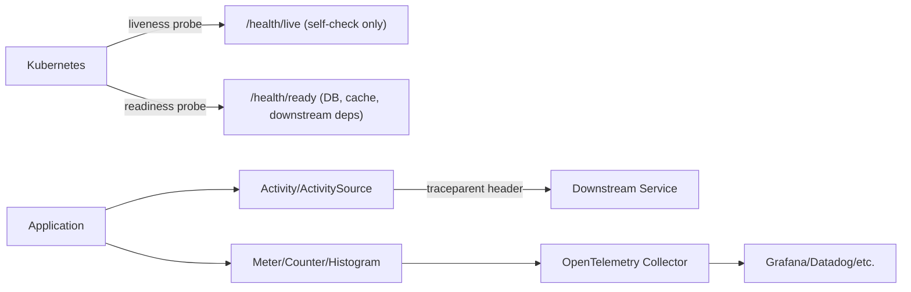

# Module 14 — ASP.NET Core: Health Checks & Observability Integration

> Domain:.NET / ASP.NET Core | Level: Beginner → Expert | Prerequisite: [[01-Middleware-Pipeline-Request-Internals]], [[02-DI-Container-Internals]]

---

## 1. Topic Description

### Definition

**Health checks** are the machine-readable statements a service makes about its own fitness, consumed by an orchestrator or load balancer that will take *automated action* on them. They come in three semantically distinct forms: **liveness** ("restart me"), **readiness** ("send me traffic"), and **startup** ("I am still initialising"). **Observability** is the instrumentation that lets someone who did not build the service explain its behaviour: structured logs via `ILogger`, distributed traces via `ActivitySource`/`Activity` (the .NET implementation of spans, propagated with W3C `traceparent`), and metrics via `Meter` and the runtime's built-in counters — all exportable through OpenTelemetry.

### Core sub-concepts

- **Probe semantics** — liveness versus readiness versus startup, and what remedy each triggers.
- **`IHealthCheck`, tags and filtered endpoints** — one registration set serving multiple audiences; health check publishers for push-based reporting.
- **`Healthy` / `Degraded` / `Unhealthy`** — essential versus non-essential dependency classification, and what the orchestrator does with each.
- **Structured logging** — message templates versus interpolation, level semantics defined by consequence, and interpolated-string handlers that skip formatting for disabled levels.
- **Logging scopes** — attaching correlation, tenant and user to every log in a request, and their per-line ingest cost.
- **`Activity` / `ActivitySource`** — spans, parent/child relationships, tags, automatic `AsyncLocal` propagation and W3C header propagation across HTTP.
- **Context propagation boundaries** — message brokers, queued background work, manually-created threads, and uninstrumented HTTP handlers.
- **`Meter`, counters, histograms and runtime counters** — the metric surface and the built-in ASP.NET Core / `HttpClient` / GC instrumentation.
- **Cardinality** — labels as the dominant cost driver; bounded values only; route templates rather than raw paths.
- **Sampling** — head-based versus tail-based, keeping errors and slow traces, and consistent sampling decisions across services.
- **Correlation identity** — trace ID as the correlation ID, returned to clients and carried onto messages.
- **Signal selection** — metric to detect, trace to localise, log to explain; alerting on symptoms rather than causes.
- **Telemetry as governed data** — PII redaction, retention, residency and access control.

### Where it fits

Health endpoints are pipeline endpoints (often on a `Map` branch, which is exactly why they can accidentally bypass authentication), and instrumentation hangs off the middleware pipeline, the DI container and configuration for exporter setup. Upward, health signals drive orchestration and load-balancing decisions, and telemetry is the input to SLOs, error budgets and incident response. Downward, the built-in ASP.NET Core, `HttpClient` and GC instrumentation means a service gets most of its useful signal without writing any custom code.

### Why it matters at scale

Health checks are dangerous precisely because something acts on them automatically. A readiness-style check used for liveness means a database blip restarts the entire fleet, converting a recoverable dependency failure into a full outage with cold caches and a thundering herd on recovery. A readiness probe that fails on any of five dependencies couples your availability to the availability of everything you touch — the opposite of resilience. On the observability side, the cost driver is cardinality: adding a user ID or a raw URL path as a metric label turns one time series into millions, which can exceed the cost of all other telemetry combined and take down the metrics backend. And a trace that breaks at the message broker makes end-to-end diagnosis impossible for exactly the asynchronous flows that need it most.

### Common pitfalls / anti-patterns

- **One `/health` endpoint used for both liveness and readiness** — a transient dependency failure triggers restarts instead of removal from rotation.
- **A liveness check that queries the database** — the only remedy for liveness failure is a restart, which does not fix a database, so this guarantees a fleet-wide restart storm during a dependency outage.
- **Readiness failing on non-essential dependencies** — the service could still serve most endpoints, but every instance is pulled from rotation.
- **An unauthenticated detailed health endpoint** — a full dependency report is a map of your internal architecture and useful reconnaissance.
- **String-interpolated log messages** — destroys queryable structure, so the log store can only be searched by substring, and the string is built even when the level is disabled.
- **Logging the same exception at every layer as it propagates** — one failure appears five times, making the error rate meaningless.
- **Unbounded metric label cardinality** (user ID, raw path, trace ID) — millions of time series, exploding cost and often breaking the backend.
- **Alerting on causes rather than symptoms** — produces noise that is routinely acknowledged without action, so the alert channel stops being trusted before the real incident arrives.

> Scope note: pipeline placement of logging and exception middleware belongs to `01-Middleware-Pipeline-Request-Internals`; DI lifetimes for telemetry components to `02-DI-Container-Internals`; exporter configuration and secrets to `05-Configuration-Options-Pattern`. Platform-level observability architecture, SLOs, alerting design and cost/cardinality governance live in `27-Observability`.

---

## 2. Beginner (10 Q&A)


**Q1. What are the three probe types and what should each actually check?**
**A:** Liveness answers "is this process broken beyond recovery" — it should check almost nothing, because the only remedy is a restart, and a restart does not fix a broken database. Readiness answers "can this instance serve traffic right now" and legitimately checks the dependencies required to serve, because the remedy is removal from the load balancer. Startup answers "am I still initialising" and exists so a slow-starting service is not killed by an impatient liveness probe. Conflating them is the classic failure: a readiness-style check used for liveness means a dependency blip restarts your entire fleet.
*Follow-up: Your database goes down. What should each of the three probes report, and why?*

**Q2. Why should a liveness check not query the database?**
**A:** Because a database outage would then fail liveness on every instance simultaneously, the orchestrator would restart them all, and you would convert a recoverable dependency failure into a full outage with cold caches and a thundering herd on recovery. Liveness has exactly one remedy — kill and restart — so it should only report conditions a restart actually fixes: a deadlocked process, an exhausted thread pool that cannot recover, a fatal internal state. Anything external belongs in readiness.
*Follow-up: How would you detect a genuinely wedged process without checking dependencies?*

**Q3. How do you expose different health endpoints for different purposes?**
**A:** Register checks with tags and map several endpoints filtered by predicate — a liveness endpoint that runs no checks or only self-checks, a readiness endpoint that runs dependency-tagged checks, and optionally a detailed diagnostic endpoint. That way one registration set serves multiple audiences without duplicating logic. The detailed endpoint should not be publicly reachable, since a full dependency report is a map of your internal architecture and a useful reconnaissance tool.
*Follow-up: How would you protect the detailed endpoint without breaking the orchestrator's access to the simple ones?*

**Q4. What is the difference between `Degraded` and `Unhealthy`, and does it matter?**
**A:** `Unhealthy` means this instance cannot serve; `Degraded` means it can serve but something is wrong — a non-essential dependency is down, a cache is cold, latency is elevated. It matters because it lets readiness distinguish "take me out of rotation" from "keep serving but alert someone," which is exactly the nuance that prevents unnecessary capacity loss. The design decision is which dependencies are essential: an outage of a recommendation service should degrade, not remove, a checkout service, and encoding that correctly is the point of the distinction.
*Follow-up: How does the orchestrator interpret `Degraded`, and what do you have to configure for it to matter?*

**Q5. Why are structured log message templates preferable to interpolated strings?**
**A:** With a template, the message and the parameters are captured separately, so the log store can index and query on the values — every log for a given order ID, or an aggregation by status code. An interpolated string produces one opaque sentence per event, which can only be searched by substring. Templates also let the logging framework skip formatting entirely when the level is disabled, whereas interpolation has already built the string before the call — which the compiler's interpolated-string handler now mitigates, but only for code written to use it. The structure is the whole value of a modern logging pipeline.
*Follow-up: What's the risk of using a different template text for the same logical event in two places?*

**Q6. What are logging scopes and what problem do they solve?**
**A:** A scope attaches properties to every log written within it, so a request's correlation ID, tenant and user appear on all its logs without being passed to each call. That is what makes it possible to filter a log store to one request's activity across many components. The trap is over-stuffing scopes, since every property is duplicated on every log line and contributes directly to ingest cost — and putting anything sensitive in a scope means it appears in far more places than intended.
*Follow-up: How do scopes interact with async continuations that resume on a different thread?*

**Q7. What is an `Activity` in .NET and how does it relate to a span?**
**A:** `Activity` is .NET's built-in representation of a unit of traced work — it *is* the span, with an ID, a parent, tags and events. `ActivitySource` is how your code starts them, and OpenTelemetry listens to those sources and exports them, which is why you can instrument code without referencing OpenTelemetry directly. Context propagates automatically through async flow via `AsyncLocal` and across HTTP through the W3C `traceparent` header, which is what makes a trace span multiple services without explicit plumbing.
*Follow-up: Where does that automatic propagation stop working?*

**Q8. What's the difference between a log, a metric and a trace, and when do you reach for each?**
**A:** A log is a discrete event with detail, good for explaining what happened in one case; a metric is an aggregate over time, good for detecting that something is happening at all and for alerting; a trace shows one request's path across components, good for locating *where* time or failure occurred. The practical workflow is metric to detect, trace to localise, log to explain — and a system missing any one of them forces you to compensate with the others expensively. Most cost blowouts come from using logs to do a metric's job.
*Follow-up: You need to know P99 latency per endpoint. Which signal, and why not the others?*

**Q9. What is cardinality and why does it dominate observability cost?**
**A:** Cardinality is the number of distinct label combinations on a metric; each combination is a separate time series that must be stored and queried. Adding a user ID or a raw URL path with embedded identifiers as a label turns one series into millions, which can be orders of magnitude more expensive than the rest of your telemetry combined and can take down the metrics backend. The rule is that labels must be bounded and low-cardinality — route template rather than actual path, status class rather than exact message — with high-cardinality identifiers belonging on traces and logs instead.
*Follow-up: You need per-tenant latency for 5,000 tenants. How do you do that without exploding cardinality?*

**Q10. What should a correlation ID be, and where should it come from?**
**A:** It should be the trace ID from the W3C trace context where one exists, so correlation and tracing are the same thing rather than two parallel schemes. If an inbound request supplies one, propagate it; if not, generate it at the edge. It must appear on every log via a scope, be returned to the client in a response header, and travel to downstream services and onto messages. The most common gap is messaging: a correlation that survives HTTP hops and dies at the queue makes end-to-end diagnosis impossible for exactly the flows that need it most.
*Follow-up: How do you carry trace context through a message broker?*

---

## 3. Intermediate (10 Q&A)


**Q1. A readiness probe checking five dependencies causes cascading outages. What's wrong and how do you fix it?**
**A:** Readiness that fails on any dependency means one slow or flaky dependency removes every instance from rotation simultaneously — you have coupled your availability to the availability of everything you touch, which is the opposite of resilience. The fix is to check only what is genuinely required to serve *any* request, mark non-essential dependencies as degraded rather than unhealthy, and put a short timeout and a cache on each check so the probe cannot be slower than its interval. I would also confirm that the service actually cannot serve without the dependency — often it can serve most endpoints, in which case failing readiness is a worse outcome than serving partially.
*Follow-up: The probe itself times out under load. What's happening and what do you change?*

**Q2. How do you decide log levels in a way the team applies consistently?**
**A:** By defining them in terms of consequences rather than severity feelings: Error means a request or operation failed in a way someone should investigate; Warning means something unexpected that the system handled; Information means a significant business or lifecycle event; Debug and Trace are for development and targeted diagnosis and are off in production. The concrete rules that matter most are that a handled-and-retried failure is not an Error, that client-caused failures are not Errors, and that Information should not be emitted per-loop-iteration. Without those, Error becomes noise and the level loses all signalling value.
*Follow-up: Your error dashboard has 10,000 entries a day and nobody looks at it. How do you fix that?*

**Q3. How would you instrument a service that already exists, without a big-bang project?**
**A:** Start with what comes free: the framework's built-in `ActivitySource` and `Meter` instrumentation for ASP.NET Core, `HttpClient` and the database driver gives you request rate, latency, errors and dependency calls with no code changes — that alone answers most operational questions. Then add correlation and scopes so existing logs become queryable together. Only then add custom spans and metrics for the specific business operations that matter, driven by the questions you could not answer during the last incident. Instrumenting everything up front produces cost and noise; instrumenting from real unanswered questions produces signal.
*Follow-up: Which three custom metrics would you add first to a payments service, and why those?*

**Q4. Where does trace context propagation break, and how do you fix each case?**
**A:** It breaks at boundaries the runtime does not know about: message brokers, where context must be written into and read from message headers explicitly; background work queued without flowing `ExecutionContext`; manually-created threads; and any component that constructs its own HTTP request without the instrumented handler. It also breaks across a third-party service that does not forward the header. The fixes are explicit propagator use at each boundary — and, importantly, a test that asserts a trace spans the full flow, because a broken trace is silent and only discovered when you need it.
*Follow-up: How would you write an automated test that a trace survives a round trip through the message broker?*

**Q5. What sampling strategy would you choose and why?**
**A:** Head-based sampling at a modest rate is the simple default and keeps cost predictable, but it discards exactly the traces you want, because a failure is rare and unlikely to be sampled. Tail-based sampling — deciding after the trace completes so you can keep all errors and slow traces plus a sample of normal ones — is far better operationally at the cost of infrastructure to buffer and decide. My preference is tail-based where the platform supports it, otherwise head-based with an override that forces sampling for errors and for explicitly-flagged requests. The critical property either way is that the sampling decision propagates consistently, or you get partial traces that are worse than none.
*Follow-up: A trace is sampled in service A but not service B. What went wrong?*

**Q6. How do you keep PII out of telemetry?**
**A:** By making redaction structural rather than remembered: classify data at the type level so sensitive values cannot be logged accidentally, redact in the logging pipeline with an allow-list of loggable fields, and never log whole request or response objects. Traces need the same treatment, since tags and baggage are just as exposed, and baggage is particularly dangerous because it propagates to services you do not control. I would pair that with automated scanning of the telemetry store for patterns that look like PII, because prevention will leak eventually and detection is what bounds the damage. Retention and access control on the telemetry store are part of this design, not separate from it.
*Follow-up: You discover card numbers in six months of logs. What's your response sequence?*

**Q7. How do you instrument a background worker or message consumer meaningfully?**
**A:** Treat each message as the unit of work: start an `Activity` linked to the producer's trace context, record the outcome, and emit metrics for consumption rate, processing duration, retry count and lag. Lag is the signal that matters most and is the one most often missing — a consumer can look perfectly healthy while falling permanently behind. I would also make sure failures produce a log with the message identifier and enough context to reprocess, and that a message moved to a DLQ generates a distinct, alertable event rather than a warning nobody reads.
*Follow-up: How do you distinguish "consumer is slow" from "producer is fast" from your dashboards?*

**Q8. What's the performance cost of observability, and where does it actually show up?**
**A:** Structured logging with templates and disabled-level checks is cheap; the costs come from string formatting that happens regardless of level, per-request allocation of scope dictionaries, synchronous or blocking sinks, and high-cardinality metric updates. Tracing costs a small amount per span plus the exporter's batching. The pathological cases are logging inside a hot loop, a sink that blocks on network I/O in the request path, and unbounded metric labels. In practice I would measure with instrumentation on and off under load, because teams either assume it is free or assume it is expensive and both assumptions misallocate effort.
*Follow-up: A logging sink starts blocking under load. What does the failure look like from the outside?*

**Q9. How do you make telemetry consistent across services so dashboards are comparable?**
**A:** Standardise the names and attributes, ideally following OpenTelemetry semantic conventions so tooling and community dashboards work without translation, and ship that standard as a shared package that registers the sources, meters, exporters and enrichers. If each team names their latency metric differently, a cross-service dashboard is impossible and every incident starts with translation. I would also standardise resource attributes — service name, version, environment, region, team — because those are what allow ownership routing and version-correlated analysis, and they are exactly what gets forgotten in a per-team setup.
*Follow-up: Two teams have already built incompatible conventions. How do you converge them?*

**Q10. How do you validate that your observability actually works before you need it?**
**A:** By exercising it deliberately: game days and fault injection where you induce a failure and check whether the existing dashboards and alerts let someone locate it without prior knowledge. Every incident postmortem should also ask what signal was missing and add it. I would additionally test the mechanics — an integration test asserting trace propagation, an assertion that health endpoints return expected shapes, and a synthetic check that alerts fire — because silent telemetry failure is common and is only discovered during the incident it was meant to help with.
*Follow-up: Your alerting pipeline itself fails silently. How would you know?*

---

## 4. Expert / Architect (10 Q&A)


**Q1. How do you define what health means for a service, and who owns that definition?**
**A:** Health should be defined by the service's ability to fulfil its own contract, not by the state of everything it touches — which means the service team owns the definition, but the definition must be reviewed against the platform's automated responses, because those responses are what turn a health signal into an action. I would require each dependency to be classified explicitly as essential or non-essential with a stated rationale, since that classification is the actual design decision and it is usually made implicitly by whoever wrote the check. The failure I plan against is health definitions that drift as dependencies are added without anyone revisiting whether the new one should be able to take the service offline.
*Follow-up: A new dependency is added and quietly included in readiness. How would you catch that?*

**Q2. How do you manage observability cost at scale without losing the ability to debug?**
**A:** Attack cardinality and volume separately, because they have different drivers. Cardinality is controlled by governing metric labels — bounded values only, route templates rather than paths, with a review or automated check on new labels. Volume is controlled by moving high-volume detail from logs into metrics and traces, sampling intelligently rather than uniformly, and tiering retention so recent data is queryable and older data is cheap or aggregated. What I would protect at all costs is the ability to reconstruct a single failed request end to end, since that is the capability whose absence turns a thirty-minute incident into a six-hour one. Cost conversations should be framed as that trade explicitly, not as a percentage cut.
*Follow-up: Finance mandates a 50% cut. What specifically do you cut first?*

**Q3. How would you design health checking for a service with a long, expensive warm-up?**
**A:** Use the startup probe so the orchestrator waits without killing the process, keep readiness false until the warm-up genuinely completes, and make the warm-up observable so a stuck start is distinguishable from a slow one. The deeper architectural question is whether the warm-up should exist at all — cache priming, JIT warm-up and connection pool establishment can often be shortened or moved out of the critical path, which matters because long startup limits how fast you can scale during an incident. I would treat startup time as an availability characteristic with its own budget, since a service that takes four minutes to start cannot respond to a traffic surge no matter how good its autoscaling is.
*Follow-up: Warm-up requires loading a 2 GB model. How do you make scale-out viable?*

**Q4. What is your approach to alerting, and how does it relate to what you instrument?**
**A:** Alert on symptoms users experience — error rate, latency, saturation of the thing that actually constrains you — not on causes, because causes are unbounded and cause-based alerts produce noise while missing novel failures. Every alert must be actionable, have a runbook, and page only if a human must act now; everything else is a dashboard or a ticket. The relationship to instrumentation is that you should instrument to answer diagnostic questions and alert on a much smaller set of service-level signals; conflating them produces hundreds of alerts nobody trusts. The clearest sign of a broken alerting practice is alerts that are routinely acknowledged without action.
*Follow-up: How do you retire an alert that fires weekly and is always ignored, without losing coverage?*

**Q5. How do you standardise observability across an estate without blocking teams?**
**A:** Ship it as a platform capability: a package that configures logging, tracing, metrics, resource attributes and exporters correctly with one call, plus default dashboards and alerts generated from the standard signals. Teams then get useful observability by default and only invest effort in what is specific to their domain. The governance that matters is a small set of non-negotiables — resource attributes, trace propagation, correlation, PII handling — with everything else advisory. I would also invest in the paved path being genuinely better than rolling your own, since standardisation enforced by policy but inferior in practice gets circumvented.
*Follow-up: A team's custom setup is better than the platform's. What do you do?*

**Q6. How do health checks and observability change in a multi-region or cell-based architecture?**
**A:** Health becomes hierarchical: instance health, cell health, and region health are different questions with different remedies, and the automated response differs at each level — draining an instance is routine, failing over a region is not. Telemetry must carry region and cell as resource attributes or you cannot tell a regional problem from a global one, which is the first question during an incident. I would also ensure the observability backend itself is not single-region, since losing visibility precisely when a region fails is a well-known and avoidable failure. Cross-region trace correlation needs explicit attention because requests may span regions in ways the default instrumentation does not capture.
*Follow-up: Your observability backend is in the region that just failed. What's your fallback?*

**Q7. What role does observability play in the case for or against an architectural change?**
**A:** A decisive one, and it should be established before the change rather than after. If you cannot measure the current system's behaviour on the dimension you propose to improve, you cannot justify the change or verify it worked — which is how organisations end up with migrations that everyone believes helped and nobody can demonstrate. I would require that any significant change name its success metric, confirm the metric exists and is trustworthy today, and include a baseline. This is also the mechanism for stopping work that is not paying off, which is harder and more valuable than starting it.
*Follow-up: The metric shows no improvement after a quarter of migration work. How do you handle that conversation?*

**Q8. How do you handle observability for a regulated workload where telemetry itself is sensitive?**
**A:** Treat the telemetry store as a data store with a classification: access controls, retention limits aligned to policy, encryption, and audit of who queried what — because in practice logs accumulate more sensitive data than any designed store, and they typically have the weakest controls. Data residency applies too, so a global telemetry backend may be non-compliant for some regions and needs regional isolation. I would separate audit records from diagnostic telemetry entirely, since audit has completeness and tamper-evidence requirements that a sampled, best-effort pipeline cannot meet. The design principle is that observability is not exempt from data governance just because it is operational.
*Follow-up: Your APM vendor stores data outside the permitted region. What are your options?*

**Q9. How would you evaluate migrating from a vendor APM to OpenTelemetry plus an open-source backend?**
**A:** On three axes: vendor lock-in and cost trajectory, capability parity, and the operational burden you are taking on. OpenTelemetry instrumentation is worth adopting almost regardless, because it decouples instrumentation from backend and makes the backend a replaceable choice — that part is a strong yes. Self-hosting the backend is a separate decision, and the honest accounting includes engineers operating a high-volume storage system, which frequently costs more than the licence it replaced. My typical recommendation is to migrate instrumentation to OpenTelemetry first, keep the vendor backend, and only then evaluate self-hosting from a position where switching is actually possible.
*Follow-up: The team wants to do both at once to avoid two migrations. What's your view?*

**Q10. What would you look for to judge whether an organisation can actually operate its services?**
**A:** Whether an engineer who did not write a service can diagnose it: is there a trace for a failed request, does the correlation ID in a user complaint lead anywhere, do the dashboards answer "is it us or a dependency" in under a minute, and does the alert that fired have a runbook. I would look at time-to-detect and time-to-localise in recent incidents rather than at tooling inventory, because good tooling with no conventions produces the same outcome as no tooling. The strongest single signal is whether postmortems consistently produce observability improvements — that indicates a team treating the ability to see the system as part of the system, which is what actually compounds over years.
*Follow-up: Postmortems keep producing the same "we need better logging" action item. What's the underlying problem?*

---

## 5. Reference Material

> Retained from the original module: deep-dive internals, diagrams, production examples, exercises, system/low-level design, debugging walkthroughs and the Principal Engineer perspective.

### 1. Fundamentals
**Health checks** (`Microsoft.Extensions.Diagnostics.HealthChecks`) let a service report its own operational status (`Healthy`/`Degraded`/`Unhealthy`) via a dedicated endpoint, consumed by orchestrators (Kubernetes liveness/readiness probes) and load balancers to decide whether to route traffic to or restart a given instance. **Observability** (structured logging, metrics via `System.Diagnostics.Metrics`, distributed tracing via `System.Diagnostics.Activity`/OpenTelemetry) is how a running system's internal behavior becomes externally inspectable. Both exist because a distributed system's individual components must be able to answer "am I working correctly" and "what is actually happening inside me" without a human manually inspecting each instance.

### 2. Deep Dive

#### 2.1 Liveness vs Readiness — a Critical, Frequently-Confused Distinction
**Liveness** ("is this process alive, or should it be killed and restarted?") and **readiness** ("can this instance currently accept traffic?") are semantically distinct and must be mapped to **separate** health-check endpoints/tags — a check that's naturally transient (e.g., "database connection pool is momentarily exhausted") should fail *readiness* (temporarily stop routing traffic here) but must **never** fail *liveness* (which would cause Kubernetes to kill and restart a perfectly healthy process that's just waiting on a downstream dependency to recover) — conflating the two is a classic, severe production mistake: a downstream database outage can cascade into the **entire fleet being killed and restarted simultaneously** if a database-connectivity check is wired to the liveness probe instead of readiness.

#### 2.2 `IHealthCheck` and Tagging
```csharp
services.AddHealthChecks
.AddCheck<DatabaseHealthCheck>("database", tags: new[] { "ready" })
.AddCheck("self", => HealthCheckResult.Healthy, tags: new[] { "live" });

app.MapHealthChecks("/health/live", new HealthCheckOptions { Predicate = c => c.Tags.Contains("live") });
app.MapHealthChecks("/health/ready", new HealthCheckOptions { Predicate = c => c.Tags.Contains("ready") });
```
Tags are precisely how one health-check registry serves both liveness and readiness endpoints with different check subsets — the liveness endpoint should include **only** checks verifying the process itself hasn't deadlocked/corrupted (rarely more than a trivial self-check), while readiness includes all genuine dependency checks (database, cache, downstream APIs).

#### 2.2b Distributed Tracing — `Activity` and `ActivitySource`
`System.Diagnostics.Activity` is the.NET-native building block for distributed tracing (predating and now aligned with OpenTelemetry's semantic conventions) — an `Activity` represents one traced operation (a request, a database call), automatically correlated via a `TraceId`/`SpanId` propagated across process boundaries (via the `traceparent` HTTP header, W3C Trace Context standard) and across `async`/`await` boundaries within a process (via `AsyncLocal`-based `ExecutionContext` flow, directly the mechanism, now applied to tracing context instead of `SynchronizationContext`).

#### 2.3 Metrics — `System.Diagnostics.Metrics`
The modern (.NET 6+) built-in metrics API (`Meter`, `Counter<T>`, `Histogram<T>`) is vendor-neutral and OpenTelemetry-compatible by design — replacing older, provider-specific metrics APIs. A `Histogram<T>` recording request duration is the standard mechanism feeding p50/p99 latency dashboards.

### 3. Visual Architecture

```mermaid
graph LR
 K8s[Kubernetes] -->|liveness probe| L["/health/live (self-check only)"]
 K8s -->|readiness probe| R["/health/ready (DB, cache, downstream deps)"]
 App[Application] --> Activity[Activity/ActivitySource]
 Activity -->|traceparent header| Downstream[Downstream Service]
 App --> Meter[Meter/Counter/Histogram]
 Meter --> OTel[OpenTelemetry Collector] --> Dashboard[Grafana/Datadog/etc.]
```

### 4. Production Example
**Scenario**: A fleet-wide cascading restart. A shared database experienced a brief (90-second) connection-pool exhaustion under a traffic spike. Every replica's health check — a single, undifferentiated `/health` endpoint checking database connectivity, wired to **both** the Kubernetes liveness **and** readiness probes — failed simultaneously. Kubernetes, interpreting the liveness failure as "the process is broken," killed and restarted **every replica in the fleet at once**, converting a brief, self-recovering database blip into a full-platform outage (all replicas restarting simultaneously, cold-starting, and hitting the still-recovering database with a synchronized reconnection storm). **Fix**: split into separate liveness (`self`-only) and readiness (`database`-included) endpoints, with liveness probe configuration in Kubernetes pointed only at the former. **Lesson**: a health-check design mistake this subtle-looking has fleet-wide blast radius — exactly the "small config detail, catastrophic scale of impact" pattern recurring throughout this course.

### 11. Coding Exercises

#### Easy — Database health check with timeout
```csharp
public class DatabaseHealthCheck: IHealthCheck
{
    private readonly AppDbContext _db;
    public DatabaseHealthCheck(AppDbContext db) => _db = db;

    public async Task<HealthCheckResult> CheckHealthAsync(HealthCheckContext context, CancellationToken ct)
    {
        using var cts = CancellationTokenSource.CreateLinkedTokenSource(ct);
        cts.CancelAfter(TimeSpan.FromSeconds(2)); // never let a slow check itself become the problem
        try
        {
            await _db.Database.CanConnectAsync(cts.Token);
            return HealthCheckResult.Healthy;
        }
        catch (OperationCanceledException)
        {
            return HealthCheckResult.Unhealthy("Database connectivity check timed out.");
        }
    }
}
```

#### Medium — Separate live/ready endpoints
```csharp
app.MapHealthChecks("/health/live", new HealthCheckOptions
    {
        Predicate = check => check.Tags.Contains("live") // only the trivial self-check
});
app.MapHealthChecks("/health/ready", new HealthCheckOptions
    {
        Predicate = check => check.Tags.Contains("ready") // database, cache, downstream deps
});
```

#### Hard — `Degraded` for a non-critical dependency, 200 status preserved
```csharp
public class RecommendationCacheHealthCheck: IHealthCheck
{
    public async Task<HealthCheckResult> CheckHealthAsync(HealthCheckContext context, CancellationToken ct)
    {
        try
        {
            await PingCacheAsync(ct);
            return HealthCheckResult.Healthy;
        }
        catch
        {
            return HealthCheckResult.Degraded("Recommendation cache unavailable; serving without recommendations.");
        }
    }
}

app.MapHealthChecks("/health/ready", new HealthCheckOptions
    {
        Predicate = c => c.Tags.Contains("ready"),
            ResultStatusCodes =
        {
            [HealthStatus.Degraded] = StatusCodes.Status200OK // keep serving traffic; body still reports "Degraded"
        }
});
```
**Discussion**: The explicit `ResultStatusCodes` mapping is the key mechanism — without it, `HealthCheckResult.Degraded` still defaults to a non-200 status by the built-in writer in some configurations, which would incorrectly pull the replica from rotation over a genuinely non-critical dependency.

#### Expert — `ActivitySource`-wrapped `HttpClient` call with duration histogram
```csharp
public class InstrumentedApiClient
{
    private static readonly ActivitySource _activitySource = new("MyApp.ApiClient");
    private static readonly Meter _meter = new("MyApp.ApiClient");
    private static readonly Histogram<double> _callDuration = _meter.CreateHistogram<double>("api_client.call.duration_ms");

    private readonly HttpClient _httpClient;
    public InstrumentedApiClient(HttpClient httpClient) => _httpClient = httpClient;

    public async Task<HttpResponseMessage> GetAsync(string path, CancellationToken ct)
    {
        using var activity = _activitySource.StartActivity("ApiClient.Get", ActivityKind.Client);
        activity?.SetTag("http.path", path);

        var sw = Stopwatch.StartNew;
        try
        {
            var response = await _httpClient.GetAsync(path, ct); // traceparent header propagated automatically
            // by HttpClient's built-in DiagnosticsHandler
            activity?.SetTag("http.status_code", (int)response.StatusCode);
            return response;
        }
        finally
        {
            _callDuration.Record(sw.Elapsed.TotalMilliseconds, new KeyValuePair<string, object?>("path", path));
        }
    }
}
```
**Discussion**: Modern `HttpClient` already propagates `traceparent` automatically via its built-in diagnostics handler as long as `Activity.Current` is set when the call is made — the explicit `StartActivity` here creates the **client-side span** itself (giving it a name/tags), not the propagation mechanism, which happens transparently underneath.

### 12. System Design
A production-grade platform separates liveness/readiness /, exports OpenTelemetry traces/metrics to a central collector, and uses tail-based sampling (Advanced Q5/Expert Q1) to retain full traces for error/slow requests while sampling routine successful traces at low volume for cost control — directly the architecture described in Expert Q1.

### 13. Low-Level Design
A small, shared `InstrumentedApiClient` base (Expert coding exercise) wrapping every outbound `HttpClient` call with consistent `ActivitySource`/`Histogram` instrumentation, registered via `IHttpClientFactory`, ensures every downstream call across a codebase is uniformly traced/measured without each team re-implementing instrumentation independently.

### 14. Production Debugging
The signature incident for this module: a fleet-wide cascading restart from an undifferentiated health check wired to both liveness and readiness — diagnosed via Advanced Q3's first-principles checklist; a second common incident class is a canary/newly-deployed replica failing readiness immediately post-deploy due to legitimate warm-up time, misdiagnosed as a bug rather than addressed with a proper startup-probe grace period (Intermediate Q3/Advanced Q9).

### 15. Architecture Decision
Tail-based sampling (Advanced Q5) is recommended over head-based sampling for any service where errors/slow requests are the primary debugging interest (nearly universal) — head-based sampling's simplicity is only worth its cost-of-missed-errors trade-off for extremely high-volume, low-diagnostic-value traffic where near-100% of traces are routine and uninteresting even when they fail.

### 16. Enterprise Case Study
OpenTelemetry's own emergence (a merger of the earlier, competing OpenTracing and OpenCensus standards) mirrors this course's recurring "the industry converges on one shared, vendor-neutral standard once enough competing, incompatible approaches exist" pattern — worth citing when justifying OpenTelemetry adoption over a provider-specific SDK to a team, since the entire point of the merger was ending exactly the vendor-lock-in/fragmentation problem provider-specific instrumentation creates.

### 17. Principal Engineer Perspective
Liveness/readiness separation is a non-negotiable, template-enforced standard (Advanced Q10) given its demonstrated fleet-wide blast radius — treat any new service's Kubernetes manifest as requiring explicit verification that liveness and readiness point to genuinely different, correctly-scoped endpoints before deployment is approved, exactly the same "small config detail, catastrophic scale of impact" governance discipline applied to forwarded-headers and captive dependencies.

### 18. Revision
**Key takeaways**: Liveness = "kill and restart me if I fail" (self-check only); readiness = "route traffic to me if I pass" (dependency checks belong here). Conflating them turns a transient downstream blip into a fleet-wide outage. `Activity`/OpenTelemetry = vendor-neutral tracing; `Meter` = vendor-neutral metrics.

**Cross-reference**: [[01-Middleware-Pipeline-Request-Internals]] (HA/DR graceful shutdown) and (expected-vs-unexpected severity differentiation, directly reapplied to structured logging here).

---

**Next**: This completes a strong core of the `02-DotNet-AspNetCore` domain (Modules 9–14: middleware, DI, Minimal APIs/Controllers, auth, configuration, observability). Continuing autonomously to `03-REST-APIs`.
