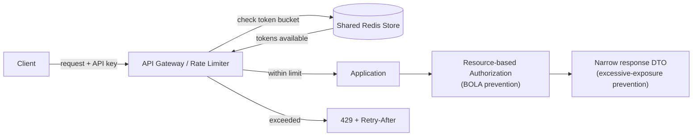
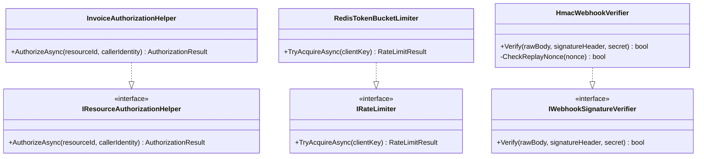
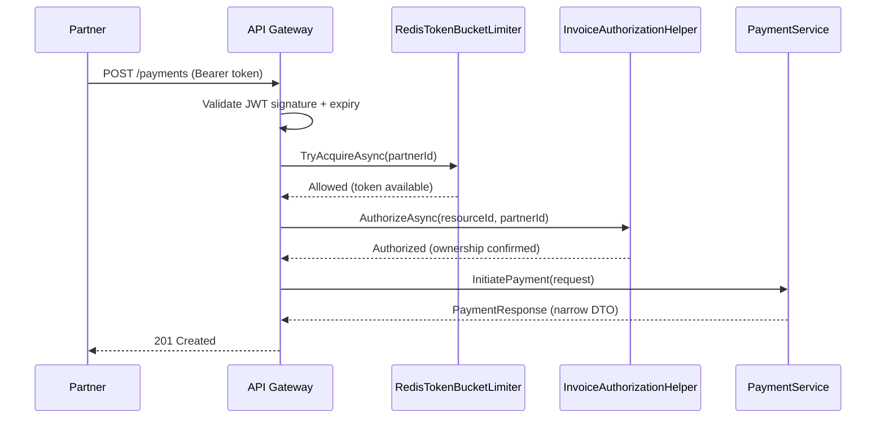
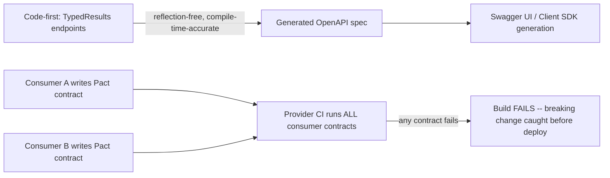
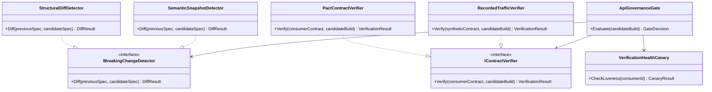
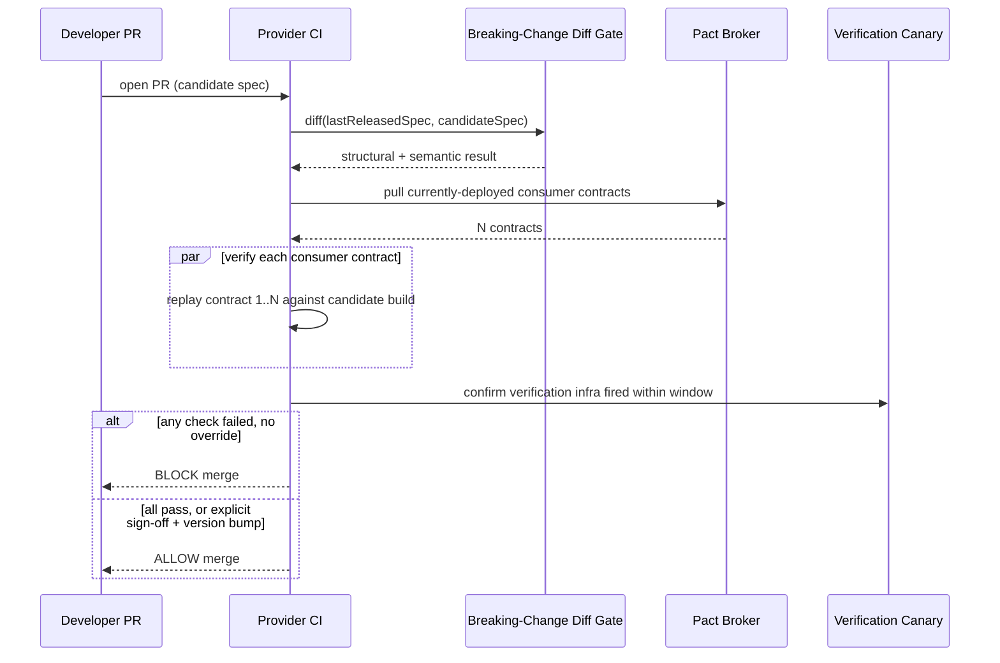

# REST APIs — Complete Interview Prep (All Topics, One File)

> Domain: REST APIs | Level: Beginner → Expert | Prerequisite: [[../02-DotNet-AspNetCore/01-DotNet-AspNetCore-Interview-Prep]] (controllers/minimal APIs, auth, rate limiter), [[../01-CSharp/01-CSharp-Interview-Prep]]
> **Quick-prep edition** (consolidated 2026-10-03). This one file replaces the 3 former REST modules (15–17). Originals: `git show ebb2d5c:03-REST-APIs/<file>.md`
> Each topic has: **Key concepts → Code example → Most common interview questions with answers.**

| # | Topic | # | Topic |
|---|---|---|---|
| 1 | REST fundamentals & resource design | 9 | Data formats: time, money, IDs, content negotiation |
| 2 | HTTP methods & status codes | 10 | API security (OWASP API Top 10) |
| 3 | Idempotency & safe retries | 11 | Rate limiting, quotas & load shedding |
| 4 | Concurrency (ETags) & caching | 12 | OpenAPI, documentation & contract testing |
| 5 | Pagination, filtering, sorting, bulk | 13 | REST vs GraphQL vs gRPC vs WebSockets/webhooks |
| 6 | Versioning & breaking changes | 14 | Top 30 rapid-fire + Principal questions |
| 7 | Error handling (ProblemDetails) | 15 | Mistakes checklist |
| 8 | Long-running operations & webhooks | | |

---

## 1. REST Fundamentals & Resource Design

**Key concepts**
- **REST** = REpresentational State Transfer (Roy Fielding, 2000), an architectural style. Its constraints: **client–server**, **stateless** (each request carries everything needed), **cacheable**, **uniform interface** (resources, representations, self-descriptive messages, HATEOAS), **layered system**, and optional **code-on-demand**.
- **Richardson Maturity Model:** L0 a single endpoint (RPC over HTTP) → L1 resources → L2 HTTP verbs + status codes (where most "REST" APIs sit) → L3 hypermedia (HATEOAS).
- **Resources are nouns, plural, hierarchical where ownership is real:** `/customers/{id}/orders`. Keep nesting shallow (max ~2 levels).
- **Action-shaped operations** (approve, cancel, refund): model as a state-change sub-resource `POST /payments/{id}/refunds`, or a controller resource `POST /orders/{id}:cancel` / `POST /orders/{id}/cancellation`. Don't force them into `PUT` on a status field when side effects follow.
- **Naming:** lowercase, hyphens in paths (`/payment-methods`), consistent camelCase in JSON, no verbs in paths, no file extensions.
- **Statelessness** enables horizontal scaling: no server session; auth comes from the token on every request.
- **Don't expose your database or domain entities** — design the API for the consumer (DTOs, stable contract).
- **HATEOAS** (links to possible next actions): rarely adopted fully; useful for state-dependent actions (e.g., include `refund` only when the payment is refundable).

```http
GET    /api/v1/customers/42/orders?status=paid&limit=20     # list a sub-collection
GET    /api/v1/orders/9f1c...                               # single resource
POST   /api/v1/orders                                       # create
PUT    /api/v1/orders/9f1c...                               # replace
PATCH  /api/v1/orders/9f1c...                               # partial update
DELETE /api/v1/orders/9f1c...                               # remove
POST   /api/v1/payments/7a2b.../refunds                     # action as a sub-resource
```

```json
{
  "id": "pay_7a2b",
  "status": "captured",
  "amount": { "value": "125.50", "currency": "USD" },
  "_links": {
    "self":   { "href": "/api/v1/payments/pay_7a2b" },
    "refund": { "href": "/api/v1/payments/pay_7a2b/refunds", "method": "POST" }
  }
}
```

**Common interview questions**

**Q1. What makes an API RESTful?**
Resources identified by URIs, manipulated through a uniform interface (standard HTTP methods), stateless requests, cacheable responses, a layered architecture, and ideally hypermedia. Most real APIs are Richardson Level 2 — resources + verbs + status codes — which is "pragmatic REST".

**Q2. Explain the Richardson Maturity Model.**
Level 0: everything is a POST to one endpoint (SOAP-like). Level 1: separate resource URIs. Level 2: correct HTTP methods and status codes. Level 3: responses include hypermedia links that drive the client's next steps.

**Q3. How do you model an operation like "approve" or "cancel"?**
As a resource representing the action or its result: `POST /orders/{id}/cancellation` (creates a cancellation, returns 201/202) or `POST /payments/{id}/refunds`. This keeps the verb set standard, gives the action an auditable identity, and supports idempotency keys. Avoid `GET /cancelOrder?id=` (GET must be safe).

**Q4. Why should REST APIs be stateless?**
Any instance can serve any request → easy horizontal scaling, load balancing and failover, with no sticky sessions or session replication. The state lives in the client (token) or in the database.

**Q5. How deep should URL nesting go?**
Usually no more than `/parents/{id}/children`. Deep nesting couples clients to the hierarchy and makes URLs fragile. If a child has a globally unique ID, expose `/children/{id}` directly too.

**Q6. What's your view on HATEOAS?**
Full HATEOAS-driven clients are rare and the cost is high. The valuable subset is including links for **state-dependent actions** and pagination (`next`), so clients don't duplicate business rules about what's allowed.

**Q7. How do you decide resource granularity in microservices?**
Align resources with the service's bounded context and the consumer's use cases. Avoid chatty fine-grained APIs (N calls per screen) and huge "god" resources. Use composition/BFF or `?expand=` for aggregated views.

---

## 2. HTTP Methods & Status Codes

**Key concepts**

| Method | Safe | Idempotent | Cacheable | Typical response |
|---|---|---|---|---|
| GET | ✅ | ✅ | ✅ | 200, 304, 404 |
| HEAD | ✅ | ✅ | ✅ | like GET, without the body |
| OPTIONS | ✅ | ✅ | ❌ | allowed methods, CORS preflight |
| PUT | ❌ | ✅ | ❌ | 200/204 (or 201 if created) |
| DELETE | ❌ | ✅ | ❌ | 204 (repeat: 204 or 404 — treat 404 as "already gone") |
| POST | ❌ | ❌ | rarely | 201 + `Location`, 202, 200 |
| PATCH | ❌ | ❌ (can be made so) | ❌ | 200/204 |

- **Safe** = no server-side state change (crawlers and prefetchers may call it freely). **Idempotent** = repeating it has the same effect as doing it once (retry-safe).
- **PUT** = replace the full representation (client knows the URI). **PATCH** = partial update with a defined format (JSON Merge Patch `application/merge-patch+json` or JSON Patch `application/json-patch+json`).

**Status codes that get asked**

| Code | When |
|---|---|
| **200 OK** | success with body |
| **201 Created** | created; include `Location` header (+ body) |
| **202 Accepted** | async processing started; return a status URL |
| **204 No Content** | success, no body (DELETE, some PUTs) |
| **301/308** | permanent redirect (308 keeps the method) |
| **304 Not Modified** | conditional GET, cached copy still valid |
| **400 Bad Request** | malformed syntax or invalid shape |
| **401 Unauthorized** | not authenticated (missing or invalid credentials) |
| **403 Forbidden** | authenticated, not allowed |
| **404 Not Found** | doesn't exist (or hidden for security) |
| **405 Method Not Allowed** | wrong verb |
| **409 Conflict** | state conflict (duplicate, invalid state transition, idempotency key in progress) |
| **412 Precondition Failed** | `If-Match` ETag mismatch |
| **415 Unsupported Media Type** | wrong `Content-Type` |
| **422 Unprocessable Content** | well-formed but violates business rules |
| **428 Precondition Required** | server requires `If-Match` |
| **429 Too Many Requests** | rate limited; send `Retry-After` |
| **500** | unexpected server error |
| **502/503/504** | bad gateway / unavailable (+ `Retry-After`) / gateway timeout |

```csharp
// ASP.NET Core minimal API showing correct codes
app.MapPost("/api/v1/orders", async (CreateOrder req, IOrderService svc, CancellationToken ct) =>
{
    var result = await svc.CreateAsync(req, ct);
    return result switch
    {
        { IsSuccess: true }            => Results.Created($"/api/v1/orders/{result.Id}", result.Order),
        { Error: "DUPLICATE" }         => Results.Conflict(),
        { Error: "INSUFFICIENT_FUNDS" } => Results.UnprocessableEntity(),
        _                              => Results.BadRequest()
    };
});

app.MapDelete("/api/v1/orders/{id:guid}", async (Guid id, IOrderService svc) =>
{
    await svc.DeleteIfExistsAsync(id);    // idempotent: deleting twice is fine
    return Results.NoContent();
});
```

**Common interview questions**

**Q1. Safe vs idempotent — why does it matter?**
Safe methods don't change state, so caches, crawlers and prefetchers can call them. Idempotent methods can be retried after a timeout without causing duplicate effects — that's what lets clients, proxies and SDKs retry automatically. POST is neither, so retrying it needs an idempotency key.

**Q2. PUT vs PATCH vs POST?**
PUT replaces the whole resource at a known URI (idempotent). PATCH changes part of it using a defined patch format. POST creates under a collection (the server assigns the ID) or triggers processing — not idempotent.

**Q3. 400 vs 422?**
400: the request is malformed (invalid JSON, wrong types, missing required fields). 422: syntactically valid but semantically wrong (insufficient funds, end date before start date). Many APIs use 400 for both — be consistent and document it.

**Q4. 401 vs 403?**
401: no or invalid credentials — authenticate and retry. 403: the server knows who you are and you're not allowed. Mixing them up breaks clients (e.g., re-login loops).

**Q5. 404 or 403 when a user requests another tenant's resource?**
404 — it doesn't reveal that the resource exists, which prevents enumeration.

**Q6. What should a successful POST that creates something return?**
201 Created with a `Location` header pointing to the new resource, and usually the representation (or its ID) in the body. If processing is asynchronous, 202 Accepted with a status resource.

**Q7. Is it OK to return 200 with `{ "success": false }`?**
No. Clients, gateways, monitors and retry logic all branch on the status code. Hiding errors in 200s breaks error-rate metrics and alerting, and forces every client to parse the body.

**Q8. Should a second DELETE return 404 or 204?**
Either can be defended. The effect is idempotent (it's gone). Many APIs return 204 both times so retrying clients don't treat "already deleted" as a failure; if you return 404, document that clients should treat it as success.

---

## 3. Idempotency & Safe Retries

**Key concepts**
- Networks fail **ambiguously**: on a timeout the client can't know whether the server processed the request. Retrying a POST can create **duplicates** (double charge, double order).
- **Idempotency key:** the client generates a unique key (a UUID) per *logical operation* and sends `Idempotency-Key: <uuid>`.
- **Server logic:**
  1. Insert the key with status `IN_PROGRESS` under a **unique constraint** (atomic claim).
  2. If the key exists and is `COMPLETED` → return the **stored response** (same status and body).
  3. If it exists and is `IN_PROGRESS` → **409** (or wait).
  4. If the same key arrives with a **different request body hash** → **422**.
  5. Do the work and store the response **in the same transaction** as the business write.
  6. Keep keys for a retention window (e.g., 24 h–7 days).
- **Downstream:** pass the key (or a derived one) to the payment provider (Stripe/Adyen support idempotency keys).
- **Messaging:** consumers deduplicate by message ID (inbox table).
- **Retries:** only for transient errors (timeouts, 502/503/504, 429) with **exponential backoff + jitter**, a max attempt count, and a total time budget. Never retry 4xx validation errors.
- **Reconcile** against external truth (settlement files) even with idempotency.

```sql
CREATE TABLE IdempotencyKeys (
    IdempotencyKey  VARCHAR(64)   NOT NULL,
    ClientId        VARCHAR(64)   NOT NULL,
    RequestHash     CHAR(64)      NOT NULL,     -- SHA-256 of the canonical request body
    Status          VARCHAR(16)   NOT NULL,     -- IN_PROGRESS | COMPLETED
    ResponseStatus  INT           NULL,
    ResponseBody    NVARCHAR(MAX) NULL,
    CreatedAt       DATETIME2     NOT NULL DEFAULT SYSUTCDATETIME(),
    CONSTRAINT PK_Idem PRIMARY KEY (ClientId, IdempotencyKey)   -- scoped per client
);
```

```csharp
public async Task<IResult> CreatePayment(HttpRequest http, CreatePayment req, AppDbContext db, CancellationToken ct)
{
    if (!http.Headers.TryGetValue("Idempotency-Key", out var key)) return Results.BadRequest("Idempotency-Key required");
    var hash = Sha256(JsonSerializer.Serialize(req));
    var clientId = http.HttpContext.User.FindFirst("client_id")!.Value;

    var existing = await db.IdempotencyKeys.FindAsync([clientId, key.ToString()], ct);
    if (existing is not null)
    {
        if (existing.RequestHash != hash) return Results.UnprocessableEntity("Key reused with a different body");
        if (existing.Status == "IN_PROGRESS") return Results.Conflict("Request in progress");
        return Results.Text(existing.ResponseBody!, "application/json", statusCode: existing.ResponseStatus);
    }

    await using var tx = await db.Database.BeginTransactionAsync(ct);
    db.IdempotencyKeys.Add(new() { ClientId = clientId, IdempotencyKey = key!, RequestHash = hash, Status = "IN_PROGRESS" });
    await db.SaveChangesAsync(ct);                       // unique constraint = atomic claim (catch duplicate → 409)

    var payment = await _payments.CreateAsync(req, idempotencyKey: key!, ct);   // provider gets the same key
    var record = await db.IdempotencyKeys.FindAsync([clientId, key.ToString()], ct);
    record!.Status = "COMPLETED"; record.ResponseStatus = 201; record.ResponseBody = JsonSerializer.Serialize(payment);
    await db.SaveChangesAsync(ct);
    await tx.CommitAsync(ct);
    return Results.Created($"/api/v1/payments/{payment.Id}", payment);
}
```

```csharp
// Client side: retry with backoff + jitter, same key on every attempt
builder.Services.AddHttpClient<PaymentsClient>()
    .AddStandardResilienceHandler(o =>
    {
        o.Retry.MaxRetryAttempts = 3;
        o.Retry.BackoffType = DelayBackoffType.Exponential;
        o.Retry.UseJitter = true;
    });
```

**Common interview questions**

**Q1. A customer was charged twice after a network blip. Diagnose and fix it.**
Likely cause: the client timed out after the server (or the payment provider) had already succeeded, then retried the POST — or a double-click, or a message redelivery. Fix at every layer: a client-generated idempotency key per payment intent; server-side unique-constrained key storage that returns the stored response on replays; the same key passed to the provider; consumer deduplication by message ID; and daily reconciliation against the provider's settlement report to catch anything left. Refund the duplicate and add an alert on duplicate-charge detection.

**Q2. What is an idempotency key and how does the server use it?**
A client-supplied unique ID for one logical operation. The server records it atomically before doing the work and stores the result; any repeat with the same key gets the original response instead of executing again.

**Q3. What if two requests with the same key arrive at the same time?**
The unique constraint lets exactly one insert succeed. The other gets a duplicate-key error → return 409 "in progress" (the client retries later) or wait and poll for completion.

**Q4. What if the server crashes after charging the card but before storing the response?**
The key row stays `IN_PROGRESS`. On retry, don't charge blindly: query the provider using the same idempotency key/reference to learn the real outcome, then complete the record. A sweeper resolves stale `IN_PROGRESS` rows. That's why the provider must receive the same key.

**Q5. Same key, different body?**
Return 422 — it's a client bug (key reuse). Detect it by storing a hash of the request.

**Q6. Which errors should a client retry?**
Network timeouts, connection resets, 408, 429 (honour `Retry-After`), 502, 503, 504. Not 400/401/403/404/409/422. And retry POSTs only when an idempotency key is present.

**Q7. Why exponential backoff with jitter?**
Fixed-interval retries from thousands of clients arrive in synchronized waves (a thundering herd) and keep a recovering service down. Exponential backoff spreads the load over time; jitter de-synchronizes clients.

**Q8. How long do you keep idempotency keys?**
Longer than the longest realistic client retry window — commonly 24 hours to 7 days — then purge. Document it in the API contract.

---

## 4. Optimistic Concurrency (ETags) & HTTP Caching

**Key concepts — concurrency**
- **Lost update:** two clients GET version 1, both PUT, and the last write silently wins.
- **ETag** = a version identifier of the representation (hash or row version). `GET` returns `ETag: "v5"`. The client sends `If-Match: "v5"` on PUT/PATCH/DELETE → the server checks → **412 Precondition Failed** on mismatch. Send **428** if `If-Match` is required but missing.
- Map ETags to a DB `rowversion`/`xmin` concurrency token.

**Key concepts — caching**
- `Cache-Control`: `max-age`, `s-maxage` (shared caches/CDN), `no-cache` (revalidate before use), `no-store` (never store — sensitive data), `private` (browser only), `public`, `immutable`, `stale-while-revalidate`.
- **Conditional GET:** `If-None-Match: "v5"` → **304 Not Modified** (saves bandwidth). `Last-Modified`/`If-Modified-Since` is the weaker alternative.
- **`Vary`** header: the cache key includes these request headers (`Accept`, `Accept-Encoding`, `Authorization`).
- Never cache personalized responses in shared caches (use `private` or `no-store`). Financial data is usually `no-store`.
- CDN for public, cacheable GETs; invalidation via versioned URLs or purge APIs.

```http
GET /api/v1/accounts/42
→ 200 OK
  ETag: "AAAAAAAAB9E="
  Cache-Control: private, no-cache

PUT /api/v1/accounts/42
If-Match: "AAAAAAAAB9E="
→ 204 No Content            (or 412 Precondition Failed if someone changed it)

GET /api/v1/products/7
If-None-Match: "p7-v12"
→ 304 Not Modified
```

```csharp
app.MapPut("/api/v1/accounts/{id:int}", async (int id, UpdateAccount body, HttpRequest req, AppDbContext db) =>
{
    var acc = await db.Accounts.FindAsync(id);
    if (acc is null) return Results.NotFound();
    if (!req.Headers.TryGetValue("If-Match", out var etag)) return Results.StatusCode(428);
    if (etag != $"\"{Convert.ToBase64String(acc.RowVersion)}\"") return Results.StatusCode(412);

    acc.Nickname = body.Nickname;
    try { await db.SaveChangesAsync(); }                       // EF also checks RowVersion in the WHERE
    catch (DbUpdateConcurrencyException) { return Results.StatusCode(412); }
    return Results.NoContent();
});
```

**Common interview questions**

**Q1. How do you prevent lost updates in a REST API?**
Optimistic concurrency with ETags: return an ETag on GET, require `If-Match` on updates, compare it with the current version (the DB row version), and return 412 on mismatch so the client re-fetches and retries or merges.

**Q2. Optimistic vs pessimistic locking for APIs?**
Optimistic (ETags/row versions) fits stateless HTTP and low-contention data — no locks held between requests. Pessimistic locks across HTTP calls are dangerous (abandoned locks); use them only inside one short server transaction (e.g., seat reservation with a time-limited hold).

**Q3. `no-cache` vs `no-store`?**
`no-cache` may store the response but must revalidate it with the server before each use. `no-store` must never be stored anywhere — use it for sensitive data (balances, PII).

**Q4. How does a 304 work?**
The client sends `If-None-Match` with its cached ETag; if unchanged, the server responds 304 with no body, and the client uses its cached copy.

**Q5. How would you design caching for a read-heavy public API?**
Public, non-personalized GETs get `Cache-Control: public, max-age=..., s-maxage=...` + ETags behind a CDN; versioned or immutable URLs for static data; `Vary` set correctly; `stale-while-revalidate` for resilience; and an explicit purge path. Personalized data is `private` or `no-store`, cached server-side (Redis) if needed.

---

## 5. Pagination, Filtering, Sorting, Field Selection & Bulk

**Key concepts**
- **Offset pagination** (`?offset=200&limit=50`): simple, allows jumping to a page, but **slow for deep pages** (the DB scans and skips rows) and **unstable** under concurrent inserts/deletes (duplicates and missed rows).
- **Cursor/keyset pagination** (`?after=<opaque cursor>&limit=50`): `WHERE (created_at, id) < (@lastCreated, @lastId) ORDER BY created_at DESC, id DESC`. Fast at any depth (index seek) and stable. No random page jumps. Make the cursor **opaque** (base64-encoded).
- **Always enforce a max page size** server-side; default to a sensible limit.
- Return `next` links/cursors; avoid expensive total counts on huge tables (make them optional).
- **Filtering:** `?status=paid&createdFrom=2026-01-01`; **sorting:** `?sort=-createdAt,amount`; whitelist the sortable/filterable fields (and make sure they're indexed).
- **Field selection / expansion:** `?fields=id,status`, `?expand=customer` to reduce over-fetching and chattiness.
- **Bulk operations:** bounded batch size; decide **all-or-nothing** vs **per-item results** (207-style or a results array with per-item status and a client reference); support idempotency per item.

```http
GET /api/v1/transactions?accountId=42&limit=50&after=eyJ0IjoiMjAyNi0xMC0wMVQxMDowMDowMFoiLCJpZCI6OTg3fQ
→ 200 OK
{
  "data": [ ... 50 items ... ],
  "page": { "next": "/api/v1/transactions?accountId=42&limit=50&after=eyJ0Ijoi..." }
}
```

```sql
-- Keyset query (index on AccountId, CreatedAt DESC, Id DESC)
SELECT TOP (@limit) Id, CreatedAt, Amount
FROM Transactions
WHERE AccountId = @accountId
  AND (CreatedAt < @lastCreated OR (CreatedAt = @lastCreated AND Id < @lastId))
ORDER BY CreatedAt DESC, Id DESC;
```

```json
// Bulk with per-item outcomes
POST /api/v1/payouts/batch
{ "items": [ { "clientRef": "a1", "amount": "10.00", "currency": "EUR", "iban": "..." },
             { "clientRef": "a2", "amount": "-5",    "currency": "EUR", "iban": "..." } ] }
→ 200 OK
{ "results": [ { "clientRef": "a1", "status": 201, "id": "po_1" },
               { "clientRef": "a2", "status": 422, "error": "amount must be positive" } ] }
```

**Common interview questions**

**Q1. Offset vs cursor pagination?**
Offset is simple and supports "page 7", but deep pages get slow and results shift when data changes. Cursor/keyset uses the last seen sort key, so it's an index seek at any depth and stable under writes. Use cursors for large or actively-written datasets (transactions, feeds) and offset for small admin lists.

**Q2. How would you paginate a 500M-row, actively-written transactions table?**
Keyset pagination on `(account_id, created_at, id)` with a matching index, an opaque cursor, a max page size, no total count (or an approximate one), and filters required to narrow the scan (account, date range).

**Q3. Why enforce a maximum page size?**
Otherwise one client request (`limit=1000000`) can exhaust server memory, saturate the database and hurt everyone. The client must not control unbounded work.

**Q4. How do you design a bulk endpoint?**
Cap the batch size; let clients send a per-item reference; decide on atomic (one transaction, all-or-nothing) vs partial success with per-item results; make it idempotent (batch key or per-item keys); consider async (202) for big batches.

**Q5. How do you support flexible filtering without SQL injection or slow queries?**
Whitelist filterable and sortable fields, map them to parameterized queries, require at least one selective filter on large tables, index the common combinations, and cap the result size. For complex search, use a search engine (Elasticsearch/OpenSearch).

**Q6. How do you reduce chattiness for mobile clients?**
Field selection, `?expand=` for related resources, a BFF (Backend for Frontend) aggregating calls, or GraphQL when client needs vary widely.

---

## 6. Versioning & Breaking Changes

**Key concepts**
- **Strategies:**
  - **URI path** `/v1/orders` — visible, easy routing, caching and testing (most common).
  - **Query string** `?api-version=2024-10-01` — common in Azure APIs.
  - **Header** `Api-Version: 2` — clean URIs, harder to test and cache.
  - **Media type** `Accept: application/vnd.acme.v2+json` — purist, the most complex.
  - **Date-based versions** (Stripe-style, pinned per account) — fine-grained evolution.
- **Version the contract, not every deployment.** Prefer **additive, backward-compatible change**; bump the major version only for breaking changes.
- **Breaking:** removing or renaming a field, changing a type or format, making an optional field required, tightening validation, changing meaning (semantics), changing defaults or status codes, **adding an enum value clients don't handle** (if clients use exhaustive switches).
- **Non-breaking (if clients follow the tolerant reader rule):** adding optional fields, new endpoints, new optional query parameters.
- **Tolerant reader:** clients ignore unknown fields and handle unknown enum values.
- **Deprecation:** announce, add `Deprecation` and `Sunset` headers, give a migration guide, measure usage per client, then retire.
- Run old and new versions side by side via an adapter layer over one implementation (avoid forking the codebase).

```csharp
// Asp.Versioning package
builder.Services.AddApiVersioning(o =>
{
    o.DefaultApiVersion = new ApiVersion(1, 0);
    o.AssumeDefaultVersionWhenUnspecified = true;
    o.ReportApiVersions = true;                         // api-supported-versions header
    o.ApiVersionReader = new UrlSegmentApiVersionReader();
});

var v = app.NewApiVersionSet().HasApiVersion(new(1, 0)).HasApiVersion(new(2, 0)).Build();
app.MapGet("/api/v{version:apiVersion}/orders/{id}", GetOrderV1).WithApiVersionSet(v).MapToApiVersion(1, 0);
app.MapGet("/api/v{version:apiVersion}/orders/{id}", GetOrderV2).WithApiVersionSet(v).MapToApiVersion(2, 0);
```

```http
HTTP/1.1 200 OK
Deprecation: @1767225600
Sunset: Thu, 01 Jan 2027 00:00:00 GMT
Link: <https://docs.example.com/migrate-v2>; rel="deprecation"
```

**Common interview questions**

**Q1. Which versioning strategy do you prefer?**
URI path versioning for most public and internal APIs: explicit, easy to route, test, log and cache. Header or media-type versioning is cleaner in theory but harder to operate. The more important decision is minimizing breaking changes, so versions are rare.

**Q2. What counts as a breaking change?**
Anything that can make an existing correct client fail: removing or renaming fields, type or format changes, new required inputs, stricter validation, changed semantics or defaults, changed status codes, and new enum values for strict clients.

**Q3. Is adding a field to a response breaking?**
Not for tolerant clients that ignore unknown fields — but it is for strict deserializers or generated clients that reject unknown properties. Document the tolerant-reader expectation in your API guidelines.

**Q4. How do you retire v1 with many unknown consumers?**
Measure usage per client (API keys/client IDs), announce early with `Deprecation`/`Sunset` headers and docs, contact the top consumers directly, provide a migration guide and tooling, run brownouts (short planned failures) before the sunset date, and keep an emergency extension policy.

**Q5. How do you avoid doubling maintenance when supporting v1 and v2?**
One domain implementation; versions are thin mapping layers (DTO adapters) at the edge. Keep at most two concurrent major versions, with a clear support window.

**Q6. A field's meaning changed (gross → net) but its name and type stayed the same. Breaking?**
Yes — it's a **semantic** break. Schema diff tools won't catch it, and every consumer is silently wrong. Add a new field (`netAmount`), deprecate the old one, and never repurpose fields.

---

## 7. Error Handling (ProblemDetails)

**Key concepts**
- Use **RFC 9457 Problem Details** (`application/problem+json`): `type` (a URI identifying the error type), `title`, `status`, `detail`, `instance`, plus extensions like `traceId`, `errorCode`, field `errors`.
- **Machine-readable codes** (`INSUFFICIENT_FUNDS`) for client logic; human messages for developers; never parse messages.
- **Validation errors:** list each field and message.
- **Never leak internals:** no stack traces, SQL, server names or internal IDs.
- Return the **trace/correlation ID** so support can find the logs.
- Consistent across all endpoints and services (shared middleware or library).
- Document the error codes and their remediation (retryable? user action?).

```json
HTTP/1.1 422 Unprocessable Content
Content-Type: application/problem+json

{
  "type": "https://api.example.com/errors/insufficient-funds",
  "title": "Insufficient funds",
  "status": 422,
  "detail": "Account acc_42 has 50.00 USD available; 125.50 USD requested.",
  "instance": "/api/v1/payments",
  "errorCode": "INSUFFICIENT_FUNDS",
  "retryable": false,
  "traceId": "00-4bf92f3577b34da6a3ce929d0e0e4736-00f067aa0ba902b7-01"
}
```

```json
HTTP/1.1 400 Bad Request
{
  "type": "https://tools.ietf.org/html/rfc9110#section-15.5.1",
  "title": "One or more validation errors occurred.",
  "status": 400,
  "errors": { "amount": ["Must be greater than 0."], "currency": ["Must be a 3-letter ISO code."] },
  "traceId": "00-..."
}
```

```csharp
builder.Services.AddProblemDetails(o => o.CustomizeProblemDetails = ctx =>
    ctx.ProblemDetails.Extensions["traceId"] = Activity.Current?.Id ?? ctx.HttpContext.TraceIdentifier);
app.UseExceptionHandler();
app.UseStatusCodePages();
```

**Common interview questions**

**Q1. What should an API error response contain?**
The correct HTTP status; a stable machine-readable error code; a safe human-readable message; field-level details for validation; a correlation/trace ID; optionally whether it's retryable and a docs link. Use the ProblemDetails format consistently.

**Q2. Why not return exception messages to clients?**
They leak internals (an information-disclosure security finding), they change between releases (breaking clients that parse them), and they aren't written for consumers.

**Q3. How do you keep errors consistent across 50 microservices?**
A shared error contract (ProblemDetails + an error-code catalogue) shipped as a library or middleware, linting of OpenAPI specs for error responses, and contract tests covering error cases.

**Q4. How should clients handle errors?**
Branch on the status code first, then on `errorCode`; retry only retryable errors (5xx/429/timeouts) with backoff; surface validation details to users; log the `traceId`.

---

## 8. Long-Running Operations & Webhooks

**Key concepts**
- **Asynchronous request-reply:** `POST` → **202 Accepted** + `Location: /operations/{id}` (+ `Retry-After`); the client polls `GET /operations/{id}` → `{ status: running | succeeded | failed, resultUrl }`; on success, link or redirect (303) to the created resource.
- **Webhooks:** the server calls the client's URL when the state changes. Requirements: **sign payloads** (HMAC-SHA256 with a timestamp to prevent replay), **retries with backoff**, **at-least-once delivery** → receivers must **dedupe by event ID**, ordering isn't guaranteed (include a version or timestamp), a delivery log, and a manual redelivery option. Keep payloads thin ("something changed, fetch it") or full but versioned.
- Receivers should respond **2xx quickly** and process asynchronously.
- Combine both: webhooks for timeliness plus polling or reconciliation as the safety net.
- Alternatives: SSE/WebSockets for real-time UI; message brokers for internal systems.

```http
POST /api/v1/reports                → 202 Accepted
                                      Location: /api/v1/operations/op_91
                                      Retry-After: 5
GET  /api/v1/operations/op_91       → 200 { "status": "running", "progress": 40 }
GET  /api/v1/operations/op_91       → 200 { "status": "succeeded", "resultUrl": "/api/v1/reports/rep_7" }
```

```csharp
// Verifying a webhook signature (receiver side)
static bool IsValid(string payload, string timestamp, string signatureHex, string secret)
{
    if (DateTimeOffset.UtcNow - DateTimeOffset.FromUnixTimeSeconds(long.Parse(timestamp)) > TimeSpan.FromMinutes(5))
        return false;                                              // replay protection
    using var hmac = new HMACSHA256(Encoding.UTF8.GetBytes(secret));
    var expected = hmac.ComputeHash(Encoding.UTF8.GetBytes($"{timestamp}.{payload}"));
    return CryptographicOperations.FixedTimeEquals(expected, Convert.FromHexString(signatureHex)); // constant-time
}
```

**Common interview questions**

**Q1. How do you design an API for an operation that takes minutes?**
Return 202 Accepted with an operation resource URL; process in the background (queue + worker); the client polls with `Retry-After` hints or receives a webhook; the operation resource has a terminal status, an error detail, and a link to the result; keep operation records for a defined retention period.

**Q2. How do you make webhooks reliable and secure?**
HMAC signatures with a timestamp (verified with a constant-time compare), HTTPS only, retries with exponential backoff over hours, at-least-once delivery with unique event IDs so receivers can dedupe, a delivery dashboard and replay endpoint, secret rotation support, and polling/reconciliation as a fallback.

**Q3. Webhook events arrived out of order — how should the receiver cope?**
Don't rely on order: include a sequence or version/timestamp per resource, ignore older versions, or treat the webhook as a trigger to fetch the current state from the API.

**Q4. Polling vs webhooks?**
Polling is simple and firewall-friendly but wasteful and slow to react. Webhooks are timely and efficient but need a public endpoint, security and retry handling. Many providers offer both; clients use webhooks with periodic polling or reconciliation as a safety net.

---

## 9. Data Formats: Time, Money, IDs & Content Negotiation

**Key concepts**
- **Time:** ISO-8601 / RFC 3339 **with an offset or `Z`** (`2026-10-03T10:15:00Z`); store UTC; keep the user's time zone separately when it matters (business dates like "value date" are plain dates: `2026-10-03`).
- **Money:** **never a JSON float**. Use a decimal **string** (`"125.50"`) or **integer minor units** (`12550`) **plus an ISO-4217 currency** (`"USD"`). Mind currencies with 0 or 3 decimals (JPY, KWD).
- **IDs:** opaque, non-sequential (UUID, ULID, prefixed `pay_...`) to prevent enumeration and leaking volumes; treat them as strings in contracts.
- **Enums:** strings, not integers; clients must tolerate unknown values.
- **Nulls vs absent:** define semantics (especially for PATCH).
- **Content negotiation:** `Accept` / `Content-Type`; return **406** if the format can't be produced, **415** for an unsupported request type. JSON by default; also compression (`Accept-Encoding: gzip, br`).
- **Large payloads/files:** multipart upload or pre-signed URLs (S3/Blob) instead of streaming through your API.

```json
{
  "id": "pay_01JA2Z3K9Q8W7E6R5T4Y3U2I1O",
  "amount": { "value": "1250.00", "currency": "EUR" },
  "amountMinor": 125000,
  "createdAt": "2026-10-03T10:15:00Z",
  "valueDate": "2026-10-05",
  "status": "captured"
}
```

**Common interview questions**

**Q1. How should money be represented in an API?**
As an exact decimal string or integer minor units, always with an explicit ISO currency code. Never a binary float — rounding errors accumulate and cents get lost.

**Q2. How do you handle dates and times?**
RFC 3339 timestamps with an offset (prefer UTC `Z`) for instants; plain dates for business dates; never ambiguous local times without a zone; document precision.

**Q3. Why avoid sequential integer IDs in public APIs?**
They let attackers enumerate other users' resources (making BOLA easier to exploit) and leak business volumes. Use random or opaque IDs — but still enforce authorization.

**Q4. How do you handle file uploads?**
For large files, issue a pre-signed upload URL (S3/Azure Blob) so the client uploads directly to storage, then notify the API; for small files, multipart/form-data with size limits, content-type validation and malware scanning.

---

## 10. API Security (OWASP API Security Top 10)

**Key concepts — OWASP API Security Top 10 (2023)**
1. **Broken Object Level Authorization (BOLA/IDOR)** — changing `/orders/123` to `/orders/124` returns someone else's data.
2. **Broken Authentication** — weak tokens, no expiry, credential stuffing.
3. **Broken Object Property Level Authorization** — excessive data exposure + mass assignment.
4. **Unrestricted Resource Consumption** — no limits on size, rate or cost.
5. **Broken Function Level Authorization** — regular users calling admin endpoints.
6. **Unrestricted Access to Sensitive Business Flows** — bots abusing checkout, sign-up or ticket buying.
7. **Server-Side Request Forgery (SSRF)** — the API fetches attacker-supplied URLs (e.g., cloud metadata).
8. **Security Misconfiguration** — verbose errors, permissive CORS, missing TLS.
9. **Improper Inventory Management** — forgotten old versions and shadow endpoints.
10. **Unsafe Consumption of APIs** — blindly trusting third-party API responses.

**Key practices**
- **Authenticate** with OAuth2/OIDC bearer tokens (JWT, validate `iss`/`aud`/`exp`/signature), mTLS for service-to-service, API keys only to identify partners (hashed, scoped, rotatable).
- **Authorize every object:** derive the user/tenant from the **token**, never from the body or headers; scope queries by owner.
- **Response DTOs** expose only allowed fields; **request DTOs** accept only allowed fields.
- **Input limits:** body size, JSON depth, array lengths, string lengths, timeouts.
- **Never put secrets or tokens in URLs** (they're logged and leaked via `Referer`).
- **CORS is not access control** — it only tells browsers which origins may read responses.
- **TLS 1.2+** everywhere, HSTS; consider TLS internally (zero trust).
- **Fail closed** when an auth dependency is unavailable.
- Security headers, a WAF and bot protection at the edge; audit logging of sensitive operations.

```csharp
// BOLA-safe query: scope by the caller's identity from the token
app.MapGet("/api/v1/accounts/{id}", async (string id, ClaimsPrincipal user, AppDbContext db) =>
{
    var customerId = user.FindFirstValue("customer_id");               // from the token, not the request
    var acct = await db.Accounts.AsNoTracking()
        .Where(a => a.Id == id && a.CustomerId == customerId)
        .Select(a => new AccountDto(a.Id, a.Nickname, a.Balance, a.Currency))  // explicit response DTO
        .SingleOrDefaultAsync();
    return acct is null ? Results.NotFound() : Results.Ok(acct);       // 404, not 403
}).RequireAuthorization("accounts:read");

// Input limits
builder.WebHost.ConfigureKestrel(k => k.Limits.MaxRequestBodySize = 1_000_000);      // 1 MB
builder.Services.ConfigureHttpJsonOptions(o => o.SerializerOptions.MaxDepth = 32);

// CORS: explicit origins only
builder.Services.AddCors(o => o.AddPolicy("web", p => p.WithOrigins("https://app.example.com")
    .WithMethods("GET", "POST").WithHeaders("Authorization", "Content-Type", "Idempotency-Key")));
```

**Common interview questions**

**Q1. What is BOLA and why is it the #1 API risk?**
The endpoint checks that you're logged in but not that you own the specific object, so changing an ID exposes other users' data. It's common because frameworks make endpoint-level auth easy, while object-level checks must be written per query. Fix: scope every data access by the authenticated principal, use resource-based authorization, use non-guessable IDs, and test cross-user access in automated tests.

**Q2. What is mass assignment and how do you prevent it?**
Binding the request body straight into a model lets attackers set fields like `isAdmin`, `balance` or `tenantId`. Prevent it with dedicated request DTOs containing only allowed fields and explicit mapping.

**Q3. Why must the tenant ID come from the token, not the request?**
Anything in the body or headers is attacker-controlled. If the API trusts `tenantId` from the payload, a caller can act on another tenant's data. Derive authorization-relevant values from the validated credential.

**Q4. Does CORS protect my API?**
No. CORS is enforced by browsers only, to stop malicious *web pages* from reading responses cross-origin. curl, scripts, mobile apps and servers ignore it. Real protection is authentication and authorization.

**Q5. Why never put secrets or tokens in URLs?**
URLs end up in server and proxy logs, browser history, analytics and `Referer` headers to third parties. Put credentials in the `Authorization` header or body.

**Q6. What input limits should every API have?**
Max request body size, JSON depth, max array/collection lengths, string lengths, max page size, request timeouts, and limits on expensive operations (export size, report date range).

**Q7. How do you secure service-to-service APIs?**
mTLS (often via a service mesh) for workload identity plus OAuth2 client-credentials tokens with a specific audience and scopes; network policies; no shared static API keys; and least privilege per service.

**Q8. Fail-open or fail-closed when the auth server is unreachable?**
Fail closed for authentication and authorization — serving data without a check is a breach, not a degradation. Mitigate availability with local JWT validation (cached signing keys) so the auth server isn't in the hot path.

**Q9. How do you respond to a leaked API credential?**
Revoke or rotate it immediately, review access logs for its use (scope of impact), notify the affected parties per policy and regulation, check for persistence (new keys created), then fix the root cause (e.g., secret scanning in CI).

**Q10. How would you design security for an API handling regulated financial data?**
OAuth2/OIDC with short-lived tokens and FAPI-style hardening (PKCE, mTLS- or DPoP-bound tokens), strict object-level authorization, encryption in transit and at rest, PII minimization in responses and logs, immutable audit logs, rate limiting and anomaly detection, regular penetration tests, and compliance mapping (PCI-DSS, SOX, GDPR).

---

## 11. Rate Limiting, Quotas & Load Shedding

**Key concepts**

| Algorithm | How it works | Pros / cons |
|---|---|---|
| **Fixed window** | count per window (e.g., 100/min) | simple; allows **2× bursts at window boundaries** |
| **Sliding window log/counter** | weighted count over a rolling window | smoother; slightly more state |
| **Token bucket** | tokens refill at a rate; each request takes one; bucket size = burst | allows controlled bursts — **most common** |
| **Leaky bucket** | queue drained at a constant rate | smooths output; adds latency |
| **Concurrency limit** | max in-flight requests | protects expensive endpoints and dependencies |

- **Rate limit** = protection (requests per second). **Quota** = a commercial allowance (calls per month per plan). **Load shedding** = rejecting work when the server itself is overloaded, regardless of client.
- **Key on the authenticated client/user/tenant** (API key, client ID), not just IP (NAT shares IPs; attackers rotate them). Use IP for unauthenticated endpoints (login).
- **Distributed state:** per-instance limiters multiply the limit by the replica count → use a shared store (Redis with an atomic Lua script) or the gateway; decide **fail-open vs fail-closed** if the store is down (usually fail open with a local fallback limit).
- **Cost-based limits:** expensive endpoints consume more tokens.
- **Layering:** edge/WAF (DDoS, per IP) → API gateway (per client, plan quotas) → service (per tenant, per endpoint, concurrency) → dependency (bulkheads, circuit breakers).
- **429 response:** `Retry-After`, plus `RateLimit-Limit`/`RateLimit-Remaining`/`RateLimit-Reset` headers (IETF draft) and which limit was hit.

```lua
-- Redis token bucket (atomic); KEYS[1]=bucket key; ARGV: capacity, refillPerSec, nowMs
local b = redis.call('HMGET', KEYS[1], 'tokens', 'ts')
local tokens = tonumber(b[1]) or tonumber(ARGV[1])
local ts = tonumber(b[2]) or tonumber(ARGV[3])
tokens = math.min(tonumber(ARGV[1]), tokens + (tonumber(ARGV[3]) - ts) / 1000 * tonumber(ARGV[2]))
local allowed = tokens >= 1
if allowed then tokens = tokens - 1 end
redis.call('HMSET', KEYS[1], 'tokens', tokens, 'ts', ARGV[3])
redis.call('PEXPIRE', KEYS[1], 60000)
return allowed and 1 or 0
```

```http
HTTP/1.1 429 Too Many Requests
Retry-After: 12
RateLimit-Limit: 100
RateLimit-Remaining: 0
RateLimit-Reset: 12
Content-Type: application/problem+json

{ "title": "Rate limit exceeded", "status": 429, "errorCode": "RATE_LIMIT_PER_CLIENT" }
```

**Common interview questions**

**Q1. Compare the rate-limiting algorithms.**
A fixed window is simplest but lets double bursts through at boundaries. A sliding window fixes that with a bit more state. A token bucket permits bursts up to the bucket size while enforcing an average rate (the standard choice). A leaky bucket smooths the output rate. Concurrency limits cap in-flight work and are best for expensive operations.

**Q2. We deployed a limit of 100 rps but see 1,000 rps. Why?**
The limiter state is per instance and there are 10 replicas, or it's keyed on something the client can vary (a header or IP behind a proxy). Move the counters to a shared store or the gateway, and key on the authenticated identity.

**Q3. How do you do distributed rate limiting without a single point of failure?**
Redis (clustered) with atomic Lua scripts; a local in-memory fallback limit if Redis is unavailable (fail open with a conservative cap); or approximate algorithms where each instance gets a share of the budget, synced periodically to reduce round trips.

**Q4. What should you rate-limit on?**
The authenticated client or tenant (API key, OAuth client ID, user ID), plus per-IP limits on unauthenticated endpoints like login. Never on a client-supplied unauthenticated header.

**Q5. Rate limiting vs quota vs load shedding?**
Rate limits protect against short bursts per client. Quotas enforce long-term commercial usage (per month or plan). Load shedding protects the server from overall overload by rejecting low-priority work first, even from well-behaved clients.

**Q6. How do you handle endpoints with very different costs?**
Cost-weighted tokens (a report costs 50 tokens, a GET costs 1), separate limits per endpoint class, concurrency limits on expensive operations, and async processing for heavy jobs.

**Q7. How do you tell abuse from a legitimate spike?**
Look at the distribution: one client or a few IPs vs broad organic growth; behaviour patterns (sequential IDs → enumeration; failed logins → credential stuffing); correlation with marketing events. Use per-client limits plus anomaly detection, and give known partners higher limits.

---

## 12. OpenAPI, Documentation & Contract Testing

**Key concepts**
- **OpenAPI** (3.0/3.1) = a machine-readable contract: docs (Swagger UI, Redoc, Scalar), client SDK generation, server stubs, request validation, mock servers, linting (Spectral), and **breaking-change diffing** (oasdiff, openapi-diff) in CI.
- **Code-first** (generated from code — no drift, less up-front design review) vs **design-first** (spec written and reviewed before code — better design, needs drift checks). Either way: verify the implementation matches the spec in CI.
- Good docs cover more than schemas: authentication, error codes and remediation, rate limits, idempotency and retry guidance, pagination, versioning and deprecation policy, webhooks, and examples **generated from tests**.
- **Consumer-driven contract testing (Pact):** each consumer publishes the interactions it relies on; the provider verifies them in its pipeline; the broker's **can-i-deploy** check blocks deployments that break a consumer running in the target environment. Contracts should assert only the fields the consumer actually uses.
- **Contract tests vs integration/E2E tests:** contract tests are fast, isolated and pairwise; E2E tests are slow, flaky and need everything deployed. Use many contract tests and few E2E tests.
- **Schema checks miss semantic changes** (meaning, units, defaults) → review and naming discipline.
- Measure **usage per field and per client** to make deprecation safe.

```csharp
// .NET 9+ built-in OpenAPI document generation
builder.Services.AddOpenApi();
app.MapOpenApi();                                  // serves /openapi/v1.json

app.MapGet("/api/v1/orders/{id:guid}", GetOrder)
   .WithName("GetOrder")
   .WithSummary("Get an order by ID")
   .Produces<OrderDto>(StatusCodes.Status200OK)
   .ProducesProblem(StatusCodes.Status404NotFound);
```

```yaml
# Fragment of an OpenAPI spec
paths:
  /api/v1/payments:
    post:
      operationId: createPayment
      parameters:
        - in: header
          name: Idempotency-Key
          required: true
          schema: { type: string, maxLength: 64 }
      requestBody:
        required: true
        content:
          application/json:
            schema: { $ref: '#/components/schemas/CreatePayment' }
      responses:
        '201': { description: Created }
        '409': { description: Same key still in progress }
        '422': { $ref: '#/components/responses/Problem' }
        '429': { $ref: '#/components/responses/RateLimited' }
```

```bash
# CI: fail the build on breaking changes vs the published spec
oasdiff breaking published/openapi.json build/openapi.json --fail-on ERR
# Pact: may this version be deployed to prod?
pact-broker can-i-deploy --pacticipant payments-api --version $GIT_SHA --to-environment production
```

**Common interview questions**

**Q1. What does OpenAPI give you beyond documentation?**
A single machine-readable contract for client and server generation, request/response validation, mocks for parallel development, linting of design standards, and automated breaking-change detection in CI.

**Q2. Code-first or design-first?**
Design-first for public or partner APIs and cross-team contracts (review the design before investing in code); code-first for internal services moving fast. In both cases, generate or verify the spec in CI so it can never drift from the implementation.

**Q3. What is consumer-driven contract testing?**
Consumers record their expectations of a provider (requests and the response fields they use) as contracts; the provider runs them against its real implementation in CI; a broker tracks which versions are compatible and gates deployments with `can-i-deploy`. It catches integration breaks without full end-to-end environments.

**Q4. Contract tests vs integration tests?**
Contract tests check pairwise compatibility quickly and deterministically. Integration/E2E tests check composed behaviour but are slow, flaky and hard to attribute. Use contract tests for compatibility and a thin set of E2E smoke tests for critical journeys.

**Q5. How do you catch a breaking change in CI?**
Generate the OpenAPI document from the build, diff it against the last published version with a breaking-change tool, fail on breaking diffs unless the version is bumped, and run provider verification against consumer contracts.

**Q6. What does a schema diff miss?**
Semantic changes (a field's meaning or units), changed defaults, behaviour changes (ordering, rounding, timing), and changes in error behaviour. Cover these with design review, explicit naming (`amountNet`) and consumer contract tests on behaviour.

**Q7. How do you handle a third-party API you don't control?**
Wrap it in an anti-corruption layer (adapter) with your own internal model, validate responses defensively, record and replay contract tests against their sandbox, monitor for drift, and keep fallbacks for failures.

---

## 13. REST vs GraphQL vs gRPC vs WebSockets/SSE vs Webhooks

| | REST | GraphQL | gRPC | WebSockets / SSE | Webhooks |
|---|---|---|---|---|---|
| Style | resources + HTTP verbs | query language, one endpoint | RPC with Protobuf over HTTP/2 | persistent connection | server → client HTTP callback |
| Best for | public APIs, CRUD, caching | varied client data needs (mobile/web BFF) | internal high-performance service calls, streaming | real-time UI | event notification to partners |
| Caching | HTTP caching, CDN | hard (POST, single endpoint) | none built in | n/a | n/a |
| Contract | OpenAPI | schema (SDL) | `.proto` | custom | event schema |
| Watch out | over/under-fetching | N+1 resolvers, query cost limits, authorization per field | browser support, L7 load balancing | scaling stateful connections | security, retries, ordering |

**Common interview questions**

**Q1. When is REST the wrong choice?**
For high-throughput internal service calls needing low latency and streaming (gRPC); for clients with very diverse data shapes that would cause over- or under-fetching (GraphQL); for real-time bidirectional communication (WebSockets); and for event distribution between internal systems (messaging/Kafka).

**Q2. REST vs GraphQL?**
REST: simple, cacheable, mature tooling, stable resources. GraphQL: clients ask for exactly what they need in one round trip and the schema is strongly typed — but caching, rate limiting (query cost analysis), N+1 resolver performance and field-level authorization are harder. GraphQL fits a BFF serving many UI variants.

**Q3. REST vs gRPC for internal services?**
gRPC is faster (binary, HTTP/2 multiplexing), strongly typed, with streaming and generated clients — ideal for internal service-to-service calls. REST is easier to debug, browser-friendly and better for public consumers. Many organizations use gRPC internally and REST at the edge.

---

## 14. Top 30 Rapid-Fire Questions + Principal Questions

1. **REST constraints?** Client–server, stateless, cacheable, uniform interface, layered, (code on demand).
2. **Richardson L2?** Resources + HTTP verbs + status codes.
3. **Safe methods?** GET, HEAD, OPTIONS.
4. **Idempotent methods?** GET, HEAD, OPTIONS, PUT, DELETE.
5. **PUT vs PATCH?** Full replace vs partial update.
6. **Create response?** 201 + `Location`.
7. **Async response?** 202 + a status URL.
8. **400 vs 422?** Malformed vs business-rule violation.
9. **401 vs 403?** Unauthenticated vs forbidden.
10. **409?** Conflict with the current state.
11. **412?** `If-Match` precondition failed.
12. **429?** Rate limited + `Retry-After`.
13. **Idempotency key?** A client UUID per operation; the server stores the response.
14. **Retry which errors?** Timeouts, 429, 502/503/504 with backoff + jitter.
15. **ETag use?** Caching (304) and optimistic concurrency (412).
16. **`no-cache` vs `no-store`?** Revalidate vs never store.
17. **Offset vs cursor?** Simple/unstable vs fast/stable.
18. **Max page size?** Always enforced server-side.
19. **Versioning?** URI path most common; minimize breaking changes.
20. **Breaking change?** Remove/rename/type change/new required/semantic change.
21. **Tolerant reader?** Ignore unknown fields, handle unknown enums.
22. **Error format?** RFC 9457 ProblemDetails + error code + trace ID.
23. **Money format?** Decimal string or minor units + ISO currency.
24. **Timestamps?** RFC 3339 with `Z`/offset.
25. **BOLA?** Missing object-level authorization → scope by owner.
26. **Mass assignment?** Use request DTOs.
27. **CORS?** A browser read policy, not access control.
28. **Token bucket?** Burst + steady rate.
29. **Webhook security?** HMAC signature + timestamp + dedupe by event ID.
30. **Contract testing?** Consumer-driven (Pact) + can-i-deploy.

**Principal-level questions**

**P1. How do you govern API design across 100 teams without becoming a bottleneck?**
Publish API guidelines (naming, errors, pagination, versioning, idempotency); automate enforcement with a Spectral ruleset and breaking-change checks in shared CI templates; provide paved-road libraries (ProblemDetails, auth, rate limiting); reserve human design review for public or cross-domain APIs; and track compliance metrics instead of approving every PR.

**P2. Public vs internal API — what changes?**
Public: unknown consumers, slow upgrades, strict compatibility and long deprecation windows, design-first specs, SDKs, extensive docs, stronger security and abuse controls, SLAs. Internal: known consumers, faster iteration, consumer-driven contracts can replace long deprecation cycles, and gRPC is an option.

**P3. Plan a breaking change for an API with many unknown consumers.**
Avoid it if an additive change works. Otherwise: a new version alongside the old, usage telemetry per client, early communication, `Deprecation`/`Sunset` headers, a migration guide or SDK, brownouts, direct outreach to remaining heavy users, and retirement only when usage is near zero or the contract date passes.

**P4. How does API design support multi-tenancy?**
Tenant derived from the token; every query scoped by tenant (plus database-level enforcement such as RLS); per-tenant rate limits and quotas; tenant-aware audit logs; no cross-tenant IDs exposed; 404 on cross-tenant access.

**P5. How do you design an API to stay usable when its own dependencies partially fail?**
Timeouts and circuit breakers per dependency; degrade optional parts (omit a recommendations section, flag it in the response); serve stale cached data with an indicator; return 503 + `Retry-After` for truly unavailable operations; accept writes asynchronously (202) when downstream is slow; and make the degradation explicit in the contract.

**P6. What tells you an API will age well?**
Consumer-oriented resources (not database tables), consistent conventions, explicit contracts with examples, idempotency on writes, cursor pagination, a standard error model, additive-change discipline, usage telemetry, and an owner.

---

## 15. Mistakes Checklist (say why each is wrong)
- [ ] Verbs in URLs · GET that changes state · exposing DB entities as resources
- [ ] 200 with an error body · 403 instead of 404 for others' resources · inconsistent error formats
- [ ] POST without idempotency keys on money movement · retrying non-idempotent calls · retries without backoff and jitter
- [ ] No ETags → lost updates · caching personalized data in shared caches
- [ ] Offset pagination over huge, changing tables · unbounded `limit` · total counts on billion-row tables
- [ ] Breaking changes shipped as "minor" · repurposing a field's meaning · strict deserialization in clients
- [ ] Money as a float · timestamps without an offset · sequential public IDs · integer enums
- [ ] `[Authorize]` without object-level checks (BOLA) · tenant ID from the request body · mass assignment
- [ ] Secrets in URLs · CORS treated as security · no body size or depth limits · failing open on auth
- [ ] Per-instance rate limiter state · limiting by IP only · 429 without `Retry-After`
- [ ] Unsigned webhooks · assuming webhook ordering or exactly-once delivery
- [ ] Hand-maintained specs that drift · contract tests asserting entire responses · no can-i-deploy gate

---

## Architecture Diagrams (preserved from the original modules)

> All 6 Mermaid/ASCII diagrams from the original `03-REST-APIs/` files, kept verbatim and grouped by source module. Originals: `git show ebb2d5c:03-REST-APIs/<file>.md`.

### Module 16 — REST APIs: API Security & Rate Limiting Patterns
*Source: `02-API-Security-Rate-Limiting.md`*

**3. Visual Architecture**



**13. Low-Level Design**



**13. Low-Level Design**



### Module 17 — REST APIs: API Documentation, Contract Testing & OpenAPI
*Source: `03-API-Documentation-Contract-Testing.md`*

**3. Visual Architecture**



**13. Low-Level Design**



**13. Low-Level Design**


