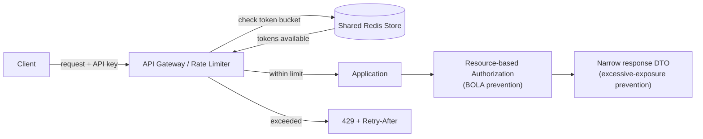

# Module 16 — REST APIs: API Security & Rate Limiting Patterns

> Domain: REST APIs | Level: Beginner → Expert | Prerequisite: [[01-REST-Design-Fundamentals]] (idempotency), [[../02-DotNet-AspNetCore/04-Authentication-Authorization-Deep-Dive]], [[../01-CSharp/02-Async-Await-Internals]] §Expert Q6 (distributed rate limiting)

---

## 1. Fundamentals

### What is API security, and what is rate limiting?
API security is the set of practices protecting an API's endpoints, data, and downstream systems from unauthorized access, abuse, and resource exhaustion — spanning authentication/authorization (Module 12), input validation, transport security (TLS), and abuse-prevention mechanisms. **Rate limiting** is a specific abuse-prevention mechanism: capping how many requests a given caller (or the system overall) may make within a time window, protecting the API and its downstream dependencies from being overwhelmed — whether by a malicious attacker, a buggy client in a retry loop, or simply legitimate traffic exceeding provisioned capacity.

### Why do these exist?
Any publicly (or even internally, cross-team) reachable API is a genuine attack surface — without deliberate security controls, it's vulnerable to credential attacks, injection, data exposure, and resource-exhaustion abuse. Rate limiting exists specifically because **without it, a single caller (malicious or merely buggy) can consume unbounded capacity**, degrading service for every other caller — this is true even for entirely well-intentioned callers (Module 2 §Expert Q6's thundering-herd/retry-storm scenario).

### When does this matter?
Every externally-facing (and most internally-facing, cross-team) API needs both; the depth matters for correctly implementing rate limiting that's actually effective at fleet scale (not just per-replica, which is trivially bypassable by spreading requests across replicas) and for recognizing the specific, common API-security vulnerability classes (broken object-level authorization, mass assignment, excessive data exposure) that dominate real-world API breaches.

### How does it work (30,000-ft view)?
```csharp
builder.Services.AddRateLimiter(options =>
{
    options.AddTokenBucketLimiter("per-client", opt =>
    {
        opt.TokenLimit = 100;
        opt.TokensPerPeriod = 100;
        opt.ReplenishmentPeriod = TimeSpan.FromMinutes(1);
    });
});
app.UseRateLimiter();
app.MapGet("/orders", GetOrders).RequireRateLimiting("per-client");
```

---

## 2. Deep Dive

### 2.1 The OWASP API Security Top 10 — Why It's Distinct from the General OWASP Top 10
The OWASP API Security Top 10 exists as a **separate** list from the general OWASP Top 10 because APIs have distinctive risk patterns not centered in traditional web-app security: **Broken Object Level Authorization (BOLA/IDOR)** — the single most common API vulnerability — occurs when an API checks *authentication* but not *per-object authorization* (exactly Module 12 §2.4's resource-based authorization gap, restated as an industry-recognized top vulnerability class); **Excessive Data Exposure** — returning a full internal entity/DTO with more fields than the client actually needs, relying on the client to "just not display" sensitive fields, rather than the server withholding them; **Broken Function Level Authorization** — a caller reaching an admin-only *operation* (not just a specific object) they shouldn't; **Mass Assignment** — directly Module 11 §8's over-posting vulnerability, now recognized as an API-specific OWASP category in its own right.

### 2.2 Rate Limiting Algorithms — Precise Trade-offs
- **Fixed window**: count requests per fixed time bucket (e.g., per calendar minute) — simple, but has a **boundary-burst problem**: a client can send the full limit at 11:59:59 and another full limit at 12:00:01, doubling the effective allowed rate right at the window boundary.
- **Sliding window (log or counter-based)**: tracks requests within a continuously-moving window, avoiding the boundary-burst problem at the cost of more state (a log of timestamps, or a weighted blend of the current and previous fixed windows).
- **Token bucket**: a bucket holds tokens, refilled at a steady rate, consumed per request — naturally allows **bursts** up to the bucket's capacity while enforcing a steady-state average rate, the most commonly used algorithm for API rate limiting specifically because it models "occasional bursts are fine, sustained abuse isn't" well.
- **Leaky bucket**: requests queue and are processed at a strictly constant output rate — smooths bursts entirely (no burst allowance) at the cost of added latency for bursty-but-legitimate traffic.

### 2.3 Distributed Rate Limiting — the Fleet-Scale Requirement
A per-replica, in-memory rate limiter (`System.Threading.RateLimiting`'s built-in limiters used with default, local state) only limits **that specific replica's** view of a client's traffic — across N horizontally-scaled replicas, a client could receive N times the intended limit by simply having requests load-balanced across replicas. Genuine fleet-wide rate limiting requires **shared, external state** (a Redis-backed atomic counter/token-bucket, evaluated via a Lua script for atomicity) — directly the pattern first introduced in Module 2 §Expert Q6, now contextualized as the standard, necessary architecture for any rate limit meant to apply to a caller's *aggregate* traffic across an entire fleet, not just one replica's slice of it.

### 2.4 Rate Limit Response Contract — `429` and `Retry-After`
A rate-limited response should return `429 Too Many Requests` with a `Retry-After` header (seconds, or an HTTP date) telling the well-behaved client exactly when to retry — this directly enables correct client-side backoff (Module 2's retry patterns) rather than the client guessing an arbitrary backoff interval; omitting `Retry-After` forces every client to implement its own guessed backoff strategy, often producing exactly the synchronized-retry-storm problem (Module 2 §Expert Q7) rate limiting exists to prevent in the first place.

### 2.5 Input Validation as a Security Boundary
Every API input boundary must validate: type/shape (model binding, Module 11), size limits (request body size caps, preventing a single oversized payload from being a resource-exhaustion vector — directly Module 3 §8's `stackalloc`-sizing caution generalized to any input-driven allocation), and business-rule validity (422, Module 15 §2.3) — treating client input as untrusted by default, never assuming a "friendly" first-party client always sends well-formed data, since any input boundary is also reachable by a malicious or compromised caller regardless of who the API was originally designed for.

## 3. Visual Architecture


## 4. Production Example
**Scenario**: A partner API experienced a BOLA (Broken Object Level Authorization) vulnerability — an endpoint `GET /invoices/{id}` checked only that the caller was *authenticated* (any valid API key), never that the requested invoice actually belonged to *that specific* caller's account, allowing any partner to enumerate and read every other partner's invoices by simply incrementing the ID. **Investigation**: found via a routine security audit (not an incident) specifically testing this exact pattern across every resource-ID-accepting endpoint. **Fix**: added resource-based authorization (Module 12 §2.4's exact pattern) verifying `invoice.PartnerId == currentPartnerId` before returning data, across every affected endpoint, plus a systemic audit of the entire API surface for the same gap. **Lesson**: BOLA is the single most common real-world API vulnerability precisely because "the endpoint requires authentication" is trivially confused with "the endpoint enforces authorization" — they are not the same, and this module's OWASP-API-Top-10 framing exists specifically to keep that distinction front-of-mind.

## 5. Best Practices
- Enforce resource-based (per-object) authorization on every endpoint accepting a resource identifier — never rely on authentication alone.
- Return narrowly-scoped response DTOs, never full internal entities, closing the excessive-data-exposure gap.
- Use token-bucket rate limiting backed by a shared store (Redis) for genuine fleet-wide enforcement.
- Always return `429` with `Retry-After` for rate-limited requests.
- Validate and cap request body size at the edge, before any business logic executes.

## 6. Anti-patterns
- Checking authentication but not per-object authorization (BOLA, §4's incident).
- Returning full domain entities directly from API endpoints (mass assignment on the way in, excessive exposure on the way out — both Module 11 §8's concerns).
- Per-replica-only (in-memory) rate limiting in a horizontally-scaled deployment, trivially bypassed by load-balanced traffic spreading.
- Omitting `Retry-After` on 429 responses, forcing clients into guessed, potentially-synchronized backoff.

---

## 10. Interview Questions

### Basic (10)
1. **Q: What is BOLA?** **A:** Broken Object Level Authorization — an API checks authentication but not whether the caller is authorized to access the *specific* requested object.
2. **Q: What is mass assignment?** **A:** Binding a request body directly onto a rich entity type, letting a client set unintended fields.
3. **Q: What status code should a rate-limited request return?** **A:** 429 Too Many Requests.
4. **Q: What header tells a client when to retry after a 429?** **A:** `Retry-After`.
5. **Q: What's the boundary-burst problem with fixed-window rate limiting?** **A:** A client can send the full limit at the very end of one window and again at the very start of the next, doubling the effective rate at the boundary.
6. **Q: What does a token bucket allow that a leaky bucket doesn't?** **A:** Bursts up to the bucket's capacity, while still enforcing a steady-state average rate.
7. **Q: Why doesn't a per-replica in-memory rate limiter work correctly at fleet scale?** **A:** Each replica only sees its own slice of a client's traffic, so the effective limit multiplies by replica count.
8. **Q: What is excessive data exposure?** **A:** Returning more fields in a response than the client legitimately needs, relying on the client not to misuse them rather than the server withholding them.
9. **Q: Why is the OWASP API Security Top 10 a separate list from the general OWASP Top 10?** **A:** APIs have distinctive risk patterns (BOLA, mass assignment, broken function-level authorization) not centered in traditional web-app security concerns.
10. **Q: What should an API do with an oversized request body?** **A:** Reject it early via a configured size limit, before it reaches business logic.

### Intermediate (10)
1. **Q: Why is BOLA the most common real-world API vulnerability?** **A:** Because "requires authentication" is easily and commonly confused with "enforces authorization" — an endpoint can correctly reject unauthenticated callers while still failing to check whether the authenticated caller owns the specific requested resource.
2. **Q: How does a sliding-window rate limiter avoid the fixed-window boundary-burst problem?** **A:** It tracks requests within a continuously-moving window (via a timestamp log or a weighted blend of adjacent fixed windows) rather than resetting a hard counter at fixed boundaries, so there's no single instant where two full allowances stack.
3. **Q: Why is Redis (or another shared store) required for genuine fleet-wide rate limiting?** **A:** It provides the single, shared, atomically-updatable counter/bucket state every replica reads and writes to, so a client's aggregate usage across the whole fleet is correctly tracked, not just one replica's local view.
4. **Q: What's the security risk of omitting per-object authorization even when using a resource ID that "looks unguessable" (a GUID)?** **A:** Unguessability isn't authorization — an attacker with a leaked/logged/observed GUID (e.g., from a referrer header, a shared link, or another vulnerability) can still access the resource if no ownership check exists; GUIDs reduce enumeration risk but do not substitute for authorization.
5. **Q: Why should a rate limiter's response include `Retry-After` instead of leaving clients to guess their backoff interval?** **A:** It gives the client an authoritative, server-determined retry time, preventing every client from independently guessing (and potentially synchronizing on) their own backoff interval, which itself can create a retry storm.
6. **Q: What's the difference between rate limiting a specific endpoint versus rate limiting a client's aggregate usage across an entire API?** **A:** Per-endpoint limiting protects that specific operation's cost profile (useful if one endpoint is disproportionately expensive); aggregate limiting protects overall fair-usage/capacity allocation across a client's entire traffic — many production systems apply both simultaneously, at different granularities.
7. **Q: Why is returning a full domain entity from an endpoint a security concern even if the client "shouldn't" read certain fields?** **A:** Relying on client-side restraint (not displaying a field) provides no actual security — any caller can inspect the raw HTTP response directly, so genuinely sensitive fields must be withheld server-side, not merely hidden in the client UI.
8. **Q: How would you rate-limit differently for authenticated versus unauthenticated traffic on the same endpoint?** **A:** Key the rate limiter by authenticated user/API-key identity when present (a higher, per-identity limit) and fall back to IP-based limiting for unauthenticated requests (typically a stricter limit, since IP-based keying is coarser and more easily shared among unrelated legitimate users behind NAT).
9. **Q: What's a realistic scenario where request-size limiting itself becomes a rate-limiting-adjacent concern?** **A:** An attacker sending many moderately large (but individually within-limit) payloads can still exhaust bandwidth/parsing capacity faster than small payloads would — request-size limits and rate limits are complementary controls, not substitutes for each other.
10. **Q: Why does a security audit specifically test BOLA by attempting to access another tenant's/user's resource with a valid but different identity, rather than just checking "does authentication work"?** **A:** Because authentication working correctly says nothing about whether authorization is also correctly enforced per-resource — the only way to verify BOLA protection is to actually attempt cross-account access and confirm it's denied, exactly mirroring the contract-consistency testing philosophy from earlier modules (test the actual behavior, not just the presence of a mechanism).

### Advanced (10)
1. **Q: Design a token-bucket rate limiter backed by Redis with correct atomicity under concurrent requests.**
   **A:** Use a Redis Lua script (executed atomically server-side) that reads the current token count and last-refill timestamp, computes the number of tokens to add based on elapsed time, caps at the bucket capacity, and atomically decrements if a token is available — all within one atomic script execution, avoiding the read-then-write race that a naive "GET count, check, SET count" sequence (non-atomic across two round-trips) would be vulnerable to under concurrent requests from the same client.
2. **Q: Explain how you would systematically audit an existing large API surface for BOLA vulnerabilities.**
   **A:** Enumerate every endpoint accepting a resource identifier (route parameter or body field); for each, write an automated test authenticating as User/Tenant A and attempting to access a resource known to belong to User/Tenant B, asserting a 403/404 (not the actual data) — run this systematically across the entire endpoint inventory rather than spot-checking, since BOLA gaps are endpoint-specific and one fixed instance doesn't imply others are also fixed.
3. **Q: How would you design rate limiting to protect a third-party API with its own strict, contractual rate limit, across a fleet of your own services calling it?** **A:** Directly Module 2 §Expert Q6's distributed proactive rate limiter — a shared, Redis-backed token bucket sized to the third party's actual contractual limit, checked by every calling replica before issuing the outbound call, combined with local per-replica bounded concurrency and retry-with-backoff as defense-in-depth beneath the proactive limiter.
4. **Q: A team argues excessive data exposure isn't a real risk for an internal-only API since "we control both sides." Push back with a concrete scenario.**
   **A:** Internal APIs are frequently consumed by more teams/services over time than originally anticipated, and a full-entity response (including, e.g., internal cost data, other customers' aggregate data, or soon-to-be-deprecated fields) becomes an unintended, hard-to-track dependency the moment any other team starts parsing fields "just in case" — when the API owner later wants to remove or restrict that field, they discover an undocumented internal consumer depends on it; narrow, intentional response contracts prevent this accidental coupling regardless of whether the API is "internal only."
5. **Q: Design a rate-limiting strategy that adapts dynamically based on current system load (adaptive rate limiting) rather than a fixed threshold.**
   **A:** Monitor a leading load indicator (CPU, database connection-pool utilization, downstream dependency latency) and dynamically adjust the token-bucket refill rate/capacity downward as load increases — trading strict predictability for graceful degradation under genuine system stress, at the cost of a less deterministic, harder-to-document contract for API consumers (a real trade-off to discuss explicitly, not a strictly superior approach).
6. **Q: Explain why a rate limiter keyed purely by IP address is both under- and over-inclusive, and how would you address each failure mode.**
   **A:** Under-inclusive: a determined attacker distributes requests across many IPs (a botnet), evading any single-IP threshold entirely — address via behavioral/anomaly-based detection layered on top, not IP-keying alone. Over-inclusive: many legitimate users can share one IP (corporate NAT, mobile carrier-grade NAT), so an aggressive per-IP limit can collectively throttle many unrelated innocent users — address via combining IP-based limiting (for unauthenticated traffic) with authenticated-identity-based limiting (a much more precise key) wherever authentication is available.
7. **Q: How would you design an API's error responses to avoid leaking information useful for a BOLA/enumeration attack?** **A:** Return an identical `404 Not Found` (not a distinguishing `403 Forbidden`) for both "resource doesn't exist" and "resource exists but you're not authorized to see it" — returning a distinguishing 403 confirms the resource's existence to an attacker probing IDs, information a pure 404 doesn't reveal (directly Module 12 §8's 401-vs-403 information-hiding discussion, applied here to 403-vs-404).
8. **Q: A payment API's rate limiter is itself becoming a single point of failure (the Redis-backed limiter's own outage blocks all traffic). How would you design around this?** **A:** Implement a fail-open-with-monitoring or fail-closed decision deliberately per business risk: for most APIs, briefly failing open (allowing requests through without rate-limiting enforcement) during a rate-limiter-infrastructure outage is preferable to a full API outage, provided it's paired with aggressive alerting on the rate-limiter's own health and a fast-acting circuit breaker reverting to fail-open only for a bounded window; for an API where unbounded abuse during any gap is unacceptable (e.g., a scarce, expensive third-party pass-through), fail-closed may be the correct, deliberate choice instead — the decision should be explicit and documented, not a default neither team consciously chose.
9. **Q: Explain how excessive data exposure and mass assignment are two sides of the same underlying architectural mistake.**
   **A:** Both stem from binding directly to/from a rich internal entity type instead of a dedicated, narrowly-scoped DTO at the API boundary — mass assignment is the input-side manifestation (a client sets fields it shouldn't), excessive exposure is the output-side manifestation (a client reads fields it shouldn't); the single, unifying fix (dedicated request/response DTOs, Module 11 §11 Hard exercise) addresses both simultaneously.
10. **Q: As a Principal Engineer, how would you make BOLA prevention structurally enforced across an organization rather than dependent on every team remembering to add resource-based authorization checks?** **A:** Combine: (a) a shared repository/service-layer base class or helper (Module 12 §13's `IResourceAuthorizationHelper`) making the correct pattern the path of least resistance; (b) mandatory automated BOLA-probing tests (Advanced Q2) as a required CI gate for any endpoint accepting a resource identifier; (c) an architecture-review checklist item requiring explicit justification for any endpoint that intentionally omits per-object authorization (e.g., genuinely public resources) — converting "remember to check ownership" from tribal knowledge into layered, automated, and governance-enforced protection.

---

## 11. Coding Exercises

### Easy — Add resource-based authorization closing a BOLA gap
```csharp
// BEFORE (vulnerable): only checks authentication
app.MapGet("/invoices/{id}", async (string id, IInvoiceRepository repo) =>
{
    var invoice = await repo.GetByIdAsync(id);
    return invoice is null ? Results.NotFound() : Results.Ok(invoice);
}).RequireAuthorization();

// AFTER (fixed): checks ownership too
app.MapGet("/invoices/{id}", async (string id, IInvoiceRepository repo, ClaimsPrincipal user) =>
{
    var invoice = await repo.GetByIdAsync(id);
    var currentPartnerId = user.FindFirstValue("partner_id");
    if (invoice is null || invoice.PartnerId != currentPartnerId)
        return Results.NotFound(); // 404, not 403 -- avoids confirming existence (Advanced Q7)
    return Results.Ok(invoice);
}).RequireAuthorization();
```

### Medium — Token-bucket rate limiting with `Retry-After`
```csharp
builder.Services.AddRateLimiter(options =>
{
    options.OnRejected = async (context, ct) =>
    {
        context.HttpContext.Response.Headers.RetryAfter = "60";
        context.HttpContext.Response.StatusCode = StatusCodes.Status429TooManyRequests;
        await context.HttpContext.Response.WriteAsJsonAsync(new { error = "rate_limit_exceeded" }, ct);
    };
    options.AddTokenBucketLimiter("api", opt =>
    {
        opt.TokenLimit = 100; opt.TokensPerPeriod = 100; opt.ReplenishmentPeriod = TimeSpan.FromMinutes(1);
    });
});
```

### Hard — Distributed Redis-backed token bucket (Advanced Q1)
```lua
-- Redis Lua script: atomic token-bucket check-and-decrement
local key = KEYS[1]
local capacity = tonumber(ARGV[1])
local refillRate = tonumber(ARGV[2]) -- tokens per second
local now = tonumber(ARGV[3])

local bucket = redis.call("HMGET", key, "tokens", "lastRefill")
local tokens = tonumber(bucket[1]) or capacity
local lastRefill = tonumber(bucket[2]) or now

local elapsed = math.max(0, now - lastRefill)
tokens = math.min(capacity, tokens + elapsed * refillRate)

if tokens < 1 then
    redis.call("HMSET", key, "tokens", tokens, "lastRefill", now)
    return 0 -- rejected
else
    tokens = tokens - 1
    redis.call("HMSET", key, "tokens", tokens, "lastRefill", now)
    return 1 -- allowed
end
```
**Discussion**: Running this as a single Lua script executed atomically by Redis (`EVAL`) is what prevents the read-then-write race a naive two-round-trip implementation would suffer under concurrent requests from the same client — exactly Advanced Q1's requirement.

### Expert — DTO-based mass-assignment/excessive-exposure prevention with automated BOLA test
```csharp
public record InvoiceResponse(string Id, decimal Amount, DateTime DueDate); // narrow, no PartnerId, no internal cost fields

// Automated BOLA regression test (Advanced Q2's pattern):
[Fact]
public async Task GetInvoice_Should_Return_404_For_Other_Partners_Invoice()
{
    var clientA = _factory.CreateAuthenticatedClient(partnerId: "partner-a");
    var invoiceOwnedByB = await SeedInvoiceAsync(partnerId: "partner-b");

    var response = await clientA.GetAsync($"/invoices/{invoiceOwnedByB.Id}");

    Assert.Equal(HttpStatusCode.NotFound, response.StatusCode); // NOT the invoice data, NOT a 403
}
```

---

## 12–17. System Design / LLD / Debugging / Decision / Case Study / Principal

A partner API platform (§4) enforces resource-based authorization on every endpoint (mandatory checklist item), narrow response DTOs everywhere, and Redis-backed token-bucket rate limiting keyed by authenticated partner identity, with automated BOLA-probing tests as a CI gate. The production-debugging signature pattern for this module is exactly §4's incident — diagnosed by systematically testing cross-tenant access on every resource-ID-accepting endpoint, not by waiting for a reported breach. Principal-level guidance: BOLA and mass assignment/excessive exposure are the two highest-value, most mechanically-auditable API vulnerability classes — invest in automated, CI-enforced testing for both before investing in more exotic security controls, since these two categories dominate real-world API breach statistics.

## 18. Revision
**Key takeaways**: BOLA = authentication without per-object authorization, the #1 real-world API vulnerability. Mass assignment (input) and excessive data exposure (output) are the same architectural mistake (binding directly to rich entities) manifesting on both sides of the API boundary. Token bucket = the standard rate-limiting algorithm, allowing bursts while enforcing steady-state limits. Distributed (Redis-backed, Lua-atomic) rate limiting is required for genuine fleet-wide enforcement — per-replica limiting is trivially bypassed. Always return 429 + `Retry-After`; return 404 (not 403) to avoid confirming a resource's existence to an unauthorized caller.

---

**Next**: Continuing autonomously to Module 17 — API Documentation, Contract Testing & OpenAPI (completing the `03-REST-APIs` domain) before advancing to `04-SQL-Server`.
