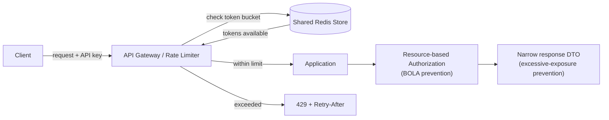
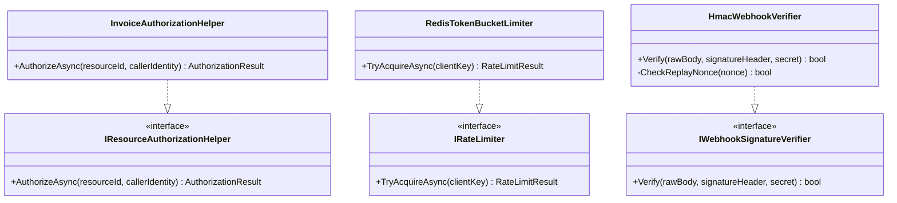
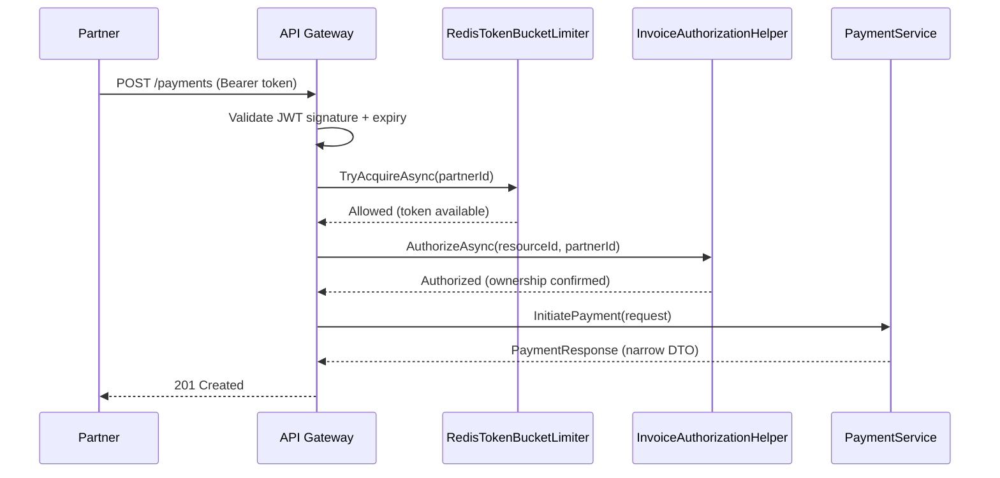

# Module 16 — REST APIs: API Security & Rate Limiting Patterns

> Domain: REST APIs | Level: Beginner → Expert | Prerequisite: [[01-REST-Design-Fundamentals]] (idempotency), [[../02-DotNet-AspNetCore/04-Authentication-Authorization-Deep-Dive]], [[../01-CSharp/02-Async-Await-Internals]] §Expert Q6 (distributed rate limiting)

---

## 1. Topic Description

### Definition

**API security** is the set of controls applied at the API boundary to ensure that each request is attributable to a known caller, permitted for the specific operation *and the specific object* it names, and unable to consume disproportionate resources. **Rate limiting** is the family of mechanisms that bound how much a caller may consume: *rate limiting* bounds request speed, a *quota* bounds total volume over a longer commercial period, *concurrency limiting* bounds simultaneous in-flight work, and *load shedding* is the system protecting itself regardless of any individual caller's entitlement. These are four different controls that teams routinely conflate into one.

### Core sub-concepts

- **Broken object-level authorization (BOLA/IDOR)** — endpoint-level checks without per-object checks; the most common serious API flaw.
- **Broken function-level authorization** — reaching an operation, not just an object, that the caller should not have.
- **Mass assignment** — binding client input into models containing privilege- or scope-bearing fields.
- **Excessive data exposure** — returning full internal entities and relying on the client not to display sensitive fields.
- **Authorisation-relevant values from the credential, never the payload** — tenant and user identity derived server-side.
- **Credential types** — bearer tokens, mTLS, API keys; what each actually authenticates; hashing, scoping, rotation and revocation.
- **Input handling as a trust boundary** — body size caps, JSON depth and element limits, collection bounds, request timeouts.
- **Deserialisation safety** — closed sets of permitted polymorphic types; type-name handling as a remote-code-execution class.
- **Rate-limiting algorithms** — fixed window (boundary burst), sliding window, token bucket (burst plus steady rate), leaky bucket, concurrency limits.
- **Limiter keying** — authenticated principal versus IP behind proxies; never a client-supplied unauthenticated identifier.
- **Distributed limiter state** — per-instance state multiplying the effective limit by replica count; shared counters, lease/batch models, and fail-open versus fail-closed.
- **The 429 contract** — `Retry-After`, quota headers, and which limit was hit.
- **Layering** — edge/gateway versus in-process versus dependency-boundary controls, and what each protects.
- **CORS** — a browser-enforced read policy, not an access control.
- **Enumeration defence** — non-sequential identifiers, uniform 404-versus-403 responses, and detection of enumeration patterns.
- **TLS placement and internal traffic** — where encryption terminates and what runs unencrypted behind it.

### Where it fits

These controls sit at the outermost layer of the API — some in the gateway, some in the pipeline, some inside the handler where the loaded object is available. They depend on the authentication and authorization machinery of the framework and on the contract design that determines what identifiers and payloads exist at all. Upward they are what makes an API safe to expose to partners, to the public, or to other teams whose code you do not review.

### Why it matters at scale

Object-level authorization is where APIs actually get breached: the check must be written on *every* handler, it is invisible in code review because the endpoint looks protected, and functional tests written from the owner's perspective never exercise it. Rate limiting fails differently — it fails *quietly*. A limiter with per-instance state on twenty replicas enforces twenty times the configured limit, so the team believes they are protected while a single caller consumes the fleet. A fixed-window limiter permits double the limit across every boundary. And a 429 without `Retry-After` invites immediate retries, turning the protective control into a load amplifier during exactly the incident it existed to prevent.

### Common pitfalls / anti-patterns

- **Authorising the endpoint but not the object** — changing an ID in the URL returns another user's or tenant's record; the single most common severe API vulnerability.
- **Trusting a tenant or user ID from the request body or a header** — lets the caller select whose data they operate on, one missing check away from a cross-tenant breach.
- **Per-instance rate-limiter state** — the effective limit is silently multiplied by the replica count, so the configured number means nothing.
- **Keying limits on client IP** — shared behind NAT and corporate proxies (punishing legitimate users) and trivially rotated by an attacker.
- **Fixed-window limiting on a contractual limit** — a burst at the end of one window plus a burst at the start of the next doubles the allowed rate at every boundary.
- **Treating CORS as an access control** — it is enforced only by browsers; curl, scripts, servers and mobile apps ignore it entirely.
- **Secrets or tokens in URLs** — logged by web servers, proxies, CDNs and browser history, and leaked in `Referer` headers to third parties.
- **Returning 403 where 404 would be safer** — confirms the existence of another tenant's resource, enabling enumeration.
- **No request size, depth or collection limits** — a single small payload becomes a memory-and-CPU denial of service needing no authentication.
- **Failing open on authentication or authorization when a dependency times out** — serving data because the check was unavailable is a breach, not a degradation.

> Scope note: resource modelling, status codes, versioning and pagination belong to `01-REST-Design-Fundamentals`; OpenAPI, SDKs and contract testing to `03-API-Documentation-Contract-Testing`. Framework-level authentication schemes and policy mechanics live in `02-DotNet-AspNetCore/04-Authentication-Authorization-Deep-Dive`; identity architecture in `40-IAM`; token protocols in `41-OAuth2-OIDC-JWT-PKCE`.

---

## 2. Beginner (10 Q&A)


**Q1. What is broken object-level authorization and why is it the most common serious API flaw?**
**A:** It is when an endpoint checks that the caller is authenticated and permitted to *use the endpoint*, but never checks that they are permitted to access the *specific object* identified in the request — so changing an ID in the URL returns someone else's data. It is the most common serious flaw because the check is per-object and therefore must be written on every handler, it is invisible in functional tests written from the owner's perspective, and the endpoint looks correctly protected in a code review. Preventing it structurally — a repository that always filters by the caller's scope — is far more reliable than remembering a check per endpoint.
*Follow-up: Should a failed object-level check return 403 or 404?*

**Q2. Why is trusting a tenant or user ID from the request body dangerous?**
**A:** Because it lets the caller choose whose data they operate on. Any identifier that determines authorisation scope must come from the authenticated principal — the token's claims — not from anything the client controls. This shows up as a "convenience" parameter that an internal tool needed, then gets exposed publicly. The rule is simple and worth stating absolutely: authorisation-relevant values are derived server-side from the credential, and request-supplied values are only ever used to *narrow* within an already-authorised scope.
*Follow-up: An admin genuinely needs to act on another tenant's behalf. How do you design that?*

**Q3. What is mass assignment and how do you prevent it?**
**A:** Binding request data straight into a model that contains fields the caller should not control — `role`, `isVerified`, `balance`, `tenantId` — so a crafted payload sets them. Prevention is to bind to an explicit request type containing only client-settable fields, and to map deliberately. Allow-lists in attributes work but rot, because the danger arrives when someone adds a property later and does not revisit the attribute. This is one of the clearest cases where the "extra DTO" that developers resist as boilerplate is actually a security control.
*Follow-up: How would you detect this class of bug across an existing codebase?*

**Q4. Compare the main rate-limiting algorithms.**
**A:** Fixed window counts requests per calendar interval — trivial to implement, but allows up to double the limit around a boundary, since a burst at the end of one window and the start of the next both pass. Sliding window (log or weighted) fixes that at higher storage or computation cost. Token bucket permits bursts up to the bucket size while enforcing a long-run average rate, which usually matches what you actually want from an API. Leaky bucket smooths output to a constant rate, which suits protecting a fixed-capacity downstream. Concurrency limiting bounds simultaneous in-flight requests rather than rate, and is often the better protection for expensive operations.
*Follow-up: For an API where some endpoints are 100x more expensive than others, which do you choose and how do you configure it?*

**Q5. What should you key a rate limiter on?**
**A:** On the authenticated principal — API key, client ID, or user — because that is the entity you have a relationship with and can hold accountable. IP is a poor key: it is shared behind NAT and corporate proxies, so you punish legitimate users, and it is trivially rotated by an attacker with a botnet or cloud addresses. IP-based limits are still useful as a coarse pre-authentication defence, since unauthenticated traffic has no better key. What you must never key on is a client-supplied identifier that is not authenticated, because the client will simply vary it.
*Follow-up: Behind a load balancer, `RemoteIpAddress` is the proxy's. How do you get the real one safely?*

**Q6. What does a well-behaved 429 response look like?**
**A:** Status 429 with `Retry-After` telling the client when to try again, plus headers exposing the limit, remaining quota and reset time so a well-written client can pace itself rather than probing. The body should say which limit was hit, since a client hitting a per-endpoint limit needs different action from one hitting an account quota. Returning 429 without `Retry-After` invites immediate retries, which is how a rate limiter becomes a load amplifier during an incident.
*Follow-up: A client ignores `Retry-After` entirely. What's your escalation?*

**Q7. What does CORS actually protect, and what does it not?**
**A:** It is a browser-enforced policy controlling which origins may read responses from cross-origin JavaScript. It protects users of browsers from a malicious site reading data using their credentials. It does *not* protect your API from anything else: curl, a script, a mobile app or a server ignores CORS entirely, so a permissive CORS policy is not itself a breach but a restrictive one is not a security control either. Treating CORS as access control is a common and consequential misunderstanding — the actual control is authentication and authorization on every request.
*Follow-up: Someone sets `Access-Control-Allow-Origin: *` with credentials enabled. What happens?*

**Q8. Why should secrets never appear in a URL?**
**A:** Because URLs are logged everywhere — web servers, proxies, load balancers, CDNs, browser history, and `Referer` headers sent to third parties — so a token in a query string leaks into systems with weaker controls and longer retention than you intended. It is also cached and shared when users copy links. Credentials belong in headers, which are not routinely logged in full, and where they are, the logging pipeline can redact them by name. This is a case where the correct behaviour costs nothing and the incorrect one produces a credential leak with no attacker skill required.
*Follow-up: You find tokens in six months of access logs. What's your response?*

**Q9. What input limits should every API enforce by default?**
**A:** Maximum request body size, maximum JSON nesting depth and element count, maximum array lengths on any collection parameter, maximum string lengths, and a request timeout. Without these, a single small request can consume disproportionate memory and CPU — a deeply nested or enormous payload is a cheap denial of service that needs no authentication if the endpoint is public. These limits belong at the platform layer so every endpoint inherits them, with per-endpoint overrides where genuinely needed rather than per-endpoint implementation.
*Follow-up: An endpoint legitimately accepts a 100 MB upload. How do you handle it differently?*

**Q10. What's the difference between rate limiting, quotas and load shedding?**
**A:** Rate limiting bounds the *speed* of requests from a caller, protecting fairness. A quota bounds *total volume* over a longer period — a day or a month — and is usually a commercial construct tied to a plan. Load shedding is the system protecting *itself*: rejecting requests because it is near capacity, regardless of whether any individual caller is over their limit. They are complementary and often confused: a system with rate limits but no load shedding still collapses when many compliant callers arrive at once, and a system with shedding but no limits lets one caller degrade everyone.
*Follow-up: You're shedding load. Which requests do you drop first and how do you decide?*

---

## 3. Intermediate (10 Q&A)


**Q1. You deploy a rate limiter and traffic is still ten times the configured limit. What happened?**
**A:** Almost certainly per-instance state: each replica enforces the limit independently, so with ten replicas the effective limit is ten times what was configured. Other candidates are a limiter keyed on something the client varies, requests bypassing the limiter through a different route or an internal path, or the limiter being applied after an expensive middleware so it protects nothing. The fix for the common case is shared state — a distributed counter — with the trade-offs that introduces, or partitioning traffic consistently so each caller always reaches the same instance. I would first confirm which of these it is by measuring per-instance counters rather than assuming.
*Follow-up: A distributed counter adds a network round trip to every request. How do you avoid that cost?*

**Q2. How do you implement distributed rate limiting without making the store a single point of failure?**
**A:** Keep the shared store off the strict critical path: use local counters with periodic synchronisation, accepting slight over-admission, or a token-bucket lease model where each instance draws a batch of permits and refills asynchronously. Then decide the failure behaviour explicitly — fail open (serve traffic, lose protection) or fail closed (reject, lose availability) — which is a business decision that differs by endpoint: fail open on a read API, fail closed on something expensive or abusable. Whatever the choice, it should be configured and tested, because the default behaviour of most implementations under store failure is not what teams assume.
*Follow-up: You fail open and the store is down during an attack. What compensating control do you want?*

**Q3. How would you structure limits for an API with wildly different endpoint costs?**
**A:** Weighted or cost-based limiting rather than a single request count: assign each endpoint a cost reflecting its resource consumption, and deduct that from the caller's budget, which is how most mature public APIs work. Alongside that, concurrency limits on the genuinely expensive endpoints, because rate alone does not stop ten simultaneous expensive queries. I would publish the costs so clients can plan, and separate limits per resource class so a client exhausting their reporting budget can still make cheap operational calls — otherwise one heavy background job takes out the client's interactive traffic.
*Follow-up: A client complains the cost model is unpredictable. How do you make it explainable?*

**Q4. What's the right layering of rate limiting across gateway, service and dependency?**
**A:** Coarse volumetric and per-client limits at the edge, where rejection is cheapest and protects everything behind it; application-level limits in the service for anything requiring business context such as per-tenant plans; and concurrency limits at the dependency boundary so a slow database cannot be overwhelmed by the service itself. Each layer protects a different resource, so they are complementary rather than redundant. The failure mode to avoid is limits configured independently at each layer such that nobody can predict the effective limit — I would document the composed behaviour explicitly, since that is what clients actually experience.
*Follow-up: A legitimate client is being throttled and nobody can tell which layer is doing it. How do you fix that?*

**Q5. How do you protect against enumeration attacks?**
**A:** Non-sequential identifiers so guessing is impractical, uniform responses so a caller cannot distinguish "does not exist" from "not yours" — which is the main reason to return 404 rather than 403 on unauthorised object access — and rate limits on the endpoints that would be used for enumeration. Timing differences also leak, so an authorisation check that short-circuits faster than a real lookup is a side channel, though usually a lower-priority one. I would also monitor for the pattern itself: a caller producing a high rate of 404s on identifier-shaped paths is a strong signal worth alerting on, and detection is often more practical than perfect prevention.
*Follow-up: Your public API needs human-readable slugs, which are enumerable by design. What do you do?*

**Q6. What are the risks of deserialisation, and how do you mitigate them?**
**A:** Permissive deserialisation that resolves types named in the payload is a remote code execution class — it has affected every major platform and is not a theoretical risk. Even without that, deeply nested or enormous payloads consume memory and CPU disproportionately, and polymorphic handling can instantiate types with side effects in their constructors. The mitigations are a closed, declared set of permitted types, hard limits on depth and size, rejecting unknown fields where the contract allows it, and never enabling type-name handling on untrusted input. I would treat any endpoint accepting polymorphic client input as requiring an explicit threat-model note.
*Follow-up: A legacy client sends payloads with an embedded type discriminator. How do you migrate safely?*

**Q7. Where should TLS terminate and what about traffic behind that point?**
**A:** Terminating at the edge is normal, but the question that matters is what happens after: unencrypted internal traffic assumes the network is trusted, which is exactly the assumption zero-trust architectures exist to remove, and it means anyone with network access or a compromised pod can read tokens and data in flight. I would push for TLS or mTLS internally — a service mesh makes this cheap — particularly for anything crossing a trust boundary or carrying credentials. The other decision is certificate lifecycle: automated issuance and rotation, because manual certificate management reliably produces an expiry outage roughly once a year.
*Follow-up: mTLS everywhere adds latency and operational complexity. Where would you not do it?*

**Q8. How do you handle API keys well?**
**A:** Treat them as credentials, not identifiers: high entropy, stored hashed rather than in plaintext, scoped to specific permissions rather than granting everything, rotatable without downtime through overlapping validity, and revocable immediately. Each key should be attributable to a client and an owner so it can be audited and disabled, and usage per key should be visible so an anomalous pattern is detectable. The common failure is a long-lived shared key with full access embedded in a client application, which cannot be rotated because nobody knows who uses it — the mitigation for that is discovering the problem before an incident forces it.
*Follow-up: A key is leaked in a public repository. Walk me through the first hour.*

**Q9. How do you decide fail-open versus fail-closed for a security control?**
**A:** By the consequence of each failure. Authentication and authorization fail closed without exception — serving data because the check was unavailable is a breach. Rate limiting and quota may fail open on read paths where availability matters more than perfect enforcement, but should fail closed on expensive or abusable operations. The important discipline is that this is a deliberate, documented decision per control with a named owner, not an emergent property of how the library happens to behave when its dependency times out. I would also test the degraded path, because untested failure behaviour is usually different from the assumed behaviour.
*Follow-up: Your authorization service is down. The business asks you to fail open for 30 minutes. What's your answer?*

**Q10. How do you tell abuse from a legitimate traffic spike?**
**A:** By baselining behaviour per client rather than looking at aggregate volume: legitimate spikes usually preserve the shape of traffic — similar endpoint mix, similar error rate, similar session patterns — while abuse tends to concentrate on one endpoint, produce elevated 4xx rates, or exhibit machine-like regularity. Attribution matters more than volume: a known client doubling is different from a new credential appearing at high rate. In practice I would combine per-client anomaly detection with a graduated response — throttle before block, alert a human before automating a ban — because a false positive that cuts off a major customer is also an incident.
*Follow-up: Your automated blocking cuts off your largest customer during their peak. How do you prevent recurrence?*

---

## 4. Expert / Architect (10 Q&A)


**Q1. How do you build defence in depth for an API without producing an unmanageable pile of controls?**
**A:** Map controls to the specific threats they address and to a layer, so each one has a stated purpose and nothing is retained out of habit. Typically: volumetric and bot defence at the edge, authentication and coarse authorization at the gateway, fine-grained and object-level authorization in the service, and data-level enforcement in the store. The discipline is that no single layer is assumed sufficient and no layer is added without a threat it counters — otherwise controls accumulate, latency grows, and nobody can say what would break if one were removed. I would also periodically test that each layer works independently, since defence in depth that has silently collapsed to one working layer is the common real state.
*Follow-up: How would you verify that the service-layer authorization works if the gateway is bypassed?*

**Q2. How do you approach rate limiting as a product concern rather than only a protective one?**
**A:** Limits are part of the contract clients build against, so they need to be published, stable, explainable and tied to a plan — a limit that changes without notice breaks integrations as surely as a schema change. That means quota headers on every response, documentation of the algorithm and burst behaviour, a way to request an increase, and telemetry clients can see. Internally it means limits are versioned and changes are rolled out with notice and monitoring. Treating limits as an ops setting that anyone can tune is how you get outages in customers' systems that they attribute to you correctly.
*Follow-up: You need to reduce a limit for capacity reasons. How do you roll that out?*

**Q3. How would you design API security for a system handling regulated financial data?**
**A:** Start from the control requirements rather than the technology: strong authentication with per-workload identity, authorization enforced at the data layer as well as the application, full audit of access to sensitive data with tamper-evidence, encryption in transit and at rest with managed keys, and data residency respected across every store including logs and telemetry. Then design for evidence — an auditor asks who accessed what and under what authority, and that must be answerable from records, not reconstructed. I would also insist on segregation of duties in the deployment path, since the ability of one engineer to deploy a change that reads production data unobserved is itself a finding.
*Follow-up: Which of those is hardest to retrofit into an existing system, and why?*

**Q4. How do you evaluate a WAF or bot-management product?**
**A:** By being clear about what it can and cannot do. It is good at known attack signatures, volumetric filtering, credential-stuffing patterns and buying time during a zero-day — genuinely valuable. It is not a substitute for authorization, input validation or safe deserialisation, and treating it as one produces a system that is one bypass away from full exposure. The practical evaluation criteria are false-positive rate against your real traffic, the operational cost of tuning, whether rules can be tested before enforcement, and whether it terminates TLS in a way that is acceptable for your data classification. I would deploy in monitoring mode first, because a WAF blocking legitimate traffic is a self-inflicted outage.
*Follow-up: The WAF blocks a legitimate payload pattern used by one important client. What's your process?*

**Q5. How do you handle security for internal service-to-service APIs?**
**A:** By not treating "internal" as a trust boundary. Each service gets its own identity with mTLS or workload identity, calls are authenticated and authorised individually, and traffic is encrypted — because a flat internal network means one compromised component reaches everything, which is exactly how a contained incident becomes a breach. Where the downstream must enforce user-level rules, the user's identity is propagated explicitly with a mechanism that prevents arbitrary impersonation. The cost is real operational complexity, which is why a service mesh or platform-provided identity is usually the practical route — asking each team to implement mTLS themselves reliably produces inconsistent results.
*Follow-up: A legacy service can't do mTLS. How do you accommodate it without weakening the model?*

**Q6. How do you make security testing part of the delivery process rather than a gate at the end?**
**A:** Shift the cheap checks left and reserve human effort for what tooling cannot do: dependency scanning and secret detection on every commit, static analysis for the classes it detects reliably, and automated tests asserting the security-relevant behaviours — unauthenticated requests rejected, cross-tenant access denied, limits enforced. Then periodic penetration testing focused on business logic and authorization, which is where the real findings are and where scanners are weakest. The organisational element that matters is that findings have owners and SLAs by severity; a backlog of unactioned findings is worse than not scanning, because it creates a documented record of known unremediated risk.
*Follow-up: A scanner produces 400 findings, most false positives. How do you make it useful?*

**Q7. How do you protect an API from a client that is legitimate but badly behaved?**
**A:** Contain rather than block: per-client concurrency limits so they cannot monopolise capacity, separate resource pools or bulkheads so their traffic cannot exhaust connections shared with others, and cost-based limits so an inefficient usage pattern costs them their own budget rather than everyone's. Then make the behaviour visible to them with usage telemetry and specific guidance, because most badly-behaved clients are unintentionally so and will fix it when shown. Escalation should be graduated and communicated. The architectural principle is that a multi-tenant API needs isolation designed in, since relying on all clients being well-behaved is not a strategy.
*Follow-up: The badly-behaved client is your largest revenue source. Does anything change?*

**Q8. What is your view on API gateways as the primary security control point?**
**A:** They are valuable for consistency — one place for authentication, coarse authorization, rate limiting, TLS and logging — and that consistency is worth a lot across many services. The danger is treating the gateway as the *only* control point, because service-to-service traffic often bypasses it entirely, an internal caller or a compromised pod reaches services directly, and a gateway misconfiguration then exposes everything at once. My position is that the gateway enforces the baseline and services still enforce what matters to them, particularly object-level authorization which the gateway cannot do. I would also treat the gateway's own configuration as high-risk change requiring review, since it is a single point of catastrophic misconfiguration.
*Follow-up: How would you detect a service being reached directly, bypassing the gateway?*

**Q9. How do you respond to a suspected API credential compromise?**
**A:** Contain first: revoke or rotate the credential, which requires that revocation actually works and is fast — something worth testing before you need it. Then assess blast radius from access logs: what that credential accessed, over what period, and whether the access pattern indicates data exfiltration. Then notify according to the regulatory and contractual obligations, which have clock-driven deadlines that start earlier than most teams expect. Afterwards, the structural questions are why the credential was long-lived, why the scope was broad enough to matter, and whether the anomalous usage was detectable — those three usually produce more durable improvement than the incident-specific fix.
*Follow-up: The credential was in a mobile app binary. How does that change containment?*

**Q10. How do you balance security controls against latency and developer velocity?**
**A:** By putting the cost in the platform rather than in each team, so the secure path is also the default and the fast one — inherited middleware, templates that start with the right posture, test helpers that make security assertions easy to write. Where a control genuinely costs latency, measure it rather than argue about it, and place it where the cost is lowest: caching authorization decisions with a bounded staleness window, evaluating policies locally rather than over the network, terminating TLS efficiently. Where a real conflict remains, it is a risk decision with a named owner and an expiry, not an engineering debate. The failure to avoid is security controls that are so painful that teams route around them, which produces worse outcomes than a slightly weaker control that is actually used.
*Follow-up: A team has built a bypass around a control because it was too slow. How do you handle that?*

---

## 5. Reference Material

> Retained from the original module: deep-dive internals, diagrams, production examples, exercises, system/low-level design, debugging walkthroughs and the Principal Engineer perspective.

### 1. Fundamentals

#### What is API security, and what is rate limiting?
API security is the set of practices protecting an API's endpoints, data, and downstream systems from unauthorized access, abuse, and resource exhaustion — spanning authentication/authorization, input validation, transport security (TLS), and abuse-prevention mechanisms. **Rate limiting** is a specific abuse-prevention mechanism: capping how many requests a given caller (or the system overall) may make within a time window, protecting the API and its downstream dependencies from being overwhelmed — whether by a malicious attacker, a buggy client in a retry loop, or simply legitimate traffic exceeding provisioned capacity.

#### Why do these exist?
Any publicly (or even internally, cross-team) reachable API is a genuine attack surface — without deliberate security controls, it's vulnerable to credential attacks, injection, data exposure, and resource-exhaustion abuse. Rate limiting exists specifically because **without it, a single caller (malicious or merely buggy) can consume unbounded capacity**, degrading service for every other caller — this is true even for entirely well-intentioned callers (§Expert Q6's thundering-herd/retry-storm scenario).

#### When does this matter?
Every externally-facing (and most internally-facing, cross-team) API needs both; the depth matters for correctly implementing rate limiting that's actually effective at fleet scale (not just per-replica, which is trivially bypassable by spreading requests across replicas) and for recognizing the specific, common API-security vulnerability classes (broken object-level authorization, mass assignment, excessive data exposure) that dominate real-world API breaches.

#### How does it work (30,000-ft view)?
```csharp
builder.Services.AddRateLimiter(options =>
    {
        options.AddTokenBucketLimiter("per-client", opt =>
            {
                opt.TokenLimit = 100;
                opt.TokensPerPeriod = 100;
                opt.ReplenishmentPeriod = TimeSpan.FromMinutes(1);
        });
});
app.UseRateLimiter;
app.MapGet("/orders", GetOrders).RequireRateLimiting("per-client");
```

### 2. Deep Dive

#### 2.1 The OWASP API Security Top 10 — Why It's Distinct from the General OWASP Top 10
The OWASP API Security Top 10 exists as a **separate** list from the general OWASP Top 10 because APIs have distinctive risk patterns not centered in traditional web-app security: **Broken Object Level Authorization (BOLA/IDOR)** — the single most common API vulnerability — occurs when an API checks *authentication* but not *per-object authorization* (exactly the resource-based authorization gap, restated as an industry-recognized top vulnerability class); **Excessive Data Exposure** — returning a full internal entity/DTO with more fields than the client actually needs, relying on the client to "just not display" sensitive fields, rather than the server withholding them; **Broken Function Level Authorization** — a caller reaching an admin-only *operation* (not just a specific object) they shouldn't; **Mass Assignment** — directly the over-posting vulnerability, now recognized as an API-specific OWASP category in its own right.

#### 2.2 Rate Limiting Algorithms — Precise Trade-offs
- **Fixed window**: count requests per fixed time bucket (e.g., per calendar minute) — simple, but has a **boundary-burst problem**: a client can send the full limit at 11:59:59 and another full limit at 12:00:01, doubling the effective allowed rate right at the window boundary.
- **Sliding window (log or counter-based)**: tracks requests within a continuously-moving window, avoiding the boundary-burst problem at the cost of more state (a log of timestamps, or a weighted blend of the current and previous fixed windows).
- **Token bucket**: a bucket holds tokens, refilled at a steady rate, consumed per request — naturally allows **bursts** up to the bucket's capacity while enforcing a steady-state average rate, the most commonly used algorithm for API rate limiting specifically because it models "occasional bursts are fine, sustained abuse isn't" well.
- **Leaky bucket**: requests queue and are processed at a strictly constant output rate — smooths bursts entirely (no burst allowance) at the cost of added latency for bursty-but-legitimate traffic.

#### 2.3 Distributed Rate Limiting — the Fleet-Scale Requirement
A per-replica, in-memory rate limiter (`System.Threading.RateLimiting`'s built-in limiters used with default, local state) only limits **that specific replica's** view of a client's traffic — across N horizontally-scaled replicas, a client could receive N times the intended limit by simply having requests load-balanced across replicas. Genuine fleet-wide rate limiting requires **shared, external state** (a Redis-backed atomic counter/token-bucket, evaluated via a Lua script for atomicity) — directly the pattern first introduced §Expert Q6, now contextualized as the standard, necessary architecture for any rate limit meant to apply to a caller's *aggregate* traffic across an entire fleet, not just one replica's slice of it.

#### 2.4 Rate Limit Response Contract — `429` and `Retry-After`
A rate-limited response should return `429 Too Many Requests` with a `Retry-After` header (seconds, or an HTTP date) telling the well-behaved client exactly when to retry — this directly enables correct client-side backoff (the retry patterns) rather than the client guessing an arbitrary backoff interval; omitting `Retry-After` forces every client to implement its own guessed backoff strategy, often producing exactly the synchronized-retry-storm problem (§Expert Q7) rate limiting exists to prevent in the first place.

#### 2.5 Input Validation as a Security Boundary
Every API input boundary must validate: type/shape (model binding), size limits (request body size caps, preventing a single oversized payload from being a resource-exhaustion vector — directly the `stackalloc`-sizing caution generalized to any input-driven allocation), and business-rule validity (422) — treating client input as untrusted by default, never assuming a "friendly" first-party client always sends well-formed data, since any input boundary is also reachable by a malicious or compromised caller regardless of who the API was originally designed for.

### 3. Visual Architecture

```mermaid
graph LR
 Client -->|request + API key| Gateway["API Gateway / Rate Limiter"]
 Gateway -->|check token bucket| Redis[(Shared Redis Store)]
 Redis -->|tokens available| Gateway
 Gateway -->|within limit| App[Application]
 Gateway -->|exceeded| Reject["429 + Retry-After"]
 App --> AuthZ["Resource-based Authorization<br/>(BOLA prevention)"]
 AuthZ --> DTO["Narrow response DTO<br/>(excessive-exposure prevention)"]
```

### 4. Production Example
**Scenario**: A partner API experienced a BOLA (Broken Object Level Authorization) vulnerability — an endpoint `GET /invoices/{id}` checked only that the caller was *authenticated* (any valid API key), never that the requested invoice actually belonged to *that specific* caller's account, allowing any partner to enumerate and read every other partner's invoices by simply incrementing the ID. **Investigation**: found via a routine security audit (not an incident) specifically testing this exact pattern across every resource-ID-accepting endpoint. **Fix**: added resource-based authorization (the exact pattern) verifying `invoice.PartnerId == currentPartnerId` before returning data, across every affected endpoint, plus a systemic audit of the entire API surface for the same gap. **Lesson**: BOLA is the single most common real-world API vulnerability precisely because "the endpoint requires authentication" is trivially confused with "the endpoint enforces authorization" — they are not the same, and this module's OWASP-API-Top-10 framing exists specifically to keep that distinction front-of-mind.

### 11. Coding Exercises

#### Easy — Add resource-based authorization closing a BOLA gap
```csharp
// BEFORE (vulnerable): only checks authentication
app.MapGet("/invoices/{id}", async (string id, IInvoiceRepository repo) =>
    {
        var invoice = await repo.GetByIdAsync(id);
        return invoice is null? Results.NotFound: Results.Ok(invoice);
}).RequireAuthorization;

// AFTER (fixed): checks ownership too
app.MapGet("/invoices/{id}", async (string id, IInvoiceRepository repo, ClaimsPrincipal user) =>
    {
        var invoice = await repo.GetByIdAsync(id);
        var currentPartnerId = user.FindFirstValue("partner_id");
        if (invoice is null || invoice.PartnerId!= currentPartnerId)
            return Results.NotFound; // 404, not 403 -- avoids confirming existence (Advanced Q7)
        return Results.Ok(invoice);
}).RequireAuthorization;
```

#### Medium — Token-bucket rate limiting with `Retry-After`
```csharp
builder.Services.AddRateLimiter(options =>
    {
        options.OnRejected = async (context, ct) =>
        {
            context.HttpContext.Response.Headers.RetryAfter = "60";
            context.HttpContext.Response.StatusCode = StatusCodes.Status429TooManyRequests;
            await context.HttpContext.Response.WriteAsJsonAsync(new { error = "rate_limit_exceeded" }, ct);
        };
        options.AddTokenBucketLimiter("api", opt =>
            {
                opt.TokenLimit = 100; opt.TokensPerPeriod = 100; opt.ReplenishmentPeriod = TimeSpan.FromMinutes(1);
        });
});
```

#### Hard — Distributed Redis-backed token bucket (Advanced Q1)
```lua
-- Redis Lua script: atomic token-bucket check-and-decrement
local key = KEYS[1]
local capacity = tonumber(ARGV[1])
local refillRate = tonumber(ARGV[2]) -- tokens per second
local now = tonumber(ARGV[3])

local bucket = redis.call("HMGET", key, "tokens", "lastRefill")
local tokens = tonumber(bucket[1]) or capacity
local lastRefill = tonumber(bucket[2]) or now

local elapsed = math.max(0, now - lastRefill)
tokens = math.min(capacity, tokens + elapsed * refillRate)

if tokens < 1 then
 redis.call("HMSET", key, "tokens", tokens, "lastRefill", now)
 return 0 -- rejected
else
 tokens = tokens - 1
 redis.call("HMSET", key, "tokens", tokens, "lastRefill", now)
 return 1 -- allowed
end
```
**Discussion**: Running this as a single Lua script executed atomically by Redis (`EVAL`) is what prevents the read-then-write race a naive two-round-trip implementation would suffer under concurrent requests from the same client — exactly Advanced Q1's requirement.

#### Expert — DTO-based mass-assignment/excessive-exposure prevention with automated BOLA test
```csharp
public record InvoiceResponse(string Id, decimal Amount, DateTime DueDate); // narrow, no PartnerId, no internal cost fields

// Automated BOLA regression test (Advanced Q2's pattern):
[Fact]
public async Task GetInvoice_Should_Return_404_For_Other_Partners_Invoice
{
    var clientA = _factory.CreateAuthenticatedClient(partnerId: "partner-a");
    var invoiceOwnedByB = await SeedInvoiceAsync(partnerId: "partner-b");

    var response = await clientA.GetAsync($"/invoices/{invoiceOwnedByB.Id}");

    Assert.Equal(HttpStatusCode.NotFound, response.StatusCode); // NOT the invoice data, NOT a 403
}
```

### 12. System Design

**Scenario:** Design the security and rate-limiting architecture for a public-facing Payment Initiation API serving thousands of third-party partner integrators (each issued a partner API key/OAuth client) and processing money-movement requests, deployed across a horizontally-scaled, multi-region fleet.

**Functional requirements:** authenticate every partner via OAuth2 client-credentials flow; enforce per-object authorization so no partner can read/modify another partner's transactions; rate-limit each partner's aggregate usage fleet-wide; accept and verify signed webhooks from an upstream payment processor; reject malformed/oversized/injected input at the edge.

**Non-functional requirements:** rate-limit enforcement must be identical regardless of which region/replica serves a request (§2.3); authorization checks add negligible (<5ms) latency to the payment-initiation hot path; the system must survive a rate-limiter-infrastructure outage per an explicit, documented fail-open/fail-closed policy (Advanced Q8); webhook signature verification must be immune to replay (§8/Expert Q6).

**Architecture:** edge WAF/TLS termination → API gateway performing coarse authentication (OAuth2 token validation) and initial rate-limit check against a shared Redis cluster → application services performing per-object (BOLA) authorization and business logic → a dedicated webhook-ingestion service performing HMAC signature verification independently of the partner-facing authentication path (Expert Q6, since webhook callers can't hold partner OAuth credentials).

**Components:** `PartnerAuthenticationMiddleware` (OAuth2 token validation, short-lived tokens, DPoP-bound where available); `DistributedRateLimiter` (Redis Lua-script token bucket, keyed by partner identity); `ResourceAuthorizationFilter` (per-object ownership check on every resource-ID-accepting route, Advanced Q2's mandatory-checklist pattern); `WebhookSignatureVerifier` (raw-body HMAC verification with replay-window nonce tracking); `NarrowResponseProjector` (enforces DTO-only responses, closing excessive-data-exposure).

**Database selection:** the rate-limit state store is Redis specifically for its atomic Lua-script execution and sub-millisecond latency at the volume a shared fleet-wide limiter demands; the transactional/partner data store remains a relational, ACID-compliant database for the same auditability/consistency reasoning applied throughout this course's payment-system guidance.

**Caching:** short-TTL local cache of "well under limit" verdicts (§7) to reduce Redis round-trip volume on the common case; no caching of authorization *decisions* for money-movement operations, since staleness there is a direct security risk, not merely a UX one.

**Messaging:** webhook ingestion is decoupled from downstream processing via a queue immediately after signature verification succeeds, so a slow downstream consumer never causes the processor's webhook delivery to time out and retry unnecessarily.

**Scaling:** stateless application replicas behind the load balancer, authorization and rate-limit state entirely externalized to Redis/the database (§9); Redis itself sharded by partner-key hash once a single instance's throughput becomes the bottleneck.

**Failure handling:** rate-limiter outage triggers the pre-agreed fail-open-with-aggressive-alerting policy (Advanced Q8) for standard payment initiation, but fail-closed for any endpoint explicitly flagged as carrying unbounded-abuse risk; webhook signature-verification failures are logged and rejected (404, not detailed error) without ever processing the payload.

**Monitoring:** per-partner request volume and rejection rate; BOLA-probe CI test results as a release gate; webhook signature-failure rate (a spike is a strong signal of either a processor-side key rotation gone wrong or an active forgery attempt); anomaly dashboards for credential-stuffing/card-testing-shaped traffic (§8).

**Trade-offs:** centralizing rate-limit and authorization state in Redis adds an external dependency and a genuine single-point-of-failure risk to every request — accepted deliberately because per-replica local state (the alternative) is trivially bypassable at fleet scale, making the centralization non-negotiable despite its operational cost.

### 13. Low-Level Design

**Requirements:** every resource-ID-accepting request is authorized per-object before data access; rate-limit checks are atomic and fleet-consistent; webhook signatures are verified against raw bytes with replay protection; response DTOs never leak unintended fields.

**Class diagram:**

```mermaid
classDiagram
 class IResourceAuthorizationHelper {
 <<interface>>
 +AuthorizeAsync(resourceId, callerIdentity) AuthorizationResult
 }
 class InvoiceAuthorizationHelper {
 +AuthorizeAsync(resourceId, callerIdentity) AuthorizationResult
 }
 class IRateLimiter {
 <<interface>>
 +TryAcquireAsync(clientKey) RateLimitResult
 }
 class RedisTokenBucketLimiter {
 +TryAcquireAsync(clientKey) RateLimitResult
 }
 class IWebhookSignatureVerifier {
 <<interface>>
 +Verify(rawBody, signatureHeader, secret) bool
 }
 class HmacWebhookVerifier {
 +Verify(rawBody, signatureHeader, secret) bool
 -CheckReplayNonce(nonce) bool
 }

 InvoiceAuthorizationHelper..|> IResourceAuthorizationHelper
 RedisTokenBucketLimiter..|> IRateLimiter
 HmacWebhookVerifier..|> IWebhookSignatureVerifier
```

**Sequence diagram (payment initiation, full stack):**

```mermaid
sequenceDiagram
 participant Partner
 participant Gateway as API Gateway
 participant RL as RedisTokenBucketLimiter
 participant AuthZ as InvoiceAuthorizationHelper
 participant Svc as PaymentService

 Partner->>Gateway: POST /payments (Bearer token)
 Gateway->>Gateway: Validate JWT signature + expiry
 Gateway->>RL: TryAcquireAsync(partnerId)
 RL-->>Gateway: Allowed (token available)
 Gateway->>AuthZ: AuthorizeAsync(resourceId, partnerId)
 AuthZ-->>Gateway: Authorized (ownership confirmed)
 Gateway->>Svc: InitiatePayment(request)
 Svc-->>Gateway: PaymentResponse (narrow DTO)
 Gateway-->>Partner: 201 Created
```

**Design patterns used:** Chain of Responsibility (middleware pipeline — authentication, then rate limiting, then authorization, each able to short-circuit); Strategy (`IRateLimiter`/`IWebhookSignatureVerifier` implementations are swappable); Decorator (a caching decorator wrapping the base rate limiter for the local-verdict-cache optimization, §7).

**SOLID mapping:** Single Responsibility (authentication, rate limiting, authorization, and signature verification are each independent, separately-testable components); Open/Closed (a new resource type's authorization helper is added without modifying the middleware pipeline); Liskov (any `IResourceAuthorizationHelper` implementation must genuinely enforce ownership — a violating implementation silently reintroduces BOLA for every consumer trusting the interface's contract); Interface Segregation (rate limiting, authorization, and signature verification are distinct interfaces, not one monolithic security-checker); Dependency Inversion (the gateway pipeline depends on the `IRateLimiter`/`IResourceAuthorizationHelper` abstractions, not concrete Redis/database implementations).

**Extensibility:** a new partner-facing resource type implements `IResourceAuthorizationHelper` and is wired into the pipeline without touching the rate-limiting or authentication layers.

**Concurrency/thread safety:** the Redis Lua-script token-bucket check (Advanced Q1) is the mechanism that makes concurrent requests from the same partner across multiple replicas race-free; authorization checks are inherently read-only and stateless per request, requiring no additional locking.

### 14. Production Debugging

**Incident:** A partner integration began receiving sporadic `429 Too Many Requests` responses despite the partner's dashboard showing usage well under its contracted limit, causing the partner's own retry logic to compound the problem into a cascading failure on their side.

**Root cause:** the partner's traffic was being load-balanced across two API gateway edges — one fronted by a CDN performing its own, independently-configured rate limiting (a default, generic limit never tuned for this partner's actual contracted rate) in addition to the application-level, correctly-provisioned Redis-backed limiter — the distributed-rate-limit-bypass discussion's inverse failure mode (§8): instead of an attacker exploiting inconsistent edge limits to bypass enforcement, a legitimate partner was incorrectly throttled by an edge layer's limit that was never intended to be authoritative and was inconsistent with the application layer's correctly-configured limit.

**Investigation:** correlating the partner's 429 timestamps against request logs showed the rejections originated at the CDN edge (a distinct `X-Cache` / edge-identifying response header), never reaching the application-level Redis-backed limiter at all — the application layer's own metrics showed the partner's usage correctly tracked, well under its actual limit, confirming the mismatch was entirely at the edge layer.

**Tools:** CDN edge logs and rate-limit configuration export; correlation of partner-reported timestamps against both edge and application-level request logs; a synthetic canary request pattern replicating the partner's traffic shape to reproduce the edge-level throttling deterministically.

**Fix:** removed the CDN's independent, generic rate-limiting configuration for authenticated partner API traffic entirely, making the application-level Redis-backed limiter the sole source of truth for rate-limit enforcement (directly the "single source of truth for rate-limit state" fix named in §8); the CDN retained only its DDoS/volumetric protection role, not fine-grained per-partner limiting.

**Prevention:** added an explicit architecture-review requirement that any new edge/CDN layer's rate-limiting configuration be reviewed against the application-level limiter's configuration for consistency before deployment, and added a monitoring dashboard specifically distinguishing edge-rejected versus application-rejected 429s, so a future edge/application limit mismatch surfaces as a dashboard anomaly rather than requiring a partner complaint to discover.

### 15. Architecture Decision

**Context:** Choosing where and how to enforce rate limiting and authentication across a multi-layer edge (CDN/WAF, API gateway, application service).

**Option A — Rate limiting enforced only at the CDN/edge layer:**
*Advantages:* Rejects abusive traffic before it consumes any application-layer compute; simplest single-layer configuration.
*Disadvantages:* Typically coarser-grained (IP-based, not identity-based) since the edge often can't see authenticated identity; the incident's failure mode (edge and application-intended limits disagreeing) is structurally likely if application-level nuance (per-partner contracted limits) can't be expressed at the edge.
*Cost:* Low — reuses existing CDN capability.
*Risk:* Moderate-to-high — misconfiguration risk (the incident) and insufficient granularity for fair, identity-based enforcement.

**Option B — Rate limiting enforced only at the application layer (Redis-backed, identity-keyed):**
*Advantages:* Full access to authenticated identity for precise, per-partner/per-contract limits; single, authoritative source of truth, avoiding the incident's edge/application disagreement entirely.
*Disadvantages:* Abusive/volumetric traffic still reaches the application fleet before being rejected, consuming some compute/network capacity even for requests ultimately denied.
*Cost:* Moderate — Redis infrastructure and the distributed-limiter implementation (Advanced Q1).
*Risk:* Low for correctness; the limiter's own availability becomes a dependency requiring the fail-open/fail-closed decision (Advanced Q8).

**Option C — Layered: coarse volumetric/DDoS protection at the edge, precise identity-based enforcement at the application layer, explicitly configured as non-overlapping concerns:**
*Advantages:* Edge layer stops genuine volumetric/DDoS abuse before it reaches the fleet at all; application layer remains the sole authority for identity-based, contract-aware fairness enforcement — each layer has one clearly-scoped job, eliminating the incident's root cause (two layers both attempting identity-aware enforcement and disagreeing).
*Disadvantages:* Requires disciplined configuration governance to keep the two layers' responsibilities from re-overlapping over time (exactly what drifted in the incident).
*Cost:* Highest initial design effort; lowest ongoing incident risk.
*Risk:* Low, provided the architecture-review discipline (the incident's prevention fix) is actually maintained.

**Recommendation: Option C, with an explicit, documented boundary — the edge layer handles only volumetric/DDoS protection, never partner-aware rate limiting; the application-layer Redis-backed limiter is the sole source of truth for any identity-scoped enforcement.** This is the option that structurally prevents the incident's root cause (two independently-configured layers both claiming identity-aware rate-limiting authority) rather than merely detecting it faster after the fact — the review-checklist prevention fix is a necessary but insufficient safeguard without this clean, non-overlapping ownership boundary defined up front.

### 17. Principal Engineer Perspective

**Business impact:** a partner-facing API's security and rate-limiting posture directly gates partner trust and integration velocity — an incident like this module's BOLA vulnerability or the edge/application rate-limit mismatch damages a partner relationship's credibility in a way that's disproportionately expensive to repair relative to the engineering cost of preventing it upfront.

**Engineering trade-offs:** the recurring trade this module documents — availability versus strict security enforcement (fail-open vs. fail-closed, Advanced Q8) — has no universally correct answer; a Principal Engineer's job is ensuring the choice is made deliberately, per endpoint, by people with the authority and context to own the business-risk trade-off, not defaulted to by whichever engineer happened to configure the middleware first.

**Cross-team communication:** the CDN/application rate-limit-mismatch incident (§14) is fundamentally a cross-team communication failure — the team owning the CDN configuration and the team owning application-level rate limiting each made locally reasonable decisions without a shared, explicit ownership boundary; the fix (Option C's non-overlapping-concerns boundary) is as much an organizational agreement as a technical one.

**Architecture governance:** BOLA prevention and rate-limit-layer ownership are exactly the kind of structural, easy-to-silently-regress concerns that benefit from being enforced by governance (mandatory CI-gated BOLA tests, an architecture-review checklist item for any new edge-layer configuration) rather than relying on point-in-time correctness that erodes as teams and infrastructure change.

**Cost optimization:** over-aggressive edge-layer volumetric protection (Option A misconfigured, as in the incident) has a real, measurable cost in lost partner trust and support burden that often exceeds the infrastructure savings the coarse edge rule was meant to provide — a reminder that security/abuse-prevention tuning decisions need to weigh false-positive cost, not just true-positive abuse-prevention benefit.

**Risk analysis:** the highest-leverage risk-reduction investment for a partner-facing money-movement API is, per this module's own repeated finding, BOLA-prevention testing and a clean, non-overlapping rate-limiting ownership boundary — both are mechanically auditable, both dominate real-world incident statistics for APIs at this scale, and both are cheaper to get right upfront than to retrofit after a partner-visible incident.

**Long-term maintainability:** every defense this module builds (resource-based authorization, narrow DTOs, fleet-wide atomic rate limiting, HMAC webhook verification, layered edge/application ownership) degrades the same way over time if not actively maintained: a new endpoint, a new edge-layer configuration change, or a new partner integration can silently reintroduce a gap that automated, CI-enforced testing and periodic architecture review are what keep from recurring — the discipline, not the one-time implementation, is what actually protects the system long-term.

### 18. Revision
**Key takeaways**: BOLA = authentication without per-object authorization, the #1 real-world API vulnerability. Mass assignment (input) and excessive data exposure (output) are the same architectural mistake (binding directly to rich entities) manifesting on both sides of the API boundary. Token bucket = the standard rate-limiting algorithm, allowing bursts while enforcing steady-state limits. Distributed (Redis-backed, Lua-atomic) rate limiting is required for genuine fleet-wide enforcement — per-replica limiting is trivially bypassed. Always return 429 + `Retry-After`; return 404 (not 403) to avoid confirming a resource's existence to an unauthorized caller.

---

**Next**: Continuing autonomously to Module 17 — API Documentation, Contract Testing & OpenAPI (completing the `03-REST-APIs` domain) before advancing to `04-SQL-Server`.
