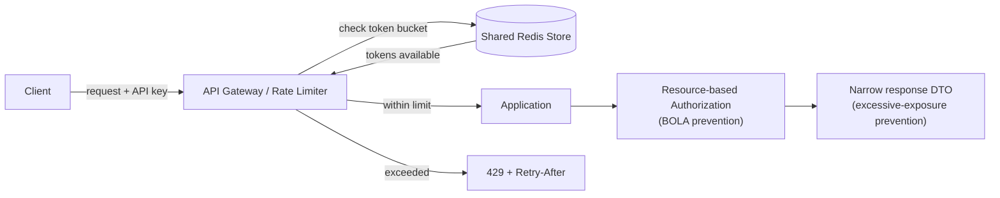
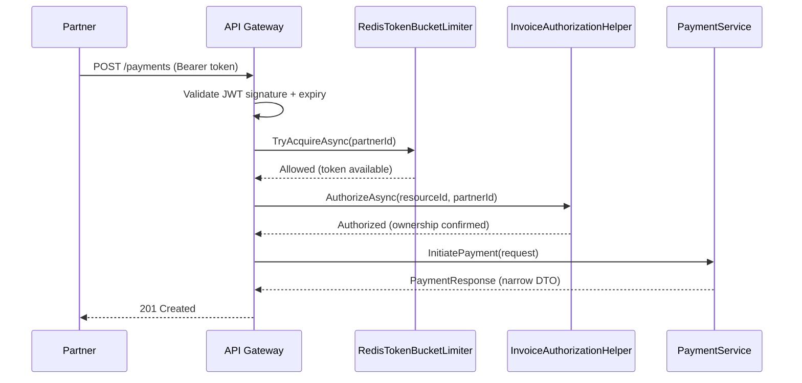

# Module 16 — REST APIs: API Security & Rate Limiting Patterns

> Domain: REST APIs | Level: Beginner → Expert | Prerequisite: [[01-REST-Design-Fundamentals]] (idempotency), [[../02-DotNet-AspNetCore/04-Authentication-Authorization-Deep-Dive]], [[../01-CSharp/02-Async-Await-Internals]] §Expert Q6 (distributed rate limiting)

---

## 1. Fundamentals

### What is API security, and what is rate limiting?
API security is the set of practices protecting an API's endpoints, data, and downstream systems from unauthorized access, abuse, and resource exhaustion — spanning authentication/authorization, input validation, transport security (TLS), and abuse-prevention mechanisms. **Rate limiting** is a specific abuse-prevention mechanism: capping how many requests a given caller (or the system overall) may make within a time window, protecting the API and its downstream dependencies from being overwhelmed — whether by a malicious attacker, a buggy client in a retry loop, or simply legitimate traffic exceeding provisioned capacity.

### Why do these exist?
Any publicly (or even internally, cross-team) reachable API is a genuine attack surface — without deliberate security controls, it's vulnerable to credential attacks, injection, data exposure, and resource-exhaustion abuse. Rate limiting exists specifically because **without it, a single caller (malicious or merely buggy) can consume unbounded capacity**, degrading service for every other caller — this is true even for entirely well-intentioned callers (§Expert Q6's thundering-herd/retry-storm scenario).

### When does this matter?
Every externally-facing (and most internally-facing, cross-team) API needs both; the depth matters for correctly implementing rate limiting that's actually effective at fleet scale (not just per-replica, which is trivially bypassable by spreading requests across replicas) and for recognizing the specific, common API-security vulnerability classes (broken object-level authorization, mass assignment, excessive data exposure) that dominate real-world API breaches.

### How does it work (30,000-ft view)?
```csharp
builder.Services.AddRateLimiter(options =>
    {
        options.AddTokenBucketLimiter("per-client", opt =>
            {
                opt.TokenLimit = 100;
                opt.TokensPerPeriod = 100;
                opt.ReplenishmentPeriod = TimeSpan.FromMinutes(1);
        });
});
app.UseRateLimiter;
app.MapGet("/orders", GetOrders).RequireRateLimiting("per-client");
```

---

## 2. Deep Dive

### 2.1 The OWASP API Security Top 10 — Why It's Distinct from the General OWASP Top 10
The OWASP API Security Top 10 exists as a **separate** list from the general OWASP Top 10 because APIs have distinctive risk patterns not centered in traditional web-app security: **Broken Object Level Authorization (BOLA/IDOR)** — the single most common API vulnerability — occurs when an API checks *authentication* but not *per-object authorization* (exactly the resource-based authorization gap, restated as an industry-recognized top vulnerability class); **Excessive Data Exposure** — returning a full internal entity/DTO with more fields than the client actually needs, relying on the client to "just not display" sensitive fields, rather than the server withholding them; **Broken Function Level Authorization** — a caller reaching an admin-only *operation* (not just a specific object) they shouldn't; **Mass Assignment** — directly the over-posting vulnerability, now recognized as an API-specific OWASP category in its own right.

### 2.2 Rate Limiting Algorithms — Precise Trade-offs
- **Fixed window**: count requests per fixed time bucket (e.g., per calendar minute) — simple, but has a **boundary-burst problem**: a client can send the full limit at 11:59:59 and another full limit at 12:00:01, doubling the effective allowed rate right at the window boundary.
- **Sliding window (log or counter-based)**: tracks requests within a continuously-moving window, avoiding the boundary-burst problem at the cost of more state (a log of timestamps, or a weighted blend of the current and previous fixed windows).
- **Token bucket**: a bucket holds tokens, refilled at a steady rate, consumed per request — naturally allows **bursts** up to the bucket's capacity while enforcing a steady-state average rate, the most commonly used algorithm for API rate limiting specifically because it models "occasional bursts are fine, sustained abuse isn't" well.
- **Leaky bucket**: requests queue and are processed at a strictly constant output rate — smooths bursts entirely (no burst allowance) at the cost of added latency for bursty-but-legitimate traffic.

### 2.3 Distributed Rate Limiting — the Fleet-Scale Requirement
A per-replica, in-memory rate limiter (`System.Threading.RateLimiting`'s built-in limiters used with default, local state) only limits **that specific replica's** view of a client's traffic — across N horizontally-scaled replicas, a client could receive N times the intended limit by simply having requests load-balanced across replicas. Genuine fleet-wide rate limiting requires **shared, external state** (a Redis-backed atomic counter/token-bucket, evaluated via a Lua script for atomicity) — directly the pattern first introduced §Expert Q6, now contextualized as the standard, necessary architecture for any rate limit meant to apply to a caller's *aggregate* traffic across an entire fleet, not just one replica's slice of it.

### 2.4 Rate Limit Response Contract — `429` and `Retry-After`
A rate-limited response should return `429 Too Many Requests` with a `Retry-After` header (seconds, or an HTTP date) telling the well-behaved client exactly when to retry — this directly enables correct client-side backoff (the retry patterns) rather than the client guessing an arbitrary backoff interval; omitting `Retry-After` forces every client to implement its own guessed backoff strategy, often producing exactly the synchronized-retry-storm problem (§Expert Q7) rate limiting exists to prevent in the first place.

### 2.5 Input Validation as a Security Boundary
Every API input boundary must validate: type/shape (model binding), size limits (request body size caps, preventing a single oversized payload from being a resource-exhaustion vector — directly the `stackalloc`-sizing caution generalized to any input-driven allocation), and business-rule validity (422) — treating client input as untrusted by default, never assuming a "friendly" first-party client always sends well-formed data, since any input boundary is also reachable by a malicious or compromised caller regardless of who the API was originally designed for.

## 3. Visual Architecture

```mermaid
graph LR
 Client -->|request + API key| Gateway["API Gateway / Rate Limiter"]
 Gateway -->|check token bucket| Redis[(Shared Redis Store)]
 Redis -->|tokens available| Gateway
 Gateway -->|within limit| App[Application]
 Gateway -->|exceeded| Reject["429 + Retry-After"]
 App --> AuthZ["Resource-based Authorization<br/>(BOLA prevention)"]
 AuthZ --> DTO["Narrow response DTO<br/>(excessive-exposure prevention)"]
```

## 4. Production Example
**Scenario**: A partner API experienced a BOLA (Broken Object Level Authorization) vulnerability — an endpoint `GET /invoices/{id}` checked only that the caller was *authenticated* (any valid API key), never that the requested invoice actually belonged to *that specific* caller's account, allowing any partner to enumerate and read every other partner's invoices by simply incrementing the ID. **Investigation**: found via a routine security audit (not an incident) specifically testing this exact pattern across every resource-ID-accepting endpoint. **Fix**: added resource-based authorization (the exact pattern) verifying `invoice.PartnerId == currentPartnerId` before returning data, across every affected endpoint, plus a systemic audit of the entire API surface for the same gap. **Lesson**: BOLA is the single most common real-world API vulnerability precisely because "the endpoint requires authentication" is trivially confused with "the endpoint enforces authorization" — they are not the same, and this module's OWASP-API-Top-10 framing exists specifically to keep that distinction front-of-mind.

## 5. Best Practices
- Enforce resource-based (per-object) authorization on every endpoint accepting a resource identifier — never rely on authentication alone.
- Return narrowly-scoped response DTOs, never full internal entities, closing the excessive-data-exposure gap.
- Use token-bucket rate limiting backed by a shared store (Redis) for genuine fleet-wide enforcement.
- Always return `429` with `Retry-After` for rate-limited requests.
- Validate and cap request body size at the edge, before any business logic executes.

## 6. Anti-patterns
- Checking authentication but not per-object authorization (BOLA, the incident).
- Returning full domain entities directly from API endpoints (mass assignment on the way in, excessive exposure on the way out — both the concerns).
- Per-replica-only (in-memory) rate limiting in a horizontally-scaled deployment, trivially bypassed by load-balanced traffic spreading.
- Omitting `Retry-After` on 429 responses, forcing clients into guessed, potentially-synchronized backoff.

---

## 7. Performance Engineering

**CPU:** A Redis-backed distributed rate limiter adds a network round-trip (and Lua-script execution cost on the Redis side) to every rate-limited request — at scale, this is real, additive latency on the hot path; a common mitigation is a **local, short-TTL cache of "definitely under limit"** results (e.g., cache a "not yet at 80% of limit" verdict for a few hundred milliseconds per client key) to avoid a Redis round-trip on every single request when a client is nowhere near its limit, falling back to the authoritative Redis check only as usage approaches the threshold.

**Memory:** A sliding-window-log rate limiter (storing every request timestamp per client) has memory cost proportional to request volume within the window — at high QPS per client this can be substantial; a counter-based sliding window (blending two adjacent fixed-window counts) trades exactness for O(1) memory per client key, the standard production compromise.

**Latency:** JWT signature verification (RS256/ES256 asymmetric) is meaningfully more CPU-expensive per request than HS256 symmetric verification — at very high request volume, this becomes a measurable per-request cost; caching the verified-token result (keyed by token hash, bounded by the token's own expiry) for the remainder of a short-lived token's validity window avoids re-verifying the same token's signature on every request within a burst.

**Throughput:** Token-bucket rate limiting's burst allowance is itself a throughput-shaping decision — sizing the bucket capacity too small forces legitimate bursty clients (a batch job, a UI page loading 10 resources concurrently) into artificial 429s; sizing it too large defeats the limiter's abuse-prevention purpose. This is a genuine tuning exercise informed by real traffic-pattern data, not a one-size-fits-all default.

**Benchmarking:** Load-test rate-limiting and authorization checks under realistic **concurrent multi-client** traffic, not single-client sequential requests — the fleet-scale correctness property (§2.3) and any lock-contention behavior in the shared Redis store only surface under genuine concurrency, mirroring this course's recurring "test at representative scale" theme.

**Caching:** Authorization decisions that are expensive to compute (a multi-hop entitlement lookup) but change infrequently are candidates for a short-TTL cache — but cache invalidation must be explicit and immediate for security-sensitive authorization changes (a revoked entitlement must not remain effective for the cache's TTL), making authorization caching a narrower, more carefully-scoped optimization than general-purpose response caching.

## 8. Security — Beyond §1–§6: Token Replay, Distributed Bypass, and Credential Stuffing

This section goes past the module's core BOLA/rate-limiting/OWASP-API-Top-10 coverage in §1–§6 into three additional, frequently-tested threat classes.

**OAuth2 token replay:** A stolen bearer access token (leaked via logging, a compromised proxy, or a browser-extension exfiltration) is fully usable by an attacker until it expires — bearer tokens carry no built-in binding to the legitimate holder. Mitigations: (1) **short-lived access tokens** (minutes, not hours) with refresh-token rotation, bounding the replay window; (2) **sender-constrained tokens** — DPoP (Demonstrating Proof-of-Possession) or mTLS-bound tokens, where the token is cryptographically bound to a client-held key, so a stolen token alone is useless without the corresponding private key; (3) **audience and `jti` (JWT ID) tracking** to detect and reject a token being replayed against an unexpected audience or replayed after a legitimate one-time-use scenario has already consumed it; (4) refresh-token **reuse detection** — if a rotated-away refresh token is ever presented again, that's a strong signal of token theft, and the correct response is to revoke the entire token family, not just reject the single replayed token.

**Distributed rate-limit bypass:** Beyond the fleet-scale (per-replica-state) bypass already covered in §2.3, attackers actively exploit **key-selection gaps**: rotating through many API keys/accounts (if self-service signup is cheap), distributing requests across a botnet's IP pool, or exploiting a rate limiter keyed only on IP when the API is behind a shared corporate NAT/CDN edge (making the limiter's effective granularity far coarser than intended, in both directions — see Advanced Q6). A further, subtler bypass: **rate-limiting inconsistency across a heterogeneous edge** — if some traffic reaches the API via a CDN/WAF layer that itself enforces a *different* limit than the origin's application-level limiter, the two layers' disagreement can be probed and exploited to find the more permissive path. Mitigation is a **single source of truth for rate-limit state** (the Redis-backed shared store) consulted identically regardless of which edge path a request took, plus layered velocity controls keyed on multiple dimensions simultaneously (identity, IP, device fingerprint) so no single dimension's bypass fully defeats the control.

**Credential stuffing:** Attackers replay large lists of previously-breached username/password pairs (sourced from unrelated third-party breaches) against a login endpoint, relying on password reuse across services. Generic rate limiting on the login endpoint helps but is insufficient alone — the same distributed-bypass techniques above apply, and a determined attacker paces requests below any single-IP/single-account threshold while trying many accounts. Defenses layer: (1) **per-account** *and* **per-IP** velocity limits on login attempts, tuned independently; (2) **breached-credential screening** at signup/login time (checking submitted passwords against a known-breached-password corpus, e.g., via a k-anonymity API pattern, and forcing a reset if matched); (3) **anomaly-based detection** — a spike in distinct-account login attempts from one IP/device, or a spike in failed logins with high password-list diversity, is the actual signal, exactly mirroring the card-testing detection logic (Expert Q1) applied here to the authentication surface instead of the payment-authorization surface; (4) **CAPTCHA/step-up authentication** triggered adaptively once anomaly signals fire, rather than imposed unconditionally on every login (which degrades legitimate-user experience for no benefit against a determined, distributed attacker); (5) **MFA** as the durable structural defense — even a successful credential-stuffing match is insufficient to authenticate if a second factor is required.

## 9. Scalability

**Horizontal scaling:** Every rate-limiting and authorization mechanism in this module must work correctly when the API is scaled to N replicas — the fleet-scale requirement (§2.3) is the central scalability constraint, and any design that implicitly assumes single-instance state (an in-memory `Dictionary` counter) breaks silently, not loudly, the moment a second replica is added.

**Caching/replication:** The shared Redis rate-limit store itself needs its own HA posture — a Redis primary/replica setup with automatic failover (Redis Sentinel or a managed equivalent) so the rate limiter's own infrastructure isn't a single point of failure for the entire API (directly Advanced Q8's fail-open/fail-closed design question).

**Partitioning:** For very high request volume, the shared rate-limit store can itself be partitioned/sharded by client-key hash across multiple Redis instances, avoiding a single Redis instance becoming the throughput bottleneck for the entire fleet's rate-limit checks.

**Load balancing:** Rate-limit and authorization checks should be **stateless from the load balancer's perspective** — any replica can serve any request, since the authoritative state lives in the shared store, not on a specific replica — preserving the load balancer's freedom to route without sticky-session constraints.

**High availability:** The fail-open-vs-fail-closed decision (Advanced Q8) is fundamentally an availability-vs-security trade-off decision made explicit at the architecture level — for a money-movement API, this is a business-risk decision requiring sign-off, not a default an infrastructure team should make silently.

**Disaster recovery:** A regional failover for a multi-region API must carry rate-limit and token-revocation state with it (or accept a defined, bounded window of degraded enforcement during failover) — an unaddressed gap here means a DR failover silently resets every client's rate-limit counters or, worse, temporarily fails to enforce a just-revoked token's revocation.

---

## 10. Interview Questions

### Basic (10)
1. **Q: What is BOLA?** **A:** Broken Object Level Authorization — an API checks authentication but not whether the caller is authorized to access the *specific* requested object.
2. **Q: What is mass assignment?** **A:** Binding a request body directly onto a rich entity type, letting a client set unintended fields.
3. **Q: What status code should a rate-limited request return?** **A:** 429 Too Many Requests — a distinct, machine-recognizable signal (separate from 4xx client errors and 5xx server failures) that well-behaved clients and SDKs interpret as "back off and retry later," ideally accompanied by a `Retry-After` header.
4. **Q: What header tells a client when to retry after a 429?** **A:** `Retry-After` — expressed as either seconds-to-wait or an HTTP date; emitting it (ideally with jittered values) shapes client behavior into coordinated backoff instead of leaving every client to guess and hammer the API in synchronized retry waves.
5. **Q: What's the boundary-burst problem with fixed-window rate limiting?** **A:** A client can send the full limit at the very end of one window and again at the very start of the next, doubling the effective rate at the boundary.
6. **Q: What does a token bucket allow that a leaky bucket doesn't?** **A:** Bursts up to the bucket's capacity, while still enforcing a steady-state average rate.
7. **Q: Why doesn't a per-replica in-memory rate limiter work correctly at fleet scale?** **A:** Each replica only sees its own slice of a client's traffic, so the effective limit multiplies by replica count.
8. **Q: What is excessive data exposure?** **A:** Returning more fields in a response than the client legitimately needs, relying on the client not to misuse them rather than the server withholding them.
9. **Q: Why is the OWASP API Security Top 10 a separate list from the general OWASP Top 10?** **A:** APIs have distinctive risk patterns (BOLA, mass assignment, broken function-level authorization) not centered in traditional web-app security concerns.
10. **Q: What should an API do with an oversized request body?** **A:** Reject it early via a configured size limit, before it reaches business logic.

### Intermediate (10)
1. **Q: Why is BOLA the most common real-world API vulnerability?** **A:** Because "requires authentication" is easily and commonly confused with "enforces authorization" — an endpoint can correctly reject unauthenticated callers while still failing to check whether the authenticated caller owns the specific requested resource.
2. **Q: How does a sliding-window rate limiter avoid the fixed-window boundary-burst problem?** **A:** It tracks requests within a continuously-moving window (via a timestamp log or a weighted blend of adjacent fixed windows) rather than resetting a hard counter at fixed boundaries, so there's no single instant where two full allowances stack.
3. **Q: Why is Redis (or another shared store) required for genuine fleet-wide rate limiting?** **A:** It provides the single, shared, atomically-updatable counter/bucket state every replica reads and writes to, so a client's aggregate usage across the whole fleet is correctly tracked, not just one replica's local view.
4. **Q: What's the security risk of omitting per-object authorization even when using a resource ID that "looks unguessable" (a GUID)?** **A:** Unguessability isn't authorization — an attacker with a leaked/logged/observed GUID (e.g., from a referrer header, a shared link, or another vulnerability) can still access the resource if no ownership check exists; GUIDs reduce enumeration risk but do not substitute for authorization.
5. **Q: Why should a rate limiter's response include `Retry-After` instead of leaving clients to guess their backoff interval?** **A:** It gives the client an authoritative, server-determined retry time, preventing every client from independently guessing (and potentially synchronizing on) their own backoff interval, which itself can create a retry storm.
6. **Q: What's the difference between rate limiting a specific endpoint versus rate limiting a client's aggregate usage across an entire API?** **A:** Per-endpoint limiting protects that specific operation's cost profile (useful if one endpoint is disproportionately expensive); aggregate limiting protects overall fair-usage/capacity allocation across a client's entire traffic — many production systems apply both simultaneously, at different granularities.
7. **Q: Why is returning a full domain entity from an endpoint a security concern even if the client "shouldn't" read certain fields?** **A:** Relying on client-side restraint (not displaying a field) provides no actual security — any caller can inspect the raw HTTP response directly, so genuinely sensitive fields must be withheld server-side, not merely hidden in the client UI.
8. **Q: How would you rate-limit differently for authenticated versus unauthenticated traffic on the same endpoint?** **A:** Key the rate limiter by authenticated user/API-key identity when present (a higher, per-identity limit) and fall back to IP-based limiting for unauthenticated requests (typically a stricter limit, since IP-based keying is coarser and more easily shared among unrelated legitimate users behind NAT).
9. **Q: What's a realistic scenario where request-size limiting itself becomes a rate-limiting-adjacent concern?** **A:** An attacker sending many moderately large (but individually within-limit) payloads can still exhaust bandwidth/parsing capacity faster than small payloads would — request-size limits and rate limits are complementary controls, not substitutes for each other.
10. **Q: Why does a security audit specifically test BOLA by attempting to access another tenant's/user's resource with a valid but different identity, rather than just checking "does authentication work"?** **A:** Because authentication working correctly says nothing about whether authorization is also correctly enforced per-resource — the only way to verify BOLA protection is to actually attempt cross-account access and confirm it's denied, exactly mirroring the contract-consistency testing philosophy from earlier modules (test the actual behavior, not just the presence of a mechanism).

### Advanced (10)
1. **Q: Design a token-bucket rate limiter backed by Redis with correct atomicity under concurrent requests.**
 **A:** Use a Redis Lua script (executed atomically server-side) that reads the current token count and last-refill timestamp, computes the number of tokens to add based on elapsed time, caps at the bucket capacity, and atomically decrements if a token is available — all within one atomic script execution, avoiding the read-then-write race that a naive "GET count, check, SET count" sequence (non-atomic across two round-trips) would be vulnerable to under concurrent requests from the same client.
2. **Q: Explain how you would systematically audit an existing large API surface for BOLA vulnerabilities.**
 **A:** Enumerate every endpoint accepting a resource identifier (route parameter or body field); for each, write an automated test authenticating as User/Tenant A and attempting to access a resource known to belong to User/Tenant B, asserting a 403/404 (not the actual data) — run this systematically across the entire endpoint inventory rather than spot-checking, since BOLA gaps are endpoint-specific and one fixed instance doesn't imply others are also fixed.
3. **Q: How would you design rate limiting to protect a third-party API with its own strict, contractual rate limit, across a fleet of your own services calling it?** **A:** Directly §Expert Q6's distributed proactive rate limiter — a shared, Redis-backed token bucket sized to the third party's actual contractual limit, checked by every calling replica before issuing the outbound call, combined with local per-replica bounded concurrency and retry-with-backoff as defense-in-depth beneath the proactive limiter.
4. **Q: A team argues excessive data exposure isn't a real risk for an internal-only API since "we control both sides." Push back with a concrete scenario.**
 **A:** Internal APIs are frequently consumed by more teams/services over time than originally anticipated, and a full-entity response (including, e.g., internal cost data, other customers' aggregate data, or soon-to-be-deprecated fields) becomes an unintended, hard-to-track dependency the moment any other team starts parsing fields "just in case" — when the API owner later wants to remove or restrict that field, they discover an undocumented internal consumer depends on it; narrow, intentional response contracts prevent this accidental coupling regardless of whether the API is "internal only."
5. **Q: Design a rate-limiting strategy that adapts dynamically based on current system load (adaptive rate limiting) rather than a fixed threshold.**
 **A:** Monitor a leading load indicator (CPU, database connection-pool utilization, downstream dependency latency) and dynamically adjust the token-bucket refill rate/capacity downward as load increases — trading strict predictability for graceful degradation under genuine system stress, at the cost of a less deterministic, harder-to-document contract for API consumers (a real trade-off to discuss explicitly, not a strictly superior approach).
6. **Q: Explain why a rate limiter keyed purely by IP address is both under- and over-inclusive, and how would you address each failure mode.**
 **A:** Under-inclusive: a determined attacker distributes requests across many IPs (a botnet), evading any single-IP threshold entirely — address via behavioral/anomaly-based detection layered on top, not IP-keying alone. Over-inclusive: many legitimate users can share one IP (corporate NAT, mobile carrier-grade NAT), so an aggressive per-IP limit can collectively throttle many unrelated innocent users — address via combining IP-based limiting (for unauthenticated traffic) with authenticated-identity-based limiting (a much more precise key) wherever authentication is available.
7. **Q: How would you design an API's error responses to avoid leaking information useful for a BOLA/enumeration attack?** **A:** Return an identical `404 Not Found` (not a distinguishing `403 Forbidden`) for both "resource doesn't exist" and "resource exists but you're not authorized to see it" — returning a distinguishing 403 confirms the resource's existence to an attacker probing IDs, information a pure 404 doesn't reveal (directly the 401-vs-403 information-hiding discussion, applied here to 403-vs-404).
8. **Q: A payment API's rate limiter is itself becoming a single point of failure (the Redis-backed limiter's own outage blocks all traffic). How would you design around this?** **A:** Implement a fail-open-with-monitoring or fail-closed decision deliberately per business risk: for most APIs, briefly failing open (allowing requests through without rate-limiting enforcement) during a rate-limiter-infrastructure outage is preferable to a full API outage, provided it's paired with aggressive alerting on the rate-limiter's own health and a fast-acting circuit breaker reverting to fail-open only for a bounded window; for an API where unbounded abuse during any gap is unacceptable (e.g., a scarce, expensive third-party pass-through), fail-closed may be the correct, deliberate choice instead — the decision should be explicit and documented, not a default neither team consciously chose.
9. **Q: Explain how excessive data exposure and mass assignment are two sides of the same underlying architectural mistake.**
 **A:** Both stem from binding directly to/from a rich internal entity type instead of a dedicated, narrowly-scoped DTO at the API boundary — mass assignment is the input-side manifestation (a client sets fields it shouldn't), excessive exposure is the output-side manifestation (a client reads fields it shouldn't); the single, unifying fix (dedicated request/response DTOs) addresses both simultaneously.
10. **Q: As a Principal Engineer, how would you make BOLA prevention structurally enforced across an organization rather than dependent on every team remembering to add resource-based authorization checks?** **A:** Combine: (a) a shared repository/service-layer base class or helper (the `IResourceAuthorizationHelper`) making the correct pattern the path of least resistance; (b) mandatory automated BOLA-probing tests (Advanced Q2) as a required CI gate for any endpoint accepting a resource identifier; (c) an architecture-review checklist item requiring explicit justification for any endpoint that intentionally omits per-object authorization (e.g., genuinely public resources) — converting "remember to check ownership" from tribal knowledge into layered, automated, and governance-enforced protection.

### Expert (FinTech Principal Panel)

1. **Q: Your card-authorization API is being used for "card testing" — attackers running many small auths to validate stolen card numbers (and BIN enumeration). Your per-IP/per-key rate limits don't stop it. Why not, and what actually defends against this?**
 **A:** Generic rate limiting keys on the *caller* (IP/API key), but card testing distributes across many IPs/keys and stays under per-caller thresholds while abusing many *cards* — so the abused dimension isn't the caller, it's the card/BIN/velocity of attempts, which caller-keyed limits don't see. Defenses are **fraud/velocity controls**, distinct from security rate limiting: (1) **velocity limits keyed on the resource under attack** — attempts per card, per BIN, per device, per shipping/billing tuple, over rolling windows; (2) **anomaly detection** — a spike in low-value auths, high decline ratios, or many distinct cards from one device/session is the actual signal; (3) **device fingerprinting / proof-of-work / CAPTCHA** on suspicious flows to break automation; (4) **decline-rate circuit breakers** that tighten automatically when the auth-decline ratio spikes; (5) feed confirmed abuse back into a shared block/deny list. Also **don't leak an oracle** — uniform responses/timing so an attacker can't distinguish "valid card, wrong CVV" from "invalid card" (that turns your API into a card validator). The Principal framing: rate limiting protects *capacity and fairness per caller*; card testing is a *fraud* problem on the card dimension — you need velocity + anomaly + device signals + non-oracle responses, and treating it as "just tune the rate limit" fails because you're limiting the wrong dimension.
 **Why correct:** Explains why caller-keyed limits miss card-dimension abuse and prescribes velocity/anomaly/device controls + decline circuit breakers + non-oracle responses.
 **Common mistakes:** Assuming rate limiting stops card testing; leaking a validity oracle via distinct responses/timing; keying controls only on caller, never on card/BIN/device.
 **Follow-ups:** "What dimensions do you key velocity limits on?" / "How does your API avoid becoming a card-validation oracle?" / "Rate limiting vs. fraud controls — where's the line?"

2. **Q: Design the defense-in-depth layering for a public, internet-facing money-movement API. Name each layer, what it stops, and why no single layer suffices.**
 **A:** Layer controls so a bypass of one is caught by the next, from edge inward: (1) **Edge/WAF + DDoS protection + TLS/mTLS** — volumetric attacks, known exploit patterns, transport security; (2) **Authentication** (sender-constrained tokens/mTLS for high value) — proves *who*; (3) **Rate limiting** (per-identity + per-IP) — caller fairness/capacity; (4) **Authorization** — coarse function-level (`[Authorize]`) *and* per-object BOLA checks (the most common real gap) — proves *allowed to touch this object*; (5) **Input validation + size/depth limits + DTO binding** — mass assignment, injection, DoS payloads; (6) **Fraud/velocity controls** — abuse on the money/card dimension (Q1); (7) **Idempotency + transactional integrity** — no double-charge; (8) **Output minimization** — no excessive data exposure; (9) **Audit + observability** — detect and prove. No single layer suffices because each addresses a different threat class and each *will* occasionally be bypassed (a valid token can be stolen, an auth check can be forgotten on one endpoint, a fraud model has false negatives) — defense-in-depth means the blast radius of any one failure is bounded by the others. The Principal framing: security for a money API is a *layered system* with an explicit threat per layer and no single point of total trust; the design goal is that compromising one control still leaves an attacker facing the rest.
 **Why correct:** Enumerates distinct layers each mapped to a threat class and articulates why single-layer trust is unsafe (each layer fails sometimes; layering bounds blast radius).
 **Common mistakes:** Treating auth *or* rate limiting as "the" security; forgetting per-object authorization; no fraud layer; relying on a single control.
 **Follow-ups:** "Which layer most commonly has the real-world gap?" (per-object authorization / BOLA) / "How does idempotency function as a security control?" / "What's the blast radius if a token is stolen, under this stack?"

3. **Q: The same transaction resource is consumed by a customer app, a partner integrator, and internal ops — each should see a *different subset* of fields (e.g., only ops sees the internal risk score; PAN is masked for everyone but tokenized-vault access). How do you design field-level authorization beyond "use a DTO"?**
 **A:** A single response DTO isn't enough when the *same* resource must expose different fields to different audiences — you need **scope/role-driven field authorization**. Approaches: (1) **audience-specific representations** — distinct DTOs/projections per consumer scope (customer view, partner view, ops view), selected by the caller's scope/role, so each audience only ever gets its allowed fields and adding a sensitive field can't accidentally leak to a narrower audience; (2) **field-level policy** — a serialization layer that includes/redacts individual fields based on the caller's scopes (useful when field visibility is fine-grained), with a **default-deny** posture (a new field is hidden unless explicitly allowed for a scope); (3) **always mask/tokenize the most sensitive data** (PAN, full account number) at rest and in every representation, exposing raw values only through a separately-authorized vault path with its own audit. Enforce with tests asserting each scope's response contains *only* its permitted fields (the output-side analogue of BOLA testing). The Principal framing: "use a DTO" solves accidental full-entity exposure, but multi-audience financial data needs *scope-driven, default-deny field authorization* so that who-you-are determines which fields you receive — and the crown-jewel fields (PAN) are masked/tokenized universally with vault-gated, audited access.
 **Why correct:** Moves past a single DTO to scope-driven, default-deny field authorization with audience-specific projections, universal masking/tokenization of crown-jewel data, and per-scope output tests.
 **Common mistakes:** One DTO for all audiences; opt-out (default-visible) field exposure; exposing raw PAN anywhere instead of tokenizing; no per-scope output assertions.
 **Follow-ups:** "Default-deny vs. default-allow for new fields — why does it matter?" / "How do you expose a PAN only to an authorized, audited path?" / "How would you test that the partner scope never sees the internal risk score?"

4. **Q: An attacker has stolen a valid, unexpired OAuth2 access token for a payments API (via a compromised logging pipeline that captured Authorization headers). Standard bearer-token validation passes. How do you detect and stop this specific attack, and how would you have prevented the token from being stolen this way in the first place?**
 **A:** Bearer tokens are inherently "possession = access" — once stolen, they're indistinguishable from legitimate use to a validator checking only the signature and expiry. Detection: **anomaly signals on token usage** — a sudden change in calling IP/geolocation/device fingerprint for a token that previously showed a stable pattern; concurrent use of the same token from two geographically implausible locations; a token suddenly exercising scopes/endpoints it's never used before. Stopping it: revoke the specific token (and, if the theft vector suggests broader compromise, the entire session/refresh-token family) via a revocation list checked on every request (accepting the resulting look-aside cost, or using short-lived tokens to bound exposure without needing revocation at all). Prevention of the theft vector itself: **never let bearer tokens reach logs** — redact/mask `Authorization` headers at the logging middleware layer as a mandatory, structural control (not a per-team convention), and move toward **sender-constrained tokens** (DPoP/mTLS-bound, §8) so that even a captured token is useless without the corresponding private key, which a log-scraping attacker doesn't have. The Principal framing: bearer tokens are a *convenience* trade-off (bearer = access, no extra proof required) that's only safe if the token genuinely never leaks — the moment logging, tracing, or error-reporting infrastructure can incidentally capture one, bearer tokens become a structural liability, and the durable fix is sender-constrained tokens plus mandatory redaction, not merely "be more careful with logs."
 **Why correct:** Distinguishes detection (anomaly-based, since validation alone can't tell theft from legitimate use) from prevention (structural redaction + sender-constraining), and correctly frames bearer-token risk as a design trade-off, not an implementation bug.
 **Common mistakes:** Assuming token expiry alone bounds the risk adequately for a money-movement API; treating "redact logs" as a one-off fix rather than a mandatory, centrally-enforced middleware control; not distinguishing revoking one token from revoking a compromised session's entire token family.
 **Follow-ups:** "Why does DPoP defeat this specific theft vector where a short expiry alone doesn't fully?" / "What's the operational cost of checking a revocation list on every request?" / "How would you retroactively audit how far back the logging pipeline captured tokens?"

5. **Q: Your rate limiter is correctly implemented (Redis-backed, atomic, correctly fleet-wide) and correctly blocks a single client from exceeding its limit — yet a coordinated attack using thousands of newly-registered free-tier accounts, each individually staying under its own per-account limit, still degrades your API's overall capacity. What's the actual gap, and how do you close it without punishing legitimate free-tier growth?**
 **A:** Per-identity rate limiting protects **fairness between individual callers**, but says nothing about **aggregate capacity consumption across a coordinated set of callers** — a limiter correctly enforcing "each account gets 100 req/min" provides zero protection against 10,000 newly-registered accounts each legitimately using their full 100 req/min allotment simultaneously. This requires a *second*, orthogonal control layer: (1) **global/tenant-tier capacity ceilings** — an aggregate cap across the entire free tier (or a specific cohort), independent of individual account limits, that triggers tighter admission control (e.g., a queue, a CAPTCHA gate on new signups, or a tightened per-account limit applied fleet-wide) once crossed; (2) **signup-velocity anomaly detection** — a spike in new-account creation rate from correlated signals (shared IP ranges, shared device fingerprints, disposable-email patterns) is itself the leading indicator, actionable *before* the accounts start consuming capacity; (3) **cohort-based, not purely identity-based, rate limiting** — grouping newly-registered, unverified accounts into a stricter shared pool distinct from established, verified accounts' pool, so the blast radius of a coordinated signup-and-abuse attack is contained to the new-account cohort's own budget rather than the platform's total capacity. The Principal framing: per-identity fairness and aggregate-capacity protection are two distinct controls answering two distinct questions ("is this one caller fair?" vs. "can the platform survive many simultaneously-fair callers?") — a system that only implements the first has a coordinated-abuse gap regardless of how correctly the first is built.
 **Why correct:** Identifies that per-identity correctness doesn't imply aggregate-capacity protection, and proposes a cohort/global-ceiling layer plus signup-velocity anomaly detection as the orthogonal fix, without simply tightening individual limits (which would punish legitimate users).
 **Common mistakes:** Concluding the rate limiter is "broken" when it's functioning exactly as designed for its actual scope (per-identity fairness); fixing this by tightening every account's individual limit, degrading legitimate free-tier UX for a problem that's actually about aggregate, cohort-level capacity.
 **Follow-ups:** "Why does cohorting new accounts separately help contain, not just detect, this attack?" / "What signup-time signals would you correlate to catch this before capacity is even consumed?" / "How is this the same underlying gap as the card-testing problem, restated for account signup instead of payment authorization?"

6. **Q: Design the authorization model for a webhook endpoint that must accept inbound calls from an external payment processor (e.g., Stripe/Adyen) — a caller you cannot issue your own API keys or OAuth tokens to. What's the correct authentication/authorization approach, and what happens if you get it wrong?**
 **A:** A webhook receiver can't use your normal inbound-auth model (you don't control the caller's credential-issuance flow) — the standard, correct pattern is **HMAC signature verification**: the payment processor signs the raw request body with a shared secret (provisioned out-of-band, at webhook-endpoint registration time) and sends the signature in a header (e.g., Stripe's `Stripe-Signature`); your endpoint independently recomputes the HMAC over the *exact raw, unparsed* request body using the shared secret and compares in constant time, rejecting any mismatch. Critical details often gotten wrong: (1) **verify against the raw body bytes**, not a re-serialized/re-parsed version — any framework middleware that parses-then-re-serializes JSON before your handler sees it can silently change byte-for-byte content (key ordering, whitespace), breaking legitimate signatures; (2) **timestamp/nonce checking** to prevent **replay** of a captured, legitimately-signed webhook payload being re-sent later — a valid signature alone doesn't prove freshness; (3) **constant-time comparison** for the signature check itself, avoiding a timing side-channel that could help an attacker forge a valid signature byte-by-byte; (4) idempotent processing of the webhook's payload regardless of verification (the payment-idempotency discipline this course establishes generally), since the processor's own retry behavior means the same legitimately-signed webhook may arrive more than once. Getting this wrong (e.g., trusting an unsigned `X-Forwarded-For`-style "trust the source IP" check, or skipping signature verification because "it's just a notification") means **anyone who discovers the webhook URL can inject fabricated payment-status events** — directly forgeable "payment succeeded" notifications, a severe integrity failure for a money-movement system. The Principal framing: an inbound webhook is an *unauthenticated-by-default* surface unless you build explicit, correctly-implemented signature verification — the risk isn't hypothetical, it's the same class of vulnerability as a completely unauthenticated write endpoint, just less obviously so because the payload looks like routine, benign infrastructure traffic.
 **Why correct:** Names the correct pattern (HMAC over raw body, verified constant-time, plus replay protection) and is explicit about the severe consequence (forgeable payment events) of getting it wrong.
 **Common mistakes:** Trusting source-IP allowlisting alone as sufficient authentication (spoofable, and processors' IP ranges change); verifying the signature against a re-parsed/re-serialized body instead of the raw bytes; treating webhook payload processing as safe to run without idempotency handling.
 **Follow-ups:** "Why does verifying against re-parsed JSON break legitimate signatures?" / "How does replay protection differ from signature verification — why do you need both?" / "What's the blast radius if this endpoint is compromised for a money-movement API?"

7. **Q: Synthesize this module's full defense-in-depth stack (Expert Q2) against a single, concrete attack scenario: an attacker with a leaked, low-privilege partner API key attempts to escalate to reading and modifying other partners' payment data. Walk through every layer that should stop them, and identify which single layer's failure would be most catastrophic if it alone were missing.**
 **A:** Walking the layered stack (Expert Q2) against this specific attacker: (1) **Edge/WAF** — doesn't stop this attack; the key is valid, so requests look legitimate at the transport layer. (2) **Authentication** — passes; the key is genuinely valid, just low-privilege. (3) **Rate limiting** — doesn't stop a slow, patient enumeration attempt staying under threshold; limits abuse *volume*, not scope. (4) **Authorization — function-level** — should block any admin-only *operation* the low-privilege key attempts; this stops privilege-escalation-via-operation. (5) **Authorization — per-object (BOLA)** — should block reading/modifying any specific resource (another partner's invoice/payment) not owned by this key's partner; this is the layer that actually stops the described attack (enumerating and reading other partners' data), and it is, per this module's own findings, the single most commonly missing or incompletely-implemented layer in real systems. (6) **Input validation** — irrelevant to this specific attack vector. (7) **Fraud/velocity controls** — might eventually flag unusual read-volume-per-key as anomalous, a secondary, slower-acting safety net, not the primary stop. (8) **Output minimization** — even if BOLA fails, narrow response DTOs limit how much sensitive data leaks per successful unauthorized read, bounding damage rather than preventing it. (9) **Audit/observability** — doesn't prevent the attack but is what allows detecting it occurred and scoping the blast radius after the fact. Conclusion: **per-object authorization (BOLA prevention) is the layer whose absence would be most catastrophic for this specific scenario** — every other layer either doesn't apply to this attack shape or only mitigates its severity/detects it after the fact; BOLA is the only layer that actually *prevents* the core harm (unauthorized cross-tenant data access) outright. This is consistent with, and a direct synthesis of, this module's repeated finding that BOLA is simultaneously the most common real-world gap and the layer carrying disproportionate weight for this exact attack class.
 **Why correct:** Walks the full defense-in-depth stack against one concrete scenario (not abstractly), correctly identifies which layers are inapplicable versus load-bearing for this specific attack, and justifies naming BOLA as the single most consequential layer with a scenario-specific argument rather than merely restating the general claim.
 **Common mistakes:** Claiming every layer "helps" without distinguishing which layers actually prevent versus merely detect or bound this specific attack; failing to notice that rate limiting and WAF are essentially irrelevant to a valid-credential, low-volume enumeration attack.
 **Follow-ups:** "Which layer would matter most if the attacker instead had a *stolen* (not merely low-privilege) key with full partner scope?" (Likely audit/observability plus anomaly detection, since authorization would correctly pass for the legitimate partner's own data.) / "How would output minimization alone have bounded the damage even with a BOLA gap present?" / "Why is function-level authorization insufficient on its own here?"

---

## 11. Coding Exercises

### Easy — Add resource-based authorization closing a BOLA gap
```csharp
// BEFORE (vulnerable): only checks authentication
app.MapGet("/invoices/{id}", async (string id, IInvoiceRepository repo) =>
    {
        var invoice = await repo.GetByIdAsync(id);
        return invoice is null? Results.NotFound: Results.Ok(invoice);
}).RequireAuthorization;

// AFTER (fixed): checks ownership too
app.MapGet("/invoices/{id}", async (string id, IInvoiceRepository repo, ClaimsPrincipal user) =>
    {
        var invoice = await repo.GetByIdAsync(id);
        var currentPartnerId = user.FindFirstValue("partner_id");
        if (invoice is null || invoice.PartnerId!= currentPartnerId)
            return Results.NotFound; // 404, not 403 -- avoids confirming existence (Advanced Q7)
        return Results.Ok(invoice);
}).RequireAuthorization;
```

### Medium — Token-bucket rate limiting with `Retry-After`
```csharp
builder.Services.AddRateLimiter(options =>
    {
        options.OnRejected = async (context, ct) =>
        {
            context.HttpContext.Response.Headers.RetryAfter = "60";
            context.HttpContext.Response.StatusCode = StatusCodes.Status429TooManyRequests;
            await context.HttpContext.Response.WriteAsJsonAsync(new { error = "rate_limit_exceeded" }, ct);
        };
        options.AddTokenBucketLimiter("api", opt =>
            {
                opt.TokenLimit = 100; opt.TokensPerPeriod = 100; opt.ReplenishmentPeriod = TimeSpan.FromMinutes(1);
        });
});
```

### Hard — Distributed Redis-backed token bucket (Advanced Q1)
```lua
-- Redis Lua script: atomic token-bucket check-and-decrement
local key = KEYS[1]
local capacity = tonumber(ARGV[1])
local refillRate = tonumber(ARGV[2]) -- tokens per second
local now = tonumber(ARGV[3])

local bucket = redis.call("HMGET", key, "tokens", "lastRefill")
local tokens = tonumber(bucket[1]) or capacity
local lastRefill = tonumber(bucket[2]) or now

local elapsed = math.max(0, now - lastRefill)
tokens = math.min(capacity, tokens + elapsed * refillRate)

if tokens < 1 then
 redis.call("HMSET", key, "tokens", tokens, "lastRefill", now)
 return 0 -- rejected
else
 tokens = tokens - 1
 redis.call("HMSET", key, "tokens", tokens, "lastRefill", now)
 return 1 -- allowed
end
```
**Discussion**: Running this as a single Lua script executed atomically by Redis (`EVAL`) is what prevents the read-then-write race a naive two-round-trip implementation would suffer under concurrent requests from the same client — exactly Advanced Q1's requirement.

### Expert — DTO-based mass-assignment/excessive-exposure prevention with automated BOLA test
```csharp
public record InvoiceResponse(string Id, decimal Amount, DateTime DueDate); // narrow, no PartnerId, no internal cost fields

// Automated BOLA regression test (Advanced Q2's pattern):
[Fact]
public async Task GetInvoice_Should_Return_404_For_Other_Partners_Invoice
{
    var clientA = _factory.CreateAuthenticatedClient(partnerId: "partner-a");
    var invoiceOwnedByB = await SeedInvoiceAsync(partnerId: "partner-b");

    var response = await clientA.GetAsync($"/invoices/{invoiceOwnedByB.Id}");

    Assert.Equal(HttpStatusCode.NotFound, response.StatusCode); // NOT the invoice data, NOT a 403
}
```

---

## 12. System Design

**Scenario:** Design the security and rate-limiting architecture for a public-facing Payment Initiation API serving thousands of third-party partner integrators (each issued a partner API key/OAuth client) and processing money-movement requests, deployed across a horizontally-scaled, multi-region fleet.

**Functional requirements:** authenticate every partner via OAuth2 client-credentials flow; enforce per-object authorization so no partner can read/modify another partner's transactions; rate-limit each partner's aggregate usage fleet-wide; accept and verify signed webhooks from an upstream payment processor; reject malformed/oversized/injected input at the edge.

**Non-functional requirements:** rate-limit enforcement must be identical regardless of which region/replica serves a request (§2.3); authorization checks add negligible (<5ms) latency to the payment-initiation hot path; the system must survive a rate-limiter-infrastructure outage per an explicit, documented fail-open/fail-closed policy (Advanced Q8); webhook signature verification must be immune to replay (§8/Expert Q6).

**Architecture:** edge WAF/TLS termination → API gateway performing coarse authentication (OAuth2 token validation) and initial rate-limit check against a shared Redis cluster → application services performing per-object (BOLA) authorization and business logic → a dedicated webhook-ingestion service performing HMAC signature verification independently of the partner-facing authentication path (Expert Q6, since webhook callers can't hold partner OAuth credentials).

**Components:** `PartnerAuthenticationMiddleware` (OAuth2 token validation, short-lived tokens, DPoP-bound where available); `DistributedRateLimiter` (Redis Lua-script token bucket, keyed by partner identity); `ResourceAuthorizationFilter` (per-object ownership check on every resource-ID-accepting route, Advanced Q2's mandatory-checklist pattern); `WebhookSignatureVerifier` (raw-body HMAC verification with replay-window nonce tracking); `NarrowResponseProjector` (enforces DTO-only responses, closing excessive-data-exposure).

**Database selection:** the rate-limit state store is Redis specifically for its atomic Lua-script execution and sub-millisecond latency at the volume a shared fleet-wide limiter demands; the transactional/partner data store remains a relational, ACID-compliant database for the same auditability/consistency reasoning applied throughout this course's payment-system guidance.

**Caching:** short-TTL local cache of "well under limit" verdicts (§7) to reduce Redis round-trip volume on the common case; no caching of authorization *decisions* for money-movement operations, since staleness there is a direct security risk, not merely a UX one.

**Messaging:** webhook ingestion is decoupled from downstream processing via a queue immediately after signature verification succeeds, so a slow downstream consumer never causes the processor's webhook delivery to time out and retry unnecessarily.

**Scaling:** stateless application replicas behind the load balancer, authorization and rate-limit state entirely externalized to Redis/the database (§9); Redis itself sharded by partner-key hash once a single instance's throughput becomes the bottleneck.

**Failure handling:** rate-limiter outage triggers the pre-agreed fail-open-with-aggressive-alerting policy (Advanced Q8) for standard payment initiation, but fail-closed for any endpoint explicitly flagged as carrying unbounded-abuse risk; webhook signature-verification failures are logged and rejected (404, not detailed error) without ever processing the payload.

**Monitoring:** per-partner request volume and rejection rate; BOLA-probe CI test results as a release gate; webhook signature-failure rate (a spike is a strong signal of either a processor-side key rotation gone wrong or an active forgery attempt); anomaly dashboards for credential-stuffing/card-testing-shaped traffic (§8).

**Trade-offs:** centralizing rate-limit and authorization state in Redis adds an external dependency and a genuine single-point-of-failure risk to every request — accepted deliberately because per-replica local state (the alternative) is trivially bypassable at fleet scale, making the centralization non-negotiable despite its operational cost.

---

## 13. Low-Level Design

**Requirements:** every resource-ID-accepting request is authorized per-object before data access; rate-limit checks are atomic and fleet-consistent; webhook signatures are verified against raw bytes with replay protection; response DTOs never leak unintended fields.

**Class diagram:**

```mermaid
classDiagram
 class IResourceAuthorizationHelper {
 <<interface>>
 +AuthorizeAsync(resourceId, callerIdentity) AuthorizationResult
 }
 class InvoiceAuthorizationHelper {
 +AuthorizeAsync(resourceId, callerIdentity) AuthorizationResult
 }
 class IRateLimiter {
 <<interface>>
 +TryAcquireAsync(clientKey) RateLimitResult
 }
 class RedisTokenBucketLimiter {
 +TryAcquireAsync(clientKey) RateLimitResult
 }
 class IWebhookSignatureVerifier {
 <<interface>>
 +Verify(rawBody, signatureHeader, secret) bool
 }
 class HmacWebhookVerifier {
 +Verify(rawBody, signatureHeader, secret) bool
 -CheckReplayNonce(nonce) bool
 }

 InvoiceAuthorizationHelper..|> IResourceAuthorizationHelper
 RedisTokenBucketLimiter..|> IRateLimiter
 HmacWebhookVerifier..|> IWebhookSignatureVerifier
```

**Sequence diagram (payment initiation, full stack):**

```mermaid
sequenceDiagram
 participant Partner
 participant Gateway as API Gateway
 participant RL as RedisTokenBucketLimiter
 participant AuthZ as InvoiceAuthorizationHelper
 participant Svc as PaymentService

 Partner->>Gateway: POST /payments (Bearer token)
 Gateway->>Gateway: Validate JWT signature + expiry
 Gateway->>RL: TryAcquireAsync(partnerId)
 RL-->>Gateway: Allowed (token available)
 Gateway->>AuthZ: AuthorizeAsync(resourceId, partnerId)
 AuthZ-->>Gateway: Authorized (ownership confirmed)
 Gateway->>Svc: InitiatePayment(request)
 Svc-->>Gateway: PaymentResponse (narrow DTO)
 Gateway-->>Partner: 201 Created
```

**Design patterns used:** Chain of Responsibility (middleware pipeline — authentication, then rate limiting, then authorization, each able to short-circuit); Strategy (`IRateLimiter`/`IWebhookSignatureVerifier` implementations are swappable); Decorator (a caching decorator wrapping the base rate limiter for the local-verdict-cache optimization, §7).

**SOLID mapping:** Single Responsibility (authentication, rate limiting, authorization, and signature verification are each independent, separately-testable components); Open/Closed (a new resource type's authorization helper is added without modifying the middleware pipeline); Liskov (any `IResourceAuthorizationHelper` implementation must genuinely enforce ownership — a violating implementation silently reintroduces BOLA for every consumer trusting the interface's contract); Interface Segregation (rate limiting, authorization, and signature verification are distinct interfaces, not one monolithic security-checker); Dependency Inversion (the gateway pipeline depends on the `IRateLimiter`/`IResourceAuthorizationHelper` abstractions, not concrete Redis/database implementations).

**Extensibility:** a new partner-facing resource type implements `IResourceAuthorizationHelper` and is wired into the pipeline without touching the rate-limiting or authentication layers.

**Concurrency/thread safety:** the Redis Lua-script token-bucket check (Advanced Q1) is the mechanism that makes concurrent requests from the same partner across multiple replicas race-free; authorization checks are inherently read-only and stateless per request, requiring no additional locking.

---

## 14. Production Debugging

**Incident:** A partner integration began receiving sporadic `429 Too Many Requests` responses despite the partner's dashboard showing usage well under its contracted limit, causing the partner's own retry logic to compound the problem into a cascading failure on their side.

**Root cause:** the partner's traffic was being load-balanced across two API gateway edges — one fronted by a CDN performing its own, independently-configured rate limiting (a default, generic limit never tuned for this partner's actual contracted rate) in addition to the application-level, correctly-provisioned Redis-backed limiter — the distributed-rate-limit-bypass discussion's inverse failure mode (§8): instead of an attacker exploiting inconsistent edge limits to bypass enforcement, a legitimate partner was incorrectly throttled by an edge layer's limit that was never intended to be authoritative and was inconsistent with the application layer's correctly-configured limit.

**Investigation:** correlating the partner's 429 timestamps against request logs showed the rejections originated at the CDN edge (a distinct `X-Cache` / edge-identifying response header), never reaching the application-level Redis-backed limiter at all — the application layer's own metrics showed the partner's usage correctly tracked, well under its actual limit, confirming the mismatch was entirely at the edge layer.

**Tools:** CDN edge logs and rate-limit configuration export; correlation of partner-reported timestamps against both edge and application-level request logs; a synthetic canary request pattern replicating the partner's traffic shape to reproduce the edge-level throttling deterministically.

**Fix:** removed the CDN's independent, generic rate-limiting configuration for authenticated partner API traffic entirely, making the application-level Redis-backed limiter the sole source of truth for rate-limit enforcement (directly the "single source of truth for rate-limit state" fix named in §8); the CDN retained only its DDoS/volumetric protection role, not fine-grained per-partner limiting.

**Prevention:** added an explicit architecture-review requirement that any new edge/CDN layer's rate-limiting configuration be reviewed against the application-level limiter's configuration for consistency before deployment, and added a monitoring dashboard specifically distinguishing edge-rejected versus application-rejected 429s, so a future edge/application limit mismatch surfaces as a dashboard anomaly rather than requiring a partner complaint to discover.

---

## 15. Architecture Decision

**Context:** Choosing where and how to enforce rate limiting and authentication across a multi-layer edge (CDN/WAF, API gateway, application service).

**Option A — Rate limiting enforced only at the CDN/edge layer:**
*Advantages:* Rejects abusive traffic before it consumes any application-layer compute; simplest single-layer configuration.
*Disadvantages:* Typically coarser-grained (IP-based, not identity-based) since the edge often can't see authenticated identity; the incident's failure mode (edge and application-intended limits disagreeing) is structurally likely if application-level nuance (per-partner contracted limits) can't be expressed at the edge.
*Cost:* Low — reuses existing CDN capability.
*Risk:* Moderate-to-high — misconfiguration risk (the incident) and insufficient granularity for fair, identity-based enforcement.

**Option B — Rate limiting enforced only at the application layer (Redis-backed, identity-keyed):**
*Advantages:* Full access to authenticated identity for precise, per-partner/per-contract limits; single, authoritative source of truth, avoiding the incident's edge/application disagreement entirely.
*Disadvantages:* Abusive/volumetric traffic still reaches the application fleet before being rejected, consuming some compute/network capacity even for requests ultimately denied.
*Cost:* Moderate — Redis infrastructure and the distributed-limiter implementation (Advanced Q1).
*Risk:* Low for correctness; the limiter's own availability becomes a dependency requiring the fail-open/fail-closed decision (Advanced Q8).

**Option C — Layered: coarse volumetric/DDoS protection at the edge, precise identity-based enforcement at the application layer, explicitly configured as non-overlapping concerns:**
*Advantages:* Edge layer stops genuine volumetric/DDoS abuse before it reaches the fleet at all; application layer remains the sole authority for identity-based, contract-aware fairness enforcement — each layer has one clearly-scoped job, eliminating the incident's root cause (two layers both attempting identity-aware enforcement and disagreeing).
*Disadvantages:* Requires disciplined configuration governance to keep the two layers' responsibilities from re-overlapping over time (exactly what drifted in the incident).
*Cost:* Highest initial design effort; lowest ongoing incident risk.
*Risk:* Low, provided the architecture-review discipline (the incident's prevention fix) is actually maintained.

**Recommendation: Option C, with an explicit, documented boundary — the edge layer handles only volumetric/DDoS protection, never partner-aware rate limiting; the application-layer Redis-backed limiter is the sole source of truth for any identity-scoped enforcement.** This is the option that structurally prevents the incident's root cause (two independently-configured layers both claiming identity-aware rate-limiting authority) rather than merely detecting it faster after the fact — the review-checklist prevention fix is a necessary but insufficient safeguard without this clean, non-overlapping ownership boundary defined up front.

---

## 17. Principal Engineer Perspective

**Business impact:** a partner-facing API's security and rate-limiting posture directly gates partner trust and integration velocity — an incident like this module's BOLA vulnerability or the edge/application rate-limit mismatch damages a partner relationship's credibility in a way that's disproportionately expensive to repair relative to the engineering cost of preventing it upfront.

**Engineering trade-offs:** the recurring trade this module documents — availability versus strict security enforcement (fail-open vs. fail-closed, Advanced Q8) — has no universally correct answer; a Principal Engineer's job is ensuring the choice is made deliberately, per endpoint, by people with the authority and context to own the business-risk trade-off, not defaulted to by whichever engineer happened to configure the middleware first.

**Cross-team communication:** the CDN/application rate-limit-mismatch incident (§14) is fundamentally a cross-team communication failure — the team owning the CDN configuration and the team owning application-level rate limiting each made locally reasonable decisions without a shared, explicit ownership boundary; the fix (Option C's non-overlapping-concerns boundary) is as much an organizational agreement as a technical one.

**Architecture governance:** BOLA prevention and rate-limit-layer ownership are exactly the kind of structural, easy-to-silently-regress concerns that benefit from being enforced by governance (mandatory CI-gated BOLA tests, an architecture-review checklist item for any new edge-layer configuration) rather than relying on point-in-time correctness that erodes as teams and infrastructure change.

**Cost optimization:** over-aggressive edge-layer volumetric protection (Option A misconfigured, as in the incident) has a real, measurable cost in lost partner trust and support burden that often exceeds the infrastructure savings the coarse edge rule was meant to provide — a reminder that security/abuse-prevention tuning decisions need to weigh false-positive cost, not just true-positive abuse-prevention benefit.

**Risk analysis:** the highest-leverage risk-reduction investment for a partner-facing money-movement API is, per this module's own repeated finding, BOLA-prevention testing and a clean, non-overlapping rate-limiting ownership boundary — both are mechanically auditable, both dominate real-world incident statistics for APIs at this scale, and both are cheaper to get right upfront than to retrofit after a partner-visible incident.

**Long-term maintainability:** every defense this module builds (resource-based authorization, narrow DTOs, fleet-wide atomic rate limiting, HMAC webhook verification, layered edge/application ownership) degrades the same way over time if not actively maintained: a new endpoint, a new edge-layer configuration change, or a new partner integration can silently reintroduce a gap that automated, CI-enforced testing and periodic architecture review are what keep from recurring — the discipline, not the one-time implementation, is what actually protects the system long-term.

## 18. Revision
**Key takeaways**: BOLA = authentication without per-object authorization, the #1 real-world API vulnerability. Mass assignment (input) and excessive data exposure (output) are the same architectural mistake (binding directly to rich entities) manifesting on both sides of the API boundary. Token bucket = the standard rate-limiting algorithm, allowing bursts while enforcing steady-state limits. Distributed (Redis-backed, Lua-atomic) rate limiting is required for genuine fleet-wide enforcement — per-replica limiting is trivially bypassed. Always return 429 + `Retry-After`; return 404 (not 403) to avoid confirming a resource's existence to an unauthorized caller.

---

**Next**: Continuing autonomously to Module 17 — API Documentation, Contract Testing & OpenAPI (completing the `03-REST-APIs` domain) before advancing to `04-SQL-Server`.
