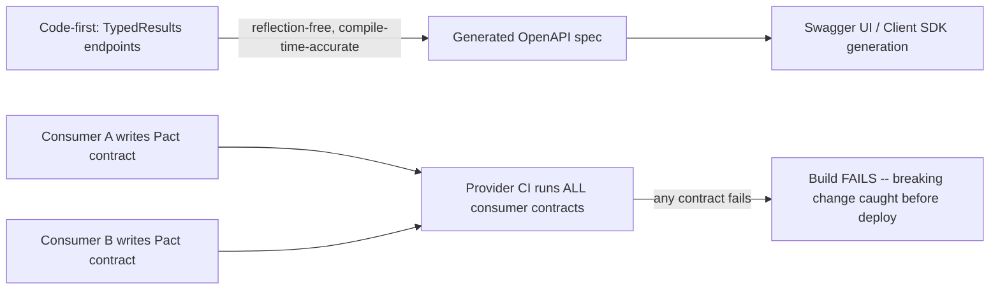

# Module 17 — REST APIs: API Documentation, Contract Testing & OpenAPI

> Domain: REST APIs | Level: Beginner → Expert | Prerequisite: [[01-REST-Design-Fundamentals]], [[../02-DotNet-AspNetCore/03-MinimalAPIs-vs-Controllers-ModelBinding]] §2.5 (`TypedResults`/OpenAPI metadata)

---

## 1. Fundamentals

### What is OpenAPI, and what is contract testing?
**OpenAPI** (formerly Swagger) is a machine-readable specification format describing an HTTP API's shape — every endpoint, parameter, request/response schema, and status code — enabling automatic client-SDK generation, interactive documentation (Swagger UI), and tooling-driven validation. **Contract testing** verifies that an API's *actual* behavior matches its *documented* contract (and, in consumer-driven variants, that it satisfies what its actual consumers specifically depend on) — catching drift between documentation and reality, and between a provider's changes and a consumer's expectations, before it reaches production.

### Why do these exist?
Without a machine-readable spec, API documentation is either absent or a hand-maintained document that inevitably drifts from the actual implementation (Module 11 §14's `[ProducesResponseType]` drift incident is exactly this problem). Contract testing exists because integration bugs between independently-deployed services (a classic microservices pain point, previewed here ahead of the dedicated Microservices module) are otherwise only caught by expensive, slow, flaky full end-to-end tests — or, worse, in production.

### When does this matter?
Every API with more than one consumer team benefits from OpenAPI-driven documentation; contract testing matters specifically once an API and its consumers are deployed **independently** (different release cadences) — the exact condition under which "it worked in the monolith" assumptions break down.

### How does it work (30,000-ft view)?
```csharp
builder.Services.AddEndpointsApiExplorer();
builder.Services.AddSwaggerGen();
// TypedResults-based endpoints (Module 11) auto-populate accurate OpenAPI metadata with no attributes needed.
app.MapGet("/orders/{id}", (string id) => TypedResults.Ok(new OrderDto(...)))
   .WithName("GetOrder")
   .Produces<OrderDto>(200)
   .Produces(404);
```

---

## 2. Deep Dive

### 2.1 Schema-First vs Code-First OpenAPI Generation
**Code-first** (the ASP.NET Core default): the OpenAPI spec is generated *from* the running application's actual endpoints/types — guarantees the spec can never drift from the code's actual shape (for `TypedResults`-based endpoints, Module 11 §2.5), but the spec is a downstream artifact, not a design document. **Schema-first**: the OpenAPI spec is authored *first* (often collaboratively, as an API design/contract-negotiation artifact) and the server implementation is generated or validated against it — better for API-design-led development and cross-team contract negotiation *before* implementation begins, at the cost of requiring discipline to keep the spec and implementation in sync (exactly the drift risk code-first avoids by construction).

### 2.2 Consumer-Driven Contract Testing (Pact-style)
Traditional (provider-driven) contract testing checks a provider against its *own* published spec. **Consumer-driven contract testing** (Pact being the dominant tool) inverts this: each **consumer** team writes a contract describing exactly what it actually depends on from the provider (specific fields, specific status codes for specific scenarios) — the provider then runs these consumer-authored contracts as tests against its own implementation in CI, failing the build if a change would break any real consumer's actual usage, **even for parts of the API the provider's own OpenAPI spec technically allows changing**. This is a materially stronger guarantee than schema validation alone: a provider can be fully OpenAPI-spec-compliant while still breaking a consumer that (perhaps unwisely, perhaps unavoidably) depends on an implementation detail the spec didn't explicitly promise.

### 2.3 Semantic Versioning for APIs and Breaking-Change Classification
Not every API change is "breaking" in the same sense as semver for libraries — **additive** changes (a new optional field, a new endpoint) are non-breaking for well-behaved consumers (that ignore unknown fields, per Postel's Law/robustness principle) but **can** break a consumer using strict, unknown-field-rejecting deserialization — meaning "breaking" is partly a property of consumer *behavior*, not just provider *changes*. Removing a field, changing a field's type, or changing a status code's meaning are unambiguously breaking regardless of consumer leniency.

### 2.4 API Design Review as a Governance Practice
Given how expensive breaking changes are to walk back once consumers integrate (Module 15 §Advanced Q3's deprecation-header strategy is the *mitigation*, not a substitute for getting the design right upfront), mature organizations run a **design review** *before* implementation — reviewing the proposed OpenAPI spec/schema against consistency conventions (naming, pagination style, error-shape conventions, Module 11 §13's shared error-response-shape pattern) across the whole API surface, catching inconsistency and design mistakes while they're still cheap (a spec edit) rather than expensive (a shipped, consumer-depended-upon behavior).

## 3. Visual Architecture


## 4. Production Example
**Scenario**: A provider team removed a field from a response DTO that their own OpenAPI spec marked as present in every documented example but not formally required in the schema (`required: []` omitted it) — schema validation passed (the field was technically optional per the spec), but a partner's consumer code deserialized it into a non-nullable property and crashed on every response, since it had always been present in practice and the consumer's team had never treated it as truly optional. **Investigation**: the provider's own contract tests (schema-only) passed; only the partner's own downstream monitoring caught the crash, hours after deployment. **Fix**: adopted consumer-driven contract testing — the partner's actual Pact contract (asserting the field's presence, since their integration genuinely depended on it) now runs in the provider's CI, so this exact class of change fails the *provider's own build* before deployment, not after. **Lesson**: schema compliance and "won't break real consumers" are different guarantees — a field being technically optional in a spec doesn't mean removing it is actually safe if every real consumer treats it as effectively required.

## 5. Best Practices
- Prefer code-first OpenAPI generation (`TypedResults`) to eliminate documentation drift by construction.
- Adopt consumer-driven contract testing for any API with external or cross-team consumers with independent deploy cadences.
- Run API design review before implementation for any new public/cross-team endpoint.
- Treat "is this change breaking" as a question about real consumer behavior, not just spec technicalities.

## 6. Anti-patterns
- Hand-maintained documentation (a wiki page, a Word doc) disconnected from the actual implementation — guaranteed to drift.
- Relying solely on provider-side schema validation as proof that a change is safe for consumers.
- Treating every field as effectively required in practice while marking it optional in the spec, then being surprised when removing it breaks consumers.

---

## 10. Interview Questions

### Basic (10)
1. **Q: What is OpenAPI?** **A:** A machine-readable specification format describing an HTTP API's endpoints, parameters, and schemas.
2. **Q: What's the difference between code-first and schema-first OpenAPI generation?** **A:** Code-first generates the spec from the running application's actual code; schema-first authors the spec first and implements/validates against it.
3. **Q: What does `TypedResults` provide for OpenAPI generation?** **A:** Compile-time-accurate metadata with no risk of drift between declared and actual return types.
4. **Q: What is contract testing?** **A:** Verifying that an API's actual behavior matches its documented contract (or its consumers' actual dependencies).
5. **Q: What is consumer-driven contract testing?** **A:** Each consumer writes a contract describing what it actually depends on; the provider runs all consumer contracts in its own CI.
6. **Q: Is adding a new optional field to a response always non-breaking?** **A:** Not necessarily — a consumer using strict, unknown-field-rejecting deserialization could still break, even though it's additive.
7. **Q: What is Pact?** **A:** The dominant tool for consumer-driven contract testing.
8. **Q: Why might a hand-maintained API documentation page become inaccurate over time?** **A:** Nothing mechanically ties it to the actual implementation, so it drifts as the code changes without corresponding doc updates.
9. **Q: Should an internal-only endpoint appear in a publicly-served OpenAPI spec?** **A:** No — it should be excluded from the public spec even if included in an internal development-tooling version.
10. **Q: What's the value of an API design review before implementation?** **A:** Catching design/consistency mistakes while they're still cheap to change (a spec edit), before consumers depend on the shipped behavior.

### Intermediate (10)
1. **Q: Why does code-first OpenAPI generation eliminate documentation drift "by construction"?** **A:** The spec is derived directly from the actual compiled types/return values (`TypedResults`) rather than a separately-maintained artifact, so it's structurally impossible for the two to diverge — unlike attribute-based (`[ProducesResponseType]`) generation, which can drift if the attribute isn't updated alongside the code.
2. **Q: Why is schema validation alone insufficient to guarantee a change won't break consumers, precisely?** **A:** A spec only encodes what the provider has formally promised; real consumers may depend on implementation details or "usually present" fields the spec marks as optional/unspecified — schema compliance says nothing about those actual, undocumented dependencies.
3. **Q: How does a provider run a consumer's Pact contract without needing the consumer's actual codebase?** **A:** The consumer publishes a Pact file (a serialized description of expected requests/responses) to a shared broker; the provider's CI pulls and replays those expectations against its own implementation, verifying compliance without needing to execute the consumer's code at all.
4. **Q: Why is "is this field required" partly a property of consumer behavior, not just the spec?** **A:** A field the spec marks optional can still be a de facto requirement if every real consumer's deserialization logic treats its absence as invalid/crashes — the spec's formal contract and consumers' actual tolerance can diverge.
5. **Q: What's the risk of skipping API design review for a "quick, internal-only" endpoint that later becomes externally consumed?** **A:** Design inconsistencies (naming, pagination, error shape) that would have been cheap to fix before any consumer existed become expensive, breaking changes once external consumers depend on the as-shipped behavior.
6. **Q: Why would a team choose schema-first generation despite its drift risk?** **A:** For genuine API-design-led development — negotiating the contract collaboratively with consumers *before* writing any implementation code, valuable when the API's shape is a cross-team design decision, not just an implementation detail.
7. **Q: What's a realistic reason an auto-generated public OpenAPI spec might need manual curation despite being code-first?** **A:** Excluding internal-only endpoints/fields (§8) that exist in the code but shouldn't be publicly documented — code-first generation by default reflects everything in the code, requiring an explicit filtering step for the public-facing spec.
8. **Q: How would you detect that a provider's planned change would break a specific real consumer, before deploying?** **A:** Run that consumer's Pact contract against the provider's updated implementation in CI — a failing contract test is the exact, targeted signal needed, catching it before deployment rather than via post-deployment monitoring.
9. **Q: Why is a full end-to-end test between two independently-deployed services often a poor substitute for contract testing?** **A:** It requires both services running simultaneously (slow, flaky, environment-dependent) and only tests the specific scenarios exercised, whereas a consumer-driven contract explicitly, narrowly documents exactly what that consumer depends on, runnable quickly and deterministically in the provider's own CI without needing the consumer's actual running instance.
10. **Q: What's the relationship between OpenAPI-based client SDK generation and contract testing?** **A:** Generated SDKs are only as trustworthy as the spec they're generated from — if the spec drifts from actual behavior (schema-only, no consumer-driven testing), a generated SDK can compile successfully against the spec while still breaking at runtime against the real, divergent implementation.

### Advanced (10)
1. **Q: Design a CI pipeline integrating consumer-driven contract testing into a provider's deployment process, including how a breaking change is caught before production impact.**
   **A:** Consumers publish Pact files to a shared broker on their own CI runs; the provider's CI, on every build, pulls all currently-published consumer contracts and replays them against the candidate build (a real, running instance of the provider, e.g., via `WebApplicationFactory`); any contract failure fails the provider's build, blocking deployment entirely — this converts "will this change break a real consumer" from a question answered by post-deployment monitoring/incident response into one answered deterministically, pre-deployment, in minutes.

2. **Q: Explain precisely why the field-removal incident (§4) passed schema validation but still broke a consumer, and design the fix.**
   **A:** The spec never formally declared the field `required`, so removing it was schema-compliant; the actual break was in the *consumer's* deserialization behavior treating it as effectively required — the fix is not "make the spec stricter" (the provider can't unilaterally know every consumer's actual tolerance) but adopting consumer-driven contracts specifically because they capture *actual* dependency behavior directly from the consumer, sidestepping the entire "is the spec strict enough" question.

3. **Q: How would you classify a specific proposed API change (e.g., changing a field's type from `int` to `string`) using semantic-versioning-for-APIs principles, and what would you require before shipping it?**
   **A:** A field type change is unambiguously breaking regardless of consumer leniency (unlike an additive field) — require either a new API version (Module 15 §2.4) preserving the old field's type for existing consumers, or a coordinated migration with all known consumers confirmed to have updated before the change ships to the old version's endpoint at all; never ship a type-changing modification silently to an existing, versioned endpoint.

4. **Q: Design an API design-review checklist enforcing consistency across a large, multi-team API surface.**
   **A:** Cover: consistent pluralization/naming conventions for resource collections; a single, shared pagination pattern (cursor vs. offset, chosen once organization-wide); a single, shared error-response shape (Module 11 §13's `IApiErrorResponseBuilder` pattern); consistent date/time and enum-serialization formats; and mandatory sign-off from a cross-team API-governance reviewer before any new public endpoint ships — directly mirroring this course's recurring shared-template governance pattern, applied here to API design consistency rather than middleware/DI configuration.

5. **Q: Explain a scenario where code-first OpenAPI generation, despite eliminating drift, still fails to serve as an adequate API design tool.**
   **A:** Code-first generation reflects whatever the implementation happens to produce — it can't proactively catch a design inconsistency (e.g., one endpoint using offset pagination while another uses cursor pagination) *before* implementation, since there's no spec to review until code already exists; this is exactly why schema-first (or a design review process operating on a draft spec) remains valuable specifically for the design-consistency concern code-first generation structurally cannot address.

6. **Q: How would you handle a genuinely necessary breaking change (e.g., a security-driven field removal) when a consumer-driven contract exists that depends on the field being removed?**
   **A:** Directly engage the specific consumer team (identifiable via the Pact broker's contract ownership metadata) to negotiate and coordinate the change — either the consumer updates its contract (and implementation) to no longer depend on the field, unblocking the provider's build, or the change ships as a new API version (Module 15) with a deprecation/sunset timeline for the old version, giving the consumer a migration window; a failing consumer contract should trigger a cross-team conversation, not be silently overridden/deleted from the test suite to unblock a deploy.

7. **Q: Explain why "the API is fully OpenAPI-spec-compliant" is an insufficient claim for a Principal Engineer to accept as proof that a change is safe.**
   **A:** Spec compliance only verifies the provider honors its own formal, documented promises — it says nothing about undocumented behaviors real consumers may have come to depend on (§4/Advanced Q2), nor about design-consistency concerns a spec review (not runtime compliance) is meant to catch — "spec-compliant" and "safe to ship" are related but distinct claims, and conflating them is exactly how incidents like §4 occur.

8. **Q: Design a strategy for introducing consumer-driven contract testing retroactively into an existing API with many established, but not yet contract-tested, consumers.**
   **A:** Prioritize onboarding the highest-risk/highest-traffic consumers first (whose breakage would have the largest business impact); for consumers who can't or won't adopt Pact directly, consider a "synthetic contract" approach — the provider team, in collaboration with the consumer, hand-writes a contract capturing the consumer's known actual usage patterns (from API-gateway traffic logs/schemas observed in practice) as an interim measure, upgrading to a true consumer-authored contract as that team's tooling maturity allows — an incremental, risk-prioritized rollout rather than an all-or-nothing mandate.

9. **Q: A team proposes skipping contract testing entirely in favor of "just communicating changes in a Slack channel before shipping." Evaluate this from a Principal Engineer's perspective.**
   **A:** Manual communication doesn't scale past a small number of consumers/changes, is not enforced by any automated gate (nothing prevents shipping despite the notice, or a consumer team missing the message), and provides no mechanically-verified guarantee — exactly the difference between a *process* (advisory, bypassable) and a *control* (automated, blocking); recommend contract testing as the enforced control, with communication as a valuable *complement* (context/rationale) rather than a substitute for it.

10. **Q: As a Principal Engineer, how would you decide whether a given API surface genuinely needs consumer-driven contract testing versus simpler, sufficient schema-based validation alone?** **A:** Weigh the number and independence of consumer teams (many independently-deployed consumers = higher value for consumer-driven contracts), the cost of a production break (a payments-adjacent API's incident cost justifies the investment far more than a low-stakes internal reporting endpoint), and the API's actual rate of change (a rapidly-evolving API accumulates more opportunities for the schema-vs-actual-usage gap than a stable, rarely-changed one) — recommend consumer-driven contracts specifically where this combination of factors indicates real, demonstrated risk, not as a blanket requirement for every internal API regardless of stakes.

---

## 11. Coding Exercises

### Easy — Code-first OpenAPI with `TypedResults` (no drift risk)
```csharp
app.MapGet("/orders/{id}", Results<Ok<OrderDto>, NotFound> (string id, IOrderRepository repo) =>
{
    var order = repo.GetById(id);
    return order is null ? TypedResults.NotFound() : TypedResults.Ok(new OrderDto(order));
})
.WithName("GetOrder")
.WithOpenApi();
// The Results<Ok<OrderDto>, NotFound> return type IS the OpenAPI metadata source -- no [ProducesResponseType] needed,
// and it's impossible for this declaration to drift from the method's actual possible return values.
```

### Medium — Exclude internal-only endpoints from the public spec
```csharp
app.MapGet("/internal/debug/cache-stats", GetCacheStats)
   .ExcludeFromDescription(); // never appears in the generated OpenAPI document at all
```

### Hard — A basic consumer-driven contract test (Pact-style, conceptual)
```csharp
// Consumer-side: defines the EXACT expectation this consumer depends on.
[Fact]
public async Task Consumer_Expects_Invoice_Amount_Field_Present()
{
    _pactBuilder
        .UponReceiving("a request for an invoice")
        .Given("invoice inv-123 exists")
        .WithRequest(HttpMethod.Get, "/invoices/inv-123")
        .WillRespond()
        .WithStatus(200)
        .WithJsonBody(new { id = "inv-123", amount = Match.Decimal(99.99m) }); // amount is asserted PRESENT

    await _pactBuilder.VerifyAsync(async ctx =>
    {
        var client = new InvoiceApiClient(ctx.MockServerUri);
        var invoice = await client.GetInvoiceAsync("inv-123");
        Assert.Equal(99.99m, invoice.Amount);
    });
}
// Provider-side CI: pulls this published contract and replays it against the REAL provider implementation --
// if the provider ever removes/renames "amount", THIS test fails the provider's own build.
```
**Discussion**: This is precisely the mechanism that would have caught §4's incident before deployment — the field-removal change would have failed this exact consumer-authored contract in the provider's CI, converting a production incident into a pre-deploy build failure.

### Expert — API design-review linting: enforce a shared pagination convention across an OpenAPI spec
```csharp
public class PaginationConventionAnalyzer
{
    // Conceptual: parse the generated OpenAPI document and flag any collection-returning endpoint
    // NOT using the organization's standard cursor-pagination parameter shape.
    public IEnumerable<string> FindViolations(OpenApiDocument spec)
    {
        foreach (var (path, item) in spec.Paths)
        {
            var getOp = item.Operations.GetValueOrDefault(OperationType.Get);
            if (getOp is null) continue;
            bool looksLikeCollection = getOp.Responses.TryGetValue("200", out var resp)
                && resp.Content.Values.Any(c => c.Schema.Type == "array");
            if (!looksLikeCollection) continue;

            bool hasCursorParam = getOp.Parameters.Any(p => p.Name == "cursor");
            bool hasOffsetParam = getOp.Parameters.Any(p => p.Name is "offset" or "page");
            if (hasOffsetParam && !hasCursorParam)
                yield return $"{path}: uses offset/page pagination instead of the standard 'cursor' convention.";
        }
    }
}
```
**Discussion**: Running this against the generated spec in CI operationalizes the Advanced Q4 design-review checklist as an automated, enforced check rather than a manual review step someone might skip — directly the same "codify hard-won governance lessons as tooling" pattern recurring throughout this course.

---

## 12–17. System Design / LLD / Debugging / Decision / Case Study / Principal

A large multi-team API platform (§4/§12) publishes code-first OpenAPI specs (zero-drift by construction), runs every external and cross-team consumer's Pact contract in the provider's CI as a required merge gate, and enforces design-consistency conventions (pagination, error shape, naming) via an automated spec-linting check (Expert exercise) rather than manual review alone. The production-debugging signature incident (§4) — a schema-compliant-but-consumer-breaking field removal — is diagnosed and prevented identically: adopt consumer-driven contracts so the *actual* dependency, not just the formal spec, gates every provider change. Principal-level guidance: "spec-compliant" and "safe to ship" are different claims — never let schema validation alone stand in for verified consumer compatibility on any API with independently-deployed consumers, and invest in consumer-driven contract testing proportional to the number of independent consumers and the cost of a production break.

## 18. Revision
**Key takeaways**: Code-first (`TypedResults`) OpenAPI generation eliminates documentation drift by construction; schema-first supports design-led collaboration at the cost of sync discipline. Consumer-driven contract testing (Pact) verifies actual consumer dependencies, a strictly stronger guarantee than schema compliance alone. "Breaking" is partly a property of consumer behavior, not just provider changes — an additive, spec-optional field can still break a real consumer. Design review + automated spec-linting (pagination/error-shape conventions) catches design inconsistency while it's still cheap to fix.

---

**Next**: This completes the `03-REST-APIs` domain (Modules 15–17). Continuing autonomously to `04-SQL-Server`.
