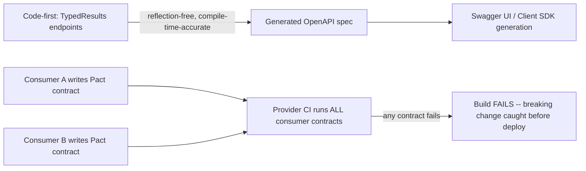
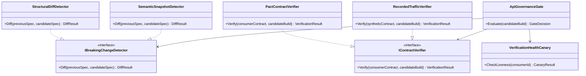
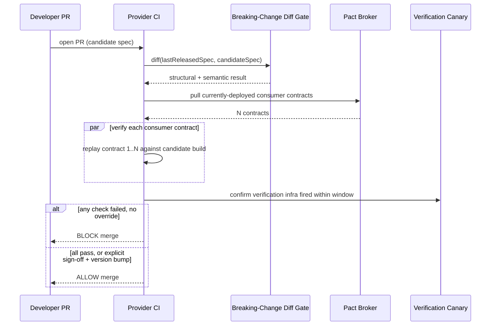

# Module 17 — REST APIs: API Documentation, Contract Testing & OpenAPI

> Domain: REST APIs | Level: Beginner → Expert | Prerequisite: [[01-REST-Design-Fundamentals]], [[../02-DotNet-AspNetCore/03-MinimalAPIs-vs-Controllers-ModelBinding]] (`TypedResults`/OpenAPI metadata)

---

## 1. Topic Description

### Definition

**API documentation** and **contract testing** are two views of the same artefact: a precise, machine-readable statement of what a provider promises. An **OpenAPI document** describes the contract's structure — paths, operations, schemas, status codes — and drives generated clients, mock servers, request validation, documentation sites, linting and, most valuably, **automated breaking-change detection**. **Contract testing** verifies that the promise is actually kept: consumer-driven contract testing has each consumer declare the subset of provider behaviour it depends on, verified against the provider independently, with a *can-I-deploy* gate turning those verification results into a deployment safety mechanism.

### Core sub-concepts

- **OpenAPI as a machine-readable contract** — the uses beyond documentation: generation, validation, linting, diffing.
- **Code-first versus design-first** — drift-free generation versus reviewable up-front design, and verifying a hand-written spec against the implementation.
- **Schema diffing and breaking-change classification** — what structural comparison can detect automatically.
- **Structural versus semantic compatibility** — a field whose *meaning* changes passes every schema check and breaks every consumer.
- **Compatibility modes** — backward, forward and full; why event schemas need stricter guarantees than request/response APIs.
- **Consumer-driven contract testing** — consumer expectations, independent provider verification, a broker, and why contracts must assert only what the consumer actually uses.
- **The can-I-deploy gate** — compatibility checked against the versions currently running in the target environment.
- **Contract tests versus integration tests** — pairwise compatibility, cheap and deterministic, versus composed-system behaviour, slow and shared.
- **Mock servers from specs** — removing cross-team sequencing dependencies, and why they validate shape but not behaviour.
- **SDK generation** — typed clients and consistency versus multi-language ownership and regeneration coupling.
- **Documentation beyond schema** — workflows, error semantics and remediation, rate limits, idempotency and retry guidance, versioning and deprecation policy.
- **Example rot** — generating examples from test fixtures and validating documented examples in CI.
- **Usage telemetry per field and per client** — the data that makes deprecation and version retirement tractable.
- **Third-party providers** — anti-corruption layers, drift detection, and designing for contracts that change without notice.

### Where it fits

The contract sits between the resource design decisions of the API itself and every consumer that integrates with it, and it is produced by the same pipeline that deploys the service. In a system with many services it *is* the integration surface: contract verification in a producer's pipeline replaces integration failures discovered days later in a shared environment. It also feeds directly into versioning and deprecation, because you cannot retire what you cannot prove is unused.

### Why it matters at scale

The economics are stark: an integration failure found in a provider's CI costs minutes, and the same failure found in a shared environment or in production costs days and involves several teams. Without a breaking-change gate, contract discipline depends on a reviewer noticing that a field was renamed — which fails reliably. Without usage telemetry or consumer contracts, every deprecation stalls at "someone might still be using it", so organisations accumulate API versions they support indefinitely. And a spec maintained by hand in a separate repository is drifted within a quarter, at which point it is *worse* than having none, because consumers write code against it in good faith.

### Common pitfalls / anti-patterns

- **A hand-maintained spec that has drifted from the implementation** — actively misleading, because consumers integrate against a contract the service does not honour.
- **Treating a passing schema diff as proof of compatibility** — a field renamed from "gross" to "net" semantics keeps its name and type, so every automated check passes and every consumer is now wrong.
- **Contract tests that assert on the entire response** — they fail whenever the provider adds anything, so teams learn to regenerate them reflexively and the signal is lost.
- **Contract verification with no deploy gate** — the tests report a problem after you have already shipped it; the gate is what makes the practice a safety mechanism rather than decoration.
- **An extensive end-to-end suite standing in for contract testing** — slow, flaky, blames the wrong team, and requires everything deployed together, quietly reintroducing the coupling microservices were meant to remove.
- **Hand-written documentation examples** — unverified prose rots silently, and a wrong example is worse than none because consumers copy it.
- **Documenting types but not error semantics** — error handling is the part most likely to be wrong in an integration and the least likely to be exercised, so undocumented error responses get handled by guesswork.
- **Regenerating SDKs on every release** — forces consumers into lockstep upgrades and makes every provider change a client-side event.

> Scope note: resource modelling, versioning strategy and error contract design belong to `01-REST-Design-Fundamentals`; authentication, authorization and throttling to `02-API-Security-Rate-Limiting`. Broader test strategy, pyramid shape and flakiness management live in `26-CICD/02-TestAutomationStrategy-Pyramid-Flakiness-Coverage-Quality-Gates`.

---

## 2. Beginner (10 Q&A)


**Q1. What does an OpenAPI document actually give you beyond human-readable documentation?**
**A:** It is machine-readable, so it drives generated clients and server stubs, mock servers, request validation, documentation sites, linting against a style guide, and automated breaking-change detection between versions. That last one is the highest-value use and the most often neglected: with a spec in CI you can compare the proposed contract against the deployed one and fail the build on a breaking change, which turns contract discipline from a review responsibility into a build outcome. Documentation is the least interesting thing a spec is for.
*Follow-up: What kinds of breaking change can a schema diff detect, and what can it never detect?*

**Q2. Code-first versus design-first — what's the trade-off?**
**A:** Code-first generates the spec from the implementation, so it never drifts and costs nothing to maintain, but the design happens implicitly and the resulting API tends to mirror internal models. Design-first writes the spec first and reviews it before implementation, which produces better-considered APIs and lets consumers start work in parallel, at the cost of a spec that can drift from reality unless something verifies it. My usual position is design-first for public or cross-team APIs where the contract deserves real review, code-first for internal ones where speed matters — with the essential addition, in the design-first case, of a test that verifies the implementation matches the spec.
*Follow-up: How do you verify that a hand-written spec matches the running implementation?*

**Q3. What is consumer-driven contract testing and how does it differ from integration testing?**
**A:** In consumer-driven contract testing, each consumer declares the subset of the provider's behaviour it actually depends on, and those expectations are verified against the provider independently — the consumer runs against a mock built from its own expectations, and the provider runs those expectations against itself. It differs from integration testing in that the two sides never need to be running at the same time, so tests are fast and deterministic, and in that it tests only what consumers actually use rather than everything the provider offers. It answers a different question: not "does the system work" but "is this change safe for my known consumers."
*Follow-up: What does contract testing not catch that integration testing does?*

**Q4. What is a "can I deploy" check?**
**A:** A gate in the deployment pipeline that asks whether the version about to be deployed is compatible with the versions of its consumers or providers currently in the target environment, based on recorded contract verification results. It is what turns contract testing from a set of tests into an actual safety mechanism, because it prevents deploying a provider whose change breaks a consumer that is still running. Without it, contract tests tell you about a problem after you have caused it.
*Follow-up: A consumer hasn't verified against your latest contract. Should the deploy proceed?*

**Q5. Why do documentation examples rot, and what can you do about it?**
**A:** Because they are prose maintained separately from the code, so nothing fails when they become wrong — and a wrong example is worse than no example, since consumers copy it. The mitigations are generating examples from real test fixtures so they cannot diverge, validating documented examples against the schema in CI, and preferring generated request/response samples from actual test runs. Anything hand-written and unverified should be treated as decaying from the day it is written.
*Follow-up: How would you generate documentation examples from tests without exposing real data?*

**Q6. What should API documentation contain beyond the schema?**
**A:** The things a schema cannot express: what the operation actually does, the sequence of calls for common workflows, error conditions and what a client should do about each, rate limits and quotas, pagination behaviour, idempotency and retry guidance, authentication setup, and the versioning and deprecation policy. Schemas tell you the shape; documentation must tell you the semantics and the operational contract. In my experience the sections consumers actually need most — error handling and retry guidance — are the ones most often missing.
*Follow-up: Where should that narrative content live so it stays current?*

**Q7. What does generating SDKs buy you, and what does it cost?**
**A:** It buys consumers a typed, idiomatic client with less integration effort and fewer mistakes, and it buys you consistency in how clients call you. The cost is a coupling: you now own client libraries in several languages, with their own release cycles, bugs and support burden, and consumers who use a generated SDK are affected by every regeneration. Generated SDKs can also produce awkward code from an awkward spec, which pushes you toward better API design — a genuine side benefit. I would generate SDKs for public APIs with many consumers, and skip them for internal APIs where a spec-driven HTTP call is fine.
*Follow-up: A generated SDK for one language is unusable idiomatically. Do you hand-write it?*

**Q8. What is schema compatibility, and what are the standard modes?**
**A:** Backward compatible means new consumers can read data produced by old producers; forward compatible means old consumers can read data from new producers; full means both. For a request/response API the direction that matters most is that existing consumers keep working against a new provider — so adding optional fields is safe, removing or renaming is not. The reason to name the modes explicitly is that different parts of a system need different guarantees: an event stream with long-retained history usually needs full compatibility, while a synchronous API often only needs the provider-forward direction.
*Follow-up: Why do event schemas typically need stricter compatibility than API schemas?*

**Q9. What's the value of a mock server generated from the spec?**
**A:** It lets consumers develop and test against a realistic implementation before the provider exists, which removes the sequencing dependency that otherwise makes cross-team work serial. It also gives a stable target for consumer tests that does not require running the provider. Its limitation is that it only reflects the spec, so it validates shape and not behaviour — a consumer that passes against the mock can still fail against reality if the spec is incomplete, which is exactly why mocks must be paired with contract verification against the real provider.
*Follow-up: A consumer's tests pass against the mock and fail in production. What was missing?*

**Q10. Who is the audience for API documentation, and why does that matter?**
**A:** Usually three distinct audiences: an integrator evaluating whether the API can do what they need, a developer implementing against it, and an operator debugging a failure in production. They need different things — capability overview, precise reference and workflow guidance, and error semantics and support paths respectively. Documentation written for only one of them fails the others, and the operator's needs are the ones most commonly ignored, which is why error codes are so often undocumented. Naming the audiences explicitly is what makes documentation a design task rather than a chore.
*Follow-up: How do you know whether your documentation is actually working?*

---

## 3. Intermediate (10 Q&A)


**Q1. How do you stop a spec from drifting away from the implementation?**
**A:** Make drift a build failure rather than a review responsibility. If code-first, the spec is generated so drift is impossible by construction; if design-first, add a test that exercises the implementation against the spec — validating requests and responses at runtime in the test environment — so a mismatch fails CI. Publishing the spec as a build artefact from the same pipeline that deploys the code keeps them versioned together. The pattern to avoid is a spec in a separate repository updated by hand, which is drifted within a quarter and then actively misleading.
*Follow-up: Runtime response validation catches drift but adds overhead. Where would you run it?*

**Q2. How would you introduce contract testing to an organisation that only has end-to-end tests?**
**A:** Start with one high-value provider-consumer pair, ideally one that has recently caused an integration incident, so the value is concrete rather than theoretical. Get the consumer to express what it actually depends on, verify it against the provider in the provider's pipeline, and wire up a deploy check — that end-to-end loop is what makes the practice real; contract tests without a deploy gate are just extra tests. Then expand to the pairs with the most coupling. I would explicitly not attempt a big-bang rollout, because the practice requires both teams to change how they work and that adoption is social as much as technical.
*Follow-up: The provider team sees contract tests as the consumer team's problem. How do you handle that?*

**Q3. What does a schema check miss, and how do you cover those cases?**
**A:** Semantics. A field that changes from "gross amount" to "net amount" keeps the same name and type, so every schema check passes and every consumer is now wrong — that class of change is invisible to structural tooling and is one of the more damaging things an API can do. So can changes in null-handling conventions, in default behaviour when a field is absent, in enum value meaning, or in ordering guarantees. Covering them requires consumer-driven expectations that assert on *behaviour* with realistic values, plus a review discipline that treats semantic change as breaking even when the schema is unchanged, and a version bump when it happens.
*Follow-up: How would you make a semantic change safely, given no tool will flag it?*

**Q4. How do you decide what belongs in a consumer contract?**
**A:** Only what the consumer genuinely depends on — the fields it reads, the status codes it branches on, the error shapes it handles. Contracts that assert on the entire response are brittle and defeat the purpose, because they fail whenever the provider adds anything, which trains everyone to ignore them. The discipline is to write the contract from the consumer's parsing code, not from the provider's documentation. This also produces a useful by-product: the union of all consumer contracts tells the provider exactly which parts of the API are actually used, which is the data you need to retire fields safely.
*Follow-up: How would you use contract data to safely remove a field?*

**Q5. How do you version and publish specs so consumers can rely on them?**
**A:** Publish every version as an immutable artefact in a registry alongside the deployment, with the version tied to the deployed service version — so a consumer can always fetch the exact contract a given environment is running, which is the question that actually comes up during an incident. Keep the history so diffs can be computed and so a consumer can see what changed. I would also publish a machine-readable deprecation and support status per version, since consumers need to plan and the information otherwise lives in someone's head.
*Follow-up: How would a consumer discover, automatically, that a field they use is deprecated?*

**Q6. What's the right relationship between contract tests and integration tests?**
**A:** Complementary, with contract tests carrying most of the load. Contract tests verify pairwise compatibility cheaply, deterministically and without a shared environment, so they should cover the vast majority of integration risk. A small number of end-to-end tests then verify that the composed system does what the business needs — genuinely different questions such as whether a multi-service workflow completes. The anti-pattern is an extensive end-to-end suite standing in for contract testing: it is slow, flaky, blames the wrong team when it fails, and requires everything deployed together, which quietly reintroduces the coupling microservices were meant to remove.
*Follow-up: Your end-to-end suite takes two hours and is 15% flaky. What do you do with it?*

**Q7. How do you handle contract testing when the provider is a third party you don't control?**
**A:** You cannot verify against them, so the goal shifts to detecting change rather than preventing it. That means recording your expectations of their behaviour as tests against a recorded or mocked version, running periodic verification against their sandbox or with synthetic traffic against production, and monitoring for schema drift in real responses. The important architectural response is an anti-corruption layer so their contract changes are absorbed in one place rather than propagating through your domain. I would also design for their contract being wrong or changing without notice, since that is the normal case with third parties.
*Follow-up: The third party changes behaviour with no notice and your monitoring catches it. What's the containment?*

**Q8. How would you catch a breaking change in CI?**
**A:** Generate the spec on every build, fetch the currently-deployed spec, diff them with a tool that classifies changes by compatibility, and fail on anything breaking unless an explicit override with a version bump is present. That gate is the single highest-value piece of API tooling most organisations lack. I would pair it with a linter enforcing the style guide so consistency is also mechanical. The important design detail is the override path: it must exist, because intentional breaking changes happen, but it must be explicit and visible in the diff rather than a flag someone can quietly set.
*Follow-up: A team overrides the gate every sprint. What does that tell you?*

**Q9. How do you document and test error behaviour specifically?**
**A:** Enumerate the error conditions as part of the contract — status code, machine-readable code, when it occurs, and what the client should do — and test them the same way you test the happy path, including in consumer contracts. Error handling is the part of an integration most likely to be wrong and least likely to be exercised, because it is hard to trigger from the consumer's side. Contract testing is particularly valuable here since the consumer can assert on error shapes without needing to make the provider fail. I would treat an undocumented error response as a defect, because clients will encounter it and handle it by guessing.
*Follow-up: How do you get a provider to reliably produce a specific error for a consumer test?*

**Q10. What are the failure modes of contract testing as a practice?**
**A:** Contracts that assert too much and become change-blocking noise; contracts nobody updates so they verify a consumer's behaviour from a year ago; verification results not gating deployment, so the tests are decorative; and a broker that becomes a single point of failure or an unowned piece of infrastructure. There is also a social failure mode where the practice becomes a compliance exercise rather than a communication tool — the real value is that a provider can see who depends on what, and that value evaporates if contracts are generated mechanically without thought. I would monitor whether contract failures actually change behaviour, because that is the only evidence the practice is working.
*Follow-up: Contract tests fail on a provider PR and the team just regenerates the contract. How do you fix that?*

---

## 4. Expert / Architect (10 Q&A)


**Q1. How would you design the contract governance for an organisation with a hundred services?**
**A:** Make the contract a first-class, versioned, published artefact of every service, produced by the pipeline rather than by hand, stored in a registry that anyone can query. On top of that, automated gates — style linting, breaking-change detection, and a deploy check against recorded consumer verifications — so compatibility is enforced by the pipeline rather than by coordination. The organisational piece is ownership: each API has a named owner accountable for its contract and its deprecations, and the registry makes the dependency graph visible so ownership questions are answerable. Governance that depends on a central review board reviewing every change does not scale and gets bypassed.
*Follow-up: The registry shows a service with 40 consumers and no owner. What do you do?*

**Q2. How do you use contract data to make retiring an API version tractable?**
**A:** The blocker on retirement is almost always not knowing who uses what, so instrument at the field and endpoint level and correlate with client identity — then a deprecation becomes a concrete list of named consumers rather than an open-ended risk. Consumer contracts give you the same information declaratively for the consumers that participate. With that data you can deprecate precisely: notify exactly the affected teams, track migration progress as a number, and set a credible cutover date. Without it, every retirement stalls at "someone might still be using it," which is how organisations end up supporting six versions forever.
*Follow-up: Usage telemetry shows a field used once a month by an unidentified client. How do you proceed?*

**Q3. How do documentation and contract practices differ for a public API versus internal ones?**
**A:** For a public API the documentation *is* the product experience — it needs a getting-started path, working examples, SDKs, a sandbox, and a changelog, because you cannot ask a consumer a question and they will leave if integration is hard. Contract stability must be near-absolute with long deprecation windows. Internally, you can rely on conversation and coordinated change, so documentation can be thinner and contract evolution faster — the investment should go into automated verification rather than into prose. Applying public-API rigour internally wastes effort; applying internal informality to a public API produces support load and churn. I would classify each API explicitly and attach the appropriate standard.
*Follow-up: An internal API is about to be exposed to partners. What has to change first?*

**Q4. What's your position on API design review as an organisational practice?**
**A:** Valuable if it happens before implementation and focuses on the consumer's experience and the contract's evolvability, rather than on style — style should be automated. The review should ask: who consumes this, what does their code look like, what happens when this changes, and what happens when it fails. Reviewing after implementation is largely theatre, because the cost of change is already sunk. To keep it from becoming a bottleneck I would scope it to new APIs and significant changes, timebox it, and delegate to a rotating group of senior engineers rather than a permanent board — the goal is spreading design judgement, not centralising approval.
*Follow-up: How do you handle a design review where the team disagrees with the reviewers and has a deadline?*

**Q5. How would you evaluate moving from hand-written specs to spec-driven code generation?**
**A:** By what it eliminates and what it constrains. Generating server stubs and models from the spec removes drift and makes the contract genuinely authoritative, which is a real gain; the constraint is that the generator's output shapes your code, and anything it does not support becomes a fight. I would evaluate against real cases from the existing API — the awkward endpoints, the polymorphic payloads, the streaming responses — rather than a simple one, since generators are all fine on simple cases. I would also weigh the toolchain ownership cost, because a code generator becomes a critical build dependency the team must maintain and upgrade.
*Follow-up: The generator can't express one important endpoint. Do you abandon it, or special-case that endpoint?*

**Q6. How do contract and documentation practices change for event-driven interfaces?**
**A:** The contract becomes the event schema, and compatibility requirements get stricter: events are persisted and may be replayed by consumers you cannot coordinate with, sometimes long after publication, so full compatibility and a schema registry with enforced rules become necessary rather than optional. Documentation must cover semantics that have no HTTP analogue — ordering guarantees, delivery semantics, idempotency expectations, and what a consumer should do with an event type it does not recognise. The failure mode specific to events is that a producer cannot see its consumers at all, so registry-enforced compatibility rules do the job that a deploy gate does for APIs. Consumer-driven contracts apply here too and are arguably more valuable.
*Follow-up: You need to remove a field from an event that has three years of retained history. How?*

**Q7. How would you handle contract verification in a system where consumers deploy independently and frequently?**
**A:** The deploy gate has to be the mechanism, because with independent deployment there is no moment when everything is consistent — you need a way to ask, at deploy time, whether this exact version is compatible with what is currently running in the target environment. That requires recording verification results per version pair and per environment. It also requires providers to remain compatible with the *set* of consumer versions in flight, not just the latest, which in practice means additive change and a real deprecation process. I would treat the ability to answer "is this deploy safe" automatically as the defining capability of a mature independent-deployment setup, more than any test-suite property.
*Follow-up: The gate says a deploy is unsafe but the change is an urgent security fix. What's the process?*

**Q8. What signals tell you an organisation's contract practice is failing, even if the tooling is in place?**
**A:** Integration failures still found in shared environments; teams coordinating releases for changes that should be independent; contracts regenerated rather than discussed when they fail; a growing number of supported API versions with no retirements; and documentation nobody reads because everyone asks in chat instead. Each of those indicates that the tooling exists but the practice it was meant to enable does not. The most telling single signal is whether a provider team can name their consumers — if they cannot, no amount of tooling is producing the intended awareness, and the contract discipline is nominal.
*Follow-up: Providers can't name their consumers. What's the fastest way to change that?*

**Q9. How do you balance the cost of contract infrastructure against its benefit for a small organisation?**
**A:** Scale it to the actual coupling. With five services and one team, contract testing infrastructure is overhead — a generated spec, a breaking-change check in CI, and good integration tests cover the risk at a fraction of the cost. The investment becomes worthwhile when teams deploy independently, when consumers are outside your control, or when integration failures are a recurring cost you can point at. I would introduce the spec-and-diff gate early because it is cheap and high-value, and defer the full consumer-driven broker until there is evidence of need. Recommending the maximal practice regardless of context is a common and expensive form of advice.
*Follow-up: At what specific point would you say the broker is now justified?*

**Q10. If you could enforce only one contract-related practice across an organisation, what would it be, and why?**
**A:** Automated breaking-change detection on every API's spec in CI, gated to fail the build. It is cheap, requires no coordination between teams, catches the highest-severity class of integration failure at the earliest possible moment, and it forces the spec to exist and stay accurate as a side effect. Consumer-driven contract testing is more powerful but requires both sides to invest and to change how they work, so adoption is slow and partial; the diff gate works unilaterally from day one. If that single gate is in place, most catastrophic contract failures become impossible, and the remaining ones are semantic changes that need human judgement anyway.
*Follow-up: How do you handle the first team that says the gate is blocking a legitimate change?*

---

## 5. Reference Material

> Retained from the original module: deep-dive internals, diagrams, production examples, exercises, system/low-level design, debugging walkthroughs and the Principal Engineer perspective.

### 1. Fundamentals

#### What is OpenAPI, and what is contract testing?
**OpenAPI** (formerly Swagger) is a machine-readable specification format describing an HTTP API's shape — every endpoint, parameter, request/response schema, and status code — enabling automatic client-SDK generation, interactive documentation (Swagger UI), and tooling-driven validation. **Contract testing** verifies that an API's *actual* behavior matches its *documented* contract (and, in consumer-driven variants, that it satisfies what its actual consumers specifically depend on) — catching drift between documentation and reality, and between a provider's changes and a consumer's expectations, before it reaches production.

#### Why do these exist?
Without a machine-readable spec, API documentation is either absent or a hand-maintained document that inevitably drifts from the actual implementation (the `[ProducesResponseType]` drift incident is exactly this problem). Contract testing exists because integration bugs between independently-deployed services (a classic microservices pain point, previewed here ahead of the dedicated Microservices module) are otherwise only caught by expensive, slow, flaky full end-to-end tests — or, worse, in production.

#### When does this matter?
Every API with more than one consumer team benefits from OpenAPI-driven documentation; contract testing matters specifically once an API and its consumers are deployed **independently** (different release cadences) — the exact condition under which "it worked in the monolith" assumptions break down.

#### How does it work (30,000-ft view)?
```csharp
builder.Services.AddEndpointsApiExplorer;
builder.Services.AddSwaggerGen;
// TypedResults-based endpoints auto-populate accurate OpenAPI metadata with no attributes needed.
app.MapGet("/orders/{id}", (string id) => TypedResults.Ok(new OrderDto(...)))
.WithName("GetOrder")
.Produces<OrderDto>(200)
.Produces(404);
```

### 2. Deep Dive

#### 2.1 Schema-First vs Code-First OpenAPI Generation
**Code-first** (the ASP.NET Core default): the OpenAPI spec is generated *from* the running application's actual endpoints/types — guarantees the spec can never drift from the code's actual shape (for `TypedResults`-based endpoints), but the spec is a downstream artifact, not a design document. **Schema-first**: the OpenAPI spec is authored *first* (often collaboratively, as an API design/contract-negotiation artifact) and the server implementation is generated or validated against it — better for API-design-led development and cross-team contract negotiation *before* implementation begins, at the cost of requiring discipline to keep the spec and implementation in sync (exactly the drift risk code-first avoids by construction).

#### 2.2 Consumer-Driven Contract Testing (Pact-style)
Traditional (provider-driven) contract testing checks a provider against its *own* published spec. **Consumer-driven contract testing** (Pact being the dominant tool) inverts this: each **consumer** team writes a contract describing exactly what it actually depends on from the provider (specific fields, specific status codes for specific scenarios) — the provider then runs these consumer-authored contracts as tests against its own implementation in CI, failing the build if a change would break any real consumer's actual usage, **even for parts of the API the provider's own OpenAPI spec technically allows changing**. This is a materially stronger guarantee than schema validation alone: a provider can be fully OpenAPI-spec-compliant while still breaking a consumer that (perhaps unwisely, perhaps unavoidably) depends on an implementation detail the spec didn't explicitly promise.

#### 2.3 Semantic Versioning for APIs and Breaking-Change Classification
Not every API change is "breaking" in the same sense as semver for libraries — **additive** changes (a new optional field, a new endpoint) are non-breaking for well-behaved consumers (that ignore unknown fields, per Postel's Law/robustness principle) but **can** break a consumer using strict, unknown-field-rejecting deserialization — meaning "breaking" is partly a property of consumer *behavior*, not just provider *changes*. Removing a field, changing a field's type, or changing a status code's meaning are unambiguously breaking regardless of consumer leniency.

#### 2.4 API Design Review as a Governance Practice
Given how expensive breaking changes are to walk back once consumers integrate (§Advanced Q3's deprecation-header strategy is the *mitigation*, not a substitute for getting the design right upfront), mature organizations run a **design review** *before* implementation — reviewing the proposed OpenAPI spec/schema against consistency conventions (naming, pagination style, error-shape conventions, the shared error-response-shape pattern) across the whole API surface, catching inconsistency and design mistakes while they're still cheap (a spec edit) rather than expensive (a shipped, consumer-depended-upon behavior).

### 3. Visual Architecture

```mermaid
graph LR
 A[Code-first: TypedResults endpoints] -->|reflection-free, compile-time-accurate| B[Generated OpenAPI spec]
 B --> C[Swagger UI / Client SDK generation]
 D[Consumer A writes Pact contract] --> E[Provider CI runs ALL consumer contracts]
 F[Consumer B writes Pact contract] --> E
 E -->|any contract fails| G[Build FAILS -- breaking change caught before deploy]
```

### 4. Production Example
**Scenario**: A provider team removed a field from a response DTO that their own OpenAPI spec marked as present in every documented example but not formally required in the schema (`required: []` omitted it) — schema validation passed (the field was technically optional per the spec), but a partner's consumer code deserialized it into a non-nullable property and crashed on every response, since it had always been present in practice and the consumer's team had never treated it as truly optional. **Investigation**: the provider's own contract tests (schema-only) passed; only the partner's own downstream monitoring caught the crash, hours after deployment. **Fix**: adopted consumer-driven contract testing — the partner's actual Pact contract (asserting the field's presence, since their integration genuinely depended on it) now runs in the provider's CI, so this exact class of change fails the *provider's own build* before deployment, not after. **Lesson**: schema compliance and "won't break real consumers" are different guarantees — a field being technically optional in a spec doesn't mean removing it is actually safe if every real consumer treats it as effectively required.

### 11. Coding Exercises

#### Easy — Code-first OpenAPI with `TypedResults` (no drift risk)
```csharp
app.MapGet("/orders/{id}", Results<Ok<OrderDto>, NotFound> (string id, IOrderRepository repo) =>
    {
        var order = repo.GetById(id);
        return order is null? TypedResults.NotFound: TypedResults.Ok(new OrderDto(order));
})
.WithName("GetOrder")
.WithOpenApi;
// The Results<Ok<OrderDto>, NotFound> return type IS the OpenAPI metadata source -- no [ProducesResponseType] needed
// and it's impossible for this declaration to drift from the method's actual possible return values.
```

#### Medium — Exclude internal-only endpoints from the public spec
```csharp
app.MapGet("/internal/debug/cache-stats", GetCacheStats)
.ExcludeFromDescription; // never appears in the generated OpenAPI document at all
```

#### Hard — A basic consumer-driven contract test (Pact-style, conceptual)
```csharp
// Consumer-side: defines the EXACT expectation this consumer depends on.
[Fact]
public async Task Consumer_Expects_Invoice_Amount_Field_Present
{
    _pactBuilder
    .UponReceiving("a request for an invoice")
    .Given("invoice inv-123 exists")
    .WithRequest(HttpMethod.Get, "/invoices/inv-123")
    .WillRespond
    .WithStatus(200)
    .WithJsonBody(new { id = "inv-123", amount = Match.Decimal(99.99m) }); // amount is asserted PRESENT

    await _pactBuilder.VerifyAsync(async ctx =>
        {
            var client = new InvoiceApiClient(ctx.MockServerUri);
            var invoice = await client.GetInvoiceAsync("inv-123");
            Assert.Equal(99.99m, invoice.Amount);
    });
}
// Provider-side CI: pulls this published contract and replays it against the REAL provider implementation --
// if the provider ever removes/renames "amount", THIS test fails the provider's own build.
```
**Discussion**: This is precisely the mechanism that would have caught the incident before deployment — the field-removal change would have failed this exact consumer-authored contract in the provider's CI, converting a production incident into a pre-deploy build failure.

#### Expert — API design-review linting: enforce a shared pagination convention across an OpenAPI spec
```csharp
public class PaginationConventionAnalyzer
{
    // Conceptual: parse the generated OpenAPI document and flag any collection-returning endpoint
    // NOT using the organization's standard cursor-pagination parameter shape.
    public IEnumerable<string> FindViolations(OpenApiDocument spec)
    {
        foreach (var (path, item) in spec.Paths)
        {
            var getOp = item.Operations.GetValueOrDefault(OperationType.Get);
            if (getOp is null) continue;
            bool looksLikeCollection = getOp.Responses.TryGetValue("200", out var resp)
            && resp.Content.Values.Any(c => c.Schema.Type == "array");
            if (!looksLikeCollection) continue;

            bool hasCursorParam = getOp.Parameters.Any(p => p.Name == "cursor");
            bool hasOffsetParam = getOp.Parameters.Any(p => p.Name is "offset" or "page");
            if (hasOffsetParam &&!hasCursorParam)
                yield return $"{path}: uses offset/page pagination instead of the standard 'cursor' convention.";
        }
    }
}
```
**Discussion**: Running this against the generated spec in CI operationalizes the Advanced Q4 design-review checklist as an automated, enforced check rather than a manual review step someone might skip — directly the same "codify hard-won governance lessons as tooling" pattern recurring throughout this course.

### 12. System Design

**Scenario:** Design the API-governance and contract-testing platform for a payments provider exposing settlement-status and invoice APIs to ~40 internal consumer services and a handful of external bank/merchant integrators.

**Functional requirements**
- Every provider service publishes a code-first OpenAPI spec on every build.
- Every internal consumer publishes a Pact contract describing its actual dependency; the provider's CI verifies all currently-deployed consumer contracts before deploy.
- External integrators (who won't publish Pacts) are protected via an automated OpenAPI breaking-change diff gate plus recorded-traffic synthetic contracts.
- A public-facing, curated spec is served separately from the complete internal spec, with internal-only endpoints/fields excluded.

**Non-functional requirements**
- Contract-verification CI step stays under a fixed wall-clock budget (e.g., 3 minutes) regardless of consumer-count growth, via parallelization and currently-deployed-only verification (§7).
- No breaking change can merge to a supported API version without either passing every gate or receiving an explicit, logged senior sign-off plus a version bump.
- Verification infrastructure health (webhook liveness, last-successful-run staleness) is itself monitored, not merely assumed working (Expert Q4).

**Back-of-the-envelope estimation:** 40 consumers × ~1 deploy/day each ≈ 40 contract-verification triggers/day against the provider; at ~2 seconds per consumer-contract replay run in parallel, verifying all 40 concurrently costs ~2-4 seconds wall-clock, not 80 seconds — parallelization is the difference between an acceptable and unacceptable CI gate at this scale. What this arithmetic tells you: the N×M matrix (§9) is manageable at 40 consumers with parallelization, but the same sequential approach would already be a bottleneck; **design for parallel verification from day one**, not as a later optimization.

**Components:**
- **Spec Registry** — stores each service's generated OpenAPI document per build; source of truth for the breaking-change diff gate.
- **Pact Broker** — stores consumer-published contracts, tracks deployed/released versions per environment, exposes the "can-i-deploy" compatibility matrix query.
- **Breaking-Change Diff Gate** — CI step running oasdiff/openapi-diff against the last released spec of each supported version; blocks merge on a breaking classification without sign-off.
- **Semantic Snapshot Checker** — asserts money-representation (scale, rounding), status/decline-code taxonomy, and date/time format haven't silently changed meaning (Expert Q2), since structural diffing alone misses these.
- **Recorded-Traffic Synthesizer** — derives characterization tests from real integrator gateway-log traffic for external consumers who won't publish Pacts (Advanced Q8).
- **Verification-Health Canary** — publishes a scheduled synthetic contract change and asserts the corresponding verification run actually executes within an expected window (Expert Q4).
- **Public Spec Curator** — a `DocumentFilter`-based pipeline step stripping internal-only paths/fields before publishing the externally-served spec.

**Database selection:** The Pact Broker's own backing store (Postgres, in the standard OSS/PactFlow deployment) — a relational store is the right choice here for the same reason the payment-system reference article prefers boring ACID relational storage generally: contract/version relationships are highly relational (many-to-many between consumers, providers, and versions), and the workload is low-volume, high-integrity metadata, not a high-throughput data path.

**Caching:** Generated OpenAPI documents are cached post-generation until the next deploy invalidates them; contract-verification results for an already-verified (consumer-version, provider-version) pair are cached and skipped on repeat CI runs.

**Messaging:** Pact Broker webhooks trigger provider verification asynchronously on consumer contract publish — exactly the mechanism whose silent failure is this module's Production Debugging incident (§14), reinforcing that an async trigger must be paired with liveness monitoring, not assumed durable by default.

**Scaling:** Contract verification parallelizes across consumers; spec-diff computation is scoped per bounded-context spec rather than one platform-wide document (§7); concurrently-supported live API versions are capped (e.g., N-1) via enforced deprecation to bound both spec-maintenance and diff-surface growth (§9).

**Failure handling:** A Pact Broker outage fails CI closed (blocks deploys) but never blocks already-running production traffic, since the broker is a build-time, not runtime, dependency (§9). A breaking-change diff-gate failure blocks merge with an explicit override path requiring senior sign-off and a mandatory version bump — never a silent bypass.

**Monitoring:** Contract-verification CI duration trend; per-consumer verification staleness (time since last successful run); breaking-change diff-gate trigger rate and override rate (a rising override rate is itself a signal worth investigating — see the "verified/deployed drift" theme).

**Trade-offs:** Consumer-driven contracts (Pact) give the strongest guarantee but require willing, cooperating consumers — the org therefore layers **both** a provider-side automated diff gate (works for every consumer, external or not) **and** consumer-driven contracts (stronger, where adoption is feasible) rather than choosing one exclusively — see §15 for the full comparison.

### 13. Low-Level Design

**Requirements:** A provider's CI must, on every build: generate an accurate spec; diff it against every supported version's last-released spec; verify every currently-deployed consumer's Pact contract; check money/code-taxonomy semantic snapshots; and block merge on any failure unless explicitly overridden with sign-off.

**Class diagram:**

```mermaid
classDiagram
 class IBreakingChangeDetector {
 <<interface>>
 +Diff(previousSpec, candidateSpec) DiffResult
 }
 class StructuralDiffDetector {
 +Diff(previousSpec, candidateSpec) DiffResult
 }
 class SemanticSnapshotDetector {
 +Diff(previousSpec, candidateSpec) DiffResult
 }
 class IContractVerifier {
 <<interface>>
 +Verify(consumerContract, candidateBuild) VerificationResult
 }
 class PactContractVerifier {
 +Verify(consumerContract, candidateBuild) VerificationResult
 }
 class RecordedTrafficVerifier {
 +Verify(syntheticContract, candidateBuild) VerificationResult
 }
 class VerificationHealthCanary {
 +CheckLiveness(consumerId) CanaryResult
 }
 class ApiGovernanceGate {
 +Evaluate(candidateBuild) GateDecision
 }

 StructuralDiffDetector ..|> IBreakingChangeDetector
 SemanticSnapshotDetector ..|> IBreakingChangeDetector
 PactContractVerifier ..|> IContractVerifier
 RecordedTrafficVerifier ..|> IContractVerifier
 ApiGovernanceGate --> IBreakingChangeDetector
 ApiGovernanceGate --> IContractVerifier
 ApiGovernanceGate --> VerificationHealthCanary
```

**Sequence diagram:**

```mermaid
sequenceDiagram
 participant Dev as Developer PR
 participant CI as Provider CI
 participant Diff as Breaking-Change Diff Gate
 participant Broker as Pact Broker
 participant Canary as Verification Canary

 Dev->>CI: open PR (candidate spec)
 CI->>Diff: diff(lastReleasedSpec, candidateSpec)
 Diff-->>CI: structural + semantic result
 CI->>Broker: pull currently-deployed consumer contracts
 Broker-->>CI: N contracts
 par verify each consumer contract
 CI->>CI: replay contract 1..N against candidate build
 end
 CI->>Canary: confirm verification infra fired within window
 alt any check failed, no override
 CI-->>Dev: BLOCK merge
 else all pass, or explicit sign-off + version bump
 CI-->>Dev: ALLOW merge
 end
```

**Design patterns used:** Strategy (`IBreakingChangeDetector`/`IContractVerifier` implementations are interchangeable); Composite (`ApiGovernanceGate` aggregates multiple independent checks into one pass/fail decision); Chain of Responsibility (each check runs and can independently block, without the gate needing to know each check's internals); Observer (the verification-health canary reacting to each build to confirm liveness).

**SOLID mapping:** Single Responsibility (diffing, contract verification, and canary-liveness checking are each an independent component); Open/Closed (a new check type — e.g., a rate-limit/operational-contract checker, Expert Q8 — implements the existing interfaces without modifying `ApiGovernanceGate`); Liskov (every `IContractVerifier` must genuinely verify compatibility — a lenient/no-op implementation would silently defeat every downstream consumer relying on the gate's guarantee); Interface Segregation (diffing and verification are distinct interfaces, not one bloated "checker" interface); Dependency Inversion (`ApiGovernanceGate` depends on the abstractions, not concrete Pact/oasdiff implementations, allowing tooling substitution).

**Extensibility:** A new external-integrator protection mechanism (Expert Q6's recorded-traffic-per-protocol approach) implements `IContractVerifier` without touching the Pact-specific path; a new semantic invariant (a new money-representation rule) extends `SemanticSnapshotDetector` without modifying structural diffing.

**Concurrency/thread safety:** Per-consumer contract verification runs are independent and safely parallelizable (§7/§12); the `ApiGovernanceGate`'s aggregate decision must wait on all parallel checks completing (a fan-out/fan-in barrier) before rendering a final pass/fail, with any single check's failure short-circuiting to a block decision.

### 14. Production Debugging

**Incident:** See Expert Q4 — the Pact Broker's webhook integration silently stopped firing provider verification for eight months after a broker upgrade changed its webhook payload schema, with no contract verification running against any new consumer contract in that window.

**Root cause:** A third-party platform upgrade (the Pact Broker's own webhook payload schema change) broke an integration the provider team had configured once and never re-validated — the team's mental model was "the webhook is configured, therefore it works," never distinguishing "configured" from "currently firing successfully."

**Investigation:** Comparing each webhook's last-triggered timestamp against the corresponding consumer's last-contract-publish timestamp immediately proved the gap — any webhook whose last-fire time predated a subsequent publish was definitively broken, not merely suspected; this comparison had never been run proactively because no dashboard tracked webhook-liveness as a distinct metric from verification pass/fail rate.

**Tools:** Pact Broker webhook execution logs (available but never actively monitored); a manual timestamp cross-reference script written during the investigation, later promoted to the permanent canary (§12).

**Fix:** Re-registered the webhook against the new payload schema; backfilled verification runs for every consumer contract published during the eight-month gap (surfacing, retroactively, two contracts that would have failed verification had it run at the time — both were investigated and resolved as genuine, since-fixed drift); added the Verification-Health Canary (§12/§13) as a permanent, scheduled check.

**Prevention:** (1) The canary itself, run on a schedule independent of real consumer activity, so silence is detected within hours, not months. (2) A standing rule that any third-party platform upgrade affecting a configured integration requires an explicit smoke test of that integration as part of the upgrade's own rollout checklist, not an assumption that "unrelated" platform changes can't affect it. (3) Dashboarding "time since last successful verification per consumer" as a first-class, alerted metric — distinct from, and complementary to, "verification pass/fail rate," since a webhook that never fires produces zero failures and looks, on a pass/fail-only dashboard, identical to perfect health.

### 15. Architecture Decision

**Context:** Choosing the contract-safety strategy for a provider API with both cooperating internal consumers and external integrators who won't adopt Pact.

**Option A — Schema/OpenAPI-diff gate only (no consumer-driven contracts):**
*Advantages:* Works uniformly for every consumer, internal or external, with zero consumer cooperation required; cheap to operate (one gate, no N×M matrix); simple to reason about.
*Disadvantages:* Cannot catch a spec-compliant-but-consumer-breaking change (this module's founding incident) or any operational/semantic drift the spec doesn't capture (Expert Q8).
*Cost:* Low — one CI step, no broker infrastructure.
*Complexity/Maintainability:* Low.

**Option B — Consumer-driven contract testing (Pact) only:**
*Advantages:* Captures actual consumer dependency precisely, catching exactly the class of break schema diffing misses.
*Disadvantages:* Requires consumer cooperation — structurally unavailable for external integrators who won't publish Pacts (Expert Q1); N×M CI-cost growth (§7/§9) requires active management as consumer count scales.
*Cost:* Moderate-to-high — broker infrastructure, per-consumer onboarding effort, ongoing CI-time management.
*Complexity/Maintainability:* Moderate; requires the verification-health canary discipline (§14) to avoid silent infrastructure decay.

**Option C — Layered: diff gate (all consumers) + Pact (cooperating internal consumers) + recorded-traffic synthetic contracts (external integrators):**
*Advantages:* Closes the gap Option A leaves (consumer-driven precision where adoption is feasible) while still protecting external integrators Option B structurally can't reach (Expert Q1's resolution); each layer catches a different failure class (structural, actual-dependency, and — for externals — observed-behavior drift).
*Disadvantages:* Highest operational complexity of the three; requires disciplined ownership of three distinct mechanisms rather than one.
*Cost:* Highest, but proportional to the highest-stakes APIs where it's applied (Expert Q5's risk-tiered rollout), not necessarily uniform across all 200 services.
*Complexity/Maintainability:* Highest, mitigated by risk-tiering (apply full Option C only to high-consumer-count/high-blast-radius APIs; Option A alone for low-stakes internal services).

**Recommendation: Option C, risk-tiered by consumer count and blast radius (Expert Q5), never applied uniformly across an entire service estate.** For a payments-adjacent provider with both internal and external consumers, Option A alone provably misses this module's own founding incident, and Option B alone structurally cannot protect external integrators — only the layered approach closes both gaps, and the risk-tiering keeps its added cost proportional to where a production break is actually most expensive.

### 17. Principal Engineer Perspective

**Business impact:** An undetected breaking change reaching an external bank/merchant integrator carries both direct incident-response cost and partner-trust cost that compounds over the relationship, not just the single incident — the ROI case (Expert Q7) is real but the reputational component must be explicitly labeled as an estimate, not treated as a precise, provable figure, per this repo's accuracy discipline.

**Engineering trade-offs:** The central trade this module develops — the cost and consumer-cooperation dependency of consumer-driven contracts against the weaker but universally-applicable coverage of schema diffing alone — is resolved not by picking one, but by layering both proportional to actual risk (§15), a sharper, evidence-based instance of the general "match control cost to actual risk" principle rather than either extreme (no contract testing, or uniform maximal contract testing everywhere).

**Technical leadership:** Teaching engineers that "spec-compliant" and "safe to ship" are different claims (this module's founding distinction) is a durable mental model that generalizes well beyond API contracts — into database migrations, event schema evolution, and any producer/consumer relationship with independent deploy cadences; a Principal Engineer's highest-leverage teaching moment here is naming this pattern explicitly the first time a team encounters it, rather than letting each team rediscover it via its own incident.

**Cross-team communication:** The verification-health canary incident (§14) exists precisely because a third-party platform upgrade's blast radius wasn't communicated to, or actively verified by, the team owning the dependent integration — a recurring cross-team failure shape (an upstream change silently breaking a downstream assumption) best closed by requiring explicit dependent-integration smoke tests as part of any upgrade's own rollout checklist, not by hoping teams remember to check.

**Architecture governance:** Every API's contract-safety tier (Option A/B/C, §15) and every consumer relationship's verification-health status should be recorded and auditable in one place — a governance dashboard answering "which of our 200 services have which level of protection, and is that protection actually currently functioning" — rather than each team independently, invisibly deciding its own API's safety posture.

**Cost optimization:** Risk-tiering (Expert Q5) is itself a cost-optimization decision — full Option C for every service would be both operationally unsustainable and poor ROI for low-stakes internal APIs; the discipline of tiering by consumer-count × blast-radius keeps the organization's total contract-testing investment proportional to its total risk exposure, not to service count.

**Risk analysis:** The dominant risk pattern across this module's incidents is not "the contract-testing mechanism is wrong" — every mechanism discussed (Pact, diff gates, semantic snapshots) is individually sound — but composition and silent-decay risk: a spec-compliant change still breaking a real consumer (composition of "correct" components producing a wrong outcome), and a correctly-designed webhook silently going inert for eight months (a safety mechanism's own unaudited operational assumption failing). Risk registers should record not just "this API has contract testing" but its currently-verified liveness status.

**Long-term maintainability:** What decays over time is not the contract-testing mechanism's correctness but the *currency* of its coverage — new consumers onboarding without contract adoption, third-party platform upgrades silently breaking integrations (§14), and API surfaces evolving new operational characteristics (Expert Q8) the original contract scope never anticipated. The practice that prevents indefinite decay is the same one this course applies everywhere else: periodic, structural re-audit of what's actually covered and actually functioning, not a one-time setup assumed to remain correct forever.

### 18. Revision
**Key takeaways**: Code-first (`TypedResults`) OpenAPI generation eliminates documentation drift by construction; schema-first supports design-led collaboration at the cost of sync discipline. Consumer-driven contract testing (Pact) verifies actual consumer dependencies, a strictly stronger guarantee than schema compliance alone. "Breaking" is partly a property of consumer behavior, not just provider changes — an additive, spec-optional field can still break a real consumer. Design review + automated spec-linting (pagination/error-shape conventions) catches design inconsistency while it's still cheap to fix.

---

**Next**: This completes the `03-REST-APIs` domain (Modules 15–17). Continuing autonomously to `04-SQL-Server`.
