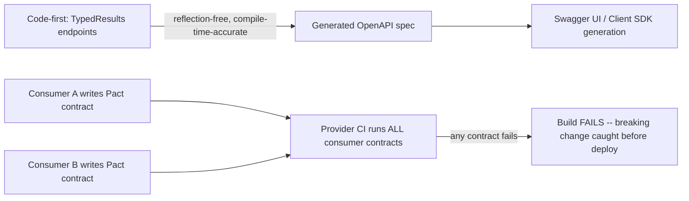
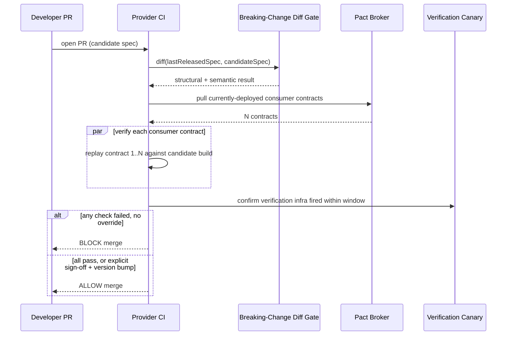

# Module 17 — REST APIs: API Documentation, Contract Testing & OpenAPI

> Domain: REST APIs | Level: Beginner → Expert | Prerequisite: [[01-REST-Design-Fundamentals]], [[../02-DotNet-AspNetCore/03-MinimalAPIs-vs-Controllers-ModelBinding]] (`TypedResults`/OpenAPI metadata)

---

## 1. Fundamentals

### What is OpenAPI, and what is contract testing?
**OpenAPI** (formerly Swagger) is a machine-readable specification format describing an HTTP API's shape — every endpoint, parameter, request/response schema, and status code — enabling automatic client-SDK generation, interactive documentation (Swagger UI), and tooling-driven validation. **Contract testing** verifies that an API's *actual* behavior matches its *documented* contract (and, in consumer-driven variants, that it satisfies what its actual consumers specifically depend on) — catching drift between documentation and reality, and between a provider's changes and a consumer's expectations, before it reaches production.

### Why do these exist?
Without a machine-readable spec, API documentation is either absent or a hand-maintained document that inevitably drifts from the actual implementation (the `[ProducesResponseType]` drift incident is exactly this problem). Contract testing exists because integration bugs between independently-deployed services (a classic microservices pain point, previewed here ahead of the dedicated Microservices module) are otherwise only caught by expensive, slow, flaky full end-to-end tests — or, worse, in production.

### When does this matter?
Every API with more than one consumer team benefits from OpenAPI-driven documentation; contract testing matters specifically once an API and its consumers are deployed **independently** (different release cadences) — the exact condition under which "it worked in the monolith" assumptions break down.

### How does it work (30,000-ft view)?
```csharp
builder.Services.AddEndpointsApiExplorer;
builder.Services.AddSwaggerGen;
// TypedResults-based endpoints auto-populate accurate OpenAPI metadata with no attributes needed.
app.MapGet("/orders/{id}", (string id) => TypedResults.Ok(new OrderDto(...)))
.WithName("GetOrder")
.Produces<OrderDto>(200)
.Produces(404);
```

---

## 2. Deep Dive

### 2.1 Schema-First vs Code-First OpenAPI Generation
**Code-first** (the ASP.NET Core default): the OpenAPI spec is generated *from* the running application's actual endpoints/types — guarantees the spec can never drift from the code's actual shape (for `TypedResults`-based endpoints), but the spec is a downstream artifact, not a design document. **Schema-first**: the OpenAPI spec is authored *first* (often collaboratively, as an API design/contract-negotiation artifact) and the server implementation is generated or validated against it — better for API-design-led development and cross-team contract negotiation *before* implementation begins, at the cost of requiring discipline to keep the spec and implementation in sync (exactly the drift risk code-first avoids by construction).

### 2.2 Consumer-Driven Contract Testing (Pact-style)
Traditional (provider-driven) contract testing checks a provider against its *own* published spec. **Consumer-driven contract testing** (Pact being the dominant tool) inverts this: each **consumer** team writes a contract describing exactly what it actually depends on from the provider (specific fields, specific status codes for specific scenarios) — the provider then runs these consumer-authored contracts as tests against its own implementation in CI, failing the build if a change would break any real consumer's actual usage, **even for parts of the API the provider's own OpenAPI spec technically allows changing**. This is a materially stronger guarantee than schema validation alone: a provider can be fully OpenAPI-spec-compliant while still breaking a consumer that (perhaps unwisely, perhaps unavoidably) depends on an implementation detail the spec didn't explicitly promise.

### 2.3 Semantic Versioning for APIs and Breaking-Change Classification
Not every API change is "breaking" in the same sense as semver for libraries — **additive** changes (a new optional field, a new endpoint) are non-breaking for well-behaved consumers (that ignore unknown fields, per Postel's Law/robustness principle) but **can** break a consumer using strict, unknown-field-rejecting deserialization — meaning "breaking" is partly a property of consumer *behavior*, not just provider *changes*. Removing a field, changing a field's type, or changing a status code's meaning are unambiguously breaking regardless of consumer leniency.

### 2.4 API Design Review as a Governance Practice
Given how expensive breaking changes are to walk back once consumers integrate (§Advanced Q3's deprecation-header strategy is the *mitigation*, not a substitute for getting the design right upfront), mature organizations run a **design review** *before* implementation — reviewing the proposed OpenAPI spec/schema against consistency conventions (naming, pagination style, error-shape conventions, the shared error-response-shape pattern) across the whole API surface, catching inconsistency and design mistakes while they're still cheap (a spec edit) rather than expensive (a shipped, consumer-depended-upon behavior).

## 3. Visual Architecture

```mermaid
graph LR
 A[Code-first: TypedResults endpoints] -->|reflection-free, compile-time-accurate| B[Generated OpenAPI spec]
 B --> C[Swagger UI / Client SDK generation]
 D[Consumer A writes Pact contract] --> E[Provider CI runs ALL consumer contracts]
 F[Consumer B writes Pact contract] --> E
 E -->|any contract fails| G[Build FAILS -- breaking change caught before deploy]
```

## 4. Production Example
**Scenario**: A provider team removed a field from a response DTO that their own OpenAPI spec marked as present in every documented example but not formally required in the schema (`required: []` omitted it) — schema validation passed (the field was technically optional per the spec), but a partner's consumer code deserialized it into a non-nullable property and crashed on every response, since it had always been present in practice and the consumer's team had never treated it as truly optional. **Investigation**: the provider's own contract tests (schema-only) passed; only the partner's own downstream monitoring caught the crash, hours after deployment. **Fix**: adopted consumer-driven contract testing — the partner's actual Pact contract (asserting the field's presence, since their integration genuinely depended on it) now runs in the provider's CI, so this exact class of change fails the *provider's own build* before deployment, not after. **Lesson**: schema compliance and "won't break real consumers" are different guarantees — a field being technically optional in a spec doesn't mean removing it is actually safe if every real consumer treats it as effectively required.

## 5. Best Practices
- Prefer code-first OpenAPI generation (`TypedResults`) to eliminate documentation drift by construction.
- Adopt consumer-driven contract testing for any API with external or cross-team consumers with independent deploy cadences.
- Run API design review before implementation for any new public/cross-team endpoint.
- Treat "is this change breaking" as a question about real consumer behavior, not just spec technicalities.

## 6. Anti-patterns
- Hand-maintained documentation (a wiki page, a Word doc) disconnected from the actual implementation — guaranteed to drift.
- Relying solely on provider-side schema validation as proof that a change is safe for consumers.
- Treating every field as effectively required in practice while marking it optional in the spec, then being surprised when removing it breaks consumers.

---

## 7. Performance Engineering

**CPU/Memory:** Code-first OpenAPI generation (`AddSwaggerGen`/`WithOpenApi`) reflects over every mapped endpoint at startup — for a service with thousands of endpoints (a large gateway aggregating many downstream APIs), this can add measurable seconds to cold-start time; cache the generated `OpenApiDocument` in memory after first generation rather than regenerating it per request to `/swagger/v1/swagger.json`.

**Contract-test suite runtime at scale:** A provider's CI cost for consumer-driven contract testing grows with the **N×M matrix** — N currently-published consumer contracts × M provider-build verification runs — not with the provider's own endpoint count. A provider with 40 consumers, each publishing a new Pact on every deploy, can accumulate hundreds of contract-verification runs per provider CI build if every historical contract version is naively re-verified; the standard mitigation is verifying only each consumer's **currently-deployed** contract version (tracked via the Pact Broker's "deployed/released" tagging, not every historical version ever published), keeping the matrix bounded by active consumers, not cumulative contract history.

**Spec-diff computation cost:** An OpenAPI breaking-change diff (oasdiff/openapi-diff) over a large (thousands-of-path) spec is O(paths × schema-depth) — for most real APIs this completes in low single-digit seconds, but a monolithic, un-versioned spec covering an entire platform can push this into the tens of seconds; splitting the spec per bounded context/service (rather than one platform-wide document) keeps each individual diff fast and keeps a change in one service from triggering a full-platform-wide diff recomputation.

**Latency:** None of this is on the request-serving hot path — spec generation, diffing, and contract verification are all build-time/CI-time costs, not runtime costs; the only runtime cost is serving the (cached) generated spec document itself, which is negligible.

**Throughput/Scalability:** Parallelize consumer-contract verification across the N consumers (they're independent) rather than running them sequentially in CI — this is the dominant lever for keeping contract-test suite wall-clock time acceptable as the consumer count grows; a sequential N-consumer verification step is the most common cause of contract testing "getting too slow" complaints that lead teams to (wrongly) abandon it rather than parallelize it.

**Benchmarking:** Track contract-verification-step CI duration as its own dashboarded metric, trending it against consumer count — a linearly growing (not flat) trend confirms the matrix-growth cost is real and warrants the "verify only currently-deployed contract" and parallelization mitigations before the step becomes a CI bottleneck teams route around.

---

## 8. Security

**Threats:** The dominant, topic-specific threat is **information disclosure via the generated spec itself** — code-first generation reflects *everything* the code exposes, including internal-only endpoints, debug/admin routes, and DTO fields never intended for external consumers, and a spec published publicly (or even just accessible to any authenticated internal user, in a large organization) becomes a reconnaissance map of the provider's internal structure, naming conventions, and potentially even implementation details (a field like `internalLedgerShardId` leaking sharding strategy) that a well-designed public API surface would never intentionally document.

**Mitigations:** Maintain **two spec documents** — an internal, complete spec (used for internal tooling, SDK generation, and consumer-driven contract verification) and a curated, explicitly-filtered public spec (using `.ExcludeFromDescription` or a dedicated `DocumentFilter` to strip internal-only paths/fields before the document is ever served externally); never assume "not linked from the docs portal" is sufficient obscurity — an OpenAPI JSON document is trivially discoverable at its conventional URL path (`/swagger/v1/swagger.json`, `/openapi.json`) by anyone who tries it.

**OWASP mapping:** This is a direct instance of **OWASP API Security Top 10 — API9:2023 Improper Inventory Management** (undocumented/shadow endpoints and unmanaged API versions expanding attack surface) combined with excessive data exposure risk when a schema's `example` values are populated with real (not synthetic) production data during development and never scrubbed before the spec is published.

**AuthN/AuthZ:** Never assume documenting an endpoint's `securitySchemes` requirement in the spec is equivalent to *enforcing* it in code — a spec is descriptive, not enforcing; the classic gap is an endpoint whose OpenAPI annotation correctly declares a bearer-token requirement while the actual route registration is missing the corresponding `[Authorize]`/middleware, a documentation/implementation drift risk structurally identical to this module's central field-drift incident, now applied to security metadata specifically.

**Secrets:** Pact Broker credentials and any CI-embedded API tokens used to publish/pull contracts must be scoped least-privilege (publish-only for consumer CI, verify-only-read for provider CI) and rotated on the organization's standard secrets-rotation cadence — a leaked Pact Broker write credential would let an attacker publish a forged consumer contract, potentially either unblocking a change that should have failed verification or, conversely, blocking a legitimate provider deploy via a spurious contract failure (a denial-of-service against the release pipeline itself).

**Encryption:** Standard TLS-in-transit for spec/contract retrieval; specs and contracts at rest (in the Pact Broker or a spec registry) should be treated as sensitive-adjacent internal artifacts, not public-readable-by-default storage, given the reconnaissance value described above.

---

## 9. Scalability

**Horizontal scaling:** Contract verification parallelizes cleanly across consumers (each an independent Pact-replay run) — the standard scaling lever as an organization's consumer count grows into the dozens or hundreds.

**The N×M consumer-provider matrix:** In a large microservices estate (hundreds of services, each both a provider to some and a consumer of others), the number of distinct contract relationships grows combinatorially, not linearly, with service count — a Pact Broker's **"can I deploy?"** matrix query (checking whether a specific service version is compatible with every currently-deployed version of every service it has a contract relationship with) becomes the practical scaling bottleneck; the mitigation is scoping contract verification to only a service's *actual, currently-registered* consumer/provider relationships (which the broker already tracks), never attempting to naively verify against every service in the estate.

**Spec versioning at scale:** Supporting N concurrently-live API versions multiplies both the spec-maintenance burden and the breaking-change-diff surface by N; the standard scaling discipline is capping the number of concurrently-supported live versions (e.g., N-1, deprecating the oldest once a new version ships) via an enforced `Sunset`-header deprecation policy, rather than allowing an unbounded number of historical versions to remain live indefinitely.

**Caching:** Generated OpenAPI documents and Pact-verification results are both cacheable — a spec doesn't need regeneration on every request (cache until the next deploy invalidates it), and a contract-verification result for a given (consumer-version, provider-version) pair is immutable once computed and can be cached/skipped on repeat CI runs against the same pair.

**Replication/Partitioning:** Split a platform-wide spec into per-bounded-context specs (Performance Engineering) — this is simultaneously a performance optimization and a scalability one, since it lets each service's spec/contract-verification pipeline scale independently rather than all services sharing one increasingly large, slow, monolithic document.

**High Availability:** A Pact Broker (or spec registry) outage should **fail CI closed but not block production traffic** — the broker is a build-time dependency, not a runtime one, so its unavailability delays deploys (a build/release-velocity impact) rather than causing a production incident, an important distinction to design and communicate correctly to avoid over-provisioning the broker for runtime-grade availability it doesn't actually need.

---

## 10. Interview Questions

### Basic (10)
1. **Q: What is OpenAPI?** **A:** A machine-readable specification format describing an HTTP API's endpoints, parameters, and schemas.
2. **Q: What's the difference between code-first and schema-first OpenAPI generation?** **A:** Code-first generates the spec from the running application's actual code; schema-first authors the spec first and implements/validates against it.
3. **Q: What does `TypedResults` provide for OpenAPI generation?** **A:** Compile-time-accurate metadata with no risk of drift between declared and actual return types.
4. **Q: What is contract testing?** **A:** Verifying that an API's actual behavior matches its documented contract (or its consumers' actual dependencies).
5. **Q: What is consumer-driven contract testing?** **A:** Each consumer writes a contract describing what it actually depends on; the provider runs all consumer contracts in its own CI.
6. **Q: Is adding a new optional field to a response always non-breaking?** **A:** Not necessarily — a consumer using strict, unknown-field-rejecting deserialization could still break, even though it's additive.
7. **Q: What is Pact?** **A:** The dominant tool for consumer-driven contract testing — consumers record their actual expectations of a provider's API as executable "pact" files, which the provider then replays in its own CI to verify it still satisfies every registered consumer before deploying.
8. **Q: Why might a hand-maintained API documentation page become inaccurate over time?** **A:** Nothing mechanically ties it to the actual implementation, so it drifts as the code changes without corresponding doc updates.
9. **Q: Should an internal-only endpoint appear in a publicly-served OpenAPI spec?** **A:** No — it should be excluded from the public spec even if included in an internal development-tooling version.
10. **Q: What's the value of an API design review before implementation?** **A:** Catching design/consistency mistakes while they're still cheap to change (a spec edit), before consumers depend on the shipped behavior.

### Intermediate (10)
1. **Q: Why does code-first OpenAPI generation eliminate documentation drift "by construction"?** **A:** The spec is derived directly from the actual compiled types/return values (`TypedResults`) rather than a separately-maintained artifact, so it's structurally impossible for the two to diverge — unlike attribute-based (`[ProducesResponseType]`) generation, which can drift if the attribute isn't updated alongside the code.
2. **Q: Why is schema validation alone insufficient to guarantee a change won't break consumers, precisely?** **A:** A spec only encodes what the provider has formally promised; real consumers may depend on implementation details or "usually present" fields the spec marks as optional/unspecified — schema compliance says nothing about those actual, undocumented dependencies.
3. **Q: How does a provider run a consumer's Pact contract without needing the consumer's actual codebase?** **A:** The consumer publishes a Pact file (a serialized description of expected requests/responses) to a shared broker; the provider's CI pulls and replays those expectations against its own implementation, verifying compliance without needing to execute the consumer's code at all.
4. **Q: Why is "is this field required" partly a property of consumer behavior, not just the spec?** **A:** A field the spec marks optional can still be a de facto requirement if every real consumer's deserialization logic treats its absence as invalid/crashes — the spec's formal contract and consumers' actual tolerance can diverge.
5. **Q: What's the risk of skipping API design review for a "quick, internal-only" endpoint that later becomes externally consumed?** **A:** Design inconsistencies (naming, pagination, error shape) that would have been cheap to fix before any consumer existed become expensive, breaking changes once external consumers depend on the as-shipped behavior.
6. **Q: Why would a team choose schema-first generation despite its drift risk?** **A:** For genuine API-design-led development — negotiating the contract collaboratively with consumers *before* writing any implementation code, valuable when the API's shape is a cross-team design decision, not just an implementation detail.
7. **Q: What's a realistic reason an auto-generated public OpenAPI spec might need manual curation despite being code-first?** **A:** Excluding internal-only endpoints/fields that exist in the code but shouldn't be publicly documented — code-first generation by default reflects everything in the code, requiring an explicit filtering step for the public-facing spec.
8. **Q: How would you detect that a provider's planned change would break a specific real consumer, before deploying?** **A:** Run that consumer's Pact contract against the provider's updated implementation in CI — a failing contract test is the exact, targeted signal needed, catching it before deployment rather than via post-deployment monitoring.
9. **Q: Why is a full end-to-end test between two independently-deployed services often a poor substitute for contract testing?** **A:** It requires both services running simultaneously (slow, flaky, environment-dependent) and only tests the specific scenarios exercised, whereas a consumer-driven contract explicitly, narrowly documents exactly what that consumer depends on, runnable quickly and deterministically in the provider's own CI without needing the consumer's actual running instance.
10. **Q: What's the relationship between OpenAPI-based client SDK generation and contract testing?** **A:** Generated SDKs are only as trustworthy as the spec they're generated from — if the spec drifts from actual behavior (schema-only, no consumer-driven testing), a generated SDK can compile successfully against the spec while still breaking at runtime against the real, divergent implementation.

### Advanced (10)
1. **Q: Design a CI pipeline integrating consumer-driven contract testing into a provider's deployment process, including how a breaking change is caught before production impact.**
 **A:** Consumers publish Pact files to a shared broker on their own CI runs; the provider's CI, on every build, pulls all currently-published consumer contracts and replays them against the candidate build (a real, running instance of the provider, e.g., via `WebApplicationFactory`); any contract failure fails the provider's build, blocking deployment entirely — this converts "will this change break a real consumer" from a question answered by post-deployment monitoring/incident response into one answered deterministically, pre-deployment, in minutes.

2. **Q: Explain precisely why the field-removal incident passed schema validation but still broke a consumer, and design the fix.**
 **A:** The spec never formally declared the field `required`, so removing it was schema-compliant; the actual break was in the *consumer's* deserialization behavior treating it as effectively required — the fix is not "make the spec stricter" (the provider can't unilaterally know every consumer's actual tolerance) but adopting consumer-driven contracts specifically because they capture *actual* dependency behavior directly from the consumer, sidestepping the entire "is the spec strict enough" question.

3. **Q: How would you classify a specific proposed API change (e.g., changing a field's type from `int` to `string`) using semantic-versioning-for-APIs principles, and what would you require before shipping it?**
 **A:** A field type change is unambiguously breaking regardless of consumer leniency (unlike an additive field) — require either a new API version preserving the old field's type for existing consumers, or a coordinated migration with all known consumers confirmed to have updated before the change ships to the old version's endpoint at all; never ship a type-changing modification silently to an existing, versioned endpoint.

4. **Q: Design an API design-review checklist enforcing consistency across a large, multi-team API surface.**
 **A:** Cover: consistent pluralization/naming conventions for resource collections; a single, shared pagination pattern (cursor vs. offset, chosen once organization-wide); a single, shared error-response shape (the `IApiErrorResponseBuilder` pattern); consistent date/time and enum-serialization formats; and mandatory sign-off from a cross-team API-governance reviewer before any new public endpoint ships — directly mirroring this course's recurring shared-template governance pattern, applied here to API design consistency rather than middleware/DI configuration.

5. **Q: Explain a scenario where code-first OpenAPI generation, despite eliminating drift, still fails to serve as an adequate API design tool.**
 **A:** Code-first generation reflects whatever the implementation happens to produce — it can't proactively catch a design inconsistency (e.g., one endpoint using offset pagination while another uses cursor pagination) *before* implementation, since there's no spec to review until code already exists; this is exactly why schema-first (or a design review process operating on a draft spec) remains valuable specifically for the design-consistency concern code-first generation structurally cannot address.

6. **Q: How would you handle a genuinely necessary breaking change (e.g., a security-driven field removal) when a consumer-driven contract exists that depends on the field being removed?**
 **A:** Directly engage the specific consumer team (identifiable via the Pact broker's contract ownership metadata) to negotiate and coordinate the change — either the consumer updates its contract (and implementation) to no longer depend on the field, unblocking the provider's build, or the change ships as a new API version with a deprecation/sunset timeline for the old version, giving the consumer a migration window; a failing consumer contract should trigger a cross-team conversation, not be silently overridden/deleted from the test suite to unblock a deploy.

7. **Q: Explain why "the API is fully OpenAPI-spec-compliant" is an insufficient claim for a Principal Engineer to accept as proof that a change is safe.**
 **A:** Spec compliance only verifies the provider honors its own formal, documented promises — it says nothing about undocumented behaviors real consumers may have come to depend on (/Advanced Q2), nor about design-consistency concerns a spec review (not runtime compliance) is meant to catch — "spec-compliant" and "safe to ship" are related but distinct claims, and conflating them is exactly how incidents like occur.

8. **Q: Design a strategy for introducing consumer-driven contract testing retroactively into an existing API with many established, but not yet contract-tested, consumers.**
 **A:** Prioritize onboarding the highest-risk/highest-traffic consumers first (whose breakage would have the largest business impact); for consumers who can't or won't adopt Pact directly, consider a "synthetic contract" approach — the provider team, in collaboration with the consumer, hand-writes a contract capturing the consumer's known actual usage patterns (from API-gateway traffic logs/schemas observed in practice) as an interim measure, upgrading to a true consumer-authored contract as that team's tooling maturity allows — an incremental, risk-prioritized rollout rather than an all-or-nothing mandate.

9. **Q: A team proposes skipping contract testing entirely in favor of "just communicating changes in a Slack channel before shipping." Evaluate this from a Principal Engineer's perspective.**
 **A:** Manual communication doesn't scale past a small number of consumers/changes, is not enforced by any automated gate (nothing prevents shipping despite the notice, or a consumer team missing the message), and provides no mechanically-verified guarantee — exactly the difference between a *process* (advisory, bypassable) and a *control* (automated, blocking); recommend contract testing as the enforced control, with communication as a valuable *complement* (context/rationale) rather than a substitute for it.

10. **Q: As a Principal Engineer, how would you decide whether a given API surface genuinely needs consumer-driven contract testing versus simpler, sufficient schema-based validation alone?** **A:** Weigh the number and independence of consumer teams (many independently-deployed consumers = higher value for consumer-driven contracts), the cost of a production break (a payments-adjacent API's incident cost justifies the investment far more than a low-stakes internal reporting endpoint), and the API's actual rate of change (a rapidly-evolving API accumulates more opportunities for the schema-vs-actual-usage gap than a stable, rarely-changed one) — recommend consumer-driven contracts specifically where this combination of factors indicates real, demonstrated risk, not as a blanket requirement for every internal API regardless of stakes.

### Expert (FinTech Principal Panel)

1. **Q: Consumer-driven contracts assume your consumers run tests and publish Pacts. Your consumers are *external* bank/merchant integrators who won't — yet breaking them causes an incident and reputational damage. How do you protect them without their cooperation?**
 **A:** You can't rely on consumer-authored contracts across an org boundary, so shift the guarantee to the *provider* side. (1) **Provider-side backward-compatibility gate:** run an automated **OpenAPI diff** (e.g., openapi-diff/oasdiff) in CI that classifies every change to a live version as additive vs. breaking and **fails the build on a breaking change** to any version still in support — this catches breaks without needing the consumer. (2) **Recorded-traffic / synthetic contracts:** derive characterization tests from *actual observed* integrator traffic (gateway logs) so you know what fields/shapes they really depend on (Advanced Q8), and replay them against candidate builds. (3) **Strict versioning + long deprecation windows + `Sunset` headers** so change is opt-in on the integrator's timeline. (4) **A sandbox + certification program** — integrators build/test against a stable sandbox, and you certify their integration, which also tells you who depends on what. (5) **Additive-only discipline** for live versions. The Principal framing: when you can't test *with* the consumer, you make the *provider* prove backward compatibility automatically (spec-diff gate + recorded-traffic tests) and give change a versioned, opt-in, well-communicated path — the burden of not breaking an external integrator is entirely yours to enforce mechanically.
 **Why correct:** Moves the guarantee provider-side via automated breaking-change detection + recorded-traffic contracts + versioning/deprecation + sandbox/certification, since external consumers won't publish Pacts.
 **Common mistakes:** Assuming you can contract-test with unwilling external partners; manual review as the only breaking-change guard; changing a live version in place.
 **Follow-ups:** "How does an OpenAPI-diff CI gate classify breaking vs. additive?" / "How do recorded-traffic contracts reveal undocumented dependencies?" / "What's your deprecation-window policy for external integrators?"

2. **Q: Field-presence contract tests pass, but an integrator still mishandled money because the *semantics* changed (scale, rounding, a renamed decline code). What money-specific invariants belong in the contract, and how do you test them?**
 **A:** For financial APIs the contract is more than field names/types — it's **semantics**, and those must be pinned and tested: (1) **monetary representation** — amount encoding (minor-units integer vs. fixed-scale string), currency scale per ISO-4217, and that trailing zeros/precision are preserved; a change from 2 to 4 decimals or number-vs-string is breaking even if the field name is unchanged. (2) **Rounding mode** — reports/allocations must round consistently (banker's vs. away-from-zero); a silent change breaks reconciliation. (3) **Enum/code stability** — decline/status codes (`insufficient_funds`, `do_not_honor`) are a machine contract; renaming or repurposing a code is breaking, and integrators must tolerate *new* codes gracefully (test that they don't hard-fail on an unknown value). (4) **Timezone/date formats** and **idempotency semantics**. Test these as explicit assertions in the contract suite (exact serialized form of a known amount, code taxonomy snapshot, rounding examples), not just "field exists." The Principal framing: in FinTech the dangerous breaking changes are *semantic* — scale, rounding, code meaning — which pass structural schema checks; the contract must assert the *meaning and exact representation* of money and codes, and tolerance for additive enum values must itself be a tested part of the contract.
 **Why correct:** Identifies semantic invariants (money representation/scale, rounding, code stability + additive-enum tolerance, dates/idempotency) and tests them as explicit assertions beyond field presence.
 **Common mistakes:** Testing only field presence/types; treating a scale/rounding/code-meaning change as non-breaking; consumers hard-failing on unknown enum values.
 **Follow-ups:** "Why is a 2→4 decimal change breaking even with the same field name?" / "How do you test additive-enum tolerance?" / "Why is renaming a decline code a breaking change?"

3. **Q: As a Principal, design the org-wide policy and CI controls that make it *structurally impossible* to ship an accidental breaking change to a supported version of a public money API.**
 **A:** Make backward compatibility an enforced gate, not a hope: (1) **Spec-as-source-of-truth + automated diff gate** — every PR runs an OpenAPI/breaking-change detector against the last released spec of each supported version; a breaking classification **blocks merge**, full stop, with an override requiring explicit senior sign-off and a version bump. (2) **Additive-only rule for live versions**, encoded as a lint the pipeline enforces. (3) **Provider verification of recorded-traffic + consumer (where available) contracts** on every build. (4) **Semantic checks** (Q2) — money representation, rounding, and code-taxonomy snapshots are diffed too, since structural schema checks miss them. (5) **Versioning + deprecation policy** as the only sanctioned path for a real breaking change, with `Sunset` headers and telemetry-driven migration tracking. (6) **Governance** — a change-review checklist and a designated API-governance owner for the public surface. The controls layer so that a breaking change can only ship *deliberately*, through a new version, with sign-off — never accidentally through a routine merge. The Principal framing: reliability for external integrators comes from converting "don't break the contract" from a discipline into an automated, blocking control (diff gate + semantic checks + additive-only lint) backed by a versioning escape hatch and governance — exactly this course's recurring "codify the rule as tooling, not tribal knowledge" pattern applied to API compatibility.
 **Why correct:** Specifies blocking CI controls (breaking-change diff gate, additive-only lint, semantic snapshots, provider-side contract verification) + versioning/governance so breaks are only ever deliberate.
 **Common mistakes:** Relying on review/discipline to catch breaks; no automated diff gate; ignoring semantic (non-structural) changes; no enforced versioning path.
 **Follow-ups:** "What exactly does the diff gate block, and what's the override path?" / "How do you diff *semantic* changes, not just schema?" / "Who owns the public API contract and signs off on a version bump?"

4. **Q: A Pact Broker's `pactflow.webhooks` integration — which is supposed to trigger provider verification automatically whenever a consumer publishes a new contract — silently stopped firing eight months ago after a broker upgrade changed its webhook payload schema. No provider verification has run against any new consumer contract since. How do you find this, and how do you prevent this exact class of failure generally?**
 **A:** This is a **verification-infrastructure-silently-stopped-functioning** failure, structurally identical to a dead-letter consumer nobody is watching. Finding it: audit the *last-triggered timestamp* of every configured webhook against the *last-published-contract timestamp* for the same consumer — any webhook whose last-fire time predates a subsequent contract publish is proven broken, not merely suspected. Preventing it generally: (1) never trust "the integration is configured" as evidence it's *working* — add a synthetic canary that publishes a deliberately-trivial contract change on a schedule and asserts the corresponding provider verification run actually executed within an expected window, alerting on its absence; (2) treat webhook/integration-config changes (including third-party platform upgrades) as requiring an explicit smoke test of every dependent integration, not just the upgraded component itself; (3) dashboard "time since last successful provider verification per consumer" as a first-class metric, alerting on staleness, not just on verification failure — a silently-*not-running* check produces no failure signal at all, which is exactly the blind spot a "did it run" canary closes that a "did it pass" alert cannot.
 **Why correct:** Diagnoses the failure as verification infrastructure going silently inert (not a contract failure) and proposes the specific "verify the verifier" canary/staleness-monitoring fix rather than just re-enabling the webhook.
 **Common mistakes:** Treating "the webhook is configured" as proof it fires; monitoring only pass/fail of verification runs rather than whether they ran at all; not smoke-testing dependent integrations after an upstream platform upgrade.
 **Follow-ups:** "What's the specific canary payload you'd publish?" / "How would you have caught the broker-upgrade schema change before it broke the webhook?" / "Where else in this course has 'the check exists but never fires' recurred?"

5. **Q: Your organization has 200 microservices. A new Staff Engineer proposes that every service publish an OpenAPI spec and every consumer write Pact contracts, enforced org-wide starting next quarter. Evaluate this proposal as a Principal.**
 **A:** The mechanism is right; the rollout strategy is not. A blanket, uniform mandate across 200 services ignores that contract-testing value is proportional to (a) number of independent consumers and (b) cost of a production break — a low-traffic internal reporting service with one consumer gets little marginal safety from Pact over careful code review, while a payments-adjacent API with 15 independently-deployed consumers gets enormous value. Recommend: (1) tier services by consumer-count × blast-radius, mandating consumer-driven contracts only for the top tier immediately, with schema-diff-gate-only (cheaper, still valuable) as the baseline for everything else; (2) budget the N×M CI-cost growth explicitly (Performance Engineering) before mandating org-wide, since a blanket rollout without addressing matrix growth guarantees CI slowdown complaints that erode adoption; (3) attach the classification/onboarding review to whatever shared tooling gets built, exactly as CRDT-infrastructure onboarding needed a review gate, so teams don't cargo-cult contract testing onto use cases that don't need it. The Principal framing: universal mandates that ignore differential risk and differential infrastructure cost predictably produce shallow, resented compliance rather than genuine safety improvement — tier the rollout by actual risk instead.
 **Why correct:** Rejects uniform mandate in favor of risk-tiered rollout, explicitly budgets the CI-cost-growth concern, and ties governance to actual infrastructure onboarding.
 **Common mistakes:** Treating "more contract testing everywhere" as an unqualified good; ignoring CI-cost and adoption-friction consequences of a blanket mandate; no risk-based tiering.
 **Follow-ups:** "What tier criteria would you actually use?" / "How do you avoid the mandate becoming checkbox compliance?" / "What's the fallback for services that can't practically adopt Pact?"

6. **Q: A payments provider must simultaneously expose the same underlying settlement-status data via a REST/OpenAPI endpoint (for legacy partners), a GraphQL schema (for a newer internal dashboard team), and a gRPC/protobuf contract (for a latency-sensitive internal service). How do you prevent these three contracts from silently diverging in their representation of the same underlying status field?**
 **A:** The three surfaces must share a single **internal source-of-truth model** (the domain type, e.g., a `SettlementStatus` enum with a documented, versioned meaning per value) that each protocol's schema is *generated from or validated against* — never hand-maintain three independently-authored schemas for the same concept, since that's precisely the drift-by-construction risk this module opened with, now tripled. Concretely: define the canonical enum/type once in the domain layer; generate the OpenAPI schema, the GraphQL SDL, and the .proto definitions from (or validate all three against) that single source via codegen or a shared schema-registry approach; run a cross-protocol semantic-equivalence test in CI asserting all three surfaces report the identical status taxonomy (same value set, same meaning per value) for a fixed set of known settlement states. Treat any protocol-specific schema that has drifted from the canonical model as a build failure, exactly as a REST-only breaking-change diff gate would.
 **Why correct:** Identifies the shared-source-of-truth requirement across protocols and specifies a concrete cross-protocol equivalence test, rather than treating each protocol's contract testing as independent.
 **Common mistakes:** Running Pact/OpenAPI-diff for the REST surface only, leaving GraphQL/gRPC unguarded; assuming protocol-specific contract tools alone (without a shared canonical model) prevent semantic drift between protocols.
 **Follow-ups:** "What would the cross-protocol equivalence test actually assert?" / "Who owns the canonical domain model when three different teams own the three protocol surfaces?"

7. **Q: Calculate the ROI case for adopting consumer-driven contract testing at a firm with 40 services and a documented history of two production incidents per quarter attributable to undetected breaking API changes, each costing roughly 6 engineer-hours of incident response plus reputational cost with an external partner. Is Pact adoption justified, and what would change your answer?**
 **A:** Rough numbers: 2 incidents/quarter × 6 hours ≈ 12 engineer-hours/quarter in direct incident cost alone, before counting partner-trust erosion (unquantified but real, per the field-removal incident's "partner's own downstream monitoring caught it" detail — a cost this course's accuracy rules require flagging as an assumption, not a guaranteed number). Pact adoption cost: initial integration per consumer (roughly 1-2 engineer-days each, a one-time cost) plus ongoing CI-time overhead (Performance Engineering's N×M growth, mitigated via parallelization and currently-deployed-only verification). For a firm already experiencing recurring, attributable incidents at this rate, the one-time integration cost pays back within roughly one to two quarters purely on direct incident-response hours, before counting the harder-to-quantify partner-trust cost — a reasonably strong case. What would change the answer: if the two incidents/quarter are concentrated on services with very few consumers (schema-diff-gate-only might address them more cheaply), or if the incidents trace to semantic (Advanced Q2-style) rather than structural drift (Pact alone doesn't catch semantic drift without explicit semantic assertions) — in either case, a narrower, cheaper intervention might be the better first step before a full org-wide Pact rollout.
 **Why correct:** Does the actual arithmetic, explicitly labels the reputational-cost figure as unquantified per this repo's accuracy rules, and names the conditions that would change the recommendation rather than treating the ROI case as universally settled.
 **Common mistakes:** Asserting contract testing is "obviously worth it" without doing the cost comparison; treating an ROI estimate as precise rather than an explicitly-labeled assumption; ignoring that the *type* of historical incident (structural vs. semantic) changes which intervention is actually cost-effective.
 **Follow-ups:** "How would you actually measure the reputational-cost component?" / "What's the cheaper intervention if incidents are concentrated on low-consumer-count services?"

8. **Q: Distinguish, precisely, between "the API is fully backward compatible per our automated diff gate" and "our external integrators will not experience a break," and explain a scenario where the first is true and the second is false.**
 **A:** The diff gate only classifies changes against the *formal spec* (Advanced Q1-3's structural and semantic checks) — it cannot see behavior an integrator depends on that was never captured in the spec at all. Scenario: a provider changes its **rate-limiting threshold** (from 100 req/s to 20 req/s) for a given endpoint — this is not a schema change of any kind (no field, type, or status code changes), so it passes every structural and semantic diff check cleanly, yet an integrator whose traffic pattern assumed the old threshold starts receiving 429s in production. The gap: backward compatibility as measured by schema/semantic diffing is scoped to the *documented contract surface*; an integrator's actual dependency surface includes operational characteristics (rate limits, timeout budgets, typical latency) that are rarely captured in an OpenAPI spec at all. The fix is the same one this module has repeated throughout: recorded-traffic-derived synthetic contracts and/or an explicit "operational contract" (documented SLA fields — rate limits, latency percentiles — versioned and diffed) alongside the structural/semantic one, since "spec-compliant" and "won't break a real integrator" remain distinct claims even after closing the structural and semantic gaps.
 **Why correct:** Gives a concrete, non-schema example (rate-limit change) proving the two claims are genuinely distinct, and generalizes to the need for an operational contract alongside the structural/semantic ones.
 **Common mistakes:** Assuming closing the structural and semantic gaps (Advanced Q1-3) fully closes the "spec-compliant ≠ safe to ship" gap this module opened with, missing that operational characteristics are a third, still-uncaptured dependency surface.
 **Follow-ups:** "What would an 'operational contract' document concretely?" / "How would you detect an integrator's actual dependency on a specific rate-limit or latency characteristic?"

9. **Q: A junior engineer asks: "If our OpenAPI spec is code-first and therefore can never drift from the implementation, why do we still need contract testing at all?" Answer as a Principal Engineer would.**
 **A:** Code-first generation guarantees the spec matches what the code *can* return — it says nothing about whether what the code *can* return matches what any given consumer *actually needs*, nor whether a technically-spec-compliant change (Advanced Q1's field-removal incident) breaks a consumer's real, possibly under-specified dependency. Code-first eliminates exactly one failure mode — documentation drift from implementation — while leaving two others entirely open: (1) a spec-compliant-but-consumer-breaking change (the field-removal incident, where removing a non-required field was fully code-first-accurate and still broke a consumer), and (2) operational/semantic drift the spec was never designed to capture (Expert Q8). Code-first and contract testing solve different problems: one guarantees the spec is an accurate mirror of the code; the other guarantees a change doesn't break what a real consumer actually depends on — a code-first, contract-testing-free API can still ship a technically-accurate, fully-documented breaking change with total confidence right up until it reaches a real consumer in production.
 **Why correct:** Precisely separates the two guarantees (spec-accuracy vs. consumer-safety) and shows code-first solves only the first, using the module's own incident as the proof.
 **Common mistakes:** Conflating "the spec can't drift from the code" with "changes to the code can't break consumers" — these are unrelated claims that happen to both involve the word "spec."
 **Follow-ups:** "Give a second example of a spec-accurate but consumer-breaking change, beyond field removal." / "Does schema-first change this answer at all?"

10. **Q: As a Principal Engineer setting API-governance strategy for the next three years, what specific, measurable signal would tell you the organization's contract-testing investment is paying off, versus becoming ceremony?**
 **A:** Track four signals jointly, not any single one in isolation: (1) **incidents-per-quarter attributable to undetected breaking changes**, trending down after adoption (the direct outcome metric, mirroring Expert Q7's ROI framing); (2) **contract-verification-step CI duration**, trending flat or sublinearly as consumer count grows (proof the N×M-matrix mitigations, Performance Engineering, are actually working, not merely documented); (3) **canary-verified "is the verification infrastructure actually firing" staleness metric** (Expert Q4) at zero unexplained gaps, since a contract-testing program that looks healthy on paper but has silently-dead webhooks is worse than no program, because it provides false confidence; (4) **rate of contract-test failures caught pre-merge versus post-deploy incidents that a contract test *should* have caught but didn't** — a nonzero, investigated rate of the latter is the leading indicator that the contract suite's coverage has a real gap (missing semantic assertions, missing operational-contract coverage, Expert Q8) rather than an argument to abandon the program. Ceremony looks like: contracts exist, CI is green, but incident rate hasn't moved and nobody can say when verification last actually ran for a given consumer — exactly the failure this module's own incidents (Advanced Q9, Expert Q4) describe.
 **Why correct:** Names four concrete, trackable signals spanning outcome (incident rate), infrastructure health (CI duration, canary staleness), and coverage-gap detection, distinguishing genuine effectiveness from checkbox ceremony.
 **Common mistakes:** Measuring only "percentage of services with contract tests" (an adoption metric, not an effectiveness metric) or "contract tests passing in CI" (proves nothing if the infrastructure is silently not running, Expert Q4).
 **Follow-ups:** "Which of these four would you prioritize first, and why?" / "How often would you review this dashboard, and with whom?"

---

## 11. Coding Exercises

### Easy — Code-first OpenAPI with `TypedResults` (no drift risk)
```csharp
app.MapGet("/orders/{id}", Results<Ok<OrderDto>, NotFound> (string id, IOrderRepository repo) =>
    {
        var order = repo.GetById(id);
        return order is null? TypedResults.NotFound: TypedResults.Ok(new OrderDto(order));
})
.WithName("GetOrder")
.WithOpenApi;
// The Results<Ok<OrderDto>, NotFound> return type IS the OpenAPI metadata source -- no [ProducesResponseType] needed
// and it's impossible for this declaration to drift from the method's actual possible return values.
```

### Medium — Exclude internal-only endpoints from the public spec
```csharp
app.MapGet("/internal/debug/cache-stats", GetCacheStats)
.ExcludeFromDescription; // never appears in the generated OpenAPI document at all
```

### Hard — A basic consumer-driven contract test (Pact-style, conceptual)
```csharp
// Consumer-side: defines the EXACT expectation this consumer depends on.
[Fact]
public async Task Consumer_Expects_Invoice_Amount_Field_Present
{
    _pactBuilder
    .UponReceiving("a request for an invoice")
    .Given("invoice inv-123 exists")
    .WithRequest(HttpMethod.Get, "/invoices/inv-123")
    .WillRespond
    .WithStatus(200)
    .WithJsonBody(new { id = "inv-123", amount = Match.Decimal(99.99m) }); // amount is asserted PRESENT

    await _pactBuilder.VerifyAsync(async ctx =>
        {
            var client = new InvoiceApiClient(ctx.MockServerUri);
            var invoice = await client.GetInvoiceAsync("inv-123");
            Assert.Equal(99.99m, invoice.Amount);
    });
}
// Provider-side CI: pulls this published contract and replays it against the REAL provider implementation --
// if the provider ever removes/renames "amount", THIS test fails the provider's own build.
```
**Discussion**: This is precisely the mechanism that would have caught the incident before deployment — the field-removal change would have failed this exact consumer-authored contract in the provider's CI, converting a production incident into a pre-deploy build failure.

### Expert — API design-review linting: enforce a shared pagination convention across an OpenAPI spec
```csharp
public class PaginationConventionAnalyzer
{
    // Conceptual: parse the generated OpenAPI document and flag any collection-returning endpoint
    // NOT using the organization's standard cursor-pagination parameter shape.
    public IEnumerable<string> FindViolations(OpenApiDocument spec)
    {
        foreach (var (path, item) in spec.Paths)
        {
            var getOp = item.Operations.GetValueOrDefault(OperationType.Get);
            if (getOp is null) continue;
            bool looksLikeCollection = getOp.Responses.TryGetValue("200", out var resp)
            && resp.Content.Values.Any(c => c.Schema.Type == "array");
            if (!looksLikeCollection) continue;

            bool hasCursorParam = getOp.Parameters.Any(p => p.Name == "cursor");
            bool hasOffsetParam = getOp.Parameters.Any(p => p.Name is "offset" or "page");
            if (hasOffsetParam &&!hasCursorParam)
                yield return $"{path}: uses offset/page pagination instead of the standard 'cursor' convention.";
        }
    }
}
```
**Discussion**: Running this against the generated spec in CI operationalizes the Advanced Q4 design-review checklist as an automated, enforced check rather than a manual review step someone might skip — directly the same "codify hard-won governance lessons as tooling" pattern recurring throughout this course.

---

## 12. System Design

**Scenario:** Design the API-governance and contract-testing platform for a payments provider exposing settlement-status and invoice APIs to ~40 internal consumer services and a handful of external bank/merchant integrators.

**Functional requirements**
- Every provider service publishes a code-first OpenAPI spec on every build.
- Every internal consumer publishes a Pact contract describing its actual dependency; the provider's CI verifies all currently-deployed consumer contracts before deploy.
- External integrators (who won't publish Pacts) are protected via an automated OpenAPI breaking-change diff gate plus recorded-traffic synthetic contracts.
- A public-facing, curated spec is served separately from the complete internal spec, with internal-only endpoints/fields excluded.

**Non-functional requirements**
- Contract-verification CI step stays under a fixed wall-clock budget (e.g., 3 minutes) regardless of consumer-count growth, via parallelization and currently-deployed-only verification (§7).
- No breaking change can merge to a supported API version without either passing every gate or receiving an explicit, logged senior sign-off plus a version bump.
- Verification infrastructure health (webhook liveness, last-successful-run staleness) is itself monitored, not merely assumed working (Expert Q4).

**Back-of-the-envelope estimation:** 40 consumers × ~1 deploy/day each ≈ 40 contract-verification triggers/day against the provider; at ~2 seconds per consumer-contract replay run in parallel, verifying all 40 concurrently costs ~2-4 seconds wall-clock, not 80 seconds — parallelization is the difference between an acceptable and unacceptable CI gate at this scale. What this arithmetic tells you: the N×M matrix (§9) is manageable at 40 consumers with parallelization, but the same sequential approach would already be a bottleneck; **design for parallel verification from day one**, not as a later optimization.

**Components:**
- **Spec Registry** — stores each service's generated OpenAPI document per build; source of truth for the breaking-change diff gate.
- **Pact Broker** — stores consumer-published contracts, tracks deployed/released versions per environment, exposes the "can-i-deploy" compatibility matrix query.
- **Breaking-Change Diff Gate** — CI step running oasdiff/openapi-diff against the last released spec of each supported version; blocks merge on a breaking classification without sign-off.
- **Semantic Snapshot Checker** — asserts money-representation (scale, rounding), status/decline-code taxonomy, and date/time format haven't silently changed meaning (Expert Q2), since structural diffing alone misses these.
- **Recorded-Traffic Synthesizer** — derives characterization tests from real integrator gateway-log traffic for external consumers who won't publish Pacts (Advanced Q8).
- **Verification-Health Canary** — publishes a scheduled synthetic contract change and asserts the corresponding verification run actually executes within an expected window (Expert Q4).
- **Public Spec Curator** — a `DocumentFilter`-based pipeline step stripping internal-only paths/fields before publishing the externally-served spec.

**Database selection:** The Pact Broker's own backing store (Postgres, in the standard OSS/PactFlow deployment) — a relational store is the right choice here for the same reason the payment-system reference article prefers boring ACID relational storage generally: contract/version relationships are highly relational (many-to-many between consumers, providers, and versions), and the workload is low-volume, high-integrity metadata, not a high-throughput data path.

**Caching:** Generated OpenAPI documents are cached post-generation until the next deploy invalidates them; contract-verification results for an already-verified (consumer-version, provider-version) pair are cached and skipped on repeat CI runs.

**Messaging:** Pact Broker webhooks trigger provider verification asynchronously on consumer contract publish — exactly the mechanism whose silent failure is this module's Production Debugging incident (§14), reinforcing that an async trigger must be paired with liveness monitoring, not assumed durable by default.

**Scaling:** Contract verification parallelizes across consumers; spec-diff computation is scoped per bounded-context spec rather than one platform-wide document (§7); concurrently-supported live API versions are capped (e.g., N-1) via enforced deprecation to bound both spec-maintenance and diff-surface growth (§9).

**Failure handling:** A Pact Broker outage fails CI closed (blocks deploys) but never blocks already-running production traffic, since the broker is a build-time, not runtime, dependency (§9). A breaking-change diff-gate failure blocks merge with an explicit override path requiring senior sign-off and a mandatory version bump — never a silent bypass.

**Monitoring:** Contract-verification CI duration trend; per-consumer verification staleness (time since last successful run); breaking-change diff-gate trigger rate and override rate (a rising override rate is itself a signal worth investigating — see the "verified/deployed drift" theme).

**Trade-offs:** Consumer-driven contracts (Pact) give the strongest guarantee but require willing, cooperating consumers — the org therefore layers **both** a provider-side automated diff gate (works for every consumer, external or not) **and** consumer-driven contracts (stronger, where adoption is feasible) rather than choosing one exclusively — see §15 for the full comparison.

---

## 13. Low-Level Design

**Requirements:** A provider's CI must, on every build: generate an accurate spec; diff it against every supported version's last-released spec; verify every currently-deployed consumer's Pact contract; check money/code-taxonomy semantic snapshots; and block merge on any failure unless explicitly overridden with sign-off.

**Class diagram:**

```mermaid
classDiagram
 class IBreakingChangeDetector {
 <<interface>>
 +Diff(previousSpec, candidateSpec) DiffResult
 }
 class StructuralDiffDetector {
 +Diff(previousSpec, candidateSpec) DiffResult
 }
 class SemanticSnapshotDetector {
 +Diff(previousSpec, candidateSpec) DiffResult
 }
 class IContractVerifier {
 <<interface>>
 +Verify(consumerContract, candidateBuild) VerificationResult
 }
 class PactContractVerifier {
 +Verify(consumerContract, candidateBuild) VerificationResult
 }
 class RecordedTrafficVerifier {
 +Verify(syntheticContract, candidateBuild) VerificationResult
 }
 class VerificationHealthCanary {
 +CheckLiveness(consumerId) CanaryResult
 }
 class ApiGovernanceGate {
 +Evaluate(candidateBuild) GateDecision
 }

 StructuralDiffDetector ..|> IBreakingChangeDetector
 SemanticSnapshotDetector ..|> IBreakingChangeDetector
 PactContractVerifier ..|> IContractVerifier
 RecordedTrafficVerifier ..|> IContractVerifier
 ApiGovernanceGate --> IBreakingChangeDetector
 ApiGovernanceGate --> IContractVerifier
 ApiGovernanceGate --> VerificationHealthCanary
```

**Sequence diagram:**

```mermaid
sequenceDiagram
 participant Dev as Developer PR
 participant CI as Provider CI
 participant Diff as Breaking-Change Diff Gate
 participant Broker as Pact Broker
 participant Canary as Verification Canary

 Dev->>CI: open PR (candidate spec)
 CI->>Diff: diff(lastReleasedSpec, candidateSpec)
 Diff-->>CI: structural + semantic result
 CI->>Broker: pull currently-deployed consumer contracts
 Broker-->>CI: N contracts
 par verify each consumer contract
 CI->>CI: replay contract 1..N against candidate build
 end
 CI->>Canary: confirm verification infra fired within window
 alt any check failed, no override
 CI-->>Dev: BLOCK merge
 else all pass, or explicit sign-off + version bump
 CI-->>Dev: ALLOW merge
 end
```

**Design patterns used:** Strategy (`IBreakingChangeDetector`/`IContractVerifier` implementations are interchangeable); Composite (`ApiGovernanceGate` aggregates multiple independent checks into one pass/fail decision); Chain of Responsibility (each check runs and can independently block, without the gate needing to know each check's internals); Observer (the verification-health canary reacting to each build to confirm liveness).

**SOLID mapping:** Single Responsibility (diffing, contract verification, and canary-liveness checking are each an independent component); Open/Closed (a new check type — e.g., a rate-limit/operational-contract checker, Expert Q8 — implements the existing interfaces without modifying `ApiGovernanceGate`); Liskov (every `IContractVerifier` must genuinely verify compatibility — a lenient/no-op implementation would silently defeat every downstream consumer relying on the gate's guarantee); Interface Segregation (diffing and verification are distinct interfaces, not one bloated "checker" interface); Dependency Inversion (`ApiGovernanceGate` depends on the abstractions, not concrete Pact/oasdiff implementations, allowing tooling substitution).

**Extensibility:** A new external-integrator protection mechanism (Expert Q6's recorded-traffic-per-protocol approach) implements `IContractVerifier` without touching the Pact-specific path; a new semantic invariant (a new money-representation rule) extends `SemanticSnapshotDetector` without modifying structural diffing.

**Concurrency/thread safety:** Per-consumer contract verification runs are independent and safely parallelizable (§7/§12); the `ApiGovernanceGate`'s aggregate decision must wait on all parallel checks completing (a fan-out/fan-in barrier) before rendering a final pass/fail, with any single check's failure short-circuiting to a block decision.

---

## 14. Production Debugging

**Incident:** See Expert Q4 — the Pact Broker's webhook integration silently stopped firing provider verification for eight months after a broker upgrade changed its webhook payload schema, with no contract verification running against any new consumer contract in that window.

**Root cause:** A third-party platform upgrade (the Pact Broker's own webhook payload schema change) broke an integration the provider team had configured once and never re-validated — the team's mental model was "the webhook is configured, therefore it works," never distinguishing "configured" from "currently firing successfully."

**Investigation:** Comparing each webhook's last-triggered timestamp against the corresponding consumer's last-contract-publish timestamp immediately proved the gap — any webhook whose last-fire time predated a subsequent publish was definitively broken, not merely suspected; this comparison had never been run proactively because no dashboard tracked webhook-liveness as a distinct metric from verification pass/fail rate.

**Tools:** Pact Broker webhook execution logs (available but never actively monitored); a manual timestamp cross-reference script written during the investigation, later promoted to the permanent canary (§12).

**Fix:** Re-registered the webhook against the new payload schema; backfilled verification runs for every consumer contract published during the eight-month gap (surfacing, retroactively, two contracts that would have failed verification had it run at the time — both were investigated and resolved as genuine, since-fixed drift); added the Verification-Health Canary (§12/§13) as a permanent, scheduled check.

**Prevention:** (1) The canary itself, run on a schedule independent of real consumer activity, so silence is detected within hours, not months. (2) A standing rule that any third-party platform upgrade affecting a configured integration requires an explicit smoke test of that integration as part of the upgrade's own rollout checklist, not an assumption that "unrelated" platform changes can't affect it. (3) Dashboarding "time since last successful verification per consumer" as a first-class, alerted metric — distinct from, and complementary to, "verification pass/fail rate," since a webhook that never fires produces zero failures and looks, on a pass/fail-only dashboard, identical to perfect health.

---

## 15. Architecture Decision

**Context:** Choosing the contract-safety strategy for a provider API with both cooperating internal consumers and external integrators who won't adopt Pact.

**Option A — Schema/OpenAPI-diff gate only (no consumer-driven contracts):**
*Advantages:* Works uniformly for every consumer, internal or external, with zero consumer cooperation required; cheap to operate (one gate, no N×M matrix); simple to reason about.
*Disadvantages:* Cannot catch a spec-compliant-but-consumer-breaking change (this module's founding incident) or any operational/semantic drift the spec doesn't capture (Expert Q8).
*Cost:* Low — one CI step, no broker infrastructure.
*Complexity/Maintainability:* Low.

**Option B — Consumer-driven contract testing (Pact) only:**
*Advantages:* Captures actual consumer dependency precisely, catching exactly the class of break schema diffing misses.
*Disadvantages:* Requires consumer cooperation — structurally unavailable for external integrators who won't publish Pacts (Expert Q1); N×M CI-cost growth (§7/§9) requires active management as consumer count scales.
*Cost:* Moderate-to-high — broker infrastructure, per-consumer onboarding effort, ongoing CI-time management.
*Complexity/Maintainability:* Moderate; requires the verification-health canary discipline (§14) to avoid silent infrastructure decay.

**Option C — Layered: diff gate (all consumers) + Pact (cooperating internal consumers) + recorded-traffic synthetic contracts (external integrators):**
*Advantages:* Closes the gap Option A leaves (consumer-driven precision where adoption is feasible) while still protecting external integrators Option B structurally can't reach (Expert Q1's resolution); each layer catches a different failure class (structural, actual-dependency, and — for externals — observed-behavior drift).
*Disadvantages:* Highest operational complexity of the three; requires disciplined ownership of three distinct mechanisms rather than one.
*Cost:* Highest, but proportional to the highest-stakes APIs where it's applied (Expert Q5's risk-tiered rollout), not necessarily uniform across all 200 services.
*Complexity/Maintainability:* Highest, mitigated by risk-tiering (apply full Option C only to high-consumer-count/high-blast-radius APIs; Option A alone for low-stakes internal services).

**Recommendation: Option C, risk-tiered by consumer count and blast radius (Expert Q5), never applied uniformly across an entire service estate.** For a payments-adjacent provider with both internal and external consumers, Option A alone provably misses this module's own founding incident, and Option B alone structurally cannot protect external integrators — only the layered approach closes both gaps, and the risk-tiering keeps its added cost proportional to where a production break is actually most expensive.

---

## 17. Principal Engineer Perspective

**Business impact:** An undetected breaking change reaching an external bank/merchant integrator carries both direct incident-response cost and partner-trust cost that compounds over the relationship, not just the single incident — the ROI case (Expert Q7) is real but the reputational component must be explicitly labeled as an estimate, not treated as a precise, provable figure, per this repo's accuracy discipline.

**Engineering trade-offs:** The central trade this module develops — the cost and consumer-cooperation dependency of consumer-driven contracts against the weaker but universally-applicable coverage of schema diffing alone — is resolved not by picking one, but by layering both proportional to actual risk (§15), a sharper, evidence-based instance of the general "match control cost to actual risk" principle rather than either extreme (no contract testing, or uniform maximal contract testing everywhere).

**Technical leadership:** Teaching engineers that "spec-compliant" and "safe to ship" are different claims (this module's founding distinction) is a durable mental model that generalizes well beyond API contracts — into database migrations, event schema evolution, and any producer/consumer relationship with independent deploy cadences; a Principal Engineer's highest-leverage teaching moment here is naming this pattern explicitly the first time a team encounters it, rather than letting each team rediscover it via its own incident.

**Cross-team communication:** The verification-health canary incident (§14) exists precisely because a third-party platform upgrade's blast radius wasn't communicated to, or actively verified by, the team owning the dependent integration — a recurring cross-team failure shape (an upstream change silently breaking a downstream assumption) best closed by requiring explicit dependent-integration smoke tests as part of any upgrade's own rollout checklist, not by hoping teams remember to check.

**Architecture governance:** Every API's contract-safety tier (Option A/B/C, §15) and every consumer relationship's verification-health status should be recorded and auditable in one place — a governance dashboard answering "which of our 200 services have which level of protection, and is that protection actually currently functioning" — rather than each team independently, invisibly deciding its own API's safety posture.

**Cost optimization:** Risk-tiering (Expert Q5) is itself a cost-optimization decision — full Option C for every service would be both operationally unsustainable and poor ROI for low-stakes internal APIs; the discipline of tiering by consumer-count × blast-radius keeps the organization's total contract-testing investment proportional to its total risk exposure, not to service count.

**Risk analysis:** The dominant risk pattern across this module's incidents is not "the contract-testing mechanism is wrong" — every mechanism discussed (Pact, diff gates, semantic snapshots) is individually sound — but composition and silent-decay risk: a spec-compliant change still breaking a real consumer (composition of "correct" components producing a wrong outcome), and a correctly-designed webhook silently going inert for eight months (a safety mechanism's own unaudited operational assumption failing). Risk registers should record not just "this API has contract testing" but its currently-verified liveness status.

**Long-term maintainability:** What decays over time is not the contract-testing mechanism's correctness but the *currency* of its coverage — new consumers onboarding without contract adoption, third-party platform upgrades silently breaking integrations (§14), and API surfaces evolving new operational characteristics (Expert Q8) the original contract scope never anticipated. The practice that prevents indefinite decay is the same one this course applies everywhere else: periodic, structural re-audit of what's actually covered and actually functioning, not a one-time setup assumed to remain correct forever.

## 18. Revision
**Key takeaways**: Code-first (`TypedResults`) OpenAPI generation eliminates documentation drift by construction; schema-first supports design-led collaboration at the cost of sync discipline. Consumer-driven contract testing (Pact) verifies actual consumer dependencies, a strictly stronger guarantee than schema compliance alone. "Breaking" is partly a property of consumer behavior, not just provider changes — an additive, spec-optional field can still break a real consumer. Design review + automated spec-linting (pagination/error-shape conventions) catches design inconsistency while it's still cheap to fix.

---

**Next**: This completes the `03-REST-APIs` domain (Modules 15–17). Continuing autonomously to `04-SQL-Server`.
