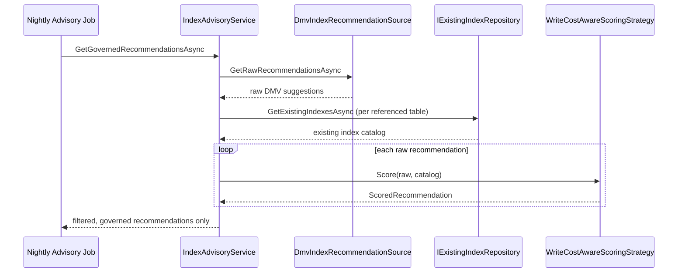

# Module 18 — SQL Server: Indexing & Query Execution Plans

> Domain: SQL Server | Level: Beginner → Expert | Prerequisite: [[../01-CSharp/05-LINQ-Internals]] (client-side evaluation, `IQueryable<T>` translation)

---

## 1. Fundamentals

### What is an index, and what is an execution plan?
An **index** is a separate, ordered data structure (predominantly a **B+ tree** in SQL Server) that lets the engine locate rows matching a search condition without scanning every row in a table — trading write cost (maintaining the index on every insert/update/delete) and storage space for dramatically faster reads on the indexed columns. An **execution plan** is the query optimizer's chosen strategy for physically executing a given query — which indexes to use, in what order to join tables, whether to sort/hash — and is the single most important diagnostic artifact for understanding and fixing query performance.

### Why do these exist?
Without an index, satisfying `WHERE CustomerId = 123` requires a **table scan** — reading every single row and checking the predicate, an O(n) operation regardless of how selective the condition is. An index turns this into an O(log n) B+ tree seek. The execution plan exists because SQL is **declarative** — you say *what* you want, not *how* to get it — and the optimizer, using table statistics (row counts, data distribution), must choose a physical strategy; understanding the plan it chose (and why) is the core diagnostic skill for all SQL Server performance work.

### When does this matter?
Every non-trivial query touching a table with more than a few thousand rows; the depth matters specifically for diagnosing "why is this query slow" (the single most common SQL Server interview and real-world scenario) and for designing indexes proactively rather than reactively.

### How does it work (30,000-ft view)?
```sql
CREATE NONCLUSTERED INDEX IX_Orders_CustomerId ON Orders(CustomerId) INCLUDE (OrderDate, Total);

SELECT OrderDate, Total FROM Orders WHERE CustomerId = 123;
-- Execution plan: Index Seek on IX_Orders_CustomerId (fast, O(log n) + matching rows)
-- instead of: Clustered Index Scan / Table Scan (O(n), reads every row)
```

---

## 2. Deep Dive

### 2.1 Clustered vs Nonclustered Indexes — the Physical Storage Distinction
A **clustered index** determines the **physical order** rows are stored on disk — a table has **at most one** (since data can only be physically sorted one way), typically on the primary key. A **nonclustered index** is a separate structure holding the indexed column(s) plus a **row locator** back to the actual data — for a table with a clustered index, that locator is the clustered index's key (the **clustering key**), meaning every nonclustered index seek requires a second lookup (a "key lookup"/"bookmark lookup") into the clustered index to retrieve any column not included in the nonclustered index itself — precisely why `INCLUDE` columns (the example) matter: including frequently-selected columns directly in the nonclustered index avoids this expensive second lookup entirely (a **covering index**).

### 2.2 Seek vs Scan — the Central Performance Distinction
An **Index Seek** navigates the B+ tree directly to matching rows using the search predicate — cost scales with the number of matching rows, not the table's total size. An **Index/Table Scan** reads every row in the index/table sequentially, checking the predicate against each — cost scales with total table size regardless of selectivity. A query plan showing a scan where a seek would be possible (usually because no suitable index exists, or because the predicate isn't **sargable**) is the single most common, most fixable SQL Server performance problem.

### 2.3 Sargability — Search ARGument ABLE Predicates
A predicate is **sargable** if the optimizer can use an index seek to evaluate it directly — wrapping an indexed column in a function (`WHERE YEAR(OrderDate) = 2024`) or an implicit type conversion (comparing a `varchar` column against an `nvarchar` literal, or an `int` column against a string literal) makes the predicate **non-sargable**, forcing the optimizer to evaluate the function/conversion **per row**, which requires scanning every row regardless of an otherwise-perfect index on that column. The fix is almost always to rewrite the predicate to leave the indexed column bare (`WHERE OrderDate >= '2024-01-01' AND OrderDate < '2025-01-01'` instead of `YEAR(OrderDate) = 2024`).

### 2.4 Statistics and Cardinality Estimation
The optimizer's plan choice depends heavily on **cardinality estimates** — its guess at how many rows a given predicate will match, derived from column **statistics** (a histogram of data distribution, sampled or fully scanned, auto-updated by default when enough rows change). **Stale statistics** (common after a large bulk load without a subsequent stats update) cause the optimizer to badly misjudge selectivity — potentially choosing a nested-loop join (efficient for a small estimated row count) when the actual row count is enormous, producing catastrophically slow execution despite a "correct" plan shape for the *estimated* (but wrong) cardinality.

### 2.5 Join Algorithms — Nested Loop, Merge, Hash
- **Nested Loop Join**: for each row in the (smaller) outer input, seek into the inner input — efficient when the outer input is small and the inner input has a supporting index; poor when the outer input is large (O(outer × inner-seek-cost)).
- **Merge Join**: both inputs pre-sorted (or sorted via an explicit sort operator) on the join key, merged in one linear pass — efficient for large, already-sorted inputs.
- **Hash Join**: builds an in-memory hash table from the smaller input, probes it with the larger input — efficient for large, unsorted inputs without a supporting index, at the cost of memory (and potential spill-to-disk if the hash table doesn't fit in the granted memory).
The optimizer chooses based on estimated cardinality — a bad cardinality estimate is the most common reason a "wrong" join algorithm gets chosen for the actual data volume.

### 2.6 Missing Index Recommendations and Their Limits
SQL Server's DMVs (`sys.dm_db_missing_index_details`) surface index recommendations based on queries actually executed — genuinely useful, but **naive and context-free**: they don't account for existing similar indexes (recommending near-duplicates), write-cost trade-offs, or column-order optimization across multiple queries — treat them as a starting hint requiring human judgment, never apply them blindly/automatically at scale.

## 3. Visual Architecture
```mermaid
graph TB
 Q[Query: WHERE CustomerId = 123] --> Opt[Optimizer: check statistics, cardinality]
 Opt -->|index exists, sargable, selective| Seek[Index Seek -- O(log n)]
 Opt -->|no index, or non-sargable predicate| Scan[Table/Index Scan -- O(n)]
 Seek --> Lookup{Columns beyond<br/>index key needed?}
 Lookup -->|Yes, not INCLUDEd| KeyLookup[Key Lookup into Clustered Index -- extra cost per row]
 Lookup -->|No, or covered by INCLUDE| Done[Return directly -- covering index]
```

## 4. Production Example
**Scenario**: A reporting query joining `Orders` to `Customers` on `CustomerId` degraded from ~200ms to over 30 seconds after a large data migration. **Investigation**: the execution plan showed a **Nested Loop Join** with an estimated outer-row-count of ~50 (stale statistics from before the migration) against an *actual* row count of ~2 million — the optimizer had chosen a nested-loop join appropriate for 50 rows, but was actually executing 2 million individual inner-side seeks. **Fix**: `UPDATE STATISTICS Orders WITH FULLSCAN` immediately corrected the cardinality estimate, and the optimizer automatically switched to a Hash Join on the next execution, restoring the original ~200ms performance with no query-text or index changes at all. **Lesson**: a "slow query" is very often not a missing-index problem at all — stale statistics causing a cardinality misestimate is one of the most common, and most trivially fixable (once diagnosed), root causes of a sudden, unexplained query-performance regression after a bulk data change.

## 5. Best Practices
- Always inspect the actual execution plan (not just the query text) before attempting any index/query change — diagnose the actual bottleneck (scan vs. seek, join algorithm, cardinality estimate accuracy) rather than guessing.
- Keep predicates sargable — never wrap an indexed column in a function/implicit conversion in a `WHERE` clause.
- Use covering indexes (`INCLUDE`) for frequently-run, read-heavy queries to eliminate key-lookup cost entirely.
- Update statistics proactively after large bulk loads, not only relying on the auto-update threshold.

## 6. Anti-patterns
- Wrapping indexed columns in functions in `WHERE` clauses (`WHERE UPPER(Email) = 'X'`), destroying sargability.
- Creating an index for every column combination speculatively "just in case," incurring substantial write-cost overhead without measured read benefit.
- Ignoring implicit conversions between mismatched column/parameter types, silently defeating an otherwise-correct index.
- Applying every DMV-suggested missing index blindly without evaluating overlap with existing indexes.

---

## 7. Performance Engineering

**CPU**: An index seek's CPU cost scales with matching rows plus B+ tree depth (typically 3-4 levels even for a multi-million-row table, since each level fans out by hundreds of entries) — a scan's CPU cost scales linearly with every row/page touched, which is why a seek-vs-scan misdiagnosis is the single biggest CPU-cost lever in this module's scope. A hash join's build phase is CPU-intensive proportional to the smaller input's row count; a sort operator (feeding a merge join, or satisfying an `ORDER BY` with no supporting index) is O(n log n) CPU cost that a covering, ordered index can eliminate entirely.

**Memory**: The optimizer requests a **memory grant** (for sort/hash workspace) sized from the same cardinality estimate driving plan selection — an underestimated grant causes a **spill to tempdb** (the sort/hash overflows to disk, visible in the plan as a `SpillToTempDb` warning, often a 10-100x slowdown for that operator); an overestimated grant wastes server memory and can starve concurrent queries waiting on `RESOURCE_SEMAPHORE` for their own grant. This is the same cardinality-estimation dependency as plan-shape selection (§2.4), just manifesting as a memory problem instead of a join-algorithm problem.

**Execution-plan/compilation cost**: Every distinct query text (or one lacking parameterization) triggers a fresh compilation, consuming CPU and plan-cache memory — non-parameterized ad-hoc SQL (string-concatenated literals instead of parameters) is a classic **plan cache bloat** anti-pattern: thousands of single-use plans evict genuinely reusable ones and add per-execution compilation overhead that stored procedures/parameterized queries avoid.

**Index write cost**: Every nonclustered index adds an update to every insert/update/delete touching its key or `INCLUDE` columns — a table with 8 indexes pays that cost 8 times per write; for a high-ingest FinTech ledger/order table, this is frequently the dominant cost driver, making "how many indexes does this table actually need" a genuine capacity-planning question, not just a design nicety.

**Benchmarking**: Use `SET STATISTICS TIME, IO ON` for logical reads/CPU/elapsed time per statement, and the actual execution plan's operator-level warnings (spill, memory grant, excessive actual-vs-estimated rows) as the primary diagnostic signal — never benchmark against an empty or freshly-reindexed table, since fragmentation and realistic data-skew change both seek cost and cardinality estimates materially.

**Caching**: SQL Server's **buffer pool** caches data/index pages in memory across executions — a "cold cache" first execution of a query touching pages not yet resident is dominated by physical I/O, while a warm cache serves entirely from memory; a working set (hot index pages for the most active accounts/instruments) that fits comfortably in buffer pool memory is a major, often-overlooked lever for OLTP latency, distinct from and additive to index design itself.

## 8. Security

**SQL injection and index/plan interaction**: String-concatenated dynamic SQL is both a classic injection vector *and* defeats the plan cache (each injected literal produces a distinct query text) — parameterized queries/stored procedures fix both problems simultaneously, which is a genuinely useful framing when explaining to a team why "just use parameters" is a security fix and a performance fix at once, not two separate asks.

**Least privilege**: Grant `ALTER INDEX`/`CREATE INDEX` rights narrowly (a dedicated DBA/release-automation role), not broadly to application service accounts — an application account only ever needs `SELECT`/`INSERT`/`UPDATE`/`DELETE` on its own schema, never DDL rights that could let a compromised application identity silently drop or degrade production indexes.

**Information disclosure via `INCLUDE` columns**: A covering index's `INCLUDE` list physically duplicates column data into the index's leaf pages — including a sensitive column (SSN, account number) purely to make one query covering widens that column's on-disk footprint and backup/restore exposure surface without a corresponding access-control benefit; weigh covering-index design against data-minimization, not purely against query speed.

**Encryption at rest (TDE)**: Transparent Data Encryption encrypts data and index pages transparently at the storage-engine I/O layer — seeks/scans operate on decrypted in-memory buffer-pool pages exactly as without TDE, so index design and query-plan behavior are unaffected by enabling it; the cost is at the physical I/O layer (page encrypt/decrypt), not the logical seek/scan cost.

**Audit logging**: Track DDL changes to indexes (`CREATE`/`DROP`/`ALTER INDEX`) via **SQL Server Audit** or Extended Events specifically — an unreviewed index drop by a well-intentioned cleanup script is a realistic, high-impact incident class (§14) in any production financial system, and having an audit trail of exactly who changed which index and when is the difference between a five-minute root-cause and a multi-hour one.

## 9. Scalability

**Read replicas**: Always On Availability Group **readable secondaries** offload reporting/analytical scans from the primary — but secondaries apply changes via log redo, not independent index maintenance, so a secondary's index state always trails the primary by the current redo lag; a reporting query relying on a secondary's index must tolerate that staleness, which matters materially for regulatory "as of now" reporting (cross-reference Module 19 Expert Q3).

**Partitioning**: Partition-aligned indexes (an index sharing the base table's partition scheme) enable **partition elimination** — a query with a predicate on the partition key only scans/seeks the relevant partition(s), not the whole table — essential for a billion-row time-series/ledger table's both reporting-scan and retention (`SWITCH`-based archival) story.

**Sharding**: Cross-shard index design is duplicated per shard with no engine-level cross-shard index — a query spanning shards requires application-level fan-out and merge, since no single B+ tree spans the shard boundary; index design decisions (covering columns, key order) must be made per-shard but are typically identical across shards for a uniformly-sharded schema.

**HA/DR**: Index rebuild/reorganize operations generate substantial transaction-log volume, which must ship to every synchronous/asynchronous secondary in an Always On AG — scheduling large index maintenance requires accounting for secondary log-shipping bandwidth and redo-thread catch-up capacity, not just primary-side resource availability, to avoid growing replication lag as a side effect of routine maintenance.

---

## 10. Interview Questions

### Basic (10)
1. **Q: What is a clustered index?** **A:** An index determining the physical storage order of a table's rows — a table can have at most one.
2. **Q: What is a nonclustered index?** **A:** A separate structure holding indexed columns plus a locator back to the actual row, of which a table can have many.
3. **Q: What's the difference between an index seek and a scan?** **A:** A seek navigates directly to matching rows (cost scales with matches); a scan reads every row (cost scales with table size).
4. **Q: What makes a predicate non-sargable?** **A:** Wrapping the indexed column in a function or implicit type conversion, preventing the optimizer from using an index seek.
5. **Q: What is a covering index?** **A:** An index containing (via key columns or `INCLUDE`) every column a query needs, avoiding a key lookup into the clustered index.
6. **Q: What is a key lookup?** **A:** An extra per-row lookup into the clustered index to retrieve columns not present in the nonclustered index used for the seek.
7. **Q: What are statistics, in SQL Server terms?** **A:** A histogram describing a column's data distribution, used by the optimizer to estimate query cardinality.
8. **Q: Name the three main join algorithms.** **A:** Nested loop (best for small outer inputs with an index on the inner side), merge (both inputs sorted on the join key), and hash join (large, unsorted inputs) — the optimizer chooses based on row-count estimates, which is why bad cardinality estimates produce the wrong join type.
9. **Q: Why might stale statistics cause a slow query?** **A:** The optimizer misestimates row counts, potentially choosing a join algorithm/plan shape appropriate for the wrong (stale) cardinality.
10. **Q: What does `sys.dm_db_missing_index_details` provide?** **A:** Index recommendations based on queries the engine has actually executed, requiring human judgment before applying.

### Intermediate (10)
1. **Q: Why does a nonclustered index's key lookup use the clustering key specifically?** **A:** Because the clustered index's key is what physically locates a row on disk — a nonclustered index's row locator is the clustering key precisely so it can navigate to the actual row via the clustered index.
2. **Q: Why does `WHERE YEAR(OrderDate) = 2024` prevent an index seek even with an index on `OrderDate`?** **A:** The optimizer must evaluate `YEAR(OrderDate)` for every row to know which match — the transformation happens per-row, so the index (ordered by the untransformed value) can't be navigated directly.
3. **Q: What's the trade-off of adding many nonclustered indexes to a heavily-written table?** **A:** Every index must be updated on every insert/update/delete affecting its columns — read performance improves but write throughput/latency degrades proportionally to the number of indexes maintained.
4. **Q: Why might a hash join be chosen over a nested loop join for a large, unsorted dataset without a supporting index?** **A:** Nested loop join's cost scales with outer-row-count × inner-seek-cost, catastrophic for a large outer input without an efficient inner seek; a hash join's single hash-table build plus linear probe scales better for large, unindexed inputs.
5. **Q: What causes an implicit conversion to silently defeat an index?** **A:** Comparing a column of one data type against a parameter/literal of an incompatible type forces SQL Server to convert one side for comparison — if it must convert the indexed column itself (rather than the literal), the comparison can no longer be evaluated via a direct index seek.
6. **Q: Why is `UPDATE STATISTICS... WITH FULLSCAN` sometimes necessary instead of relying on auto-update?** **A:** Auto-update triggers based on a percentage-of-rows-changed threshold and may use a sampled (not full) scan — after a very large bulk change, a full, precise statistics refresh can correct a cardinality estimate auto-update's sampling or threshold timing might miss.
7. **Q: Why does column order matter in a composite (multi-column) index?** **A:** A composite index is only seekable on a leading-column-prefix basis — an index on `(A, B)` supports seeks on `A` alone or `A AND B` together, but not on `B` alone, since the B+ tree is sorted by `A` first.
8. **Q: What's the danger of blindly applying every DMV missing-index suggestion?** **A:** They're generated independently per query pattern without awareness of other suggestions or existing indexes, often recommending near-duplicate or overlapping indexes that add write cost without meaningful additional read benefit.
9. **Q: Why might two functionally-identical queries (same results) have very different execution plans?** **A:** Different literal values/parameters can lead the optimizer to different cardinality estimates (parameter sniffing, a later Advanced topic), or subtly different predicate phrasing (sargable vs. not) leads to entirely different available strategies.
10. **Q: Why does covering an index with `INCLUDE` columns sometimes outperform simply adding those columns to the index key itself?** **A:** `INCLUDE` columns are stored only at the leaf level (not part of the B+ tree's sorted key structure), keeping the tree's intermediate/branch pages smaller and the index more efficient to traverse and maintain than if those columns were part of the key itself.

### Advanced (10)
1. **Q: Explain parameter sniffing and a scenario where it causes a query to perform well for one parameter value and catastrophically for another.**
 **A:** SQL Server caches a query plan based on the parameter values used during the *first* compilation ("sniffed") — if that first execution used an atypically selective value (producing a plan optimized for a small result set, e.g., a nested loop join), a later execution with a much less selective value (matching millions of rows) reuses the cached, now-inappropriate plan, causing catastrophic performance for that specific parameter despite the query text being identical; fixed via `OPTION (RECOMPILE)` (always recompile, no caching, trading plan-compilation CPU cost for accuracy), `OPTIMIZE FOR` hints, or query design avoiding highly-skewed parameter distributions.
2. **Q: Design an indexing strategy for a table serving both a high-frequency point lookup (`WHERE Id =?`) and an infrequent large reporting scan (`WHERE Region =? AND Date BETWEEN? AND?`), balancing write-cost against both read patterns.**
 **A:** A clustered index on `Id` (or an identity-based surrogate key) serves the point lookup natively; a separate nonclustered covering index on `(Region, Date)` with `INCLUDE` of the reporting query's other selected columns serves the reporting pattern — deliberately not combining both patterns into one index (which would poorly serve at least one of them), accepting the two-index write-cost trade-off since both read patterns are frequent/important enough to justify it.
3. **Q: Explain how index fragmentation occurs and its performance impact, and how you'd address it.**
 **A:** As rows are inserted/updated/deleted, B+ tree pages can split and become disordered relative to their logical sort order (external fragmentation) or contain increasing wasted free space (internal fragmentation) — both degrade scan efficiency (more physical I/O for the same logical data) and can reduce the effectiveness of read-ahead; addressed via periodic index reorganization (`ALTER INDEX... REORGANIZE`, online, lighter-weight) or rebuild (`ALTER INDEX... REBUILD`, more thorough, potentially more blocking) based on measured fragmentation percentage from `sys.dm_db_index_physical_stats`.
4. **Q: How would you diagnose whether a slow query's root cause is a missing index, stale statistics, or parameter sniffing, given only "this query used to be fast and now isn't"?**
 **A:** First capture the actual execution plan and compare **estimated** vs. **actual** row counts at each operator — a large discrepancy strongly indicates stale statistics or parameter sniffing (both manifest as cardinality misestimation); if estimated and actual counts match closely but the plan still shows a scan where a seek would help, that points to a genuinely missing/unsuitable index instead; distinguishing stale statistics from parameter sniffing specifically requires checking whether `UPDATE STATISTICS` alone resolves it (statistics issue) versus the problem recurring with a different parameter value on an otherwise-fresh-statistics table (sniffing).
5. **Q: Explain how a query's `TOP N` combined with `ORDER BY` on a non-indexed column can force a full sort of the entire table before returning only the top N rows, and how to fix it.**
 **A:** Without an index supporting the `ORDER BY` column's sort order, the optimizer must materialize and sort the *entire* qualifying result set before it can identify the top N — an index on the sort column (ideally covering the query's other needed columns) lets the optimizer instead perform an ordered index scan, stopping after N rows without sorting the full set at all, often a dramatic improvement for a large table with a small N.
6. **Q: Design a strategy for safely adding a new index to a very large, high-traffic production table without causing a blocking outage.**
 **A:** Use `CREATE INDEX... WITH (ONLINE = ON)` (Enterprise Edition) to build the index without holding a long-duration blocking lock on the table, allowing concurrent reads/writes throughout the build (at some throughput cost during the build); for editions/scenarios without online index support, schedule the build during a genuine low-traffic maintenance window, and always test the build's estimated duration/resource cost against a realistic staging-environment copy of production data volume beforehand.
7. **Q: Explain why an execution plan showing "Actual Number of Rows" far exceeding "Estimated Number of Rows" at a specific operator is a high-priority diagnostic signal, even if the query currently completes in acceptable time.**
 **A:** A large estimate/actual discrepancy indicates the optimizer's cardinality model is wrong for this query — even if the *current* chosen plan happens to tolerate the misestimate acceptably, the underlying statistics/parameter-sniffing issue is a latent risk that could produce a catastrophically different (and much worse) plan choice on a future execution with different data distribution or parameter values, making this worth investigating proactively rather than only reactively once it actually causes a visible slowdown.
8. **Q: How would you design monitoring to catch a query-performance regression from a cardinality-estimate issue before it becomes a customer-visible incident, generalizing the production example?**
 **A:** Track query-plan-cache statistics (`sys.dm_exec_query_stats`) for significant estimated-vs-actual-row-count deviations on the organization's top N most-executed/most-business-critical queries as a standing, automated health check, alerting when a tracked query's deviation crosses a threshold — converting the reactive "someone notices the report is slow" discovery pattern into a proactive, automated one that catches the underlying statistics-staleness issue before it manifests as a severe, customer-visible slowdown.
9. **Q: Explain the trade-off between `ALTER INDEX REORGANIZE` and `ALTER INDEX REBUILD` for addressing fragmentation, and how you'd decide which to use.**
 **A:** `REORGANIZE` is always online/non-blocking but slower and less thorough (defragments leaf-level pages incrementally); `REBUILD` fully recreates the index (more thorough, updates statistics with a full scan as a side effect) but historically required an offline/blocking operation unless using the `ONLINE = ON` option (Enterprise Edition) — a common decision heuristic: `REORGANIZE` for fragmentation in the 10–30% range, `REBUILD` (online, if available) above 30%, informed by `sys.dm_db_index_physical_stats`'s reported fragmentation percentage specifically, not a fixed schedule applied blindly regardless of actual measured fragmentation.
10. **Q: As a Principal Engineer, how would you build organizational capability so that "diagnose via the actual execution plan" becomes standard practice rather than guessing at index changes?**
 **A:** Require execution-plan analysis (with a specific focus on estimated-vs-actual row counts and seek-vs-scan operators) as a mandatory, documented step in any performance-related PR/incident investigation touching SQL Server, with a shared internal runbook/checklist (directly this course's recurring governance pattern) walking through the exact diagnostic sequence from Advanced Q4 — converting an experience-dependent diagnostic skill into a repeatable, teachable organizational process rather than tribal knowledge held only by the team's most experienced database-focused engineer.

### Expert (FinTech Principal Panel)

1. **Q: A high-ingest payments/orders table with a monotonically increasing clustered key (identity or `GETDATE`) hits a throughput ceiling under load — waits show `PAGELATCH_EX` on the last page. Explain the mechanism and how you fix "last-page insert contention."**
 **A:** Every insert with an ever-increasing key targets the **same final B-tree page**, so all concurrent inserters contend for an exclusive latch (`PAGELATCH_EX`) on that one hot page — a serialization point that no amount of CPU/IO fixes, because it's a logical hotspot, not a resource shortage. It's distinct from a lock (it's a physical-page latch) and is the classic scaling wall for sequential-key OLTP ingest. Fixes: (1) **spread the insert point** so writes hit many pages — e.g., a non-sequential key (a random GUID as clustered key trades contention for fragmentation/wider keys — usually a bad trade), or better, **hash/partition** the leading key column so concurrent inserts land on different partitions/pages; (2) **`OPTIMIZE_FOR_SEQUENTIAL_KEY = ON`** (SQL Server 2019+), an index option specifically designed to reduce last-page latch convoy contention; (3) **partition the table** (e.g., by a hash of account, or by a computed bucket) so there are N insert hotspots instead of one; (4) reduce time on the latch (narrower rows, fewer/leaner indexes so each insert does less work while holding it). The Principal framing: sequential keys give great range scans and locality but create a single-page write hotspot at high concurrency — recognize `PAGELATCH_EX` on the last page as the signature, and fix it by *distributing the insert point* (sequential-key optimization, hashing/partitioning) rather than throwing hardware at a logical serialization point.
 **Why correct:** Correctly identifies last-page latch contention (not a lock, not a resource limit) and prescribes distributing the insert point / `OPTIMIZE_FOR_SEQUENTIAL_KEY` / partitioning.
 **Common mistakes:** Confusing PAGELATCH with a lock; adding CPU/IO for a logical hotspot; switching to a random GUID clustered key without weighing fragmentation/key-width cost.
 **Follow-ups:** "PAGELATCH vs. lock vs. LATCH — differences?" / "Why is a random GUID clustered key usually a poor fix?" / "What does `OPTIMIZE_FOR_SEQUENTIAL_KEY` actually do?"

2. **Q: An append-only transaction ledger grows to billions of rows and must serve both `WHERE AccountId=? AND Date BETWEEN?` OLTP-ish lookups and large date-range reporting, while old data must be archived per retention policy. Design the indexing/partitioning, and state the trade-offs.**
 **A:** At this scale the design is **partitioning + purpose-built covering indexes + an archival strategy**, not just "add an index." (1) **Partition by date** (range partitioning, e.g., monthly) — this makes reporting date-range scans touch only relevant partitions (**partition elimination**) and, crucially, makes retention a **metadata operation**: aging out old data becomes `SWITCH`-ing out an old partition (near-instant) instead of a massive, log-generating `DELETE` that would bloat the log and block. (2) **Clustered index** aligned to the partition key + a discriminator (e.g., `(Date, AccountId, Id)` or a scheme that keeps account activity locatable) so range scans are sequential. (3) A **nonclustered covering index on `(AccountId, Date)` INCLUDE (amount, …)** to serve per-account history without touching the base rows. Trade-offs to state: more indexes = higher write cost on the hottest (ingest) path — so keep indexes minimal and lean toward covering the *actual* top queries; partitioning adds operational complexity (partition maintenance, aligned indexes) but is essential for retention and reporting at billions of rows; and the ingest hotspot (Q1) still applies to the newest partition. The Principal framing: a huge append-only ledger is a partitioning problem first (elimination for reads, `SWITCH` for retention) and a covering-index problem second, with a deliberate cap on index count to protect ingest throughput — you're balancing read patterns, write cost, and the operational reality of retention/archival, not optimizing a single query.
 **Why correct:** Leads with date partitioning (elimination + `SWITCH`-based retention), adds aligned clustered + covering indexes, and explicitly trades write cost/operational complexity against read and retention needs.
 **Common mistakes:** Deleting old rows with mass `DELETE` instead of partition `SWITCH`; over-indexing the ingest path; unpartitioned billion-row table forcing full scans for reporting.
 **Follow-ups:** "How does partition `SWITCH` make archival cheap?" / "Why must nonclustered indexes be partition-aligned?" / "How do you keep ingest fast despite the reporting indexes?"

3. **Q: Compliance needs "as-of" / point-in-time queries — what did this account's balance and this record look like on a past date — for audit and regulatory reporting. How do you model and index this, and what are the pitfalls?**
 **A:** Two mainstream approaches: (1) **System-versioned temporal tables** (SQL Server 2016+) — the engine keeps a history table automatically and `FOR SYSTEM_TIME AS OF @date` returns the row as it existed then; index the history table on `(key, ValidTo/ValidFrom)` so as-of lookups seek rather than scan, and be aware the history table grows unbounded (needs its own retention/partitioning) and captures *physical* change times, which may differ from *business* effective dates. (2) **Effective-dated / bitemporal modeling** — explicit `ValidFrom/ValidTo` (business time) and possibly a separate transaction time, giving full **bitemporal** control (what we knew, and when it was true), which finance often needs because a correction backdated to a past business date is different from when the system recorded it. Index on `(key, ValidFrom, ValidTo)` for range containment. Pitfalls: conflating *system* time (when stored) with *business/effective* time (when true) — regulators care about the latter, and system-versioned tables alone don't model backdated corrections well; unbounded history growth without partitioning; and as-of queries that scan history for lack of a supporting index. For a ledger specifically, the append-only immutable design already gives point-in-time reconstruction (sum entries up to a date) — often the cleanest as-of story. The Principal framing: pick temporal tables for automatic *system-time* history, but reach for explicit **bitemporal** effective-dating when the business needs backdated corrections and "as-of-knowledge" queries — and always index the time columns and plan history-table retention, because audit queries at scale are otherwise full scans.
 **Why correct:** Covers temporal tables vs. explicit bitemporal effective-dating, indexes the time columns, flags the system-vs-business-time pitfall and history growth, and connects to the ledger's natural point-in-time reconstruction.
 **Common mistakes:** Assuming system-versioned time equals business effective date; no index on validity columns (scans); unbounded history table; ignoring backdated corrections.
 **Follow-ups:** "System time vs. business time — why does a backdated correction break the naive model?" / "How do you keep the temporal history table's size manageable?" / "How does an append-only ledger give you as-of balances for free?"

4. **Q: A firm wants a real-time, always-current aggregate (e.g., net position per instrument) computed from a high-ingest trades table, without hitting the aggregate query's cost on every read. Design this using an indexed view, and explain the restrictions/trade-offs.**
 **A:** SQL Server's **indexed view** (a materialized, `SCHEMABINDING`-bound view with a unique clustered index) physically stores the aggregated result and — critically — **maintains it transactionally, synchronously, on every underlying `INSERT`/`UPDATE`/`DELETE`** to the base table(s), so reads never see a stale aggregate and never pay the aggregation cost at read time. Requirements/restrictions: the view must be `SCHEMABINDING`'d (base tables can't be altered incompatibly without dropping the view first), aggregates are restricted to a specific deterministic subset (`SUM`, `COUNT_BIG`, no `AVG`/`MAX`/`MIN` directly — compute `AVG` from `SUM`/`COUNT_BIG`), no outer joins, and several session `SET` options must be fixed (`ANSI_NULLS`, `QUOTED_IDENTIFIER`, etc.). The trade-off is symmetrical to any index: every write to the base trades table now also maintains the indexed view's clustered index synchronously, adding write latency/cost — appropriate specifically when the read pattern is frequent/latency-critical (a live risk dashboard) and the write volume/latency budget can absorb the added maintenance cost; for a very high-ingest table where writes are the bottleneck, a periodically-refreshed columnstore or a stream-processing aggregation (Kafka Streams/ksqlDB) pattern is usually the better trade rather than forcing every write to pay synchronous view-maintenance cost.
 **Why correct:** Explains the synchronous, transactional maintenance mechanism, states the real restrictions (SCHEMABINDING, deterministic aggregates, no outer joins), and correctly frames the write-cost trade-off against read-latency benefit.
 **Common mistakes:** Confusing an indexed view with a periodically-refreshed materialized view (SQL Server's is always synchronously current, not refresh-on-schedule); forgetting the aggregate-function restrictions; not weighing added write cost against the high-ingest table's throughput budget.
 **Follow-ups:** "Why is `AVG` not directly supported?" (It isn't incrementally maintainable from a single stored value the way `SUM`/`COUNT_BIG` are — the engine requires you to store both and divide.) / "When would you prefer a columnstore over an indexed view for this?" (When the write-latency budget can't absorb synchronous maintenance and near-real-time, not synchronously-instant, freshness is acceptable.)

5. **Q: A columnstore index is proposed for a historical trade/ledger analytics table currently served by rowstore indexes. Explain the internal difference and when this is the right call.**
 **A:** A rowstore (B+ tree) index stores data row-by-row, optimized for point lookups/range seeks touching a small number of columns out of many; a **columnstore index** stores data column-by-column in compressed **segments** (each covering ~1 million rows), optimized for scanning a small number of columns across a very large number of rows — exactly the shape of analytical aggregation queries (`SUM(Amount) GROUP BY InstrumentId, Month`) common in ledger/trade reporting. Columnstore's **batch-mode execution** processes ~900 rows at a time instead of row-by-row, and per-segment **min/max metadata** enables **segment elimination** (skipping entire segments that can't match a predicate) analogous to partition elimination but at a finer grain. The trade-off: columnstore is poor for OLTP-style point lookups/frequent single-row updates (updates are handled via a delete-bitmap-plus-new-row mechanism, and heavy OLTP churn fragments the columnstore, requiring periodic reorganization to merge delta-store rowgroups back into compressed segments) — the right call specifically for a large, append-heavy or batch-loaded historical/analytical table serving aggregation-heavy reporting, not for the same table's live, high-frequency OLTP write path (which should keep its rowstore indexes, or the table should be split into an OLTP-current + archived-columnstore-historical pair).
 **Why correct:** Explains column-store physical layout, batch-mode execution, segment elimination, and correctly scopes the recommendation to analytical/reporting workloads rather than OLTP.
 **Common mistakes:** Adding columnstore to a table still under heavy single-row OLTP churn without considering delta-store fragmentation; assuming columnstore replaces rowstore indexes rather than complementing them for different workload shapes; ignoring segment elimination's dependence on data being reasonably sorted/loaded in a predicate-aligned order.
 **Follow-ups:** "What is the delta store?" (A rowstore holding recently-inserted/updated rows not yet compressed into columnstore segments, merged in periodically.) / "Can a table have both a columnstore and rowstore index?" (Yes — a nonclustered columnstore alongside the table's normal rowstore clustered/nonclustered indexes, common for a "mostly OLTP, occasionally analytical" table.)

6. **Q: An `Orders` table has 50 million historical rows but only ~50,000 are currently "open"/actionable — the OLTP hot path only ever queries open orders. Design an index minimizing both storage and write cost for this access pattern.**
 **A:** A **filtered index** — `CREATE NONCLUSTERED INDEX IX_Orders_Open ON Orders(AccountId, Status) INCLUDE (...) WHERE Status IN ('Open','PartiallyFilled')` — indexes only the qualifying subset of rows, giving three compounding benefits: (1) the index is orders of magnitude smaller (indexing 50K rows instead of 50M), so it fits far more effectively in buffer pool memory and is dramatically cheaper to seek/scan; (2) write cost is paid only when a row's *current* state matches the filter predicate — an already-closed historical order being updated for an unrelated reason doesn't touch this index at all; (3) statistics on a filtered index are scoped to just the filtered subset, giving the optimizer a much more accurate cardinality estimate for open-order queries than a full-table index's statistics would. The caveat: the query's predicate must be provably compatible with (a subset of, or matching) the filter predicate for the optimizer to consider the filtered index at all — a query filtering on `Status = 'Cancelled'` obviously can't use it, and even a query using `Status = 'Open'` via a parameter rather than a literal can, in some cases, require `OPTION (RECOMPILE)` for the optimizer to prove compatibility at compile time rather than runtime.
 **Why correct:** Correctly identifies the filtered-index solution and explains all three benefits (size, write cost, statistics accuracy) plus the predicate-compatibility caveat.
 **Common mistakes:** Indexing the full 50M-row table when only the hot 50K-row subset is ever queried; not realizing filtered-index statistics are scoped to the filter and are more accurate for that subset than the table's general statistics.
 **Follow-ups:** "Why might a parameterized query fail to use a filtered index while the literal-value version succeeds?" (The optimizer must prove the parameter's possible values are always compatible with the filter at compile time, which a literal makes trivial and a parameter can require `OPTION (RECOMPILE)` or `OPTIMIZE FOR` to resolve.) / "How does this compare to partitioning the table by status?" (Partitioning is a heavier-weight, whole-table physical reorganization; a filtered index is a lightweight, targeted structure for one specific hot-subset access pattern.)

7. **Q: A nightly index-rebuild maintenance job on a multi-terabyte `Trades` table must complete within a shrinking maintenance window, and the table is now too large to rebuild in one pass without risking a missed window. What SQL Server capability addresses this, and how does it work internally?**
 **A:** **Resumable Online Index Rebuild** (SQL Server 2017+, Enterprise Edition) lets an `ALTER INDEX... REBUILD WITH (ONLINE = ON, RESUMABLE = ON)` operation be explicitly **paused** (`ALTER INDEX... PAUSE`) — e.g., when the maintenance window closes — and **resumed** later (`ALTER INDEX... RESUME`) from its last committed progress point, rather than restarting from scratch or being forcibly killed mid-operation. Internally, it works by breaking the rebuild into internally-tracked batches, each committed as it completes, with the operation's log-space requirements bounded (unlike a traditional single-transaction rebuild, whose log growth is proportional to the entire index size) — this bounded-log-growth property is itself often the primary reason to use it even independent of the pause/resume capability, since a giant traditional rebuild's log growth can itself threaten to fill the transaction log on a busy production database. The trade-off: resumable rebuilds have a small additional overhead versus a traditional one-shot online rebuild, and require Enterprise Edition — justified specifically when the maintenance-window constraint or the log-growth risk (or both) make a traditional single-pass rebuild operationally unsafe.
 **Why correct:** Explains the pause/resume mechanism, the internal batched-commit implementation, and the bounded-log-growth benefit as often the more important reason to adopt it.
 **Common mistakes:** Thinking resumable rebuild is purely about pause/resume convenience without recognizing the bounded transaction-log growth as an equally important, often primary, motivation.
 **Follow-ups:** "What happens if the connection running the rebuild is lost mid-operation without an explicit PAUSE?" (The operation remains resumable from its last internally-committed batch — it doesn't need to have been explicitly paused to be resumable later.) / "Does this require Enterprise Edition?" (Yes, as of the versions where it was introduced — a real cost/licensing consideration for the recommendation.)

8. **Q: After a routine deployment, a previously-fast stored procedure regresses badly in production, but `UPDATE STATISTICS` doesn't fix it. How do you use Query Store to diagnose and remediate this specific class of regression, and how does it differ from the stale-statistics fix in §4?**
 **A:** **Query Store** (SQL Server 2016+) persistently records every plan compiled for a query along with its runtime performance metrics over time — critically, unlike the plan cache (which is ephemeral and shows only the *current* plan), Query Store lets you directly compare the query's plan and performance **before and after the deployment**, immediately distinguishing "the plan changed" (a genuine plan regression, often from parameter sniffing on a newly-compiled plan, a statistics update, or a schema/index change shipped in the deployment) from "the plan is the same but runs slower" (pointing instead at a data-volume/contention change, not a plan problem at all). If Query Store confirms a plan regression specifically, **`sp_query_store_force_plan`** can pin the query to its previously-good plan immediately — a fast, safe mitigation buying time to properly diagnose *why* the optimizer chose the new plan, without needing to modify application code or wait for a stats-driven fix to naturally occur. This differs from the §4 stale-statistics incident specifically: that regression had *no* plan change at all (the same nested-loop plan just became wrong for the new data volume) and was fixed by correcting the input (statistics) the optimizer used; a Query-Store-diagnosed regression often *is* a plan change, requiring either forcing the prior plan or addressing why the optimizer's new choice is worse (e.g., a bad parameter-sniffing compile).
 **Why correct:** Explains Query Store's before/after comparison capability, distinguishes plan-change regressions from same-plan slowdowns, and correctly contrasts this diagnostic path with the different §4 stale-statistics scenario.
 **Common mistakes:** Reflexively running `UPDATE STATISTICS` for every regression without first checking via Query Store whether the plan actually changed; not knowing `sp_query_store_force_plan` exists as an immediate, safe mitigation.
 **Follow-ups:** "Is forcing a plan a permanent fix?" (No — it's a stabilizing mitigation; the underlying reason the optimizer chose a worse plan should still be investigated and, ideally, addressed so forcing isn't relied on indefinitely.) / "What Query Store setting controls how much history is retained for this kind of before/after comparison?" (`QUERY_CAPTURE_MODE` and the retention/cleanup policy, which must be sized to actually retain data spanning the deployment being investigated.)

9. **Q: A high-ingest table's inserts occasionally show severe waits on `PAGELATCH_EX` against **tempdb** pages (not the base table), correlating with heavy sort/hash-spill activity from a set of poorly-indexed reporting queries running concurrently. Diagnose the mechanism and the fix, distinguishing it from Expert Q1's base-table last-page contention.**
 **A:** This is **tempdb allocation-page contention** — a distinct mechanism from Expert Q1's base-table last-page latch contention, though superficially similar. When many concurrent sessions need to allocate new pages in tempdb (for sort/hash spills, worktables, or the version store under RCSI/Snapshot Isolation), they all contend for the same small set of allocation metadata pages (GAM/SGAM/PFS pages) tracking free space — a genuine, well-known SQL Server scalability bottleneck at high concurrency, independent of any specific user table's key design. The fix has two standard parts: (1) **multiple tempdb data files** (a long-standing best practice — typically one file per up-to-8 logical CPU cores, all pre-sized equally) spreads the allocation-page contention across multiple files' independent allocation structures instead of one; (2) **trace flags 1117/1118** (or, on modern SQL Server versions, this behavior is default-on) ensure all tempdb files grow together proportionally and use uniform extent allocation, both reducing allocation-page hot-spotting. Critically, the *root* fix here is still addressing the poorly-indexed reporting queries causing the spills in the first place (§7's spill discussion) — the tempdb file configuration mitigates the *symptom's* severity under concurrent load, but eliminating unnecessary spills via correct indexing removes the underlying tempdb pressure entirely.
 **Why correct:** Correctly distinguishes tempdb allocation-page contention from base-table last-page latch contention, prescribes the standard multiple-tempdb-files/trace-flag mitigation, and correctly identifies the poorly-indexed queries causing spills as the actual root cause to fix.
 **Common mistakes:** Confusing this with Expert Q1's base-table sequential-key contention (different resource, different fix); treating multiple tempdb files as a complete fix rather than a mitigation for a root cause (unnecessary spills) that should also be addressed.
 **Follow-ups:** "Why does RCSI/Snapshot Isolation add to this specific contention class?" (Its version store lives in tempdb, so a database-wide switch to RCSI adds a new, continuous source of tempdb allocation activity on top of whatever spill activity already existed.) / "How many tempdb files is 'enough'?" (A common starting heuristic is one file per logical core up to 8, then evaluate contention via `sys.dm_os_waiting_tasks` before adding more — not an unlimited scale-out lever.)

10. **Q: A firm's regulatory best-execution report joins `Orders` to `Fills` to `MarketQuotes` (three large tables) and has run correctly for years, but a routine SQL Server version upgrade (with the database's compatibility level subsequently bumped to match) causes the report's plan to regress badly, involving a much less efficient join order. Diagnose using the Cardinality Estimator's history, and design the mitigation.**
 **A:** SQL Server's **Cardinality Estimator (CE)** was substantially rewritten starting with SQL Server 2014 — the new CE uses different, generally more accurate-on-average assumptions for multi-predicate correlation and join-cardinality estimation than the legacy (pre-2014) CE, but "more accurate on average" doesn't mean "strictly better for every query" — a specific query whose actual data-correlation pattern happens to align well with the *legacy* CE's simpler independence assumptions can regress when the newer CE's different assumptions produce a worse estimate for that particular join shape, exactly the scenario here: bumping database compatibility level (which is what actually switches which CE version is used, independent of the underlying engine version itself) changed the CE the optimizer uses for cardinality estimation on the three-way join, producing a different, worse-performing join order and algorithm choice. Diagnosis: compare the pre-upgrade and post-upgrade actual execution plans (Query Store, if it was already capturing history through the upgrade, is ideal for this exact before/after comparison, §Expert Q8) — a materially different join order/algorithm coinciding precisely with the compatibility-level change, not any code/data change, is the signature. Mitigation options, in order of preference: (1) use **Query Store to force the prior, known-good plan** (§Expert Q8) as an immediate, safe stabilization; (2) for the specific regressed query only, add `OPTION (USE HINT('FORCE_LEGACY_CARDINALITY_ESTIMATION'))` (or the query-level `QUERYTRACEON`/hint equivalent) rather than reverting the *entire* database's compatibility level, since a full compatibility-level rollback forfeits every other optimizer improvement the upgrade brought, for the sake of one regressed query; (3) as a longer-term fix, update statistics with `FULLSCAN` and re-evaluate whether an index change (not just a CE-version workaround) better serves the new CE's estimation model for this specific join pattern.
 **Why correct:** Correctly identifies compatibility level (not the raw engine version) as what actually controls CE version, explains why "generally more accurate" doesn't guarantee no regressions, and prescribes query-scoped mitigation (Query Store forcing, or a targeted legacy-CE hint) over a blanket database-wide compatibility-level rollback.
 **Common mistakes:** Assuming a SQL Server engine upgrade alone (without a compatibility-level change) would trigger this, when it's specifically the compatibility level that selects the CE version; reflexively reverting the entire database's compatibility level to fix one regressed query, forfeiting every other query's CE improvements in the process.
 **Follow-ups:** "Why does the database compatibility level control CE version rather than the engine's own build number?" (A deliberate Microsoft design choice letting an instance run a newer engine while individual databases opt into CE behavior changes independently and gradually, precisely to limit exactly this kind of upgrade-triggered regression blast radius.) / "How would you test for this risk *before* a planned upgrade?" (Run the organization's top N business-critical queries' plans under the new compatibility level in a staging environment first, using Query Store's plan-comparison tooling, rather than discovering regressions only after a production compatibility-level bump.)

---

## 11. Coding Exercises

### Easy — Fix a non-sargable predicate
```sql
-- BEFORE: non-sargable, forces a scan even with an index on OrderDate
SELECT * FROM Orders WHERE YEAR(OrderDate) = 2024;

-- AFTER: sargable, enables an index seek on OrderDate
SELECT * FROM Orders WHERE OrderDate >= '2024-01-01' AND OrderDate < '2025-01-01';
```

### Medium — Design a covering index for a reporting query
```sql
-- Query: SELECT OrderDate, Total, Status FROM Orders WHERE CustomerId = @id AND Status = 'Shipped';
CREATE NONCLUSTERED INDEX IX_Orders_CustomerId_Status ON Orders(CustomerId, Status) INCLUDE (OrderDate, Total);
-- Composite key (CustomerId, Status) supports the equality filter on both; INCLUDE avoids a key lookup
-- for OrderDate/Total, since they're needed in the SELECT list but not the filter.
```

### Hard — Diagnose and fix a stale-statistics-driven join regression
```sql
-- Diagnostic: compare estimated vs actual rows in the plan (via SET STATISTICS XML ON, or Include Actual Execution Plan)
-- Symptom found: Estimated Rows = 52, Actual Rows = 2,043,981 at the Orders scan operator.

UPDATE STATISTICS Orders WITH FULLSCAN;
-- Re-run the query -- optimizer now correctly estimates cardinality and switches
-- from Nested Loop Join to Hash Join automatically, no query/index change needed.
```
**Discussion**: This is the single highest-value, lowest-effort fix in this entire module's toolkit — always rule out stale statistics via estimated-vs-actual comparison before assuming a missing index or rewriting the query.

### Expert — Diagnose and fix a parameter-sniffing regression
```sql
-- Symptom: the same stored procedure is fast for most CustomerIds but catastrophically
-- slow for a few "power user" CustomerIds with a much larger order history.

CREATE PROCEDURE GetCustomerOrders @CustomerId INT
AS
BEGIN
 SELECT OrderDate, Total FROM Orders WHERE CustomerId = @CustomerId
 OPTION (RECOMPILE); -- always compile a fresh, cardinality-appropriate plan for THIS specific @CustomerId,
 -- trading a small per-call compilation cost for eliminating the sniffing risk entirely
END
```
**Discussion**: `OPTION (RECOMPILE)` is the correct fix specifically when parameter value distribution is highly skewed enough that no single cached plan serves all values well — for less skewed distributions, `OPTIMIZE FOR UNKNOWN` (using average/typical cardinality rather than the first-sniffed value) is a lighter-weight alternative avoiding per-call recompilation cost while still reducing sensitivity to any one atypical first execution.

---

## 12. System Design

**Scenario**: Design the query-and-indexing layer for a **real-time trade blotter service** at a mid-size broker-dealer — traders and risk desks need sub-200ms views of "my current open orders and fills," while compliance/back-office needs historical range queries ("all trades for account X between two dates") against the same underlying data, and a nightly batch settlement job needs to scan large date ranges without degrading the live trading day.

- **Functional requirements**: Live open-order/fill lookups by account/instrument (point-lookup-shaped); historical range queries by account+date (range-scan-shaped); nightly batch settlement scans by full-day date range; all three against data flowing from the same continuous order/execution ingest stream.
- **Non-functional requirements**: p99 < 200ms for the live blotter lookup during market hours; the nightly batch scan must not measurably degrade live trading-hour latency; index/statistics maintenance must fit within a defined overnight/weekend maintenance window; the system must support point-in-time ("as of") reconstruction for regulatory inquiry.
- **Architecture**: A single SQL Server OLTP database (Always On Availability Group, one primary + one synchronous secondary for HA, one asynchronous readable secondary for reporting/back-office offload) is the source of truth, fed by an ingest pipeline (order/execution events land via a message queue into a staging table, then upserted into the main `Orders`/`Executions` tables inside short transactions). The `Orders` table is **range-partitioned by trade date**, with the current day's partition kept small and hot, aligned nonclustered covering indexes on `(AccountId, Status)` (a filtered index scoped to open/actionable orders, per Expert Q6) serving the live blotter path, and a separate `(AccountId, TradeDate)` covering index serving the historical range-query path. The nightly batch settlement job runs against the **asynchronous readable secondary**, not the primary, so its large date-range scans never contend for locks/CPU with live trading-hour OLTP traffic (§9) — accepting a small, well-understood replication-lag staleness window for the batch's own read, which is acceptable since settlement runs after market close against a definitionally-closed trading day.
- **Data model**: `Orders(OrderId PK, AccountId, InstrumentId, Status, TradeDate, ...)` clustered on `(TradeDate, OrderId)` (aligning the clustered key with the partition scheme, per §9), with the filtered `IX_Orders_Open` covering index and the `(AccountId, TradeDate)` covering index as described. `Status` moves through a `NOT_STARTED → EXECUTING → FILLED | CANCELLED` lifecycle exactly mirroring this course's standing status-enum convention; every status transition is a single, short, indexed `UPDATE` guarded by an idempotency/version check.
- **Caching**: A short-TTL (2-5 second) read-through cache (Redis) sits in front of the live-blotter query path specifically, since the same "my open orders" view is polled repeatedly by the same trader's UI — this reduces buffer-pool/index pressure far more than any further index tuning could for a read-repeated-many-times-per-second pattern.
- **Messaging**: Order/execution events arrive via a durable queue (Kafka/MSMQ-style), consumed idempotently (unique constraint on the event's idempotency key, per Module 19 Expert Q4) into the staging-then-upsert pipeline, decoupling ingest burstiness from the OLTP database's own write capacity.
- **Scaling/failure handling**: The readable secondary absorbs reporting/batch load (§9); a secondary outage degrades reporting/batch freshness but never the primary's live-blotter availability (an intentional failure-isolation boundary); a primary failover (Always On automatic failover) is transparent to the live-blotter path within the AG's defined RPO/RTO, at the cost of a brief connection-retry window the client tier must handle gracefully.
- **Monitoring**: Query Store (Expert Q8) tracks per-query plan stability across every deployment; execution-plan estimated-vs-actual row-count deviation is monitored continuously for the top N business-critical queries (Advanced Q8 of §10); replication lag on the readable secondary is monitored explicitly and surfaced to the batch job so a lag beyond a defined threshold delays, rather than silently runs against stale data.
- **Trade-offs**: Splitting live-OLTP and reporting/batch traffic across primary/secondary adds AG operational complexity (failover testing, lag monitoring) versus a single-database design, accepted because it structurally guarantees the batch job can never be the cause of a trading-hours latency incident — directly the same class of fix as the reporting-query-blocks-writes lesson in Module 19 §4, applied here at the infrastructure-topology level instead of the isolation-level setting.

## 13. Low-Level Design

**Scenario**: Design a small, reusable **Missing-Index Advisory Service** that wraps SQL Server's raw `sys.dm_db_missing_index_details` DMV output (§2.6) with the human judgment layer §2.6 says is required — deduplicating near-identical suggestions, estimating write-cost impact, and scoring recommendations before a human ever sees them, directly operationalizing the Advanced Q10 governance guidance.

### Class Diagram


```csharp
public interface IIndexScoringStrategy
{
    ScoredRecommendation Score(RawIndexRecommendation raw, ExistingIndexCatalog existing);
}

public sealed class WriteCostAwareScoringStrategy : IIndexScoringStrategy
{
    public ScoredRecommendation Score(RawIndexRecommendation raw, ExistingIndexCatalog existing)
    {
        // Penalize recommendations overlapping an existing index's leading-column prefix (§Intermediate Q7)
        // instead of surfacing a near-duplicate suggestion the DMV itself has no awareness of.
        bool overlapsExisting = existing.HasOverlappingLeadingColumns(raw.Table, raw.EqualityColumns);
        decimal estimatedWriteCostImpact = existing.GetTableWriteFrequency(raw.Table) * raw.EqualityColumns.Count;

        return new ScoredRecommendation(raw, overlapsExisting, estimatedWriteCostImpact,
            recommended: !overlapsExisting && raw.AvgUserImpact > 70m);
    }
}

public sealed class IndexAdvisoryService
{
    private readonly IIndexRecommendationSource _source;
    private readonly IIndexScoringStrategy _scoring;
    private readonly IExistingIndexRepository _existingIndexRepo;

    public IndexAdvisoryService(IIndexRecommendationSource source, IIndexScoringStrategy scoring,
        IExistingIndexRepository existingIndexRepo)
        => (_source, _scoring, _existingIndexRepo) = (source, scoring, existingIndexRepo);

    public async Task<IReadOnlyList<ScoredRecommendation>> GetGovernedRecommendationsAsync()
    {
        var raw = await _source.GetRawRecommendationsAsync;
        var catalog = await ExistingIndexCatalog.BuildAsync(_existingIndexRepo, raw);
        return raw.Select(r => _scoring.Score(r, catalog)).Where(s => s.Recommended).ToList;
    }
}
```

### Sequence Diagram


### Design Patterns / SOLID / Concurrency
- **Strategy pattern**: `IIndexScoringStrategy` isolates the scoring/governance heuristic from DMV data access, letting the scoring rule evolve (e.g., adding a table-size-based penalty) without touching the DMV-reading code — directly the extensibility point Advanced Q10's governance process needs.
- **Repository pattern**: `IExistingIndexRepository` abstracts existing-index lookup so the scoring strategy can be unit-tested against a fake catalog without a live database connection.
- **S**ingle Responsibility: `DmvIndexRecommendationSource` only reads DMV data; `WriteCostAwareScoringStrategy` only scores; `IndexAdvisoryService` only orchestrates — each independently testable and replaceable.
- **O**pen/Closed: a new scoring heuristic is added as a new `IIndexScoringStrategy` implementation, not by modifying the existing one or the orchestrating service.
- **Concurrency/thread-safety**: The service is read-only against DMVs (no locking concerns of its own); it should be run as a scheduled, single-instance nightly job (not concurrently from multiple hosts) since DMV snapshot data is a point-in-time view whose interpretation assumes a single, consistent read — running it concurrently from multiple hosts risks producing conflicting, differently-timed recommendation sets with no benefit.

## 14. Production Debugging

### Incident: Trading-hours full-scan storm from an ORM-introduced implicit conversion
- **Symptoms**: Mid-morning during peak trading hours, the `Orders` blotter API's p99 latency jumped from ~40ms to over 4 seconds, with CPU on the primary database spiking to sustained 95%+; no schema, index, or data-volume change had occurred that day.
- **Investigation**: The actual execution plan for the blotter's core query showed a full **Clustered Index Scan** on `Orders` where an Index Seek on `IX_Orders_Open` had run the previous day — comparing query text between the two days revealed a same-morning application deployment had changed the account-id parameter's declared type from `int` to `string` in a newly-adopted ORM mapping layer, while the underlying `AccountId` column remained `int`.
- **Tools**: `SET STATISTICS XML ON` and the Plan Explorer view to compare the actual plan's operator tree before/after; `sys.dm_exec_query_stats` to confirm the query text/parameter type had changed at the exact deployment timestamp.
- **Root cause**: An **implicit conversion** (§2.3) — comparing the `int` `AccountId` column against a `string`-typed parameter forced SQL Server to convert the *column* side per row (since data-type precedence rules convert the lower-precedence type, and `string`/`varchar` outranks `int` in SQL Server's conversion precedence for this specific comparison), destroying sargability and forcing a full scan for every single blotter lookup, exactly as covered in §2.3/Intermediate Q5 but now surfacing as a real deployment-triggered production incident rather than a hypothetical.
- **Fix**: Reverted the ORM parameter type mapping to `int`, restoring the Index Seek immediately with zero database-side changes; added a regression test asserting the blotter query's execution plan uses an Index Seek (not a scan) against a realistic data volume, run in CI against every future ORM/mapping-layer change.
- **Prevention**: Added implicit-conversion detection to the standard pre-deployment checklist — running `sys.dm_exec_query_stats` joined to a check for mismatched declared-vs-column data types on the organization's top N business-critical queries as an automated CI gate, converting a class of bug that previously required a live production incident to surface into one caught before deployment.

## 15. Architecture Decision

**Decision**: How to scale read capacity for a growing mix of live OLTP blotter lookups and heavier back-office/compliance reporting queries against the same trade data, once a single, well-indexed primary database's CPU/IO is no longer sufficient headroom for both workloads together.

| Option | Advantages | Disadvantages | Cost | Complexity | Maintainability | Performance | Scalability | Ops Overhead |
|---|---|---|---|---|---|---|---|---|
| **A. Add more/better covering indexes on the primary only** | Simplest change; no new infrastructure; directly addresses specific slow queries | Doesn't separate OLTP and reporting *load*, only *query efficiency* — a sufficiently large reporting scan still competes for the same CPU/IO/buffer-pool as live trading traffic; each new index adds write cost (§7) | Low | Low | High short-term, degrades as index count grows | Improves specific queries, doesn't fix contention | Limited — bounded by one server's total capacity | Low |
| **B. Always On readable secondary for reporting/batch, primary reserved for live OLTP** | Structurally isolates reporting/batch load from live trading-hours latency (the §12 design); readable secondary can carry its own reporting-specific indexes not needed on the primary | Adds AG operational complexity (failover testing, replication-lag monitoring); reporting queries tolerate a small, bounded staleness window | Medium (AG licensing/infrastructure already common at this scale) | Medium | Good, well-understood pattern | Excellent for both workloads once separated | Good — secondary can scale independently for reporting growth | Medium (AG monitoring, lag alerting) |
| **C. ETL/replicate into a dedicated analytical store (columnstore warehouse) for reporting** | Reporting workload fully isolated on dedicated, purpose-built analytical infrastructure; can use columnstore (Expert Q5) freely without any OLTP write-path concern at all | Highest staleness (batch/CDC-driven ETL lag, typically minutes-to-hours, not seconds); highest build/ops cost; a second data model/pipeline to maintain and keep correct | High | High | Requires a dedicated data-engineering ownership model | Best for genuinely large-scale historical analytics | Best — scales independently of the OLTP system entirely | High (ETL/CDC pipeline ownership, schema drift risk) |

**Recommendation**: **Option B** (Always On readable secondary) for this scenario — it directly addresses the stated problem (live-OLTP-vs-reporting contention) with staleness (replication lag, typically sub-second to low-seconds under healthy conditions) well within back-office/compliance reporting's actual tolerance, at moderate incremental cost given the AG infrastructure a regulated trading system needs for HA/DR regardless. **Option C** becomes the right upgrade specifically once reporting needs grow into genuinely large-scale historical/analytical workloads (multi-year trend analysis, cross-instrument aggregation at massive scale) where even a readable secondary's OLTP-shaped indexes and rowstore layout stop being the right physical model — at which point B and C coexist (B for near-real-time back-office reporting, C for deep historical analytics) rather than C replacing B. **Option A alone** is never a durable end state once reporting load is genuinely material — it's a valid, low-cost first response to a *specific* slow query, but doesn't solve the structural contention problem this decision is actually about.

## 17. Principal Engineer Perspective

- **Business impact**: In a trading environment, a query-performance regression isn't merely an inconvenience — a blotter that takes 4 seconds to load during volatile market conditions has direct, measurable business cost (missed trading opportunity, potential regulatory best-execution scrutiny if order-management latency contributes to a documented execution-quality complaint) — this reframes "index tuning" from a purely technical concern into one with a defensible business-risk narrative worth using when prioritizing engineering time against feature work.
- **Engineering trade-offs**: Every additional index is a standing, permanent trade of write-throughput/latency for read-performance — a Principal Engineer should treat "should we add this index" with the same rigor as any other capacity-affecting architectural decision, requiring an explicit write-cost estimate (§13's `WriteCostAwareScoringStrategy`) rather than approving index additions purely on the strength of a missing-index DMV hint.
- **Technical leadership**: Champion "read the actual execution plan, check estimated-vs-actual rows" as the mandatory first diagnostic step for any performance investigation (Advanced Q10) — this single habit, demonstrated repeatedly in this module (§4's stale-statistics incident, §14's implicit-conversion incident), resolves a disproportionate share of real-world SQL Server incidents faster and more correctly than reflexive index or hardware changes, and is a teachable, transferable skill worth actively coaching across a team rather than leaving to individual experience.
- **Cross-team communication**: Translate "seek vs. scan" for non-technical stakeholders concretely: "an index lets the database jump directly to the rows you need, like a book's index; without one, it has to read every single page to find them — and today's incident happened because a code change accidentally made the database unable to use its index for one specific, very frequently-run query."
- **Architecture governance**: Require index-change review (both additions and drops) to go through the same change-management/audit-trail discipline as any other production schema change (§8's audit-logging requirement) — an unreviewed index drop is a realistic, high-impact incident class in any production financial system, and treating index changes as "just DDL, not worth a review" is a common, costly governance gap.
- **Cost optimization**: In a cloud-hosted SQL Managed Instance/Azure SQL context, unnecessary table scans directly translate into billed compute (DTU/vCore) cost, not merely latency — a Principal Engineer evaluating cloud database spend should treat "how many of our top-cost queries are scanning instead of seeking" as a direct, quantifiable cost-reduction lever, not purely a performance one.
- **Risk analysis and long-term maintainability**: An index inventory that's grown organically over years, purely reactive to individual DMV/incident-driven additions, accumulates redundant/overlapping indexes that add write cost without corresponding read benefit (§2.6) — periodic, deliberate index-portfolio review (not just reactive addition) is a long-term-maintainability practice a Principal Engineer should sponsor, distinct from and complementary to the reactive incident-response discipline this module otherwise centers on.

## 18. Revision
**Key takeaways**: Clustered index = physical row order (one per table); nonclustered = separate structure + row locator (many per table). Seek (fast, scales with matches) vs. scan (slow, scales with table size) is the central performance distinction. Sargability (no functions/implicit conversions wrapping indexed columns in `WHERE`) is required for seeks to be possible at all. Covering indexes (`INCLUDE`) eliminate key-lookup cost. Stale statistics/parameter sniffing (cardinality misestimation) are extremely common root causes of sudden query regressions, often fixable without any index/query change at all — always check estimated-vs-actual row counts before assuming a missing index.

---

**Next**: Continuing autonomously to Module 19 — Transactions, Isolation Levels & Locking (deadlocks, blocking chains).
