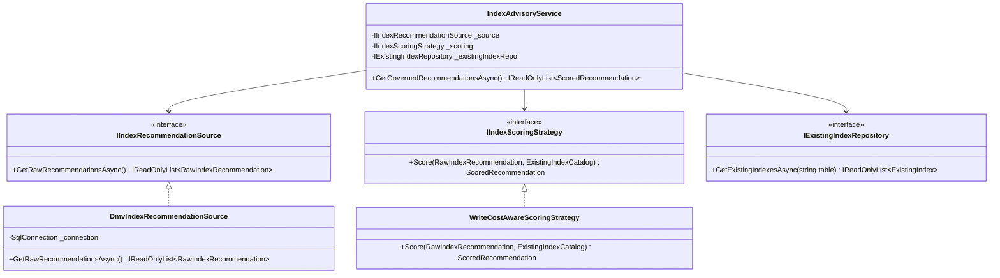
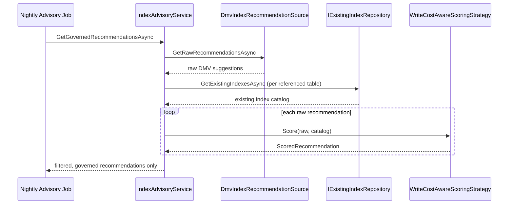

# Module 18 — SQL Server: Indexing & Query Execution Plans

> Domain: SQL Server | Level: Beginner → Expert | Prerequisite: [[../01-CSharp/05-LINQ-Internals]] (client-side evaluation, `IQueryable<T>` translation)

---

## 1. Topic Description

### Definition

An **index** is an ordered auxiliary structure — a B+ tree in SQL Server's rowstore, or a compressed columnar segment set in columnstore — that lets the engine locate qualifying rows without examining every row, trading write cost and storage for read speed. An **execution plan** is the optimizer's chosen physical strategy for a query: which indexes to use, in what order to join, whether to sort or hash, and how much memory to grant. Because SQL is declarative, the plan is inferred rather than specified, and it is derived almost entirely from **cardinality estimates** produced from statistics — which is why plan quality is really a question of how well the optimizer's model of your data matches reality.

### Core sub-concepts

- **Clustered versus nonclustered indexes** — the clustered index *is* the table; nonclustered indexes carry key columns plus the clustering key as a row locator.
- **Clustering key selection** — width propagating into every nonclustered index; monotonic versus random keys; last-page insert contention.
- **Key lookups and covering indexes** — `INCLUDE` columns, the tipping point where the optimizer abandons seek-plus-lookup for a scan.
- **Composite index column order** — equality columns first, then one range column, then ordering; why nothing after a range column can be sought.
- **Seek versus scan versus range scan** — rows-read-to-rows-returned as the real signal, and why a scan is sometimes optimal.
- **SARGability** — functions on indexed columns, implicit type conversions, leading wildcards.
- **Statistics and cardinality estimation** — histograms, sampling, auto-update thresholds, and estimate-versus-actual as the primary diagnostic.
- **Plan caching and parameter sniffing** — plans built for first-seen parameter values; data skew; `OPTIMIZE FOR`, `RECOMPILE`, plan forcing, query splitting.
- **Join operators** — nested loops, merge and hash; what each implies about the optimizer's assumptions; memory grants and spills.
- **Filtered indexes** — small targeted subsets, and the predicate-matching and parameterisation constraints on their use.
- **Columnstore versus rowstore** — batch-mode scan-and-aggregate versus singleton seeks; delta stores under heavy modification.
- **Index usage, redundancy and consolidation** — usage DMVs, prefix-overlapping indexes, write amplification per table.
- **Missing-index DMVs** — per-query hints that ignore existing indexes and write cost.
- **Fragmentation versus statistics staleness** — which one actually causes the regression you are looking at.
- **Query Store** — plan history, regression comparison and plan forcing as an incident mitigation.

### Where it fits

Indexes are the physical layer beneath every query the application issues, including everything an ORM generates. They are shared, mutable, permanent infrastructure: an index added for one team's query is paid for on every insert, update and delete by every other team. Upward, plan quality determines API latency, throughput ceilings and — in a cloud cost model — metered I/O spend. Sideways, indexing interacts directly with locking (fewer rows touched means fewer locks held) and with query formulation (a non-SARGable predicate makes the best index unusable).

### Why it matters at scale

Plan and index problems are the most common cause of database production incidents, and they arrive without a deployment: a query that ran in 5 ms for two years suddenly scans because statistics went stale, or a cache eviction caused a plan to be rebuilt for an atypical parameter. The failure is nonlinear — a query reading a million pages to return five rows does not degrade gracefully, it saturates I/O and blocks everything else. Meanwhile the opposite failure is silent: applying every missing-index recommendation produces a table with fifteen overlapping indexes where inserts take 40 ms, and nobody attributes the write latency to the read optimisation that caused it.

### Common pitfalls / anti-patterns

- **Applying missing-index DMV recommendations verbatim** — they are generated per query with no knowledge of existing indexes, write cost or the wider workload, so they produce near-duplicate wide indexes that cripple writes.
- **Wrapping an indexed column in a function or forcing an implicit conversion** — e.g. `WHERE YEAR(OrderDate) = 2026`, or comparing an `nvarchar` parameter to a `varchar` column; the predicate stops being SARGable and a perfect index is ignored, with nothing in the query text looking wrong.
- **A wide or random clustering key** (a `NEWID()` GUID) — duplicated into every row of every nonclustered index, inflating all of them, and causing page splits and fragmentation on insert.
- **`SELECT *` on an indexed access path** — prevents a covering index from being used, forcing key lookups or a clustered scan, and turning an index-only plan into full table access.
- **Tuning from the estimated plan** — you are reading the optimizer's assumptions without checking them; the estimate-versus-actual row discrepancy is the single most informative signal and only the actual plan has it.
- **Rebuilding indexes to fix a regression that was parameter sniffing** — changes several variables at once, appears to work because it clears cached plans, and destroys the evidence.
- **Indexing a low-cardinality column** (a boolean `IsActive` on a table that is 95% active) — negligible selectivity, so the optimizer will not seek on it, while every write still maintains it.
- **Judging a plan by operator cost percentages** — those are estimates, and in exactly the plans you are debugging they are wrong; actual row counts and execution counts are the reliable measures.

> Scope note: transactions, isolation levels, locking and blocking belong to `02-Transactions-Isolation-Locking`; query rewriting, set-based patterns and N+1 to `03-Query-Optimization-Patterns`. ORM query generation lives in `56-LINQ-EFCore`.

---

## 2. Beginner (10 Q&A)


**Q1. What is the difference between a clustered and a nonclustered index, physically?**
**A:** The clustered index *is* the table — its leaf level contains the actual data rows, stored in clustering-key order — so a table can have only one. A nonclustered index is a separate structure holding the key columns plus a pointer back to the row: the clustering key if the table is clustered, or a physical row identifier if it is a heap. That pointer is why the clustering key's width matters so much: it is duplicated into every row of every nonclustered index, so a wide clustering key inflates all of them.
*Follow-up: What are the properties of a good clustering key, and why is a random GUID a poor one?*

**Q2. What is a key lookup and why does it matter?**
**A:** When a query is satisfied by a nonclustered index for its predicate but needs columns the index does not contain, the engine must go back to the clustered index once per qualifying row to fetch them. That is fine for a handful of rows and disastrous for thousands, because it becomes random I/O proportional to the row count — and it is the reason a plan can show an index seek and still be slow. The fix is to make the index cover the query by adding the needed columns as `INCLUDE`, or to stop selecting columns you do not need.
*Follow-up: At roughly what row count does the optimizer abandon the seek-plus-lookup plan in favour of a scan, and why is that threshold a problem?*

**Q3. What is a covering index?**
**A:** One that contains every column the query needs — in the key for the columns used in predicates and ordering, and in `INCLUDE` for those only projected — so the query is satisfied entirely from the index with no lookup. It is the highest-leverage indexing technique for read performance. The cost is that included columns widen the index, increasing storage and write cost, and it makes the index specific to a query shape, so a codebase with dozens of query shapes cannot cover them all and must choose.
*Follow-up: When would you put a column in the key rather than in `INCLUDE`?*

**Q4. What does SARGable mean and what breaks it?**
**A:** A predicate is SARGable when the engine can use it to seek into an index — essentially, when the indexed column appears alone on one side of the comparison. It breaks when the column is wrapped in a function (`WHERE YEAR(OrderDate) = 2026`), when there is an implicit type conversion (comparing an `nvarchar` parameter to a `varchar` column), when a leading wildcard is used (`LIKE '%foo'`), or when the column is used in arithmetic. The result is a scan of the whole index instead of a seek, and the implicit-conversion case is particularly nasty because nothing in the query text looks wrong.
*Follow-up: How would you rewrite `WHERE YEAR(OrderDate) = 2026` to be SARGable?*

**Q5. Is an index scan always bad?**
**A:** No. For a small table, or for a query that genuinely needs most of the rows, a scan is the optimal plan — sequential reads are far cheaper per row than random seeks, so the optimizer's choice to scan is often correct. What matters is the ratio of rows read to rows returned: a scan reading a million rows to return five is the problem, and a seek that returns most of a table would be worse. Reading "scan" as automatically bad leads people to add indexes that are never used.
*Follow-up: How do you tell from a plan whether a scan is appropriate or a symptom?*

**Q6. What are statistics and why do they matter more than fragmentation?**
**A:** Statistics are the optimizer's model of data distribution — a histogram of value frequencies — used to estimate how many rows each operator will produce, which drives every plan decision including join type, memory grant and index choice. When they are stale, the estimates are wrong and the plan is built for a table that no longer exists, which is how a query degrades overnight without any code change. Fragmentation affects physical read efficiency and matters much less on modern storage, yet it consumes most of the attention in maintenance jobs — the useful side effect of an index rebuild is usually the statistics update it performs.
*Follow-up: When would you update statistics with `FULLSCAN` rather than the default sample?*

**Q7. What is parameter sniffing, and is it good or bad?**
**A:** On first execution of a parameterised statement, the optimizer builds a plan using the actual parameter values and caches it — that is sniffing, and it is normally beneficial because the plan is tailored to real values. It becomes a problem when the data is skewed and the cached plan was built for an atypical value: a plan optimal for a customer with three orders is catastrophic for one with three million, and which plan you get depends on which query ran first after a cache flush. That is why the classic symptom is "the same query is fast or slow depending on the day."
*Follow-up: Name three ways to address a parameter-sniffing problem and when each is appropriate.*

**Q8. Estimated versus actual execution plan — what's the practical difference?**
**A:** The estimated plan is what the optimizer intends without running the query; the actual plan includes real row counts, execution counts and warnings from the run. The whole value is in comparing estimated to actual row counts: a large discrepancy tells you the optimizer's model is wrong, which explains almost every bad plan and points at statistics, non-SARGable predicates, table variables or complex expressions. Tuning from an estimated plan alone means you are reading the optimizer's assumptions without checking them against reality.
*Follow-up: You see estimated 1 row, actual 800,000. What are the likely causes?*

**Q9. What do the three join operators tell you?**
**A:** Nested loops suits a small outer input with an indexed inner side — it is the optimizer saying "I expect few rows here." Merge join needs both inputs sorted on the join key and is efficient for large pre-sorted sets. Hash join builds a hash table from one input and probes with the other, which is the choice for large unsorted sets and requires a memory grant. Seeing nested loops over an enormous outer input is a strong signal of a cardinality underestimate, and a hash join spilling to disk means the memory grant was too small — both point back to the estimates rather than the join itself.
*Follow-up: What does a "spill to tempdb" warning on a hash or sort operator tell you, and how do you fix it?*

**Q10. Should you apply the missing-index recommendations SQL Server produces?**
**A:** Not directly. They are generated per query without considering existing indexes, write cost, or other queries, so applying them mechanically produces many overlapping wide indexes that slow every insert, update and delete and consume substantial storage. They are useful as evidence of *what a query wanted*, to be consolidated with existing indexes and evaluated against the whole workload. The related discipline is that adding an index is a permanent commitment with a recurring cost, so it deserves the same scrutiny as adding a dependency.
*Follow-up: You have three suggested indexes with overlapping leading columns. How do you consolidate them?*

---

## 3. Intermediate (10 Q&A)


**Q1. A query that was fast for a year is now slow with no code change. Walk me through your diagnosis.**
**A:** I would establish what changed in the plan rather than in the code: pull the current plan and compare against a known-good one from Query Store if available, which usually answers it immediately. The candidates are a plan change from parameter sniffing after a cache eviction or restart, stale statistics after significant data growth so the estimates no longer match reality, data volume crossing a threshold where the old plan stopped being appropriate, or a new index changing the optimizer's choices. The estimated-versus-actual row comparison distinguishes most of these. I would resist reflexively rebuilding indexes, which changes several variables at once and destroys the evidence.
*Follow-up: Query Store shows two plans, one fast and one slow, alternating. What do you do immediately and what do you fix properly?*

**Q2. How do you decide the column order in a composite index?**
**A:** Equality predicates first, then the range predicate, then columns needed for ordering — because a seek can use leading columns for equality and one range, but anything after a range column cannot be used for seeking. Selectivity matters less than this structural rule, which is the part people get wrong by sorting columns by cardinality. I would also consider whether the ordering matches an `ORDER BY` so a sort can be avoided, since eliminating a sort on a large result is often a bigger win than the seek itself.
*Follow-up: A query filters on A equality and B range and orders by C. What index would you build?*

**Q3. How many indexes are too many, and how do you decide what to remove?**
**A:** There is no universal number; the constraint is that every index must be maintained on every write and is a candidate for lock contention, so the right question is whether each index earns its cost. I would use the usage DMVs to find indexes with high update counts and near-zero seeks — the clearest deletion candidates — and look for redundancy where one index's key is a prefix of another's, which can usually be consolidated. The caution is that usage stats reset on restart and miss monthly or quarterly reporting queries, so I would collect over a full business cycle before dropping, and disable rather than drop first so the change is trivially reversible.
*Follow-up: An index is unused for three months and then a quarter-end report needs it. How do you handle that class of index?*

**Q4. What's the impact of the clustering key choice on a high-insert table?**
**A:** A monotonically increasing key (identity, sequential ID) makes inserts append to the end of the index, which avoids page splits but concentrates all inserts on the last page — historically a hotspot for latch contention on very high insert rates. A random key such as a `NEWID()` GUID distributes inserts across the whole index, causing page splits, fragmentation and a much larger index, and it widens every nonclustered index. `NEWSEQUENTIALID` or a sortable GUID gets most of the append behaviour without the contention of a single hot page. The right answer depends on insert rate and on whether the key is also the natural access path.
*Follow-up: You're seeing last-page insert contention. What are your options?*

**Q5. When is a filtered index the right tool?**
**A:** When queries consistently target a small, well-defined subset — active rows in a table that is mostly soft-deleted, or pending rows in a large status table — because the index is far smaller, cheaper to maintain and more likely to stay in memory. The constraints are real: the filter predicate must be matched by the query for the index to be used, parameterised queries often fail to match unless the predicate is a literal, and certain session settings prevent their use. So they are excellent for a known, stable query pattern and unreliable as a general tool.
*Follow-up: Your filtered index isn't being used by the application but works in Management Studio. What's the likely cause?*

**Q6. When would you use columnstore instead of rowstore?**
**A:** For analytical queries scanning and aggregating large numbers of rows over a few columns — columnstore's compression and batch-mode execution give order-of-magnitude improvements there. It is the wrong choice for singleton lookups and small-range OLTP access, where a rowstore index seek is far better. In practice the interesting case is a nonclustered columnstore index on an OLTP table to serve reporting without a separate warehouse, accepting some write overhead. I would be careful about the write pattern, since heavy updates and deletes on columnstore create delta stores and deleted-row bitmaps that degrade performance until reorganised.
*Follow-up: A table serves both transactional lookups and hourly aggregate reporting. How would you index it?*

**Q7. How do you deal with parameter sniffing in practice?**
**A:** First determine whether it is actually sniffing, by checking whether multiple plans exist for the statement and whether performance correlates with parameter values. Then choose by situation: `OPTIMIZE FOR` a representative value where the distribution is known and stable; `RECOMPILE` where the query is infrequent enough that compilation cost is acceptable and plan quality matters most; splitting into separate procedures or query shapes where two genuinely different access patterns exist; or Query Store plan forcing as a targeted, reversible mitigation during an incident. I would avoid the blanket fixes — disabling sniffing database-wide or recompiling everything — since they trade a specific problem for a general cost.
*Follow-up: `RECOMPILE` fixes it but the query runs 4,000 times a minute. What now?*

**Q8. How do you read a plan to find the actual problem quickly?**
**A:** Look for the operator with the largest gap between estimated and actual rows first, because that is where the optimizer's model broke and everything downstream follows from it. Then look at actual row counts and execution counts rather than the cost percentages, which are estimates and can be wildly misleading in exactly the plans you are debugging. Then check for warnings — spills, implicit conversions, missing statistics — which name the problem directly. Nested loops with a huge outer input, a key lookup with a high execution count, and a sort on a large set are the three shapes that account for most of what I find.
*Follow-up: The plan looks fine and costs are evenly distributed, but the query is slow. Where do you look next?*

**Q9. What is Query Store and how does it change diagnosis?**
**A:** It records query texts, plans, and runtime statistics over time, so you can see that a query's plan changed on a particular day and compare performance across plans — which converts "it got slow and I don't know why" into a concrete before-and-after. It also allows forcing a known-good plan, which is a fast, reversible mitigation during an incident. I would enable it on any production database as standard, sized appropriately, because the alternative is diagnosing regressions from a plan cache that was cleared by the restart you just performed.
*Follow-up: What's the risk of forcing a plan and leaving it forced?*

**Q10. How do you test index changes safely?**
**A:** Against realistic data volume and distribution, because index behaviour is entirely dependent on cardinality and a change that helps on a thousand rows can be irrelevant or harmful on ten million. I would capture a representative workload rather than testing a single query, since the cost of an index falls on writes and on other queries whose plans may change. Where the platform supports it, I would compare workload-level metrics before and after rather than the single query's duration. In production, adding an index online and then measuring is often the only honest test, which argues for making the change trivially reversible.
*Follow-up: You add an index and the target query improves but overall throughput drops. What happened?*

---

## 4. Expert / Architect (10 Q&A)


**Q1. How do you set an indexing strategy for a large OLTP system that many teams write against?**
**A:** Treat indexes as a shared, owned resource rather than something each feature adds. That means a review path for new indexes with evidence of need, periodic consolidation of overlapping ones, and visibility into total write amplification per table so the cumulative cost is known rather than distributed invisibly. I would also push design-time discipline: query patterns agreed with the access path in mind, so indexes are designed rather than accumulated from production firefighting. The organisational failure to avoid is every team adding indexes for their own queries with nobody accountable for the write path, which is how a hot table ends up with fifteen indexes and inserts that take 40 ms.
*Follow-up: How would you measure the total write cost attributable to indexes on a table?*

**Q2. How do you approach a plan-regression incident where you need service restored in ten minutes?**
**A:** Mitigate first with the most reversible tool: force the known-good plan through Query Store, which is targeted and can be undone instantly. If Query Store is not available, a query hint deployed as a hotfix or updating statistics on the affected object are the next options, in order of blast radius. What I would avoid under time pressure is clearing the plan cache or rebuilding indexes across the database, which affect everything and may cause a second incident. Then, after service is restored, do the actual diagnosis, because a forced plan is a mitigation that hides the underlying cause and will eventually stop being the right plan.
*Follow-up: You force a plan and it works. What's your follow-up plan and on what timeline?*

**Q3. How do you decide between fixing the query, adding an index, and changing the data model?**
**A:** By how fundamental the mismatch is. If the query is doing something unnecessary — selecting columns it does not need, filtering non-SARGably, or being called in a loop — fix the query, since that costs nothing ongoing. If the access path is legitimate but unsupported, add an index and accept the write cost. If many queries are fighting the same structural problem — a table modelling several concerns, a key that does not match how data is accessed, or an entity-attribute-value design — the model is wrong and indexing is a treadmill. The signal for the third case is that each new index helps one query and slightly hurts everything else, indefinitely.
*Follow-up: The data model is wrong but changing it is a year of work. What do you do in the meantime?*

**Q4. How do you handle indexing for a table that serves both OLTP and reporting?**
**A:** Ideally by not doing both on the same table: reporting queries want wide scans and different indexes, and their memory grants and locks interfere with transactional work, so the first question is whether reporting can be served from a replica, a read-scale secondary, or a separate analytical store fed asynchronously. Where they must coexist, readable secondaries with their own indexes, a nonclustered columnstore for the analytical access, and snapshot-based isolation to prevent readers blocking writers are the tools. The architectural point is that mixing the two workloads is a decision with an ongoing tax, and it should be made deliberately rather than by default because it was easier at the time.
*Follow-up: A replica adds latency the business says it can't accept for reporting. How do you probe that requirement?*

**Q5. What is your position on index maintenance jobs?**
**A:** Most organisations over-invest in rebuilds and under-invest in statistics. On modern storage, fragmentation matters far less than it did, while stale statistics cause plan regressions directly — so the job should be statistics-first, with reorganise or rebuild targeted by actual fragmentation thresholds and only where it matters. I would also be careful that maintenance itself does not cause the incident: rebuilds consume I/O and log space, can block, and invalidate cached plans, so an aggressive nightly job on a large database is a recurring risk. The right shape is measured, targeted, and monitored, not "rebuild everything on Sunday."
*Follow-up: Your maintenance window is no longer long enough for the job to complete. What's your approach?*

**Q6. How do you prevent index and plan regressions from reaching production?**
**A:** Make plan quality observable in the pipeline: capture query plans and row counts for critical queries in an environment with production-like data volume, and fail on significant regressions in logical reads or plan shape. Realistic data volume is the essential and most-skipped part, because a test database of thousands of rows validates correctness and tells you nothing about plans. Alongside that, review any schema or index change with the same rigour as code, and use Query Store in production to detect regressions quickly. Prevention is imperfect here, so the ability to detect and roll back fast matters as much as the gate.
*Follow-up: Production-like data volume in CI is expensive and slow. What's your compromise?*

**Q7. How does indexing strategy change in a multi-tenant database?**
**A:** The tenant identifier usually belongs as the leading column of most indexes, including the clustering key, so each tenant's rows are physically colocated and a query naturally seeks within one tenant's range — that alone often resolves the majority of multi-tenant performance problems. The complication is skew: one tenant with a thousand times more data than the median distorts statistics and plans, and a plan cached for a small tenant is catastrophic for the large one, which is the parameter-sniffing problem at its most severe. That skew is a strong argument for isolating the largest tenants into their own database or shard, which is an architectural decision driven by exactly this dynamic.
*Follow-up: One tenant is 60% of the data. What specifically breaks and what do you change?*

**Q8. How do you evaluate whether a workload's problems are indexing or capacity?**
**A:** By separating efficiency from volume: look at logical reads per query and per transaction, because that measures work done independently of hardware, and compare against what the query should need. If a query reads a million pages to return ten rows, it is an indexing problem no amount of hardware fixes economically. If queries are efficient and the system is simply saturated on CPU or I/O at the required throughput, it is capacity. The trap is buying hardware to mask an efficiency problem, which works briefly and returns at higher cost — I would want the reads-per-transaction number in any capacity conversation, since it is what makes the distinction concrete for non-specialists.
*Follow-up: Both are true — queries are inefficient and the box is undersized. How do you sequence the work?*

**Q9. How do you approach index design when migrating to a cloud database with a different cost model?**
**A:** Cost shifts from "hardware you already bought" to metered I/O, storage and compute, which makes inefficient queries directly expensive rather than merely slow — so indexing that reduces logical reads has a measurable financial return that is easy to justify. Storage for indexes also becomes a visible line item, which changes the calculus on wide covering indexes. I would re-baseline rather than lift and shift the existing index set, since indexes accumulated against different constraints, and I would use the cost signal as leverage to remove the unused ones, which is a conversation that rarely gains traction on-premises.
*Follow-up: Which specific metric would you track to show indexing work reduced cloud spend?*

**Q10. What separates an excellent answer from an adequate one when a candidate diagnoses a slow query?**
**A:** An adequate answer reaches for an index. An excellent one establishes what the query is supposed to return and how many rows that should be, reads the actual plan for the estimate-versus-actual discrepancy, identifies whether the problem is the model, the query, the statistics or the plan, and then chooses the intervention with the smallest permanent cost. It also considers the workload rather than the query in isolation — whether the proposed index helps one thing and taxes everything else — and thinks about how the fix will be verified and rolled back. The distinguishing quality is treating the database as a shared system with ongoing costs rather than as a query to be made fast.
*Follow-up: Given that framing, where would you push back on a team that wants to add an index this sprint?*

---

## 5. Reference Material

> Retained from the original module: deep-dive internals, diagrams, production examples, exercises, system/low-level design, debugging walkthroughs and the Principal Engineer perspective.

### 1. Fundamentals

#### What is an index, and what is an execution plan?
An **index** is a separate, ordered data structure (predominantly a **B+ tree** in SQL Server) that lets the engine locate rows matching a search condition without scanning every row in a table — trading write cost (maintaining the index on every insert/update/delete) and storage space for dramatically faster reads on the indexed columns. An **execution plan** is the query optimizer's chosen strategy for physically executing a given query — which indexes to use, in what order to join tables, whether to sort/hash — and is the single most important diagnostic artifact for understanding and fixing query performance.

#### Why do these exist?
Without an index, satisfying `WHERE CustomerId = 123` requires a **table scan** — reading every single row and checking the predicate, an O(n) operation regardless of how selective the condition is. An index turns this into an O(log n) B+ tree seek. The execution plan exists because SQL is **declarative** — you say *what* you want, not *how* to get it — and the optimizer, using table statistics (row counts, data distribution), must choose a physical strategy; understanding the plan it chose (and why) is the core diagnostic skill for all SQL Server performance work.

#### When does this matter?
Every non-trivial query touching a table with more than a few thousand rows; the depth matters specifically for diagnosing "why is this query slow" (the single most common SQL Server interview and real-world scenario) and for designing indexes proactively rather than reactively.

#### How does it work (30,000-ft view)?
```sql
CREATE NONCLUSTERED INDEX IX_Orders_CustomerId ON Orders(CustomerId) INCLUDE (OrderDate, Total);

SELECT OrderDate, Total FROM Orders WHERE CustomerId = 123;
-- Execution plan: Index Seek on IX_Orders_CustomerId (fast, O(log n) + matching rows)
-- instead of: Clustered Index Scan / Table Scan (O(n), reads every row)
```

### 2. Deep Dive

#### 2.1 Clustered vs Nonclustered Indexes — the Physical Storage Distinction
A **clustered index** determines the **physical order** rows are stored on disk — a table has **at most one** (since data can only be physically sorted one way), typically on the primary key. A **nonclustered index** is a separate structure holding the indexed column(s) plus a **row locator** back to the actual data — for a table with a clustered index, that locator is the clustered index's key (the **clustering key**), meaning every nonclustered index seek requires a second lookup (a "key lookup"/"bookmark lookup") into the clustered index to retrieve any column not included in the nonclustered index itself — precisely why `INCLUDE` columns (the example) matter: including frequently-selected columns directly in the nonclustered index avoids this expensive second lookup entirely (a **covering index**).

#### 2.2 Seek vs Scan — the Central Performance Distinction
An **Index Seek** navigates the B+ tree directly to matching rows using the search predicate — cost scales with the number of matching rows, not the table's total size. An **Index/Table Scan** reads every row in the index/table sequentially, checking the predicate against each — cost scales with total table size regardless of selectivity. A query plan showing a scan where a seek would be possible (usually because no suitable index exists, or because the predicate isn't **sargable**) is the single most common, most fixable SQL Server performance problem.

#### 2.3 Sargability — Search ARGument ABLE Predicates
A predicate is **sargable** if the optimizer can use an index seek to evaluate it directly — wrapping an indexed column in a function (`WHERE YEAR(OrderDate) = 2024`) or an implicit type conversion (comparing a `varchar` column against an `nvarchar` literal, or an `int` column against a string literal) makes the predicate **non-sargable**, forcing the optimizer to evaluate the function/conversion **per row**, which requires scanning every row regardless of an otherwise-perfect index on that column. The fix is almost always to rewrite the predicate to leave the indexed column bare (`WHERE OrderDate >= '2024-01-01' AND OrderDate < '2025-01-01'` instead of `YEAR(OrderDate) = 2024`).

#### 2.4 Statistics and Cardinality Estimation
The optimizer's plan choice depends heavily on **cardinality estimates** — its guess at how many rows a given predicate will match, derived from column **statistics** (a histogram of data distribution, sampled or fully scanned, auto-updated by default when enough rows change). **Stale statistics** (common after a large bulk load without a subsequent stats update) cause the optimizer to badly misjudge selectivity — potentially choosing a nested-loop join (efficient for a small estimated row count) when the actual row count is enormous, producing catastrophically slow execution despite a "correct" plan shape for the *estimated* (but wrong) cardinality.

#### 2.5 Join Algorithms — Nested Loop, Merge, Hash
- **Nested Loop Join**: for each row in the (smaller) outer input, seek into the inner input — efficient when the outer input is small and the inner input has a supporting index; poor when the outer input is large (O(outer × inner-seek-cost)).
- **Merge Join**: both inputs pre-sorted (or sorted via an explicit sort operator) on the join key, merged in one linear pass — efficient for large, already-sorted inputs.
- **Hash Join**: builds an in-memory hash table from the smaller input, probes it with the larger input — efficient for large, unsorted inputs without a supporting index, at the cost of memory (and potential spill-to-disk if the hash table doesn't fit in the granted memory).
The optimizer chooses based on estimated cardinality — a bad cardinality estimate is the most common reason a "wrong" join algorithm gets chosen for the actual data volume.

#### 2.6 Missing Index Recommendations and Their Limits
SQL Server's DMVs (`sys.dm_db_missing_index_details`) surface index recommendations based on queries actually executed — genuinely useful, but **naive and context-free**: they don't account for existing similar indexes (recommending near-duplicates), write-cost trade-offs, or column-order optimization across multiple queries — treat them as a starting hint requiring human judgment, never apply them blindly/automatically at scale.

### 3. Visual Architecture
```mermaid
graph TB
 Q[Query: WHERE CustomerId = 123] --> Opt[Optimizer: check statistics, cardinality]
 Opt -->|index exists, sargable, selective| Seek[Index Seek -- O(log n)]
 Opt -->|no index, or non-sargable predicate| Scan[Table/Index Scan -- O(n)]
 Seek --> Lookup{Columns beyond<br/>index key needed?}
 Lookup -->|Yes, not INCLUDEd| KeyLookup[Key Lookup into Clustered Index -- extra cost per row]
 Lookup -->|No, or covered by INCLUDE| Done[Return directly -- covering index]
```

### 4. Production Example
**Scenario**: A reporting query joining `Orders` to `Customers` on `CustomerId` degraded from ~200ms to over 30 seconds after a large data migration. **Investigation**: the execution plan showed a **Nested Loop Join** with an estimated outer-row-count of ~50 (stale statistics from before the migration) against an *actual* row count of ~2 million — the optimizer had chosen a nested-loop join appropriate for 50 rows, but was actually executing 2 million individual inner-side seeks. **Fix**: `UPDATE STATISTICS Orders WITH FULLSCAN` immediately corrected the cardinality estimate, and the optimizer automatically switched to a Hash Join on the next execution, restoring the original ~200ms performance with no query-text or index changes at all. **Lesson**: a "slow query" is very often not a missing-index problem at all — stale statistics causing a cardinality misestimate is one of the most common, and most trivially fixable (once diagnosed), root causes of a sudden, unexplained query-performance regression after a bulk data change.

### 11. Coding Exercises

#### Easy — Fix a non-sargable predicate
```sql
-- BEFORE: non-sargable, forces a scan even with an index on OrderDate
SELECT * FROM Orders WHERE YEAR(OrderDate) = 2024;

-- AFTER: sargable, enables an index seek on OrderDate
SELECT * FROM Orders WHERE OrderDate >= '2024-01-01' AND OrderDate < '2025-01-01';
```

#### Medium — Design a covering index for a reporting query
```sql
-- Query: SELECT OrderDate, Total, Status FROM Orders WHERE CustomerId = @id AND Status = 'Shipped';
CREATE NONCLUSTERED INDEX IX_Orders_CustomerId_Status ON Orders(CustomerId, Status) INCLUDE (OrderDate, Total);
-- Composite key (CustomerId, Status) supports the equality filter on both; INCLUDE avoids a key lookup
-- for OrderDate/Total, since they're needed in the SELECT list but not the filter.
```

#### Hard — Diagnose and fix a stale-statistics-driven join regression
```sql
-- Diagnostic: compare estimated vs actual rows in the plan (via SET STATISTICS XML ON, or Include Actual Execution Plan)
-- Symptom found: Estimated Rows = 52, Actual Rows = 2,043,981 at the Orders scan operator.

UPDATE STATISTICS Orders WITH FULLSCAN;
-- Re-run the query -- optimizer now correctly estimates cardinality and switches
-- from Nested Loop Join to Hash Join automatically, no query/index change needed.
```
**Discussion**: This is the single highest-value, lowest-effort fix in this entire module's toolkit — always rule out stale statistics via estimated-vs-actual comparison before assuming a missing index or rewriting the query.

#### Expert — Diagnose and fix a parameter-sniffing regression
```sql
-- Symptom: the same stored procedure is fast for most CustomerIds but catastrophically
-- slow for a few "power user" CustomerIds with a much larger order history.

CREATE PROCEDURE GetCustomerOrders @CustomerId INT
AS
BEGIN
 SELECT OrderDate, Total FROM Orders WHERE CustomerId = @CustomerId
 OPTION (RECOMPILE); -- always compile a fresh, cardinality-appropriate plan for THIS specific @CustomerId,
 -- trading a small per-call compilation cost for eliminating the sniffing risk entirely
END
```
**Discussion**: `OPTION (RECOMPILE)` is the correct fix specifically when parameter value distribution is highly skewed enough that no single cached plan serves all values well — for less skewed distributions, `OPTIMIZE FOR UNKNOWN` (using average/typical cardinality rather than the first-sniffed value) is a lighter-weight alternative avoiding per-call recompilation cost while still reducing sensitivity to any one atypical first execution.

### 12. System Design

**Scenario**: Design the query-and-indexing layer for a **real-time trade blotter service** at a mid-size broker-dealer — traders and risk desks need sub-200ms views of "my current open orders and fills," while compliance/back-office needs historical range queries ("all trades for account X between two dates") against the same underlying data, and a nightly batch settlement job needs to scan large date ranges without degrading the live trading day.

- **Functional requirements**: Live open-order/fill lookups by account/instrument (point-lookup-shaped); historical range queries by account+date (range-scan-shaped); nightly batch settlement scans by full-day date range; all three against data flowing from the same continuous order/execution ingest stream.
- **Non-functional requirements**: p99 < 200ms for the live blotter lookup during market hours; the nightly batch scan must not measurably degrade live trading-hour latency; index/statistics maintenance must fit within a defined overnight/weekend maintenance window; the system must support point-in-time ("as of") reconstruction for regulatory inquiry.
- **Architecture**: A single SQL Server OLTP database (Always On Availability Group, one primary + one synchronous secondary for HA, one asynchronous readable secondary for reporting/back-office offload) is the source of truth, fed by an ingest pipeline (order/execution events land via a message queue into a staging table, then upserted into the main `Orders`/`Executions` tables inside short transactions). The `Orders` table is **range-partitioned by trade date**, with the current day's partition kept small and hot, aligned nonclustered covering indexes on `(AccountId, Status)` (a filtered index scoped to open/actionable orders, per Expert Q6) serving the live blotter path, and a separate `(AccountId, TradeDate)` covering index serving the historical range-query path. The nightly batch settlement job runs against the **asynchronous readable secondary**, not the primary, so its large date-range scans never contend for locks/CPU with live trading-hour OLTP traffic (§9) — accepting a small, well-understood replication-lag staleness window for the batch's own read, which is acceptable since settlement runs after market close against a definitionally-closed trading day.
- **Data model**: `Orders(OrderId PK, AccountId, InstrumentId, Status, TradeDate, ...)` clustered on `(TradeDate, OrderId)` (aligning the clustered key with the partition scheme, per §9), with the filtered `IX_Orders_Open` covering index and the `(AccountId, TradeDate)` covering index as described. `Status` moves through a `NOT_STARTED → EXECUTING → FILLED | CANCELLED` lifecycle exactly mirroring this course's standing status-enum convention; every status transition is a single, short, indexed `UPDATE` guarded by an idempotency/version check.
- **Caching**: A short-TTL (2-5 second) read-through cache (Redis) sits in front of the live-blotter query path specifically, since the same "my open orders" view is polled repeatedly by the same trader's UI — this reduces buffer-pool/index pressure far more than any further index tuning could for a read-repeated-many-times-per-second pattern.
- **Messaging**: Order/execution events arrive via a durable queue (Kafka/MSMQ-style), consumed idempotently (unique constraint on the event's idempotency key, per Module 19 Expert Q4) into the staging-then-upsert pipeline, decoupling ingest burstiness from the OLTP database's own write capacity.
- **Scaling/failure handling**: The readable secondary absorbs reporting/batch load (§9); a secondary outage degrades reporting/batch freshness but never the primary's live-blotter availability (an intentional failure-isolation boundary); a primary failover (Always On automatic failover) is transparent to the live-blotter path within the AG's defined RPO/RTO, at the cost of a brief connection-retry window the client tier must handle gracefully.
- **Monitoring**: Query Store (Expert Q8) tracks per-query plan stability across every deployment; execution-plan estimated-vs-actual row-count deviation is monitored continuously for the top N business-critical queries (Advanced Q8 of §10); replication lag on the readable secondary is monitored explicitly and surfaced to the batch job so a lag beyond a defined threshold delays, rather than silently runs against stale data.
- **Trade-offs**: Splitting live-OLTP and reporting/batch traffic across primary/secondary adds AG operational complexity (failover testing, lag monitoring) versus a single-database design, accepted because it structurally guarantees the batch job can never be the cause of a trading-hours latency incident — directly the same class of fix as the reporting-query-blocks-writes lesson in Module 19 §4, applied here at the infrastructure-topology level instead of the isolation-level setting.

### 13. Low-Level Design

**Scenario**: Design a small, reusable **Missing-Index Advisory Service** that wraps SQL Server's raw `sys.dm_db_missing_index_details` DMV output (§2.6) with the human judgment layer §2.6 says is required — deduplicating near-identical suggestions, estimating write-cost impact, and scoring recommendations before a human ever sees them, directly operationalizing the Advanced Q10 governance guidance.

#### Class Diagram


```csharp
public interface IIndexScoringStrategy
{
    ScoredRecommendation Score(RawIndexRecommendation raw, ExistingIndexCatalog existing);
}

public sealed class WriteCostAwareScoringStrategy : IIndexScoringStrategy
{
    public ScoredRecommendation Score(RawIndexRecommendation raw, ExistingIndexCatalog existing)
    {
        // Penalize recommendations overlapping an existing index's leading-column prefix (§Intermediate Q7)
        // instead of surfacing a near-duplicate suggestion the DMV itself has no awareness of.
        bool overlapsExisting = existing.HasOverlappingLeadingColumns(raw.Table, raw.EqualityColumns);
        decimal estimatedWriteCostImpact = existing.GetTableWriteFrequency(raw.Table) * raw.EqualityColumns.Count;

        return new ScoredRecommendation(raw, overlapsExisting, estimatedWriteCostImpact,
            recommended: !overlapsExisting && raw.AvgUserImpact > 70m);
    }
}

public sealed class IndexAdvisoryService
{
    private readonly IIndexRecommendationSource _source;
    private readonly IIndexScoringStrategy _scoring;
    private readonly IExistingIndexRepository _existingIndexRepo;

    public IndexAdvisoryService(IIndexRecommendationSource source, IIndexScoringStrategy scoring,
        IExistingIndexRepository existingIndexRepo)
        => (_source, _scoring, _existingIndexRepo) = (source, scoring, existingIndexRepo);

    public async Task<IReadOnlyList<ScoredRecommendation>> GetGovernedRecommendationsAsync()
    {
        var raw = await _source.GetRawRecommendationsAsync;
        var catalog = await ExistingIndexCatalog.BuildAsync(_existingIndexRepo, raw);
        return raw.Select(r => _scoring.Score(r, catalog)).Where(s => s.Recommended).ToList;
    }
}
```

#### Sequence Diagram


#### Design Patterns / SOLID / Concurrency
- **Strategy pattern**: `IIndexScoringStrategy` isolates the scoring/governance heuristic from DMV data access, letting the scoring rule evolve (e.g., adding a table-size-based penalty) without touching the DMV-reading code — directly the extensibility point Advanced Q10's governance process needs.
- **Repository pattern**: `IExistingIndexRepository` abstracts existing-index lookup so the scoring strategy can be unit-tested against a fake catalog without a live database connection.
- **S**ingle Responsibility: `DmvIndexRecommendationSource` only reads DMV data; `WriteCostAwareScoringStrategy` only scores; `IndexAdvisoryService` only orchestrates — each independently testable and replaceable.
- **O**pen/Closed: a new scoring heuristic is added as a new `IIndexScoringStrategy` implementation, not by modifying the existing one or the orchestrating service.
- **Concurrency/thread-safety**: The service is read-only against DMVs (no locking concerns of its own); it should be run as a scheduled, single-instance nightly job (not concurrently from multiple hosts) since DMV snapshot data is a point-in-time view whose interpretation assumes a single, consistent read — running it concurrently from multiple hosts risks producing conflicting, differently-timed recommendation sets with no benefit.

### 14. Production Debugging

#### Incident: Trading-hours full-scan storm from an ORM-introduced implicit conversion
- **Symptoms**: Mid-morning during peak trading hours, the `Orders` blotter API's p99 latency jumped from ~40ms to over 4 seconds, with CPU on the primary database spiking to sustained 95%+; no schema, index, or data-volume change had occurred that day.
- **Investigation**: The actual execution plan for the blotter's core query showed a full **Clustered Index Scan** on `Orders` where an Index Seek on `IX_Orders_Open` had run the previous day — comparing query text between the two days revealed a same-morning application deployment had changed the account-id parameter's declared type from `int` to `string` in a newly-adopted ORM mapping layer, while the underlying `AccountId` column remained `int`.
- **Tools**: `SET STATISTICS XML ON` and the Plan Explorer view to compare the actual plan's operator tree before/after; `sys.dm_exec_query_stats` to confirm the query text/parameter type had changed at the exact deployment timestamp.
- **Root cause**: An **implicit conversion** (§2.3) — comparing the `int` `AccountId` column against a `string`-typed parameter forced SQL Server to convert the *column* side per row (since data-type precedence rules convert the lower-precedence type, and `string`/`varchar` outranks `int` in SQL Server's conversion precedence for this specific comparison), destroying sargability and forcing a full scan for every single blotter lookup, exactly as covered in §2.3/Intermediate Q5 but now surfacing as a real deployment-triggered production incident rather than a hypothetical.
- **Fix**: Reverted the ORM parameter type mapping to `int`, restoring the Index Seek immediately with zero database-side changes; added a regression test asserting the blotter query's execution plan uses an Index Seek (not a scan) against a realistic data volume, run in CI against every future ORM/mapping-layer change.
- **Prevention**: Added implicit-conversion detection to the standard pre-deployment checklist — running `sys.dm_exec_query_stats` joined to a check for mismatched declared-vs-column data types on the organization's top N business-critical queries as an automated CI gate, converting a class of bug that previously required a live production incident to surface into one caught before deployment.

### 15. Architecture Decision

**Decision**: How to scale read capacity for a growing mix of live OLTP blotter lookups and heavier back-office/compliance reporting queries against the same trade data, once a single, well-indexed primary database's CPU/IO is no longer sufficient headroom for both workloads together.

| Option | Advantages | Disadvantages | Cost | Complexity | Maintainability | Performance | Scalability | Ops Overhead |
|---|---|---|---|---|---|---|---|---|
| **A. Add more/better covering indexes on the primary only** | Simplest change; no new infrastructure; directly addresses specific slow queries | Doesn't separate OLTP and reporting *load*, only *query efficiency* — a sufficiently large reporting scan still competes for the same CPU/IO/buffer-pool as live trading traffic; each new index adds write cost (§7) | Low | Low | High short-term, degrades as index count grows | Improves specific queries, doesn't fix contention | Limited — bounded by one server's total capacity | Low |
| **B. Always On readable secondary for reporting/batch, primary reserved for live OLTP** | Structurally isolates reporting/batch load from live trading-hours latency (the §12 design); readable secondary can carry its own reporting-specific indexes not needed on the primary | Adds AG operational complexity (failover testing, replication-lag monitoring); reporting queries tolerate a small, bounded staleness window | Medium (AG licensing/infrastructure already common at this scale) | Medium | Good, well-understood pattern | Excellent for both workloads once separated | Good — secondary can scale independently for reporting growth | Medium (AG monitoring, lag alerting) |
| **C. ETL/replicate into a dedicated analytical store (columnstore warehouse) for reporting** | Reporting workload fully isolated on dedicated, purpose-built analytical infrastructure; can use columnstore (Expert Q5) freely without any OLTP write-path concern at all | Highest staleness (batch/CDC-driven ETL lag, typically minutes-to-hours, not seconds); highest build/ops cost; a second data model/pipeline to maintain and keep correct | High | High | Requires a dedicated data-engineering ownership model | Best for genuinely large-scale historical analytics | Best — scales independently of the OLTP system entirely | High (ETL/CDC pipeline ownership, schema drift risk) |

**Recommendation**: **Option B** (Always On readable secondary) for this scenario — it directly addresses the stated problem (live-OLTP-vs-reporting contention) with staleness (replication lag, typically sub-second to low-seconds under healthy conditions) well within back-office/compliance reporting's actual tolerance, at moderate incremental cost given the AG infrastructure a regulated trading system needs for HA/DR regardless. **Option C** becomes the right upgrade specifically once reporting needs grow into genuinely large-scale historical/analytical workloads (multi-year trend analysis, cross-instrument aggregation at massive scale) where even a readable secondary's OLTP-shaped indexes and rowstore layout stop being the right physical model — at which point B and C coexist (B for near-real-time back-office reporting, C for deep historical analytics) rather than C replacing B. **Option A alone** is never a durable end state once reporting load is genuinely material — it's a valid, low-cost first response to a *specific* slow query, but doesn't solve the structural contention problem this decision is actually about.

### 17. Principal Engineer Perspective

- **Business impact**: In a trading environment, a query-performance regression isn't merely an inconvenience — a blotter that takes 4 seconds to load during volatile market conditions has direct, measurable business cost (missed trading opportunity, potential regulatory best-execution scrutiny if order-management latency contributes to a documented execution-quality complaint) — this reframes "index tuning" from a purely technical concern into one with a defensible business-risk narrative worth using when prioritizing engineering time against feature work.
- **Engineering trade-offs**: Every additional index is a standing, permanent trade of write-throughput/latency for read-performance — a Principal Engineer should treat "should we add this index" with the same rigor as any other capacity-affecting architectural decision, requiring an explicit write-cost estimate (§13's `WriteCostAwareScoringStrategy`) rather than approving index additions purely on the strength of a missing-index DMV hint.
- **Technical leadership**: Champion "read the actual execution plan, check estimated-vs-actual rows" as the mandatory first diagnostic step for any performance investigation (Advanced Q10) — this single habit, demonstrated repeatedly in this module (§4's stale-statistics incident, §14's implicit-conversion incident), resolves a disproportionate share of real-world SQL Server incidents faster and more correctly than reflexive index or hardware changes, and is a teachable, transferable skill worth actively coaching across a team rather than leaving to individual experience.
- **Cross-team communication**: Translate "seek vs. scan" for non-technical stakeholders concretely: "an index lets the database jump directly to the rows you need, like a book's index; without one, it has to read every single page to find them — and today's incident happened because a code change accidentally made the database unable to use its index for one specific, very frequently-run query."
- **Architecture governance**: Require index-change review (both additions and drops) to go through the same change-management/audit-trail discipline as any other production schema change (§8's audit-logging requirement) — an unreviewed index drop is a realistic, high-impact incident class in any production financial system, and treating index changes as "just DDL, not worth a review" is a common, costly governance gap.
- **Cost optimization**: In a cloud-hosted SQL Managed Instance/Azure SQL context, unnecessary table scans directly translate into billed compute (DTU/vCore) cost, not merely latency — a Principal Engineer evaluating cloud database spend should treat "how many of our top-cost queries are scanning instead of seeking" as a direct, quantifiable cost-reduction lever, not purely a performance one.
- **Risk analysis and long-term maintainability**: An index inventory that's grown organically over years, purely reactive to individual DMV/incident-driven additions, accumulates redundant/overlapping indexes that add write cost without corresponding read benefit (§2.6) — periodic, deliberate index-portfolio review (not just reactive addition) is a long-term-maintainability practice a Principal Engineer should sponsor, distinct from and complementary to the reactive incident-response discipline this module otherwise centers on.

### 18. Revision
**Key takeaways**: Clustered index = physical row order (one per table); nonclustered = separate structure + row locator (many per table). Seek (fast, scales with matches) vs. scan (slow, scales with table size) is the central performance distinction. Sargability (no functions/implicit conversions wrapping indexed columns in `WHERE`) is required for seeks to be possible at all. Covering indexes (`INCLUDE`) eliminate key-lookup cost. Stale statistics/parameter sniffing (cardinality misestimation) are extremely common root causes of sudden query regressions, often fixable without any index/query change at all — always check estimated-vs-actual row counts before assuming a missing index.

---

**Next**: Continuing autonomously to Module 19 — Transactions, Isolation Levels & Locking (deadlocks, blocking chains).
