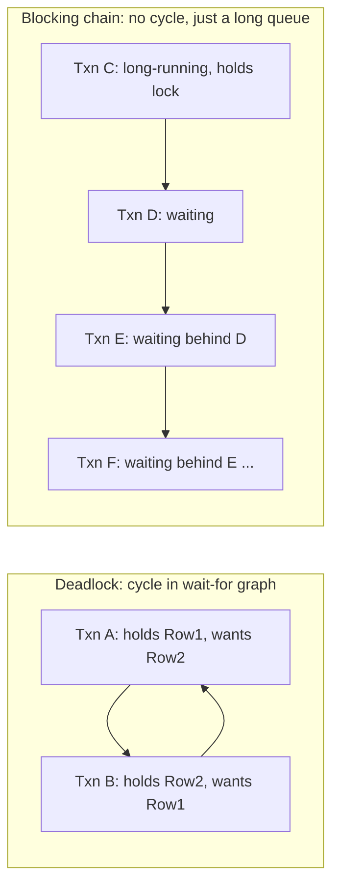

# Module 19 — SQL Server: Transactions, Isolation Levels & Locking

> Domain: SQL Server | Level: Beginner → Expert | Prerequisite: [[01-Indexing-Query-Execution-Plans]]

---

## 1. Fundamentals

### What is a transaction, and what is an isolation level?
A **transaction** is a unit of work satisfying the **ACID** properties — Atomicity (all-or-nothing), Consistency (moves the database between valid states), Isolation (concurrent transactions don't corrupt each other's view of data), Durability (once committed, survives a crash). The **isolation level** governs *how much* concurrent transactions can see of each other's in-progress, uncommitted changes — a tunable trade-off between consistency guarantees and concurrency (throughput/blocking).

### Why do these exist?
Without transactions, a multi-step operation (debit account A, credit account B) could partially fail, leaving the database in a corrupted, inconsistent state. Without isolation-level control, the *strictest* possible isolation (fully serializing every transaction) would be simple to reason about but would destroy concurrency — real workloads need a tunable spectrum letting most operations run concurrently while still preventing the specific classes of anomaly that matter for a given operation.

### When does this matter?
Every multi-statement operation touching shared, concurrently-accessed data; the depth matters for correctly diagnosing deadlocks/blocking chains (an extremely common real-world production incident) and for choosing an isolation level deliberately rather than accepting the default without understanding its trade-offs.

### How does it work (30,000-ft view)?
```sql
BEGIN TRANSACTION;
    UPDATE Accounts SET Balance = Balance - 100 WHERE Id = 1;
    UPDATE Accounts SET Balance = Balance + 100 WHERE Id = 2;
COMMIT TRANSACTION;
-- Both updates succeed together, or (on any failure) both roll back -- atomicity.
```

---

## 2. Deep Dive

### 2.1 The Isolation-Level Spectrum and the Anomalies Each Prevents
- **Read Uncommitted**: no locks taken for reads; permits **dirty reads** (seeing another transaction's uncommitted, possibly-to-be-rolled-back changes) — rarely appropriate for anything beyond approximate reporting queries tolerant of transient inaccuracy.
- **Read Committed** (SQL Server's default): reads never see uncommitted data, but a value can change between two reads within the same transaction (**non-repeatable read**) since read locks are released immediately after each individual read statement.
- **Repeatable Read**: holds read locks for the transaction's duration, preventing non-repeatable reads, but still permits **phantom reads** (a second query with the same predicate returns *additional* rows a concurrent insert added, since range-locking isn't held).
- **Serializable**: the strictest — range-locks predicates, preventing phantoms too, at the cost of significantly reduced concurrency (more blocking).
- **Snapshot Isolation** (and **Read Committed Snapshot Isolation**, RCSI): a fundamentally different mechanism — readers see a consistent, versioned snapshot of data as of transaction/statement start, using **row versioning** (in `tempdb`) instead of locks, so readers never block writers and writers never block readers — eliminating most blocking-related anomalies without serializable's throughput cost, at the expense of `tempdb` version-store overhead and the possibility of a **write-write conflict** (`5030`-style error) requiring application-level retry.

### 2.2 Locking Granularity and Lock Escalation
SQL Server takes locks at multiple granularities (row, page, table) — the optimizer/engine chooses based on estimated scope, and **lock escalation** (row/page locks automatically escalating to a single table lock, by default when a statement holds more than ~5,000 row locks) trades granularity for lock-management overhead, but can unexpectedly block unrelated concurrent operations on the *entire* table when a large batch operation triggers it — a common, non-obvious cause of a sudden, hard-to-diagnose blocking spike during a bulk update/delete.

### 2.3 Deadlocks — Precise Mechanics and Detection
A deadlock occurs when two (or more) transactions each hold a lock the other needs, with neither able to proceed — a genuine cycle in the "waiting for" graph. SQL Server runs a background **deadlock monitor** thread that periodically detects such cycles and **unilaterally kills one transaction** (the "deadlock victim," typically chosen by estimated rollback cost, sometimes influenced by `SET DEADLOCK_PRIORITY`), returning error 1205 to the victim's caller — the surviving transaction proceeds normally. The classic cause: two transactions updating the same two rows/tables in **opposite order** — Transaction A locks Row 1 then wants Row 2; Transaction B locks Row 2 then wants Row 1 — the fix is almost always **enforcing a consistent lock-acquisition order** across all transactions touching the same resources.

### 2.4 Blocking Chains — Distinct from Deadlocks
Blocking (one transaction waiting for another to release a lock) is normal, expected, and usually resolves quickly once the blocking transaction commits/rolls back — it only becomes a production problem when a **long-running transaction** (an accidentally-open transaction, a slow query, or an application holding a transaction open across a network round-trip/user-interaction pause) blocks many other transactions in a growing chain, degrading throughput/latency system-wide without ever technically deadlocking (no cycle — just one very long wait, and everyone waiting behind it).

### 2.5 Optimistic vs Pessimistic Concurrency Control
Locking-based isolation levels (Read Committed through Serializable) are **pessimistic** — assume conflicts are likely, prevent them via locks acquired proactively. Snapshot isolation is **optimistic** — assume conflicts are rare, allow concurrent access via versioning, detect a genuine conflict only at commit time (the write-write conflict error) and require the application to retry — directly the same optimistic-concurrency philosophy as ETags (Module 15 §2.5), now applied at the database engine's own transaction-isolation layer rather than the HTTP-API layer.

## 3. Visual Architecture


## 4. Production Example
**Scenario**: An order-processing service experienced periodic, severe latency spikes (all order-related endpoints stalling for 10–30 seconds) correlated with a nightly batch report job. **Investigation**: `sys.dm_exec_requests`/blocking-chain analysis (`sp_WhoIsActive`) showed the batch report (a single, long-running `SELECT` under the default Read Committed isolation, holding shared locks row-by-row as it scanned) was blocking a chain of dozens of order-update transactions waiting to acquire exclusive locks on rows the report's scan happened to pass through, one at a time, over its multi-minute runtime — every order update queued up behind the report's slow-moving scan. **Fix**: switched the database to **Read Committed Snapshot Isolation (RCSI)**, so the report's reads use row-versioning instead of shared locks, never blocking the concurrent order-update writers at all — order-processing latency returned to normal immediately, with no change to either the report or the order-update code. **Lesson**: a long-running read query under a locking isolation level can silently degrade an entire OLTP system's write throughput — RCSI is frequently the single highest-leverage fix for exactly this "reporting query blocks transactional writes" pattern, since it changes the concurrency *model* itself rather than requiring every query to be individually optimized.

## 5. Best Practices
- Enforce a consistent lock-acquisition order across all transactions touching overlapping resources to prevent deadlocks structurally.
- Keep transactions as short as possible — never hold a transaction open across a network round-trip, user interaction, or slow external call.
- Consider RCSI/Snapshot Isolation for OLTP systems with concurrent long-running reporting queries, to eliminate reader-writer blocking entirely.
- Implement automatic retry logic for deadlock victims (error 1205) and snapshot write-write conflicts — both are expected, recoverable conditions, not fatal errors.

## 6. Anti-patterns
- Holding a transaction open while waiting on user input or an external API call — a classic, severe blocking-chain cause.
- Inconsistent lock-acquisition order across different code paths touching the same tables, a direct deadlock cause.
- Assuming a deadlock indicates a bug requiring a code fix rather than an expected, retryable condition under concurrent load.
- Running large batch updates/deletes without considering lock escalation's potential to block unrelated concurrent operations.

## 7. Performance Engineering
RCSI/Snapshot Isolation trades locking overhead for `tempdb` version-store overhead — a genuinely different resource cost, not a free lunch; monitor `tempdb` size/IO under RCSI, especially with long-running transactions that keep old row versions pinned for their duration. Lock escalation avoids per-row lock-management memory/CPU overhead for very large operations, at the cost of coarser blocking — a real trade-off, not purely a problem to eliminate.

## 8. Security
Isolation-level choice can have subtle security implications for financial/audit-sensitive operations — Read Uncommitted's dirty reads could expose a transaction's in-progress, not-yet-validated (and potentially soon-to-be-rolled-back) state to a concurrent reader, a genuine data-integrity concern beyond mere performance for any operation where "might see rolled-back data" is unacceptable.

## 9. Scalability
RCSI is frequently the single highest-leverage change for scaling a system's *concurrent read/write mix* without application-code changes, precisely because it removes reader-writer contention as a scaling bottleneck entirely — worth evaluating early for any system anticipating concurrent OLTP and reporting/analytics workloads against the same database.

---

## 10. Interview Questions

### Basic (10)
1. **Q: What does ACID stand for?** **A:** Atomicity, Consistency, Isolation, Durability.
2. **Q: What is SQL Server's default isolation level?** **A:** Read Committed.
3. **Q: What is a dirty read?** **A:** Reading another transaction's uncommitted data, which might later be rolled back.
4. **Q: What is a non-repeatable read?** **A:** Reading the same row twice within one transaction and getting different values because another transaction committed a change in between.
5. **Q: What is a phantom read?** **A:** Re-running the same query and getting additional rows a concurrent insert added, even though individual previously-read rows didn't change.
6. **Q: What is a deadlock?** **A:** A cycle where two or more transactions each hold a lock the other needs, with neither able to proceed.
7. **Q: What error code does SQL Server return to a deadlock victim?** **A:** 1205.
8. **Q: What's the difference between blocking and a deadlock?** **A:** Blocking is one transaction waiting for another's lock to release, resolving once it does; a deadlock is a genuine cycle where nothing can resolve on its own, requiring the engine to kill one transaction.
9. **Q: What is Snapshot Isolation's underlying mechanism?** **A:** Row versioning — readers see a consistent snapshot as of transaction start, stored via versions in tempdb, rather than acquiring locks.
10. **Q: What should application code do when it receives a deadlock error?** **A:** Retry the transaction — a deadlock is an expected, recoverable condition under concurrency, not a fatal application bug.

### Intermediate (10)
1. **Q: Why does Read Committed still allow non-repeatable reads despite never showing uncommitted data?** **A:** It releases each read's shared lock immediately after that individual statement completes, rather than holding it for the whole transaction — a concurrent transaction can commit a change to that same row before the original transaction re-reads it.
2. **Q: Why does Repeatable Read still allow phantom reads?** **A:** It holds locks on the specific rows already read, but doesn't lock the *range/predicate* itself, so a concurrent insert of a new row matching the same predicate isn't blocked and appears on a subsequent identical query.
3. **Q: What causes lock escalation, and why can it unexpectedly affect unrelated queries?** **A:** A single statement acquiring a very large number of row/page locks (by default, roughly 5,000) triggers automatic escalation to a table-level lock for management-overhead reasons — that table lock then blocks any other concurrent operation needing access to the table, even rows completely unrelated to the original statement's actual working set.
4. **Q: Why is enforcing a consistent lock-acquisition order the standard deadlock-prevention technique?** **A:** A deadlock requires a cycle in the wait-for graph — if every transaction acquires locks on shared resources in the same defined order, a cycle becomes structurally impossible, since no transaction can ever be waiting on something acquired "before" it in the agreed order.
5. **Q: Why does RCSI eliminate reader-writer blocking specifically, without eliminating writer-writer conflicts?** **A:** Readers under RCSI use a versioned snapshot instead of taking locks, so they never block or are blocked by writers holding exclusive locks; two concurrent writers modifying the same row still need mutual exclusion (via ordinary locking) to avoid corrupting each other's updates, which RCSI doesn't change.
6. **Q: What's the practical difference between RCSI and full Snapshot Isolation?** **A:** RCSI is a database-level setting changing Read Committed's *behavior* to use row versioning automatically for every statement, requiring no query/transaction changes; Snapshot Isolation is an explicit isolation level a transaction opts into (`SET TRANSACTION ISOLATION LEVEL SNAPSHOT`), giving transaction-level (not just statement-level) consistency, and can surface an explicit write-write conflict error requiring application-level retry handling.
7. **Q: Why can holding a transaction open during a network round-trip or user-interaction pause be especially dangerous?** **A:** The transaction's held locks persist for however long that external pause lasts (potentially seconds to minutes, entirely outside the database's or even the application's control), blocking any other transaction needing those same locks for the whole duration — a database-level problem caused by an application-tier design mistake.
8. **Q: Why might `SET DEADLOCK_PRIORITY` be used deliberately for a specific transaction?** **A:** To influence which transaction the deadlock monitor chooses as the victim when a deadlock occurs — setting a lower priority for a transaction that's cheap/safe to retry (versus one that's expensive to redo or user-facing) ensures the engine preferentially kills the less costly one.
9. **Q: What's a realistic monitoring signal distinguishing "normal, brief blocking" from "a blocking-chain incident requiring investigation"?** **A:** Blocking-chain *duration* and *depth* — brief (sub-second) blocking behind a fast-committing transaction is entirely normal and self-resolving; a growing chain of waiters behind a single, minutes-long-running transaction (visible via `sys.dm_exec_requests`'s `blocking_session_id` chains) is the signature of an actual incident worth investigating.
10. **Q: Why is a deadlock retry loop in application code not, by itself, a complete fix for frequent deadlocks?** **A:** Retrying masks the *symptom* without addressing the *root cause* (inconsistent lock ordering, overly broad transaction scope) — frequent deadlocks under normal load indicate a genuine design issue that retries paper over at the cost of added latency/complexity for every affected operation, rather than eliminating the underlying contention.

### Advanced (10)
1. **Q: Diagnose the reporting-query-blocks-writes production incident (§4) from first principles, and explain precisely why RCSI (not just "add more indexes") was the correct fix.**
   **A:** The root cause wasn't query inefficiency (an index wouldn't change the fundamental behavior) — it was the isolation-level's *locking model itself*: under Read Committed, the report's row-by-row shared locks (even briefly held per row as it scans) directly conflict with the order-update transactions' exclusive locks on the same rows; RCSI changes the *mechanism* the report's reads use (versioning instead of locking) so the conflict class disappears entirely, regardless of how efficiently either the report or the order updates are individually written — this is why RCSI is the correct diagnostic conclusion once blocking-chain analysis (not just plan analysis, Module 18) identifies the report as the root blocker.
2. **Q: Design a deadlock-prevention strategy for a system where two different services (an order service and an inventory service) both update overlapping `Orders` and `Inventory` tables, in code the two teams don't share.**
   **A:** Establish and document an organization-wide, cross-team convention for lock-acquisition order (e.g., "always touch `Inventory` before `Orders` within any single transaction, regardless of which service/team's code initiates it") — since the two teams' codebases are independent, this requires an explicit, documented, cross-team architectural standard (directly this course's recurring governance pattern) rather than something enforceable purely by one team's code review; consider a lightweight, shared library helper enforcing the convention programmatically (e.g., requiring updates to go through an ordering-aware transaction helper) to make correct usage the path of least resistance rather than relying purely on documentation.
3. **Q: Explain how a write-write conflict under Snapshot Isolation manifests to the application, and how you would design retry handling for it.**
   **A:** SQL Server returns error 3960 when a transaction under Snapshot Isolation attempts to commit a change to a row that another transaction has modified and committed since the first transaction's snapshot was taken — the application must catch this specific error and retry the entire transaction from scratch (re-reading current data, re-applying business logic, re-attempting the write), exactly analogous to Module 15 §2.5's ETag-based `412 Precondition Failed` retry pattern, just enforced by the database engine itself rather than an application-level version check.
4. **Q: How would you use `sys.dm_tran_locks` and `sys.dm_exec_requests` together to build a live blocking-chain diagnostic query?**
   **A:** Join `sys.dm_exec_requests` (which exposes each active request's `blocking_session_id`) recursively to itself to reconstruct the full waiter chain (who's blocking whom, transitively), then join to `sys.dm_tran_locks` to identify exactly which resource (table/row/page) each link in the chain is contending over, and to `sys.dm_exec_sql_text`/`sys.dm_exec_query_plan` to surface the actual query text/plan for both the head blocker and each waiter — giving a complete, actionable picture (who's blocked, by what, on which resource, running which query) in one diagnostic pass, exactly what a tool like `sp_WhoIsActive` automates.
5. **Q: Explain why lock escalation during a large batch UPDATE can cause a production incident even when the UPDATE itself completes quickly.**
   **A:** The escalated table-level lock is held for the **duration of the UPDATE's own transaction**, not just momentarily — if the batch UPDATE runs inside an explicit transaction that also does other work before committing, or even just for the UPDATE statement's own execution time, every other concurrent transaction needing that table (even for unrelated rows) queues up behind the table-level lock for that entire window, which can itself be a meaningful, business-impacting duration even if it's not "slow" in absolute terms.
6. **Q: Design an approach to safely run a large data-migration UPDATE against a live, highly-concurrent OLTP table without triggering a lock-escalation-driven outage.**
   **A:** Batch the UPDATE into many smaller transactions (e.g., updating 1,000–5,000 rows per batch, well under the lock-escalation threshold, in a loop with a brief pause between batches) rather than one single, giant UPDATE statement — trading total migration wall-clock time for avoiding both lock escalation and excessively long-held locks, letting concurrent OLTP traffic interleave between batches rather than queuing behind one enormous, escalated table lock for the migration's entire duration.
7. **Q: Explain a scenario where Snapshot Isolation's `tempdb` version-store overhead itself becomes a production concern, and how you'd diagnose it.**
   **A:** A very long-running transaction under RCSI/Snapshot Isolation forces SQL Server to retain **every** row version created by concurrent writers since that transaction's snapshot began, for as long as it remains open — if that transaction runs for hours (e.g., an accidentally-uncommitted transaction, or a genuinely long batch job), `tempdb`'s version store can grow substantially, potentially exhausting `tempdb` space or degrading its own performance; diagnosed via `sys.dm_tran_active_snapshot_database_transactions` to identify long-running snapshot transactions and their age, combined with monitoring `tempdb` version-store size specifically.
8. **Q: How would you decide between fixing a blocking-chain problem via RCSI (a database-wide setting) versus rewriting the specific offending query to be faster/shorter?**
   **A:** RCSI is the broader, more structural fix — appropriate when the underlying problem is fundamentally "reads and writes contend under a locking isolation model," a category-level issue likely to recur with other queries even if this specific one is optimized; rewriting the specific query is more targeted and appropriate if the blocking is caused by one genuinely poorly-written, unnecessarily-slow query (fixable via Module 18's indexing/sargability techniques) rather than a fundamental isolation-model mismatch — in practice, both are often worth doing (fix the specific slow query *and* adopt RCSI as a structural safety net), but understanding which one is actually addressing the root cause (versus merely masking it) matters for correctly prioritizing the fix.
9. **Q: Explain why a deadlock retry loop combined with exponential backoff (Module 2's pattern) is more robust than an immediate, unconditional retry.**
   **A:** If the deadlock's root cause is genuine, sustained contention (not a one-off timing coincidence), an immediate retry can simply re-encounter the same conflicting transaction and deadlock again repeatedly — a brief, jittered backoff (directly Module 2's retry-with-backoff exercise) gives the contending transaction a chance to actually complete and release its locks before the retry attempt, improving the odds of the retry succeeding rather than looping into repeated deadlocks.
10. **Q: As a Principal Engineer, how would you build organizational awareness that isolation-level choice is an active architectural decision, not a fixed, unchangeable default?**
    **A:** Include isolation-level/RCSI evaluation explicitly in the database-design section of the organization's architecture-review template (directly this course's recurring governance pattern) for any new system anticipating mixed OLTP-and-reporting workloads against the same database, require documented reasoning for the choice (not silent acceptance of the engine default), and share this module's production incident (§4) as a concrete, memorable case study specifically because "we just changed one database setting and fixed a major latency incident with zero code changes" is a uniquely compelling, easy-to-remember illustration of why this decision deserves deliberate attention rather than being treated as an unchangeable platform default.

---

## 11. Coding Exercises

### Easy — Enforce consistent lock ordering to prevent a deadlock
```sql
-- BEFORE: Transaction A and B acquire locks in DIFFERENT orders -- deadlock risk
-- Txn A: UPDATE Accounts WHERE Id = 1; then UPDATE Accounts WHERE Id = 2;
-- Txn B: UPDATE Accounts WHERE Id = 2; then UPDATE Accounts WHERE Id = 1;  -- OPPOSITE order!

-- AFTER: BOTH transactions always acquire locks in ascending Id order
CREATE PROCEDURE TransferFunds @FromId INT, @ToId INT, @Amount DECIMAL
AS
BEGIN
    DECLARE @First INT = CASE WHEN @FromId < @ToId THEN @FromId ELSE @ToId END;
    DECLARE @Second INT = CASE WHEN @FromId < @ToId THEN @ToId ELSE @FromId END;

    BEGIN TRANSACTION;
        UPDATE Accounts SET Balance = Balance + 0 WHERE Id = @First; -- touch in consistent order first
        UPDATE Accounts SET Balance = Balance + 0 WHERE Id = @Second;
        -- (actual balance adjustments applied here, in the same consistently-ordered sequence)
    COMMIT TRANSACTION;
END
```

### Medium — Enable RCSI at the database level
```sql
ALTER DATABASE OrdersDb SET READ_COMMITTED_SNAPSHOT ON; -- requires no active connections during the switch
-- After this, ALL Read Committed transactions (the default) automatically use row versioning
-- instead of shared locks -- no application code changes required.
```

### Hard — Retry logic for deadlocks and snapshot write-write conflicts
```csharp
public async Task<T> ExecuteWithDbRetryAsync<T>(Func<Task<T>> operation, int maxAttempts = 3)
{
    for (int attempt = 1; ; attempt++)
    {
        try
        {
            return await operation();
        }
        catch (SqlException ex) when ((ex.Number is 1205 or 3960) && attempt < maxAttempts)
        {
            // 1205 = deadlock victim, 3960 = snapshot isolation write-write conflict --
            // both are expected, recoverable conditions under concurrency, per §Advanced Q9.
            await Task.Delay(TimeSpan.FromMilliseconds(100 * Math.Pow(2, attempt - 1) + Random.Shared.Next(0, 50)));
        }
    }
}
```
**Discussion**: This directly reuses Module 2's exception-filter-based retry-with-backoff pattern (the `when` clause on the final attempt correctly lets the exception propagate rather than retrying indefinitely), applied specifically to the two SQL Server error codes representing expected, retryable concurrency conditions rather than genuine application bugs.

### Expert — Batched migration UPDATE avoiding lock escalation
```sql
DECLARE @BatchSize INT = 2000, @RowsAffected INT = 1;

WHILE @RowsAffected > 0
BEGIN
    BEGIN TRANSACTION;
        UPDATE TOP (@BatchSize) Orders
        SET Status = 'Migrated'
        WHERE Status = 'Pending' AND MigratedFlag = 0;

        SET @RowsAffected = @@ROWCOUNT;
    COMMIT TRANSACTION;

    WAITFOR DELAY '00:00:00.100'; -- brief pause lets concurrent OLTP transactions interleave between batches
END
```
**Discussion**: Keeping `@BatchSize` (2,000) comfortably under the ~5,000-row lock-escalation threshold (§2.2) is deliberate — each batch's transaction commits and releases its locks before the next batch begins, so no single transaction ever holds a table-level escalated lock, and concurrent OLTP traffic gets regular opportunities to interleave via the `WAITFOR DELAY` pause, directly implementing Advanced Q6's recommended migration strategy.

---

## 12–17. System Design / LLD / Debugging / Decision / Case Study / Principal

An order-processing platform (§4) runs under RCSI by default for its primary OLTP database specifically to eliminate reader-writer contention between transactional order processing and concurrent reporting/analytics queries, with a shared, cross-team-documented lock-acquisition-order convention (Advanced Q2) preventing deadlocks between independently-developed services touching overlapping tables, and a standard deadlock/write-write-conflict retry wrapper (Hard exercise) applied uniformly across all database-calling code. The signature production incident (§4) — a reporting query silently blocking all order-processing writes under default Read Committed locking — is this module's central lesson: isolation-level choice is a first-class architectural decision, not a fixed platform default, and RCSI is frequently the single highest-leverage fix available for exactly this common OLTP-plus-reporting contention pattern.

## 18. Revision
**Key takeaways**: Read Committed (SQL Server default) prevents dirty reads but allows non-repeatable reads; Repeatable Read adds that protection but still allows phantoms; Serializable prevents all three at the cost of concurrency. RCSI/Snapshot Isolation uses row versioning instead of locks, eliminating reader-writer blocking at the cost of tempdb overhead and requiring write-write-conflict retry handling. Deadlocks (a genuine wait-for cycle, error 1205) are prevented via consistent lock-acquisition ordering; blocking chains (no cycle, just a long queue) are usually caused by one long-running transaction and resolved by shortening it or switching isolation models. Lock escalation (~5,000 row-lock threshold) can silently convert a large batch operation into a full table lock, blocking unrelated concurrent work.

---

**Next**: Continuing autonomously to Module 20 — Query Optimization Patterns & Anti-patterns (N+1 queries, batching, pagination strategies).
