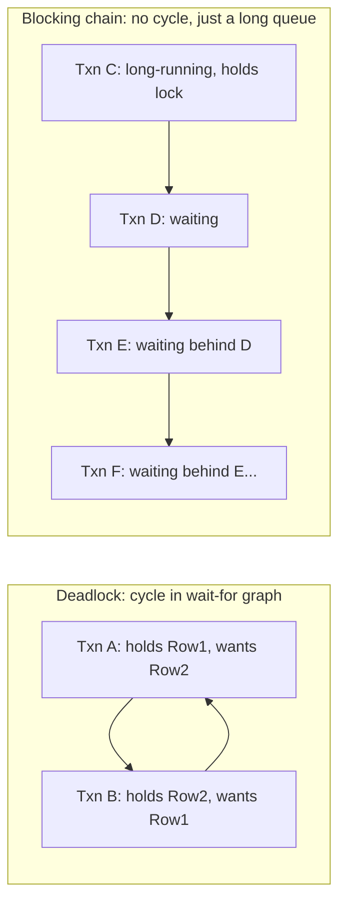
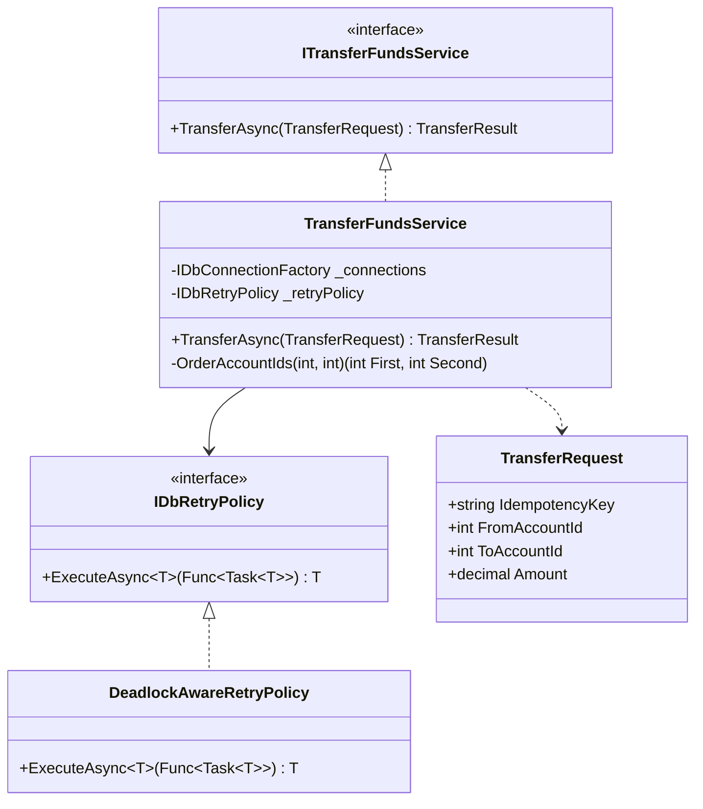
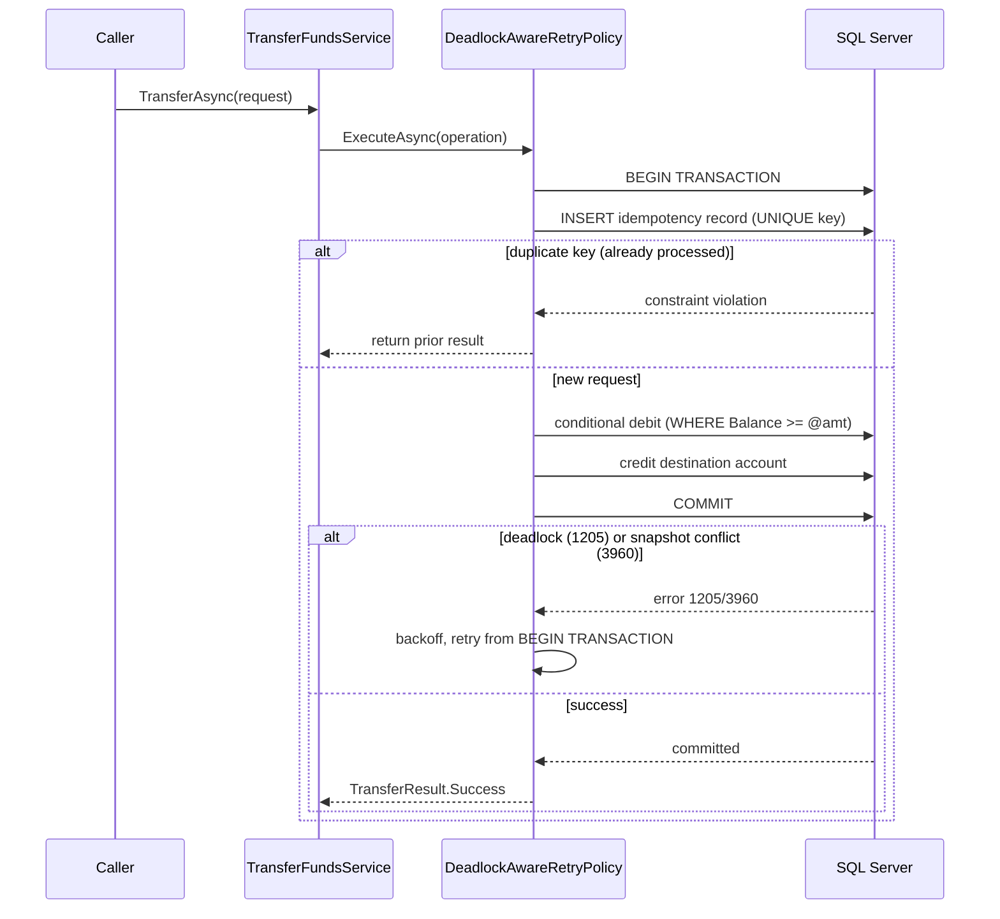

# Module 19 — SQL Server: Transactions, Isolation Levels & Locking

> Domain: SQL Server | Level: Beginner → Expert | Prerequisite: [[01-Indexing-Query-Execution-Plans]]

---

## 1. Topic Description

### Definition

A **transaction** is a unit of work with atomicity, consistency, isolation and durability guarantees. **Isolation level** determines which concurrency anomalies other transactions may observe, and SQL Server implements it two ways: by **locking** (shared, update and exclusive locks, escalating through an intent hierarchy, with key-range locks under `SERIALIZABLE`) or by **row versioning** (`READ COMMITTED SNAPSHOT` and `SNAPSHOT`, reading prior versions from the `tempdb` version store so readers never block writers). Isolation level is therefore not a performance dial — it is a correctness statement about what a user is permitted to see and about which concurrent operations may silently overwrite each other.

### Core sub-concepts

- **The anomalies** — dirty read, non-repeatable read, phantom read, lost update, write skew, and which level prevents each.
- **`READ COMMITTED` (locking) versus RCSI** — shared locks and mutual blocking versus versioned reads; the `tempdb` and 14-byte-per-row costs of RCSI.
- **`SNAPSHOT` isolation** — transaction-level consistent view, version-store growth, and update conflicts (error 3960) replacing blocking with retryable errors.
- **`SERIALIZABLE` and key-range locks** — locking the gaps to prevent phantoms, and the concurrency and deadlock cost of doing so.
- **Lock types and the intent hierarchy** — shared, update, exclusive; why update locks exist for read-then-write.
- **Lock escalation** — the ~5,000-lock threshold, row/page locks becoming a table lock, and batching or partitioning as the mitigation.
- **Blocking versus deadlocking** — head-blocker analysis, the deadlock monitor, victim selection, error 1205 and the deadlock graph.
- **Lost update prevention** — pessimistic (`UPDLOCK`, `HOLDLOCK`) versus optimistic (`rowversion` with a zero-rows-affected check) concurrency.
- **Read-then-write races** — the check-then-insert pattern; unique constraints as a database-enforced alternative to hints.
- **Transaction duration and boundaries** — lock hold time, log truncation, version-store retention, rollback cost, and why external calls must never be inside.
- **Retry and idempotency** — which errors are safe to retry, and why retry logic and idempotency are one design decision.
- **Read replicas and read-your-own-writes** — replication lag, enforced snapshot isolation on secondaries, and routing decisions.
- **Distributed transactions versus outbox and saga** — 2PC's availability coupling and the alternatives.

### Where it fits

Transactions sit between the application's unit-of-work boundary — usually set by an ORM or an ambient scope — and the physical index structures that locks are actually taken on. That downward link matters: a missing index means a statement touches far more rows than necessary, holding far more locks, so an "indexing problem" and a "blocking problem" are frequently the same problem. Upward, the isolation level chosen is what determines whether two users can double-book a seat, whether a report can read uncommitted data, and whether a retry can double-charge a customer.

### Why it matters at scale

Concurrency defects are the most expensive class of database bug because they are load-dependent, they corrupt data rather than crashing, and no functional test finds them. A lost update silently discards one user's edit; nothing errors, nothing logs, and the discrepancy is discovered weeks later in reconciliation. A single long-running transaction degrades a database in four independent ways at once — holding locks, preventing log truncation, retaining versions in `tempdb`, and taking as long to roll back as it took to run. And lock escalation means a batch update that worked perfectly at ten thousand rows takes a full table lock at fifty thousand, converting a routine job into an outage with no code change at all.

### Common pitfalls / anti-patterns

- **`NOLOCK` applied as a performance fix** — it is `READ UNCOMMITTED`: beyond dirty reads it can return rows twice or skip them entirely during page splits, producing results that never existed in any committed state; the real problem is usually blocking, whose correct fix is RCSI or shorter transactions.
- **Read-modify-write without an update lock or a version check** — two transactions each read, compute and write, and the second silently overwrites the first; `READ COMMITTED` does not prevent this.
- **Holding a transaction open across a network call, a message publish or user interaction** — couples the transaction's duration and success to something outside the database, and is the most common root cause of chronic blocking.
- **Retrying a deadlock victim without idempotency** — the transaction is already rolled back, so a retry must repeat the whole unit of work; if it sent an email or called a payment API first, the retry duplicates that side effect.
- **Assuming snapshot isolation removes conflicts** — it converts blocking into update-conflict *errors* at write time, which the application must catch and retry or it simply fails under concurrency.
- **A large single-statement modification** — crosses the lock-escalation threshold and takes a table lock, blocks everything, bloats the log, and rolls back for as long as it ran; batching below the threshold is the fix.
- **Setting the isolation level globally to solve one query's problem** — changes semantics for every transaction in the database to fix one report.
- **Using a distributed transaction to keep two systems consistent** — 2PC couples the availability of every participant and can leave in-doubt transactions holding locks indefinitely; an outbox or saga is almost always the right answer.

> Scope note: index structure, plan selection and statistics belong to `01-Indexing-Query-Execution-Plans`; query rewriting and set-based patterns to `03-Query-Optimization-Patterns`. Distributed consistency models, consensus and compensating workflows live in `16-Distributed-Systems` and `36-Saga`.

---

## 2. Beginner (10 Q&A)


**Q1. Name the concurrency anomalies and which isolation level prevents each.**
**A:** Dirty read — reading uncommitted data — is permitted only by `READ UNCOMMITTED`. Non-repeatable read, where a row changes between two reads in the same transaction, is permitted up to `READ COMMITTED` and prevented by `REPEATABLE READ`. Phantom reads, where new rows matching a predicate appear, are permitted up to `REPEATABLE READ` and prevented by `SERIALIZABLE`. Lost update and write skew are the ones the standard table does not cover well: lost update needs either locking on read or a version check, and write skew is possible even under snapshot isolation, which is the subtlety worth knowing.
*Follow-up: Give me a concrete write-skew scenario that snapshot isolation allows.*

**Q2. What is the difference between `READ COMMITTED` and `READ COMMITTED SNAPSHOT`?**
**A:** Both prevent dirty reads, but by different mechanisms. Locking `READ COMMITTED` takes shared locks while reading, so readers block writers and writers block readers. RCSI instead reads the last committed version from the version store, so readers never block and never block writers — which usually eliminates most blocking in a mixed workload. The costs of RCSI are `tempdb` version-store space and I/O, and a subtle behavioural change: a query now sees a consistent snapshot as of statement start rather than potentially mixed data, which can change results in code that relied on the old behaviour.
*Follow-up: What would make you *not* enable RCSI on an existing database?*

**Q3. What is `NOLOCK` actually doing, and why is it dangerous?**
**A:** It is a shorthand for `READ UNCOMMITTED` on that table, so the read takes no shared locks and does not respect them. Beyond the well-known dirty read, it can return rows twice or skip rows entirely if a page split or index reorganisation moves data during the scan — so you can get results that were never in the database in any state. It is often applied as a performance fix, but the real problem is usually blocking, and the correct answer to blocking is RCSI or shorter transactions rather than abandoning correctness. Its one legitimate use is an approximate query where inaccuracy is genuinely acceptable and stated.
*Follow-up: Someone says "our reports use NOLOCK everywhere and it's fine." How do you evaluate that?*

**Q4. What is a lost update and how do you prevent it?**
**A:** Two transactions read the same row, each computes a new value from what it read, and each writes — so the second overwrites the first, and the first update is silently lost. It is not prevented by `READ COMMITTED`, and it is the most common real concurrency bug in application code because the read-modify-write pattern is so natural. Prevention is either pessimistic — take an update lock on the read so the second transaction waits — or optimistic — include a `rowversion` in the `WHERE` clause and detect that zero rows were affected, then retry or surface a conflict.
*Follow-up: Which would you choose for a high-contention inventory counter, and why?*

**Q5. What is the difference between blocking and a deadlock?**
**A:** Blocking is one transaction waiting for a lock another holds — normal, temporary, and resolved when the holder commits. A deadlock is a cycle where each transaction waits for a lock the other holds, so neither can proceed; SQL Server's deadlock monitor detects the cycle and kills one as a victim, which surfaces to the application as error 1205. The important operational distinction is that blocking is a latency problem while deadlocking is a correctness-and-retry problem — and chronic blocking is usually the more damaging of the two because it degrades everything silently.
*Follow-up: How does SQL Server choose which transaction to kill, and can you influence it?*

**Q6. What is lock escalation and why does it cause surprises?**
**A:** When a statement acquires too many row or page locks (around 5,000 by default), SQL Server escalates to a single table-level lock to conserve memory. The surprise is that a well-behaved row-level operation suddenly locks the entire table, blocking every other transaction — so a batch update that worked fine at small volume becomes an outage at larger volume, with no code change. The mitigations are batching modifications into chunks below the threshold, partitioning so escalation stops at the partition, or disabling escalation on a specific table with care.
*Follow-up: You need to update 10 million rows. How do you do it without escalating or blowing the log?*

**Q7. What does `SERIALIZABLE` actually do in SQL Server?**
**A:** It takes key-range locks, locking not just the rows that exist but the *gaps* between them, so another transaction cannot insert a row that would have matched your predicate — that is how it prevents phantoms. The cost is substantial: range locks block far more than row locks, so concurrency drops sharply, and the risk of deadlock rises because more locks are held for longer. It is the correct choice when you genuinely need to reason about a set as if you were alone, but it should be applied to the specific transaction that needs it, never as a database default.
*Follow-up: Where would you legitimately need `SERIALIZABLE` in an OLTP application?*

**Q8. What does snapshot isolation give you and what does it cost?**
**A:** A transaction-level consistent view of the database as of its start, so every read within it sees the same data with no blocking. The costs are `tempdb` version-store growth proportional to the volume of change during long-running snapshot transactions, and a new failure mode: if another transaction modified a row you also modify, you get an update-conflict error and must retry. So snapshot does not remove concurrency conflicts, it moves them from blocking at read time to errors at write time — which needs handling in the application rather than being invisible.
*Follow-up: A snapshot report runs for an hour and `tempdb` fills. Explain the mechanism.*

**Q9. Why are long-running transactions a problem beyond just holding locks?**
**A:** They hold locks for their duration, so they block others; they prevent log truncation, so the transaction log grows and can fill the disk; under snapshot or RCSI they hold back version-store cleanup, growing `tempdb`; and if they fail, the rollback takes as long as the work did, extending the outage. Together these mean a single long transaction can degrade a whole database in several independent ways. The design rule is that a transaction should be as short as possible and should never span a user interaction, a network call, or a message send.
*Follow-up: What's the longest transaction you'd accept in an OLTP path, and how do you enforce it?*

**Q10. What is optimistic concurrency with `rowversion`?**
**A:** Each row carries a `rowversion` (timestamp) column that the engine increments on every modification. The application reads the row and its version, and the update includes `WHERE rowversion = @original`; if another transaction changed the row, zero rows are affected and the application knows there was a conflict. It works well when conflicts are rare, because it costs nothing in the normal case and requires no locks. It fits poorly under high contention, where retries dominate and a pessimistic lock would be cheaper.
*Follow-up: How does that interact with an ORM's change tracking, and what does the ORM do when the check fails?*

---

## 3. Intermediate (10 Q&A)


**Q1. Users report intermittent timeouts under load. Walk me through diagnosing a blocking problem.**
**A:** Start from the live picture: find the head blocker — the session at the root of the blocking chain that is not itself waiting — because that is the only session that matters, and people frequently chase the victims. Then determine what it is doing and why it is slow or long-running: a missing index causing a scan under a lock, a transaction left open by application code, an external call inside a transaction, or lock escalation. Wait statistics tell you the class of wait, and the blocked-process report gives you the pair. The fix is nearly always to shorten the transaction or make the offending statement cheaper, not to change isolation levels.
*Follow-up: The head blocker is `AWAITING COMMAND` inside an open transaction. What does that tell you?*

**Q2. How do you handle deadlocks properly in application code?**
**A:** Accept that they will happen, catch error 1205 specifically, and retry with backoff and a bounded attempt count — but only if the operation is safe to retry, which means it must be idempotent or fully rolled back. Retrying blindly is how a deadlock becomes duplicated work. Alongside retry, fix the causes: consistent object access order across transactions, shorter transactions, appropriate indexes so fewer rows are touched, and avoiding read-then-write patterns without an update lock. I would also capture the deadlock graph in production, since it names both statements and the resources involved and usually makes the fix obvious.
*Follow-up: Your retries succeed but latency spikes. What does that suggest about the underlying cause?*

**Q3. When would you use `UPDLOCK` and `HOLDLOCK`, and what problem do they solve?**
**A:** Together they solve the read-then-conditionally-write race: the classic "check if it exists, then insert" pattern where two concurrent transactions both find nothing and both insert. `UPDLOCK` takes an update lock on the read so only one transaction can proceed to modify, and `HOLDLOCK` holds it — with range semantics — to the end of the transaction so another transaction cannot insert into the gap. It is the correct tool where a uniqueness or state invariant must hold across the read and the write. The alternative, and often the better one, is a unique constraint that makes the invariant a database guarantee and lets you handle the duplicate-key error.
*Follow-up: Between a unique index and `UPDLOCK, HOLDLOCK`, which do you prefer and why?*

**Q4. How do you decide the transaction boundary in application code?**
**A:** It should encompass exactly the set of changes that must be atomic, and nothing else. That means no external HTTP calls, no message publishing, no user interaction, and no work that could be done before or after — each of those extends duration and couples the transaction's success to something outside the database. Where a state change and a message must both happen, the answer is an outbox rather than a distributed transaction. I would also be explicit about where the transaction is opened, since ambient transaction scopes make boundaries invisible and are a common source of accidentally enormous transactions.
*Follow-up: The business requires the message to be sent only if the update commits. How does an outbox achieve that?*

**Q5. What's the real cost of enabling RCSI on an existing production database?**
**A:** `tempdb` load, since every modified row's previous version is written there and long-running readers hold versions back — sizing and monitoring `tempdb` becomes essential. There is also a per-row storage increase of 14 bytes as rows are updated, which causes page splits and temporary fragmentation as the change propagates. And behaviour changes: code that relied on readers blocking — an accidental serialisation mechanism — may now race, which is rare but real. The upside is usually large enough to be worth it, but I would enable it in a load-tested environment first rather than as an in-place fix during an incident.
*Follow-up: After enabling RCSI, a batch job starts producing duplicate work. What might have happened?*

**Q6. How do you perform a large data modification without causing an incident?**
**A:** Batch it: modify a bounded number of rows per transaction, in a loop, with a delay between batches so other work can proceed, and with the batch size chosen to stay below the lock-escalation threshold. Each batch commits, so the log can truncate and locks are released. I would drive the batching from an indexed key range rather than `TOP` with an unordered scan, so each iteration is a seek rather than a re-scan of increasing cost. I would also make it resumable, since a long-running data fix that has to start over after a failure is how a maintenance window is missed.
*Follow-up: The table has no suitable index for range-based batching. What do you do?*

**Q7. What are the trade-offs between pessimistic and optimistic concurrency for a given entity?**
**A:** Optimistic wins when conflicts are rare: no locks, no blocking, and the cost is only paid when a conflict actually occurs. It degrades badly under contention, where most attempts fail and retry, wasting work and potentially livelocking. Pessimistic wins under high contention on a specific row because one transaction waits briefly rather than repeatedly failing, but it introduces blocking and deadlock risk and does not scale across a distributed application well. The decision should be per entity based on measured contention, and a system usually needs both — optimistic for most entities, pessimistic for the few hot ones.
*Follow-up: How would you measure contention on an entity to make this decision empirically?*

**Q8. What does the application actually see when a deadlock or a snapshot conflict occurs, and how should it behave?**
**A:** A deadlock surfaces as error 1205 with the transaction already rolled back — so the application must retry the whole unit of work, not resume mid-way. A snapshot update conflict is error 3960, also requiring a retry. In both cases, the critical requirement is that the retry is safe: if the transaction sent an email or called a payment API before failing, retrying duplicates that side effect. This is why side effects belong outside the transaction and behind idempotency, and why generic "retry on SQL error" wrappers are dangerous — they retry errors that are not safe to retry.
*Follow-up: Which SQL Server errors are safe to retry, and how would you classify them systematically?*

**Q9. How do you approach a table that is a contention hotspot — a counter, a sequence, a status queue?**
**A:** First question whether the database is the right place for it: a monotonic counter under high contention is a poor fit for a row-locking store, and a sequence object, an in-memory table, or moving the counter out of the transactional path are all better than optimising the lock. For queue-shaped tables, the standard patterns matter — `READPAST` with `UPDLOCK` to let consumers skip locked rows, an index supporting the claim pattern, and short claim transactions. Where contention is fundamental, partitioning the hot row into N sub-rows and aggregating on read spreads the contention at the cost of read complexity. The architectural answer is often to stop using the database as a queue.
*Follow-up: The team wants to keep the queue in SQL Server for transactional consistency with the data. Is that justified?*

**Q10. How do you test concurrency behaviour?**
**A:** Functional tests will not find these bugs, so you need tests that deliberately create the race: concurrent test threads hitting the same rows, assertions on invariants rather than on individual outcomes, and fault injection that delays one transaction between its read and its write to widen the window. Load testing with realistic contention patterns surfaces blocking and escalation that a single-user test never will. I would also assert on the *absence* of anomalies — that a counter's final value equals the number of increments, that no double-booking occurred — because those assertions fail loudly where a per-request assertion passes.
*Follow-up: A concurrency test passes 99 times and fails once. How do you treat that?*

---

## 4. Expert / Architect (10 Q&A)


**Q1. How do you decide the isolation level for a system, and who owns that decision?**
**A:** It is a correctness requirement, so the decision belongs with the business via engineering translation, not with a DBA choosing a default. The practical approach is to set a sensible baseline — RCSI is my usual recommendation for OLTP because it removes most reader-writer blocking without changing semantics much — and then identify the specific transactions with stricter requirements and elevate only those. What must be surfaced explicitly is what each level permits: "a user may see a stale balance for up to a second" or "two users could both claim the last item" are business statements, and getting a business owner to accept or reject them is the real work. Defaults chosen silently are how systems end up with anomalies nobody agreed to.
*Follow-up: The business says "we need perfect consistency everywhere." How do you handle that conversation?*

**Q2. When is a distributed transaction justified, and what would you do instead?**
**A:** Almost never in a modern architecture. Two-phase commit couples the availability of every participant — any one being down blocks the others, and an in-doubt transaction can hold locks indefinitely — so it converts independent failures into correlated ones, which is the opposite of what a distributed system needs. The alternatives are an outbox to make a local commit and a message atomic, sagas with compensating actions for multi-service workflows, and idempotent operations so retries are safe. The honest trade is that you exchange atomicity for eventual consistency and must design the intermediate states, which is more work but produces a system that survives partial failure.
*Follow-up: A regulator requires that two systems are never inconsistent. How do you satisfy that without 2PC?*

**Q3. How would you diagnose an intermittent data-corruption bug suspected to be a concurrency issue?**
**A:** Establish the invariant that was violated first, precisely, because "corruption" is usually a specific broken rule and naming it narrows the search enormously. Then look for the read-modify-write patterns and the transaction boundaries around the affected data, since lost update is the most likely cause. Auditing helps: if the table has change tracking or a history table, the sequence of writes usually shows two updates where one should have been. I would also check for the subtler causes — a `NOLOCK` read feeding a write decision, a retry without idempotency, or an ORM's change tracking writing a stale full-object update. The pattern to look for is a decision made from data read outside the transaction that later wrote.
*Follow-up: The evidence shows two updates a millisecond apart, both valid individually. What's your fix?*

**Q4. How do you design for high write contention on a single logical entity?**
**A:** Stop treating it as a single row where possible: partition the contended value into shards that are aggregated on read, append events instead of updating a total, or move the aggregation out of the write path entirely into an asynchronous projection. Each of those trades read simplicity or immediate consistency for write throughput, and which is acceptable is a business question. Where the entity must be a single row updated transactionally, the remaining levers are making the transaction as short as possible, ensuring the update is a seek, and considering in-memory OLTP for genuinely extreme cases. The architectural point is that contention on a single row is a modelling problem, and database tuning has a low ceiling.
*Follow-up: The business needs the running total to be exact and immediately visible. What do you offer?*

**Q5. What's your approach to retries at an architectural level?**
**A:** Retries must be paired with idempotency or they cause duplication, so the two are one design decision rather than two. That means classifying errors into retryable and non-retryable deliberately, retrying only the retryable, and ensuring every retryable operation is safe to repeat — via an idempotency key, a natural uniqueness constraint, or a compensating design. Retries also need backoff and jitter, and a bound, because unbounded retries against a struggling database are how a blip becomes an outage. I would place the retry policy in a shared data-access component so classification is done once and correctly, rather than each team inventing it.
*Follow-up: A retry policy is applied at the repository, the service and the client. What happens and how do you fix it?*

**Q6. How does the transaction and isolation story change with read replicas?**
**A:** Replicas introduce replication lag, so a read after a write may not see it — the classic read-your-own-writes problem — which is invisible in testing and produces confusing user behaviour in production. The design responses are routing reads that must be consistent to the primary, session-based consistency where the platform supports it, or explicitly designing the UX to tolerate staleness. Snapshot isolation is also enforced on readable secondaries, which changes behaviour for queries that assumed locking semantics. I would treat the routing decision — which queries may go to a replica — as an explicit, reviewed part of the design rather than a configuration toggle, since getting it wrong is a correctness issue.
*Follow-up: How would you implement read-your-own-writes without sending everything to the primary?*

**Q7. How would you approach a system where blocking incidents recur despite repeated tuning?**
**A:** Repeated recurrence means the fixes have been symptomatic, so I would look for the structural cause: transactions whose boundaries are set by a framework rather than by design, a table that many workflows must all update, an architecture where a synchronous call chain holds a transaction open, or a workload mix (reporting on the OLTP database) that should have been separated. The recurring-incident pattern usually indicates that the system's write model does not match its access pattern. I would frame the remediation as a design change with a business case built from incident cost, rather than another round of tuning — and be explicit that further tuning has diminishing returns, which is a message engineering leadership sometimes needs to hear plainly.
*Follow-up: Leadership wants another tuning sprint rather than a redesign. How do you make the case?*

**Q8. What are the implications of transaction design for auditability and regulatory requirements?**
**A:** Auditable systems need to know what was true when a decision was made, which means the audit record and the state change should be atomic — writing the audit entry in the same transaction, or through an outbox that guarantees it. A best-effort audit log written after commit will lose records exactly when the system is under stress, which is when the records matter most. Temporal tables or an append-only history give reconstructable state, which is what auditors typically ask for. I would also consider that long-retained history interacts with data-protection requirements, so the retention and deletion story has to be designed alongside, not afterwards.
*Follow-up: A regulator asks what the balance was at a specific instant three years ago. Can your system answer that?*

**Q9. How do you evaluate in-memory OLTP or other specialised concurrency features?**
**A:** By the specific bottleneck they address. In-memory OLTP's lock-free optimistic model genuinely solves latch and lock contention on extremely hot tables, and can be transformative for a narrow class of workload. The costs are significant: feature restrictions, different failure modes, memory sizing as a hard constraint, and an operational model most teams have not run before. So I would use it surgically on the identified hot object rather than as a platform strategy, and only after establishing that the contention is genuinely at the engine level rather than in the application's transaction design — which it usually is not. Introducing a specialised feature to compensate for a design problem is a durable mistake.
*Follow-up: You migrate the hot table and contention moves elsewhere. What does that tell you?*

**Q10. What would you look for to judge whether a team understands transactional correctness?**
**A:** Whether they can state, for their critical operations, what happens when two of them run simultaneously — and whether that answer is a design decision rather than a discovery. I would look for explicit transaction boundaries rather than framework-ambient ones, side effects placed outside transactions, idempotency on anything retryable, and an isolation level chosen per requirement rather than inherited. Concurrency tests are a strong signal, since almost nobody writes them without having been burned. The clearest negative signal is `NOLOCK` used broadly, because it indicates the team hit blocking, reached for the fastest-looking fix, and accepted a correctness cost without recognising it as one.
*Follow-up: You find `NOLOCK` in 300 places. How do you unwind that safely?*

---

## 5. Reference Material

> Retained from the original module: deep-dive internals, diagrams, production examples, exercises, system/low-level design, debugging walkthroughs and the Principal Engineer perspective.

### 1. Fundamentals

#### What is a transaction, and what is an isolation level?
A **transaction** is a unit of work satisfying the **ACID** properties — Atomicity (all-or-nothing), Consistency (moves the database between valid states), Isolation (concurrent transactions don't corrupt each other's view of data), Durability (once committed, survives a crash). The **isolation level** governs *how much* concurrent transactions can see of each other's in-progress, uncommitted changes — a tunable trade-off between consistency guarantees and concurrency (throughput/blocking).

#### Why do these exist?
Without transactions, a multi-step operation (debit account A, credit account B) could partially fail, leaving the database in a corrupted, inconsistent state. Without isolation-level control, the *strictest* possible isolation (fully serializing every transaction) would be simple to reason about but would destroy concurrency — real workloads need a tunable spectrum letting most operations run concurrently while still preventing the specific classes of anomaly that matter for a given operation.

#### When does this matter?
Every multi-statement operation touching shared, concurrently-accessed data; the depth matters for correctly diagnosing deadlocks/blocking chains (an extremely common real-world production incident) and for choosing an isolation level deliberately rather than accepting the default without understanding its trade-offs.

#### How does it work (30,000-ft view)?
```sql
BEGIN TRANSACTION;
 UPDATE Accounts SET Balance = Balance - 100 WHERE Id = 1;
 UPDATE Accounts SET Balance = Balance + 100 WHERE Id = 2;
COMMIT TRANSACTION;
-- Both updates succeed together, or (on any failure) both roll back -- atomicity.
```

### 2. Deep Dive

#### 2.1 The Isolation-Level Spectrum and the Anomalies Each Prevents
- **Read Uncommitted**: no locks taken for reads; permits **dirty reads** (seeing another transaction's uncommitted, possibly-to-be-rolled-back changes) — rarely appropriate for anything beyond approximate reporting queries tolerant of transient inaccuracy.
- **Read Committed** (SQL Server's default): reads never see uncommitted data, but a value can change between two reads within the same transaction (**non-repeatable read**) since read locks are released immediately after each individual read statement.
- **Repeatable Read**: holds read locks for the transaction's duration, preventing non-repeatable reads, but still permits **phantom reads** (a second query with the same predicate returns *additional* rows a concurrent insert added, since range-locking isn't held).
- **Serializable**: the strictest — range-locks predicates, preventing phantoms too, at the cost of significantly reduced concurrency (more blocking).
- **Snapshot Isolation** (and **Read Committed Snapshot Isolation**, RCSI): a fundamentally different mechanism — readers see a consistent, versioned snapshot of data as of transaction/statement start, using **row versioning** (in `tempdb`) instead of locks, so readers never block writers and writers never block readers — eliminating most blocking-related anomalies without serializable's throughput cost, at the expense of `tempdb` version-store overhead and the possibility of a **write-write conflict** (error `3960`) requiring application-level retry.

#### 2.2 Locking Granularity and Lock Escalation
SQL Server takes locks at multiple granularities (row, page, table) — the optimizer/engine chooses based on estimated scope, and **lock escalation** (row/page locks automatically escalating to a single table lock, by default when a statement holds more than ~5,000 row locks) trades granularity for lock-management overhead, but can unexpectedly block unrelated concurrent operations on the *entire* table when a large batch operation triggers it — a common, non-obvious cause of a sudden, hard-to-diagnose blocking spike during a bulk update/delete.

#### 2.3 Deadlocks — Precise Mechanics and Detection
A deadlock occurs when two (or more) transactions each hold a lock the other needs, with neither able to proceed — a genuine cycle in the "waiting for" graph. SQL Server runs a background **deadlock monitor** thread that periodically detects such cycles and **unilaterally kills one transaction** (the "deadlock victim," typically chosen by estimated rollback cost, sometimes influenced by `SET DEADLOCK_PRIORITY`), returning error 1205 to the victim's caller — the surviving transaction proceeds normally. The classic cause: two transactions updating the same two rows/tables in **opposite order** — Transaction A locks Row 1 then wants Row 2; Transaction B locks Row 2 then wants Row 1 — the fix is almost always **enforcing a consistent lock-acquisition order** across all transactions touching the same resources.

#### 2.4 Blocking Chains — Distinct from Deadlocks
Blocking (one transaction waiting for another to release a lock) is normal, expected, and usually resolves quickly once the blocking transaction commits/rolls back — it only becomes a production problem when a **long-running transaction** (an accidentally-open transaction, a slow query, or an application holding a transaction open across a network round-trip/user-interaction pause) blocks many other transactions in a growing chain, degrading throughput/latency system-wide without ever technically deadlocking (no cycle — just one very long wait, and everyone waiting behind it).

#### 2.5 Optimistic vs Pessimistic Concurrency Control
Locking-based isolation levels (Read Committed through Serializable) are **pessimistic** — assume conflicts are likely, prevent them via locks acquired proactively. Snapshot isolation is **optimistic** — assume conflicts are rare, allow concurrent access via versioning, detect a genuine conflict only at commit time (the write-write conflict error) and require the application to retry — directly the same optimistic-concurrency philosophy as ETags, now applied at the database engine's own transaction-isolation layer rather than the HTTP-API layer.

### 3. Visual Architecture

```mermaid
graph LR
 subgraph "Deadlock: cycle in wait-for graph"
 A["Txn A: holds Row1, wants Row2"] --> B["Txn B: holds Row2, wants Row1"]
 B --> A
 end
 subgraph "Blocking chain: no cycle, just a long queue"
 C["Txn C: long-running, holds lock"] --> D["Txn D: waiting"]
 D --> E["Txn E: waiting behind D"]
 E --> F["Txn F: waiting behind E..."]
 end
```

### 4. Production Example
**Scenario**: An order-processing service experienced periodic, severe latency spikes (all order-related endpoints stalling for 10–30 seconds) correlated with a nightly batch report job. **Investigation**: `sys.dm_exec_requests`/blocking-chain analysis (`sp_WhoIsActive`) showed the batch report (a single, long-running `SELECT` under the default Read Committed isolation, holding shared locks row-by-row as it scanned) was blocking a chain of dozens of order-update transactions waiting to acquire exclusive locks on rows the report's scan happened to pass through, one at a time, over its multi-minute runtime — every order update queued up behind the report's slow-moving scan. **Fix**: switched the database to **Read Committed Snapshot Isolation (RCSI)**, so the report's reads use row-versioning instead of shared locks, never blocking the concurrent order-update writers at all — order-processing latency returned to normal immediately, with no change to either the report or the order-update code. **Lesson**: a long-running read query under a locking isolation level can silently degrade an entire OLTP system's write throughput — RCSI is frequently the single highest-leverage fix for exactly this "reporting query blocks transactional writes" pattern, since it changes the concurrency *model* itself rather than requiring every query to be individually optimized.

### 11. Coding Exercises

#### Easy — Enforce consistent lock ordering to prevent a deadlock
```sql
-- BEFORE: Transaction A and B acquire locks in DIFFERENT orders -- deadlock risk
-- Txn A: UPDATE Accounts WHERE Id = 1; then UPDATE Accounts WHERE Id = 2;
-- Txn B: UPDATE Accounts WHERE Id = 2; then UPDATE Accounts WHERE Id = 1; -- OPPOSITE order!

-- AFTER: BOTH transactions always acquire locks in ascending Id order
CREATE PROCEDURE TransferFunds @FromId INT, @ToId INT, @Amount DECIMAL
AS
BEGIN
 DECLARE @First INT = CASE WHEN @FromId < @ToId THEN @FromId ELSE @ToId END;
 DECLARE @Second INT = CASE WHEN @FromId < @ToId THEN @ToId ELSE @FromId END;

 BEGIN TRANSACTION;
 UPDATE Accounts SET Balance = Balance + 0 WHERE Id = @First; -- touch in consistent order first
 UPDATE Accounts SET Balance = Balance + 0 WHERE Id = @Second;
 -- (actual balance adjustments applied here, in the same consistently-ordered sequence)
 COMMIT TRANSACTION;
END
```

#### Medium — Enable RCSI at the database level
```sql
ALTER DATABASE OrdersDb SET READ_COMMITTED_SNAPSHOT ON; -- requires no active connections during the switch
-- After this, ALL Read Committed transactions (the default) automatically use row versioning
-- instead of shared locks -- no application code changes required.
```

#### Hard — Retry logic for deadlocks and snapshot write-write conflicts
```csharp
public async Task<T> ExecuteWithDbRetryAsync<T>(Func<Task<T>> operation, int maxAttempts = 3)
{
    for (int attempt = 1;; attempt++)
    {
        try
        {
            return await operation;
        }
        catch (SqlException ex) when ((ex.Number is 1205 or 3960) && attempt < maxAttempts)
        {
            // 1205 = deadlock victim, 3960 = snapshot isolation write-write conflict --
            // both are expected, recoverable conditions under concurrency, per §Advanced Q9.
            await Task.Delay(TimeSpan.FromMilliseconds(100 * Math.Pow(2, attempt - 1) + Random.Shared.Next(0, 50)));
        }
    }
}
```
**Discussion**: This directly reuses the exception-filter-based retry-with-backoff pattern (the `when` clause on the final attempt correctly lets the exception propagate rather than retrying indefinitely), applied specifically to the two SQL Server error codes representing expected, retryable concurrency conditions rather than genuine application bugs.

#### Expert — Batched migration UPDATE avoiding lock escalation
```sql
DECLARE @BatchSize INT = 2000, @RowsAffected INT = 1;

WHILE @RowsAffected > 0
BEGIN
 BEGIN TRANSACTION;
 UPDATE TOP (@BatchSize) Orders
 SET Status = 'Migrated'
 WHERE Status = 'Pending' AND MigratedFlag = 0;

 SET @RowsAffected = @@ROWCOUNT;
 COMMIT TRANSACTION;

 WAITFOR DELAY '00:00:00.100'; -- brief pause lets concurrent OLTP transactions interleave between batches
END
```
**Discussion**: Keeping `@BatchSize` (2,000) comfortably under the ~5,000-row lock-escalation threshold is deliberate — each batch's transaction commits and releases its locks before the next batch begins, so no single transaction ever holds a table-level escalated lock, and concurrent OLTP traffic gets regular opportunities to interleave via the `WAITFOR DELAY` pause, directly implementing Advanced Q6's recommended migration strategy.

### 12. System Design

**Scenario**: Design the transaction/concurrency architecture for a **core account-ledger and order-settlement service** at a payments/brokerage firm — the system must post debits/credits atomically, prevent double-spend/overdraft under high concurrent load on the same hot accounts, support a live operational dashboard querying the same tables continuously, and never allow a partial (torn) financial write to become visible or committed.

- **Functional requirements**: Atomic multi-entry ledger postings (a single logical transaction may touch several accounts); real-time balance/overdraft enforcement under concurrent postings to the same account; a live dashboard reading current balances/pending postings without impacting posting throughput; idempotent handling of retried posting requests.
- **Non-functional requirements**: No double-spend or lost update under any concurrent load pattern (a hard correctness requirement, not a best-effort one); posting-path p99 latency low enough to support real-time payment authorization; the dashboard must never block or be blocked by the posting path; full recoverability (no torn writes) across any crash/failover.
- **Architecture**: The database runs under **RCSI** by default (§4) so the dashboard's continuous reads never take shared locks against posting transactions and vice versa — eliminating the reader-writer contention class entirely at the database-setting level, no per-query change required. The actual **balance-mutation path**, however, does not rely on RCSI's optimism for its correctness guarantee — every posting uses the **conditional atomic update** pattern (Module 18-equivalent: `UPDATE Accounts SET Balance = Balance - @amt WHERE Id=@id AND Balance >= @amt` checked via `@@ROWCOUNT`), which is safe under any isolation level because the check-and-write is a single atomic statement under the row's exclusive lock, not a separate read-then-write. Every posting entry additionally carries a client-supplied **idempotency key enforced via a UNIQUE constraint** (§Expert Q4), committed in the *same* transaction as the balance mutation, so a retried request can never double-post regardless of isolation level. Cross-account, multi-entry postings acquire their row locks in a **consistent, ascending-key order** (Easy coding exercise) across every code path, structurally eliminating the classic opposite-order deadlock pattern (§2.3) rather than relying on retry logic alone to paper over it.
- **Data model**: An append-only `LedgerEntries` table (double-entry: every posting is a balanced set of debit/credit rows) is the source of truth and audit trail; a `Accounts.Balance` column is maintained **transactionally, in the same transaction**, as a materialized, fast-to-read current balance — never updated in a separate transaction from its corresponding ledger entries, avoiding the divergence risk of updating a derived value out-of-band. Every posting's status follows `NOT_STARTED → EXECUTING → SUCCESS | FAILED`, consistent with this course's standing lifecycle convention, with `FAILED` postings leaving no partial ledger entries by construction (the whole multi-entry transaction either fully commits or fully rolls back).
- **Messaging/failure handling**: A deadlock (1205) or snapshot write-write conflict (3960) is caught by a standard retry-with-exponential-backoff wrapper (Hard coding exercise) applied uniformly across every database-calling code path — both are treated as expected, retryable conditions under concurrency, never as application bugs requiring manual intervention.
- **Scaling**: Read-heavy dashboard/reporting traffic is offloaded to an Always On readable secondary (§9) rather than adding read load to the primary posting path at all; the primary is reserved exclusively for the posting write path and any read genuinely requiring up-to-the-millisecond currency (e.g., an authorization check immediately preceding a debit).
- **Monitoring**: Blocking-chain depth/duration (`sys.dm_exec_requests`, Advanced Q4) and deadlock/write-conflict retry rates are tracked as first-class production health signals, not just ad-hoc diagnostic queries — a rising retry rate is treated as an early-warning signal of growing contention on specific hot accounts, worth investigating before it manifests as a customer-visible latency incident.
- **Trade-offs**: The conditional-atomic-update pattern is deliberately preferred over pessimistic `UPDLOCK`/`HOLDLOCK` for the single-account debit case specifically because it requires no explicit lock-hint discipline and is correct under any isolation level by construction — accepted at the cost of needing a slightly less intuitive `WHERE`-clause-as-invariant-guard pattern that must be consistently taught and code-reviewed across the engineering organization (§17).

### 13. Low-Level Design

**Scenario**: Design a reusable, deadlock-safe, idempotent `TransferFundsService` used by every code path in the organization that moves money between two accounts — directly operationalizing §2.3's consistent-lock-ordering discipline and Expert Q4's idempotency-key discipline as shared, hard-to-misuse infrastructure rather than a convention every team must independently remember to apply.

#### Class Diagram

```mermaid
classDiagram
    class ITransferFundsService {
        <<interface>>
        +TransferAsync(TransferRequest) TransferResult
    }
    class TransferFundsService {
        -IDbConnectionFactory _connections
        -IDbRetryPolicy _retryPolicy
        +TransferAsync(TransferRequest) TransferResult
        -OrderAccountIds(int, int) (int First, int Second)
    }
    class IDbRetryPolicy {
        <<interface>>
        +ExecuteAsync~T~(Func~Task~T~~) T
    }
    class DeadlockAwareRetryPolicy {
        +ExecuteAsync~T~(Func~Task~T~~) T
    }
    class TransferRequest {
        +string IdempotencyKey
        +int FromAccountId
        +int ToAccountId
        +decimal Amount
    }
    ITransferFundsService <|.. TransferFundsService
    IDbRetryPolicy <|.. DeadlockAwareRetryPolicy
    TransferFundsService --> IDbRetryPolicy
    TransferFundsService ..> TransferRequest
```

```csharp
public interface IDbRetryPolicy
{
    Task<T> ExecuteAsync<T>(Func<Task<T>> operation);
}

public sealed class TransferFundsService : ITransferFundsService
{
    private readonly IDbConnectionFactory _connections;
    private readonly IDbRetryPolicy _retryPolicy;

    public TransferFundsService(IDbConnectionFactory connections, IDbRetryPolicy retryPolicy)
        => (_connections, _retryPolicy) = (connections, retryPolicy);

    public Task<TransferResult> TransferAsync(TransferRequest request) =>
        _retryPolicy.ExecuteAsync(async () =>
        {
            var (first, second) = OrderAccountIds(request.FromAccountId, request.ToAccountId);
            // Consistent ascending-Id lock order (Easy exercise) -- every caller goes through
            // THIS one code path, so no team can accidentally introduce an opposite-order deadlock.
            await using var conn = await _connections.OpenAsync;
            await using var tx = await conn.BeginTransactionAsync;

            // Idempotency key UNIQUE constraint (Expert Q4) makes a retried request a no-op, not a double-post.
            var alreadyProcessed = await InsertIdempotencyRecordAsync(conn, tx, request.IdempotencyKey);
            if (alreadyProcessed) return await LoadPriorResultAsync(conn, tx, request.IdempotencyKey);

            var debited = await ConditionalDebitAsync(conn, tx, request.FromAccountId, request.Amount);
            if (!debited) { await tx.RollbackAsync; return TransferResult.InsufficientFunds; }

            await CreditAsync(conn, tx, request.ToAccountId, request.Amount);
            await tx.CommitAsync;
            return TransferResult.Success;
        });

    private static (int First, int Second) OrderAccountIds(int a, int b) => a < b ? (a, b) : (b, a);
}
```

#### Sequence Diagram

```mermaid
sequenceDiagram
    participant Caller
    participant Svc as TransferFundsService
    participant Retry as DeadlockAwareRetryPolicy
    participant DB as SQL Server

    Caller->>Svc: TransferAsync(request)
    Svc->>Retry: ExecuteAsync(operation)
    Retry->>DB: BEGIN TRANSACTION
    Retry->>DB: INSERT idempotency record (UNIQUE key)
    alt duplicate key (already processed)
        DB-->>Retry: constraint violation
        Retry-->>Svc: return prior result
    else new request
        Retry->>DB: conditional debit (WHERE Balance >= @amt)
        Retry->>DB: credit destination account
        Retry->>DB: COMMIT
        alt deadlock (1205) or snapshot conflict (3960)
            DB-->>Retry: error 1205/3960
            Retry->>Retry: backoff, retry from BEGIN TRANSACTION
        else success
            DB-->>Retry: committed
            Retry-->>Svc: TransferResult.Success
        end
    end
```

#### Design Patterns / SOLID / Concurrency
- **Decorator/Policy pattern**: `IDbRetryPolicy` wraps the core transfer logic with deadlock/conflict retry behavior, keeping retry concerns fully separate from the business logic itself — directly reusing the exception-filter retry pattern from Module 19's Hard coding exercise as shared, injectable infrastructure.
- **Template Method (implicit)**: every transfer follows the identical sequence (order accounts → idempotency check → conditional debit → credit → commit) regardless of caller, making it structurally impossible for a new call site to skip the lock-ordering or idempotency steps.
- **S**ingle Responsibility: `TransferFundsService` only orchestrates a transfer; `IDbRetryPolicy` only handles retry; each is independently testable.
- **D**ependency Inversion: callers depend on `ITransferFundsService`, never on raw ADO.NET/transaction code directly, so the deadlock-safety discipline is enforced by the abstraction's only implementation, not by convention each caller must remember.
- **Concurrency/thread-safety**: The service itself holds no mutable instance state across calls (each `TransferAsync` call opens its own connection/transaction), making it safely reusable as a singleton; correctness under concurrent calls comes entirely from the database-level guarantees (conditional atomic update, UNIQUE idempotency constraint, consistent lock order), not from any in-process locking — consistent with this course's general preference for pushing concurrency correctness into the database rather than reimplementing it in application-tier locks.

### 14. Production Debugging

#### Incident: Regulatory trade-total report silently under-reports due to NOLOCK page-split row loss
- **Symptoms**: A daily regulatory trade-total submission was found, during an internal audit reconciliation, to be short by a small but non-trivial number of trades on several historical dates — no error had ever been raised by the report job, and the discrepancy had gone undetected for weeks.
- **Investigation**: The report's query used `WITH (NOLOCK)` on the main `Trades` table "for performance," inherited from an older, smaller-scale version of the report; correlating the specific missing trades against the ingest pipeline's timing showed each missing trade had been inserted during a window where a concurrent page split on the `Trades` table (driven by ordinary high-volume same-day trading activity) coincided with the report's own scan passing through that region of the table — exactly the mechanism in §Expert Q5.
- **Tools**: Extended Events capturing page-split events correlated against the report job's execution window; a targeted repro on a staging environment reproducing the row-loss under simulated concurrent inserts plus a `NOLOCK` scan.
- **Root cause**: `NOLOCK` taking no locks at all, including no protection against concurrent page splits reshuffling rows mid-scan, causing a subset of rows to be silently skipped rather than raising any error (§Expert Q5) — a materially incorrect, not merely stale, aggregate.
- **Fix**: Removed `NOLOCK` from the report entirely and switched the reporting database to **RCSI**, giving the report the same non-blocking behavior it was originally reaching for via `NOLOCK`, but through a consistent, versioned snapshot immune to the page-split row-loss mechanism.
- **Prevention**: A code-review policy banning `NOLOCK` for any query whose output feeds a regulatory, financial, or reconciliation-relevant report, enforced via a static-analysis lint rule scanning for the hint in any file under the reporting codebase's directory; retroactively audited every other existing report for the same pattern, finding and fixing two additional instances before they caused a similar undetected discrepancy.

### 15. Architecture Decision

**Decision**: Choosing the concurrency-control strategy for the account-balance-update hot path under high write contention on a relatively small set of frequently-traded "hot" accounts.

| Option | Advantages | Disadvantages | Cost | Complexity | Maintainability | Performance | Scalability | Ops Overhead |
|---|---|---|---|---|---|---|---|---|
| **A. Pessimistic locking (`UPDLOCK`/`HOLDLOCK` or a plain guarded UPDATE)** | Simple, well-understood mental model; no retry logic needed for the common case since conflicts are prevented, not detected after the fact | Blocking under genuinely high contention on the same hot rows caps throughput; requires disciplined, consistent lock ordering to avoid deadlocks | Low | Low | High | Good for moderate contention | Limited by lock-manager throughput on hot rows | Low |
| **B. Optimistic concurrency (rowversion + retry)** | No blocking at all — readers/writers never wait on each other; scales well when actual conflicts are rare relative to total volume | Requires explicit, correct retry logic everywhere; wasted work on every conflict-driven retry; can degrade badly (many wasted retries) if contention is actually *high*, not rare | Low | Medium | Medium (retry logic must be consistently applied) | Excellent under low-to-moderate contention | Good under low contention, poor under sustained high contention | Medium (retry-rate monitoring needed) |
| **C. In-Memory OLTP (native MVCC, Expert Q8)** | Eliminates lock/latch contention structurally; best raw throughput ceiling for a small, extremely hot working set | Real feature/T-SQL restrictions inside natively-compiled procedures; memory-sizing constraint; genuine migration effort and new operational model | High (migration effort + licensing/edition) | High | Requires specialized team familiarity | Best-in-class for hot-row extreme contention | Best for this specific workload shape | Medium-High (new monitoring/tooling model) |

**Recommendation**: **Option A** (the conditional-atomic-update pattern, §12) as the default for the general ledger-posting path — it is correct under any isolation level, requires no retry logic for the common single-account-debit case, and is the simplest to teach and code-review correctly across a large engineering organization. **Option B** is the right choice specifically for genuinely low-contention, high-read-to-write-ratio paths (e.g., updating a rarely-contended metadata field) where blocking-free optimism's retry cost stays low in practice. **Option C** is reserved for a *proven*, measured bottleneck (§7's spinlock/wait-stat diagnostics confirming lock/latch contention is the actual ceiling) on a specific, narrow, extremely hot working set — not adopted preemptively or organization-wide, given its real migration cost and operational-model change; most ledger-posting workloads, even under significant load, are well-served by Option A's simplicity and don't reach the contention level that justifies Option C's added complexity.

### 17. Principal Engineer Perspective

- **Business impact**: This module's incidents span a correctness spectrum a Principal Engineer must weigh explicitly: a blocking-chain latency incident (§4) degrades customer experience and throughput but is recoverable and visible; a `NOLOCK`-driven silent under-reporting incident (§14) is a genuine regulatory-compliance risk that went undetected for weeks precisely *because* it raised no error — the second class deserves disproportionately more governance attention than its "just a reporting query" framing suggests, since the business cost of an undetected wrong regulatory submission materially exceeds the cost of a detected, retried, blocked transaction.
- **Engineering trade-offs**: Pessimistic correctness-by-construction (the conditional atomic update) versus optimistic throughput-under-low-contention (rowversion retry) versus In-Memory OLTP's structural elimination of lock contention at real migration cost — a Principal Engineer's job is matching the *actual measured contention profile* of a specific hot path to the right point on this spectrum, not applying one strategy uniformly across a codebase for consistency's own sake.
- **Technical leadership**: Champion the conditional-atomic-update pattern (`WHERE Balance >= @amt`, checked via `@@ROWCOUNT`) as the default, taught pattern for any financial mutation, specifically because it's correct by construction under any isolation level and doesn't require every engineer to correctly reason about `UPDLOCK`/`HOLDLOCK` semantics for the common case — reserving explicit lock hints for the genuinely more complex multi-row scenarios that actually need them.
- **Cross-team communication**: Translate the `NOLOCK` incident for non-technical stakeholders precisely: "a shortcut used to make a report run faster meant it could silently skip counting some trades under normal, everyday trading activity, with no error or warning that anything was wrong — we've removed that shortcut and replaced it with a safer one that gives the same speed without that risk."
- **Architecture governance**: Mandate that any isolation-level or lock-hint change (`ALTER DATABASE... SET READ_COMMITTED_SNAPSHOT`, any `NOLOCK`/`UPDLOCK`/`READPAST` usage) go through the organization's standard change-review process (§8) — these are exactly the kind of low-frequency, easy-to-overlook, high-blast-radius changes that benefit disproportionately from a second reviewer's scrutiny relative to how often they're actually made.
- **Cost optimization**: A high deadlock/write-conflict retry rate isn't just a latency problem — every retried transaction is wasted database compute (in a cloud-hosted vCore/DTU model, directly billed compute) redone from scratch; treating retry-rate reduction (via better lock ordering, or migrating a genuinely hot path to Option C) as a cost-optimization lever, not purely a reliability one, broadens the business case for addressing contention proactively.
- **Risk analysis and long-term maintainability**: A codebase where lock-ordering discipline and idempotency-key enforcement are informal conventions individual engineers must remember, rather than structurally enforced by shared infrastructure (§13's `TransferFundsService`), accumulates risk silently over time as team composition changes and institutional memory of "why we always order account IDs ascending" fades — investing in shared, hard-to-misuse infrastructure that makes the correct pattern the *only* easily-available one is a long-term risk-reduction investment a Principal Engineer should actively sponsor, not an optional nicety.

### 18. Revision
**Key takeaways**: Read Committed (SQL Server default) prevents dirty reads but allows non-repeatable reads; Repeatable Read adds that protection but still allows phantoms; Serializable prevents all three at the cost of concurrency. RCSI/Snapshot Isolation uses row versioning instead of locks, eliminating reader-writer blocking at the cost of tempdb overhead and requiring write-write-conflict retry handling. Deadlocks (a genuine wait-for cycle, error 1205) are prevented via consistent lock-acquisition ordering; blocking chains (no cycle, just a long queue) are usually caused by one long-running transaction and resolved by shortening it or switching isolation models. Lock escalation (~5,000 row-lock threshold) can silently convert a large batch operation into a full table lock, blocking unrelated concurrent work.

---

**Next**: Continuing autonomously to Module 20 — Query Optimization Patterns & Anti-patterns (N+1 queries, batching, pagination strategies).
