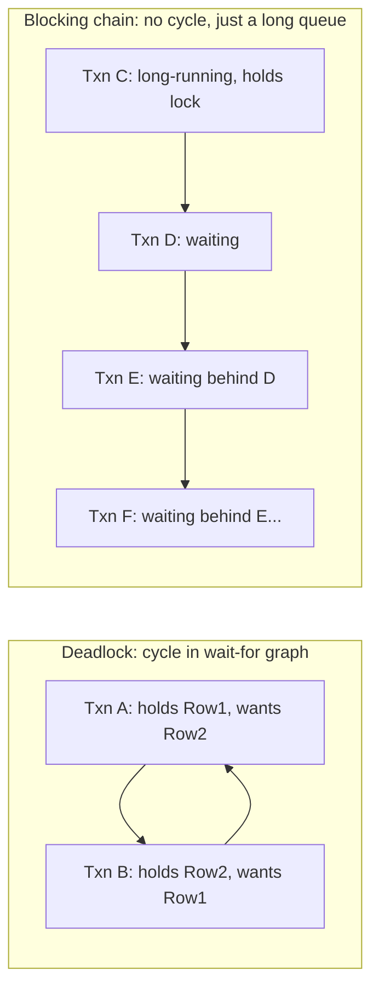
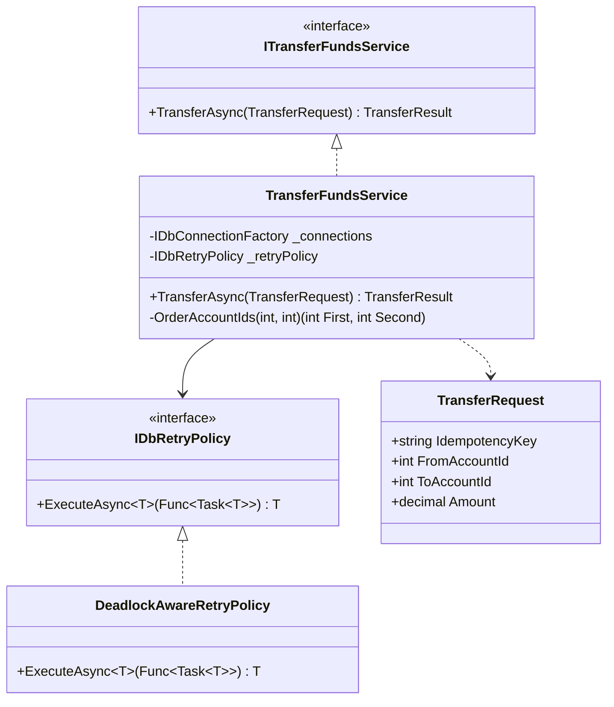
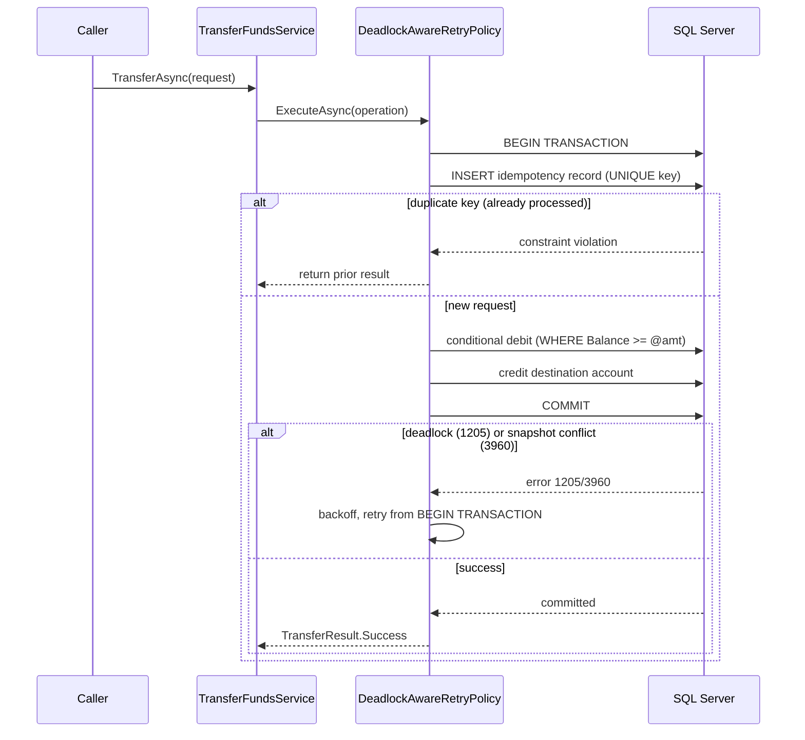

# Module 19 — SQL Server: Transactions, Isolation Levels & Locking

> Domain: SQL Server | Level: Beginner → Expert | Prerequisite: [[01-Indexing-Query-Execution-Plans]]

---

## 1. Fundamentals

### What is a transaction, and what is an isolation level?
A **transaction** is a unit of work satisfying the **ACID** properties — Atomicity (all-or-nothing), Consistency (moves the database between valid states), Isolation (concurrent transactions don't corrupt each other's view of data), Durability (once committed, survives a crash). The **isolation level** governs *how much* concurrent transactions can see of each other's in-progress, uncommitted changes — a tunable trade-off between consistency guarantees and concurrency (throughput/blocking).

### Why do these exist?
Without transactions, a multi-step operation (debit account A, credit account B) could partially fail, leaving the database in a corrupted, inconsistent state. Without isolation-level control, the *strictest* possible isolation (fully serializing every transaction) would be simple to reason about but would destroy concurrency — real workloads need a tunable spectrum letting most operations run concurrently while still preventing the specific classes of anomaly that matter for a given operation.

### When does this matter?
Every multi-statement operation touching shared, concurrently-accessed data; the depth matters for correctly diagnosing deadlocks/blocking chains (an extremely common real-world production incident) and for choosing an isolation level deliberately rather than accepting the default without understanding its trade-offs.

### How does it work (30,000-ft view)?
```sql
BEGIN TRANSACTION;
 UPDATE Accounts SET Balance = Balance - 100 WHERE Id = 1;
 UPDATE Accounts SET Balance = Balance + 100 WHERE Id = 2;
COMMIT TRANSACTION;
-- Both updates succeed together, or (on any failure) both roll back -- atomicity.
```

---

## 2. Deep Dive

### 2.1 The Isolation-Level Spectrum and the Anomalies Each Prevents
- **Read Uncommitted**: no locks taken for reads; permits **dirty reads** (seeing another transaction's uncommitted, possibly-to-be-rolled-back changes) — rarely appropriate for anything beyond approximate reporting queries tolerant of transient inaccuracy.
- **Read Committed** (SQL Server's default): reads never see uncommitted data, but a value can change between two reads within the same transaction (**non-repeatable read**) since read locks are released immediately after each individual read statement.
- **Repeatable Read**: holds read locks for the transaction's duration, preventing non-repeatable reads, but still permits **phantom reads** (a second query with the same predicate returns *additional* rows a concurrent insert added, since range-locking isn't held).
- **Serializable**: the strictest — range-locks predicates, preventing phantoms too, at the cost of significantly reduced concurrency (more blocking).
- **Snapshot Isolation** (and **Read Committed Snapshot Isolation**, RCSI): a fundamentally different mechanism — readers see a consistent, versioned snapshot of data as of transaction/statement start, using **row versioning** (in `tempdb`) instead of locks, so readers never block writers and writers never block readers — eliminating most blocking-related anomalies without serializable's throughput cost, at the expense of `tempdb` version-store overhead and the possibility of a **write-write conflict** (error `3960`) requiring application-level retry.

### 2.2 Locking Granularity and Lock Escalation
SQL Server takes locks at multiple granularities (row, page, table) — the optimizer/engine chooses based on estimated scope, and **lock escalation** (row/page locks automatically escalating to a single table lock, by default when a statement holds more than ~5,000 row locks) trades granularity for lock-management overhead, but can unexpectedly block unrelated concurrent operations on the *entire* table when a large batch operation triggers it — a common, non-obvious cause of a sudden, hard-to-diagnose blocking spike during a bulk update/delete.

### 2.3 Deadlocks — Precise Mechanics and Detection
A deadlock occurs when two (or more) transactions each hold a lock the other needs, with neither able to proceed — a genuine cycle in the "waiting for" graph. SQL Server runs a background **deadlock monitor** thread that periodically detects such cycles and **unilaterally kills one transaction** (the "deadlock victim," typically chosen by estimated rollback cost, sometimes influenced by `SET DEADLOCK_PRIORITY`), returning error 1205 to the victim's caller — the surviving transaction proceeds normally. The classic cause: two transactions updating the same two rows/tables in **opposite order** — Transaction A locks Row 1 then wants Row 2; Transaction B locks Row 2 then wants Row 1 — the fix is almost always **enforcing a consistent lock-acquisition order** across all transactions touching the same resources.

### 2.4 Blocking Chains — Distinct from Deadlocks
Blocking (one transaction waiting for another to release a lock) is normal, expected, and usually resolves quickly once the blocking transaction commits/rolls back — it only becomes a production problem when a **long-running transaction** (an accidentally-open transaction, a slow query, or an application holding a transaction open across a network round-trip/user-interaction pause) blocks many other transactions in a growing chain, degrading throughput/latency system-wide without ever technically deadlocking (no cycle — just one very long wait, and everyone waiting behind it).

### 2.5 Optimistic vs Pessimistic Concurrency Control
Locking-based isolation levels (Read Committed through Serializable) are **pessimistic** — assume conflicts are likely, prevent them via locks acquired proactively. Snapshot isolation is **optimistic** — assume conflicts are rare, allow concurrent access via versioning, detect a genuine conflict only at commit time (the write-write conflict error) and require the application to retry — directly the same optimistic-concurrency philosophy as ETags, now applied at the database engine's own transaction-isolation layer rather than the HTTP-API layer.

## 3. Visual Architecture

```mermaid
graph LR
 subgraph "Deadlock: cycle in wait-for graph"
 A["Txn A: holds Row1, wants Row2"] --> B["Txn B: holds Row2, wants Row1"]
 B --> A
 end
 subgraph "Blocking chain: no cycle, just a long queue"
 C["Txn C: long-running, holds lock"] --> D["Txn D: waiting"]
 D --> E["Txn E: waiting behind D"]
 E --> F["Txn F: waiting behind E..."]
 end
```

## 4. Production Example
**Scenario**: An order-processing service experienced periodic, severe latency spikes (all order-related endpoints stalling for 10–30 seconds) correlated with a nightly batch report job. **Investigation**: `sys.dm_exec_requests`/blocking-chain analysis (`sp_WhoIsActive`) showed the batch report (a single, long-running `SELECT` under the default Read Committed isolation, holding shared locks row-by-row as it scanned) was blocking a chain of dozens of order-update transactions waiting to acquire exclusive locks on rows the report's scan happened to pass through, one at a time, over its multi-minute runtime — every order update queued up behind the report's slow-moving scan. **Fix**: switched the database to **Read Committed Snapshot Isolation (RCSI)**, so the report's reads use row-versioning instead of shared locks, never blocking the concurrent order-update writers at all — order-processing latency returned to normal immediately, with no change to either the report or the order-update code. **Lesson**: a long-running read query under a locking isolation level can silently degrade an entire OLTP system's write throughput — RCSI is frequently the single highest-leverage fix for exactly this "reporting query blocks transactional writes" pattern, since it changes the concurrency *model* itself rather than requiring every query to be individually optimized.
## 10. Interview Questions

### Basic (10)
1. **Q: What does ACID stand for?** **A:** Atomicity (all-or-nothing commit), Consistency (constraints hold across the transaction), Isolation (concurrent transactions don't observe each other's intermediate state), Durability (a committed transaction survives crashes, via the write-ahead log).
2. **Q: What is SQL Server's default isolation level?** **A:** Read Committed — readers see only committed data (no dirty reads), by default via shared locks released as each row is read (or via row versioning when `READ_COMMITTED_SNAPSHOT` is on); it does not prevent non-repeatable reads or phantoms.
3. **Q: What is a dirty read?** **A:** Reading another transaction's uncommitted data, which might later be rolled back.
4. **Q: What is a non-repeatable read?** **A:** Reading the same row twice within one transaction and getting different values because another transaction committed a change in between.
5. **Q: What is a phantom read?** **A:** Re-running the same query and getting additional rows a concurrent insert added, even though individual previously-read rows didn't change.
6. **Q: What is a deadlock?** **A:** A cycle where two or more transactions each hold a lock the other needs, with neither able to proceed.
7. **Q: What error code does SQL Server return to a deadlock victim?** **A:** 1205 ("Transaction was deadlocked... and has been chosen as the deadlock victim. Rerun the transaction.") — the victim's transaction is rolled back, and application code should treat 1205 as a retryable error class rather than a generic failure.
8. **Q: What's the difference between blocking and a deadlock?** **A:** Blocking is one transaction waiting for another's lock to release, resolving once it does; a deadlock is a genuine cycle where nothing can resolve on its own, requiring the engine to kill one transaction.
9. **Q: What is Snapshot Isolation's underlying mechanism?** **A:** Row versioning — readers see a consistent snapshot as of transaction start, stored via versions in tempdb, rather than acquiring locks.
10. **Q: What should application code do when it receives a deadlock error?** **A:** Retry the transaction — a deadlock is an expected, recoverable condition under concurrency, not a fatal application bug.

### Intermediate (10)
1. **Q: Why does Read Committed still allow non-repeatable reads despite never showing uncommitted data?** **A:** It releases each read's shared lock immediately after that individual statement completes, rather than holding it for the whole transaction — a concurrent transaction can commit a change to that same row before the original transaction re-reads it.
2. **Q: Why does Repeatable Read still allow phantom reads?** **A:** It holds locks on the specific rows already read, but doesn't lock the *range/predicate* itself, so a concurrent insert of a new row matching the same predicate isn't blocked and appears on a subsequent identical query.
3. **Q: What causes lock escalation, and why can it unexpectedly affect unrelated queries?** **A:** A single statement acquiring a very large number of row/page locks (by default, roughly 5,000) triggers automatic escalation to a table-level lock for management-overhead reasons — that table lock then blocks any other concurrent operation needing access to the table, even rows completely unrelated to the original statement's actual working set.
4. **Q: Why is enforcing a consistent lock-acquisition order the standard deadlock-prevention technique?** **A:** A deadlock requires a cycle in the wait-for graph — if every transaction acquires locks on shared resources in the same defined order, a cycle becomes structurally impossible, since no transaction can ever be waiting on something acquired "before" it in the agreed order.
5. **Q: Why does RCSI eliminate reader-writer blocking specifically, without eliminating writer-writer conflicts?** **A:** Readers under RCSI use a versioned snapshot instead of taking locks, so they never block or are blocked by writers holding exclusive locks; two concurrent writers modifying the same row still need mutual exclusion (via ordinary locking) to avoid corrupting each other's updates, which RCSI doesn't change.
6. **Q: What's the practical difference between RCSI and full Snapshot Isolation?** **A:** RCSI is a database-level setting changing Read Committed's *behavior* to use row versioning automatically for every statement, requiring no query/transaction changes; Snapshot Isolation is an explicit isolation level a transaction opts into (`SET TRANSACTION ISOLATION LEVEL SNAPSHOT`), giving transaction-level (not just statement-level) consistency, and can surface an explicit write-write conflict error requiring application-level retry handling.
7. **Q: Why can holding a transaction open during a network round-trip or user-interaction pause be especially dangerous?** **A:** The transaction's held locks persist for however long that external pause lasts (potentially seconds to minutes, entirely outside the database's or even the application's control), blocking any other transaction needing those same locks for the whole duration — a database-level problem caused by an application-tier design mistake.
8. **Q: Why might `SET DEADLOCK_PRIORITY` be used deliberately for a specific transaction?** **A:** To influence which transaction the deadlock monitor chooses as the victim when a deadlock occurs — setting a lower priority for a transaction that's cheap/safe to retry (versus one that's expensive to redo or user-facing) ensures the engine preferentially kills the less costly one.
9. **Q: What's a realistic monitoring signal distinguishing "normal, brief blocking" from "a blocking-chain incident requiring investigation"?** **A:** Blocking-chain *duration* and *depth* — brief (sub-second) blocking behind a fast-committing transaction is entirely normal and self-resolving; a growing chain of waiters behind a single, minutes-long-running transaction (visible via `sys.dm_exec_requests`'s `blocking_session_id` chains) is the signature of an actual incident worth investigating.
10. **Q: Why is a deadlock retry loop in application code not, by itself, a complete fix for frequent deadlocks?** **A:** Retrying masks the *symptom* without addressing the *root cause* (inconsistent lock ordering, overly broad transaction scope) — frequent deadlocks under normal load indicate a genuine design issue that retries paper over at the cost of added latency/complexity for every affected operation, rather than eliminating the underlying contention.

### Advanced (10)
1. **Q: Diagnose the reporting-query-blocks-writes production incident from first principles, and explain precisely why RCSI (not just "add more indexes") was the correct fix.**
 **A:** The root cause wasn't query inefficiency (an index wouldn't change the fundamental behavior) — it was the isolation-level's *locking model itself*: under Read Committed, the report's row-by-row shared locks (even briefly held per row as it scans) directly conflict with the order-update transactions' exclusive locks on the same rows; RCSI changes the *mechanism* the report's reads use (versioning instead of locking) so the conflict class disappears entirely, regardless of how efficiently either the report or the order updates are individually written — this is why RCSI is the correct diagnostic conclusion once blocking-chain analysis (not just plan analysis) identifies the report as the root blocker.
2. **Q: Design a deadlock-prevention strategy for a system where two different services (an order service and an inventory service) both update overlapping `Orders` and `Inventory` tables, in code the two teams don't share.**
 **A:** Establish and document an organization-wide, cross-team convention for lock-acquisition order (e.g., "always touch `Inventory` before `Orders` within any single transaction, regardless of which service/team's code initiates it") — since the two teams' codebases are independent, this requires an explicit, documented, cross-team architectural standard (directly this course's recurring governance pattern) rather than something enforceable purely by one team's code review; consider a lightweight, shared library helper enforcing the convention programmatically (e.g., requiring updates to go through an ordering-aware transaction helper) to make correct usage the path of least resistance rather than relying purely on documentation.
3. **Q: Explain how a write-write conflict under Snapshot Isolation manifests to the application, and how you would design retry handling for it.**
 **A:** SQL Server returns error 3960 when a transaction under Snapshot Isolation attempts to commit a change to a row that another transaction has modified and committed since the first transaction's snapshot was taken — the application must catch this specific error and retry the entire transaction from scratch (re-reading current data, re-applying business logic, re-attempting the write), exactly analogous to the ETag-based `412 Precondition Failed` retry pattern, just enforced by the database engine itself rather than an application-level version check.
4. **Q: How would you use `sys.dm_tran_locks` and `sys.dm_exec_requests` together to build a live blocking-chain diagnostic query?**
 **A:** Join `sys.dm_exec_requests` (which exposes each active request's `blocking_session_id`) recursively to itself to reconstruct the full waiter chain (who's blocking whom, transitively), then join to `sys.dm_tran_locks` to identify exactly which resource (table/row/page) each link in the chain is contending over, and to `sys.dm_exec_sql_text`/`sys.dm_exec_query_plan` to surface the actual query text/plan for both the head blocker and each waiter — giving a complete, actionable picture (who's blocked, by what, on which resource, running which query) in one diagnostic pass, exactly what a tool like `sp_WhoIsActive` automates.
5. **Q: Explain why lock escalation during a large batch UPDATE can cause a production incident even when the UPDATE itself completes quickly.**
 **A:** The escalated table-level lock is held for the **duration of the UPDATE's own transaction**, not just momentarily — if the batch UPDATE runs inside an explicit transaction that also does other work before committing, or even just for the UPDATE statement's own execution time, every other concurrent transaction needing that table (even for unrelated rows) queues up behind the table-level lock for that entire window, which can itself be a meaningful, business-impacting duration even if it's not "slow" in absolute terms.
6. **Q: Design an approach to safely run a large data-migration UPDATE against a live, highly-concurrent OLTP table without triggering a lock-escalation-driven outage.**
 **A:** Batch the UPDATE into many smaller transactions (e.g., updating 1,000–5,000 rows per batch, well under the lock-escalation threshold, in a loop with a brief pause between batches) rather than one single, giant UPDATE statement — trading total migration wall-clock time for avoiding both lock escalation and excessively long-held locks, letting concurrent OLTP traffic interleave between batches rather than queuing behind one enormous, escalated table lock for the migration's entire duration.
7. **Q: Explain a scenario where Snapshot Isolation's `tempdb` version-store overhead itself becomes a production concern, and how you'd diagnose it.**
 **A:** A very long-running transaction under RCSI/Snapshot Isolation forces SQL Server to retain **every** row version created by concurrent writers since that transaction's snapshot began, for as long as it remains open — if that transaction runs for hours (e.g., an accidentally-uncommitted transaction, or a genuinely long batch job), `tempdb`'s version store can grow substantially, potentially exhausting `tempdb` space or degrading its own performance; diagnosed via `sys.dm_tran_active_snapshot_database_transactions` to identify long-running snapshot transactions and their age, combined with monitoring `tempdb` version-store size specifically.
8. **Q: How would you decide between fixing a blocking-chain problem via RCSI (a database-wide setting) versus rewriting the specific offending query to be faster/shorter?**
 **A:** RCSI is the broader, more structural fix — appropriate when the underlying problem is fundamentally "reads and writes contend under a locking isolation model," a category-level issue likely to recur with other queries even if this specific one is optimized; rewriting the specific query is more targeted and appropriate if the blocking is caused by one genuinely poorly-written, unnecessarily-slow query (fixable via the indexing/sargability techniques) rather than a fundamental isolation-model mismatch — in practice, both are often worth doing (fix the specific slow query *and* adopt RCSI as a structural safety net), but understanding which one is actually addressing the root cause (versus merely masking it) matters for correctly prioritizing the fix.
9. **Q: Explain why a deadlock retry loop combined with exponential backoff (the pattern) is more robust than an immediate, unconditional retry.**
 **A:** If the deadlock's root cause is genuine, sustained contention (not a one-off timing coincidence), an immediate retry can simply re-encounter the same conflicting transaction and deadlock again repeatedly — a brief, jittered backoff (directly the retry-with-backoff exercise) gives the contending transaction a chance to actually complete and release its locks before the retry attempt, improving the odds of the retry succeeding rather than looping into repeated deadlocks.
10. **Q: As a Principal Engineer, how would you build organizational awareness that isolation-level choice is an active architectural decision, not a fixed, unchangeable default?**
 **A:** Include isolation-level/RCSI evaluation explicitly in the database-design section of the organization's architecture-review template (directly this course's recurring governance pattern) for any new system anticipating mixed OLTP-and-reporting workloads against the same database, require documented reasoning for the choice (not silent acceptance of the engine default), and share this module's production incident as a concrete, memorable case study specifically because "we just changed one database setting and fixed a major latency incident with zero code changes" is a uniquely compelling, easy-to-remember illustration of why this decision deserves deliberate attention rather than being treated as an unchangeable platform default.

### Expert (FinTech Principal Panel)

1. **Q: Two concurrent withdrawals hit the same account with balance 100, each for 80. Naively both read 100, both check "≥ 80", both write 20 — the account is overdrawn and money is created. Walk through every correct way to prevent this "lost update / double-spend," and their trade-offs.**
 **A:** The bug is a **read-modify-write race** under an isolation level that lets both transactions read the same starting balance. Correct fixes: (1) **Conditional atomic update** (best default): `UPDATE Accounts SET Balance = Balance - @amt WHERE Id = @id AND Balance >= @amt;` then check `@@ROWCOUNT` — the `WHERE` guard and the decrement happen atomically under the row's exclusive lock, so exactly one withdrawal succeeds and the other affects 0 rows (rejected). No separate read; the database enforces the invariant. (2) **Pessimistic lock**: `SELECT... WITH (UPDLOCK, HOLDLOCK) WHERE Id=@id` to take an update lock at read time so the second transaction blocks until the first commits, then sees the true balance — needed when you must compute across multiple rows before deciding. (3) **Optimistic concurrency**: a `RowVersion`/`Version` column; `UPDATE... WHERE Id=@id AND Version=@readVersion`, retry on 0 rows — good under low contention, avoids holding locks. (4) **Serializable/snapshot** isolation makes the anomaly impossible but at concurrency/retry cost. Trade-offs: the conditional atomic update is simplest and fastest and should be the default for single-row balance changes; pessimistic locking is for multi-row decisions but risks blocking/deadlock (enforce lock ordering); optimistic is best for low-contention, high-read scenarios but needs retry logic. The Principal point: never trust an application-side read-then-check-then-write for money — push the invariant into an atomic, database-enforced operation (`WHERE Balance >= @amt` or a version guard), because only the engine can make the check-and-act atomic under concurrency.
 **Why correct:** Diagnoses the read-modify-write race and gives all four mechanisms (conditional atomic update, UPDLOCK/HOLDLOCK, optimistic version, serializable) with correct trade-offs and a sensible default.
 **Common mistakes:** App-side read-check-write with no atomic guard; assuming Read Committed prevents lost updates (it doesn't); using a plain `SELECT` before `UPDATE` without `UPDLOCK`.
 **Follow-ups:** "Why does `WHERE Balance >= @amt` + `@@ROWCOUNT` beat SELECT-then-UPDATE?" / "How do UPDLOCK and HOLDLOCK differ and why both?" / "When is optimistic concurrency the wrong choice?" (high contention → constant retries).

2. **Q: A payment must debit an account in the Accounts service and post to the Ledger service — two databases. Why not a distributed (2PC/`TransactionScope` MSDTC) transaction, and what do you use instead?**
 **A:** A single ACID transaction across two services/databases requires a distributed transaction (2PC/MSDTC), which is avoided at scale because: it **blocks and holds locks across the network** for the whole prepare-commit round trip (latency + contention), the **coordinator is a single point of failure** (a crash mid-protocol leaves participants in-doubt with locks held), it **doesn't fit heterogeneous stores** (Kafka, DynamoDB, external APIs), and it couples service availability (all must be up). Instead use **eventual-consistency patterns**: (1) **Transactional Outbox** — within *one* local ACID transaction, write the business change *and* an outbox row; a relay publishes the event at-least-once to a broker, and the Ledger service consumes it **idempotently** — this makes the local write and the intent-to-notify atomic without a distributed lock. (2) **Saga** — model the multi-step flow as local transactions with **compensating actions** (if the ledger post fails, issue a compensating reversal of the debit) rather than a global rollback. Consumers must be idempotent (at-least-once redelivery) and the flow must tolerate the intermediate inconsistency window. The Principal framing: cross-service atomicity is bought with 2PC's availability/latency/lock costs, which don't scale; the industry answer is *local transaction + outbox + idempotent consumers*, or a *saga with compensations* — trading strict immediate consistency for availability and a bounded eventual-consistency window.
 **Why correct:** Names 2PC's real failure modes (blocking, coordinator SPOF, heterogeneity, coupled availability) and prescribes outbox + idempotent consumers / saga with compensation.
 **Common mistakes:** Reaching for `TransactionScope`/MSDTC across services; publishing to the broker outside the DB transaction (dual-write); assuming saga steps don't need idempotency.
 **Follow-ups:** "Why does outbox solve the dual-write problem?" / "What's a compensating transaction for a completed debit?" / "How do you bound and monitor the inconsistency window?"

3. **Q: Design the core money-movement storage: a mutable `Accounts.Balance` column, or an append-only double-entry ledger? Argue the trade-offs and how isolation/consistency applies to each.**
 **A:** A mutable balance is simple and O(1) to read but is a **lossy, contention-hot, hard-to-audit** design — every write contends on one row (a hotspot under load), and you lose *why* the balance is what it is (no history, weak auditability, reconciliation is guesswork). An **append-only double-entry ledger** (every movement is two immutable entries, debit + credit, that sum to zero) is the industry standard because: it's an **immutable audit trail** (regulators require it), balance is a **derived** value (sum of entries, or a periodically-checkpointed materialized balance), and correctness is checkable (debits == credits is a monitorable invariant). Isolation/consistency: with a ledger, "does the account have funds" is still a concurrency question — you either compute available balance under an appropriate lock/snapshot before appending, or (better) enforce the invariant with an atomic guarded insert against a maintained balance row updated in the *same* transaction as the ledger entries. The trade-off is read cost (deriving balance) vs. write simplicity and auditability — usually resolved by keeping an authoritative append-only ledger **plus** a materialized current-balance updated transactionally with each posting (best of both: fast reads, full history, atomic invariant enforcement). The Principal framing: for money, prefer the append-only double-entry ledger as the source of truth (auditability + reconstructability + a checkable invariant), and manage read cost with a transactionally-consistent materialized balance — a bare mutable balance column trades away the auditability and correctness properties finance actually requires.
 **Why correct:** Contrasts auditability/contention/history trade-offs and lands on append-only double-entry ledger + transactionally-maintained materialized balance, with the concurrency invariant addressed.
 **Common mistakes:** Bare mutable balance with no history; deriving balance by scanning all history every read; updating the materialized balance in a *separate* transaction from the ledger entries (can diverge).
 **Follow-ups:** "How do you keep the materialized balance and ledger consistent?" (same transaction) / "How does double-entry give you a continuously-monitorable correctness signal?" / "Where do snapshots/checkpoints fit for a huge ledger?"

4. **Q: Payment retries (from client timeouts) can arrive as duplicate requests. How do you make money movement idempotent at the database level so a retry can never double-post, and how does this interact with transaction isolation?**
 **A:** Enforce idempotency with the **database as the arbiter**, not application checks: give each logical operation a client-supplied **idempotency key**, and put a **UNIQUE constraint** on it in the table that records the operation (or a dedicated idempotency table). Within a single transaction, insert the idempotency record (or the ledger entry keyed by it) *and* apply the money movement; a duplicate retry attempting to insert the same key hits a **unique-constraint violation**, which the code catches to mean "already processed" and returns the original result rather than posting again. This is atomic and race-proof because the unique index enforces exactly-once *at commit*, even under two simultaneous retries — one commits, the other violates the constraint (versus an app-level "SELECT if exists then INSERT," which races under Read Committed and lets both through). Isolation interaction: the constraint gives you correctness regardless of isolation level (you don't need Serializable), and it converts the concurrency problem into a deterministic conflict the engine resolves. Pair with storing the original response so the duplicate can be answered identically (REST idempotency-key pattern). The Principal framing: idempotency for money must be enforced by a unique key at the storage layer inside the same transaction as the effect — that makes exactly-once a *committed database invariant* rather than an application race, which is the only version that survives concurrent retries and crashes.
 **Why correct:** Uses a UNIQUE-constrained idempotency key committed in the same transaction as the effect, explains why it beats app-level check-then-insert under concurrency, and notes it removes the need for stricter isolation.
 **Common mistakes:** App-level "check exists then insert" (races); recording idempotency in a separate transaction from the effect; relying on higher isolation instead of a constraint.
 **Follow-ups:** "Why does a UNIQUE constraint beat SELECT-then-INSERT under Read Committed?" / "How do you return the original response on a duplicate?" / "How does this pair with the outbox pattern?"

5. **Q: A regulatory report aggregating daily trade totals uses `SELECT... FROM Trades WITH (NOLOCK)` for speed, since it's "just a read." Explain precisely how this can produce a materially wrong (not just stale) total, distinct from the ordinary dirty-read risk.**
 **A:** `NOLOCK` (Read Uncommitted) is usually explained only as "might see uncommitted data" — the more dangerous, less-understood risk for a large aggregating scan is that it can **skip rows entirely or count a row twice**, independent of any concurrent uncommitted transaction. This happens because `NOLOCK` takes no locks at all, including no protection against **concurrent page splits**: if a scan is mid-page-read when an insert on another row triggers a B+ tree page split (the page's rows redistributing across two pages), a `NOLOCK` scan can either miss rows that moved to a newly-allocated page it had already passed, or re-read rows that moved to a page it hasn't yet reached but that duplicate rows the original page still shows — producing a **materially incorrect aggregate total**, not merely a stale-but-internally-consistent one, and with no error raised at all. For a regulatory trade-total submission, this is a genuine compliance risk: the report can be silently, provably wrong in a way that looks identical to a correct one. The fix: never use `NOLOCK` for any query whose correctness matters (aggregations, regulatory reports, reconciliation) — use RCSI/Snapshot Isolation instead, which gives the same "readers don't block writers" benefit `NOLOCK` is usually reached for, but via a **consistent, versioned snapshot** rather than an unprotected, page-split-vulnerable raw scan.
 **Why correct:** Identifies the specific mechanism (concurrent page split causing missed/duplicated rows during an unprotected scan) beyond the commonly-cited dirty-read risk, and prescribes RCSI/Snapshot Isolation as the correct alternative achieving the same non-blocking goal safely.
 **Common mistakes:** Explaining `NOLOCK`'s risk only as "might see uncommitted data," missing the page-split row-skip/duplicate mechanism entirely; assuming `NOLOCK` is an acceptable default for "just reporting" queries without considering aggregation correctness.
 **Follow-ups:** "Why doesn't RCSI have this page-split risk?" (Its versioned snapshot is a consistent, point-in-time view maintained via tempdb row versions, not a raw, unprotected scan of live, concurrently-mutating pages.) / "How would you detect this had happened after the fact?" (Extremely difficult — there's no error or log entry; this is exactly why permanent, independent reconciliation against an external source of truth, not query-level trust, is the real backstop.)

6. **Q: An order-matching engine needs multiple competing consumer processes to safely dequeue work items from a `PendingOrders` table without two consumers ever processing the same row, and without a slow consumer blocking every other consumer's dequeue attempt. Design the SQL-level concurrency pattern.**
 **A:** Combine `UPDLOCK` and `READPAST` in the dequeue statement: `UPDATE TOP (1) PendingOrders WITH (UPDLOCK, READPAST) SET Status = 'Claimed', ClaimedBy = @workerId OUTPUT INSERTED.OrderId WHERE Status = 'Pending'`. `UPDLOCK` takes an update lock on the row it selects, preventing a second concurrent consumer from claiming the *same* row (solving the double-processing risk); `READPAST` tells the engine to **skip over any row currently locked by another transaction** rather than blocking and waiting for it — so a second consumer's dequeue attempt, instead of queuing up behind the first consumer's in-flight claim, simply moves on to the next available unlocked row. This gives exactly the desired behavior: no two consumers ever claim the same row (mutual exclusion via `UPDLOCK`), and no consumer is ever blocked waiting for another's claim to resolve (non-blocking skip via `READPAST`) — a SQL-native work-queue pattern avoiding both double-processing and consumer-blocking-consumer contention, without needing a dedicated message broker for this specific use case.
 **Why correct:** Combines `UPDLOCK` (mutual exclusion) and `READPAST` (non-blocking skip) correctly and explains why each is individually necessary for the stated dual requirement.
 **Common mistakes:** Using only `UPDLOCK` without `READPAST` (correct mutual exclusion, but consumers block behind each other, defeating the "don't block other consumers" requirement); using a plain `SELECT` then separate `UPDATE` (a race — two consumers can both select the same row before either updates it).
 **Follow-ups:** "What happens if a worker crashes after claiming but before completing?" (The row is left in `Claimed` status indefinitely unless a separate reaper/timeout process detects stale claims and resets them — a real operational gap this pattern alone doesn't solve.) / "Why not just use a message broker instead?" (A broker is usually the better long-term answer for this exact use case — this pattern is valuable specifically when the work items must remain queryable/joinable as first-class rows in the same transactional database as the rest of the domain data.)

7. **Q: A multi-step stored procedure posts several related ledger entries inside `BEGIN TRY... BEGIN TRANSACTION... COMMIT... END TRY BEGIN CATCH ROLLBACK... END CATCH`, yet a production incident shows a partial commit occurred despite the CATCH block running. Diagnose using `XACT_STATE()`.**
 **A:** Not every error inside a transaction leaves it in a rollback-able state — a sufficiently severe error (certain constraint violations under specific conditions, or explicitly via `SET XACT_ABORT ON` combined with certain error classes) can mark the transaction as a **doomed transaction** (`XACT_STATE() = -1`, uncommittable but also **not yet rolled back**) rather than simply erroring out (`XACT_STATE() = 0`, no open transaction) or remaining healthy (`XACT_STATE() = 1`). A naive `CATCH` block that unconditionally calls `ROLLBACK TRANSACTION` handles the healthy-transaction-with-a-later-recoverable-error case fine, but a doomed transaction *also* requires an explicit `ROLLBACK` — the actual bug here was more subtle: `XACT_ABORT` was **not** set `ON`, so a specific runtime error (e.g., an arithmetic overflow) aborted only the *individual statement*, not the whole batch, and execution continued to a subsequent statement inside the same still-open transaction that then committed — the CATCH block never even ran, because the statement-abort didn't raise a catchable batch-level error at all without `XACT_ABORT ON`. **Fix**: `SET XACT_ABORT ON` at the top of the procedure ensures *any* runtime error immediately aborts the entire batch and rolls back the transaction, converting the previously-silent statement-level-only abort into the batch-level abort the `TRY/CATCH` structure was actually designed to assume; the `CATCH` block itself should also check `XACT_STATE()` explicitly and only call `ROLLBACK` when it's `-1` or `1` (never blindly, since calling `ROLLBACK` with no open transaction, `XACT_STATE() = 0`, itself raises an error).
 **Why correct:** Correctly diagnoses the missing `XACT_ABORT ON` as allowing a statement-level abort to silently bypass the intended batch-level `TRY/CATCH` rollback, and prescribes both the `XACT_ABORT ON` fix and defensive `XACT_STATE()` checking in the CATCH block.
 **Common mistakes:** Assuming any error inside a `TRY` block automatically triggers the `CATCH` block and a full rollback, without realizing `XACT_ABORT`'s default-`OFF` behavior lets many errors abort only the current statement, silently continuing the batch inside a still-open, now-partially-applied transaction.
 **Follow-ups:** "Why is `XACT_ABORT ON` not the SQL Server default?" (Backward compatibility with legacy T-SQL written before its introduction, which relied on statement-level-only abort behavior — a real, if unfortunate, ongoing footgun for anyone assuming modern transactional-safety defaults.) / "Does this fix apply to .NET `TransactionScope`-wrapped ADO.NET code too?" (The equivalent discipline is: never assume a caught exception implies the underlying SQL transaction was safely rolled back — always explicitly verify/rollback in the `catch`/`finally`, and set `XACT_ABORT ON` server-side regardless of client-side transaction management.)

8. **Q: A ledger-posting service under extreme write contention (thousands of concurrent postings/second to a relatively small set of hot accounts) is evaluated for migration to In-Memory OLTP (Hekaton). Explain the underlying concurrency model difference and when this migration is actually justified.**
 **A:** In-Memory OLTP tables use a fundamentally different, **lock-free, latch-free** concurrency model based on **multi-version optimistic concurrency control (MVCC)** at the row level, distinct from both classic pessimistic locking *and* RCSI's tempdb-based versioning — every row version is held natively in-memory with begin/end timestamps, readers never take locks or latches at all, and writers detect conflicts **only at commit validation time** (an optimistic "did anyone else touch what I touched, since I started" check), never by blocking during the transaction itself. For a genuinely hot-account, extreme-contention workload, this eliminates the classic pessimistic-locking throughput ceiling (§Performance Engineering) entirely, since there's no lock/latch acquisition step to contend over in the first place. The trade-offs: a write-write conflict under In-Memory OLTP still requires application-level retry (conceptually identical to Snapshot Isolation's write-write conflict, error 41302/41325, just at a different layer), the memory-resident table's size is bounded by available RAM (durable-but-memory-resident, with the log still providing durability), and not every T-SQL construct/isolation-level combination is supported inside natively-compiled stored procedures. The migration is justified specifically when profiling (§7's spinlock/wait-stat diagnostics) shows the *lock/latch manager itself*, not I/O or query-plan inefficiency, is the measured bottleneck for a small, well-understood hot-row working set — not as a default modernization for every table, given the real constraints on supported features and memory sizing.
 **Why correct:** Correctly explains In-Memory OLTP's native MVCC (distinct from tempdb-based RCSI versioning), its commit-time optimistic conflict detection, and scopes the recommendation to a measured lock/latch-bound bottleneck rather than a blanket modernization.
 **Common mistakes:** Conflating In-Memory OLTP's native row-versioning with RCSI/Snapshot Isolation's tempdb-based versioning, as though they're the same mechanism; recommending the migration without first confirming via wait-stat/spinlock diagnostics that lock/latch contention (not something else) is the actual bottleneck.
 **Follow-ups:** "What happens on a write-write conflict under In-Memory OLTP?" (The later-committing transaction's commit validation fails with a specific retryable error, requiring the same application-level retry-with-backoff discipline as any other optimistic-concurrency conflict.) / "Is durability sacrificed for this speed?" (No — memory-optimized tables can still be fully durable via the transaction log, though a `SCHEMA_ONLY` non-durable option exists for pure-performance, acceptable-data-loss-on-restart use cases, which would never be appropriate for ledger data.)

9. **Q: A distributed transaction spanning a linked server (cross-instance) occasionally hangs indefinitely rather than deadlocking cleanly. Explain why SQL Server's standard deadlock detection doesn't reliably catch this, and the recommended alternative architecture.**
 **A:** SQL Server's background deadlock monitor (§2.3) detects cycles **within a single instance's** lock-manager wait-for graph — it has no visibility into a *distributed* transaction's wait-for relationships spanning a linked server/cross-instance MSDTC-coordinated transaction, where Instance A's transaction might be waiting on a lock held by Instance B's, while Instance B's transaction is simultaneously waiting on a lock held by Instance A's — a genuine cross-instance deadlock cycle **invisible to either instance's own local deadlock monitor**, which is exactly why it can manifest as an indefinite hang rather than a clean, fast deadlock-victim error. MSDTC does have its own, separate distributed-transaction timeout mechanism, but it's typically configured much longer than a local deadlock monitor's detection interval, explaining the "hangs for a long time before eventually erroring" symptom. The recommended architecture, consistent with Advanced Q2's broader distributed-transaction guidance, is to **avoid cross-instance distributed transactions for this exact reason** — replace the linked-server 2PC pattern with the outbox-plus-idempotent-consumer or saga-with-compensation pattern, converting an opaque, hard-to-diagnose cross-instance locking problem into a set of independently-reasoned, locally-transactional steps with explicit, observable compensation logic instead.
 **Why correct:** Correctly explains why local deadlock detection can't see a cross-instance wait-for cycle, identifies MSDTC's separate and typically much longer timeout as the reason for the "hang" symptom, and connects the fix back to the established outbox/saga guidance.
 **Common mistakes:** Assuming SQL Server's deadlock monitor operates across linked servers/distributed transactions the same way it does locally; treating a hung distributed transaction as a mysterious, unexplainable production anomaly rather than a known, structural limitation of cross-instance 2PC.
 **Follow-ups:** "How would you diagnose this while it's happening, given local deadlock detection won't fire?" (`sys.dm_tran_locks` on each involved instance individually, manually correlating wait/blocking relationships across instances — inherently more effort than a single-instance blocking-chain query, itself a strong practical argument against ever relying on cross-instance distributed transactions.) / "Does In-Memory OLTP change this risk?" (No — this is specifically a cross-instance coordination problem, orthogonal to whichever concurrency model either individual instance uses internally.)

10. **Q: Compliance requires that a regulatory "as of 4:00pm market close" report reflect the true, fully-committed state of every trade — but the report runs against an Always On readable secondary for load-isolation reasons (§9), and secondaries always have some replication lag. Design the correctness guarantee.**
 **A:** A readable secondary's implicit, forced snapshot-style reads (§9) guarantee **internal consistency** (every row the report sees reflects a single, coherent point in time) but say nothing about **how current** that point in time is relative to the primary — the secondary could be lagging by milliseconds or, under an unusual replication delay, considerably longer, and a report that silently runs against a lagging secondary without checking this is a genuine, if usually invisible, correctness risk for a hard compliance deadline like "as of market close." The correct design explicitly checks replication lag **before** running the report: query `sys.dm_hadr_database_replica_states` (specifically `last_hardened_time`/`redo_queue_size` for the secondary in question) immediately before report generation, and if the lag exceeds a defined tolerance (e.g., a few seconds), either wait briefly for it to catch up, or — for a genuinely hard compliance deadline — fail over to running the report against the primary directly rather than silently accepting stale data. This converts an implicit, unverified staleness assumption into an explicit, checked precondition — directly the same "verify the precondition rather than assume it" discipline this module applies to isolation-level and locking assumptions generally, now applied to the replication-topology layer specifically.
 **Why correct:** Correctly distinguishes internal consistency (guaranteed) from currency/freshness (not guaranteed) for a readable secondary, and prescribes an explicit, checked lag-tolerance precondition rather than an unverified assumption.
 **Common mistakes:** Assuming a readable secondary's snapshot-consistent reads mean the data is also necessarily current/fresh; running a hard-deadline compliance report against a secondary with no lag check at all.
 **Follow-ups:** "What would you do if the secondary is unacceptably lagged right at the reporting deadline?" (Fail over the specific report to the primary as a fallback path, accepting the primary-load cost this specific report normally avoids, since correctness for a hard regulatory deadline outweighs the isolation benefit for that one run.) / "Is this risk specific to Always On, or does it generalize?" (It generalizes to any read-replica/secondary architecture — the same explicit lag-check discipline applies equally to a read replica in any other database engine used for compliance-sensitive reporting.)

---

## 11. Coding Exercises

### Easy — Enforce consistent lock ordering to prevent a deadlock
```sql
-- BEFORE: Transaction A and B acquire locks in DIFFERENT orders -- deadlock risk
-- Txn A: UPDATE Accounts WHERE Id = 1; then UPDATE Accounts WHERE Id = 2;
-- Txn B: UPDATE Accounts WHERE Id = 2; then UPDATE Accounts WHERE Id = 1; -- OPPOSITE order!

-- AFTER: BOTH transactions always acquire locks in ascending Id order
CREATE PROCEDURE TransferFunds @FromId INT, @ToId INT, @Amount DECIMAL
AS
BEGIN
 DECLARE @First INT = CASE WHEN @FromId < @ToId THEN @FromId ELSE @ToId END;
 DECLARE @Second INT = CASE WHEN @FromId < @ToId THEN @ToId ELSE @FromId END;

 BEGIN TRANSACTION;
 UPDATE Accounts SET Balance = Balance + 0 WHERE Id = @First; -- touch in consistent order first
 UPDATE Accounts SET Balance = Balance + 0 WHERE Id = @Second;
 -- (actual balance adjustments applied here, in the same consistently-ordered sequence)
 COMMIT TRANSACTION;
END
```

### Medium — Enable RCSI at the database level
```sql
ALTER DATABASE OrdersDb SET READ_COMMITTED_SNAPSHOT ON; -- requires no active connections during the switch
-- After this, ALL Read Committed transactions (the default) automatically use row versioning
-- instead of shared locks -- no application code changes required.
```

### Hard — Retry logic for deadlocks and snapshot write-write conflicts
```csharp
public async Task<T> ExecuteWithDbRetryAsync<T>(Func<Task<T>> operation, int maxAttempts = 3)
{
    for (int attempt = 1;; attempt++)
    {
        try
        {
            return await operation;
        }
        catch (SqlException ex) when ((ex.Number is 1205 or 3960) && attempt < maxAttempts)
        {
            // 1205 = deadlock victim, 3960 = snapshot isolation write-write conflict --
            // both are expected, recoverable conditions under concurrency, per §Advanced Q9.
            await Task.Delay(TimeSpan.FromMilliseconds(100 * Math.Pow(2, attempt - 1) + Random.Shared.Next(0, 50)));
        }
    }
}
```
**Discussion**: This directly reuses the exception-filter-based retry-with-backoff pattern (the `when` clause on the final attempt correctly lets the exception propagate rather than retrying indefinitely), applied specifically to the two SQL Server error codes representing expected, retryable concurrency conditions rather than genuine application bugs.

### Expert — Batched migration UPDATE avoiding lock escalation
```sql
DECLARE @BatchSize INT = 2000, @RowsAffected INT = 1;

WHILE @RowsAffected > 0
BEGIN
 BEGIN TRANSACTION;
 UPDATE TOP (@BatchSize) Orders
 SET Status = 'Migrated'
 WHERE Status = 'Pending' AND MigratedFlag = 0;

 SET @RowsAffected = @@ROWCOUNT;
 COMMIT TRANSACTION;

 WAITFOR DELAY '00:00:00.100'; -- brief pause lets concurrent OLTP transactions interleave between batches
END
```
**Discussion**: Keeping `@BatchSize` (2,000) comfortably under the ~5,000-row lock-escalation threshold is deliberate — each batch's transaction commits and releases its locks before the next batch begins, so no single transaction ever holds a table-level escalated lock, and concurrent OLTP traffic gets regular opportunities to interleave via the `WAITFOR DELAY` pause, directly implementing Advanced Q6's recommended migration strategy.

---

## 12. System Design

**Scenario**: Design the transaction/concurrency architecture for a **core account-ledger and order-settlement service** at a payments/brokerage firm — the system must post debits/credits atomically, prevent double-spend/overdraft under high concurrent load on the same hot accounts, support a live operational dashboard querying the same tables continuously, and never allow a partial (torn) financial write to become visible or committed.

- **Functional requirements**: Atomic multi-entry ledger postings (a single logical transaction may touch several accounts); real-time balance/overdraft enforcement under concurrent postings to the same account; a live dashboard reading current balances/pending postings without impacting posting throughput; idempotent handling of retried posting requests.
- **Non-functional requirements**: No double-spend or lost update under any concurrent load pattern (a hard correctness requirement, not a best-effort one); posting-path p99 latency low enough to support real-time payment authorization; the dashboard must never block or be blocked by the posting path; full recoverability (no torn writes) across any crash/failover.
- **Architecture**: The database runs under **RCSI** by default (§4) so the dashboard's continuous reads never take shared locks against posting transactions and vice versa — eliminating the reader-writer contention class entirely at the database-setting level, no per-query change required. The actual **balance-mutation path**, however, does not rely on RCSI's optimism for its correctness guarantee — every posting uses the **conditional atomic update** pattern (Module 18-equivalent: `UPDATE Accounts SET Balance = Balance - @amt WHERE Id=@id AND Balance >= @amt` checked via `@@ROWCOUNT`), which is safe under any isolation level because the check-and-write is a single atomic statement under the row's exclusive lock, not a separate read-then-write. Every posting entry additionally carries a client-supplied **idempotency key enforced via a UNIQUE constraint** (§Expert Q4), committed in the *same* transaction as the balance mutation, so a retried request can never double-post regardless of isolation level. Cross-account, multi-entry postings acquire their row locks in a **consistent, ascending-key order** (Easy coding exercise) across every code path, structurally eliminating the classic opposite-order deadlock pattern (§2.3) rather than relying on retry logic alone to paper over it.
- **Data model**: An append-only `LedgerEntries` table (double-entry: every posting is a balanced set of debit/credit rows) is the source of truth and audit trail; a `Accounts.Balance` column is maintained **transactionally, in the same transaction**, as a materialized, fast-to-read current balance — never updated in a separate transaction from its corresponding ledger entries, avoiding the divergence risk of updating a derived value out-of-band. Every posting's status follows `NOT_STARTED → EXECUTING → SUCCESS | FAILED`, consistent with this course's standing lifecycle convention, with `FAILED` postings leaving no partial ledger entries by construction (the whole multi-entry transaction either fully commits or fully rolls back).
- **Messaging/failure handling**: A deadlock (1205) or snapshot write-write conflict (3960) is caught by a standard retry-with-exponential-backoff wrapper (Hard coding exercise) applied uniformly across every database-calling code path — both are treated as expected, retryable conditions under concurrency, never as application bugs requiring manual intervention.
- **Scaling**: Read-heavy dashboard/reporting traffic is offloaded to an Always On readable secondary (§9) rather than adding read load to the primary posting path at all; the primary is reserved exclusively for the posting write path and any read genuinely requiring up-to-the-millisecond currency (e.g., an authorization check immediately preceding a debit).
- **Monitoring**: Blocking-chain depth/duration (`sys.dm_exec_requests`, Advanced Q4) and deadlock/write-conflict retry rates are tracked as first-class production health signals, not just ad-hoc diagnostic queries — a rising retry rate is treated as an early-warning signal of growing contention on specific hot accounts, worth investigating before it manifests as a customer-visible latency incident.
- **Trade-offs**: The conditional-atomic-update pattern is deliberately preferred over pessimistic `UPDLOCK`/`HOLDLOCK` for the single-account debit case specifically because it requires no explicit lock-hint discipline and is correct under any isolation level by construction — accepted at the cost of needing a slightly less intuitive `WHERE`-clause-as-invariant-guard pattern that must be consistently taught and code-reviewed across the engineering organization (§17).

## 13. Low-Level Design

**Scenario**: Design a reusable, deadlock-safe, idempotent `TransferFundsService` used by every code path in the organization that moves money between two accounts — directly operationalizing §2.3's consistent-lock-ordering discipline and Expert Q4's idempotency-key discipline as shared, hard-to-misuse infrastructure rather than a convention every team must independently remember to apply.

### Class Diagram

```mermaid
classDiagram
    class ITransferFundsService {
        <<interface>>
        +TransferAsync(TransferRequest) TransferResult
    }
    class TransferFundsService {
        -IDbConnectionFactory _connections
        -IDbRetryPolicy _retryPolicy
        +TransferAsync(TransferRequest) TransferResult
        -OrderAccountIds(int, int) (int First, int Second)
    }
    class IDbRetryPolicy {
        <<interface>>
        +ExecuteAsync~T~(Func~Task~T~~) T
    }
    class DeadlockAwareRetryPolicy {
        +ExecuteAsync~T~(Func~Task~T~~) T
    }
    class TransferRequest {
        +string IdempotencyKey
        +int FromAccountId
        +int ToAccountId
        +decimal Amount
    }
    ITransferFundsService <|.. TransferFundsService
    IDbRetryPolicy <|.. DeadlockAwareRetryPolicy
    TransferFundsService --> IDbRetryPolicy
    TransferFundsService ..> TransferRequest
```

```csharp
public interface IDbRetryPolicy
{
    Task<T> ExecuteAsync<T>(Func<Task<T>> operation);
}

public sealed class TransferFundsService : ITransferFundsService
{
    private readonly IDbConnectionFactory _connections;
    private readonly IDbRetryPolicy _retryPolicy;

    public TransferFundsService(IDbConnectionFactory connections, IDbRetryPolicy retryPolicy)
        => (_connections, _retryPolicy) = (connections, retryPolicy);

    public Task<TransferResult> TransferAsync(TransferRequest request) =>
        _retryPolicy.ExecuteAsync(async () =>
        {
            var (first, second) = OrderAccountIds(request.FromAccountId, request.ToAccountId);
            // Consistent ascending-Id lock order (Easy exercise) -- every caller goes through
            // THIS one code path, so no team can accidentally introduce an opposite-order deadlock.
            await using var conn = await _connections.OpenAsync;
            await using var tx = await conn.BeginTransactionAsync;

            // Idempotency key UNIQUE constraint (Expert Q4) makes a retried request a no-op, not a double-post.
            var alreadyProcessed = await InsertIdempotencyRecordAsync(conn, tx, request.IdempotencyKey);
            if (alreadyProcessed) return await LoadPriorResultAsync(conn, tx, request.IdempotencyKey);

            var debited = await ConditionalDebitAsync(conn, tx, request.FromAccountId, request.Amount);
            if (!debited) { await tx.RollbackAsync; return TransferResult.InsufficientFunds; }

            await CreditAsync(conn, tx, request.ToAccountId, request.Amount);
            await tx.CommitAsync;
            return TransferResult.Success;
        });

    private static (int First, int Second) OrderAccountIds(int a, int b) => a < b ? (a, b) : (b, a);
}
```

### Sequence Diagram

```mermaid
sequenceDiagram
    participant Caller
    participant Svc as TransferFundsService
    participant Retry as DeadlockAwareRetryPolicy
    participant DB as SQL Server

    Caller->>Svc: TransferAsync(request)
    Svc->>Retry: ExecuteAsync(operation)
    Retry->>DB: BEGIN TRANSACTION
    Retry->>DB: INSERT idempotency record (UNIQUE key)
    alt duplicate key (already processed)
        DB-->>Retry: constraint violation
        Retry-->>Svc: return prior result
    else new request
        Retry->>DB: conditional debit (WHERE Balance >= @amt)
        Retry->>DB: credit destination account
        Retry->>DB: COMMIT
        alt deadlock (1205) or snapshot conflict (3960)
            DB-->>Retry: error 1205/3960
            Retry->>Retry: backoff, retry from BEGIN TRANSACTION
        else success
            DB-->>Retry: committed
            Retry-->>Svc: TransferResult.Success
        end
    end
```

### Design Patterns / SOLID / Concurrency
- **Decorator/Policy pattern**: `IDbRetryPolicy` wraps the core transfer logic with deadlock/conflict retry behavior, keeping retry concerns fully separate from the business logic itself — directly reusing the exception-filter retry pattern from Module 19's Hard coding exercise as shared, injectable infrastructure.
- **Template Method (implicit)**: every transfer follows the identical sequence (order accounts → idempotency check → conditional debit → credit → commit) regardless of caller, making it structurally impossible for a new call site to skip the lock-ordering or idempotency steps.
- **S**ingle Responsibility: `TransferFundsService` only orchestrates a transfer; `IDbRetryPolicy` only handles retry; each is independently testable.
- **D**ependency Inversion: callers depend on `ITransferFundsService`, never on raw ADO.NET/transaction code directly, so the deadlock-safety discipline is enforced by the abstraction's only implementation, not by convention each caller must remember.
- **Concurrency/thread-safety**: The service itself holds no mutable instance state across calls (each `TransferAsync` call opens its own connection/transaction), making it safely reusable as a singleton; correctness under concurrent calls comes entirely from the database-level guarantees (conditional atomic update, UNIQUE idempotency constraint, consistent lock order), not from any in-process locking — consistent with this course's general preference for pushing concurrency correctness into the database rather than reimplementing it in application-tier locks.

## 14. Production Debugging

### Incident: Regulatory trade-total report silently under-reports due to NOLOCK page-split row loss
- **Symptoms**: A daily regulatory trade-total submission was found, during an internal audit reconciliation, to be short by a small but non-trivial number of trades on several historical dates — no error had ever been raised by the report job, and the discrepancy had gone undetected for weeks.
- **Investigation**: The report's query used `WITH (NOLOCK)` on the main `Trades` table "for performance," inherited from an older, smaller-scale version of the report; correlating the specific missing trades against the ingest pipeline's timing showed each missing trade had been inserted during a window where a concurrent page split on the `Trades` table (driven by ordinary high-volume same-day trading activity) coincided with the report's own scan passing through that region of the table — exactly the mechanism in §Expert Q5.
- **Tools**: Extended Events capturing page-split events correlated against the report job's execution window; a targeted repro on a staging environment reproducing the row-loss under simulated concurrent inserts plus a `NOLOCK` scan.
- **Root cause**: `NOLOCK` taking no locks at all, including no protection against concurrent page splits reshuffling rows mid-scan, causing a subset of rows to be silently skipped rather than raising any error (§Expert Q5) — a materially incorrect, not merely stale, aggregate.
- **Fix**: Removed `NOLOCK` from the report entirely and switched the reporting database to **RCSI**, giving the report the same non-blocking behavior it was originally reaching for via `NOLOCK`, but through a consistent, versioned snapshot immune to the page-split row-loss mechanism.
- **Prevention**: A code-review policy banning `NOLOCK` for any query whose output feeds a regulatory, financial, or reconciliation-relevant report, enforced via a static-analysis lint rule scanning for the hint in any file under the reporting codebase's directory; retroactively audited every other existing report for the same pattern, finding and fixing two additional instances before they caused a similar undetected discrepancy.

## 15. Architecture Decision

**Decision**: Choosing the concurrency-control strategy for the account-balance-update hot path under high write contention on a relatively small set of frequently-traded "hot" accounts.

| Option | Advantages | Disadvantages | Cost | Complexity | Maintainability | Performance | Scalability | Ops Overhead |
|---|---|---|---|---|---|---|---|---|
| **A. Pessimistic locking (`UPDLOCK`/`HOLDLOCK` or a plain guarded UPDATE)** | Simple, well-understood mental model; no retry logic needed for the common case since conflicts are prevented, not detected after the fact | Blocking under genuinely high contention on the same hot rows caps throughput; requires disciplined, consistent lock ordering to avoid deadlocks | Low | Low | High | Good for moderate contention | Limited by lock-manager throughput on hot rows | Low |
| **B. Optimistic concurrency (rowversion + retry)** | No blocking at all — readers/writers never wait on each other; scales well when actual conflicts are rare relative to total volume | Requires explicit, correct retry logic everywhere; wasted work on every conflict-driven retry; can degrade badly (many wasted retries) if contention is actually *high*, not rare | Low | Medium | Medium (retry logic must be consistently applied) | Excellent under low-to-moderate contention | Good under low contention, poor under sustained high contention | Medium (retry-rate monitoring needed) |
| **C. In-Memory OLTP (native MVCC, Expert Q8)** | Eliminates lock/latch contention structurally; best raw throughput ceiling for a small, extremely hot working set | Real feature/T-SQL restrictions inside natively-compiled procedures; memory-sizing constraint; genuine migration effort and new operational model | High (migration effort + licensing/edition) | High | Requires specialized team familiarity | Best-in-class for hot-row extreme contention | Best for this specific workload shape | Medium-High (new monitoring/tooling model) |

**Recommendation**: **Option A** (the conditional-atomic-update pattern, §12) as the default for the general ledger-posting path — it is correct under any isolation level, requires no retry logic for the common single-account-debit case, and is the simplest to teach and code-review correctly across a large engineering organization. **Option B** is the right choice specifically for genuinely low-contention, high-read-to-write-ratio paths (e.g., updating a rarely-contended metadata field) where blocking-free optimism's retry cost stays low in practice. **Option C** is reserved for a *proven*, measured bottleneck (§7's spinlock/wait-stat diagnostics confirming lock/latch contention is the actual ceiling) on a specific, narrow, extremely hot working set — not adopted preemptively or organization-wide, given its real migration cost and operational-model change; most ledger-posting workloads, even under significant load, are well-served by Option A's simplicity and don't reach the contention level that justifies Option C's added complexity.

## 17. Principal Engineer Perspective

- **Business impact**: This module's incidents span a correctness spectrum a Principal Engineer must weigh explicitly: a blocking-chain latency incident (§4) degrades customer experience and throughput but is recoverable and visible; a `NOLOCK`-driven silent under-reporting incident (§14) is a genuine regulatory-compliance risk that went undetected for weeks precisely *because* it raised no error — the second class deserves disproportionately more governance attention than its "just a reporting query" framing suggests, since the business cost of an undetected wrong regulatory submission materially exceeds the cost of a detected, retried, blocked transaction.
- **Engineering trade-offs**: Pessimistic correctness-by-construction (the conditional atomic update) versus optimistic throughput-under-low-contention (rowversion retry) versus In-Memory OLTP's structural elimination of lock contention at real migration cost — a Principal Engineer's job is matching the *actual measured contention profile* of a specific hot path to the right point on this spectrum, not applying one strategy uniformly across a codebase for consistency's own sake.
- **Technical leadership**: Champion the conditional-atomic-update pattern (`WHERE Balance >= @amt`, checked via `@@ROWCOUNT`) as the default, taught pattern for any financial mutation, specifically because it's correct by construction under any isolation level and doesn't require every engineer to correctly reason about `UPDLOCK`/`HOLDLOCK` semantics for the common case — reserving explicit lock hints for the genuinely more complex multi-row scenarios that actually need them.
- **Cross-team communication**: Translate the `NOLOCK` incident for non-technical stakeholders precisely: "a shortcut used to make a report run faster meant it could silently skip counting some trades under normal, everyday trading activity, with no error or warning that anything was wrong — we've removed that shortcut and replaced it with a safer one that gives the same speed without that risk."
- **Architecture governance**: Mandate that any isolation-level or lock-hint change (`ALTER DATABASE... SET READ_COMMITTED_SNAPSHOT`, any `NOLOCK`/`UPDLOCK`/`READPAST` usage) go through the organization's standard change-review process (§8) — these are exactly the kind of low-frequency, easy-to-overlook, high-blast-radius changes that benefit disproportionately from a second reviewer's scrutiny relative to how often they're actually made.
- **Cost optimization**: A high deadlock/write-conflict retry rate isn't just a latency problem — every retried transaction is wasted database compute (in a cloud-hosted vCore/DTU model, directly billed compute) redone from scratch; treating retry-rate reduction (via better lock ordering, or migrating a genuinely hot path to Option C) as a cost-optimization lever, not purely a reliability one, broadens the business case for addressing contention proactively.
- **Risk analysis and long-term maintainability**: A codebase where lock-ordering discipline and idempotency-key enforcement are informal conventions individual engineers must remember, rather than structurally enforced by shared infrastructure (§13's `TransferFundsService`), accumulates risk silently over time as team composition changes and institutional memory of "why we always order account IDs ascending" fades — investing in shared, hard-to-misuse infrastructure that makes the correct pattern the *only* easily-available one is a long-term risk-reduction investment a Principal Engineer should actively sponsor, not an optional nicety.

## 18. Revision
**Key takeaways**: Read Committed (SQL Server default) prevents dirty reads but allows non-repeatable reads; Repeatable Read adds that protection but still allows phantoms; Serializable prevents all three at the cost of concurrency. RCSI/Snapshot Isolation uses row versioning instead of locks, eliminating reader-writer blocking at the cost of tempdb overhead and requiring write-write-conflict retry handling. Deadlocks (a genuine wait-for cycle, error 1205) are prevented via consistent lock-acquisition ordering; blocking chains (no cycle, just a long queue) are usually caused by one long-running transaction and resolved by shortening it or switching isolation models. Lock escalation (~5,000 row-lock threshold) can silently convert a large batch operation into a full table lock, blocking unrelated concurrent work.

---

**Next**: Continuing autonomously to Module 20 — Query Optimization Patterns & Anti-patterns (N+1 queries, batching, pagination strategies).
