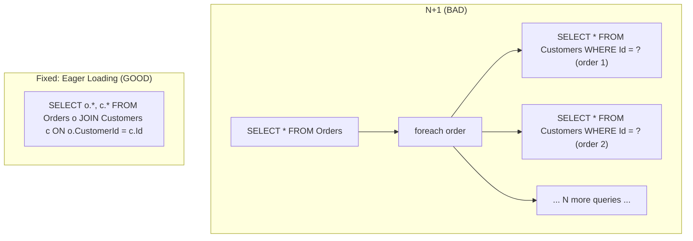

# Module 20 — SQL Server: Query Optimization Patterns & Anti-patterns

> Domain: SQL Server | Level: Beginner → Expert | Prerequisite: [[01-Indexing-Query-Execution-Plans]], [[02-Transactions-Isolation-Locking]], [[../01-CSharp/05-LINQ-Internals]]

---

## 1. Fundamentals

### What is the N+1 query problem, and what is batching?
The **N+1 query problem** occurs when code fetches a list of N parent records with one query, then executes **one additional query per parent** to fetch related child data (N further queries) — instead of a single query (or a small, fixed number) retrieving everything needed via a join or a batched `IN` clause. **Batching** is the general fix: combining what would be many small round-trips into fewer, larger ones, since each round-trip's fixed network/parsing overhead dominates for small queries, and the *number* of round-trips, not just their individual cost, is often the real bottleneck.

### Why does this matter?
ORMs (EF Core especially) make N+1 extremely easy to introduce accidentally — lazy-loaded navigation properties accessed inside a loop look like ordinary property access in code, with no visual signal that each access triggers a fresh database round-trip. This is one of the single most common, most damaging real-world ORM performance bugs, and a near-universal interview topic for any EF Core/database-backed role.

### When does it matter?
Any loop iterating over a collection of entities and accessing a related, not-yet-loaded navigation property; the depth matters for recognizing N+1 in code review (often invisible without specifically looking for it) and for choosing the correct fix (eager loading, projection, batching) for the specific scenario.

### How does it work (30,000-ft view)?
```csharp
// N+1: one query for orders, then ONE ADDITIONAL QUERY PER ORDER for its customer
var orders = await db.Orders.ToListAsync(); // 1 query
foreach (var order in orders)
    Console.WriteLine(order.Customer.Name); // triggers a lazy-load query, N times

// Fixed: ONE query total, via eager loading
var orders = await db.Orders.Include(o => o.Customer).ToListAsync(); // 1 query, JOIN-based
```

---

## 2. Deep Dive

### 2.1 Eager Loading (`Include`) vs Explicit Loading vs Lazy Loading
- **Lazy loading**: a navigation property is fetched automatically, transparently, the moment it's first accessed — convenient, but exactly what causes N+1 when accessed inside a loop, since each iteration's access is a distinct, invisible round-trip.
- **Eager loading** (`.Include(o => o.Customer)`): the related data is fetched as part of the *original* query (via a JOIN or a second batched query, depending on EF Core's query-splitting configuration, §2.2) — the standard fix for N+1 when the related data is genuinely needed for every parent row.
- **Explicit loading** (`context.Entry(order).Reference(o => o.Customer).LoadAsync()`): manually triggering a load for a specific already-tracked entity — useful when the need for related data is conditional/rare, avoiding the cost of always eager-loading data most rows won't need.

### 2.2 Split Queries vs Single Query for Multiple `Include`s
Including **multiple** one-to-many navigation properties in a single query (`.Include(o => o.LineItems).Include(o => o.Payments)`) via one combined JOIN produces a **cartesian explosion** — if an order has 5 line items and 3 payments, the single-query JOIN result has 15 rows for that one order (5×3), with line-item and payment data needlessly duplicated across rows — EF Core's `.AsSplitQuery()` instead issues **separate** queries per included collection (avoiding the multiplication, at the cost of multiple round-trips instead of one) — the correct choice depends on the specific collections' typical sizes: single-query is fine for one-to-one/small collections, split-query is usually better for multiple, potentially-large one-to-many collections.

### 2.3 Projection — Selecting Only What's Needed
`.Select(o => new OrderSummaryDto { Id = o.Id, Total = o.Total })` lets EF Core generate SQL selecting **only** the needed columns, avoiding both the network/deserialization cost of unused columns and, critically, avoiding loading full entity graphs into the change tracker unnecessarily (directly connecting to Module 5's `AsNoTracking()` guidance) — for read-only, DTO-shaped output, projection is frequently both faster and simpler than loading full entities and mapping afterward.

### 2.4 Pagination Strategies — Offset vs Keyset (Cursor)
**Offset pagination** (`OFFSET @skip ROWS FETCH NEXT @take ROWS ONLY`) is simple and supports jumping to an arbitrary page number, but its cost **grows with the offset** — the database must still traverse and discard all skipped rows, making deep pages (page 10,000) genuinely expensive regardless of index support, and it's **unstable** under concurrent inserts/deletes (a row inserted between two page requests can shift every subsequent row's offset, causing a row to be skipped entirely or duplicated across pages). **Keyset/cursor pagination** (`WHERE Id > @lastSeenId ORDER BY Id FETCH NEXT @take ROWS ONLY`) uses the last-seen row's key as the starting point for the next page — cost is constant regardless of how deep into the result set the cursor is, and it's stable under concurrent modification, at the cost of not supporting arbitrary "jump to page N" navigation (only sequential next/previous).

### 2.5 Batching Writes — `AddRange`/Bulk Operations
Individual `SaveChanges()` calls per entity inside a loop issue one round-trip per entity (an N+1-shaped write anti-pattern); batching multiple entities into one `SaveChanges()` call lets EF Core combine them into fewer round-trips (and, in modern EF Core versions, genuinely batched SQL statements) — for very large bulk-insert/update scenarios (thousands+ of rows), a dedicated bulk-operation library or `SqlBulkCopy` outperforms even batched EF Core `SaveChanges()`, since EF Core's change-tracking overhead itself becomes the bottleneck at sufficient volume.

## 3. Visual Architecture


## 4. Production Example
**Scenario**: An order-history API endpoint (`GET /customers/{id}/orders`) degraded from ~50ms to over 8 seconds as customers' order histories grew, with no code changes to the endpoint itself. **Investigation**: EF Core query logging revealed the endpoint executed 1 query to fetch orders, plus **one additional query per order** to lazily load each order's `LineItems` navigation property (accessed in a response-mapping loop) — for a customer with 200 orders, this meant 201 total round-trips; the degradation tracked customers' order-count growth exactly, confirming the N+1 shape. **Fix**: added `.Include(o => o.LineItems)` to the original query (with `.AsSplitQuery()` given `LineItems` is a potentially-large one-to-many collection, §2.2), collapsing 201 round-trips into 2; latency returned to ~60ms regardless of order-history size. **Lesson**: N+1 is invisible in the C# code itself (`order.LineItems` looks like ordinary, free property access) — it must be caught either via EF Core's SQL logging in code review/testing, or via a standing analyzer/query-count assertion in integration tests, not by reading the LINQ code alone.

## 5. Best Practices
- Enable EF Core SQL logging during development/testing to visually confirm query count matches expectations for any collection-processing endpoint.
- Use eager loading (`.Include`) for navigation properties genuinely needed for every row in a result set; explicit loading for conditionally-needed data.
- Use `.AsSplitQuery()` for multiple one-to-many `Include`s to avoid cartesian-explosion row duplication.
- Use keyset/cursor pagination for any large, frequently-paginated dataset, especially one with concurrent inserts/deletes.
- Use projection (`.Select()`) plus `.AsNoTracking()` for read-only, DTO-shaped API responses.

## 6. Anti-patterns
- Accessing a lazy-loaded navigation property inside a loop over a collection (the canonical N+1 shape).
- Deep offset pagination (`OFFSET 50000 ROWS`) on a large, frequently-paginated table without considering keyset pagination's constant-cost alternative.
- Calling `SaveChanges()` inside a loop, one entity at a time, instead of batching.
- Loading full entity graphs (with tracking) for read-only, projection-shaped API responses.

---

## 10. Interview Questions

### Basic (10)
1. **Q: What is the N+1 query problem?** **A:** Fetching N parent records with one query, then executing one additional query per parent to fetch related data, instead of one combined query.
2. **Q: What does `.Include()` do in EF Core?** **A:** Eagerly loads a specified navigation property as part of the original query, avoiding a separate lazy-load round-trip per row.
3. **Q: What's the difference between offset and keyset pagination?** **A:** Offset pagination skips N rows and returns the next page (cost grows with offset); keyset pagination starts from the last-seen row's key (constant cost regardless of depth).
4. **Q: What does `.AsNoTracking()` do?** **A:** Tells EF Core not to track returned entities for change detection, appropriate for read-only queries.
5. **Q: What is a split query in EF Core?** **A:** Issuing separate queries per included collection instead of one combined JOIN, avoiding cartesian-explosion row duplication.
6. **Q: What causes cartesian explosion when including multiple collections?** **A:** A single JOIN combining two one-to-many relationships multiplies rows (e.g., 5 line items × 3 payments = 15 duplicated rows) instead of returning each collection's rows independently.
7. **Q: Why is deep offset pagination expensive?** **A:** The database must still traverse and discard every skipped row before returning the requested page, regardless of index support.
8. **Q: What's a risk of offset pagination under concurrent writes?** **A:** A row inserted or deleted between page requests can shift subsequent rows' offsets, causing a row to be skipped or duplicated across pages.
9. **Q: What does `.Select()` (projection) let EF Core avoid?** **A:** Fetching, deserializing, and tracking columns/entities not actually needed for a read-only, DTO-shaped result.
10. **Q: Why is calling `SaveChanges()` once per entity inside a loop inefficient?** **A:** It issues one database round-trip per entity instead of batching multiple entities into fewer round-trips.

### Intermediate (10)
1. **Q: Why is N+1 often invisible in C# code review despite being a severe performance bug?** **A:** A lazy-loaded navigation property access (`order.Customer.Name`) looks identical to ordinary, free in-memory property access — nothing in the syntax signals that it triggers a database round-trip, unlike an explicit `await repository.GetCustomerAsync(...)` call which would visually flag itself as I/O.
2. **Q: Why does keyset pagination not support "jump to page 500" the way offset pagination does?** **A:** It requires knowing the previous page's last row's key value as the starting point — there's no way to compute "the key value at row 25,000" without actually having traversed there, unlike offset pagination's simple numeric skip count.
3. **Q: When would explicit loading be preferable to eager loading?** **A:** When the related data is only conditionally needed (e.g., only for a specific subset of rows based on some runtime condition) — eager-loading it for every row would waste cost on the majority that never actually need it.
4. **Q: Why might `.AsSplitQuery()` sometimes perform worse than a single combined query despite avoiding cartesian explosion?** **A:** It issues multiple separate round-trips instead of one — for small collections where the cartesian multiplication is minor, the extra round-trip overhead of splitting can outweigh the wasted-row-duplication cost the single query would have incurred.
5. **Q: How would you detect an N+1 pattern in an existing, already-deployed codebase without reading every line of LINQ code?** **A:** Enable EF Core SQL logging (or an APM tool's query-count-per-request metric) against representative traffic/test scenarios and look for endpoints whose executed-query-count scales with input/collection size rather than remaining constant.
6. **Q: Why does projection (`.Select()`) sometimes let EF Core generate a more efficient query than loading a full entity and mapping to a DTO afterward in application code?** **A:** The SQL generated for a projection selects only the needed columns directly at the database level, avoiding transferring, deserializing, and tracking unused columns/entities — mapping after loading a full entity still pays the cost of fetching everything, just discarding the unused parts in application memory instead of at the database.
7. **Q: What's the risk of using `.AsNoTracking()` on an entity the calling code later tries to modify and save?** **A:** Change tracking is what lets EF Core detect which properties changed and generate the correct UPDATE statement — an untracked entity's modifications won't be automatically detected/persisted by a later `SaveChanges()` call without explicitly re-attaching and marking it modified.
8. **Q: Why is batching writes into fewer `SaveChanges()` calls not simply "always better" without qualification?** **A:** A single very large batch increases the size/duration of the underlying transaction and the risk of lock escalation (Module 19 §2.2) — very large bulk operations benefit from batching in *moderate*-sized chunks (Module 19 §Expert exercise's pattern) rather than either one-row-at-a-time or one enormous, unbounded batch.
9. **Q: Why might a bulk-operation library or `SqlBulkCopy` outperform even a well-batched EF Core `SaveChanges()` for very large inserts?** **A:** EF Core's change-tracking machinery itself has real per-entity overhead (Module 1's allocation/tracking-object cost) that becomes the bottleneck at sufficient volume — a dedicated bulk-copy mechanism bypasses change tracking entirely, streaming rows directly to the database with minimal per-row application-side overhead.
10. **Q: How would you explain to a junior engineer why "the query itself is fast" doesn't mean "the endpoint is fast," using this module's central lesson?** **A:** An N+1-shaped endpoint's *individual* queries can each genuinely be fast (a simple, well-indexed single-row lookup) while the *endpoint's total latency* is dominated by the sheer *number* of round-trips, each paying fixed network/parsing overhead — profiling the wrong thing (individual query speed) misses the actual bottleneck (round-trip count), exactly the lesson §4's production incident demonstrates.

### Advanced (10)
1. **Q: Design an automated test/CI check that catches an N+1 regression before it reaches production, generalizing §4's incident into a standing safeguard.**
   **A:** Write an integration test that seeds a representative collection (e.g., a customer with 50 orders, each with several line items), calls the endpoint, and asserts the **actual executed query count** (captured via EF Core's `DbCommandInterceptor` or a test-double logging provider) stays at or below a fixed, expected threshold (e.g., ≤ 3 queries) regardless of the seeded collection's size — re-running the same test with a larger seeded collection (500 orders) and asserting the query count is *identical* (not scaling with input size) directly, mechanically catches any future N+1 regression in CI, exactly mirroring the contract-consistency-testing philosophy from the REST APIs module applied here to query-count behavior instead of response-shape behavior.
2. **Q: Explain precisely why keyset pagination requires a stable, unique, monotonically-ordered sort key, and what happens if the sort key isn't unique.**
   **A:** The cursor (`WHERE Id > @lastSeenId`) relies on the sort key uniquely and totally ordering rows — if the sort key has duplicate values (e.g., paginating by `CreatedDate` alone, where multiple rows share the same timestamp), rows with a tied key value can be inconsistently included/excluded across page boundaries (a row with the exact same `CreatedDate` as the cursor's last-seen value might be skipped or duplicated) — the standard fix is a **composite** cursor key (`CreatedDate, Id`) where `Id` (guaranteed unique) breaks ties deterministically, ensuring a strict, unambiguous total order for the pagination cursor to rely on.
3. **Q: Design a hybrid pagination approach supporting both "jump to an approximate page" (a common UX request) and keyset pagination's stability/performance benefits.**
   **A:** Use keyset pagination as the primary, stable mechanism for actual data retrieval (next/previous), while separately exposing an **approximate** total-count/page-count estimate (computed less frequently, e.g., via a periodically-refreshed materialized count rather than a live `COUNT(*)` on every page request) purely for UX purposes (showing "approximately 500 pages") — and, if a genuine "jump to page N" feature is required, implement it as a *separate*, explicitly-labeled-as-approximate operation (e.g., estimating an offset-equivalent starting point via an indexed skip, accepting its cost/instability trade-offs) rather than trying to force keyset pagination itself to support arbitrary jumps, which is fundamentally not what it's designed for.
4. **Q: How would you diagnose whether a slow, collection-processing endpoint's bottleneck is N+1 queries versus a single, genuinely slow query needing index optimization (Module 18)?**
   **A:** Check the *number* of executed queries first (via SQL logging/APM) — if it scales with input/collection size, it's N+1 (fix via eager loading/projection); if it's a small, fixed number of queries but one of them is individually slow, apply Module 18's execution-plan analysis (seek vs. scan, cardinality estimates) to that specific query instead — these are different root causes requiring different diagnostic tools and different fixes, and conflating them (e.g., trying to add an index to fix what's actually an N+1 round-trip-count problem) wastes effort without addressing the actual bottleneck.
5. **Q: Explain a scenario where eager-loading a navigation property for every row, even though it's genuinely needed, still produces worse performance than the N+1 pattern it replaces, and how you'd address it.**
   **A:** If the eagerly-loaded collection is very large per parent row (e.g., an order with thousands of line items) and only a small subset is actually needed/displayed (e.g., the first 5 for a summary view), eager-loading the *entire* collection for every row wastes substantial data transfer compared to what's actually used — the fix is projection combined with a bounded sub-query (`.Select(o => new { o.Id, RecentItems = o.LineItems.OrderByDescending(l => l.Date).Take(5) })`) rather than a blanket `.Include()`, giving the round-trip-count benefit of eager loading without over-fetching unused data.
6. **Q: Design a strategy for batching writes in a scenario processing a very large (100,000+ row) data import, balancing transaction size, lock escalation, and EF Core change-tracking overhead.**
   **A:** For genuinely large volumes, prefer `SqlBulkCopy`/a dedicated bulk-insert library over EF Core's `SaveChanges()` entirely (Intermediate Q9's reasoning) — if EF Core must be used, batch in moderate chunks (a few thousand rows per `SaveChanges()` call, directly Module 19 §Expert exercise's lock-escalation-avoidance batch size), and periodically call `context.ChangeTracker.Clear()` between batches to release tracked-entity memory that would otherwise accumulate across the entire import's duration, since EF Core's change tracker doesn't automatically release entities from a still-open context.
7. **Q: Explain why an N+1 pattern might not show up in a load test using a small, unrealistic seed dataset, and how you'd design a load test that would catch it.**
   **A:** With only a few rows seeded (e.g., 3 test orders in a dev database), N+1's extra round-trip count is small (3-4 queries) and its latency impact is negligible/unnoticeable — the problem only becomes visible at realistic production data volumes (hundreds of orders per customer); load/performance tests must seed data at a genuinely representative scale (not just "enough to verify correctness") specifically to surface this class of scaling-with-input-size bug, directly connecting to this course's recurring "test at representative scale, not just correctness-sufficient scale" theme (Module 5's client-side-evaluation incident shared this exact root cause).
8. **Q: How would you reason about whether a given collection-returning endpoint should use offset or keyset pagination, considering both technical and product/UX requirements?**
   **A:** If the product genuinely requires arbitrary page-number navigation (a numbered pagination UI a user can jump around in) and the dataset/pagination depth is modest, offset pagination's simplicity may be acceptable; if the dataset is large, frequently paginated deeply, or subject to concurrent modification during pagination (a live feed, a large export), keyset pagination's stability and constant-cost properties are worth the UX constraint of sequential-only navigation — this is a genuine product-requirements-vs-technical-trade-off conversation, not a purely technical decision made in isolation from what the UI actually needs to support.
9. **Q: Explain how a GraphQL-style API (a later module topic) can reintroduce N+1 in a way that's structurally different from, and sometimes harder to fix than, a typical REST/EF Core N+1.**
   **A:** A GraphQL resolver for a nested field (e.g., resolving each `Order`'s `customer` field independently, per the GraphQL execution model's field-by-field resolution) can trigger one data-fetch call per parent object entirely by the *query-execution engine's own design*, not merely by an accidental lazy-loading code pattern — the standard fix is a **DataLoader** pattern (batching and deduplicating all individual field-resolution requests within a single execution "tick" into one combined batch fetch), a GraphQL-specific solution addressing a structurally similar but mechanically distinct N+1 source compared to EF Core's lazy-loading-in-a-loop pattern.
10. **Q: As a Principal Engineer, how would you build lasting organizational protection against N+1 regressions, beyond one-off code review vigilance?**
    **A:** Combine: (a) the automated query-count CI test (Advanced Q1) as a required check for any endpoint touching collection navigation properties; (b) disabling EF Core's lazy-loading proxies entirely at the DbContext-configuration level for new projects (forcing explicit `.Include()`/projection decisions at every query site, making the N+1 risk visible in the query definition itself rather than hidden in later, separate property-access code); (c) a standing APM dashboard tracking queries-per-request as a first-class metric per endpoint, alerting on any endpoint whose query count grows unexpectedly after a deploy — layering a design-level structural change (disabling lazy loading) with both proactive (CI test) and reactive (APM monitoring) safeguards, rather than relying on any single layer alone.

---

## 11. Coding Exercises

### Easy — Fix N+1 with eager loading
```csharp
// BEFORE (N+1):
var orders = await db.Orders.ToListAsync();
foreach (var order in orders) Console.WriteLine(order.Customer.Name); // N lazy-load round-trips

// AFTER:
var orders = await db.Orders.Include(o => o.Customer).ToListAsync(); // 1 query, JOIN-based
foreach (var order in orders) Console.WriteLine(order.Customer.Name); // no additional round-trips
```

### Medium — Keyset pagination with a composite tie-breaking key
```csharp
public async Task<List<Order>> GetOrdersPageAsync(DateTime? lastSeenDate, int? lastSeenId, int pageSize)
{
    var query = db.Orders.OrderByDescending(o => o.CreatedDate).ThenByDescending(o => o.Id).AsQueryable();

    if (lastSeenDate is not null && lastSeenId is not null)
    {
        query = query.Where(o =>
            o.CreatedDate < lastSeenDate ||
            (o.CreatedDate == lastSeenDate && o.Id < lastSeenId)); // composite cursor, breaks ties via Id
    }

    return await query.Take(pageSize).ToListAsync();
}
```
**Discussion**: The composite `(CreatedDate, Id)` comparison is exactly Advanced Q2's fix for non-unique sort keys — without the `Id` tie-breaker, rows sharing an identical `CreatedDate` could be inconsistently included/skipped across page boundaries.

### Hard — Automated N+1 regression test (Advanced Q1)
```csharp
[Theory]
[InlineData(5)]
[InlineData(500)] // query count must be IDENTICAL regardless of seeded collection size
public async Task GetCustomerOrders_Should_Use_Constant_Query_Count(int orderCount)
{
    var customer = await SeedCustomerWithOrdersAsync(orderCount);
    var queryLog = new List<string>();
    _dbContext.Database.SetCommandInterceptor(cmd => queryLog.Add(cmd.CommandText)); // conceptual interceptor hook

    var response = await _client.GetAsync($"/customers/{customer.Id}/orders");

    Assert.True(response.IsSuccessStatusCode);
    Assert.True(queryLog.Count <= 3, $"Expected at most 3 queries, got {queryLog.Count} for {orderCount} orders.");
}
```
**Discussion**: Running this with both a small (5) and large (500) seeded order count is the key design decision — a test using only a small seed size would pass even with a genuine N+1 bug present (Advanced Q7), since the round-trip count difference is negligible at small scale; asserting the *same* bound for both sizes is what actually proves the query count doesn't scale with input.

### Expert — Batched bulk import with periodic change-tracker clearing
```csharp
public async Task ImportOrdersAsync(IAsyncEnumerable<OrderImportRow> rows)
{
    const int batchSize = 2000; // consistent with Module 19's lock-escalation-avoidance threshold
    int count = 0;

    await foreach (var row in rows)
    {
        db.Orders.Add(MapToOrder(row));
        count++;

        if (count % batchSize == 0)
        {
            await db.SaveChangesAsync();
            db.ChangeTracker.Clear(); // release tracked entities -- prevents unbounded memory growth
                                        // across a very large import's full duration
        }
    }
    await db.SaveChangesAsync(); // final partial batch
}
```
**Discussion**: `ChangeTracker.Clear()` (EF Core 7+) is specifically necessary here because, without it, every previously-saved batch's entities would remain tracked for the *entire* import's duration, accumulating unbounded memory (Module 1's allocation-growth concerns) even though they've already been persisted and have no further reason to stay tracked — a direct, practical application of Intermediate Q9/Advanced Q6's reasoning about EF Core's own change-tracking overhead becoming the bottleneck at volume.

---

## 12–17. System Design / LLD / Debugging / Decision / Case Study / Principal

An order-history API platform (§4) disables EF Core lazy-loading proxies organization-wide, requiring explicit `.Include()`/projection decisions visible at every query definition site, backed by an automated CI query-count regression test (Advanced Q1/Hard exercise) applied to every collection-returning endpoint, and uses keyset pagination by default for any endpoint expected to serve large or frequently-paginated result sets. The signature production incident (§4) — an endpoint's latency scaling linearly with a customer's order-history size due to lazy-loaded line items accessed in a loop — is diagnosed via the query-count-vs-input-size correlation, the single most reliable N+1 diagnostic signal. Principal-level guidance: N+1 is disproportionately common and disproportionately fixable relative to its severity, making automated, CI-enforced query-count regression testing one of the highest-ROI, lowest-effort safeguards available for any EF-Core-backed API surface.

## 18. Revision
**Key takeaways**: N+1 = one query per parent row instead of one combined query — invisible in C# code (looks like free property access), visible only via SQL logging/query-count monitoring. Fix via eager loading (`.Include`, with `.AsSplitQuery()` for multiple one-to-many collections to avoid cartesian explosion), explicit loading for conditional needs, or projection for read-only DTOs. Keyset/cursor pagination has constant cost and concurrent-modification stability that offset pagination lacks, at the cost of no arbitrary page-jumping — requires a unique, composite sort key to avoid tie-breaking bugs. Batch writes in moderate chunks (a few thousand rows), clearing the change tracker periodically for very large imports.

---

**Next**: This completes the `04-SQL-Server` domain (Modules 18–20). Continuing autonomously to `05-PostgreSQL`.
