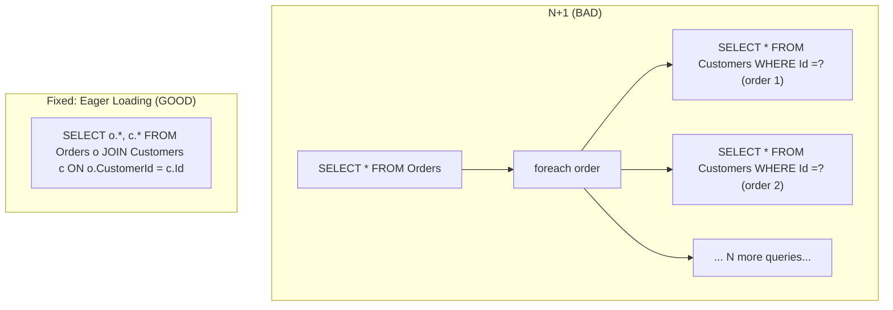
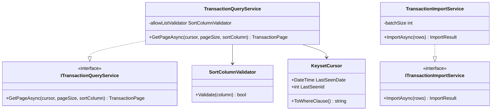
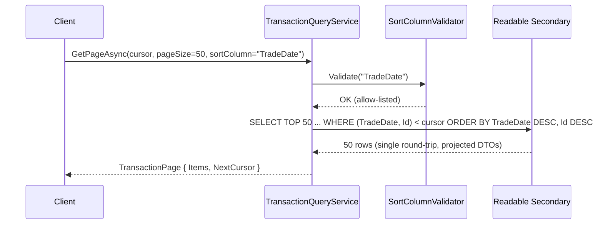

# Module 20 — SQL Server: Query Optimization Patterns & Anti-patterns

> Domain: SQL Server | Level: Beginner → Expert | Prerequisite: [[01-Indexing-Query-Execution-Plans]], [[02-Transactions-Isolation-Locking]], [[../01-CSharp/05-LINQ-Internals]]

---

## 1. Fundamentals

### What is the N+1 query problem, and what is batching?
The **N+1 query problem** occurs when code fetches a list of N parent records with one query, then executes **one additional query per parent** to fetch related child data (N further queries) — instead of a single query (or a small, fixed number) retrieving everything needed via a join or a batched `IN` clause. **Batching** is the general fix: combining what would be many small round-trips into fewer, larger ones, since each round-trip's fixed network/parsing overhead dominates for small queries, and the *number* of round-trips, not just their individual cost, is often the real bottleneck.

### Why does this matter?
ORMs (EF Core especially) make N+1 extremely easy to introduce accidentally — lazy-loaded navigation properties accessed inside a loop look like ordinary property access in code, with no visual signal that each access triggers a fresh database round-trip. This is one of the single most common, most damaging real-world ORM performance bugs, and a near-universal interview topic for any EF Core/database-backed role.

### When does it matter?
Any loop iterating over a collection of entities and accessing a related, not-yet-loaded navigation property; the depth matters for recognizing N+1 in code review (often invisible without specifically looking for it) and for choosing the correct fix (eager loading, projection, batching) for the specific scenario.

### How does it work (30,000-ft view)?
```csharp
// N+1: one query for orders, then ONE ADDITIONAL QUERY PER ORDER for its customer
var orders = await db.Orders.ToListAsync; // 1 query
foreach (var order in orders)
    Console.WriteLine(order.Customer.Name); // triggers a lazy-load query, N times

// Fixed: ONE query total, via eager loading
var orders = await db.Orders.Include(o => o.Customer).ToListAsync; // 1 query, JOIN-based
```

---

## 2. Deep Dive

### 2.1 Eager Loading (`Include`) vs Explicit Loading vs Lazy Loading
- **Lazy loading**: a navigation property is fetched automatically, transparently, the moment it's first accessed — convenient, but exactly what causes N+1 when accessed inside a loop, since each iteration's access is a distinct, invisible round-trip.
- **Eager loading** (`.Include(o => o.Customer)`): the related data is fetched as part of the *original* query (via a JOIN or a second batched query, depending on EF Core's query-splitting configuration) — the standard fix for N+1 when the related data is genuinely needed for every parent row.
- **Explicit loading** (`context.Entry(order).Reference(o => o.Customer).LoadAsync`): manually triggering a load for a specific already-tracked entity — useful when the need for related data is conditional/rare, avoiding the cost of always eager-loading data most rows won't need.

### 2.2 Split Queries vs Single Query for Multiple `Include`s
Including **multiple** one-to-many navigation properties in a single query (`.Include(o => o.LineItems).Include(o => o.Payments)`) via one combined JOIN produces a **cartesian explosion** — if an order has 5 line items and 3 payments, the single-query JOIN result has 15 rows for that one order (5×3), with line-item and payment data needlessly duplicated across rows — EF Core's `.AsSplitQuery` instead issues **separate** queries per included collection (avoiding the multiplication, at the cost of multiple round-trips instead of one) — the correct choice depends on the specific collections' typical sizes: single-query is fine for one-to-one/small collections, split-query is usually better for multiple, potentially-large one-to-many collections.

### 2.3 Projection — Selecting Only What's Needed
`.Select(o => new OrderSummaryDto { Id = o.Id, Total = o.Total })` lets EF Core generate SQL selecting **only** the needed columns, avoiding both the network/deserialization cost of unused columns and, critically, avoiding loading full entity graphs into the change tracker unnecessarily (directly connecting to the `AsNoTracking` guidance) — for read-only, DTO-shaped output, projection is frequently both faster and simpler than loading full entities and mapping afterward.

### 2.4 Pagination Strategies — Offset vs Keyset (Cursor)
**Offset pagination** (`OFFSET @skip ROWS FETCH NEXT @take ROWS ONLY`) is simple and supports jumping to an arbitrary page number, but its cost **grows with the offset** — the database must still traverse and discard all skipped rows, making deep pages (page 10,000) genuinely expensive regardless of index support, and it's **unstable** under concurrent inserts/deletes (a row inserted between two page requests can shift every subsequent row's offset, causing a row to be skipped entirely or duplicated across pages). **Keyset/cursor pagination** (`WHERE Id > @lastSeenId ORDER BY Id FETCH NEXT @take ROWS ONLY`) uses the last-seen row's key as the starting point for the next page — cost is constant regardless of how deep into the result set the cursor is, and it's stable under concurrent modification, at the cost of not supporting arbitrary "jump to page N" navigation (only sequential next/previous).

### 2.5 Batching Writes — `AddRange`/Bulk Operations
Individual `SaveChanges` calls per entity inside a loop issue one round-trip per entity (an N+1-shaped write anti-pattern); batching multiple entities into one `SaveChanges` call lets EF Core combine them into fewer round-trips (and, in modern EF Core versions, genuinely batched SQL statements) — for very large bulk-insert/update scenarios (thousands+ of rows), a dedicated bulk-operation library or `SqlBulkCopy` outperforms even batched EF Core `SaveChanges`, since EF Core's change-tracking overhead itself becomes the bottleneck at sufficient volume.

## 3. Visual Architecture

```mermaid
graph TB
 subgraph "N+1 (BAD)"
 Q1["SELECT * FROM Orders"] --> L["foreach order"]
 L --> Q2["SELECT * FROM Customers WHERE Id =? (order 1)"]
 L --> Q3["SELECT * FROM Customers WHERE Id =? (order 2)"]
 L --> Q4["... N more queries..."]
 end
 subgraph "Fixed: Eager Loading (GOOD)"
 Q5["SELECT o.*, c.* FROM Orders o JOIN Customers c ON o.CustomerId = c.Id"]
 end
```

## 4. Production Example
**Scenario**: An order-history API endpoint (`GET /customers/{id}/orders`) degraded from ~50ms to over 8 seconds as customers' order histories grew, with no code changes to the endpoint itself. **Investigation**: EF Core query logging revealed the endpoint executed 1 query to fetch orders, plus **one additional query per order** to lazily load each order's `LineItems` navigation property (accessed in a response-mapping loop) — for a customer with 200 orders, this meant 201 total round-trips; the degradation tracked customers' order-count growth exactly, confirming the N+1 shape. **Fix**: added `.Include(o => o.LineItems)` to the original query (with `.AsSplitQuery` given `LineItems` is a potentially-large one-to-many collection), collapsing 201 round-trips into 2; latency returned to ~60ms regardless of order-history size. **Lesson**: N+1 is invisible in the C# code itself (`order.LineItems` looks like ordinary, free property access) — it must be caught either via EF Core's SQL logging in code review/testing, or via a standing analyzer/query-count assertion in integration tests, not by reading the LINQ code alone.

## 5. Best Practices
- Enable EF Core SQL logging during development/testing to visually confirm query count matches expectations for any collection-processing endpoint.
- Use eager loading (`.Include`) for navigation properties genuinely needed for every row in a result set; explicit loading for conditionally-needed data.
- Use `.AsSplitQuery` for multiple one-to-many `Include`s to avoid cartesian-explosion row duplication.
- Use keyset/cursor pagination for any large, frequently-paginated dataset, especially one with concurrent inserts/deletes.
- Use projection (`.Select`) plus `.AsNoTracking` for read-only, DTO-shaped API responses.

## 6. Anti-patterns
- Accessing a lazy-loaded navigation property inside a loop over a collection (the canonical N+1 shape).
- Deep offset pagination (`OFFSET 50000 ROWS`) on a large, frequently-paginated table without considering keyset pagination's constant-cost alternative.
- Calling `SaveChanges` inside a loop, one entity at a time, instead of batching.
- Loading full entity graphs (with tracking) for read-only, projection-shaped API responses.

---

## 7. Performance Engineering

**CPU:** Each additional round-trip in an N+1 pattern isn't free even when the query itself is trivial — SQL Server must re-parse (or look up in the plan cache), re-authenticate the TDS session context, and re-acquire a worker thread from `sys.dm_os_schedulers` for every single-row `SELECT`. At 200 round-trips per request and even a conservative ~0.3ms of pure server-side CPU/parse overhead per round-trip, that's 60ms of *server* CPU spent on protocol overhead alone, before counting actual data access — on a busy OLTP box serving thousands of requests/sec, this overhead multiplies directly into SQLOS scheduler contention (`SOS_SCHEDULER_YIELD` waits climbing in `sys.dm_os_wait_stats`).

**Memory:** EF Core's change tracker retains a snapshot of every tracked entity for change detection; an N+1-shaped endpoint that lazy-loads 200 child entities per request, across concurrent requests, drives up managed-heap allocations (Gen0 collection pressure) purely from tracked-entity graph objects that a projection-based query would never have materialized. On the SQL Server side, offset pagination's `OFFSET n ROWS` still requires the engine to materialize and discard the skipped rows in a memory grant sized for the *full* candidate set when no covering index supports the sort — deep-page requests can trigger `RESOURCE_SEMAPHORE` waits under memory pressure that keyset pagination (bounded, index-seek-driven) never provokes.

**Latency:** Round-trip network latency dominates N+1's user-perceived cost far more than server CPU — even at a generous 2ms RTT (same-AZ), 200 round-trips is 400ms of pure network wait stacked serially, which is exactly the 8-second-endpoint incident's shape once you add real per-query execution time and connection-pool queueing under concurrent load.

**Throughput:** N+1 multiplies connection-pool checkout/release churn — a pool sized for steady-state traffic assuming ~2 round-trips/request can be driven to exhaustion (`InvalidOperationException: Timeout expired. The timeout period elapsed prior to obtaining a connection from the pool`) by the same request volume once each request needs 200. This is the connection-pool-exhaustion failure mode most SQL Server-backed APIs eventually hit under load, and it's frequently misdiagnosed as "we need a bigger pool" when the actual fix is collapsing round-trip count.

**Benchmarking:** Benchmark query *count* per logical operation, not just individual query latency (Intermediate Q10's central point) — use SQL Server Extended Events (`rpc_completed`/`sql_batch_completed`) or `SqlClient`'s `EventCounters` (`System.Data.SqlClient` or `Microsoft.Data.SqlClient` diagnostic source) to capture round-trip count per request under representative (not toy) data volume, per Advanced Q7's finding that small seed data hides the scaling bug entirely.

**Caching:** Plan-cache reuse depends on parameterized queries — dynamically-built SQL for pagination/sort (string-concatenated `ORDER BY` column names, common in ad-hoc reporting endpoints) produces a fresh, non-reusable plan per distinct literal value, bloating the plan cache and forcing repeated compilation CPU cost; this is the same underlying mechanism as §8's plan-cache-pollution DoS vector, viewed from a performance rather than security angle.

## 8. Security

**Threats:** Dynamic SQL built by string-concatenating pagination/sort parameters (`"ORDER BY " + userSuppliedColumn`) is a classic SQL injection vector distinct from parameterized `WHERE` clauses — because column/table identifiers can't be parameterized via `SqlParameter` the way values can, developers are tempted to concatenate them directly, and an unvalidated `sort=Name; DROP TABLE Orders--` reaches the server as literal T-SQL. A second, less obvious threat: **plan-cache pollution as a denial-of-service vector** — an attacker (or a poorly-designed client) that sends many structurally-identical queries differing only in inlined literal values (rather than using `sp_executesql` parameters) forces SQL Server to compile and cache a fresh plan per distinct literal, exhausting plan-cache memory and CPU on the OLTP primary; this is a genuine, documented attack pattern against systems with dynamic SQL or ORMs misconfigured to inline constants.

**Mitigations:** Always parameterize *values* via `SqlParameter`/`sp_executesql`; for identifiers (column names, table names) that must vary, validate against a strict allow-list of known-safe column names before concatenating — never accept a raw client-supplied identifier string. For plan-cache pollution, ensure the data-access layer (EF Core, Dapper with explicit parameters) always uses parameterized queries so semantically-identical queries produce one reusable, parameterized plan regardless of literal value — and monitor `sys.dm_exec_cached_plans` for `usecounts = 1` plans accumulating rapidly, a direct signal of unparameterized query flooding.

**Least privilege:** A batch-import service account performing bulk writes (`SqlBulkCopy`) should hold `INSERT`/`SELECT` on the specific staging tables only, never `db_owner` — a compromised import pipeline with excessive permissions is a lateral-movement risk into the broader ledger schema, disproportionate to what the import task actually needs.

**Auditability:** For financial-ledger tables, batched writes should preserve the same audit-trail requirements as row-by-row writes — a bulk import must still attribute each inserted row to a traceable batch/job ID and timestamp, since "we batched it for performance" is never a justification for losing per-row provenance in a regulated ledger.

## 9. Scalability

**Horizontal scaling:** Reporting/pagination-heavy read traffic (order history, trade blotters) is the textbook candidate for offloading to an **Always On readable secondary** or a dedicated read replica — isolating scan-heavy, potentially-deep-pagination workloads from the latency-critical OLTP primary, directly the workload-isolation principle Expert Q2 develops for reconciliation/reporting generally, applied here specifically to paginated read endpoints.

**Partitioning:** A high-volume ledger/order table partitioned by date (e.g., monthly partitions) lets keyset pagination scoped to a recent date range hit only the relevant, typically much smaller partition, and lets old, settled partitions be excluded from indexes/statistics maintenance entirely — directly supporting Expert Q3's "don't re-read settled history" principle at the storage-engine level.

**Connection pooling:** N+1's connection-pool-exhaustion failure mode (§7) is the direct scalability limiter for collection-processing endpoints under concurrent load — sizing the pool correctly only papers over the underlying round-trip-count problem; the durable scalability fix is eliminating N+1, not growing the pool indefinitely.

**HA/DR:** Bulk-import batching (Expert coding exercise) must be resumable/idempotent per batch so a mid-import failover (Always On automatic failover to a secondary) doesn't require restarting the entire import from row zero — checkpoint the last successfully-committed batch boundary, not just rely on transaction rollback of the in-flight batch.

**Caching:** A read-heavy, rarely-changing reporting aggregate (Expert Q3's checkpoint balances) is a strong candidate for an application-tier cache (Redis) fronting the materialized checkpoint, further reducing load on the primary for repeated identical reporting queries within a business day.

---

## 10. Interview Questions

### Basic (10)
1. **Q: What is the N+1 query problem?** **A:** Fetching N parent records with one query, then executing one additional query per parent to fetch related data, instead of one combined query.
2. **Q: What does `.Include` do in EF Core?** **A:** Eagerly loads a specified navigation property as part of the original query, avoiding a separate lazy-load round-trip per row.
3. **Q: What's the difference between offset and keyset pagination?** **A:** Offset pagination skips N rows and returns the next page (cost grows with offset); keyset pagination starts from the last-seen row's key (constant cost regardless of depth).
4. **Q: What does `.AsNoTracking` do?** **A:** Tells EF Core not to track returned entities for change detection, appropriate for read-only queries.
5. **Q: What is a split query in EF Core?** **A:** Issuing separate queries per included collection instead of one combined JOIN, avoiding cartesian-explosion row duplication.
6. **Q: What causes cartesian explosion when including multiple collections?** **A:** A single JOIN combining two one-to-many relationships multiplies rows (e.g., 5 line items × 3 payments = 15 duplicated rows) instead of returning each collection's rows independently.
7. **Q: Why is deep offset pagination expensive?** **A:** The database must still traverse and discard every skipped row before returning the requested page, regardless of index support.
8. **Q: What's a risk of offset pagination under concurrent writes?** **A:** A row inserted or deleted between page requests can shift subsequent rows' offsets, causing a row to be skipped or duplicated across pages.
9. **Q: What does `.Select` (projection) let EF Core avoid?** **A:** Fetching, deserializing, and tracking columns/entities not actually needed for a read-only, DTO-shaped result.
10. **Q: Why is calling `SaveChanges` once per entity inside a loop inefficient?** **A:** It issues one database round-trip per entity instead of batching multiple entities into fewer round-trips.

### Intermediate (10)
1. **Q: Why is N+1 often invisible in C# code review despite being a severe performance bug?** **A:** A lazy-loaded navigation property access (`order.Customer.Name`) looks identical to ordinary, free in-memory property access — nothing in the syntax signals that it triggers a database round-trip, unlike an explicit `await repository.GetCustomerAsync(...)` call which would visually flag itself as I/O.
2. **Q: Why does keyset pagination not support "jump to page 500" the way offset pagination does?** **A:** It requires knowing the previous page's last row's key value as the starting point — there's no way to compute "the key value at row 25,000" without actually having traversed there, unlike offset pagination's simple numeric skip count.
3. **Q: When would explicit loading be preferable to eager loading?** **A:** When the related data is only conditionally needed (e.g., only for a specific subset of rows based on some runtime condition) — eager-loading it for every row would waste cost on the majority that never actually need it.
4. **Q: Why might `.AsSplitQuery` sometimes perform worse than a single combined query despite avoiding cartesian explosion?** **A:** It issues multiple separate round-trips instead of one — for small collections where the cartesian multiplication is minor, the extra round-trip overhead of splitting can outweigh the wasted-row-duplication cost the single query would have incurred.
5. **Q: How would you detect an N+1 pattern in an existing, already-deployed codebase without reading every line of LINQ code?** **A:** Enable EF Core SQL logging (or an APM tool's query-count-per-request metric) against representative traffic/test scenarios and look for endpoints whose executed-query-count scales with input/collection size rather than remaining constant.
6. **Q: Why does projection (`.Select`) sometimes let EF Core generate a more efficient query than loading a full entity and mapping to a DTO afterward in application code?** **A:** The SQL generated for a projection selects only the needed columns directly at the database level, avoiding transferring, deserializing, and tracking unused columns/entities — mapping after loading a full entity still pays the cost of fetching everything, just discarding the unused parts in application memory instead of at the database.
7. **Q: What's the risk of using `.AsNoTracking` on an entity the calling code later tries to modify and save?** **A:** Change tracking is what lets EF Core detect which properties changed and generate the correct UPDATE statement — an untracked entity's modifications won't be automatically detected/persisted by a later `SaveChanges` call without explicitly re-attaching and marking it modified.
8. **Q: Why is batching writes into fewer `SaveChanges` calls not simply "always better" without qualification?** **A:** A single very large batch increases the size/duration of the underlying transaction and the risk of lock escalation — very large bulk operations benefit from batching in *moderate*-sized chunks (§Expert exercise's pattern) rather than either one-row-at-a-time or one enormous, unbounded batch.
9. **Q: Why might a bulk-operation library or `SqlBulkCopy` outperform even a well-batched EF Core `SaveChanges` for very large inserts?** **A:** EF Core's change-tracking machinery itself has real per-entity overhead (the allocation/tracking-object cost) that becomes the bottleneck at sufficient volume — a dedicated bulk-copy mechanism bypasses change tracking entirely, streaming rows directly to the database with minimal per-row application-side overhead.
10. **Q: How would you explain to a junior engineer why "the query itself is fast" doesn't mean "the endpoint is fast," using this module's central lesson?** **A:** An N+1-shaped endpoint's *individual* queries can each genuinely be fast (a simple, well-indexed single-row lookup) while the *endpoint's total latency* is dominated by the sheer *number* of round-trips, each paying fixed network/parsing overhead — profiling the wrong thing (individual query speed) misses the actual bottleneck (round-trip count), exactly the lesson the production incident demonstrates.

### Advanced (10)
1. **Q: Design an automated test/CI check that catches an N+1 regression before it reaches production, generalizing the incident into a standing safeguard.**
 **A:** Write an integration test that seeds a representative collection (e.g., a customer with 50 orders, each with several line items), calls the endpoint, and asserts the **actual executed query count** (captured via EF Core's `DbCommandInterceptor` or a test-double logging provider) stays at or below a fixed, expected threshold (e.g., ≤ 3 queries) regardless of the seeded collection's size — re-running the same test with a larger seeded collection (500 orders) and asserting the query count is *identical* (not scaling with input size) directly, mechanically catches any future N+1 regression in CI, exactly mirroring the contract-consistency-testing philosophy from the REST APIs module applied here to query-count behavior instead of response-shape behavior.
2. **Q: Explain precisely why keyset pagination requires a stable, unique, monotonically-ordered sort key, and what happens if the sort key isn't unique.**
 **A:** The cursor (`WHERE Id > @lastSeenId`) relies on the sort key uniquely and totally ordering rows — if the sort key has duplicate values (e.g., paginating by `CreatedDate` alone, where multiple rows share the same timestamp), rows with a tied key value can be inconsistently included/excluded across page boundaries (a row with the exact same `CreatedDate` as the cursor's last-seen value might be skipped or duplicated) — the standard fix is a **composite** cursor key (`CreatedDate, Id`) where `Id` (guaranteed unique) breaks ties deterministically, ensuring a strict, unambiguous total order for the pagination cursor to rely on.
3. **Q: Design a hybrid pagination approach supporting both "jump to an approximate page" (a common UX request) and keyset pagination's stability/performance benefits.**
 **A:** Use keyset pagination as the primary, stable mechanism for actual data retrieval (next/previous), while separately exposing an **approximate** total-count/page-count estimate (computed less frequently, e.g., via a periodically-refreshed materialized count rather than a live `COUNT(*)` on every page request) purely for UX purposes (showing "approximately 500 pages") — and, if a genuine "jump to page N" feature is required, implement it as a *separate*, explicitly-labeled-as-approximate operation (e.g., estimating an offset-equivalent starting point via an indexed skip, accepting its cost/instability trade-offs) rather than trying to force keyset pagination itself to support arbitrary jumps, which is fundamentally not what it's designed for.
4. **Q: How would you diagnose whether a slow, collection-processing endpoint's bottleneck is N+1 queries versus a single, genuinely slow query needing index optimization?**
 **A:** Check the *number* of executed queries first (via SQL logging/APM) — if it scales with input/collection size, it's N+1 (fix via eager loading/projection); if it's a small, fixed number of queries but one of them is individually slow, apply the execution-plan analysis (seek vs. scan, cardinality estimates) to that specific query instead — these are different root causes requiring different diagnostic tools and different fixes, and conflating them (e.g., trying to add an index to fix what's actually an N+1 round-trip-count problem) wastes effort without addressing the actual bottleneck.
5. **Q: Explain a scenario where eager-loading a navigation property for every row, even though it's genuinely needed, still produces worse performance than the N+1 pattern it replaces, and how you'd address it.**
 **A:** If the eagerly-loaded collection is very large per parent row (e.g., an order with thousands of line items) and only a small subset is actually needed/displayed (e.g., the first 5 for a summary view), eager-loading the *entire* collection for every row wastes substantial data transfer compared to what's actually used — the fix is projection combined with a bounded sub-query (`.Select(o => new { o.Id, RecentItems = o.LineItems.OrderByDescending(l => l.Date).Take(5) })`) rather than a blanket `.Include`, giving the round-trip-count benefit of eager loading without over-fetching unused data.
6. **Q: Design a strategy for batching writes in a scenario processing a very large (100,000+ row) data import, balancing transaction size, lock escalation, and EF Core change-tracking overhead.**
 **A:** For genuinely large volumes, prefer `SqlBulkCopy`/a dedicated bulk-insert library over EF Core's `SaveChanges` entirely (Intermediate Q9's reasoning) — if EF Core must be used, batch in moderate chunks (a few thousand rows per `SaveChanges` call, directly §Expert exercise's lock-escalation-avoidance batch size), and periodically call `context.ChangeTracker.Clear` between batches to release tracked-entity memory that would otherwise accumulate across the entire import's duration, since EF Core's change tracker doesn't automatically release entities from a still-open context.
7. **Q: Explain why an N+1 pattern might not show up in a load test using a small, unrealistic seed dataset, and how you'd design a load test that would catch it.**
 **A:** With only a few rows seeded (e.g., 3 test orders in a dev database), N+1's extra round-trip count is small (3-4 queries) and its latency impact is negligible/unnoticeable — the problem only becomes visible at realistic production data volumes (hundreds of orders per customer); load/performance tests must seed data at a genuinely representative scale (not just "enough to verify correctness") specifically to surface this class of scaling-with-input-size bug, directly connecting to this course's recurring "test at representative scale, not just correctness-sufficient scale" theme (the client-side-evaluation incident shared this exact root cause).
8. **Q: How would you reason about whether a given collection-returning endpoint should use offset or keyset pagination, considering both technical and product/UX requirements?**
 **A:** If the product genuinely requires arbitrary page-number navigation (a numbered pagination UI a user can jump around in) and the dataset/pagination depth is modest, offset pagination's simplicity may be acceptable; if the dataset is large, frequently paginated deeply, or subject to concurrent modification during pagination (a live feed, a large export), keyset pagination's stability and constant-cost properties are worth the UX constraint of sequential-only navigation — this is a genuine product-requirements-vs-technical-trade-off conversation, not a purely technical decision made in isolation from what the UI actually needs to support.
9. **Q: Explain how a GraphQL-style API (a later module topic) can reintroduce N+1 in a way that's structurally different from, and sometimes harder to fix than, a typical REST/EF Core N+1.**
 **A:** A GraphQL resolver for a nested field (e.g., resolving each `Order`'s `customer` field independently, per the GraphQL execution model's field-by-field resolution) can trigger one data-fetch call per parent object entirely by the *query-execution engine's own design*, not merely by an accidental lazy-loading code pattern — the standard fix is a **DataLoader** pattern (batching and deduplicating all individual field-resolution requests within a single execution "tick" into one combined batch fetch), a GraphQL-specific solution addressing a structurally similar but mechanically distinct N+1 source compared to EF Core's lazy-loading-in-a-loop pattern.
10. **Q: As a Principal Engineer, how would you build lasting organizational protection against N+1 regressions, beyond one-off code review vigilance?**
 **A:** Combine: (a) the automated query-count CI test (Advanced Q1) as a required check for any endpoint touching collection navigation properties; (b) disabling EF Core's lazy-loading proxies entirely at the DbContext-configuration level for new projects (forcing explicit `.Include`/projection decisions at every query site, making the N+1 risk visible in the query definition itself rather than hidden in later, separate property-access code); (c) a standing APM dashboard tracking queries-per-request as a first-class metric per endpoint, alerting on any endpoint whose query count grows unexpectedly after a deploy — layering a design-level structural change (disabling lazy loading) with both proactive (CI test) and reactive (APM monitoring) safeguards, rather than relying on any single layer alone.

### Expert (FinTech Principal Panel)

1. **Q: A nightly reconciliation compares your internal ledger (millions of rows) against a bank/counterparty settlement file (millions of rows) to find breaks. The current implementation loops row-by-row and takes hours. How do you make it fast and correct?**
 **A:** Row-by-row (RBAR) reconciliation is the anti-pattern — each comparison is a round trip and the whole thing is O(n) network/latency-bound. Reconciliation is fundamentally a **set operation**, so express it as one: load the counterparty file into a staging table (bulk load, indexed on the match key), then find breaks with **set-based SQL** — a `FULL OUTER JOIN` on the business key (transaction ref / amount / date) surfaces *missing on either side* and *value mismatches* in a single pass, or `EXCEPT`/`INTERSECT` for pure presence diffs. Index both sides on the join/match key so the optimizer uses merge/hash joins rather than nested loops over millions of rows. Handle the real-world matching nuances declaratively: tolerance matching (amounts within a rounding epsilon — but be careful, money should match exactly), many-to-one (a batch settlement vs. individual entries) via aggregation before the join, and timing differences (T vs. T+1) by keying on business date not system date. Run it against a **read replica / snapshot** so the hours-long scan doesn't contend with live OLTP. The Principal framing: reconciliation is a bulk set-difference problem — replace the RBAR loop with a `FULL OUTER JOIN`/`EXCEPT` over indexed staging tables, push the matching logic into set-based SQL, and isolate it from the transactional workload; that turns hours into minutes and makes the break-detection logic auditable in one query.
 **Why correct:** Reframes RBAR as a set operation (`FULL OUTER JOIN`/`EXCEPT` over indexed staging), handles matching nuances declaratively, and isolates the heavy scan from OLTP.
 **Common mistakes:** Row-by-row comparison; no index on the match key (nested-loop over millions); running it against the live OLTP primary; fuzzy tolerance on amounts that should match exactly.
 **Follow-ups:** "How does `FULL OUTER JOIN` surface all three break types in one pass?" / "How do you reconcile a batched settlement against individual ledger entries?" / "Why key on business date, not system timestamp?"

2. **Q: Heavy end-of-day/intraday reporting and analytics queries are contending with latency-critical payment/trading OLTP on the same database. How do you isolate them without slowing the transactional path?**
 **A:** Don't run analytical scans against the primary that serves latency-critical writes — separate the workloads. Options, roughly in order: (1) **Read replica / readable secondary** (Always On availability group readable secondary, or a replica) — route reporting/read-only queries there so their scans and locks never touch the OLTP primary; accept minor replication lag (fine for reporting). (2) **RCSI/snapshot isolation** on the primary so any residual reporting reads use row-versioning and don't block writers (the central lesson) — a floor, not a substitute for offloading. (3) **A dedicated read model / CQRS** — project OLTP changes (via CDC/outbox) into a separate, denormalized, report-optimized store (columnstore, a warehouse) so analytics run on a purpose-built model, not the transactional schema. (4) **Indexed/materialized views or columnstore indexes** for specific heavy aggregations, trading write cost for fast reads. The trade-off axis is freshness vs. isolation: a replica/CQRS store is slightly stale but fully isolated; on-primary techniques (RCSI, columnstore) are fresh but share resources. The Principal framing: mixing analytical scans with latency-critical OLTP on one primary is the root problem — the durable fix is workload isolation (read replica or a CQRS read model), with RCSI as the minimum safeguard, chosen by how much staleness the reports can tolerate versus how strictly the OLTP latency must be protected.
 **Why correct:** Prescribes workload isolation (read replica / CQRS read model / columnstore) with RCSI as a floor, and frames the choice as freshness-vs-isolation.
 **Common mistakes:** Running reporting on the OLTP primary; assuming one more index fixes a workload-contention problem; ignoring replication lag's acceptability for reports.
 **Follow-ups:** "Read replica vs. CQRS read model — when each?" / "Where does columnstore fit?" / "How much lag is acceptable for intraday risk reporting vs. end-of-day?"

3. **Q: An end-of-day process recomputes running balances / aggregates by scanning the entire ledger from the beginning of time every night — it's getting slower each day as history grows. How do you fix the scaling problem?**
 **A:** Recomputing from genesis is O(total history) and only gets worse — the fix is to make the computation **incremental** and to use **set-based windowing** instead of scanning everything. (1) **Checkpoint/materialize** periodic balances (e.g., end-of-day balance per account) so each night only needs to process *new* entries since the last checkpoint plus the checkpoint value — turning O(all history) into O(today's activity). (2) Where a running total is genuinely needed, use **window functions** (`SUM(amount) OVER (PARTITION BY AccountId ORDER BY Seq ROWS UNBOUNDED PRECEDING)`) rather than a self-join or cursor, so it's a single ordered pass, not O(n²). (3) Ensure the ordering column is indexed so the window operation streams rather than sorts. (4) Only recompute affected partitions/accounts (those with activity), not the whole table. (5) For a huge ledger, combine with date **partitioning** so old, settled partitions are never re-read. The Principal framing: the anti-pattern is recomputing derived state from full history every run; the fix is incremental materialization (checkpoints) + set-based window functions over only the new data — you pay for what changed, not for all of history, which is the only design that stays constant-cost as the ledger grows.
 **Why correct:** Replaces full-history recompute with incremental checkpoint materialization + window functions over new data, indexed ordering, and partition-scoped processing.
 **Common mistakes:** Full-history scan every run; running totals via self-join/cursor (O(n²)); recomputing unaffected accounts/partitions; no index on the ordering key.
 **Follow-ups:** "How do checkpoints turn O(history) into O(today)?" / "Window function vs. self-join for running totals — why?" / "How does partitioning stop you re-reading settled history?"

4. **Q: A shared "get transactions" stored procedure is called with wildly varying parameter selectivity (some callers query one account's last 10 rows, others query an entire branch's full year). It intermittently produces a catastrophically slow plan for what should be a fast, selective call. Diagnose and fix.**
 **A:** This is **parameter sniffing** producing a pathological plan: SQL Server compiles and caches a plan on the *first* call's parameter values, and if that first call was the broad, low-selectivity branch-wide query, the cached plan (sized for a large result — hash joins, wide memory grants, table scans) gets reused for every subsequent call including the narrow, highly-selective single-account lookup, which would have been far faster with a nested-loop/index-seek plan. Fixes, in order of preference: (1) `OPTION (RECOMPILE)` on the specific statement if the procedure is called infrequently enough that per-call compile cost is acceptable — guarantees a plan tailored to *this* call's actual parameter values; (2) `OPTION (OPTIMIZE FOR UNKNOWN)` to get a plan based on average statistics-distribution selectivity rather than whatever the first caller happened to pass, trading "sometimes-suboptimal-for-everyone" for "never catastrophically-wrong-for-most"; (3) split into two separate procedures/query shapes for the genuinely different selectivity profiles (narrow-account vs. broad-branch) so each gets its own, independently-cached, appropriately-shaped plan. The Principal framing: a single shared query path serving genuinely different selectivity profiles is itself the architectural smell — parameter sniffing is the *symptom* of forcing structurally different workloads through one compiled plan.
 **Why correct:** Correctly diagnoses parameter sniffing from the "intermittent, first-call-dependent" symptom and offers a prioritized, trade-off-aware fix set rather than a single blanket "always recompile" answer.
 **Common mistakes:** Blindly adding `OPTION (RECOMPILE)` everywhere (real compile-CPU cost at high call volume); assuming an index rebuild or statistics update alone fixes a sniffing-caused bad plan (it may invalidate the specific bad cached plan once, but doesn't prevent recurrence).
 **Follow-ups:** "Why does `OPTIMIZE FOR UNKNOWN` avoid the worst case without matching a targeted plan's best case?" / "When would you split into two procedures instead of using query hints?" / "How do you detect parameter sniffing is occurring without a customer complaint?"

5. **Q: Your OLTP payment-authorization table is queried both by an ultra-latency-sensitive authorization path (point lookups by transaction ID) and a heavy end-of-day analytical rollup (full-table aggregation). Both are getting slower as volume grows. Design the fix.**
 **A:** This is the workload-isolation problem (Expert Q2) intersecting with a storage-layout decision: point lookups want a narrow, highly-selective B-tree rowstore index (`CREATE UNIQUE INDEX ... ON PaymentAuth(TransactionId)`), while the analytical rollup wants columnstore's compression and batch-mode execution for scanning/aggregating millions of rows. Running both against the same rowstore structure means the analytical scan's I/O pressure evicts the buffer-pool pages the authorization path needs hot, directly degrading authorization latency. The fix is **workload-specific storage**: keep the OLTP rowstore table (with its tight, selective index) as the system of record for the authorization path, and maintain a **nonclustered columnstore index** on the same table (SQL Server allows both simultaneously since 2016) or, for a cleaner isolation boundary, replicate into a separate columnstore-only reporting table/read replica for the rollup (directly Expert Q2/§9's replica-isolation principle). The Principal framing: rowstore and columnstore aren't competing choices, they're workload-specific tools — a real-time point-lookup path and a heavy analytical scan should almost never share the same physical storage structure at meaningful volume, regardless of how convenient "one table" is.
 **Why correct:** Names the specific storage-layout mismatch (rowstore vs. columnstore) underlying the contention, and gives both an in-place (dual-index) and isolated-replica fix with the trade-off stated.
 **Common mistakes:** Assuming more RAM/a bigger VM fixes buffer-pool contention indefinitely rather than addressing the structural workload mismatch; adding a columnstore index without recognizing it doesn't fully solve buffer-pool contention if both workloads still share the same physical page cache.
 **Follow-ups:** "Why can SQL Server maintain both a rowstore clustered index and a nonclustered columnstore index on the same table?" / "What's the maintenance cost of keeping columnstore statistics current under high insert volume?" / "When would you choose full replica isolation over a dual-index approach on the same table?"

6. **Q: A nightly batch job updating millions of ledger rows is causing sporadic deadlocks with the concurrent, low-volume intraday transaction-posting process. Diagnose the likely cause and design a fix that doesn't sacrifice batch throughput.**
 **A:** Deadlocks between a large batch UPDATE and small concurrent transactions are almost always caused by **inconsistent lock-acquisition order** combined with **lock escalation**: the batch job, processing rows in one order (e.g., by `CreatedDate`), escalates from row/page locks to a table or partition lock once it crosses SQL Server's lock-escalation threshold (~5,000 locks by default), while the intraday process acquires locks on individual rows in a different order (by `AccountId`) — each blocks waiting for a lock the other holds. Fixes: (1) **batch in smaller chunks** (a few thousand rows per transaction, directly the batching-write pattern from §2.5/the Expert coding exercise) so the batch job never accumulates enough locks in one transaction to trigger escalation; (2) **consistent lock ordering** — ensure both the batch job and the intraday process acquire locks in the same key order (e.g., always by primary key ascending) so they queue rather than deadlock; (3) use `READPAST` or a lower isolation level (RCSI, per Expert Q2) for the batch job where reading slightly stale data is acceptable, reducing its lock footprint entirely; (4) schedule the batch job for a genuine low-traffic window if the business allows it, as a mitigating (not fixing) measure. The Principal framing: batch-vs-OLTP deadlocks are a lock-escalation-plus-ordering problem, not a "just add retry logic" problem — retry logic (catching 1205 and re-trying) treats the symptom and hides a scaling problem that gets worse as batch volume grows.
 **Why correct:** Identifies the specific mechanism (escalation + inconsistent ordering) rather than a generic "deadlocks happen" answer, and prioritizes structural fixes over retry-and-hope.
 **Common mistakes:** Treating deadlock retry logic as sufficient without addressing the underlying lock-escalation/ordering cause; disabling lock escalation entirely (`ALTER TABLE ... SET (LOCK_ESCALATION = DISABLE)`) without understanding the memory-pressure trade-off of holding millions of fine-grained row locks.
 **Follow-ups:** "What does the deadlock graph in the XML deadlock report actually tell you?" / "Why does chunked batching help even though the total number of rows updated doesn't change?" / "What's the risk of disabling lock escalation entirely?"

7. **Q: Design a synthesis: a single high-throughput "trade blotter" API must serve paginated order history (thousands of orders per active trader), support real-time filtering/sorting, and feed a nightly reconciliation job — all against the same underlying ledger. Bring together this module's N+1, pagination, batching, and reconciliation principles into one coherent design.**
 **A:** Layer the principles by access pattern rather than solving them independently: (1) **Live paginated API** — keyset pagination (§2.4) with a composite `(CreatedDate, Id)` cursor, projection-only DTOs with `.AsNoTracking` (§2.3) to avoid change-tracker overhead on a read-only, high-QPS path, and eager loading with `.AsSplitQuery` (§2.2) for any genuinely-needed one-to-many navigation (line items) rather than triggering N+1 in the row-mapping loop. (2) **Filtering/sorting** — validate sort-column input against a strict allow-list (§8) before building the `ORDER BY`, never accept a raw client string. (3) **Read isolation** — route this entire API path to an Always On readable secondary (§9) so trader-facing pagination traffic never contends with order-posting writes on the primary. (4) **Nightly reconciliation** — a wholly separate, set-based batch process (Expert Q1) against the ledger, isolated to a low-traffic window or a snapshot, using `FULL OUTER JOIN`/`EXCEPT` rather than looping through the same paginated API the traders use — reconciliation should never be implemented as "call the trader API in a loop," a tempting but fundamentally N+1-shaped anti-pattern applied at the reconciliation layer. The Principal framing: the same underlying ledger serves three structurally different access patterns (interactive pagination, ad-hoc filtering, bulk reconciliation), and the durable design principle across this entire module is that each access pattern gets its *own* query shape and, where volume justifies it, its own physical read path — never one generic "just query the table" approach forced to serve all three.
 **Why correct:** Synthesizes every prior principle in the module (keyset pagination, projection, split queries, input validation, read-replica isolation, set-based reconciliation) into one coherent, access-pattern-differentiated design rather than treating them as isolated facts.
 **Common mistakes:** Designing one generic query/endpoint meant to serve pagination, filtering, and reconciliation alike; implementing reconciliation as repeated calls to the same paginated API instead of a dedicated set-based batch query.
 **Follow-ups:** "Why is 'the same query serves everything' itself the anti-pattern here?" / "What would break first under load if reconciliation reused the trader-facing API?" / "How would you evolve this design if a fourth access pattern (real-time fraud scoring) were added?"

---

## 11. Coding Exercises

### Easy — Fix N+1 with eager loading
```csharp
// BEFORE (N+1):
var orders = await db.Orders.ToListAsync;
foreach (var order in orders) Console.WriteLine(order.Customer.Name); // N lazy-load round-trips

// AFTER:
var orders = await db.Orders.Include(o => o.Customer).ToListAsync; // 1 query, JOIN-based
foreach (var order in orders) Console.WriteLine(order.Customer.Name); // no additional round-trips
```

### Medium — Keyset pagination with a composite tie-breaking key
```csharp
public async Task<List<Order>> GetOrdersPageAsync(DateTime? lastSeenDate, int? lastSeenId, int pageSize)
{
    var query = db.Orders.OrderByDescending(o => o.CreatedDate).ThenByDescending(o => o.Id).AsQueryable;

    if (lastSeenDate is not null && lastSeenId is not null)
    {
        query = query.Where(o =>
            o.CreatedDate < lastSeenDate ||
                (o.CreatedDate == lastSeenDate && o.Id < lastSeenId)); // composite cursor, breaks ties via Id
    }

    return await query.Take(pageSize).ToListAsync;
}
```
**Discussion**: The composite `(CreatedDate, Id)` comparison is exactly Advanced Q2's fix for non-unique sort keys — without the `Id` tie-breaker, rows sharing an identical `CreatedDate` could be inconsistently included/skipped across page boundaries.

### Hard — Automated N+1 regression test (Advanced Q1)
```csharp
[Theory]
[InlineData(5)]
[InlineData(500)] // query count must be IDENTICAL regardless of seeded collection size
public async Task GetCustomerOrders_Should_Use_Constant_Query_Count(int orderCount)
{
    var customer = await SeedCustomerWithOrdersAsync(orderCount);
    var queryLog = new List<string>;
    _dbContext.Database.SetCommandInterceptor(cmd => queryLog.Add(cmd.CommandText)); // conceptual interceptor hook

    var response = await _client.GetAsync($"/customers/{customer.Id}/orders");

    Assert.True(response.IsSuccessStatusCode);
    Assert.True(queryLog.Count <= 3, $"Expected at most 3 queries, got {queryLog.Count} for {orderCount} orders.");
}
```
**Discussion**: Running this with both a small (5) and large (500) seeded order count is the key design decision — a test using only a small seed size would pass even with a genuine N+1 bug present (Advanced Q7), since the round-trip count difference is negligible at small scale; asserting the *same* bound for both sizes is what actually proves the query count doesn't scale with input.

### Expert — Batched bulk import with periodic change-tracker clearing
```csharp
public async Task ImportOrdersAsync(IAsyncEnumerable<OrderImportRow> rows)
{
    const int batchSize = 2000; // consistent with the lock-escalation-avoidance threshold
    int count = 0;

    await foreach (var row in rows)
    {
        db.Orders.Add(MapToOrder(row));
        count++;

        if (count % batchSize == 0)
        {
            await db.SaveChangesAsync;
            db.ChangeTracker.Clear; // release tracked entities -- prevents unbounded memory growth
            // across a very large import's full duration
        }
    }
    await db.SaveChangesAsync; // final partial batch
}
```
**Discussion**: `ChangeTracker.Clear` (EF Core 7+) is specifically necessary here because, without it, every previously-saved batch's entities would remain tracked for the *entire* import's duration, accumulating unbounded memory (the allocation-growth concerns) even though they've already been persisted and have no further reason to stay tracked — a direct, practical application of Intermediate Q9/Advanced Q6's reasoning about EF Core's own change-tracking overhead becoming the bottleneck at volume.

---

## 12. System Design

**Scenario:** Design the query/data-access layer for a `GET /accounts/{id}/transactions` trade/order-history API serving both a trading-desk UI (interactive pagination, filtering) and a downstream reconciliation feed, against a SQL Server ledger growing by ~5M rows/day across a multi-tenant broker-dealer platform.

**Functional requirements:** paginated, filterable, sortable transaction history per account; stable results under concurrent writes; nightly full-ledger reconciliation against custodian settlement files; bulk historical-data import/backfill support.

**Non-functional requirements:** p99 endpoint latency < 150ms regardless of an account's total historical transaction count; zero query-count scaling with result-set size (N+1-free by construction); reconciliation completes within a fixed nightly batch window regardless of ledger growth; no reporting/analytical query may add measurable latency to the live order-posting path.

**Architecture:** three physically-separated read paths off one write-of-record ledger — (1) OLTP primary, written by the order-posting service, serving only the narrow, highly-selective authorization/posting queries; (2) an Always On readable secondary serving the paginated trading-desk API, isolated from posting-path lock contention; (3) a nightly snapshot/replica used exclusively by the reconciliation batch job (Expert Q1), so a multi-hour set-based scan never competes with either live path.

**Components:** `TransactionQueryService` (keyset-paginated, projection-only reads against the readable secondary); `TransactionImportService` (chunked `SqlBulkCopy`-backed batch writes with `ChangeTracker.Clear` discipline, Expert coding exercise); `ReconciliationJob` (set-based `FULL OUTER JOIN` against the nightly snapshot, Expert Q1); a sort-column allow-list validator gating any client-supplied `ORDER BY` input (§8).

**Database selection:** SQL Server remains the system of record — ACID transactional guarantees and mature tooling/DBA familiarity outweigh a NoSQL alternative's benchmark throughput numbers for a regulated ledger requiring point-in-time auditability and strong consistency on the write path (the same "boring, ACID relational database beats a NoSQL benchmark win" reasoning this course applies to payment systems generally).

**Caching:** a Redis-backed cache in front of the reconciliation job's checkpoint balances (§9) and any frequently-repeated, identical reporting aggregate within a business day; the live pagination path is deliberately *not* cached, since trading-desk data must reflect the true current state.

**Messaging:** none required on the read path; the import/backfill path could optionally be driven off a queue (batch-file-arrival event) rather than a synchronous upload, decoupling ingestion timing from API availability.

**Scaling:** horizontal read scaling via additional readable secondaries as trading-desk query volume grows; date-based partitioning (§9) so both pagination and reconciliation queries scoped to a recent window never scan settled history.

**Failure handling:** a failed batch-import chunk rolls back only that chunk (bounded blast radius from chunked batching) and resumes from the last committed batch boundary, never restarting the full import; a reconciliation run that can't complete within its window pages on-call rather than silently completing late against stale data.

**Monitoring:** query-count-per-request (the N+1 regression signal, Advanced Q1) as a first-class per-endpoint metric; replica-lag on the readable secondary; reconciliation job duration trend versus ledger size (catching the O(history) recomputation anti-pattern, Expert Q3, before it becomes a missed-window incident).

**Trade-offs:** three physically-separate read paths cost more in infrastructure and operational complexity than "just query the primary for everything" — justified specifically because this ledger's access patterns (latency-critical posting, interactive pagination, bulk reconciliation) are structurally different enough that sharing one physical path was the actual root cause of this module's recurring incident shapes (§9, Expert Q5, Expert Q7).

---

## 13. Low-Level Design

**Requirements:** N+1-free, keyset-paginated reads; chunked, resumable bulk writes; sort/filter input validated against an allow-list; thread-safe under concurrent `DbContext` usage.

**Class diagram:**

```mermaid
classDiagram
 class ITransactionQueryService {
 <<interface>>
 +GetPageAsync(cursor, pageSize, sortColumn) TransactionPage
 }
 class TransactionQueryService {
 -allowListValidator SortColumnValidator
 +GetPageAsync(cursor, pageSize, sortColumn) TransactionPage
 }
 class SortColumnValidator {
 +Validate(column) bool
 }
 class KeysetCursor {
 +DateTime LastSeenDate
 +int LastSeenId
 +ToWhereClause() string
 }
 class ITransactionImportService {
 <<interface>>
 +ImportAsync(rows) ImportResult
 }
 class TransactionImportService {
 -batchSize int
 +ImportAsync(rows) ImportResult
 }

 TransactionQueryService..|> ITransactionQueryService
 TransactionQueryService --> SortColumnValidator
 TransactionQueryService --> KeysetCursor
 TransactionImportService..|> ITransactionImportService
```

**Sequence diagram (paginated read):**

```mermaid
sequenceDiagram
 participant Client
 participant API as TransactionQueryService
 participant Validator as SortColumnValidator
 participant DB as Readable Secondary

 Client->>API: GetPageAsync(cursor, pageSize=50, sortColumn="TradeDate")
 API->>Validator: Validate("TradeDate")
 Validator-->>API: OK (allow-listed)
 API->>DB: SELECT TOP 50 ... WHERE (TradeDate, Id) < cursor ORDER BY TradeDate DESC, Id DESC
 DB-->>API: 50 rows (single round-trip, projected DTOs)
 API-->>Client: TransactionPage { Items, NextCursor }
```

**Design patterns used:** Specification/Strategy (the keyset-cursor comparison logic is pluggable per sort column); Repository (`ITransactionQueryService` abstracts the data-access shape from callers); Template Method (the chunked-import lifecycle — add row, check batch boundary, `SaveChanges`, clear tracker, repeat).

**SOLID mapping:** Single Responsibility (query service, validator, and import service are independent, separately-testable components); Open/Closed (a new sort column is added to the allow-list without modifying the query service's core logic); Liskov (any `ITransactionQueryService` implementation must genuinely preserve the N+1-free, constant-query-count contract callers rely on — a violating implementation silently breaks every consumer's latency assumptions); Interface Segregation (query and import are separate interfaces, not one bloated repository interface); Dependency Inversion (the query service depends on the `SortColumnValidator` abstraction, not a hardcoded switch statement).

**Extensibility:** a new filterable/sortable field is added to the allow-list and the projection DTO without touching the pagination/cursor mechanics themselves.

**Concurrency/thread safety:** `DbContext` instances are never shared across concurrent requests (scoped per-request in ASP.NET Core DI, per standard EF Core guidance); the import service's `ChangeTracker.Clear` calls are safe because each import runs against its own dedicated `DbContext` instance, never shared with the live query path.

---

## 14. Production Debugging

**Incident:** A settlement-instruction lookup stored procedure, shared by both a low-volume single-instruction detail screen and a high-volume overnight batch reconciliation job, began intermittently taking 40+ seconds on the detail screen — a query that should return in under 10ms — causing the trading desk to report the UI as "randomly frozen."

**Root cause:** Parameter sniffing (Expert Q4): the procedure's plan was compiled and cached the first time it ran after a server restart — which, due to deployment timing, happened to be the overnight batch job passing a broad date-range parameter covering an entire quarter. SQL Server cached a plan optimized for that broad, low-selectivity call (a full clustered-index scan with a large memory grant), and every subsequent narrow, single-instruction detail-screen call reused that same cached, wildly-inappropriate plan.

**Investigation:** `sys.dm_exec_query_stats` joined to `sys.dm_exec_sql_text` and `sys.dm_exec_query_plan` for the procedure's cached plan handle confirmed a single plan serving both call shapes, with `execution_count` and average logical reads wildly inconsistent with the detail screen's expected selectivity; comparing `sys.dm_exec_query_stats.min_elapsed_time` against `max_elapsed_time` for the same plan handle showed the 4000x variance characteristic of a sniffing-caused plan mismatch, not a data-growth-driven slowdown.

**Tools:** `sys.dm_exec_query_stats`, `sys.dm_exec_cached_plans`, Query Store's "queries with plan changes" report to confirm the plan hadn't actually changed shape despite the wildly divergent execution times, and Extended Events capturing `query_post_execution_showplan` for a live reproduction.

**Fix:** added `OPTION (RECOMPILE)` to the detail-screen's specific narrow-lookup query path (low call volume, so per-call compile cost was acceptable) while leaving the batch job's broad query on its own, separately-cached plan; longer-term, split the shared procedure into two explicitly-named procedures (`GetSettlementInstructionDetail` and `GetSettlementInstructionsForReconciliation`) so the two structurally different selectivity profiles could never again collide on one cached plan.

**Prevention:** added a Query Store-based alert on plan-count-per-query-hash combined with high elapsed-time variance for the same plan, specifically designed to catch this signature (one plan, wildly divergent execution times) before it reaches a user-facing complaint; added an architecture-review checklist item requiring any shared stored procedure serving genuinely different call-selectivity profiles to be justified explicitly or split, generalizing the incident's root cause (Expert Q4) into a standing review gate.

---

## 15. Architecture Decision

**Context:** Choosing a data-access strategy for a new, high-volume order-history read path.

**Option A — EF Core with `.Include`/`.AsSplitQuery`/keyset pagination:**
*Advantages:* Strongly-typed, maintainable, integrates with existing change-tracking/migrations tooling; the module's full best-practice set (§5) directly applies with minimal custom infrastructure.
*Disadvantages:* Change-tracking overhead even with `.AsNoTracking` mitigations is non-zero; generated SQL for complex projections can be less predictable than hand-written T-SQL under edge cases.
*Cost:* Low incremental cost — reuses existing EF Core investment.
*Risk:* Low, provided the CI query-count regression test (Advanced Q1) is enforced; without it, N+1 regressions are the dominant risk.

**Option B — Dapper with hand-written, batched T-SQL:**
*Advantages:* Full control over exact generated SQL, no ORM abstraction risk of accidental lazy-loading/N+1; typically lower per-query overhead for very high-throughput paths.
*Disadvantages:* Loses EF Core's compile-time query construction safety and change-tracking convenience; every query's SQL is hand-maintained, raising the maintenance burden and the injection-risk surface (§8) if parameterization discipline lapses.
*Cost:* Higher initial engineering cost; lower long-term per-query runtime cost at extreme volume.
*Risk:* Moderate — correctness now depends entirely on developer discipline around parameterization and manual SQL correctness, with no ORM-level safety net.

**Option C — CQRS read model (materialized, denormalized reporting store, refreshed via CDC/outbox):**
*Advantages:* Fully isolates the read path's query shape and performance profile from the OLTP write model; can be purpose-built (columnstore, pre-aggregated) for the exact access pattern needed.
*Disadvantages:* Read staleness (CDC/outbox propagation lag) unacceptable for any use case needing true real-time data; significant additional infrastructure (CDC pipeline, a second store) and operational complexity.
*Cost:* Highest — a second data store, a replication pipeline, and its own operational ownership.
*Risk:* Low for the read path itself once built; the CDC/replication pipeline becomes a new failure surface requiring its own monitoring (directly the derived-artifact-staleness risk class).

**Recommendation: Option A (EF Core, keyset pagination, `.AsSplitQuery`, CI-enforced query-count regression testing) for the primary trading-desk API, with Option C reserved specifically for the nightly reconciliation/analytical path where staleness is acceptable and the access pattern (bulk aggregation) genuinely differs from interactive pagination.** Option B is justified only if profiling under realistic production volume shows EF Core's residual overhead is the actual bottleneck after all of §2's fixes are applied — reaching for hand-written SQL before exhausting the ORM-level fixes is a premature optimization that trades away maintainability for a performance gain the data doesn't yet justify.

---

## 17. Principal Engineer Perspective

**Business impact:** the order-history degradation incident (§4) directly translated to trading-desk productivity loss and customer-facing latency on a revenue-adjacent surface — query-optimization discipline here isn't an abstract code-quality concern, it's a direct driver of whether the desk can operate at the speed the business requires.

**Engineering trade-offs:** every pattern in this module trades a small amount of upfront design discipline (choosing keyset over offset pagination, adding `.AsSplitQuery`, chunking batch writes) against a performance characteristic that degrades non-linearly with scale if skipped — the recurring lesson is that these trade-offs are cheap to make correctly at design time and expensive to retrofit once a system is in production at scale with an established, hard-to-change API contract.

**Cross-team communication:** N+1 and parameter-sniffing bugs are invisible in code review to anyone not specifically looking for them (Intermediate Q1, Expert Q4) — a Principal Engineer's role includes making the *absence* of these bugs mechanically verifiable (the CI query-count test, Query Store plan-variance alerting) rather than relying on tribal knowledge or reviewer vigilance alone.

**Architecture governance:** any shared query path serving genuinely different selectivity or access-pattern profiles (Expert Q4, Expert Q7) is a standing architectural smell worth a review-checklist gate — the pattern recurs across parameter sniffing, rowstore/columnstore contention, and OLTP/reporting contention, and each instance in this module is the same underlying principle (don't force structurally different workloads through one shared path) manifesting at a different layer.

**Cost optimization:** eliminating N+1 and adopting keyset pagination reduce infrastructure cost directly (fewer round-trips, lower connection-pool sizing requirements, less CPU spent on redundant compilation) — these are rare cases where a correctness/maintainability improvement and a cost reduction point the same direction, worth highlighting explicitly when making the business case for investing in this kind of technical-debt remediation.

**Risk analysis:** the highest-severity risk pattern in this module isn't any single query being slow — it's a query's cost profile scaling with a dimension (input size, history depth, plan-cache pollution) that grows silently over time, so a system that performs acceptably at launch degrades gradually until it crosses a threshold that produces a sudden, seemingly-unexplained incident; risk registers for query-heavy systems should explicitly track "does this query's cost scale with a growing dimension" as a first-class question, not just current-state latency.

**Long-term maintainability:** the durable defense against every failure mode this module documents (N+1, offset-pagination instability, unbatched writes, parameter sniffing, plan-cache pollution) is the same: automated, CI-enforced regression tests asserting the *shape* of query behavior (constant query count, stable plan reuse, bounded batch size) rather than relying on point-in-time manual verification that erodes as the codebase and its authors change over time.

## 18. Revision
**Key takeaways**: N+1 = one query per parent row instead of one combined query — invisible in C# code (looks like free property access), visible only via SQL logging/query-count monitoring. Fix via eager loading (`.Include`, with `.AsSplitQuery` for multiple one-to-many collections to avoid cartesian explosion), explicit loading for conditional needs, or projection for read-only DTOs. Keyset/cursor pagination has constant cost and concurrent-modification stability that offset pagination lacks, at the cost of no arbitrary page-jumping — requires a unique, composite sort key to avoid tie-breaking bugs. Batch writes in moderate chunks (a few thousand rows), clearing the change tracker periodically for very large imports.

---

**Next**: This completes the `04-SQL-Server` domain (Modules 18–20). Continuing autonomously to `05-PostgreSQL`.
