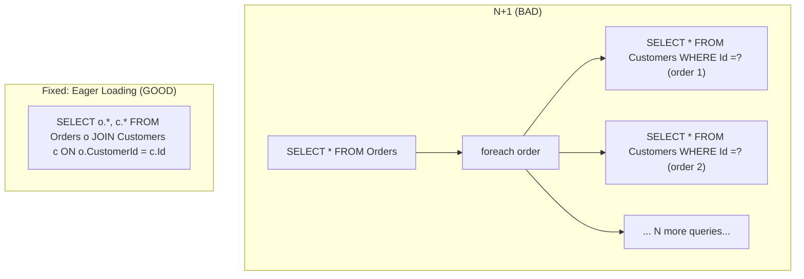
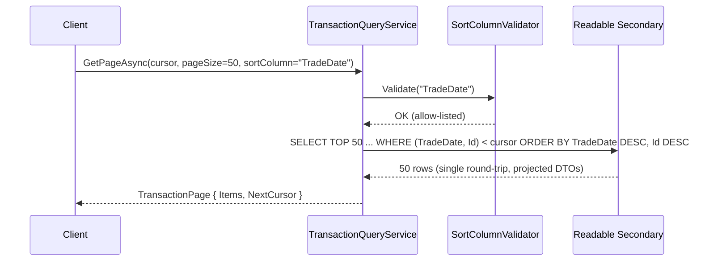

# Module 20 — SQL Server: Query Optimization Patterns & Anti-patterns

> Domain: SQL Server | Level: Beginner → Expert | Prerequisite: [[01-Indexing-Query-Execution-Plans]], [[02-Transactions-Isolation-Locking]], [[../01-CSharp/05-LINQ-Internals]]

---

## 1. Topic Description

### Definition

Query optimization patterns are the **formulation and rewriting** decisions that determine how much work a query asks the engine to do — as distinct from the physical structures it runs against, or the concurrency semantics it runs under. The central principle is that SQL is a set-based language: one statement lets the optimizer choose a strategy, parallelise, and read each page once, whereas iterative processing (a cursor, a `WHILE` loop, an application-side `foreach`, a scalar function invoked per row) forces per-row overhead and forecloses every better plan. Most "slow query" problems in real systems are self-inflicted by shape rather than by missing indexes.

### Core sub-concepts

- **Set-based versus iterative processing** — cursors, `WHILE` loops, application-side loops, and the small set of genuinely sequential cases.
- **The N+1 pattern** — one query per parent instead of one query for all; eager loading, projection and batching as the fixes.
- **Scalar UDFs** — per-row invocation, parallelism inhibition, cost hidden from the plan, and inlining eligibility in modern versions.
- **Table-valued functions** — inline versus multi-statement, and the cardinality estimates each produces.
- **`EXISTS` / `IN` / `JOIN` for existence tests** — plan equivalence, row multiplication, and `NOT IN`'s three-valued-logic trap with NULLs.
- **The catch-all / optional-parameter query** — one plan for every parameter combination; `OPTION (RECOMPILE)` versus parameterised dynamic SQL.
- **Temp tables versus table variables** — statistics and real cardinality versus one-row estimates and nested-loop plans.
- **CTEs** — syntax, not materialisation; repeated references are repeated evaluations.
- **Window functions** — replacing self-joins and correlated subqueries for ranking, running totals, previous-row comparison and deduplication.
- **Pagination** — `OFFSET`'s linear cost growth versus keyset/seek pagination with a unique sort key.
- **Aggregation strategy** — on-demand versus pre-aggregation (indexed views, summary tables, asynchronous projections); stream versus hash aggregate.
- **`MERGE` hazards** — concurrency and correctness issues versus an explicit `UPDATE`-then-`INSERT` under appropriate locking.
- **Batching large modifications** — bounded batches driven by an indexed key range, resumability, and log and lock implications.
- **Data skew** — plans good for typical values and catastrophic for outliers; splitting query shapes.
- **Query hints** — targeted, documented, time-bounded mitigation versus frozen decisions nobody can later justify.
- **Measuring correctly** — logical reads and CPU rather than wall-clock duration; realistic data volume and parameter distribution.

### Where it fits

Query formulation sits between the application (or the ORM that generates the SQL) and the physical index structures. It depends on indexing, because the best-written query still scans without a supporting index; and it constrains concurrency, because a query touching more rows than necessary holds more locks for longer, so query shape and blocking are frequently the same problem viewed twice. Upward it determines API latency, database CPU, and — in a metered cloud model — direct spend.

### Why it matters at scale

The costs here are multiplicative rather than incremental. A cursor over 500,000 rows is not 20% slower than the set-based equivalent, it is hours instead of minutes. An N+1 pattern turns one page render into two hundred round-trips, and it degrades in proportion to the customer's data, so it appears only for your largest accounts. `OFFSET` pagination costs grow linearly with page depth, so "later pages are slow" is a structural property, not a tuning gap. And prioritising by individual query duration reliably misdirects effort: the query running a million times a day at 50 ms consumes far more capacity than the nightly report that takes ten minutes, but only the report gets noticed.

### Common pitfalls / anti-patterns

- **A cursor or application-side loop doing what one statement could** — per-row overhead plus no opportunity for the optimizer to choose a better strategy; typically orders of magnitude, not percentages.
- **A scalar UDF in a `WHERE` clause or `SELECT` list** — invoked per row, blocks parallelism, makes the predicate non-SARGable, and does not appear as its own plan operator, so the plan looks cheap while the query takes minutes.
- **The catch-all `WHERE (@p IS NULL OR Col = @p)` pattern** — the optimizer must produce one plan valid for every parameter combination, so it produces a scan-based plan that is poor for all of them.
- **A table variable holding a large result set** — a one-row cardinality estimate produces a nested-loop plan over millions of rows.
- **Assuming a CTE is materialised** — referencing it three times evaluates the underlying query three times; only an explicit temp table materialises.
- **`DISTINCT` added to fix a join that multiplies rows** — papers over an incorrect join grain and adds a sort or hash over the inflated set.
- **`OFFSET`-based deep pagination** — the engine reads and discards every skipped row, so page 5,000 reads 250,000 rows to return 50.
- **`MERGE` under concurrency without `HOLDLOCK`** — a documented race producing primary-key violations, where an explicit `UPDATE`/`INSERT` is simpler and safe.
- **Measuring a rewrite by wall-clock duration** — varies with cache state and load; logical reads measure the work actually done and are comparable across runs.
- **Optimising a query that should not run at all** — over-fetching, running per request where a cache would do, or being called in a loop; these fixes cost nothing ongoing, unlike an index.

> Scope note: index design, plan reading and statistics belong to `01-Indexing-Query-Execution-Plans`; isolation levels, locking and batching for concurrency reasons to `02-Transactions-Isolation-Locking`. ORM-generated query shapes and change tracking live in `56-LINQ-EFCore`.

---

## 2. Beginner (10 Q&A)


**Q1. Why is set-based logic preferred over row-by-row processing?**
**A:** The engine is built to operate on sets: one statement lets the optimizer choose a plan, parallelise, use efficient join algorithms and read pages once, while a cursor or loop forces a separate round of work per row with per-iteration overhead and no opportunity for a better strategy. The difference is typically orders of magnitude, not percentages, on any meaningful row count. The mental shift is describing *what* you want rather than *how* to compute it, which is exactly what gives the optimizer room to work.
*Follow-up: Name a case where a cursor is genuinely the right answer.*

**Q2. What's wrong with a scalar user-defined function in a `WHERE` clause?**
**A:** Historically it is invoked once per row, cannot be inlined, blocks parallelism for the whole query, and — worst for diagnosis — its cost does not appear as a separate plan operator, so the plan looks cheap while the query takes minutes. It also makes the predicate non-SARGable, so no index can be used. Modern SQL Server can inline some scalar UDFs automatically, which helps enormously, but the inlining has eligibility rules and is not guaranteed, so the safe pattern remains an inline table-valued function or the expression written directly.
*Follow-up: How would you find scalar UDFs that are hurting you, given they hide from the plan?*

**Q3. `EXISTS` versus `IN` versus a `JOIN` — when does the choice matter?**
**A:** For simple existence checks the optimizer usually produces the same plan for `EXISTS` and `IN`, so the choice is stylistic. It stops being stylistic with NULLs: `NOT IN` against a subquery containing a NULL returns no rows at all, silently, which is one of the most common and most confusing SQL bugs. `NOT EXISTS` has no such problem and is the safer default. A `JOIN` differs semantically — it can multiply rows when the right side has duplicates — so using a join for an existence test and then adding `DISTINCT` to fix the duplication is a shape worth recognising as wrong.
*Follow-up: Why exactly does `NOT IN` with a NULL return nothing?*

**Q4. What is the catch-all query problem?**
**A:** A single query with optional filters written as `WHERE (@Name IS NULL OR Name = @Name) AND (@City IS NULL OR City = @City)`. The optimizer must produce one plan valid for every combination of parameters, so it typically produces a scan-based plan that is safe but poor for all of them, and index usage collapses. The two standard fixes are `OPTION (RECOMPILE)`, which lets the optimizer build a plan for the actual values each time at the cost of compilation, and constructing parameterised dynamic SQL containing only the applicable predicates, which gets a good cached plan per shape.
*Follow-up: Which of those two would you choose for a search screen called 10,000 times a minute?*

**Q5. Temp table or table variable — how do you choose?**
**A:** Temp tables have statistics, so the optimizer estimates their cardinality from real data and can choose appropriate joins and index usage; table variables historically estimated one row regardless of contents, which produces nested-loop plans that are catastrophic when the variable actually holds a million rows. Newer versions add deferred compilation for table variables, which mitigates this but does not fully close the gap. My default is a temp table for anything holding more than a trivial number of rows, and a table variable only for genuinely small sets or where a temp table's recompilation and `tempdb` behaviour is a problem.
*Follow-up: You have a table variable in a loop and the plan shows one estimated row. What are your options?*

**Q6. Is a CTE materialised?**
**A:** No — a non-recursive CTE is syntax that the optimizer inlines into the surrounding query, so referencing it twice means evaluating it twice, and it provides no performance benefit over a derived table or subquery. People frequently assume otherwise and use a CTE expecting to compute something once. If you genuinely need a single evaluation of an expensive intermediate result, materialise it into a temp table explicitly. The value of CTEs is readability and recursion, not performance.
*Follow-up: You have a CTE referenced three times in a query. What's the likely plan, and what would you change?*

**Q7. What do window functions let you avoid?**
**A:** Self-joins and correlated subqueries for "compare each row to its group" problems — running totals, ranking within a partition, comparing to a previous row, deduplicating by keeping the latest per key. Each of those written classically requires reading the data multiple times; a window function reads once and computes over a moving frame. The result is usually both dramatically faster and far more readable. Recognising the shapes that window functions solve is one of the higher-leverage pieces of SQL knowledge for a senior engineer.
*Follow-up: How would you delete all but the most recent row per key using a window function?*

**Q8. Why is `SELECT *` a problem beyond style?**
**A:** It forces the query to retrieve every column, which prevents a nonclustered index from covering the query and therefore forces lookups or a clustered scan; it ships data over the network that nobody uses; and it makes the query fragile, since adding a column changes the result shape and can break consumers. In a join it also produces ambiguous or duplicated column names. The performance impact is often the difference between an index-only plan and a full table access, which is not a small effect.
*Follow-up: A view uses `SELECT *`. What additional problem does that create?*

**Q9. How should you measure whether a rewrite actually helped?**
**A:** By logical reads and CPU time, not wall-clock duration — duration varies with cache state, concurrency and machine load, so a "faster" query may simply have had its pages in memory. Logical reads measure the work done and are comparable across runs, which is why they are the right currency for tuning. I would also check the plan shape changed as intended, and measure with realistic data volume and parameter values, since a rewrite that helps on typical values can be worse on the outliers that actually cause incidents.
*Follow-up: Logical reads dropped by 90% but duration is unchanged. What's going on?*

**Q10. What's the fastest way to make a slow query fast?**
**A:** Establish whether it needs to run at all, or needs to return what it returns. A surprising share of slow queries are fetching more rows or columns than the application uses, running on every request when the result could be cached, or being called in a loop when one call would do. Those give the largest wins for the least risk, and they cost nothing ongoing — unlike an index, which is a permanent write tax. Only once the query is genuinely necessary and minimal does it make sense to tune its shape or its indexes.
*Follow-up: The query is necessary, minimal and still slow. What's your next step?*

---

## 3. Intermediate (10 Q&A)


**Q1. A nightly job processes 500,000 rows in a cursor and takes six hours. How do you approach it?**
**A:** First establish whether the logic is genuinely row-dependent or merely written that way — most cursors implement something expressible as one or a few set-based statements, and the rewrite is the whole win. If some part is genuinely sequential (a running calculation with a dependency on the previous result), window functions cover many of those cases. If it truly must iterate, batch it so each iteration handles thousands of rows rather than one, which recovers most of the benefit. I would also check what dominates: sometimes the cursor is fine and the per-row work is calling a scalar UDF or a remote service, in which case the cursor is not the problem.
*Follow-up: The per-row work calls a web service. Now what?*

**Q2. How do you make a "search with many optional filters" endpoint perform?**
**A:** Choose between `OPTION (RECOMPILE)` and dynamic SQL based on call frequency: recompile is simple and correct but pays a compilation cost per execution, which is fine for a few hundred calls an hour and unacceptable at thousands per minute; parameterised dynamic SQL builds only the needed predicates and gets a cached plan per combination, which handles high frequency at the cost of complexity and injection risk if done carelessly. Alongside either, I would bound the search — require at least one selective filter, enforce paging, and cap results — because an unfiltered search over a large table has no good plan. For genuinely free-form search, a search engine rather than a relational database is often the honest answer.
*Follow-up: Users insist on being able to search with no filters at all. How do you handle it?*

**Q3. How do you paginate efficiently over a large result set?**
**A:** Keyset (seek) pagination: instead of `OFFSET n`, filter on the last row's sort key (`WHERE (SortKey, Id) > (@lastSort, @lastId)`) with an index supporting that order, so each page is a seek of constant cost. `OFFSET` must read and discard every skipped row, so page 5,000 reads 250,000 rows to return 50 — the cost grows linearly with page number, which is exactly the pattern where users complain that "later pages are slow." The trade-off is that keyset pagination cannot jump to an arbitrary page number, which is usually acceptable and occasionally requires a product conversation.
*Follow-up: The sort key isn't unique. What breaks and how do you fix it?*

**Q4. What's the danger of `MERGE`, and what would you use instead?**
**A:** `MERGE` is elegant but has a long history of correctness and concurrency issues — race conditions producing primary-key violations under concurrency, unexpected behaviour with triggers and foreign keys, and several documented bugs. Given the alternative is a straightforward `UPDATE` followed by an `INSERT` (or the reverse) in an explicit transaction with appropriate locking, which is easy to reason about and has none of that history, I default to the explicit form. Where `MERGE` is used, it needs a `HOLDLOCK` hint to be concurrency-safe, which most usages omit. This is a case where the simpler, more verbose construct is genuinely the better engineering choice.
*Follow-up: A batch load uses `MERGE` and occasionally throws a duplicate-key error. Explain the mechanism.*

**Q5. How do you optimise an aggregation over a very large table?**
**A:** Ask first whether it must be computed on demand. Pre-aggregation — an indexed view, a summary table maintained incrementally, or an asynchronous projection — turns an expensive scan into a lookup, and for dashboards and reports that is almost always the right answer. If it must be live, the levers are a columnstore index for scan-and-aggregate workloads, filtering before aggregating so less data is processed, and ensuring the grouping columns are supported by the index so a stream aggregate replaces a hash aggregate and sort. The architectural point is that repeatedly aggregating the same historical data is waste, and the fix is usually a data-flow change rather than a query change.
*Follow-up: The aggregate must reflect data less than five seconds old. Does pre-aggregation still work?*

**Q6. How do you deal with a query whose plan is good for most parameters and terrible for a few?**
**A:** This is the skew problem, and the answer depends on whether the skew is known. If a small set of values is known to be atypical — a whale customer, a default category — routing those to a separate query shape or procedure lets each get an appropriate cached plan. `OPTION (RECOMPILE)` solves it generally at a per-execution cost. `OPTIMIZE FOR` a representative value trades the outliers' performance for stability, which is sometimes the right business call. I would also consider whether the data model is encouraging the skew, since a design where one row has a million children often has an alternative shape.
*Follow-up: The skewed value changes over time as customers grow. How does that affect your choice?*

**Q7. What are the signs that a query problem is really a data-model problem?**
**A:** Every fix helps one query and hurts another; the query needs many joins to answer a simple business question; the same aggregation is recomputed constantly because the value is not stored anywhere; a table is being used for two unrelated purposes with nullable columns for each; or key lookups and sorts dominate every plan because the physical order never matches the access pattern. When several independent queries all fight the same structural characteristic, tuning is a treadmill. The signal I trust most is repeatedly adding indexes that each help one query — that is a model that does not match its access patterns.
*Follow-up: You conclude the model is wrong. How do you make that case without a rewrite mandate?*

**Q8. How do you handle a query that must join across a large fact table and several dimensions?**
**A:** Make the fact-table access as selective as possible first — filter on the fact table before joining, since a join that multiplies rows before filtering does far more work — and ensure the join keys are indexed and type-matched, because an implicit conversion on a join key defeats the index and is easy to miss. Check whether the plan uses hash joins with adequate memory grants and whether it is spilling. For genuinely analytical shapes, columnstore and batch mode change the economics entirely. And confirm the query actually needs every dimension: unnecessary joins added "in case" are common and each one costs.
*Follow-up: The plan shows a hash join spilling to `tempdb`. What are your options?*

**Q9. When are query hints acceptable?**
**A:** As a targeted, documented, time-bounded mitigation when the optimizer is demonstrably wrong and you have a deadline — `OPTION (RECOMPILE)`, a join hint, a `FORCESEEK` — with a comment recording why and a follow-up to address the root cause. What makes hints dangerous is that they freeze a decision made against today's data and statistics: the hint that fixes a problem now becomes the cause of the next problem when the data changes, and by then nobody remembers why it is there. So my rule is that a hint requires a written reason and an owner, and I would treat a codebase with hints scattered through it as evidence of an unaddressed underlying problem.
*Follow-up: You inherit a codebase with 200 query hints. How do you assess which are still needed?*

**Q10. How do you approach optimising a stored procedure with 500 lines and multiple statements?**
**A:** Find the statement that dominates rather than optimising the whole thing — capture per-statement runtime statistics, because in my experience one or two statements typically account for the vast majority of the time and the rest is noise. Then check for the structural problems that span statements: temp objects rebuilt repeatedly, the same data queried several times, a loop wrapping set-based work, and recompilation caused by temp-table DDL interleaved with usage. Long procedures also frequently do work that could be skipped entirely for most inputs, so an early exit can beat any tuning. I would resist rewriting the whole procedure, which is high-risk and usually unnecessary.
*Follow-up: One statement dominates but it's a business rule nobody understands any more. How do you proceed?*

---

## 4. Expert / Architect (10 Q&A)


**Q1. How do you decide whether a workload belongs in the database at all?**
**A:** Relational engines are excellent at set operations over indexed data with transactional guarantees, and poor at things people ask of them because the data happens to live there: full-text and fuzzy search, queue processing, high-frequency counters, large-scale analytical scans alongside OLTP, and complex procedural business logic. The test I apply is whether the operation exploits what the database is good at or fights it. Moving work out has costs — another system to operate, consistency to reason about — so the case must be made on measured pain rather than on principle, but a database being used as a queue, a search engine and a cache simultaneously is usually the root cause of recurring incidents rather than a tuning opportunity.
*Follow-up: The team wants to keep search in SQL Server for transactional consistency. How do you evaluate that?*

**Q2. How do you build a culture where query performance is designed rather than discovered in production?**
**A:** Make the feedback loop short and local: realistic data volumes in a shared development environment, query plans reviewed as part of code review for anything touching significant tables, and automated checks in CI on logical reads for critical queries so a regression fails a build. The single most effective change is realistic data volume, because a thousand-row test database validates correctness and hides every performance problem. Alongside that, make production query telemetry visible to the developers who wrote the queries — most teams never see their own queries' costs, and visibility alone changes behaviour more than guidance does.
*Follow-up: Realistic data volumes in every developer environment is expensive. What's your minimum viable version?*

**Q3. How do you approach a system where the ORM generates most of the queries?**
**A:** Accept that most generated queries are fine and focus on the shapes that are not: N+1 patterns, client-side evaluation, over-fetching entire entities where a projection would do, and unbounded result sets. Those are detectable systematically — query counts per request, generated SQL logging with row-count thresholds — rather than by reading code. For the small number of genuinely performance-critical queries, hand-written SQL is the right answer, kept in a discoverable place with its own tests. The failure mode I would guard against is either extreme: fighting the ORM everywhere, or accepting whatever it generates on paths that matter.
*Follow-up: How would you set the threshold for when a query graduates from ORM to hand-written SQL?*

**Q4. How do you handle performance for reporting requirements on a transactional system?**
**A:** Separate them, because their access patterns are opposed: OLTP wants narrow indexed seeks and short transactions, reporting wants wide scans and long-running consistent reads, and running both on one instance means each degrades the other. The options in ascending order of cost are a readable replica, a purpose-built read model updated asynchronously, and a full analytical store. The decision hinges on freshness requirements, which should be interrogated rather than accepted — "real time" usually means "within a few minutes" when examined, and that distinction determines whether an asynchronous projection is viable. I would treat mixing the workloads as a deliberate temporary state, not an architecture.
*Follow-up: The freshness requirement is genuinely sub-second for a trading desk. What do you build?*

**Q5. What's your approach to query performance in a multi-tenant system with extreme size skew?**
**A:** The skew is the design constraint. A plan cached for a small tenant is disastrous for a large one, so the standard tools — recompilation for the queries where it matters, tenant-aware query shapes, or physically isolating the largest tenants — become necessary rather than optional. Indexes should lead with the tenant identifier so each tenant's data is contiguous. Beyond a certain skew, the honest answer is that the largest tenants belong in their own database or shard, because no amount of query tuning makes one plan appropriate for a thousand-fold range. I would set a size threshold for isolation and treat crossing it as a routine operational event rather than an exception.
*Follow-up: How do you migrate a large tenant to its own database with minimal downtime?*

**Q6. How would you evaluate a proposal to move heavy processing from application code into stored procedures, or vice versa?**
**A:** On where the data is and where the logic belongs. Moving set-based data manipulation into the database is usually right, because doing it in application code means pulling rows across the network to process them one at a time. Moving business logic into the database is usually wrong, because it is harder to test, version, review and deploy, and it puts logic in a tier that scales vertically. So my answer is data-shaping in SQL, business rules in code. The counter-consideration is that some organisations have deep database skills and thin application-side data expertise, and an architecture the team can actually operate beats a purer one they cannot.
*Follow-up: The existing system has 200,000 lines of business logic in stored procedures. Do you migrate it?*

**Q7. How do you build a performance regression safety net for a database-heavy system?**
**A:** Query Store in production for detecting plan regressions and comparing before and after a release, which is the highest-value single item. In CI, a suite of critical queries executed against production-scale data with assertions on logical reads and plan shape. In review, an expectation that changes to hot tables or queries include the plan. Then production telemetry that attributes database time to application operations, so a regression is visible as a service-level change rather than a database mystery. The connecting principle is that performance must be observable at each stage; a system where the first signal is a customer complaint cannot be managed.
*Follow-up: The CI suite passes but production regresses. What's the most likely gap?*

**Q8. What are the trade-offs of denormalisation as a performance strategy?**
**A:** It buys read performance by removing joins and pre-computing results, at the cost of write complexity and the risk of divergence between the source and the copy — which is a correctness cost paid indefinitely. The disciplined version is to treat the denormalised form as a derived read model with a clearly-defined update mechanism and a way to detect and repair drift, rather than as a field someone updates in two places. Where the derived data can be rebuilt from the source, drift is recoverable; where it cannot, denormalisation has quietly created a second source of truth. I would insist on the rebuild path existing before approving it.
*Follow-up: How would you detect drift between a denormalised total and its source rows?*

**Q9. How do you prioritise query optimisation work across a large system?**
**A:** By total resource consumption rather than by individual query duration, because the query that runs a million times a day at 50 ms costs far more than the nightly report that takes ten minutes — and teams reliably prioritise the visible slow one. Aggregate CPU, logical reads and duration by query from the plan cache or Query Store gives the real ranking. Then weight by business impact, since a slow query on a checkout path matters more than an equally expensive internal report. I would also factor in fix cost, because a few cheap fixes on high-volume queries often beat one heroic optimisation.
*Follow-up: The top consumer is a health check running every second. What do you do?*

**Q10. What distinguishes a strong answer when a candidate is asked to optimise a query?**
**A:** Asking what the query is for before touching it — how many rows should it return, how often does it run, who consumes it, does it need to run at all. Then measuring rather than assuming, using logical reads, and reading the actual plan for the estimate-versus-actual gap. Then choosing the intervention with the smallest permanent cost, in order: don't run it, run it less, return less, rewrite it, then index it. A weaker answer starts with "add an index" and never establishes the requirement. The strongest answers also say what they would do if the rewrite does not work — recognising when the problem is the model or the workload placement rather than the query is the judgement that matters most at this level.
*Follow-up: Applying that order, where would you push back on a request to optimise a report that runs once a month?*

---

## 5. Reference Material

> Retained from the original module: deep-dive internals, diagrams, production examples, exercises, system/low-level design, debugging walkthroughs and the Principal Engineer perspective.

### 1. Fundamentals

#### What is the N+1 query problem, and what is batching?
The **N+1 query problem** occurs when code fetches a list of N parent records with one query, then executes **one additional query per parent** to fetch related child data (N further queries) — instead of a single query (or a small, fixed number) retrieving everything needed via a join or a batched `IN` clause. **Batching** is the general fix: combining what would be many small round-trips into fewer, larger ones, since each round-trip's fixed network/parsing overhead dominates for small queries, and the *number* of round-trips, not just their individual cost, is often the real bottleneck.

#### Why does this matter?
ORMs (EF Core especially) make N+1 extremely easy to introduce accidentally — lazy-loaded navigation properties accessed inside a loop look like ordinary property access in code, with no visual signal that each access triggers a fresh database round-trip. This is one of the single most common, most damaging real-world ORM performance bugs, and a near-universal interview topic for any EF Core/database-backed role.

#### When does it matter?
Any loop iterating over a collection of entities and accessing a related, not-yet-loaded navigation property; the depth matters for recognizing N+1 in code review (often invisible without specifically looking for it) and for choosing the correct fix (eager loading, projection, batching) for the specific scenario.

#### How does it work (30,000-ft view)?
```csharp
// N+1: one query for orders, then ONE ADDITIONAL QUERY PER ORDER for its customer
var orders = await db.Orders.ToListAsync; // 1 query
foreach (var order in orders)
    Console.WriteLine(order.Customer.Name); // triggers a lazy-load query, N times

// Fixed: ONE query total, via eager loading
var orders = await db.Orders.Include(o => o.Customer).ToListAsync; // 1 query, JOIN-based
```

### 2. Deep Dive

#### 2.1 Eager Loading (`Include`) vs Explicit Loading vs Lazy Loading
- **Lazy loading**: a navigation property is fetched automatically, transparently, the moment it's first accessed — convenient, but exactly what causes N+1 when accessed inside a loop, since each iteration's access is a distinct, invisible round-trip.
- **Eager loading** (`.Include(o => o.Customer)`): the related data is fetched as part of the *original* query (via a JOIN or a second batched query, depending on EF Core's query-splitting configuration) — the standard fix for N+1 when the related data is genuinely needed for every parent row.
- **Explicit loading** (`context.Entry(order).Reference(o => o.Customer).LoadAsync`): manually triggering a load for a specific already-tracked entity — useful when the need for related data is conditional/rare, avoiding the cost of always eager-loading data most rows won't need.

#### 2.2 Split Queries vs Single Query for Multiple `Include`s
Including **multiple** one-to-many navigation properties in a single query (`.Include(o => o.LineItems).Include(o => o.Payments)`) via one combined JOIN produces a **cartesian explosion** — if an order has 5 line items and 3 payments, the single-query JOIN result has 15 rows for that one order (5×3), with line-item and payment data needlessly duplicated across rows — EF Core's `.AsSplitQuery` instead issues **separate** queries per included collection (avoiding the multiplication, at the cost of multiple round-trips instead of one) — the correct choice depends on the specific collections' typical sizes: single-query is fine for one-to-one/small collections, split-query is usually better for multiple, potentially-large one-to-many collections.

#### 2.3 Projection — Selecting Only What's Needed
`.Select(o => new OrderSummaryDto { Id = o.Id, Total = o.Total })` lets EF Core generate SQL selecting **only** the needed columns, avoiding both the network/deserialization cost of unused columns and, critically, avoiding loading full entity graphs into the change tracker unnecessarily (directly connecting to the `AsNoTracking` guidance) — for read-only, DTO-shaped output, projection is frequently both faster and simpler than loading full entities and mapping afterward.

#### 2.4 Pagination Strategies — Offset vs Keyset (Cursor)
**Offset pagination** (`OFFSET @skip ROWS FETCH NEXT @take ROWS ONLY`) is simple and supports jumping to an arbitrary page number, but its cost **grows with the offset** — the database must still traverse and discard all skipped rows, making deep pages (page 10,000) genuinely expensive regardless of index support, and it's **unstable** under concurrent inserts/deletes (a row inserted between two page requests can shift every subsequent row's offset, causing a row to be skipped entirely or duplicated across pages). **Keyset/cursor pagination** (`WHERE Id > @lastSeenId ORDER BY Id FETCH NEXT @take ROWS ONLY`) uses the last-seen row's key as the starting point for the next page — cost is constant regardless of how deep into the result set the cursor is, and it's stable under concurrent modification, at the cost of not supporting arbitrary "jump to page N" navigation (only sequential next/previous).

#### 2.5 Batching Writes — `AddRange`/Bulk Operations
Individual `SaveChanges` calls per entity inside a loop issue one round-trip per entity (an N+1-shaped write anti-pattern); batching multiple entities into one `SaveChanges` call lets EF Core combine them into fewer round-trips (and, in modern EF Core versions, genuinely batched SQL statements) — for very large bulk-insert/update scenarios (thousands+ of rows), a dedicated bulk-operation library or `SqlBulkCopy` outperforms even batched EF Core `SaveChanges`, since EF Core's change-tracking overhead itself becomes the bottleneck at sufficient volume.

### 3. Visual Architecture

```mermaid
graph TB
 subgraph "N+1 (BAD)"
 Q1["SELECT * FROM Orders"] --> L["foreach order"]
 L --> Q2["SELECT * FROM Customers WHERE Id =? (order 1)"]
 L --> Q3["SELECT * FROM Customers WHERE Id =? (order 2)"]
 L --> Q4["... N more queries..."]
 end
 subgraph "Fixed: Eager Loading (GOOD)"
 Q5["SELECT o.*, c.* FROM Orders o JOIN Customers c ON o.CustomerId = c.Id"]
 end
```

### 4. Production Example
**Scenario**: An order-history API endpoint (`GET /customers/{id}/orders`) degraded from ~50ms to over 8 seconds as customers' order histories grew, with no code changes to the endpoint itself. **Investigation**: EF Core query logging revealed the endpoint executed 1 query to fetch orders, plus **one additional query per order** to lazily load each order's `LineItems` navigation property (accessed in a response-mapping loop) — for a customer with 200 orders, this meant 201 total round-trips; the degradation tracked customers' order-count growth exactly, confirming the N+1 shape. **Fix**: added `.Include(o => o.LineItems)` to the original query (with `.AsSplitQuery` given `LineItems` is a potentially-large one-to-many collection), collapsing 201 round-trips into 2; latency returned to ~60ms regardless of order-history size. **Lesson**: N+1 is invisible in the C# code itself (`order.LineItems` looks like ordinary, free property access) — it must be caught either via EF Core's SQL logging in code review/testing, or via a standing analyzer/query-count assertion in integration tests, not by reading the LINQ code alone.

### 11. Coding Exercises

#### Easy — Fix N+1 with eager loading
```csharp
// BEFORE (N+1):
var orders = await db.Orders.ToListAsync;
foreach (var order in orders) Console.WriteLine(order.Customer.Name); // N lazy-load round-trips

// AFTER:
var orders = await db.Orders.Include(o => o.Customer).ToListAsync; // 1 query, JOIN-based
foreach (var order in orders) Console.WriteLine(order.Customer.Name); // no additional round-trips
```

#### Medium — Keyset pagination with a composite tie-breaking key
```csharp
public async Task<List<Order>> GetOrdersPageAsync(DateTime? lastSeenDate, int? lastSeenId, int pageSize)
{
    var query = db.Orders.OrderByDescending(o => o.CreatedDate).ThenByDescending(o => o.Id).AsQueryable;

    if (lastSeenDate is not null && lastSeenId is not null)
    {
        query = query.Where(o =>
            o.CreatedDate < lastSeenDate ||
                (o.CreatedDate == lastSeenDate && o.Id < lastSeenId)); // composite cursor, breaks ties via Id
    }

    return await query.Take(pageSize).ToListAsync;
}
```
**Discussion**: The composite `(CreatedDate, Id)` comparison is exactly Advanced Q2's fix for non-unique sort keys — without the `Id` tie-breaker, rows sharing an identical `CreatedDate` could be inconsistently included/skipped across page boundaries.

#### Hard — Automated N+1 regression test (Advanced Q1)
```csharp
[Theory]
[InlineData(5)]
[InlineData(500)] // query count must be IDENTICAL regardless of seeded collection size
public async Task GetCustomerOrders_Should_Use_Constant_Query_Count(int orderCount)
{
    var customer = await SeedCustomerWithOrdersAsync(orderCount);
    var queryLog = new List<string>;
    _dbContext.Database.SetCommandInterceptor(cmd => queryLog.Add(cmd.CommandText)); // conceptual interceptor hook

    var response = await _client.GetAsync($"/customers/{customer.Id}/orders");

    Assert.True(response.IsSuccessStatusCode);
    Assert.True(queryLog.Count <= 3, $"Expected at most 3 queries, got {queryLog.Count} for {orderCount} orders.");
}
```
**Discussion**: Running this with both a small (5) and large (500) seeded order count is the key design decision — a test using only a small seed size would pass even with a genuine N+1 bug present (Advanced Q7), since the round-trip count difference is negligible at small scale; asserting the *same* bound for both sizes is what actually proves the query count doesn't scale with input.

#### Expert — Batched bulk import with periodic change-tracker clearing
```csharp
public async Task ImportOrdersAsync(IAsyncEnumerable<OrderImportRow> rows)
{
    const int batchSize = 2000; // consistent with the lock-escalation-avoidance threshold
    int count = 0;

    await foreach (var row in rows)
    {
        db.Orders.Add(MapToOrder(row));
        count++;

        if (count % batchSize == 0)
        {
            await db.SaveChangesAsync;
            db.ChangeTracker.Clear; // release tracked entities -- prevents unbounded memory growth
            // across a very large import's full duration
        }
    }
    await db.SaveChangesAsync; // final partial batch
}
```
**Discussion**: `ChangeTracker.Clear` (EF Core 7+) is specifically necessary here because, without it, every previously-saved batch's entities would remain tracked for the *entire* import's duration, accumulating unbounded memory (the allocation-growth concerns) even though they've already been persisted and have no further reason to stay tracked — a direct, practical application of Intermediate Q9/Advanced Q6's reasoning about EF Core's own change-tracking overhead becoming the bottleneck at volume.

### 12. System Design

**Scenario:** Design the query/data-access layer for a `GET /accounts/{id}/transactions` trade/order-history API serving both a trading-desk UI (interactive pagination, filtering) and a downstream reconciliation feed, against a SQL Server ledger growing by ~5M rows/day across a multi-tenant broker-dealer platform.

**Functional requirements:** paginated, filterable, sortable transaction history per account; stable results under concurrent writes; nightly full-ledger reconciliation against custodian settlement files; bulk historical-data import/backfill support.

**Non-functional requirements:** p99 endpoint latency < 150ms regardless of an account's total historical transaction count; zero query-count scaling with result-set size (N+1-free by construction); reconciliation completes within a fixed nightly batch window regardless of ledger growth; no reporting/analytical query may add measurable latency to the live order-posting path.

**Architecture:** three physically-separated read paths off one write-of-record ledger — (1) OLTP primary, written by the order-posting service, serving only the narrow, highly-selective authorization/posting queries; (2) an Always On readable secondary serving the paginated trading-desk API, isolated from posting-path lock contention; (3) a nightly snapshot/replica used exclusively by the reconciliation batch job (Expert Q1), so a multi-hour set-based scan never competes with either live path.

**Components:** `TransactionQueryService` (keyset-paginated, projection-only reads against the readable secondary); `TransactionImportService` (chunked `SqlBulkCopy`-backed batch writes with `ChangeTracker.Clear` discipline, Expert coding exercise); `ReconciliationJob` (set-based `FULL OUTER JOIN` against the nightly snapshot, Expert Q1); a sort-column allow-list validator gating any client-supplied `ORDER BY` input (§8).

**Database selection:** SQL Server remains the system of record — ACID transactional guarantees and mature tooling/DBA familiarity outweigh a NoSQL alternative's benchmark throughput numbers for a regulated ledger requiring point-in-time auditability and strong consistency on the write path (the same "boring, ACID relational database beats a NoSQL benchmark win" reasoning this course applies to payment systems generally).

**Caching:** a Redis-backed cache in front of the reconciliation job's checkpoint balances (§9) and any frequently-repeated, identical reporting aggregate within a business day; the live pagination path is deliberately *not* cached, since trading-desk data must reflect the true current state.

**Messaging:** none required on the read path; the import/backfill path could optionally be driven off a queue (batch-file-arrival event) rather than a synchronous upload, decoupling ingestion timing from API availability.

**Scaling:** horizontal read scaling via additional readable secondaries as trading-desk query volume grows; date-based partitioning (§9) so both pagination and reconciliation queries scoped to a recent window never scan settled history.

**Failure handling:** a failed batch-import chunk rolls back only that chunk (bounded blast radius from chunked batching) and resumes from the last committed batch boundary, never restarting the full import; a reconciliation run that can't complete within its window pages on-call rather than silently completing late against stale data.

**Monitoring:** query-count-per-request (the N+1 regression signal, Advanced Q1) as a first-class per-endpoint metric; replica-lag on the readable secondary; reconciliation job duration trend versus ledger size (catching the O(history) recomputation anti-pattern, Expert Q3, before it becomes a missed-window incident).

**Trade-offs:** three physically-separate read paths cost more in infrastructure and operational complexity than "just query the primary for everything" — justified specifically because this ledger's access patterns (latency-critical posting, interactive pagination, bulk reconciliation) are structurally different enough that sharing one physical path was the actual root cause of this module's recurring incident shapes (§9, Expert Q5, Expert Q7).

### 13. Low-Level Design

**Requirements:** N+1-free, keyset-paginated reads; chunked, resumable bulk writes; sort/filter input validated against an allow-list; thread-safe under concurrent `DbContext` usage.

**Class diagram:**

```mermaid
classDiagram
 class ITransactionQueryService {
 <<interface>>
 +GetPageAsync(cursor, pageSize, sortColumn) TransactionPage
 }
 class TransactionQueryService {
 -allowListValidator SortColumnValidator
 +GetPageAsync(cursor, pageSize, sortColumn) TransactionPage
 }
 class SortColumnValidator {
 +Validate(column) bool
 }
 class KeysetCursor {
 +DateTime LastSeenDate
 +int LastSeenId
 +ToWhereClause() string
 }
 class ITransactionImportService {
 <<interface>>
 +ImportAsync(rows) ImportResult
 }
 class TransactionImportService {
 -batchSize int
 +ImportAsync(rows) ImportResult
 }

 TransactionQueryService..|> ITransactionQueryService
 TransactionQueryService --> SortColumnValidator
 TransactionQueryService --> KeysetCursor
 TransactionImportService..|> ITransactionImportService
```

**Sequence diagram (paginated read):**

```mermaid
sequenceDiagram
 participant Client
 participant API as TransactionQueryService
 participant Validator as SortColumnValidator
 participant DB as Readable Secondary

 Client->>API: GetPageAsync(cursor, pageSize=50, sortColumn="TradeDate")
 API->>Validator: Validate("TradeDate")
 Validator-->>API: OK (allow-listed)
 API->>DB: SELECT TOP 50 ... WHERE (TradeDate, Id) < cursor ORDER BY TradeDate DESC, Id DESC
 DB-->>API: 50 rows (single round-trip, projected DTOs)
 API-->>Client: TransactionPage { Items, NextCursor }
```

**Design patterns used:** Specification/Strategy (the keyset-cursor comparison logic is pluggable per sort column); Repository (`ITransactionQueryService` abstracts the data-access shape from callers); Template Method (the chunked-import lifecycle — add row, check batch boundary, `SaveChanges`, clear tracker, repeat).

**SOLID mapping:** Single Responsibility (query service, validator, and import service are independent, separately-testable components); Open/Closed (a new sort column is added to the allow-list without modifying the query service's core logic); Liskov (any `ITransactionQueryService` implementation must genuinely preserve the N+1-free, constant-query-count contract callers rely on — a violating implementation silently breaks every consumer's latency assumptions); Interface Segregation (query and import are separate interfaces, not one bloated repository interface); Dependency Inversion (the query service depends on the `SortColumnValidator` abstraction, not a hardcoded switch statement).

**Extensibility:** a new filterable/sortable field is added to the allow-list and the projection DTO without touching the pagination/cursor mechanics themselves.

**Concurrency/thread safety:** `DbContext` instances are never shared across concurrent requests (scoped per-request in ASP.NET Core DI, per standard EF Core guidance); the import service's `ChangeTracker.Clear` calls are safe because each import runs against its own dedicated `DbContext` instance, never shared with the live query path.

### 14. Production Debugging

**Incident:** A settlement-instruction lookup stored procedure, shared by both a low-volume single-instruction detail screen and a high-volume overnight batch reconciliation job, began intermittently taking 40+ seconds on the detail screen — a query that should return in under 10ms — causing the trading desk to report the UI as "randomly frozen."

**Root cause:** Parameter sniffing (Expert Q4): the procedure's plan was compiled and cached the first time it ran after a server restart — which, due to deployment timing, happened to be the overnight batch job passing a broad date-range parameter covering an entire quarter. SQL Server cached a plan optimized for that broad, low-selectivity call (a full clustered-index scan with a large memory grant), and every subsequent narrow, single-instruction detail-screen call reused that same cached, wildly-inappropriate plan.

**Investigation:** `sys.dm_exec_query_stats` joined to `sys.dm_exec_sql_text` and `sys.dm_exec_query_plan` for the procedure's cached plan handle confirmed a single plan serving both call shapes, with `execution_count` and average logical reads wildly inconsistent with the detail screen's expected selectivity; comparing `sys.dm_exec_query_stats.min_elapsed_time` against `max_elapsed_time` for the same plan handle showed the 4000x variance characteristic of a sniffing-caused plan mismatch, not a data-growth-driven slowdown.

**Tools:** `sys.dm_exec_query_stats`, `sys.dm_exec_cached_plans`, Query Store's "queries with plan changes" report to confirm the plan hadn't actually changed shape despite the wildly divergent execution times, and Extended Events capturing `query_post_execution_showplan` for a live reproduction.

**Fix:** added `OPTION (RECOMPILE)` to the detail-screen's specific narrow-lookup query path (low call volume, so per-call compile cost was acceptable) while leaving the batch job's broad query on its own, separately-cached plan; longer-term, split the shared procedure into two explicitly-named procedures (`GetSettlementInstructionDetail` and `GetSettlementInstructionsForReconciliation`) so the two structurally different selectivity profiles could never again collide on one cached plan.

**Prevention:** added a Query Store-based alert on plan-count-per-query-hash combined with high elapsed-time variance for the same plan, specifically designed to catch this signature (one plan, wildly divergent execution times) before it reaches a user-facing complaint; added an architecture-review checklist item requiring any shared stored procedure serving genuinely different call-selectivity profiles to be justified explicitly or split, generalizing the incident's root cause (Expert Q4) into a standing review gate.

### 15. Architecture Decision

**Context:** Choosing a data-access strategy for a new, high-volume order-history read path.

**Option A — EF Core with `.Include`/`.AsSplitQuery`/keyset pagination:**
*Advantages:* Strongly-typed, maintainable, integrates with existing change-tracking/migrations tooling; the module's full best-practice set (§5) directly applies with minimal custom infrastructure.
*Disadvantages:* Change-tracking overhead even with `.AsNoTracking` mitigations is non-zero; generated SQL for complex projections can be less predictable than hand-written T-SQL under edge cases.
*Cost:* Low incremental cost — reuses existing EF Core investment.
*Risk:* Low, provided the CI query-count regression test (Advanced Q1) is enforced; without it, N+1 regressions are the dominant risk.

**Option B — Dapper with hand-written, batched T-SQL:**
*Advantages:* Full control over exact generated SQL, no ORM abstraction risk of accidental lazy-loading/N+1; typically lower per-query overhead for very high-throughput paths.
*Disadvantages:* Loses EF Core's compile-time query construction safety and change-tracking convenience; every query's SQL is hand-maintained, raising the maintenance burden and the injection-risk surface (§8) if parameterization discipline lapses.
*Cost:* Higher initial engineering cost; lower long-term per-query runtime cost at extreme volume.
*Risk:* Moderate — correctness now depends entirely on developer discipline around parameterization and manual SQL correctness, with no ORM-level safety net.

**Option C — CQRS read model (materialized, denormalized reporting store, refreshed via CDC/outbox):**
*Advantages:* Fully isolates the read path's query shape and performance profile from the OLTP write model; can be purpose-built (columnstore, pre-aggregated) for the exact access pattern needed.
*Disadvantages:* Read staleness (CDC/outbox propagation lag) unacceptable for any use case needing true real-time data; significant additional infrastructure (CDC pipeline, a second store) and operational complexity.
*Cost:* Highest — a second data store, a replication pipeline, and its own operational ownership.
*Risk:* Low for the read path itself once built; the CDC/replication pipeline becomes a new failure surface requiring its own monitoring (directly the derived-artifact-staleness risk class).

**Recommendation: Option A (EF Core, keyset pagination, `.AsSplitQuery`, CI-enforced query-count regression testing) for the primary trading-desk API, with Option C reserved specifically for the nightly reconciliation/analytical path where staleness is acceptable and the access pattern (bulk aggregation) genuinely differs from interactive pagination.** Option B is justified only if profiling under realistic production volume shows EF Core's residual overhead is the actual bottleneck after all of §2's fixes are applied — reaching for hand-written SQL before exhausting the ORM-level fixes is a premature optimization that trades away maintainability for a performance gain the data doesn't yet justify.

### 17. Principal Engineer Perspective

**Business impact:** the order-history degradation incident (§4) directly translated to trading-desk productivity loss and customer-facing latency on a revenue-adjacent surface — query-optimization discipline here isn't an abstract code-quality concern, it's a direct driver of whether the desk can operate at the speed the business requires.

**Engineering trade-offs:** every pattern in this module trades a small amount of upfront design discipline (choosing keyset over offset pagination, adding `.AsSplitQuery`, chunking batch writes) against a performance characteristic that degrades non-linearly with scale if skipped — the recurring lesson is that these trade-offs are cheap to make correctly at design time and expensive to retrofit once a system is in production at scale with an established, hard-to-change API contract.

**Cross-team communication:** N+1 and parameter-sniffing bugs are invisible in code review to anyone not specifically looking for them (Intermediate Q1, Expert Q4) — a Principal Engineer's role includes making the *absence* of these bugs mechanically verifiable (the CI query-count test, Query Store plan-variance alerting) rather than relying on tribal knowledge or reviewer vigilance alone.

**Architecture governance:** any shared query path serving genuinely different selectivity or access-pattern profiles (Expert Q4, Expert Q7) is a standing architectural smell worth a review-checklist gate — the pattern recurs across parameter sniffing, rowstore/columnstore contention, and OLTP/reporting contention, and each instance in this module is the same underlying principle (don't force structurally different workloads through one shared path) manifesting at a different layer.

**Cost optimization:** eliminating N+1 and adopting keyset pagination reduce infrastructure cost directly (fewer round-trips, lower connection-pool sizing requirements, less CPU spent on redundant compilation) — these are rare cases where a correctness/maintainability improvement and a cost reduction point the same direction, worth highlighting explicitly when making the business case for investing in this kind of technical-debt remediation.

**Risk analysis:** the highest-severity risk pattern in this module isn't any single query being slow — it's a query's cost profile scaling with a dimension (input size, history depth, plan-cache pollution) that grows silently over time, so a system that performs acceptably at launch degrades gradually until it crosses a threshold that produces a sudden, seemingly-unexplained incident; risk registers for query-heavy systems should explicitly track "does this query's cost scale with a growing dimension" as a first-class question, not just current-state latency.

**Long-term maintainability:** the durable defense against every failure mode this module documents (N+1, offset-pagination instability, unbatched writes, parameter sniffing, plan-cache pollution) is the same: automated, CI-enforced regression tests asserting the *shape* of query behavior (constant query count, stable plan reuse, bounded batch size) rather than relying on point-in-time manual verification that erodes as the codebase and its authors change over time.

### 18. Revision
**Key takeaways**: N+1 = one query per parent row instead of one combined query — invisible in C# code (looks like free property access), visible only via SQL logging/query-count monitoring. Fix via eager loading (`.Include`, with `.AsSplitQuery` for multiple one-to-many collections to avoid cartesian explosion), explicit loading for conditional needs, or projection for read-only DTOs. Keyset/cursor pagination has constant cost and concurrent-modification stability that offset pagination lacks, at the cost of no arbitrary page-jumping — requires a unique, composite sort key to avoid tie-breaking bugs. Batch writes in moderate chunks (a few thousand rows), clearing the change tracker periodically for very large imports.

---

**Next**: This completes the `04-SQL-Server` domain (Modules 18–20). Continuing autonomously to `05-PostgreSQL`.
