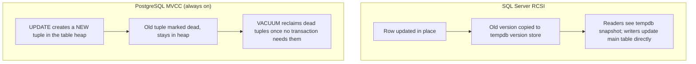

# Module 21 — PostgreSQL: Fundamentals, MVCC & Comparison with SQL Server

> Domain: PostgreSQL | Level: Beginner → Expert | Prerequisite: [[../04-SQL-Server/02-Transactions-Isolation-Locking]] (isolation levels, locking), [[../04-SQL-Server/01-Indexing-Query-Execution-Plans]]

---

## 1. Fundamentals

### What is PostgreSQL, and how does its concurrency model fundamentally differ from SQL Server's?
PostgreSQL is an open-source, object-relational database with a fundamentally different **concurrency-control architecture** from SQL Server's default: PostgreSQL uses **MVCC (Multi-Version Concurrency Control) natively and universally** for every transaction — there is no "opt into row versioning" setting (RCSI, Module 19 §2.1) the way SQL Server has, because MVCC **is** how PostgreSQL always works, for every isolation level. This single architectural difference cascades into nearly every other practical distinction between the two engines.

### Why does this matter?
Engineers moving between SQL Server and PostgreSQL (or designing a system to support both) frequently carry over locking-model assumptions that don't hold — PostgreSQL's default Read Committed behavior already provides much of what SQL Server needs RCSI specifically enabled to achieve, but PostgreSQL introduces its own distinctive operational concern (`VACUUM`) that SQL Server has no direct equivalent of.

### When does this matter?
Any team choosing between the two engines, or migrating between them; the depth matters for correctly reasoning about concurrency behavior differences and for understanding `VACUUM`/bloat, PostgreSQL's most distinctive operational concept with no SQL Server analog.

### How does it work (30,000-ft view)?
```sql
-- PostgreSQL: every UPDATE creates a NEW row version (a "tuple"), the old one marked dead but not
-- immediately removed -- MVCC is the ALWAYS-ON mechanism, not an opt-in setting.
UPDATE orders SET status = 'shipped' WHERE id = 123;
-- The old row version remains on disk until VACUUM reclaims it.
```

---

## 2. Deep Dive

### 2.1 MVCC Implementation Differences — Tuple Versions vs Row Versioning in tempdb
SQL Server's Snapshot Isolation/RCSI stores **old row versions in tempdb**, separate from the main data files — the "current" row is still a single physical row updated in place, with old versions temporarily elsewhere. PostgreSQL's MVCC instead keeps **multiple physical tuple (row) versions directly in the table's own heap file** — an `UPDATE` doesn't modify a row in place at all; it inserts an entirely new tuple and marks the old one as expired (via transaction-ID-based visibility metadata, `xmin`/`xmax` system columns), leaving the dead tuple physically present in the table until cleaned up.

### 2.2 `VACUUM` — the Concept with No SQL Server Equivalent
Because dead tuples accumulate directly in the table's heap (§2.1), PostgreSQL requires **`VACUUM`** — a maintenance process reclaiming space from dead tuples once no active transaction could still need to see them (based on the oldest active transaction's snapshot). Without regular vacuuming (`autovacuum` runs this automatically by default, but can fall behind under heavy write load or misconfiguration), tables suffer **bloat** — accumulating dead tuples that inflate table/index size, degrade scan performance (more physical pages to read for the same logical data), and, in the extreme, risk **transaction ID wraparound** (PostgreSQL's transaction IDs are a finite 32-bit counter; if vacuuming falls far enough behind, the database can be forced into single-user, read-only emergency mode to prevent ID reuse from causing data corruption) — a genuinely severe, PostgreSQL-specific operational failure mode with no direct SQL Server analog.

### 2.3 Isolation Levels — Where PostgreSQL and SQL Server Diverge
PostgreSQL's **Read Committed** (its default, same name as SQL Server's default) already behaves similarly to SQL Server's **RCSI** — readers never block writers and vice versa, since MVCC is always active — meaning PostgreSQL doesn't have SQL Server's specific "reporting query blocks OLTP writes" failure mode (Module 19 §4) under its default configuration at all. PostgreSQL's **Repeatable Read** is stricter than SQL Server's same-named level — it prevents phantom reads too (closer to SQL Server's Serializable in practical effect for many workloads), and its **Serializable** uses a distinctive technique (**Serializable Snapshot Isolation**, SSI) detecting genuine serialization anomalies and aborting one transaction with a retryable error, rather than SQL Server's range-locking approach.

### 2.4 Indexing Differences — Partial, Expression, and GIN/GiST Indexes
PostgreSQL supports several index types with no direct SQL Server equivalent (or a much more limited one): **partial indexes** (`CREATE INDEX ... WHERE status = 'active'` — indexing only a subset of rows matching a condition, dramatically smaller and faster for queries that always filter on that condition); **expression indexes** (`CREATE INDEX ON orders (LOWER(email))` — directly solving the non-sargable-predicate problem from Module 18 §2.3 by indexing the *transformed* value itself, rather than requiring the query to avoid the transformation); **GIN** (Generalized Inverted Index, ideal for full-text search and JSONB containment queries) and **GiST** (Generalized Search Tree, for geometric/range-type queries) indexes, supporting query patterns B+ trees fundamentally can't serve efficiently.

### 2.5 `JSONB` — Native, Indexable Semi-Structured Data
PostgreSQL's `JSONB` type (binary-parsed, indexable JSON) lets a column hold semi-structured data queryable and indexable (via GIN, §2.4) nearly as efficiently as a proper relational column — a genuinely distinctive PostgreSQL strength for hybrid relational/document workloads, with no equivalently mature native equivalent in SQL Server (which offers JSON functions operating on plain `nvarchar` text, without JSONB's binary storage/native indexing support).

## 3. Visual Architecture


## 4. Production Example
**Scenario**: A team migrated a moderately write-heavy service from SQL Server (with RCSI enabled) to PostgreSQL, expecting equivalent behavior "since both use MVCC now" — after a few weeks in production, query performance degraded steadily, and table sizes grew far beyond expected data volume. **Investigation**: `autovacuum` was running, but its default cost-based throttling settings (tuned for a much lower write-volume workload than this service's actual traffic) meant it consistently fell behind the table's dead-tuple accumulation rate — `pg_stat_user_tables`'s `n_dead_tup` showed dead-tuple counts far exceeding live rows for the hottest tables. **Fix**: tuned `autovacuum_vacuum_cost_limit`/`autovacuum_naptime` more aggressively for the specific high-churn tables (via per-table `ALTER TABLE ... SET (autovacuum_vacuum_scale_factor = ...)` overrides), and ran a one-time manual `VACUUM (VERBOSE, ANALYZE)` to catch up the existing backlog. **Lesson**: "PostgreSQL uses MVCC just like SQL Server's RCSI" is true for concurrency-model *behavior* but conceals a genuinely distinctive PostgreSQL-specific operational responsibility (vacuum tuning) that SQL Server's tempdb-based version store simply doesn't require in the same way — assuming full behavioral equivalence between the two engines' MVCC implementations is a real, demonstrated migration risk.

## 5. Best Practices
- Monitor `pg_stat_user_tables`'s dead-tuple counts and `autovacuum` activity proactively for any high-write-volume table, not just at incident time.
- Use partial and expression indexes deliberately for PostgreSQL-specific query patterns rather than assuming SQL Server indexing conventions transfer directly.
- Tune `autovacuum` settings per-table for tables with unusually high churn, rather than relying solely on global defaults.
- Use `JSONB` (not `JSON`) for any semi-structured data needing efficient storage/indexing.

## 6. Anti-patterns
- Assuming SQL Server and PostgreSQL MVCC implementations are operationally equivalent (§4's incident).
- Ignoring `autovacuum` monitoring, allowing dead-tuple bloat to silently degrade performance over time.
- Using plain `JSON` instead of `JSONB` for data that will actually be queried/indexed, not just stored/retrieved whole.
- Applying SQL Server's non-sargable-predicate-avoidance discipline (Module 18 §2.3) without realizing PostgreSQL's expression indexes can directly solve the same problem differently.

---

## 10. Interview Questions

### Basic (10)
1. **Q: What does MVCC stand for?** **A:** Multi-Version Concurrency Control.
2. **Q: Is MVCC opt-in or always-on in PostgreSQL?** **A:** Always-on — every transaction uses it, unlike SQL Server where row-versioning (RCSI/Snapshot Isolation) is an explicit setting.
3. **Q: What does `VACUUM` do?** **A:** Reclaims space from dead tuples (old row versions no longer needed by any active transaction).
4. **Q: What is a partial index?** **A:** An index covering only rows matching a specified condition, smaller and faster than indexing the whole table.
5. **Q: What is an expression index?** **A:** An index built on the result of an expression/function applied to a column, rather than the raw column value.
6. **Q: What is `JSONB`?** **A:** PostgreSQL's binary-parsed, indexable JSON data type.
7. **Q: What does `autovacuum` do?** **A:** Automatically runs `VACUUM` (and `ANALYZE`) in the background based on configured thresholds, without manual intervention.
8. **Q: What is transaction ID wraparound?** **A:** A severe failure mode where PostgreSQL's finite transaction-ID counter risks reuse if vacuuming falls too far behind, forcing emergency protective measures.
9. **Q: What are GIN and GiST indexes used for?** **A:** GIN for full-text search/JSONB containment queries; GiST for geometric/range-type queries.
10. **Q: What is Row-Level Security in PostgreSQL?** **A:** A native mechanism for declaring per-row access-control policies enforced by the database itself.

### Intermediate (10)
1. **Q: Why doesn't PostgreSQL have SQL Server's specific "reporting query blocks OLTP writes" problem (Module 19 §4) under its default configuration?** **A:** Because Read Committed already uses MVCC natively in PostgreSQL — readers never take locks that block writers, unlike SQL Server's default Read Committed (without RCSI), which does use locking.
2. **Q: Why does an `UPDATE` in PostgreSQL create a new physical row instead of modifying in place?** **A:** MVCC requires old versions to remain visible to any transaction whose snapshot predates the update — PostgreSQL achieves this by inserting a new tuple and marking the old one expired via `xmin`/`xmax`, keeping both physically present until vacuuming.
3. **Q: Why can insufficient vacuuming cause both performance degradation and eventual emergency failure?** **A:** Accumulating dead tuples bloats tables/indexes (performance), and unvacuumed transaction IDs risk approaching the 32-bit counter's wraparound point, which PostgreSQL must prevent by forcing single-user emergency mode if left unaddressed.
4. **Q: How does an expression index solve the non-sargable-predicate problem differently from SQL Server's typical fix?** **A:** SQL Server's fix is usually rewriting the query to avoid wrapping the indexed column in a function; PostgreSQL can instead index the *function's result* directly (`CREATE INDEX ON orders (LOWER(email))`), letting the original function-wrapped predicate use an index seek without rewriting the query at all.
5. **Q: Why is a partial index smaller and often faster than a full index on the same column?** **A:** It only includes rows matching its `WHERE` condition, so both its storage size and the B+ tree's depth/breadth are proportional to the matching subset, not the entire table — faster to scan and cheaper to maintain for queries that always filter on the same condition the partial index encodes.
6. **Q: Why might a team migrating from SQL Server underestimate PostgreSQL's vacuum-tuning operational requirement?** **A:** SQL Server's tempdb-based version store is managed largely transparently, with tempdb sizing as the main operational lever; PostgreSQL's dead tuples live directly in the table's own heap, requiring active, tuned maintenance (`autovacuum` settings) that has no equivalently-named or equivalently-visible SQL Server counterpart to prompt awareness of the difference.
7. **Q: What's the practical difference between `JSON` and `JSONB` in PostgreSQL?** **A:** `JSON` stores an exact textual copy (preserving whitespace/key order, re-parsed on every access); `JSONB` stores a decomposed, binary format (faster to query/index, but doesn't preserve exact textual formatting) — `JSONB` is almost always the right choice unless exact text preservation is specifically required.
8. **Q: Why does PostgreSQL's Serializable isolation level use a fundamentally different technique (SSI) than SQL Server's range-locking approach?** **A:** Locking-based serializability (SQL Server) proactively prevents anomalies via range locks, reducing concurrency; SSI instead allows transactions to proceed optimistically and detects genuine serialization anomalies at commit time, aborting one conflicting transaction with a retryable error — a different point on the same pessimistic-vs-optimistic concurrency spectrum discussed in Module 19 §2.5.
9. **Q: Why would a table's dead-tuple count in `pg_stat_user_tables` be a more actionable monitoring signal than table size alone?** **A:** Table size alone doesn't distinguish "large because of genuine data volume" from "large because of unvacuumed bloat" — dead-tuple count directly measures the bloat-specific component, letting a team catch a vacuuming-behind-schedule problem before it manifests as a broader performance issue.
10. **Q: Why might Row-Level Security be valuable as a defense-in-depth layer beneath application-level authorization (Module 12)?** **A:** It enforces access control at the database engine itself, independent of any given application code path — even a bug in application-layer authorization logic (a missed resource-based check, Module 12 §4's incident) would still be blocked by a correctly-configured RLS policy, providing a genuine second, independent layer of protection rather than relying solely on application-code correctness.

### Advanced (10)
1. **Q: Diagnose the vacuum-tuning production incident (§4) from first principles, and explain exactly why "just running VACUUM manually once" isn't a complete fix.**
   **A:** The root cause is `autovacuum`'s cost-based throttling (designed to limit vacuum's own I/O impact on concurrent workload) falling behind the table's *actual* dead-tuple generation rate under this specific service's write volume — a one-time manual `VACUUM` clears the existing backlog but doesn't change the underlying rate mismatch; without also tuning `autovacuum_vacuum_cost_limit`/`autovacuum_naptime`/per-table scale factors to keep pace with the table's actual churn rate going forward, the bloat will simply reaccumulate at the same rate that caused the original incident.
2. **Q: Design a monitoring and alerting strategy specifically for vacuum health, generalizing §4 into a standing safeguard.**
   **A:** Track `pg_stat_user_tables.n_dead_tup` relative to `n_live_tup` (a dead-tuple *ratio*, not just an absolute count, since larger tables naturally tolerate more dead tuples in absolute terms) per table, alerting when the ratio exceeds a threshold (e.g., 20%) sustained over time; additionally monitor `pg_stat_progress_vacuum` for currently-running vacuum operations' progress/duration on very large tables, and track the age of the oldest unvacuumed transaction relative to the wraparound threshold as a distinct, higher-severity alert given the wraparound failure mode's severity (§2.2).
3. **Q: Explain a scenario where PostgreSQL's optimistic Serializable (SSI) behavior surprises an engineer expecting SQL Server's locking-based Serializable semantics.**
   **A:** Under SQL Server's Serializable, a transaction that would create a conflict is typically *blocked* (waiting) until the conflicting transaction completes, then proceeds; under PostgreSQL's SSI, a transaction can run to completion and then be **aborted at commit time** with a serialization-failure error, even though it never appeared to "wait" for anything during its execution — an engineer expecting the SQL Server blocking model might not implement the retry-on-serialization-failure handling PostgreSQL's Serializable level actually requires, causing unexpected transaction failures in production that a naive port of SQL-Server-oriented code wouldn't have anticipated.
4. **Q: How would you decide whether a given query pattern is better served by a partial index versus a standard composite index with the condition expressed in the query's `WHERE` clause?**
   **A:** A partial index is worth its added schema complexity specifically when the partitioning condition (`WHERE status = 'active'`) is both highly selective (active rows are a small fraction of the table) and consistently used across the query patterns that matter — for a condition matching a large fraction of rows, or used inconsistently across different queries, a standard composite index (possibly with the condition column as a leading key column) is simpler and nearly as effective without the schema-maintenance overhead of a specialized partial index.
5. **Q: Design a bloat-prevention strategy for a table subject to very high UPDATE churn (e.g., a frequently-updated counter/status column) where even well-tuned autovacuum struggles to keep pace.**
   **A:** Consider `HOT` (Heap-Only Tuple) updates — PostgreSQL can avoid updating secondary indexes at all for an UPDATE that doesn't modify any indexed column and has room within the same page, dramatically reducing both bloat and index-maintenance cost for narrowly-scoped, frequently-updated columns; ensure the table's `fillfactor` is set below 100% (reserving free space per page specifically to enable HOT updates) for tables with this exact high-churn-on-non-indexed-columns pattern — a PostgreSQL-specific optimization technique with no direct SQL Server equivalent, directly informed by understanding MVCC's tuple-versioning mechanics precisely (§2.1).
6. **Q: Explain why migrating a schema using SQL Server's `NVARCHAR(MAX)`-stored JSON columns to PostgreSQL should almost always target `JSONB`, not a plain `TEXT` column, and what's lost/gained in the migration.**
   **A:** A plain `TEXT` column would preserve exact byte-for-byte content (matching `NVARCHAR(MAX)`'s behavior) but gain none of PostgreSQL's native JSON query/indexing capability (GIN indexes, containment operators, structured field extraction) — `JSONB` gains substantial query/indexing capability at the cost of not preserving exact original formatting/key-ordering (which `NVARCHAR(MAX)`-stored JSON also didn't guarantee any *query-level* structure for anyway, since SQL Server's JSON functions parse text on every access) — for any data that will actually be queried by field rather than always retrieved and processed whole in application code, `JSONB` is the correct target, not a "safer," format-preserving `TEXT` column.
7. **Q: How would you reason about whether a workload's read/write mix makes MVCC's tuple-versioning overhead (versus a hypothetical in-place-update engine) a meaningful cost, and what would you actually check?**
   **A:** MVCC's overhead (extra tuple versions, vacuum maintenance cost) scales with **update/delete frequency**, not read volume — a read-heavy, append-mostly workload (inserts, rare updates/deletes) incurs minimal MVCC-specific overhead; a workload with very frequent in-place-style updates to the same rows (e.g., a hot counter updated thousands of times per second) incurs it heavily — check actual `n_tup_upd`/`n_tup_hot_upd` ratios in `pg_stat_user_tables` to quantify how much of a table's update traffic is being HOT-optimized (Advanced Q5) versus generating full new tuples needing broader vacuum/index maintenance.
8. **Q: Design a Row-Level Security policy providing multi-tenant isolation as a database-enforced defense-in-depth layer, directly connecting to Module 10 §4's multi-tenant captive-dependency incident.**
   **A:**
   ```sql
   ALTER TABLE orders ENABLE ROW LEVEL SECURITY;
   CREATE POLICY tenant_isolation ON orders
       USING (tenant_id = current_setting('app.current_tenant_id')::uuid);
   ```
   The application sets `app.current_tenant_id` as a session-level setting at the start of each request (populated from the authenticated request's tenant context); every query against `orders` — regardless of which application code path issues it, including a hypothetical future bug bypassing the intended application-layer tenant filter entirely — is transparently, unconditionally filtered by this policy at the database engine level, providing exactly the kind of structural, code-path-independent safety net that would have caught Module 10 §4's captive-dependency-driven cross-tenant leak even if the DI-lifetime bug had gone completely undetected at the application layer.
9. **Q: Explain why "just add more autovacuum workers" isn't always a sufficient fix for a vacuum-falling-behind problem on a specific very large, very hot table.**
   **A:** Autovacuum workers are a *parallelism* lever (more tables vacuumed concurrently across the whole database), but a single very large table's vacuum is still fundamentally bound by that one table's own I/O/cost-limit throttling — more workers help when many *different* tables are competing for limited vacuum attention, but don't directly speed up vacuuming *one specific* hot table faster; the correct lever for that specific case is raising that table's own `autovacuum_vacuum_cost_limit`/lowering its `autovacuum_vacuum_scale_factor` (triggering vacuum more proactively, before as much bloat accumulates) via a per-table `ALTER TABLE ... SET` override, exactly as §4's fix applied.
10. **Q: As a Principal Engineer evaluating a proposed SQL-Server-to-PostgreSQL migration, what would you require the migration plan to explicitly address, beyond schema/query translation?**
    **A:** Require explicit sections covering: (a) vacuum-tuning strategy and monitoring for the specific tables' anticipated write volume (§4/Advanced Q2), not an assumption that PostgreSQL "just handles it" automatically; (b) an audit of any code relying on SQL Server's specific locking-based Serializable semantics for retry-on-block behavior, updated for PostgreSQL's abort-and-retry SSI model (Advanced Q3); (c) an evaluation of whether existing JSON-as-text columns should be migrated to `JSONB` to actually gain PostgreSQL's native capability rather than being ported as an equivalent-but-not-improved `TEXT` column; (d) a deliberate decision about whether Row-Level Security should be adopted as a new defense-in-depth layer the source SQL Server system never had available in the same form — treating the migration as an opportunity to adopt PostgreSQL-native capabilities deliberately, not merely as a lift-and-shift schema translation exercise.

---

## 11. Coding Exercises

### Easy — Expression index solving a non-sargable predicate
```sql
-- Query: SELECT * FROM users WHERE LOWER(email) = 'alice@example.com';
CREATE INDEX idx_users_email_lower ON users (LOWER(email));
-- The predicate now uses the index directly -- no query rewrite needed, unlike the typical
-- SQL Server fix of avoiding the function wrapper entirely (Module 18 §2.3).
```

### Medium — Partial index for a highly selective, frequently-filtered condition
```sql
-- Most queries filter WHERE status = 'active', and active rows are a small fraction of the table.
CREATE INDEX idx_orders_active ON orders (customer_id) WHERE status = 'active';
-- Smaller, faster index than indexing customer_id across ALL rows regardless of status.
```

### Hard — Row-Level Security multi-tenant policy (Advanced Q8)
```sql
ALTER TABLE invoices ENABLE ROW LEVEL SECURITY;

CREATE POLICY tenant_isolation_select ON invoices FOR SELECT
    USING (tenant_id = current_setting('app.current_tenant_id')::uuid);

CREATE POLICY tenant_isolation_modify ON invoices FOR ALL
    USING (tenant_id = current_setting('app.current_tenant_id')::uuid)
    WITH CHECK (tenant_id = current_setting('app.current_tenant_id')::uuid);
-- WITH CHECK additionally prevents an INSERT/UPDATE from setting a DIFFERENT tenant_id
-- than the current session's -- closing the write-side equivalent of the read-side USING clause.
```

### Expert — Autovacuum per-table tuning for a high-churn table (§4's fix)
```sql
ALTER TABLE orders SET (
    autovacuum_vacuum_scale_factor = 0.02,  -- trigger vacuum at 2% dead tuples instead of the 20% default
    autovacuum_vacuum_cost_limit = 2000     -- allow more I/O throughput per vacuum cycle for this specific table
);

-- One-time catch-up for existing backlog:
VACUUM (VERBOSE, ANALYZE) orders;
```
**Discussion**: Lowering `autovacuum_vacuum_scale_factor` specifically for this one high-churn table (rather than globally) means autovacuum triggers proportionally more often for it without affecting the vacuum cadence of every other, lower-churn table in the database — a targeted fix matching Advanced Q9's guidance to tune the specific hot table's own settings rather than a blanket, database-wide change.

---

## 12–17. System Design / LLD / Debugging / Decision / Case Study / Principal

A high-write-volume order-processing platform (§4) tunes per-table autovacuum settings deliberately for its hottest tables, monitors dead-tuple ratios as a first-class operational metric (Advanced Q2), and layers Row-Level Security (Hard exercise) beneath application-layer multi-tenant authorization as defense-in-depth, directly closing the same risk class as Module 10 §4's captive-dependency cross-tenant incident at the database layer instead. The signature production lesson is precisely §4: "PostgreSQL uses MVCC too" is true but conceals a genuinely distinctive operational responsibility (vacuum tuning) with no SQL Server equivalent — any SQL-Server-to-PostgreSQL migration plan must explicitly address this, not assume behavioral equivalence.

## 18. Revision
**Key takeaways**: PostgreSQL's MVCC is always-on (not an opt-in setting like SQL Server's RCSI) — every UPDATE creates a new tuple, requiring `VACUUM` to reclaim old ones. Unvacuumed bloat degrades performance and, in the extreme, risks transaction ID wraparound (a severe, PostgreSQL-specific failure mode). Partial and expression indexes solve problems (non-sargable predicates, small selective subsets) differently than typical SQL Server approaches. `JSONB` (not `JSON`) is the right choice for queryable/indexable semi-structured data. Row-Level Security provides database-enforced, code-path-independent access control as a genuine defense-in-depth layer.

---

**Next**: Continuing autonomously to Module 22 — PostgreSQL Advanced Features (partitioning, replication, logical decoding) to complete the `05-PostgreSQL` domain before advancing to `06-MongoDB`.
