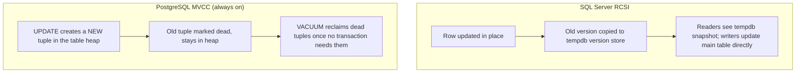
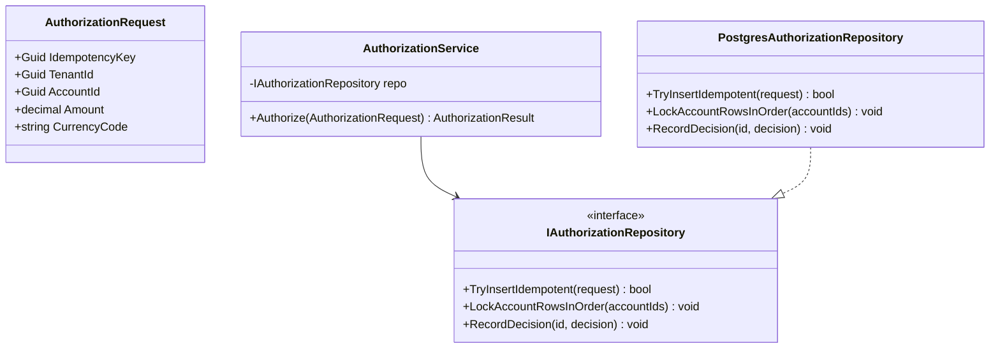
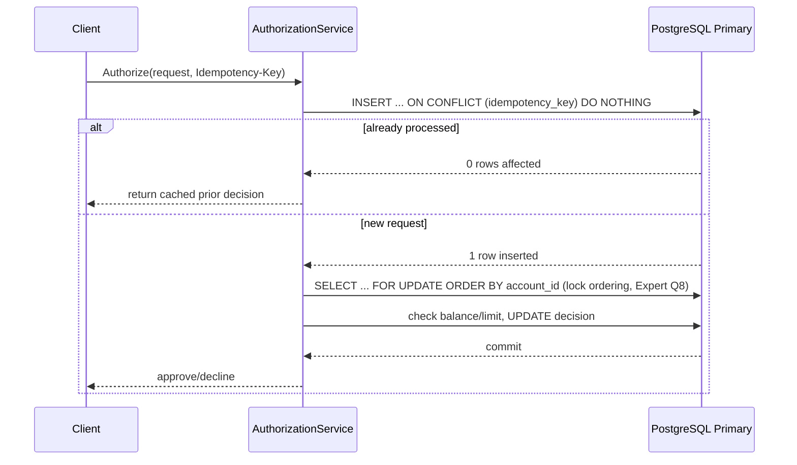

# Module 21 — PostgreSQL: Fundamentals, MVCC & Comparison with SQL Server

> Domain: PostgreSQL | Level: Beginner → Expert | Prerequisite: [[../04-SQL-Server/02-Transactions-Isolation-Locking]] (isolation levels, locking), [[../04-SQL-Server/01-Indexing-Query-Execution-Plans]]

---

## 1. Topic Description

### Definition

PostgreSQL implements MVCC by storing **row versions in the table itself**: an update writes a new tuple and marks the previous one dead, with visibility decided by transaction IDs (`xmin`/`xmax`) stamped on each tuple. SQL Server, by contrast, copies prior versions into `tempdb`. That single difference generates most of PostgreSQL's distinctive operational surface — dead tuples, **bloat**, **vacuum**, and **transaction ID wraparound** — none of which has a SQL Server equivalent. The other structural divergence is storage: PostgreSQL tables are always **heaps** with a `ctid` row locator and no clustered index, so physical ordering is never maintained and index-only scans depend on the visibility map.

### Core sub-concepts

- **In-table MVCC** — tuple versions, `xmin`/`xmax`, dead tuples, and readers never blocking writers by default.
- **Vacuum and autovacuum** — reclaiming dead-tuple space, updating the visibility map, freezing transaction IDs; `VACUUM` versus `VACUUM FULL`.
- **The vacuum horizon** — long-running transactions, idle-in-transaction sessions, abandoned replication slots and prepared transactions holding back cleanup database-wide.
- **Transaction ID wraparound** — the finite 32-bit XID space, freezing, and the forced shutdown that protects against it.
- **Bloat** — live bytes flat while table and index size grow; per-table autovacuum tuning (scale factor, cost limit, workers).
- **Heap storage and the absence of a clustered index** — `ctid`, `CLUSTER` as a one-time reorder, and what replaces clustering-key design.
- **HOT updates and `fillfactor`** — same-page updates that skip index maintenance, and why updating an indexed column is disproportionately expensive.
- **Index types** — B-tree, GIN (arrays, `jsonb`, full-text), GiST (geometric, range, nearest-neighbour), BRIN (block summaries for naturally-ordered large tables), hash.
- **Index maintenance** — index bloat, `REINDEX CONCURRENTLY`, `CREATE INDEX CONCURRENTLY` and its invalid-index failure mode.
- **Transactional DDL** — atomic multi-statement migrations, and the operations that cannot participate.
- **Migration lock behaviour** — `ALTER TABLE` lock levels, `NOT VALID` then `VALIDATE`, lock queuing behind long-running queries, `lock_timeout`.
- **SSI `SERIALIZABLE`** — serialization failures and mandatory application retry, versus SQL Server's blocking key-range locks.
- **`INSERT ... ON CONFLICT`** — atomic, concurrency-safe upsert requiring a unique constraint.
- **Process-per-connection and pooling** — connection cost, PgBouncer, and what transaction-mode pooling breaks.
- **`jsonb`** — binary JSON with GIN indexing, and the boundary between genuine schema flexibility and avoided schema design.
- **Visible-tuple counting** — why `COUNT(*)` cannot be answered from metadata.
- **Diagnostics** — `EXPLAIN (ANALYZE, BUFFERS)`, `pg_stat_statements`, `pg_stat_activity`, `pg_locks`.

### Where it fits

This is the engine layer beneath the application's data access, and the comparative frame matters because engineers moving from SQL Server carry assumptions that are silently wrong here. It connects downward to storage and connection management, and upward to schema-migration safety, replica routing and multi-tenancy strategy. It also expands architectural options: extensions such as PostGIS, `pgvector` and TimescaleDB can remove entire systems from an architecture, at the cost of checking availability on managed platforms.

### Why it matters at scale

Neglected vacuum is the failure mode that takes PostgreSQL databases fully offline. Bloat grows quietly — a table five times its live size means every query reads five times the pages for the same rows, so performance degrades with no plan change and no code change. If freezing falls far enough behind, the database refuses new transactions outright to prevent wraparound corruption, which is a total outage requiring maintenance to resolve. One forgotten `idle in transaction` session or one replication slot for a decommissioned replica is sufficient to cause both, database-wide. Separately, because each connection is an OS process, an autoscaling application that opens connections liberally exhausts the server's limit and presents as complete unavailability rather than gradual slowdown.

### Common pitfalls / anti-patterns

- **Treating autovacuum as optional housekeeping** — it is the mechanism that reclaims space *and* prevents wraparound; leaving default thresholds on a large high-churn table means it effectively never runs in time.
- **Long-running transactions or `idle in transaction` sessions** — they hold back the vacuum horizon, so dead tuples across the whole database cannot be reclaimed no matter how well autovacuum is tuned.
- **An abandoned replication slot** — retains WAL and pins the horizon indefinitely; a decommissioned replica silently bloats the primary and fills its disk.
- **Porting SQL Server's `SERIALIZABLE` usage without retry logic** — PostgreSQL aborts with a serialization failure instead of blocking, so the ported code simply errors under concurrency.
- **Expecting clustered-index physical ordering** — `CLUSTER` is a one-time reorder that is not maintained, so designs relying on a clustering key do not transfer.
- **Opening connections without a pooler** — each is a process; hundreds consume substantial memory and thousands destabilise the server.
- **`CREATE INDEX` without `CONCURRENTLY` on a live table** — takes a lock that blocks writes for the duration of the build.
- **A migration statement queued behind a long-running query** — the pending `ALTER TABLE` lock blocks every subsequent query on that table, so a "fast" migration causes an outage; `lock_timeout` plus retry is the mitigation.
- **Using `jsonb` for core queried business attributes** — forfeits type checking, constraints, foreign keys and efficient targeted indexes, and pushes structural validation into every consumer.
- **`COUNT(*)` in pagination code** — visibility is per-tuple, so there is no maintained row count; this scans.

> Scope note: partitioning, replication topologies, logical decoding and CDC belong to `02-Partitioning-Replication-Logical-Decoding`. SQL Server's own indexing, isolation and query-tuning material lives in `04-SQL-Server`.

---

## 2. Beginner (10 Q&A)


**Q1. How does PostgreSQL's MVCC differ from SQL Server's, and why does the difference matter?**
**A:** PostgreSQL keeps old row versions *in the table itself*: an update writes a new tuple and marks the old one as dead, with visibility determined by transaction IDs stored on each tuple. SQL Server's snapshot isolation instead copies old versions into `tempdb`. The consequence is that in PostgreSQL, updates and deletes generate garbage in the heap that must be reclaimed by vacuum, so tables and indexes bloat if vacuum cannot keep up — an entire operational concern that has no SQL Server equivalent. It also means readers never block writers by default, without opting into anything.
*Follow-up: What happens to the index entries when a row is updated?*

**Q2. What does `VACUUM` actually do, and why is autovacuum critical?**
**A:** It marks space occupied by dead tuples as reusable, updates the visibility map so index-only scans become possible, and — crucially — advances the frozen transaction ID horizon to prevent wraparound. Autovacuum runs it automatically based on change thresholds. It is critical because without it, tables grow indefinitely with dead rows, queries read more pages for the same live data, indexes bloat, and eventually the database enters a forced shutdown to prevent transaction ID wraparound corruption. Treating it as background housekeeping rather than as a core mechanism is the most common PostgreSQL operational mistake.
*Follow-up: What's the difference between `VACUUM` and `VACUUM FULL`, and when would you ever run the latter?*

**Q3. Why is there no clustered index in PostgreSQL, and what follows from that?**
**A:** All tables are heaps; the primary key is an ordinary B-tree index containing a pointer (`ctid`) to the heap tuple. So there is no equivalent of SQL Server's guarantee that data is physically ordered by a key, and every index lookup is followed by a heap fetch unless an index-only scan is possible. `CLUSTER` reorders a table by an index once, but the ordering is not maintained as rows change. Practically this means the SQL Server habit of designing around the clustering key does not transfer, and covering indexes plus a well-maintained visibility map matter more.
*Follow-up: What conditions must hold for an index-only scan to actually avoid heap access?*

**Q4. What is a HOT update and why should you care?**
**A:** A heap-only-tuple update places the new row version on the same page as the old one and avoids updating the indexes, provided no indexed column changed and there is free space on the page. It is much cheaper — no index writes, and the dead tuple can be cleaned up by page-level pruning rather than a full vacuum. You care because it is why updating an indexed column is disproportionately expensive, and why `fillfactor` below 100 on an update-heavy table can materially improve write performance by leaving room for HOT updates.
*Follow-up: How would you tell whether your updates are actually going down the HOT path?*

**Q5. What are the main index types and when is each right?**
**A:** B-tree is the default and right for equality and range on scalar values. GIN suits values containing many elements you search *within* — arrays, `jsonb`, full-text vectors — with fast lookups and slower writes. GiST supports geometric, range and nearest-neighbour queries. BRIN stores per-block summaries and is tiny, excellent for very large tables where data is naturally correlated with physical order such as an append-only time series. Hash indexes are narrow-purpose and rarely worth choosing over B-tree. The richness here is a genuine PostgreSQL advantage over SQL Server, and knowing which to reach for is the differentiator.
*Follow-up: When is a BRIN index worse than useless?*

**Q6. What does transactional DDL give you?**
**A:** Schema changes participate in transactions, so you can wrap a multi-statement migration in a transaction and have it roll back atomically if any step fails — no half-applied migration to clean up by hand. That is a significant operational advantage over SQL Server for deployment safety. The caveats are that some operations cannot run inside a transaction (notably `CREATE INDEX CONCURRENTLY`), and that a long DDL transaction holds locks that block everything touching the object, so atomicity does not remove the need to think about lock duration.
*Follow-up: You need to add an index without downtime. What do you use, and what's the trade-off?*

**Q7. How does PostgreSQL's `SERIALIZABLE` differ from SQL Server's?**
**A:** SQL Server implements it with range locks, so conflicting transactions *block*. PostgreSQL uses Serializable Snapshot Isolation, which detects dangerous dependency patterns and *aborts* one transaction with a serialization failure rather than blocking. The practical implication is significant: on PostgreSQL, `SERIALIZABLE` requires the application to catch the error and retry the whole transaction, and code ported from SQL Server without that retry logic will simply fail under concurrency. In exchange, you get much better concurrency because nothing waits.
*Follow-up: What does the application have to guarantee for a retry to be safe?*

**Q8. Why is `COUNT(*)` on a large table expensive?**
**A:** Because visibility is per-tuple, so PostgreSQL cannot trust a stored row count — it must check each tuple's visibility to your transaction, which means scanning the table or an index. There is no maintained row-count metadata as in SQL Server. For approximate answers, `pg_class.reltuples` is cheap and usually good enough; for exact ones on large tables, a maintained counter or a materialised aggregate is the practical answer. Engineers coming from SQL Server frequently write `COUNT(*)` into pagination code and discover this at scale.
*Follow-up: How would you implement an approximate but reasonably fresh row count for a dashboard?*

**Q9. Why does PostgreSQL need a connection pooler?**
**A:** Each connection is a separate OS process with its own memory, so connections are expensive — hundreds of them consume substantial memory and context-switching, and thousands will destabilise the server. Unlike SQL Server's thread-based model, you cannot simply open connections liberally. A pooler such as PgBouncer multiplexes many client connections onto a small number of server connections, which is close to mandatory for any application with a large number of application instances. The pooling mode matters: transaction pooling gives the best reuse but breaks session-level features such as prepared statements and advisory locks.
*Follow-up: Your ORM uses session-level prepared statements and you're on transaction pooling. What breaks?*

**Q10. What is `jsonb` good for, and where is it misused?**
**A:** It stores JSON in a binary form with indexing support, which is genuinely useful for sparse or genuinely variable attributes, for storing an external payload verbatim, and for evolving schemas where the shape is not yet known. It is misused as a way to avoid schema design — putting core, queried, constrained business attributes into a document because it feels flexible. That costs you type checking, foreign keys, efficient targeted indexes, and query clarity, and it makes every consumer parse structure the database could have enforced. The rule I apply is that anything you filter, join or constrain on belongs in a column.
*Follow-up: How would you index a `jsonb` column for a specific frequently-queried key?*

---

## 3. Intermediate (10 Q&A)


**Q1. A table's disk usage is five times its live data and queries have slowed. Diagnose it.**
**A:** Bloat from dead tuples that vacuum has not reclaimed. The usual causes are autovacuum being unable to keep up with a high update rate, autovacuum settings tuned too conservatively for the table's churn, or — most commonly — something holding back the vacuum horizon: a long-running transaction, an idle-in-transaction session, an abandoned replication slot, or a prepared transaction left behind. Vacuum cannot remove tuples that might still be visible to an old transaction, so one forgotten session can block cleanup database-wide. I would check the oldest transaction age first, since that single query usually identifies the cause.
*Follow-up: You find a replication slot for a decommissioned replica. What has been happening?*

**Q2. What is transaction ID wraparound and how do you avoid meeting it?**
**A:** Transaction IDs are a finite 32-bit space, and visibility is determined by comparing them, so old tuples must be "frozen" before the counter wraps and old data appears to be from the future. Autovacuum performs this freezing; if it cannot keep up, PostgreSQL first warns and eventually refuses new transactions to protect the data. Avoiding it means keeping autovacuum healthy — enough workers, appropriate thresholds, and no long-lived transactions holding back the horizon — and monitoring the age of the oldest unfrozen transaction as a first-class alert. It is the failure mode most likely to cause a full outage on a neglected PostgreSQL database.
*Follow-up: What would you alert on, and at what threshold?*

**Q3. How do you tune autovacuum for a high-churn table?**
**A:** Set per-table settings rather than changing the global defaults, since one hot table's needs should not reshape the whole cluster: lower the scale factor so vacuum triggers on a smaller proportion of changes, raise the cost limit so it does more work per cycle, and ensure enough autovacuum workers exist that a large table does not starve the others. On very large tables the default scale factor means vacuum triggers only after enormous accumulation, which is the common misconfiguration. I would monitor last-vacuum time and dead-tuple counts per table to verify the settings are actually working rather than assuming.
*Follow-up: Autovacuum keeps getting cancelled on this table. Why, and what do you do?*

**Q4. How do you read a PostgreSQL execution plan, and what differs from SQL Server?**
**A:** `EXPLAIN (ANALYZE, BUFFERS)` gives you actual versus estimated rows, actual timing per node, and — importantly — buffer counts, which are the equivalent of logical reads and the right measure of work. The comparison to make is the same as in SQL Server: find the node with the largest estimate-versus-actual discrepancy. What differs is the vocabulary and some operator behaviour, plus the presence of vacuum-related effects: a plan can be slow purely because bloat means more pages hold the same rows. Loops counts also matter, since a node's reported time is per-loop.
*Follow-up: A node shows `actual rows=1 loops=50000`. What's the real cost?*

**Q5. When would you choose `INSERT ... ON CONFLICT` over other upsert approaches?**
**A:** Almost always, for single-row or small-batch upserts: it is atomic, concurrency-safe, and expresses intent directly, without the race conditions that a read-then-write or a `MERGE` can have. It requires a unique constraint or index to conflict against, which is a healthy forcing function since the invariant becomes a database guarantee. For large-scale merges of many rows, a staging table plus set-based `INSERT`/`UPDATE` is usually more efficient. Coming from SQL Server, this is one of the places where the PostgreSQL idiom is genuinely simpler and safer than `MERGE`.
*Follow-up: Two concurrent inserts with the same key — walk me through what each session experiences.*

**Q6. How does index maintenance differ, and what is `REINDEX CONCURRENTLY` for?**
**A:** Indexes bloat too, since dead index entries accumulate alongside dead tuples, and a heavily-updated index can grow well beyond its useful size. `REINDEX` rebuilds it but takes a lock that blocks writes; `REINDEX CONCURRENTLY` builds a replacement alongside and swaps it, avoiding the outage at the cost of more time, more disk, and the possibility of leaving an invalid index behind if it fails. `CREATE INDEX CONCURRENTLY` is the equivalent for new indexes and cannot run inside a transaction. Knowing the concurrent variants exist is what separates a safe production change from a self-inflicted outage.
*Follow-up: `CREATE INDEX CONCURRENTLY` fails partway. What state are you in and what do you do?*

**Q7. How do you decide between a normalised column and a `jsonb` attribute?**
**A:** By whether the attribute participates in the relational model. If you filter, sort, join, constrain or aggregate on it, it belongs in a column where the type system, constraints and B-tree indexes work properly. `jsonb` earns its place for genuinely sparse attributes across heterogeneous entities, for verbatim external payloads you must retain, and for shapes that vary per tenant or per integration. The failure I would guard against is a core entity whose important fields live in a document, which produces slow queries, no referential integrity, and application code doing the database's job.
*Follow-up: A tenant-specific custom-fields feature — columns, `jsonb`, or an EAV table?*

**Q8. What operational differences bite when migrating from SQL Server to PostgreSQL?**
**A:** Vacuum and bloat as an ongoing concern with no SQL Server equivalent; connection management requiring a pooler; `SERIALIZABLE` aborting instead of blocking, so retry logic becomes mandatory; case sensitivity and identifier folding differences that break ported queries subtly; different `NULL` and collation behaviour in sorting and comparison; no clustered index so physical ordering assumptions fail; and different tooling for backup, monitoring and high availability that the operations team must learn. The technical translation of schema and queries is usually the easy part; the operational model is what teams underestimate.
*Follow-up: Which of those would you address first in a migration plan, and why?*

**Q9. How do you handle schema migrations safely on a live PostgreSQL database?**
**A:** By knowing which operations take which locks and for how long. Adding a nullable column without a default is instant in modern versions; adding a `NOT NULL` column with a default is fast in recent versions but was a full rewrite in older ones; adding a check constraint or foreign key can be done in two steps with `NOT VALID` then `VALIDATE` to avoid a long exclusive lock. Index creation must be `CONCURRENTLY`. The most important practical detail is lock queuing: a migration waiting for a lock blocks every subsequent query on that table, so a short statement behind a long-running query becomes an outage — which is why `lock_timeout` and retry are essential in migration tooling.
*Follow-up: Your `ALTER TABLE` is waiting behind a long-running report. What actually happens to incoming traffic?*

**Q10. When would you choose PostgreSQL over SQL Server for a new system, or vice versa?**
**A:** PostgreSQL for cost (no licensing), for its extension ecosystem where `PostGIS`, `pgvector`, `TimescaleDB` or full-text search remove the need for a separate system, for rich types including `jsonb` and arrays, and for cloud portability. SQL Server where the organisation already has the licences, the operational expertise and the tooling; where deep .NET and Windows integration matters; or where specific features such as Always On availability groups fit the existing operational model. The decisive factor in practice is rarely the engine's capability and usually the team's ability to operate it well — an engine your team can tune and recover beats a marginally better one they cannot.
*Follow-up: The team knows SQL Server well but the licensing cost is now material. How do you frame the decision?*

---

## 4. Expert / Architect (10 Q&A)


**Q1. How would you plan a migration of a large production system from SQL Server to PostgreSQL?**
**A:** In phases, with the operational model tackled first rather than last. Assess incompatibilities early — T-SQL-specific constructs, stored procedures, identity and sequence behaviour, collation and case sensitivity, and any feature with no direct equivalent — because those determine the true scope. Then build the target with realistic data volume, run the workload against it, and compare behaviour rather than assuming translation preserves performance. For cutover, dual-write or CDC-based replication with a period of parallel running and comparison gives a reversible path; a big-bang cutover on a large system rarely survives contact with reality. And the operations team needs to be running PostgreSQL competently — backup, restore, failover, vacuum tuning — before it holds production data, not after.
*Follow-up: The application has 300 stored procedures. How do you decide what to port versus rewrite?*

**Q2. How do you set the operational baseline for PostgreSQL in an organisation new to it?**
**A:** Monitoring and alerting on the things that actually cause PostgreSQL outages: transaction ID age, bloat per table, autovacuum activity and cancellations, long-running and idle-in-transaction sessions, replication lag and slot retention, and connection counts against limits. Then standard configuration — a pooler in front of every database, per-table autovacuum settings for high-churn tables, `lock_timeout` and `statement_timeout` defaults so a runaway query cannot hold locks indefinitely, and tested backup and restore. I would treat "restore has been tested this quarter" as a hard requirement, since an untested backup is a belief rather than a capability.
*Follow-up: Which single alert would you add first if you could only have one?*

**Q3. How does the extension ecosystem change architectural decisions?**
**A:** It can remove entire systems from your architecture: `PostGIS` for geospatial, `pgvector` for embedding search, `TimescaleDB` for time series, full-text search built in, and `pg_partman` for partition management. Each one you can use inside the transactional database means one fewer system to operate, one fewer consistency boundary, and one fewer failure mode. The counterweight is that a general-purpose engine will not match a specialist at extreme scale, and managed cloud services often restrict which extensions are available — which is a real constraint to check before designing around one. My default is to use the extension until measured scale demands a specialist, because the operational simplicity is worth a lot.
*Follow-up: At what point would you move vector search out of `pgvector` into a dedicated store?*

**Q4. How do you design for high write throughput given the MVCC and vacuum model?**
**A:** Minimise the garbage you create: prefer inserts over updates where the model allows (append-only with a current-view projection), avoid updating indexed columns so HOT updates apply, set `fillfactor` to leave room on pages, and partition high-churn data so vacuum works on smaller units and old partitions can be dropped rather than deleted. Bulk deletes are particularly damaging because they create enormous dead-tuple volumes at once — partition-drop is dramatically cheaper. I would also size autovacuum deliberately for the write rate rather than leaving defaults, because the default settings assume a much gentler workload than a high-throughput system produces.
*Follow-up: A table receives 50 million deletes a month. How would you model it instead?*

**Q5. How do you handle multi-tenancy in PostgreSQL?**
**A:** Three models, chosen by tenant count and isolation requirements: a shared schema with a tenant column plus row-level security, a schema per tenant, or a database per tenant. Shared-schema scales to many tenants and is operationally simplest, with RLS providing enforcement below the application so a missed filter is not a breach — which is a genuine PostgreSQL advantage worth using. Schema-per-tenant gives cleaner isolation and easier per-tenant operations but degrades as the object count grows into the tens of thousands, affecting catalog performance and migrations. Database-per-tenant gives the strongest isolation and the worst operational scaling. I would default to shared-schema with RLS and isolate individual large or regulated tenants as exceptions.
*Follow-up: With 5,000 tenants on shared schema, one tenant's report is degrading everyone. What's your response?*

**Q6. How would you approach connection management for a large microservices estate?**
**A:** Centralised pooling is essential, and the design question is where it sits: a pooler per application instance limits blast radius but multiplies the total server connections, while a shared pooler tier gives the best multiplexing but becomes critical infrastructure needing its own HA. I would generally run a pooler tier with transaction-mode pooling, having first verified that no service depends on session-level features it would break. The organisational constraint to enforce is a per-service connection budget, because without one, autoscaling application instances will happily exhaust the database's connection limit — and that failure presents as total unavailability rather than as gradual degradation.
*Follow-up: A service scales to 200 instances during a spike and the database refuses connections. What do you change?*

**Q7. What's your view on using PostgreSQL for workloads it is not classically suited to — queues, caching, search, analytics?**
**A:** Favourable up to a point, because avoiding an extra system has real operational and consistency value, and PostgreSQL is genuinely capable at each: `SKIP LOCKED` makes it a reasonable queue, full-text search is decent, and columnar extensions handle moderate analytics. The point at which it stops being right is when the workload's characteristics start damaging the primary transactional job — a queue table generating bloat that starves vacuum, analytical scans evicting the buffer cache, or search indexes dominating write cost. My guidance is to start in PostgreSQL, instrument the interference, and move a workload out when it is measurably harming the others rather than on principle.
*Follow-up: What specific metric would tell you the queue workload is now harming OLTP?*

**Q8. How do you approach performance troubleshooting differently on PostgreSQL than on SQL Server?**
**A:** The additional dimension is always bloat and vacuum: a query that has degraded without a plan change is frequently reading more pages for the same rows, which has no SQL Server analogue. So the diagnostic sequence starts with table and index bloat and the vacuum horizon before moving to plans and statistics. Beyond that, `pg_stat_statements` for workload-level ranking replaces the plan-cache DMVs, `EXPLAIN (ANALYZE, BUFFERS)` replaces the actual plan, and lock diagnosis uses `pg_locks` and `pg_stat_activity`. The other habit to change is that a long-running read is *not* harmless here, because it holds back cleanup for the whole database.
*Follow-up: A read-only analytics session runs for six hours nightly. What damage might it be doing?*

**Q9. How do you evaluate managed PostgreSQL services versus self-managed?**
**A:** Managed removes backup, patching, failover and much of the availability engineering, which is most of the operational cost for most organisations — that is usually decisive. The constraints to check before committing are which extensions are available, whether superuser-requiring operations you need are permitted, what the failover behaviour and RTO actually are (tested, not documented), whether logical replication out is supported for future migration, and the cost model at your I/O profile. Self-managed makes sense at scale where the cost delta is large and you have genuine expertise, or where a required extension is unavailable. I would treat lock-in through unavailable logical replication as a specific risk to check, since it determines whether the decision is reversible.
*Follow-up: The managed service doesn't support an extension you need. What are the options?*

**Q10. What would tell you an organisation is running PostgreSQL well rather than just running it?**
**A:** Whether they monitor and act on the PostgreSQL-specific signals — transaction age, bloat, autovacuum effectiveness, replication slot retention, idle-in-transaction sessions — rather than only CPU and disk. Whether per-table autovacuum tuning exists for their hot tables. Whether migrations use the concurrent variants and lock timeouts. Whether restores are tested. And whether the application handles serialization failures and retries correctly. A team that only monitors generic infrastructure metrics is running PostgreSQL on borrowed time: it will work fine until the day it stops entirely, and the failure will be one of the specific mechanisms they were not watching.
*Follow-up: You join a team with none of that in place and a production database. What's your first week?*

---

## 5. Reference Material

> Retained from the original module: deep-dive internals, diagrams, production examples, exercises, system/low-level design, debugging walkthroughs and the Principal Engineer perspective.

### 1. Fundamentals

#### What is PostgreSQL, and how does its concurrency model fundamentally differ from SQL Server's?
PostgreSQL is an open-source, object-relational database with a fundamentally different **concurrency-control architecture** from SQL Server's default: PostgreSQL uses **MVCC (Multi-Version Concurrency Control) natively and universally** for every transaction — there is no "opt into row versioning" setting (RCSI) the way SQL Server has, because MVCC **is** how PostgreSQL always works, for every isolation level. This single architectural difference cascades into nearly every other practical distinction between the two engines.

#### Why does this matter?
Engineers moving between SQL Server and PostgreSQL (or designing a system to support both) frequently carry over locking-model assumptions that don't hold — PostgreSQL's default Read Committed behavior already provides much of what SQL Server needs RCSI specifically enabled to achieve, but PostgreSQL introduces its own distinctive operational concern (`VACUUM`) that SQL Server has no direct equivalent of.

#### When does this matter?
Any team choosing between the two engines, or migrating between them; the depth matters for correctly reasoning about concurrency behavior differences and for understanding `VACUUM`/bloat, PostgreSQL's most distinctive operational concept with no SQL Server analog.

#### How does it work (30,000-ft view)?
```sql
-- PostgreSQL: every UPDATE creates a NEW row version (a "tuple"), the old one marked dead but not
-- immediately removed -- MVCC is the ALWAYS-ON mechanism, not an opt-in setting.
UPDATE orders SET status = 'shipped' WHERE id = 123;
-- The old row version remains on disk until VACUUM reclaims it.
```

### 2. Deep Dive

#### 2.1 MVCC Implementation Differences — Tuple Versions vs Row Versioning in tempdb
SQL Server's Snapshot Isolation/RCSI stores **old row versions in tempdb**, separate from the main data files — the "current" row is still a single physical row updated in place, with old versions temporarily elsewhere. PostgreSQL's MVCC instead keeps **multiple physical tuple (row) versions directly in the table's own heap file** — an `UPDATE` doesn't modify a row in place at all; it inserts an entirely new tuple and marks the old one as expired (via transaction-ID-based visibility metadata, `xmin`/`xmax` system columns), leaving the dead tuple physically present in the table until cleaned up.

#### 2.2 `VACUUM` — the Concept with No SQL Server Equivalent
Because dead tuples accumulate directly in the table's heap, PostgreSQL requires **`VACUUM`** — a maintenance process reclaiming space from dead tuples once no active transaction could still need to see them (based on the oldest active transaction's snapshot). Without regular vacuuming (`autovacuum` runs this automatically by default, but can fall behind under heavy write load or misconfiguration), tables suffer **bloat** — accumulating dead tuples that inflate table/index size, degrade scan performance (more physical pages to read for the same logical data), and, in the extreme, risk **transaction ID wraparound** (PostgreSQL's transaction IDs are a finite 32-bit counter; if vacuuming falls far enough behind, the database can be forced into single-user, read-only emergency mode to prevent ID reuse from causing data corruption) — a genuinely severe, PostgreSQL-specific operational failure mode with no direct SQL Server analog.

#### 2.3 Isolation Levels — Where PostgreSQL and SQL Server Diverge
PostgreSQL's **Read Committed** (its default, same name as SQL Server's default) already behaves similarly to SQL Server's **RCSI** — readers never block writers and vice versa, since MVCC is always active — meaning PostgreSQL doesn't have SQL Server's specific "reporting query blocks OLTP writes" failure mode under its default configuration at all. PostgreSQL's **Repeatable Read** is stricter than SQL Server's same-named level — it prevents phantom reads too (closer to SQL Server's Serializable in practical effect for many workloads), and its **Serializable** uses a distinctive technique (**Serializable Snapshot Isolation**, SSI) detecting genuine serialization anomalies and aborting one transaction with a retryable error, rather than SQL Server's range-locking approach.

#### 2.4 Indexing Differences — Partial, Expression, and GIN/GiST Indexes
PostgreSQL supports several index types with no direct SQL Server equivalent (or a much more limited one): **partial indexes** (`CREATE INDEX... WHERE status = 'active'` — indexing only a subset of rows matching a condition, dramatically smaller and faster for queries that always filter on that condition); **expression indexes** (`CREATE INDEX ON orders (LOWER(email))` — directly solving the non-sargable-predicate problem by indexing the *transformed* value itself, rather than requiring the query to avoid the transformation); **GIN** (Generalized Inverted Index, ideal for full-text search and JSONB containment queries) and **GiST** (Generalized Search Tree, for geometric/range-type queries) indexes, supporting query patterns B+ trees fundamentally can't serve efficiently.

#### 2.5 `JSONB` — Native, Indexable Semi-Structured Data
PostgreSQL's `JSONB` type (binary-parsed, indexable JSON) lets a column hold semi-structured data queryable and indexable (via GIN) nearly as efficiently as a proper relational column — a genuinely distinctive PostgreSQL strength for hybrid relational/document workloads, with no equivalently mature native equivalent in SQL Server (which offers JSON functions operating on plain `nvarchar` text, without JSONB's binary storage/native indexing support).

### 3. Visual Architecture

```mermaid
graph TB
 subgraph "SQL Server RCSI"
 A[Row updated in place] --> B[Old version copied to tempdb version store]
 B --> C[Readers see tempdb snapshot; writers update main table directly]
 end
 subgraph "PostgreSQL MVCC (always on)"
 D[UPDATE creates a NEW tuple in the table heap] --> E[Old tuple marked dead, stays in heap]
 E --> F[VACUUM reclaims dead tuples once no transaction needs them]
 end
```

### 4. Production Example
**Scenario**: A team migrated a moderately write-heavy service from SQL Server (with RCSI enabled) to PostgreSQL, expecting equivalent behavior "since both use MVCC now" — after a few weeks in production, query performance degraded steadily, and table sizes grew far beyond expected data volume. **Investigation**: `autovacuum` was running, but its default cost-based throttling settings (tuned for a much lower write-volume workload than this service's actual traffic) meant it consistently fell behind the table's dead-tuple accumulation rate — `pg_stat_user_tables`'s `n_dead_tup` showed dead-tuple counts far exceeding live rows for the hottest tables. **Fix**: tuned `autovacuum_vacuum_cost_limit`/`autovacuum_naptime` more aggressively for the specific high-churn tables (via per-table `ALTER TABLE... SET (autovacuum_vacuum_scale_factor =...)` overrides), and ran a one-time manual `VACUUM (VERBOSE, ANALYZE)` to catch up the existing backlog. **Lesson**: "PostgreSQL uses MVCC just like SQL Server's RCSI" is true for concurrency-model *behavior* but conceals a genuinely distinctive PostgreSQL-specific operational responsibility (vacuum tuning) that SQL Server's tempdb-based version store simply doesn't require in the same way — assuming full behavioral equivalence between the two engines' MVCC implementations is a real, demonstrated migration risk.

### 11. Coding Exercises

#### Easy — Expression index solving a non-sargable predicate
```sql
-- Query: SELECT * FROM users WHERE LOWER(email) = 'alice@example.com';
CREATE INDEX idx_users_email_lower ON users (LOWER(email));
-- The predicate now uses the index directly -- no query rewrite needed, unlike the typical
-- SQL Server fix of avoiding the function wrapper entirely.
```

#### Medium — Partial index for a highly selective, frequently-filtered condition
```sql
-- Most queries filter WHERE status = 'active', and active rows are a small fraction of the table.
CREATE INDEX idx_orders_active ON orders (customer_id) WHERE status = 'active';
-- Smaller, faster index than indexing customer_id across ALL rows regardless of status.
```

#### Hard — Row-Level Security multi-tenant policy (Advanced Q8)
```sql
ALTER TABLE invoices ENABLE ROW LEVEL SECURITY;

CREATE POLICY tenant_isolation_select ON invoices FOR SELECT
 USING (tenant_id = current_setting('app.current_tenant_id')::uuid);

CREATE POLICY tenant_isolation_modify ON invoices FOR ALL
 USING (tenant_id = current_setting('app.current_tenant_id')::uuid)
 WITH CHECK (tenant_id = current_setting('app.current_tenant_id')::uuid);
-- WITH CHECK additionally prevents an INSERT/UPDATE from setting a DIFFERENT tenant_id
-- than the current session's -- closing the write-side equivalent of the read-side USING clause.
```

#### Expert — Autovacuum per-table tuning for a high-churn table (the fix)
```sql
ALTER TABLE orders SET (
 autovacuum_vacuum_scale_factor = 0.02, -- trigger vacuum at 2% dead tuples instead of the 20% default
 autovacuum_vacuum_cost_limit = 2000 -- allow more I/O throughput per vacuum cycle for this specific table
);

-- One-time catch-up for existing backlog:
VACUUM (VERBOSE, ANALYZE) orders;
```
**Discussion**: Lowering `autovacuum_vacuum_scale_factor` specifically for this one high-churn table (rather than globally) means autovacuum triggers proportionally more often for it without affecting the vacuum cadence of every other, lower-churn table in the database — a targeted fix matching Advanced Q9's guidance to tune the specific hot table's own settings rather than a blanket, database-wide change.

### 12. System Design

**Scenario:** Design the core PostgreSQL data layer for a multi-tenant payments-authorization platform (think a card-issuing processor's real-time authorization service) migrating off SQL Server, expected to handle 2,000 authorization requests/second sustained, with regulatory requirements for point-in-time auditability and strict per-tenant data isolation.

**Functional requirements:** Authorize/decline a card transaction against a live balance/limit check; record every authorization attempt immutably; support per-tenant (issuing-bank) data isolation; support 30-day point-in-time restorability for audit (Expert Q9).

**Non-functional requirements:** p99 authorization-decision latency under 150ms; zero committed-authorization data loss on primary failure (informs the synchronous-replication trade-off, Module 22 §2.3); horizontal read-scaling for a separate, high-volume reporting workload without impacting authorization-path latency.

**Back-of-the-envelope estimation:** 2,000 TPS sustained authorization writes, each a small row (~200 bytes) plus one `JSONB` audit-detail column (~1KB average) → roughly 2,400 KB/s of new tuple data, before WAL amplification (MVCC writes both the heap tuple and a WAL record for it, roughly doubling the physical write volume for the same logical change, §7). At this churn rate, the authorization table's dead-tuple generation rate is exactly the kind of workload the Production Example's vacuum-tuning incident describes — the numbers tell us this table needs proactive, tuned `autovacuum`, not default settings, from day one, not discovered reactively.

**Architecture:** A single, vertically-scaled primary (write-authoritative, since authorization decisions require a strongly-consistent, immediately-visible balance check — an eventually-consistent read here risks a double-authorization) with synchronous replication to one standby in a separate availability zone (Module 22 §2.3, sized against the zero-committed-loss requirement) plus one or more asynchronous read replicas serving the reporting workload, isolated from authorization-path latency entirely.

**Components:** `authorizations` table (range-partitioned by day, Module 22 §2.1, for efficient archival and per-partition vacuum); Row-Level Security policies scoping every query to the requesting tenant (§8, §10 Advanced Q8); pgbouncer in transaction pooling mode in front of the authorization service's connection-heavy request pattern (§7), with prepared-statement usage audited against pooling mode per Expert Q4; WAL archiving to immutable object storage for PITR (Expert Q9).

**Database selection:** PostgreSQL over SQL Server here specifically for `JSONB`'s native indexable storage of variable-shape authorization-detail payloads (§2.5) and RLS as a database-enforced tenant-isolation layer (§8) — both directly informing this migration's design, not incidental choices.

**Caching:** A short-TTL, per-account balance/limit cache (Redis) in front of the authorization hot path reduces read load on the primary for the common case, with the primary remaining the strongly-consistent source of truth for the actual authorize/decline decision — cache is an optimization for the read, never the decision itself.

**Messaging:** Post-authorization events (approved/declined) published via an outbox table (§10 Advanced Q2's `FOR UPDATE SKIP LOCKED` pattern) to downstream fraud-scoring and notification consumers, avoiding the dual-write problem between the authorization commit and the event publish.

**Scaling:** Read replicas absorb reporting load; range partitioning bounds per-partition vacuum/index-maintenance cost as the table grows; `Citus` sharding (§9) is deliberately deferred unless the single primary's vertical write ceiling becomes a demonstrated constraint, not adopted preemptively.

**Failure handling:** Synchronous-replica unavailability blocks primary commits under strict `synchronous_commit`, a deliberate consistency-over-availability choice for authorization data (mirroring Module 22 Expert Q1's ledger DR posture) — mitigated via quorum-based `ANY 1 (...)` synchronous-standby configuration (Module 22 Advanced Q3) rather than a single named standby.

**Monitoring:** Dead-tuple ratio per table (Production Example), replication lag on both the synchronous standby and async read replicas, pgbouncer pool saturation, and authorization-path p99 latency as the primary business-facing SLO.

**Trade-offs:** Strong consistency (synchronous replication, single-writer authorization) is chosen over multi-region write availability, because a lost or duplicated authorization decision is a worse business outcome than added commit latency — the same reasoning Module 22's ledger DR design applies, now at the schema/system-design level rather than only the replication-configuration level.

### 13. Low-Level Design

**Requirements:** Model an authorization request/decision atomically and idempotently; enforce per-tenant isolation at the data layer; avoid lock-ordering deadlocks (Expert Q8) when a single authorization touches both a balance row and a limit-counter row.

**Class diagram:**

```mermaid
classDiagram
 class AuthorizationRequest {
 +Guid IdempotencyKey
 +Guid TenantId
 +Guid AccountId
 +decimal Amount
 +string CurrencyCode
 }
 class AuthorizationService {
 -IAuthorizationRepository repo
 +Authorize(AuthorizationRequest) AuthorizationResult
 }
 class IAuthorizationRepository {
 <<interface>>
 +TryInsertIdempotent(request) bool
 +LockAccountRowsInOrder(accountIds) void
 +RecordDecision(id, decision) void
 }
 class PostgresAuthorizationRepository {
 +TryInsertIdempotent(request) bool
 +LockAccountRowsInOrder(accountIds) void
 +RecordDecision(id, decision) void
 }
 AuthorizationService --> IAuthorizationRepository
 PostgresAuthorizationRepository ..|> IAuthorizationRepository
```

**Sequence diagram:**

```mermaid
sequenceDiagram
 participant Client
 participant Svc as AuthorizationService
 participant DB as PostgreSQL Primary

 Client->>Svc: Authorize(request, Idempotency-Key)
 Svc->>DB: INSERT ... ON CONFLICT (idempotency_key) DO NOTHING
 alt already processed
 DB-->>Svc: 0 rows affected
 Svc-->>Client: return cached prior decision
 else new request
 DB-->>Svc: 1 row inserted
 Svc->>DB: SELECT ... FOR UPDATE ORDER BY account_id (lock ordering, Expert Q8)
 Svc->>DB: check balance/limit, UPDATE decision
 DB-->>Svc: commit
 Svc-->>Client: approve/decline
 end
```

**Design patterns used:** Repository (isolates SQL/RLS-session-variable concerns behind `IAuthorizationRepository`); Idempotent-Receiver (the `ON CONFLICT DO NOTHING` unique-key insert, the database-native realization of the idempotency-key discipline named in Module 22 Expert Q1's ledger framing); Unit of Work (the whole authorization decision commits or rolls back as one transaction).

**SOLID mapping:** Single Responsibility (`AuthorizationService` orchestrates; `PostgresAuthorizationRepository` owns SQL/locking specifics); Open/Closed (a new persistence backend implements `IAuthorizationRepository` without changing `AuthorizationService`); Liskov (any `IAuthorizationRepository` implementation must genuinely honor the lock-ordering contract — a naive implementation that locks rows in request-arrival order rather than a canonical order would silently reintroduce Expert Q8's deadlock risk despite satisfying the interface's method signature); Interface Segregation (idempotent-insert, row-locking, and decision-recording are separable methods); Dependency Inversion (`AuthorizationService` depends on the abstraction, never on `Npgsql`/SQL directly).

**Concurrency/thread safety:** Idempotency is enforced by a unique constraint at the database layer (safe under arbitrary concurrent duplicate requests, not merely application-layer deduplication); lock ordering (always lock the lower `account_id` first, Expert Q8) is enforced inside `LockAccountRowsInOrder`, a single, audited chokepoint every code path touching multiple account rows must go through — not left to each caller to individually get right.

### 14. Production Debugging

**Incident:** Three weeks after the authorization platform (§12) went live, p99 authorization latency spiked from 80ms to 1.2 seconds during a daily peak-traffic window, correlating with a spike in `40P01` (deadlock) errors in the application logs — a distinct incident from, but downstream of, the same lock-ordering discipline Expert Q8 establishes.

**Root cause:** A new "linked-account limit pooling" feature had been added, where a single authorization could touch a *variable-length list* of linked account rows (a family/corporate card pooling arrangement), and the feature's implementation locked accounts in the order they appeared in the linked-account list returned by an upstream service — an order that was **not** canonically sorted, and in fact varied per request depending on that upstream service's own non-deterministic result ordering. Two concurrent authorizations against overlapping linked-account sets, each locking in a different order, produced exactly the circular-wait deadlock pattern Expert Q8 describes structurally — except this time the discipline (canonical lock ordering) had been correctly applied to the *original* single-pair transfer code path and never re-applied when the linked-account feature introduced a new, variable-cardinality locking pattern.

**Investigation:** `pg_stat_activity` joined against `pg_locks` during the incident window showed multiple backends blocked waiting on `RowExclusiveLock` for overlapping sets of account rows; PostgreSQL's server log (deadlock detail logged automatically, §10 Expert Q8) confirmed the specific query pattern — the linked-account authorization path — as the consistent source of every deadlock in the window, not the original single-account authorization path.

**Tools:** `pg_locks`/`pg_stat_activity` join query for real-time lock-wait visibility; server log deadlock detail for retrospective analysis; `pg_stat_statements` to confirm the linked-account query's `40P01` error count specifically, isolating it from background noise.

**Fix:** The linked-account authorization path was changed to sort the account-ID list canonically (`ORDER BY account_id`) immediately before the locking step, regardless of the order the upstream linked-account-resolution service returned — restoring the same "always lock in canonical order" invariant the original single-pair code path already honored. A code-review checklist item was added: any new code path acquiring locks on more than one row from the same table within a transaction must explicitly document and justify its lock-acquisition order.

**Prevention:** The checklist item generalizes Expert Q8's fix beyond the specific code path it was originally applied to — the recurring lesson (echoing the CRDT-composition and cross-field-invariant pattern this course documents elsewhere) is that a correctly-applied discipline on one code path provides no guarantee a *new* code path touching the same shared resource will inherit it; the discipline must be re-verified explicitly at every new multi-row-locking code path, not assumed to propagate automatically from the original fix.

### 15. Architecture Decision

**Context:** Choosing a connection-management strategy for the authorization platform's PostgreSQL primary under 2,000 TPS sustained load.

**Option A — Direct application-to-database connections (no pooler):** *Advantages:* No additional infrastructure component; full session-state fidelity (prepared statements, advisory locks behave exactly as documented, no Expert Q4/Q5-style surprises). *Disadvantages:* PostgreSQL's per-connection memory overhead and connection-establishment cost make thousands of concurrent application-instance connections directly against the primary both expensive and a real risk of exhausting `max_connections` under a traffic spike or a connection-leak bug. *Cost:* Low infrastructure cost, high risk cost. *Risk:* High — a connection-storm (e.g., a redeploy causing every application instance to reconnect simultaneously) can itself take the primary down.

**Option B — pgbouncer, session pooling mode:** *Advantages:* Full session-state fidelity preserved (no Expert Q4-style prepared-statement breakage); still reduces raw TCP/auth overhead versus direct connections. *Disadvantages:* Each logical client still holds a physical backend for its entire session's duration, so the connection-scaling benefit relative to Option A is modest — doesn't meaningfully reduce backend count under genuinely high concurrent-session volume. *Cost:* Low-moderate (one additional lightweight component). *Risk:* Low, but doesn't solve the actual scaling problem at 2,000 TPS.

**Option C — pgbouncer, transaction pooling mode, with session-scoped features explicitly audited:** *Advantages:* Genuine connection-scaling benefit — many logical sessions multiplexed onto a small, bounded pool of physical backends, directly addressing Option A's connection-storm risk. *Disadvantages:* Requires explicit auditing and adaptation of every session-scoped feature (prepared statements, advisory locks, `SET`-level GUCs) per Expert Q4/Q5 — a real, non-zero engineering cost, and a source of production incidents (Expert Q4) if skipped. *Cost:* Moderate (audit effort upfront) but low ongoing. *Risk:* Low, contingent on the audit being genuinely thorough and re-run whenever a new session-scoped feature is introduced.

**Recommendation: Option C**, specifically because the authorization platform's 2,000 TPS scale makes Option A's connection-storm risk unacceptable and Option B's marginal scaling benefit insufficient — but only paired with an explicit, standing audit (mirroring §14's checklist-generalization lesson) of every session-scoped feature against transaction-pooling semantics, re-run on every new feature addition, not performed once at initial pgbouncer adoption and assumed to remain valid.

### 17. Principal Engineer Perspective

**Business impact:** An authorization-path outage or elevated-latency incident directly blocks revenue-generating transactions in real time — unlike a reporting-pipeline delay, which degrades a downstream, non-blocking capability, the authorization path's failure modes (§14's deadlock incident, the original vacuum-bloat incident) have immediate, visible business cost, which is why this module's monitoring recommendations (§7, §12) treat dead-tuple ratio and lock-wait visibility as first-class, not secondary, operational signals.

**Engineering trade-offs:** The consistent thread across this module — MVCC's always-on tuple-versioning, RLS's engine-enforced isolation, synchronous replication's consistency-over-availability choice — is that PostgreSQL's defaults trade some operational complexity (vacuum tuning, replication-slot/lock-order discipline) for stronger baseline correctness guarantees than an engineer coming from SQL Server's more locking/tempdb-centric model might expect; a Principal Engineer's job in a migration is making these trades *explicit* in the design review, not letting them surface first as production incidents.

**Technical leadership:** §14's deadlock incident illustrates a durable leadership lesson: a correctly-applied discipline (canonical lock ordering) on one code path does not automatically propagate to a structurally similar but distinct new code path — technical leadership here means encoding the discipline as a reviewable, checkable rule (the checklist item) rather than trusting it to be independently rediscovered by whoever writes the next multi-row-locking feature.

**Cross-team communication:** The linked-account feature team (§14) built a structurally correct feature in isolation but didn't know to ask whether their new locking pattern needed the same discipline the original authorization-transfer code already had — surfacing exactly the kind of cross-team knowledge-transfer gap a Principal Engineer's design-review process exists to close, by making implicit invariants (canonical lock ordering) explicit, documented, and part of any new code's review checklist rather than tribal knowledge held only by the original implementers.

**Architecture governance:** Every table with meaningfully high write churn should have its `autovacuum` tuning, dead-tuple monitoring, and (where multi-row transactions touch it) documented lock-ordering convention recorded as part of its schema's own governance documentation — not left to be independently rediscovered per incident, mirroring this course's recurring "convert hard-won incident lessons into fleet-wide structural safeguards" pattern (Module 22 §17).

**Cost optimization:** pgbouncer's transaction-pooling mode (§15 Option C) is chosen specifically because it avoids the higher infrastructure cost of scaling `max_connections`/primary memory to accommodate direct high-concurrency connections (Option A) — a deliberate cost-vs-audit-effort trade, not a default reached for without comparing the alternatives.

**Risk analysis:** The recurring risk pattern across this module is the same shape repeatedly: a mechanism that is individually, provably correct (MVCC, RLS, a lock-ordering discipline, an advisory lock) fails specifically at a boundary — a migration assumption, a new code path, a connection-pooling mode's session-state contract — rather than at its own core correctness. Risk registers for a PostgreSQL-backed platform should explicitly track these boundary conditions (pooling-mode/session-state audits, lock-ordering coverage across all multi-row-locking code paths, PITR restore-drill currency) as standing, periodically-re-verified items, not one-time checks.

**Long-term maintainability:** What decays over time, across this module's incidents and the Production Example, is the correspondence between an original design assumption (a table's expected churn rate, a code path's lock order, a session's connection-pooling compatibility) and the system's current, evolved reality as new features and traffic patterns are added — the practice that keeps this from compounding indefinitely is the same one this course applies elsewhere: periodic, structural re-audit of these assumptions against actual current behavior, not a one-time validation at initial design time.

### 18. Revision
**Key takeaways**: PostgreSQL's MVCC is always-on (not an opt-in setting like SQL Server's RCSI) — every UPDATE creates a new tuple, requiring `VACUUM` to reclaim old ones. Unvacuumed bloat degrades performance and, in the extreme, risks transaction ID wraparound (a severe, PostgreSQL-specific failure mode). Partial and expression indexes solve problems (non-sargable predicates, small selective subsets) differently than typical SQL Server approaches. `JSONB` (not `JSON`) is the right choice for queryable/indexable semi-structured data. Row-Level Security provides database-enforced, code-path-independent access control as a genuine defense-in-depth layer.

---

**Next**: Continuing autonomously to Module 22 — PostgreSQL Advanced Features (partitioning, replication, logical decoding) to complete the `05-PostgreSQL` domain before advancing to `06-MongoDB`.
