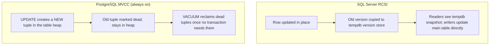
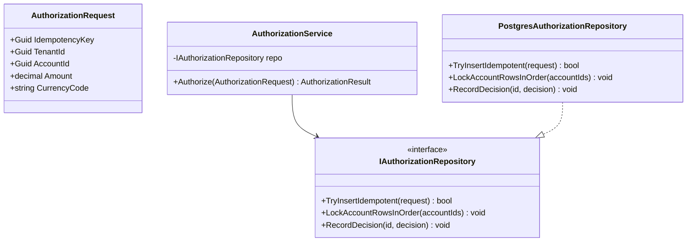
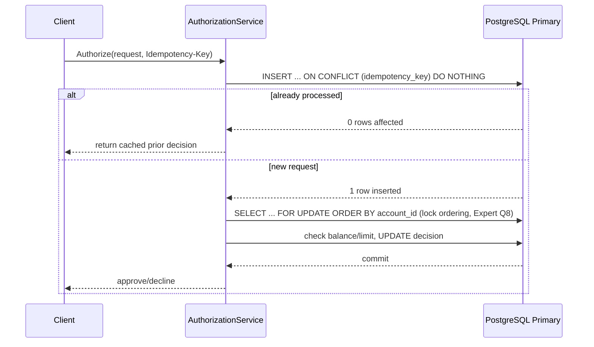

# Module 21 — PostgreSQL: Fundamentals, MVCC & Comparison with SQL Server

> Domain: PostgreSQL | Level: Beginner → Expert | Prerequisite: [[../04-SQL-Server/02-Transactions-Isolation-Locking]] (isolation levels, locking), [[../04-SQL-Server/01-Indexing-Query-Execution-Plans]]

---

## 1. Fundamentals

### What is PostgreSQL, and how does its concurrency model fundamentally differ from SQL Server's?
PostgreSQL is an open-source, object-relational database with a fundamentally different **concurrency-control architecture** from SQL Server's default: PostgreSQL uses **MVCC (Multi-Version Concurrency Control) natively and universally** for every transaction — there is no "opt into row versioning" setting (RCSI) the way SQL Server has, because MVCC **is** how PostgreSQL always works, for every isolation level. This single architectural difference cascades into nearly every other practical distinction between the two engines.

### Why does this matter?
Engineers moving between SQL Server and PostgreSQL (or designing a system to support both) frequently carry over locking-model assumptions that don't hold — PostgreSQL's default Read Committed behavior already provides much of what SQL Server needs RCSI specifically enabled to achieve, but PostgreSQL introduces its own distinctive operational concern (`VACUUM`) that SQL Server has no direct equivalent of.

### When does this matter?
Any team choosing between the two engines, or migrating between them; the depth matters for correctly reasoning about concurrency behavior differences and for understanding `VACUUM`/bloat, PostgreSQL's most distinctive operational concept with no SQL Server analog.

### How does it work (30,000-ft view)?
```sql
-- PostgreSQL: every UPDATE creates a NEW row version (a "tuple"), the old one marked dead but not
-- immediately removed -- MVCC is the ALWAYS-ON mechanism, not an opt-in setting.
UPDATE orders SET status = 'shipped' WHERE id = 123;
-- The old row version remains on disk until VACUUM reclaims it.
```

---

## 2. Deep Dive

### 2.1 MVCC Implementation Differences — Tuple Versions vs Row Versioning in tempdb
SQL Server's Snapshot Isolation/RCSI stores **old row versions in tempdb**, separate from the main data files — the "current" row is still a single physical row updated in place, with old versions temporarily elsewhere. PostgreSQL's MVCC instead keeps **multiple physical tuple (row) versions directly in the table's own heap file** — an `UPDATE` doesn't modify a row in place at all; it inserts an entirely new tuple and marks the old one as expired (via transaction-ID-based visibility metadata, `xmin`/`xmax` system columns), leaving the dead tuple physically present in the table until cleaned up.

### 2.2 `VACUUM` — the Concept with No SQL Server Equivalent
Because dead tuples accumulate directly in the table's heap, PostgreSQL requires **`VACUUM`** — a maintenance process reclaiming space from dead tuples once no active transaction could still need to see them (based on the oldest active transaction's snapshot). Without regular vacuuming (`autovacuum` runs this automatically by default, but can fall behind under heavy write load or misconfiguration), tables suffer **bloat** — accumulating dead tuples that inflate table/index size, degrade scan performance (more physical pages to read for the same logical data), and, in the extreme, risk **transaction ID wraparound** (PostgreSQL's transaction IDs are a finite 32-bit counter; if vacuuming falls far enough behind, the database can be forced into single-user, read-only emergency mode to prevent ID reuse from causing data corruption) — a genuinely severe, PostgreSQL-specific operational failure mode with no direct SQL Server analog.

### 2.3 Isolation Levels — Where PostgreSQL and SQL Server Diverge
PostgreSQL's **Read Committed** (its default, same name as SQL Server's default) already behaves similarly to SQL Server's **RCSI** — readers never block writers and vice versa, since MVCC is always active — meaning PostgreSQL doesn't have SQL Server's specific "reporting query blocks OLTP writes" failure mode under its default configuration at all. PostgreSQL's **Repeatable Read** is stricter than SQL Server's same-named level — it prevents phantom reads too (closer to SQL Server's Serializable in practical effect for many workloads), and its **Serializable** uses a distinctive technique (**Serializable Snapshot Isolation**, SSI) detecting genuine serialization anomalies and aborting one transaction with a retryable error, rather than SQL Server's range-locking approach.

### 2.4 Indexing Differences — Partial, Expression, and GIN/GiST Indexes
PostgreSQL supports several index types with no direct SQL Server equivalent (or a much more limited one): **partial indexes** (`CREATE INDEX... WHERE status = 'active'` — indexing only a subset of rows matching a condition, dramatically smaller and faster for queries that always filter on that condition); **expression indexes** (`CREATE INDEX ON orders (LOWER(email))` — directly solving the non-sargable-predicate problem by indexing the *transformed* value itself, rather than requiring the query to avoid the transformation); **GIN** (Generalized Inverted Index, ideal for full-text search and JSONB containment queries) and **GiST** (Generalized Search Tree, for geometric/range-type queries) indexes, supporting query patterns B+ trees fundamentally can't serve efficiently.

### 2.5 `JSONB` — Native, Indexable Semi-Structured Data
PostgreSQL's `JSONB` type (binary-parsed, indexable JSON) lets a column hold semi-structured data queryable and indexable (via GIN) nearly as efficiently as a proper relational column — a genuinely distinctive PostgreSQL strength for hybrid relational/document workloads, with no equivalently mature native equivalent in SQL Server (which offers JSON functions operating on plain `nvarchar` text, without JSONB's binary storage/native indexing support).

## 3. Visual Architecture

```mermaid
graph TB
 subgraph "SQL Server RCSI"
 A[Row updated in place] --> B[Old version copied to tempdb version store]
 B --> C[Readers see tempdb snapshot; writers update main table directly]
 end
 subgraph "PostgreSQL MVCC (always on)"
 D[UPDATE creates a NEW tuple in the table heap] --> E[Old tuple marked dead, stays in heap]
 E --> F[VACUUM reclaims dead tuples once no transaction needs them]
 end
```

## 4. Production Example
**Scenario**: A team migrated a moderately write-heavy service from SQL Server (with RCSI enabled) to PostgreSQL, expecting equivalent behavior "since both use MVCC now" — after a few weeks in production, query performance degraded steadily, and table sizes grew far beyond expected data volume. **Investigation**: `autovacuum` was running, but its default cost-based throttling settings (tuned for a much lower write-volume workload than this service's actual traffic) meant it consistently fell behind the table's dead-tuple accumulation rate — `pg_stat_user_tables`'s `n_dead_tup` showed dead-tuple counts far exceeding live rows for the hottest tables. **Fix**: tuned `autovacuum_vacuum_cost_limit`/`autovacuum_naptime` more aggressively for the specific high-churn tables (via per-table `ALTER TABLE... SET (autovacuum_vacuum_scale_factor =...)` overrides), and ran a one-time manual `VACUUM (VERBOSE, ANALYZE)` to catch up the existing backlog. **Lesson**: "PostgreSQL uses MVCC just like SQL Server's RCSI" is true for concurrency-model *behavior* but conceals a genuinely distinctive PostgreSQL-specific operational responsibility (vacuum tuning) that SQL Server's tempdb-based version store simply doesn't require in the same way — assuming full behavioral equivalence between the two engines' MVCC implementations is a real, demonstrated migration risk.
## 10. Interview Questions

### Basic (10)
1. **Q: What does MVCC stand for?** **A:** Multi-Version Concurrency Control — writers create new row versions instead of overwriting in place, so readers never block writers and writers never block readers; the cost is dead-tuple accumulation that VACUUM must reclaim.
2. **Q: Is MVCC opt-in or always-on in PostgreSQL?** **A:** Always-on — every transaction uses it, unlike SQL Server where row-versioning (RCSI/Snapshot Isolation) is an explicit setting.
3. **Q: What does `VACUUM` do?** **A:** Reclaims space from dead tuples (old row versions no longer needed by any active transaction).
4. **Q: What is a partial index?** **A:** An index covering only rows matching a specified condition, smaller and faster than indexing the whole table.
5. **Q: What is an expression index?** **A:** An index built on the result of an expression/function applied to a column, rather than the raw column value.
6. **Q: What is `JSONB`?** **A:** PostgreSQL's binary-parsed, indexable JSON data type.
7. **Q: What does `autovacuum` do?** **A:** Automatically runs `VACUUM` (and `ANALYZE`) in the background based on configured thresholds, without manual intervention.
8. **Q: What is transaction ID wraparound?** **A:** A severe failure mode where PostgreSQL's finite transaction-ID counter risks reuse if vacuuming falls too far behind, forcing emergency protective measures.
9. **Q: What are GIN and GiST indexes used for?** **A:** GIN for full-text search/JSONB containment queries; GiST for geometric/range-type queries.
10. **Q: What is Row-Level Security in PostgreSQL?** **A:** A native mechanism for declaring per-row access-control policies enforced by the database itself.

### Intermediate (10)
1. **Q: Why doesn't PostgreSQL have SQL Server's specific "reporting query blocks OLTP writes" problem under its default configuration?** **A:** Because Read Committed already uses MVCC natively in PostgreSQL — readers never take locks that block writers, unlike SQL Server's default Read Committed (without RCSI), which does use locking.
2. **Q: Why does an `UPDATE` in PostgreSQL create a new physical row instead of modifying in place?** **A:** MVCC requires old versions to remain visible to any transaction whose snapshot predates the update — PostgreSQL achieves this by inserting a new tuple and marking the old one expired via `xmin`/`xmax`, keeping both physically present until vacuuming.
3. **Q: Why can insufficient vacuuming cause both performance degradation and eventual emergency failure?** **A:** Accumulating dead tuples bloats tables/indexes (performance), and unvacuumed transaction IDs risk approaching the 32-bit counter's wraparound point, which PostgreSQL must prevent by forcing single-user emergency mode if left unaddressed.
4. **Q: How does an expression index solve the non-sargable-predicate problem differently from SQL Server's typical fix?** **A:** SQL Server's fix is usually rewriting the query to avoid wrapping the indexed column in a function; PostgreSQL can instead index the *function's result* directly (`CREATE INDEX ON orders (LOWER(email))`), letting the original function-wrapped predicate use an index seek without rewriting the query at all.
5. **Q: Why is a partial index smaller and often faster than a full index on the same column?** **A:** It only includes rows matching its `WHERE` condition, so both its storage size and the B+ tree's depth/breadth are proportional to the matching subset, not the entire table — faster to scan and cheaper to maintain for queries that always filter on the same condition the partial index encodes.
6. **Q: Why might a team migrating from SQL Server underestimate PostgreSQL's vacuum-tuning operational requirement?** **A:** SQL Server's tempdb-based version store is managed largely transparently, with tempdb sizing as the main operational lever; PostgreSQL's dead tuples live directly in the table's own heap, requiring active, tuned maintenance (`autovacuum` settings) that has no equivalently-named or equivalently-visible SQL Server counterpart to prompt awareness of the difference.
7. **Q: What's the practical difference between `JSON` and `JSONB` in PostgreSQL?** **A:** `JSON` stores an exact textual copy (preserving whitespace/key order, re-parsed on every access); `JSONB` stores a decomposed, binary format (faster to query/index, but doesn't preserve exact textual formatting) — `JSONB` is almost always the right choice unless exact text preservation is specifically required.
8. **Q: Why does PostgreSQL's Serializable isolation level use a fundamentally different technique (SSI) than SQL Server's range-locking approach?** **A:** Locking-based serializability (SQL Server) proactively prevents anomalies via range locks, reducing concurrency; SSI instead allows transactions to proceed optimistically and detects genuine serialization anomalies at commit time, aborting one conflicting transaction with a retryable error — a different point on the same pessimistic-vs-optimistic concurrency spectrum discussed.
9. **Q: Why would a table's dead-tuple count in `pg_stat_user_tables` be a more actionable monitoring signal than table size alone?** **A:** Table size alone doesn't distinguish "large because of genuine data volume" from "large because of unvacuumed bloat" — dead-tuple count directly measures the bloat-specific component, letting a team catch a vacuuming-behind-schedule problem before it manifests as a broader performance issue.
10. **Q: Why might Row-Level Security be valuable as a defense-in-depth layer beneath application-level authorization?** **A:** It enforces access control at the database engine itself, independent of any given application code path — even a bug in application-layer authorization logic (a missed resource-based check, the incident) would still be blocked by a correctly-configured RLS policy, providing a genuine second, independent layer of protection rather than relying solely on application-code correctness.

### Advanced (10)
1. **Q: Diagnose the vacuum-tuning production incident from first principles, and explain exactly why "just running VACUUM manually once" isn't a complete fix.**
 **A:** The root cause is `autovacuum`'s cost-based throttling (designed to limit vacuum's own I/O impact on concurrent workload) falling behind the table's *actual* dead-tuple generation rate under this specific service's write volume — a one-time manual `VACUUM` clears the existing backlog but doesn't change the underlying rate mismatch; without also tuning `autovacuum_vacuum_cost_limit`/`autovacuum_naptime`/per-table scale factors to keep pace with the table's actual churn rate going forward, the bloat will simply reaccumulate at the same rate that caused the original incident.
2. **Q: Design a monitoring and alerting strategy specifically for vacuum health, generalizing into a standing safeguard.**
 **A:** Track `pg_stat_user_tables.n_dead_tup` relative to `n_live_tup` (a dead-tuple *ratio*, not just an absolute count, since larger tables naturally tolerate more dead tuples in absolute terms) per table, alerting when the ratio exceeds a threshold (e.g., 20%) sustained over time; additionally monitor `pg_stat_progress_vacuum` for currently-running vacuum operations' progress/duration on very large tables, and track the age of the oldest unvacuumed transaction relative to the wraparound threshold as a distinct, higher-severity alert given the wraparound failure mode's severity.
3. **Q: Explain a scenario where PostgreSQL's optimistic Serializable (SSI) behavior surprises an engineer expecting SQL Server's locking-based Serializable semantics.**
 **A:** Under SQL Server's Serializable, a transaction that would create a conflict is typically *blocked* (waiting) until the conflicting transaction completes, then proceeds; under PostgreSQL's SSI, a transaction can run to completion and then be **aborted at commit time** with a serialization-failure error, even though it never appeared to "wait" for anything during its execution — an engineer expecting the SQL Server blocking model might not implement the retry-on-serialization-failure handling PostgreSQL's Serializable level actually requires, causing unexpected transaction failures in production that a naive port of SQL-Server-oriented code wouldn't have anticipated.
4. **Q: How would you decide whether a given query pattern is better served by a partial index versus a standard composite index with the condition expressed in the query's `WHERE` clause?**
 **A:** A partial index is worth its added schema complexity specifically when the partitioning condition (`WHERE status = 'active'`) is both highly selective (active rows are a small fraction of the table) and consistently used across the query patterns that matter — for a condition matching a large fraction of rows, or used inconsistently across different queries, a standard composite index (possibly with the condition column as a leading key column) is simpler and nearly as effective without the schema-maintenance overhead of a specialized partial index.
5. **Q: Design a bloat-prevention strategy for a table subject to very high UPDATE churn (e.g., a frequently-updated counter/status column) where even well-tuned autovacuum struggles to keep pace.**
 **A:** Consider `HOT` (Heap-Only Tuple) updates — PostgreSQL can avoid updating secondary indexes at all for an UPDATE that doesn't modify any indexed column and has room within the same page, dramatically reducing both bloat and index-maintenance cost for narrowly-scoped, frequently-updated columns; ensure the table's `fillfactor` is set below 100% (reserving free space per page specifically to enable HOT updates) for tables with this exact high-churn-on-non-indexed-columns pattern — a PostgreSQL-specific optimization technique with no direct SQL Server equivalent, directly informed by understanding MVCC's tuple-versioning mechanics precisely.
6. **Q: Explain why migrating a schema using SQL Server's `NVARCHAR(MAX)`-stored JSON columns to PostgreSQL should almost always target `JSONB`, not a plain `TEXT` column, and what's lost/gained in the migration.**
 **A:** A plain `TEXT` column would preserve exact byte-for-byte content (matching `NVARCHAR(MAX)`'s behavior) but gain none of PostgreSQL's native JSON query/indexing capability (GIN indexes, containment operators, structured field extraction) — `JSONB` gains substantial query/indexing capability at the cost of not preserving exact original formatting/key-ordering (which `NVARCHAR(MAX)`-stored JSON also didn't guarantee any *query-level* structure for anyway, since SQL Server's JSON functions parse text on every access) — for any data that will actually be queried by field rather than always retrieved and processed whole in application code, `JSONB` is the correct target, not a "safer," format-preserving `TEXT` column.
7. **Q: How would you reason about whether a workload's read/write mix makes MVCC's tuple-versioning overhead (versus a hypothetical in-place-update engine) a meaningful cost, and what would you actually check?**
 **A:** MVCC's overhead (extra tuple versions, vacuum maintenance cost) scales with **update/delete frequency**, not read volume — a read-heavy, append-mostly workload (inserts, rare updates/deletes) incurs minimal MVCC-specific overhead; a workload with very frequent in-place-style updates to the same rows (e.g., a hot counter updated thousands of times per second) incurs it heavily — check actual `n_tup_upd`/`n_tup_hot_upd` ratios in `pg_stat_user_tables` to quantify how much of a table's update traffic is being HOT-optimized (Advanced Q5) versus generating full new tuples needing broader vacuum/index maintenance.
8. **Q: Design a Row-Level Security policy providing multi-tenant isolation as a database-enforced defense-in-depth layer, directly connecting to the multi-tenant captive-dependency incident.**
 **A:**
 ```sql
 ALTER TABLE orders ENABLE ROW LEVEL SECURITY;
 CREATE POLICY tenant_isolation ON orders
 USING (tenant_id = current_setting('app.current_tenant_id')::uuid);
 ```
 The application sets `app.current_tenant_id` as a session-level setting at the start of each request (populated from the authenticated request's tenant context); every query against `orders` — regardless of which application code path issues it, including a hypothetical future bug bypassing the intended application-layer tenant filter entirely — is transparently, unconditionally filtered by this policy at the database engine level, providing exactly the kind of structural, code-path-independent safety net that would have caught the captive-dependency-driven cross-tenant leak even if the DI-lifetime bug had gone completely undetected at the application layer.
9. **Q: Explain why "just add more autovacuum workers" isn't always a sufficient fix for a vacuum-falling-behind problem on a specific very large, very hot table.**
 **A:** Autovacuum workers are a *parallelism* lever (more tables vacuumed concurrently across the whole database), but a single very large table's vacuum is still fundamentally bound by that one table's own I/O/cost-limit throttling — more workers help when many *different* tables are competing for limited vacuum attention, but don't directly speed up vacuuming *one specific* hot table faster; the correct lever for that specific case is raising that table's own `autovacuum_vacuum_cost_limit`/lowering its `autovacuum_vacuum_scale_factor` (triggering vacuum more proactively, before as much bloat accumulates) via a per-table `ALTER TABLE... SET` override, exactly as the fix applied.
10. **Q: As a Principal Engineer evaluating a proposed SQL-Server-to-PostgreSQL migration, what would you require the migration plan to explicitly address, beyond schema/query translation?**
 **A:** Require explicit sections covering: (a) vacuum-tuning strategy and monitoring for the specific tables' anticipated write volume (/Advanced Q2), not an assumption that PostgreSQL "just handles it" automatically; (b) an audit of any code relying on SQL Server's specific locking-based Serializable semantics for retry-on-block behavior, updated for PostgreSQL's abort-and-retry SSI model (Advanced Q3); (c) an evaluation of whether existing JSON-as-text columns should be migrated to `JSONB` to actually gain PostgreSQL's native capability rather than being ported as an equivalent-but-not-improved `TEXT` column; (d) a deliberate decision about whether Row-Level Security should be adopted as a new defense-in-depth layer the source SQL Server system never had available in the same form — treating the migration as an opportunity to adopt PostgreSQL-native capabilities deliberately, not merely as a lift-and-shift schema translation exercise.

### Expert (FinTech Principal Panel)

1. **Q: Two concurrent transactions each check "total exposure across an account's positions is under the limit" and each add a position; individually each read said the limit held, but together they breach it. Read Committed didn't catch it. Explain this "write-skew" and how PostgreSQL's SSI Serializable fixes it.**
 **A:** This is **write-skew**: two transactions read an overlapping set, each makes a decision based on a snapshot where the *other's* not-yet-committed write is invisible, and both write disjoint rows that together violate an invariant no single row enforces (aggregate exposure limit, overdraft across multiple pending withdrawals, double-booking a seat). Read Committed and even Snapshot isolation permit write-skew because neither serializes the *read-then-decide* against a concurrent transaction reading the same set. PostgreSQL's **Serializable Snapshot Isolation (SSI)** detects the dangerous read-write dependency structure and **aborts one transaction at commit** with a serialization failure (`40001`), guaranteeing the outcome equals *some* serial order — so the invariant holds. The catch (Advanced Q3): SSI doesn't block, it aborts late, so the application **must retry** on `40001` (idempotently). Alternatives if you don't want SSI's abort/retry cost: enforce the invariant with an explicit lock (`SELECT... FOR UPDATE` on a per-account guard row so the checks serialize) or materialize the aggregate as a single constraint-checkable row. The Principal framing: write-skew is the classic multi-row financial-invariant bug that weaker isolation silently allows; PostgreSQL SSI is the clean fix *provided* you implement retry-on-`40001`, otherwise take an explicit lock on a guard row to serialize the decision.
 **Why correct:** Correctly defines write-skew, explains why Read Committed/Snapshot miss it, and gives SSI (with mandatory retry) plus the explicit-lock alternative.
 **Common mistakes:** Assuming Snapshot isolation prevents write-skew; using SSI without retry logic; enforcing a cross-row invariant only in application code.
 **Follow-ups:** "Why doesn't Snapshot isolation catch write-skew but Serializable does?" / "What must the app do on a `40001` abort?" / "How does a guard-row `FOR UPDATE` serialize the check without SSI?"

2. **Q: You need a reliable job/outbox worker in PostgreSQL: many workers pull pending payment events to process, each event exactly once, no worker blocked behind another. Design the query, and explain `FOR UPDATE SKIP LOCKED`.**
 **A:** The idiomatic PostgreSQL pattern is a **`SELECT... FOR UPDATE SKIP LOCKED`** queue: `SELECT id FROM outbox WHERE status='pending' ORDER BY created_at LIMIT @batch FOR UPDATE SKIP LOCKED` — `FOR UPDATE` locks the selected rows so no other worker can grab them; `SKIP LOCKED` makes concurrent workers **skip rows already locked** by others instead of blocking behind them, so N workers pull N disjoint batches with no contention and no double-processing. Each worker then processes its rows and marks them `done`/`failed` in the same transaction (or deletes them), so a crash mid-work rolls back the lock and the rows become available again — at-least-once, which is why the downstream effect must be **idempotent**. Add: a bounded retry/attempt counter and dead-lettering for poison rows (permanent failures), an index on `(status, created_at)` so the scan is cheap, and small batches to keep transactions short. This is the standard lightweight alternative to a dedicated broker for outbox/job processing on Postgres. The Principal framing: `FOR UPDATE SKIP LOCKED` turns a plain table into a correct concurrent work queue — disjoint claims without blocking, transactional so crashes are safe — and paired with idempotent processing + retry/DLQ it's a robust outbox relay without extra infrastructure.
 **Why correct:** Gives the exact `SKIP LOCKED` claim query, explains disjoint non-blocking claims + transactional safety, and adds idempotency/retry/DLQ/indexing.
 **Common mistakes:** `FOR UPDATE` without `SKIP LOCKED` (workers serialize/block); no idempotency despite at-least-once; no poison-row handling; unindexed status scan.
 **Follow-ups:** "What does `SKIP LOCKED` change vs. plain `FOR UPDATE`?" / "Why must processing be idempotent here?" / "How do you stop a poison row from being retried forever?"

3. **Q: What PostgreSQL type do you use for monetary amounts, and why not `float`/`double precision` or the `money` type? Cover precision, rounding, and cross-currency.**
 **A:** Use **`NUMERIC`/`DECIMAL`** with explicit precision and scale (`NUMERIC(19,4)`), which is exact base-10 arbitrary-precision — the only correct choice for amounts you sum, compare, or settle. Avoid `float`/`double precision`: they're binary IEEE-754, so `0.1` isn't representable exactly and error accumulates across postings, breaking reconciliation. Avoid the built-in **`money`** type too: its scale is tied to the database's `lc_monetary` locale setting (fragile, environment-dependent), it carries no currency identity, and it has awkward rounding/overflow behavior — `NUMERIC` is more portable and predictable. Store the **currency code separately** (ISO-4217) and never mix currencies in arithmetic without an explicit conversion; respect per-currency scale (JPY 0, USD 2, BHD 3), and set the column scale to the maximum you need. Make **rounding explicit** (`ROUND(x, 2)` with a documented mode) for reports rather than relying on implicit casts. Match the C#/app decimal type to the column so no lossy conversion happens at the boundary. The Principal framing: money is `NUMERIC` (exact) + a separate currency code, never `float` (lossy) or `money` (locale-coupled, currency-blind) — and rounding/scale are explicit, per-currency decisions, because for financial data "close enough" is a reconciliation break waiting to happen.
 **Why correct:** Chooses `NUMERIC` for exactness, rejects `float` (binary error) and `money` (locale-coupled/currency-blind), and handles currency identity + per-currency scale + explicit rounding.
 **Common mistakes:** `double precision` for money; the `money` type; no separate currency code; implicit rounding.
 **Follow-ups:** "Why is the `money` type's locale coupling a problem?" / "How do you represent a JPY vs. a BHD amount's scale?" / "How do you avoid a lossy cast between the app and the column?"

4. **Q: Your reporting service uses pgbouncer in transaction pooling mode for connection scaling; after enabling it, an ORM-driven service starts intermittently throwing "prepared statement 'S_1' does not exist." Diagnose and fix.**
 **A:** Transaction pooling mode multiplexes many logical client sessions onto few physical backends, handing a physical connection to a *different* client the instant a transaction commits — but the ORM driver's server-side prepared statements (`PREPARE`) are backend-session-scoped, not connection-string-scoped, so a statement prepared on one logical "connection" can vanish (or, worse, collide with another client's same-named statement) once pgbouncer reassigns the underlying physical backend. Fix: either disable server-side prepared statements in the driver (most ORMs/drivers, e.g. Npgsql, expose a `Max Auto Prepare` / prepare-mode setting; set it to rely on pgbouncer's own statement handling instead) or move that specific workload to session pooling mode (at the cost of losing most of pgbouncer's connection-scaling benefit) — never "just retry the error," which papers over the mismatch instead of resolving it. The Principal framing: pgbouncer's pooling mode is a session-state contract, not just a performance knob — any session-scoped feature (prepared statements, advisory locks held across statements, `SET`-level GUCs, temp tables) must be audited against the chosen pooling mode before rollout, not discovered via a production intermittent-error investigation.
 **Why correct:** Correctly attributes the error to transaction-pooling's session-state discontinuity and gives both viable fixes with their trade-off.
 **Common mistakes:** Treating the error as transient/flaky and retrying; enabling session pooling globally as a blanket fix, silently discarding the connection-scaling benefit that motivated pgbouncer's adoption in the first place.
 **Follow-ups:** "What other session-scoped features break under transaction pooling?" / "Why does session pooling mode lose most of the scaling benefit?" / "How would you audit an existing service for this risk before migrating it to transaction pooling?"

5. **Q: A nightly batch job needs a single-leader "only one instance runs at a time" guarantee across several horizontally-scaled worker pods, without provisioning a separate distributed-lock service. Design this using PostgreSQL advisory locks, and state the failure mode to watch for.**
 **A:** Use a **session-level advisory lock** (`pg_try_advisory_lock(job_id)`) — a lightweight, application-defined lock keyed by an arbitrary bigint, held by whichever session acquires it first and automatically released when that session disconnects, requiring no schema/row to model the lock. Each worker pod attempts `SELECT pg_try_advisory_lock(12345);` on startup; only the pod that receives `true` proceeds, others exit or wait. The failure mode: if the winning pod's *connection* silently drops without a clean disconnect (a network partition rather than a process exit) while running under a connection pooler like pgbouncer in transaction pooling mode, the advisory lock's lifetime is tied to the underlying physical backend session — pgbouncer's transaction-mode multiplexing means the "session" the lock is scoped to may not correspond 1:1 to the logical worker's actual lifetime, risking either a premature release (another pod starts concurrently) or the lock never releasing until pgbouncer's own connection is recycled. The correct posture: advisory locks require a direct session-mode connection (not transaction-pooled) to have a meaningful, predictable lifetime, and even then are a same-database, single-primary coordination mechanism — not a substitute for a genuine distributed-consensus lock service across independent failure domains. The Principal framing: advisory locks are a real, low-overhead tool for single-database leader election, but their correctness is contingent on connection lifetime being unambiguous — exactly the same session-state-discontinuity risk transaction pooling introduces for prepared statements (Expert Q4), recurring here with higher stakes since the leader-election guarantee itself is at risk, not just an error message.
 **Why correct:** Gives the correct advisory-lock pattern, and correctly identifies the connection-pooling interaction as the specific failure mode to design around.
 **Common mistakes:** Using advisory locks under transaction-pooled connections without recognizing the session-lifetime ambiguity; treating advisory locks as a general-purpose distributed lock across multiple databases/regions.
 **Follow-ups:** "Why must advisory locks use a session-mode, not transaction-pooled, connection?" / "What happens if the holding session crashes without releasing?" / "When would you reach for a real distributed-lock service instead?"

6. **Q: A `trades` table stores a `JSONB` column holding full order-book snapshots (often tens of kilobytes each) alongside small relational columns. After months in production, the table's `VACUUM` times balloon and query latency on the small columns degrades even though those columns' own data volume hasn't grown. Explain the mechanism and the fix.**
 **A:** PostgreSQL's page size is fixed at 8KB, and any row (tuple) that wouldn't fit is **TOASTed** — large column values are compressed and/or sliced into chunks stored in a separate, automatically-managed side table (`pg_toast.pg_toast_<oid>`), with the main table storing only a small pointer. A large `JSONB` snapshot column forces most rows into TOAST storage, and critically, **`VACUUM` must also process the TOAST table** — a table with heavy TOAST usage effectively has two vacuum workloads, and the TOAST table's own bloat (from JSONB updates, which under MVCC still write a full new tuple, including a full new TOASTed chunk set, even for a small field change elsewhere in the row) directly degrades vacuum throughput for the whole logical table, including its small, unrelated columns, because they physically share the same table's vacuum cycle. Fix: split the large `JSONB` payload into a separate table (`trade_snapshots(trade_id, snapshot jsonb)`, `FOREIGN KEY` back to `trades`) so `trades`' own hot, frequently-queried small columns get their own, much cheaper vacuum cycle independent of the large-payload table's TOAST churn — a normalization decision driven specifically by MVCC/TOAST vacuum cost, not by classic relational-modeling concerns. The Principal framing: TOAST is usually invisible, but under MVCC's copy-on-write tuple model, a wide, frequently-updated column silently taxes vacuum cost for every other column in the same physical row — schema decisions for high-churn tables must account for this coupling explicitly.
 **Why correct:** Correctly explains TOAST's mechanism, why it couples an unrelated small column's vacuum cost to a large JSONB column's churn, and gives the normalization fix.
 **Common mistakes:** Assuming column size only affects that column's own storage/query cost, missing the shared-table vacuum-cost coupling; increasing `autovacuum` aggressiveness without addressing the underlying schema coupling.
 **Follow-ups:** "Why does updating one small column still bloat a TOASTed large column's storage?" / "How would you detect TOAST-driven bloat via `pg_stat_user_tables`/`pg_total_relation_size`?" / "When is keeping a large JSONB column inline still the right call?"

7. **Q: A daily reconciliation query joining `trades` and `settlements` on `(account_id, trade_date)` regressed from 200ms to 40 seconds after a routine data-volume increase, with `EXPLAIN` showing a nested-loop join the planner chose confidently (low estimated cost) despite it being catastrophically wrong at actual scale. Diagnose and fix without rewriting the query.**
 **A:** The planner estimates a join's selectivity by multiplying each predicate's independent selectivity, assuming column independence — `account_id` and `trade_date` are **correlated** in practice (a given account trades on a bounded, clustered set of dates, not uniformly across the whole date range), so the default single-column statistics dramatically *underestimate* the actual matching row count, making a nested-loop join look artificially cheap to the planner. This is invisible at low data volume (both plans are fast enough that the misestimation doesn't matter) and becomes catastrophic once volume grows enough that the *actual* row count the nested loop must iterate diverges sharply from the *estimated* one. Fix, without touching the query: `CREATE STATISTICS trades_stats (dependencies, ndistinct) ON account_id, trade_date FROM trades; ANALYZE trades;` — extended statistics let the planner model the correlation directly, correcting its row-count estimate and causing it to switch to a hash join on its own. The Principal framing: a query regression with no code change is almost never "PostgreSQL got slower" — it's the planner's statistics no longer matching production data's actual correlation structure, and `CREATE STATISTICS` is the targeted, non-invasive fix for exactly this shape of misestimation, distinct from an index problem (Advanced-tier expression/partial-index fixes) or a vacuum-bloat problem (Production Example).
 **Why correct:** Correctly diagnoses correlated-column misestimation as the mechanism (not an index or bloat problem) and gives the precise, non-query-rewriting fix.
 **Common mistakes:** Reflexively adding an index without first confirming via `EXPLAIN (ANALYZE, BUFFERS)` that the actual vs. estimated row counts diverge; rewriting the query instead of fixing the underlying statistics gap.
 **Follow-ups:** "How do you confirm this is a correlation problem via `EXPLAIN (ANALYZE, BUFFERS)`?" / "What does `CREATE STATISTICS`'s `dependencies` kind actually model?" / "Why does this regression only appear at higher data volume?"

8. **Q: Two services concurrently transfer funds between the same pair of accounts — Service A debits account 1 then credits account 2; Service B (a reversal) debits account 2 then credits account 1 — and under load the system deadlocks. Diagnose using `pg_locks`, and give the fix.**
 **A:** Both transactions acquire row-level locks on the two account rows, but in **opposite order** — A locks account 1 then waits for account 2 (held by B); B locks account 2 then waits for account 1 (held by A) — a classic circular wait. PostgreSQL's deadlock detector (running periodically, `deadlock_timeout`, default 1s) detects the cycle and aborts one transaction with a `40P01` error, which is correct behavior, not a bug — the bug is that the application has no consistent lock-acquisition order and, commonly, no retry logic for `40P01`. Diagnosis: join `pg_locks` against `pg_stat_activity` to see which two backends held/waited-for which relations at the moment of the deadlock (PostgreSQL also logs the full deadlock detail — both queries and the lock cycle — to the server log automatically when a deadlock occurs). Fix: enforce a **consistent lock-acquisition order** across every code path that touches multiple account rows in one transaction — e.g., always lock the lower `account_id` first, regardless of whether the operation is logically a "debit-then-credit" or a "credit-then-debit" — which eliminates the possibility of a circular wait by construction, plus retry-on-`40P01` as a defense-in-depth safety net for any lock-ordering gap that slips through review. The Principal framing: a deadlock in a double-entry ledger is not primarily a database problem to tune away — it's a missing application-level invariant (a global, consistent multi-row lock order) that the database's deadlock detector is correctly, if expensively, surfacing.
 **Why correct:** Correctly diagnoses the circular-wait mechanism, gives the `pg_locks`/`pg_stat_activity` diagnosis path, and the structural (lock-ordering) fix plus retry as defense-in-depth.
 **Common mistakes:** Treating `40P01` as a transient error to blindly retry without also fixing the underlying lock-ordering gap; increasing `deadlock_timeout` as if that resolves the deadlock rather than merely detecting it later.
 **Follow-ups:** "Why is a consistent lock order sufficient to eliminate circular waits by construction?" / "What does PostgreSQL's server log show automatically on a deadlock?" / "Why is retry-on-40P01 still necessary even with correct lock ordering?"

9. **Q: A payments platform must retain the ability to restore the database to any point in time within the last 30 days for regulatory audit and incident-forensics purposes (SOX-adjacent retention requirement), not merely recover from the most recent backup. Design this using PostgreSQL's native capabilities.**
 **A:** **Point-in-Time Recovery (PITR)**: take periodic base backups (`pg_basebackup`) and continuously archive every completed WAL segment (`archive_mode = on`, `archive_command` shipping each segment to durable, immutable storage — e.g., S3 with object-lock/versioning for tamper-evidence, itself a relevant control for an audit requirement). Recovery to any specific point within the retention window replays the base backup plus the archived WAL stream up to a target timestamp/LSN/named restore point (`recovery_target_time`), reconstructing the exact database state at that instant — not just "as of the last nightly backup." Retention: keep 30+ days of archived WAL plus base backups spanning that window (a base backup older than the retention floor, plus all WAL after it, must be retained; a base backup taken specifically to bound WAL-replay time for a 30-day-old restore target). Critically distinct from replication (Module 22 §2.2): a physical replica keeps the database only *currently* consistent with the primary and has no ability to restore to an arbitrary *past* point — PITR's archived WAL, not a live replica, is what actually provides the audit/forensics capability. Test restores periodically against the actual retention window, not just verify archiving is running — an untested restore path is not a verified capability. The Principal framing: regulatory point-in-time restorability is a distinct requirement from both routine backup/restore and from HA/DR replication, satisfied specifically by WAL archiving with a sized retention window, and its correctness must be validated by periodic actual restore drills, not by archiving-pipeline uptime alone.
 **Why correct:** Correctly distinguishes PITR from both live replication and routine backup, gives the concrete WAL-archiving mechanism, and requires restore-drill verification.
 **Common mistakes:** Assuming a streaming replica satisfies a point-in-time-restore requirement; sizing WAL retention against typical operational recovery needs rather than the actual regulatory retention window; never testing an actual restore.
 **Follow-ups:** "Why doesn't a streaming replica satisfy this requirement?" / "What determines how far back a base backup needs to go for a 30-day target?" / "How would you verify the restore capability actually works, not just that archiving is running?"

10. **Q: A hot lookup index on a payments-authorization table (`idx_auth_lookup_card_token`) has grown to 3x its expected size relative to the table's row count, and authorization-lookup latency has crept up even though the table itself is well-vacuumed and not bloated. Diagnose, and explain why index bloat is a distinct problem from table bloat.**
 **A:** Table-level `VACUUM` reclaims dead tuples from the heap, but B-tree **index bloat** is a related but distinct phenomenon: high-churn `UPDATE`/`DELETE` traffic on indexed columns leaves the index's own internal pages with a growing fraction of dead/half-empty pages that ordinary vacuum reclaims *space* from but doesn't necessarily *compact* — a B-tree index can retain a larger, sparser physical structure than its logical entry count warrants, especially under a workload with many `UPDATE`s that touch the indexed column (each such `UPDATE`, unable to use HOT since the indexed column itself changed, requires inserting a new index entry, while the old one becomes dead), inflating I/O cost for every index lookup and scan even though the table's own row count and heap size look fine. Diagnosis: compare `pg_relation_size` of the index against a fresh, equivalently-populated index's expected size (or use `pgstattuple`'s index-aware variant to directly measure the live-vs-dead-space ratio within the index). Fix: `REINDEX INDEX CONCURRENTLY idx_auth_lookup_card_token;` — rebuilds the index from scratch without holding the exclusive lock a plain `REINDEX` requires, safe to run against a live, 24/7 authorization-lookup path with no read/write downtime, unlike plain `REINDEX` which blocks all access to the table for the rebuild's duration. The Principal framing: index bloat is operationally distinct from table bloat — it degrades exactly the hot-path lookup performance the index exists to protect, can occur even on a well-vacuumed table, and its fix (`REINDEX CONCURRENTLY`) is a separate operational lever from `VACUUM` tuning, both of which a Principal-level operational runbook for a high-TPS OLTP table must cover explicitly, not assume one implies the other.
 **Why correct:** Correctly distinguishes index bloat from table bloat, explains the HOT-ineligibility mechanism driving it, and gives the zero-downtime fix.
 **Common mistakes:** Assuming a well-vacuumed table implies its indexes are equally healthy; running plain `REINDEX` (not `CONCURRENTLY`) against a live, latency-sensitive production table, causing an avoidable outage.
 **Follow-ups:** "Why can't HOT updates avoid this specific index-bloat cause?" / "Why must `REINDEX CONCURRENTLY` be used instead of plain `REINDEX` on a live table?" / "How would you monitor for index bloat proactively rather than reactively?"

---

## 11. Coding Exercises

### Easy — Expression index solving a non-sargable predicate
```sql
-- Query: SELECT * FROM users WHERE LOWER(email) = 'alice@example.com';
CREATE INDEX idx_users_email_lower ON users (LOWER(email));
-- The predicate now uses the index directly -- no query rewrite needed, unlike the typical
-- SQL Server fix of avoiding the function wrapper entirely.
```

### Medium — Partial index for a highly selective, frequently-filtered condition
```sql
-- Most queries filter WHERE status = 'active', and active rows are a small fraction of the table.
CREATE INDEX idx_orders_active ON orders (customer_id) WHERE status = 'active';
-- Smaller, faster index than indexing customer_id across ALL rows regardless of status.
```

### Hard — Row-Level Security multi-tenant policy (Advanced Q8)
```sql
ALTER TABLE invoices ENABLE ROW LEVEL SECURITY;

CREATE POLICY tenant_isolation_select ON invoices FOR SELECT
 USING (tenant_id = current_setting('app.current_tenant_id')::uuid);

CREATE POLICY tenant_isolation_modify ON invoices FOR ALL
 USING (tenant_id = current_setting('app.current_tenant_id')::uuid)
 WITH CHECK (tenant_id = current_setting('app.current_tenant_id')::uuid);
-- WITH CHECK additionally prevents an INSERT/UPDATE from setting a DIFFERENT tenant_id
-- than the current session's -- closing the write-side equivalent of the read-side USING clause.
```

### Expert — Autovacuum per-table tuning for a high-churn table (the fix)
```sql
ALTER TABLE orders SET (
 autovacuum_vacuum_scale_factor = 0.02, -- trigger vacuum at 2% dead tuples instead of the 20% default
 autovacuum_vacuum_cost_limit = 2000 -- allow more I/O throughput per vacuum cycle for this specific table
);

-- One-time catch-up for existing backlog:
VACUUM (VERBOSE, ANALYZE) orders;
```
**Discussion**: Lowering `autovacuum_vacuum_scale_factor` specifically for this one high-churn table (rather than globally) means autovacuum triggers proportionally more often for it without affecting the vacuum cadence of every other, lower-churn table in the database — a targeted fix matching Advanced Q9's guidance to tune the specific hot table's own settings rather than a blanket, database-wide change.

---

## 12. System Design

**Scenario:** Design the core PostgreSQL data layer for a multi-tenant payments-authorization platform (think a card-issuing processor's real-time authorization service) migrating off SQL Server, expected to handle 2,000 authorization requests/second sustained, with regulatory requirements for point-in-time auditability and strict per-tenant data isolation.

**Functional requirements:** Authorize/decline a card transaction against a live balance/limit check; record every authorization attempt immutably; support per-tenant (issuing-bank) data isolation; support 30-day point-in-time restorability for audit (Expert Q9).

**Non-functional requirements:** p99 authorization-decision latency under 150ms; zero committed-authorization data loss on primary failure (informs the synchronous-replication trade-off, Module 22 §2.3); horizontal read-scaling for a separate, high-volume reporting workload without impacting authorization-path latency.

**Back-of-the-envelope estimation:** 2,000 TPS sustained authorization writes, each a small row (~200 bytes) plus one `JSONB` audit-detail column (~1KB average) → roughly 2,400 KB/s of new tuple data, before WAL amplification (MVCC writes both the heap tuple and a WAL record for it, roughly doubling the physical write volume for the same logical change, §7). At this churn rate, the authorization table's dead-tuple generation rate is exactly the kind of workload the Production Example's vacuum-tuning incident describes — the numbers tell us this table needs proactive, tuned `autovacuum`, not default settings, from day one, not discovered reactively.

**Architecture:** A single, vertically-scaled primary (write-authoritative, since authorization decisions require a strongly-consistent, immediately-visible balance check — an eventually-consistent read here risks a double-authorization) with synchronous replication to one standby in a separate availability zone (Module 22 §2.3, sized against the zero-committed-loss requirement) plus one or more asynchronous read replicas serving the reporting workload, isolated from authorization-path latency entirely.

**Components:** `authorizations` table (range-partitioned by day, Module 22 §2.1, for efficient archival and per-partition vacuum); Row-Level Security policies scoping every query to the requesting tenant (§8, §10 Advanced Q8); pgbouncer in transaction pooling mode in front of the authorization service's connection-heavy request pattern (§7), with prepared-statement usage audited against pooling mode per Expert Q4; WAL archiving to immutable object storage for PITR (Expert Q9).

**Database selection:** PostgreSQL over SQL Server here specifically for `JSONB`'s native indexable storage of variable-shape authorization-detail payloads (§2.5) and RLS as a database-enforced tenant-isolation layer (§8) — both directly informing this migration's design, not incidental choices.

**Caching:** A short-TTL, per-account balance/limit cache (Redis) in front of the authorization hot path reduces read load on the primary for the common case, with the primary remaining the strongly-consistent source of truth for the actual authorize/decline decision — cache is an optimization for the read, never the decision itself.

**Messaging:** Post-authorization events (approved/declined) published via an outbox table (§10 Advanced Q2's `FOR UPDATE SKIP LOCKED` pattern) to downstream fraud-scoring and notification consumers, avoiding the dual-write problem between the authorization commit and the event publish.

**Scaling:** Read replicas absorb reporting load; range partitioning bounds per-partition vacuum/index-maintenance cost as the table grows; `Citus` sharding (§9) is deliberately deferred unless the single primary's vertical write ceiling becomes a demonstrated constraint, not adopted preemptively.

**Failure handling:** Synchronous-replica unavailability blocks primary commits under strict `synchronous_commit`, a deliberate consistency-over-availability choice for authorization data (mirroring Module 22 Expert Q1's ledger DR posture) — mitigated via quorum-based `ANY 1 (...)` synchronous-standby configuration (Module 22 Advanced Q3) rather than a single named standby.

**Monitoring:** Dead-tuple ratio per table (Production Example), replication lag on both the synchronous standby and async read replicas, pgbouncer pool saturation, and authorization-path p99 latency as the primary business-facing SLO.

**Trade-offs:** Strong consistency (synchronous replication, single-writer authorization) is chosen over multi-region write availability, because a lost or duplicated authorization decision is a worse business outcome than added commit latency — the same reasoning Module 22's ledger DR design applies, now at the schema/system-design level rather than only the replication-configuration level.

---

## 13. Low-Level Design

**Requirements:** Model an authorization request/decision atomically and idempotently; enforce per-tenant isolation at the data layer; avoid lock-ordering deadlocks (Expert Q8) when a single authorization touches both a balance row and a limit-counter row.

**Class diagram:**

```mermaid
classDiagram
 class AuthorizationRequest {
 +Guid IdempotencyKey
 +Guid TenantId
 +Guid AccountId
 +decimal Amount
 +string CurrencyCode
 }
 class AuthorizationService {
 -IAuthorizationRepository repo
 +Authorize(AuthorizationRequest) AuthorizationResult
 }
 class IAuthorizationRepository {
 <<interface>>
 +TryInsertIdempotent(request) bool
 +LockAccountRowsInOrder(accountIds) void
 +RecordDecision(id, decision) void
 }
 class PostgresAuthorizationRepository {
 +TryInsertIdempotent(request) bool
 +LockAccountRowsInOrder(accountIds) void
 +RecordDecision(id, decision) void
 }
 AuthorizationService --> IAuthorizationRepository
 PostgresAuthorizationRepository ..|> IAuthorizationRepository
```

**Sequence diagram:**

```mermaid
sequenceDiagram
 participant Client
 participant Svc as AuthorizationService
 participant DB as PostgreSQL Primary

 Client->>Svc: Authorize(request, Idempotency-Key)
 Svc->>DB: INSERT ... ON CONFLICT (idempotency_key) DO NOTHING
 alt already processed
 DB-->>Svc: 0 rows affected
 Svc-->>Client: return cached prior decision
 else new request
 DB-->>Svc: 1 row inserted
 Svc->>DB: SELECT ... FOR UPDATE ORDER BY account_id (lock ordering, Expert Q8)
 Svc->>DB: check balance/limit, UPDATE decision
 DB-->>Svc: commit
 Svc-->>Client: approve/decline
 end
```

**Design patterns used:** Repository (isolates SQL/RLS-session-variable concerns behind `IAuthorizationRepository`); Idempotent-Receiver (the `ON CONFLICT DO NOTHING` unique-key insert, the database-native realization of the idempotency-key discipline named in Module 22 Expert Q1's ledger framing); Unit of Work (the whole authorization decision commits or rolls back as one transaction).

**SOLID mapping:** Single Responsibility (`AuthorizationService` orchestrates; `PostgresAuthorizationRepository` owns SQL/locking specifics); Open/Closed (a new persistence backend implements `IAuthorizationRepository` without changing `AuthorizationService`); Liskov (any `IAuthorizationRepository` implementation must genuinely honor the lock-ordering contract — a naive implementation that locks rows in request-arrival order rather than a canonical order would silently reintroduce Expert Q8's deadlock risk despite satisfying the interface's method signature); Interface Segregation (idempotent-insert, row-locking, and decision-recording are separable methods); Dependency Inversion (`AuthorizationService` depends on the abstraction, never on `Npgsql`/SQL directly).

**Concurrency/thread safety:** Idempotency is enforced by a unique constraint at the database layer (safe under arbitrary concurrent duplicate requests, not merely application-layer deduplication); lock ordering (always lock the lower `account_id` first, Expert Q8) is enforced inside `LockAccountRowsInOrder`, a single, audited chokepoint every code path touching multiple account rows must go through — not left to each caller to individually get right.

---

## 14. Production Debugging

**Incident:** Three weeks after the authorization platform (§12) went live, p99 authorization latency spiked from 80ms to 1.2 seconds during a daily peak-traffic window, correlating with a spike in `40P01` (deadlock) errors in the application logs — a distinct incident from, but downstream of, the same lock-ordering discipline Expert Q8 establishes.

**Root cause:** A new "linked-account limit pooling" feature had been added, where a single authorization could touch a *variable-length list* of linked account rows (a family/corporate card pooling arrangement), and the feature's implementation locked accounts in the order they appeared in the linked-account list returned by an upstream service — an order that was **not** canonically sorted, and in fact varied per request depending on that upstream service's own non-deterministic result ordering. Two concurrent authorizations against overlapping linked-account sets, each locking in a different order, produced exactly the circular-wait deadlock pattern Expert Q8 describes structurally — except this time the discipline (canonical lock ordering) had been correctly applied to the *original* single-pair transfer code path and never re-applied when the linked-account feature introduced a new, variable-cardinality locking pattern.

**Investigation:** `pg_stat_activity` joined against `pg_locks` during the incident window showed multiple backends blocked waiting on `RowExclusiveLock` for overlapping sets of account rows; PostgreSQL's server log (deadlock detail logged automatically, §10 Expert Q8) confirmed the specific query pattern — the linked-account authorization path — as the consistent source of every deadlock in the window, not the original single-account authorization path.

**Tools:** `pg_locks`/`pg_stat_activity` join query for real-time lock-wait visibility; server log deadlock detail for retrospective analysis; `pg_stat_statements` to confirm the linked-account query's `40P01` error count specifically, isolating it from background noise.

**Fix:** The linked-account authorization path was changed to sort the account-ID list canonically (`ORDER BY account_id`) immediately before the locking step, regardless of the order the upstream linked-account-resolution service returned — restoring the same "always lock in canonical order" invariant the original single-pair code path already honored. A code-review checklist item was added: any new code path acquiring locks on more than one row from the same table within a transaction must explicitly document and justify its lock-acquisition order.

**Prevention:** The checklist item generalizes Expert Q8's fix beyond the specific code path it was originally applied to — the recurring lesson (echoing the CRDT-composition and cross-field-invariant pattern this course documents elsewhere) is that a correctly-applied discipline on one code path provides no guarantee a *new* code path touching the same shared resource will inherit it; the discipline must be re-verified explicitly at every new multi-row-locking code path, not assumed to propagate automatically from the original fix.

---

## 15. Architecture Decision

**Context:** Choosing a connection-management strategy for the authorization platform's PostgreSQL primary under 2,000 TPS sustained load.

**Option A — Direct application-to-database connections (no pooler):** *Advantages:* No additional infrastructure component; full session-state fidelity (prepared statements, advisory locks behave exactly as documented, no Expert Q4/Q5-style surprises). *Disadvantages:* PostgreSQL's per-connection memory overhead and connection-establishment cost make thousands of concurrent application-instance connections directly against the primary both expensive and a real risk of exhausting `max_connections` under a traffic spike or a connection-leak bug. *Cost:* Low infrastructure cost, high risk cost. *Risk:* High — a connection-storm (e.g., a redeploy causing every application instance to reconnect simultaneously) can itself take the primary down.

**Option B — pgbouncer, session pooling mode:** *Advantages:* Full session-state fidelity preserved (no Expert Q4-style prepared-statement breakage); still reduces raw TCP/auth overhead versus direct connections. *Disadvantages:* Each logical client still holds a physical backend for its entire session's duration, so the connection-scaling benefit relative to Option A is modest — doesn't meaningfully reduce backend count under genuinely high concurrent-session volume. *Cost:* Low-moderate (one additional lightweight component). *Risk:* Low, but doesn't solve the actual scaling problem at 2,000 TPS.

**Option C — pgbouncer, transaction pooling mode, with session-scoped features explicitly audited:** *Advantages:* Genuine connection-scaling benefit — many logical sessions multiplexed onto a small, bounded pool of physical backends, directly addressing Option A's connection-storm risk. *Disadvantages:* Requires explicit auditing and adaptation of every session-scoped feature (prepared statements, advisory locks, `SET`-level GUCs) per Expert Q4/Q5 — a real, non-zero engineering cost, and a source of production incidents (Expert Q4) if skipped. *Cost:* Moderate (audit effort upfront) but low ongoing. *Risk:* Low, contingent on the audit being genuinely thorough and re-run whenever a new session-scoped feature is introduced.

**Recommendation: Option C**, specifically because the authorization platform's 2,000 TPS scale makes Option A's connection-storm risk unacceptable and Option B's marginal scaling benefit insufficient — but only paired with an explicit, standing audit (mirroring §14's checklist-generalization lesson) of every session-scoped feature against transaction-pooling semantics, re-run on every new feature addition, not performed once at initial pgbouncer adoption and assumed to remain valid.

---

## 17. Principal Engineer Perspective

**Business impact:** An authorization-path outage or elevated-latency incident directly blocks revenue-generating transactions in real time — unlike a reporting-pipeline delay, which degrades a downstream, non-blocking capability, the authorization path's failure modes (§14's deadlock incident, the original vacuum-bloat incident) have immediate, visible business cost, which is why this module's monitoring recommendations (§7, §12) treat dead-tuple ratio and lock-wait visibility as first-class, not secondary, operational signals.

**Engineering trade-offs:** The consistent thread across this module — MVCC's always-on tuple-versioning, RLS's engine-enforced isolation, synchronous replication's consistency-over-availability choice — is that PostgreSQL's defaults trade some operational complexity (vacuum tuning, replication-slot/lock-order discipline) for stronger baseline correctness guarantees than an engineer coming from SQL Server's more locking/tempdb-centric model might expect; a Principal Engineer's job in a migration is making these trades *explicit* in the design review, not letting them surface first as production incidents.

**Technical leadership:** §14's deadlock incident illustrates a durable leadership lesson: a correctly-applied discipline (canonical lock ordering) on one code path does not automatically propagate to a structurally similar but distinct new code path — technical leadership here means encoding the discipline as a reviewable, checkable rule (the checklist item) rather than trusting it to be independently rediscovered by whoever writes the next multi-row-locking feature.

**Cross-team communication:** The linked-account feature team (§14) built a structurally correct feature in isolation but didn't know to ask whether their new locking pattern needed the same discipline the original authorization-transfer code already had — surfacing exactly the kind of cross-team knowledge-transfer gap a Principal Engineer's design-review process exists to close, by making implicit invariants (canonical lock ordering) explicit, documented, and part of any new code's review checklist rather than tribal knowledge held only by the original implementers.

**Architecture governance:** Every table with meaningfully high write churn should have its `autovacuum` tuning, dead-tuple monitoring, and (where multi-row transactions touch it) documented lock-ordering convention recorded as part of its schema's own governance documentation — not left to be independently rediscovered per incident, mirroring this course's recurring "convert hard-won incident lessons into fleet-wide structural safeguards" pattern (Module 22 §17).

**Cost optimization:** pgbouncer's transaction-pooling mode (§15 Option C) is chosen specifically because it avoids the higher infrastructure cost of scaling `max_connections`/primary memory to accommodate direct high-concurrency connections (Option A) — a deliberate cost-vs-audit-effort trade, not a default reached for without comparing the alternatives.

**Risk analysis:** The recurring risk pattern across this module is the same shape repeatedly: a mechanism that is individually, provably correct (MVCC, RLS, a lock-ordering discipline, an advisory lock) fails specifically at a boundary — a migration assumption, a new code path, a connection-pooling mode's session-state contract — rather than at its own core correctness. Risk registers for a PostgreSQL-backed platform should explicitly track these boundary conditions (pooling-mode/session-state audits, lock-ordering coverage across all multi-row-locking code paths, PITR restore-drill currency) as standing, periodically-re-verified items, not one-time checks.

**Long-term maintainability:** What decays over time, across this module's incidents and the Production Example, is the correspondence between an original design assumption (a table's expected churn rate, a code path's lock order, a session's connection-pooling compatibility) and the system's current, evolved reality as new features and traffic patterns are added — the practice that keeps this from compounding indefinitely is the same one this course applies elsewhere: periodic, structural re-audit of these assumptions against actual current behavior, not a one-time validation at initial design time.

---

## 18. Revision
**Key takeaways**: PostgreSQL's MVCC is always-on (not an opt-in setting like SQL Server's RCSI) — every UPDATE creates a new tuple, requiring `VACUUM` to reclaim old ones. Unvacuumed bloat degrades performance and, in the extreme, risks transaction ID wraparound (a severe, PostgreSQL-specific failure mode). Partial and expression indexes solve problems (non-sargable predicates, small selective subsets) differently than typical SQL Server approaches. `JSONB` (not `JSON`) is the right choice for queryable/indexable semi-structured data. Row-Level Security provides database-enforced, code-path-independent access control as a genuine defense-in-depth layer.

---

**Next**: Continuing autonomously to Module 22 — PostgreSQL Advanced Features (partitioning, replication, logical decoding) to complete the `05-PostgreSQL` domain before advancing to `06-MongoDB`.
