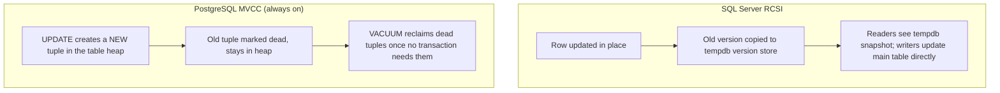
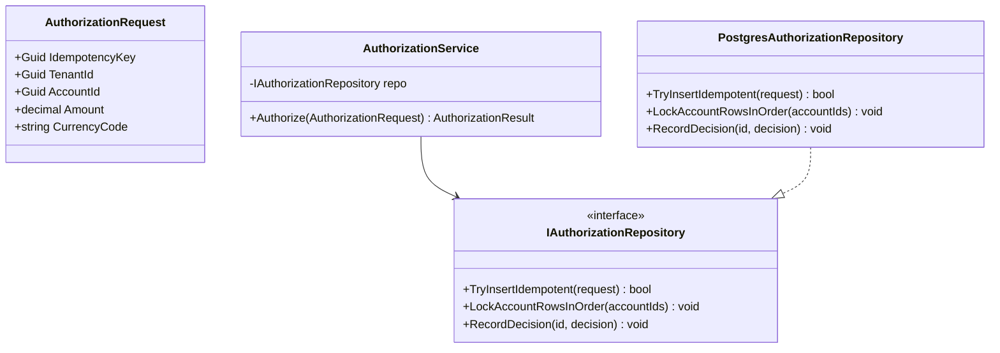
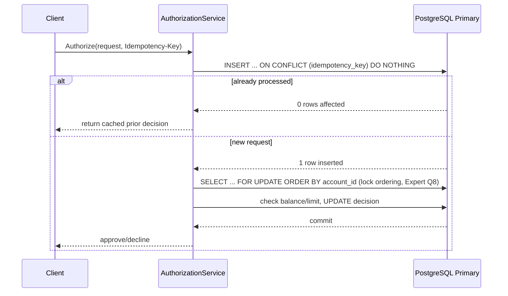
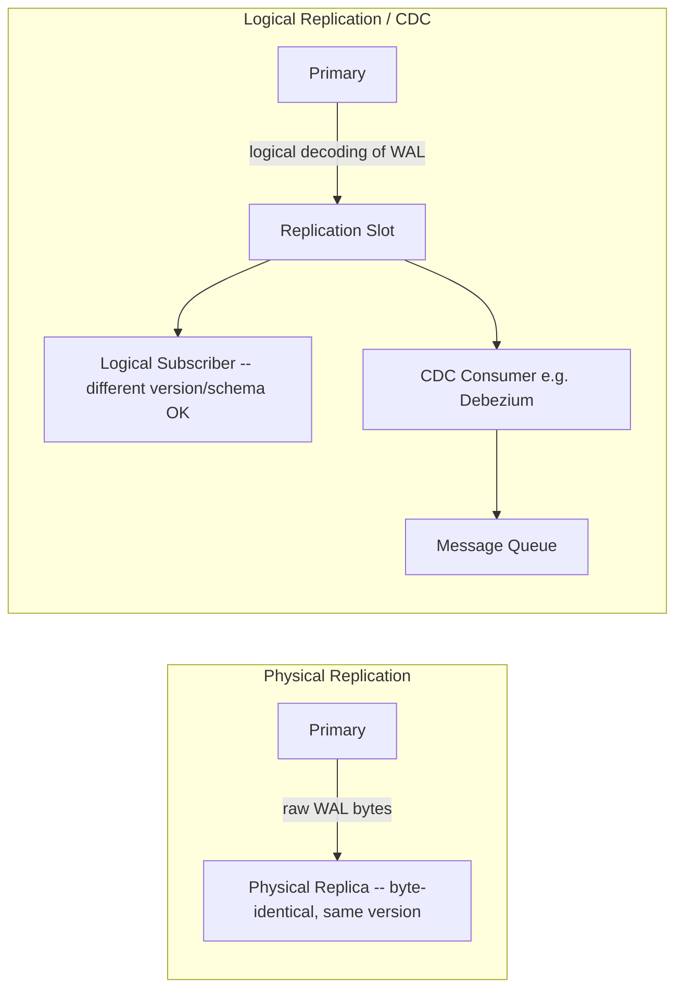
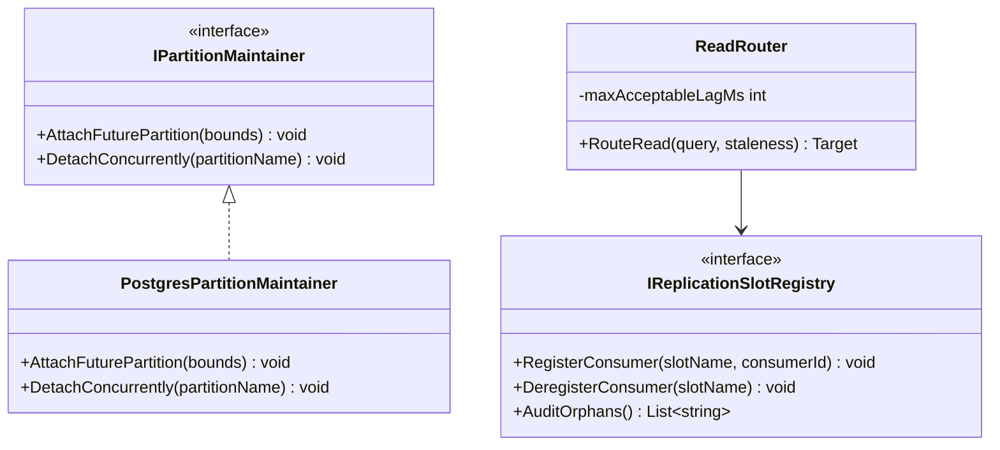
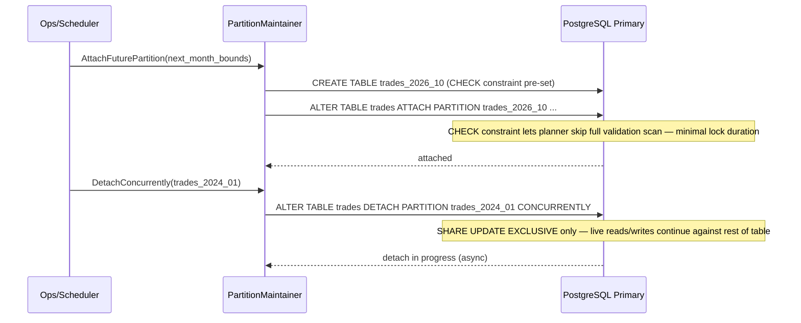

# PostgreSQL — Complete Interview Prep (All Topics, One File)

> Domain: PostgreSQL | Level: Beginner → Expert | Prerequisite: [[../04-SQL-Server/01-SQL-Server-Interview-Prep]] (indexing, isolation, locking — this file focuses on what's different)
> **Quick-prep edition** (consolidated 2026-10-03). This one file replaces Modules 21–22. Originals: `git show ebb2d5c:05-PostgreSQL/<file>.md`
> Each topic has: **Key concepts → Code example → Most common interview questions with answers.**

| # | Topic | # | Topic |
|---|---|---|---|
| 1 | Architecture & PostgreSQL vs SQL Server | 7 | Partitioning |
| 2 | MVCC, VACUUM, bloat & XID wraparound | 8 | WAL, replication, failover & backups |
| 3 | Storage, HOT updates & index types | 9 | Logical replication, logical decoding & CDC |
| 4 | Query plans & performance diagnostics | 10 | Extensions, multi-tenancy, PG for queues/search |
| 5 | Transactions, isolation, locking & upserts | 11 | Top 30 rapid-fire + Principal questions |
| 6 | Schema migrations, JSONB & connection pooling | 12 | Mistakes checklist |

---

## 1. Architecture & PostgreSQL vs SQL Server

**Key concepts**
- **Process per connection** (the postmaster forks a backend per client) → connections are expensive → use a **pooler (PgBouncer, RDS Proxy)**.
- Shared buffers + OS page cache; **WAL** (write-ahead log) for durability; background workers (autovacuum, checkpointer, WAL writer).
- **MVCC inside the table:** updates write a *new tuple version*; old versions stay until VACUUM removes them (SQL Server keeps versions in tempdb only when RCSI/SNAPSHOT is on).
- **Heap tables:** no clustered index; every index points to a tuple location (`ctid`).
- **Transactional DDL:** `CREATE/ALTER/DROP` can be rolled back (except a few, e.g. `CREATE INDEX CONCURRENTLY`, `VACUUM`).
- **Default isolation is READ COMMITTED with snapshots** (readers never block writers) — like SQL Server's RCSI.
- **Extensions:** PostGIS, pgvector, pg_partman, pg_stat_statements, TimescaleDB, Citus.
- Open source, no licence cost; very rich types: `jsonb`, arrays, ranges, enums, UUID, `inet`.

| Topic | SQL Server | PostgreSQL |
|---|---|---|
| Row versions | tempdb version store (if RCSI/SNAPSHOT) | in the table (dead tuples) → VACUUM |
| Clustered index | yes (the table is sorted) | no (heap; `CLUSTER` is a one-off reorder) |
| Default reads | locking READ COMMITTED (unless RCSI) | snapshot READ COMMITTED |
| SERIALIZABLE | key-range locks (blocking) | SSI — no blocking, **serialization failures → retry** |
| Upsert | MERGE / UPDATE+INSERT | `INSERT ... ON CONFLICT` |
| Identity | `IDENTITY` | `GENERATED ALWAYS AS IDENTITY` / sequences |
| Connections | threads, cheap | processes, expensive → pooler |
| Case sensitivity | collation-dependent (often insensitive) | identifiers fold to lowercase; text comparison case-sensitive (`citext`/`ILIKE`) |
| Top N | `TOP` | `LIMIT/OFFSET` (or `FETCH FIRST`) |
| Plans | estimated/actual plan, Query Store | `EXPLAIN (ANALYZE, BUFFERS)`, `pg_stat_statements` |

```sql
-- Identity, rich types, constraints
CREATE TABLE orders (
    order_id     BIGINT GENERATED ALWAYS AS IDENTITY PRIMARY KEY,
    customer_id  BIGINT NOT NULL REFERENCES customers(customer_id),
    amount       NUMERIC(19,4) NOT NULL CHECK (amount > 0),
    currency     CHAR(3) NOT NULL,
    tags         TEXT[] NOT NULL DEFAULT '{}',
    attrs        JSONB NOT NULL DEFAULT '{}',
    created_at   TIMESTAMPTZ NOT NULL DEFAULT now()
);

-- Transactional DDL: all or nothing
BEGIN;
ALTER TABLE orders ADD COLUMN status TEXT NOT NULL DEFAULT 'NEW';   -- fast since PG 11 (no rewrite)
CREATE INDEX ix_orders_status ON orders(status);
COMMIT;   -- or ROLLBACK and both disappear
```

**Common interview questions**

**Q1. How does PostgreSQL's MVCC differ from SQL Server's?**
PostgreSQL stores row versions in the table itself: an UPDATE creates a new tuple and marks the old one dead (`xmax`), and readers see the version valid for their snapshot. So readers never block writers by default — but dead tuples accumulate and must be removed by VACUUM. SQL Server uses locking by default and keeps versions in tempdb only with RCSI/SNAPSHOT.

**Q2. Why is there no clustered index, and what follows?**
Tables are heaps; indexes point to tuple IDs. There's no physical ordering to design around, no clustered-key choice, and secondary indexes don't carry a clustering key — but range scans on unordered data can be slower. `CLUSTER` reorders once (not maintained); BRIN indexes and partitioning help naturally ordered data.

**Q3. Why does PostgreSQL need a connection pooler?**
Each connection is an OS process using several MB plus per-backend caches; thousands of connections waste memory and cause context switching. PgBouncer in transaction mode multiplexes many clients over few server connections. Caveat: transaction pooling breaks session state (session-level prepared statements, `SET`, advisory locks held across transactions, `LISTEN/NOTIFY`).

**Q4. When would you choose PostgreSQL over SQL Server (or vice versa)?**
PostgreSQL: no licence cost, cloud portability, extensions (PostGIS, pgvector), excellent JSONB, strong community, cloud-managed everywhere (RDS, Aurora, Azure Flexible Server). SQL Server: deep Windows/.NET/SSIS/SSRS ecosystem, existing DBA skills, built-in features (Always On AGs, columnstore, Query Store, temporal tables), enterprise support contracts. Total cost of ownership and team skills usually decide it.

**Q5. What bites teams migrating from SQL Server to PostgreSQL?**
Vacuum and bloat operations, connection pooling, case-sensitive text comparison, identifier folding to lowercase, no clustered index, different SERIALIZABLE semantics (retries), different date/time types (`timestamptz`), T-SQL procedures to rewrite in PL/pgSQL, `NOLOCK`-style hints don't exist, and query plans with no hints (use pg_hint_plan or rewrite the query).

---

## 2. MVCC, VACUUM, Bloat & Transaction ID Wraparound

**Key concepts**
- Each tuple has `xmin` (the creating transaction) and `xmax` (the deleting/updating transaction). An UPDATE = new tuple + old tuple marked dead.
- **VACUUM** removes dead tuples (making the space reusable — not returned to the OS), updates the **visibility map** (enables index-only scans), and **freezes** old XIDs. **VACUUM FULL** rewrites the table to shrink it (exclusive lock! → use `pg_repack` online). **ANALYZE** updates statistics.
- **Autovacuum** triggers after `autovacuum_vacuum_scale_factor` (default 20%) + threshold of rows change → too lazy for big, hot tables → tune per table.
- **Vacuum horizon:** VACUUM can't remove tuples still visible to the **oldest running transaction**. Blockers: long-running queries, **idle-in-transaction** sessions, **abandoned replication slots**, forgotten prepared transactions, hot_standby_feedback from replicas.
- **Bloat:** table and index size grow while live data stays flat → slower scans, more I/O.
- **Transaction ID wraparound:** XIDs are 32-bit (~2 billion usable in each direction). Rows must be **frozen** before old XIDs wrap; if freezing falls behind, PostgreSQL forces aggressive anti-wraparound vacuums and eventually **stops accepting writes** to protect data. Monitor `age(datfrozenxid)`.
- `COUNT(*)` must check tuple visibility → it scans (no metadata shortcut); use estimates (`reltuples`) for dashboards.

```sql
-- Find tables with the most dead tuples and the last autovacuum
SELECT relname, n_live_tup, n_dead_tup, last_autovacuum, last_autoanalyze
FROM pg_stat_user_tables ORDER BY n_dead_tup DESC LIMIT 10;

-- Who is holding back the vacuum horizon?
SELECT pid, state, xact_start, now() - xact_start AS age, query
FROM pg_stat_activity WHERE xact_start IS NOT NULL ORDER BY xact_start LIMIT 5;
SELECT slot_name, active, restart_lsn FROM pg_replication_slots;          -- abandoned slots?

-- Wraparound risk
SELECT datname, age(datfrozenxid) FROM pg_database ORDER BY 2 DESC;      -- alert well before ~200M+ … 2B

-- Per-table autovacuum tuning for a hot table
ALTER TABLE events SET (autovacuum_vacuum_scale_factor = 0.01, autovacuum_vacuum_cost_limit = 2000);

-- Kill idle-in-transaction sessions automatically
ALTER DATABASE app SET idle_in_transaction_session_timeout = '60s';

-- Fast approximate count
SELECT reltuples::BIGINT FROM pg_class WHERE relname = 'events';
```

**Common interview questions**

**Q1. What does VACUUM actually do?**
It removes dead tuple versions no longer visible to any transaction, so the space can be reused; updates the free-space and visibility maps (enabling index-only scans); and freezes old transaction IDs to prevent wraparound. It doesn't shrink files (except trailing empty pages) — `VACUUM FULL` or `pg_repack` does.

**Q2. A table is 5× its live data size and queries have slowed. Diagnose it.**
Bloat. Check `n_dead_tup` and `last_autovacuum`; then find what's blocking cleanup — long or idle-in-transaction sessions, an inactive replication slot, standby feedback. Fix the blocker, run VACUUM, tune autovacuum for that table (lower scale factor, higher cost limit), and reclaim space online with `pg_repack` if needed. Prevent it with timeouts and slot monitoring.

**Q3. What is transaction ID wraparound?**
PostgreSQL compares 32-bit XIDs circularly; after about 2 billion transactions, old rows would appear to be "in the future" and become invisible. Freezing marks old rows as visible to everyone. If freezing can't keep up (autovacuum blocked or disabled), the database warns and eventually refuses writes until a vacuum completes. Avoid it with healthy autovacuum, monitoring `age(datfrozenxid)`, and no long transactions.

**Q4. How do you tune autovacuum for a high-churn table?**
Lower `autovacuum_vacuum_scale_factor` (e.g., 0.01–0.05) so it runs more often in smaller chunks; raise `autovacuum_vacuum_cost_limit` so it finishes faster; add workers if many tables are hot; for append-only tables, rely on insert-triggered vacuum (PG 13+). Make sure nothing holds back the horizon.

**Q5. Why is `COUNT(*)` slow on a big table?**
MVCC means visibility differs per transaction, so PostgreSQL must check each tuple (or use an index-only scan with a mostly all-visible visibility map). Use `pg_class.reltuples` estimates, counter tables, or cached counts when exact numbers aren't needed.

---

## 3. Storage, HOT Updates & Index Types

**Key concepts**
- **HOT (Heap-Only Tuple) updates:** if no **indexed column** changes and the page has free space, the new version stays on the same page and **indexes aren't touched** → much cheaper. Set `fillfactor` (e.g., 80–90) on update-heavy tables; avoid indexing frequently updated columns.
- **Index types**

| Type | Use for |
|---|---|
| **B-tree** (default) | equality, ranges, sorting, uniqueness |
| **Hash** | equality only (rarely better than B-tree) |
| **GIN** | `jsonb` containment, arrays, full-text search (`tsvector`) |
| **GiST** | geometry (PostGIS), ranges, nearest neighbour, exclusion constraints |
| **SP-GiST** | partitioned spaces (IP ranges, quadtrees) |
| **BRIN** | huge, naturally ordered tables (time-series) — tiny index of block ranges |
| **pgvector HNSW/IVFFlat** | vector similarity search |

- **Partial indexes** (`WHERE status = 'PENDING'`), **expression indexes** (`lower(email)`), **covering indexes** (`INCLUDE`), **multicolumn** (leftmost prefix).
- **Index-only scans** need the visibility map to be up to date (VACUUM).
- `CREATE INDEX CONCURRENTLY` (no write lock; can't run in a transaction; on failure leaves an **INVALID** index to drop and retry). `REINDEX CONCURRENTLY` (PG 12+) to rebuild bloated indexes online.
- **Exclusion constraints** (GiST) prevent overlapping ranges (bookings).

```sql
-- Expression index for case-insensitive lookups
CREATE UNIQUE INDEX ux_users_email ON users (lower(email));
SELECT * FROM users WHERE lower(email) = lower('Ana@Example.com');

-- Partial index for a hot subset
CREATE INDEX ix_payments_pending ON payments (created_at) WHERE status = 'PENDING';

-- Covering index
CREATE INDEX ix_orders_cust ON orders (customer_id, created_at DESC) INCLUDE (amount, status);

-- GIN for JSONB and arrays
CREATE INDEX ix_orders_attrs ON orders USING GIN (attrs jsonb_path_ops);
SELECT * FROM orders WHERE attrs @> '{"channel": "mobile"}';
CREATE INDEX ix_orders_tags ON orders USING GIN (tags);
SELECT * FROM orders WHERE tags @> ARRAY['vip'];

-- BRIN for a time-ordered append-only table
CREATE INDEX ix_events_time ON events USING BRIN (event_time);

-- No double booking (exclusion constraint)
CREATE EXTENSION IF NOT EXISTS btree_gist;
CREATE TABLE bookings (room_id INT, during TSTZRANGE,
    EXCLUDE USING GIST (room_id WITH =, during WITH &&));

-- Online index creation
CREATE INDEX CONCURRENTLY ix_orders_status ON orders(status);
-- If it fails: DROP INDEX CONCURRENTLY ix_orders_status; then retry

-- HOT-friendly fill factor
ALTER TABLE accounts SET (fillfactor = 85);
```

**Common interview questions**

**Q1. What is a HOT update and why does it matter?**
When an update doesn't change any indexed column and there's room on the same page, PostgreSQL creates the new tuple version on that page without updating any index. That avoids index write amplification and bloat. Enable it with a lower fillfactor and by not indexing frequently updated columns.

**Q2. Which index type when?**
B-tree for most lookups and ranges; GIN for JSONB, arrays and full-text; GiST for geospatial, ranges and exclusion constraints; BRIN for huge time-ordered tables where a tiny index is enough; pgvector for embeddings.

**Q3. What can go wrong with `CREATE INDEX CONCURRENTLY`?**
It takes longer (two table scans), can't run inside a transaction, waits for existing transactions, and if it fails (deadlock, uniqueness violation) it leaves an INVALID index that still adds write overhead — drop it and retry.

**Q4. When is an index-only scan possible?**
When the index covers all needed columns and the visibility map shows the pages are all-visible (so no heap check is needed). Frequent VACUUM keeps the visibility map current.

---

## 4. Query Plans & Performance Diagnostics

**Key concepts**
- `EXPLAIN` (estimates) vs **`EXPLAIN (ANALYZE, BUFFERS)`** (actually runs it: real rows, time, and shared hits vs reads). Compare `rows=` estimated vs actual.
- Nodes: Seq Scan, Index Scan, Index Only Scan, Bitmap Heap/Index Scan (many rows from an index), Nested Loop, Hash Join, Merge Join, Sort (watch "external merge Disk" → raise `work_mem`), HashAggregate, Gather (parallel).
- **`pg_stat_statements`:** the top queries by total time, calls and rows — the equivalent of Query Store's top consumers (no automatic plan forcing).
- **`pg_stat_activity`** (what's running and waiting: `wait_event_type`), **`pg_locks`** (blocking), `pg_stat_user_tables/indexes` (scans, unused indexes).
- Statistics: `ANALYZE`; raise `default_statistics_target` or set per column; **extended statistics** (`CREATE STATISTICS`) for correlated columns.
- **Generic vs custom plans** for prepared statements: after 5 executions PG may switch to a generic plan (parameter-sniffing-like issues) → `plan_cache_mode = force_custom_plan` if needed.
- No query hints in core (pg_hint_plan extension) → fix with statistics, indexes and query rewrites.
- Key settings: `shared_buffers` (~25% RAM), `effective_cache_size`, `work_mem` (per sort/hash node!), `maintenance_work_mem`, `random_page_cost` (lower on SSD).

```sql
EXPLAIN (ANALYZE, BUFFERS)
SELECT * FROM orders WHERE customer_id = 42 AND created_at >= now() - interval '30 days';
-- Look for: Seq Scan on large tables, rows estimated vs actual, "Sort Method: external merge Disk"

-- Top queries by total time
CREATE EXTENSION IF NOT EXISTS pg_stat_statements;
SELECT query, calls, total_exec_time, mean_exec_time, rows
FROM pg_stat_statements ORDER BY total_exec_time DESC LIMIT 10;

-- Who blocks whom
SELECT blocked.pid AS blocked_pid, blocking.pid AS blocking_pid, blocked.query AS blocked_query, blocking.query AS blocking_query
FROM pg_stat_activity blocked
JOIN pg_stat_activity blocking ON blocking.pid = ANY(pg_blocking_pids(blocked.pid));

-- Unused indexes
SELECT relname, indexrelname, idx_scan FROM pg_stat_user_indexes WHERE idx_scan = 0;

-- Correlated columns statistics
CREATE STATISTICS st_city_zip (dependencies) ON city, zip FROM addresses; ANALYZE addresses;
```

**Common interview questions**

**Q1. How do you read a PostgreSQL plan, and how does it differ from SQL Server's?**
A text tree read from the innermost node outward; each node shows estimated cost and rows, and with ANALYZE the actual rows, loops and time; BUFFERS shows cache hits vs disk reads. Differences: no graphical plan by default, no Query Store–style plan forcing, no hints; Bitmap scans are common; sort/hash memory is `work_mem` per node.

**Q2. How do you troubleshoot a slow PostgreSQL system?**
`pg_stat_statements` for the top consumers; `pg_stat_activity` for current waits (Lock, IO, LWLock); `EXPLAIN (ANALYZE, BUFFERS)` on the worst queries; check bloat and vacuum health, stale statistics, missing or unused indexes, connection count and pooling, checkpoints and WAL volume, and replication lag.

**Q3. What's the generic plan problem?**
Prepared statements switch to a generic (parameter-independent) plan after several executions if it looks no worse; with skewed data that plan can be bad for some values — similar to parameter sniffing. Set `plan_cache_mode = force_custom_plan` for those statements, or restructure the query.

---

## 5. Transactions, Isolation, Locking & Upserts

**Key concepts**
- Isolation levels: READ COMMITTED (default, a snapshot per statement), REPEATABLE READ (a snapshot per transaction; update conflicts → error), **SERIALIZABLE = SSI** (detects dangerous read/write dependencies and aborts one transaction with **SQLSTATE 40001** → the app **must retry**). READ UNCOMMITTED behaves like READ COMMITTED.
- Row locks: `SELECT ... FOR UPDATE` / `FOR NO KEY UPDATE` / `FOR SHARE`; **`SKIP LOCKED`** for queue workers; `NOWAIT`.
- **Advisory locks** (`pg_advisory_xact_lock(key)`) for application-level mutual exclusion.
- **Deadlocks** are detected after `deadlock_timeout` (1 s) → one transaction aborted (40P01) → retry.
- **`INSERT ... ON CONFLICT (key) DO UPDATE/DO NOTHING`** = an atomic upsert (requires a unique constraint or index). `RETURNING` gives back the generated or updated rows. `MERGE` exists since PG 15.
- Lock levels for DDL matter (§6).

```sql
-- Atomic, concurrency-safe upsert
INSERT INTO balances (account_id, amount) VALUES (42, 100)
ON CONFLICT (account_id) DO UPDATE SET amount = balances.amount + EXCLUDED.amount
RETURNING amount;

-- Idempotent insert
INSERT INTO processed_messages (message_id) VALUES ($1) ON CONFLICT DO NOTHING;   -- 0 rows → duplicate

-- Queue worker: claim jobs without blocking other workers
WITH next AS (
    SELECT id FROM jobs WHERE status = 'NEW' ORDER BY id
    FOR UPDATE SKIP LOCKED LIMIT 10)
UPDATE jobs j SET status = 'RUNNING', started_at = now()
FROM next WHERE j.id = next.id
RETURNING j.*;

-- Overdraft-safe debit
UPDATE accounts SET balance = balance - 50 WHERE id = 1 AND balance >= 50 RETURNING balance;

-- SERIALIZABLE with retry (pseudo)
-- BEGIN ISOLATION LEVEL SERIALIZABLE; ...; COMMIT;  on SQLSTATE 40001 → retry the whole transaction
```

**Common interview questions**

**Q1. How does PostgreSQL's SERIALIZABLE differ from SQL Server's?**
SQL Server uses key-range locks (pessimistic, blocking). PostgreSQL uses Serializable Snapshot Isolation: transactions run on snapshots without extra blocking, and the engine aborts one when it detects a cycle of dependencies that could produce a non-serializable result (40001). Applications must be written to retry.

**Q2. When would you use `ON CONFLICT` over other upsert approaches?**
Whenever you have a unique key — it's atomic and race-free under concurrency, unlike SELECT-then-INSERT. Use `DO NOTHING` for idempotent inserts and `DO UPDATE` with `EXCLUDED` for merges. `MERGE` (PG 15+) handles more complex multi-action logic but isn't immune to concurrent-insert races without a unique constraint.

**Q3. How do you build a job queue on PostgreSQL?**
A jobs table plus `SELECT ... FOR UPDATE SKIP LOCKED LIMIT n` so workers claim different rows without blocking; status, attempts and visibility timeout columns; indexes on status; and `LISTEN/NOTIFY` to wake workers. It works well up to moderate throughput — move to a broker for high-volume streams.

**Q4. What are advisory locks for?**
Application-defined locks on arbitrary keys (e.g., "only one instance runs the nightly job", "serialize operations per account") without locking table rows. Use the transaction-scoped variant so locks release automatically, and note they don't work with transaction-mode poolers if session-scoped.

---

## 6. Schema Migrations, JSONB & Connection Pooling

**Key concepts — safe migrations**
- Many `ALTER TABLE` forms take an **ACCESS EXCLUSIVE** lock. Worse: a DDL statement **waiting** for a lock blocks every later query (lock queue) → always `SET lock_timeout = '5s'` and retry.
- Safe patterns: add a nullable column or one with a constant default (no rewrite since PG 11); `CREATE INDEX CONCURRENTLY`; add constraints as **`NOT VALID`** then **`VALIDATE CONSTRAINT`** (a weaker lock); add NOT NULL via a CHECK constraint `NOT VALID` → validate → `SET NOT NULL` (PG 12+ uses the check); avoid type changes that rewrite the table (use a new column + backfill).
- Backfill in batches; expand–contract for renames.

**Key concepts — JSONB**
- Binary JSON, indexable with GIN (`@>`, `?`, `jsonb_path_ops`), operators `->`, `->>`, `#>`, `jsonb_set`, `jsonb_path_query`.
- Good for: genuinely variable attributes, external payloads, metadata. Bad for: core relational data you filter, join or constrain (lost types, constraints and statistics).
- Expression or generated columns for frequently queried JSON fields.

**Key concepts — pooling**
- **PgBouncer** modes: session (safe, little benefit), **transaction** (most common — breaks session features), statement.
- Size: total server connections ≈ a small multiple of CPU cores; many app instances × pool size can exceed `max_connections` → central pooler or RDS Proxy.

```sql
-- Safe migration session settings
SET lock_timeout = '5s';
SET statement_timeout = '15min';

-- Add a FK without a long lock
ALTER TABLE orders ADD CONSTRAINT fk_orders_customer FOREIGN KEY (customer_id) REFERENCES customers(customer_id) NOT VALID;
ALTER TABLE orders VALIDATE CONSTRAINT fk_orders_customer;     -- SHARE UPDATE EXCLUSIVE, allows reads/writes

-- Add NOT NULL safely
ALTER TABLE orders ADD CONSTRAINT ck_orders_currency_nn CHECK (currency IS NOT NULL) NOT VALID;
ALTER TABLE orders VALIDATE CONSTRAINT ck_orders_currency_nn;
ALTER TABLE orders ALTER COLUMN currency SET NOT NULL;         -- uses the validated check (PG 12+)
ALTER TABLE orders DROP CONSTRAINT ck_orders_currency_nn;

-- JSONB
SELECT attrs->>'channel' AS channel, (attrs->'risk'->>'score')::INT AS risk
FROM orders WHERE attrs @> '{"channel":"mobile"}';
UPDATE orders SET attrs = jsonb_set(attrs, '{risk,score}', '42') WHERE order_id = 1;
ALTER TABLE orders ADD COLUMN channel TEXT GENERATED ALWAYS AS (attrs->>'channel') STORED;  -- promote a hot field
```

```ini
; pgbouncer.ini essentials
[pgbouncer]
pool_mode = transaction
max_client_conn = 5000
default_pool_size = 40
server_idle_timeout = 600
```

**Common interview questions**

**Q1. How do you run schema migrations safely on a live PostgreSQL database?**
Set `lock_timeout` so DDL can't queue behind long queries and freeze traffic; use non-rewriting changes (nullable columns, constant defaults); `CREATE INDEX CONCURRENTLY`; `NOT VALID` + `VALIDATE` for constraints; batch backfills; expand–contract for renames and type changes; and test on production-sized data.

**Q2. Normalized column or a JSONB attribute?**
If you filter, join, aggregate, constrain or need statistics on it, make it a column. Use JSONB for sparse, evolving or externally defined attributes. Promote hot JSON fields to generated columns. JSONB as a way to "avoid schema design" leads to unvalidated data and slow queries.

**Q3. What does PgBouncer's transaction mode break?**
Anything relying on a stable session: `SET` variables, session-level prepared statements (supported in newer PgBouncer versions with configuration), temporary tables across transactions, session advisory locks, and `LISTEN/NOTIFY`. Design the app to be session-stateless.

**Q4. How do you manage connections for 200 microservice pods?**
Small per-pod pools; a central pooler (PgBouncer/RDS Proxy) in front of the database; cap `max_connections` sensibly; use read replicas for read traffic; and alert on connection saturation and idle-in-transaction sessions.

---

## 7. Partitioning

**Key concepts**
- **Declarative partitioning:** `PARTITION BY RANGE` (time), `LIST` (region/tenant), `HASH` (even spread); sub-partitioning is possible.
- **Pruning:** at plan time (constant predicates) or at execution time (parameters, joins). Functions on the partition key or non-immutable expressions defeat pruning.
- **The partition key must be part of every PRIMARY KEY/UNIQUE constraint** (uniqueness is enforced per partition — there are no global unique indexes).
- **ATTACH PARTITION** validates rows (a scan) unless a matching CHECK constraint already exists; **DETACH PARTITION CONCURRENTLY** (PG 14+).
- **Retention:** drop or detach old partitions instead of `DELETE` (instant, no bloat). Pre-create future partitions (pg_partman). A DEFAULT partition catches strays (but makes attaching slower).
- Too many partitions → planning overhead; aim for partitions of manageable size (GBs) and a count in the hundreds, not tens of thousands.
- Partition-wise joins and aggregates (`enable_partitionwise_join`).
- Partitioning ≠ sharding (one server) → Citus for distributed PostgreSQL.

```sql
CREATE TABLE transactions (
    txn_id      BIGINT GENERATED ALWAYS AS IDENTITY,
    account_id  BIGINT NOT NULL,
    txn_time    TIMESTAMPTZ NOT NULL,
    amount      NUMERIC(19,4) NOT NULL,
    PRIMARY KEY (txn_time, txn_id)                  -- must include the partition key
) PARTITION BY RANGE (txn_time);

CREATE TABLE transactions_2026_10 PARTITION OF transactions
    FOR VALUES FROM ('2026-10-01') TO ('2026-11-01');
CREATE INDEX ON transactions (account_id, txn_time);   -- created on every partition

-- Retention: instant, no bloat
ALTER TABLE transactions DETACH PARTITION transactions_2025_10 CONCURRENTLY;
DROP TABLE transactions_2025_10;      -- or archive it first

-- Pruning works only when the key is constrained directly
EXPLAIN SELECT * FROM transactions WHERE txn_time >= '2026-10-01' AND txn_time < '2026-10-08';
```

**Common interview questions**

**Q1. What does partitioning give you, and what doesn't it?**
It gives partition pruning for queries filtered on the key, cheap retention (drop a partition), smaller indexes and vacuums per partition, and maintenance per partition. It doesn't give more write capacity than one server, global unique constraints, or faster queries that don't filter on the key.

**Q2. Why must the partition key be part of every unique constraint?**
Indexes are per partition, so PostgreSQL can only guarantee uniqueness within each partition; including the partition key makes per-partition uniqueness equal to global uniqueness. For a global unique business key, use a separate lookup table or enforce it upstream.

**Q3. How do you choose the partition key and granularity?**
The column most queries filter on and that drives retention (usually time); granularity sized so each partition is manageable (daily, weekly or monthly), with a total count in the hundreds. Use HASH when there's no natural range and you need even spread (e.g., by tenant).

**Q4. How would you migrate a big, live table to a partitioned one?**
Create the partitioned table; attach the existing table as one (old) partition after adding a matching CHECK constraint (validated online) so ATTACH doesn't scan; route new data to new partitions; split or migrate old data gradually. Or use logical replication or dual writes into the new structure and switch over.

---

## 8. WAL, Replication, Failover & Backups

**Key concepts**
- **WAL** = the ordered log of all changes. Used for crash recovery, physical replication, PITR and logical decoding. `wal_level`: replica / logical.
- **Streaming (physical) replication:** a byte-for-byte copy of the whole cluster; hot standbys serve **read-only** queries; asynchronous by default.
- **`synchronous_commit` + `synchronous_standby_names`:** with sync replicas, a commit waits for standby confirmation (RPO≈0, more latency; `ANY 1 (s1, s2)` quorum).
- **Replication lag** → stale reads on replicas; read-your-own-writes needs the primary or LSN-based waiting.
- **Hot standby conflicts:** replay (e.g., vacuum cleanup) can conflict with long queries on the standby → query cancelled; `hot_standby_feedback = on` prevents that but causes bloat on the primary; or `max_standby_streaming_delay`.
- **Replication slots** guarantee WAL is kept for a consumer → an **abandoned slot fills the primary's disk** and holds back vacuum. Monitor slots; set `max_slot_wal_keep_size`.
- **Failover:** PostgreSQL itself has no built-in automatic failover → **Patroni** (with etcd/Consul), repmgr, or managed services. Need fencing (avoid split brain), and `pg_rewind` to rejoin the old primary.
- **Backups:** base backup + continuous **WAL archiving** → **PITR** (pgBackRest, WAL-G, Barman). Replication is not a backup (a `DROP TABLE` replicates instantly).
- **Major upgrades:** `pg_upgrade --link` (minutes of downtime) or logical replication to the new version (near-zero downtime).

```sql
-- Replication lag on the primary
SELECT client_addr, state, sent_lsn, replay_lsn,
       pg_wal_lsn_diff(sent_lsn, replay_lsn) AS bytes_lag, replay_lag
FROM pg_stat_replication;

-- WAL retained by slots (disk-fill risk)
SELECT slot_name, active, pg_size_pretty(pg_wal_lsn_diff(pg_current_wal_lsn(), restart_lsn)) AS retained
FROM pg_replication_slots;

-- Synchronous replication: commit waits for any one of two standbys
ALTER SYSTEM SET synchronous_standby_names = 'ANY 1 (standby_a, standby_b)';
-- per-transaction relaxation for non-critical writes:
SET LOCAL synchronous_commit = 'local';
```

**Common interview questions**

**Q1. What is the WAL and why is it central?**
Every change is written to the WAL before the data files. It enables crash recovery (replay), physical replication (ship the WAL), point-in-time recovery (archive the WAL), and logical decoding/CDC (decode the WAL into row changes).

**Q2. Synchronous vs asynchronous replication?**
Async: lowest commit latency, but a failover can lose the last few transactions (RPO > 0). Sync: commits wait for a standby, so acknowledged writes survive failover (RPO≈0), at the cost of latency and availability (if the sync standby is down, commits wait — use quorum `ANY 1` with two standbys).

**Q3. The primary's disk is filling up. Diagnose it.**
Check `pg_wal` size: inactive replication slots retaining WAL, a failing `archive_command`, or a lagging replica or CDC consumer. Also table bloat, temp files from big sorts, and log files. Fix the slot (drop it if abandoned), fix archiving, and set `max_slot_wal_keep_size` and alerts.

**Q4. What makes automated failover safe?**
Consensus-based leader election (Patroni + etcd), fencing the old primary (so it can't accept writes — split brain), a defined RPO (sync vs async), clients reconnecting via a stable endpoint (DNS/VIP/HAProxy), and regularly rehearsed failovers. Rejoin the old primary with `pg_rewind`.

**Q5. How do you set RPO and RTO for PostgreSQL?**
RPO: synchronous replicas (≈0) or async + WAL archiving every few seconds or minutes. RTO: automated failover (seconds to minutes) vs restore from backup (hours, depending on size). Make it real with regular restore tests, PITR drills, and measured failover times.

**Q6. How do you upgrade a major version with minimal downtime?**
Logical replication from the old version to a new-version cluster, catch up, briefly stop writes, cut over the connection endpoint, then advance sequences (they aren't replicated). Or `pg_upgrade --link` with a short maintenance window. Test extensions and query plans on the new version first.

---

## 9. Logical Replication, Logical Decoding & CDC

**Key concepts**
- **Logical replication:** publications (on the source) + subscriptions (on the target) replicate **row changes for selected tables**, across versions and platforms; it includes an initial copy.
- **Doesn't replicate:** DDL (apply schema changes on both sides first), sequence values, `TRUNCATE` in old versions, large objects.
- **Replica identity:** UPDATE/DELETE need a primary key (or `REPLICA IDENTITY FULL`, which is expensive) to identify rows.
- **Logical decoding:** output plugins (`pgoutput`, `wal2json`) decode the WAL into change events via a **logical replication slot** — the basis for **Debezium CDC** into Kafka.
- CDC delivery is **at-least-once** (resume from the last confirmed LSN) → consumers must be idempotent; large transactions are emitted only after commit (memory/disk spill in the reorder buffer).
- CDC as an integration backbone couples consumers to your internal schema → prefer an **outbox table** published via CDC (a stable event contract).

```sql
-- Source
CREATE PUBLICATION orders_pub FOR TABLE orders, order_items;
-- Target
CREATE SUBSCRIPTION orders_sub CONNECTION 'host=src dbname=app user=repl' PUBLICATION orders_pub;

-- Tables without a PK need a replica identity for UPDATE/DELETE
ALTER TABLE audit_log REPLICA IDENTITY FULL;

-- Peek at logical decoding output (testing)
SELECT * FROM pg_create_logical_replication_slot('test_slot', 'wal2json');
SELECT data FROM pg_logical_slot_peek_changes('test_slot', NULL, NULL);
SELECT pg_drop_replication_slot('test_slot');      -- never leave test slots behind!
```

**Common interview questions**

**Q1. Physical vs logical replication?**
Physical copies the whole cluster byte-for-byte (same major version, read-only standbys) — for HA and read scaling. Logical replicates selected tables' row changes — across versions, to writable targets, for upgrades, migrations and integration — but it doesn't carry DDL or sequences.

**Q2. How would you set up CDC from PostgreSQL into Kafka?**
`wal_level = logical`, a Debezium connector with `pgoutput` using a dedicated replication slot and publication, an initial snapshot then streaming, and LSN offsets stored in Kafka Connect. Monitor slot lag (the disk-fill risk), handle schema evolution (a schema registry), make consumers idempotent, and preferably publish an outbox table instead of raw tables.

**Q3. What are the risks of making CDC the event backbone?**
Consumers bind to internal table schemas (refactors break them), events are row diffs rather than business events, slot failures can fill disks or stop replication, and ordering is per transaction rather than per business entity. The outbox pattern + CDC gives explicit, versioned events while keeping CDC's reliability.

**Q4. How do you handle schema changes across logical replication or CDC?**
Additive changes first: add the column on the subscriber and the consumers before the publisher; never drop or rename on the source until consumers have migrated; use a schema registry with compatibility rules for Debezium events; coordinate via expand–contract.

---

## 10. Extensions, Multi-Tenancy & PostgreSQL for Other Workloads

**Key concepts**
- **Extensions:** PostGIS (geospatial), **pgvector** (embeddings/RAG), TimescaleDB (time series), Citus (distributed/sharded), pg_partman, pg_cron, pg_stat_statements, `pgcrypto`, `uuid-ossp`. Check managed-service support before designing around one.
- **Multi-tenancy:** shared tables + `tenant_id` + **Row-Level Security (RLS)** policies; schema per tenant (thousands of schemas hurt catalogs and migrations); database per tenant (strong isolation, high ops cost); Citus for distributing by tenant.
- **PostgreSQL as a queue** (SKIP LOCKED), **search** (full-text `tsvector`, `pg_trgm`), **cache** (UNLOGGED tables), **analytics** (BRIN, partitioning, parallel query) — fine at moderate scale, and fewer moving parts; move to specialized systems when scale or requirements exceed it.

```sql
-- Row-level security per tenant
ALTER TABLE invoices ENABLE ROW LEVEL SECURITY;
CREATE POLICY tenant_isolation ON invoices USING (tenant_id = current_setting('app.tenant_id')::BIGINT);
-- per request/transaction:
SET LOCAL app.tenant_id = '42';
-- Note: table owners and superusers bypass RLS unless FORCE ROW LEVEL SECURITY

-- Full-text search
ALTER TABLE articles ADD COLUMN tsv TSVECTOR GENERATED ALWAYS AS (to_tsvector('english', title || ' ' || body)) STORED;
CREATE INDEX ix_articles_tsv ON articles USING GIN (tsv);
SELECT id, title FROM articles WHERE tsv @@ plainto_tsquery('english', 'payment reconciliation');

-- Vector similarity (pgvector)
CREATE EXTENSION IF NOT EXISTS vector;
CREATE TABLE docs (id BIGSERIAL PRIMARY KEY, content TEXT, embedding VECTOR(1536));
CREATE INDEX ON docs USING hnsw (embedding vector_cosine_ops);
SELECT id, content FROM docs ORDER BY embedding <=> $1 LIMIT 5;
```

**Common interview questions**

**Q1. How do you handle multi-tenancy in PostgreSQL?**
Usually shared tables with `tenant_id` leading the indexes and RLS policies enforcing isolation in the database (with `SET LOCAL` per transaction, compatible with transaction pooling), plus per-tenant rate limits. Big or regulated tenants can get dedicated databases. Citus distributes tenants across nodes at scale.

**Q2. Should we use PostgreSQL for queues, search and caching?**
At moderate scale, yes — fewer systems, transactional consistency with your data (e.g., enqueue a job in the same transaction as the business write). Switch when you need high-throughput streaming (Kafka), advanced relevance and ranking (OpenSearch), or sub-millisecond caching (Redis). Decide on measured needs.

**Q3. Managed PostgreSQL (RDS/Aurora/Azure) or self-managed?**
Managed by default: automated backups/PITR, patching, failover and monitoring. Trade-offs: limited superuser access and extensions, version lag, cost at scale, vendor-specific behaviour (Aurora's storage layer). Self-manage only with a strong DBA team and special requirements.

---

## 11. Top 30 Rapid-Fire Questions + Principal Questions

1. **MVCC storage?** In-table tuple versions (`xmin`/`xmax`).
2. **Readers block writers?** No (snapshots).
3. **VACUUM?** Removes dead tuples, updates the visibility map, freezes XIDs.
4. **VACUUM FULL?** Rewrites the table with an exclusive lock → prefer `pg_repack`.
5. **Autovacuum default trigger?** ~20% of rows changed → tune hot tables.
6. **What blocks vacuum?** Long or idle transactions, stale slots, standby feedback.
7. **XID wraparound?** 32-bit XIDs → freeze or the DB stops writes.
8. **Clustered index?** None (heap).
9. **HOT update?** No indexed column changed + free space on the page → no index writes.
10. **GIN?** JSONB, arrays, full-text.
11. **BRIN?** Huge, naturally ordered tables.
12. **GiST?** Geospatial, ranges, exclusion constraints.
13. **Index without blocking writes?** `CREATE INDEX CONCURRENTLY`.
14. **Upsert?** `INSERT ... ON CONFLICT`.
15. **Queue pattern?** `FOR UPDATE SKIP LOCKED`.
16. **SERIALIZABLE?** SSI → retry on 40001.
17. **Transactional DDL?** Yes (mostly).
18. **Safe constraint add?** `NOT VALID` then `VALIDATE`.
19. **Migration lock safety?** `lock_timeout`.
20. **Top queries?** `pg_stat_statements`.
21. **Real plan?** `EXPLAIN (ANALYZE, BUFFERS)`.
22. **Connection cost?** A process each → PgBouncer.
23. **Partition key rule?** Must be in every PK/unique constraint.
24. **Retention?** Detach/drop partitions.
25. **WAL?** The log behind durability, replication, PITR and CDC.
26. **Abandoned slot?** Fills the disk, blocks vacuum.
27. **Automatic failover?** Patroni or managed services.
28. **Logical replication misses?** DDL, sequences.
29. **CDC tool?** Debezium via `pgoutput`.
30. **Tenant isolation?** RLS + `tenant_id`.

**Principal-level questions**

**P1. Plan a migration of a large production system from SQL Server to PostgreSQL.**
Assess the T-SQL surface (procedures, functions, triggers, SQL Agent jobs, SSIS), data types and collations; convert the schema (AWS SCT or similar) and fix behaviour differences (case sensitivity, identity, dates); port code and test functional and performance parity on production-sized data; migrate data with an initial load + CDC (AWS DMS/Debezium) to keep in sync; dual-run with comparison of results; cut over during a short window with a rollback path (reverse replication); then train the team on vacuum, pooling and monitoring.

**P2. What operational baseline would you mandate for PostgreSQL across the organisation?**
Managed service or Patroni; PgBouncer; `pg_stat_statements`; autovacuum tuning guidance and bloat monitoring; alerts on XID age, slot retention, replication lag, connection saturation and idle-in-transaction; `lock_timeout`/`statement_timeout` defaults; pgBackRest/WAL archiving with monthly restore tests; migration linting (e.g., squawk); and a runbook for failover.

**P3. How do you design for very high write throughput given MVCC?**
Minimize indexes on hot tables; HOT-friendly design (fillfactor, don't index churny columns); batch inserts (COPY); partition by time so vacuum works per partition and old data is dropped; tune autovacuum aggressively; separate WAL on fast disks; consider `synchronous_commit = off` for non-critical data; and shard with Citus or by application if one node isn't enough.

**P4. Multi-region PostgreSQL — how?**
Usually one writable primary region + async read replicas in other regions (stale reads and a regional-failover RPO > 0), with promotion during disaster recovery. Multi-writer needs conflict handling (logical replication bi-directional, EDB/pgEdge, or app-level partitioning by region/home region). Or choose a distributed SQL database (Aurora Global, CockroachDB, YugabyteDB) when you truly need multi-region writes.

---

## 12. Mistakes Checklist (say why each is wrong)
- [ ] Ignoring autovacuum · `VACUUM FULL` in business hours · disabling autovacuum
- [ ] Long-running or idle-in-transaction sessions · abandoned replication slots · no XID-age alerts
- [ ] Indexing frequently updated columns (kills HOT) · non-concurrent index builds on live tables · leaving INVALID indexes
- [ ] Migrations without `lock_timeout` · `ADD CONSTRAINT` without `NOT VALID` · column type changes that rewrite huge tables
- [ ] Thousands of direct connections without a pooler · session state under transaction pooling
- [ ] SELECT-then-INSERT upserts · SERIALIZABLE without retry logic
- [ ] JSONB for core relational data · `COUNT(*)` for dashboards on huge tables
- [ ] Partition keys not used in queries · unique constraints without the partition key · too many partitions
- [ ] Treating replicas as backups · never testing PITR restores · failover without fencing
- [ ] CDC on raw tables as a public contract · forgetting sequences in logical-replication cutovers
- [ ] RLS bypassed by table owners (no `FORCE ROW LEVEL SECURITY`)

---

## Architecture Diagrams (preserved from the original modules)

> All 6 Mermaid/ASCII diagrams from the original `05-PostgreSQL/` files, kept verbatim and grouped by source module. Originals: `git show ebb2d5c:05-PostgreSQL/<file>.md`.

### Module 21 — PostgreSQL: Fundamentals, MVCC & Comparison with SQL Server
*Source: `01-PostgreSQL-Fundamentals-vs-SQLServer.md`*

**3. Visual Architecture**



**13. Low-Level Design**



**13. Low-Level Design**



### Module 22 — PostgreSQL: Partitioning, Replication & Logical Decoding
*Source: `02-Partitioning-Replication-Logical-Decoding.md`*

**3. Visual Architecture**



**13. Low-Level Design**



**13. Low-Level Design**


