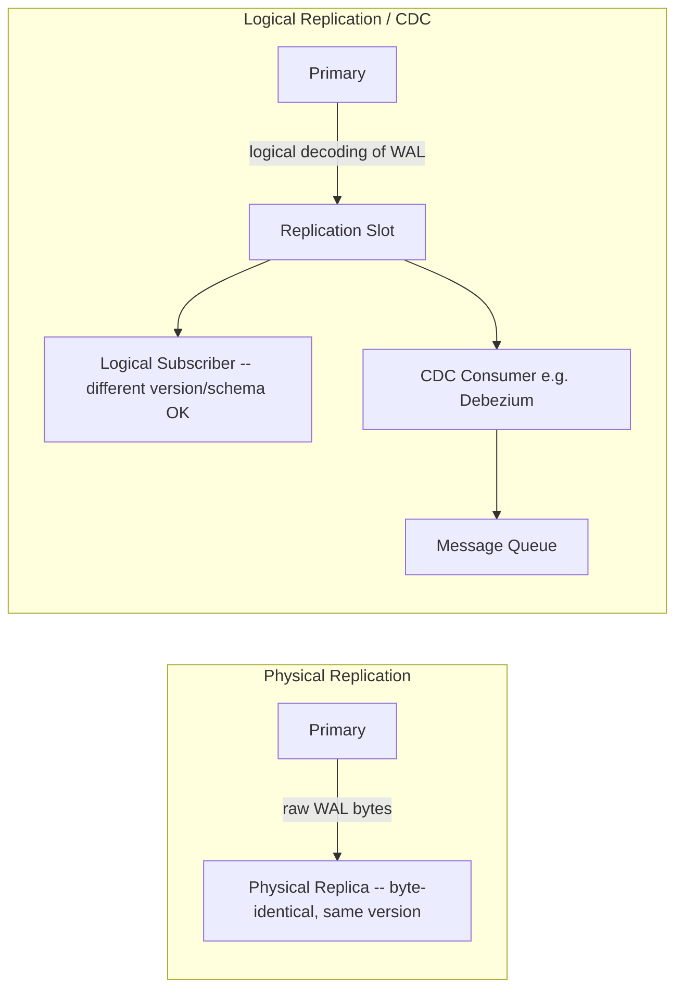

# Module 22 — PostgreSQL: Partitioning, Replication & Logical Decoding

> Domain: PostgreSQL | Level: Beginner → Expert | Prerequisite: [[01-PostgreSQL-Fundamentals-vs-SQLServer]]

---

## 1. Fundamentals

### What is table partitioning, replication, and logical decoding?
**Partitioning** splits one logically-unified table into multiple physical sub-tables (partitions), each holding a subset of rows (typically by date range or a hash/list key), transparently queried as if it were one table. **Replication** copies data from a primary database to one or more replicas — **physical** (streaming) replication copies raw WAL (Write-Ahead Log) bytes for a byte-identical replica; **logical** replication copies decoded, table-level changes, allowing selective, cross-version, or cross-schema replication. **Logical decoding** is the underlying mechanism extracting a stream of row-level changes from the WAL in a structured, consumable format — the foundation both logical replication and Change Data Capture (CDC) pipelines are built on.

### Why do these exist?
A single, monolithic table eventually becomes too large for efficient maintenance (vacuum, index rebuilds, archival deletion) — partitioning lets these operations target individual partitions (e.g., dropping an entire old-data partition instantly instead of a slow `DELETE`). Replication exists for both **high availability** (a standby ready to take over) and **read scaling** (routing read traffic to replicas). Logical decoding exists specifically to expose database changes in a consumable form for use cases beyond simple byte-for-byte replication — CDC pipelines feeding a message queue, cross-database sync, audit trails.

### When does this matter?
Partitioning matters once a table's size makes maintenance operations (vacuum, backup, archival) genuinely slow or disruptive; replication matters for any production system requiring HA/DR or read-scaling; logical decoding/CDC matters for event-driven architectures needing to react to database changes without polling.

### How does it work (30,000-ft view)?
```sql
CREATE TABLE orders (id bigint, created_at date, ...) PARTITION BY RANGE (created_at);
CREATE TABLE orders_2024 PARTITION OF orders FOR VALUES FROM ('2024-01-01') TO ('2025-01-01');
CREATE TABLE orders_2025 PARTITION OF orders FOR VALUES FROM ('2025-01-01') TO ('2026-01-01');
-- Queries against `orders` transparently route to the correct partition(s) via partition pruning.
```

---

## 2. Deep Dive

### 2.1 Partitioning Strategies and Partition Pruning
**Range partitioning** (by date, the most common pattern for time-series/log-style data) lets old partitions be dropped instantly (`DROP TABLE orders_2020` — an O(1) metadata operation, versus a slow, vacuum-generating `DELETE FROM orders WHERE year = 2020`) and lets vacuum/maintenance operate on smaller, individually-manageable units. **List partitioning** splits by discrete key values (e.g., by region). **Hash partitioning** distributes rows pseudo-randomly across a fixed partition count, useful for write-load distribution without a natural range/list key. **Partition pruning** — the query planner recognizing that a `WHERE created_at >= '2024-06-01'` predicate can only match rows in specific partitions, skipping the rest entirely — is what makes partitioning a genuine performance win, not just an administrative convenience; pruning requires the partition key to appear in a sargable (Module 18 §2.3) form in the query's predicate, or pruning fails and every partition is scanned, defeating the purpose.

### 2.2 Streaming (Physical) Replication vs Logical Replication
**Physical replication** streams WAL records byte-for-byte to a replica applying them at the same physical location — the replica is a byte-identical copy, **must run the same major PostgreSQL version**, and typically replicates the **entire cluster** (all databases), not a subset. **Logical replication** decodes WAL into logical row-change events (insert/update/delete on specific tables) and applies them via ordinary SQL on the subscriber — enabling replication **between different major versions**, **selective** table-level replication, and replication into a **different schema/structure** on the subscriber (useful for consolidating multiple sources into one reporting database, or migrating between major versions with near-zero downtime via a logical-replication-based cutover).

### 2.3 Synchronous vs Asynchronous Replication — the CAP-Theorem Trade-off Made Concrete
**Asynchronous replication** (the default): the primary commits and acknowledges the client immediately, without waiting for any replica to confirm receipt — fast, but a primary crash before a replica catches up means **committed data can be lost** on failover (the replica promotes to primary without ever having received the most recent commits). **Synchronous replication** (`synchronous_commit = on` with `synchronous_standby_names` configured): the primary waits for at least one designated replica to confirm receipt before acknowledging the client's commit — eliminates that data-loss window, at the direct cost of added commit latency (and, if the synchronous replica becomes unavailable, either blocking all commits entirely or requiring a carefully-configured quorum/fallback policy) — a textbook, concrete instantiation of the availability-vs-consistency trade-off a later CAP theorem module will formalize.

### 2.4 Change Data Capture (CDC) via Logical Decoding
A **replication slot** with a **logical decoding output plugin** (e.g., `pgoutput`, or `wal2json` for a JSON-formatted change stream) lets an external consumer (Debezium being the dominant open-source CDC tool, feeding changes into Kafka) subscribe to a structured stream of every row-level change — enabling event-driven architectures reacting to database changes without polling, and directly providing the underlying mechanism for the **Outbox pattern** (a later dedicated module) in its "CDC-based" variant (reading committed outbox-table rows via CDC instead of a separate polling process).

### 2.5 Replication Slot Retention Risk
A replication slot retains WAL on the primary **for as long as the slot exists and hasn't been consumed** — if a logical-replication subscriber or CDC consumer disconnects and never resumes (a crashed, forgotten, or decommissioned consumer whose slot was never dropped), the primary **retains WAL indefinitely** waiting for that slot to be consumed, which can silently fill up disk space until the primary itself runs out of storage — a genuinely severe, easy-to-overlook operational failure mode distinct from ordinary replication lag monitoring.

## 3. Visual Architecture


## 4. Production Example
**Scenario**: A production PostgreSQL primary's disk usage grew steadily over several weeks despite stable data volume and properly-tuned autovacuum (Module 21 §4's lesson already applied), eventually triggering an out-of-disk-space alert. **Investigation**: `pg_replication_slots` revealed an **inactive** logical replication slot from a decommissioned CDC pipeline (a Debezium connector removed months earlier during an architecture change) — the slot itself was never dropped, so the primary had been retaining every WAL segment generated since that connector's last activity, for months, waiting for a consumer that would never return. **Fix**: dropped the orphaned slot (`SELECT pg_drop_replication_slot('old_cdc_slot');`), immediately reclaiming the retained WAL space; added a standing monitoring check specifically for replication-slot `restart_lsn` lag (how far behind the slot's confirmed position is from the current WAL position) as a distinct, proactive alert. **Lesson**: replication slots are a "silent until catastrophic" resource-retention risk with no natural expiration — any consumer decommissioning process must explicitly include dropping its associated replication slot as a mandatory step, and slot-lag monitoring deserves the same proactive attention as vacuum-bloat monitoring (Module 21 §4).

## 5. Best Practices
- Monitor replication-slot lag/retained-WAL-size proactively, not just as an incident-response step.
- Explicitly drop a replication slot as a mandatory step of decommissioning any consumer, never leaving an orphaned slot.
- Use range partitioning with instant partition-drop for time-series/log-style data needing efficient archival/retention.
- Verify partition pruning is actually occurring (via `EXPLAIN`) for partitioned-table queries, not just assuming partitioning alone guarantees the performance benefit.

## 6. Anti-patterns
- Leaving an orphaned replication slot after decommissioning its consumer (§4's incident).
- Partitioning a table without verifying queries actually prune to relevant partitions, silently scanning every partition and gaining none of partitioning's performance benefit.
- Assuming physical replication supports cross-version upgrades (it doesn't) when planning a major-version migration.
- Relying solely on asynchronous replication for a system with zero tolerance for any committed-data loss on failover, without evaluating synchronous replication's trade-offs explicitly.

## 7. Performance Engineering
Partition pruning at query time is what converts partitioning from "administrative convenience" into "genuine query performance win" — always verify via `EXPLAIN` that a partitioned table's queries show pruning (fewer partitions scanned than exist) rather than assuming it automatically. Synchronous replication's added commit latency should be measured explicitly against the specific durability requirement it buys, not adopted reflexively.

## 8. Security
Replication connections (physical and logical) should use encrypted transport (`sslmode=require` or stricter) and dedicated, narrowly-scoped replication credentials, never a shared superuser account — a compromised replication credential can expose the entire data stream.

## 9. Scalability
Read replicas (via physical streaming replication) are a standard, effective read-scaling lever for read-heavy workloads — routing reporting/analytics queries to replicas keeps them off the primary, directly avoiding the kind of reader-writer contention Module 19 §4 addressed via RCSI, here addressed instead via physical read/write separation.

---

## 10. Interview Questions

### Basic (10)
1. **Q: What is table partitioning?** **A:** Splitting one logical table into multiple physical sub-tables, transparently queried as one, typically by date range, list, or hash.
2. **Q: What is partition pruning?** **A:** The query planner recognizing a predicate can only match specific partitions, skipping the rest entirely.
3. **Q: What's the difference between physical and logical replication?** **A:** Physical streams raw WAL bytes for a byte-identical, same-version replica; logical decodes and applies row-level changes, supporting cross-version and selective replication.
4. **Q: What is a replication slot?** **A:** A primary-side marker tracking a specific replica/subscriber's consumption progress, retaining WAL until that position is consumed.
5. **Q: What's the difference between synchronous and asynchronous replication?** **A:** Synchronous waits for a replica's confirmation before acknowledging commit (no data loss on failover, added latency); asynchronous acknowledges immediately (fast, but can lose recently-committed data on failover).
6. **Q: What is logical decoding?** **A:** The mechanism extracting a structured stream of row-level changes from the WAL, underlying logical replication and CDC.
7. **Q: What does CDC stand for?** **A:** Change Data Capture.
8. **Q: Can physical replication replicate between different PostgreSQL major versions?** **A:** No — physical replication requires the same major version; logical replication can cross versions.
9. **Q: What's a risk of leaving an orphaned, unconsumed replication slot?** **A:** The primary retains WAL indefinitely waiting for it, potentially exhausting disk space.
10. **Q: What is Debezium?** **A:** A dominant open-source CDC tool consuming PostgreSQL's logical decoding stream, commonly feeding changes into Kafka.

### Intermediate (10)
1. **Q: Why does range partitioning make archival/retention dramatically faster than a plain `DELETE`?** **A:** Dropping an entire partition is an O(1) metadata operation; a `DELETE` targeting the same rows in an unpartitioned table must individually mark each row dead, generating substantial vacuum work afterward.
2. **Q: Why can a partitioned table's query fail to benefit from partitioning at all?** **A:** If the query's predicate doesn't reference the partition key in a form the planner can use for pruning (e.g., wrapped in a non-sargable function, mirroring Module 18 §2.3's general sargability concern), every partition is scanned, providing none of the intended performance benefit.
3. **Q: Why must physical replication use the same major version on primary and replica?** **A:** It replicates raw WAL bytes representing the exact on-disk physical format, which can differ between major versions — logical replication instead operates at the logical row-change level, insulated from physical-format differences.
4. **Q: Why does synchronous replication add commit latency?** **A:** The primary must wait for the designated synchronous replica's acknowledgment before returning success to the client, adding at least one network round-trip's worth of latency to every commit.
5. **Q: How does a replication slot's WAL retention differ from ordinary WAL retention/archiving?** **A:** Ordinary WAL is retained only until it's no longer needed for crash recovery/archiving (governed by `wal_keep_size`/archiving configuration); a replication slot additionally retains WAL until *that specific slot's* consumer catches up, regardless of ordinary retention settings — an inactive slot can force retention far beyond what normal settings would otherwise keep.
6. **Q: Why would a team choose hash partitioning over range partitioning?** **A:** When there's no natural, evenly-distributed range/list key suited to the workload's access patterns, or when the goal is primarily distributing write load evenly across partitions rather than enabling range-based archival/pruning.
7. **Q: What's the difference between `pg_stat_replication` and `pg_replication_slots`, and why check both?** **A:** `pg_stat_replication` shows currently-connected replication clients and their real-time lag; `pg_replication_slots` shows all *registered* slots including ones with no currently-connected consumer — an orphaned slot (§4's incident) is invisible in `pg_stat_replication` (nothing's connected) but clearly visible in `pg_replication_slots` as an inactive slot still retaining WAL.
8. **Q: Why might a CDC-based Outbox pattern implementation be preferable to a polling-based one?** **A:** Polling introduces both latency (the polling interval) and unnecessary load (repeated queries even when nothing changed); CDC-based consumption reacts to committed changes as they occur, with lower latency and no wasted polling queries, at the cost of the additional replication-slot-management operational responsibility this module covers.
9. **Q: Why is `EXPLAIN` (not just "we partitioned the table") the correct way to verify a partitioning strategy is actually effective?** **A:** Partitioning's performance benefit depends entirely on pruning actually occurring for real query patterns — `EXPLAIN`'s plan output directly shows which partitions were considered/scanned, the only reliable way to confirm the intended benefit is materializing rather than assuming it from the schema design alone.
10. **Q: Why would a major-version PostgreSQL upgrade commonly use logical replication rather than a simple dump-and-restore or physical replication approach?** **A:** Logical replication allows setting up the new-version instance as a subscriber while the old-version primary continues serving live traffic, then cutting over with minimal downtime once the subscriber has caught up — physical replication can't cross major versions at all, and dump-and-restore requires a full downtime window proportional to data size.

### Advanced (10)
1. **Q: Diagnose the orphaned-replication-slot incident (§4) from first principles, and design the standing safeguard preventing recurrence.**
   **A:** Root cause: no process step tied replication-slot lifecycle to consumer lifecycle — decommissioning the CDC pipeline removed the *consumer* but not the *slot* it left behind on the primary. Safeguard: (a) mandatory slot-lag monitoring alerting on any slot whose `restart_lsn` falls behind current WAL position by more than a threshold, regardless of *why*; (b) a decommissioning checklist explicitly requiring `pg_drop_replication_slot` as a required step, not an optional cleanup task; (c) periodic automated auditing cross-referencing `pg_replication_slots` against a registry of currently-expected-active consumers, flagging any slot without a corresponding active, known consumer.
2. **Q: Design a partitioning strategy for a multi-tenant SaaS platform's largest table, balancing tenant isolation, query performance, and maintenance operations.**
   **A:** List-partition by `tenant_id` (or a tenant-tier grouping, if tenant count is very large) combined with range sub-partitioning by date within each tenant partition — this lets a specific tenant's data be dropped/archived independently (e.g., for a tenant offboarding, an entire tenant's partition can be dropped in one O(1) operation) while also supporting date-range-based archival within each tenant, and ensures per-tenant query patterns (which almost always filter by `tenant_id`) prune efficiently to that tenant's specific partition subset rather than scanning the entire multi-tenant table.
3. **Q: Explain the failure mode where synchronous replication with a single synchronous standby can itself cause a primary outage, and how you'd design around it.**
   **A:** If the single designated synchronous standby becomes unreachable (network partition, crash), the primary — by default, with strict synchronous commit configured — will **block all commits** waiting for an acknowledgment that will never come, effectively taking the primary down for writes even though it's otherwise healthy; the standard mitigation is configuring multiple synchronous candidates with a quorum (`synchronous_standby_names = 'ANY 1 (replica1, replica2)'`), so any *one* of several standbys acknowledging is sufficient, tolerating a single standby's failure without blocking the primary.
4. **Q: How would you design a near-zero-downtime major-version upgrade using logical replication, and what limitations would you need to plan around?**
   **A:** Stand up a new-version instance as a logical-replication subscriber of the old-version primary, let it catch up fully while the old primary continues serving live traffic, then perform a brief cutover (redirect application traffic to the new instance once replication lag is confirmed near-zero); plan around logical replication's known limitations — it doesn't replicate DDL automatically (schema changes must be applied manually/coordinated on both sides), doesn't replicate large objects, and sequences aren't automatically synchronized (requiring an explicit sequence-value catch-up step as part of the cutover) — all real, specific gaps that must be explicitly addressed in the migration runbook, not assumed away.
5. **Q: Explain how you would use logical decoding to build a custom audit-trail system, and what advantage this has over application-level audit logging.**
   **A:** Subscribe a CDC consumer (via a replication slot with `wal2json` or a custom output plugin) to every table requiring an audit trail, writing each decoded change (old/new values, transaction metadata) to a durable, append-only audit store — the advantage over application-level audit logging (explicit `INSERT INTO audit_log` calls in application code) is that it captures **every** change regardless of which code path made it (including direct database access, a bulk-load script, or a bug bypassing the application's own audit-logging code), providing a genuinely complete, code-path-independent audit trail exactly analogous to Row-Level Security's (Module 21 §Advanced Q8) database-enforced-rather-than-application-trusted safety property.
6. **Q: Design a strategy for detecting and gracefully handling replication lag that's growing but hasn't yet triggered a hard failure, for a read-replica-serving reporting workload.**
   **A:** Monitor replica lag (`pg_stat_replication`'s `replay_lag` on the primary, or the replica's own `pg_last_wal_replay_lsn` compared against the primary's current position) as a continuous metric; for read queries routed to replicas where staleness matters (e.g., a "show my recent order" page that shouldn't show data staler than a few seconds), have the application check current lag before routing to a replica, falling back to the primary if lag exceeds an acceptable threshold for that specific query's staleness tolerance — a graceful degradation strategy rather than either blindly trusting replica freshness or avoiding replicas entirely.
7. **Q: Explain a scenario where hash partitioning's even distribution property becomes a disadvantage rather than an advantage.**
   **A:** If query patterns predominantly filter by a *range* (e.g., "orders from the last 30 days"), hash partitioning (which distributes rows pseudo-randomly regardless of any range-correlated attribute) provides **no** pruning benefit for that access pattern — every partition would need to be scanned since matching rows are spread evenly across all of them, unlike range partitioning by date, which would prune to just the relevant recent partitions; hash partitioning is the wrong tool when the dominant query pattern is range-based rather than needing even write-load distribution.
8. **Q: How would you reason about whether a system needs synchronous replication at all, versus accepting asynchronous replication's small data-loss window?**
   **A:** Weigh the business cost of losing the most recently committed (but not-yet-replicated) transactions during an unplanned primary failure against synchronous replication's added latency cost on every single commit — a financial ledger or payment system's committed-transaction-loss cost is typically severe enough to justify synchronous replication's latency tax; a high-throughput, latency-sensitive system logging non-critical telemetry, where losing a few seconds of recent data during a rare failover is an acceptable, bounded cost, may reasonably prefer asynchronous replication's lower latency — this is a genuine, deliberate business-risk-vs-performance trade-off, not a purely technical default.
9. **Q: Explain how you would validate that a partitioning migration (converting an existing large, unpartitioned table into a partitioned one) doesn't silently break existing queries relying on assumptions the partitioned structure changes.**
   **A:** Audit existing queries/ORM-generated SQL against the table for any that would fail to prune (Advanced Q7's hash-partitioning-mismatch scenario is one example, but also non-partition-key-referencing queries generally) using `EXPLAIN` before and after the migration on a representative staging copy; verify any unique/primary-key constraints correctly include the partition key (a PostgreSQL requirement — a partitioned table's unique constraints must include the partitioning column), which can require schema changes to existing constraint definitions the application layer wasn't necessarily designed to accommodate; and stage the migration with a full regression-test pass against representative production-scale data volume (Module 20 §Advanced Q7's "test at representative scale" principle, directly applicable here too), not just correctness-sufficient small-scale testing.
10. **Q: As a Principal Engineer, how would you build organizational capability preventing both this module's and Module 21's operational-risk classes (vacuum bloat, orphaned replication slots) from recurring across a growing PostgreSQL fleet?**
    **A:** Establish a shared, standard PostgreSQL operational-health dashboard template (directly this course's recurring shared-template governance pattern) tracking, for every PostgreSQL instance in the fleet: dead-tuple ratios per table (Module 21), replication-slot lag/retained-WAL-size per slot (this module), and autovacuum activity — deployed automatically for any new PostgreSQL instance provisioned, rather than each team independently discovering these operational concerns only after their own incident; pair this with a mandatory decommissioning checklist (Advanced Q1) for any service that creates a replication slot/CDC consumer, converting both this module's and the prior module's hard-won, incident-driven lessons into structurally-enforced, fleet-wide standard practice.

---

## 11. Coding Exercises

### Easy — Range partitioning with instant archival drop
```sql
CREATE TABLE events (id bigint, occurred_at timestamptz, payload jsonb) PARTITION BY RANGE (occurred_at);
CREATE TABLE events_2024_q1 PARTITION OF events FOR VALUES FROM ('2024-01-01') TO ('2024-04-01');
CREATE TABLE events_2024_q2 PARTITION OF events FOR VALUES FROM ('2024-04-01') TO ('2024-07-01');

-- Archival: instant, O(1) metadata operation, no row-by-row DELETE/vacuum cost
DROP TABLE events_2024_q1;
```

### Medium — Verify partition pruning via EXPLAIN
```sql
EXPLAIN SELECT * FROM events WHERE occurred_at >= '2024-05-01' AND occurred_at < '2024-06-01';
-- Correct output shows ONLY "events_2024_q2" scanned, not events_2024_q1 -- confirms pruning is active.
-- If the plan shows EVERY partition scanned, the predicate isn't sargable against the partition key
-- (Module 18 §2.3's sargability concern, applied here to partition pruning specifically).
```

### Hard — Detect orphaned replication slots (§4/Advanced Q1's safeguard)
```sql
SELECT slot_name, active, restart_lsn,
       pg_wal_lsn_diff(pg_current_wal_lsn(), restart_lsn) AS retained_bytes
FROM pg_replication_slots
WHERE active = false
ORDER BY retained_bytes DESC;
-- Any inactive slot with a large/growing retained_bytes value is a candidate orphan --
-- cross-reference slot_name against a registry of currently-expected-active consumers
-- before dropping (per Advanced Q1's audit process), never drop blindly without verification.
```

### Expert — Synchronous replication with quorum-based fallback tolerance (Advanced Q3)
```sql
-- postgresql.conf on the primary:
synchronous_commit = on;
synchronous_standby_names = 'ANY 1 (replica_a, replica_b, replica_c)';
-- ANY 1 of the three named replicas acknowledging is sufficient -- tolerates ANY SINGLE
-- replica's failure without blocking primary commits, unlike naming just one replica alone.
```
**Discussion**: The `ANY 1 (...)` quorum syntax is precisely what closes the single-synchronous-standby outage risk from Advanced Q3 — with three candidates and a quorum of just one required, the primary continues accepting commits as long as at least one of the three replicas remains reachable, a meaningfully more resilient configuration than naming a single synchronous standby.

---

## 12–17. System Design / LLD / Debugging / Decision / Case Study / Principal

A multi-tenant SaaS platform (Advanced Q2) list-partitions its largest table by `tenant_id` with date-range sub-partitioning, enabling both instant tenant-offboarding data removal and efficient time-based archival, while a fleet-wide replication-slot monitoring dashboard (Advanced Q10) tracks every slot's lag/retained-WAL across every PostgreSQL instance, with a mandatory decommissioning checklist requiring explicit slot cleanup. The signature production incident (§4) — an orphaned replication slot silently retaining WAL for months until disk exhaustion — is this module's central lesson, directly paralleling Module 21 §4's vacuum-bloat incident in shape: PostgreSQL has several "silent until catastrophic" resource-retention risks (dead tuples, retained WAL) that require proactive, standing monitoring rather than reactive, incident-triggered attention. Principal-level guidance: build a single, shared PostgreSQL operational-health dashboard template covering both this module's and the prior module's risk classes, deployed automatically for every new instance, converting hard-won incident lessons into fleet-wide structural safeguards.

## 18. Revision
**Key takeaways**: Partitioning (range/list/hash) enables instant archival and smaller-unit maintenance, but only delivers a genuine performance win if partition pruning is verified (via `EXPLAIN`) to actually occur. Physical replication = byte-identical, same-version-only; logical replication = row-level, cross-version, selective. Synchronous replication trades commit latency for eliminating failover data loss — use quorum-based (`ANY N`) configuration to avoid a single-standby-failure outage. Replication slots retain WAL indefinitely for an unconsumed/orphaned consumer — a severe, easy-to-overlook resource-exhaustion risk requiring proactive monitoring and mandatory slot-cleanup on consumer decommissioning.

---

**Next**: This completes the `05-PostgreSQL` domain (Modules 21–22). Continuing autonomously to `06-MongoDB`.
